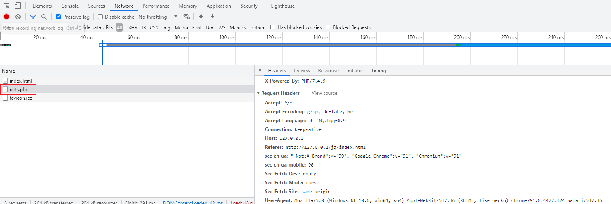
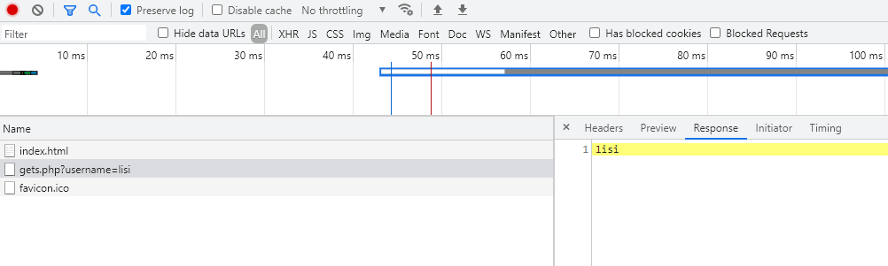

# Ajax 概述

Ajax 全称 Asynchronous Javascript And XML（异步JavaScript和XML），一般常用在网站中做无刷新请求。

早期数据请求：

- 客户端（浏览器）发送请求给服务端

- 服务端接受请求，返回响应数据给客户端
- 客户端显示相应数据页面

像之前学的 form 表单

~~~html
<form action="post.php">
    <input type="text" name="username" />
    <input type="submit" value="提交" />
</form>
~~~

> 当点击提交按钮时，服务器就会发送请求，并跳转到 post.php 页面

Ajax 技术可以让页面不进行跳转，就可以将请求发送到 post.php ，同时，还可以接受服务器返回的数据；例：

- 账号用户名唯一检测
- 短信验证码
- 模糊搜索提示
- 无刷新分页（瀑布流）

1998年微软公司（Microsoft）的Outlook Web Access第一次使用了ajax技术，允许客户端脚本发送HTTP请求，并随后集成在IE4.0中应用（XMLHTTP），到2005年，谷歌（Google）把Ajax成功应用于自家的多款Web系统中（Gmail邮箱、Google Map、Google 搜索建议）

## 1. Ajax 与传统请求区别

差异1：发送请求方式不同。

传统Web应用通过浏览器发送请求，而Ajax技术则是通过JavaScript的XmlHttpRequest对象。

差异2：服务器响应不同。

针对传统Web应用，服务器的响应是一个完整的页面，而采用Ajax技术后，服务器的响应只是需要的数据。

差异3：客户端处理的响应方式不同。

传统的Web应用发送请求后，浏览器将等待服务器响应完成后重新加载整个页面。而采用Ajax技术后，浏览器不再空闲等待请求的响应，而只是通过JavaScript动态更新页面中需要更新的部分。

## 2. Ajax 优缺点

优点：

1、通过异步模式，网页无刷新，提升了用户体验。

2、优化了浏览器和服务器之间的传输，减少不必要的数据往返，减少了带宽占用。

3、Ajax引擎在客户端运行，承担了一部分本来由服务器承担的工作，从而减少了大用户量下的服务器负载。

4、基于标准化的并被广泛支持的技术，不需要下载插件或者小程序。

缺点：

1、ajax不支持浏览器back按钮。

2、安全问题 AJAX暴露了与服务器交互的细节。

3、对搜索引擎的支持比较弱。

4、破坏了程序的异常机制。

5、不容易调试。

# Ajax 实现步骤

Ajax 运行环境必须在网站环境中运行（Node.js, PHP 等等），在页面中利用 Javascript 发送请求

## 1. 发送请求

创建 Ajax 对象

~~~js
var xhr = new XMLHttpRequest();
~~~

定义请求方法和请求地址

~~~js
xhr.open("get", "./gets.php");
~~~

发送请求

~~~js
xhr.send()
~~~

请求页面

~~~html
<!DOCTYPE html>
<html lang="en">
  <head>
    <meta charset="UTF-8" />
    <meta http-equiv="X-UA-Compatible" content="IE=edge" />
    <meta name="viewport" content="width=device-width, initial-scale=1.0" />
    <title>Document</title>
  </head>
  <body>
    
  </body>
</html>

~~~

当打开页面时，可以查看浏览器中的开发者选项，看到已经有 get 请求发送了

说明我们已经通过原生 js 在页面无刷新的情况下，发送了 ajax 请求到 gets.php

## 2. 响应页面 gets.php

但是现在没有响应数据，所以我们需要做一个 API 接口 gets.php，用来测试

~~~php
<?php
if (isset($_GET['username'])) {
    echo $_GET['username'];
}
~~~

现在重新修改一下请求 url

~~~js
xhr.open("get", "./gets.php?username=lisi");
~~~

重新刷新页面，可以看到已经可以得到响应数据了

## 3. 获取数据

获取服务端发送给客户端的相应数据

~~~js
xhr.onload = function(){
    console.log(xhr.responseText);
}
~~~

> 客户端 console 界面可以看到获得的数据

## 案例：检测用户名唯一

~~~html
<!DOCTYPE html>
<html lang="en">
  <head>
    <meta charset="UTF-8" />
    <meta http-equiv="X-UA-Compatible" content="IE=edge" />
    <meta name="viewport" content="width=device-width, initial-scale=1.0" />
    <title>Document</title>
  </head>
  <body>
    <form action="#" method="get">
      <input type="text" name="username" />
    </form>
    

    
  </body>
</html>
~~~

服务端验证

~~~php
<?php
if (isset($_GET['username'])) {
    if ($_GET['username'] == 'libai') {
        echo '用户已经注册，请重新输入';
    } else {
        echo '可以注册';
    }
}
~~~

当用户输入用户名 libai 后，input 框失去焦点后，会自动给出提示。

## 4. post 请求方式

post 请求方式除了需要将 xhr.open() 方式改为 post

~~~js
xhr.open("post", "posts.php");
~~~

还需要设置请求头格式

~~~js
xhr.setRequestHeader(
    "Content-Type",
    "application/x-www-form-urlencoded"
);
~~~

最后用 xhr.send() 将数据发送给服务端

~~~js
xhr.send("username=" + value);
~~~

目前大部分传送数据是以 json 格式传递的，请求头格式应该是

~~~js
xhr.setRequestHeader(
    "Content-Type",
    "application/json"
);
~~~

发送数据的时候也需要发送 json 数据

~~~js
xhr.send(JSON.stringify({username:value}))
~~~

PHP 接受 JSON 请求

~~~php
$data = json_decode(file_get_contents('php://input'), true);
var_dump($data);
~~~

## 案例：POST 方式验证用户名

~~~html
<!DOCTYPE html>
<html lang="en">
  <head>
    <meta charset="UTF-8" />
    <meta http-equiv="X-UA-Compatible" content="IE=edge" />
    <meta name="viewport" content="width=device-width, initial-scale=1.0" />
    <title>Document</title>
  </head>
  <body>
    <form action="#" method="get">
      <input type="text" name="username" />
    </form>
    

    
  </body>
</html>

~~~

后端

~~~php
<?php
if (isset($_POST['username'])) {
    if ($_POST['username'] == 'libai') {
        echo '用户已经注册，请重新输入';
    } else {
        echo '可以注册';
    }
}
~~~

## 5. Ajax 兼容性

浏览器标准不一样，得到的对象也不一样，我们也不知道客户使用什么样的浏览器，因此，我们需要解决兼容性问题；

IE 内核浏览器获取 ajax 对象所用的方法是 

~~~js
var xhr = new ActiveXObject('Microsoft.XMLHTTP');
~~~

封装一个兼容性代码，适用于多种浏览器

~~~js
//封装进函数供其他程序调用
function cXHR(){
    try{return new XMLHttpRequest()}catch(e){};
    try{return new ActiveXObject('Microsoft.XMLHTTP')}catch(e){};
}
~~~

将函数复制到文件 createXHR.js 内并保存，使用的时候引入该 js 即可

~~~html
//文件引入

~~~

# Ajax 对象属性

## 1. readyState - Ajax 状态码

因为网络延迟等问题，客户端有可能立即接受不到返回的数据，如：

~~~js
var xhr = new XMLHttpRequest();
xhr.open("get", "gets.php?username=libai");
xhr.send();
console.log(xhr.responseText);
~~~

后端模拟延迟响应

~~~php
<?php
// 延迟两秒响应
sleep(2);
if (isset($_GET['username'])) {
    if ($_GET['username'] == 'libai') {
        echo '用户已经注册，请重新输入';
    } else {
        echo '可以注册';
    }
}
~~~

此时，我们需要判断客户端是否已经完整接受到服务端发送过来的响应数据，可以通过服务端状态码 xhr.readyState 来进行判断：

0：表示对象已建立，但未初始化，只是 new 成功获取了对象，但是未调用 open 方法
1：表示对象已初始化，但未发送，调用了open方法，但是未调用send方法
2：已调用 send 方法进行请求
3：正在接收数据（接收到一部分），客户端已经接收到了一部分返回的数据
4：接收完成，客户端已经接收到了所有数据

状态码变化过程：

~~~js
var xhr = new XMLHttpRequest();
// 0 创建好了 ajax 对象，还没有对 ajax 对象进行设置
console.log(xhr.readyState);
xhr.open("get", "gets.php");
// 1 已经对 ajax 对象进行配置，还没有发送请求
console.log(xhr.readyState);

// 当 ajax 状态码发生变化的时候触发
xhr.onreadystatechange = function () {
    // 2 请求已发送
    // 3 已经接受到服务器端部分数据
    // 4 服务器端的响应数据已经接受完成
    console.log(xhr.readyState);
    // 当状态码为4的时候，就可以使用响应内容了
    if (xhr.readyState == 4) {
        console.log(xhr.responseText);
    }
};
~~~

其中 onreadystatechange 是一个触发事件，类似于 click 事件，这个事件是用来监听状态码发生变化的，当 readyState 发生变化时，该事件被触发，运行被绑定的 function() 函数。只有当状态码为 4 的时候，才可以正常使用数据，如：

~~~js
var xhr = new XMLHttpRequest();
xhr.open("get", "gets.php?username=libai");
xhr.send();
xhr.onreadystatechange = function () {
    if (xhr.readyState == 4) {
        console.log(xhr.responseText);
    }
};
~~~

之前我们使用的监听方法是 onload

~~~js
xhr.onload = function(){
    console.log(xhr.responseText);
}
~~~

两种方法区别：

|                          | onload | onreadystatechange |
| ------------------------ | ------ | ------------------ |
| 是否兼容 IE 低版本浏览器 | 不兼容 | 兼容               |
| 是否需要判断 Ajax 状态码 | 不需要 | 需要               |
| 被调用次数               | 一次   | 多次               |

> 鉴于很少有人使用 低版本 IE，所以一般使用 onload 就可以了

## 2. status - http 状态码

- 200 代表成功获取服务器端数据
- 301
- 404 未找到页面等等……
- 500

对 http 状态做判断

~~~js
if (xhr.status == 200){
    //
}
~~~

## 3. statusText 

http 响应状态文本

## 4. responseText

如果服务器端返回字符串，使用responseText进行接收

## 5. responseXML 

如果服务器端返回XML数据，使用responseXML进行接收

# Ajax 对象方法

## 1. open()

初始化Ajax对象

~~~js
open(method,url,[aycs])
~~~

- method: http请求方式，get/post
- url: 请求的服务器地址
- aycs: 同步与异步，true/false

## 2. setRequestHeader()

设置请求头信息，服务器端接收不到前端提交上来的数据时，一个可能的原因是请求头的 Content-Type 值没有正确设置。

~~~js
setRequestHeader(header,value)
~~~

- header ：请求头名称
- value ：请求头的值

默认值

~~~
xhr.setRequestHeader("Content-type", "text/plain; charset=utf-8");
~~~

设置 post 请求和编码方式

~~~
xhr.setRequestHeader("Content-type", "application/x-www-form-urlencoded; charset=utf-8");
~~~

设置 json 请求和编码方式

~~~
xhr.setRequestHeader("Content-type", "application/x-www-form-urlencoded; charset=utf-8");
~~~

发送 html 文本

~~~
xhr.setRequestHeader("Content-type", "text/html; charset=utf-8");
~~~

上传文件

~~~
xhr.setRequestHeader("Content-Type", "multipart/form-data; boundary=l3iPy71otz");
~~~

## 3. getAllResponseHeaders()

获取全部响应头信息

~~~js
xhr.getAllResponseHeaders()
~~~

## 4. getResponseHeader('key')

获取指定头信息

~~~js
xhr.getResponseHeader('key')
~~~

## 5. send()

发送 ajax 请求

~~~js
send([content])
~~~

- 如果是 get 请求，此参数为 null
- 如果是 post 请求，此参数为发送的数据

注意：所有相关的事件绑定必须在调用 send() 方法之前进行

# Ajax 错误处理

## 1. 请求错误

1、网络畅通，服务器端能接收到请求，服务器返回的结果不是预期结果。可以判断服务器端返回的状态码，分别进行处理。xhr.status获取http状态码

2、网络畅通，服务器端没有接收到请求，返回404状态码，检查请求地址是否错误。

3、网络畅通，服务器端能接收请求，服务器端返回500状态码。服务器端错误，找后端程序员进行沟通。

4、网络中断，请求无法发送到服务器端。会触发xhr对象下面的onerror事件，在onerror事件处理函数中对错误进行处理。

可以使用 onload 判断是否接受到相应数据

~~~html
<!DOCTYPE html>
<html>
  <head>
    <meta charset="utf-8" />
    <title>07Ajax错误处理.html</title>
  </head>
  <body>
    <button id="btn">发送Ajax请求</button>
    
  </body>
</html>
~~~

也可以直接用 onload 判断 ajax 对象接受到相应数据

~~~js
xhr.onload=function(){
    if(!xhr.status==200){
        alert("请求出错！")
    }
    console.log(xhr.responseText)
}
~~~

## 2. IE 缓存问题

低版本 IE 会有缓存问题，只有第一次发送请求会发送到服务器，之后的 Ajax 请求会从缓存中获取数据，即使服务端更新，客户端依旧从缓存中获取数据。

解决方法：每次请求携带随机参数（URL不唯一）

~~~js
xhr.open('gets.php', 'post.php?t=' + Math.random());
xhr.open('gets.php', 'post.php?t=' + new Date().getTime());
~~~

> 随机数虽然解决了问题，但是，我们不能保证每次生成的随机数都不一样；也就是说，使用随机数存在一定的隐患；建议用时间戳 + 随机值的方法

还可以通过设置客户端头部来禁用缓存

~~~js
//告诉客户端浏览器不要缓存数据
res.setHeader('Cache-Control','no-cache');
~~~

# 同步与异步

同步概念：按顺序执行，一件事情必须做完了，才可以做另外一件事

- 把大象放进冰箱

异步概念：效率执行，当处理某件事需要等待时，转做另一件事，直到等待时间结束回来继续处理。

- 烧水的同时做饭
- 下载的同时玩游戏

ajax 对象中 open 方法，可以控制同步/异步

~~~
open(method,url,[aycs])
~~~

> true 为同步，false 为异步

当同步时，发送请求，如果得不到回应会一直卡在等待请求，直到获得响应

~~~html

    
~~~

- 当同步时，t1 执行完毕后才会去执行 t2
- 当异步时，t1 在等待期间执行 t2

# Ajax 封装

如果一个页面中有十几个地方用到Ajax，那么我们需要写十几次open()、十几次send()、十几次获取xhr对象；代码重复相当多，我们可以将 Ajax 封装；

## 1. 封装参数设计

想要实现的效果：

~~~js
ajax()		// 调用函数就可以自动发送请求
~~~

参数设计

| 参数    | 说明                         |
| ------- | ---------------------------- |
| type    | 请求类型                     |
| url     | 请求地址                     |
| success | 成功后执行动作（自定义函数） |
| error   | 失败后执行动作（自定义函数） |

参数最好使用对象形式传递，最终函数调用应该是这样的：

~~~js
ajax({
    type:'get',
    url:'./gets.php',
    success: function(data){
        console.log(data)		// data 为响应数据
    },
    error: function(){}
})
~~~

## 2. 函数设计

~~~js
// options 为传递过来的对象参数
function ajax(options) {
    // 创建 xhr 对象
    var xhr = new XMLHttpRequest();
    // 配置 ajax 对象
    xhr.open(options.type, options.url);
    // 发送请求
    xhr.send();
    // 监听 xhr 对象 onload 事件
    // 当客户端接受完响应数据后触发
    xhr.onload = function () {
        console.log(xhr.responseText);
    }
}
~~~

引入 js 文件，调用 ajax() 代码

~~~html
<!DOCTYPE html>
<html lang="en">
  <head>
    <meta charset="UTF-8" />
    <meta http-equiv="X-UA-Compatible" content="IE=edge" />
    <meta name="viewport" content="width=device-width, initial-scale=1.0" />
    
    <title>Document</title>
  </head>
  <body>
    
  </body>
</html>
~~~

## 3. 自定义函数处理响应数据

这里这是纯显示响应数据，如果想要用户自己定义的函数来处理响应数据的话，需要做一个回调函数

~~~js
// options 为传递过来的对象参数
function ajax(options) {
    var xhr = new XMLHttpRequest();
    xhr.open(options.type, options.url);
    xhr.send();
    xhr.onload = function () {
        // susccess 为变量函数，即 success() 就可以执行
        // 将响应数据传到 success 函数中的参数 data，用户就可以对响应数据进行处理了
        options.success(xhr.responseText)
    }
}
~~~

在调用的时候加上 success 参数即可

~~~js
ajax({
    type: "get",
    url: "gets.php?username=libai",
    success: function (data) {
        console.log(data);
    },
});
~~~

## 4. 判断请求方式

目前封装函数只适用于 get 方式，不适用于 post 方式，我们需要对请求方式进行判断，并且请求数据也是写死的

- get 方式发送请求通过 `xhr.open()` 发送 url，并且请求参数就在 url 中
- post 方式发送请求通过 `xhr.send()` 发送请求参数，并且需要用 `xhr.setRequestHeader()` 来设置请求头

设计思路：

将请求参数传递到 ajax 函数内部，在函数内部根据请求方式的不同将请求参数放在不同的位置

- get 放在请求地址后
- post 放在 send 方法中

在参数设计中添加一个新的参数 data ，为用户传递的请求参数

~~~js
ajax({
    type:'get',
    url:'./gets.php',
    data:
    success: function(data){
        console.log(data)
    },
    error: function(){}
})
~~~

data 参数数据格式：

- 字符串类型：name=zhangsan&age=20
- Json 类型：{name: 'zhangsan', age: 20}

字符串类型不论是从书写还是以后的转换，都没有 JSON 格式方便，所以对于函数的调用者来说，JSON 格式的数据更加友好

当 data 传递参数是

~~~
data: {
	username: 'zhangsan'
}
~~~

ajax 函数

~~~js
// options 为传递过来的对象参数
function ajax(options) {
    xhr = new XMLHttpRequest();
    // 设置拼接参数变量
    var params = '';
    // 循环拼接所有参数
    for (var attr in options.data) {
        params += attr + '=' + options.data[attr] + '&';
    }
    // 解决最后多出来的&符号
    params = params.substr(0, params.length - 1);

    // 对 GET 请求方式的判断
    if (options.type == 'get') {
        // 将 GET 请求参数放入 
        options.url = options.url + '?' + params;
    }
    xhr.open(options.type, options.url);

    // 对 POST 请求方式判断
    if (options.type == 'post') {
        // POST 请求需要设置请求头
        xhr.setRequestHeader('Content-Type', 'application/x-www-form-urlencoded')
        // POST 请求参数发送
        xhr.send(params);
    } else {
        // 如果不是 POST 请求，则发送 null
        xhr.send(null);
    }
    xhr.onload = function () {
        options.success(xhr.responseText)
    }
}
~~~

## 5. 自定义传输数据类型

目前函数支持 GET 方式传递和 POST 表单数据传递，都是以对象键值对方式传递的，那么如果服务器设置只能接受 JSON 数据的话，我们还需要更改函数中的请求头参数，接下来会把这个请求也做成可以自定义选择的方式

参数变化

~~~js
ajax({
    type:'get',
    url:'./gets.php',
    data:{
        username: 'zhangsan'
    },
    // 新增 header 属性
    header: {
    	'Content-Type':'application/json'
},
    success: function(data){
        console.log(data)
    },
    error: function(){}
})
~~~

封装函数

~~~js
function ajax(options) {
    xhr = new XMLHttpRequest();
    var params = '';
    for (var attr in options.data) {
        params += attr + '=' + options.data[attr] + '&';
    }
    params = params.substr(0, params.length - 1);

    if (options.type == 'get') {
        options.url = options.url + '?' + params;
    }
    xhr.open(options.type, options.url);

    if (options.type == 'post') {
        // 用户希望向服务端传递的请求参数类型
        var contentType = options.header['Content-Type']
        xhr.setRequestHeader('Content-Type', contentType)
        if (contentType == 'application/json') {
            // 发送请求需要用字符串传递（JSON 格式的字符串）
            xhr.send(JSON.stringify(data))
        } else {
            // 否则用 POST 方式传递
            xhr.send(params);
        }
    } else {
        // 再否则用 get 方式传递空值
        xhr.send(null);
    }
    xhr.onload = function () {
        options.success(xhr.responseText)
    }
}
~~~

## 6. 对响应结果进行判断

在返回数据的时候，最好对状态码进行一个判断，当状态码为200的时候，才可以正常返回数据，否则返回失败信息

~~~js
    xhr.onload = function () {
        if (xhr.status == 200){
            options.success(xhr.responseText, xhr)
        } else{
            options.error(xhr.responseText, xhr)
        }
    }
~~~

在结果返回的时候，将 xhr 对象也返回过去，可以查看更多的信息，那么在调用函数的时候，参数也需要添加形参

~~~js
ajax({
    type:'get',
    url:'./gets.php',
    data:{
        username: 'zhangsan'
    },
    header: {
    	'Content-Type':'application/json'
},
    success: function(data, xhr){
        console.log(data)
    },
    error: function(data, xhr){
        // 可以返回响应信息
        console.log(data)
        // 也可以返回 xhr 对象中的一些属性
        console.log(xhr.status)
    }
})
~~~

## 7. 返回结果

一般网站响应结果给出的都是 JSON 格式字符串，为了客户端更好的解析输出，我们可以将字符串转为 JSON 格式数据，以便于后续遍，可以通过服务端响应头中查看响应数据类型，通过 xhr.getResponseHeader() 查看

~~~js
xhr.getReponseHeader('Content-Type')
~~~

返回结果

~~~
application/json; charset=utf-8
~~~

完善函数

~~~js
    xhr.onload = function () {
        // 获取响应头数据类型信息
        var conentType = xhr.getResponseHeader('Content-Type')
        var responseText = xhr.responseText
        // 判断返回数据是否为 JSON 格式
        if (contentType.includes('application/json')) {
            // 将 JSON 字符串转换为 JSON 对象
            responseText = JSON.parse(responseText)
        }
        if (xhr.status == 200) {
            // 替换转换后的数据
            options.success(responseText, xhr)
        } else {
            options.error(responseText, xhr)
        }
    }
~~~

## 8. 设置参数默认值

函数基本封装完成，但是每次调用都要把所有参数都写上，稍微有点麻烦，我们可以再完善一下，每次调用只需要写上需要的参数即可

在函数中定义一个对象，这个对象就是调用函数的默认参数，如果用户传递参数，那么就替换函数中定义的对象属性

~~~js
    var defaults = {
        type: 'get',
        url: '',
        data: {},
        header: {
            'Content-Type': 'application/x-www-form-urlencoded'
        },
        success: function () { },
        error: function () { },
    }
~~~

然后用 Object.assign() 方法进行深拷贝，将传过来的对象参数覆盖默认参数

~~~js
    Object.assign(defaults, options)
~~~

最后，将所有的 options 换成 defaults 即可，完整代码

~~~js
function ajax(options) {

    // 定义默认参数
    var defaults = {
        type: 'get',
        url: '',
        data: {},
        header: {
            'Content-Type': 'application/x-www-form-urlencoded'
        },
        success: function () { },
        error: function () { },
    }
    // 深拷贝，用 options 中的属性覆盖 defaults 中的属性
    Object.assign(defaults, options)

    xhr = new XMLHttpRequest();
    var params = '';
    // 所有 options 参数替换为 defaults 默认参数
    for (var attr in defaults.data) {
        params += attr + '=' + defaults.data[attr] + '&';
    }
    params = params.substr(0, params.length - 1);

    if (defaults.type == 'get') {
        defaults.url = defaults.url + '?' + params;
    }
    xhr.open(defaults.type, defaults.url);

    if (defaults.type == 'post') {
        var contentType = defaults.header['Content-Type']
        xhr.setRequestHeader('Content-Type', contentType)
        if (contentType == 'application/json') {
            xhr.send(JSON.stringify(data))
        } else {
            xhr.send(params);
        }
    } else {
        xhr.send(null);
    }
    xhr.onload = function () {
        var contentType = xhr.getResponseHeader('Content-Type')
        var responseText = xhr.responseText
        if (contentType.includes('application/json')) {
            responseText = JSON.parse(responseText)
        }
        if (xhr.status == 200) {
            defaults.success(responseText, xhr)
        } else {
            defaults.error(responseText, xhr)
        }
    }
}
~~~

这时候，直接调用

~~~html
    
~~~

## 9. 兼容性

最后把兼容性也封装进去

~~~js
// 兼容性
function cXHR() {
    try { return new XMLHttpRequest() } catch (e) { };
    try { return new ActiveXObject('Microsoft.XMLHTTP') } catch (e) { };
}
~~~

创建 ajax 对象的时候，调用该函数即可

~~~js
var xhr = new cXHR();
~~~

# 案例：完善用户名注册唯一性

- 获取文本框内容，并为其添加离开焦点
- 离开焦点，向服务端发送请求
- 获得相应数据，添加文字提示

~~~html
<!DOCTYPE html>
<html lang="en">
  <head>
    <meta charset="UTF-8" />
    <meta http-equiv="X-UA-Compatible" content="IE=edge" />
    <meta name="viewport" content="width=device-width, initial-scale=1.0" />
    <title>Document</title>
    <!-- 引入 ajax 封装js文件 -->
    
  </head>
  <body>
    <form action="#">
      <input type="text" name="username" />
    </form>
    

    
  </body>
</html>

~~~

# 案例：搜索框内容自动提示

类似于模糊搜索的一个功能，各个网站都很常见，实现思路：

- 获取 Search 并添加输入事件
- 获取用户关键字
- 向服务器端发送请求并携带关键字作为请求参数
- 将响应数据显示在搜索框底部
- 防抖处理

模板

~~~html
<!DOCTYPE html>
<html lang="en">
  <head>
    <meta charset="UTF-8" />
    <meta http-equiv="X-UA-Compatible" content="IE=edge" />
    <meta name="viewport" content="width=device-width, initial-scale=1.0" />
    <link rel="stylesheet" href="./bootstrap.min.css" />
    
    <title>Document</title>
  </head>
  <body>
    

      

        <input
          type="text"
          class="form-control"
          placeholder="请输入关键字"
          id="search"
        />
        <ul class="list-group" id="list-box">
          <li class="list-group-item">提示文字显示的地方</li>
        </ul>
      

    

    
  </body>
</html>

~~~

代码实现

~~~html
<!DOCTYPE html>
<html lang="en">
  <head>
    <meta charset="UTF-8" />
    <meta http-equiv="X-UA-Compatible" content="IE=edge" />
    <meta name="viewport" content="width=device-width, initial-scale=1.0" />
    <link rel="stylesheet" href="./bootstrap.min.css" />
    
    <title>Document</title>
  </head>
  <body>
    

      

        <input
          type="text"
          class="form-control"
          placeholder="请输入关键字"
          id="search"
        />
        <ul class="list-group" id="list-box">
          <li class="list-group-item">提示文字显示的地方</li>
        </ul>
      

    

    
    
  </body>
</html>

~~~

防抖处理，防止每次输入都会触发请求，输入后延迟800ms后触发

~~~js
// 初始化 timer
timer = null;
input.oninput = function () {
    // 清空上一次 timer
    clearTimeout(timer);
    var key = this.value;
    // 定时器800ms执行
    timer = setTimeout(() => {
        ajax({
            url: "./search.php",
            data: {
                key: key,
            },
            success: function (data) {
                li.innerText = data;
                listBox.style.display = "block";
            },
        });
    }, 800);
};
~~~

另外当用户清空输入框的时候，让输入框隐藏

~~~js
// 当输入框没有文字的时候清空下拉栏
if (key.trim().length == 0) {
    listBox.style.display = "none";
    // 阻止程序向下执行
    return;
}
~~~

~~~html
<!DOCTYPE html>
<html lang="en">
  <head>
    <meta charset="UTF-8" />
    <meta http-equiv="X-UA-Compatible" content="IE=edge" />
    <meta name="viewport" content="width=device-width, initial-scale=1.0" />
    <link rel="stylesheet" href="./bootstrap.min.css" />
    
    <title>Document</title>
  </head>
  <body>
    

      

        <input
          type="text"
          class="form-control"
          placeholder="请输入关键字"
          id="search"
        />
        <ul class="list-group" id="list-box">
          <li class="list-group-item">提示文字显示的地方</li>
        </ul>
      

    

    
    
  </body>
</html>

~~~

# FormData

当 ajax 发送请求参数（data）比较多的时候，另外普通 ajax 请求是不能发送二进制文件的，我们可以使用 FormData 对象

FormData 作用

- 模拟 HTML 表单，相当于将 HTML 表单映射成表单对象，自动将表单对象中的数据拼接成请求参数格式
- 异步上传二进制文件

## 1. 使用 FormData

准备 HTML 表单，

- 需要有 name 属性，用于对参数进行映射
- 不需要 action 与 method（Ajax 表单提交）
- 按钮不需要提交动作，不能是 submit 类型

~~~html
<form id="form">
    <input type="text" name="username" />
    <input type="text" name="password" />
    <input type="button" value="提交" id="btn" />
</form>
~~~

将 HTML 表单转换为 Form 对象

~~~js
var form = document.getElementById("form");
var formData = new formData(form);
~~~

提交表单对象

~~~js
xhr.send(formData);
~~~

由于提交数据是用 xhr.send()，所以 formData 不适用于 GET 方法

~~~html
<!DOCTYPE html>
<html lang="en">
  <head>
    <meta charset="UTF-8" />
    <meta http-equiv="X-UA-Compatible" content="IE=edge" />
    <meta name="viewport" content="width=device-width, initial-scale=1.0" />
    <title>Document</title>
  </head>
  <body>
    <form action="#" id="form">
      <input type="text" name="username" />
      <input type="text" name="password" />
      <input type="button" value="提交" id="btn" />
    </form>

    
  </body>
</html>

~~~

## 2. FormData 实例方法

获取表单中的属性值，formData 为 FormData 的实例

~~~js
formData.get('key')
~~~

例：

~~~js
console.log(formData.get("username"));
~~~

设置表单属性值

~~~js
formData.set('key', 'value')
~~~

> 如果有对应表单存在，set 方法替换新数据，如果没有则增加新的字段

应用场景：

- 添加发布时间（当前时间）
- 对数据的二次处理（保留小数）

删除表单中的属性值

~~~js
formData.delete('key')
~~~

追加属性值

~~~js
formData.append('key', 'value')
~~~

> 服务端默认接受最后一个参数，但是通过 F12 查看 POST 请求，有两个相同名字的表单数据传递

## 3. 二进制上传

~~~html
<form action="#" id="form">
    <input type="file" id="file" />
    
~~~

文件上传进度条

~~~js
xhr.upload.onprogress = function(ev){
    bar.style.width = (ev.loaded / ev.total) * 100 + '%'
}
~~~

FormData 文件上传图片即时预览

当图片上传到服务器后，让后端将 image 地址作为响应数据传递到客户端，客户端可以从响应数据中拿到文件 Path 并显示在前端

# JSONP

## 1. Ajax 请求限制

Ajax 只能向自己的服务器发送请求，比如现在有一个 网站A， 有一个网站B。A网站中的 HTML 文件只能向 A 网站服务器中发送 Ajax 请求，B网站中的 HTML 文件只能向 B 网站中发送 Ajax 请求，但是 A 网站是不能向 B 网站发送 Ajax 请求的。同理，B 网站也不能向 A 网站发送 Ajax 请求。

但是往往有时候我们需要调用别人网站的 API，比如：

- 天气情况
- 短信 API

## 2. 同源/跨域

所谓同源，就是多个请求或者页面是否来自同一个服务器端。如果两个页面拥有相同的协议、域名和端口，那么这两个页面就属于同一个源，只要其中有一个不同，就是不同源。

同源：

~~~
https://www.forece.net/1.html
https://www.forece.net/post/1.html
~~~

不同源

~~~
https://www.forece.net/1.html
https://forece.net/1.html				// 域名不同
https://v2.forece.net/1.html			// 域名不同
https://www.forece.net:81/1.html		// 端口不同
http://www.forece.net/1.html			// 协议不同
~~~

同源政策的目的

同源政策是为了保证用户信息的安全，防止恶意的网站窃取数据，最初的同源政策是指A网站在客户端设置的 Cookie，B网站是不能访问的。

随着互联网的发展，同源政策也越来越严格，在不同源的情况下，其中一项规定就是无法向非同源地址发送 Ajax 请求，如果请求，浏览器就会报错

当发送非同源请求时，浏览器 console 页面会报错

~~~
Access to XMLHttpRequest at 'https://www.xxx.net/?' from origin 'http://127.0.0.1' has been blocked by CORS policy: No 'Access-Control-Allow-Origin' header is present on the requested resource.
~~~

## 3. JSONP

Web 页面上调用 js 文件时则不受是否跨域的影响，如：

~~~html

~~~

不仅如此，我们还发现凡是拥有"src"这个属性的标签都拥有跨域的能力，比如 script、img、iframe，src 的能力就是把远程的数据资源加载到本地（图片、JS代码等）

## 4. JSONP 跨域请求

所以通过 JSONP ，我们可以实现跨域的请求

先将请求地址放在 src 标签中

~~~html

~~~

前端定义一个函数

~~~js
function fn(data) {
    console.log(data);
}
~~~

Node.js 后端返回一个函数字符串

~~~js
  app.get("/test", (req, res) => {
    const result = 'fn({name:"zhangsan"})';
    res.send(result);
  });
~~~

当客户端加载页面后，实际上就对 `http://localhost:3001/test` 进行了跨域请求

- 后端返回函数的调用的字符串
- 前端定义这个函数

> 相当于后端执行了 `fn({name:"zhangsan"})` 这段前端定义的代码，形成一个回调函数

## 5. JSONP 代码优化

有些情况，前端开发人员不能掌控后端，如果前端定义的名字与后端返回函数名字不一致，那么响应中的函数就不会被执行。所以前后端函数名必须一致。为了不改来改去，我们可以将前端定义的函数名字传递给后端。

将 src 中的请求地址加上 callback 参数，如：

~~~html

~~~

> callback 参数就是定义的函数名字

后端只要将这个 GET 请求参数与需要调用的函数参数进行拼接就可以实现函数名的传递

~~~js
  app.get("/test", (req, res) => {
      // 获得 callback 参数
    const fnName = req.query.callback;
    const result = fnName + '({name:"zhangsan"})';
    res.send(result);
  });
~~~

之后如果前端函数名称需要改动，就不用要求后端人员修改代码了：

~~~html

~~~

> 只需要修改前端函数定义名，与请求地址中的callback参数名即可

## 6. JSONP 动态请求

目前的 JSONP 在加载页面的同时会立即执行，如果想让这个 JSONP 请求可以根据用户动作来进行执行的话（比如点击按钮），就不能在页面中书写 src 请求，需要让 js 创建 src 标签进行动态加载。

创建一个按钮

~~~html
<button id="btn">发送请求</button>
~~~

获取按钮元素，并添加事件

~~~js
var btn = document.getElementById('btn')
btn.onclick = function(){
    // 创建 script 标签
    script = document.createElement('script')
    // 设置 src 属性
    script.src = 'http://localhost:3001/test?callback=fn'
    // 将 script 标签追加到页面中
    document.body.appendChild(script)
}
~~~

如果在页面中进行多次调用，会造成 src 标签不断累计在页面中的效果。所以当 src 请求被发送后，直接销毁就可以了。如果需要调用，那么就再加载，然后再销毁。实现原理就是用 onload 事件监听 script 什么时候被加载完成，然后执行销毁动作即可。

~~~js
var btn = document.getElementById('btn')
btn.onclick = function(){
    script = document.createElement('script')
    script.src = 'http://localhost:3001/test?callback=fn'
    document.body.appendChild(script)
    // 加载完毕后，删除 script 标签
    script.onload = function () {
        document.body.removeChild(script);
    };
}
~~~

## 7. 封装 JSONP

为了代码简洁，减少冗余，方便调用，我们对 JSONP 进行封装

先将刚才实现的代码拿过来

~~~js
function jsonp() {
    script = document.createElement("script");
    script.src = "http://localhost:3001/test?callback=fn";
    document.body.appendChild(script);
    script.onload = function () {
        document.body.removeChild(script);
    };
}
~~~

分析哪些是需要动态调用（需要传参）

- src 地址

和之间 ajax 封装一样，最好写成对象的方式

~~~js
{url:'http://localhost:3001/test?callback=fn'}
~~~

那么目前就是这么一个参数，我们用 options 当做参数名

~~~js
function jsonp(options) {
    script = document.createElement("script");
    script.src = options.url;
    document.body.appendChild(script);
    script.onload = function () {
        document.body.removeChild(script);
    };
}
~~~

那么现在实现调用就方便多了：

~~~js
function fn(data) {
    console.log(data);
}

var btn = document.getElementById('btn')
btn.onclick = function(){
    jsonp({
        url:'http://localhost:3001/test?callback=fn'
    })
}
~~~

接下来继续优化：

- callback 方法名被写死，无法灵活调用指定方法
- 发送一个请求需要用到两个函数，fn 和 jsonp，不能一眼就看出哪个请求和哪个函数是关联的

解决方案：

- 定义随机函数名
- 将定义函数像 ajax 中的 success 参数一样写在 jsonp 函数中

先解决两个函数的问题，在参数中定义一个 success 函数，因为需要函数名才可以调用，所以需要将 success 函数变为全局函数

~~~js
btn.onclick = function () {
    jsonp({
        url: "http://localhost:3001/test?callback=fn",
        // 定义 success 函数
        success:function(data){
            console.log(data);
        }
    });
};

function jsonp(options) {
    script = document.createElement("script");
    // 让 success 中的函数变为全局函数
    window.fn = options.success
    script.src = options.url;
    document.body.appendChild(script);
    script.onload = function () {
        document.body.removeChild(script);
    };
}
~~~

url 也可以直接写上请求地址，然后参数我们进行拼接

~~~js
btn.onclick = function () {
    jsonp({
        url: "http://localhost:3001/test",
        success:function(data){
            console.log(data);
        }
    });
};

function jsonp(options) {
    script = document.createElement("script");
    // 让 success 中的函数变为全局函数
    window.fn = options.success
    script.src = options.url+'?callback=fn';
    document.body.appendChild(script);
    script.onload = function () {
        document.body.removeChild(script);
    };
}
~~~

当页面上有多个按钮时，对不同按钮都绑定 JSONP 请求，但是 success 方法不同，如果出现网络延迟，那么后点击按钮中的 sucess 方法会覆盖掉先点击中绑定的方法。主要原因还是因为请求地址相同，调用相同的方法。

创建随机名

~~~js
var fnName = 'myjsonp' + Math.random().toString().replace('.', '')
~~~

添加全局变量

~~~js
window[fnName] = options.success
~~~

> 不可以利用对象形式添加，如 window.fnName，因为这样只会在 window 中添加一个叫做 fnName 的属性，而不会将 fnName 当做变量

修改 src 地址

~~~
script.src = options.url + 'callback=?' + fnName
~~~

## 8. JSONP 发送参数

目前的 JSONP 只是发送请求，但是没有携带任何参数，如果想要携带参数发送请求的话，那么还需要在参数中定义 data 属性

- options 中定义 data 参数
- jsonp 是 get 请求，需要将 data 中的对象类型参数转换为字符串格式 &xxx=xxx&age=20 这样的格式

~~~js
jsonp({
    url: "http://localhost:3001/test?callback=fn",
	data:{
        username:'zhangsan',
        age:20,
    },
    success: function (data) {
        console.log(data);
    },
});
~~~

JSONP 拼接 url

~~~js
var params = '';
for (var attr in options.data){
    params += '&' + attr + '=' + options.data[attr];
}
~~~

最后将参数拼接在 src 地址中

~~~js
script.src = options.url + 'callback=?' + fnName + params;
~~~

完整封装文件 jsonp.js

~~~js
function jsonp(options) {
    script = document.createElement("script");
    var fnName = "myjsonp" + Math.random().toString().replace(".", "");
    window[fnName] = options.success;
    var params = "";
    for (var attr in options.data) {
        params += "&" + attr + "=" + options.data[attr];
    }
    script.src = options.url + "?callback=fn" + fnName + params;
    document.body.appendChild(script);
    script.onload = function () {
        document.body.removeChild(script);
    };
}
~~~

调用方法：

~~~html

~~~

 

# CORS 跨域资源共享

## 1. 后端修改配置允许跨域访问请求

CORS 全称：Cross-origin resource sharing， 即跨域资源共享，它允许浏览器向跨域服务器发送 Ajax 请求，克服了 Ajax 只能同源使用的问题。

主要是服务端修改配置，允许客户端做跨域请求

浏览器端自动请求头包含 origin 字段标明来源

~~~
origin: http://localhost:3000
~~~

> 只有在跨域请求时才有的字段

浏览器响应头

~~~
Access-Control-Allow-Origin： 'http://localhost:3000'    // 只有来自该地址的请求可以访问
Access-Control-Allow-Origin： '*'						// 允许任何客户端访问
~~~

客户端无需做改变，模拟从 localhost:3000 发送请求到 localhost:3001

~~~js
ajax({
    type:'get',
    url:'http://localhost:3001/cross',
    success: function(data){
        console.log(data)
    }
})
~~~

Node.js 修改后端配置

~~~js
app.get('/cross',(req,res)=>{
    // 设置响应头，允许所有客户端的请求
    res.header('Access-Control-Allow-Origin', '*')
    // 设置允许客户端的请求方式
    res.header('Access-Control-Allow-Method','get,post')
    res.send('OK')
})
~~~

使用中间件拦截所有请求，匹配所有路由

~~~js
app.use((req, res, next) =>{
    res.header('Access-Control-Allow-Origin', '*')
    res.header('Access-Control-Allow-Method','get,post')
    next();
})
~~~

## 2. 服务端跨域访问

同源限制是浏览器给 Ajax 的限制，服务器端是没有同源限制的。

所以可以通过客户端给同源服务端发送请求，然后利用服务端访问跨域资源，处理返回的数据，然后再返回给客户端。即让同源服务端做一个中转来达到跨域访问的结果。

客户端只需要给同源服务端发送一个请求：

~~~js
ajax({
    type:'get',
    url:'http://localhost:3000/server',
    success: function(data){
        console.log(data)
    }
})
~~~

相当于同源服务端做了一个爬虫工具拿到数据后返回给客户端，服务端需要安装 request 模块

~~~
npm install request
~~~

在路由中导入

~~~js
const request = require('request');
~~~

使用 request 模块获取数据，语法：

~~~js
request('url', function(error, response, body){
    console.log('error:',error);
    cosnole.log('statusCode:', statusCode);
    console.log('body:' body);
});
~~~

通过服务端访问跨域资源

~~~js
app.get('/server',(req, res)=>{
    request('http://localhost:3001/cross', function(error, response, body){
        res.send(body);
    })
})
~~~

## 3. 跨域请求携带 Cookie

在使用 Ajax 技术发送跨域请求时，默认情况下不会在请求中携带 cookie 信息， ajax 对象中有个数据 withCredential，默认为 false，它决定着 ajax 请求发送是否携带 cookie 信息。

登录页面

~~~html
<!DOCTYPE html>
<html lang="en">
  <head>
    <meta charset="UTF-8" />
    <meta http-equiv="X-UA-Compatible" content="IE=edge" />
    <meta name="viewport" content="width=device-width, initial-scale=1.0" />
    <link rel="stylesheet" href="./bootstrap.min.css" />
    
    <title>Document</title>
  </head>
  <body>
    

      <form id="loginForm">
        

          <label>用户名</label>
          <input
            type="text"
            name="username"
            class="form-control"
            placeholder="请输入用户名"
          />
        

        

          <label>密码</label>
          <input
            type="text"
            name="password"
            class="form-control"
            placeholder="请输入密码"
          />
        

        <input
          type="button"
          value="登录"
          class="btn btn-default"
          id="loginBtn"
        />
        <input
          type="button"
          value="检测用户登录状态"
          class="btn btn-default"
          id="checkLogin"
        />
      </form>
    

  </body>
</html>
~~~

ajax 发送请求

~~~html

~~~

另外还需要在服务端设置响应头

| 响应头                          | 说明                                                       |
| ------------------------------- | ---------------------------------------------------------- |
| Access-Control-Allow-Origin     | 如果涉及到 cookie 信息传递，值不可以为 '*'，需要是具体地址 |
| Access-Control-Allow-Method     | 允许的请求方法                                             |
| Access-Control-Allow-Credential | 是否允许携带 Cookie 信息                                   |

 Access-Control-Allow-Credential 为 true，才可以使 ajax 发送请求携带 cookie 信息

~~~js
// 中间件拦截所有请求（通配所有地址）
app.use((req, res, next) =>{
    res.header('Access-Control-Allow-Origin', '*')
    res.header('Access-Control-Allow-Method','get,post')
    res.header('Access-Control-Allow-Credential','true')
    next();
})
~~~

# jQuery Ajax

## 1. $.ajax()

jQuery 已经封装好了 Ajax 请求方法，如：

~~~js
$.ajax({
    //
})
~~~

> 调用 $ 顶级对象中的 ajax 方法

对象参数：

~~~
async： 	     	布尔类型，代表是否异步，true代表异步，false同步，默认为true
cache：      	是否缓存，布尔类型，true代表缓存，false代表不缓存，默认为true
complete：    	当Ajax状态码（readyState）为4的时候所触发的回调函数
contentType： 	发送信息至服务器时内容编码类型；(默认: "application/x-www-form-urlencoded") 
data： 			要求是一个字符串格式，Ajax发送时所传递的数据
dataType：		期待的返回值类型，可以是text，xml，json，默认为text类型
success： 		当Ajax状态码为4且响应状态码为200时所触发的回调函数
type： 			Ajax发送网络请求的方式，(默认: "GET")；
url：			请求的url地址
~~~

其中参数和之前自己封装的 Ajax 格式类似:

~~~js
$.ajax({
    type:'get',
    url:'http://www.example.com',
    data:{
        name:'zhangsan',
        age: '20'
    },
    contentType: 'application/x-www-form-urlencoded',
    beforeSend: function(){
        return false
    },
    success: function(response){},
    error: function(error){}
})
~~~

关于 data 参数，可以传递各种格式，不过GET或POST请求最终都会以字符串方式发送（内部会默认转换）

~~~
// 字符串格式
data: 'username=zhangsan&age=20'

// 对象格式
data: {
	name: 'zhangsan',
	age: '20'
}

// JSON格式（contentType 也要改变为 JSON 方式）
data: JSON.stringify({
	name: 'zhangsan'
	age: '20'
})
~~~

beforeSend 属性是一个匿名函数，它是在发送数据请求到服务端之前执行的一个函数

- 验证通过然后 return true;  会继续执行发送请求
- 验证不通过 return false; 不会执行发送请求

> 一般用于对数据的验证，或者显示等待图标等

jQuery 中的 ajax 会对服务端返回的响应数据做预处理，自动判断数据类型，如果服务端返回的是 JSON 数据，那么 ajax 对象会自动将数据转换为 JSON 数据类型，可以直接在 success 里的函数中操作

~~~
success: function(data){
	// data 为 JSON 数据
}
~~~

## 2. serialize 方法

jQuery 中有个 serialize 方法，可以将表单中提交的参数自动拼接成字符串形式，如：

~~~html

<form id="form">
    <input type="text" name="username" />
    <input type="password" name="password" />
    <input type="submit" value="递交" id="btn" />
</form>

~~~

## 3. seralizeObject()

serializeObject 并不是一个原生方法，而是我们自定义的函数，目的是将表单内容转换为 Object 类型

~~~js

~~~

## 4. jsonp 请求

在 jQuery 中的 ajax 方法也封装了 jsonp 请求，需要在 ajax 对象中设置 dataType 为 jsonp，如：

~~~js
$.ajax({
    url:'http://www.example.com',
    dataType: 'jsonp',
    success: function(data){
        console.log(data)
    }
})
~~~

默认参数：

- jsonp
- jsonCallback

jsonp 用修改 请求 url 中 callback 的参数命的，一般用于某些网站不是使用默认 callback 来调用函数，如：

~~~
http://www.example.com?cb=fn
~~~

jsonCallback 是用来修改 url 中 callback 的参数值（函数名称）

~~~
http://www.example.com?cb=fnName
~~~

~~~js
$.ajax({
    url:'http://www.example.com',
    dataType: 'jsonp',
    // 修改 callback 参数名称
    jsonp: 'cb',
    // 指定函数名称
    jsonCallback: 'fnName',
    success: function(data){
        console.log(data)
    }
})
~~~

## 5. jQuery Ajax 上传文件

还是利用 FormData 将表单上传

~~~html
<input type="file" name="photo" id="photo" value="" placeholder="免冠照片">
<input type="button" onclick="postData();" value="下一步" name="" style="width:100px;height:30px;">
~~~

~~~html

~~~

