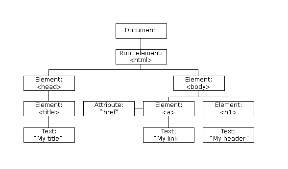

# 一、脚本工具

很久之前，在 PC 端我们其实就已经接触到了脚本工具，那时候，我们管这种工具叫做外挂。比如自动跑图、自动跑任务、自动打怪，我们都可以将这些外挂看做自动化脚本工具，随着移动端的流行，脚本工具也涉及到了手机端。这类工具有很多，比如：

- 按键精灵（老牌工具，支持 iOS、Android 双平台，但是需要 root 权限）
- 触动精灵
- AutoJs（不支持低版本安卓系统 5.0 - 6.0）
- JsDroid
- 节点精灵
- EasyClick
- AirtestIDE（需要连线PC端）


Auto.js 是最近比较流行的一款脚本工具，开发简单，只需要一点点的 Javascript 编程基础就可以进行开发了。


编写自动化脚本

- 删除微信僵尸好友
- 自动签到
- 抢秒杀产品
- 微信跳一跳、开心消消乐等自动外挂


# 二、准备工具

## 1. Auto.js 手机 APP

Auto.js Pro 官方网站：https://pro.autojs.org/

Auto.js 作者 Github：https://github.com/hyb1996/


免费版：4.11

目前免费版已经停止维护更新了，不过由于是免费的，还是有很多人在用，下载的地方有很多，百度随便搜下就可以了。实在找不到我到时候放网盘里。


收费版：Auto.Js Pro

购买地址：https://shop218793855.taobao.com/

> 收费版目前价格 45 元终身使用，价格不算太高，可以支持一下作者。


安装完 Auto.js 后，需要做一些设置：

- 需要开启无障碍
- 需要开启悬浮窗权限
- 音量上键停止所有脚本


## 2. Visual Studio Code

下载地址：https://code.visualstudio.com/

VS Code 是一款微软开发的编辑器，也可以当做 IDE 来使用，里边的 Auto.js 插件功能可以让我们更加方便的开发 Auto.js 脚本。


插件搜索：autojs 

找到里边作者 hyb1996 官方作者开发的插件，由于免费版的 Auto.js 已经停止开发，所以其中有几个基于免费版的插件是其他大神根据原插件进行的二次开发，增加了一些功能。


auto.js 插件快捷键

~~~
按 Ctrl+Shift+P 或点击"查看"->"命令面板"可调出命令面板，输入 Auto.js 可以看到几个命令：

打开文档(Open Document)： 打开Auto.js离线开发文档
开启服务(Start Server)： 启动插件服务。之后在确保手机和电脑在同一区域网的情况下，在Auto.js的侧拉菜单中使用连接电脑功能连接
停止服务(Stop Server)： 停止插件服务
运行脚本(Run)： 运行当前编辑器的脚本。如果有多个设备连接，则在所有设备运行
重新运行(Rerun)： 停止当前文件对应的脚本并重新运行。如果有多个设备连接，则在所有设备重新运行
停止当前脚本(Stop)： 停止当前文件对应的脚本。如果有多个设备连接，则在所有设备停止
停止所有脚本(Stop All)： 停止所有正在运行的脚本。如果有多个设备连接，则在所有设备运行所有脚本
保存到所有设备(Save)： 保存当前文件到手机的脚本默认目录（文件名会加上前缀remote)。如果有多个设备连接，则在所有设备保存
在指定设备运行脚本(Run On Device)： 弹出设备菜单并在指定设备运行脚本
保存到指定设备(Save On Device)： 弹出设备菜单并在指定设备保存脚本
新建项目(New Project)： 选择一个空文件夹（或者在文件管理器中新建一个空文件夹），将会自动创建一个项目
运行项目(Run Project)： 运行一个项目，需要Auto.js 4.0.4Alpha5以上支持
保存项目到设备(Save Project)： 保存一个项目，需要Auto.js 4.0.4Alpha5以上支持
~~~


Auto.js 连接手机到电脑

在 VS Code 中打开服务，然后在手机端运行 Auto.js 在菜单栏中找到连接电脑，输入电脑IP就可以连接到电脑了。


# 三、开发脚本

免费版开发文档：https://hyb1996.github.io/AutoJs-Docs/#/

Pro 版本开发文档：https://pro.autojs.org/docs/#/?id=%e7%bb%bc%e8%bf%b0


## 1. Hello World

代码：

~~~javascript
toastLog("Hello World");
~~~


运行：

打开控制面板 CTRL+SHIFT+P，然后运行程序，或者按F5也可以直接运行。在下方的 Output 中可以看到输出结果，打开 VSCode - 帮助 - 开发者工具，进入到 Console 也可以看到执行结果。


## 2. Js 基础

### 2.1 定义变量

~~~javascript
var i = 0;  //定义一个数字
var 字符串 = "Hello";  //字符串
var 数组 = [];
var 对象 = {};
var flag = true;
~~~


var 为定义关键词，类似关键词还有 const、let

~~~
const -  定义的变量不可以修改，而且必须初始化
var - 定义的变量可以修改，可以不初始化，没有初始化输出 undefined
let - 块级作用于，函数内部使用let定义后，对函数外部无影响
~~~


### 2.2 输出方式

~~~javascript
console.log(字符串);  // 控制台输出，可以直接用 log();
toast(字符串);
toastLog(字符串);
~~~


###  2.3 对字符串的操作

https://www.cnblogs.com/jiangcheng-langzi/p/7208390.html

https://www.cnblogs.com/sugartang/p/11373954.html


### 2.4 流程控制

while、for、switch、continue、break


### 2.5 条件语句

if、else、elseif


### 2.6 数组操作方法

https://www.jianshu.com/p/22a4c0b514fa


### 2.7 函数的定义和参数


### 2.8 对象的操作


## 3. 设备函数

设备对象 device

~~~
console.log(device);
~~~

> 可以返回设备的各种信息，包括宽、高、品牌等信息


还可以用 console.log() 查看设备属性

~~~
可能会用到：
device.width  // 设备屏幕分辨率宽度。
device.height  // 设备屏幕分辨率高度。
device.sdkInt  // 安卓系统API版本。

基本不会用到：
device.buildId  // 修订版本号
device.broad  // 设备的主板型号
device.brand  // 设备品牌名
deivce.model  // 设备型号
device.product  // 整个产品的名称。
device.bootloader  // 设备Bootloader的版本。
device.hardware  // 设备的硬件名称
device.fingerprint  // 构建(build)的唯一标识码。
device.serial  // 设备序列号
device.release  // Android系统版本号
device.securityPatch  // 安全补丁级别
device.codename  // 开发代号
~~~


device 对象中包含的方法

~~~
设备信息：
device.getIMEI()  // 查看设备 IMEI
device.getAndroidId()  // 返回设备的Android ID。
device.getMacAddress()  // 返回设备的Mac地址。

亮度信息：
device.getBrightness()  // 返回当前的(手动)亮度。范围为0~255。
device.getBrightnessMode()  // 返回当前亮度模式，0为手动亮度，1为自动亮度。
device.setBrightness(b)  // 设置当前手动亮度(0~255)。如果当前是自动亮度模式，该函数不会影响屏幕的亮度。
device.setBrightnessMode(mode)  // 设置当前亮度模式。

屏幕信息：
device.isScreenOn()  // 返回设备屏幕是否是亮着的。如果屏幕亮着，返回true; 否则返回false。
device.keepScreenOn([timeout])  // 保持系统长亮，建议使用比较长的时长来代替
device.wakeUp()  // 唤醒设备。
device.wakeUpIfNeeded()  // 如果屏幕没有点亮，则唤醒设备。
device.keepScreenDim([timeout])  // 保持屏幕长亮，但允许屏幕变暗来节省电量。
device.cancelKeepingAwake()  // 取消设备保持唤醒状态。用于取消device.keepScreenOn(), device.keepScreenDim()等函数设置的屏幕常亮
device.vibrate(millis)  // 使设备震动一段时间。
device.cancelVibration()  // 取消震动

音量信息：
device.getMusicVolume()  // 返回当前媒体音量。
device.getNotificationVolume()  // 返回当前通知音量。
device.getAlarmVolume()  // 返回当前闹钟音量。
device.getMusicMaxVolume()  // 返回媒体音量的最大值
device.getNotificationMaxVolume()  // 返回通知音量的最大值。
device.getAlarmMaxVolume()  // 返回闹钟音量的最大值。
device.setMusicVolume(volume)  // 设置当前媒体音量。
device.setNotificationVolume(volume)  // 设置当前通知音量。
device.setAlarmVolume(volume)  // 设置当前闹钟音量。

其他信息：
device.getBattery()  // 返回当前电量百分比。
device.isCharging()  // 返回设备是否正在充电。
device.getTotalMem()  // 返回设备内存总量，单位字节(B)。
device.getAvailMem()  // 返回设备当前可用的内存，单位字节(B)。
~~~

> 一般常用的只有保持系统长亮。


## 4. 节点操作

### 4.1 什么是节点

学过前端的一般都能明白什么是节点，其实网页就是由一个个节点组成的，APP 也一样。比如我们打开网页源码是这样的：


~~~html
<html>
    <head>
        <title>DOM结构</title>
    </head>
    <body>
        <h1>My header</h1>
        <a href="https://www.forece.net/index.php"></a>
	</body> 
</html>
~~~




在 APP 中的结构也是这样的，通过不同控件的组合搭建，构造了APP的结构。


因为节点是依赖于无障碍系统的，所以如果脚本中如果使用了基于控件的操作代码，需要启动无障碍服务。在脚本中可以使用：

~~~javascript
auto.waitFor()  // 检查无障碍服务是否已经启用，如果没有启用则跳转到无障碍服务启用界面，并等待无障碍服务启动；当无障碍服务启动后脚本会继续运行。
~~~


### 4.2 **简单节点操作** 

提供了一些模拟简单操作的函数，例如点击文字、模拟按键等。这些函数可以直接作为全局函数使用。


**click(text[, i])**

- `text` {string} 要点击的文本
- `i` {number} 如果相同的文本在屏幕中出现多次，则i表示要点击第几个文本, i从0开始计算

该函数可以点击大部分包含文字的按钮。例如微信主界面下方的"微信", "联系人", "发现", "我"的按钮。
通常与while同时使用以便点击按钮直至成功。例如:

```
while(!click("扫一扫"));
```

当不指定参数i时则会尝试点击屏幕上出现的所有文字text并返回是否全部点击成功。

i是从0开始计算的, 也就是, `click("啦啦啦", 0)`表示点击屏幕上第一个"啦啦啦", `click("啦啦啦", 1)`表示点击屏幕上第二个"啦啦啦"。


~~~javascript
click(left, top, bottom, right)  // 点击在指定区域的控件。
longClick(text[, i]))  // 长按
scrollUp([i])  // 找到第i+1个可滑动控件上滑或左滑。
scrollDown([i])  // 找到第i+1个可滑动控件下滑或右滑。
setText([i, ]text)  // 把输入框的文本置为text
input([i, ]text)  // 输入框的文本追加内容text
~~~


### 4.2 寻找节点 UiSelector

UiSelector即选择器，用于通过各种条件选取屏幕上的控件，再对这些控件进行点击、长按等动作。


通过控件的特殊属性寻找：

- `text`
- `desc`
- `id`
- `className`


大部分控件都有的属性：

- `className` 类名。类名表示一个控件的类型，例如文本控件为"android.widget.TextView", 图片控件为"android.widget.ImageView"等。
- `packageName` 包名。包名表示控件所在的应用包名，例如QQ界面的控件的包名为"com.tencent.mobileqq"。
- `bounds` 控件在屏幕上的范围。
- `drawingOrder` 控件在父控件的绘制顺序。
- `indexInParent` 控件在父控件的位置。
- `clickable` 控件是否可点击。
- `longClickable` 控件是否可长按。
- `checkable` 控件是否可勾选。
- `checked` 控件是否可已勾选。
- `scrollable` 控件是否可滑动。
- `selected` 控件是否已选择。
- `editable` 控件是否可编辑。
- `visibleToUser` 控件是否可见。
- `enabled` 控件是否已启用。
- `depth` 控件的布局深度。


简单实现搜索控件并且点击的操作：

~~~javascript
var sendButton = text("发送").findOne();
sendButton.click();
~~~

> 在这个例子中, `text("发送")`表示一个条件(文本属性为"发送")，`findOne()`表示基于这个条件找到一个符合条件的控件，从而我们可以得到发送按钮sendButton，再执行`sendButton.click()`即可点击"发送"按钮。

注意：如果不加`findOne()`而直接进行操作，则选择器会找出**所有**符合条件的控件并操作。


有时候只靠一个属性并不能唯一确定一个控件，这时需要通过属性的组合来完成定位，例如

~~~javascript
className("ImageView").depth(10).findOne().click()
~~~

> 通过链式调用来组合条件。


找到控件后，可以使用以下方法对控件进行操作：

- `click()` 点击。点击一个控件，前提是这个控件的clickable属性为true
- `longClick()` 长按。长按一个控件，前提是这个控件的longClickable属性为true
- `setText()` 设置文本，用于编辑框控件设置文本。
- `scrollForward()`, `scrollBackward()` 滑动。滑动一个控件(列表等), 前提是这个控件的scrollable属性为true
- `exits()` 判断控件是否存在
- `waitFor()` 等待控件出现


~~~javascript
UiSelector.text(str)  // 为当前选择器附加控件"text等于字符串str"的筛选条件。
UiSelector.textContains(str)  // 为当前选择器附加控件"text需要包含字符串str"的筛选条件。
UiSelector.textStartsWith(prefix)  // 为当前选择器附加控件"text需要以prefix开头"的筛选条件。
UiSelector.textEndsWith(suffix)  // 为当前选择器附加控件"text需要以suffix结束"的筛选条件。
UiSelector.textMatches(reg)  // 为当前选择器附加控件"text需要满足正则表达式reg"的条件。

UiSelector.desc(str)  // 为当前选择器附加控件"desc等于字符串str"的筛选条件。
UiSelector.descContains(str)  // 为当前选择器附加控件"desc需要包含字符串str"的筛选条件。
UiSelector.descStartsWith(prefix)  // 为当前选择器附加控件"desc需要以prefix开头"的筛选条件。
UiSelector.descEndsWith(suffix)  // 为当前选择器附加控件"desc需要以suffix结束"的筛选条件。
UiSelector.descMatches(reg)  // 为当前选择器附加控件"desc需要满足正则表达式reg"的条件。

UiSelector.id(resId)  // 为当前选择器附加"id等于resId"的筛选条件。
UiSelector.idContains(str)  // 为当前选择器附加控件"id包含字符串str"的筛选条件。比较少用。
UiSelector.idStartsWith(prefix)  // 为当前选择器附加"id需要以prefix开头"的筛选条件。比较少用。
UiSelector.idEndsWith(suffix)  // 为当前选择器附加"id需要以suffix结束"的筛选条件。比较少用。
UiSelector.idMatches(reg)  // 附加id需要满足正则表达式。

UiSelector.className(str)  // 如果一个控件的类名以"android.widget."开头，则可以省略这部分
UiSelector.classNameContains(str)
UiSelector.classNameStartsWith(prefix)
UiSelector.classNameEndsWith(suffix)
UiSelector.classNameMatches(reg)

UiSelector.packageName(str)
UiSelector.packageNameContains(str)
UiSelector.packageNameStartsWith(prefix)
UiSelector.packageNameEndsWith(suffix)
UiSelector.packageNameMatches(reg)

UiSelector.bounds(left, top, right, buttom)  // 注意参数的这四个数字不能随意填写，必须精确的填写控件的四个边界才能找到该控件。
UiSelector.boundsInside(left, top, right, buttom)  // 这个条件用于限制选择器在某一个区域选择控件。
UiSelector.boundsContains(left, top, right, buttom)  // 这个条件用于限制控件的范围必须包含所给定的范围。


UiSelector.clickable([b = true])  // 为当前选择器附加控件是否可点击的条件。
UiSelector.longClickable([b = true])  // 为当前选择器附加控件是否可长按的条件。
UiSelector.checkable([b = true])  // 为当前选择器附加控件是否可勾选的条件。
UiSelector.selected([b = true])  // 为当前选择器附加控件是否已选中的条件。
UiSelector.enabled([b = true])  // 为当前选择器附加控件是否已启用的条件。
UiSelector.scrollable([b = true])  // 为当前选择器附加控件是否可滑动的条件。
UiSelector.editable([b = true])  // 为当前选择器附加控件是否可编辑的条件。
UiSelector.multiLine([b = true])  // 为当前选择器附加控件是否文本或输入框控件是否是多行显示的条件。

~~~

> 需要注意的是，如果正则表达式是字符串，则需要使用`\\`来表达`\`(也即Java正则表达式的形式)，例如
>
> `textMatches("\\d+")`匹配多位数字；但如果使用JavaScript语法的正则表达式则不需要，例如
>
> `textMatches(/\d+/)`。但如果使用字符串的正则表达式则该字符串不能以"/"同时以"/"结束，也即不能写诸如
>
> `textMatches("/\\d+/")`的表达式，否则会被开头的"/"和结尾的"/"会被忽略。


寻找节点的方法：

```javascript
UiSelector.findOne()  // 返回第一个找到的结果，如果屏幕上一直没有出现所描述的控件，会一直搜索，病阻塞该函数
UiSelector.findOne(timeout)  // 如果在timeout毫秒的时间内没有找到符合条件的控件
UiSelector.findOnce()  // 只在屏幕上搜索一次
UiSelector.findOnce(i)  // 对屏幕上的控件进行搜索，并返回第 i + 1 个符合条件的控件
UiSelector.find()  // 找到所有满足条件的控件集合，这个搜索只进行一次，并不保证一定会找到
UiSelector.untilFind()  // 对屏幕上的控件进行搜索，直到找到至少一个满足条件的控件为止
UiSelector.exists()  // 是否存在某个控件
UiSelector.waitFor()  // 等待屏幕上出现符合条件的控件；在满足该条件的控件出现之前，该函数会一直保持阻塞。
UiSelector.filter(f)  // 为当前选择器附加自定义的过滤条件。f 为过滤函数（布尔型返回值）
```


### 4.3 控件的操作 UiObject

UiObject表示一个控件，可以通过这个对象获取到控件的属性，也可以对控件进行点击、长按等操作。


- `click()` 点击。点击一个控件，前提是这个控件的clickable属性为true
- `longClick()` 长按。长按一个控件，前提是这个控件的longClickable属性为true
- `press()`  长按指定时间
- `swipe()` 滑动
- `gesture()` 单指连续动作
- `gestures()` 多指连续动作
- `setText()` 设置文本，用于编辑框控件设置文本。
- `scrollForward()`, `scrollBackward()` 滑动。滑动一个控件(列表等), 前提是这个控件的scrollable属性为true
- `exits()` 判断控件是否存在
- `waitFor()` 等待控件出现
- `select()` 对控件进行选中操作


~~~javascript
UiObject.click()  // 点击该控件
UiObject.longClick()   //  长按该控件
UiObject.setText(text)  // 设置输入框控件的文本内容
UiObject.copy()  // 对输入框文本的选中内容进行复制
UiObject.cut()  // 对输入框文本的选中内容进行剪切
UiObject.paste()  // 对输入框控件进行粘贴操作
UiObject.setSelection(start, end)  // 对输入框控件设置选中的文字内容
UiObject.scrollForward()  //对控件执行向前滑动的操作
UiObject.scrollBackward()  // 对控件执行向后滑动的操作
UiObject.select()  // 对控件执行"选中"操作
UiObject.collapse()  // 对控件执行折叠操作
UiObject.expand()  // 对控件执行展开操作
UiObject.show()  // 对集合中所有控件执行显示操作
UiObject.scrollUp()  // 对集合中所有控件执行向上滑的操作
UiObject.scrollDown()  // 对集合中所有控件执行向下滑的操作
UiObject.scrollLeft()  // 对集合中所有控件执行向左滑的操作
UiObject.scrollRight()
~~~


> 滑动控件
>
> - ListView
> - widget.RecyclerView
> - ScrollView


子集父集

~~~javascript
children()  // 返回该控件的所有子控件组成的控件集合。
childCount()  // 返回子控件数目。
child(i)  // 返回第i+1个子控件。
parent()  // 返回该控件的父控件。

bounds()  // 返回控件在屏幕上的范围
boundsInParent()  // 返回控件在父控件中的范围

id()  // 获取控件的id
text()  // 获取控件的文本

findByText(str)  // 根据文本text在子控件中递归地寻找并返回文本或描述(desc)包含这段文本str的控件，返回它们组成的集合。
findOne(selector)  // 根据选择器selector在该控件的子控件、孙控件...中搜索符合该选择器条件的控件，并返回找到的第一个控件；如果没有找到符合条件的控件则返回null。
find(selector)  // 根据选择器selector在该控件的子控件、孙控件...中搜索符合该选择器条件的控件，并返回它们组合的集合。
~~~


针对控件集合的方法

~~~javascript
empty()  // 返回控件集合是否为空。
nonEmpty()  // 返回控件集合是否非空。
UiCollection.find(selector)  // 根据selector所确定的条件在该控件集合的控件、子控件、孙控件...中找到所有符合条件的控件并返回找到的控件集合。
UiCollection.findOne(selector)  // 根据选择器selector在该控件集合的控件的子控件、孙控件...中搜索符合该选择器条件的控件，并返回找到的第一个控件；如果没有找到符合条件的控件则返回null。

~~~


### 4.4 坐标的操作

~~~javascript
click(130,700);  // 直接点击坐标
longclick(x,y);  // 模拟长按坐标(x, y), 并返回是否成功。（长按大概持续500ms）
press(x, y, duration);  // 模拟按住坐标(x, y), 持续 duration 时间，并返回是否成功。
swipe(x1, y1, x2, y2, duration);  // 模拟从坐标(x1, y1)滑动到坐标(x2, y2)，滑动 duration 时间（毫秒）

gesture(duration, [x1, y1], [x2, y2], ...);  // 模拟手势操作。从第一个坐标到第二个坐标再到第三个坐标。

例如：
gesture(1000, [0, 0], [500, 500], [500, 1000])

gestures([delay1, duration1, [x1, y1], [x2, y2], ...], [delay2, duration2, [x3, y3], [x4, y4], ...], ...);   // delay为延迟多久(毫秒)才执行该手势；
                                                        
例如：模拟手指捏合
gestures([0, 500, [800, 300], [500, 1000]],
         [0, 500, [300, 1500], [500, 1000]]);                                                        
                                                        
~~~


>如果只是自己使用则可以使用绝对坐标，但是如果需要分享给其他人的话，那么最好使用相对坐标（例如运用 device.Width, device.Height 等属性计算）


## 5. 按键模拟

按键模拟部分提供了一些模拟物理按键的全局函数，包括Home、音量键、照相键等，有的函数依赖于无障碍服务，有的函数依赖于root权限。


~~~javascript
// 常用
back()  // 模拟按下返回键。
home()  // 模拟按下Home键。
~~~


~~~javascript
// 不常用
powerDialog()
notifications()  // 弹出电源键菜单。
quickSettings()  // 显示快速设置(下拉通知栏到底)。
recents()  // 显示最近任务。
splitScreen()  // 分屏。
~~~


## 5. 颜色、图像

images模块提供了一些手机设备中常见的图片处理函数，包括截图、读写图片、图片剪裁、旋转、二值化、找色找图等。


~~~javascript
images.read(path)  // 读取在路径path的图片文件并返回一个Image对象。
images.load(url)  // 加载在地址URL的网络图片并返回一个Image对象。
images.copy(img)  // 复制一张图片并返回新的副本。该函数会完全复制img对象的数据。
images.save(image, path[, format = "png", quality = 100])  // 把图片image以PNG格式保存到path中。如果文件不存在会被创建；文件存在会被覆盖。

images.fromBase64(base64)  // 解码Base64数据并返回解码后的图片Image对象。
images.toBase64(img[, format = "png", quality = 100])  // 把图片编码为base64数据并返回。
images.fromBytes(bytes)  // 解码字节数组bytes并返回解码后的图片Image对象。
images.toBytes(img[, format = "png", quality = 100])  // 把图片编码为字节数组并返回。

images.clip(img, x, y, w, h)  // 从图片img的位置(x, y)处剪切大小为w * h的区域，并返回该剪切区域的新图片。
images.resize(img, size[, interpolation])  // 调整图片大小，并返回调整后的图片。
images.scale(img, fx, fy[, interpolation])  // 放缩图片，并返回放缩后的图片。
images.rotate(img, degress[, x, y])  // 将图片逆时针旋转degress度，返回旋转后的图片对象。
images.concat(img1, image2[, direction])  // 连接两张图片，并返回连接后的图像。如果两张图片大小不一致，小的那张将适当居中。

images.grayscale(img)  // 灰度化图片，并返回灰度化后的图片。
image.threshold(img, threshold, maxVal[, type])  // 将图片阈值化，并返回处理后的图像。可以用这个函数进行图片二值化。
images.adaptiveThreshold(img, maxValue, adaptiveMethod, thresholdType, blockSize, C)  // 对图片进行自适应阈值化处理，并返回处理后的图像。
images.cvtColor(img, code[, dstCn])  // 对图像进行颜色空间转换，并返回转换后的图像。
images.inRange(img, lowerBound, upperBound)  // 将图片二值化，在lowerBound~upperBound范围以外的颜色都变成0，在范围以内的颜色都变成255。
images.interval(img, color, interval)  // 将图片二值化，在color-interval ~ color+interval范围以外的颜色都变成0，在范围以内的颜色都变成255。
images.blur(img, size[, anchor, type])  // 对图像进行模糊（平滑处理），返回处理后的图像。
images.medianBlur(img, size)  // 对图像进行中值滤波，返回处理后的图像。
images.gaussianBlur(img, size[, sigmaX, sigmaY, type])  // 对图像进行高斯模糊，返回处理后的图像。
images.matToImage(mat)  // 把Mat对象转换为Image对象。
~~~


~~~javascript
images.requestScreenCapture([landscape])  // 向系统申请屏幕截图权限，这个函数只是申请截图权限，并不会真正执行截图
images.captureScreen()  // 截取当前屏幕并返回一个Image对象。
images.captureScreen(path)  // 截取当前屏幕并以PNG格式保存到path中。如果文件不存在会被创建；文件存在会被覆盖。
images.pixel(image, x, y)  // 返回图片image在点(x, y)处的像素的ARGB值。
images.findColor(image, color, options)  // 在图片中寻找颜色color。找到时返回找到的点Point，找不到时返回null。
images.findColorInRegion(img, color, x, y[, width, height, threshold])  // 区域找色的简便方法。
images.findColorEquals(img, color[, x, y, width, height])  // 在图片img指定区域中找到颜色和color完全相等的某个点，并返回该点的左边；
images.findMultiColors(img, firstColor, colors[, options])  // 多点找色，类似于按键精灵的多点找色
images.detectsColor(image, color, x, y[, threshold = 16, algorithm = "diff"])  // 返回图片image在位置(x, y)处是否匹配到颜色color。用于检测图片中某个位置是否是特定颜色。
images.findImage(img, template[, options])  // 找图。在大图片img中查找小图片template的位置（模块匹配）
images.findImageInRegion(img, template, x, y[, width, height, threshold])  // 
images.matchTemplate(img, template, options)  // 在大图片中搜索小图片，并返回搜索结果MatchingResult。
~~~


~~~javascript
Image.getWidth()  // 返回以像素为单位的图片宽度。
Image.getHeight()  // 返回以像素为单位的图片高度。
Image.saveTo(path)  // 把图片保存到路径path。（如果文件存在则覆盖）
Image.pixel(x, y)  // 返回图片image在点(x, y)处的像素的ARGB值

Point.x  // 横坐标
Point.y  // 纵坐标
~~~


## 6. 文件操作

files模块提供了一些常见的文件处理，包括文件读写、移动、复制、删掉等。


创建文件

~~~javascript
files.create(path)  // 创建一个文件或文件夹并返回是否创建成功。如果文件已经存在，则直接返回false。
files.createWithDirs(path)  // 创建一个文件或文件夹并返回是否创建成功。如果文件所在文件夹不存在，则先创建他所在的一系列文件夹。如果文件已经存在，则直接返回false。

~~~


读取文件

~~~javascript
files.read(path[, encoding = "utf-8"])  // 读取文本文件path的所有内容并返回。如果文件不存在，则抛出异常
files.readBytes(path)  // 读取文件path的所有内容并返回一个字节数组。
~~~


写入文件

~~~javascript
files.write(path, text[, encoding = "utf-8"])  // 把text写入到文件path中。如果文件存在则覆盖，不存在则创建。
files.writeBytes(path, bytes)  // 把bytes写入到文件path中。如果文件存在则覆盖，不存在则创建。
files.append(path, text[, encoding = 'utf-8'])  // 把text追加到文件path的末尾。如果文件不存在则创建。
files.appendBytes(path, text[, encoding = 'utf-8'])
~~~


操作文件

~~~javascript
files.copy(fromPath, toPath)
files.move(fromPath, toPath)
files.rename(path, newName)
files.renameWithoutExtension(path, newName)
files.getName(path)
files.getNameWithoutExtension(path)
files.getExtension(path)
files.remove(path)
files.removeDir(path)

files.listDir(path[, filter])  // 列出文件夹path下的满足条件的文件和文件夹的名称的数组。
~~~


判断文件

~~~javascript
files.isFile(path)  // 返回路径path是否是文件。
files.isDir(path)  // 返回路径path是否是文件夹。
files.isEmptyDir(path)  // 返回文件夹path是否为空文件夹。如果该路径并非文件夹，则直接返回false。
files.exists(path)  // 返回在路径path处的文件是否存在。
files.ensureDir(path)  // 确保路径path所在的文件夹存在。如果该路径所在文件夹不存在，则创建该文件夹。

~~~


路径

~~~javascript
files.join(parent, child)  // 连接两个路径并返回
files.getSdcardPath()  // 返回SD卡路径。
files.cwd()  // 返回脚本的"当前工作文件夹路径"。
files.path(relativePath)  // 返回相对路径对应的绝对路径。

~~~


流文件操作

~~~javascript
open(path[, mode = "r", encoding = "utf-8", bufferSize = 8192])  // 打开一个文件。根据打开模式返回不同的文件对象。

// 文件对象方法
ReadableTextFile.read()  // 返回该文件剩余的所有内容的字符串。
ReadableTextFile.read(maxCount)  // 读取该文件接下来最长为maxCount的字符串并返回。
ReadableTextFile.readline()  // 读取一行并返回（不包含换行符）。
ReadableTextFile.readlines()  // 读取剩余的所有行，并返回它们按顺序组成的字符串数组。

PWritableTextFile.write(text)  // 把文本内容text写入到文件中。
PWritableTextFile.writeline(line)  // 把文本line写入到文件中并写入一个换行符。
PWritableTextFile.writelines(lines)  // 把很多行写入到文件中....
PWritableTextFile.flush()  // 把缓冲区内容输出到文件中。

close()  // 关闭文件
~~~


## 7. UI 设计

https://hyb1996.github.io/AutoJs-Docs/#/ui


带有ui的脚本的的最前面必须使用`"ui";`指定ui模式，否则脚本将不会以ui模式运行。

~~~xml
"ui";
ui.layout(
    <vertical>
        <button text="第一个按钮"/>
        <button text="第二个按钮"/>
    </vertical>
);
~~~


### 1. 控件属性


**w 属性**

View的宽度，是属性`width`的缩写形式。可以设置的值为`*`, `auto`和具体数值。其中`*`表示宽度**尽量**填满父布局，而`auto`表示宽度将根据View的内容自动调整(自适应宽度)。例如：

```
"ui";
ui.layout(
    <horizontal>
        <button w="auto" text="自适应宽度"/>
        <button w="*" text="填满父布局"/>
    </horizontal>
);
```

> 宽度属性也可以指定一个具体数值。例如`w="20"`，`w="20px"`等。


#### 1.2 h 高度属性

~~~javascript
h  // 高度属性
~~~


#### 1.3 id 属性

~~~javascript
id  // View的id，用来区分一个界面下的不同控件和布局，一个界面的id在同一个界面下通常是唯一的。
~~~


#### 1.4 gravity

View的"重力"。用于决定View的内容相对于View的位置，可以设置的值为:

- `left` 靠左
- `right` 靠右
- `top` 靠顶部
- `bottom` 靠底部
- `center` 居中
- `center_vertical` 垂直居中
- `center_horizontal` 水平居中

例如对于一个按钮控件，`gravity="right"`会使其中的文本内容靠右显示。例如：

```
"ui";
ui.layout(
    <frame>
        <button gravity="right" w="*" h="auto" text="靠右的文字"/>
    </frame>
);
```

> 这些属性是可以组合的，例如`gravity="right|bottom"`的View他的内容会在右下角。


#### 1.5 layout_gravity

View在布局中的"重力"，用于决定View本身在他的**父布局**的位置，可以设置的值和gravity属性相同。注意把这个属性和gravity属性区分开来。


#### 1.6 margin

margin为View和其他View的间距，即外边距。margin属性包括四个值:

- `marginLeft` 左外边距
- `marginRight` 右外边距
- `marginTop` 上外边距
- `marginBottom` 下外边距

而margin属性本身的值可以有三种格式:

- `margin="marginAll"` 指定各个外边距都是该值。例如`margin="10"`表示左右上下边距都是10dp。
- `margin="marginLeft marginTop marginRight marginBottom"` 分别指定各个外边距。例如`margin="10 20 30 40"`表示左边距为10dp, 上边距为20dp, 右边距为30dp, 下边距为40dp
- `margin="marginHorizontal marginVertical"` 指定水平外边距和垂直外边距。例如`margin="10 20"`表示左右边距为10dp, 上下边距为20dp。

用一个例子来具体理解外边距的含义：

```
"ui";
ui.layout(
    <horizontal>
        <button margin="30" text="距离四周30"/>
        <button text="普通的按钮"/>
    </horizontal>
);
```

> 可以直接用 marginLeft、marginRight、marginTop、marginBottom 单项设置


#### 1.7 padding

View和他的自身内容的间距，也就是内边距。注意和margin属性区分开来，margin属性是View之间的间距，而padding是View和他自身内容的间距。举个例子，一个文本控件的padding也即文本控件的边缘和他的文本内容的间距，paddingLeft即文本控件的左边和他的文本内容的间距。

paddding属性的值同样有三种格式：

- `padding="paddingAll"` 指定各个内边距都是该值。例如`padding="10"`表示左右上下内边距都是10dp。
- `padding="paddingLeft paddingTop paddingRight paddingBottom"` 分别指定各个内边距。例如`padding="10 20 30 40"`表示左内边距为10dp, 上内边距为20dp, 右内边距为30dp, 下内边距为40dp
- `padding="paddingHorizontal paddingVertical"` 指定水平内边距和垂直内边距。例如`padding="10 20"`表示左右内边距为10dp, 上下内边距为20dp。

用一个例子来具体理解内边距的含义：

```
"ui";
ui.layout(
    <frame w="*" h="*" gravity="center">
        <text padding="10 20 30 40" bg="#ff0000" w="auto" h="auto" text="HelloWorld"/>
    </frame>
);
```


#### 1.8 bg

View的背景。其值可以是一个链接或路径指向的图片，或者RGB格式的颜色，或者其他背景。具体参见[Drawables](https://hyb1996.github.io/AutoJs-Docs/#/ui?id=draw)。

例如，`bg="#00ff00"`设置背景为绿色，`bg="file:///sdcard/1.png"`设置背景为图片"1.png"，`bg="?attr/selectableItemBackground"`设置背景为点击时出现的波纹效果(可能需要同时设置`clickable="true"`才生效)。


#### 1.9 alpha

View的透明度，其值是一个0~1之间的小数，0表示完全透明，1表示完全不透明。例如`alpha="0.5"`表示半透明。


#### 1.10 minHeight、minWidth

View的最小高度和宽度

例：`<text height="auto" minHeight="50" minWidth="200"/>`


#### 1.11 visibility

View的可见性，该属性可以决定View是否显示出来。其值可以为：

- `gone` 不可见。
- `visible` 可见。默认情况下View都是可见的。
- `invisible` 不可见，但仍然占用位置。


### 2. 文本控件

文本控件用于显示文本，可以控制文本的字体大小，字体颜色，字体等。

#### 2.1 text

设置文本的内容。例如`text="一段文本"`。


#### 2.2 textColor

设置字体的颜色，可以是RGB格式的颜色(例如#ff00ff)，或者颜色名称(例如red, green等)，具体参见[颜色](https://hyb1996.github.io/AutoJs-Docs/#/ui?id=ui_颜色)。

示例, 红色字体：`<text text="红色字体" textColor="red"/>`


#### 2.3 textSize

设置字体的大小，单位一般是sp。按照Material Design的规范，正文字体大小为14sp，标题字体大小为18sp，次标题为16sp。

示例，超大字体: `<text text="超大字体" textSize="40sp"/>`


#### 2.4 textStyle

设置字体的样式，比如斜体、粗体等。可选的值为：

- bold 加粗字体
- italic 斜体
- normal 正常字体

可以用或("|")把他们组合起来，比如粗斜体为"bold|italic"。

例如，粗体：`


#### 2.5 lines

设置文本控件的行数。即使文本内容没有达到设置的行数，控件也会留出相应的宽度来显示空白行；如果文本内容超出了设置的行数，则超出的部分不会显示。

另外在xml中是不能设置多行文本的，要在代码中设置。例如:

```
"ui";
ui.layout(
    <vertical>
        <text id="myText" line="3">
    </vertical>
)
//通过\n换行
ui.myText.setText("第一行\n第二行\n第三行\n第四行");
```


#### 2.6 maxLines

设置文本控件的最大行数。


#### 2.7 typeface

设置字体。可选的值为：

- `normal` 正常字体
- `sans` 衬线字体
- `serif` 非衬线字体
- `monospace` 等宽字体

示例，等宽字体: `<text text="等宽字体" typeface="monospace"/>`


#### 2.8 ellipsize

设置文本的省略号位置。文本的省略号会在文本内容超出文本控件时显示。可选的值为：

- `end` 在文本末尾显示省略号
- `marquee` 跑马灯效果，文本将滚动显示
- `middle` 在文本中间显示省略号
- `none` 不显示省略号
- `start` 在文本开头显示省略号


#### 2.9 autoLink

控制是否自动找到url和电子邮件地址等链接，并转换为可点击的链接。默认值为“none”。

设置该值可以让文本中的链接、电话等变成可点击状态。

可选的值为以下的值以其通过或("|")的组合：

- `all` 匹配所有连接、邮件、地址、电话
- `email` 匹配电子邮件地址
- `map` 匹配地图地址
- `none` 不匹配 (默认)
- `phone` 匹配电话号码
- `web` 匹配URL地址

示例：`<text autoLink="web|phone" text="百度: http://www.baidu.com 电信电话: 10000"/>`


### 3. 按钮控件 button

按钮控件是一个特殊的文本控件，因此所有文本控件的函数的属性都适用于按钮控件。

除此之外，按钮控件有一些内置的样式，通过`style`属性设置，包括：

- Widget.AppCompat.Button.Colored 带颜色的按钮
- Widget.AppCompat.Button.Borderless 无边框按钮
- Widget.AppCompat.Button.Borderless.Colored 带颜色的无边框按钮

这些样式的具体效果参见"示例/界面控件/按钮控件.js"。

例如：`<button style="Widget.AppCompat.Button.Colored" text="漂亮的按钮"/>`


### 4. 输入框 input

输入框控件也是一个特殊的文本控件，因此所有文本控件的函数的属性和函数都适用于按钮控件。输入框控件有自己的属性和函数，要查看所有这些内容，阅读[EditText](http://www.zhdoc.net/android/reference/android/widget/EditText.html)。


~~~
<input text="输入框" />
<input hint="请输入密码" />
~~~

> hint 输入提示。这个提示会在输入框为空的时候显示出来。


#### 4.1 inputType 输入框类型

指定输入框可以输入的文本类型。可选的值为以下值及其用"|"的组合:

- `date` 用于输入日期。
- `datetime` 用于输入日期和时间。
- `none` 没有内容类型。此输入框不可编辑。
- `number` 仅可输入数字。
- `numberDecimal` 可以与number和它的其他选项组合，以允许输入十进制数(包括小数)。
- `numberPassword` 仅可输入数字密码。
- `numberSigned` 可以与number和它的其他选项组合，以允许输入有符号的数。
- `phone` 用于输入一个电话号码。
- `text` 只是普通文本。
- `textAutoComplete` 可以与text和它的其他选项结合, 以指定此字段将做自己的自动完成, 并适当地与输入法交互。
- `textAutoCorrect` 可以与text和它的其他选项结合, 以请求自动文本输入纠错。
- `textCapCharacters` 可以与text和它的其他选项结合, 以请求大写所有字符。
- `textCapSentences` 可以与text和它的其他选项结合, 以请求大写每个句子里面的第一个字符。
- `textCapWords` 可以与text和它的其他选项结合, 以请求大写每个单词里面的第一个字符。
- `textEmailAddress` 用于输入一个电子邮件地址。
- `textEmailSubject` 用于输入电子邮件的主题。
- `textImeMultiLine` 可以与text和它的其他选项结合，以指示虽然常规文本视图不应为多行, 但如果可以, 则IME应提供多行支持。
- `textLongMessage` 用于输入长消息的内容。
- `textMultiLine` 可以与text和它的其他选项结合, 以便在该字段中允许多行文本。如果未设置此标志, 则文本字段将被限制为单行。
- `textNoSuggestions` 可以与text及它的其他选项结合, 以指示输入法不应显示任何基于字典的单词建议。
- `textPassword` 用于输入密码。
- `textPersonName` 用于输入人名。
- `textPhonetic` 用于输入拼音发音的文本, 如联系人条目中的拼音名称字段。
- `textPostalAddress` 用于输入邮寄地址。
- `textShortMessage` 用于输入短的消息内容。
- `textUri` 用于输入一个URI。
- `textVisiblePassword` 用于输入可见的密码。
- `textWebEditText` 用于输入在web表单中的文本。
- `textWebEmailAddress` 用于在web表单里输入一个电子邮件地址。
- `textWebPassword` 用于在web表单里输入一个密码。
- `time` 用于输入时间。

例如，想指定一个输入框的输入类型为小数数字，为: `<input inputType="number|numberDecimal"/>`


#### 4.2 其他属性

- `password` 指定输入框输入框是否为密码输入框。

- `numeric` 指定输入框输入框是否为数字输入框。

- `phoneNumbe` 指定输入框输入框是否为电话号码输入框。

- `digits` 指定输入框可以输入的字符。

- `singleLine` 指定输入框是否为单行输入框。


### 5. 图片控件 img

图片控件用于显示来自网络、本地或者内嵌数据的图片，并可以指定图片以圆角矩形、圆形等显示。但是不能用于显示gif动态图。


#### 5.1 src

使用一个Uri指定图片的来源。例如，显示百度的logo:

```
"ui";
ui.layout(
    <frame>
        
    </frame>
);
```

再例如，显示文件/sdcard/1.png的图片为 ``。 再例如，使base64显示一张钱包小图片为：

```
"ui";
ui.layout(
    <frame>
        
    </frame>
);
```


#### 5.3 scaleType

控制图片根据图片控件的宽高放缩时的模式。可选的值为：

- `center` 在控件中居中显示图像, 但不执行缩放。
- `centerCrop` 保持图像的长宽比缩放图片, 使图像的尺寸 (宽度和高度) 等于或大于控件的相应尺寸 (不包括内边距padding)并且使图像在控件中居中显示。
- `centerInside` 保持图像的长宽比缩放图片, 使图像的尺寸 (宽度和高度) 小于视图的相应尺寸 (不包括内边距padding)并且图像在控件中居中显示。
- `fitCenter` 保持图像的长宽比缩放图片, 使图片的宽**或**高和控件的宽高相同并使图片在控件中居中显示
- `fitEnd` 保持图像的长宽比缩放图片, 使图片的宽**或**高和控件的宽高相同并使图片在控件中靠右下角显示
- `fitStart` 保持图像的长宽比缩放图片, 使图片的宽**或**高和控件的宽高相同并使图片在控件靠左上角显示
- `fitXY` 使图片和宽高和控件的宽高完全匹配，但图片的长宽比可能不能保持一致
- `matrix` 绘制时使用图像矩阵进行缩放。需要在代码中使用`setImageMatrix(Matrix)`函数才能生效。

默认的scaleType为`fitCenter`；除此之外最常用的是`fitXY`， 他能使图片放缩到控件一样的大小，但图片可能会变形。


#### 5.3 radius

图片控件的半径。如果设置为控件宽高的一半并且控件的宽高相同则图片将剪切为圆形显示；否则图片为圆角矩形显示，半径即为四个圆角的半径，也可以通过`radiusTopLeft`, `radiusTopRight`, `radiusBottomLeft`, `radiusBottomRight`等属性分别设置四个圆角的半径。

例如，圆角矩形的Auto.js图标：``


### 6. 布局

#### 6.1 垂直布局 vertical

垂直布局是一种比较简单的布局，会把在它里面的控件按照垂直方向依次摆放，如下图所示：

垂直布局:

—————

| 控件1 |

| 控件2 |

| 控件3 |

| ............ |

——————


**layout_weight**

垂直布局中的控件可以通过`layout_weight`属性来控制控件高度占垂直布局高度的比例。如果为一个控件指定`layout_weight`, 则这个控件的高度=垂直布局剩余高度 * layout_weight / weightSum；如果不指定weightSum, 则weightSum为所有子控件的layout_weight之和。所谓"剩余高度"，指的是垂直布局中减去没有指定layout_weight的控件的剩余高度。 

```
"ui";
ui.layout(
    <vertical h="100dp" weightSum="5">
        <text layout_weight="1" text="控件1" bg="#ff0000"/>
        <text layout_weight="2" text="控件2" bg="#00ff00"/>
        <text layout_weight="1" text="控件3" bg="#0000ff"/>
    </vertical>
);
```

在这个布局中，因为指定了weightSum为5, 因此第一个控件高度为1/5, 第二个控件为2/5, 第三个控件为1/5. 


#### 6.1 水平布局 horizontal

水平布局是一种比较简单的布局，会把在它里面的控件按照水平方向依次摆放，如下图所示： 水平布局: ————————————————————————————

| 控件1 | 控件2 | 控件3 | ... |

————————————————————————————


#### 6.1 线性布局 linear

实际上，垂直布局和水平布局都属于线性布局。线性布局有一个orientation的属性，用于指定布局的方向，可选的值为`vertical`和`horizontal`。

例如`<linear orientation="vertical"></linear>`相当于`<vertical></vertical>`。

线性布局的默认方向是横向的，因此，一个没有指定orientation属性的线性布局就是横向布局。


### 7. 其他

帧布局: frame
相对布局: relative
勾选框控件: checkbox
选择框控件: radio
选择框布局: radiogroup
开关控件: switch
进度条控件: progressbar
拖动条控件: seekbar
下来菜单控件: spinner
时间选择控件: timepicker
日期选择控件: datepicker
浮动按钮控件: fab
标题栏控件: toolbar
卡片: card
抽屉布局: drawer
列表: list
Tab: tab
ui
ui.layout(xml)
ui.inflate(xml[, parent])
ui.findView(id)
ui.finish()
ui.setContentView(view)
ui.run(callback)
ui.post(callback[, daley])
ui.statusBarColor(color)
ui.showPopupMenu(view, menu)
尺寸的单位: Dimension
Drawables
颜色


~~~javascript
// 切换界面
"ui";
ui.layout(
  <frame>
    <text id="t1">这是第一个界面,点击切换到第二个界面</text>
  </frame>
);
function 第二个界面() {
  ui.layout(
    <frame>
      <text id="t1">这是第二个界面,点击退出</text>
    </frame>
  );
  ui.t1.on("click", () => {
    ui.finish();
  });
}
ui.t1.on("click", () => {
  第二个界面();
});

~~~


~~~javascript
// 查看复选框是否被勾选
"ui";
ui.layout(
  <vertical>
    <radiogroup orientation="horizontal">
      <radio id="r1" text="单选框1" />
      <radio id="r2" text="单选框2" />
    </radiogroup>
  </vertical>
);

ui.r1.on("check", (checked) => {
  if (checked) {
    log("第一个框被勾选了");
  }
});

ui.r2.on("check", (checked) => {
  if (checked) {
    log("第二个框被勾选了");
  }
});

~~~


~~~javascript
// 下拉菜单
<spinner id="sp1" entries="选项1|选项2|选项3" />
~~~


~~~javascript
// 背景
<drawer bg="./bg.jpg"/>
~~~


### 8. UI 点击按钮运行脚本

#### 8.1 运行当前脚本

~~~javascript
"ui";
ui.layout(
    <vertical>
        <button id="run" text="点击按钮运行脚本"/>
    </vertical>
);

ui.run.click(function(){
  // 脚本代码  
})

~~~


#### 8.2 运行外部脚本

~~~javascript
"ui";
ui.layout(
    <vertical>
        <button id="run" text="点击按钮运行脚本"/>
    </vertical>
);

ui.run.click(function(){
  // 脚本代码  
})
~~~


## 与用户交互

对话框：https://hyb1996.github.io/AutoJs-Docs/#/dialogs

悬浮窗：https://hyb1996.github.io/AutoJs-Docs/#/floaty


## 8. 本地存储

storages模块提供了保存简单数据、用户配置等的支持。保存的数据除非应用被卸载或者被主动删除，否则会一直保留。

~~~javascript
storages.create(name)  // 创建一个本地存储并返回一个Storage对象。
storages.remove(name)  // 删除一个本地存储以及他的全部数据。

Storage.get(key[, defaultValue])  // 从本地存储中取出键值为key的数据并返回。
Storage.put(key, value)  // 把值value保存到本地存储中。
Storage.remove(key)  // 移除键值为key的数据。不返回任何值。
Storage.contains(key)  // 返回该本地存储是否包含键值为key的数据。
Storage.clear()  // 移除该本地存储的所有数据。
~~~


~~~javascript
// 将数据存储到本地存储中
var storage = storages.create("ABC");
storage.put("a", 123);
log("a = " + storage.get("a"));
~~~


## 9. 定时器


## 10. 应用 - APP 操作

app模块提供一系列函数，用于使用其他应用、与其他应用交互。


重要的方法和属性：

~~~
app.launchApp(appName);  // 运行某个APP，如 launchApp("Auto.js");
app.launch(packageName);  // 以包名运行某个APP
app.getPackageName(appName);  // 获取应用名称对应的已安装的应用的包名。如 var name = getPackageName("QQ");
app.getAppName(packageName);  // 获取应用包名对应的已安装的应用的名称。如 var name = getAppName("com.tencent.mobileqq");

~~~


不重要的属性和方法：

~~~
app.versionCode  // APP版本号， 可以用 toastLog(app.versionCode); 显示当前应用的版本号
app.versionName  // APP版本名称
app.autojs.versionCode  // Autojs 版本号
app.autojs.versionName  // Autojs 版本名称
app.openAppSetting(packageName)  // 打开应用的详情页(设置页)。
app.viewFile(path)  // 用默认应用查看文件。
app.editFile(path)  // 用默认应用编辑文件。
app.uninstall(packageName)  // 卸载应用。执行后会会弹出卸载应用的提示框。
app.openUrl(url)  // 用浏览器打开网站url。
app.sendEmail(options)  // 根据选项options调用邮箱应用发送邮件。（具体参数查看文档）
~~~


## 11. 全局函数

比较重要的函数：

~~~
sleep(n);  // 暂停n毫秒（1000毫秒 = 1秒）
currentPackage();  // 返回正在运行的包名
currentActivity();  // 返回正在运行的页面名
toast(message);  // 以气泡文字方式在设备上提示。
toastLog(message);  // 在控制台和设备上同时显示提示文字
waitForActivity(activity[, period = 200]);  // 等待指定的Activity出现，period为检查Activity的间隔。
waitForPackage(package[, period = 200]);  // 等待指定的应用出现。例如 waitForPackage("com.tencent.mm")为等待当前界面为微信。
exit();  // 立即停止脚本运行。
random(min, max);  // 返回一个在[min...max]之间的随机数。例如random(0, 2)可能产生0, 1, 2。
random();  // 返回在[0, 1)的随机浮点数。

~~~


不重要的函数：

~~~
setClip(text);  // 设置剪贴板中内容为text
getClip();  // 返回剪贴板中文字
requiresApi(api);  // 表示此脚本需要Android API版本达到指定版本才能运行。（版本号自行参考文档）
requiresAutojsVersion(version);  // 表示此脚本需要Auto.js版本达到指定版本才能运行。
~~~


## 12. 事件与监听


## 13. HTTP 请求与响应


## 14. 多媒体


## 15. 脚本引擎


## 16. shell 命令

关闭APP


## 17. 多线程


## 18. 将脚本导入到手机

在手机文件管理中，创建 `脚本` 文件夹，然后将 js 文件放进该文件夹。就可以在 auto.js 应用中显示了。


## 19. 分享脚本给它人

- 直接将脚本发送给朋友
- 打包成 APK
- 脚本云仓库 UI


## 20. 运行脚本

- 进入 Autojs 运行
- 运行打包的 APK
- 以 UI 模式运行


# 四、实战

- 删除微信僵尸好友
- 自动点赞
- 自动签到
- 抢秒杀产品
- 微信跳一跳、开心消消乐等自动外挂
- 能量森林、喂鸡
- 自动刷抖音
- 抖音自动留言引流
- 抢红包


# 五、常用自制 function

## 1. 屏蔽 APP 启动广告

## 2. 点击 clickable 属性为 false 的控件

~~~javascript
// 当某个控件的 clickable 属性是 false 的时候，可以通过计算控件的坐标值来进行点击。
var btn=className("Button").text("登录").id("button4").findOne()
if (btn){
    var point=btn.bounds();
    click(point.centerX(),point.centerY());
}
~~~


~~~javascript
//把图片压缩为原来的一半质量并保存
var img = images.read("/sdcard/1.png");
images.save(img, "/sdcard/1.jpg", "jpg", 50);
app.viewFile("/sdcard/1.jpg");
~~~


示例： (通过找QQ红点的颜色来判断是否有未读消息)

```
requestScreenCapture();
launchApp("QQ");
sleep(1200);
var p = findColorEquals(captureScreen(), "#f64d30");
if(p){
    toast("有未读消息");
}else{
    toast("没有未读消息");
}
```


一个判断微博客户端的某个微博是否被点赞过的例子：

```
requestScreenCapture();
//找到点赞控件
var like = id("ly_feed_like_icon").findOne();
//获取该控件中点坐标
var x = like.bounds().centerX();
var y = like.bounds().centerY();
//截图
var img = captureScreen();
//判断在该坐标的颜色是否为橙红色
if(images.detectsColor(img, "#fed9a8", x, y)){
    //是的话则已经是点赞过的了，不做任何动作
}else{
    //否则点击点赞按钮
    like.click();
}
```


一个最简单的找图例子如下：

https://www.bilibili.com/video/BV1H4411G7xR

```
var img = images.read("/sdcard/大图.png");
var templ = images.read("/sdcard/小图.png");
var p = findImage(img, templ);
if(p){
    toast("找到啦:" + p);
}else{
    toast("没找到");
}
```

稍微复杂点的区域找图例子如下：

```
auto();
requestScreenCapture();
var wx = images.read("/sdcard/微信图标.png");
//返回桌面
home();
//截图并找图
var p = findImage(captureScreen(), wx, {
    region: [0, 50],
    threshold: 0.8
});
if(p){
    toast("在桌面找到了微信图标啦: " + p);
}else{
    toast("在桌面没有找到微信图标");
}
```


列出sdcard目录下所有文件和文件夹为:

```
var arr = files.listDir("/sdcard/");
log(arr);
```

列出脚本目录下所有js脚本文件为:

```
var dir = "/sdcard/脚本/";
var jsFiles = files.listDir(dir, function(name){
    return name.endsWith(".js") && files.isFile(files.join(dir, name));
});
log(jsFiles);
```


## 3. 滑动控件

