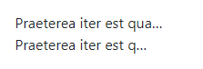

# Bootstrap 4

Bootstrap 是由 Twitter 的 Mark Otto 和 Jacob Thornton 开发的，用于开发开发 Web 应用程序和网站的前端框架。

Bootstrap 是基于 HTML, CSS, Javascript 的前端框架

特色：

- 响应式布局
- 基于 Flex 的栅格系统
- 丰富的组件库和工具方法
- 常见交互使用

前置知识：

- CSS 基础

- JS 基础

- jQuery 基础

官网：

https://getbootstrap.com/

中文：

https://bootcss.com

## 1. 安装

### 1.1 npm 安装

需要安装 node 环境，使用命令

~~~
npm install bootstrap
~~~

### 1.2 官网下载

https://getbootstrap.com/docs/5.1/getting-started/download/

### 1.3 使用 CDN

bootcdn

~~~
  

~~~

JsDelivr

~~~
<link href="https://cdn.jsdelivr.net/npm/bootstrap@5.1.2/dist/css/bootstrap.min.css" rel="stylesheet" integrity="sha384-uWxY/CJNBR+1zjPWmfnSnVxwRheevXITnMqoEIeG1LJrdI0GlVs/9cVSyPYXdcSF" crossorigin="anonymous">

~~~

### 1.4 版本说明

min 版本是生产版本，是经过压缩的版本，体积更小，一般用于上线使用，而普通的 bootstrap.css, bootstrap.bundle.js 是属于开发版本，代码比较完整并且会有错误提示。

### 1.5 引入项目

Bootstrap 基于 jQuery 开发，所以在引入 bootstrap.bundle.js 文件前需要引入 jQuery 文件

- 头部引入 css 文件
- 底部引入 js 文件

~~~html
<!DOCTYPE html>
<html lang="en">
    <head>
        <meta charset="UTF-8">
        <meta http-equiv="X-UA-Compatible" content="IE=edge">
        <meta name="viewport" content="width=device-width, initial-scale=1.0">
        <link href="https://cdn.bootcdn.net/ajax/libs/twitter-bootstrap/4.6.0/css/bootstrap.css" rel="stylesheet">  
        <title></title>
    </head>
    <body>

          
        
    </body>
</html>
~~~

## 2. Container 容器

Bootstrap 引入容器概念，将布局模块化，也称为栅栏，如果想要 CSS 样式生效，需要将所有元素放入 container 容器中。

- container 
  - container 类似于版心，有自己的默认宽度

- container fluid
  - container-fluid 类似于 container ，只不过是自适应布局，它的宽度是 100%

container 和 container-fluid 的默认 CSS 是：

~~~css
  width: 100%;
  padding-right: 15px;
  padding-left: 15px;
  margin-right: auto;
  margin-left: auto;
~~~

只不过 container 对屏幕做了适配加上了最大宽度

~~~css
/* 屏幕大于 576px 时 且小于 720px，container 最大宽度为 540px */
@media (min-width: 576px) {
  .container, .container-sm {
    max-width: 540px;
  }
}

/* 屏幕大于 576px 且小于 992px 时，container 最大宽度为 720px */
@media (min-width: 768px) {
  .container, .container-sm, .container-md {
    max-width: 720px;
  }
}

/* 屏幕大于 768px 且小于 1200px 时，container 最大宽度为 960px */
@media (min-width: 992px) {
  .container, .container-sm, .container-md, .container-lg {
    max-width: 960px;
  }
}

/* 屏幕大于 1200px 时，container 最大宽度为 1140px */
@media (min-width: 1200px) {
  .container, .container-sm, .container-md, .container-lg, .container-xl {
    max-width: 1140px;
  }
}
~~~

> 屏幕宽度小于 576px 时，根据默认样式，自动转换为宽度 100%

效果如图：

## 3. 栅格系统

Bootstrap4 的栅格系统基于12列的布局，5种响应尺寸（面向不同的屏幕设备），完全使用 flexbox 流式布局构建，支持响应式标准。在栅格布局中分为行和列，row 代表一行，col 代表一列。

### 3.1 行与列

如下列代码：

- 创建了一个容器
- 容器中包含一行
- 行内有三列（列宽度平分）

~~~html

    

        

            Column
        

        

            Column
        

        

            Column
        

    

~~~

效果如图：

### 3.2 响应式

针对容器和列，Bootstrap 有一些预设样式，如图表所示：

| Extra small <576px | Small ≥576px | Medium ≥768px | Large ≥992px | X-Large ≥1200px | XX-Large ≥1400px |
| ------------------ | ------------ | ------------- | ------------ | --------------- | ---------------- |
| 100%               | col-sm       | col-md        | col-lg       | col-xl          | col-xxl          |

当把列样式设置为 col-sm 时，只要屏幕宽度大于 576px，那么就是平分3列，小于 576px 时，列的宽度为 100%，但是 col 不论什么时候都会保持平分状态。

同理，col-md

- 屏幕小于 768px 时，会按照 col-sm 样式显示，如果没有 col-sm 样式，则列的宽度为 100%
- 屏幕大于 768px 时，会将列等比例平分（在没有设置 lg，xl，xxl 的情况下）

### 3.3 占比

栅格每行分为12等份，可以根据需求设置列的宽度，只需要在 col, col-sm 后边添加比例即可，如 col-4，col-sm-4

平分列

~~~html

    

        
col-sm

        
col-sm

        
col-sm

    

~~~

> 等比例平分，每份占4个比例，效果如同 col-sm

按比例分配列

~~~html
    

        

          
col-sm

          
col-sm

          
col-sm

        

      

~~~

> 左侧占 2，中间占 8，右侧占 2

超出比例

当行内列元素的占位超出12时，则会自动换行，如：

~~~html
    

        

          
col-sm-2

          
col-sm-8

          
col-sm-2

        

      

~~~

不足比例

当行内元素不足比例时，则不会显示，如：

~~~html
    

        

          
col-sm-2

          
col-sm-2

          
col-sm-4

        

      

~~~

### 3.4 自适应

通过对容器的样式设置，可以针对不同屏幕显示不同的效果，如：

~~~html
    

        

          
Column

          
Column

        

      

~~~

> 当屏幕大于 576px 时，按照 2:10 的比例显示，当大于 768px 时，则按照 4:8 的比例显示

### 3.5 w-100 切割

在 row 内，如果想让列分为多行显示，则可以使用 w-100 样式进行切割，如：

~~~html
    

      

        
Column

        
Column

        

        
Column

        
Column

      

    

~~~

> 本该被平分为4列的行，被分为了2行，每行两列的样式，并且列自动平分宽度

如果设置列的比例，切割之后，将不会自动填充，如：

~~~html
    

      

        
Column

        
Column

        

        
Column

        
Column

      

    

~~~

### 3.6 动态宽度

可以给指定列设置固定比例，让其他列自动分配宽度，如：

~~~html
    

      

        
Column

        
Column

        
Column

      

    

~~~

### 3.7 根据内容设置宽度

auto 属性可以让列根据内容设置宽度，如：

~~~html
    

      

        
Column

        
Column

        
Column

      

    

~~~

### 3.8 显示/隐藏元素

| 屏幕尺寸         | 类                     |
| ---------------- | ---------------------- |
| 在所有屏幕上隐藏 | .d-none                |
| 仅在 xs 上隐藏   | .d-none .d-sm-block    |
| 仅在 sm 上隐藏   | .d-sm-none .d-md-block |
| 仅在 md 上隐藏   | .d-md-none .d-lg-block |
| 仅在 lg 上隐藏   | .d-lg-none .d-xl-block |
| 仅在 xl 上隐藏   | .d-xl-none             |

| 屏幕尺寸         | 类                             |
| ---------------- | ------------------------------ |
| 在所有屏幕上显示 | .d-block                       |
| 仅在 xs 上显示   | .d-block .d-sm-none            |
| 仅在 sm 上显示   | .d-none .d-sm-block .d-md-none |
| 仅在 md 上显示   | .d-none .d-md-block .d-lg-none |
| 仅在 lg 上显示   | .d-none .d-lg-block .d-xl-none |
| 仅在 xl 上显示   | .d-none .d-xl-block            |

## 4. 边距

### 4.1 默认样式

默认行 的样式是左右各有 -15 px 的 margin

~~~css
    margin-right: -15px;
    margin-left: -15px;
~~~

列默认有 15px 的 padding 值

~~~css
    padding-right: 15px;
    padding-left: 15px;
~~~

### 4.2 no-gutters

当给 row 添加 no-gutters 时，则去掉了行与列的 margin 和 padding 值

~~~html

    

        
Column

        
Column

        
Column

    

~~~

### 4.3 外边距

可以使用 ml, mr, 调整列与列之间的间距

- ml： margin-left
- mr：margin-right

使用 ml-n，n 值范围 1~5，微调外边距

~~~html
    

      

        
Column 1

        
Column 2

        
Column 3

      

    

~~~

> 实际上 n 值为 rem，ml-1 即 margin-left: 1rem;

使用 auto 属性将空隙填满

- ml-auto
- mr-auto

~~~html
    

      

        
Column 1

        
Column 2

        
Column 3

      

    

~~~

除了 ml、mr 之外，还有一些其他的预设间距样式，如：

- m：四边
- mt：margin-top
- mb：margin-bottom
- mx：margin-left, margin-right
- my：margin-top, margin-bottom

### 4.4 内边距

和 margin 预设一样，padding 内边距也有预设样式

- p：四边
- pl：padding-left
- pr：padding-right
- pt：padding-top
- pb：padding-bottom
- px：padding-left，padding-right
- py：padding-top，padding-bottom

## 5. 对齐

### 5.1 行垂直对齐

元素在行内的垂直对齐（样式设置在行上），作用于行内所有元素，row 需要设置高度

| 效果         | 样式                |
| ------------ | ------------------- |
| 居顶（默认） | .align-items-start  |
| 居中         | .align-items-center |
| 居底         | .align-items-end    |

~~~html

    

        
Column

        
Column

        
Column

    

    

        
Column

        
Column

        
Column

    

    

        
Column

        
Column

        
Column

    

~~~

> 当设置行对齐后，div 高度则由原来的 100% 高度变成以内容高度为准

### 5.2 列垂直对齐

列在行内的垂直对齐方式（样式设置在列上），作用于单个列

| 效果         | 样式               |
| ------------ | ------------------ |
| 居顶（默认） | .align-self-start  |
| 居中         | .align-self-center |
| 居底         | .align-self-end    |

~~~html

    

        
Column

        
Column

        
Column

    

~~~

### 5.3 列水平对齐

当列没有 100% 填充行时，可以使用以下样式控制列的水平对齐方式，样式写在 row 上，作用于行内所有元素

| 效果             | 样式                     |
| ---------------- | ------------------------ |
| 居左（默认）     | .justify-content-start   |
| 居中             | .justify-content-center  |
| 居右             | .justify-content-end     |
| 间隔相等（分散） | .justify-content-around  |
| 两端对齐（分散） | .justify-content-between |

~~~html
    

        <!-- 水平居左 -->
      

        
Column 1

        
Column 2

        
Column 3

      

      <!-- 水平居中 -->
      

        
Column 1

        
Column 2

        
Column 3

      

      <!-- 水平居右 -->
      

        
Column 1

        
Column 2

        
Column 3

      

      <!-- 等分间距 -->
      

        
Column 1

        
Column 2

        
Column 3

      

      <!-- 贴边等分间距 -->
      

        
Column 1

        
Column 2

        
Column 3

      

    

~~~

## 6. 排列

栅格的列可以排序，使用 .order-n，n最大值为12

~~~html
    

      

        
Column 1

        
Column 2

        
Column 3

      

    

~~~

使用 .order-first 可以强制设置列为第一列，.order-last 为最后一列

~~~html
    

      

        
Column 1

        
Column 2

        
Column 3

      

    

~~~

使用 .offset-n 或 .offset-*-n 设置列的偏移量，n 表示栅格列数

~~~html
    

      

        
Column 1

        
Column 2

        
Column 3

      

    

~~~

### Header 案例

实现 Header，左侧 LOGO，右侧菜单

方法1：可以使用 offset 来做 

~~~html
    

      

        
LOGO

        
Menu

      

    

~~~

方法2：可以用列水平对齐的 .justify-content-between 来做

~~~html
    

      

        
LOGO

        
Menu

      

    

~~~

方法3：使用自动间距来做

~~~html
    

      

        
Logo

        
Menu

      

    

~~~

## 7. 内容排版

### 7.1 标题类

- 使用 h1 ~ h6 标签可以创建不同尺寸的标题文字
- 使用其他元素标签，如 p、div、span，调用 .h1~.h6 样式同样实现标题样式（不过会失去语义）

~~~html
    

      

        
Column 1

        Column 2
        
Column 3

        <h4 class="col-sm-3">Column 4</h4>
      

    

~~~

- 通过 .text-muted 样式，构建大标题的附属小标题

~~~html

    

        <h2>Website<small class="text-muted">.com</small></h2>
    

~~~

如果没有嵌套在主标题中，则会居上显示

~~~html

    

        <h2>Website</h2>
        <small class="text-muted">.com</small>          
    

~~~

- 通过 .display-1~4 大型文字，字体也会被切换

~~~html
    

      

          
Title

          
Title

          
Title

          
Title

      

    

~~~

### 7.2 文本类

- 想要指定一些段落中重要的内容，可以使用 .lead 强调

~~~html
    

      

        
This is a lead paragraph.

      

    

~~~

- 常用文本内联元素：mark, del, s, ins, u, small, strong, em 标签也被重新定义了样式

~~~html
    

      

        
You can use the mark tag to <mark>highlight</mark> text.

        
<del>This line of text is meant to be treated as deleted text.</del>

        
<s>This line of text is meant to be treated as no longer accurate.</s>

        
<ins>This line of text is meant to be treated as an addition to the document.</ins>

        
<u>This line of text will render as underlined</u>

        
<small>This line of text is meant to be treated as fine print.</small>

        
<strong>This line rendered as bold text.</strong>

        
<em>This line rendered as italicized text.</em>

      

    

~~~

> .small 和 .mark 也可以用来当做样式使用

- 使用 .title 样式和 abbr 标签作为缩略语给文本做提示

~~~html

<abbr title="attribute">attr</abbr>

<abbr title="HyperText Markup Language" class="initialism">HTML</abbr>

~~~

- 使用 blockquote 设置来源备注或引用，使用 .blockquote-footer 设置底部备注来源

~~~html

    

        
引用文字，加 mb-0 是取消外边距

        <footer class="blockquote-footer">引用来源</footer>
    

~~~

- 可以对内容进行居中对齐， .text-center 或居右对齐 .text-right
- 也可以针对不同屏幕自适应，如：.text-sm-center, .text-md-right

~~~html
    

      
文字居左（默认）

      
文字居中

      
文字居右

    

~~~

- 利用 `.text-wrap` 类可以让文字折行， `.text-nowrap` 类可以防止文字折行。

~~~html
    

      
换行显示（默认）

      
换行显示（默认）

    

~~~

- 对于较长的内容，你可以通过添加 `.text-truncate` 类将文本截断并添加省略号。 **但必须是 `display: inline-block` 或 `display: block` 类型。**

~~~html
<!-- Block level -->

  

    Praeterea iter est quasdam res quas ex communi.
  

<!-- Inline level -->

  Praeterea iter est quasdam res quas ex communi.

~~~

- 大小写转换

~~~html

LowerCase

UpperCase

capitalize text

~~~

- 字体粗细和斜体

~~~html

Bold text.

Bolder weight text (relative to the parent element).

Normal weight text.

Light weight text.

Lighter weight text (relative to the parent element).

Italic text.

~~~

- .text-decoration-none 去除文字装饰

~~~html
<a href="#" class="text-decoration-none">不带下划线的链接</a>
~~~

- 基线对齐

~~~html
baseline
top
middle
bottom
text-top
text-bottom
~~~

### 7.3 列表类

- 使用 .list-unstyled 给列表初始化，取消列表前置图形标记

~~~html
    

      <ul class="list-unstyled">
        <li>列表1</li>
        <li>列表2</li>
        <li>列表3</li>
        <ul>
          <li>嵌套列表1</li>
          <li>嵌套列表2</li>
          <li>嵌套列表3</li>
        </ul>
      </ul>
    

~~~

> 只针对第一层列表有效，如果是嵌套列表，需要在嵌套列表中同样添加 list-unstyled 样式

- 使用 .list-inline 和 .list-inline-item 结合实现列表横向排列

~~~html

    <ul class="list-inline">
        <li class="list-inline-item">列表1</li>
        <li class="list-inline-item">列表2</li>
        <li class="list-inline-item">列表3</li>
    </ul>

~~~

## 8. 代码

- 行内代码

用 `<code>` 包裹行内代码片段。请确保转义 HTML 代码中尖括号。

~~~html
For example, <code>&lt;section&gt;</code> should be wrapped as inline.
~~~

- 代码块

用 `<pre>` 包裹多行代码。再次注意，请确保转义代码中的尖括号，以便正确展示。你还可以选择性地添加 `.pre-scrollable` 类，实现垂直滚动，并且设定的最大高度为 340px。

~~~html
<pre><code>&lt;p&gt;Sample text here...&lt;/p&gt;
&lt;p&gt;And another line of sample text here...&lt;/p&gt;
</code></pre>
~~~

- 变量标签

~~~html
<var>y</var> = <var>m</var><var>x</var> + <var>b</var>
~~~

- 键盘标签

`<kbd>` 标签通常用来标明键盘输入。

~~~html
    

      To edit settings, press <kbd>ctrl</kbd> + <kbd>,</kbd>
    

~~~

## 9. 图片

### 9.1 响应式图片

通过 Bootstrap 所提供的 `.img-fluid` 类让图片支持响应式布局。其原理是将 `max-width: 100%;` 和 `height: auto;` 赋予图片，以便随父元素一起缩放。

~~~html

~~~

### 9.2 图片的缩略图

可以使用 `.img-thumbnail` 使图片的外观具有 1px 宽度的圆形边框。

~~~html

~~~

### 9.3 对齐方式

通过使用浮动或外边距将图片对齐，也可以给父级添加 text-center 来居中对齐

~~~html

  

~~~

### 9.4 图文组合

~~~html
<figure class="figure">
  
  <figcaption class="figure-caption text-left">A caption for the above image.</figcaption>
</figure>
~~~

## 10. 表格

https://v4.bootcss.com/docs/content/tables/

## 11. 颜色

- 使用 .text-* 将文本设置成指定的颜色，比如： .text-success; 也可以 .text-*-50 设置透明度

- 使用 .text-* 也可以设置超链接颜色, white 和 muted 不支持

- 使用 .bg-* 可以实现背景色，比如： .bg-success，也可以使用 。bg-transparent 设置透明度

## 12. 边框

- 使用 .border 给原色增加响应的边框，默认是淡灰色
  - border-*: top, bottom, left, right 可以指定任意一边

- 可以使用border-* 设置边框颜色
  - border-primary
  - border-secondary
  - border-success
  - border-danger
  - border-warning
  - border-info
  - border-light
  - border-dark
  - border-white
- 使用 border-0 消除边框，或使用 .border-*-0 消除某一边的边框（上左下右）
- 使用 .rounded 和 .rounded-* 实现各种方位圆角
  - .rounded-circle 正圆
  - .rounded-pill 椭圆
- 使用 .rounded-sm （小圆角） 和 .rounded-lg（大圆角）实现圆角半径大小

## 13. 浮动

- float-left 左浮动
- float-right 右浮动
- float-none 不浮动
- clearfix 清除浮动（父元素）

~~~html

  <button type="button" class="btn btn-secondary float-left">向左浮动（float）的示例按钮</button>
  <button type="button" class="btn btn-secondary float-right">向右浮动（float）的示例按钮</button>

~~~

## 14. overflow 文字溢出

- auto 自动模式会添加滚动条

- hidden 会隐藏溢出文字

~~~html

...

...

~~~

## 15. 可见性

使用 Bootstrap 内置的可见性工具类可以设置 HTML 元素的 `visibility` （可见性）。这些工具类并不修改 `display` 的值，也不会对布局产生影响，设置了 `.invisible` 的 HTML 元素仍然占据页面空间。

~~~html

...

...

~~~

## 16. 宽高

- 使用 .w-* 设置元素的宽度，包括 25%、50%、75%、100% 和 auto

- 使用 .h-* 设置元素高度，包括 25%、50%、75%、100% 和 auto

- 使用 .mw-* 和 .mh-* 设置 max-width 和 max-height

  

## 17. 阴影

使用 .shadow-* 实现元素阴影效果

~~~html

无阴影

小阴影

常规阴影

大阴影

~~~

## 18. Display 模式

d-* 实现块级、行级、行内块元素的样式

- `none`
- `inline`
- `inline-block`
- `block`
- `table`
- `table-cell`
- `table-row`
- `flex`
- `inline-flex`

## 19. Flex 弹性布局

https://v4.bootcss.com/docs/utilities/flex/

