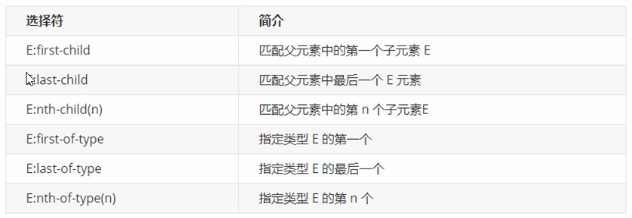
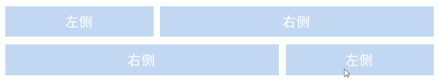

# 一、CSS 简介

CSS（Cascading Style Sheets） 层叠样式表，主要是用来设置 HTML 页面中文本内容内容（字体、大小、对齐方式）、图片的外形（高宽、边框样式、边距）以及版面的布局和外观显示样式


# 二、CSS 书写规则
## 1. 书写规则

CSS 规则由两部分构成，选择器以及一条或多条声明

```
选择器 {样式}  // 样式用属性与属性值的方式书写（属性:属性值;）
```


选择器指的是 HTML 中的标签，花括号内是对该标签设置的具体样式，属性与属性值是以键值对的方式出现，最后用分号结束。

```
h1 {font-size: 12px; color: red;}
```


书写格式

书写规范：所有CSS建议小写书写。选择器与大括号之间保留1个空格，属性与值之间的冒号后边也需要保留一个空格。


## 2. 紧凑格式

```
h1 {font-size: 12px; color: red}
```


## 3. 展开格式

```
h1 {
    font-size: 12px;
    color: red;
}
```

> 推荐使用展开格式


## 4. 属性值单位

```
颜色：#8fa, #aaffaa, red, rgb(255,0,0)
大小：em, px, pt, %, pc, cm, mm, in, 
```


# 三、引入方法

## 1. 内联样式表：
内联样式是在 HTML body 标签中将样式直接嵌入在标签内，也被称为行内样式

```
<p style=font-size:30px; color:red;>TTT</p>
```


## 2. 内部样式表：
内部样式表示在头部中嵌入CSS，也被称作嵌入式CSS，在 head 标签内部添加 `<style>CSS样式</style>`

```
<head>
    <style>
        p {
            color: red;
        }
    </style>
</head>
```


> style 标签理论上是可以放在 HTML 文档的任何地方，但一般会放在 head 标签中


## 3. 外部样式表：
独立 CSS 文件，在 HTML 中通过 Link 元素加载 CSS

```
<link rel="stylesheet" type="text/css" href="global.css" />
<link rel="stylesheet" href="global.css" />
```


优先级：

- 行内样式 > 其他的引入方式
- 其他的和加载顺序有关


## 4. import 导入方式
导入方式指的是使用 CSS 规则引入外部 CSS 文件。

```
<style>
    @import url(style.css);
</style>
```


link 导入和 @import 导入区别：

- link 属于 HTML，通过 `<link>` 标签中的 href 属性来引入外部文件，而 @import 属于 CSS，所以导入语句应写在 CSS 中，要注意的是导入语句应写在样式表的开头，否则无法正确导入外部文件；

- @import 是 CSS2.1 才出现的概念，所以如果浏览器版本较低，无法正确导入外部样式文件；

- 当 HTML 文件被加载时，link 引用的文件会同时被加载，而 @import 引用的文件则会等页面全部下载完毕再被加载；


**小结**：我们应尽量使用 `<link>` 标签导入外部 CSS 文件，避免或者少用使用其他三种方式。


# 四、注释

```
/* 这里可以写任何注释 */

/* 
也可以
多行显示
*/
```


# 五、CSS 选择器
CSS 选择器是根据不同需求把不同的标签选出来，简单来说，就是选择标签用的。
W3School：https://www.w3school.com.cn/cssref/css_selectors.asp


基础选择器又包括：标签选择器、类选择器、id选择器和通配符选择器


## 1. 标签选择器

标签选择器是指用 HTML 标签名称作为选择器，按标签名分类，为页面某一类标签指定统一的CSS样式。

```
标签名 {
    属性1: 属性值1;
    属性2: 属性值2;
}
```

标签选择器可以把某一类标签全部选择出来，比如所有的 `<div>` 标签，能快速为页面中同一类型的标签统一设置样式。

```
<head>
    <style>
        div {
        color: red;
    }
    </style>
</head>
<body>
    <div>文本文字</div>
</body>
```


## 2. 类选择器
如果想要差异化选择不同标签，单独选择一个或者几个标签，可以使用类选择器。

```
.类名 {
    属性1: 属性值1;
    属性2: 属性值2;
}
```


```
<style>.red {color: red;} </style>
<div class="red">文本文字></div>
```


- p.class1（class1即是类名）同一个选择器能有不同的类，因而允许同一个元素有不同的样式。

- p.class1 适用于 html 中 任何 `<p class="class1">`的内容
  .one 适用于 html 中 任何 one 类的内容，如 `<p class="one">` or `<b class="one">`


**类命名规范：**
https://blog.csdn.net/shadow_zed/article/details/72820007


**多类名**
我们可以给一个标签指定多个类名，从而达到更多选择的目的，这些类名都可以选出这个标签。类标签用空格隔开。

```
<div class="red font20"></div>
```


**多类名使用场景：**
将相同元素属性放在一起，不同的单独列出来

```
<style>
.box {width: 50px; height: 50px;}
.red {color: red;} 
.pink{color: pink;} 
</style>

<div class="box red"></div>
<div class="box pink"></div>
<div class="box red"></div>
```


## 3. ID选择器

id 选择器可以为标有特定id的HTML元素指定特定的样式。
HTML元素以id属性来设置id选择器，CSS中id选择器以 "#" 来定义。

```
#id名 {
    属性1: 属性值1;
    属性2: 属性值2;
}
```


```
<style>.red {color: red;} </style>
<div id="red">文本文字></div>
```

- id 属性规定 HTML 元素的唯一的 id。

- id 在 HTML 文档中必须是唯一的。

- id 属性可用作链接锚（link anchor），通过 JavaScript（HTML DOM）或通过 CSS 为带有指定 id 的元素改变或添加样式。

> .class 可以在标签中多次使用同一个类名


## 4. 通配符选择器
在 CSS 中，通配符选择器使用 * 定义，它表示选取页面中的所有元素（标签）。

```
* {
    属性1: 属性值1;
}
```

> 通配符选择器不需要调用，自动给所有元素使用的样式


# 六、CSS 字体属性

## 1. 字体显示

```
p {font-family: "微软雅黑";}
div {font-family: Arial, "Microsoft Yahei", "微软雅黑", sans-serif;}
```

CSS 使用 font-famliy 属性定义文本的字体系列

- 虽然CSS设置 font-family 可以使用中文，但是最好还是使用字体的英文名称
- 可以添加多个字体，用逗号分隔
- 多个英文单词组成的字体用“”包含


font-family 设置多个字体的时候，会按照顺序查找浏览器支持字体，如果没有则继续找下一个，如果都没有则用系统默认字体


## 2. 字体大小
font-size 属性可以定义字体大小

```
body {font-size: 12px;}
```

> 谷歌浏览器默认是 16px
>
> 可以给 body 指定整个页面的文字大小


## 3. 字体粗细

font-weight 属性可以设置字体的粗细

```
body {font-weight: normal}
p {font-weight: 700}
```


```
font-weight 属性值
normal  // 正常粗细。与400等值。
bold  // 加粗。 与700等值。
lighter  // 比从父元素继承来的值更细(处在字体可行的粗细值范围内)。
bolder  // 比从父元素继承来的值更粗 (处在字体可行的粗细值范围内)。
<number>  // 一个介于 1 和 1000 (包含) 之间的 <number> 类型值。更大的数值代表字体重量粗于更小的数值 (或一样粗)。一些常用的数值对应于通用的字体重量名称，如章节常见粗细值名称和数值对应所描述。
```


## 4. 字体样式

font-style 属性设置文本的风格（斜体）

```
p {font-style: italic;}
```


font-style 属性值

```
normal  // 正常风格（默认）
italic  // 斜体风格
```

> 一般不会用 font-style 设置斜体，反而（em、i）标签更为常用


## 5. 字体复合属性

用 font 标签一次性定义多个字体属性

```
body {
    font: font-style font-weight font-size/line-height font-family;
}
```

```
body {
    font: italic 400 12px "Microsoft Yahei"
}
```

> 使用 font 属性时，必须按照顺序书写，不能更换顺序，各个属性用空格隔开
>
> 不需要设置的属性可以省略（取默认值），但必须保留 font-size 和 font-family 属性


## 6. 文本属性

文本属性可以定义文本的外观，比如文本的颜色、对齐文本、装饰文本、文本缩进、行间距等。


颜色：

```
p {
    color: red;
}
```


颜色属性值：

```
预定义颜色的值： red，green，blue 等等
16进制：#FF0000, #FF6600, #CCC
RGB：rgb(255,0,0)
```

> 开发中最常用的是十六进制


## 7 .对齐方式

text-align 属性用于设置元素内文本内容的水平对齐方式

```
div {
    text-align: center;
}
```


对齐方式属性值：

```
left  // 左对齐
right  // 右对齐
center  // 居中对齐
```


装饰文本

text-decoration 属性规定添加到文本修饰，可以给文本添加下划线、删除线、上划线等。

```
a {
    text-decoration: none;
}
```


属性值：

```
none  // 默认，没有装饰线
underline  // 下划线，连接 a 自带下划线（常用）
overline  // 上划线（几乎不用）
line-through  // 删除线（不常用）
```


文本缩进

text-indent属性可以用来指定文本的第一行缩进，通常是将段落首行缩进

```
p {
    text-indent: 10px;
}
```


em 是一个相对单位，就是当前元素（font-size）1个文字的大小，如果当前元素没有设置大小，则会按照父元素的1个文字大小。这个单位常用于响应式布局

```
p {
    text-indent: 2em;  // 代表缩进2个文字大小的空间
}
```


行间距

line-height 属性用于设置行间的距离（行高），可以控制文字行与行之间的距离。

```
p {
    line-height: 26px;
}
```


> 行高 = 上间距 + 文本高度 + 下间距


- 当行高小于盒子高度，文字偏上
- 当行高大于盒子高度，文字偏下
- 当行高等于盒子高度，文字居中


# 七、Emmet 语法

Emmet 语法的前身是 Zen coding，它使用缩写，来提高 html/css 的编写速度， VSCODE 已经内置集成该语法


## 1. 快速生成HTML 结构语法

生成标签直接输入标签名，按tab键即可

```
比如 div ，然后按 tab 键就可以生成 <div></div>
```


生成多个相同标签，加上 * 就可以了

```
比如 div*3，就可以快速生成3个div
```


父子关系可以用 ul > li 快速生成标签

```
ul>li
```


兄弟关系可以用 + 快速生成标签

```
div+p
```


生成带有类名或者id名字的div，直接写 .demo 或者 #two tab 键就可以了，如果是其他标签生成类名，则用标签名.类名快速生成

```
输入 .demo 然后按 Tab 就会快速生成 <div class="demo"></div>
输入 p.one 然后按 Tab 就会快速生成 <p class="one"></p>
```


如果生成 div 是有顺序的，用$符做自增通配符，$从1开始计数

```
.demo$*3 
<div class="demo1"></div>
<div class="demo2"></div>
<div class="demo3"></div>
```


如果想要在生成的标签内部写内容可以用 {} 表示

```
div{标签内的内容}
<div>标签内的内容</div>
```


## 2. 快速生成CSS样式

输入 css 属性第一个字母，会自动生成 CSS 标签

```
输入 ti，按tab键，则会自动生成
text-indent: ;
```


类似的还有

```
h = height
w = width
```


输入缩写后，还可加上属性值

```
h100
height: 100px;

tac
text-align: center;

ti2em
text-indent: 2em;

tdn
text-decoration: none;
```


# 八、CSS 复合选择器

复合选择器是建立在基础选择器之上，对基本选择器进行组合行程的。

- 复合选择器可以更准确，更搞笑的选择目标元素
- 复合选择器是由两个或多个基础选择器，通过不同方式组合而成
- 常用的复合选择器包括：后代选择器、子选择器、并集选择器、伪类选择器等等


## 1. 后代选择器

后代选择器又称为包含选择器，可以选择父元素里边的子元素，其写法就是把外层标签写在前边，内层标签写在后边，中间用空格分隔。当标签发生嵌套时，内层标签就成了外层标签的后代。

```
元素1 元素2 {样式声明}
```


如：li 标签就是 ol 标签的后代

```
<ol>
    <li></li>
</ol>
```


用 css 复合选择器来选择 ol 标签中的 li

```
ol li {
    color: red;
}
```

> 后代选择器不仅仅可以选择子标签，还可以隔代选择，比如 div>ul>li，用 CSS 复合选择器 div li 也可以选择出来。只要是元素1的后代，用后代选择器都可以选择出来。


## 2. 子元素选择器

子元素选择器只能选择作为某元素的最近一级子元素。

```
元素1>元素2 {样式声明}
```


```
<div class="nav">
    <a href="">link1</a>
    <p>
        <a href="">link2</a>
    </p>
</div>
```


只选择 div 下边的 a 标签，对于 p 标签中的 a 标签不做任何改变

```
.nav > a {
    text-decoration: none;
}
```

> 如果用了后代选择器，如：`.nav a` 则两个 a 标签都会发生改变


## 3. 并集选择器

并集选择器可以选择多组标签，同时为他们定义相同的样式，通常用于集体声明。并集选择器用逗号分隔。

```
元素1,元素2 {样式声明}
```


```
<div class="nav">文字</div>
<div><p>文字</p></div>
```


同时改变li标签和div标签中元素

```
.nav,p {
    color:red;
}
```


## 4. 伪类选择器

伪类选择器用于向某些选择器添加特殊的效果，比如给连接添加特殊效果，或者选择第一个，第n个元素。伪类选择器最大的特点是用冒号表示，如 `:hover, :first-child`


伪类选择器有很多：链接伪类、结构伪类


**链接伪类选择器**

```
a:link  // 选择所有未被访问的链接
a:visited  // 选择所有已被访问的链接
a:hover  // 选择鼠标指针位于其上的链接
a:active  // 选择活动链接（鼠标按下未弹起的链接）
```

> 注意顺序，不然CSS效果会失效


实际工作中大部分只用 `a` 标签 和 `a:hover` 标签

```
a {
    color: #333333;
    text-decoration: none;
}
a:hover {
    color: orange;
}
```


经过某选择器，另外选择器生效

```
.tudou:hover .mask {
    display: block;
}
```


**:focus 伪类选择器**

`:focus` 用于选取获得焦点的表单元素

焦点就是光标，一般情况`<input>`类表单元素才能获取，因此这个选择器也主要针对表单元素来说。

```
input:focus {
 background-color:yellow;
}
```


其他伪类选择器：

- :first-line 首行
- :first-letter 首字母

~~~css
p:first-line {
  color: red;
}
p:first-letter {
  font-size: 22px;
}
~~~


# 九、元素的显示模式

元素的显示模式就是元素（标签）以什么方式进行显示，比如 div 标签独占一行，比如 span 标签一行可以放多个。

HTML 元素一般分为块元素和行内元素两种类型。


## 1. 块元素
常见的块元素有 `<h1>~<h6>`、`<p>`、`<div>`、`<ul>`、`<ol>`、`<li>` 等，其中 `<div>` 是最典型的块元素


块元素特点：

- 独占一行
- 高度、宽度、外边距及内边距都可以控制
- 宽度默认是容器（父集宽度）的100%
- 是一个容器及盒子，里边可以放行内元素或块元素


> 文字类元素内不能使用块集元素，`<p>`标签主要用于存放文字，因此`<p>`标签里边不能再放其他块级元素。同理，`<h1>~<h6>`也是文字类块元素，也不能放其他块元素


## 2. 行内元素
常见的行内元素有 `<a>`、`<strong>`、`<b>`、`<em>`、`<i>`、`<del>`、`<s>`、`<ins>`、`<u>`、`<span>` 等，其中 `<span>` 和 `<a>` 是最常用的行内元素


行内元素特点：

- 相邻行内元素在同一行上，一行可以显示多个行内元素
- 高、宽无法直接设置
- 默认宽度就是它本身内容的宽度
- 行内元素只能容纳文本或其他行内元素


> `<a>` 标签中不能再放其他链接
>
> `<a>` 可以放块级元素


## 3. 行内块元素
有几个特殊的标签，``、`<input>`、`<td>` 它们同时具有块元素和行内元素的特点。


行内块元素的特点：

- 和相邻行内元素（行内块）在一行上，但是它们之间会有空白缝隙。一行可以显示多个
- 默认宽度就是它本身内容的宽度（行内元素特点）
- 高度、行高、外边距以及内边距都可以控制（块级元素特点）


## 4. 显示模式的转换
特殊情况下，我们需要将元素模式转换


将行内元素转换成块元素

```
display: block;
```


将块元素转换为行内元素

```
display: inline;
```


将元素转换为行内块元素

```
display: inline-block;
```


# 十、背景属性

通过 CSS 背景属性，可以给页面元素添加背景样式

背景属性可以设置背景颜色、背景图片、背景平铺、背景图片位置、背景图像固定等。


## 1. 背景颜色

background-color 属性定义了元素背景颜色

```
background-color: 颜色值;
```

> 默认值是 transparent（透明）


## 2. 背景图片

background-image 属性可以定义元素的背景图像，实际应用中，logo，页面中装饰性小图片，整个页面的背景图，或者精灵图，都可以用这个属性来做。

```
background-image: none | url(url)  // 没有图片或者指定一个url图片路径
```


插入Logo图

```
background-image: url(images/logo.png);
```


## 3. 背景平铺

如果需要在 HTML 页面上对背景图片进行平铺，可以使用 background-repeat 属性

```
background-repeat: repeat | no-repeat | repeat-x | repeat-y
```

```
repeat	默认。背景图像将在垂直方向和水平方向重复。
repeat-x	背景图像将在水平方向重复。
repeat-y	背景图像将在垂直方向重复。
no-repeat	背景图像将仅显示一次。
inherit	规定应该从父元素继承 background-repeat 属性的设置。
```


## 4. 背景图片位置

利用 background-position 属性改变图片在背景中的位置

```
background-position: x y;
```


```
left top
left center
left bottom
right top
right center
right bottom
center top
center center
center bottom
```

> 如果仅指定一个关键字，其他值将会是"center"


```
x% y%	第一个值是水平位置，第二个值是垂直。左上角是0％0％。右下角是100％100％。如果仅指定了一个值，其他值将是50％。 。默认值为：0％0％
xpos ypos	第一个值是水平位置，第二个值是垂直。左上角是0。单位可以是像素（0px0px）或任何其他 CSS单位。如果仅指定了一个值，其他值将是50％。你可以混合使用％和positions
inherit	指定background-position属性设置应该从父元素继承
```

> 可以混合精确数值和方位，如 20px center，第一个参数永远是 x 横轴，如果省略一个参数，另外一个参数以 center 默认。


背景图像固定（背景附着）
background-attachment 属性设置背景图像是否固定或者随着页面的其余部分滚动

```
background-attachment: scroll | fixed
```

```
scroll	背景图像是随着对象内容滚动
fixed	背景图像固定（不会随页面滚动而滚动）
```


## 5. 背景复合写法

为了简化背景属性代码，我们可以将这些属性像font一样合并到同一个属性 background 中，这里没有顺序要求。

```
background: 背景颜色 背景图片地址 背景平铺 背景图像滚动 背景图片位置
```


## 6. 背景色半透明

CSS3 为我们提供了背景颜色半透明效果，可以实现黑色遮罩效果

```
background: rgba(0,0,0,0.3);
```

> Red / Greed / Blue / Alpha（透明度）取值范围在0~1


# 十一、CSS 三大特性

CSS 有三个非常重要的特性：层叠性、继承性、优先级


## 1. 层叠性

相同选择器给设置相同的样式，一个样式就会覆盖另一个样式，层叠性主要解决样式冲突。


层叠性原则：

样式冲突，遵循的原则就是就近原则，哪个样式离结构近，就执行哪个样式


## 2. 继承性
CSS中继承：子标签会继承父标签的某些样式，比如文本颜色和字号。


可以继承的样式

```
text-
font-
line-
color
```


div 标签和 p 标签继承body的样式

```
<style>
    body {
        color: pink;
    }
</style>


<body>
    <div>文本文字</div>
    <p>文本文字</p>
</body>
```


行高的继承

```
body {
    color: pink;
    font: 12px/1.5 "Microsoft Yahei";
}

p {
    font-size: 16px;
}
```

> 1.5 是倍数的意思，p标签继承行高和字体，行高是 16x1.5 = 24px


## 3. 优先级

当同一个元素指定多个选择器，就会有优先级的产生
选择器相同，则执行层叠性（就近原则）
选择器不同，则根据选择器权重执行


优先级权重逐渐递增


权重最高：

```
color: pink!important;
```


权重的叠加：

```
/* 标签选择器权重 0,0,0,1 */
li {
    color: red;
}
/* 权重叠加 0,0,0,1 + 0,0,0,1 = 0,0,0,2 */
ul li {
    color: green;
}
/* 权重叠加 0,0,1,0 + 0,0,0,1 = 0,0,1,1 */
.nav li {
    color: pink;
}

<ul class="nav">
    <li>优先级权重</li>
</ul>
```


# 十二、盒子模型


## 1. 边框

border 可以设置元素的边框，边框有三部分组成：边框宽度、边框样式、边框颜色

```
border: border-width || border-style || border-color
```


可以直接定义：

```
border-width	定义边框的粗细，单位px
border-style	边框的样式（solid、dashed、dotted）
border-color	边框颜色
```


也可以使用复合定义（无顺序要求）：

```
border: 1px solid black;
```


可以定义部分边框：

```
border-top
border-bottom
border-left
border-right
```


合并相邻的边框

```
border-collapse: collapse;
```

> border 会影响盒子的大小


## 2. 内边距

padding 属性用于设置内边距，即边框与内容之间的距离

```
padding-left
padding-right
padding-top
padding-bottom
```


复合式写法：

```
padding: top right bottom left;
```

```
padding: 5px;			1个值，代表上下左右
padding: 5px 10px;			2个值，代表上下5px，左右10px
padding: 5px 10px 20px;		3个值，代表上5px，左右10px，下20px
padding: 5px 10px 20px 30px;	4个值，上右下左（顺时针）
```

- padding 的单位可以是 px 也可以是 em
- padding 也会影响盒子的大小


如果盒子本身没有指定 widith/height 属性，则此时 padding 不会撑开盒子（改变盒子宽高）


## 3. 外边距

margin 属性用来控制盒子与盒子之间的距离

```
margin-left
margin-right
margin-top
margin-bottom
```

> 复合式写法和 padding 相同


外边距典型应用

外边距可以让块级盒子水平居中，需要满足一些条件：

1. 盒子必须制定宽度（width）
2. 盒子左右的外边距都设置为 auto


```
margin-left: auto; margin-right: auto;
margin: auto;
margin: 0 auto;  // 常用
```

> 行内元素或者行内块元素水平居中可以给其父元素添加 text-align: center 即可


相邻块元素垂直外边距的合并

当上下相邻的两个块元素（兄弟关系）相遇时，如果上边的元素有 margin-bottom，下边的元素有 margin-top，则他们之间的的边距不是 margin-bottom 与 margin-top 的和，而是取两个值中较大者。所以尽量只添加一个 margin 的值


嵌套元素垂直外边距的塌陷

当两个嵌套关系（父子）的块元素，父元素有 margin-top ，子元素也有 margin-top，此时，父元素会塌陷。塌陷的距离是两个 margin-top 中较大的值。


解决方案：

- 可以为父元素定义上边框
- 可以为父元素定义上内边距
- 可以为父元素 添加 overflow: hidden 样式


## 4. 清除内外边距

网页元素很多都带有默认的样式，如内外边距，而且不同的浏览器默认的值也不一样，所以一般在布局的时候，需要清除下网页元素的内外边距。

```
* {
  margin: 0;
  padding: 0;
  }
```

> 行内元素为了照顾兼容性，尽量只设置左右内外边距，不要设置上下内外边距。但是转换为块级和行内块元素就可以了


## 5. 清除 list 中的样式

```
list-style: none;
```

> none, disc, circle, square, uppercase, lowercase, upper-alpha, lower-roman，也可以用 list-style: url() 图片来替换


## 6. 圆角边框（CSS3）

border-radius 属性可以设置元素的外边框圆角

```
border-radius: length;
```


> radius 半径，用以 length 为半径的圆与直角相切

> 如果需要一个圆形，则盒子设置为正方形，然后半径设置正方形边长的一半即可 length 可以用百分号表示，如：50%

> 如果需要一个圆角矩形，length 设置为 height 的 50%


border-raidus 的复合写法：

```
border-radius: 左上角、右上角、右下角、左下角 （顺时针）
```


单个值写法：

```
border-top-left-radius: length
```


## 7. 盒子阴影（CSS3）

```
box-shadow: h-shadow v-shadow blur spread color inset
```

```
h-shadow		必须，水平阴影的位置，允许负值
v-shadow		必须，垂直阴影的位置，允许负值
blur		可选，模糊距离
spread		可选，阴影的尺寸
color		可选，阴影的颜色
inset		可选，将外部阴影(outset)改为内部阴影
```

> 盒子阴影不占用盒子宽高


鼠标经过出现阴影

```
div:hover {
    box-shadow: 10px 10px 10px -4px rgba(0,0,0,.3)
}
```


文字阴影

text-shadow 设置文字阴影

```
text-shadow: h-shadow v-shadow blur color
```

```
h-shadow		必须，水平阴影的位置，允许复制
v-shadow		必须，垂直阴影的位置，允许负值
blur		可选，模糊距离
color		可选，阴影的颜色
```


盒子透明

给盒子设置透明和背景透明不同，盒子透明，连文字也跟着透明，opacity 值越小越透明，为0则消失。

~~~css
div {
    background-color: black;
    opacity:0.5
}
~~~


# 十三、CSS 浮动

CSS 提供三种传统布局方式：标准、浮动、定位


标准流就是标签按照规定好默认方式排列

1. 块级元素独占一行，从上向下排列顺序
2. 行内元素按照顺序，从左到右顺序排列，碰到父元素边缘则自动换行


浮动可以改变元素标签默认的排列方式


最典型的浮动应用：可以上多个块级元素一行内排列显示，虽然用 display: inline-block 也可以做出来，但是，盒子与盒子之间会有空隙，用浮动则没有这个问题

> 多个模块纵向排列标准流，横向排列浮动


## 1. 浮动

float 属性用于创建浮动框，将其移动到一边，直到左边缘或右边缘触及包含块或另一个浮动框的边缘。

```
选择器 {float: 属性值;}
```


```
none	元素不浮动
left	元素向左浮动
right	元素向右浮动
```


两个盒子必须都是浮动，第一个盒子会浮动到父元素边缘，第二个盒子会自动寻找上一个 float 元素的边缘。

```
.left,
.right {
    float: left;
    width: 100px;
    height: 100px;
    background-color: blue;
}
```


浮动特性

- 浮动元素会脱离标准流，不再保留原先的位置 
- 浮动元素会一行内显示，并且元素顶部对齐
- 浮动元素会具有行内块元素的特征


当第一个盒子设置浮动后，第二个盒子就会占据原先盒子的位置，发生重叠

```
.float {
    float: left;
}

<div class="float"></div>
<div class="normal"></div>
```


如果多个盒子都设置了浮动，则他们会按照属性值一行内显示并且顶端对齐排列，浮动的元素是互相靠在一起的（没有缝隙），如果父集宽度装不下这些浮动盒子，多出的盒子会另起一行对齐。


任何元素都可以浮动，不管原先是什么模式的元素，添加浮动之后就会具有行内块元素的特征（比如可以添加宽度高度）

```
.float {
    float: left;
    width: 50px;
    height: 20px;
}
<span class="float"></span>
<span class="float"></span>
<span class="float"></span>
```


浮动元素的位置（与标准流搭配）

为了约束浮动元素的位置，网页布局一般采用的策略是：
先用标准流的父元素排列上下位置，之后内部子元素采取浮动排列左右位置。


一般行内小盒子布局用 ul 和 li 标签来做


```
https://gitee.com/xiaoqiang001/html_css_material/blob/master/%E7%AC%AC%E5%85%AD%E5%A4%A9/12-%E6%B5%AE%E5%8A%A8%E5%B8%83%E5%B1%80%E7%BB%83%E4%B9%A02.html


```


## 2. 常见网页布局

标准流布局：


> 一个元素浮动了，同一个盒子中的其余的元素也要浮动，防止引起问题
>
> 浮动的盒子只会影响浮动盒子后边的标准流，不会影响前边的标准流


## 3. 高度自适应

之前的例子都是给父元素设定高度的，但是很多情况父元素需要自适应，需要根据子元素的高度，来自动调节父元素的高度。但是当父盒子没有给高度的时候，子盒子用用浮动显示的话，父盒子高度就会变为0，下边如果还有块元素的话，会自动上移到浮动元素的下边。


如图所示，父元素只剩下个 border 留下，两个浮动元素上移，Footer 占据之前父元素的位置


```
<style>
    .father {
        background-color: pink;
        border: 1px blue solid;
    }
    .son {
        float: left;
        width: 200px;
        height: 200px;
        background-color: skyblue;
    }
    .footer {
        height: 200px;
        background-color: red;
    }
</style>
</head>
<body>
<div class="father">
    <div class="son">子盒子1</div>
    <div class="son">子盒子2</div>
</div>
<div class="footer"></div>
</body>
```


## 4. 清除浮动

清楚浮动的本质就是清楚浮动元素造成的影响，如果父元素已经有了高度，则不需要清除浮动。清除浮动后，父元素就会根据子盒子的高度自动调节。

```
选择器 {clear: 属性值;}
```

```
left	清除左侧浮动（不允许左侧有浮动元素）
right	清除右侧浮动
both	清除两侧浮动
```


实际工作中，both 比较常用


清除浮动的方法：

1. 额外标签法（W3C 推荐做法）
2. 父级添加 overflow 属性
3. 父级添加 after 伪元素
4. 父级添加双伪元素


**额外标签法：**

额外标签法会在浮动元素末尾添加一个空标签，如：

```
<div style="clear:both"></div> 或者用 <br /> 块级标签等
```


在之前的例子里边加上div clear 空标签，并在 style 中定义 clear 属性

```
.clear {
    clear: both;
}

<div class="father">
    <div class="son">子盒子1</div>
    <div class="son">子盒子2</div>
    <div class="clear></div>
</div>
<div class="footer"></div>
```

> 这样就会在最后一个浮动标签后边封死，不会影响后边的其他元素。


虽然是 W3C 推荐的，但是工作中不太常用


**overflow 属性：**
可以给父级添加 overflow 属性，将其属性值设置为 hidden、auto 或 scroll

```
overflow: hidden;
```

- 优点：代码简洁
- 缺点：无法显示溢出部分


**:after 伪元素**
:after 方式是额外标签法的升级版，也是给父元素添加

```
.clearfix:after {
    content: "";
    display: block;
    height: 0;
    clear: both;
    visibility: hidden;
}

.clearfix { /* IE6、IE7 专有 */
    *zoom: 1;
}
```

> 相当于在浮动元素最后边添加了一个元素，然后用 display: block; 转换成了块元素，然后再 clear: both; 清除浮动。高度设置0，显示方式为隐藏则不会显示出来。


双伪元素清除浮动

将浮动元素两侧都清除浮动

```
.clearfix:before,
.clearfix:after {
    content: "";
    display: table;
}
.clearfix:after {
    clear: both;
}
.clearfix{
    *zoom: 1;
}


```


## 浮动应用：导航栏制作

实际开发中，导航栏一般用 li + a 来做

```
<ul>
  <li><a href=""></a></li>
  <li><a href=""></a></li>
  <li><a href=""></a></li>
  <li><a href=""></a></li>
</ul>
```


# 十四、CSS 书写顺序

1. 布局定位属性： display/ position / float / clear / visibility / overflow
2. 自身属性： width / height / margin / padding / border / background
3. 文本属性： color / font / text-decoration / text-align / vertical-align / white-space / break-word
4. 其他属性（CSS3）: content / cursor /border-radius / box-shadow / text-shadow / background:linear-gradient...


# 十五、CSS定位

浮动可以让多个块级盒子一行没有缝隙排列显示，经常用于横向排列盒子。

定位则是可以让盒子自由的在盒子内移动位置或固定屏幕中某个位置，并且可以压住其他盒子

定位：将盒子定在某一个位置，所以定位也是在摆放盒子，按照定位的方式移动盒子

定位=定位模式+边偏移


Position 属性

```
static	静态定位
relative	相对定位
absolute	绝对定位
fixed	固定定位
```


边偏移

边偏移就是定义元素相对于其父元素的相对偏移距离，有 top、bottom、left 和 right 4个属性


## 1. 静态定位

静态定位是元素的默认定位方式，无定位的意思。

```
选择器 {position: static;}
```


静态定位按照标准流特性摆放位置，它没有边偏移


## 2. 相对定位

相对定位是元素在移动位置的时候，是相对于它原来的位置来说的。

```
选择器 {position: relative;}
```


特点：

1. 相对于原来的位置进行移动
2. 盒子被相对定位后，原来的位置继续占有，不影响后边盒子的位置（不会提升也不会下降）


## 3. 绝对定位

绝对定位是元素在移动位置的时候，相对于它的祖先元素来说的。

```
选择器 {position: absolute;}
```


特点：

1. 如果没有祖先元素或者祖先元素没有定位，则以浏览器为准（DOM）
2. 如果祖元素有定位（相对、绝对、固定），则以最近一级带有定位的祖元素为准做位置偏移
3. 绝对定位不再占有原先的位置


相对定位与绝对定位的使用场景（子绝父相）
子级是绝对定位的话，父级要用相对定位


> 子级绝对定位，不会占有位置，可以放到父盒子中任意一个地方，不会影响其他兄弟盒子
> 父盒子需要加定位限制盒子在父盒子中显示


## 4. 固定定位

固定定位是元素固定于浏览器可视区的位置，主要使用场景是可以在浏览器页面滚动时，元素位置不变。

```
选择器 {position: fixed;}
```


特点：

1. 以浏览器的可视窗口为参照点移动元素
跟父元素没有任何关系
不随滚动条滚动

2. 固定定位不占有原先的位置


案例：
将盒子定位到版心盒子的旁边

```
.w {
    width: 800px;
    height: 1400px;
    margin: 0 auto;
}
.fixed {
    position: fixed;
    left: 50%
    margin-left: 400px;
    width: 50px;
    height: 150px;
}
```

> 行内元素添加绝对定位或固定定位，可以直接设置高度和宽度
> 块级元素添加绝对定位或固定定位，默认大小是内容的大小

> 元素设置浮动后，会压住下边的盒子，但不会压住下边块元素盒子里边的文字或图片
> 绝对定位（固定定位）则会完全压住盒子


## 5. 粘性定位

粘性定位可以被认为是相对定位和固定定位的混合体。

```
选择器 {position: sticky; top: 10px;}
```


1. 以浏览器的可视窗口为参照点移动元素（固定元素特点）
2. 粘性定位占有原先的位置（相对定位特点）
3. 必须添加 top、left、right、bottom 其中一个才有效

> 注意：IE不支持这个定位属性


## 6. 定位的叠放次序 z-index

在使用定位布局时，可能会出现盒子重叠的情况，此时，可以使用 z-index 来控制盒子的前后次序

```
选择器 {z-index: 1;}
```


数值可以是正整数、负整数或0，默认是 auto，数值越大，盒子越靠上
如果 z-index 的值相同，则按书写顺序，最后一个盒子最靠上
只有定位的盒子才有 z-index 属性


盒子的居中
版心盒子

```
.w {
    margin: 0 auto;
}
```


加了绝对定位的盒子，是不能通过 margin:0 auto; 水平居中，但是可以通过以下计算方法实现水平和垂直居中。


绝对定位盒子

```
.box {
    position: absolute;
    left: 50%;
    margin-left: -100px;   /* 减掉盒子宽度的一半 */
    width: 200px;
    height: 200px;
}
```


# 十六、元素的显示和隐藏

display 属性

```
display: none;	隐藏对象
display: block;	除了转换为块级元素之外，同时还有显示元素的意思
```

> 元素用 display 隐藏后，不再占有原来的位置


visibility 属性

```
visible	对象可视
hidden	对象隐藏
```

> 元素用 visiblity 隐藏后，继续占有原来的位置


overflow

```
visible	不剪切也不添加滚动条
auto	自动添加滚动条（默认）
hidden	不显示超过对象尺寸的内容
scroll	总是显示滚动条
```

> 定位的盒子，慎用 overflow: hidden 因为它会隐藏多余的部分


盒子布局总结

1. 标准流
可以让盒子上下排列或者左右排列，垂直的块级盒子显示就用标准流布局。

2. 浮动
可以让多个块级元素一行显示或者左右对齐盒子，多个块级盒子水平显示就用浮动布局

3. 定位
定位最大特点会有层叠的概念，可以让多个盒子前后叠压显示，如果元素自由在某个盒子内移动就用定位布局。


# 十七、CSS 精灵图 （Sprite）

精灵图的技术主要针对于背景图片使用，就是把多个小背景图片整合到一张大图片中。移动背景图片位置使用 background-position，移动距离就是这个目标图片的 x 和 y 坐标。


```
/* 定义精灵图大小 */
weight: 100px;
height: 100px;
background: url(images/sprites.png) no-repeat;
background-position: -180px -100px;  /* 负数是因为需要将图片从0坐标左移180个像素，下移100个像素 */
```


也可以复合方式写

```
background: url(images/sprites.png) no-repeat -180px -100px;
```


坐标可以用 left right 代替

- left 代表图片最左侧坐标，一般是 0px
- right 代表图片最右侧坐标
- top 图片最上方，一般也是 0px
- bottom 图片最下方坐标


精灵图缺点：
1. 图片文件比较大
2. 图片本身放大会失真
3. 修改不方便


精灵图滑动门

左侧头部图片，右侧尾部图片，中间重复图片拉伸

~~~css
.box {
    width: 500px;
    height: 100px;
    background-color: #999;
}
span {
    float: left;
    height: 33px;
}
.left,
.right {
    width: 25px;
}

.left {
    background: url(images/li_bg.png) left -190px;
}
.right {
    background: url(images/li_bg.png) right -190px;
}
.center{
    background: url(images/li_bg.png) center -190px;
}
~~~


~~~html
<div class="box">
    <span class="left"></span>
    <span class="center">文字拉伸</span>
    <span class="right"></span>
</div>
~~~


# 十八、字体图标（Iconfont）

兼容所有浏览器，对于小图标，一般使用字体图标来做，而不是用精灵图


字体图标的下载：
1. icomoon 字库
http://iconmoon.io

2. 阿里 iconfont 字库
http://www.iconfont.cn


选择自己需要的图标，然后生成字体即可


字体图标的引入

1. 将 fonts 文件夹放入网页的根目录（里边有4种不同的字体格式，是根据浏览器不同选择不同的字体显示）

   

2. 在 style.css 中选择引入的 CSS 代码


3. 去DEMO.html 中 Copy 文字


4. 指定字体

   ```
   span {
    font-family: 'icomoon';
   }
   ```

   


字体图标的追加

在网站中 import selection.json 文件，然后加入新的图标，重新生成新的字体即可。


# 十九、综合应用

## 1. CSS 三角写法

高度、宽度都为0的盒子，四个边的 border 上颜色，就会形成三角形，三角形大小由 border 大小决定。

```
.box1 {
    width: 0;
    height: 0;
    line-height: 0;  // 兼容性
    font-size: 0;  // 兼容性
    border-top: 10px solid pink;
    border-right: 10px solid red;
    border-bottom: 10px solid blue;
    border-left: 10px solid green;
}
```


制作一个三角形，其他 border 为透明色

```
.box1 {
    width: 0;
    height: 0;
    border: 10px solid transparent;
    border-top-color: pink;
```


## 2. CSS 用户界面样式

更改一些用户操作样式，以便提高更好的用户体验。

更改鼠标样式 cursor

设置或检索在对象上移动的鼠标指针采用何种系统预定义的光标形状

```
li {cursor: pointer;}
```

```
default	小白（默认）
pointer	小手
move	移动
text	文本
not-allowed	禁止
```


## 3. 输入框轮廓线边框 outline

在 input 和 textarea 标签中，点击输入框，会显示轮廓线，如果不想显示，用 outline: 0  样式取消。

```
<input type="text" />
<textarea name="" id="" cols="30" rows="10"></textarea>
```


取消轮廓线

```
input {outline: 0;}
input {outline: none;}
```


防止 textarea 输入框拖拽变形

```
textarea {resize: none}
```


## 4. vertical-align 垂直对齐

经常用 vertical-align 设置图片或者表单（行内块元素）和文字垂直对齐，如果是img则不用转换，如果是其他标签，需要用 display: inline-block 转换。

```
vertical-align: baseline | top | middle | bottom
```


```
baseline	默认，元素放置在父元素的基线上
top		把元素的顶端与行中最高的元素顶端对齐
middle	把元素放置在父元素的中部
bottom	把元素的顶端与行中最低的元素顶端对齐
```


```
<style>
  img {
    vertical-align: middle;
  }
</style>
这里是文字
```


img 图片标签下方有空隙，只要不用基线，其他线都可以去掉（建议使用）

```
  img {
    vertical-align: bottom;
  }
```


或者转换为块元素

```
img {display: block}
```


## 5. 溢出文字用省略号显示

单行文本溢出显示省略号

```
div {
 /* 强制一行内显示文本 默认为 normal */
 white-space: nowrap; 
 /* 超出部分隐藏 */
 overflow: hidden;
 /* 文字用省略号替代超出部分 */
 text-overflow: ellipsis;
}
```


多行文本溢出显示省略号（一般用后端做）

```
div {
 overflow: hidden;
 text-overflow: ellipsis;
 /* 弹性伸缩盒子模型显示 */
 display: -webkit-box;
 /* 限制在一个块元素显示的文本行数 */
 -webkit-line-clamp: 2;
 /* 设置检索伸缩盒对象的子元素的排列方式 */
 -webkit-box-orient: vertical;
 /* 修改盒子高度限制现实行数 */
 height: 50px;
}
```


## 6. Margin 负值的应用

利用 margin 负值，可以让两个盒子的边框重合


```
li {
    float: left;
    width: 200px;
    height: 300px;
    list-style: none;
    border: 1px solid red;
    margin-left: -1px;
}
```


如果想实现 hover 改变边框颜色，右侧的边框会被压住，这时候可以将盒子变成相对定位（保留位置）

```
li:hover {
    position: relative;
    border: 1px solid blue;
}
```


如果盒子已经有了定位，则可以用 z-index 改变层级显示

```
li:hover {
    z-index: 99;
    border: 1px solid blue;
}
```


## 7. 文字环绕效果


```
* {
  margin: 0;
  padding: 0;
  }
  .box {
  width: 300px;
  height: 70px;
  background-color: pink;
  margin: 0 auto;
  padding: 5px;
  }
  .pic {
  float: left;
  width: 120px;
  height: 60px;
  margin-right: 5px;
  }
  .pic img {
  width: 100%;
  }
```

```
<div class="box">
    <div class="pic">
        
    </div>
    <p>【集锦】热身赛-巴西0-1秘鲁 内马尔替补两人血染赛场</p>
</div>
```


## 8. 页面页数

```
https://gitee.com/xiaoqiang001/html_css_material/blob/master/%E7%AC%AC%E4%B9%9D%E5%A4%A9/12-%E8%A1%8C%E5%86%85%E5%9D%97%E7%9A%84%E5%B7%A7%E5%A6%99%E8%BF%90%E7%94%A8.html
```


## 9. 三角强化

```
https://gitee.com/xiaoqiang001/html_css_material/blob/master/%E7%AC%AC%E4%B9%9D%E5%A4%A9/13-CSS%E4%B8%89%E8%A7%92%E5%BC%BA%E5%8C%96%E7%9A%84%E5%B7%A7%E5%A6%99%E8%BF%90%E7%94%A8.html
```


## 10. CSS初始化

```
https://gitee.com/xiaoqiang001/html_css_material/blob/master/%E7%AC%AC%E4%B9%9D%E5%A4%A9/14-%E4%BA%AC%E4%B8%9Ccss%E5%88%9D%E5%A7%8B%E5%8C%96.css
```


## 11. 分栏显示

当盒子内一般是 p 标签，文字过多时，可以分栏显示

- column-count 分栏
- column-rule 隔断框
- column-width 分栏宽度


~~~css
p {
    column-width: 50px;
    comlumn-count:3;
    column-rule: 5px solid red;
}
~~~


## 12. 放大缩小

使用 zoom 可以让盒子放大或缩小

~~~css
div {
    width: 200px;
    height: 200px;
    background-color: pink;
    zoom: 2;
~~~


## 13. 版心


~~~html
<div class="w">
    <div class="header"></div>
</div>
~~~


~~~css
.w {
    width: 100%;
    background-color: skyblue;
}
.header {
    margin: 0 auto;
    width: 1200px;
    height: 50px;
    background-color: slateblue;
}
~~~


# 二十、HTML5 和 CSS3 新特性

## 1. HTML5 新增语义话标签

```
<header>	头部标签
<nav>	导航标签
<article>	内容标签
<section>	定义文档某个区域
<aside>	侧边栏标签
<footer>	尾部标签
```


- 这些语义话标签主要是针对搜索引擎的，这些新标签在页面中可以使用多次
- IE9中，需要把这些元素转换为块级元素
- 移动端更适合这些标签（因为全部兼容）


## 2. HTML5 视频标签

```
<video src="视频地址" controls="controls"></video>
```

> 尽量使用MP4格式，兼容性最好


兼容性写法

```
<video width="320" height="240" controls>
    <source src="movie.mp4" type="video/mp4">
    <source src="movie.ogg" type="video/ogg">
    您的浏览器不支持 video 标签。
</video>
```


视频标签常见属性


## 3. HTML5 音频标签

```
<audio src=""></audio>
```

> 建议用 MP3 格式的音频


auido 标签常见属性


## 4. HTML5 新增 input 类型

之前的 input 只有 text 类型，现在类型可以使语义化更加明显


```
<!-- 我们验证的时候必须添加form表单域 -->
<form action="">
    <ul>
        <li>邮箱: <input type="email" /></li>
        <li>网址: <input type="url" /></li>
        <li>日期: <input type="date" /></li>
        <li>时间: <input type="time" /></li>
        <li>数量: <input type="number" /></li>
        <li>手机号码: <input type="tel" /></li>
        <li>搜索: <input type="search" /></li>
        <li>颜色: <input type="color" /></li>
        <!-- 当我们点击提交按钮就可以验证表单了 -->
        <li> <input type="submit" value="提交"></li>
    </ul>
</form>
```


新增表单属性


可以通过以下设置方式修改 placeholder 里边的字体颜色：

```
input::placeholder {
    color: pink;
}
```


## 5. CSS3 新增选择器

**属性选择器**

可以选择具有属性的元素

```
input[value] {
 color: pink;
}

<input type="text" value="请输入">
```


> 类选择器、属性选择器、伪类选择器，权重为10


**结构伪类选择器**

结构伪类选择器主要根据文档结构来选择元素，常用于选择父级中的子元素，权重也是10





| 选择符           | 简介                                   |
| ---------------- | -------------------------------------- |
| nth-last-child() | 从后选择，倒数第二个 nth-last-child(2) |


nth-child(1) 可以选择第几个元素，也可以加公式如 2*n ， n从0开始循环

```
ul li:nth-child(2n) {
    background-color: #ccc;
}
```


隔行变色效果

nth-child() 参数可以是 even（偶数） 或是 odd（奇数）

```
ul li:nth-child(even) {
    background-color: #ccc;
}
```


nth-child() 执行顺序

nth-child() 先选择参数中序列元素，然后再看CSS选择器找对应盒子

```
<style>
    section div:nth-child(1) {
        background-color: #ccc;
    }
</style>

<section>
    <p>1</p>
    <div>2</div>
    <div>3</div>
</section>
```

> nth-child 先将盒子内所有标签排序，然后找到 section 中的第一个元素，然后再找 div，这时候因为不匹配，所以不会有任何效果，所以需要应该是2，才可以显示效果。


nth-of-type()

nth-of-type 是将盒子内指定元素先排列序号，这时候就可以用 nth-of-type() 这个来进行选择。

```
<style>
    section div:nth-child(1) {
        background-color: #ccc;
    }
</style>
```


伪元素选择器

伪元素选择器可以帮助我们利用CSS创建新的标签元素，而不需要HTML标签，从而简化HTML结构，这个新创建的元素在文档树中式找不到的，所以称为伪元素。

```
::before	在元素内部前边插入内容
::after	在元素内部的后边插入内容
```

before 和 after 创建的元素属于行内元素

before 和 after 必须有 content 属性

伪元素选择器和标签选择器一样，权重为1


语法：

```
element::before {}
```


```
div::before{
    content:'前边元素';
}
div::after{
    content: '后边元素';
}
```


伪元素使用场景

伪元素字体图标

```
@font-face {
    font-family: 'icomoon';
    src: url('fonts/icomoon.eot?1lv3na');
    src: url('fonts/icomoon.eot?1lv3na#iefix') format('embedded-opentype'),
        url('fonts/icomoon.ttf?1lv3na') format('truetype'),
        url('fonts/icomoon.woff?1lv3na') format('woff'),
        url('fonts/icomoon.svg?1lv3na#icomoon') format('svg');
    font-weight: normal;
    font-style: normal;
    font-display: block;
}

div {
    position: relative;
    width: 200px;
    height: 35px;
    border: 1px solid red;
}

div::after {
    position: absolute;
    top: 10px;
    right: 10px;
    font-family: 'icomoon';
    /* content: ''; */
    content: '\e91e';
    color: red;
    font-size: 18px;
}
```


土豆遮罩层用伪元素改写

```
https://gitee.com/xiaoqiang001/html_css_material/blob/master/%E7%AC%AC%E5%8D%81%E5%A4%A9/12-%E4%BB%BF%E5%9C%9F%E8%B1%86%E7%BD%91%E6%98%BE%E7%A4%BA%E9%9A%90%E8%97%8F%E9%81%AE%E7%BD%A9%E6%A1%88%E4%BE%8B.html
```


伪元素清除浮动

:after 伪元素

:after 方式是额外标签法的升级版，也是给父元素添加

```
.clearfix:after {
    content: "";
    display: block;
    height: 0;
    clear: both;
    visibility: hidden;
}

.clearfix { /* IE6、IE7 专有 */
    *zoom: 1;
}
```

> 相当于在浮动元素最后边添加了一个元素，然后用 display: block; 转换成了块元素，然后再 clear: both; 清除浮动。高度设置0，显示方式为隐藏则不会显示出来。


双伪元素清除浮动

将浮动元素两侧都清除浮动

```
.clearfix:before,
.clearfix:after {
    content: "";
    display: table;   /* 转换成块元素，然后列用列表使两个标签在同一行 */
}
.clearfix:after {
    clear: both;
}
.clearfix{
    *zoom: 1;
}
```


## 6. CSS3 盒子模型

CSS3中可以通过 box-sizing 来指定盒子模型，有两个值：content-box、border-box，这个我们可以计算盒子大小的方式就发生了改变


盒子大小为 width + padding + border （默认）

```
box-sizing: content-box
```


盒子大小为 width 宽度（不会因为padding、border而改变盒子大小，前提是 border 和 padding 不会超过 width 宽度）

```
box-sizing: border-box
```


## 7. CSS3 滤镜 filter

filter 属性可以将图像进行模糊或颜色偏移等效果的处理

```
filter: 函数();
```


## 8. blur 模糊处理，数值越大越模糊

```
filter: blur(5px);
```


## 9. CSS3 calc 函数：

calc() 这个 CSS函数可以让你在声明CSS属性值得时候进行一些计算。

```
width: calc(100%-80px);
```


## 10. CSS 过渡效果
过渡(transition)是CSS3中具有颠覆性的特征之一，可以让元素在不使用 Javascript 或 Flash 的情况下，变换为另一种样式。IE9以下并不支持。


现在经常和 :hover 搭配一起使用

```
transition: 要过渡的属性 花费时间 运动曲线 何时开始;
```


属性：想要变化的 css 属性，宽度高度，背景颜色，内外边距都可以，如果想要所有的属性都变化过渡，可以使用 all。

花费时间：单位是秒，必须写单位，如 1s, 0.5s

运动曲线：默认是 ease（可以省略）linear, ease, ease-in, ease-out, ease-in-out


何时开始：单位是秒（需要带单位），可以设置延迟触发时间，默认是 0s（可以省略）


改变宽度，实现动画过渡效果

```
div {
width: 200px;
height: 100px;
backgroud-color: pink;
transition: width .5s;
}

div:hover {
    width: 400px;
    height: 100px;
}


改变多个元素
div {
width: 200px;
height: 100px;
backgroud-color: pink;
transition: width .5s, height .5s;
}

div:hover {
    width: 400px;
    height: 300px;
}
```


改变所有元素

```
div {
width: 200px;
height: 100px;
backgroud-color: pink;
transition: all .5s;
}

div:hover {
    width: 400px;
    height: 300px;
    backgroud-color: skyblue;
}
```


进度条特效

```
  .box {
        width: 200px;
        height: 50px;
        border: 1px solid red;
        border-radius: 25px;
    }
    .box-in {
        width: 20px;
        height: 50px;
        background-color: red;
        border-radius: 25px 0 0 25px;
        transition: all 0.5s;
    }
    .box:hover .box-in {
        width: 100%;
        border-radius: 25px;
    }
    
<div class="box">
    <div class="box-in"></div>
</div>
```


## 11. 2D 转换 transform

transform 是 css3 中具有颠覆性的特征之一，可以实现元素的位移、旋转、缩放等效果。


移动：translate

旋转：rotate

缩放：scale


移动：translate 

```
transform: translate(x,y);
transform: translateX(n);
transform: translateY(n);
```

单位：px

单位：百分比（针对自身宽度或高度的百分比）


不会影响到其他元素的位置，保留自身原来的位置。

对行内标签没有效果


图片 hover 上移效果：

```
img {
    transition: all 0.3s;
}

img:hover {
    transform: translateY(-5px);
}
```


旋转： rotate

```
transform:rotate(度数)
```

rotate 里边跟度数，单位是 deg 比如 rotate(45deg）

角度为正时，顺时针旋转。负值为逆时针旋转

默认旋转的中心点事元素的中心店


头像 hover 旋转效果：

```
div {
    position: relative;
    width: 50px;
    height: 50px;
    border: 1px solid pink;
    border-radius: 50%;
}
img {
    position: absolute;
    top: 7px;
    left: 7px;
    transition: all 0.3s;
}

img:hover {
    transform: rotate(360deg);
}
```


CSS 三角，除了用字体文件制作，还可以用CSS制作，用一个正方形，然后将两边 border 设置透明色，然后旋转向下即可。

```
div {
    width: 5px;
    height: 5px;
    border: 1px solid #000;
    border-top: transparent;
    border-left: transparent;
    transform: rotate(45deg);
}
```


设置转换中心点：

```
transform-origin:x y;
```

x 和 y 参数用空格隔开，不是逗号

x y 默认转换的中心点是元素的中心点（50% 50%）

还可以给 x y 设置像素或者方位名词（top bottom left right center）


缩放：scale

```
transform: scale(x,y);
```

x, y 是用逗号分隔，数字不跟单位

transform: scale(2,2) 宽度和高度都变为原来的两倍

transform: scale(2) 宽高都变为原来的两倍

> scale 不会影响其他的盒子
> scale 可以设置缩放的中心点


用 transform 缩放和 zoom 缩放的区别是：

- scale 以中心点放大
- zoom 以左上角坐标放大


鼠标经过图片放大效果：

```
div {
    overflow: hidden;
}
img {
    transition: all 0.3s;
}
img:hover {
    transform: scale(1.3);
}
```


2D 转换综合写法

```
transform: translate() rotate() scale();
```

其顺序会影响转换效果（先旋转会改变坐标轴方向）

如果同时又位移和其他属性的时候，要将位移放到最前边


## 12. 动画效果 animation
animation 可通过设置多个节点来精确控制一个或一组动画，常用来实现复杂的动画效果。


keyframes 定义动画

```
@keyframes 动画名称 {
    0%{
        width:100px;
    }
    100%{
        width:200px;
    }
}
```


也可以用 from to

```
@keyframes move {
    from {
        transform: translate(0,0);
    }
    to{
        transform: translate(1000px,0);
    }
}
```


使用动画

```
div {
    animation-name: 动画名称;
    animation-duration: 2s;
}
```


动画序列

```
@keyframes 动画名称 {
    0%{
        transform: translate(0,0);
    }
    25%{
        transform: translate(0,0);
    }
    50%{
        transform: translate(0,0);
    }
    
    75%{
        transform: translate(0,0);
    }
    
    100%{
        transform: translate(0,0);
    }
}
```


动画里边常见属性：


动画属性简写

```
animation: 动画名称 持续时间 运动曲线 何时开始 播放次数 是否反向 动画的起始或结束状态
```

```
animation: name 5s linear 2s infinite alternate;
```

- 简写属性不包含 animation-play-state
- 暂停动画 animation-play-stat: paused; 经常和鼠标经过等其他配合使用
- 想要动画逆向播放，用 animation-direction: alternate
- 盒子动画结束后，停在结束位置用 animation-fill-mode: fowards


速度曲线 animation-timing-function：规定动画的速度曲线，默认是 ease


多个动画 animation 用逗号隔开

```
animation: bear 1s steps(8) infinite, move 1s;
```


## 13. 3D 转换

三维坐标系由三个轴共同组成

```
x轴：水平向右	x右边是正值
y轴：垂直向下	y下边是正值
z轴：垂直屏幕	往外边是正值
```


3D移动 tanslate3d

和 2D 相比，多了一个z轴

```
transform: translateZ(100px);
transform: translate3d(x,y,z);
```

简写不能忽略参数，如果不变则写0
如果只移动z轴，不会产生变化，必须加上透视


透视 perspective

透视需要卸载被观察元素的父盒子上

```
perspective: 500px;
```


透视越小（视距，如上图d），元素越大
z轴越大，元素越大


3D旋转 rotate3d

```
tranform: rotateX(45deg);
tranform: rotateY(45deg);
tranform: rotateZ(45deg);
tranform: rotate3d(x,y,z,deg);  沿着自定义轴旋转 deg 角度
```


角度是正值，则向后倒，顺时针转
角度是负值，则向前倒，逆时针转


rotateX 左手法则（图片旋转方向）：


rotateY 左手法则：


总结，正值都是往屏幕里旋转


自定义轴旋转：

```
tranform: rotate3d(1,0,0,45deg); 
```


3D呈现 transform-style

控制子元素是否开启三维立体环境

```
transform-style: flat;		子元素不开启3d立体空间（默认）
transform-style: preserv-3d;	子元素开启立体空间
```


代码需要写在父级，但是影响的是子盒子


## 14. 浏览器私有前缀

浏览器私有前缀是为了兼容老版本的写法，新版本浏览器无需添加

```
-moz-	火狐
-ms-	ie浏览器
-webkit-	代表safari、chrome
-o-		代表 Opera
```


# 二十一、项目实战

网站制作流程


初稿审核美工设计原型图和渲染图，然后交给前端开发页面，后端开发功能，后期维护一般6个月-1年，只修复BUG，不添加新功能（所以在指定方案的时候一定要让客户说明白，合同写清楚）


代码规范

```
https://gitee.com/xiaoqiang001/html_css_material/blob/master/%E7%AC%AC%E5%8D%81%E4%B8%80%E5%A4%A9/%E7%B4%A0%E6%9D%90/%E5%93%81%E4%BC%98%E8%B4%AD%E4%BB%A3%E7%A0%81%E8%A7%84%E8%8C%83.md
```


文件夹规范

```
images	css、背景图片
upload	产品、文章图片
fonts	字体文件
js		脚本文件
css		css文件
```


文件规范

```
初始化样式	base.css
公共样式	common.css
```


common.css 公共样式可以包括版心宽度、清除浮动、页面文字颜色、header、footer 等公共元素的样式。


Favicon 图标

```
<link rel="shortcut icon" href="favicon.ico" type="image/x-icon">
```


# 二十二、SEO 优化

title、description、keyword 是基本的 SEO 三大元素，需要构建好，才可以使网页在搜索引擎中排名靠前显示。


title 网站标题

```
网站名 - 网站的介绍（不要超过30个字）
文章标题 - 网站名
```


description 描述
简要说明网站的主要功能、作用

```
<meta name="description" content="">
```


keywords
网站的关键词，6~8个关键词，关键词用英文逗号隔开，关键字越靠前排名越高

```
<meta name="keywords" content="">
```


# 移动端布局

## 1. 布局方案

- 百分比流式布局
- flex 弹性布局
- rem + less 媒体查询布局
- 混合布局
- vw / vh 布局
- 响应式布局


## 2. 常见移动端尺寸🔥

https://material.io/devices


## 3. 单位尺寸

- px
- dp
- dpi
- pt
- ppi


## 4. 视口

在 meta 标签中有这么一句话：

~~~html
<meta name="viewport" content="width=device-width, initial-scale=1.0">
~~~


viewport 就是视口的意思，浏览器显示页面内容的屏幕区域，视口可以分为布局视口、视觉视口和理想视口


### 4.1. 布局视口 layout viewport

一般移动设备的浏览器的浏览器都设置了一个布局视口，用于解决早期的PC端页面在手机上显示的问题。iOS、Android 基本都将这个视口的分辨率设置为 980px ，所以 PC 端网页大多都可以在手机上呈现，只不过看上去很小，可以通过手势缩放网页。


### 4.2. 视觉视口 visual viewport

视觉视口是用户正在看到的网页的区域，可以通过缩放去操作视觉视口，但不会影响布局视口，布局视口仍保持原来的宽度


### 4.3. 理想视口 ideal viewport

由于智能手机的发布，Jobs 发明了理想视口。 为了使网站在移动端有最理想的浏览和阅读宽度而设定，理想视口，对设备来讲，是最理想的视口尺寸。需要手动添加 meta 视口标签通知浏览器操作。 meta 视口标签的主要目的是让布局视口的宽度和理想视口的宽度一致，简单理解就是设备有多宽，我们的布局视口就有多宽。


### 4.4. meta 视口标签

~~~html
<meta name="viewport" content="width=device-width, user-scalable=no, initial-scale=1.0, maximum-scale=1.0, minimum-scale=1.0">
~~~


| 属性          | 解释说明                                                 |
| ------------- | -------------------------------------------------------- |
| width         | 宽度设置的是 viewport 宽度，可以设置 device-width 特殊值 |
| intial-scale  | 初始缩放比例， 大于0的数字                               |
| maximum-scale | 最大缩放比                                               |
| minimum-scale | 最小缩放比                                               |
| user-scalable | 用户是否可以缩放，yes 或 no                              |


## 5. 二倍图

### 5.1 物理像素和物理像素比

物理像素点指的是屏幕显示的最小颗粒，是物理真实存在的，这是厂商在出厂时就设置好了，比如苹果6/7/8 是 750 * 1334 就是手机的像素。


而我们开发时候书写的 1px 不一定等于1个物理像素。一个 px 能显示物理像素点的个数，称为物理像素比或屏幕像素比。

- PC 段页面，1个px等于1个物理像素
- 移动端不尽相同。如 iphone，1个px等于2px物理像素。


所以在开发中，我们又称这个 1px 为开发像素，而真正显示在屏幕上的像素我们称为物理像素。


PC 端和早期的手机屏幕像素比是 1:1 的，1px 开发像素 = 1 手机物理像素。

Retina（视网膜屏幕）是一种显示技术，可以将更多的物理像素点压缩到一块屏幕里，从而达到更高的分辨率，提高屏幕显示的细腻程度。 2 x 2 开发像素，在视网膜技术中可以显示 4 x 4 像素，从而更加清晰。所以同样的图片，在手机里显示会被放大倍数。造成图片模糊。这种情况一般就会使用二倍图来处理，有些手机还存在3倍图和4倍图的情况。


二倍图原理就是准备一个比原来图片大1倍的图片，然后经过缩放处理针对桌面用户，而手机用户会自动按比例放大一倍，就不会出现图片模糊的情况。


### 5.2. 普通图片二倍图

~~~html
<style>
  // 手动缩小1倍，在手机中会自动放大1倍原始比例
  img {
    width: 50px;
    height: 50px;
  }  
</style>

~~~


### 5.3. 背景图2倍图

~~~html
<style>
// 背景图缩放1倍
  .b1 {
    background: url(100x100.jpg);
    background-size: 50px 50px;
  }
</style>
<div class="b1"></div>
~~~

语法： `background-size: px | % | cover | contain`

- px 只写一个值是宽度，高度会自动等比例缩放
- % 相对于父盒子比例（背景所在盒子）
- cover 高宽完全覆盖，直到图片宽高都触及盒子边缘。
- contain 一方达到边缘就停止

> 一般背景二倍图写法：`background-size: 50%;`


### 5.4. 精灵图2倍图

精灵图在手机端也需要二倍图，使用原版（无缩放）精灵图。

- 在 Fireworks 中将精灵图等比例缩放为原来的一半
- 根据大小测量坐标
- 在 background-size 中改为原来宽度的一半，高度 auto 自适应


### 5.5. 二倍图工具

- PS 插件 cutterman，选中图片，导出2倍图

- 慕客


## 6. 移动端开发方案

- 单独制作（m.jd.com）
  - 桌面端与手机端不同
  - 手机用户直接转向到手机端页面
- 响应式布局
  - 同页面，根据宽度自适应不同设备


## 7. 移动端样式

### 7.1. 移动端特殊样式

由于移动端是后出现的技术，所以对 H5 与 CSS3 完美适配，可以放心使用，不用担心兼容性问题。除此之外移动端还可以使用一些特殊样式。


~~~css
// 盒子模型
box-sizing: border-box;
-webkit-box-sizing: border-box;

// 手机中点击a链接，取消背景高亮
-webkit-tap-highlight-color: transparent;

// 移动端浏览器默认的外观在 iOS 加上这个属性才能给按钮和输入框自定义样式
-webkit-apperance: none;

// 禁用长按页面时弹出菜单
img, a { -webkit-touch-callout: none; }
~~~


### 7.2. 移动端样式初始化

Normalize.css 初始化样式

https://necolas.github.io/normalize.css

- 保护了有价值的默认值
- 修复浏览器 BUG
- 模块化
- 拥有详细文档


## 8. 流式布局（百分比布局）

非固定像素，通过百分比进行缩放，也称作非固定像素布局。通过合资的宽度设置百分比来根据屏幕的宽度来进行伸缩，不受固定像素的限制，内容向两侧填充，流式布局方式是移动web开发使用的比较常见的布局方式。

~~~css
section {
  width: 100%;
  /* 设置最大、最小宽度，达到宽度限额不再缩放 */
  max-width: 980px
  min-width: 320px;
}

section div {
  float: left;
  width: 50%;
  height: 400px;
}

section div:nth-child(1) {
  background-color: pink;
}

section div:nth-child(2) {
  background-color: green;
}
~~~


~~~html
<section>
  <div></div>
  <div></div>
</section>
~~~


京东移动端案例：

https://gitee.com/xiaoqiang001/mobile/tree/master


## 9. Flex 布局

### 9.1. 传统布局与flex布局

| 传统布局                       | flex 布局                          |
| ------------------------------ | ---------------------------------- |
| 兼容性好                       | 操作方便，布局简单，移动端应用广泛 |
| 布局繁琐                       | PC 端兼容性较差                    |
| 局限性，不能再移动端很好的布局 | IE11或更低版本不支持               |


### 9.2. flex 布局原理

可以给任何一个容器都可以使用 flex 布局。如：

~~~css
div {
  display: flex
}
~~~


当父盒子设置为 flex 布局后，子元素中的 float，clear 和 vertical-align 属性都失效


将父盒子设置成 flex 属性后，该盒子就变成了 flex 容器，其中的子元素称为 flex item，默认横向排列。并且子元素自动变为 inline-block 类型。也就是说可以设置宽高。


### 9.3. 常见父盒子属性

- flex-direction 设置主轴方向
- justify-content 设置主轴上子元素的排列方式
- flex-wrap 设置子元素是否换行
- align-content 设置侧轴上的子元素的排列方式（多行）
- align-item 设置侧轴上的子元素排列方式（单行）
- flex-flow 复合属性，相当于同时设置了 flex-direction 和 flex-wrap


在 flex 布局中，分为主轴和侧轴，设置主轴后，可以让子元素按照主轴的方向排列

- 主轴方向是 x 轴方向，水平向右
- 侧轴方向是 y 轴方向，水平向下


| 属性值         | 说明             |
| -------------- | ---------------- |
| row            | 默认值：从左到右 |
| row-reverse    | 从右到左         |
| column         | 从上到下         |
| column-reverse | 从下到上         |


justify-content 可以设置主轴上子元素的排列方式，类似 WORD 中的靠左，靠右，居中，平分空间

注意：使用这个属性之前一定要确定好主轴是哪个，之后

| 属性值        | 说明                                                      |
| ------------- | --------------------------------------------------------- |
| flex-start    | 默认值，从头部开始，如果主轴是x轴，则从左到右（整体靠左） |
| flex-end      | 从尾部开始排列（整体靠右）                                |
| center        | 在主轴居中对齐（如果主轴是x轴，水平居中）                 |
| space-around  | 平分剩余空间                                              |
| space-between | 先两边贴边再平分剩余空间                                  |
| space-evently | 等距离对齐                                                |


flex-wrap

在 flex 布局中，默认是不换行的，如果没有设置 flex-wrap 属性的话，那么子元素会一直在主轴内一直增加，自动缩小宽度（即使设置了盒子宽度），如果需要换行的话，需要给盒子加上 flex-wrap 属性。

| 属性         | 说明                 |
| ------------ | -------------------- |
| nowrap       | 默认值，不换行       |
| wrap         | 换行                 |
| wrap-reverse | 换行，但第一行在下方 |


align-items 设置侧轴上子元素排列方式（单行）

justify-content 是在主轴上的排列方式（将子元素居左、居右、居中排列），而 align-items 是设置在侧轴上的排列方式。如果需要将一个盒子中的所有子元素水平、垂直居中在屏幕中心，则需要同时设置主轴和侧轴居中。需要给父元素盒子设置高度。

| 属性       | 说明                                                   |
| ---------- | ------------------------------------------------------ |
| flex-start | 从上到下                                               |
| flex-end   | 从下到上                                               |
| center     | 垂直居中                                               |
| baseline   | 基线对齐                                               |
| stretch    | 拉伸（不能给子元素设置高度）会将子元素拉伸至父元素高度 |


align-contents 设置侧轴上子元素排列方式（多行）

在单行下没有效果，一般应用于多行，类似上下贴边，中间自由分割的情况。

| 属性值        | 说明                                                      |
| ------------- | --------------------------------------------------------- |
| flex-start    | 默认值，从头部开始，如果主轴是x轴，则从左到右（整体靠左） |
| flex-end      | 从尾部开始排列（整体靠右）                                |
| center        | 在主轴居中对齐（如果主轴是x轴，水平居中）                 |
| space-around  | 平分剩余空间                                              |
| space-between | 先两边贴边再平分剩余空间                                  |
| space-evently | 等距离对齐                                                |
| stretch       | 设置子项元素高度平分父元素高度                            |


flex-flow

该属性是 flex-direction 和 flex-wrap 属性的复合属性，可以写成一行，如：

~~~css
div {
    display:flex
    flex-flow: row wrap;
~~~


### 9.4. 常见子元素属性

- flex 定义子项目分配剩余空间，用 flex 来表示占用多少份
- align-self 子项目单独排列方式
- order 子项目排序，类似 z-index


flex 属性，自由分配没被占用宽度的剩余空间（其他子元素有宽度），使用 flex 属性的不能有宽度。

~~~html
<style>
    section {
        height: 500px;
        display: flex;
        flex-direction: row;
        justify-content: center;
        align-items: center;
        background-color: tan;
    }
    div {
        height: 50px;
        background-color: pink;
    }

    div:nth-child(1) {
        width: 150px;
        background-color: skyblue;
    }

    div:nth-child(2) {
        flex: 1;
        background-color: pink;
    }

    div:nth-child(3) {
        width: 150px;
        background-color: blue;
    }
</style>

~~~


~~~html
<section>
    <div></div>
    <div></div>
    <div></div>
</section>
~~~


左右盒子固定大小，中间自由分配1份剩余空间


如果想平均分配，就给每个子元素设置flex:1，如果想让中间的占的多一些，那么就用比例的分配1:2:1 这样分配 flex 份数。


align-items 可以设置所有元素在侧轴的对齐方式，如果只想要一个单独子元素居下对齐，那么可以使用 align-self 属性。align-self 是给单独子元素设置对齐方式。

~~~css
div:nth-child(3) {
    align-self: flex-end;
}
~~~


order 属性可以设置盒子的位置，比如三个盒子，编号1,2,3，如果给2号盒子设置 order 属性 -1，那么显示的顺序则是 2,1,3。默认为0，越小越靠前。

~~~css
div:nth-child(2) {
    order: -1;
}
~~~


## 10. rem 适配布局

rem布局类似于等比例缩放，设置一个基数，然后所有元素根据屏幕比例进行缩放。页面布局文字可以随着屏幕大小变化而变化


### 10.1. rem 单位

rem( root em ) 是一个相对单位，类似于 em，em 基准是相对于父元素字体大小。而 rem 的基准是相对于 html 元素的字体大小。


比如：根元素 html 设置 font-size: 12px; 非根元素设置 width: 2rem，则实际大小换成 px 就是 24px。


rem 的优势就是可以通过修改 html 里边的文字大小来改变页面中元素的大小，从而达到整体控制。


### 10.2. 媒体查询 CSS3

因为 rem 单位可以根据 html 字体大小改变而改变，针对不同尺寸的屏幕，我们需要将 html 的字体大小设置不同的值。就需要使用到 CSS3 的新特性，媒体查询。


使用媒体查询可以：

- 以针对不同的媒体类型定义不同的样式
- 可以针对不同的屏幕尺寸设置不同的样式
- 当浏览器大小发生改变，页面会根据浏览器宽度高度重新渲染页面
- 支持 iOS， Android


语法规范：

~~~css
@media mediatype and|not|only (media feature) {
    CSS-Code;
}
~~~

| 参数          | 说明                 |
| ------------- | -------------------- |
| mediatype     | 媒体类型             |
| and not only  | 逻辑判断             |
| media feature | 媒体特性，需带小括号 |


mediatype 查询类型

在不同的终端设备划分成不同的类型，称为媒体类型。

| 值     | 说明                             |
| ------ | -------------------------------- |
| all    | 用于所有设备                     |
| print  | 用于打印机和打印预览             |
| screen | 用于电脑屏幕，平板电脑，只能手机 |


媒体特性

| 值        | 说明                             |
| --------- | -------------------------------- |
| width     | 定义输出设备中页面可见区域的宽度 |
| min-width | 最小可见区域宽度                 |
| max-width | 最大可见区域宽度                 |


例：设置在所有小于 800px 屏幕上显示的样式

~~~css
@media screen and (max-width:800px){
    body {
        font-size: 12px;
    }
}
~~~

> 当宽度大于800px时，样式失效


如果再次细分，宽度小于 600px，再显示另外一个样式。

~~~css
@media screen and (max-width:600px){
    body {
        font-size: 14px;
    }
}
~~~

> 当两个媒体查询同时生效时，屏幕小于600px会显示一个样式，600px-800px显示另外一个样式，800px以上则样式消失。


一般按照从小到大（使用 min-width）的顺序定义。


### 10.3. 媒体查询 + rem

~~~html
<!DOCTYPE html>
<html lang="en">
  <head>
    <meta charset="UTF-8" />
    <meta http-equiv="X-UA-Compatible" content="IE=edge" />
    <meta name="viewport" content="width=device-width, initial-scale=1.0" />
    <title>Document</title>
    <style>
      * {
        margin: 0;
        padding: 0;
      }

      @media screen and (min-width: 320px) {
        html {
          font-size: 50px;
        }
      }
      @media screen and (min-width: 640px) {
        html {
          font-size: 100px;
        }
      }
      @media screen and (min-width: 980px) {
        html {
          font-size: 150px;
        }
      }

      .top {
        height: 1rem;
        background-color: pink;
        color: white;
        text-align: center;
        font-size: 0.5rem;
        line-height: 1rem;
      }
    </style>
  </head>
  <body>
    <div class="top">购物车</div>
  </body>
</html>

~~~


### 10.4. 引入资源

当样式比较繁多的时候，我们可以针对不同屏幕引入不同的 css 文件。


~~~html
<link rel="stylesheet" href="css/style320.css" media="screen and (min-width:320px)">
<link rel="stylesheet" href="css/style640.css" media="screen and (min-width:640px)">
<link rel="stylesheet" href="css/style980.css" media="screen and (min-width:980px)">
~~~


## 11. less

CSS 并非是一种语言，没有变量、函数、作用域等概念。针对于这些缺点，LESS 可以帮助我们解决这些问题。


Less（Leaner Style Sheets） 是一个 CSS 预处理工具，它只是在 CSS 的基础上，为 CSS 加入了程序语言的特性。


Less 中文网址： http://lesscss.cn


类似 LESS 这样的工具还有 SASS, Stylus 等。


### 11.1. Less 的使用

首先需要新建一个扩展名为 less 的文件，在这个 less 文件里书写 less 语句

- less 变量
- less 编译
- less 嵌套
- less 运算


### 11.2 Less 变量

可以在 less 中定义变量，语法：

~~~less
@变量名: 值;
~~~


变量名命名规范和其他语言类似：

- 必须以@开头
- 不能以数字开头
- 大小写敏感
- 不能有特殊符号


使用变量：

~~~less
@color： pink;
@font14: 14px;
body {
    background-color: @color;
}
div {
    font-size: @font14;
}
~~~


### 11.3. less 编译

html 不能直接解析 less 文件，需要将 less 文件转成 css 文件才可以。


使用 vscode 插件 easy LESS 可以轻松将 less 文件转为 css 文件。


安装插件完毕后，只要保存一下 less 文件，就会自动生成 css 文件。


### 11.4. less 嵌套

在 less 中可以使用嵌套写法（在父元素中定义子元素的样式）


普通 css 写法：

~~~css
.header {
    width: 200px;
    height: 200px;
    background-color: pink;
}

.header a {
    color: blue;
}
~~~


在 less 中可以这样写：

~~~less
.header {
    width: 200px;
    height: 200px;
    background-color: pink;
    a {
    	color: blue;
    }
} 
~~~

> 自动生成的 css 会自动按照css语法书写。


伪元素 less 嵌套

~~~less
a {
    color: red;
    &:hover {
        color: blue;
    }
}

nav {
    .logo {
        color: green;
    }
    &::before {
        content: "";
    }       
}
~~~


### 11.5. less 运算

~~~less
@border: 5px + 5;
div {
    width: 200px;
    height: 200px;
    border: @border solid @red;
}
~~~


less 运算规则

- 运算符左右需要有空格
- 如果只有一个单位，则使用该单位
- 如果有两个单位，以第一个值得单位为准
- 颜色也可以进行运算


### 11.6 less 导入

~~~less
@import "style";      // 导入 style.less
@import "style.less";  // 导入style.less
@import "style.php";   //  style.php 作为LESS文件被导入
@import "style.css";   // 文件内容被原样输出
~~~


## 12. rem 适配方案

- less + 媒体查询 + rem 适配方案
- flexible.js + rem 适配方案（推荐）


### 12.1. less + 媒体查询 + rem

市面上屏幕尺寸各种各样，一般情况下以1到2套效果适应大部分屏幕。现在基本以750px为界限。


**动态设置 html 标签 font-size 大小**

假设设计稿是 750px，我们可以把屏幕划分为15等份（标准不一，也可以是20或10等份）用屏幕分辨率除以份数得出的结果就是 html 中 font-size 的大小。


font-size = 屏幕像素数 / 划分的份数


**元素大小取值方法**

得到了 html 根元素的 font-size，那么页面中其它元素定义大小呢？


rem值 = 页面元素值 / （屏幕宽度 / 划分的份数）

rem值 = 页面元素值 / font-size 字体大小


比如一个div我们想让它是 100px，那么就用 100 / font-size 大小，得到的值就是 rem 值。


另外也可以使用 vscode 中的插件 cssrem 来自动转换。注意需要转换 html 字体基准值

- 打开设置（快捷键 ctrl + ，）


**less 预处理**

~~~less
// 定义默认 PC 端 font-size
html {
    font-size: 50px;
}

// 我们此次定义的划分的份数 为 15
@no: 15;

// 320
@media screen and (min-width: 320px) {
    html {
        font-size: 320px / @no;
    }
}

// 750
@media screen and (min-width: 750px) {
    html {
        font-size: 750px / @no;
    }
}
~~~


### 12.2. flexible.js + rem

flexible 是淘宝团队出的简洁高效移动端适配库，不需要在写不同屏幕的媒体查询，因为这些都在 js 文件中做了处理，它的原理是把当前设备划分为10等份，我们需要做的就是确认 html 文字大小就可以了。比如 750px 屏幕，font-size 就是 75px（750px / 10）


~~~html
<!DOCTYPE html>
<html lang="en">
<head>
  <meta charset="UTF-8">
  <meta http-equiv="X-UA-Compatible" content="IE=edge">
  <meta name="viewport" content="width=device-width, user-scalable=no, initial-scale=1.0, maximum-scale=1.0, minimum-scale=1.0">
  <link rel="stylesheet" href="css/normalize.css">
  <link rel="stylesheet" href="css/index.css">
  <script src="js/flexible.js"></script>
  <title>Document</title>
</head>
<body>
  
</body>
</html>
~~~


~~~css
body {
    /* 设置页面 body 最小宽度和最大宽度 */
    min-width: 320px;
    max-width: 750px;
    /* flexible 给我们划分了 10 等份 */
    width: 10rem;
    margin: 0 auto;
    line-height: 1.5;
    font-family: Arial, Helvetica;
    background: #f2f2f2;
}

/* 如果我们的屏幕超过了 750px  那么我们就按照 750设计稿来走 不会让我们页面超过750px */

@media screen and (min-width: 750px) {
    html {
        font-size: 75px!important;
    }
}
~~~


# Bootstrap 响应式布局

https://gitee.com/xiaoqiang001/bootstrap


- bootcss.com
- getbootstrap.com
- bootstrap.css88.com


## 1. 开发原理

就是使用媒体查询针对不同宽度的设备进行布局和样式的设置，从而适配不同设备的目的

| 设备           | 分辨率         |
| -------------- | -------------- |
| 手机           | < 768px        |
| 平板           | 768px ~ 992px  |
| 桌面显示器     | 992px ~ 1200px |
| 大型桌面显示器 | >=1200px       |


## 2. 响应式布局容器

响应式需要一个父级作为布局容器，来配合子集元素来实现变化效果，原理就是在不同屏幕下，通过媒体查询来改变这个布局容器的大小，再改变里边子元素的排列方式和大小，从而实现不同屏幕下，看到不同的页面布局和样式变化。


| 设备           | 分辨率         | 布局容器宽度 |
| -------------- | -------------- | ------------ |
| 手机           | < 768px        | 100%         |
| 平板           | 768px ~ 992px  | 750px        |
| 桌面显示器     | 992px ~ 1200px | 970px        |
| 大型桌面显示器 | >=1200px       | 1170px       |

> 布局容器要比屏幕分辨率小的原因是为了美观，给浏览器两边留出空白


## 3. 利用媒体查询做响应式布局

~~~html
<!DOCTYPE html>
<html lang="en">

<head>
    <meta charset="UTF-8">
    <meta name="viewport" content="width=device-width, initial-scale=1.0">
    <meta http-equiv="X-UA-Compatible" content="ie=edge">
    <title>Document</title>
    <style>
        * {
            margin: 0;
            padding: 0;
        }
        
        ul {
            list-style: none;
        }
        
        .container {
            width: 750px;
            margin: 0 auto;
        }
        
        .container ul li {
            float: left;
            width: 93.75px;
            height: 30px;
            background-color: green;
        }
        
        @media screen and (max-width: 767px) {
            .container {
                width: 100%;
            }
            .container ul li {
                width: 33.33%;
            }
        }
    </style>
</head>

<body>
    <div class="container">
        <ul>
            <li>导航栏</li>
            <li>导航栏</li>
            <li>导航栏</li>
            <li>导航栏</li>
            <li>导航栏</li>
            <li>导航栏</li>
            <li>导航栏</li>
            <li>导航栏</li>
        </ul>
    </div>
</body>

</html>
~~~


## 4. Bootstrap 简介

Bootstrap 来自 twitter，是目前最受欢迎的前端框架，Bootstrap 是基于 HTML, CSS 和 JS 的。它整合了很多样式，不用用户自己编写，可以直接调用，从而使得 Web 开发更加快捷。


优点：

- 标准化 html+css 编码规范
- 提供一套简介、直观、强悍的组件
- 有自己的生态圈，不断的更新迭代
- 让开发更加简单，提高开发效率


## 5. Bootstrap 的使用

- 创建文件夹结构
- 创建 html 骨架结构
- 引入相关样式文件
- 书写内容


### 5.1. 文件夹结构

- index.html
- css
- images
- js
- bootstrap
  - css
  - font
  - js


### 5.2. html 结构

~~~html
<!DOCTYPE html>
<html lang="en">
  <head>
    <meta charset="utf-8">
    <meta http-equiv="X-UA-Compatible" content="IE=edge">
    <meta name="viewport" content="width=device-width, initial-scale=1">
    <title>Bootstrap 101 Template</title>

    <!-- Bootstrap -->
    <link href="css/bootstrap.min.css" rel="stylesheet">

    <!-- HTML5 shim and Respond.js for IE8 support of HTML5 elements and media queries -->
    <!-- WARNING: Respond.js doesn't work if you view the page via file:// -->
    <!--[if lt IE 9]>
      <script src="https://oss.maxcdn.com/html5shiv/3.7.2/html5shiv.min.js"></script>
      <script src="https://oss.maxcdn.com/respond/1.4.2/respond.min.js"></script>
    <![endif]-->
  </head>
  <body>
    <h1>Hello, world!</h1>

    <!-- jQuery (necessary for Bootstrap's JavaScript plugins) -->
    <script src="http://code.jquery.com/jquery-1.11.2.min.js"></script>
    <!-- Include all compiled plugins (below), or include individual files as needed -->
    <script src="js/bootstrap.min.js"></script>
  </body>
</html>
~~~


是让浏览器以 IE 最高版本内核运行

~~~html
<meta http-equiv="X-UA-Compatible" content="IE=edge">
~~~


解决IE9对html5标签不识别，导致css不起作用问题

~~~html
<!--[if lt IE 9]>
      <script src="https://oss.maxcdn.com/html5shiv/3.7.2/html5shiv.min.js"></script>
 <![endif]-->
~~~


解决浏览器对 css3 无法进行媒体查询问题

~~~html
<!--[if lt IE 9]>
<script
src="https://oss.maxcdn.com/respond/1.4.2/respond.min.js"></script>
 <![endif]-->
~~~


引入 bootstrap css 文件

~~~html
<link href="css/bootstrap.min.css" rel="stylesheet">
~~~


引入 bootstrap js 文件

~~~html
<script src="js/bootstrap.min.js"></script>
~~~


使用 bootstrap，可以不用使用 normalize.css 初始化，已经集成在 bootstrap 里边了。


### 5.3. 书写内容

- 直接拿 bootstrap 预定义好的样式来使用
- 修改 Bootstrap 原来的样式，注意权重问题


https://bootstrap.css88.com/getting-started/#examples


## 6. Bootstrap 布局容器

Bootstrap 需要为页面内容和栅格系统包裹一个 .container 容器， Bootstrap 预先定义好了这个类。和我们之前手写响应式布局一样。


container 类

| 设备           | 分辨率         | 布局容器宽度 |
| -------------- | -------------- | ------------ |
| 手机           | < 768px        | 100%         |
| 平板           | 768px ~ 992px  | 750px        |
| 桌面显示器     | 992px ~ 1200px | 970px        |
| 大型桌面显示器 | >=1200px       | 1170px       |


container-fluid 类

- 流式布局容器百分百宽度
- 占据全部视口的容器
- 适合单独做移动端开发


## 7. 栅格系统

栅格系统是指将页面布局划分为等宽列，然后通过列数定义来模块化页面布局。Bootstrap 随着屏幕尺寸增加，系统最多划分为12列。


只有在里边有多个内容，需要平分布局的情况下，才需要使用到 container 容器。


### 7.1. 栅格系统参数

栅格系统用于通过行（row）与列（column）组合来创建页面布局。

|                      | 手机     | 平板     | 中等屏幕 | 宽屏     |
| -------------------- | -------- | -------- | -------- | -------- |
| .container  最大宽度 | 100%     | 750px    | 970px    | 1170px   |
| 类前缀               | .col-xs- | .col-sm- | .col-md- | .col-lg- |
| 列数                 | 12       | 12       | 12       | 12       |

- 行（row）必须放到 container 布局容器里边
- 行内容器列比例进行布局，如4个图片，每个图片分3列。class="col-lg-4"
- 每一列默认有左右15px的padding
- 可以为同一列指定多个设备类名，如： class="col-md-4 col-sm-6"


~~~html
    <style>
      .w {
        width: 100%;
        margin: 0 auto;
        background-color: pink;
      }
    </style>
~~~


~~~html
<div class="w">
    <div class="container">
        <div class="row">
            <div class="col-lg-3">1</div>
            <div class="col-lg-3">2</div>
            <div class="col-lg-3">3</div>
            <div class="col-lg-3">4</div>
        </div>
    </div>
</div>
~~~


- 如果元素列数分配小于12份，则会出现空白
- 大于12份，会另起一行


### 7.2 设置多尺寸自适应

中等屏幕3等分，小屏幕2等分

~~~html
<div class="w">
    <div class="container">
        <div class="row">
            <div class="col-lg-3">1</div>
            <div class="col-lg-3">2</div>
            <div class="col-lg-3">3</div>
            <div class="col-lg-3">4</div>
        </div>
    </div>
</div>
~~~


### 7.3. 列嵌套

可以在元素中再次使用栅格系统


~~~html
<div class="w">
    <div class="container">
        <div class="row">
            <div class="col-lg-4">
                <!-- 列嵌套最好加上1行row，可以取消父元素的 padding 值，并且高度和父元素一样高 -->
                <div class="row">
                    <div class="col-md-6">a</div>
                    <div class="col-md-6">b</div>
                </div>
            </div>
            <div class="col-lg-4">2</div>
            <div class="col-lg-4">3</div>
        </div>
    </div>
</div>
~~~


### 7.4 列偏移

使用 .col-md-offset-* 类可以将列向右侧偏移，这些类实际是通过使用 * 选择器为当前元素增加了左侧的边距 margin 


~~~html
<div class="container">
    // 左右两侧盒子偏移
    <div class="row">
        <div class="col-lg-4">1</div>
        <div class="col-lg-4 col-lg-offset-4">2</div>
    </div>
    // 中间盒子居中
        <div class="row">
        <div class="col-lg-8 col-lg-offset-2">1</div>
    </div>
</div>
~~~


### 7.5 列排序

通过使用 .col-md-push-* 和 .col-md-pull-* 类可以很容易的改变列的顺序



~~~html
<div class="container">
    // 左右两侧盒子偏移
    <div class="row">
        <div class="col-lg-4 col-lg-push-8">1</div>
        <div class="col-lg-8 col-lg-pull-4">2</div>
    </div>
</div>
~~~


### 7.6 响应式工具

有时候对手机用户或平板用户，不需要显示某些页面元素，可以使用以下类进行控制

- .hidden-xs
- .hidden-sm
- .hidden-md
- .hidden-lg


# swiper 轮播图

https://www.swiper.com.cn/


# 总结

## 1. HTML 中默认样式

body 标签默认样式

~~~css
display: block;
margin: 8px;
~~~


ul 默认样式

~~~css
display: block;
list-style-type: disc;
margin-block-start: 1em;
margin-block-end: 1em;
margin-inline-start: 0px;
margin-inline-end: 0px;
padding-inline-start: 40px;
~~~


a 和 a:hover 默认样式

~~~css
a:-webkit-any-link {
    color: -webkit-link;
    cursor: pointer;
    text-decoration: underline;
}
~~~


盒子模型：


- 默认样式
- 所有文本样式会被继承，不要在结构标签中写文本样式，文本样式只写在文本标签中（如p、a等等），span 看语义，一般是文本
  - 先写结构再写样式，避免样式污染
- 样式顺序
- vertical-align 针对图片对齐
- 图片间距使用 `display: block`


## 2. CSS 垂直居中的集中方法


### 1. 盒子水平居中

水平居中很简单，一般使用 `margin:0 auto` 即可


HTML 结构

~~~html
<style>
.parent {
    width: 800px;
    height: 800px;
    background-color: pink;
}

.child {
    width: 100px;
    height: 100px;
    background-color: skyblue;
    margin: 0 auto;
}
</style>

<div class="parent">
    <div class="child">      
    </div>
</div>
~~~


### 2. 版心

版心，相对于 body 水平居中

~~~html
<style>
.wrap {
  width: 1600px;
  height: 500px;
  background-color: pink;
  margin: 0 auto;
}
</style>

<body>
  <div class="wrap"></div>
  </div>
</body>
~~~


### 3. 垂直居中

使用绝对定位来垂直居中

~~~html
.parent {
  width: 600px;
  height: 600px;
  background-color: pink;
  position: relative;
}

.child {
  width: 50px;
  height: 50px;
  background-color: skyblue;
  position: absolute;
  top:50%;
  left:50%;
  /* 移动自身元素的一半 */
  /* 使用 margin 移动 */
  margin-left:-25px;
  margin-top: -25px; 	
}

</style>
<body>
  <div class="parent">        
    <div class="child"></div>
    </div>
  </div>
</body>
~~~


也可以使用 `transform: translate()` 移动

~~~css
/* 使用 transform 移动 */
transform: translate(-50%, -50%);
~~~


父元素无宽高，如 Body 垂直居中

~~~html
<!DOCTYPE html>
<html lang="en">
  <head>
    <meta charset="UTF-8" />
    <meta http-equiv="X-UA-Compatible" content="IE=edge" />
    <meta name="viewport" content="width=device-width, initial-scale=1.0" />
    <title>Document</title>
  </head>
  <style>
    body {
      position: relative;
    }

    .box {
      width: 100px;
      height: 100px;
      background-color: skyblue;
      position: fixed;
      left: 50%;
      top: 50%;
      transform: translate(-50%, -50%);
      
    }
  </style>
  <body>
    <div class="box"></div>
  </body>
</html>

~~~


### 4. Flex

基于父盒子垂直居中

~~~html
<!DOCTYPE html>
<html lang="en">
<head>
  <meta charset="UTF-8">
  <title>Document</title>
</head>
<style>

.parent {
  width: 600px;
  height: 600px;
  background-color: pink;
  display: flex;
  justify-content: center;
  align-items: center;
  
}

.child {
  width: 50px;
  height: 50px;
  background-color: skyblue;
}

</style>
<body>
  <div class="parent">        
    <div class="child"></div>
    </div>
  </div>
</body>
</html>
~~~


基于 Body 垂直居中

~~~html
<!DOCTYPE html>
<html lang="en">
    <head>
        <meta charset="UTF-8" />
        <meta http-equiv="X-UA-Compatible" content="IE=edge" />
        <meta name="viewport" content="width=device-width, initial-scale=1.0" />
        <title>Document</title>
    </head>
    <style>
        body {
            height: 100vh;
            display: flex;
            justify-content: center;
            align-items: center;
        }

        .box {
            width: 100px;
            height: 100px;
            background-color: skyblue;

        }
    </style>
    <body>
        <div class="box"></div>
    </body>
</html>

~~~


# 设计规范

尺寸系统


颜色系统


