# Docker 概念

前提知识：

- 熟悉 Linux 命令
- 熟悉 Git 相关知识

## 1. Docker 的出现

Docker 是为了解决开发人员与运维人员环境部署不一致的问题而出现的一项技术。往往开发人员在自己本机测试的代码没有任何问题，提交后由于运维人员与开发人员的环境配置不一致的问题导致代码无法正常运行。而 Docker 这项技术可以复制运行环境。只需要一次配置好的环境，换到其他机器上就可以一键部署好，大大简化了操作。

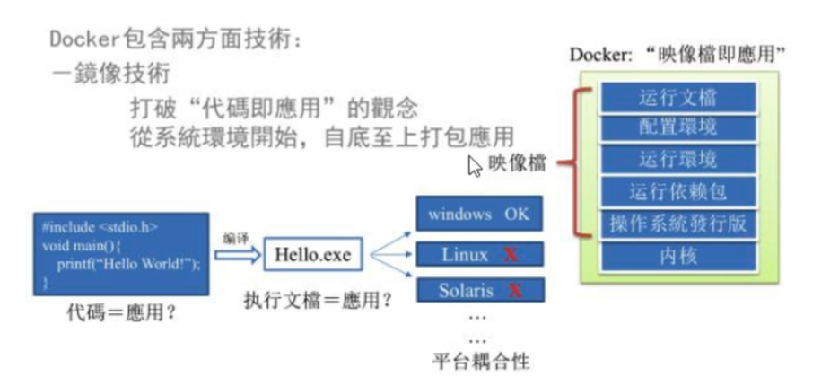

Docker 的优势：

- 解决运行环境不一致的问题
- 可以快速部署集群环境

Docker的主要目标是“Build Ship and Run Any App, Anywhere” 也就是通过对应用组件的封装、分发、部署、运行等生命周期管理，使用户的 APP 及其运行环境能够做到 “一次封装，到处运行”。

总结：Docker 是解决了运行环境和配置问题的软件容器，方便做持续集成并有助于整体发布的容器虚拟化技术

## 2. Docker 的发展

### 2.1. 虚拟机技术

虚拟机 （Virtual Machine） 就是带环境安装的一种解决方案。比如常见的 VMware ，它可以在一种操作系统里边运行另一种操作系统。对于底层系统来说，虚拟机就是一个普通的文件。将文件复制到其他虚拟机当中也可以完美复制部署环境。

虚拟机缺点：

- 资源占用多
- 冗余步骤多
- 启动慢

### 2.2. 容器虚拟化技术

由于虚拟机存在的这些缺点，Linux 发展出另外一种虚拟化技术： Linux 容器（Linux Container，缩写 LXC）

Linux 容器不是模拟一个完整的操作系统，而是对进程进行隔离。有了容器，就可以将软件运行所需要的所有资源打包到一个隔离的容器中，容器与虚拟机不同，不需要捆绑一整套操作系统，只需要软件工作所需要的的库资源和设置。系统因此变得高效轻量并保证部署在任何环境中的软件都能始终如一的运行。

### 2.3. 虚拟机与容器虚拟化的不同

- 虚拟机技术是虚拟出一套硬件，在其上运行一个完整的操作系统，在该系统上再运行所需要的应用进程
- 容器虚拟化技术中的应用程序直接作用于宿主的内核，容器没有自己的内核，而且也没有进行硬件虚拟，因此容器要比传统的虚拟机更为轻便。

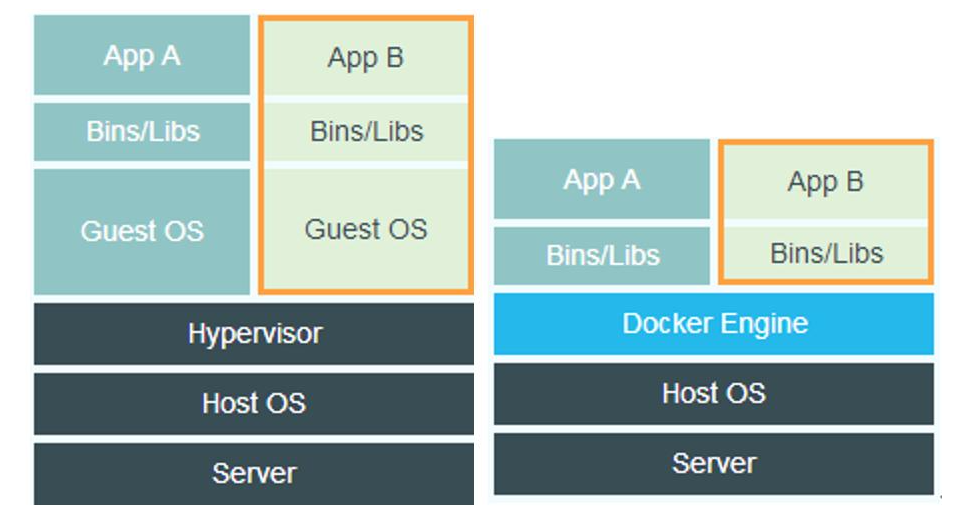

Docker 不需要实现硬件虚拟化，运行在 Docker 容器上的程序直接使用实际物理机的硬件资源，因此在 CPU、内存利用率上 Docker 会在效率上有明显优势。

Docker 利用的是宿主机内核，不需要 Guest OS，因此当新建一个容器时，Docker 不需要和虚拟机一样加载一个新的操作系统内核。Docker 直接使用宿主机的操作系统，所以新建一个 Docker 容器只需要几秒钟。

|            | Docker 容器              | 虚拟机（VM）                |
| ---------- | ------------------------ | --------------------------- |
| 操作系统   | 与宿主机共享OS           | 宿主机OS上运行虚拟机OS      |
| 存储大小   | 镜像小，便于存储和传输   | 镜像庞大(vmdk, vdi)         |
| 运行性能   | 几乎无额外性能损失       | 操作系统额外的CPU、内存消耗 |
| 移植性     | 轻便、灵活、适用于 Linux | 笨重、与虚拟化技术耦合度高  |
| 硬件亲和性 | 面向软件开发者           | 面向硬件运维人员            |
| 部署速度   | 秒级                     | 较慢                        |

## 3. Docker 架构

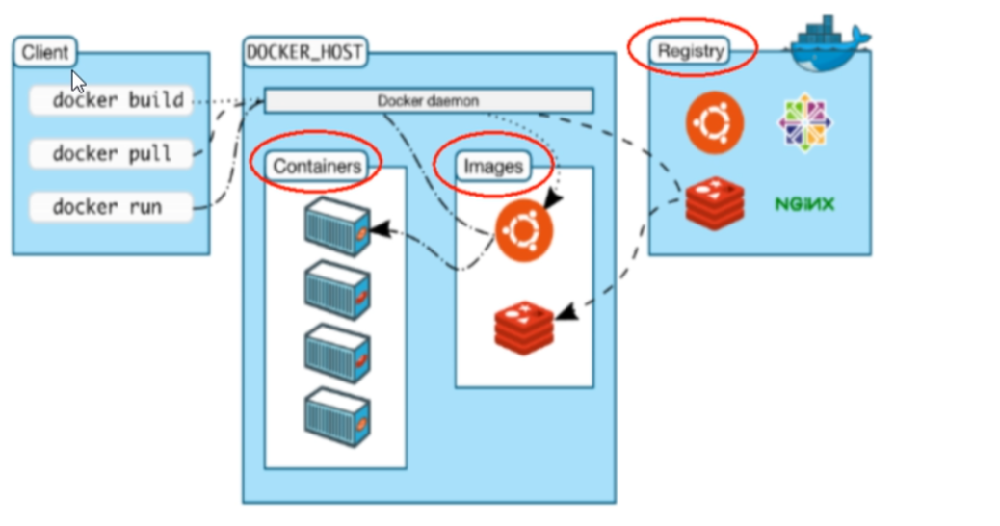

### 3.1. Docker 的基本组成

- 镜像（image）
- 容器（Container）
- 仓库（respository）

**镜像（Image）**

Docker 镜像（Image），就相当于是一个 root 文件系统。比如官方镜像 ubuntu:16.04 就包含了完整的一套 Ubuntu16.04 最小系统的 root 文件系统。

**容器（Container）**

镜像（Image）和容器（Container）的关系，就像是面向对象程序设计中的类和实例一样，镜像是静态的定义，容器是镜像运行时的实体。容器可以被创建、启动、停止、删除、暂停等。

可以把容器看做是一个简易版的 Linux 系统（包括 root 用户权限、进程空间、用户空间和网络空间等）和运行在其中的应用程序。容器的定义和镜像几乎是一样的，只不过容器是通过镜像来创建出来的。

**仓库（Repository）**

仓库可看成一个代码控制中心，用来保存镜像。

仓库（Respository）与 仓库注册服务器（Registry）的区别：

- 仓库只存放镜像（Public / Private）
- 仓库注册服务器可以存放仓库

Docker 本身是一个容器运行载体或称之为管理引擎，我们把应用程序和配置依赖打包好形成一个可以交付的运行环境，这个打包好的运行环境就是 image 镜像文件。只有通过这个镜像文件才能生成 Docker 容器，image 文件可以看做是容器的模板，Docker 根据 image 文件生成容器的实例，同一个 image 文件可以生成多个同时运行的容器实例。

## 4. Docker 运行原理

1. 从仓库提取镜像到本地主机
2. 主机利用镜像创建容器实例
3. 运行容器

# Docker 安装

## 1. Docker 下载

Docker 官网： https://www.docker.com/

Docker 中文网站：https://www.docker.org.cn/

Docker 仓库：https://hub.docker.com/

## 2. CentOS 安装 Docker

仅支持 CentOS 6.5 以上版本，最好使用 CentOS 7 以上版本。

查看内核命令

~~~
uname -r
~~~

查看版本信息

~~~
cat /etc/redhat-release
~~~

### 2.1 官方自动化脚本安装

~~~shell
curl -fsSL https://get.docker.com | bash -s docker --mirror aliyun
~~~

也可以使用国内 daocloud 一键安装命令：

~~~shell
curl -sSL https://get.daocloud.io/docker | sh
~~~

### 2.2 手动安装

首先需要卸载之前安装的 Docker 版本

~~~shell
$ sudo yum remove docker \
                  docker-client \
                  docker-client-latest \
                  docker-common \
                  docker-latest \
                  docker-latest-logrotate \
                  docker-logrotate \
                  docker-engine
~~~

**设置仓库**

在新主机上首次安装 Docker Engine-Community 之前，需要设置 Docker 仓库。之后，您可以从仓库安装和更新 Docker。

安装所需的软件包

~~~
yum -y install gcc
yum -y install gcc-c++
~~~

检查 gcc 安装成功

~~~
gcc -v
~~~

yum-utils 提供了 yum-config-manager ，并且 device mapper 存储驱动程序需要 device-mapper-persistent-data 和 lvm2。

~~~shell
$ sudo yum install -y yum-utils \
  device-mapper-persistent-data \
  lvm2
~~~

使用以下命令来设置稳定的仓库。

~~~shell
$ sudo yum-config-manager \
    --add-repo \
    https://download.docker.com/linux/centos/docker-ce.repo
~~~

使用阿里云仓库

~~~shell
$ sudo yum-config-manager \
    --add-repo \
    http://mirrors.aliyun.com/docker-ce/linux/centos/docker-ce.repo
~~~

**更新yum软件包索引**

~~~
yum makecache fast
~~~

**安装 Docker Engine-Community**

安装最新版本的 Docker Engine-Community 和 containerd，或者转到下一步安装特定版本：

~~~shell
$ sudo yum install docker-ce docker-ce-cli containerd.io
~~~

> 如果提示您接受 GPG 密钥，请选是。

安装指定版本

~~~shell
$ sudo yum install docker-ce-18.09.1 docker-ce-cli-18.09.1 containerd.io
~~~

### 2.3. 启动 Docker

~~~shell
$ sudo systemctl start docker
~~~

通过运行 hello-world 映像来验证是否正确安装了 Docker Engine-Community 。

~~~shell
$ sudo docker run hello-world
~~~

### 2.4. 卸载 Docker

删除安装包

~~~shell
 sudo yum remove docker-ce docker-ce-cli containerd.io
~~~

删除镜像、容器、配置文件等内容：

~~~shell
sudo rm -rf /var/lib/docker
sudo rm -rf /var/lib/containerd
~~~

## 3. Windows 安装 Docker

Docker 并非是一个通用的容器工具，它依赖于已存在并运行的 Linux 内核环境。Docker 实质上是在已经运行的 Linux 下制造了一个隔离的文件环境，因此它执行的效率几乎等同于所部署的 Linux 主机。

因此，Docker 必须部署在 Linux 内核的系统上，在 Windows 上部署 Docker 的方法都是先安装一个虚拟机，并在安装 Linux 系统的的虚拟机中运行 Docker。

前提条件：

- 64位处理器

- 4G以上内存

- 需要在 BIOS 中开启虚拟化设置

### 3.1. 安装 Hyper-V

**注意：**此方法仅适用于 Windows 10 操作系统专业版、企业版、教育版和部分家庭版！

Hyper-V 是微软开发的虚拟机，类似于 VMWare 或 VirtualBox，仅适用于 Windows 10。这是 Docker Desktop for Windows 所使用的虚拟机。

但是，这个虚拟机一旦启用，QEMU、VirtualBox 或 VMWare Workstation 15 及以下版本将无法使用！如果你必须在电脑上使用其他虚拟机（例如开发 Android 应用必须使用的模拟器），请不要使用 Hyper-V！

在开始菜单中搜索 “启用或关闭 Windows  功能”  - 找到 Hyper-V 服务

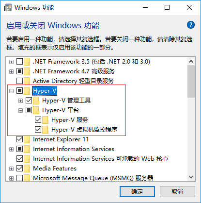

也可以用 Powershell 开启

~~~shell
Enable-WindowsOptionalFeature -Online -FeatureName Microsoft-Hyper-V -All
~~~

### 3.2. 安装 WSL 2

~~~
wsl --install
~~~

默认情况下，安装的 Linux 分发版为 Ubuntu。 可以使用 `wsl --install -d <Distribution Name>` 进行更改。 （将 `<Distribution Name>` 替换为所需分发版的名称。）初始安装后，可以使用 `wsl --install -d <Distribution Name>` 命令将其他 Linux 分发版添加到计算机。

若要查看可用 Linux 分发版的列表，请输入 `wsl --list --online`

### 3.3. 下载安装 Docker

下载 Docker 客户端

~~~
https://desktop.docker.com/win/stable/amd64/Docker%20Desktop%20Installer.exe
~~~

## 4. 镜像加速器

国内从 DockerHub 拉取镜像有时会遇到困难，此时可以配置镜像加速器。Docker 官方和国内很多云服务商都提供了国内加速器服务，例如：

~~~
科大镜像：https://docker.mirrors.ustc.edu.cn/
网易：https://hub-mirror.c.163.com/
阿里云：https://<你的ID>.mirror.aliyuncs.com
七牛云加速器：https://reg-mirror.qiniu.com
~~~

对于使用 systemd 的系统，请在 /etc/docker/daemon.json 中写入如下内容（如果文件不存在请新建该文件）：

~~~
{"registry-mirrors":["https://reg-mirror.qiniu.com/"]}
~~~

之后重新启动服务：

~~~
$ sudo systemctl daemon-reload
$ sudo systemctl restart docker
~~~

查看是否配置成功

~~~
$ docker info
~~~

对于使用 Windows 10 的系统，在系统右下角托盘 Docker 图标内右键菜单选择 Settings，打开配置窗口后左侧导航菜单选择 Daemon。在 Registrymirrors 一栏中填写加速器地址，之后点击 Apply 保存后 Docker 就会重启并应用配置的镜像地址了。

# Hello World

在本机测试 Docker

~~~docker
docker run hello-world
~~~

执行命令后：

1. 在本地查找 hello world 镜像
2. 如果本地没有镜像会从仓库中 pull 镜像
3. 镜像生成容器
4. 运行容器
5. 输出提示文字，容器停止运行

Docker 是一个 CS 结构的系统，Docker 守护进程运行在主机上（相当于一个管家）然后通过 Socket 连接从客户端访问，守护进程从客户端接受命令并管理运行在主机上的容器。

# Docker 命令

## 1. 帮助命令

查看版本信息

~~~
docker version
~~~

Docker 信息

~~~
docker info
~~~

查看帮助信息

~~~
docker --help
~~~

## 2. 镜像命令

### 2.1. images

查看本地镜像文件

~~~
docker images
~~~

运行后会列出本地镜像文件

~~~
REPOSITORY              TAG                 IMAGE ID            CREATED             SIZE
mymysql                 v1                  37af1236adef        5 minutes ago       329 MB
runoob/ubuntu           v4                  1c06aa18edee        2 days ago          142.1 MB
<none>                  <none>              5c6e1090e771        2 days ago          165.9 MB
httpd                   latest              ed38aaffef30        11 days ago         195.1 MB
alpine                  latest              4e38e38c8ce0        2 weeks ago         4.799 MB
mongo                   3.2                 282fd552add6        3 weeks ago         336.1 MB
redis                   latest              4465e4bcad80        3 weeks ago         185.7 MB
php                     5.6-fpm             025041cd3aa5        3 weeks ago         456.3 MB
python                  3.5                 045767ddf24a        3 weeks ago         684.1 MB
~~~

> 同一个仓库源可以有多个 TAG，代表这个仓库的不同版本，我们使用 REPOSITORY:TAG 来定义不同的镜像，如果不指定一个镜像的版本标签，默认为最新版本，如： httpd:latest

**Options**

~~~
-a			# 查询本地所有镜像文件（包括中间层）
-q			# 查看镜像id
-digests	# 显示镜像摘要信息
-no-trunc	# 显示完整镜像信息
~~~

> Options 参数可以连起来用如：`docker images -q -a`

另外可以搜索指定名称的镜像文件，如：

~~~
docker images ubuntu
~~~

运行结果：

~~~
REPOSITORY          TAG                 IMAGE ID            CREATED             SIZE
ubuntu              14.04               90d5884b1ee0        9 weeks ago         188 MB
ubuntu              15.10               4e3b13c8a266        3 months ago        136.3 MB
~~~

### 2.2. search

docker search 可以搜索镜像，从 hub.docker.com 上查找镜像，如：

~~~
docker search java
~~~

OPTIONS说明：

- **--automated :**只列出 automated build类型的镜像；
- **--no-trunc :**显示完整的镜像描述；
- **-f <过滤条件>:**列出收藏数不小于指定值的镜像。

例：从 Docker Hub 查找所有镜像名包含 java，并且收藏数大于 10 的镜像

~~~
runoob@runoob:~$ docker search -f stars=10 java
NAME                  DESCRIPTION                           STARS   OFFICIAL   AUTOMATED
java                  Java is a concurrent, class-based...   1037    [OK]       
anapsix/alpine-java   Oracle Java 8 (and 7) with GLIBC ...   115                [OK]
develar/java                                                 46                 [OK]
isuper/java-oracle    This repository contains all java...   38                 [OK]
lwieske/java-8        Oracle Java 8 Container - Full + ...   27                 [OK]
nimmis/java-centos    This is docker images of CentOS 7...   13                 [OK]
~~~

参数说明：

**NAME:** 镜像仓库源的名称

**DESCRIPTION:** 镜像的描述

**OFFICIAL:** 是否 docker 官方发布

**stars:** 类似 Github 里面的 star，表示点赞、喜欢的意思。

**AUTOMATED:** 自动构建。

### 2.3. pull

从镜像仓库中拉取或者更新指定镜像，语法：

~~~
docker pull [OPTIONS] NAME[:TAG|@DIGEST]
~~~

OPTIONS说明：

- **-a :**拉取所有 tagged 镜像
- **--disable-content-trust :**忽略镜像的校验,默认开启

实例：

~~~
docker pull java		# 从镜像源下载java最新版镜像。
docker pull java:3.2	# 从镜像源下载java 3.2 版本
docker pull -a java		# 从镜像源下载REPOSITORY为java的所有镜像。
~~~

> 如果没改镜像源的话，会从 Docker Hub 国外网站直接下载

### 2.4. rmi

删除本地一个或多个镜像，语法：

~~~
docker rmi [OPTIONS] IMAGE [IMAGE...]
~~~

OPTIONS说明：

- **-f :**强制删除；
- **--no-prune :**不移除该镜像的过程镜像，默认移除；

~~~
docker rmi hello-world									# 删除 hello-world:latest 镜像（默认删除最新版）
docker rmi -f runoob/ubuntu:v4							# 强制删除本地镜像 runoob/ubuntu:v4。
docker rmi -f hello-world:latest nginx:latest			# 强制删除多个镜像
docker rmi -f $(docker images -qa)						# 级联操作（删除所有镜像文件）
~~~

## 3. 容器命令

### 3.1 run

创建一个新的容器并运行一个命令，语法：

~~~
docker run [OPTIONS] IMAGE [COMMAND] [ARG...]
~~~

OPTIONS说明：

- **-a stdin:** 指定标准输入输出内容类型，可选 STDIN/STDOUT/STDERR 三项；
- **-d:** 后台运行容器，并返回容器ID；
- **-i:** 以交互模式运行容器，通常与 -t 同时使用；
- **-P:** 随机端口映射，容器内部端口**随机**映射到主机的端口
- **-p:** 指定端口映射，格式为：**主机(宿主)端口:容器端口**
- **-t:** 为容器重新分配一个伪输入终端，通常与 -i 同时使用；
- **--name="nginx-lb":** 为容器指定一个名称；
- **--dns 8.8.8.8:** 指定容器使用的DNS服务器，默认和宿主一致；
- **--dns-search example.com:** 指定容器DNS搜索域名，默认和宿主一致；
- **-h "mars":** 指定容器的hostname；
- **-e username="ritchie":** 设置环境变量；
- **--env-file=[]:** 从指定文件读入环境变量；
- **--cpuset="0-2" or --cpuset="0,1,2":** 绑定容器到指定CPU运行；
- **-m :**设置容器使用内存最大值；
- **--net="bridge":** 指定容器的网络连接类型，支持 bridge/host/none/container: 四种类型；
- **--link=[]:** 添加链接到另一个容器；
- **--expose=[]:** 开放一个端口或一组端口；
- **--volume , -v:** 绑定一个卷

实例：

~~~
# 使用镜像centos:latest以交互模式启动一个容器，并创建一个伪终端（也可以写镜像id来创建）
runoob@runoob:~$ docker run -it nginx:latest

# 使用docker镜像nginx:latest以后台模式启动一个容器,并将容器命名为mynginx。
docker run --name mynginx -d nginx:latest

# 使用镜像nginx:latest以后台模式启动一个容器,并将容器的80端口映射到主机随机端口。
docker run -P -d nginx:latest

# 使用镜像 nginx:latest，以后台模式启动一个容器,将容器的 80 端口映射到主机的 80 端口,主机的目录 /data 映射到容器的 /data。
docker run -p 80:80 -v /data:/data -d nginx:latest

# 绑定容器的 8080 端口，并将其映射到本地主机 127.0.0.1 的 80 端口上。
$ docker run -p 127.0.0.1:80:8080/tcp ubuntu bash
~~~

### 3.2 ps

列出容器，语法：

~~~
docker ps [OPTIONS]
~~~

OPTIONS说明：

- **-a :**显示所有的容器，包括未运行的。
- **-f :**根据条件过滤显示的内容。
- **--format :**指定返回值的模板文件。
- **-l :**显示最近创建的容器。
- **-n :**列出最近创建的n个容器。
- **--no-trunc :**不截断输出。
- **-q :**静默模式，只显示容器编号。
- **-s :**显示总的文件大小。

例：列出所有在运行的容器信息

~~~
runoob@runoob:~$ docker ps
CONTAINER ID   IMAGE          COMMAND                ...  PORTS                    NAMES
09b93464c2f7   nginx:latest   "nginx -g 'daemon off" ...  80/tcp, 443/tcp          myrunoob
96f7f14e99ab   mysql:5.6      "docker-entrypoint.sh" ...  0.0.0.0:3306->3306/tcp   mymysql
~~~

输出详情介绍：

**CONTAINER ID:** 容器 ID。

**IMAGE:** 使用的镜像。

**COMMAND:** 启动容器时运行的命令。

**CREATED:** 容器的创建时间。

**STATUS:** 容器状态，状态有7种：

- created（已创建）
- restarting（重启中）
- running（运行中）
- removing（迁移中）
- paused（暂停）
- exited（停止）
- dead（死亡）

**PORTS:** 容器的端口信息和使用的连接类型（tcp\udp）。

**NAMES:** 自动分配的容器名称。

~~~
docker ps -l			# 列出最近创建的容器信息
docker ps -n 5			# 列出最近创建的5个容器信息。
docker ps -a -q			# 列出所有创建的容器ID。
~~~

### 3.3 exit

- 使用 exit，退出容器，终止容器

- 使用 Ctrl+P+Q，则是暂时退出容器，容器仍然处于活动状态

### 3.4. start/restart/stop/kill

- start 启动容器
- restart 重启容器
- stop/kill 停止容器

语法：

~~~
docker start centos			# 通过容器名字启动
docker start 0a0a2455beed	# 通过id启动容器
docker kill 0a0a2455beed	# 强制停止容器
~~~

> 注意，同一个镜像可以创建多个容器，建议使用 id 启动/关闭 容器，或者使用别名。

### 3.5. rm

删除已停止的容器，可以使用 id 或 name 来删除已经停止的容器，语法：

~~~
docker rm [OPTIONS] CONTAINER [CONTAINER...]
~~~

OPTIONS说明：

- **-f :**通过 SIGKILL 信号强制删除一个运行中的容器。
- **-l :**移除容器间的网络连接，而非容器本身。
- **-v :**删除与容器关联的卷。

~~~
docker rm modest_stallman			# 通过 name 删除已经停止的容器
docker rm 0a0a2455beed				# 通过 id 删除已经停止的容器
docker rm -f $(docker ps -a -q)		# 删除所有停止运行的容器 
~~~

## 4. 容器命令进阶

### 4.1. 启动守护式容器

使用 run 命令在 docker 后台启动一个容器

~~~
docker run -d centos
~~~

这样启动的容器，使用 `docker ps` 命令无法查询，原因是在后台启动后，前台没有任何与后台交互的进程，容器就会自动退出了。如果让后台一直有活动，那么就不会被关闭，如：

~~~
docker run -d centos /bin/bash -c "while true; do echo hello docker;sleep 2;done"
~~~

> 此时再用 `docker ps` 命令查看，就会显示容器仍然在活动了。

如果是 tomcat 这种服务器类的服务，使用 -d 运行后，就会自动在后台挂起，也不会消失，如：

~~~
docker run -d -p 8888:8080 tomcat
~~~

> 因为本质上 tomcat 是一个一直在监听 http 请求的死循环

### 4.2. 查看容器日志

使用 logs ，可以查看容器日志，语法：

~~~
docker logs [OPTIONS] CONTAINER
~~~

OPTIONS说明：

- **-f :** 跟踪日志输出
- **--since :**显示某个开始时间的所有日志
- **-t :** 显示时间戳
- **--tail :**仅列出最新N条容器日志

像刚才的例子，我们让容器一直循环输出 'hello docker'，但是前台没有任何显示，可以使用 logs 命令查看容器日志，例：

~~~
docker logs 容器ID
~~~

> 此时就会显示容器的输出内容

### 4.3. 查看容器进程信息

查看容器中运行的进程信息，支持 ps 命令参数。语法：

~~~
docker top [OPTIONS] CONTAINER [ps OPTIONS]
~~~

> 容器运行时不一定有/bin/bash终端来交互执行top命令，而且容器还不一定有top命令，可以使用docker top来实现查看container中正在运行的进程。

例：查看容器mymysql的进程信息。

~~~
runoob@runoob:~/mysql$ docker top mymysql
UID    PID    PPID    C      STIME   TTY  TIME       CMD
999    40347  40331   18     00:58   ?    00:00:02   mysqld
~~~

### 4.4. 查看容器内细节

docker inspect : 获取容器/镜像的元数据。语法：

~~~
docker inspect [OPTIONS] NAME|ID [NAME|ID...]
~~~

OPTIONS说明：

- **-f :**指定返回值的模板文件。
- **-s :**显示总的文件大小。
- **--type :**为指定类型返回JSON。

例：获取镜像mysql:5.6的元信息。

~~~
runoob@runoob:~$ docker inspect mysql:5.6
[
    {
        "Id": "sha256:2c0964ec182ae9a045f866bbc2553087f6e42bfc16074a74fb820af235f070ec",
        "RepoTags": [
            "mysql:5.6"
        ],
        "RepoDigests": [],
        "Parent": "",
        "Comment": "",
        "Created": "2016-05-24T04:01:41.168371815Z",
        "Container": "e0924bc460ff97787f34610115e9363e6363b30b8efa406e28eb495ab199ca54",
        "ContainerConfig": {
            "Hostname": "b0cf605c7757",
            "Domainname": "",
            "User": "",
            "AttachStdin": false,
            "AttachStdout": false,
            "AttachStderr": false,
            "ExposedPorts": {
                "3306/tcp": {}
            },
...
~~~

### 4.5. 重新进入暂停活动的容器

使用 Ctrl+P+Q 会暂时退出容器，但是容器依然活动，可以使用 attach 命令重新进入容器

~~~
docker attach [OPTIONS] CONTAINER
~~~

### 4.6. 执行容器内部命令并返回结果

和 attach 命令不同，exec 命令可以在容器外部得到容器内命令的结果，语法：

~~~
docker exec [OPTIONS] CONTAINER COMMAND [ARG...]
~~~

OPTIONS说明：

- **-d :**分离模式: 在后台运行
- **-i :**即使没有附加也保持STDIN 打开
- **-t :**分配一个伪终端

例：

~~~
docker exec -t 0a0a2455beed ls -l /tmp				# 在 CentOS 容器中运行 ls 命令，并返回结果
docker exec -t 0a0a2455beed /bin/bash				# 在 CentOS 容器中开启一个新的终端进程（返回结果就是外部进入该终端）
docker exec -it mynginx /bin/bash /root/runoob.sh		# 在容器 mynginx 中以交互模式执行容器内 /root/runoob.sh 脚本
~~~

- attach 命令进入容器，exit 退出会导致容器关闭
- exec 命令进入容器，exit 不会导致容器关闭

### 4.7. 容器与主机之间的数据传输

docker cp 用于容器与主机之间的数据拷贝。

~~~
docker cp [OPTIONS] CONTAINER:SRC_PATH DEST_PATH|-
docker cp [OPTIONS] SRC_PATH|- CONTAINER:DEST_PATH
~~~

OPTIONS说明：

- **-L :**保持源目标中的链接

例：

~~~
docker cp /www/runoob 96f7f14e99ab:/www/		# 将主机/www/runoob目录拷贝到容器96f7f14e99ab的/www目录下
docker cp /www/runoob 96f7f14e99ab:/www			# 将主机/www/runoob目录拷贝到容器96f7f14e99ab中，目录重命名为www。
docker cp  96f7f14e99ab:/www /tmp/				# 将容器96f7f14e99ab的/www目录拷贝到主机的/tmp目录中。
~~~

# Docker 镜像

镜像是一种轻量级、可执行的独立软件包，用来打包软件运行环境和基于运行环境开发的软件，它包含运行某个软件所需的所有内容，包括代码、运行时、库、环境变量和配置文件。

## 1. UnionFS

UnionFS 联合文件系统是一种分层、轻量级并且高性能的文件系统，它支持对文件系统的修改作为一次提交，一层层的叠加，同时可以将不同的目录挂载到同一个虚拟文件系统下（unite several driectories into a single virtual filesystem）。Union 文件系统是 Docker 镜像的基础。镜像可以通过分层来进行继承，基于基础镜像（没有父镜像），可以制作各种具体的应用镜像。

特性：一次同时挂载多个文件系统，但从外面看起来，只能看到一个文件系统，联合加载会把各层文件系统叠加起来，这样形成最终的文件系统会包含所有底层文件和目录。

## 2. 镜像加载原理

docker的镜像实际上就是由 UnionFS 联合文件系统，一层一层的文件系统组成，

**bootfs (boot file system)** 

主要包含bootloader和kernel，bootloader主要是引导加载kernel，Linux刚启动时会加载bootfs文件系统，在Docker镜像的最底层是bootfs。这一层与我们典型的Linux/Unix系统是一样的, 包含boot加载器和内核。当boot加载完成之后整个内核就都在内存中了，此时内存的使用权已由bootfs转交给内核，此时系统也会卸载bootfs。

**rootfs(root file system)**

在bootfs之上。包含的就是典型Linux系统中的/dev, /proc, /bin, /etc等标准目录和文件。rootfs就是各种不同的操作系统发行版，比如Ubuntu，Centos等等。

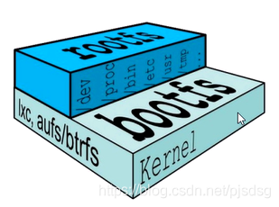

平时我们安装虚拟机的CentOS都是好几个G，为什么docker这里才200M？

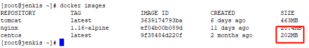

对于一个精简的OS，rootfs可以很小，只需要包括最基本的命令、工具和程序库就可以了，因为底层直接用Host的kernel，自己只需要提供rootfs就行了。由此可见对于不同的linux发行版，bootfs基本是一致的，rootfs会有差别，因此不同的发行版可以共用bootfs。

## 3. 镜像分层

以我们的pull为例，在下载的过程中我们可以看到docker的镜像好像是在一层一层的在下载

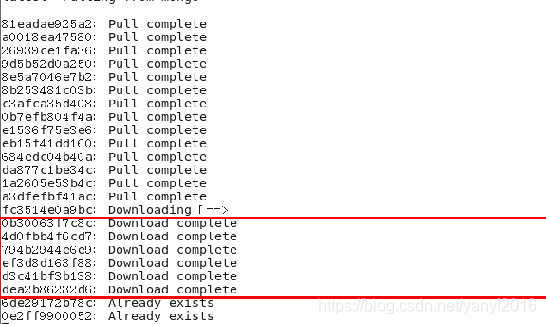

采用分层结构的最大的一个好处就是**共享资源**
比如：有多个镜像都从相同的base镜像构建而来，那么宿主机只需在磁盘上保存一份base镜像,同时内存中也只需加载一份base镜像，就可以为所有容器服务了。而且镜像的每一层都可以被共享。

tomcat 镜像占用文件比较大，就是因为里边的分层比较多，它包含了 kernel、centos、idk8、tomcat 等各种应用。

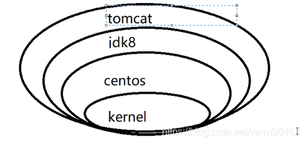

## 4. 镜像的特点

Docker镜像都是只读的，当容器启动时，一个新的可写层被加载到镜像的顶部。这一层通常被称作为"容器层"，“容器层”之下的都叫"镜像层"。比如之前的 tomcat，只有最外层是可写的，也就是我们的实际应用层，容器内部包含的其他层则是只读的。

## 5. 创建镜像

docker commit 命令可以从容器创建一个新的镜像，语法：

~~~
docker commit [OPTIONS] CONTAINER [REPOSITORY[:TAG]]
~~~

OPTIONS说明：

- **-a :**提交的镜像作者；
- **-c :**使用Dockerfile指令来创建镜像；
- **-m :**提交时的说明文字；
- **-p :**在commit时，将容器暂停。

类似于 git，我们在原本镜像生成的容器上做了调试修改后，可以利用 commit 命令将修改后的容器打包成新的镜像。如：

~~~
# 创建并运行容器
docker run -p 8888:8080 tomcat

# 进入容器
docker exec -it xxxxxx /bin/bash

# 删除文档
rm -rf webapp/docs

# 退出容器
exit

# 打包镜像并提交
docker commit -a "forece" -m "tomcat without docs" xxxxxxxx forece/tomcat:1.01
~~~

将容器a404c6c174a2 保存为新的镜像,并添加提交人信息和说明信息。

~~~
runoob@runoob:~$ docker commit -a "runoob.com" -m "my apache" a404c6c174a2  mymysql:v1 
sha256:37af1236adef1544e8886be23010b66577647a40bc02c0885a6600b33ee28057
runoob@runoob:~$ docker images mymysql:v1
REPOSITORY          TAG                 IMAGE ID            CREATED             SIZE
mymysql             v1                  37af1236adef        15 seconds ago      329 MB
~~~

> 仓库名可以标准化写 作者名/镜像名:版本号

在运行创建容器的时候，需要带上版本号，如：

~~~
docker run -p 8888:8080 forece/tomcat:1.01
~~~

# Docker 容器数据卷

如果容器没有被 commit 做为镜像的话，那么容器被关闭，或者被销毁，容器内部的数据就无法取出，容器数据卷就是为了将容器内部的数据持久化。并且可以使容器间实现继承、共享数据的功能。

特点：

- 数据卷可在容器之间共享或重用数据
- 卷中的更改可以直接生效
- 数据卷中的更改不会包含在镜像的更新中
- 数据卷的生命周期一直持续到没有容器使用它为止数据卷

## 1. 创建数据容器卷

类似于共享目录：

~~~
docker run -it -v 宿主机绝对路径：/容器内目录 镜像名|镜像id
~~~

例：

~~~
docker run -it -v /hostData:/containerData centos
~~~

> 会在主机和容器中自动创建对应文件夹

之后可以用 inspect 命令来查看是否绑定成功：

~~~
docker inspect 容器ID
~~~

当共享文件夹被修改后，exit 退出容器后，重新用 docker start 开启并用 exec -it 重新进入后，容器内文件会自动同步主机上的共享文件夹。

## 2. 修改数据容器卷权限

使用 `:ro` 可以修改容器卷的权限，使文件夹变为只读，如：

~~~
docker run -v /hostData:/containerData:ro centos
~~~

用 inspect 命令可以看到 RW 权限显示 False

注意：如果容器内目录没有使用 ro 只读修改也不能写入，出现错误 cannot open directory .: Permission denied 

解决办法：那么在创建的时候需要使用参数 `--privileged=ture`

~~~
docker run -v /hostData:/containerData --privileged=true centos
~~~

# DockerFile

## 1. 创建 dockerfile 文件

Dockerfile 是一个用来构建镜像的文本文件，文本内容包含了一条条构建镜像所需的指令和说明。

在一个空目录下，新建一个名为 Dockerfile 文件，并在文件内添加以下内容：

~~~
# volume test
FROM centos
VOLUME ["/dataContainer1", "/dataContainer2"]
CMD echo "finished, --------success1"
CMD /bin/bash
~~~

- **FROM**：定制的镜像都是基于 FROM 的镜像，这里的 centos 就是定制需要的基础镜像。后续的操作都是基于 centos。
- **VOLUME**：定义匿名数据卷。在启动容器时忘记挂载数据卷，会自动挂载到匿名卷。

相当于如下代码：

~~~
docker run -it -v /host1:/dataContainer1 -v /host2:/dataContainer2 centos /bin/bash
~~~

## 2. 利用 dockerfile 创建镜像

docker build 命令用于使用 Dockerfile 创建镜像，语法：

~~~
docker build [OPTIONS] PATH | URL | -
~~~

OPTIONS说明：

- **--build-arg=[] :**设置镜像创建时的变量；
- **--cpu-shares :**设置 cpu 使用权重；
- **--cpu-period :**限制 CPU CFS周期；
- **--cpu-quota :**限制 CPU CFS配额；
- **--cpuset-cpus :**指定使用的CPU id；
- **--cpuset-mems :**指定使用的内存 id；
- **--disable-content-trust :**忽略校验，默认开启；
- **-f :**指定要使用的Dockerfile路径；（不写参数，默认读取 Dockerfile 文件）
- **--force-rm :**设置镜像过程中删除中间容器；
- **--isolation :**使用容器隔离技术；
- **--label=[] :**设置镜像使用的元数据；
- **-m :**设置内存最大值；
- **--memory-swap :**设置Swap的最大值为内存+swap，"-1"表示不限swap；
- **--no-cache :**创建镜像的过程不使用缓存；
- **--pull :**尝试去更新镜像的新版本；
- **--quiet, -q :**安静模式，成功后只输出镜像 ID；
- **--rm :**设置镜像成功后删除中间容器；
- **--shm-size :**设置/dev/shm的大小，默认值是64M；
- **--ulimit :**Ulimit配置。
- **--squash :**将 Dockerfile 中所有的操作压缩为一层。
- **--tag, -t:** 镜像的名字及标签，通常 name:tag 或者 name 格式；可以在一次构建中为一个镜像设置多个标签。
- **--network:** 默认 default。在构建期间设置RUN指令的网络模式

在刚才创建的文件夹中，运行 build 命令

~~~
docker build -f ./dockerfile -t forece/centos .
~~~

> 会在当前目录下得到新的镜像文件

之后利用 run 命令创建加载新的镜像

~~~
docker run -it forece/centos
~~~

新的容器会自动创建两个刚才指定名称的共享目录在容器中，而在主机中如果没有用 -v 指定的话，那么会使用默认路径，需要用 inspect 命令查看。默认路径一般为：

~~~
/var/lib/docker/volumes/xxxxxxx/_data
~~~

## 3. 容器之间共享数据

用之前 build 过的镜像，创建一个父容器

~~~
docker run -it --name dc01 forece/centos
~~~

使用 Ctrl+P+Q 暂时退出容器，然后用 --volume-from 参数创建其他容器，使 dc02 中的数据卷与 dc01 同步

~~~
docker run -it --name dc02 --volume-from dc01 forece/centos
~~~

同理创建 dc03 ，也会与 dc02 和 dc01 同步

~~~
docker run -it --name dc03 --volume-from dc01 forece/centos
~~~

创建共享连接后，虽然 dc02 和 dc03 是来自 dc01，但是如果删除 dc01 容器，dc02和dc03 之间的数据依然存在。

结论：容器之间配置信息的传递，数据卷的生命周期一直持续到没有容器使用它为止

## 4. Dockerfile 的基本结构

Dockerfile 一般分为四部分：基础镜像信息、维护者信息、镜像操作指令和容器启动时执行指令，’#’ 为 Dockerfile 中的注释。

## 5. Dockerfile 的指令

Docker以从上到下的顺序运行Dockerfile的指令。为了指定基本映像，第一条指令必须是*FROM*。一个声明以`＃`字符开头则被视为注释。可以在Docker文件中使用`RUN`，`CMD`，`FROM`，`EXPOSE`，`ENV`等指令。

- Dockerfile 内部保留指令必须为大写字母且后边要跟随至少一个参数

- 指令从上到下，顺序执行

- `#` 表示注释

- 每条指令都会创建一个新的镜像层，并对镜像进行提交

  

Dockerfile 执行大致流程

- docker 从基础镜像运行一个容器
- 执行一条指令并对容器做出修改
- 执行类似 docker commit 的操作提交一个新的镜像层
- docker 再基于刚刚提交的镜像运行一个新的容器
- 执行 dockerfile 中的下一条指令，直到所有指令执行完毕

### 5.1. FROM

指定基础镜像，必须为第一个命令

~~~
格式：
　　FROM <image>
　　FROM <image>:<tag>
　　FROM <image>@<digest>

示例：
　　FROM mysql:5.6

注：
　　tag或digest是可选的，如果不使用这两个值时，会使用latest版本的基础镜像
~~~

### 5.2. MAINTAINER

维护者信息

~~~
格式：
    MAINTAINER <name>

示例：
    MAINTAINER Jasper Xu
    MAINTAINER sorex@163.com
    MAINTAINER Jasper Xu <sorex@163.com>
~~~

### 5.3. RUN

构建镜像时执行的命令，RUN用于在镜像容器中执行命令，其有以下两种命令执行方式：

~~~
shell执行
格式：
    RUN <command>

exec执行
格式：
    RUN ["executable", "param1", "param2"]

示例：
    RUN ["executable", "param1", "param2"]
    RUN apk update
    RUN ["/etc/execfile", "arg1", "arg1"]

注：
　　RUN指令创建的中间镜像会被缓存，并会在下次构建中使用。如果不想使用这些缓存镜像，可以在构建时指定--no-cache参数，如：docker build --no-cache
~~~

### 5.4. ADD

将本地文件添加到容器中，tar类型文件会自动解压(网络压缩资源不会被解压)，可以访问网络资源，类似wget

~~~
格式：
    ADD <src>... <dest>
    ADD ["<src>",... "<dest>"] 用于支持包含空格的路径

示例：
    ADD hom* /mydir/          # 添加所有以"hom"开头的文件
    ADD hom?.txt /mydir/      # ? 替代一个单字符,例如："home.txt"
    ADD test relativeDir/     # 添加 "test" 到 `WORKDIR`/relativeDir/
    ADD test /absoluteDir/    # 添加 "test" 到 /absoluteDir/
~~~

### 5.5. COPY

使用方法类似ADD，但是是不会自动解压文件，也不能访问网络资源

### 5.6. CMD

构建容器后调用，也就是在容器启动时才进行调用。

~~~
格式：
    CMD ["executable","param1","param2"] (执行可执行文件，优先)
    CMD ["param1","param2"] (设置了ENTRYPOINT，则直接调用ENTRYPOINT添加参数)
    CMD command param1 param2 (执行shell内部命令)

示例：
    CMD echo "This is a test." | wc -
    CMD ["/usr/bin/wc","--help"]
    CMD ["catalina.sh", "run"]

注：
 　　CMD不同于RUN，CMD用于指定在容器启动时所要执行的命令，而RUN用于指定镜像构建时所要执行的命令。
~~~

dockerfile 中可以有多个 CMD 命令，但是只有最后一个生效，如果 docker run 之后有参数，则 CMD 命令会被替换，如：

~~~
docker run -it -p 8888:8080 tomcat ls -l
~~~

则会替换掉默认执行的 `CMD ["catalina.sh", "run"]` 命令

### 5.7. ENTRYPOINT

配置容器，使其可执行化。配合CMD可省去"application"，只使用参数。

~~~
格式：
    ENTRYPOINT ["executable", "param1", "param2"] (可执行文件, 优先)
    ENTRYPOINT command param1 param2 (shell内部命令)

示例：
    FROM ubuntu
    ENTRYPOINT ["top", "-b"]
    CMD ["-c"]
注：
ENTRYPOINT与CMD非常类似，不同的是通过docker run执行的命令不会覆盖ENTRYPOINT，而docker run命令中指定的任何参数，都会被当做参数再次传递给ENTRYPOINT。Dockerfile中只允许有一个ENTRYPOINT命令，多指定时会覆盖前面的设置，而只执行最后的ENTRYPOINT指令。
~~~

### 5.8. LABEL

用于为镜像添加元数据

~~~
格式：
    LABEL <key>=<value> <key>=<value> <key>=<value> ...
示例：
　　LABEL version="1.0" description="这是一个Web服务器" by="IT笔录"
注：
　　使用LABEL指定元数据时，一条LABEL指定可以指定一或多条元数据，指定多条元数据时不同元数据之间通过空格分隔。推荐将所有的元数据通过一条LABEL指令指定，以免生成过多的中间镜像。
~~~

### 5.9. ENV

设置环境变量

~~~
格式：
    # <key>之后的所有内容均会被视为其<value>的组成部分，因此，一次只能设置一个变量
    ENV <key> <value>  		

	# 可以设置多个变量，每个变量为一个"<key>=<value>"的键值对，如果<key>中包含空格，可以使用\来进行转义，也可以通过""来进行标示；
	# 另外，反斜线也可以用于续行
    ENV <key>=<value> ...  	

示例：
    ENV myName John Doe
    ENV myDog Rex The Dog
    ENV myCat=fluffy
~~~

### 5.10. EXPOSE

指定于外界交互的端口

~~~
格式：
    EXPOSE <port> [<port>...]

示例：
    EXPOSE 80 443
    EXPOSE 8080
    EXPOSE 11211/tcp 11211/udp

注：
　　EXPOSE并不会让容器的端口访问到主机。要使其可访问，需要在docker run运行容器时通过-p来发布这些端口，或通过-P参数来发布EXPOSE导出的所有端口
~~~

### 5.11. VOLUME

用于指定持久化目录

~~~
格式：
    VOLUME ["/path/to/dir"]

示例：
    VOLUME ["/data"]
    VOLUME ["/var/www", "/var/log/apache2", "/etc/apache2"

注：
　　一个卷可以存在于一个或多个容器的指定目录，该目录可以绕过联合文件系统，并具有以下功能：
~~~

- 卷可以容器间共享和重用
- 容器并不一定要和其它容器共享卷
- 修改卷后会立即生效
- 对卷的修改不会对镜像产生影响
- 卷会一直存在，直到没有任何容器在使用它

### 5.12. WORKDIR

工作目录，类似于cd命令

~~~
格式：
    WORKDIR /path/to/workdir

示例：
    WORKDIR /a  (这时工作目录为/a)
    WORKDIR b  (这时工作目录为/a/b)
    WORKDIR c  (这时工作目录为/a/b/c)

注：
　　通过WORKDIR设置工作目录后，Dockerfile中其后的命令RUN、CMD、ENTRYPOINT、ADD、COPY等命令都会在该目录下执行。在使用docker run运行容器时，可以通过-w参数覆盖构建时所设置的工作目录。
~~~

### 5.13. USER

指定运行容器时的用户名或 UID，后续的 RUN 也会使用指定用户。使用USER指定用户时，可以使用用户名、UID或GID，或是两者的组合。当服务不需要管理员权限时，可以通过该命令指定运行用户。并且可以在之前创建所需要的用户

~~~
格式:
　　USER user
　　USER user:group
　　USER uid
　　USER uid:gid
　　USER user:gid
　　USER uid:group

 示例：
　　USER www

 注：

　　使用USER指定用户后，Dockerfile中其后的命令RUN、CMD、ENTRYPOINT都将使用该用户。镜像构建完成后，通过docker run运行容器时，可以通过-u参数来覆盖所指定的用户。
~~~

### 5.14. ARG

用于指定传递给构建运行时的变量

~~~
格式：
    ARG <name>[=<default value>]
示例：
    ARG site
    ARG build_user=www
~~~

### 5.15. ONBUILD

用于设置镜像触发器

~~~
格式：
　　ONBUILD [INSTRUCTION]
示例：
　　ONBUILD ADD . /app/src
　　ONBUILD RUN /usr/local/bin/python-build --dir /app/src
注：
　　当所构建的镜像被用做其它镜像的基础镜像，该镜像中的触发器将会被钥触发
~~~

## 6. history

使用 docker history 命令可以查看指定镜像的创建历史。语法：

~~~
docker history [OPTIONS] IMAGE|IMAGE ID
~~~

OPTIONS说明：

- **-H :**以可读的格式打印镜像大小和日期，默认为true；
- **--no-trunc :**显示完整的提交记录；
- **-q :**仅列出提交记录ID。

可使用 docker images 查看镜像ID

例：查看本地镜像runoob/ubuntu:v3的创建历史。

~~~
root@runoob:~# docker history runoob/ubuntu:v3
IMAGE             CREATED           CREATED BY                                      SIZE      COMMENT
4e3b13c8a266      3 months ago      /bin/sh -c #(nop) CMD ["/bin/bash"]             0 B                 
<missing>         3 months ago      /bin/sh -c sed -i 's/^#\s*\(deb.*universe\)$/   1.863 kB            
<missing>         3 months ago      /bin/sh -c set -xe   && echo '#!/bin/sh' > /u   701 B               
<missing>         3 months ago      /bin/sh -c #(nop) ADD file:43cb048516c6b80f22   136.3 MB
~~~

## 7. 练习

### 7.1. 自定义镜像文件

自定义 mycentos 镜像，使之具备如下功能：

- 修改登录后默认路径
- 支持 vim 编辑器
- 支持 ifconfig 命令

~~~
FROM centos

# 定义作者
MAINTAINER forece<forece@gmail.com>

# 定义环境变量
ENV mypath /tmp

# 定义进入容器后的默认目录
WORKDIR $mypath

# 安装指定程序
RUN yum -y install vim
RUN yum -y insatll net-tools

# 指定默认端口
EXPOSE 80

# CMD 命令进入命令行模式
CMD /bin/bash
~~~

### 7.2. CMD 和 ENTRYPOINT

制作一个可查询 ip 的镜像文件

~~~
FROM centos
RUN yum install -y curl
CMD ["curl", "-s", "http://ip.cn"]
~~~

执行：

~~~
docker run myip
~~~

如果使用 CMD 作为最后执行命令的话，那么如果加参数 -i 的话，则会替换掉之前的默认命令，变成这个样子

~~~
CMD ["curl", "-s", "http://ip.cn"]
CMD -i
~~~

容器启动后并不会执行 curl 命令，而是直接执行 -i，所以报错，为了避免这个错误，则需要使用 ENTRYPOINT，可以追加参数

~~~
FROM centos
RUN yum install -y curl
ENTRYPOINT ["curl", "-s", "http://ip.cn"]
~~~

### 7.3. ONBUILD 触发器

父类镜像

~~~
FROM centos
RUN yum install -y curl
ENTRYPOINT ["curl", "-s", "http://ip.cn"]
ONBUILD RUN echo "father image"
~~~

构建父类

~~~
docker build -f ./dockerfile1 -t forece/myip_father .
~~~

子类镜像

~~~
FROM forece/myip_son
RUN yum install -y curl
ENTRYPOINT ["curl", "-s", "http://ip.cn"]
~~~

构建子类镜像

~~~
docker build -f ./dockerfile2 -t forece/myip_son .
~~~

> 当构建子类镜像的时候，由于使用的是父类镜像进行的构建，所以在构建的时候使触发器执行了 `ONBUILD` 后边的 `echo`命令

### 7.4. ADD 和 COPY

~~~
FROM centos
MAINTAINER syy<123@qq.com>

# 把宿主机当前目录的c.txt拷贝到容器 /usr/local 路径下
COPY c.txt /usr/local/cincontainer.txt

# 把Java与Tomcat添加到容器中
ADD jdk-8u40-linux-x64.gz /usr/local
ADD tomcat.tar.gz /usr/local

# 安装vim编辑器
RUN yum install -y vim

# 设置工作路径
ENV MYPATH /usr/local
WORKDIR $MYPATH

# 配置Java与Tomcat环境变量
ENV JAVA_HOME /usr/local/jdk-8u40-linux-x64.gz
ENV CLASSPATH $JAVA_HOME/lib/dt.jar:$JAVA_HOME/lib/tools.jar
ENV CATALINA_HOME /usr/local/apache-tomcat-000
ENV CATALINA_BASE /usr/local/apache-tomcat-000
ENV PATH $PATH:$JAVA_HOME/bin:$CATALINA_HOME/lib:$CATALINA_HOME/bin

# 容器运行时监听的端口
EXPOSE 8080

# 启动时运行Tomcat
#ENTRYPOINT ["/usr/local/apache-tomcat-000/bin/startup.sh"]
#CMD ["/usr/local/apache-tomcat-000/bin/catalina.sh","run"]
CMD /usr/local/apache-tomcat-000/bin/startup.sh && tailf -F /usr/local/apache-tomcat-000/bin/logs/catalina.out
~~~

# Docker 常用安装

总体步骤：

- 搜索镜像
- 拉取镜像
- 查看镜像
- 启动镜像
- 停止容器
- 移除容器

## 1. 安装 tomcat

搜索镜像

~~~
docker search tomcat
~~~

拉取镜像

~~~
docker pull tomcat:latest
~~~

查看镜像

~~~
docker images
~~~

运行镜像

~~~
docker run -it -p 8080:8080 tomcat
~~~

## 2. 安装 mysql

搜索拉取

~~~
docker search mysql -f stars=50
docker pull mysql:5.6
~~~

运行 mysql

~~~
docker run -p 12345:3306 --name mysql \
-v /mysql_container/conf:/etc/mysql/conf.d
-v /mysql_container/logs:/logs
-v /mysql_container/data:/var/lib/mysql
-e MYSQL_ROOT_PASSWORD=123456
-d mysql:5.6
~~~

> -e 设置环境变量

由于是后台运行，需要使用 exec 进入终端模式

~~~
docker exec -it id /bin/bash
~~~

**windows 连接 docker 容器 mysql**

通过外部 windows navicat 连接数据库，在 centos 中获取 ip，然后我们就可以通过之前设置的端口映射进入到 docker 容器中的 mysql了。

**宿主备份 docker 容器 mysql 数据库**

~~~
docker exec id sh -c 'exec mysqldump --all-databases -uroot -p"123456"' > /mysql_container/databases.sql
~~~

## 3. 安装 redis

拉取 redis

~~~
docker pull redis
~~~

创建容器

~~~
docker run -p 6379:6379 
-v /zzyyuse/myredis/data:/data 
-v /zzyyuse/myredis/conf/redis.conf:/usr/local/etc/redis/redis.conf  
-d redis:3.2 redis-server /usr/local/etc/redis/redis.conf 
--appendonly yes
~~~

测试redis-cli连接上来

~~~
docker exec -it 运行着Rediis服务的容器ID redis-cli
~~~

# 提交到 Docker 远程仓库

## 1. 保存镜像

使用 commit 将修改好的镜像提交到本地仓库

~~~
docker commit -a forece -m "mod_centos" 容器id mycentos:1.4
~~~

## 2. 阿里云创建仓库镜像

## 3. 将镜像推送到阿里云

https://cr.console.aliyun.com/cn-hangzhou/instance/repositories

### 3.1 创建镜像仓库

创建镜像仓库

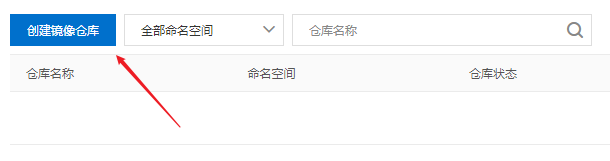

填写命名空间、仓库名称等信息

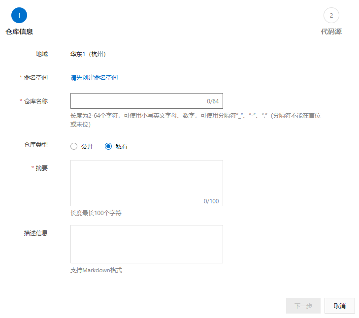

使用本地仓库

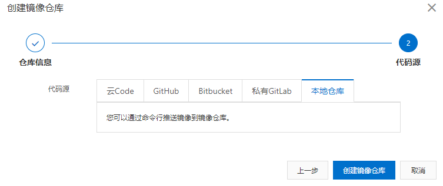

### 3.2 获取推送镜像代码

创建完仓库，点击侧边栏管理

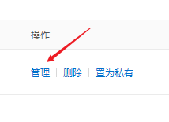

拿到推送到镜像服务器的代码

~~~
$ docker login --username=fo****@gmail.com registry.cn-hangzhou.aliyuncs.com
$ docker tag [ImageId] registry.cn-hangzhou.aliyuncs.com/forece/init:[镜像版本号]
$ docker push registry.cn-hangzhou.aliyuncs.com/forece/init:[镜像版本号]
~~~

> 远程仓库镜像版本号可以与本地不一致

## 4. 拉取远程仓库镜像

~~~
$ docker pull registry.cn-hangzhou.aliyuncs.com/forece/init:[镜像版本号
~~~

