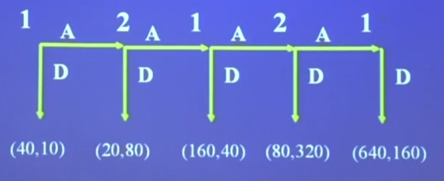
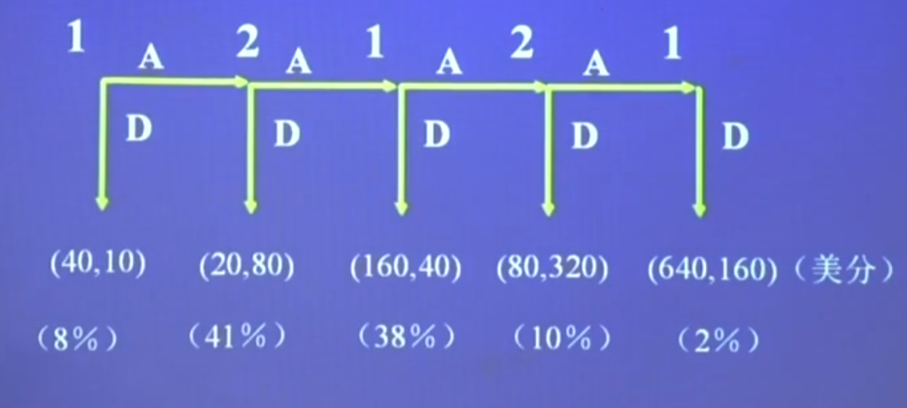
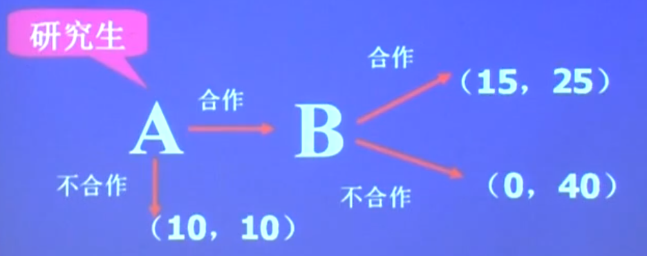
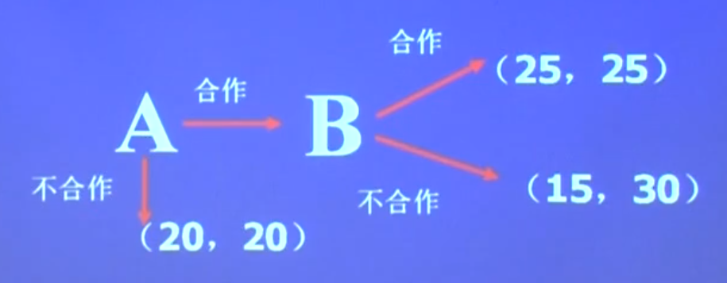
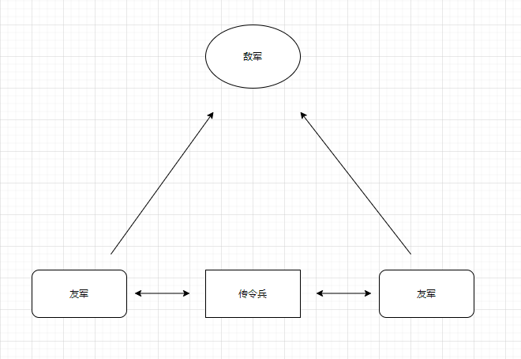
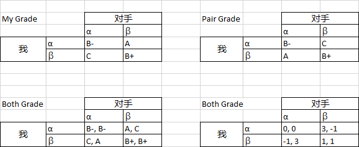
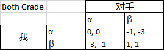

# 一、概述

## 1. 何为博弈

博弈论，又称为对策论（Game Theory）、赛局理论等，既是现代数学的一个新分支，也是运筹学的一个重要学科。 博弈论主要研究公式化了的激励结构间的相互作用，是研究具有斗争或竞争性质现象的数学理论和方法。 博弈论考虑游戏中的个体的预测行为和实际行为，并研究它们的优化策略。

博弈论已经成为经济学的标准分析工具之一。在金融学、证券学、生物学、经济学、国际关系、计算机科学、政治学、军事战略和其他很多学科都有广泛的应用。

博弈论是二人在平等的对局中各自利用对方的策略变换自己的对抗策略，达到取胜的目的。博弈论思想古已有之，中国古代的《孙子兵法》等著作就不仅是一部军事著作，而且算是最早的一部博弈论著作。博弈论最初主要研究象棋、桥牌、赌博中的胜负问题，人们对博弈局势的把握只停留在经验上，没有向理论化发展。

知人者智，自知者明

胜人者力，自胜者强

小胜者术，大胜者德

**推荐书目：**

《用博弈的思维看世界》 - 蒋文华

《博弈论与信息经济学》 - 张维迎

《活学活用博弈论》 - 詹姆斯·弥勒

《策略思维》 - 阿维纳什

《妙趣横生博弈论》 - 阿维纳什

《博弈与信息》

《博弈论经典》

《博弈论》

何为博弈论？博：博览全局。弈：对弈棋局。谋定而后动。

博弈：是指在一定的游戏规则约束下，给予直接向胡总用的环境条件，各参与人依据所掌握的信息，选择各自的策略（行动），以实现利益最大化的过程。

### 1.1 狮子与猎人：

两个人打猎，遇到一个狮子，一个人卸下装备狂奔，同伴不解，问：你能胜过狮子？同伴答：不，我只需要胜你就可以了。

1. 搞清楚博弈的对象
   - 例子中，同伴没有把博弈对象定位为狮子
   - 逃跑方向是同方向风险小还是相反方向风险小？
2. 搞清楚信息
   - 如果狮子很聪明，那么狮子先去吃谁？
   - 如果狮子很弱小，那么两人是否会反杀？

行为选择既跟对手情况有关，也与外部环境的变化有关。博弈既可以是一个竞争关系，也可以是合作关系。

### 1.2 数字游戏

每个同学写一个介于1-100之间的自然数，然后求出所有数字的平均数，最接近平均数1/2的人会胜出。

写数字的时候会判断他人会如何填写数字，最大值是100，假如大家都填写100，那么平均值的一半就是50，所以填写的答案一定会小于50，当然，不可能会出现所有人都填写50的情况。因为肯定会有那么一拨聪明的人，知道大家会填写50以下的数字。那么他们会估计大家都填写25，那么你写的数字小于12则最接近胜利。那么如果他人也如同你这么想，那么你则会写小于6的数字。

> 50 - 25 - 12 - 6 - 3 - 1

如果大家都这么聪明，想了很多步，那么1就是正确答案。如果只想到了1步（基本判断50最高，大部人肯定会写小于25的数字）基于这个判断，那么6-12之间的数字是最接近的答案。但是也不排除傻子很多，很多写了超过50的数字的人。所以很显然，这道题无解，答案取决于他人的答案。但是这教会了我们一个道理，就是需要**换位思考**。站在他人的角度看问题。

PS: 只需领先一步，高人一筹。走太多步就会造成偏差。

博弈就是你中有我，我中有你，由于直接相互作用（互动），每个博弈参与者的得益不仅取决于自己的策略（行动），还取决于其他参与者的策略（行动）。博弈的核心在于整体思维基础上的理性换位思考，用他人的得益去推测他人的策略（行动），从而选择最有利于自己的策略（行动）。

### 1.3 罗森赛蜈蚣博弈（击鼓传花）

两个人发现一个钱包，钱包里有50块钱，第一个人提议玩个游戏，如果第一个人结束游戏，那么第一个人分到40元，第二个人拿到10元。如果它把这个钱包给第二个人，钱翻倍。第二个如果结束游戏，那么第二个人到80元，第一个人分到20元。以此类推。

双方都知道第5次是最终点

- 那么1肯定会想2绝对不会让游戏进行4次的。最后一次一定不会拿到钱。所以1肯定会在第3次结束游戏
- 而2会想1绝对会在第三次结束游戏，那么2的最好做法就是在第二次结束游戏

真实统计分布

那么如果再玩一次这个游戏的话，普遍会在第一轮或第二轮结束游戏，因为有了第一轮的经验，大部分人会决定直接拿到利益。所以概率会像左偏移

结论是，只要判断对方会继续，那么就继续。就像炒房一样，只要有不断的人还在买房，那么就继续买入，肯定不会亏。

那么对方在什么时候才会继续？肯定是对方判断你会继续，他才会继续。那么什么时候对方会继续？除非你让对方觉得你是个傻子。就像大部分时候，人们不愿意和很精明的人合作一样。

合作 4-6分，对方会因为拿到的利益更多而会继续和你合作。

### 1.4 数字游戏2

每个人写5个大于0的自然数，如果你所写的5个数字中有一个是所有同学中所写的数字中最小的（在没有重合的情况下），那么你将在该游戏中胜出。

预判了你的预判

- 1 肯定不会胜出
- 数字不会超出100
- 人们写奇数往往会超过偶数
- 10以内数字不考虑
- 答案一般在20-40之间

通过统计，玩的游戏次数越多，数字答案越分散，越偏向随机。所以不要在充分竞争的市场中进行博弈。

选对市场（对手）比选对策略更重要，因为在博弈之前，博弈就已经开始了。

### 1.5 学完博弈的收益

- 当局者请
  - 更有利的选择
  - 更快速的反应
- 旁观者更清
  - 理解历史与现实
  - 预测未来发展
- 提出完善的游戏规则

## 2. 发展简史

古诺模型

参加博弈的双方以各自在同一时间内相互独立的产量作为决策的变量，是一个产量竞争模型。

伯川德模型

该模型与古诺模型的不同之处在于，企业把其产品的价格而不是产量作为竞争手段和决策变量，通过制定一个最优的销售价格来实现利润最大化。

斯塔克伯格

该模型分析的是这么一种市场竞争，企业A先决定一个产量，然后企业B可以观察到这个产量，并根据所观察到的产量来决定它自己的产量。

冯诺依曼

冯·诺依曼正式提出并创立了博弈论。他说明了，在二人零和博弈中，总有一种办法找到最佳可能策略，这个策略能够使一个人的收益达到最大（或者说损失最小），而不用管这个得失的具体内容是什么，战略只与博弈规则和对手的选择有关。这就是冯·诺依曼最初于1926年12月提交《哥根廷数学学会》，之后于1928年在其本人的论文中充分阐述的最小最大化原理，此篇文章名为《Zur Therorie der Gesellshaftsspiele》（客厅游戏理论），也是他后续研究的基础。

纳什

可以说，冯·诺依曼和摩根斯特恩将博弈论成功应用于二人零和游戏，而纳什则使博弈论在科学世界中的广泛应用成为可能。纳什均衡简单来说是一种策略组合，使得同一时间内每个参与人的策略是对其他参与人策略的最优反应。纳什证明了在任何博弈中，都存在着这样一个均衡点。「均衡点，」他在博士论文中写道，「意味着…在其他玩家的策略不变时，每个玩家采取的混合策略都最大化其自身收益。」换句话说，在博弈中至少存在着这样一种策略组合，如果你改变你的策略（其他任何人的策略都不改变）你会获得比之前差的结果。

## 3. 博弈论中的术语

1、 参与人（理性选择的主体）

2、信息（参与者有关博弈的信息）

3、行动（参与者能够选择的变）

4、策略（参与者在行动之前所准备好的一套完整的行动方案）

- 完整性
- 多样性
- 不可观察性（看到的是行动，而不是对方的思想）

好的应急预案：

- 信息分类 - What
- 责任到人 - Who
- 措施具体 - Action
- 时效性 - When

策略让我们建立了从信息到行动的快速反应机制，从而能够以最快的速度做出行动选择。

5、损益 Payoff（参与者的得失）

6、结局 Outcome（所有参与者选择各自策略的结果）

7、均衡 Equilibrium （所有参与者的最优策略组合）

8、博弈的规则 Rules of the game （参与者、行动和结果合起来称为博弈的规则）

博弈论 Game Theory 

研究人们怎么做策略选择以及其最后的均衡结果会是什么的理论。

合作博弈和非合作博弈

- 合作博弈：指参与者能够达成一种具有约束力的协议，在协议范围内选择有利于双方的策略。

- 非合作博弈：指参与者无法达成这样一种协议

静态博弈和动态博弈

- 静态博弈：指在博弈中，参与者同时选择，或虽非同时选择，但是在逻辑时间上是同时的。
- 动态博弈：指在博弈中，参与者的行动有先后顺序，且后行动者能够观察到先行动者的行动。

# 二、基本假设

基本假设中的前提条件是博弈的参与者是理性的。

## **1. 认知理性**

- 人是自我利益的判断者（知道什么是对自己有益的）

- 偏好的完备性（知道自己喜欢什么）

- 偏好的传递性（多种条件中A>B>C）
- 中庸之道（A和B差不多，那么 (A+B)/2 最优，简单来说就是综合要比单独的要好）

## **2. 行为的理性**

- 自我利益的追求者
- 利益最大化
  - 两利相权取其重，两害相权取其轻（参照物）

小例子：美国《经济学人》杂志全年订单

- 电子版：$59
- 印刷版+电子版：$125

- 电子版：$59
- 印刷版：$125
- 印刷版+电子版：$125

只稍稍添加了一个选项，就将人们从 $59 这个选项拉倒了 $125 这里。

结论：顾客需要的不是便宜，而是占到便宜。有时候仅仅需要多给一个参照就能改变人们的想法。因为人们心中的参照物改变了。

TAXI 例子

10元/4公里， 12元/4公里 两种不同型号汽车，结果人们往往选择10元/4公里的。而8元/4公里和10元/4公里。比例却是差不多。

> 5元以下，10元都是一个坎。当超过这个界限的话，用户的心理参照就会不一样。所以可以看到很多促销都是$27, $38, $ 49 等等。

1500元飞机票，淡季打折到300。300元火车票，旺季涨价到360，而飞机票恢复原价。人们往往会觉得火车票贵。

> 涨价占人们便宜，而从长期打折变为原价则是不让人们占便宜。也是因为参照不同。

为什么有各种镶钻手机、镶钻汽车。不是为了销售，而是为了让人们又一个心理暗示，改变人们的参照，让人们觉得这个牌子就是高档产品。

既然参照这么重要，那么当然要掌握在自己手中，将你想要的参照展现给对方。

- 让对方在两个或三个里边做选择，不要做判断题
  - 要不要去幼儿园明显没有让爸爸送还是妈妈送
  - 可不可以帮我做什么；是我来自己做还是你来帮我做
  - 我给你挖个坑跳不跳？挖俩坑你要跳哪个？
- 给对方的几个选项必须有明确差异
  - 奶茶、卖书问题
  - 免费送或给少钱

和愿意吃亏的朋友做朋友，

- 100 万， 两人都要60万，最后谈拢50万
- 100万，两人都要40万，最后谈拢50万

> 一个是都觉得自己亏了，另外一组都觉得赚到了。

B的合作与不合作完全是取决于A是否合作。所以合作的信号，释放善意更容易让对方相信你会继续合作。

## 2. 共同认知假设

指各参与者在无穷递归意义上均知悉的事实。即每个人知道事件E，每个人知道每个人知道事件E，每个人知道每个人知道每个人知道事件E一直到无穷层次。

两个友军必须达成共识才能攻下敌军

1. 友军1让传令兵通知友军2
2. 友军2必须让传令兵告诉友军1自己知道了
3. 友军1必须让传令兵告诉友军2自己知道友军2知道了。

所以说达成共识是一件很难的事情。在信息不对称的时候，博弈论的结果不取决于大家是怎么想的，而是取决于大家认为大家是怎么想的。

游戏1（囚徒困境）：

在方框中填写字母α或者β，把这个看成成绩的赌注，随机两人一组。

- 如果你选α，对手选择β，那么你会获得成绩A，对手会获得成绩C

- 如果两个人都选择α，两个人都会获得B-

- 如果你选择β，对手选择α，那么你会获得C，对手获得A
- 如果两个人都选择β，两个人会获得B+

分析表格

如果选α得到的结果优于选择β，那么α相对于β是个严格优势策略

> 重点：不论别人选什么

如果改变收益结构

那么最好的结果是对手选α，我也选α，对手选β，那么我也选β，这里没有最优选择。协和谬误。

理性选择导致次优结果

站在对手的角度，学会换位思考

