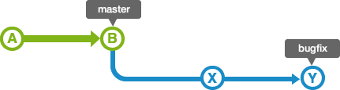

# 一、Github 同步

先把 Github 同步写一下，因为用的比较多，后边再写 Git 原理


## 1. 同步远程到本地

### 1.1 本地空仓库连接远程

此方法一般适用于本地文件为空，需要将远程项目下载到本地，进行本地操作。


1. 右键 Git Bash，然后创建一个文件夹

2. 设置用户名和密码

   ```
   git config --global user.name "用户名"
   git config --global user.email "用户邮箱"
   ```

3. 克隆远程仓库到本地

    ```
    git clone gitlink
    ```


### 1.2 本地仓库连接 Github

一般适用于项目在本机创建，初始化 Github 项目时的操作。即项目文件在本地已经创建完毕，Github 为空仓库的时候，需要将项目推送到 Github 进行远程仓库初始化。


1. 初始化本地仓库

   ```
   git init
   ```

2. 设置用户名和密码

   ```
   git config --global user.name "用户名"
   git config --global user.email "用户邮箱"
   ```

3. 连接 Github

   ```
   git remote add origin githublink
   ```

4. 查看是否连接

   ```
   git remote -v
   ```

   > 如果显示两条你的 Github 链接即为连接正常


## 2. 同步本地到远程

1. 将文件拷贝到Git目录

2. 添加文件到暂存区

   ```
   git add *
   ```

   ```
   git add .
   ```

   

3. 提交文件到本地仓库

   ```
   git commit -m "更新摘要"
   ```

   

4. 提交到远程仓库

   ```
   git push origin master
   ```

> 提交代码到原厂仓库 Github Master / 可以把 master 换成你想要推送的任何分支， origin 是别名（项目名），推送完会生成一个远程跟踪分支


## 3. 更新本地仓库到最新版

要更新你的本地仓库至最新改动，执行：

```
git pull [远程地址别名][远程分支别名]
```


## 4. 解决冲突

当 push 文件的时候，Git 会提示有它人已经推送了同样的文件，需要解决冲突才可以进行 Push

这时候，需要先用 pull 命令拉去最新版文件，然后 Git 会自动进入 Merge 模式，用 Vi 编辑器修改文件，修改冲突。git add 添加到暂存区、重新 Commit，然后再次进行 push 即可。


## 4. SSH Key 登录

本地生成 rsa 文件

```
ssh-keygen -t rsa -C "your_email@youremail.com"
```


然后复制到 Github 中 https://github.com/settings/keys


验证

```
ssh -T git@github.com
```


# 二、为什么要用 Git

## 1. 版本控制的优势

- 协同修改

- - 多人协同工作

- 数据备份

- - 保存数据以及历史版本

- 版本管理

- - SVN 增量式管理，Git 文件系统快照

- 权限控制

- - 对开发人员进行权限控制，Git 还可对代码进行审核

- 历史记录

- - 查看修改人、修改时间、修改内容、日志信息

- 分支管理

- - 允许多线程推进同一个任务，提高效率


## 2. Git 与 Github 关系

其实 Git 就是一个同步工具，可以在本地创建 Git 仓库。而 Github 就是一个远程代码仓库 + 程序员交友网站，可以用 Git 来将本地代码库同步到远程仓库。


## 3. Git 与 Svn 区别

### 1. **SVN**

**优点：**

单一服务器，服务器保存所有文件的修订历史、每个人都可以看到项目中其他人在做什么，管理员可以轻松掌握每个开发者的权限。便于服务器管理，增量式管理，每次的历史记录只保存差异。

**缺点：**

如果服务器宕机，历史记录丢失，只有电脑保存最新版，无法协同工作。并且有丢失数据的风险。

SVN无法接受未授权的人提交的代码。这个特点适用于开源社区管理代码。


### 2. **Git**

与 Linux 命令完全兼容

完全分布式，客户端并不只是提取最新版本的文件快照，而是把代码仓库完整的镜像下来，每一台电脑都是一台服务器，保存着整个项目的历史版本。因为压缩算法很厉害，所以储存能力很强。

对团队外开发者提交的代码进行审核----Git独有操作。

分布式版本控制系统，存放的不是差异，而是存放的索引（保存所有版本），即使断网也可以进行开发，因为版本都保存在本地。

尽可能添加数据而不是删除或修改数据，每次提交都会提交一个新的版本，不会删除旧的版本。

分支操作非常流畅


# 三、Git 安装

## 1. **Git 下载**

官网地址：https://git-scm.com/

自己根据系统版本下载对应的版本，Windows，Linux，Unix


## 2. **Git 初始化**

1.  设置用户名

```
git config --global user.name 'username'
```

2.  设置用户邮箱

```
git config --global user.email 'useremail'
```

3.  在创建的仓库目录中做初始化

```
git init
```

4. 查看 git 状态

```
git status
```

5. 删除仓库

```
rm -rf .git
```

> 直接将 .git 文件夹删除即可


**重置配置信息**

删除配置信息

```
git config --global --unset user.name git config --global --unset user.email
```


**参数说明：**

整个系统：system

当前用户：global

当前项目：留空,不需要参数


初始化后，会在文件夹中创建一个.git的隐藏文件夹，文件结构如下：


# 四、Git 本质（理解）

## 1. Git 区域


## 2. Git 存储本质

git核心本质上是一个键值对数据库。可以向该数据库插入任意类型的内容，它会返回一个键值，通过该值可以在任意时刻再次检索该内容。

通过 git hash-object 命令会生成一个键值对 key(hash):value(文件内容) 的对象，存放到 .git/object 当中。


```
echo 'test content' | git hash-object -w --stdin
```

>-w 指定 hash-object 命令存储数据对象：如不指定此选项，仅返回键值而不会进行写入
>
>-- stdin (standard input) 指定从 input 中读取内容，如果不指定该选项，则需要指定文件路径


执行命令后，会在 .git 中的 object 多出来一个存储记录

```
.git/object/d6/70460b4b4aece5915caf5c68d12f560a9fe3e4
```

> d6校验，余下38个字符作为文件名，使用的时候后需要将二者合并


用 cat 命令查看内容

```
git cat-file -p d670460b4b4aece5915caf5c68d12f560a9fe3e4
```


用 cat 命令查看类型，返回 blob 类型

```
git cat-file -t d670460b4b4aece5915caf5c68d12f560a9fe3e4
```


所以 git 对象是键值对（key是hash，而value是内容）


将文件写入存储区

```
git hash-object -w ./test.txt
```


## 3. 树对象

因为每次使用 -w 只会推送一个文件到本地数据库，并不能将整个项目推进数据库，那么就需要引入另外一个概念，树对象。

树对象 (tree object), 它能解决文件名保存的问题，也允许我们将多个文件组织到一起。 Git 以一种类似于 Unix 文件系统的方式存储内容。所有内容均以树对象和数据对象(git 对象)的形式存储，其中树对象对应了 Unix 中的目录项，数据对象对应文件内容。一个树对象包含一条或多条记录。一个树对象也可以包含另外一个树对象。


**构建树对象**

可以利用 update-index; write-tree; read-tree 等命令构建树对象并推入暂存区


1. 创建文件

```
echo "test v1" > test1.txt
```


2. 将文件推送到库

```
git hash-object -w test1.txt
```

> 自动生成 Hash 值


3. 将文件放入暂存区

通过 update-index 方法创建树对象，并将文件推送到暂存区。

```
git update-index--add--cacheinfo 10644\915c628f360b2d8c3edbe1ac65cf575b69029b61 test1.txt
```


文件模式：

```
100644，表明这是一个普通文件
100755，表明这是一个可执行文件
120000，表示一个符号链接
```


--add 选项：

此文件之前并没有在缓存区，首次需要add添加


--cacheinfo选项：

因为将要添加的文件位于 Git 数据库中，而不是位于当前的目录下，所以需要--cacheinfo 加上文件的 hash 值与该文件的文件名


4. 生成树对象

```
git write-tree
```

在生成树对象之前，可以不断的将文件加入项目暂存区，当认为可以成为一个版本的时候，执行 git write-tree 命令将树对象生成。


5. 更新同名文件到暂存区（不需要加 --add 参数）

```
git update-index --cacheinfo 10644\915c628f360b2d8c3edbe1ac65cf575b69029b61 test1.txt
```


执行顺序：

```
创建文件 -> 推入库拿到Hash -> 推入暂存区 -> 循环直到版本完成 -> 更新树对象到库
```


```
git update-index --add filename  # 相当于生成对象并将对象推入暂存区
```


6. 将旧的树对象从版本库中拿出来保存到暂存区中

```
git read-tree --prefix=bak 旧的树对象hash值
```


**查看暂存区命令**

```
git ls-files -s
```


**查看树对象**

```
git cat-file -p master^{tree}(或者是树对象的hash)
```


**总结：**

GIT对象为文件的修订版本、树对象代表项目的修订版本


**提交对象**

```
echo 'fist commit' | commit-tree 当前树对象hash -p 父对象hash
```


可以通过 commit-tree 命令创建一个提交对象，需要指定一个树对象的 SHA-1 值，以及该提交的父提交对象（如果有的话，第一次将暂存区做快照就没有父对象），让同一个树对象保存多个历史版本


Commit 是最终版本，存在于库，链式结构，保存所有记录，也是我们最终需要访问的

Tree 是存在暂存区的，是每次版本的快照，Commit 只是将 Tree 进行封装，将作者、时间、备注、父对象添加进去。


# 五、Git 高级命令（掌握）

## 1. 添加文件

将文件从工作区域推送到暂存区

```
git add filename
git add directory
```


可以将文件放入暂存区，执行顺序参考原理（工作区文件 -> 在库中生成Git对象 -> 推送到暂存区）

只要是文件被修改，项目被推送到暂存区，那么就会生成一个对应 Git 对象，而暂存区的文件则是被覆盖


相当于执行了底层命令

```
git hash-object -w filename（有多少文件，就执行了多少次，将文件放入版本库）
git update-index （将文件放入暂存区）
```


## 2. 推送到版本库

当项目需要记录版本的时候，可以将暂存区的所有内容做一个快照推送到版本库中保存。

```
git commit -m "提交描述"
```

同时在版本库中生成树对象和提交对象，并不会清空暂存区，只有提交 commit 才会生成树对象和提交对象


相当于执行了底层命令

```
git write-tree（生成树对象）
git commit-tree（生成版本库对象）
```


提交文字比较多的注释：

```
git commit
```

> 不加 -m 参数直接使用 git commit 命令，可以直接进入 vi 编辑器，写入篇幅比较多的注释


跳过暂存区直接commit：

```
git commit -a
```

> 如果对已经在版本库中有快照的文件，在工作区进行修改，不想再用 git add 命令更新暂存区，可以使用 -a 参数直接提交到版本库。没有被跟踪的文件无法使用 -a


## 3. 查看文件状态

文件状态分为两种，已跟踪和未跟踪，已跟踪又分为三种状态：已暂存、已修改、已提交。可以用 git status 来查看文件状态。

```
git status
```


未跟踪

- 表示没有加入暂存区，也不在版本库中有快照，还处于工作区，任意修改都不会对Git有影响，也不会有记录

已跟踪（已有快照文件）

- 已暂存

- - 表示生成Git对象，推送到暂存区

- 已修改

- - 表示生成Git对象后，文件已经在暂存区，又对本地文件进行修改，此时如果想要提交，需要再次推送到暂存区更新文件

- 已提交

- - 表示将暂存区文件推送到版本库，生成历史版本


## 4. 查看差异

**查看已修改内容差别命令：**

当有文件处于已修改状态，使用 git diff 命令可以查看文件内容和修改之前的对比。比较工作区 与暂存的(git add 后)的差别,一个文件可以在commit之前多次add

```
git diff
```


**比较暂存区文件 与上一次commit 的差别**

```
git diff --cache || --staged
```


**比较工作区与之前版本库中的文件**

```
git diff HEAD hash
```

> 结尾可以带文件名只比对单独的文件


## 5. **工作区删除文件**

如果在工作区删除了文件，用 git status 会发现文件已被删除，要用 git add 和 git commit 重新提交，提交后，版本库只会生成一个新的没有该文件的版本，但是文件的 Git 对象还是会存在。因为 Git 会保存所有的历史版本，所以如果以后想要回滚到之前的版本，则会恢复该文件。

```
git rm filename  # 也可以用这个命令直接删除提交一条龙
```

> 相当于 rm + git add 两个命令，最后只需要 git commit 提交到版本库即可


## 6. **工作区修改文件名**

和删除文件一样，本质上就是源文件删除，创建一个新名字的文件。同样需要 git add 命令将文件添加到暂存区，再 commit，git 同样提供了命令进行修改名称并自动添加到暂存区

```
git mv original_filename new_filename
```


## 7. **查看提交记录**

```
git log
```


可以查看所有文件被提交到版本库时候的详细信息，可以用下方代码查看简要信息：

```
git log --pretty=oneline
git log --oneline
git reflog
```

> git reflog 可以显示 HEAD@{1} 字样，自动计算你的指针


查看项目分叉历史

```
git log --online --decorate --graph --all
```


# 六、Git 分支操作

使用分支意味着不影响主程序的稳定性，再重新复制一份出来，然后在这个复制版本中进行开发。Git 分支模型极其的高效轻量。

Master 为默认主分支，其他分支都是从Master中分离出来的。分支就是指向最新提交对象的指针。


分支的本质就是一个提交对象，HEAD 是一个指针，它默认指向 Master 分支，切换分支其实就是让 Head 指向不同的分支。

最好不要再 Master 上进行操作，所有操作都要在分支上进行，然后合并到 Master 上边。


## 1. 创建分支

```
git bruch branch_name
```

可以创建一个新的分支。会在当前所在的提交对象上创建一个指针


## 2. 切换分支

```
git checkout branch_name
```

注意：切换分支会改变你的工作目录中的文件，所以再每次切换分支前，git status 查看一下是否都被提交，如没有则需要提交保存一下当前分支，否则未保存的文件会遗留到切换到的分支中。造成分支污染。

> 切换分支会对工作区实际文件、暂存区、HEAD 进行改变。


**新建一个分支并且同时切换到该分支**

```
git checkout -b branch_name
```


相当于

```
git branch branch_name
git checkout branch_name
```


**在之前的提交对象上新建一个分支，实现历史回滚**

```
git branch name commitHash
```

> 可以利用 log 查看分支hash，然后直接从之前的版本开启分支


## 3. **查看分支列表**

```
git branch
```


## 4. 删除分支

```
git branch -d branch_name  # 删除已合并的分支
git branch -D branch_name  # 强制删除未合并的分支
```

> 不可以删除当前所在分支


## 5. **查看项目分叉历史**

```
git log --online --decorate --graph --all
```


## 6. **查看分支最后一次提交**

```
git branch -v
```


# 七、合并分支

## 1. **快速合并分支**

```
git merge branch_name
```


最后一次提交已经修改好的 hotfix 分支，然后切换到主分支，然后用 merge 命令合并该分支到主分支。测试完成后用 git rm 删除已经合并过的 hotfix 分支。

快速合并图解：




## 2. 典型合并

如果之前在 Master 分支上开过其他分支，那么这时候，其他分支已经过期，因为这些分支是从Merge前引出的分支，所以，这些分支并没有更新到Master的最新版本。用了 merge 命令后，会提示需要手动更改，将冲突的文件修复，然后用 git add 和 git commit 提交到版本库中完成Merge，这种合并称为典型合并


**查看合并到当前分支的列表**

```
git branch --merged
```

> 如果出现列表，代表该分支已经合并，可以进行删除


**查看未合并的分支列表**

```
git branch --no-merged
```

> 如果出现在这个列表中，应该考虑是否需要合并分支


# 八、Git Merge 的三种方式

## 1. 快速合并

```
git merge branch_name
```

不会显示 feature，只保留单条分支记录。fast-forward方式合并， feature 的提交历史混入到 master 中


## 2. **禁止快速合并**

```
git merge --no-ff branch_name
```

不使用fast-forward方式合并，可以保存你之前的分支历史。能够更好的查看 merge历史，以及branch 状态。推荐这种


## 3. **使用squash方式合并**

```
git merge --squash branch_name  
```

squash选项的含义是：本地文件内容与不使用 --squash 的合并结果相同，但是不提交、不移动HEAD，因此需要一条额外的commit命令。其效果相当于将 feature 分支上的多个commit合并成一个，放在 Master 分支上，原来的 Feature commit 历史则没有拿过来。


用 log 感觉更清晰一些， add fa 是用的 -ff 快速合并，我们并不知道这个 commit 其实是从分支上过来的，git 只是做了一个 HEAD 移动，而 add fb 是用 --no-ff 合并的，可以清楚看到这个是分支，并且在 Master 主线上我们做了一个合并的图示。


# 九、**Rebase 和 Merge 区别**


正常来说，如果 feature 这个 branch 是从 M2 开发的，那么在主线 Master 已经推进到 M3 时，需要进行 Merge ，我们只会多出一个 Merged Commit。 如 M3 - Merged Commit with Feature


但是如果用了 Rebase 方式进行合并的话，


在 Feature 分支中，会在 M2 的基础上，自动补你当前代码到 M3，然后合并你的 F1 。结构如下 M3-F1

之后你的 Feature 分支可以在最新的主线基础上再继续开发到 F2，当开发完成时，我们要将 F2 合并到 Master 中，此时再切换到 Master 分支再进行 Rebase 合并，主线分支记录则会变成 M1-M2-M3-F1-F2，将程序所有的改动在主线上一条线清晰的延续。

> 总结：Rebase 更能体现项目的过程， Merge 更关注历史记录


官方建议可以在自己本地进行 Rebase，但是多人团队中的 Master 中最好不要用 Rebase 方式进行合并。会造成代码的混乱。

**Do not rebase commits that exist outside your repository and that people may have based work on.**

官方也给了解释原因：https://git-scm.com/book/en/v2/Git-Branching-Rebasing


# 十、命令别名

Git 并不会在你输入部分命令时像 Linux 一样自动推断你想要的命令，可以使用 git config 来为长命令配上别名

```
git config --global alias.co "commit"
```

> 当想要 commit 的时候，就可以直接输入 git co 


# 十一、开发实例

1. 正在开发某网站

2. 为了实现某个需求，创建一个分支

3. 在这个分支上开展工作


正在此时，需要处理一个严重问题，需要紧急修复，你将按照如下方式来处理

1. 切换到你的线上分支

2. 为这个紧急任务新建一个分支，并且进行修复

3. 在测试通过之后，切回线上分支，然后合并这个修补分支，最后将改动推送到线上分支。

4. 切换回最初的工作分支，继续工作。


当所在项目已经工作了一段时间，需要紧急切换到其他分支，但本分支的任务没有完成，我们可以将本分支的工作储存到栈中。命令如下，本质上还是提交，但是不保存在提交记录中。


**Git 存储**

```
git stash
```


**Git 存储还原**

当任务完成时，切回本分支，可以使用下方命令还原状态，但是栈中还是会保留之前的存储对象。切回本分支时，最好再次查看一下状态 git status，然后再还原存储的任务。

```
git stash apply
```


**查看存储**

```
git stash list  
```

当前任务保存在栈中，存储对象名为 stash@{0} ，大括号中为存储顺序编号


**还原指定存储**

```
git stash apply stash@{2} # 如果不指定一个储藏，Git认为指定的是最近的储藏
```


**删除栈中的存储**

```
git stash drop stash@{0} 
```


**还原并删除栈中的存储**

```
git stash pop  # 最好在只有一个存储的情况下
```


# 十二、还原文件

## 1. 还原工作区文件

```
git checkout --filename
```

```
git resotre filename  # 新版本推荐使用
```

当在工作区做了文件修改，但是文件未被上传到暂存区或版本库中，可以用以上命令来还原文件


## 2. 还原暂存区文件

```
git reset HEAD filename
```

```
git restore --staged filename  # 新版命令
```


## 3. 还原版本库文件

```
git commit --amend
```

当我们想要对上一次的提交进行修改时，我们可以使用git commit –amend命令。git commit –amend 既可以对上次提交的内容进行修改，也可以修改提交说明。

这个命令会将暂存区的文件进行提交，如果上次提交到的版本库中的文件或注释有问题，使用该命令后，可以在快照保持不变的情况下，修改之前提交的信息。


如：

```
git commit -m 'modify comment"
git add forgotten_files
git commit --amend
```

> 则实现了修改注释，并添加文件的操作。


## 4. Reset 命令

### 4.1 reset --soft

reset 移动 HEAD 指针，HEAD 可以是 hash值，~代表上一个指针

```
git reset --soft HEAD~
```

与 checkout 不同，reset 移动整个分支，而 checkout 只是移动 HEAD 指针，它本质上是撤销了上一次的 git commit 命令。当再次运行 git commit 时， Git 会创建一个新的提交，并移动 HEAD 所指向的分支来使其指向该提交。

当使用 reset 时候，其实就是把该分支移动回原来的位置，而不会改变索引区和工作目录，**而这个就是 git commit --amend 的原理**。


### 4.2 reset --mixed

与 soft 不同的是，--mixed 参数会更改暂存区，还原为之前的版本

```
git reset [--mixed] HEAD~  # 默认为 --mixed 可不填写
```

只有 --mixed 模式可以跟文件名或路径，如果加了路径，则不会对HEAD进行跳转，只会撤销暂存区文件。因为 HEAD 指向一个分支，而分支代表一个提交对象（包括树对象，多个Git 对象）所以如果加了路径的话，不可能移动 HEAD。所以只更改暂存区。


### 4.3 reset --hard

--hard 既会更改暂存区也会更改工作区，还原为之前的版本

```
git reset --hard HEAD~
git reset --hard hash  
```

注意： --hard 标记是 reset 命令唯一危险的用法，它也是 Git 会真正销毁数据的仅有的几个操作之一。 --hard 会强制覆盖工作目录和暂存区的文件。如果文件被提交，我们还可以从数据库中找到 Git 对象进行还原，否则如果未提交的话，该文件彻底消失。


--hard 与 checkout 区别：

- checkout 只动 HEAD， --hard 动 HEAD 而且带着分支一起走

- checkout 对工作目录是安全的， --hard 强制覆盖工作目录


## 5. 数据恢复

可以在 ./git/logs/HEAD 查看所有变更 HEAD 的记录，如果用 --hard 硬重置到其他分支，造成文件丢失的情况，可以改变 HEAD 硬重置回之前的分支来恢复文件

```
git reflog  # 查看所有变更 HEAD 的记录
```


或者用 

```
git branch recover-branch branch_hash
```

重新创建一个分支，指向自己之前的分支，就可以恢复文件了。这种方法更为常用。


# 十三、Tag 标签

git 可以给历史中的某一个提交打上标签，一般用标签来标注版本号


**查看标签**

```
git tag  # 列出所有tag标签
git tag -l 1.8.5*  # *为通配符，列出1.8.5xxxxxx之类的所有tag
```


**创建标签**

```
git tag v1.4  # 标注最后一次提交对象
git tag v1.4 commithash  # 标注指定提交对象
```


**查看指定标签**

```
git show v1.0  
```


**删除标签**

```
git show -d v1.0
```


**检出标签**

```
git checkout v1.0
```


在检出标签模式下，会处于头部分离状态，可以查看当前分支的状态，但是最好不要commit，如果此时进行了提交，标签不会发生变化，新提交也不会属于任何分支，并且无法访问。除非访问确切的Hash。

因此，如果想要修改，最后使用 git branch -b branch_name 来创建分支进行修改


# 十四、远程团队协作


让远程协作人员 Fork 一份程序出来，然后进行 clone，在本地库进行更改，更改完成后，push 到远程库。之后通过 pull request 让领导审核一下，如果通过，就可以 Merge 到 Master 分支上。


# 十五、Git 工作流程


十六、GitLab 安装与配置

https://about.gitlab.com/install/

安装分 ce 社区版 和 ee 企业版，根据需要自己安装


GitLab默认的配置文件路径是

```
/etc/gitlab/gitlab.rb
```


默认的站点Url配置项是：

```
external_url 'http://gitlab.example.com'
```


这里我将GitLab站点Url修改为

```
http://git.ken.io  # 也可以用IP代替域名，这里根据自己需求来即可
```


修改配置文件

```
sudo vi /etc/gitlab/gitlab.rb
```


配置首页地址（大约在第15行）

```
external_url 'http://网站地址'
```


初始化 Gitlab

```
gitlab-ctl reconfigure
```


启动 gitlab 服务

```
gitlab-ctl start
```


访问GitLab

```
将设置的域名DNS解析到服务器IP，或者修改本地host将域名指向服务器IP。
访问：http://网站地址
```

