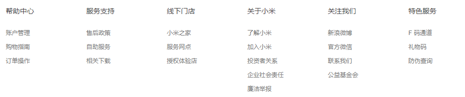
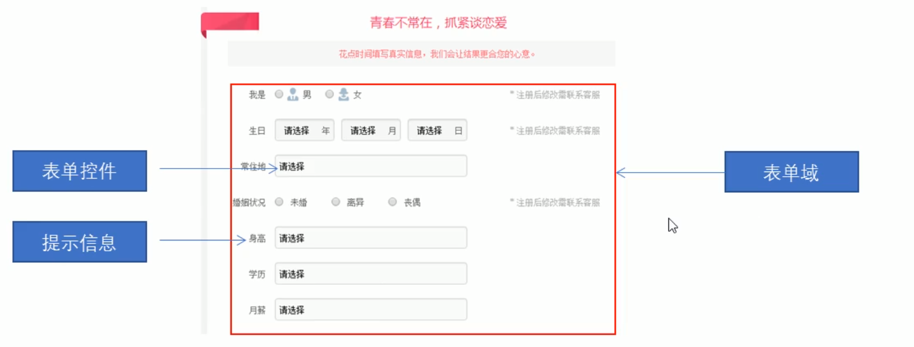

# 一、HTML 概念

**HTML 定义**
HTML 指的是超文本标记语言（Hyper Text Markup Language），它是用来描述网页的一种语言。


**Web 标准**
主要包括结构（Structure）、表现（Presentation）和行为（Behavior）三个方面

- 结构：用于对网页元素进行整理和分类，HTML
- 表现：表现用于设置网页元素的版式、颜色、大小等外观样式，主要指CSS
- 行为：行为是只网页模型的定义及交互的编写，主要指 Javascript


# 二、HTML 标签

## 1. HTML 语法规范

- HTML 标签是由尖括号包围的关键词：例如`<html>`

- HTML 标签通常是成对出现的，例如：`<html></html>`，，我们称为双标签，第一个标签是开始标签，第二个标签是结束标签。

- 有些特殊的标签是单标签，例如 `<br />`


## 2. 标签关系

双标签关系可以分为两类：包含关系和并列关系


包含关系：

```
<head>
    <title></title>
</head>
```


并列关系：

```
<head></head>
<body></body>
```


## 3. 基本结构标签

每一个网页都会有一个基本结构标签（也成为骨架标签），页面内容也是在这些基本标签上书写的，HTML页面又称为HTML文档。

HTML 基本结构：

```
<html>
    <head>
        <title>HTML基本结构</title>
    </head>
    <body>
        网页内容
    </body>
</html>
```


- `<html></html>` HTML 标签，页面中最大的标签，我们称为根标签

- `<head></head>` 文档的头部，注意在 head 标签中我们必须要设置的标签是 title

- `<title></title>` 文档的标题，让页面拥有一个属于自己网页的标题

- `<body></body>` 文档的主体，元素包含文档的所有内容，页面内容，基本都放在body里边的。


### 3.1 头部标签

HTML 框架

```
<!DOCTYPE html>
<html lang="en">
<head>
    <meta charset="UTF-8">
    <meta name="viewport" content="width=device-width, initial-scale=1.0">
    <title>Document</title>
</head>
<body>
    
</body>
</html>
```


`<!DOCTYPE>` 文档类型声明标签，告诉浏览器使用哪种 HTML 版本来显示网页

```
<!DOCTYPE html>  // 使用最新版本的 HTML 来显示网页
```

>必须写在最前边，处于 html 标签之前，它不是一个 HTML 标签，它只是一个文档类型声明标签


html 标签中可以加入 lang 语言种类

```
<html lang="en"> // 当前文档的显示语言，对搜索引擎有影响，但对文档内部无影响
<html lang="zh-CN"> // 当前页面主体为中文
```


字符集

在 head 标签中，可以通过 `<meta>` 标签的 charset 属性来规定 HTML 文档应该使用哪种字符编码

```
<meta charset="UTF-8">  // 以 UTF-8 字符集显示网页内容
```

> charset 常用值有：GB2312（简单中文)、BIG5(繁体中文）、GBK（简体繁体全部中文字符）、和 UTF-8（国际通用字符集）


## 4. 网页开发工具 VSCode 编辑器

```
! // 使用叹号一键直接生成框架
```


# 三、HTML 常用标签

## 1. 标题标签  `<h1>` ~ `<h6> `

```
<h1>我是一级标签</h1>
```

> 标题标签一共分为6个等级，重要度依次递减


## 2. 段落标签 `<p>` `</p>`

在网页中，要把文字有条理地显示出来，就需要将这些文字分段显示。在HTML标签中，段落标签用于定义段落，一个文本内容定义一个段落，可以将整个网页分为若干个段落。

```
<p>我是一段文字</p>
<p>我是第二段文字</p>
```


## 3. 换行标签 `<br />`

如果希望某段文本强制换行，或者需要空行，需要使用 `<br />` 标签。

```
<br />
```

> `<br />` 是一个单标签，与 `<p>` 标签的区别是，段落标签之间会插入一些垂直间距


## 4. 文本格式化标签

网页中，有时候需要设置文字为粗体、斜体、下划线等效果，这时候需要用HTML中的文本格式化标签，使文字以特殊的方式显示。

```
<b>粗体</b>  
<i>斜体</i> 
<u>下划线</u>  
<s>删除线</s> 
<sub>下标记</sub>
<sup>上标记</sup>
```


带有语义的标签：

- strong - 粗体
- em - 斜体
- ins - 下划线
- del - 删除线

>用法和普通标签一样，推荐使用，语义更加强烈，并且可以用CSS控制


## 5. 盒子标签 `<div>` 和 `<span>` 标签

没有任何语义，是一个容器标签

```
<div>这是一个盒子</div>
<span>这是一段文字</span>
```

> div 标签独占一行（大盒子），span标签一行可显示多个元素（小盒子）


## 6. 图像标签

```

```


图像标签其他属性

```
src  // 图片路径
alt  // 文本（替换文本，当图像不能显示的时候，显示该文字）
title  // 文本（提示文本，当鼠标放在图片上，显示的文字）
width  // 图像的宽度
height  // 图像的高度
border  // 图像边框的粗细
```

> 一般只做 width 或者 height 其中一个，另一个会等比例压缩


路径

```
// 相对路径
  // 同级路径
  // 同级路径
  // 下级路径
  // 上级路径
```

```
// 绝对路径
  
C:/appserv/www/images/logo.gif
/usr/local/apache/htdocs/www/logo.png
```


## 7. 超链接标签

在 HTML 标签中，`<a> ` 标签用于定义超链接，作用是从一个页面链接到另一个页面

```
<a href="跳转目标" target="目标的弹出方式">文本或图像</a>
```


target 参数：

```
_self 为默认值，在本页面打开新窗口
_blank 在新窗口打开
```


常用链接写法：

```
<a href="http://www.forece.net" target="_blank"></a>  // 外部链接
<a href="index.html"></a>  // 图片链接
<a href="admin/1.html"></a>  // 内部链接
<a href="#"></a>  // 空链接
```


锚点链接：

```html
// 回到顶部
<a href="#top">回到顶部</a>

// 使用 id 设置锚点
<a href="#tag">第一课</a>
<h3 id="tag">第一课</h3>
```


邮件链接：

```
<a href="mailto:xxx@xxx.com?subject=主题&内容&cc=抄送@xxx.com>给我留言</a>
```


## 8. 预排版标签 `<pre></pre>`

在 HTML 中，标签和一些字符会被浏览器解析转义，并且空格也不会被解析。可以使用 pre 标签，将代码中的内容原原本本的还原出来，

~~~html
<p>左          右</p>
<pre>左        右</pre>
~~~


# 四、HTML 注释标签

```
<!-- 这是一段注释 -->
```


# 五、常用HTML实体

在 HTML 页面中，一些特殊的符号很难或者不方便直接使用，可以用HTML实体来替换

| **显示结果** | **描述** | **实体名称**      | **实体编号** |
| ------------ | -------- | ----------------- | ------------ |
|              | 空格     | &nbsp;            | &#160;       |
| <            | 小于号   | &lt;              | &#60;        |
| >            | 大于号   | &gt;              | &#62;        |
| &            | 和号     | &amp;             | &#38;        |
| "            | 引号     | &quot;            | &#34;        |
| '            | 撇号     | &apos; (IE不支持) | &#39;        |
| ￠           | 分       | &cent;            | &#162;       |
| £            | 镑       | &pound;           | &#163;       |
| ¥            | 日圆     | &yen;             | &#165;       |
| €            | 欧元     | &euro;            | &#8364;      |
| §            | 小节     | &sect;            | &#167;       |
| ©            | 版权     | &copy;            | &#169;       |
| ®            | 注册商标 | &reg;             | &#174;       |
| ™            | 商标     | &trade;           | &#8482;      |
| ×            | 乘号     | &times;           | &#215;       |
| ÷            | 除号     | &divide;          | &#247;       |


# 六、表格标签

HTML中的表格一般是用来显示数据的，最好不要用表格走框架布局


## 1. 表格的基本语法

```
<table>
    <tr>
        <td>单元格内文字</td>
    </tr>
</table>
```


- `<table></table>` 是用于定义表格的标签
- `<tr></tr>` 标签用于定义表格中的行，必须签到在 table 标签中
- `<td></td>` 标签用于定义表格中的单元格，必须签到在 tr 标签中
- `<caption></caption>` 表格标题标签


>VSCODE 中可以快捷创建表格 `table>tr*5>td*3` （快速创建一个5行3列的表格）如果只生成td表格，用 td*3 即可


表头单元格 `<th></th>`

和 td 标签类似都是表格中的单元格，一般写在第一行 tr 标签中，用来当做表头

```
<table>
    <tr><th>表头1</th><th>表头2</th></tr>
    <tr><td>普通单元格1</td><td>普通单元格2</td></tr>
</table>
```


## 2. 表格相关属性
标签属性一般不常用，基本都是使用 CSS 来设置

```
align  // 水平对齐方式（left, center, right），可以在 table, tr, td 中使用。对包含元素全部生效
valign // 垂直对齐方式（top, middle, bottom），table 没有该属性
border  // 规定表格单元是否拥有边框（1 或者 ""），默认没有边框， td 没有 border 属性
bordercolor  // 表格颜色
cellpadding  // 规定单元边缘与内容之间的空白，默认1像素
cellspacing  // 规定单元格之间的空白，默认2像素
width  // 规定表格的宽度（像素值或百分比）
height  // 表格的高度 
```


例：

```
<table align="center", border="1", cellpading="20", cellspacing="0", width="500", height="250">
```


## 3. 表格结构标签

```
<thead></thead>  // 表格头部区域
<tbody></tbody>  // 表格主体区域
```


```
<table>
    <!-- 表格头部区域 -->
    <thead>
    <tr>
        <th>表头</th>
        <th>表头</th>
    </tr>
    </thead>
    <!-- 表格主体区域 -->
    <tbody>    
        <tr>
        <td>单元格</td>
        <td>单元格</td>
        </tr>
    </tbody>
</table>
```


## 4. 合并单元格

```
rowspan="合并单元格的个数"  // 跨行合并（上下行合并），在上边的单元格添加属性
colspan="合并单元格的个数"  // 跨列合并（左右列合并），在左侧的单元格添加属性
```

> 记得删除多余的单元格


```
<table align="center", border="1", cellpading="20", cellspacing="0", width="500", height="250">
    <tr>
        <th>姓名</th>
        <th>性别</th>
        <th>年龄</th>
    </tr>
    <tr>
        <td colspan="2">123</td>
        <td>123</td>
    </tr>
    <tr>
        <td>4</td>
        <td>4</td>
        <td>4</td>
    </tr>
    <tr>
        <td rowspan="2">5</td>
        <td>6</td>
        <td>7</td>
    </tr>
    <tr>
        <td>8</td>
        <td>8</td>
    </tr>
</table>
```


# 七、列表标签
列表标签在 HTML 中是用来布局的，根据使用情景不同，列表可以分为三大类：无序列表、有序列表和自定义列表


## 1. 无序列表

`<ul>` 标签是 HTML 页面中的无序列表，列表项使用 `<li>` 标签定义，列表项前边以原点显示。

```
<ul>
    <li></li>
    <li></li>
    <li></li>
</ul>
```


>ul 标签中只能签到 li 标签，不能放其他内容
>
>li 标签中相当于一个容器，可以容纳所有其他元素


可以用 type 属性改变前边标志，如：

~~~html
<ul type="square">
    <li>第一条</li>
</ul>
~~~

> 可以使用 disc, circle, squre 几种类型


## 2. 有序列表
`<ol>` 标签在 HTML 中式有序列表，列表排序以数字来显示，列表项用 `<li>` 标签。


有序列表也可以使用 type 指定显示标志，如：

~~~html
<ol type="a">
    <li>第一条</li>
</ol>
~~~


类型：

- 1 - 1, 2, 3 默认

- a - a, b, c 
- A - A, B, C  
- I - I, II, III 
- i - i, ii, iii


start 属性，可以指定序号从第几序号开始（只能是数字），如：

~~~html
<ol type="1" start="2">
    <li>项目</li>
    <li>项目</li>
    <li>项目</li>
    <li>项目</li>
</ol>
~~~

> 序号从2开始计数，2,3,4,5


## 3. 自定义列表
一般用于 Footer，`<dl>` 标签用于定义描述列表（类似table），`<dt>` 用来定义项目名称，`<dd>` 用于列表项。


如小米底部设计：



```
<dl>
    <dt>服务</dt>
    <dd>售后</dd>
    <dd>联系我们</dd>
</dl>
```


# 八、表单标签

HTML 中，一个完整的表单通常由表单域、表单控件和提示信息3个部分构成




## 1. 表单域
表单域是一个包含表单元素的区域，在 HTML 标签中，`<form>` 标签用于定义表单域，form 标签会把范围内的表单元素信息提交给服务器


```
<form action="url地址" method="提交方式" name="表单域名称">
    表单元素控件
</form>
```


- url  // 表单递交到的网址

- action  // 用于指定接收并处理表单数据的url地址
- method  // 分为 get 和 post，表单数据的提交方式
- name  // 用于指定表单的名称，以区分同一个页面中的多个表单域


## 2. 表单控件（表单元素）
在表单域中可以定义各种表单元素，这些表单元素就是允许用户在表单输入或者选择的控件


`<input>` 表单元素

input 是输入的意思，在表单元素中 input 标签用于收集用户信息。在 input 标签中，包含一个 type 属性，根据不同的 type 属性值，输入字段拥有多种形式（文本框、复选框、单选框、按钮、掩码后的文本控件等）

```
<input type="属性值">
```


input 类型：

```
text  		定义单行的输入字段，用户可以在其中输入文本，默认宽度为20个字符
password  定义密码字段，该字段中的字符被掩码
radio  定义单选按钮
checkbox  复选框
file  定义输入字段和“浏览”按钮，供文件上传
hidden  定义隐藏的输入字段
image  定义图像形式的提交按钮
submit  定义提交按钮，提交按钮会把表单数据发送到服务器
button  定义可点击按钮（多数情况下，用于通过js启动脚本）
reset  定义重置按钮，重置按钮会清除表单中的所有数据
```


### 2.1. 文本框

~~~html
<input type="text" name="username" value="文本框默认内容" placeholder="占位">
~~~


其他属性：

- name 
  - 提交 GET 或 POST 的字段名
- value
  - 文本框默认内容
- placeholder
  - 占位符，当输入文字时，占位符消失。


### 2.2. 密码框

~~~html
<input type="password">
~~~


### 2.3. 单选框

radio 单选框必须 name 一致才可以实现单选效果

```html
<form>
    性别：
    男 <input type="radio" name="sex" value="0">
    女 <input type="radio" name="sex" value="1">
</form>
```

> 只有加了 value 才可以通过 name 字段将值提交给后台


### 2.4. 复选框

~~~html
<form>
  <input type="checkbox" name="furniture" id="" value="0">冰箱
  <input type="checkbox" name="furniture" id="" value="1">电视
  <input type="checkbox" name="furniture" id="" value="2">柜子
  <input type="checkbox" name="furniture" id="" value="3">空调
</form>
~~~

> 同组复选框，name 值需要统一，value 值用于提交数据


### 2.5. 下拉框

select 下拉表单元素

在页面中，如果有多个选项，可以使用 select 标签控件定义下拉列表

```html
    <select name="location" id="location">
        <option value="">BJ</option>
        <option value="">TJ</option>
        <option value="" selected="selected">SH</option>
    </select>
```

> 默认选中可以用 selected 属性


多选分组

~~~html
<form>
  <select name="location">
    <optgroup label="省份">
      <option value="SD">山东省</option>
      <option value="HB">河北省</option>
      <option value="JL">吉林省</option>
    </optgroup>
    <optgroup label="行业">
      <option>服务业</option>
      <option>制造业</option>
      <option>零售业</option>
    </optgroup>
  </select>
  <input type="submit" value="提交">
</form>
~~~


### 2.6. 文本域

textarea 文本域标签

当用户输入文字较多的情况下，可以使用 textarea 标签，在表单元素中， textaera 标签是用于定义多行文本输入的控件，textarea 标签没有 value 属性。

```html
<textarea name="" id="" cols="30" rows="10">文字</textarea>
```


### 2.7. 上传文件

~~~html
<input type="file" name="file" id="">
~~~


### 2.8. 按钮

提交按钮

将表单中内容通过 GET 方式 或 POST 提交到服务端，提交按钮可以用 input 标签，也可以使用 button 标签，实现的效果是一样的。

~~~html
<input type="submit">
<button>按钮</button>
~~~


复位按钮

将表单内容复位，如果有 value 值，则复位为 value 值。

~~~html
<input type="reset">
~~~


普通按钮

无效果，一般用于绑定 js 事件实现特殊效果

~~~html
<input type="button" value="点击按钮">
~~~


## 3. input 其他属性

```
name  定义 input 元素的名称，重要，GET 或 POST 的 key 值
value 定义 input 元素的默认值
checked 默认被选中
maxlength  规定输入字段中字符的最大长度
```


value 是表单元素的默认值

```
<form>
    用户名： <input type="text" name="username" value="请输入用户名">
</form>
```


- name 和 value 是每个表单元素都有的属性值，主要是给后台人员使用

- name 表单元素的名字，要求单选按钮和复选框要有相同的 name 值

- checked 属性主要针对于单选按钮和复选框，可以设置默认勾选某个表单元素


## 4. label 标签

`<label>` 标签为 input  元素定义标注（标签）
label 标签用于绑定一个表单元素，当点击 label 标签内的文本时，浏览器就会自动将焦点转移到或者选择对应的表单元素上，用来增加用户体验

```
    <label for="username">用户名： </label>
    <input type="text" name="username" id="username" value="请输入用户名">
```

> 需要在 label 加上指定 id，input 标签也同样需要标记对应id


# 九、框架

frameset 元素可定义一个框架集。它被用来组织多个窗口（框架）。每个框架存有独立的文档。在其最简单的应用中，frameset 元素仅仅会规定在框架集中存在多少列或多少行。您必须使用 cols 或 rows 属性。


**重要事项：**您不能与 `<frameset></frameset>` 标签一起使用 `<body></body>` 标签。如果您需要为不支持框架的浏览器添加一个 `<noframes>` 标签，请务必将此标签放置在 `<body></body>` 标签中！


将页面分为几个部分，分别调用不同的页面

- 左右结构用 cols 属性分割
- 上下结构用 rows 属性分割


## 1. 框架

~~~html
<html>
<frameset cols="25%,50%,25%">
  <frame src="/example/html/frame_a.html">
  <frame src="/example/html/frame_b.html">
  <frame src="/example/html/frame_c.html">
</frameset>
</html>
~~~


## 2. 框架嵌套

~~~html
<html>

<frameset rows="25%,75%">

  <frame src="/example/html/frame_a.html">
  <frameset cols="25%, 75%">
  	<frame src="/example/html/frame_b.html">
  	<frame src="/example/html/frame_c.html">
    </frameset>
</frameset>

</html>

~~~


## 3. 框架内链接跳转

~~~html
<html>
<frameset rows="25%,75%">
  <frame src="/example/html/frame_a.html" name="top">
  <frameset cols="25%, 75%">
  	<frame src="/example/html/frame_b.html" name="left">
  	<frame src="/example/html/frame_c.html" name="right">
    </frameset>
</frameset>
</html>
~~~


~~~html
<a href="power.html" target="right">链接</a>
~~~

> 当点击链接后，链接则会在右侧 frame 中打开。 


## 4. 内嵌框架

将框架放在一个元素内部，如 div 内部：

~~~html
<div>
  <iframe src="a.html">
    
  </iframe>
</div>
~~~


# 十、H5

## 1. 语法简单

头部声明更加简单，如 `<!doctype html>` ，以及字符集声明 `<meta charset="utf-8">`


## 2. 语法更宽松

可以省略结束标签

li, dt, dd, p, optgroup, option, tr, td, th


可以完全省略的标签

html, head, body


### 3. 标签语义化

增加了很多标签，使标签更加有意义。

- `<header>` 头部
- `<nav>` 导航栏
- `<article>` 文章内容
- `<section>` 网页中的一块区域
- `<aside>` 侧边栏
- `<footer>` 底部


## 4. 新增表单属性

- placeholder 占位显示
- required 必填
- autofocus 自动获取焦点


~~~html
<form action="">
  <input type="text" name="username" autofocus="autofocus" required="required" placeholder="请输入用户名">
  <input type="submit">
</form>
~~~


## 5. H5 新增 input 类型

~~~
email	限制邮箱
date	日期
week	星期
month	月
time	时间
color	颜色
range	滑块范围
number	数量
~~~


## 6. H5 多媒体标签

以前网页中嵌入多媒体文件，需要使用 `<embed></embed>` 标签进行引用：

~~~html
<embed src="video.mp4" type="">
~~~


embed 属性：

- autostart = "true/false" 自动播放
- loop = "正整数/true/false" 循环播放
- hidden = "true" 设置多媒体控制面板是否隐藏


在 H5 中有了新的标签：

- `<audio>`
- `<video>`


~~~html
<audio src="audio.mp3" controls autoplay></audio>
~~~

- controls 控制面板
- autoplay 自动播放
- loop 循环播放


兼容性解决方案

~~~html
<video controls autoplay>
	<source src="video1.mkv">
  <source src="video1.mp4"
</video>
~~~


# 补充：字体标签

HTML 改变文字颜色和字体，建议用CSS改变任何样式

```
<font size="2" color="blue">This is some text!</font>
<font face="verdana" color="green">This is some text!</font>
<p style="color:#FF0000";>Red paragraph text</p>
<table bgcolor="red"></table>
```

