# 一、Javascript 概述

## 1. JS 简介

Javascript，简称 JS， 是一种客户端脚本语言，主要用来向 HTML 网页添加各种动态效果。

作者是 Brendan Eich , 10天完成 Javascript 设计，网景公司初始名为 Livescript，后来和 Sun 合作，改名为 Javascript


Javascript 是一种可以在客户端运行的脚本语言，不需要进行编译

- 编译型语言需要将所有代码在编译器中进行编译再转换为机器语言让CPU运行
- 解释型语言通过解释器逐行转换为机器语言执行


Javascript 可以做什么？

- 表单动态校验（密码强度检测） 也是 JS 产生最初的目的
- 网页特效
- 服务端开发（Node.js）
- 命令行工具（Node.js）
- 桌面程序 (Electron)
- App (Cordova)
- 控制硬件-物联网 (Ruff)
- 游戏开发 (cocos2d-js)


## 2. JS 组成

- ECMAscript - Javascript 语法
- DOM - 页面文档对象模型
- BOM - 浏览器对象模型


ECMAscript

ECMAScript 是 ECMA 国际进行标准化的一门编程语言，往往被称为 Javascript 或 JScript，实际上后两者是 ECMAScript 的是实现和扩展


DOM - 页面文档对象模型

文档对象模型（Document Object Model）通过 DOM 提供接口可以对页面上的各种元素进行操作（大小、位置、颜色）


BOM - 浏览器对象模型

浏览器对象模型（Browser Object Model），可以对浏览器窗口进行互动的对象结构，通过BOM可以操作浏览器窗口，比如弹窗、控制浏览器跳转、获取分辨率等。


# 二、JS 基本使用

## 1. JS 嵌入方式

在 HTML 中使用 JS 可以用以下几种方式实现：

- 行内式
- 内嵌式
- 外部引用 js 文件


行内式，可以在 html 元素中直接用使用 js 语句，但是一般都是调用函数或简短的语句。

```
<input type="button" value="Click Me!" onclick="alert('Hellow World')">
```


内嵌式，一般用于实现比较小的功能，代码不长的情况

```
<script>
    alert('Hello World');
</script>
```


外部JS文件，最常见的方式

```
<script src="my.js"></script>
```


## 2. JS 注释

```
// 单行注释    
/*  多行注释 */
```


## 3. JS 输入输出语句

```
alert(msg)  // 浏览器弹出框
console.log(msg)  // 浏览器控制台打印输出信息
prompt(info)  // 浏览器弹出输入框，用户可以输入
```


# 三、变量

## 1. 定义

变量是程序在内存中申请的一块用来存放数据的空间。通过变量名称我们可以使用或修改保存在系统中的对应的数据。


## 2. 声明变量

Js 是一种弱类型或者说动态语言，不用提前声明变量的类型，变量的类型会自动判断。即使赋值之后，变量的类型根据重新赋值的数据类型同样进行改变。

~~~js
var age;  // 声明一个名称为age的变量
age = 12;  // 给age这个变量赋值为12
~~~


通常声明与赋值一起使用：

~~~js
var age = 12;
~~~


## 3. 初始化变量

~~~js
var age = 12
var name = 'Tom'
name = 'OO'  // 再次给相同变量赋值则不用 var 进行初始化
var a = 10, b = 20, c = 30;  // 可以同时声明多个变量
~~~


## 4. 输入存储变量

~~~js
var name = prompt('请输入你的名字')
alert(name)
~~~


## 5. 变量的命名规范

- 由字母、数字、下划线、$符号组成，不能以数字开头
- 不能是关键字和保留字，例如：for,while,this,name
- 区分大小写
- 变量名必须有意义
- 小驼峰命名法，如：`myName`  
- 建议不要用$作为变量名


## 6. 查看变量

~~~js
alert(变量名)  // 弹出框显示
console.log(变量名)  // 控制台显示
document.write(变量名)  // HTML 页面上显示
~~~


# 四、数据类型

## 1. 数字型

~~~js
3  // 十进制
010  // 八进制
0xa  // 十六进制
3.14  // 小数
NaN  // 非数字 Not a Number
~~~


数字型范围：

~~~js
console.log(Number.MAX_VALUE);  // 1.7976931348623157e+308
console.log(Number.MIN_VALUE);  // 5e-324
~~~


## 2. 字符串型

~~~js
var str1 = '这是个字符串';
~~~


字符串转义符：

~~~js
\n  // 换行
\r  // 回车
\\
\'
\"
\t
\b  // 空格
\xnn  // 16进制字符，如 \x41 代表 'A'
\unnn  // 16进制 unicode 字符， 如 \u03a3 代表∑
~~~


字符串长度：

用 `变量.length` 可以得到字符串长度，如：

~~~js
var str1 = 'hello world'
console.log(str1);  

// 输出结果：11
~~~


字符串拼接：

~~~js
var str = str1 + str2;
var str = '字符串' + 123;  // 输出字符串123，字符串拼接其他类型会自动转换为字符串
var str = 'My age is' + age + 'years old';  // 字符串+变量拼接
~~~

>只要与字符串做加法运算都会被转换成字符串


字符串中的双引号和单引号：

~~~js
var str = "他是'程序猿'";
~~~


## 3. 布尔型

布尔型 Boolean 只有两个值，一个是  true， 一个是 false

~~~js
console.log(1 + true);  // 在运算中，true代表1
console.log(1+ false);  // false 代表0
console.log('t' + true);  // 在字符串拼接，会直接以字符串形式拼接 ttrue
~~~


## 4. null 空值

~~~js
console.log(null+ 'pp');  // 会拼接字符串 nullpp
console.log(null + true);  // 会输出 1
~~~


null表示"没有对象"，即该处不应该有值。

- 作为函数的参数，表示该函数的参数不是对象。

- 作为对象原型链的终点。


## 5. undefined 未定义

一个声明后没有被赋值的变量会有一个默认值 undefined

~~~js
console.log(undefined + 'pp');  // 会拼接字符串 undefinedpp
console.log(undefined + true);  // 会输出 NaN
console.log(undefined + 1);  // 会输出 NaN
~~~


- 变量被声明了，但没有赋值时，就等于undefined。

- 调用函数时，应该提供的参数没有提供，该参数等于undefined。

- 对象没有赋值的属性，该属性的值为undefined。

- 函数没有返回值时，默认返回undefined。


**undefined 和 null 的区别**

只设置了null作为表示"无"的值。根据C语言的传统，null被设计成可以自动转为0。JavaScript的最初版本是这样区分的：null是一个表示"无"的对象，转为数值时为0；undefined是一个表示"无"的原始值，转为数值时为NaN。

- undefined和null在if语句中，都会被自动转为false


## 6. 其他类型

- 数组
- 对象


## 7. 数据类型转换

### 7.1. typeof() 查看数据类型

~~~js
var num = 1;
console.log(typeof num);
console.log(typeof(num));  // 也可以使用参数的形式查看
~~~

> null 返回的是 object


### 7.2. 转换为字符串

~~~js
var num = 1;
alert(num.toString());  // 无法用 .toString() 方法转换 undefined 和 null
alert(String(num));  // 可以转换 undefined 和 null
alert(num + '');
~~~


### 7.3. 转换为数字型

~~~js
// 转换为整型
parseInt(num);
parseInt('3.14');  // 取整为3
parseInt('90px');  // 去掉单位（只取int遇到字符串自动中断）
parseInt('rem120px')  // 字符串转换后变为 NaN
parseInt(undefined)  // undefined 转换后变为 NaN
parseInt(null)  // 转换后为0
parseInt(true)  // 布尔型转换后变为 1 或 0 

// 转换为浮点型
parseFloat(num);
parseFloat(3);  // 还是输出3，不会自带小数点，3.0也是一样

// 强制转换
Number(num);

// 隐式转换，可以用 - * / （加号正能用作正负值将字符串转为数字型，如果用在变量后边则变为拼接字符串）
console.log(+'100')
console.log('123' - 120);
console.log('t' - 120);  // 输出 NaN
~~~


### 7.4. 转换为布尔型

代表空、否定的值都会被转换为 false，如：0，''，NaN，null，undefined
其余值都会被转换为 true

~~~js
Boolen('abc');  // 返回 True
Boolean(0);  // 返回 False
~~~


# 五、Javascript 运算符

表达式：任何能代表值的式子

~~~
var a = 10, b=20;
var c = a + b; // a + b 就是表达式
~~~


## 1. 算数运算符

~~~js
+ - * / %
~~~


浮点数运算精度问题，尽量避免用浮点数直接进行运算

~~~js
console.log(0.1 + 0.2);  // 0.30000000000000004
console.log(0.07 * 100);  // 7.000000000000001

var num = 0.1 + 0.2;
console.log(num == 0.3); // false
~~~


## 2.  递增递减运算符

~~~js
++i;  // 前置递增（先自加后返回）
--i;  // 前置递减

var i = 1;
console.log(++i + 10);  // 11 （先自加，然后参与运算）

i++;  // 后置递增（先返回值，后自增）
i--;  // 后置递减

var i = 1;
console.log(i++ + 10);  // 20 （先运算，后自加）
console.log(i);  // 2
~~~


前置后置递增进阶：

~~~js
var e = 10;
var f = e++ + ++e;
consolo.log(f);  // 22（e++ 返回 10，然后e自增为11，++e 返回12）
~~~


## 3. 比较运算符

比较运算符，是两个数据进行比较时所使用的运算符，比较运算后，会返回一个布尔值（true / false）作为运算结果。

~~~js
// 普通比较运算符
<
>
>=
<=
==  // 不会比较数据类型 (18 == '18' 为真)
=== // 会比较数据类型
!=
!== // 全不等（包括数据类型）
~~~

> - 比较运算符两侧表达式先转为布尔型再进行比较
> -  '0' 用 Boolen() 做判断的时候是 true，但是用 == 比较运算符和布尔值比较的时候 '0' 是 false，但 '0' == 0 是真
> - undefined 和 null 在 Boolen() 做判断的时候是 flase，但是用 == 比较的时候他们不等于 false
> - NaN 和任何值都不相等，包括它本身，即 NaN == NaN 为假


## 4. 逻辑运算符

| 逻辑运算符 | 说明   |
| ---------- | ------ |
| &&         | 逻辑与 |
| \|\|       | 逻辑或 |
| !          | 逻辑非 |


- 如果只是普通逻辑运算（两侧都是布尔型），返回的还是布尔型
- 与 undefined, null 做 && 运算返回 undefined, null
- !1 返回 false


### 4.1. 逻辑运算短路

逻辑与运算短路

~~~js
// 当表达式1和2为真时，返回表达式2
console.log(123 && 456);  // 返回456

// 当表达式1为假时，直接返回表达式1
console.log(0 && 456);  // 返回0
~~~


逻辑或运算短路

~~~js
// 当表达式1为真，则返回表达式1
// 当表达式1为假，则返回表达式2

var num = 1;
console.log(123 || num++);
console.log(num);  // 1
~~~


## 5. 赋值运算符

~~~js
num += 2;  // 相当于 num = num + 2
num -= 1;
num *= 1;
num /= 1;
~~~


## 7. 运算符优先级

| 运算符                             | 结合性   | 优先级 |
| ---------------------------------- | -------- | ------ |
| .、[ ]、( )                        | 从左到右 | 最高   |
| ++、--、-、！、new、typeof         | 从右到左 |        |
| *、/、%                            | 从左到右 |        |
| +、-                               | 从左到右 |        |
| ＜、＜=、＞、＞=、in、instanceof   | 从左到右 |        |
| ==、!=、===、!==                   | 从左到右 |        |
| &&                                 | 从左到右 |        |
| II                                 | 从左到右 |        |
| ?:                                 | 从右到左 |        |
| =、*=、/=、％=、+=、-=、&=、^=、!= | 从右到左 |        |
| ,                                  | 从左到右 | 最低   |


任何写这种式子的人都是神经病：

~~~js
var s = 4 >= 6 || 'a' != 'b' && !(12 * 2 == 144) && true
console.log(s)  // true
~~~

- 赋值运算符优先级最低，先不用看它
- 然后是逻辑运算符 || 和 &&，从左到右开始
- 4 >= 6 为 false，所以看右侧返回值
- 右侧的三个 && 返回的都是 true，最后表达式返回 true

> 如果最右侧表达式是数值的话，则返回数值


# 六、流程控制

## 1. 顺序结构

~~~js
A -> B -> C
~~~


## 2. 选择结构

### 2.1. if 分支结构

单分支结构

~~~js
if (条件表达式) {
    // 执行语句
}
// 其他代码
~~~

- 当条件表达式为真时，程序进入分支，执行完毕后，继续执行其他代码
- 当条件表达式为假时，程序直接跳过条件分支，执行其他代码


双向分支

~~~js
if (条件表达式) {
    // 执行语句
} else {
    // 执行语句
}

// 其他代码
~~~

- 当条件表达式为真时，程序进入分支，执行完毕后，继续执行其他代码
- 当条件表达式为假时，程序执行 else 代码块中的代码，执行完毕后再执行其他代码


多分支结构

~~~js
if (条件表达式1) {
    // 执行语句1
} else if (条件表达式2) {
    // 执行语句2
} else {
    // 执行语句3
}
// 其他代码
~~~

- 如果满足条件表达式1，则执行执行语句1，直接跳出

- 如果不满足，则判断条件表达式2，为真则执行语句2，不为真则去执行 else

> 多分支语句只是多选一，最后只有一个语句执行


例：判断分数

~~~js
var score = promot('请输入分数：')
if (score >= 90) {
    alert('优')
} else if (score >= 80) {
    alert('良')
} else if (score >= 60) {
    alert('中')
} else {
    alert('差')
}
~~~


### 2.2. 三元运算符

如果条件表达式结果为真，则返回表达式1,的值，否则返回表达式2的值

~~~js
条件表达式 ? 表达式1 : 表达式2
~~~


~~~js
//输入一个 0~59 数字，如果小于10，则在数字前边补0
var time = prompt('请输入一个0~59的数字');
console.log(time<10 ? '0' + time : time);
~~~


### 2.3. Switch

~~~js
switch(表达式){
    case value1:
        // 执行语句1
        break;
    case value2:
        // 执行语句2
        break;
    default:
        // 如果无条件满足，最终执行语句
}
~~~

> 开发中表达式通常写为变量，变量值需要和 case 的 value 值全匹配，值和数据必须完全一致


**Switch 与 IF 区别**

1. switch...case 语句通常处理 case 为比较确定值的情况，if...else语句通常用于范围判断（大于、小于）
2. switch 语句进行条件判断直接跳转到case，效率更高，if 语句是顺序判断，效率低


## 3. 循环

### 3.1. for 循环

~~~js
for(初始化变量; 条件表达式; 操作表达式){
    // 循环体
}

// 初始化变量： 用 var 声明的一个普通变量，通常用于计数器使用
// 条件表达式： 用来判断每一次循环是否继续执行，是终止的条件
// 操作表达式： 是每次循环最后执行的代码，经常用于计数器变量的更新（递增或递减）
~~~


例：输出一百句你好

~~~js
for(var i = 1; i<=100; i++){
    console.log('你好');
}
~~~


例：从0加到100

~~~js
var sum =0;
for(var i = 1; i<=100; i++){
    sum+=i;
}
~~~


### 3.2. 嵌套循环

~~~js
for (外层循环初始化变量; 外层循环表条件达式; 外层操作表达式){
    for(内层循环初始化变量; 内层循环表条件达式; 内层操作表达式){
        // 循环代码
    }
}
~~~

> 外层循环一次，内层循环执行全部


例：输出 5x5 的 *

~~~js
var str = "";
for (var i = 1; i <= 5; i++) {
    for (var j = 1; j <= 5; j++) {
        str = str + "*";
    }
    str = str + "\n";
}
console.log(str);
~~~


### 3.3. while 循环

~~~js
while(条件表达式){
    // 循环体
}
~~~


例：用 while 实现从1加到100

~~~js
var num=1;
while(num<=100){
    console.log(num);
    num++;
}
~~~

> while 循环一般需要配一个计数器，然后再循环体内设置一个终止循环，否则会陷入死循环


### 3.4. do while 循环

~~~js
do {
    // 循环体
} while(条件表达式)

~~~

> 和 while 循环比，do while 循环至少需要执行一次，然后进行判断是否终止循环。


### 3.5. continue 和 break

- break 关键字用于直接跳出循环
- continue 关键字用于立即跳出本次循环，进入下一次循环


### 3.6. 断点调试

在 Chrome 中 F12 进入调试模式，进入 Sources，在代码行数下断点，然后刷新则会进入到断点

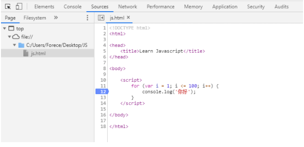


# 七、数组

数组可以把一组相关的数据一起存放，并提供方便的访问方式。


## 1. 创建数组

~~~js
// 利用对象创建数组
var arr = new Array();

// 利用 [] 快捷创建数组
var arr = [];
var arr = [1, 2, 3, 'Pink', True];
~~~


## 2. 访问数组元素

数组可以通过索引来访问、设置、修改对应的数组元素，可以通过 “数组名[索引]“ 的方式来获取数组中的元素。

~~~js
var arr1 = ['张三', '李四', '王五', '淑芬'];
// 索引号：   0       1      2      3

console.log(arr1);  // 输出整个数组所有元素
console.log(arr1[0]);  // 使用 数组名[索引号] 获取数组数组内指定元素的值
~~~


## 3. 遍历数组

~~~js
arr= ['a', 'b', 'c', 'd'];
for (var i = 0; i <= 3; i++) {
    console.log(arr[i]);
}
~~~


## 4. 数组长度属性 length

~~~js
arr= ['a', 'b', 'c', 'd'];
console.log(arr.length);  // 输出4
~~~


利用 length 添加新的数组元素

~~~js
arr = ["a", "b", "c", "d"];
arr[arr.length] = 'e';
console.log(arr[arr.length - 1]);

// 输出结果
e
~~~


## 6. 冒泡排序

~~~js
var arr = [5, 4, 3, 2, 1];
for (var i = 0; i < arr.length - 1; i++) { // 外层循环
    for (var j = 0; j <= arr.length - i - 1; j++) {
        if (arr[j] > arr[j + 1]) {
            var temp = arr[j];
            arr[j] = arr[j + 1];
            arr[j + 1] = temp;
        }
    }
}
console.log(arr);
~~~


## 八、函数

## 1. 声明函数

~~~js
// 声明函数
function 函数名(){
    // 函数内部代码，又称为函数体
}

// 调用函数
函数名();  
~~~


例：将1~100 累加封装成函数

~~~js
function sum(){
    var sum = 0;
    for(var i=1; i<=100; i++){
        sum = sum+i;
    }
    console.log(sum);
}
sum();
~~~


## 2. 函数参数

~~~js
function 函数名(形参1, 形参2){
    // 函数体
}
函数名(实参1, 实参2);
~~~


函数调用参数实例：

~~~js
function cook(arg){
    console.log(arg);
}
cook('炒米饭');
~~~


- 如果调用函数的时候，实参个数大于形参，则只会以形参个数为准
- 如果调用函数的时候，实参个数小于形参，未使用的形参值为 undefined


## 3. return 返回值

函数执行完毕后，只完成里边的代码，如果我们想要获取到函数运行中产生的数据，就需要用到返回值。

~~~js
function getResult(){
    return 666;
}
console.log(getResult());
~~~


- return 会终止函数并只会返回一个值，返回的是最后一个值

- 如果函数没有 return 则会返回 undefined


## 4. 不定参数传递

~~~js
function test(){
    console.log(arguments);
}
test(1,2,3,4,5);

// 输出结果
[1, 2, 3, 4, 5, callee: ƒ, Symbol(Symbol.iterator): ƒ]
~~~


伪数组：

1. 具有数组 length 属性

2. 按照索引方式进行存储

3. 它没有真正数组的一些方法： pop(), push()


## 5. 函数中调用函数

~~~js
function test1(){
    console.log('test1');
}

function test2(){
    test();
    console.log('test2');
}

test2();
~~~


## 6. 匿名函数

匿名函数没有名字

~~~js
function(){
    // 代码块
}
~~~


调用匿名函数：

用小括号的方法实现函数的自调用，注意，这种调用方法只能调用一次

~~~js
(function(){
    console.log('hello world');
})();
~~~


还可以将匿名函数赋值给一个变量，当给这个变量加上() 的时候，就相当于调用了这个函数

~~~js
fn = function (x, y) {
    return x + y;
};
console.log(fn(1, 2));
~~~


## 7. 将函数当做参数

~~~js
var f1 = function () {
    return 100;
};
var f2 = function (fun) {
    console.log(f1());
};
f2(f1);

// 输出结果
100
~~~


# 九、作用域

全局变量：

- 变量在`<script>`标签之内，或者是一个单独js文件
- 如果在函数内部没有声明的变量也属于全局变量（即在函数内部可以使用外部的变量）
- 浏览器关闭才会销毁


局部变量：

- 变量声明在函数内部

- 函数的形参也可以看做是局部变量

- 函数执行完毕就会销毁

  

链式作用域：

- 函数内部可以调用父集中的变量


~~~js
var num = 10;
function fn(){
    var num = 20;
    
    function fun(){
        console.log(num);  // 链式作用域，找父集中的变量，如果没有再找上级
    }
}
~~~


# 十、解析机制

## 1. 预编译

js 引擎会把 js 里边所有的 var 提升，然后再提升 function。 提升到 **当前作用域** 的最前面，不提升赋值操作。

~~~js
console.log(num);  // undefined 因为提升了声明，没有提升赋值
var num = 10; 

// 相当于
var num;
console.log(num);
num = 10;
~~~


~~~js
fun();  // 报错，同理
var fun = function(){
    console.log(22);
}
~~~


~~~js
fn();  // 函数声明已经提升到最前边，所以可以执行。
function fn(){
    console.log(1);
}
~~~


~~~js
var f1 = 100;
function(f1){
    console.log(200);
}
console.log(f1);


// 实际执行顺序
var f1;
function f1(){
    console.log(200);
}
f1 = 100;
console.log(f1);

最后输出 100
~~~


函数内部的 var 声明只会提升到函数开头，而不会跳出函数到全局。

~~~js
// console.log(num);  会报错
show();  // 可以运行，因为函数声明被提升
function show() {
    // 显示 undefined，已经声明但是没有提升赋值
    console.log(num);
    var num = 1;
    console.log(num);
}
~~~


~~~js
var a = b = c = 9; 

// 相当于 
var a = 9; b = 9; c = 9;

// 即
var a;
a = 9;
b = 9;
c = 9;
~~~


## 2. 报错机制

js 运行顺序是先进行预编译，之后代码一行一行按顺序执行，如果出现错误：

- 预编译出现错误，当前 script 标签中的整个代码都不执行，寻找下一个 script 标签
- 执行过程中出现错误，当前 Script 标签中，执行出错之前的代码，之后代码不执行。然后寻找下一个 script 标签


# 十一、对象

## 1. 创建对象

- 利用字面量创建对象
- 利用 Object 方法创建对象


使用字面量创建对象：

~~~js

var obj = {
    uname: "Tom", // 属性以键值对形式存在，不用 var 声明
    'age': 18,
    sex: "male",
    sayHi: function () {
        console.log("hi");
    }
}
console.log(obj.age);
obj.sayHi();
~~~

> 对象的属性名可以不加引号


使用 new Object 方法创建对象

~~~js
// 利用 new Object 创建对象
var obj = new Object();
obj.uname = 'Tom';
obj.saiHi = function(){
    console.log('Hi');
}
~~~


## 2. 调用对象中的属性和方法

~~~js
// 调用属性
obj.uname;
obj['age'];

// 调用方法
obj.sayHi();
~~~


给对象属性重新赋值：

~~~js
obj.uname = 'zhangsan';
obj['age'] = 18;
~~~


## 3. 构造函数创建对象

自己创建一个函数，利用传参的方式构建对象的属性和方法。

~~~js
function 构造函数名(参数1, 参数2, 方法1 ...){
    this.属性 = 值;
    this.方法 = function(){
        // 代码块
    }
}
~~~


例：

~~~js
function Star(uname, age, sex){  // 构造函数命名大驼峰
    this.name = uname;
    this.age = age;
    this.sex = sex;
}

var person = new Star('Luis', 18, 'Male');
console.log(person.name);
~~~


new 关键字创建对象的执行顺序

1. 在内存中创建一个新对象

2. 让 this 指向这个新对象，this 就是这个函数所要创建的对象

3. 执行构造函数里边的代码，给这个新对象添加属性和方法

4. 返回这个对象


this 指向

- 构造函数中，this 指向所要创建的对象实例
- 普通函数中，this 指向 window


### 4. for...in 遍历对象

~~~js
for(变量 in 对象){
    // 代码块
}
~~~

> 数组也可以使用 for..in 来进行遍历


~~~js
var obj = {
    uname: "Tom", 
    age: 18,
    sex: "male",
}
for (var k in obj) {
    console.log(k);
    // 因为 k 是变量，所以只能用 obj[k] 的方式
    // 如果使用 obj.k ，那么就会去寻找 obj 中的 k 属性（并不会自动将变量k解析成对应的字符串）
    console.log(obj[k]);
}

// 输出结果：
uname
Tom
age
18
sex
male
~~~


## 5. 内置对象

内置对象是 JS 内部已经做好的对象，方便用户调用


### 5.1. Math 数学对象 

https://developer.mozilla.org/zh-CN/docs/Web/JavaScript/Reference/Global_Objects/Math

~~~js
console.log(Math.PI);
console.log(Math.max(1,2,3,45));  // 取多个值中的最大数
Math.min(1,2,3);
Math.floor(3.4);  // 向下取整 3
Math.ceil(3.4);  // 向上取整 4
Math.round(1.1);  // 四舍五入
Math.abs(-3);  // 取绝对值 3
Math.pow(10,2)  // 10的2次方
Math.sqrt(100)  // 开平方
Math.random();  // 生成0~1之间的随机小数 [0，1) === 左闭右开区间
~~~


~~~js
// 生成一个区间的随机整数
function getRandom(min, max){
    return Math.floor(Math.floor(Math.random() * (max - min +1)) + min;
}

// 原理：
0 ~ 100
Math.random() * 100  // 乘100提升范围

100~200
Math.random() * 100 + 100  // 加100提升基数

0~200
Math.random() * (300-100)

100~300
Math.random() * (300-100) + 100
~~~


### 5.2. Date 日期对象

https://developer.mozilla.org/zh-CN/docs/Web/JavaScript/Reference/Global_Objects/Date


Date 是一个构造函数，需要使用 new 来创建对象

~~~js
var date = new Date();
console.log(date);  // Wed Apr 21 2021 19:34:46 GMT+0800
date.getFullYear();  // 返回当前年份
date.getMonth();  // 返回的月份小1月
date.getDate();  // 返回几号
date.getDay();  // 返回周几，周一是1，周日是0
date.getHours();
date.getMinutes();
date.getSeconds();

// 获得总毫秒数从1970年1月1日（时间戳）
date.valueOf();
date.getTime();  

// H5 浏览器可以直接用 date 中的方法获取时间戳
var now = Date.now()

// 不支持 HTML5 的浏览器可以使用下面的方式获得时间戳
var now = +new Date()
~~~


获得指定日期对象

~~~js
var date = new Date(1619005441955);  // 传入时间戳
var date = new Date(2015, 4, 1);  // 传入年、月、日（月份从0开始计数）
var date = new Date("2020-5-10");  // 字符串方式传入年-月-日
~~~


转换成字符串

~~~js
toString()
~~~


例：将时间对象整理为 "2020-04-15 11:47:30"的格式

~~~js
      // 2020-04-21 20:01:01
      function time() {
        var now = new Date();
        var year = now.getFullYear();
        var month = now.getMonth();
        var date = now.getDate();
        var hour = now.getHours();
        var min = now.getMinutes();
        var sec = now.getSeconds();

        // 补0仓做
        month = month < 10 ? "0" + month : month;
        date = date < 10 ? "0" + date : date;
        hour = hour < 10 ? "0" + hour : hour;
        min = min < 10 ? "0" + min : min;
        sec = sec < 10 ? "0" + sec : sec;

        return (
          "" +
          year +
          "-" +
          month +
          "-" +
          date +
          " " +
          hour +
          ":" +
          min +
          ":" +
          sec
        );
      }
      console.log(time());
~~~


### 5.3. 数组对象

https://developer.mozilla.org/zh-CN/docs/Web/JavaScript/Reference/Global_Objects/Array


#### new Array() 创建数组

~~~js
var arr1 = new Array(2);  // 创建长度为2的空数组
var arr2 = new Array(2,3);  // 创建一个[2,3]的数组
~~~


#### isArray() 验证是否是数组

~~~js
console.log(arr instanceof Array);
console.log(Array.isArray(arr));
~~~


#### push() 在数组结尾添加元素

- push 可以给数组结尾追加新的元素

- push() 参数直接写需要添加的数组元素

- push 完毕之后，返回的结果是新数组的长度

- 原数组会发生改变

  

~~~js
arr = [1, 2, 3];
t = arr.push(4, "pink");
console.log(t);
console.log(arr);

// 输出结果
5
[1, 2, 3, 4, "pink"]
~~~


例：遍历数组中大于2000的数值

~~~js
var arr = [800, 1500, 2010, 3100, 5000, 1800];
var newArr = [];
for (var i = 1; i <= arr.length; i++) {
    if (arr[i] > 2000) {
        // newArr[newArr.length] = arr[i];
        newArr.push(arr[i]); // 可以直接用 push 代替上方代码
    }
}
console.log(newArr);
~~~


#### unshift() 在数组头部添加元素

和 push 类似，只不过 unshift 是在数组开始处插入元素，返回值为新数组的长度

~~~js
arr = ["black", "white", "orange"];
t = arr.unshift("red");
console.log(t);
console.log(arr);

// 输出结果
4
["red", "black", "white", "orange"]
~~~


#### pop() 删除数组末尾元素

使用 pop() 可以删除数组最后一个元素， 返回值为删除的元素

~~~js
arr = ["black", "white", "orange"];
t = arr.pop();
console.log(t);
console.log(arr);

// 输出结果
orange
["black", "white"]
~~~


#### shift() 删除数组起始元素

~~~js
arr = ["black", "white", "orange"];
t = arr.shift();
console.log(t);
console.log(arr);

// 输出结果
black
["white", "orange"]
~~~


#### reverse() 数组逆序

~~~js
arr = ["black", "white", "orange"];
arr.reverse();
console.log(arr);

// 输出结果
["orange", "white", "black"]
~~~


#### sort() 排序

~~~js
arr = ["n", "b", "z", "a", "j", "x"];
arr.sort();
console.log(arr);

// 输出结果
["a", "b", "j", "n", "x", "z"]
~~~


sort() 对于数值的排序只按第一个字符排序，不会按值大小排序。如：

~~~js
arr = [1, 11, 4, 2, 21, 24, 3];
arr.sort();
console.log(arr);

// 输出结果
[1, 11, 2, 21, 24, 3, 4]
~~~


解决方案：

sort 方法里边可以传一个 compareFunction 匿名函数，函数中有两个参数 a, b。

- a 和 b 代表两个用于比较的元素

- 当 `compareFunction(a, b)` 小于 0 ，那么 a 会被排列到 b 之前；
- 如果 `compareFunction(a, b)` 大于 0 ， b 会被排列到 a 之前。

~~~js
arr = [1, 11, 4, 2, 21, 24, 3];
arr.sort(function (a, b) {
    return a - b;  // 升序排列
    // return b - a;  // 降序排列
});
console.log(arr);
~~~


#### indexOf(), lastIndexOf() 通过值获取索引

- indexOf() 返回在数组中可以找到一个给定元素的第一个索引，如果不存在，则返回-1

- lastIndexOf() 返回指定元素在数组中的最后一个的索引，如果不存在则返回 -1。从数组的后面向前查找

~~~js
var arr = ["Red", "Blue", "Yellow", "Orange", "PINK", "Blue"];
console.log(arr.indexOf("Blue")); // 只返回第一个找到的索引，找不到返回 -1
console.log(arr.lastIndexOf("Blue"));

// 输出结果
1
5
~~~


例：数组去重

~~~js
function unique(arr) {
    var newArr = [];
    for (var i = 0; i < arr.length; i++) {
        if (newArr.indexOf(arr[i]) === -1) {
            // 检测新数组中是否存在
            newArr.push(arr[i]); // 如不存在则 push 进新数组
        }
    }
    console.log(newArr);
}
var arr = [800, 800, 2010, 1800, 3100, 700, 3100, 5000, 1800];
unique(arr);
~~~


#### toString() 转字符串

返回一个字符串，表示指定的数组及其元素

~~~js
var arr = [1,2,3,'pink'];
console.log(arr.toString());  

//输出结果
1,2,3,pink
~~~


#### join() 连接数组元素

join() 方法将一个数组（或一个类数组对象）的所有元素连接成一个字符串并返回这个字符串。如果数组只有一个项目，那么将返回该项目而不使用分隔符。

~~~js
const elements = ['Fire', 'Air', 'Water'];

console.log(elements.join());
// expected output: "Fire,Air,Water"

console.log(elements.join(''));
// expected output: "FireAirWater"

console.log(elements.join('-'));
// expected output: "Fire-Air-Water"
~~~


#### concat() 连接数组

concat() 方法用于合并两个或多个数组。此方法不会更改现有数组，而是返回一个新数组。

~~~js
const array1 = ['a', 'b', 'c'];
const array2 = ['d', 'e', 'f'];
const array3 = array1.concat(array2);

console.log(array3);
// expected output: Array ["a", "b", "c", "d", "e", "f"]
~~~


#### slice() 截取数组

slice() 方法返回一个新的数组对象，这一对象是一个由 begin 和 end 决定的原数组的浅拷贝（包括 begin，不包括end）。原始数组不会被改变。

~~~js
const animals = ['ant', 'bison', 'camel', 'duck', 'elephant'];

console.log(animals.slice(2));
// expected output: Array ["camel", "duck", "elephant"]

console.log(animals.slice(2, 4));
// expected output: Array ["camel", "duck"]

console.log(animals.slice(1, 5));
// expected output: Array ["bison", "camel", "duck", "elephant"]

~~~


#### splice() 删除元素

splice() 方法通过删除或替换现有元素或者原地添加新的元素来修改数组,并以数组形式返回被修改的内容。此方法会改变原数组。


返回值：

由被删除的元素组成的一个数组。如果只删除了一个元素，则返回只包含一个元素的数组。如果没有删除元素，则返回空数组。


- 插入元素

~~~js
var myFish = ["angel", "clown", "mandarin", "sturgeon"];
var removed = myFish.splice(2, 0, "drum");
// 运算后的 myFish: ["angel", "clown", "drum", "mandarin", "sturgeon"]
// 被删除的元素: [], 没有元素被删除
~~~


- 删除元素

~~~js

var myFish = ['angel', 'clown', 'drum', 'mandarin', 'sturgeon'];
var removed = myFish.splice(3, 1);
// 运算后的 myFish: ["angel", "clown", "drum", "sturgeon"]
// 被删除的元素: ["mandarin"]

~~~


- 替换元素

~~~js
var myFish = ['angel', 'clown', 'drum', 'sturgeon'];
var removed = myFish.splice(2, 1, "trumpet");

// 运算后的 myFish: ["angel", "clown", "trumpet", "sturgeon"]
// 被删除的元素: ["drum"]
~~~


### 5.4. 字符串对象

https://developer.mozilla.org/zh-CN/docs/Web/JavaScript/Reference/Global_Objects/String


**包装对象**

字符串、数字、布尔值这三种原始类型的值，为什么会有对象调用方法？这是因为 JS 引擎会自动将原始类型的值转换为包装对象，使用之后会立即销毁。

- String 对象
- Number 对象
- Boolen 对象


~~~js
str = '123';

// 内部处理
var temp = new String('123');  // 实际上是将字符串对象化
str = temp;  // 然后将临时变量传递给str
temp = null;  // 销毁临时变量
str.length();  // 这时候 str 已经是对象了，可以调用方法
~~~


字符串不可变

~~~js
str = '1';
str = '2';
~~~

看似 str 变量从1变成了2，其实并不是 str 的变量改变，而是系统在内存中又开辟了一个空间存放数值2，然后将 str 的地址引向数据，但是原数据1还是存放在内存当中的。


#### indexOf(), lastIndexOf() 查找字符位置

和数组类似，可以将字符串也看做数组，第一个字符索引为0。


返回值：

查找的字符串 `searchValue` 的第一次出现的索引，如果没有找到，则返回 `-1`。


~~~js
// str.indexOf('要查找的字符', [起始的位置])
var str = '白日依山尽';
console.log(str.indexOf('山'));
console.log(str.lastIndexOf('山'));
~~~


例：求某个字符出现的次数和位置

~~~js
var str = "adfajiwerasdfjklweasdfawer";
var index = str.indexOf("a");
var num = 0;
while (index != -1) {
    console.log(index);
    num++;
    index = str.indexOf("a", index + 1);
}
console.log(num);
~~~


#### charAt() 按索引返回字符串

~~~js
var str = 'andy';
str.charAt(3);  // 返回index位置的字符
str.charCodeAt(3);  // 返回 index 位置的 ASCII 码
str[3];  // 获取指定位置处字符
~~~


例：遍历字符串中字符

~~~js
var str = "andy";
for (var i = 0; i < str.length; i++) {
    console.log(str.charAt(i));
}
~~~


例：统计字符串中出现次数最多的字符

~~~js
var str = "tqwerasdfwerqiuyasdfggyweasdf";
var o = {};
for (var i = 0; i < str.length; i++) {
    var chars = str.charAt(i); // 通过 charAt() 获取字符串每个字符
    if (o[chars]) {
        // 判断如果没有该字符属性，则初始化1，有则+1
        o[chars]++;
    } else {
        o[chars] = 1;
    }
}

var max = 0;
var max_str = "";
for (var k in o) {
    // k 是键名
    // o[k] 是值
    if (o[k] > max) {
        max = o[k];
        max_str = k;
    }
}
console.log(max_str);
console.log(max);

// 输出结果
w
3
~~~


#### concat() 拼接字符串

将一个或多个字符串与原字符串连接合并，形成一个新的字符串并返回。

~~~js
var str1 = "a";
var str2 = "b";
var str3 = "c";
var str4 = str1.concat(str2, str3);
console.log(str4);

// 输出结果
abc
~~~


#### substr()  按长度截取字符串

语法：

~~~js
substr(start, length);  // 从start索引位置开始，length 为取的个数，不输入 length，截取到末尾
~~~


~~~js
var anyString = "Mozilla";
console.log(anyString.substr(1,4));

// 输出结果
ozil
~~~


#### slice() 截取字符串

语法：

~~~js
slice(start, end);  // 从 start 位置开始，截取到 end 位置（不包括end）。不输入 end 默认截取到结尾
~~~


~~~js
var anyString = "Mozilla";
console.log(anyString.slice(1, 4));

// 输出结果
ozi
~~~

> 如果是负数索引，从 -1 开始计数


#### substring() 截取字符串

substring 提取从 indexStart 到 indexEnd（不包括）之间的字符。slice() 用法与 substring() 用法类似，

- slice() 方法也可以使用在数组中，并且支持负数索引
- substring() 只可以在字符串中使用，不支持负数索引


- 如果 `indexStart` 等于 `indexEnd`，`substring` 返回一个空字符串。
- 如果省略 `indexEnd`，`substring` 提取字符一直到字符串末尾。
- 如果任一参数小于 0 或为 [`NaN`](https://developer.mozilla.org/zh-CN/docs/Web/JavaScript/Reference/Global_Objects/NaN)，则被当作 0。
- 如果任一参数大于 `stringName.length`，则被当作 `stringName.length`。
- 如果 `indexStart` 大于 `indexEnd`，则 `substring` 的执行效果就像两个参数调换了一样。


语法：

~~~js
str.substring(indexStart[, indexEnd])
~~~


~~~js
var anyString = "Mozilla";
console.log(anyString.substring(-2,3));

// 输出结果
Moz
~~~


#### replace() 替换字符串

replace() 方法用于在字符串中用一些字符替换另一些字符，或替换一个与正则表达式匹配的子串。


语法：

~~~js
stringObject.replace(regexp/substr,replacement)
~~~


- 字符串替换只替换第一个匹配项目
- 批量替换需要使用正则


例：

~~~js
var anyString = "Hello World";
console.log(anyString.replace("World", "Javascript"));

// 输出
Hello Javascript
~~~


#### toUpperCase(), toLowerCase() 大小写转换

~~~js
console.log("aBc".toUpperCase());
console.log("Abc".toLowerCase());

// 输出结果
ABC
abc
~~~


## 5.5 instanceof 判断对象

使用 instanceof() 可以判断该数据或变量是否是某个对象的实例，如：

~~~js
console.log(1 instanceof Number);
var arr = [1, 2, 3, 4, 5];
console.log(arr instanceof Array);

function Student(name, age, score) {
    this.name = name;
    this.age = age;
    this.score = score;
}
var xiaoming = new Student("xiaoming", 18, 99);
// true xiaoming 是 Student 对象的实例
console.log(xiaoming instanceof Student);
// true xiaoming 也是 Object 对象的实例，因为 Student 算是 Object 的子类
console.log(xiaoming instanceof Object);

~~~


# 算法：

## 1. 交换变量的值

~~~js
// 使用第三个临时变量
var a = 1, b =2, var c;
c = a;
a = b;
b = c;

// 加减法交换
var a = 1, b =2;
a = a + b;  // a = 3  b = 2
b = a - b;  // a = 3  b = 1
b = a - b;  // a = 2  b = 1

~~~


## 2. 交换数组变量的值

~~~js
var a=1, b=2;
// 数组中先放a的值
// 第一个值确定后，执行表达式 a = b，此时 a = 2
// 但是数组第一个值已经确定下来，不影响整个数组，数组现在是 [1, 2]
// [a,a=b]  // [1, 2] a =2
// 最后只要拿到数组下标为0的值给b就完成了值的互换
b = [a, a=b][0]
~~~


## 3. 交换对象的值

~~~js
var a=1, b=2;
b = {"attr1":a, "attr2":a=b}.attr1;
~~~


# -------------------------------

# JS 与 浏览器交互

# -------------------------------


# Javascript 与 BOM/DOM

## 1. Web API

API（Application Programming  Interface, 应用程序编程接口）是一些预先定义的**函数**，无需访问源码，或理解内部工作机制。简单的说就是API给程序员提供一种工具，以便更轻松的实现想要完成的功能。


WEB API 是浏览器的提供的一套操作浏览器功能和页面元素的API（BOM和DOM）如：

~~~js
alert('弹出窗口');
~~~


在 javascript 基本语法中，并没有 alert 这个方法，这个方法是浏览器提供给我们的 API，所以这条命令我们只能成功运行在浏览器中，离开浏览器就无法正常运行了。


## 2. BOM

BOM 即浏览器对象模型（browser object model），其提供了一系列接口供开发者使用 `JavaScript` 与浏览器窗口进行交互。


BOM 提供的是与浏览器窗口交互的能力，其包含了一些处理窗口的方法，如打开新窗口，控制新窗口大小，也提供了窗口相关的属性，如窗口尺寸。


像刚才演示的 alert 就是 bom，它的完整写法其实应该是：

~~~js
windows.alert('弹出窗口');
~~~


可以看到，其实 alert 是 window 对象下边的一个方法，而 window 对象就是我们的浏览器窗口。


## 3. DOM

DOM（Document Object Model），是 HTML 或 XML 的标准编程接口，通过DOM接口，可以改变网页的内容、结构和样式。


当网页被加载时，浏览器会创建页面的文档对象模型（Document Object Model），HTML DOM 模型被结构化为对象树：


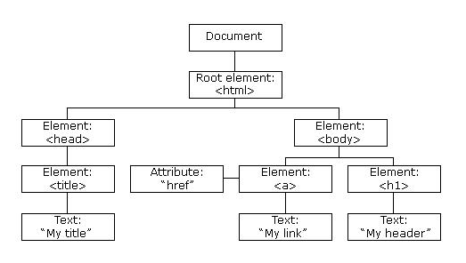


HTML DOM 是 HTML 的标准对象模型和编程接口。它定义了：

- 作为对象的 HTML 元素
- 所有 HTML 元素的属性
- 访问所有 HTML 元素的方法
- 所有 HTML 元素的事件


文档：一个页面就是一个文档，DOM中使用 document 表示

元素：页面中所有的标签都是元素，DOM中使用element表示

节点：网页中所有内容都是节点（标签、属性、文本、注释等），DOM中使用node表示


# 查找 HTML DOM 元素

HTML DOM 能够通过 JavaScript 进行访问（也可以通过其他编程语言）。在 DOM 中，所有 HTML 元素都被定义为对象。我们可以通过 Javascript 对这些对象操作，改变 HTML 元素的内容。


- getElementById()
- getElementsByTagName()
- getElementsByClassName()
- querySelector()
- querySelectorAll()


## 1. getElementByID()

因为 id 元素是唯一的，就是为了在 js 中通过元素 id 来查找元素，document 是页面文档对象，getElementById 是 document 的方法，通过传递的参数（id字符串），是一个标签的id值。可以返回的该元素对象

~~~html
<div id="new">This is new Element</div>
<script>
    // 页面文档从上往下加载，需要将 script 代码写在下边
    var dom = document.getElementById('new');
	// 显示id为new的对象中内容
    console.log(dom);
	// 可以打印我们返回的元素对象，更好的查看里边的属性和方法
    console.dir(dom);  
</script>
~~~


## 2. getElementsByTagName()

注意是 elements 不是 element ，通过标签名来查找元素，获取元素对象的集合，以类似数组的形式存储，如果没有获取到元素，返回一个空的伪数组 

~~~html
<ul>
    <li><span>1</span></li>
    <li><span>2</span></li>
    <li><span>3</span></li>
</ul>

<script>
    var dom = document.getElementsByTagName("li");
    console.log(dom);
    console.log(dom[0]);  // 获取第一个元素
    console.log(dom.length)  // 查看对象长度
    // 遍历元素
    for (var i = 0; i < dom.length; i++) {
        console.log(dom[i]);
    }
</script>
~~~


每一个元素都是 DOM 的节点，他们都拥有相同的方法，刚才一直用 document.getElementById() 和 document.getElementsByTagName() 从根节点查找元素。其实还可以从下级元素中查找元素，如：

~~~html
<ul>
    <li><span>1</span></li>
    <li><span>2</span></li>
    <li><span>3</span></li>
</ul>
<ul>
    <li><span>4</span></li>
    <li><span>5</span></li>
    <li><span>6</span></li>
</ul>

<script>
    var ul = document.getElementsByTagName("ul");
    // 从第二个ul元素中查找li元素
    var li = ul[1].getElementsByTagName("li");
    console.log(li);
</script>
~~~


## 3. getElementsByClassName()

注意是 elements 不是 element，通过类名查找元素，这里返回集合

~~~html
<div class="box">
    <p>This is a box</p>
</div>

<script>
    var box = document.getElementsByClassName("box");
    console.log(box);
</script>
~~~


## 4. getElementsByName()

通过 name 属性获取元素，也是以集合的方式返回

~~~html
<div name="w"></div>
<input type="text" name="username" value="" placeholder="请输入用户名" />
<script>
    // 获取普通 name 属性标签元素
    var w = document.getElementsByName("w");
    
    // 获取 input 标签
    var username = document.getElementsByName("username");
    console.log(w);
    console.log(username);
</script>
~~~


## 4. querySelector()

H5 选择器，使用 CSS 选择器查找元素，只返回第一个元素查找结果

~~~js
// 查找类名为box的元素
var firstBox = document.querySelector('.box');

// 查找id名为box的元素
var nav= document.querySelector('#box');

// 查找li标签元素
var li= document.querySelector('li');

// 查找 name 属性值为 username 的标签元素
var input = document.querySelector("input[name=username]");
~~~


## 5. querySelectorAll()

H5 选择器，使用 CSS 选择器查找元素，返回所有元素集合

~~~js
var doms = document.querySelectorAll('.box');  
~~~


## 6. 查找 HTML 对象

| 属性                         | 描述                                        | DOM  |
| :--------------------------- | :------------------------------------------ | :--- |
| document.anchors             | 返回拥有 name 属性的所有 <a> 元素。         | 1    |
| document.applets             | 返回所有 <applet> 元素（HTML5 不建议使用）  | 1    |
| document.baseURI             | 返回文档的绝对基准 URI                      | 3    |
| document.body                | 返回 <body> 元素                            | 1    |
| document.cookie              | 返回文档的 cookie                           | 1    |
| document.doctype             | 返回文档的 doctype                          | 3    |
| document.documentElement     | 返回 <html> 元素                            | 3    |
| document.documentMode        | 返回浏览器使用的模式                        | 3    |
| document.documentURI         | 返回文档的 URI                              | 3    |
| document.domain              | 返回文档服务器的域名                        | 1    |
| document.domConfig           | 废弃。返回 DOM 配置                         | 3    |
| document.embeds              | 返回所有 <embed> 元素                       | 3    |
| document.forms               | 返回所有 <form> 元素                        | 1    |
| document.head                | 返回 <head> 元素                            | 3    |
| document.images              | 返回所有  元素                         | 1    |
| document.implementation      | 返回 DOM 实现                               | 3    |
| document.inputEncoding       | 返回文档的编码（字符集）                    | 3    |
| document.lastModified        | 返回文档更新的日期和时间                    | 3    |
| document.links               | 返回拥有 href 属性的所有 <area> 和 <a> 元素 | 1    |
| document.readyState          | 返回文档的（加载）状态                      | 3    |
| document.referrer            | 返回引用的 URI（链接文档）                  | 1    |
| document.scripts             | 返回所有 <script> 元素                      | 3    |
| document.strictErrorChecking | 返回是否强制执行错误检查                    | 3    |
| document.title               | 返回 <title> 元素                           | 1    |
| document.URL                 | 返回文档的完整 URL                          | 1    |


# 改变 HTML 元素

| 方法                                       | 描述                   |
| :----------------------------------------- | :--------------------- |
| element.innerHTML = *new html content*     | 改变元素的 HTML 内容   |
| element.innerTEXT = new text               | 改变元素的文本内容     |
| element.attribute = *new value*            | 改变 HTML 元素的属性值 |
| element.setAttribute(*attribute*, *value*) | 改变 HTML 元素的属性值 |
| element.hasAttribute(attribute)            | 判断元素是否有该属性   |
| element.removeAttribute(attribute)         | 删除元素属性           |
| element.style.property = *new style*       | 改变 HTML 元素的样式   |


## 1. element.innerHTML

元素属性 innerHTML 就是元素的 HTML 代码，当查找到元素后，可以对其 innerHTML 属性进行重新赋值修改。

~~~html
<div>
    <h1>Hello World</h1>
</div>
<script>
    var h1 = document.querySelector("div");
    // 将原本的div里边的所有HTML内容更改，如果没有子元素，InnerHTML 就会修改该元素下的 Text 内容
    h1.innerHTML = "<h2>2020-05-05</h2>";
</script>

// 输出结果
2020-05-05
~~~


## 2. element.innerText

~~~html
<h1>Hello World</h1>
<script>
    var h1 = document.querySelector("h1");
    // 只更改文本，HTML 不解析，同时去除空格和换行
    h1.innerText = "<h2>2020-05-05</h2>    ABC";
</script>

// 输出结果
<h2>2020-05-05 ABC</h2>
~~~


## 3. element.attribute 改变元素属性值

这里的 attribute 是代词，具体要看元素有什么属性，比如 a 链接就有 href 属性，所以使用的时候需要用 element.href 来改变。

~~~html
<div>
    <a href="https://www.163.com">网址</a>
</div>

<script>
    var a = document.querySelector("a");
    a.href = "https://www.qq.com";
</script>
~~~


## 4. element.setAttribute 改变元素属性值

还可以通过 element.setAttribute 方法来改变元素属性值

~~~js
element.setAttribute(attribute, value)
~~~

- attribute：属性名

- value：属性值


~~~html
<div>
    <a class="hightlight" href="https://www.163.com">网址</a>
</div>

<script>
    var a = document.querySelector("a");
    a.setAttribute("href", "https://www.qq.com");
    // 用 .属性方法更改 class 属性使用 className
    // 注意空格，这里是增加一个class
    a.className += " hidden";  
    // 用 setAttribute 更改 class 属性直接用 class
    // 也可以直接写上两个属性
    a.setAttribute("class", "hightlight hidden");
</script>
~~~


常用元素属性

- innerText
- innerHTML
- src
- href
- id, alt, title


## 5. element.hasAttribute

通过 element.hasAttribute 判断元素是否有指定属性

~~~html
<a href="index.php" data-index="1">123</a>
<script>
var d = document.querySelector("a");
// 返回 true
console.log(d.hasAttribute("href"));
</script>
~~~


## 6. element.removeAttribute

~~~html
<a href="index.php" data-index="1">123</a>
<script>
var d = document.querySelector("a");
d.removeAttribute("data-index");
</script>
~~~


## 7. H5 新增属性

原生属性可以使用 element.属性的方法获取属性值，自定义属性需要使用 element.getAttribute() 等方法获取、修改、删除属性值

~~~html
<!-- 用 data-index 命名自定义属性 -->
<div data-index="1" data-list-name="Andy"></div>
<script>
    var div = document.querySelector("div");
    // 获取属性值
    console.log(div.getAttribute("data-index"));

    // 获取属性索引
    console.log(div.dataset.index);

    // 获取属性索引
    console.log(div.dataset["index"]);

    // 获取属性值
    console.log(div.dataset.listName);

    // 获取属性值
    console.log(div.dataset["listName"]);
</script>
~~~


## 案例：

- element.属性： 获取内置属性值（元素本身自带属性）
- element.getAttribute('属性')：主要用于获取自定义属性

~~~html
<body>
    <div id="demo" index="1" class="nav"></div>
    <script>
        var div = document.querySelector('div');
        // 1. 获取元素的属性值
        // (1) element.属性
        console.log(div.id);
        //(2) element.getAttribute('属性')  get得到获取 attribute 属性的意思 我们程序员自己添加的属性我们称为自定义属性 index
        console.log(div.getAttribute('id'));
        console.log(div.getAttribute('index'));
        // 2. 设置元素属性值
        // (1) element.属性= '值'
        div.id = 'test';
        div.className = 'navs';
        // (2) element.setAttribute('属性', '值');  主要针对于自定义属性
        div.setAttribute('index', 2);
        div.setAttribute('class', 'footer'); // class 特殊  这里面写的就是class 不是className
        // 3 移除属性 removeAttribute(属性)    
        div.removeAttribute('index');
    </script>
</body>
~~~


## 8. style.property 修改样式

使用元素中的 style 属性可以修改该元素的样式。如 `a.style.fontSize`，`a.style.display`。修改的样式直接作用在行内CSS样式中，


- 修改样式的属性名需要改写，将横杠从CSS属性名中去除，然后将横杠后第一个字母大写，如：background-color 写成 backgroundColor
- 属性值都是字符串，设置时必须包括单位


~~~html
<div>
    <a href="https://www.163.com">网址</a>
</div>

<script>
    var a = document.querySelector("a");
    a.style.fontSize = "24px";
</script>
~~~


例：Tongle 切换背景效果

- 通过类名切换背景
- 也可以通过 document.body.style.backgroundColor 属性切换背景颜色

~~~html
<style>
    .cls {
        background-color: coral;
    }
</style>
<body>
    <button>切换</button>
    <script>
        var btn = document.querySelector("button");
        btn.addEventListener("click", function () {
            if (document.body.className == "") {
                document.body.className = "cls";
            } else {
                document.body.className = "";
            }
        });
    </script>
</body>
~~~


getComputedStyle() 

接受一个节点对象，返回该节点对象最终样式信息的对象。

> getComputedStyle() 是 window 对象下的方法，不是 DOM 对象。


~~~html
<div style="width: 200px; height: 200px; background-color: cadetblue"></div>
<script>
    var div = document.querySelector("div");
    console.log(getComputedStyle(div));
</script>
~~~

> 也可以指定查看属性如： getComputedStyle(div).width


# 事件

事件是一种触发机制，给 HTML 元素加上事件，可以让元素与用户实现动态交互，即实现在某个交互动作或时间，该标签或其他标签会被改变。

事件是由三部分组成，事件源、事件类型、事件处理程序

1. 事件源：事件被触发的对象，如：DOM 元素
2. 事件类型：事件是如何被触发，如：鼠标点击，鼠标经过，还是键盘按下

3. 事件处理程序：通过一个函数赋值的方式完成

.

## 1. 常见 HTML 事件

### 1.1. 鼠标事件

~~~
onclick  		// 鼠标点击左键
ondbclick		// 鼠标双击
oncontextmenu	// 鼠标点击右键
mousedown		// 鼠标按键被按下
mouseup			// 松开鼠标按键
onselect		// 文本被选中
oncopy			// 元素内容被复制
onmouseenter	// 鼠标移动到事件监听的元素内（不区分子元素）
onmouseover  	// 鼠标移动到有事件监听的元素或它的子元素内
onmouseleave	// 鼠标离开元素外（不区分子元素）
onmouseout  	// 鼠标离开元素，或它的子元素外
onfocus  		// 获得鼠标焦点(点击input输入框)
onblur  		// 失去鼠标焦点（进入其他input输入框）
onmousemove  	// 鼠标移动
onmouseup  		// 鼠标弹起
onmousedown  	// 鼠标按下
~~~


### 1.2. 键盘事件

执行顺序：keydown - keypress - keyup

~~~js
onkeyup  // 某个按键被松开时触发
onkeydown  // 某个键被按下时触发
onkeypress  // 某个键被按下时触发（但是不识别功能键如CTRL、SHIFT、方向键等）
~~~


~~~html
<script>
    // 常用的键盘事件
    //1. keyup 按键弹起的时候触发 
    // document.onkeyup = function() {
    //         console.log('我弹起了');

    //     }
    document.addEventListener('keyup', function() {
        console.log('我弹起了');
    })

    //3. keypress 按键按下的时候触发  不能识别功能键 比如 ctrl shift 左右箭头啊
    document.addEventListener('keypress', function() {
            console.log('我按下了press');
        })
        //2. keydown 按键按下的时候触发  能识别功能键 比如 ctrl shift 左右箭头啊
    document.addEventListener('keydown', function() {
            console.log('我按下了down');
        })
        // 4. 三个事件的执行顺序  keydown -- keypress -- keyup
</script>
~~~


e.keyCode 返回 ASCII 值

~~~html
按键1  // 返回 49
~~~


- keyup / keydown 不区分大小写，返回都是大写的 ASCII 值

- keypress 返回区分大小写


### 1.3. 表单事件

表单事件需要绑定在表单上边，而不是提交按钮上

| 事件   | 说明                                 |
| ------ | ------------------------------------ |
| reset  | 点击重置按钮时，先过一遍js代码再提交 |
| submit | 点击提交按钮时                       |


### 1.4. 内容变化事件

| 事件   | 说明                                                         |
| ------ | ------------------------------------------------------------ |
| change | 当内容改变且失去焦点时触发（表单验证：邮箱、用户名长度判断） |
| input  | 当内容值改变时触发，类似键盘弹起                             |


## 2. 事件书写的方式

- 行内式
- 函数式
- 结合式


### 2.1. 行内式

```html
<h1 onclick="this.innerHTML = 'Hello!'">点击此文本！</h1>
```


### 2.2. 函数式（常用）

~~~html
<h1>点击H1文本！</h1>
<h2>点击H2文本</h2>
<h3>点击H3文本</h3>
<h4>点击H4文本</h4>
<script>
    var h1 = document.querySelector("h1");
    h1.onclick = function () {
        h1.innerHTML = "Hello";
    };
    
    // 可以省略变量部分
    document.querySelector("h2").onclick = function () {
        document.querySelector("h2").innerHTML = "Hello";
    };

    // 直接使用函数名（将匿名函数赋值给变量），需要注意函数的预编译执行顺序
    var f1 = function () {
        document.querySelector("h3").innerHTML = "Hello";
    };
    document.querySelector("h3").onclick = f1;

    // 直接使用函数名
    document.querySelector("h4").onclick = f2;
    function f2() {
        document.querySelector("h4").innerHTML = "Hello";
    }
</script>
~~~


为什么在 script 标签中绑定 onclick 事件后边函数不用加 () 

- 因为加括号就是调用函数，页面加载 js 文件后就会调用该函数，这不是我们所希望的
- 不加括号是一个函数对象就像匿名函数那样，function() {} 只是声明在那里，只有触发事件才会调用，在绑定的时候我们不需要调用该函数。
- HTML 调用一定要加 ()


### 2.3. 结合式

~~~html
<h1 onclick="sayHi()">点击此文本！</h1>
<script>
    function sayHi() {
        alert("sayHi");
    }
</script>
~~~


### 2.4. 事件中的 this

在普通函数中，this 代表 windows 对象。在对象构造函数中，this 代表这个对象本身。而在事件中的 this 是该标签对象本身

~~~js
var h1 = document.querySelector("h1");
f1 = function () {
    console.log(this);
    this.innerHTML = 'Hi~';
};
// 把一个方法赋值给 h1.onclick
// onclick 就相当于是 h1 对象的一个方法。在对象方法中的 this 指向的就是该对象本身。
h1.onclick = f1;
~~~


## 3. 案例

### 3.1. 点击按钮显示不同图片

~~~html
<button id='ldh'>刘德华</button>
<button id='zxy'>张学友</button>

<script>
    var ldh = document.getElementById('ldh');
    var zxy = document.getElementById('zxy');
    var img = document.getElementById('img');
    zxy.onclick = function(){
        img.src = "images/zxy.jpg";
        img.title = '张学友';
    }
    ldh.onclick = function(){
        img.src = "images/ldh.jpg";
        img.title = '刘德华';
    }
</script>
~~~


### 3.2. 根据时间显示不同内容

~~~html

<div>上午好</div>
<script>
    var img = document.querySelector('img');
    var div= document.querySelector('div');
    var date = new Date();
    var h = date.getHours();
    if (h<12){
        img.src = 'images/s.gif';
        div.innerHTML = '上午好';
    } else if (h<18){
        img.src = 'images/z.gif';
        div.innerHTML = '中午好';
    } else {
        img.src = 'images/w.gif';
        div.innerHTML = '晚上好';
    }
</script>
~~~


### 3.3. 点击按钮修改表单属性

~~~html
<button>按钮</button>
<input type="text" value="输入内容"></input>
<script>
    var btn = document.querySelector('button');
    var input = document.querySelector('input');
    btn.onclick = function() {
        // 注意这里不能用 inner.HTML，HTML 只适用于普通标签
        input.value = '点击了'; 
        // 点击过一次禁用按钮
        // 也可以使用 this.disabled = true;
        btn.disabled = true;         
    }
</script>
~~~


### 3.4. 实现密码框明文显示

~~~html
<style>
    .box {
        position: relative;
        width: 400px;
        border-bottom: 1px solid #cccccc;
        margin: 100px auto;
    }
    
    .box input {
        width: 370px;
        height: 30px;
        border: 0;
        outline: none;
    }
    
    .box img {
        position: absolute;
        top: 2px;
        right: 2px;
        width: 24px;
    }
</style>

<body>
    <div class="box">
        <label for="">
            
        </label>
        <input type="password" name="" id="psw">
    </div>
    
    <script>
        var eye = document.getElementById('eye');
        var psw = document.getElementById('psw');
        var flag = 0;
        eye.onclick = function() {
            if (flag == 0) {
                psw.type = 'text';
                eye.src = 'images/display.png';
                flag = 1;
            } else {
                psw.type = 'password';
                eye.src = 'images/hide.png'
                flag = 0;
            }

        }
    </script>
</body>
~~~


### 3.5. 修改背景颜色

~~~html
<html>
<style>
    div {
        width: 200px;
        height: 200px;
        background-color: pink;
    }
</style>

<body>
    <div></div>
    <script>
        var div = document.querySelector('div');
        div.onclick = function() {
            div.style.backgroundColor = 'purple';
            // this.style.backgroundColor = 'purple';
        }
    </script>
</body>

</html>
~~~


### 3.6. 显示隐藏二维码

~~~html
<div class="box">
    这是一个二维码
    
    <i class="close-btn">x</i>
</div>
<script>
    var btn = document.querySelector('.close-btn');
    var box = document.querySelector('.box');
    btn.onclick = function() {
        box.style.display = 'none';
    }
</script>
~~~


### 3.7. 循环填入小图片

~~~html
<li></li>
<li></li>
<li></li>
<li></li>
<li></li>
<script>
    var lis = document.querySelectorAll('li');
    for (var i = 0; i < lis.length; i++) {
        // 图标y坐标相隔44个像素
        var index = i * 44;
        //Position需要是负值，循环遍历更改style
        lis[i].style.backgroundPosition = '0 -' + index + 'px';
    }
</script>

~~~


### 3.8. 输入框点击，默认文字消失（利用焦点）

~~~html
<body>
    <input text="text" value="手机">
    <script>
        var input = document.querySelector('input');
        input.onfocus = function() {
            if (input.value === '手机') {
                this.value = "";
            }
            this.style.color = '#333'
        }
        input.onblur = function() {
            if (this.value === '') {
                this.value = "手机";
            }
            this.style.color = '#ccc'

        }
    </script>
</body>
~~~


### 3.9. 利用类名批量更改 CSS 换风格

~~~html
<html>
<style>
    .change {
        background-color: pink;
        color: powderblue;
        font-size: 14px;
        margin-top: 100px;
    }
</style>

<body>
    <div class="default">文本</div>
    <script>
        var div = document.querySelector('div');
        div.onclick = function() {
            div.className = 'change';
            // div.className = 'default change'; 保留原类名，直接用双类名
        }
    </script>
</body>

</html>
~~~


### 3.10. 验证密码长度

~~~html
<body>
    <div class="register">
        <input type="password" class="ipt">
        <p class="message">请输入6~16位密码</p>

    </div>
    <script>
        var ipt = document.querySelector('.ipt');
        var message = document.querySelector('.message');
        ipt.onblur = function(){
            if(this.value.length <6 || this.value.length > 16){
                message.className = 'message wrong';
                message.innerHTML = '您输入的密码位数需要6~16位';
            }
            else {
                message.className = 'message right';
                message.innerHTML = '您输入的密码符合要求';
            }
        }
    </script>
</body>
~~~


### 3.11. 排他思想（控制多个元素）

~~~html
<html>

<body>
    <button>按钮1</button>
    <button>按钮2</button>
    <button>按钮3</button>
    <button>按钮4</button>
    <button>按钮5</button>
    <script>
        var btns = document.querySelectorAll('button');
        for (var i = 0; i < btns.length; i++) {
            btns[i].onclick = function() {
                for (var i = 0; i < btns.length; i++) {
                    btns[i].style.backgroundColor = '';
                }
                this.style.backgroundColor = 'red';
            }
        }
    </script>
</body>

</html>
~~~


### 3.12. 网页背景换肤功能

~~~html
<html>

<body>
    <ul class="baidu">
        <li></li>
        <li></li>
        <li></li>
        <li></li>
    </ul>
    <script>
        var imgs = document.querySelector('.baidu').querySelectorAll('img');
        for (var i = 0; i < imgs.length; i++) {
            imgs[i].onclick = function() {
                document.body.style.backgroundImage = 'url(' + this.src + ')'
            }
        }
    </script>
</body>

</html>
~~~


### 3.13. 表格鼠标移动行表格隔行变色

~~~html
    <script>
        var trs = document.querySelector('tbody').querySelectorAll('tr');
        for (var i = 0; i < trs.length; i++) {
                trs[i].onmouseover = function() {
                    this.className = 'bg';
                }
                trs[i].onmouseout = function() {
                    this.className = '';
                }
        }
    </script>
~~~


### 3.14. 表单全选

~~~html
<script>
    // 1. 全选和取消全选做法：  让下面所有复选框的checked属性（选中状态） 跟随 全选按钮即可
    // 获取元素
    var j_cbAll = document.getElementById('j_cbAll'); // 全选按钮
    var j_tbs = document.getElementById('j_tb').getElementsByTagName('input'); // 下面所有的复选框
    // 注册事件
    j_cbAll.onclick = function() {
            // this.checked 它可以得到当前复选框的选中状态如果是true 就是选中，如果是false 就是未选中
            console.log(this.checked);
            for (var i = 0; i < j_tbs.length; i++) {
                j_tbs[i].checked = this.checked;
            }
        }
        // 2. 下面复选框需要全部选中， 上面全选才能选中做法： 给下面所有复选框绑定点击事件，每次点击，都要循环查看下面所有的复选框是否有没选中的，如果有一个没选中的， 上面全选就不选中。
    for (var i = 0; i < j_tbs.length; i++) {
        j_tbs[i].onclick = function() {
            // flag 控制全选按钮是否选中
            var flag = true;
            // 每次点击下面的复选框都要循环检查者4个小按钮是否全被选中
            for (var i = 0; i < j_tbs.length; i++) {
                if (!j_tbs[i].checked) {
                    flag = false;
                    break; // 退出for循环 这样可以提高执行效率 因为只要有一个没有选中，剩下的就无需循环判断了
                }
            }
            j_cbAll.checked = flag;
        }
    }
</script>
~~~


### 3.15. TAB栏切换


# 节点操作

## 1. 节点层级关系

除了使用 ID，标签，CSS 选择器查找元素外，我们还可以利用节点层次关系（父集、子集）来选择元素。


一般节点至少拥有 nodeType（节点类型）、nodeName（节点名称）、nodeValue（节点值）三个属性


节点类型：

- 元素节点 nodeType 为 1
- 属性节点 nodeType 为 2
- 文本节点 nodeType 为 3


节点名称：

- nodeName 是只读的
- 元素节点的 nodeName 与标签名相同
- 属性节点 nodeName 与属性名相同
- 文本节点的 nodeName 始终是 #text
- 文档节点的 nodeName 始终是 #document


节点值：

- 元素节点 nodeValue 是 undefined 或 null
- 文本节点的 nodeValue 是 文本本身
- 属性节点的 nodeValue 是属性值


使用 nodeName 和 nodeType 判断标签

~~~js
document.getElementById("btn").onclick = function () {
    var count = 0;
    var nodes = docoument.getElementById("uu").childNodes;
    for (var i = 0; i < nodes.length; i++) {
        var node = nodes[i];
        // 判断 node 是否是 li
        if (node.nodeType == "1" && node.nodeName == "LI") {
            node.style.backgroundColor = count % 2 == 0 ? "red" : "yellow";
            count++;
        }
    }
};
~~~


节点层级：

- 父节点 parentNode / parentElement
- 子节点 childNodes（注意：会同时包含文本节点和元素节点）
- 子节点 children（非标准，但是只获得元素节点）

- 第一个子节点 firstChild  / firstElementChild
- 最后一个子节点 lastChild  / lastElementChild
- 下一个兄弟节点 nextSibling / nextElementSibling
- 上一个兄弟节点 previousSibling / previousElementSibling


- 带有 Element 的节点可以操作里边的HTML内容、文本内容、属性内容，一般用来做节点内容操作

- 带有 Node 字样的一般是用来做布局插入使用，它包含了文本节点和元素节点（比如换行也算做文本节点）


很多函数是不支持 IE9 的，比如 firstElementChild，nextElementSibling，如果项目要考虑兼容性，需要自己封装函数

~~~js
function getNextElementSibling(element) {
    var el = element;
    while (el = el.nextSibling){
        if (el.nodeType === 1){
            return el;
        }
    }
    return null;
}
~~~


### 1.1. ParentElement 父节点

表示当前元素的父节点

~~~html
<div>
    <a href="#">点我</a>
</div>
<script>
    var a = document.querySelector("a");
    a.onclick = function () {
        // 改变 a 元素的父节点div中的innerHTML
        this.parentElement.innerHTML = '<a href="#">别点我</a>';
    };
</script>
~~~


### 1.2. 子节点

childNodes 选择元素所有子节点，返回一个集合，其中包含子元素，以及文本节点

~~~html
<div style="width: 200px; height: 200px; background-color: cadetblue">
    <a href="#">点我</a>
    <a href="#">点我</a>
</div>
<script>
    var div = document.querySelector("div");
    div.onclick = function () {
        console.log(this.childNodes);
        // innerHTML = '<a href="#">别点我</a>';
    };
</script>

<!-- 输出结果 
NodeList(5) [text, a, text, a, text]
0: text
1: a
2: text
3: a
4: text
length: 5  -->
~~~


children 选择元素所有子节点，返回一个集合，可以用 [索引]的方式选择其中的子元素

~~~html
<div style="width: 200px; height: 200px; background-color: cadetblue">
    <a href="#">点我</a>
    <a href="#">点我</a>
</div>
<script>
    var div = document.querySelector("div");
    div.onclick = function () {
        console.log(this.children);
        // innerHTML = '<a href="#">别点我</a>';
    };
</script>

<!-- 输出结果
HTMLCollection(2) [a, a]
0: a
1: a
length: 2
__proto__: HTMLCollection
-->
~~~


第一个/最后一个子节点

~~~html
<div style="width: 200px; height: 200px; background-color: cadetblue">
    <a href="#">点我</a>
    <a href="#">点我</a>
</div>
<script>
    var div = document.querySelector("div");
    div.onclick = function () {
        this.firstElementChild.innerHTML = '<a href="#">别点我</a>';
        // this.lastElementChild.innerHTML = '<a href="#">别点我</a>';
    };
</script>
~~~


### 1.3. 兄弟节点

~~~html
<div style="width: 200px; height: 200px; background-color: cadetblue">
    <a id="a1" href="#">点我</a>
    <a href="#">点我</a>
</div>
<script>
    var a = document.querySelector("#a1");
    a.onclick = function () {
        this.nextElementSibling.innerHTML = '<a href="#">别点我</a>';
    };
</script>
~~~


## 2. 节点操作

| 方法                                  | 描述               |
| :------------------------------------ | :----------------- |
| document.createElement(*element*)     | 创建 HTML 元素     |
| document.removeChild(*element*)       | 删除 HTML 元素     |
| document.appendChild(*element*)       | 尾部添加 HTML 元素 |
| node.insertBefore(child, targetChild) | 起始位置添加子节点 |
| document.replaceChild(*element*)      | 替换 HTML 元素     |
| node.cloneNode()                      | 复制节点           |
| document.write(*text*)                | 写入 HTML 输出流   |


### 2.1. 创建节点

~~~js
document.createElement('tagName')  // 用来生成网页元素节点，参数为元素的标签名
document.createTextNode()  // 用来生成文本节点，参数为所要生成文本节点的内容
~~~


创建标签的三种方式：

~~~
document.write()  // 直接写入页面内容流，会重写页面内容
element.innerHTML  // 直接使用会导致效率低下，如果使用数组拼接后再写入则效率更高
document.createElement()  // 添加大量标签效率要比 innerHTML 高
~~~


例：插入节点

~~~html
<div id="d1"></div>
<script>
    var d1 = document.querySelector("#d1");
    var h1 = document.createElement("h1");
    h1.innerText = "12345";
    // 插入子节点
    d1.appendChild(h1);
</script>
~~~


例：插入文本节点

~~~html
<div id="d1"></div>
<script>
    var d1 = document.querySelector("#d1");
    var divText = document.createTextNode("文本内容");
    d1.appendChild(divText);
</script>
~~~


### 2.2. 添加节点

~~~js
node.appendChild(child)  // 接受一个节点对象为参数，添加子节点（如有相同元素，则在后方插入）
node.hasChildNodes()  // 返回一个布尔值，表示当前节点是否有子节点
node.inserBefore(child, targetChild)  // 添加子节点（指定某个子节点的前方插入）
~~~


### 2.3. 删除节点

~~~js
node.removeChild(child)  // 接受一个子节点为参数，从父节点中删除一个子节点
~~~


### 2.4. 复制节点

~~~js
node.cloneNode();  // 用于克隆一个选中节点，它接受一个布尔值为参数，表示是否克隆该节点的子节点，默认 false（不会克隆节点上的事件）
~~~


例：

~~~html
<ul>
    <li id="li1">香蕉</li>
    <li>苹果</li>
    <li>大鸭梨</li>
</ul>
<script>
    var ul = document.querySelector("ul");
    var li1 = document.querySelector("#li1");
    // 文本也算是子节点，所以需要将参数设置为 true
    var newLi = li1.cloneNode(true);
    ul.appendChild(newLi);
</script>
~~~


### 2.5. 案例

#### 2.5.1

#### 2.5.2. 留言板添加留言案例

#### 2.5.3. 留言板删除留言案例

#### 2.5.4. 动态生成表格


# 高级事件（推荐使用）

传统注册方式：利用 on 开头的事件 onclick，如：

~~~html
<button onclick="alert('hi~')">按钮</button>
<script>
    var btn = document.querySelector("button");
    btn.onclick = function () {
        alert("bye~");
    };
</script>
~~~

传统注册事件的方式具有唯一性，同一个元素同一个事件只能设置一个处理函数，最后注册的处理函数将会覆盖前面的注册的处理函数。


## 1. addEventListenner 添加事件监听

eventTarget.addEventListener() 方法将指定的监听器注册到 eventTarget （目标对象）上，当该对象触发指定的事件时，就会执行事件处理函数。


- type: 事件类型字符串，如 click，mouseover 等，这里不用带 on
- listener：事件处理函数，事件触发时，会调用该监听函数
- useCapture：可选参数，默认 false


~~~html
<button>按钮</button>
<script>
    var btn = document.querySelector('button');
    btn.addEventListener('click', function() {
        alert("弹出");
    })
        btn.addEventListener('click', function() {
        alert("第二次弹出");
    })
</script>
~~~

> 同一个元素，同一个事件可以添加多个侦听器


## 2. EventTarget.attachEvent()

仅支持 IE9 以前的浏览器，不建议使用，只是为了开发兼容性，才需要使用。


语法：

~~~js
EventTarget.attachEvent(eventNameWithOn, callback)
~~~


参数：

- eventNameWithOn: 事件类型字符串，比如 onclick、onmouseover
- callback：事件处理函数


注册事件兼容性封装

~~~js
function addEventListener(element, eventName, fn) {
    // 判断当前浏览器是否支持 addEventListener 方法
    if (element.addEventListener) {
        element.addEventListener(eventName, fn);
    } else if (element.attachEvent) {
        element.attachEvent('on' + eventName, fn);
    } else {
        // 相当于 element.onclick = fn;
        element['on' + eventName] = fn;
    }
}
addEventListener(btn, 'click', function() {
    alert("弹出3");
~~~


## 3. removeEventListener 删除事件监听

传统方式：可以利用覆盖来删除事件

~~~html
<button>按钮</button>
<script>
    var btn = document.querySelector('button');
    btn.onclick = function() {
        alert('弹出');
        // 等于 null 或 '' 都可以
        btn.onclick = null;
    }
</script>
~~~


取消后续动作：

可以利用 return flase 取消后续事件，比如表单提交之前验证，如果没有通过验证就取消提交，不执行跳转。

~~~html
<form action="" id="f">
    <label for="username">用户名</label
        ><input
                type="text"
                id="username"
                name="username"
                value=""
                placeholder="username"
                />
    <input id="submit" type="submit" value="提交" />
</form>

<script>
    var input = document.querySelector("#username");
    var f = document.querySelector("#f");
    // submit 事件要给 form 标签绑定
    f.addEventListener("submit", function () {
        if (input.value === "") {
            alert("没有输入用户名");
            return false;
        }
    });
</script>
~~~


移除 addEventListener 监听绑定事件方式：

语法：

~~~html
eventTarget.removeEvenetListener(type, listener[, useCapture]);
~~~


使用：

~~~html
<button>按钮</button>
<script>
    var btn = document.querySelector('button');
    btn.addEventListener('click', fn);

    fn = function () {
        alert('弹出');
        btn.removeEventListener('click', fn);
    }
</script>
~~~

> 不能用匿名函数，需要将 function 单独写出来


## 4. eventTarget.detachEvent()              

还是旧版兼容性问题，可以使用 detachEvent() 方法解除监听


语法：

~~~js
eventTarget.detachEvent(eventNameWithOn, callback)
~~~


使用：

~~~js
btn.detachEvent('onclick' fn);
~~~


## 5. 事件流

事件流描述的是从页面接受事件的顺序。事件发生时会在元素节点之间按照特定的顺序传播，这个传播的过程即DOM事件流


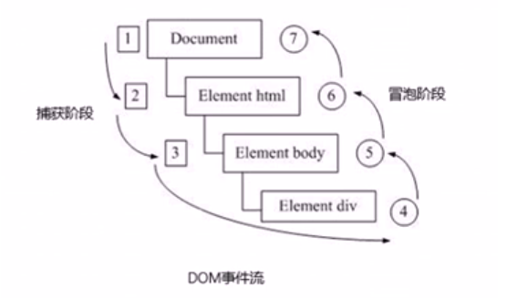


addEventListener(type, listener[, useCapture]) 这第三个可选参数 Capture 如果是 true，表示在事件捕获阶段调用事件处理程序；如果是 false（默认），表示在事件冒泡阶段调用事件处理程序。


- <del>onclick 和 attachEvent 只能得到冒泡阶段，也就是说从内向外依次执行</del>
- <del>有些事件没有冒泡，比如 onblur、onfocus、onmouseenter、onmouseleft</del>


事件触发顺序：（大盒子套小盒子）

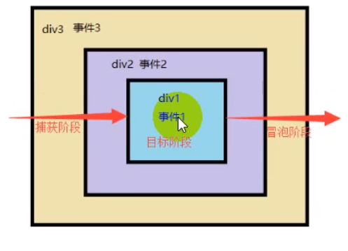


- 当事件监听方式为默认方式，没有捕获阶段，只有冒泡阶段，比如 onclick，点击小盒子会先触发小盒子上绑定的事件，然后会依次触发大盒子、document、window 上边的事件
- 当事件监听方式设置为捕获方式，会先触发外部盒子上边的事件，然后再触发小盒子，之后再按冒泡顺序触发其他事件
- 默认事件都是冒泡顺序，只有用事件监听方式将 Capture 参数开启后才能实现捕获阶段触发事件，比如将 onclick 设置 Capture = true 的话，再点击小盒子就会先触发外边的盒子上的事件


## 6. 事件对象

event 对象代表事件的状态，比如键盘的按键状态、鼠标的位置、鼠标按钮的状态等，简单理解为事件发生后，跟事件相关的一系列数据集合都存放在这个 event 对象中。它包括很多属性和方法。


~~~html
<button>按钮</button>
<script>
    var btn = document.querySelector('button');
    btn.onclick = function(event){
        console.log(event);            
    }
  // 事件对象e可以看做形参，名称可以自己命名
    btn.addEventListener('click', function(e){
        console.log(e);            
    });
</script>
~~~


IE8 浏览器兼容性处理

~~~html
<button>按钮</button>
<script>
    var btn = document.querySelector('button');
    btn.onclick = function(e){
        e = e || window.event;
        console.log(e);            
    }
</script>
~~~


事件对象常见的属性和方法

~~~js
e.target  // 返回触发事件的对象（标准）
e.srcElement  // 返回触发事件的对象（非标准 ie6-8 使用）
e.type  // 返回事件的类型，比如 click、mouseover（不带on）
e.stopPropagation()  // 阻止冒泡（标准）
e.cancelBubble  // 该属性阻止冒泡（非标准 ie6-8 使用）
e.preventDefault()  // 阻止默认事件（标准）如让连接不跳转
e.returnValue  // 阻止默认事件（非标准 ie6-8 使用）
~~~


e.target 返回触发事件的对象（点击对象）

~~~html
<button>按钮</button>
<script>
    var btn = document.querySelector('button');
    btn.onclick = function(e) {
        console.log(e.target);
    }
</script>
~~~

> e.target 是点击对象，this 是绑定对象（类似currentTarget）


阻止默认事件行为

之前用的 return false 可以阻止事件默认行为，也可以使用事件对象的方式阻止。

- 取消浏览器对当前事件的默认行为
- 比如：点击链接跳转到指定页面，按空格，页面向下滚动一段距离，组织提交数据

~~~html
<a href='#'>链接</a>
<script>
    var a = document.querySelector('a');
    a.addEventListener('click', function(e) {
        e.preventDefault();
    })
    // 传统方式
    a.onclick = function(e){
    e.preventDefault();
    }
    // 低版本浏览器 ie678  returnValue  属性
    // e.returnValue;
    // 我们可以利用return false 也能阻止默认行为 没有兼容性问题 特点： return 后面的代码不执行了， 而且只限于传统的注册方式
    // return false;
</script>
~~~


阻止事件冒泡

- 两个嵌套盒子都有自己的事件，当点击内部盒子时，由于冒泡规则，外部事件也会触发，如果不想让外部盒子绑定事件生效，就需要组织冒泡事件。

~~~html
<div class="father">
    <div class="son">son儿子</div>
</div>
<script>
    // 常见事件对象的属性和方法
    // 阻止冒泡  dom 推荐的标准 stopPropagation() 
    var son = document.querySelector('.son');
    son.addEventListener('click', function(e) {
        alert('son');
        e.stopPropagation(); // stop 停止  Propagation 传播
        e.cancelBubble = true; // 非标准 cancel 取消 bubble 泡泡
    }, false);

    var father = document.querySelector('.father');
    father.addEventListener('click', function() {
        alert('father');
    }, false);
    document.addEventListener('click', function() {
        alert('document');
    })
</script>
~~~


## 7. 事件委托

不是给每个子节点单独设置事件监听器，而是将事件监听器设置在其父节点上，然后利用冒泡原理影响设置每个子节点。


- event.target：对事件起源目标的引用，属性返回触发事件的那个节点
- event.currentTarget：属性返回事件当前所在的节点，即正在执行的监听函数所绑定的那个节点。

> currentTarget 用 console 控制台显示的时候一直显示 null ，这是因为currentTarget 只能用于事件正在处理过程中，当回调结束，会被重新赋值。


如：给 ul 注册点击事件，然后利用事件对象的 target 来找到当前点击的 li，因为点击 li，事件会冒泡到 ul 上，ul 有注册事件，就会触发事件监听器


~~~html
<ul>
    <li>知否知否，点我应有弹框在手！</li>
    <li>知否知否，点我应有弹框在手！</li>
    <li>知否知否，点我应有弹框在手！</li>
    <li>知否知否，点我应有弹框在手！</li>
    <li>知否知否，点我应有弹框在手！</li>
</ul>
<script>
    // 事件委托的核心原理：给父节点添加侦听器， 利用事件冒泡影响每一个子节点
    var ul = document.querySelector('ul');
    ul.addEventListener('click', function(e) {
        // alert('知否知否，点我应有弹框在手！');
        // e.target 这个可以得到我们点击的对象
        e.target.style.backgroundColor = 'pink';
    })
</script>
~~~


禁止鼠标右键、禁止复制文字

~~~html
我是一段不愿意分享的文字
<script>
    // 1. contextmenu 我们可以禁用右键菜单
    document.addEventListener('contextmenu', function(e) {
            e.preventDefault();
        })
        // 2. 禁止选中文字 selectstart
    document.addEventListener('selectstart', function(e) {
        e.preventDefault();

    })
</script>
~~~


## 8. 鼠标事件对象

event 对象代表事件的状态，跟事件相关的一系列信息的集合。鼠标事件对象 MouseEvent，键盘事对象 KeyboardEvent

~~~js
e.clientX  // 返回鼠标相对于浏览器窗口可视区域 X 坐标
e.clientY
e.pageX  // 返回鼠标相对于文档页面 X 坐标 IE9+
e.pageY
e.screenX  // 返回鼠标相对于电脑屏幕的 X 坐标
e.screenY
~~~


~~~html
<script>
    // 鼠标事件对象 MouseEvent
    document.addEventListener('click', function(e) {
        // 1. client 鼠标在可视区的x和y坐标
        console.log(e.clientX);
        console.log(e.clientY);
        console.log('---------------------');

        // 2. page 鼠标在页面文档的x和y坐标
        console.log(e.pageX);
        console.log(e.pageY);
        console.log('---------------------');

        // 3. screen 鼠标在电脑屏幕的x和y坐标
        console.log(e.screenX);
        console.log(e.screenY);

    })
</script>
~~~


跟随精灵

~~~html

<script>
    var pic = document.querySelector('img');
    document.addEventListener('mousemove', function(e) {
        // 1. mousemove只要我们鼠标移动1px 就会触发这个事件
        // console.log(1);
        // 2.核心原理： 每次鼠标移动，我们都会获得最新的鼠标坐标， 把这个x和y坐标做为图片的top和left 值就可以移动图片
        var x = e.pageX;
        var y = e.pageY;
        console.log('x坐标是' + x, 'y坐标是' + y);
        //3 . 千万不要忘记给left 和top 添加px 单位
        pic.style.left = x - 50 + 'px';
        pic.style.top = y - 40 + 'px';


    });
</script>
~~~


## 9. 键盘事件对象

监控按键，然后移动页面焦点

~~~html
<input type="text">
<script>
    // 核心思路： 检测用户是否按下了s 键，如果按下s 键，就把光标定位到搜索框里面
    // 使用键盘事件对象里面的keyCode 判断用户按下的是否是s键
    // 搜索框获得焦点： 使用 js 里面的 focus() 方法
    var search = document.querySelector('input');
    document.addEventListener('keyup', function(e) {
        // console.log(e.keyCode);
        if (e.keyCode === 83) {
            search.focus();
        }
    })
</script>
~~~


# 兼容性问题

## 1. 事件对象

~~~js
var e = e || window.event;
~~~


## 2. 阻止浏览器默认行为

~~~js
if (event.preventDefault) {
    event.preventDefault()
} else {
    event.returnValue = false;
}
~~~

>也可以使用 return false


## 3. 阻止事件传播（冒泡）

~~~js
if (event.stopPropagation) {
    event.stopPropagation()
} else {
    event.cancelBubble = true;
}
~~~


# BOM

BOM(Browser Object Model) 浏览器对象模型，它提供了独立于页面内容与浏览器窗口进行交互的对象，其核心对象是 window。

- BOM 缺乏标准
- BOM 包含 DOM


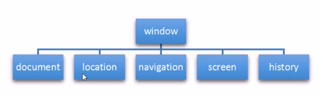


Window 对象是浏览器的顶级对象：

1. 它是 JS 访问浏览器窗口的一个接口

2. 它是一个全局对象。定义在全局作用域中的变量、函数都会变成 window 对象的属性和方法。


~~~js
var num = 10;
console.log(window.num);
console.dir(window);  // 查看 window 对象属性和方法
~~~

> 在调用的时候可以省略 window


## 1. window 对象的常见事件

### 对话框事件

之前使用的 alert, prompt(), confirm() 其实都是 windows 对象的方法，完整写法应该是：

~~~js
window.alert();
window.prompt();
window.confirm();
~~~


### 1.1. 窗口加载事件

~~~js
window.onload = function(){}
window.addEventListener("load", function(){})
~~~


以下三种情况都会触发 load 事件：

1. a标签链接

2. F5或者刷新按钮

3. 前进或后退


可以将 JS 代码放到 onload 中，确保所有资源（CSS、JS、图片）已经加载完毕再对页面 DOM 进行操作

~~~html
<script>
    window.onload = function() {
        var btn = document.querySelector('button');
        btn.addEventListener('click', function() {
            alert('点击操作');
        })
    }
</script>

<button>按钮</button>
~~~

>window.onload 传统注册事件方式只能写一次，如果有多个，以最后一个 window.onload 为准，而 addEventListener 没有这种限制，推荐使用


pageshow

~~~js
window.addEventListener("pageshow", function(e){
    if(e.persisted){  // 判断页面是否是缓存页面
        fn();
    }
})
~~~

> 与 load 类似，兼容火狐浏览器，防止 JS 缓存而不刷新执行


### 1.2. DOMContentLoaded 事件

仅当 DOM 加载完成，不包括样式表、图片、Flash 等（IE9+），如果页面图标较多，此时用 DOM 事件比较合适

~~~js
window.addEventListener("DOMContentLoaded ", function(){})
~~~


### 1.3. 调整窗口大小事件

~~~js
window.addEventListener("resize", function(){})
~~~


例：

~~~html
<script>
    window.addEventListener('load', function() {
        var div = document.querySelector('div');
        window.addEventListener('resize', function() {
            console.log(window.innerWidth);

            console.log('变化了');
            if (window.innerWidth <= 800) {
                div.style.display = 'none';
            } else {
                div.style.display = 'block';
            }

        })
    })
</script>
<div></div>
~~~


### 1.4. 定时器 setTimeout

setTimeout 设置一个定时器，在指定时间后执行调用函数

~~~js
window.setTimeout(调用函数, [延迟的毫秒数]);
~~~


~~~html
<script>
    setTimeout(function() {
        console.log('时间到了');
    }, 2000);
    
    function callback() {
        console.log('爆炸了');
    }
    var timer1 = setTimeout(callback, 3000);
    var timer2 = setTimeout(callback, 5000);
    // setTimeout('callback()', 3000); // 我们不提倡这个写法
</script>
~~~


例：5秒自动关闭广告

~~~html
<div></div>
<script>
    var div = document.querySelector('div');
    setTimeout(function() {
        div.style.display = 'none';
    }, 5000);
</script>
~~~


停止 setTimeout() 定时器：

~~~js
clearTimeout(timer);
~~~


~~~html
<div></div>
<button>停止定时器</button>
<script>
    var div = document.querySelector('div');
    var btn = document.querySelector('button')

    btn.addEventListener('click', function() {
        clearTimeout(timer);
    })

    timer = setTimeout(fn, 5000);

    function fn() {
        div.style.display = 'none';
    }
</script>
~~~


### 1.5. 循环定时器

每隔一段时间，就会调用函数，其他用法和 setTimeout 一样

~~~js
window.setInterval(回调函数, [间隔毫秒数]);
~~~


例：倒计时效果


停止 setInterval() 定时器

~~~js
clearInterval(定时器名字);
~~~


例：

~~~html
<button class="begin">开启定时器</button>
<button class="stop">停止定时器</button>
<script>
    var begin = document.querySelector('.begin');
    var stop = document.querySelector('.stop');
    var timer = null; // 全局变量  null是一个空对象
    begin.addEventListener('click', function() {
        timer = setInterval(function() {
            console.log('ni hao ma');

        }, 1000);
    })
    stop.addEventListener('click', function() {
        clearInterval(timer);
    })
</script>
~~~


发送短信验证按钮60秒等待效果


## 2. JS 执行队列

JS 是单线程，同一时间只能执行一件事情，为了解决这个问题，新版 HTML5 中允许 Javascript 脚本创建多个线程。于是 JS 中出现了同步和异步。

- 同步：单线程，顺序执行

- 异步：多线程，一起执行


同步任务：

同步任务都在主线程上执行，行程一个执行栈，然后顺序执行。


异步任务：

JS 异步任务是通过回调函数实现的，一般而言，异步任务有以下三种类型：

1. 普通事件，如 click、resize

2. 资源加载，如 load、error等

3. 定时器，包括 setInterval、setTimeout 等


执行机制：

先执行执行栈中的同步任务，将异步任务（回调函数）放入任务队列中，一旦执行栈中的所有同步任务执行完毕，系统就会按次序读取任务队列中的异步任务，将异步任务放入执行栈进行执行。


## 3. location 对象

window 对象给我们提供了一个 location 属性用于获取设置窗体的 URL，并且可以用于解析 URL，这个属性返回的是一个对象，所以们将这个属性也成为 location 对象


~~~
location.href  // URL
location.host  // 返回主机名（域名）
location.port  // 返回端口
location.pathname  // 返回路径
location.search  // 返回参数
location.hash  // 返回锚点
~~~


5秒后跳转页面

~~~html
<div>5秒后会自动跳转页面</div>
<script>
    var time = 5;
    var div = document.querySelector('div');
    setInterval(function() {
        if (time == 0) {
            location.href = '#';
        } else {
            div.innerText = time + '秒后会自动跳转页面'
            time--;
        }

    }, 1000)
</script>
~~~


获取提交表单参数，显示在第二个页面中

login.html

~~~html
<form action="index.html">
    用户名： <input type="text" name="uname">
    <input type="submit" value="登录">
</form>
~~~


index.html

~~~HTML
<div></div>
<script>
    console.log(location.search); // ?uname=andy
    // 1.先去掉？  substr('起始的位置'，截取几个字符);
    var params = location.search.substr(1); // uname=andy
    console.log(params);
    // 2. 利用=把字符串分割为数组 split('=');
    var arr = params.split('=');
    console.log(arr); // ["uname", "ANDY"]
    var div = document.querySelector('div');
    // 3.把数据写入div中
    div.innerHTML = arr[1] + '欢迎您';
</script>
~~~


location 对象的方法

~~~js
location.assign()  // 跟 href 一样，可以跳转页面（也成为重定向）
location.replace()  // 替换当前页面（不记录历史，不能后退）
location.reload()  // 重新加载当前页面，相当于刷新，如果参数为 true，强制刷新
~~~


例：

~~~js
location.assign('http://www.forece.net');
location.assign('http://www.forece.net');
location.reload(true);
~~~


## 4. navigator 对象

navigator 对象包含有关浏览器信息，它有很多属性，最常见的属性就是 userAgent，可以判断用户浏览器头部的参数，用来显示不同的页面。


- navigator.userAgent  浏览器类型
- navigator.platform 浏览器所在系统平台
- navigator.geolocation 地理位置定位


~~~js
console.log(navigator);
~~~


~~~js
if (navigator.userAgent.match){
    window.location.href ='';
} else{
    window.location.href =''; 
}
~~~


## 5. history 对象

history 对象与浏览器历史记录进行交互，改对象包含用户访问过的URL

~~~
back()  // 后退
forward()  // 前进
go(参数)  // 参数为数字，1为前进一个页面，-2为后退两个页面
~~~


## 6. 元素偏移量 offset

offset 属性可以动态得到该元素的位置（偏移）大小等。

- 获得元素距离带有定位父元素的位置
- 获得元素自身的大小（宽度高度）
- 返回的数值不带单温


~~~
element.offsetParent  // 返回作为该元素带有定位的父集元素，如果父集没有定位返回 body
element.offsetTop  // 返回相对父元素定位上方偏移
element.offsetLeft  // 返回相对父元素定位左方 偏移
element.offsetWidth  // 返回自身包含 padding、边框、内容区的宽度
element.offsetHeight  // 返回自身包含 padding、边框、内容区的高度
~~~


~~~html
<div class="father">
    <div class="son"></div>
</div>
<div class="w"></div>
<script>
    // offset 系列
    var father = document.querySelector('.father');
    var son = document.querySelector('.son');
    // 1.可以得到元素的偏移 位置 返回的不带单位的数值  
    console.log(father.offsetTop);
    console.log(father.offsetLeft);
    // 它以带有定位的父亲为准  如果么有父亲或者父亲没有定位 则以 body 为准
    console.log(son.offsetLeft);
    var w = document.querySelector('.w');
    // 2.可以得到元素的大小 宽度和高度 是包含padding + border + width 
    console.log(w.offsetWidth);
    console.log(w.offsetHeight);
    // 3. 返回带有定位的父亲 否则返回的是body
    console.log(son.offsetParent); // 返回带有定位的父亲 否则返回的是body
    console.log(son.parentNode); // 返回父亲 是最近一级的父亲 亲爸爸 不管父亲有没有定位
</script>
~~~


offset 与 style 的区别

| offset                                           | style                                         |
| ------------------------------------------------ | --------------------------------------------- |
| offset 可以得到任意样式表中的样式值              | style 只能得到行内样式表中的样式值            |
| offset 系列获得的数值是没有单位的                | style.width 获得的是带有单位的字符串          |
| offsetWidth 包含 padding + border + width        | style.width 获得不包含 padding 和 border 的值 |
| offsetWidth 等属性是只读属性，只能获取不能赋值   | style.width 是可读写属性，可以获取也可以赋值  |
| 所以，我们想要获取元素大小位置，用 offset 更合适 | 所以，我们想要给元素更改值，需要使用 style    |


拖动框悬浮效果

京东放大镜效果


## 7.  元素可视区 client

使用 client 系列的相关属性可以获取元素可视区的相关信息，如：元素的边框大小、元素大小等。

~~~
element.clientTop  // 返回元素上边框的大小
element.clientLeft  // 返回元素左边框的大小
element.clientWidth  // 返回自身包括 padding、内容区的宽度，不含边框，不带单位
element.clientHeight  // 返回自身包括 padding、内容区的高度，不含边框，不带单位
~~~

> clientWidth 不包含边框，offsetWidth 包含边框


## 8. 立即执行函数

~~~js
(function(){})();
(function(){}());
~~~


~~~js
(function(a,b){
    console.log(a+b);
    })(1,2);
~~~

> 立即执行函数最大的作用就是独立创建了一个作用域


## 9. 元素滚动 scroll 

~~~html
element.scrollTop  // 返回被卷去的上侧距离
element.scrollLeft  // 返回被卷去的左侧距离
element.scrollWidth  // 返回自身的实际宽度，不含边框
element.scrollHeight  // 返回自身的实际高度，不含边框
~~~


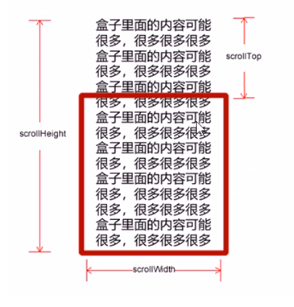


滚动事件

~~~html
div.addEvenetListener("scroll", function(){
})
~~~


页面被卷去的头部

~~~
element.pageYscrollY
element.pageXscrollX
~~~

> 一个是页面被卷曲，另外一个是元素被卷曲


侧边工具栏固定


offsetWidth、clientWidth、scrollWidth 区别

- offset 包含边框
- client 不包含边框
- scroll 会返回超出边框元素的实际大小


实际应用：

offset 常用于获取元素的位置

client 常用于获取元素大小

scroll 常用于获取滚动距离

pageXoffset 常用于页面滚动距离


获取文档高度

~~~
网页可见区域宽： document.body.clientWidth
网页可见区域高： document.body.clientHeight
网页可见区域宽： document.body.offsetWidth (包括边线的宽)
网页可见区域高： document.body.offsetHeight (包括边线的高)
网页正文全文宽： document.body.scrollWidth
网页正文全文高： document.body.scrollHeight
网页被卷去的高： document.body.scrollTop
网页被卷去的左： document.body.scrollLeft
网页正文部分上： window.screenTop
网页正文部分左： window.screenLeft
屏幕分辨率的高： window.screen.height
屏幕分辨率的宽： window.screen.width
屏幕可用工作区高度： window.screen.availHeight
屏幕可用工作区宽度： window.screen.availWidth
~~~


## 10. 动画函数

本质上设定一个定时器，然后利用CSS中的绝对定位将left值不断变化

~~~html
<div></div>
<script>
    // 动画原理
    // 1. 获得盒子当前位置  
    // 2. 让盒子在当前位置加上1个移动距离
    // 3. 利用定时器不断重复这个操作
    // 4. 加一个结束定时器的条件
    // 5. 注意此元素需要添加定位， 才能使用element.style.left
    var div = document.querySelector('div');
    var timer = setInterval(function() {
        if (div.offsetLeft >= 400) {
            // 停止动画 本质是停止定时器
            clearInterval(timer);
        }
        div.style.left = div.offsetLeft + 1 + 'px';
    }, 30);
</script>
~~~


封装动画函数

~~~html
<div></div>
<span>夏雨荷</span>
<script>
    // 简单动画函数封装obj目标对象 target 目标位置
    function animate(obj, target) {
        var timer = setInterval(function() {
            if (obj.offsetLeft >= target) {
                // 停止动画 本质是停止定时器
                clearInterval(timer);
            }
            obj.style.left = obj.offsetLeft + 1 + 'px';

        }, 30);
    }

    var div = document.querySelector('div');
    var span = document.querySelector('span');
    // 调用函数
    animate(div, 300);
    animate(span, 200);
</script>
~~~


完整动画函数

轮播幻灯图


滚动窗口到指定坐标

~~~js
window.scroll(x,y);
~~~


回到顶部


## 11. 移动端事件

移动端浏览器兼容性比较好，可以兼容桌面版的JS特效，Touch 触摸事件可以响应用户手指对屏幕的接触。


常见触摸事件如下：

~~~
touchstart  // 手指触摸到一个 DOM 元素时触发
touchmove  // 手指在一个 DOM 元素上滑动时触发
touchend  // 手指从一个 DOM 元素上移开时触发
~~~


~~~html
<div></div>
<script>
    var div = document.querySelector('div');
    div.addEventListener('touchstart', function(){
        console.log('触摸');            
    })
    div.addEventListener('touchmove', function(){
        console.log('滑动');            
    })
    div.addEventListener('touchend', function(){
        console.log('摸完');            
    })    
</script>
~~~


- touch 事件不会对桌面 click 事件有任何影响
- click 事件会和 touch 触摸事件同步执行


### 11.1. 触摸事件对象

TouchEvent 是一类描述手指在触摸屏上状态变化的事件，用于描述一个或多个触点

~~~
touches  // 正在触摸屏幕上所有手指的一个列表
targetTouches  // 正在触摸当前DOM元素上的手指的一个列表
changedTouches  // 手指状态发生了改变的列表
~~~


~~~html
<div></div>
<script>
    var div = document.querySelector('div');
    div.addEventListener('touchstart', function(e){
        console.log('e.targetTouches[0]');  // 一般常用targetTouches
    })
</script>
~~~


手机端中滑动 div 盒子

~~~html
<div></div>
<script>
    var div = document.querySelector('div');
    var startX = 0;
    var startY = 0;
    var x =0;
    var y=0;
    div.addEventListener('touchstart', function(e){
        startX = e.targetTouches[0].pageX
        startY = e.targetTouches[0].pageY
        x = this.offsetLeft;
        y = this.offsetTop;   

    })
    div.addEventListener('touchmove', function(e){
        var moveX =   e.targetTouches[0].pageX - startX;
        var moveY = e.targetTouches[0].pageY - startY;
        this.style.left = x + moveX + 'px';
        this.style.top = y + moveY + 'px';
    })  
</script>
~~~


手机端轮播图制作


### 11.2. classList 属性

classList 属性是 HTML5 新增的一个属性，返回元素的类名，只支持 ie10 以上版本，但是手机端基本上都支持。


查看 div 中所有的类

~~~js
var div = document.querySelector('div');
console.log(div.classList);        
~~~


该属性用于在元素中添加，移除以及切换CSS类

~~~js
element.classList.add('类名');  // 追加类名
element.classList.remove('类名');   // 移除类
element.classList.tongle('类名');   // 切换类（有则删除，没有则添加）
~~~


移除带有 current 类，给选中的标签加上 current 类

~~~js
ol.querySelector('.current').classList.remove('current');
ol.children[index].classList.add('current');
~~~


返回顶部手机端代码

~~~js
// 返回顶部模块制作
var goBack = document.querySelector('.goBack');
var nav = document.querySelector('nav');
window.addEventListener('scroll', function() {
    if (window.pageYOffset >= nav.offsetTop) {
        goBack.style.display = 'block';
    } else {
        goBack.style.display = 'none';
    }
});
goBack.addEventListener('click', function() {
    window.scroll(0, 0);
})
~~~


click 延迟解决方案

移动端 click 事件有 300ms 延迟，原因是移动端屏幕双击会缩放(double tap to zoom)


解决方案：

- 禁用缩放，浏览器禁用默认的双击缩放行文并且去掉 300ms 的点击延迟

~~~html
<meta name="viewport" content="user-scalable=no">
~~~


- 利用 touch 事件自己封装事件

https://www.bilibili.com/video/BV1k4411w7sV?p=155


- fastclick 插件

https://github.com/ftlabs/fastclick


~~~js
if ('addEventListener' in document) {
	document.addEventListener('DOMContentLoaded', function() {
		FastClick.attach(document.body);
	}, false);
}
var div = document.querySelector('div');
div.addEventListener('click',function(){
    alert(1);
})   
~~~


# 移动端插件

swiper 插件

https://www.swiper.com.cn/


使用方法：

1. 引入 css、js 文件

2. 引入自己 js，需要放在 swiper js 文件下方

3. 插入 div，按照 swiper 结构插入

4. 添加 js 代码


其他滑动插件：

superslide：http://www.superslide2.com/

iscroll：https://github.com/cubiq/iscroll


视频插件：

zy.media：https://github.com/ireaderlab/zyMedia


# 移动端框架

前端常用框架有 Bootstrap、Vue、Angular、React 等，既能开发 PC 端，也可以开发移动端。


Bootstrap 轮播图

~~~
https://gitee.com/xiaoqiang001/jsapis_material/tree/master/%E7%AC%AC%E4%B8%83%E5%A4%A9/06-bootstrap%E8%BD%AE%E6%92%AD%E5%9B%BE
~~~


# 本地存储

本地存储特性
1. 数据存储在用户浏览器中
2. 设置、读取方便、甚至页面刷新都不丢失数据
3. 容量较大，sessionStorage 约 5M、localStorage约20M
4. 只能存储字符串，可以将对象JSON.stringify() 编码后存储


## 1. window.sessionStorage

1. 生命周期为关闭浏览器窗口
2. 在同一个窗口（页面）数据可以共享
3. 以键值对的形式存储使用


~~~js
sessionStorage.setItem(key, value)
sessionStorage.getItem(key)
sessionStorage.removeItem(key)
~~~


sessionStorage 案例

https://gitee.com/xiaoqiang001/jsapis_material/blob/master/%E7%AC%AC%E4%B8%83%E5%A4%A9/08-%E6%9C%AC%E5%9C%B0%E5%AD%98%E5%82%A8%E4%B9%8BsessionStorage.html              


## 2. window.localStorage

1. 生命周期永久存在
2. 多窗口都可以使用
3. 以键值对形式使用

~~~
localStorage.setItem(key, value)
localStorage.getItem(key)
localStorage.removeItem(key)
localStorage.clear()
~~~


localStorage 案例

https://gitee.com/xiaoqiang001/jsapis_material/blob/master/%E7%AC%AC%E4%B8%83%E5%A4%A9/09-%E6%9C%AC%E5%9C%B0%E5%AD%98%E5%82%A8%E4%B9%8BlocalStorage.html              


# ---------------------------------

# JS 高级编程进阶

# ---------------------------------


# 面向对象编程概念

## 1. 面向过程编程 POP

POP (Process-oriented programming) ，面向过程就是分析出解决问题所需要的的步骤，然后用函数把这些步骤一步一步实现，使用的时候在一次一次调用就可以了。


举个例子：把大象装进冰箱，面向过程的做法：

1. 打开冰箱门
2. 大象装进去
3. 关上冰箱门


## 2. 面向对象编程

面向对象是把事务分解成一个个对象，然后由对象之间分工合作。


举个例子：把大象装进冰箱，面向对象做法：

1. 大象对象
   - 进入方法

2. 冰箱对象
   - 打开
   - 关闭

3. 使用大象和冰箱的功能


面向对象想程序开发思想中，每一个对象都是功能中心，具有明确分工，面向对象具有灵活、代码可重复使用，容易维护和开发的优点，更适合多人合作。


面向对象的特性：

- 封装性（包装代码，直接调用）
- 继承性（子类拥有父类的属性和方法）
- 多态性（子类可以定义自己的独有的属性和方法，可以与父类相同方法，但不同功能）


## 3. 面向过程和面向对象的对比

面向过程

- 优点：性能比面向对象高，适合根硬件联系很紧密的东西，例如单片机就采用的面向过程编程
- 缺点：没有面向对象易维护、易复用、易扩展


面向对象

- 优点：易维护、易复用、易扩展，由于面向对象有封装、继承、多态的特性，可以设计出低耦合的系统，使系统更加灵活、更加易于维护
- 缺点：性能比面向过程低


程序简单建议使用面向过程，如果程序项目庞大，建议使用面向对象来写。


# 面向对象

面向对象更贴近我们的实际生活，可以使用面向对象描述现实世界事物，但是事物分为具体事物和抽象事物。


比如说：

- 手机就是一个抽象事物，是泛指的一个概念 
- 华为P30 PRO 128G 就是一个具体事物，特指的

 

面向对象的思维特点：

1. 抽取（抽象）对象共用的属性和行为组织（封装）成一个类（模板）
2. 对类进行实例化，获取类的对象


面向对象编程我们考虑的是有哪些对象，按照面向对象的思维特点，不断创建对象，使用对象，指挥对象做事情。


## 1. 对象

现实生活中，万物皆对象，对象是一个具体的事物，看的见摸得着的实物，例如：一本书、一个人、一辆汽车都可以是对象。一个数据库、一个网页、一个与服务器的连接对象也可以是对象


在 Javascript 中，对象是一组无需的相关属性和方法的集合，所有的事物都是对象，例如字符串、数值、数组、函数等等。


对象是由属性和方法组成的：

- 属性：事物的特征，在对象中用属性来表示（常用名词），比如手机的尺寸、重量、内存大小
- 方法：事物的行为，在对象中用方法来表示（常用动词），比如打电话、发短信


## 2. 类 class

在 ES6 中新增加了类的概念，可以使用 class 关键字声明一个类，之后以这个类来实例化对象。

- 类抽象了对象的公共部分，它泛指某一大类（class）模板

- 对象特指某一个，通过类实例化的一个具体对象


## 3. 创建类

如果多个对象拥有相同的属性和方法，一个个手动创建是实在是太累了，如：

~~~js
var student1 = {
    name: 'zx',
	age:16,
	score:80,
    sayHi:function(){
        console.log('say hi')
    }
}

var student2 = {
    name: 'ls',
	age:17,
	score:90,
    sayHi:function(){
        console.log('say hi')
    }
}
~~~


那么我们可以封装一个函数来帮助我们创建对象，如：

~~~js
function Student(name, age, score) {
    return {
        name: name,
        age: age,
        score: score,
        sayhi: function () {
            console.log("say hi");
        },
    };
}

var student1 = Student("zs", 16, 80);
var student2 = Student("ls", 17, 90);
console.log(student1);
console.log(student2);
~~~


之前学习对象的时候，我们是通过构造函数创建的对象：

~~~js
function Student(name, age, score) {
    this.name = name;
    this.age = age;
    this.score = score;
    this.sayhi = function () {
        console.log("say hi");
    };
}
var student1 = new Student("zs", 16, 80);
var student2 = new Student("ls", 17, 90);
console.log(student1);
console.log(student2);
~~~


在 ES6 中可以使用 class 关键字来创建类。


定义类：类名一般首字母大写

~~~js
class Name {
    // 定义类属性
    // 定义类方法
}
~~~


创建实例：

~~~js
class Person {
    name = 'zx';
	age = 18;
}

var xx = new Person();
~~~

> 注意，这样写只是创建普通的对象，不能够传递参数


## 4. 类 constructor 构造函数

constructor() 方法是类的构造函数（默认方法），用于传递参数，返回实例对象，通过 new 命令生成对象实例时，自动调用该方法，如果没有显示定义，类内部会自动给我们创建一个 constructor()


~~~js
class Star {
    constructor(uname, age) {
        // this.uname 是属性名，后边的 uname 是传递进来的参数
        this.uname = uname;
        this.age = age;
    }
    // 写在构造函数外部，不需要加逗号分隔
    sing(song) {
        console.log("唱" + song);
    }
}
var ldh = new Star("刘德华", 48);
console.log(ldh.uname);
ldh.sing("冰雨");
~~~


- 通过 class 关键字创建类，类名首字母大写
- 类里边有个 constructor 函数，可以接受传递过来的参数，同时返回实例对象
- constructor 函数只要使用 new 生成实例时，就会自动调用这个函数，如果不写这个函数，类也会自动生成这个函数
- 生成实例 new 不能省略
- 类名后边不需要加小括号，生成实例类名后要加小括号。

- 类里边定义的方法，不需要加 function() ，直接写上方法名，并且需要定义在构造函数外边，并且不需要加逗号分割


## 5. 静态方法

静态方法不需要实例化对象，直接使用类名.方法() 调用，只有使用类名才可以查看或调用，实例无权限查看。静态方法因为没有实例化，所以构造函数没有执行，也就是构造函数中的属性和方法没有定义。如果使用 this.age 会显示 undefined

~~~js
class Person {
    constructor() {
        this.name = "zhangsan";
        this.age = 18;
    }
    say() {
        console.log("我是zs");
    }
    // 添加静态方法
    static coding() {
        console.log("写代码");
    }
    // 添加静态属性
    static v = 10;
}

// 添加静态方法
Person.bye = function(){
    console.log('bye')
}

// 添加静态成员
Person.sex = "male";

// 只能通过类名查看和调用
Person.bye();
console.log(Person.sex);

// 实例无法查看静态属性和方法，报错
x = new Person();
x.bye();
console.log(sex)

~~~


## 5. 类的继承

现实中的继承：子承父业、比如说我们都继承了父亲的姓。

程序中的继承：子类可以继承父类的属性和方法


在 JS 中可以使用 extends 关键字继承父类

~~~js
class Father {
    constructor() {}
    money() {
        console.log(100);
    }
}
class Son extends Father {}
var son = new Son();
son.money();
~~~


### 5.1. super 关键字

当子类继承父类的方法时，还需要使用父类构造函数中的属性，那么就需要使用 super 关键字。


super 关键字用于访问和调用对象父类上的函数，可以调用父类的构造函数，也可以调用父类的普通函数。


~~~js
class Father {
    constructor() {
        this.age = 30;
    }
    say() {
        console.log(this.age);
    }
}

class Son extends Father {
    constructor() {
        // 调用父类的构造函数
        super();
        this.sex = "secret";
    }
}

var x = new Son();
x.say();
console.log(x.sex);
~~~


#### 5.1.1. super() 调用构造函数（传递参数）

~~~js
class Father {
    constructor(x, y) {
        this.x = x;
        this.y = y;
    }
    sum() {
        console.log(this.x + this.y);
    }
}
class Son extends Father {
    constructor(x, y) {
        this.x = x;
        this.y = y;
    }
}
// 这里传递的参数是子类的属性
// sum() 方法调用的是父类的属性，
// 因为子类定义了自己的构造函数，造成方法调用数据的不统一
// 使用 super() 方法让子类也调用父类的 constructor 函数
var son = new Son(1, 2);
son.sum();
~~~

> 这样写会报错


子类不用定义自己的 this.x 和 this.y ，只需要将子类中的构造函数参数中的 x 和 y 值，使用 super() 方法传递给父类中的构造函数即可。

~~~js
super(x,y)
~~~


#### 5.1.2. super() 调用普通函数

~~~js
class Father {
    say() {
        return "我是爸爸";
    }
}
class Son extends Father {
    say() {
        console.log(super.say() + "的儿子");
    }
}
var son = new Son();
son.say();
~~~


- 继承中，如果实例化子类中输出一个方法，先看子类有没有这个方法，如果子类没有就去父类去寻找
- super.方法() 可以直接调用父类中的方法


#### 5.1.3. 子类扩展方法

在子类中直接添加新的方法，就是子类独有的方法，使用 extends 同时还可以继承父类的方法。

~~~js
      class Father {
        constructor(x, y) {
          this.x = x;
          this.y = y;
        }
        sum() {
          console.log(this.x + this.y);
        }
      }
      class Son extends Father {
        constructor(x, y) {
          // 利用 super 调用父类的构造函数方法
          // super 必须在子类 this 之前调用
          super(x, y);
          this.x = x;
          this.y = y;
        }
        substract() {
          console.log(this.x - this.y);
        }
      }

      var son = new Son(1, 2);
      son.sum();
      son.substract();
~~~

> 如果子类在构造函数中使用了 super 调用父类的构造函数，那么必须放到 this 之前。先调用父类构造函数，再调用子类构造函数


## 6. 执行顺序

JS 中类不像变量和函数声明一样被预编译，所以在实例化类前，必须先定义类。


构造函数中可以直接调用类中的方法，实现当实例化类时自动执行类中的方法，如：

~~~js
class Star {
    constructor(uname, age) {
        this.uname = uname;
        this.age = age;
        // 实例化时直接调用类里边的方法
        this.sing();
    }
    sing() {
        console.log(this.uname + "唱歌");
    }
}
var ldh = new Star("刘德华", 18);
~~~


## 7. this 指向问题

constructor 里边的 this 指向实例对象，方法里边的 this 指向这个方法的调用者


如果不是对象调用类中的方法，却需要使用 this 这个对象指向的话，需要定义一个变量 that 进行引用。

~~~js
      var that;
      class Star {
        constructor(uname, age) {
          that = this;
          this.uname = uname;
          this.age = age;
          this.btn = document.querySelector("button");
          // btn.onclick 调用 sing 方法
          this.btn.onclick = this.sing;
        }
        sing() {
          // btn.onclick 调用的 sing
          // 这里的 this 实际上指向的 btn
          // 需要使用 that 才可以获得对象中的 uname 属性
          console.log(that.uname + "唱歌");
        }
      }
      var ldh = new Star("刘德华", 18);
~~~


## 案例：面向对象 TAB 栏切换

https://gitee.com/xiaoqiang001/js_advanced_material/tree/master


### 1. ES6 插入元素

之前用过 node.appendChild 和 node.inserBefore 两个方法，在插入之前先要使用 document.createElement('tagName') 创建元素，然后再用 inner.HTML 创建内容，之后再进行插入。


在 ES6 中有个新方法，insertAdjacentHTML 可以直接以字符串形式插入元素，而不用进行创建 node 节点。


语法：

~~~js
element.insertAdjacentHTML(position, text)
~~~


参数：

- position 参数
  - beforebegin 在元素前面
  - afterbegin 插入元素内部的第一个子节点之前
  - beforeend 插入元素内部的最后一个子节点之后
  - afterend 元素自身的后边

- text 是要被解析为 HTML 并插入到 DOM 树中的字符串


例：

~~~html
<ul>
    <li>测试1</li>
    <li>测试2</li>
    <li>测试3</li>
</ul>
<script>
    var ul = document.querySelector("ul");
    var li = "<li>测试4</li>";
    ul.insertAdjacentHTML("beforeend", li);
</script>
~~~


### 2. 删除元素

element.remove() 可以直接删除元素，如：

~~~html
<ul>
    <li>测试1</li>
    <li>测试2</li>
    <li>测试3</li>
</ul>
<script>
    var li = document.querySelectorAll("li");
    li[2].remove();
</script>
~~~


### 3. 点击元素

element.click() 可以直接点击元素，如：

~~~js
<button>按钮</button>
<script>
    var btn = document.querySelector("button");
btn.onclick = function () {
    alert("点我了");
};
btn.click();
</script>
~~~


### 4. && 符号的应用

判断元素是否存在，存在就执行对应方法

之前是用 if else 进行判断，其实可以用到逻辑运算符，&&。因为在&&运算时，先判断左侧表达式是否为真，如果为假则短路停止继续判断，返回 false，如果为真则继续判断右侧，返回右侧表达式值，利用这一特性，可以简单的写出判断代码。

~~~js
// 当li存在索引时（即li元素标签存在），执行 click() 
li[index] && li[index].click();
~~~


### 5. 禁止双击选中文字

~~~js
window.getSelection ? window.getSelection().removeAllRanges() : document.selection.empty();
~~~


### 6. 选中 input 文本

~~~js
<input type="text" value="测试文本" />
    <script>
    var input = document.querySelector("input");
input.select();
</script>
~~~


### 7. 按回车调用表单失去焦点事件

~~~html
<input type="text" value="测试文本" />
<script>
    var input = document.querySelector("input");
    input.onkeyup = function (e) {
        if (e.keyCode === 13) {
            this.blur();
        }
    };
</script>
~~~


## 8. ES5 构造函数创建对象

在学 js 基础的时候，ES5 没有 class 关键字，需要使用 function 构造函数定义类。如：


~~~js
function Star(uname, age){
    this.uname = uname
    this.age = age;
    this.sing = function() {
        console.log('我会唱歌');
    }
}

// 生成实例
new ldh = new Star('刘德华', 18);
~~~


Js 构造函数创建对象过程：

1. 执行 new 创建对象时，首先创建一个空对象 var obj = {}
2. 将创建的对象，赋给 this 关键字， this  = obj
3. 将一些属性方法设置在 obj 上
4. 自动将新对象返回 return this
5. 将 return 的对象赋值给 var 变量


### 8.1.  实例成员

实例成员就是构造函数内部通过 this 添加的成员，如 this.uname, this.age 。 

- 实例成员只能通过实例化的对象来访问

~~~js
function Star(uname, age){
    this.uname = uname
    this.age = age;
    this.sing = function() {
        console.log('我会唱歌');
    }
}

// 生成实例
new ldh = new Star('刘德华', 18);

// 访问实例成员
console.log(ldh.uname)
~~~


### 8.2. 静态成员

静态成员在构造函数本身上添加的成员，如： Star.sex = 'male' 

- 静态成员只能通过构造函数来访问


~~~js
function Star(uname, age){
    this.uname = uname
    this.age = age;
    this.sing = function() {
        console.log('我会唱歌');
    }
}

// 生成实例
ldh = new Star('刘德华', 18);

// 添加静态成员
Star.sex = '男';

// 访问静态成员
console.log(Star.sex)

// 实例无法访问静态成员，显示 undefined
console.log(ldh.sex)
~~~


### 8.2. 构造函数原型 prototype

构造函数虽然很好用，但是存在浪费内存的问题，每次实例化一次对象，属性是变量，是简单数据类型。方法是函数，是复杂数据类型。所以系统会单独开辟一片空间用来存储函数。每生成一个实例，就会开一段空间给这同一个函数。


虽然可以将变量单独定义出来，用传参的方式传递进去，这样就保证了不在生成对象的同时创建函数，如：

~~~js
function Student(name, age, score, fn) {
    this.name = name;
    this.age = age;
    this.score = score;
    this.sayhi = fn;
}

fn = function () {
    console.log("say hi");
};
var student1 = new Student("zs", 16, 80, fn);
var student2 = new Student("ls", 17, 90, fn);
console.log(student1);
console.log(student2);
~~~


但是，如果每个对象都有不同的方法，如果项目很大，有多个对象，就会造成函数与对象配对困难，造成维护难度直线上升的问题。针对这个问题，我们可以通过针对每个不同构造函数，创建一个方法对象，使用这个构造函数就去对应的方法对象中取函数就可以了。


~~~js
var animalMethod = {
    say: function () {
        console.log("喵喵喵");
    },
    eat: function () {
        console.log("我吃猫粮");
    },
};

var peopleMethod = {
    say: function () {
        console.log("你好");
    },
    eat: function () {
        console.log("我吃饭");
    },
};

function Person(n, a) {
    this.name = n;
    this.age = a;
    this.say = peopleMethod.say;
    this.eat = peopleMethod.eat;
}

function Cat(n, a) {
    this.name = n;
    this.age = a;
    this.say = animalMethod.say;
    this.eat = animalMethod.eat;
}

var person1 = new Person("zx", 18);
var cat1 = new Cat("dd", 2);
person1.eat();
cat1.say();
~~~


然而 Js 已经提供了这个公共对象方法，那就是可以通过 prototype 原型来解决这个问题。Js 的每个对象都继承另一个父级对象，父级对象称为原型 （prototype），我们通过构造函数创建的实例，就继承了父级对象中的 prototype 属性。因为原型也是一个对象，原型对象上的所有属性和方法，都能被子对象（派生对象）共享。


- 每一个构造函数 Person 都自动分配了一个公共对象

- 构造函数通过 prototype 原型分配的函数是所有对象所共享的。也就是说所有通过 Person 构造函数创建的实例，都可以直接访问 Person 中 prototype 中的方法，相当于我们之前例子中为每个构造函数创建的公共方法对象。

  

JS 规定，每一个构造函数都有一个 prototype 属性，指向另一个对象，注意这个 prototype 就是一个对象，这个对象的所有属性和方法，都会被构造函数所拥有。


我们可以把那些不变的方法，直接定义在 prototype 对象上，这样所有的对象的实例就可以共享这些方法了。

~~~js
function Star(uname, age) {
    this.uname = uname;
    this.age = age;
}

Star.prototype.sing = function () {
    console.log("我会唱歌");
};

ldh = new Star("刘德华", 18);
ldh.sing();
~~~


#### 8.2.1. 构造函数原型属性  `__proto__`

任何对象都会有一个属性 `__proto__` 指向构造函数 prototype 原型对象，之所以我们对象可以是用构造函数 prototype 原型对象的属性和方法，就是因为对象有 `__proto__` 原型的存在。


`__proto__` 对象原型和原型对象 prototype 是等价的

~~~
ldh.__proto__ === Star.prototype
~~~

> 可以把 `ldh.__proto__` 看做是继承自 Star.prototype，访问 `__proto__` 就是访问父类的 Star.prototype


方法查找规则：

- 首先看 ldh 对象身上是否 有 sing 方法，如果有则执行 sing 方法 
- 如果没有，就去构造函数原型对象 prototype 身上去查看是否有 sing 方法


`__proto__` 对象原型的意义就在于为对象的查找机制提供一个方向，但是它是一个非标准属性，因此在实际开发中，不可以使用这个属性，它只是用于内部指向原型 prototype 


#### 8.2.2. constructor 构造函数

对象原型 (`__proto__`) 和构造函数（prototype）原型对象里边都有一个属性 constructor 属性，constructor 我们称为构造函数，因此它指向构造函数本身。

~~~js
function Person(name, age){
    this.name = name;
    this.age = age
}
p1 = new Person('zx',16);

// constructor 就是构造函数本身
console.log(p1.constructor == Person);  // true
console.log(p1.constructor == Person.prototype.constructor) // true
~~~


~~~js
// 因为对象中的原型属性__proto__ 和构造函数中的属性 prototype 指向一样
// 这个属性的值是一个对象，对象中又有属性和方法
// 其中一个叫做 constructor 
console.log(ldh.__prototype__.constructor)
console.log(Star.prototype.constructor)
~~~


之前给构造函数（类）添加方法用的是，这样不会破坏 prototype 对象的结构，只是给它添加了一个方法

~~~js
 Star.prototype.sing = function() {
     console.log('唱歌')
 }
~~~


如果需要直接给 prototype 以对象的方式重新定义的方式添加方法，就会失去 constructor 这个属性。

~~~js
Star.prototype = {
    sing: function() {
        console.log('唱歌')
    }
    dance: function() {
        console.log('跳舞')
    }
}
~~~


当然这么做也有好处，就是可以让代码可读性更高，将所有代码写在一个代码块中，不过我们就需要将这个 constructor 属性重新加回来，让这个属性指向构造函数本身（Star）

~~~js
Star.prototype = {
    constructor: Star,
    sing: function() {
        console.log('唱歌')
    },
    dance: function() {
        console.log('跳舞')
    }
}
~~~


### 8.3. 构造函数、实例、原型对象三者之间的关系

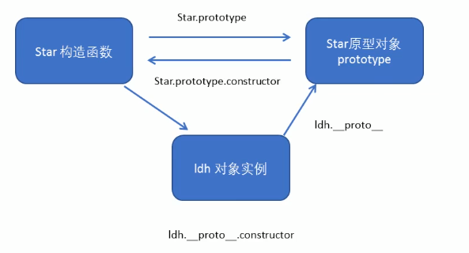


### 8.4. 原型链

因为 Star 是我们从 Object 顶级对象中构造出来的类，也就是说 Star 算是 Object 的子类，因此也继承了 Object 的属性和方法，因此 Star 也拥有 `__proto__` 属性。因此构成了一个原型链


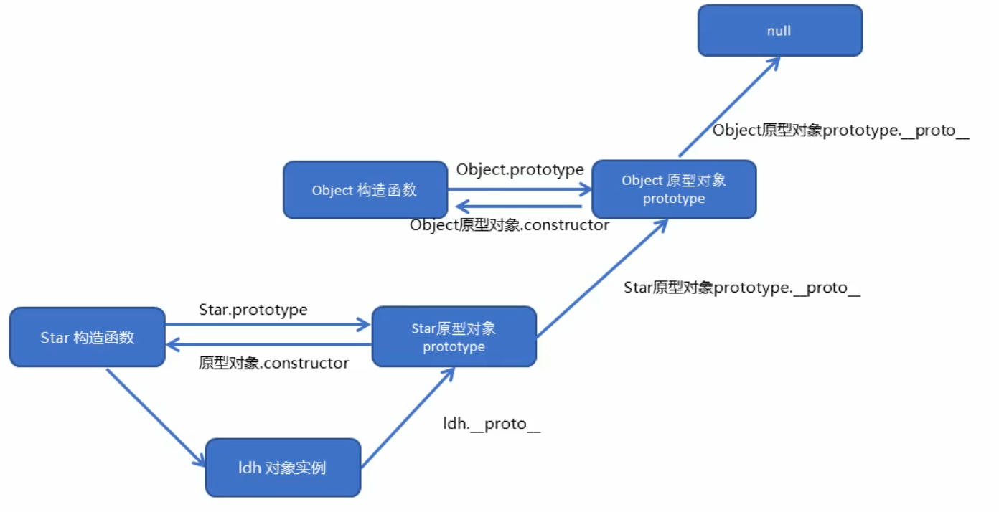


### 8.5. Javascript 成员的查找机制

- 当访问一个对象的属性（包括方法）时，首先查找这个对象自身有没有该属性
- 如果没有就查找它的原型（也就是 `__proto__ ` 指向的 prototype 原型对象）
- 如果还没有就查找原型对象的原型（Object的原型对象）
- 以此类推一直找到 Object 为止（null）


### 8.6 原型对象中 this 指向

原型对象中的 this 指向的也是实例对象本身，因为按照谁调用指向谁的原则，在原型对象中的方法，最终调用者还是实例，所以，this 最终也指向实例。

~~~js
function Star(uname, age) {
    // this 指向实例对象
    this.uname = uname;
    this.age = age;
}
var that;
Star.prototype.sing = function () {
    console.log("我会唱歌");
    that = this;
};

ldh = new Star("刘德华", 18);
// ldh 调用了 this 方法
// 所以 sing 方法中的 this 就是 ldh
ldh.sing();
console.log(that === ldh);
~~~


### 8.7 扩展内置对象（更改系统对象）

可以通过原型对象，对原来的内置对象进行扩展自定义方法，比如给数组增加自定义求偶数和的功能。


比如数组是系统自带的对象，它的内部也有 prototype，通过给 prototype 添加方法，我们就可以给原生对象添加功能了。


~~~js
// 可以看到原生数组对象中包含很多方法
console.log(Array.prototype)
~~~

> 数组中也有 `__proto__` 属性，它的原生对象就是 Object.prototype，所以数组也可以使用 Object 中的一些方法


内置对象结构，如 String

~~~js
function String() {
    // 属性
}
String.prototype.toUpperCase = function(){
    
}
~~~


给 Array 内置对象添加求和功能

~~~js
Array.prototype.sum = function() {
    var sum = 0;
    for(var i = 0; i<this.length; i++){
        sum += this[i];
    }
        return sum;     
}
var arr = [1,2,3];
console.log(arr.sum());
~~~


注意扩展方法时，不要和原对象中的方法名重复，否则就会覆盖原来的方法。


### 8.8. 构造函数中的继承

继承就是多个子类对象可以共用父类对象的成员属性和成员方法（代码重用），ES6 之前并没有给我们提供 extends 继承，我们可以通过构造函数 + 原型对象模拟实现继承。


#### 8.8.1. call()

调用这个函数，并且修改函数运行时 this 的指向

~~~js
fun.call(thisArg, arg1, arg2, ...)
~~~

- thisArg：当前调用函数 this 的指向对象
- arg1,, arg2：其他参数


~~~js
function fn() {
  console.log('随便说点什么');
}

// 日常调用函数方法
fn();

// 万物皆对象，函数也是对象
// 利用函数对象中的 call 方法也可以调用函数
fn.call();
~~~


使用 call 方法修改函数中 this 的指向

~~~js
function fn() {
    console.log("随便说点什么");
    // 由于使用 call 调用的函数，并且修改了 this 指向
    // 所以现在函数中的 this 指向 o 对象
    console.log(this);
}

var o = {
    name: "Andy",
};

fn.call(o);
~~~


#### 8.8.2. 借用父构造函数继承属性

在没有 extends 关键字的时候，利用 call 实现继承

~~~js
function Father(uname, age){
    this.uname = uname;
    this.age = age;
}

function Son(uname, age){
    // 在子函数中调用父函数
    // 这里的 this 指向 Son 的实例
    // 通过 call 调用让父函数的 this 改变了指向
    // 将子函数中的 uname, age 传入父函数中
    // 最终实现继承
    Father.call(this,uname,age)
}
~~~


> 缺点：只能继承父类构造函数中设置的属性和方法，无法使用 Father.prototype 中的方法。


#### 8.8.3. 借用原型对象继承父类方法（constructor丢失？）

~~~js
// 借用父构造函数继承属性
// 1. 父构造函数
function Father(uname, age) {
    // this 指向父构造函数的对象实例
    this.uname = uname;
    this.age = age;
}
Father.prototype.money = function() {
    console.log(100000);

};
// 2 .子构造函数 
function Son(uname, age, score) {
    // this 指向子构造函数的对象实例
    Father.call(this, uname, age);
    this.score = score;
}
// Son.prototype = Father.prototype;  这样直接赋值会有问题,如果修改了子原型对象,父原型对象也会跟着一起变化
// 让父类的实例成为子类的原型
Son.prototype = new Father();；
// 赋值的形式更改 prototype，丢失 constructor
// 造成 Son 的实例对象 __proto__ 属性直接指向了 Object，应该指向的是 Son
// 如果利用对象的形式修改了原型对象,别忘了利用constructor 指回原来的构造函数
Son.prototype.constructor = Son;
// 这个是子构造函数专门的方法
Son.prototype.exam = function() {
    console.log('孩子要考试');

}
var son = new Son('刘德华', 18, 100);
console.log(son);
console.log(Father.prototype);
console.log(Son.prototype.constructor);
~~~


让父类创建一个实例，让子类继承这个实例，这样写更容易理解

~~~js
function Father(uname, age) {
    this.uname = uname;
    this.age = age;
}
Father.prototype.money = function () {
    console.log(100000);
};

function Son(uname, age, score) {
    Father.call(this, uname, age);
    this.score = score;
}
var obj = new Father();
// 让父类的实例成为子类的原型
Son.prototype = obj;
// 找回丢失的 contructor
Son.prototype.constructor = Son;
Son.prototype.exam = function () {
    console.log("孩子要考试");
};
var son = new Son("刘德华", 18, 100);
console.log(son);
// 调用父类的方法
son.money();
~~~


#### 8.8.4. 使用 Object.create() 方法继承

使用 Object.create() 创建一个新对象，并且指定其原对象，适用于通过一个对象进行继承，而不是直接定义的构造函数

~~~js
var person = {'age': 30}
var obj = Object.create(person);
console.log(obj)
~~~


相当于

~~~js
var person = {'age': 30}
var obj = new Object()
obj.__proto__ = person
~~~


## 9. 贪食蛇面向对象案例


# ES5 新增方法

## 1. 数组方法

迭代遍历方法：

- forEach()
- map()
- filter()
- some()
- every()


### 1.1. forEach()

forEach() 方法对数组的每个元素执行一次给定的函数。


语法：

~~~js
array.forEach(function(currentValue, index, arr))
~~~

- currentValue：数组当前项值
- index：数组当前项索引
- arr：数组对象本身


~~~js
var arr = ["a", "b", "c"];
arr.forEach(function (v, k, arr) {
    console.log("每个数组元素" + v);
    console.log("元素索引号" + k);
    console.log("数组本身" + arr);
});
~~~


注意：在 forEach 中如果有 return 不会终止迭代


### 1.2. filter()

filter() 方法创建一个新数组, 其包含通过所提供函数实现的测试的所有元素。 主要用于筛选数组。


语法：

~~~js
array.filter(function(currentValue, index, arr))
~~~


参数：

- currentValue: 数组当前项的值
- index：数组当前项的索引
- arr：数组对象本身


返回值：

一个新的、由通过测试的元素组成的数组，如果没有任何数组元素通过测试，则返回空数组。

~~~js
var arr = [2, 4, 6, 10, 88, 39, 22, 45];
// 用不到的参数可以不用写，可选的
var newArr = arr.filter(function (value) {
    return value >= 20;
});
console.log(newArr);

// 输出结果
[88, 39, 22, 45]
~~~


注意：filter 在迭代中遇到 return 也不会终止迭代


### 1.3. map()

map 用法和 filter 十分类似，遍历每个元素，只不过返回的是每个元素经过回调函数后返回的布尔值，如：

~~~js
var arr = [2, 4, 6, 10, 88, 39, 22, 45];
var newArr = arr.map(function (value) {
    return value >= 20;
});
console.log(newArr);

// 输出结果
[false, false, false, false, true, true, true, true]
~~~


### 1.4. some()

some() 方法用于检测数组中的元素是否满足指定条件。如果找到第一个满足条件的元素，则终止循环不再继续查找


语法：

~~~js
array.some(function(currentValue, index, arr))
~~~


参数：

- currentValue: 数组当前项的值
- index：数组当前项的索引
- arr：数组对象本身


返回值：

需要自定义 return ，布尔值（如果查找到这个元素，返回true，如果查不到就返回false）

~~~js
var arr = [2, 4, 6, 10, 88, 39, 22, 45];
// 用不到的参数可以不用写，可选的
var flag = arr.some(function (value) {
    // 一般用 if 判断，然后 return 一个 true 的布尔值
    // if (value >= 20) {
    //   return true;
    // }
    // 如果单纯的数值，直接 return 即可，比较运算符会自动给出布尔值
    return value >= 20;
});
console.log(flag);

// 输出结果
true
~~~


### 1.5. every()

every() 方法测试一个数组内的所有元素是否都能通过某个指定函数的测试。它返回一个布尔值。

~~~js
var arr = [2, 4, 6, 10, 88, 39, 22, 45];
var flag = arr.some(function (value) {
    return value >= 20;
});
console.log(flag);

// 输出结果
false
~~~


- every 只要有一项不满足条件都返回false 

- some有一项满足都会返回true


### 1.6 reduce()

reduce() 方法用给数组做累加计算

~~~js
reduce((累加的结果,当前循环项)=>{    
}, 初始值)
~~~


return 的 sum 值，会继续充当第二次遍历的 sum 值

~~~js
const arr = [1,2,3,4,5]
const res = arr.reduce((sum, val)=>{
    return sum += val
},0)
console.log(res);
~~~


例：选中商品统计总价

~~~js
var arr =[
    {id:1, name:'西瓜', state:true, price:10, qty:1},
    {id:1, name:'榴莲', state:false, price:80, qty:2},
    {id:1, name:'草莓', state:true, price:20, qty:3},
]
// 通过 filter 过滤出 state 为 true 的商品，然后用
const res = arr.filter(item=>item.state).reduce((sum, item)=>{
    return sum += item.price * item.qty
},0)

console.log(res);
~~~


### 查询商品案例：

https://gitee.com/xiaoqiang001/js_advanced_material/tree/master


## 2. 字符串方法

- trim()


### 2.1. trim()

trim() 方法会从一个字符串的两端删除空白字符。trim() 方法并不影响字符串本身，它返回的是一个新的字符串。


语法：

~~~js
str.trim()
~~~


~~~js
var str = "   abcce";
console.log(str.trim("e"));
~~~


表单提交时空格验证

~~~html
<input type="text"> <button>点击</button>
<div></div>
<script>
    // trim 方法去除字符串两侧空格
    var str = '   an  dy   ';
    console.log(str);
    var str1 = str.trim();
    console.log(str1);
    var input = document.querySelector('input');
    var btn = document.querySelector('button');
    var div = document.querySelector('div');
    btn.onclick = function() {
        var str = input.value.trim();
        if (str === '') {
            alert('请输入内容');
        } else {
            console.log(str);
            console.log(str.length);
            div.innerHTML = str;
        }
    }
</script>
~~~


## 3. 对象方法

### 1. Object.keys()

Object.key() 方法用于获取对象自身所有的属性名（键名）。效果类似于 for...in ，返回一个由属性名组成的数组。


for...in 遍历对象

~~~js
var obj = {
    id: 1,
    pname: '小米',
    price: 1999,
    num: 2000
};
for (var i in obj) {
    console.log(i);
}
~~~


语法：

~~~
Object.keys(obj)
~~~


~~~js
var obj = {
    id: 1,
    pname: '小米',
    price: 1999,
    num: 2000
};
var arr = Object.keys(obj);
console.log(arr);
~~~


### 2. Object.hasOwnProperty()

判断对象是否拥有自己的属性和方法

~~~js
function Person() {
    this.age = 40;
    this.eat = function () {
        console.log("吃饭");
    };
}

Person.prototype.say = function () {
    console.log(`我今年${this.age}岁了`);
};

var person1 = new Person();
console.log(person1.hasOwnProperty("age"));  // true
console.log(person1.hasOwnProperty("eat"));  // true
console.log(person1.hasOwnProperty("say"));  // false
~~~


应用场景：

在对代码的效率要求特别高的时候，原型链的查找方式是非常浪费时间，用 hasOwnProperty 进行判断，禁止在原型链上查找成员。


### 3. Object.isPrototypeOf()

判断一个对象是否是另外一个对象的原型对象

~~~js
// Object 是 Array 的原型对象
console.log(Object.prototype.isPrototypeOf(Array));  // true
~~~


### 4. Object.getPrototypeOf() 

获取一个实例对象的原型对象，之前可以用属性的方法直接调用：

~~~js
console.log(Person.prototype)  // 通过构造函数中查找
console.log(obj.__proto__)  // ES6 通过对象查找
~~~


还可以使用 Object 自带的方法

~~~js
console.log(Object.getPrototypeOf(obj))
~~~


### 3. Object.defineProperty()

Object.defineProperty() 定义对象中心属性或修改原有的属性。


之前可以用字面量的方式修改对象的属性和方法，如：

~~~js
var obj = {
    id: 1,
    pname: '小米',
    price: 1999
}

// 添加属性
obj.qt = 100;

// 修改属性
obj.price = 2299;
~~~


语法：

~~~js
Object.defineProperty(obj, prop, descriptor)
~~~


- obj：目标对象
- prop： 需定义或修改的属性名字
- descriptor：目标属性所拥有的的特性，以对象形式 {} 书写 
  - value：设置属性的值，默认为 undefined
  - writable：值是否可以重写。 true | false， 默认为 false
  - enumerable：目标属性是否可以被枚举。 true|false，默认为 false
  - configurable：目标属性是否可以被删除或者是否可以再次修改特性 true | false，默认为 false


~~~js
var obj = {
    id: 1,
    pname: "小米",
    price: 1999,
};

Object.defineProperty(obj, "num", {
    value: 1000,
});

Object.defineProperty(obj, "address", {
    value: '北京',
    // 不可以被修改
    writable: false,
    // forEach 或 Object.keys() 遍历的时候不可见，使用该方法添加的属性默认不可见，原有属性可枚举选项为 true
    enumerable: false,
    // 不可以被修改或删除该属性
    configurable: false
});

console.log(obj);

for(var i in obj){
    console.log(i)
}
~~~


# 函数进阶

## 1. 函数的定义方式

### 1.1. 自定义函数（命名函数）

~~~
function fn() {};
~~~


### 1.2. 匿名函数

~~~js
var fun = function() {};
~~~


### 1.3. new Function() 定义函数

这种方式执行效率低，也不方便书写，因此比较少使用

~~~js
var f = new Function('参数1', '参数2' ... '函数体')
~~~


例：

~~~js
var f = new Function('a', 'b', 'console.log(a+b)')
f(1,2)
~~~

> 所有参数都必须是字符串


这意味着所有的函数都是 Function 的实例（对象）


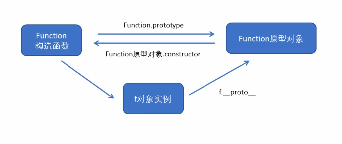

## 2. 函数的调用

- 普通函数
- 对象的方法
- 构造函数
- 绑定事件函数
- 定时器函数
- 立即执行函数


~~~js
// 1. 普通函数
function fn() {
    console.log('人生的巅峰');

}
fn();
fn.call()

// 2. 对象的方法
var o = {
    sayHi: function() {
        console.log('人生的巅峰');

    }
}
o.sayHi();

// 3. 构造函数
function Star(x, y, fn) {
    this.x = x;
    this.y = y;
    this.fn = fn;
}
var add = new Star(1, 2, function () {
    console.log(this.x + this.y);
});

add.fn();

// 4. 绑定事件函数
// 点击了按钮就可以调用这个函数
btn.onclick = function() {};   

// 5. 定时器函数
// 这个函数是定时器自动1秒钟调用一次
setInterval(function() {}, 1000);  

// 6. 立即执行函数
// 立即执行函数是自动调用
(function() {
    console.log('人生的巅峰');
})();

~~~


## 3. this 指向

| 调用方式     | this指向                                   |
| ------------ | ------------------------------------------ |
| 普通函数调用 | window                                     |
| 构造函数调用 | 实例对象，原型对象里面的方法也指向实例对象 |
| 对象方法调用 | 该方法所属对象                             |
| 事件绑定方法 | 绑定事件对象                               |
| 定时器函数   | window                                     |
| 立即执行函数 | window                                     |


### 3.1. 改变函数内部指向

JS 为我们专门提供了一些函数方法帮我们处理函数内部 this 的指向问题，常用的有：

- call()
- bind()
- apply()


#### 3.1.1. call()

之前说过的 call() 方法可以调用函数，通过参数的方法可以改变 this 的指向

~~~
fun.call(thisArg, arg1, arg2, ...)
~~~


call() 的返回值就是函数的返回值。

~~~js
var score = [33, 44, 60, 90];
function fun(x, y) {
    return x + y;
}
var s = fun.call(window, 1, 2);
console.log(s);
~~~


#### 3.1.2. apply()

apply() 方法调用一个函数，也可以改变 this 的指向


语法：

~~~js
fun.apply(thisArg, [argsArray])
~~~


参数：

- thisArg： 在 fun 函数运行时指定 this 值
- argsArray：传递的值，必须包含在数组里边
- 返回值就是函数的返回值，因为它就是调用函数


改变 this 指向：

~~~js
var o = {
    name: 'Andy'
}

function fn() {
    cosnole.log(this);
}

fn.apply(o);
~~~


参数必须是数组：

~~~js
var o = {
    name: 'Andy'
}

function fn(arr) {
    console.log(this)
    // 会以字符串形式显示
    console.log(typeof arr);
}

fn.apply(o,['pink']);
~~~


apply 的主要应用：

~~~js
var score = [33, 44, 60, 90];
// 可以让this 指向 null，但不建议
// var max = Math.max.apply(null, score);
// 还是谁调用指向谁
var max = Math.max.apply(Math, score);
console.log(max);
~~~

> Math.max(1,2,3,4) 普通调用不能是数组，必须是数字内容，因为 apply 会将传入的数组以字符串形式转换，所以使用 apply 调用这样写更加方便。


#### 3.1.3. bind()

bind() 方法不会调用函数，但是能改变函数内部 this 指向

~~~js
fun.bind(thisArg, arg1, arg2, ...)
~~~


- thisArg： 在 fun 函数运行时指定 this 值
- argsArray：传递的值，必须包含在数字里边
- 返回值由指定的 this 值和初始化参数改造的原函数拷贝


~~~js
var o = {
    name: 'Andy'
}

function fn() {
    cosnole.log(this);
}

// 只改变指向，不执行，但是可以返回一个函数
var f = fn.bind(o);
f();
~~~


例：点击按钮，禁止60秒后开启（发送验证码效果）

~~~js
var btn = document.querySelector('button')
btn.onclick = function(){
  this.disabled = true;
  setTimeout(function(){
    // 定时器函数里边的 this 指向 window
    // 解决方法1：可以直接写对象名，如 btn
    // 解决方法2：可以使用 that 做个 this 的复制，然后使用 that.disable
    // 解决方法3：bind 方法，绑定在计时器的匿名函数上， 
    this.disabled = false;
  }.bind(this) , 60000)
}
~~~


#### 3.1.4. call, apply, bind 总结

相同点：

都可以改变函数内部的 this 指向


不同点：

- call 和 apply 会调用函数，并且改变函数内部 this 的指向
- call 和 apply 传递的参数不一样，call 传递参数和普通函数传递参数一样，apply 必须以数组形式
- bind 不会调用函数，只改变函数内部 this 指向


主要应用场景

- call 常用作继承
- apply 常用作和数组有关系的函数
- bind 用作异步函数比较多，比如定时器


## 4. 严格模式

JS 除了提供正常模式外，还提供严格模式 (strict mode)，ES5 的严格模式是采用具有限制性 JS 变体的一种方式，即在严格条件下运行 JS 代码。

严格模式在 IE10 以上的版本浏览器才会被支持，旧版本浏览器中会被忽略


严格模式对正常的 JS 语义做了一些更改：

- 消除了 JS 语法的一些不合理、不严谨之处，减少了一些怪异行为
- 消除代码运行的一些不安全之处
- 提高编译器效率，增加运行速度
- 禁用了在 ECMAScript 的未来版本中可能会定义的一些语法，为未来新版本的 JS 做好铺垫，比如一些保留字： class, enum, export, extends, import, super 不能做变量名。


### 4.1. 开启严格模式

严格模式可以应用到整个脚本或者个别函数中，因此在使用时，可以将严格模式分为为脚本开启严格模式和为函数开启严格模式两种情况。


为脚本开启严格模式：

在所有语句之前放一个特定语句

~~~html
<script>
	'use strict';
    // 代码段
</script>
~~~


为函数开启严格模式：

~~~html
<script>
    // 只为 fn1 开启严格模式
	function fn1(){
        'use strict';
        // 代码段
    }
    
    function fn2(){
        
    }
</script>
~~~


### 4.2. 严格模式中的变化

1. 变量规定

在正常模式中，如果一个变量没有声明就赋值，默认是全局变量，严格模式禁止使用这种用法，变量都必须先用 var 命令声明，然后再使用。

~~~js
// 普通模式可以使用
num = 10

// 严格模式必须使用
var num = 10
~~~


2. 不能删除已经声明的变量，列入 delete x ，语法是错误的


3. 严格模式中，this 指向发生变化
   - 全局作用域中定义的函数里， this 的指向不再是 window 对象，而是 undefined
   - 构造函数必须使用 new 创建实例 new Star()，不能使用全局模式创建，如 Star()
   - 定时器指向还是 window
   - 事件、对象还是指向调用者


4. 函数中不能有重名的参数
5. 函数必须声明在顶层，新版本 ES6 的 js 会引入 “块作用域” ，为了与新版本接轨，不允许在非函数的代码块内（if, for, while ）声明函数。


## 5. 高阶函数

高阶函数时对其他函数进行操作的函数，它接受函数作为参数或将函数作为返回值输出。


接受函数为参数（回调函数）

~~~js
function fn(callback){
    callback && callback();
}

// 被当做参数传入的函数叫做回调函数
fun(function(){
    alert('hi')
})
~~~


将函数作为返回值

~~~js
function fn() {
    return function() {
        // 代码
    }
}

fn();
~~~


## 6. 闭包

### 6.1. 变量作用域

变量根据作用域的不同分为两种：全局作用域和局部变量。

- 函数内部可以使用全局变量
- 函数外部不可以使用局部变量
- 函数执行完毕，本作用域的局部变量会销毁


### 6.2. 闭包的定义

闭包(closure) 指有权访问另一个函数作用域中变量的函数。也就是说让一个作用域（一般来说是函数外部作用域）可以访问函数内部的局部变量。


内部作用域访问函数外部作用域变量（常见）

~~~js
// 变量所在的函数，被访问的函数叫做闭包（这里fn()）是闭包函数
function fn() {
    var num = 10;
    function fun() {
        // 内部函数访问外部函数变量
        console.log(num);
    }
    fun();
}
fn();
~~~


外部作用域访问函数内部的局部变量（闭包应用）

~~~js
function fn() {
    var num = 10;
    function fun() {
        // 内部函数访问外部函数变量
        console.log(num);
    }
    // 将函数内部的函数返回给外部函数
    // fn 的返回值是 fun 函数
    return fun;
}
// 调用 fn 
// fn 返回值是 fun 函数
// f 就相当于 fn() 的内部函数 fun
f = fn();
// fun 函数内部可以访问 num
// 现在调用 f 也就相当于调用了 fun() ，就可以访问到 num
f();
~~~


可以直接使用匿名函数作为返回值

~~~js
function fn() {
    var num = 10;
    return function() {
        console.log(num);
    }
}
f = fn();
f();
~~~


甚至可以把外部的函数也做成匿名函数

~~~js
// 将外部函数做成立即执行的匿名函数
f = (function () {
    var num = 10;
    return function () {
        console.log(num);
    };
})();
f();
~~~


闭包应用：回调函数中参数

~~~js
// 定义一个带参数的闭包函数
function fn(callback){
  setTimeout(function(){
    var data = 'hello'
    // callback(data) 相当于执行外部调用传过来的 funcion(data){} 函数
    // 这里的 data 是实参
    // 这里执行参数里传过来的函数，可以拿到外边的 data
    callback(data)
  }, 1000)
}

// 这里的 data 是形参
fn(function(data)){
   // 这里就可以拿到函数内部的变量
   console.log(data)
   }
~~~

1. 将这个函数传入一个回调函数当做参数
2. 当调用 fn 函数，function(data) 这个函数以参数的形式传入 fn(callback)
3. 延迟1秒后执行 fn(callback) 内部函数
4. 内部函数定义了一个变量 data
5. 在函数内部调用参数 callback(data)，实际上就是执行 function('hello')
6. 显示 hello


闭包应用：参数+回调函数

~~~js
function add(x, y, callback){
  // var x = 10
  // var y = 20
  // var callback = function(ret){ console.log(ret) }
  setTimeout(function(){
      var ret = x + y
  		return callback(ret)  // 将ret结果当做参数传给回调函数 callback，将结果 return 给异步函数 setTimeout
  })
}

// 传一个函数过去，这个函数的功能就是显示 ret
// 其实这里传的参数就是我们想要拿到的 return 结果
add(10,20, function(ret){
  // 函数内部就可以直接使用异步函数中的变量
  console.log(ret)
})

~~~

- 使用回调函数目的就是为了拿到返回值，如果在异步函数中只用 return 的话，程序会不等异步函数执行就往下走了。造成函数已经执行但是没有拿到 return 的结果。

- 如果使用 callback，不论异步函数什么时候执行，都会去调用 callback 函数，所以一直都可以拿到 return 结果。


### 6.3. 闭包作用域问题

当 f1 被调用的时候，返回的是外部定义的函数，这里需要注意的是，函数在哪定义，代码里的作用域就属于哪。

~~~js
var num = 100;
var f = function () {
    console.log(num);
};

// 虽然 f 在 f1 内部被调用了，但是 f 是在全局定义的，返回函数里的 num 是全局变量
function f1() {
    var num = 200;
    return f;
}

// 和 f1 其实没多大关系， res = f;
var res = f1();
res();  // 100
~~~


函数本身所处的作用域和在哪里调用这个函数没有任何关系，里边变量的取值取决于函数在哪里定义的。即使在 f1 中调用了 f() ，结果依然是 100

~~~js
var num = 100;
var f = function () {
    console.log(num);
};

function f1() {
    var num = 200;
    f();
}

f1(); // 100
~~~


### 6.4 案例1：动态给元素添加属性

原来的做法是给 li 添加 index 属性

~~~html
<ul class="nav">
    <li>苹果</li>
    <li>香蕉</li>
    <li>鸭梨</li>
    <li>罐头</li>
</ul>
<script>
    var lis = document.querySelector(".nav").querySelectorAll("li");
    // for 循环是异步任务
    // 如果直接使用 cosnole.log(i)，
    // for 循环已经执行完毕，当我们点击的时候。i 早就循环到4了
    // 所以以添加 index 属性的方式让 index 固定下来
    for (var i = 0; i < lis.length; i++) {
        lis[i].index = i;
        lis[i].onclick = function () {
            console.log(this.index);
        };
    }
</script>
~~~


闭包方式得到当前 li 的索引号

~~~js
<ul class="nav">
    <li>苹果</li>
    <li>香蕉</li>
    <li>鸭梨</li>
    <li>罐头</li>
</ul>
<script>
    var lis = document.querySelector(".nav").querySelectorAll("li");
    for (var i = 0; i < lis.length; i++) {
        // for 循环异步函数执行
        // 创建4个立即执行函数
        // 相当于创建了4个onclick事件
        // 将 i 值以参数形式传递给立即执行函数，4个函数的i值不同
        // 立即执行函数里边的形参接收 i
        // 函数内部 lis[m] 就相当于有了不同的 index
        (function(m){
            lis[m].onclick = function () {
                console.log(i);
            };
        })(i);

    }
</script>
~~~

> 只是闭包应用的例子，在这里这种方法创建多个函数，资源占用多，没有第一种好


### 6.5. 闭包实现常驻内存

~~~js
function f1(){
  var num = 100;
  return function(){
    console.log(num); 
    num++
  }
}
// res 是 f1 中的匿名函数，只有赋值的时候执行了 var num = 100;
var res = f1();

// 之后的调用和 f1 没有任何关系，实际上就是执行里边的匿名函数
res();  // 100
res();  // 101
res();  // 102
~~~


当一个函数的返回值是另外一个函数的时候，js 无法判断内部函数是否会被调用，所以会在内存中保存数据，不会被销毁。也称作 Js 垃圾回收机制。


当我们在函数内部引入一个变量或函数时，系统会自动开辟一块内存空间，还会将这块内存的引用计数器进行初始化，如果外部有全局变量或程序引用了这块空间，则引用计数器会自动进行+1操作，当函数执行完毕后，如果计数器为0，系统会进行垃圾回收。销毁数据。如果计数器不为0，则不会清除数据。


闭包的缺点：

由于内部数据不会被自动销毁，占用内存，一般不要使用太多的闭包。


## 7. 递归

如果一个函数在内部可以调用其本身，那么这个函数就是递归函数，简单理解递归就是函数内部自己调用自己。


~~~js
function fn(){
    fn()
}
fn();
~~~


递归类似于循环，由于递归很容发生死循环（栈溢出），所以必须要加退出条件return

~~~js
var num = 1;
function fn(){
    console.log('说点什么');
    if (num == 6) {
        return;
    }
    num++;
    fn();
}
fn();
~~~


### 7.1. 利用递归做阶乘

~~~js
function fn(n) {
    if (n == 1) {
        return 1;
    }
    return n * fn(n - 1);
}
console.log(fn(4));
~~~


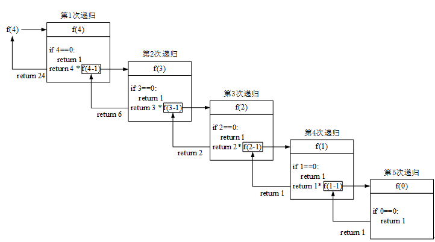


### 7.2. 斐波那契数列

~~~js
// 利用递归函数求斐波那契数列(兔子序列)  1、1、2、3、5、8、13、21...
// 用户输入一个数字 n 就可以求出 这个数字对应的兔子序列值
// 我们只需要知道用户输入的n 的前面两项(n-1 n-2)就可以计算出n 对应的序列值
function fb(n) {
    if (n === 1 || n === 2) {
        return 1;
    }
    return fb(n - 1) + fb(n - 2);
}
console.log(fb(3));
console.log(fb(6));
~~~


### 7.3. 利用递归遍历数据

~~~js
var data = [{
    id: 1,
    name: '家电',
    goods: [{
        id: 11,
        gname: '冰箱',
        goods: [{
            id: 111,
            gname: '海尔'
        }, {
            id: 112,
            gname: '美的'
        }, ]
    }, {
        id: 12,
        gname: '洗衣机'
    }]
}, {
    id: 2,
    name: '服饰'
}];
// 我们想要做输入id号,就可以返回的数据对象
// 1. 利用 forEach 去遍历里面的每一个对象
function getID(json, id) {
    var o = {};
    json.forEach(function(item) {
        // console.log(item); // 2个数组元素
        if (item.id == id) {
            // console.log(item);
            o = item;
            // 2. 我们想要得里层的数据 11 12 可以利用递归函数
            // 里面应该有goods这个数组并且数组的长度不为 0 
        } else if (item.goods && item.goods.length > 0) {
            o = getID(item.goods, id);
        }

    });
    return o;
}
console.log(getID(data, 1));
console.log(getID(data, 2));
console.log(getID(data, 11));
console.log(getID(data, 12));
console.log(getID(data, 111));
~~~


## 8. 浅拷贝和深拷贝

- 浅拷贝只是拷贝一层数据，更深层次对象级别的只拷贝引用
- 深拷贝拷贝多层，每一级别的数据都会拷贝


### 8.1. 浅拷贝

for...in 循环做浅拷贝

~~~js
var obj = {
    name: "Andy",
    age: 18,
    score: {
        math: 20,
        english: 60,
    },
};
var o = {};
for (var k in obj) {
    o[k] = obj[k];
}
console.log(o);
~~~


obj 里边的复杂数据 score 是对象，复杂数据在内存中存放在堆中，独立于简单对象。而浅拷贝只拷贝了复杂对象的内存引用，而没有真正在内存中新开辟空间存储 o 里边的 score 对象。如果改动了 obj 里边的 score 数据，那么 o 里边的 score 对象数据也会随之改变。


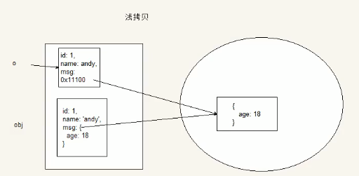


ES6新增浅拷贝方法


语法：

~~~js
Object.assign(target, ... sources)
~~~


~~~js
var obj = {
    name: "Andy",
    age: 18,
    score: {
        math: 20,
        english: 60,
    },
};
var o = {};
Object.assign(o, obj);
console.log(o);
~~~


### 8.2. 深拷贝

深拷贝会把复杂对象在内存完全复制一份，和原来的对象互不干涉。

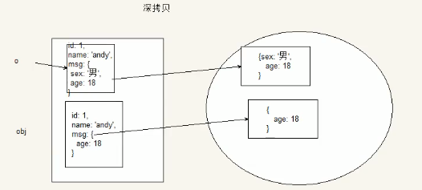


利用递归深拷贝，利用 for 循环遍历普通数据，遇到复杂数据再次进行 for 循环遍历拷贝。


~~~js
var obj = {
    name: "Andy",
    age: 18,
    score: {
        math: 20,
        english: 60,
    },
};
var o = {};

function deepCopy(newObj, oldObj){
    for (var k in oldObj){
        // 拿到对象的键值
        var item = oldObj[k]
        // 判断值是否是数组
        if (item instanceof Array){
            // 和我们浅拷贝对象一样，设置一个空数组（数组也是 Obj，所以要先判断数组）
            newobj[k] = []
            // 递归拷贝
            deepCopy(newobj[k], item)
            // 判断是否是对象
        } else if (item instanceof Object){
            newobj[k] = {}
            deepCopy(newobj[k], item)
        } else {
            newobj[k] = item
        }
    }
}
deepCopy(o, obj)
~~~


## 9. 正则表达式

正则表达式 （Regular Expression）是用于匹配字符串中字符组合的模式，在 Javascript 中，正则表达式也是对象。


正则表达式通常被用来检索、替换哪些复合某个模式（规则）的文本，例如表单验证：用户名表单只能输入英文字母、数字、下划线。此外，正则表达式还常用语过滤掉页面内容中的一些敏感词（替换），或从字符串中获取我们想要的特定部分（提取）等。


正则表达式特点：

- 灵活性、逻辑性和功能性非常强
- 可以迅速地用极简单的方式达到字符串的复杂控制。
- 对于刚接触的人来说，比较晦涩难懂。比如：`^\w+([-+.]\w+)*@\w+([-.]\w+)*\.\w+([-.]\w+)*$`
- 实际开发，一般都是直接复制写好的正则表达式，但是要求会使用正则表达式并且根据实际情况修改正则表达式，比如用户名： `/^[a-z0-9_-][3,16] $/`


正则表达式应用：

- 检测数据格式（验证字符串合法性，如用户名长度，邮箱格式）
- 查找内容（提取网页内容指定文本，采集）
- 替换内容（过滤关键词，SQL注入特殊字符）
- 页面伪静态


### 9.1. 创建正则表达式

通过调用 RegExp 对象的构造函数创建，如：

~~~js
// 使用表达式格式或 '' 字符串格式
var reg = new RegExp(/表达式/);

// 后边可以加参数，如 g, i, m
var gReg = new RegExp('foo*','g');
~~~

> 


使用字面量方式进行创建，如：

~~~js
var rg = /表达式/;
~~~


- 将表达式用 // 包括起来，即被认定该表达式是正则对象
- 表达式中不需要加引号，不管是字符串还是数字类型
- 表达式可以是任意字母、数字，如： abc 匹配对象就是 abc 


### 9.2. test() 测试正则

test() 正则对象方法，用于检测字符串是否符合该规则，该对象会返回 true 或 false，其参数是测试字符串。


test 方法可以用来检测字符串是否符合正则表达式要求的规范


语法：

~~~js
regexObj.test(str)
~~~


- regexObj 是正则表达式对象
- str 需要测试的文本


~~~js
// 正则表达式为123
var reg = /123/

// 测试字符串是否是123，字符串匹配正则返回true，否则返回false
console.log(reg.test(123));  // true
console.log(reg.test('abc'))  // false

// 也可以直接使用正则表达式测试
console.log(/123/.test('123'))
~~~


### 9.3 match() 匹配模式

测试字符串内是否有和正则匹配的子串。

~~~js
var str = 'php';
var ret = str.match(/p/)
console.log(ret)
~~~


返回一个数组

~~~js
0: "p"  // 匹配的字符串
groups: undefined
index: 0  // 匹配字符在原字符串中起始位置
input: "php"  // 源字符串
length: 1  // 数组长度
~~~


找到第一个就返回，如果需要匹配全局，需要加参数 /g，如：

~~~js
var str = 'php';
var ret = str.match(/p/g)
console.log(ret)

// 输出结果
0: "p"
1: "p"
length: 2
~~~


如果没有匹配成功，则返回 null


### 9.3. 正则表达式的组成

正则表达式可以由简单的字符构成，比如 /abc/ ，也可以是简单和特殊字符的组合，比如 /ab*c/。其中特殊字符也被称为**元字符**，在正则表达式中是具有特殊意义的专用符号。，如：^, $, + 等等。


特殊符号很多，可以参考：

- MDN: https://developer.mozilla.org/zh-CN/docs/Web/JavaScript/Reference/Global_Objects/RegExp

- jQuery 手册：正则表达式部分
- 正则测试工具：http://tool.oschina.net/regex


正则表达式的组成：

- 找什么   匹配符（等价符、字符簇、修饰符、转义符）
- 找多少 （限定符）
- 在哪找 （定位符）


| 字符         | 描述                                                         |
| ------------ | ------------------------------------------------------------ |
| \            | 将下一个字符标记为一个特殊字符、或一个原义字符、或一个向后引用、或一个八进制转义符。例如，“`n`”匹配字符“`n`”。“`\n`”匹配一个换行符。串行“`\\`”匹配“`\`”而“`\(`”则匹配“`(`”。 |
| ^            | 匹配输入字符串的开始位置。如果设置了RegExp对象的Multiline属性，^也匹配“`\n`”或“`\r`”之后的位置。 |
| $            | 匹配输入字符串的结束位置。如果设置了RegExp对象的Multiline属性，$也匹配“`\n`”或“`\r`”之前的位置。 |
| *            | 匹配前面的子表达式零次或多次。例如，zo*能匹配“`z`”以及“`zoo`”。*等价于{0,}。 |
| +            | 匹配前面的子表达式一次或多次。例如，“`zo+`”能匹配“`zo`”以及“`zoo`”，但不能匹配“`z`”。+等价于{1,}。 |
| ?            | 匹配前面的子表达式零次或一次。例如，“`do(es)?`”可以匹配“`does`”或“`does`”中的“`do`”。?等价于{0,1}。 |
| {*n*}        | *n*是一个非负整数。匹配确定的*n*次。例如，“`o{2}`”不能匹配“`Bob`”中的“`o`”，但是能匹配“`food`”中的两个o。 |
| {*n*,}       | *n*是一个非负整数。至少匹配*n*次。例如，“`o{2,}`”不能匹配“`Bob`”中的“`o`”，但能匹配“`foooood`”中的所有o。“`o{1,}`”等价于“`o+`”。“`o{0,}`”则等价于“`o*`”。 |
| {*n*,*m*}    | *m*和*n*均为非负整数，其中*n*<=*m*。最少匹配*n*次且最多匹配*m*次。例如，“`o{1,3}`”将匹配“`fooooood`”中的前三个o。“`o{0,1}`”等价于“`o?`”。请注意在逗号和两个数之间不能有空格。 |
| ?            | 当该字符紧跟在任何一个其他限制符（*,+,?，{*n*}，{*n*,}，{*n*,*m*}）后面时，匹配模式是非贪婪的。非贪婪模式尽可能少的匹配所搜索的字符串，而默认的贪婪模式则尽可能多的匹配所搜索的字符串。例如，对于字符串“`oooo`”，“`o+?`”将匹配单个“`o`”，而“`o+`”将匹配所有“`o`”。 |
| .            | 匹配除“`\`*`n`*”之外的任何单个字符。要匹配包括“`\`*`n`*”在内的任何字符，请使用像“`(.|\n)`”的模式。 |
| (pattern)    | 匹配pattern并获取这一匹配。所获取的匹配可以从产生的Matches集合得到，在VBScript中使用SubMatches集合，在JScript中则使用$0…$9属性。要匹配圆括号字符，请使用“`\(`”或“`\)`”。 |
| (?:pattern)  | 匹配pattern但不获取匹配结果，也就是说这是一个非获取匹配，不进行存储供以后使用。这在使用或字符“`(|)`”来组合一个模式的各个部分是很有用。例如“`industr(?:y|ies)`”就是一个比“`industry|industries`”更简略的表达式。 |
| (?=pattern)  | 正向肯定预查，在任何匹配pattern的字符串开始处匹配查找字符串。这是一个非获取匹配，也就是说，该匹配不需要获取供以后使用。例如，“`Windows(?=95|98|NT|2000)`”能匹配“`Windows2000`”中的“`Windows`”，但不能匹配“`Windows3.1`”中的“`Windows`”。预查不消耗字符，也就是说，在一个匹配发生后，在最后一次匹配之后立即开始下一次匹配的搜索，而不是从包含预查的字符之后开始。 |
| (?!pattern)  | 正向否定预查，在任何不匹配pattern的字符串开始处匹配查找字符串。这是一个非获取匹配，也就是说，该匹配不需要获取供以后使用。例如“`Windows(?!95|98|NT|2000)`”能匹配“`Windows3.1`”中的“`Windows`”，但不能匹配“`Windows2000`”中的“`Windows`”。预查不消耗字符，也就是说，在一个匹配发生后，在最后一次匹配之后立即开始下一次匹配的搜索，而不是从包含预查的字符之后开始 |
| (?<=pattern) | 反向肯定预查，与正向肯定预查类拟，只是方向相反。例如，“`(?<=95|98|NT|2000)Windows`”能匹配“`2000Windows`”中的“`Windows`”，但不能匹配“`3.1Windows`”中的“`Windows`”。 |
| (?<!pattern) | 反向否定预查，与正向否定预查类拟，只是方向相反。例如“`(?<!95|98|NT|2000)Windows`”能匹配“`3.1Windows`”中的“`Windows`”，但不能匹配“`2000Windows`”中的“`Windows`”。 |
| x\|y         | 匹配x或y。例如，“`z|food`”能匹配“`z`”或“`food`”。“`(z|f)ood`”则匹配“`zood`”或“`food`”。 |
| [xyz]        | 字符集合。匹配所包含的任意一个字符。例如，“`[abc]`”可以匹配“`plain`”中的“`a`”。 |
| [^xyz]       | 负值字符集合。匹配未包含的任意字符。例如，“`[^abc]`”可以匹配“`plain`”中的“`p`”。 |
| [a-z]        | 字符范围。匹配指定范围内的任意字符。例如，“`[a-z]`”可以匹配“`a`”到“`z`”范围内的任意小写字母字符。 |
| [^a-z]       | 负值字符范围。匹配任何不在指定范围内的任意字符。例如，“`[^a-z]`”可以匹配任何不在“`a`”到“`z`”范围内的任意字符。 |
| \b           | 匹配一个单词边界，也就是指单词和空格间的位置。例如，“`er\b`”可以匹配“`never`”中的“`er`”，但不能匹配“`verb`”中的“`er`”。 |
| \B           | 匹配非单词边界。“`er\B`”能匹配“`verb`”中的“`er`”，但不能匹配“`never`”中的“`er`”。 |
| \cx          | 匹配由x指明的控制字符。例如，\cM匹配一个Control-M或回车符。x的值必须为A-Z或a-z之一。否则，将c视为一个原义的“`c`”字符。 |
| \d           | 匹配一个数字字符。等价于[0-9]。                              |
| \D           | 匹配一个非数字字符。等价于[^0-9]。                           |
| \f           | 匹配一个换页符。等价于\x0c和\cL。                            |
| \n           | 匹配一个换行符。等价于\x0a和\cJ。                            |
| \r           | 匹配一个回车符。等价于\x0d和\cM。                            |
| \s           | 匹配任何空白字符，包括空格、制表符、换页符等等。等价于[ \f\n\r\t\v]。 |
| \S           | 匹配任何非空白字符。等价于[^ \f\n\r\t\v]。                   |
| \t           | 匹配一个制表符。等价于\x09和\cI。                            |
| \v           | 匹配一个垂直制表符。等价于\x0b和\cK。                        |
| \w           | 匹配包括下划线的任何单词字符。等价于“`[A-Za-z0-9_]`”。       |
| \W           | 匹配任何非单词字符。等价于“`[^A-Za-z0-9_]`”。                |
| \x*n*        | 匹配*n*，其中*n*为十六进制转义值。十六进制转义值必须为确定的两个数字长。例如，“`\x41`”匹配“`A`”。“`\x041`”则等价于“`\x04&1`”。正则表达式中可以使用ASCII编码。. |
| \*num*       | 匹配*num*，其中*num*是一个正整数。对所获取的匹配的引用。例如，“`(.)\1`”匹配两个连续的相同字符。 |
| \*n*         | 标识一个八进制转义值或一个向后引用。如果\*n*之前至少*n*个获取的子表达式，则*n*为向后引用。否则，如果*n*为八进制数字（0-7），则*n*为一个八进制转义值。 |
| \*nm*        | 标识一个八进制转义值或一个向后引用。如果\*nm*之前至少有*nm*个获得子表达式，则*nm*为向后引用。如果\*nm*之前至少有*n*个获取，则*n*为一个后跟文字*m*的向后引用。如果前面的条件都不满足，若*n*和*m*均为八进制数字（0-7），则\*nm*将匹配八进制转义值*nm*。 |
| \*nml*       | 如果*n*为八进制数字（0-3），且*m和l*均为八进制数字（0-7），则匹配八进制转义值*nm*l。 |
| \u*n*        | 匹配*n*，其中*n*是一个用四个十六进制数字表示的Unicode字符。例如，\u00A9匹配版权符号（©）。 |


#### 9.3.1. 边界符

正则表达式中的边界符（位置符）用来提示字符所处的位置，主要有两个字符 ^ 和 $


| 边界符 | 说明                           |
| ------ | ------------------------------ |
| ^      | 表示匹配行首的文本（以谁开始） |
| $      | 表示匹配行尾的文本（以谁结束） |


只要包含有 abc 的字符串都都匹配该正则

~~~js
var rg = /abc/;
console.log(rg.test('abc'));  // true
console.log(rg.test('abcd'));  // true
console.log(rg.test('zabc'));  // true
~~~


必须以 abc 为开头的字符串

~~~js
var rg = /^abc/;
console.log(rg.test('abc'));  // true
console.log(rg.test('abcd'));  // true
console.log(rg.test('zabc'));  // false
~~~


匹配字符串必须是 abc ，精确匹配，不能多字符也不能少字符

~~~js
var rg = /^abc$/;
console.log(rg.test('abc'));  // true
console.log(rg.test('abcd'));  // false
console.log(rg.test('zabc'));  // false
~~~


匹配以a开头t结尾的单词

~~~js
str = 'apple, anana, agriculture'
rg = ???
console.log(str.match(rg));

~~~


#### 9.3.2. 字符簇（字符集合）

[] 表示有一系列字符可供选择，匹配中括号内所包含的任意一个字符。

~~~js
// 只要包含有a，或者包含有b，或者包含有c都匹配
var rg = /[abc]/;
console.log(rg.test('abc'));  // true
console.log(rg.test('color'));  // true
console.log(rg.test('red'));  // false
~~~


~~~js
// 只有是字母 a 开头，或字母b开头，或字母c 开头的字符串才匹配
var rg = /^[abc]/;
console.log(rg.test('abc'));  // true
console.log(rg.test('baby'));  // true
console.log(rg.test('rock'));  // false
~~~


~~~js
// 只有字母a，或b，或c 这三个字母才匹配
var rg = /^[abc]$/;
console.log(rg.test('abc'));  // false
console.log(rg.test('baby'));  // false
console.log(rg.test('c'));  // true
~~~


[] 中可以使用 - 范围符指定范围，如 a-z，A-Z，0-9

~~~js
// 只要包含 a - z 中任意一个字符都匹配
var rg = /[a-z]/

// [a-c] 相当于 [abc]
var rg = /[a-c]

// 多种范围可以一起写在 [] 中
var rg = /[a-zA-Z0-9_-]/
~~~


^ 在 [] 中使用的话，取反的意思，不要和 [] 外部的边界符 ^ 搞混

~~~js
// 除了0-9的所有字符都匹配
var rg = /^[^0-9]$/
console.log(rg.test(1));  // false
console.log(rg.test('A'))  // true
~~~


#### 9.3.3. 限定符（量词符）

量词符用来设定某个模式出现的次数

| 量词  | 说明            |
| ----- | --------------- |
| *     | 重复0次或更多次 |
| +     | 重复1次或更多次 |
| ?     | 重复零次或1次   |
| {n}   | 重复n次         |
| {n,}  | 重复n次或更多次 |
| {n,m} | 重复n次到m次    |


~~~js
//  * 相当于 >= 0 可以出现0次或者很多次 
var reg = /^a*$/;
console.log(reg.test(''));  // true
console.log(reg.test('a'));  // true
console.log(reg.test('aaaa'));  // true

var str = 'phpphp'
var ret = str.match(/p*/g);
console.log(ret)

// 输出结果
// 因为可以匹配0次，在h位置没有p但是*可以匹配0次，所以也算符合正则，输出空字符串
["p", "", "pp", "", "p", ""]
~~~


~~~js
//  + 相当于 >= 1 可以出现1次或者很多次
var reg = /^a+$/;
console.log(reg.test('')); // false
console.log(reg.test('a')); // true
console.log(reg.test('aaaa')); // true

var str = 'phpphp'
var ret = str.match(/p+/g);
console.log(ret)
// 输出结果
// 因为可以匹配1次或多次
["p", "pp", "p"]
~~~


~~~js
//  ?  相当于 1 || 0
var reg = /^a?$/;
console.log(reg.test('')); // true
console.log(reg.test('a')); // true
console.log(reg.test('aaaa')); // false

var str = 'phpphp'
var ret = str.match(/p?/g);
console.log(ret)

// 输出结果
// 因为可以匹配0次，或1次
["p", "", "p", "p", "", "p", ""]
~~~


~~~js
//  {3 } 就是重复3次
var reg = /^a{3}$/;
console.log(reg.test('')); // false
console.log(reg.test('a')); // false
console.log(reg.test('aaaa')); // false
console.log(reg.test('aaa')); // true
~~~

 

~~~js
// {3, }  大于等于3
var reg = /^a{3,}$/;
console.log(reg.test('')); // false
console.log(reg.test('a')); // false
console.log(reg.test('aaaa')); // true
console.log(reg.test('aaa')); // true
~~~


~~~js
//  {3,16}  大于等于3 并且 小于等于16
var reg = /^a{3,6}$/;
console.log(reg.test('')); // false
console.log(reg.test('a')); // false
console.log(reg.test('aaaa')); // true
console.log(reg.test('aaa')); // true
console.log(reg.test('aaaaaaa')); // false
~~~


量词可以设定某个模式出现的次数，比如用户名长度的验证：

~~~js
// 用户名只能输入数字、字母、下划线、和横杠，并且最小6位，最大16位
var reg = /^[a-zA-Z0-9_-]{6,16}$/
~~~

> 注意 {6,16} 中间不要有空格


#### 9.3.4 贪婪匹配

~~~js
var str = 'phpphp'
var ret = str.match(/p+/g);
console.log(ret)
// 输出结果
// 因为可以匹配1次或多次
["p", "pp", "p"]
~~~

贪婪匹配：第二次寻找到p后没有立即返回，而是继续判断后边字符和前边字符搭配是否也符合正则的模式，称为贪婪匹配。尽可能取得更多的情况。默认情况正则都是贪婪匹配


如果想让模式变为非贪婪匹配，需要和 ? 配合使用，?是用来修饰前边的+限定符的。

~~~js
var str = 'phpphp'
var ret = str.match(/p+?/g);
console.log(ret)
// 输出结果
// 只要找到符合的就匹配返回，不继续往下看了，尽可能少匹配
["p", "p", "p", "p"]
~~~


非贪婪匹配使用场景

~~~js
var str = '<div id="div1"><div id="div2">abc</div></div>';
// 如果正则为 /<div id="div2">.*<\/div>/g 
// 那么就会变为贪婪模式，.* 可以一直匹配到字符串末尾
var ret = str.match(/<div id="div2">.*?<\/div>/g);
console.log(ret);
~~~


#### 案例：用户名表单验证

~~~html
<!DOCTYPE html>
<html lang="en">

<head>
    <meta charset="UTF-8">
    <meta name="viewport" content="width=device-width, initial-scale=1.0">
    <meta http-equiv="X-UA-Compatible" content="ie=edge">
    <title>Document</title>
    <style>
        span {
            color: #aaa;
            font-size: 14px;
        }
        
        .right {
            color: green;
        }
        
        .wrong {
            color: red;
        }
    </style>
</head>

<body>
    <input type="text" class="uname"> <span>请输入用户名</span>
    <script>
        var reg = /^[a-zA-Z0-9_-]{6,16}$/;
        var uname = document.querySelector('.uname');
        var span = document.querySelector('span');
        uname.onblur = function() {
            if (reg.test(this.value)) {
                console.log('正确的');
                span.className = 'right';
                span.innerHTML = '用户名格式输入正确';
            } else {
                console.log('错误的');
                span.className = 'wrong';
                span.innerHTML = '用户名格式输入不正确';
            }
        }
    </script>
</body>

</html>
~~~


#### 9.3.4. 小括号优先级

~~~js
// 这里重复3次的不是 abc 而是 c
var reg = /^abc{3}$/

// 如果想匹配 abc 重复的话，需要使用小括号将 abc 作为一个整体
var reg = /^(abc){3}$/
~~~


#### 9.3.5. 多个正则表达式匹配

使用 | 符号可以让字符串进行逻辑或匹配，也就是说只要复合任意一个正则即为匹配。


只要字符串中包含数字或小写字母即匹配

~~~js
var rg = /^[0-9]$|^[a-z]$/;
console.log(rg.test("a")); // true
console.log(rg.test("1")); // true
console.log(rg.test("A")); // false
~~~


~~~js
// 取字符串开头和结尾的数字
var str = "123abc456def789";
var res = str.match(/(^\d+)|(\d+$)/g);
console.log(res);
~~~


#### 9.3.5. 等价符（预定义类）

预定义类指的是某些常见模式的简写方式

| 预定义类 | 说明                                                         |
| -------- | ------------------------------------------------------------ |
| .        | 匹配除换行符( \n, \r) 之外的任何单个字符                     |
| \d       | 匹配 0-9 之间的任一数字，相当于 [0-9]                        |
| \D       | 匹配所有 0-9 以外的任一字符，相当于 `[^0-9]`                 |
| \w       | 匹配任意的字母、数字和下划线，相当于 `[A-Za-z0-9_]`          |
| \W       | 除字母、数字和下划线的任一字符                               |
| \s       | 匹配空格（包括换行符、制表符、空格符等），相当于 `[\t\r\n\v\f]` |
| \S       | 匹配非空格的字符                                             |
| \n       | 匹配一个换行符                                               |
| \r       | 匹配一个回车符                                               |
| \t       | 匹配一个制表符                                               |


~~~js
var str = 'php1js22'
var res = str.match(/\d+/g); // 匹配所有数字
console.log(res);  // ["1", "22"]
~~~


匹配以a开始e结尾的单词

~~~js
str = "apple, anana, agriculture";
rg = /a\w*?e/g;
console.log(str.match(rg));
~~~


如果想让 . 支持换行符（\n， \r），可以使用 `(.|\n)` 

~~~js
var str = `<tr>
<td>abc</td>
</tr>`;
var res = str.match(/(.|\n)*?<td>abc<\/td>/g);
console.log(res);
// 输出
["<tr>↵<td>abc</td>"]
~~~


座机号码验证

~~~js
// 座机号码验证: 全国座机号码有两种格式
// 010-12345678  或者  0530-1234567
// 正则里面的或者符号  |  

var reg1 = /^\d{3}-\d{8}|\d{4}-\d{7}$/;
var reg2 = /^\d{3,4}-\d{7,8}$/;
~~~


#### 案例：完整表单验证

https://gitee.com/xiaoqiang001/js_advanced_material/tree/master


#### 9.3.6. 正则替换

之前学的 string 对象方法 replace() 方法可以实现替换字符串操作，用来替换的参数可以是一个字符串或是一个正则表达式。

~~~js
stringObj.replace(regexp/substr, replacement)
~~~


- regexp/substr： 被替换的字符串或者正则表达式
- replacement： 被替换的字符串

注意：replace 不会改变原字符串，返回值是一个替换完毕的新字符串


普通字符串替换

~~~js
var str = 'Andy and Timi'
console.log(str.replace('Adny', 'Baby'))
~~~


正则替换：

~~~js
var str = "Andy and Timi";
console.log(str.replace(/A\w*/, "Baby"));
~~~


#### 9.3.7. 修饰符（正则表达式参数）

~~~JS
/表达式/[switch]
~~~

switch 也称为修饰符，可以限定正则按照什么模式来进行匹配：

- g：全局匹配
- i：忽略大小写
- m：执行多次匹配（^和$能匹配每行的开始于结束）
- gi：全局匹配 + 忽略大小写


因为 replace() 方法只能替换第一个字符，所以需要加上全局匹配，可以让整个字符串里边所有匹配的字符都可以进行替换。


全局替换

~~~js
var str = "这是一个激情的年代，激情的人和事无处不在";
console.log(str.replace(/激情/g, "**"));
~~~


匹配多个词语

~~~js
var str = "这是一个激情的年代，激情的人和事无处不在";
console.log(str.replace(/激情|年代/g, "**"));
~~~


匹配多行

~~~js
var str = "1234\r\n5678"
var res = str.match(/^\d+$/gm)
console.log(res)

// 
["1234", "5678"]

~~~


#### 9.3.8. 转义字符

转移字符就一个 \ ，可以将下一个字符标记为一个特殊字符，如（\n， \t ）或者取消字符的本身意思。


如 . ? 等字符如果出现在字符串当中，我们如果需要匹配，则可以使用 \ 将它们转换为无意义的字符。

~~~js
var str = "hello world?";
console.log(str.match(/d\?/));
~~~


最常用的应该是将 / 和 . 转义成普通字符

~~~js
var str = '<div>abc</div>'
console.log(str.match(/.*?<\/div>/));

var str1 = "123.jpg";
var str2 = "123.png"
console.log(str1.match(/.+?\.(jpg|png)/));
~~~


类似这样的还有 `[]$.*?+|^{}()`


### 9.4 正则方法

正则对象方法，是用正则的实例进行调用的方法，常用的有 test 和 exec


正则方法：

- test()
- exec()


#### 9.4.1. test()

test() 方法执行一个检索，用来查看正则表达式与指定的字符串是否匹配。返回 true 或 false。


~~~js
const str = 'table football';

const regex = new RegExp('foo*');
const globalRegex = new RegExp('foo*', 'g');

console.log(regex.test(str));
~~~


#### 9.4.2. exec()

exec() 方法在一个指定字符串中执行一个搜索匹配。只匹配一次，返回一个结果数组或 null。


注意：即使设置了全局修饰符g，也只匹配一次，如果加上 g 的话，第二次调用 exec 会从上一次结束的 index 处继续寻找

~~~js
var str = 'php1js22'
var pattern = /[a-z]/g;
var res1 = pattern.exec(str)
console.log(res1)

var res2 = pattern.exec(str)
console.log(res2)

// ["p", index: 0, input: "php1js22", groups: undefined]
// ["h", index: 1, input: "php1js22", groups: undefined]
~~~


lastIndex 属性

- 当有了 /g 的时候，会有一个 lastIndex 会记录一个下标，下次开始的位置

- 如果没有 /g ，每次 lastIndex 会清零


#### 9.4.3. match()

match() 方法其实是字符串对象的方法，用于检索返回一个字符串匹配正则表达式的结果。返回一个数组


~~~js
const paragraph = 'The quick brown fox jumps over the lazy dog. It barked.';
const regex = /[A-Z]/g;
const found = paragraph.match(regex);

console.log(found);
// expected output: Array ["T", "I"]
~~~


返回值

- 如果使用g标志，则将返回与完整正则表达式匹配的所有结果，但不会返回捕获组。
- 如果未使用g标志，则仅返回第一个完整匹配及其相关的捕获组（`Array`）。 在这种情况下，返回的项目将具有如下所述的其他属性。


附加属性

如上所述，匹配的结果包含如下所述的附加特性。

- `groups`: 一个捕获组数组 或 [`undefined`](https://developer.mozilla.org/zh-CN/docs/Web/JavaScript/Reference/Global_Objects/undefined)（如果没有定义命名捕获组）。
- `index`: 匹配的结果的开始位置
- `input`: 搜索的字符串.


#### 9.4.4 matchAll()

matchAll() 方法返回一个包含所有匹配正则表达式的结果及分组捕获组的迭代器。


~~~js
const regexp = /t(e)(st(\d?))/g;
const str = 'test1test2';

const array = [...str.matchAll(regexp)];

console.log(array[0]);
// expected output: Array ["test1", "e", "st1", "1"]

console.log(array[1]);
// expected output: Array ["test2", "e", "st2", "2"]

~~~


#### 9.4.5 search()

search() 方法执行正则表达式和 String 对象之间的一个搜索匹配。如果找到返回结果的起始位置。停止向后检索。没有全局 /g

~~~js
var str = "hey JudE";
var re = /[A-Z]/g;
var re2 = /[.]/g;
console.log(str.search(re)); // returns 4, which is the index of the first capital letter "J"
console.log(str.search(re2)); // returns -1 cannot find '.' dot punctuation
~~~


#### 9.4.7 replace()

~~~js
var str = "Andy and Timi";
console.log(str.replace(/A\w*/, "Baby"));
~~~


#### 9.4.8. split()

按照正则分割字符串，返回数组

~~~js
var str = "1234@qq.com"
var res = [str.split(/[@\./]/)];
console.log(res);

// ["1234", "qq", "com"]
~~~


## 10. 分组/捕获和反向引用

子表达式

在正则表达式中，通过一对圆括号括起来的内容，我们认为他们是一个整体，同时我们还称之为子表达式，如：

~~~js
var reg = /\d(\d)\d/gi
~~~


捕获（分组）

在正则表达式中，子表达式匹配到相应的内容时，系统会自动捕获这个行为，然后将子表达式匹配到的内容放入系统的缓存中，我们把这个过程就称之为捕获。

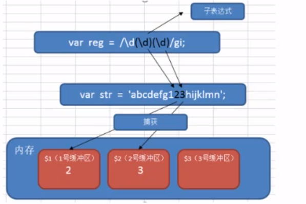


反向引用

如正则表达式中，我们可以使用 \n (n>0，正整数，代表系统中的缓冲区编号)来获取缓冲区的内容，我们把这个过程就称之为反向引用。


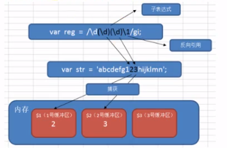


- 在正则语法中，用 `\1` 来引用前面的捕获（使用子表达式匹配的结果）。用 `\2` 表示第二个捕获的内容
- 在正则语法外（如 replace 时），用 `$1` 来引用前面的捕获


~~~js
var str = "1122 3434 5566 7879 9887";
// 匹配4个数字，12位相同，34位相同
var res = str.match(/(\d)\1(\d)\2/g);
console.log(res);
// 13位相同，24位相同
var res = str.match(/(\d)(\d)\1\2/g);
console.log(res);
// 12位相同，34位相同，并将相同的数字只保留一个
var res = str.replace(/(\d)\1(\d)\2/g, "$1$2");
console.log(res);
~~~


~~~js
var str = "大吉吉吉吉吉吉吉吉吉大利，今晚晚晚晚晚晚晚晚吃鸡";
var res = str.replace(/([\u4E00-\u9FA5])\1+/g, "$1");
console.log(res);
~~~


不是使用 /g 标签则可以返回捕获组

~~~js
var str = "power apple is powerful apple";
var rg = /power.(apple).*\1$/;
res = str.match(rg);
console.log(res);
console.log(res[1]);
~~~


禁止引用

(?:正则) 这个小括号内容不能够被引用

~~~js
var str = '1122 3434 5566 7879 9887'
// 第一次括号内不允许被引用
var res = str.match(/(?:\d)(\d)\1\d/g);
~~~


## 11. 环视（断言、预查）

正则表达式中，用于查找某些内容之前或之后的东西，叫做环视。

### 11.1. 正向肯定预查

也叫作顺序肯定环视

every(?=n) 匹配任何其后紧接指定字符串 n 的字符串

~~~js
// 匹配后面字符为 10 的 win
var str = "win7 win8 win10";
var res = str.match(/win(?=10)/g)
console.log(res); //["win"]
~~~


### 11.2. 正向否定预查

every(?!n) 匹配任何其后没有紧接着指定字符串n的字符串

~~~js
var str = "win7 win8 win10";
var res = str.match(/win(?!10)/g)
console.log(res); //["win", "win"]
~~~


## 11. 常用正则

~~~
用户名 /^[a-z0-9_-]{3,16}$/ 
电话号码 /^1[3-9]\d{9}$/
电子邮箱 /^([a-z0-9_\.-]+)@([\da-z\.-]+)\.([a-z\.]{2,6})$/
/^[a-z\d]+(\.[a-z\d]+)*@([\da-z](-[\da-z])?)+(\.{1,2}[a-z]+)+$/
匹配中文 [\u4E00-\u9FA5]
~~~


## 12. 正则练习

练习1：从一堆图片地址中，找出符合条件的图片地址。

~~~js
var arr = [
    "img/20181013/a.jpg",
    "img/20181014/b.png",
    "image/20181014/a.jpg",
    "image/20181013/b.png",
    "20181013/c.png",
    "20181018/c.pdf",
];

var pattern = /^img.*\.(jpg|png|gif|jpeg)$/i;
for (var i in arr) {
    // var res = arr[i].match(pattern); // 返回数组或者null
    var res = pattern.test(arr[i]); //返回是true false
    if (res) {
        console.log(arr[i]);
    }
}

// 匹配不以image开头的图片地址  正向否定预查 ?!
//  /^(?!image)/  /.*/  /\.(jpg|png|gif|jpeg)$/i
//  /^(?!image).*\.(jpg|png|gif|jpeg)$/i
var pattern = /^(?!image).*\.(jpg|png|gif|jpeg)$/i;
for (var i in arr) {
    var res = pattern.test(arr[i]); //返回是true false
    if (res) {
        console.log(arr[i]);
    }
}
~~~


练习2：匹配div2 以及div2中的内容

~~~js
var html = '<div id="div1"><div id="div2">来找我呀</div></div>';
// /<div id="div2">.*<\/div>/
// 非贪婪匹配
// var pattern = /<div id="div2">.*?<\/div>/;
// var res = html.match(pattern);
var pattern = /<div id="div2">(.*?)<\/div>/;
var res = html.match(pattern);
// match 方法匹配，会将子表达式的结果，也放在结果数组中
// match 返回结果：特点：不加全局修饰符g，结果包含子表达式结果
// 加全局修饰符g  不包含子表达式结果
console.log(res);
// console.log(res[1]);
~~~


# -------------------

# ES6

# -------------------


ES 全程是 ECMAScript，它是由 ECMA 国际标准化组织指定的一项脚本语言的标准化规范。ES已经开发到第10个版本了，也就是 ES10 。ES6 是 2015年6月制定的一个版本。这一版包含了大概这个规范有史以来最重要的一批增强特性。ES6 正式支持了类、模块、迭代器、生成器、箭头函数、期约、反射、代理和众多新的数据类型。


# 1. let 声明

let 声明方式的特点：

- 变量不能重复声明
- 只在块级作用域生效
- 不存在变量提升
- 不影响作用域链


## 1.1 变量不能重复声明

使用 var 声明变量的时候，变量是可以重复声明的，如：

~~~js
var a = 10;
var a = 20;
console.log(a);
~~~

> 此时，浏览器不会报错，并且 a 被重新声明成了 20


使用 let 方式则不能重复声明

~~~js
let a = 10;
let a = 20;
console.log(a);
~~~

> 浏览器报错 Uncaught SyntaxError: Identifier 'a' has already been declared


## 1.2 只在当前作用域生效

let 声明的变量只在所处于的块级有效，块级作用域即 {} 中的作用域。变量只能在大括号中访问。

之前在 function 中用 var 定义的变量确实无法在外部访问，除非使用闭包的方式，但是在 if, for 中用 var 定义的变量，在外部是可以访问的，如：

~~~js
for (var i = 1; i <= 3; i++) {
    var a = +i;
}
if (true) {
    var b = 10;
}
console.log(a);
console.log(b);
~~~

> a 和 b 都可以访问


如果使用 let 定义变量，那么在外部就无法进行访问：

~~~js
if (true) {
    let a = 10;
}
// 程序报错，显示 a 为 undefined
console.log(a);
~~~


## 1.3 let 关键字不存在变量提升

在 var 定义的变量，在 js 执行前会将定义变量提升到脚本最前边。而 let 则没有这种机制。


使用 var 声明变量时，虽然赋值不会生效，但是已经执行了 `var a;`，将声明提前执行，如：

~~~js
// 被声明但没有赋值
console.log(a);
var a = 10;
~~~

> 输出 undefined


使用 let 声明变量，变量必须在声明之后使用

~~~js
console.log(a);
let a = 10;
~~~

> 报错信息：Uncaught ReferenceError: Cannot access 'a' before initialization


## 1.4 let 声明不影响作用域链

~~~js
function foo(){
    let a = 10;
    function fn(){
        console.log(a);
    }
    fn();
}
foo();
~~~

>  fn() 中没有声明 a，会向上一级寻找，此时 let 声明的变量不影响作用域链的传输


## 1.5. 暂时性死区

当我们在块级作用域中可以调用外部用 var 定义的变量

~~~js
var num = 10;
if (true) {
    console.log(num);
}
~~~


如果在块级作用域中定义了相同的变量名，这个变量则会与这个 {} 进行绑定，即使 console.log(num) 在定义num之前，也是无法访问外部用var定义的同名变量的。

~~~js
var num = 10;
if (true) {
    console.log(num);
    let num;
}
~~~


let 应用：

比如说 for 循环中我们的计数器 i，在 for 循环之后就没必要存在了，我们不需要访问计数器 i 的值。所以建议使用 let 定义，循环结束后就会被内存回收销毁。

~~~js
for (let i = 0; i <= 3; i++) {
    console.log(i);
}
// 报错，因为 i 已经被销毁
console.log(i);
~~~


经典面试题：代码执行结果？

~~~js
var arr = [];
for (var i = 0; i < 2; i++) {
    arr[i] = function () {
        console.log(i);
    };
}
arr[0]();
arr[1]();
~~~

当 arr[0] 和 arr[1] 两个函数运行的时候，循环已经结束，var 定义的 i 没有被销毁，因为作用域链的关系，在匿名函数中 i 并没有在该函数声明，所以去寻找上一层，i 又是一个全局变量，所以两个函数中输出的 i 其实是同一个 变量，所以这两个函数输出的结果应该是一样的，都是 2。


~~~js
var arr = [];
for (let i = 0; i < 2; i++) {
    arr[i] = function () {
        console.log(i);
    };
}
arr[0]();
arr[1]();
~~~

当 arr[0] 和 arr[1] 两个函数运行的时候，Js 引擎在后台会为每个迭代循环声明一个新的迭代变量，每个arr引用的都是不同变量的实例，这时候的 i 不是全局变量，所以 i 还是原来的值，0,1


这种每次迭代声明一个独立变量实例的行为适用于所有风格的 for 循环，包括 for...in 和 for...of 循环。


## 1.6 windows 对象属相

最后在全局作用域中使用 let 声明的变量不会称为 window 对象的属性

~~~js
var age = 18;
console.log(window.age)

// 报错
let name = 'Andy'
console.log(window.name)
~~~


# 2. const 声明

cosnt 的行为与 let 基本相同，作用是声明常量，常量就是指值（内存地址）不能变化的量。唯一一个重要的区别是用它声明的变量时必须同时初始化变量，且尝试修改 const 声明的变量会导致运行时错误。


常量特点：

- 必须要赋初始值
- 常量值不能被修改
- 常量不能被重复声明
- const声明的常量也是块级作用域


~~~js
// 报错，必须赋值
const score;

// 报错，不能改变常量值
const age = 36
age = 36;

// 也不能重复声明
const name = "Matt";
const name = "Nicolas";

// 声明的作用域也是块
const country = "China";
if (true) {
    const country = "Japan";
}
// China
console.log(name);
~~~


虽然 const 无法重新声明，但是如果在不同作用域是可以重新声明的

~~~js
const PI = 3.14;
function f1() {
    const PI = 3.1415926;
    console.log(PI);
}
f1();
console.log(PI);
~~~


const 声明的限制只适用于它指向的变量的引用（内存地址），换句话说，如果 const 变量引用的是一个对象，那么修改这个对象内部的属性并不违反 const 的限制

~~~js
const obj = {
    name: "Matt",
    age: 18,
};
obj.age = 19;
console.log(obj);
~~~

> 这是因为 const 指向的是这个对象的地址，对象并没有消失，指向对象的地址也就没有改变。改变的只是对象中的值（对象内存中的值）


# 3.  var, let, const 区别

有了 let 和 const 可以更好的限制变量的作用域，尽量使用 const 和 let，不要再使用 var


- 数组、集合可以使用 const
- 普通变量用 let


| var          | let            | const            |
| ------------ | -------------- | ---------------- |
| 函数级作用域 | 块级作用域     | 块级作用域       |
| 变量提升     | 不存在变量提升 | 不存在变量提提升 |
| 值可以更改   | 值可以更改     | 值不可以更改     |


# 4. 解构赋值

ES6 中允许从数组中提取值，按照对应位置，对变量赋值，对象也可以实现解构。


## 4.1. 数组解构

数组解构允许我们按照一一对应的关系从数组中提取值，在 ES6 之前，我们用 for 循环进行解构。


~~~js
var arr1 = [1,2,3]
var arr2 = [a,b,c]
for (var i = 0; i<3; i++){
    arr2[i] = arr1[i]
}
console.log(a)
~~~


~~~js
let [a, b, c] = [1, 2, 3]
cosnole.log(a);
cosnole.log(b);
cosnole.log(c);
~~~


如果解构不成功，变量值为 undefined，经常出现于解构数量与数组中对应数量不符：

~~~js
// 右边数组为空数组，没有对应值给 foo
let [foo] = []

// 右边数组中只有一个值，bar 为 1，没有对应数据给 foo， foo 为 undefined
let [bar, foo] = [1]

// 右边数组为多个值，左侧比右侧少，则按照左侧数量传值
let [a, b, c] = [1,2,3,4,5,6]

// 如果需要传指定位置的值，左侧需要用,分隔占位
let [a,,c]  = [1,2,3]
~~~


参数中解构数组

~~~js
// 相当于传入 x,y,z
function fn([x,y,z]){
    console.log(x+y+z)
}
var arr = [5,6,7]
f3(arr)
~~~


函数参数使用解构，必须传入对应参数，如果少传参数，没有传参数的变量为 undefined，如果多传则舍弃多余的变量，如果都不传则会报错。如：

~~~js
function fn([x,y,z] = []){
    console.log(x+y+z)
}
var arr = [5,6,7,]
fn(arr)
~~~


为了解决报错的问题，可以设置默认值，如：

~~~js
// 传入参数方法1：
function fn([x=1,y=2,z=3] = []) {
    console.log(x+y+z)
}
var arr = [5,6,7]
fn(arr)
~~~

> 如果没有传入参数，则使用默认 [1,2,3]


~~~js
// 传入参数方法2：
function fn([x,y,z] = [1,2,3]){
    console.log(x+y+z)
}
var arr = [5,6,7]
fn(arr)
~~~


通过数组解构，对于数组内部值的交换就更简单了。

~~~js
var a = 1, b = 2;
[a, b] = [b, a];
console.log(a, b);
~~~


## 4.2 对象解构

~~~js
let person = { name: "zhangsan", age: 20 };

// 使用变量匹配属性（属性名需要一致）
let { name, age } = person;
console.log(name); // 'zhangsan'
console.log(age); // 20
~~~


~~~js
let person = { name: "zhangsan", age: 20 };

// myName，myAge 属于别名
let { name: myName, age: myAge } = person;
console.log(myName); // 'zhangsan'
console.log(myAge); // 20
~~~

> 对象中属性和方法是无序的，所以如果取值数量少于对象属性和方法数量，不需要使用逗号占位。想取什么就写什么就可以了。


对象参数传递解构

~~~js
// function fn({age, sex, say}){
// function fn({age, sex, say}={}){
// function fn({age=30, sex="male", say}={}){  // 默认值 + 空对象
function fn({age, sex, say} = {"age":20, "sex":"male"}){
    console.log(age, sex, say);
}

var obj = {"age":30, "sex":"male", "say": function(){ return "hello"}};
f3(obj);
f3()
~~~


# 5. 箭头函数

ES6 新增的定义函数的方式。

~~~js
() => {} // 相当于 function () {}
const fn = () => {}  // 相当于 fn = function() {}
~~~


- () 函数参数括号
- {} 函数体


例：

~~~js
const fn = ()=>{
    console.log('hello world')
}
fn();
~~~


如果函数体重只有一句话代码，且代码的执行结果就是返回值，可以省略大括号，如：


正常书写：

~~~js
function sum (num1, num2){
    return num1+num2
}
console.log(sum(1,3))

// 或

sum = function(num1, num2){
    return num1 + num2
}
console.log(sum(1,3))
~~~


箭头函数书写：

~~~js
const (num1, num2) => {
    return num1 + num2;
}
~~~


简化版本：

~~~js
const sum = (num1, num2) => num1 + num2
console.log(sum(1,3))
~~~


如果形参只有一个，可以省略小括号，如：

~~~js
cosnt fn = v => v 

// 正常写法
function fn(v){
    return v;
}
~~~


当返回值是对象的时，需要加上小括号或者直接用 return 写法

~~~js
var fn = () => ({"name": "zhangsan", "age": 19});

var fn = () => {
    return {"name": "zhangsan", "age": 19}
};
~~~


箭头函数的应用

~~~html
<input type="button" value="点击" id="btn" />
<script>
    document.getElementById("btn").onclick = (e) => {
        console.log(e);
    };
</script>
~~~


相当于原来的

~~~js
<input type="button" value="点击" id="btn" />
    <script>
    document.getElementById("btn").onclick = function (e) {
    console.log(e);
};
</script>
~~~


还可以作为回调函数使用

~~~js
var f6 = (f) => {
    console.log(f(100));
}
// f6(a=>a);
var f7 = a=>a;
f6(f7);

// 100
~~~


## 5.1. 箭头函数中的 this 

箭头函数不绑定 this 关键字，箭头函数中的 this 指向的是函数定义位置的上下文 this

~~~js
const obj = { name: "张三" };
function fn() {
    // 默认函数this指向window
    // 通过 call 命令这里的this指向obj
    console.log(this);

    // 默认函数this指向window
    // 这里是箭头函数，箭头函数所在位置中，this 的指向就是箭头函数的 this 指向
    // 箭头函数被定义在 fn() 中，fn() 的 this 指向是 obj
    // 所以箭头函数的 this 也是 obj
    return () => {
        console.log(this);
    };
}
const resFn = fn.call(obj);
resFn();
~~~


对象方法中的箭头函数

~~~js
var obj = {
    age: 20,
    say: () => {
        // obj 没有作用域
        // this 指向 window
        console.log(this);
    },
    // obj 中的方法有作用域，这里的 this 指向 obj
    hi: function () {
        console.log(this);
        // 这里根据上下文，因为方法里边的函数中 this指向 obj，
        // 所以 f1 里边的箭头函数中的 this 也指向 obj
        var f1 = () => {
            console.log(this);
        };
        f1();
    },
};
obj.say();
obj.hi();
~~~

obj 是一个对象，而对象是没有作用域的，所以这里的箭头函数中的 this 实际上指向的是在全局作用域中的this，而全局作用域的 this 是 window，所以这里的 this 是 window。window 下当然没有 age 属性，所以报 undefined


如果在全局下定义一个变量 age，那么这回就会显示 100了

~~~js
var age = 100;
var obj = {
    age: 20;
    say: () => {
        console.log(this.age);
    }
}
obj.say();
~~~


箭头函数的优点：

- 书写简单
- 不绑定 this
- 支持默认参数、剩余参数、解构


~~~js
var f1 = (x=1, y) => {
    console.log(x,y);
}
f1(3,4);

var f2 = (...x)=>{
    console.log(x);
}
f2(3,4);

var f3 =([x,y]=[])=>{
    console.log(x,y);
}


~~~


箭头函数的缺点：

- 不能做构造函数
- 不能用 new 实例化
- 没有 prototype 属性
- 不能用 arguments


# 6. 剩余参数

ES5 中，可以再函数内部使用 arguments 获取函数传过来的所有参数，以伪数组形式呈现，ES6 中提供的剩余参数语法允许我们将一个不定数量的参数表示为一个数组。剩余参数用 `...args` 表示。

~~~js
function sum (first, ...args) {
    console.log(first);  // 10
    console.log(args);  // [20, 30]
}
sum(10,20,30);
~~~


例：

~~~js
const sum = (...args) => {
    let total = 0;
    args.forEach((item) => (total += item));
    return total;
};
console.log(sum(10, 20));
console.log(sum(10, 20, 40));
~~~


剩余参数和结构配合使用：

~~~js
let students = ["zs", "ls", "ww"];
let [s1, ...s2] = students;
console.log(s1); // 'zs'
console.log(s2); // ['ls', 'ww']
~~~


# 7. 函数的默认值

ES6 支持了函数默认值的写法，在 ES5 中如果我们要实现这个功能的话，可以这样写：

~~~js
function fn(username){
    var username = username || 'lisi'
    console.log(username)
}
// 如果不传参数，username 是 undefined，在函数内部重新赋值，给其值
fn();
fn('zhangsan')
~~~


ES6 中

~~~js
function fn(username = 'lisi'){
    console.log(username)
}
fn()
fn('zhangsan')
~~~


# 8. 字面量创建对象（ES6简化）

在之前的版本中用字面量创建对象，需要完整的写出属性名和对应值，在 ES6 中如果属性值已经在外部作用域定义好了，并且变量名和属性名一样，那么就可以使用简化写法：


- 属性值可以省略
- 方法可以直接使用简化写法
- 可以指定原型对象


~~~js
var name = "zx";
var age = 36;

// 传统定义方式
var obj = {
    name: name,
    age: age,
    say: function () {
        return "hello";
    },
};

// ES6 简化写法
var person = {
    coding() {
        console.log("abcde");
    },
};
var obj1 = {
    // 可以指定原型对象
    __proto__: person,
    name,
    age,
    // 方法简化写法
    say() {
        return "hello";
    },
};
console.log(obj);
console.log(obj1);
obj1.coding();
~~~


# 9. Symbol 数据类型

ES6 新增了一种数据类型：Symbol，表示独一无二的值，Symbol 最大的用途是用来定义对象的唯一属性名。


使用 Symbol() 创建 symbol 数据

~~~js
var symbol1 = Symbol();

// 参数没有意义，只是对 Symbol 加了一个标记
var symbol2 = Symbol("Alice");
console.log(symbol1);
console.log(symbol2);

// Symbol 是独一无二的
console.log(symbol1 == symbol2);
console.log(Symbol() == Symbol());

// 输出结果
Symbol()
Symbol(Alice)
false
false
~~~


创建 symbol 数据的作用就是为了防止重复，比如对象中成员名。

~~~js
var obj = {
    age: 40,
    name: "zs",
    sex: "male",
    // 创建独一无二的属性，避免和之前同名的重复
    // [] 是为了执行里边的代码
    [Symbol(score)]: "100"
};

// obj[say] = 100
~~~


# 10. Array 的扩展方法

## 10.1. ... 扩展运算符

扩展运算符可以将数组或者对象转为用逗号分割的参数序列。

 ~~~js
let arr = [1,2,3];
...arr // 1,2,3

// 逗号被当做 console.log 的参数，输出多个元素用，分割
cosnole.log(...arr);  // 1 2 3
 ~~~


扩展运算符可以应用于合并数组

~~~js
let arr1 = [1,2,3]
let arr2 = [3,4,5]
let arr3 = [...arr1,...arr2];
~~~


~~~js
let arr1 = [1,2,3]
let arr2 = [3,4,5]
let arr1.push(...arr2);
~~~


给函数传参数，将数组内变量依次传入

~~~js
function fn(x,y){
    return x+y
}
var arr = [3,4]
// 普通方法
console.log(f1(arr[0]), arr[1])

// 使用 apply
console.log(f1.apply(null, arr))

// 使用...扩展运算符
console.log(f1(...arr))
~~~


## 10.2. Array.from() 

伪数组虽然类似于数组，可以遍历，但是数组对象中的一些方法无法使用，如果想让伪数组使用数组对象中的一些方法，那么就需要将伪数组转换为真正的数组。


1. 使用...将伪数组转为数组

~~~js
let divs = document.querySelectorAll("div");
console.log(divs);
divs = [...divs];
console.log(divs);
~~~


2. 使用 Array.from()

~~~js
let arrayLike = {
    0: "a",
    1: "b",
    2: "c",
    length: 3,
};
let arr2 = Array.from(arrayLike);  // ['a', 'b', 'c']
~~~


Array.from() 还可以接受第二个参数，作用类似于数组的 map 方法，用来对每个元素进行处理，将处理后的值放入返回的数组。

~~~js
let arrayLike = {
    0: "1",
    1: "2",
    2: "3",
    length: 3,
};
let arr2 = Array.from(arrayLike, item=>item*2);   //[2,4,6]
~~~

## 10.3. find()

用于找出第一个符合条件的数组成员，如果没找到则返回 undefined。接受一个函数，通过函数后，函数返回值是布尔值，布尔值为真的 item 被储存在新的数组中。

~~~js
let ary = [{
    id: 1,
    name: 'zs'
},{
    id:2,
    name:'ls'
}]
let target = ary.find((item, index)=>item.id ==2);
~~~


## 10.4. findIndex()

用于找出第一个复合条件的数组成员的位置，如果没找到返回 -1

~~~js
let arr = [1, 5, 10, 15];
let index = arr.findIndex((value, index) => value > 9);
console.log(index);
~~~


## 10.5. includes()

表示某个数组是否包含给定的值，返回布尔值。在 ES6 之前使用的是 indexOf 来进行判断，如：

~~~js
let arr = [1, 5, 10, 15];
console.log(arr.indexOf(5));  // 1
~~~


ES6 的新方法 include() 更加简单明了，如：

~~~js
ret = [1,2,3].includes(2)  // true
ret = [1,2,3].includes(4)  // true
~~~


## 10.6. for...of 遍历

for...of 与 for...in 类似，for...in 是以下标遍历，而 for...of 是以值来遍历的。for...of 还可以遍历字符串，但是不能遍历对象。

~~~js
var team = ['zs','ls','ww']
for(var i of team){  // i 是值
    console.log(i)
}

// 输出结果
zs
ls
ww
~~~


# 9. String 的扩展方法

## 9.1 ` 模板字符串

ES6 新增的创建字符串的方式，使用反引号定义。模板字符串有很多优点：

- 可以解析变量
- 可以多行赋值
- 可以调用函数


~~~js
// 解析变量
let name = "张三";
let sayHello = `他叫${name}`;
console.log(sayHello);
~~~


~~~js
let name = "张三";

// 还可以换行，注意需要顶格写，不然空格也会被解析出来
let sayHello = `他叫${name}
还有谁？？
哈哈`;
console.log(sayHello);
~~~


例：

~~~js
let data = {
    name: "zs",
    age: 20,
    sex: "male",
};
let html = `<div>
<span>${data.name}</span>
<span>${data.age}</span>
<span>${data.sex}</span>
</div>`;
document.write(html);
~~~


模板字符串还可以调用函数：

~~~js
const fn = function () {
    return "hellow world";
};
// ` 可以调用函数
let greet = `${fn()} 你好世界`;
console.log(greet);
~~~


## 9.2. startWith 和 endWith

- startsWith() 表示参数字符串是否在原字符串的头部，返回布尔值
- endsWith() 表示参数字符串是否在原字符串的尾部，返回布尔值


~~~js
let str = "Hello world";
console.log(str.startsWith("H")); // true
console.log(str.startsWith("Hello")); // true
console.log(str.endsWith("D")); // false
console.log(str.endsWith("world")); // true
~~~


## 9.3. repeat()

repeat 方法表示将原字符串重复 n 次，返回一个新字符串

~~~js
str1 = 'x'.repeat(3)
console.log(str1)  // 'xxx'

str2 = 'hello'.repeat(2)
console.log(str2)  // 'hellohello'

~~~


# 9. Set 数据结构

ES6 提供了新的数据结构 Set，类似于数组，但是成员之都是唯一的，没有重复的值。


## 9.1. 去重

Set 本身是一个构造函数，用来生成 Set 数据结构

~~~js
const s = new Set();
~~~


Set 函数可以接受一个数组作为参数，用来初始化，如参数中有重复成员，则会去掉多余的重复成员，只保留一个

~~~js
const set = new Set([1, 2, 3, 3, 5]);
console.log(set);  // [1,2,3,5] 注意，这里 set 已经不是数组数据类型了
~~~


可以使用 Set 的属性 size 来查看集合中的成员数量（注意不是 length ）

~~~js
const set = new Set([1, 2, 3, 3, 5]);
console.log(set.size);  // 4
~~~


例：判断数组中是否有重复元素

~~~js
arr = [1,6,4,2,2,1]
const set = new Set(arr)
if (arr.length != set.size){
    console.log(true)
} else {
    console.log(false)
}
~~~


## 9.2. 将 Set 转换为数组

可以使用我们的扩展运算符 `...` 来进行转换

~~~js
const set = new Set([1,2,3])
const arr = [...set]
~~~


## 9.3. Set 方法

以下所有方法都是在原set基础上进行操作，返回值为 set 本身。

- add(value) 添加某个值，返回 Set 结构本身
- delete(value) 删除某个值，返回一个布尔值，表示删除是否成功
- has(value) 返回一个布尔值，表示是否为 Set 成员
- clear() 清除所有成员，没有返回值


~~~js
const s = new Set();

// 向 set 结构添加值
s.add(1).add(2).add(3); 

// 删除 set 结构的值
s.delete(2)

// 表示 set 结构是否有1这个值
s.has(1)

// 清除 set 结构中所有的值
s.clear()

~~~


## 9.4. 遍历 set

set 结构的实例与数组一样，也拥有 forEach 方法，用于对每个成员执行某种操作，没有返回值。


注意，这里的 forEach 没有 index

~~~js
s = new Set([6, 7, 8, 9, 0]);
s.forEach(function (value) {
    console.log(value);
});
~~~


# ES6 模块化

模块化就是将一个大程序拆分成互相依赖的小文件，再用简单的方法拼装起来。ES6中首次引入模块化开发规范ES Module，让Javascript首次支持原生模块化开发，ES Module 把一个文件当作一个模块，每个模块有自己的独立作用域。通过 import 和 export 进行模块的导入或导出。


如果之前接触过 Node.js 的话，可能已经了解过 Node 模块化的导入和导出：

node.js 遵循了 CommonJS 模块化规范，其中：

- 导入其他模块使用 require() 方法
- 模块对外共享成员使用 module.exports 对象


遵循模块化规范开发的好处：

- 大家都遵守同样的模块化规范写代码，降低沟通成本，极大方便了各个模块之间的相互调用。


在 ES6 模块化规范诞生之前， Javascript 社区已经尝试并提出了 AMD, CMD, CommonJS 等模块化规范。但是这些由社区提出的模块化标准，存在一定的差异性和局限性、并不是浏览器和服务器通用的模块化标准，如：

- AMD 和 CMD 适用于浏览器端的 Js 模块化
- CommonJS 适用于服务器端的 Js 模块化

> ES6 模块化规范是浏览器与服务器端通用的模块化开发规范，开发者不用再去学习 AMD, CMD, CommonJS 等模块化规范


ES6 模块化规范定义：

- 每个 js 文件都是一个独立的模块
- 导入其他模块成员使用 import 关键字
- 向外共享模块使用 export 关键字


## 1. Node.js 中体验 ES6 模块化

node.js 中默认仅支持 CommonJS 模块化规范，若想基于 node.js 体验与学习 ES6 模块化语法，可以按照如下两个步骤进行配置

- 确保安装了 v14.15.1 或更高版本的 node.js
  - node -v 查看版本
- 在 package.json 的根节点中添加 `"type": "module"` 节点


初始化项目，会自动创建 package.json 文件

~~~
npm init -y
~~~


添加 type 节点

~~~json
{
  "type": "module",
  "name": "vue",
  "version": "1.0.0",
  "description": "",
  "main": "index.js",
  "scripts": {
    "test": "echo \"Error: no test specified\" && exit 1"
  },
  "keywords": [],
  "author": "",
  "license": "ISC"
}

~~~


## 2. ES6 模块化基本语法

ES6 模块化主要包含如下 3种用法：

- 默认导出与默认导入
- 按需导出与按需导入
- 直接导入并执行模块中的代码


### 2.1 默认导出

默认导出的语法：

~~~
export default 默认导出的成员
~~~


例：

~~~js
let n1 = 10 // 定义模块私有成员 n1
let n2 = 20 // 定义模块私有成员 n2 （外界访问不到 n2，因为它没有被共享出去）

function show() {} // 定义模块私有方法 show

// 使用 export default 默认导出语法，向外共享 n1 和 show 两个成员
export default {
  n1,
  show,
}

~~~

> 每个模块中，只允许使用唯一一次 export default 进行导出，否则会报错


### 2.2 默认导入

~~~
import 接收名称 from '模块标识符'
~~~


例 demo.js

~~~js
// 从 showJS.js 模块中导入 export default 向外共享的成员
// 并用 m1 成员进行接收
import m1 from './showJS.js'
console.log(m1)
~~~

> 默认导入时接收的成员名可以任意命名，只要符合命名规范即可。


在控制台执行 js

~~~shell
node demo.js
~~~


输出结果

~~~
{ n1: 10, show: [Function: show] }
~~~


### 2.3 按需导出

按需导出可以多次进行成员导出

~~~js
// 向外导出指定变量与方法
// 每个变量与方法需要单独导出
export let s1 = 10
export let s2 = 20
export function say() {}

~~~


### 2.4 按需导入

按需导入时，导入的成员名称必须和按需导出的名称保持一致

~~~js
// 从 js 文件中导入所需变量或方法
import { s1, s2, say } from './02.export.js'
console.log(s1)
console.log(s2)
console.log(say)

~~~


如果有名称冲突的话，可以使用 as 关键字进行重命名

~~~js
import { s1 as str1, s2, say } from './02.export.js'
console.log(str1)
~~~


按需导出可以和默认导出一起使用，可以导出按需导出的成员，也可以直接定义

~~~js
export let s1 = 10
export let s2 = 20
export function say() {}

export default {
  s1,
  s2,
  say,
  a: 20,
}

~~~


导入时，默认导入与按需导入用逗号分隔

~~~js
import info, { s1, s2, say } from './02.export.js'
console.log(s1)
console.log(s2)
console.log(say)
console.log(info)

~~~


### 2.5 直接导入

如果只想单纯的执行某个模块中的代码，并不需要得到模块中向外共享的成员，此时，可以直接导入并执行模块代码，实例代码如下：


代码模块 loop.js

~~~js
for (let i = 1; i<3; i++){
  console.log(i);
}
~~~


在 test.js 文件中直接导入

~~~js
import loop.js
~~~


# Promise

## 1. 同步和异步

Javascirpt 是一门单线程的编程语言，也就是说同一时间只能做一件事。当执行队列任务时，如果前一个任务耗时严重，就会造成后续任务不得不等待，从而导致程序假死问题。为了防止某个耗时任务导致程序假死的问题，Javascript 把待执行的任务分为两类：

- 同步任务
- 异步任务


- 同步可以理解为顺序执行，当碰到一个耗时比较长的操作，主线程会一直等待该操作完成再执行下边的代码
- 异步可以理解为同时执行，当碰到一个耗时比较常的操作，主线程不会等待，继续执行下边的代码（同时耗时程序也在继续执行）


### 1.1 同步

同步任务 (synchronous) 又叫做非耗时任务，指主线程上排队执行的那些任务，只有前一个任务执行完毕，才能执行下一个任务。如一个进程在执行某个请求的时候，若该请求需要一段时间才能返回信息，那么这个进程将会一直等待下去，直到收到返回信息才继续执行下去；

~~~js
var a = 1
var b = 2
function add (x, y) {
    return x + y
}

function sub (x, y) {
    return x - y
}
add (a, b)
sub (a, b)
~~~

> 由上到下依次执行，add() 函数执行完毕后再执行 sub()


### 1.2 异步

异步任务(asynchronous) 又叫做耗时任务，是指进程不需要一直等下去，而是继续执行下面的操作，不管其他进程的状态。当有消息返回时系统会通知进程进行处理，这样可以提高执行的效率。当异步任务执行完成后，会通知 Javascript 主线程执行异步任务的回调函数。异步任务由 Javascript 委托给宿主环境进行执行，


~~~js
setTimeout(() => {
  console.log('程序1秒后进行输出')
}, 1000)

setTimeout(() => {
  console.log('程序2秒后进行输出')
}, 2000)

setTimeout(() => {
  console.log('程序3秒后进行输出')
}, 3000)
~~~

> 程序开时候，3个定时器同时启动，分别在第一秒，第二秒，第三秒进行了 console.log 输出


### 1.3 执行顺序


- 同步任务由 JS 主线程次序执行
- 异步任务委托给宿主环境执行
- 已完成的异步任务对应的回调函数，会被加入到任务队列中等待执行
- JS 主线程的任务栈被清空后，会读取任务列表中的回调函数，次序执行
- JS 主线程会不断重复上边第四步


面试题：

~~~js
import thenFs from 'then-fs'

console.log('A')
thenFs.readFile('./a.txt', 'utf8').then(res=>{
  console.log('B');
})
setTimeout(() => {
  console.log('C');
}, 0);
console.log('D')

~~~


执行结果

~~~
ADCB
~~~

>- A 和 D 属于同步任务，会根据代码的先后顺序依次被执行
>- C 和 B 属于异步任务，他们的回调函数会被加入到任务队列中，等待主线程空闲再执行，setTimeOut 由于是 0 秒执行，所以排在 B 前边


## 1. 回调地狱

如果想让异步代码，按照特定的顺序来执行，就需要将异步函数进行嵌套，造成了回调地狱，实例代码如下：

~~~js
setTimeout(() => {
  console.log('延迟 1 秒后输出')
  setTimeout(() => {
    console.log('再延迟 2 秒后输出')
    setTimeout(() => {
      console.log('再延迟 3 秒后输出')
    }, 3000)
  }, 2000)
}, 1000)

~~~


回调地狱的缺点：

- 代码耦合性太强，难以维护
- 大量的冗余代码互相嵌套，可读性差


为了解决回调地狱的问题，ES6 新增了 Promise 的概念


## 2. Promise 的基本概念

ES6 中出现了一个新的方法，叫做 Promise， Promise 是一个构造函数，它本身并不是异步，但是它的内部往往是异步函数。可以把 Promise 看做成一个容器：容器中存放了一个异步任务，任务有3种状态：

- pending
- resolved
- rejected

当开始执行容器内部的异步操作时，任务状态处于 pending，当任务执行完毕后，状态变为 resolved，如果任务失败，状态为 rejected


Promise 是一个构造函数，我们可以通过 new 关键字创建出一个实例，其中 Promise 构造函数的参数是一个 function，我们将具体的异步操作定义到这个 function 内部，如：

~~~js
const p = new Promise(function(resolve, reject){
    // 异步函数
})
~~~


例：

~~~js
var fs = require('fs')

var p1 = new Promise(function (resolve, reject) {
    fs.readFile('./a.txt', 'utf8', function (err, data) {
        if (err) {
            // 如果失败，将状态从 pending 改为 rejected
            reject (err)
        } else {
            // 如果成功，将状态从 pending 改为 resolved
            resolve (data)
        }
    })
})
~~~

> 创建的实例对象，代表一个异步操作


## 3. then

Promise.prototype 上包含一个 .then() 的方法

- 每一次 new Promise() 构造函数得到的实例对象，都可以通过原型链的方式访问到 .then() 方法


.then() 方法用来预先指定成功或失败的回调函数

- `p.then(成功的回调函数, 失败的回调函数)`
- `p.then(result => {}, error => {})`
- 调用 .then() 方法时，成功的回调函数是必选的，失败的回调函数是可选的


## 4. 基于 .then 按顺序读取文件

在 node.js 中，实现按顺序读取 1.txt, 2.txt, 3.txt 文件内容，代码如下：

~~~js
const fs = require('fs')

// 读取 1.txt
fs.readFile('./1.txt', 'utf8', (err1, res1) => {
  if (err1) return console.log(err1.message) // 如果失败返回，并输出错误信息
  console.log(res1) // 如果没有错误，输出
  // 然后读取 2.txt
  fs.readFile('./2.txt', 'utf8', (err2, res2) => {
    if (err2) return console.log(err2.message) // 如果失败返回，并输出错误信息
    console.log(res2) // 如果没有错误，输出
    // 然后读取 3.txt
    fs.readFile('./3.txt', 'utf8', (err3, res3) => {
      if (err3) return console.log(err3.message) // 如果失败返回，并输出错误信息
      console.log(res3) // 如果没有错误，输出
    })
  })
})

~~~

> 形成回调地狱


如果上一个 .then() 方法中返回一个新的 Promise 实例对象，则可以通过下一个 .then() 继续进行处理。通过 .then() 方法的链式调用，就解决了回调地狱问题。

~~~js
var fs = require('fs')

var p1 = new Promise(function(resolve, reject) {
    fs.readFile('./a.txt', 'utf8', function(err, data) {
        if (err) {
            // 如果失败，将状态从 pending 改为 rejected
            reject(err)
        } else {
            // 如果成功，将状态从 pending 改为 resolved
            resolve(data)
        }
    })
})

var p2 = new Promise(function(resolve, reject) {
    fs.readFile('./b.txt', 'utf8', function(err, data) {
        if (err) {
            reject(err)
        } else {
            resolve(data)
        }
    })
})

var p3 = new Promise(function(resolve, reject) {
    fs.readFile('./c.txt', 'utf8', function(err, data) {
        if (err) {
            reject(err)
        } else {
            resolve(data)
        }
    })
})

p1.then(function(data) {
    console.log(data);
  // 这里 return 什么，后边 then 中 function 参数的 data 就是什么
  // 如果 return 的是一个 promise 对象，后边 then 中的 function 就是这个 promise 对象的 resolve 方法
  // 这个 p1.then(function...) 相当于就变成了 p1.then(p2).then(p3)，使用 data 参数只是为了拿到 promise 对象中
  // 异步函数的 resolve 处理结果，即 data
    return p2
}, function(err) {
    console.log(err)
}).then(function(data) {
    console.log(data);
    return p3
}).then(function(data) {
    console.log(data);
})
~~~


封装

~~~js
var fs = require('fs')

function pReadFile(filePath) {
    return new Promise(function(resolve, reject) {
        fs.readFile(filePath, 'utf8', function(err, data) {
            if (err) {
                reject(err)
            } else {
                resolve(data)
            }
        })
    })
}


pReadFile('./a.txt').then(function(data) {
    console.log(data);
    return pReadFile('./b.txt')
}, function(err) {
    console.log(err)
}).then(function(data) {
    console.log(data);
    return pReadFile('./c.txt')
}).then(function(data) {
    console.log(data);
})
~~~


## 5. then-fs 包

刚才是我们自己封装的异步按顺序读取文件，npm 社区有一个 then-fs 包，支持基于 Promise 的方式读取文件内容，读取文件后，直接返回一个 Promise 对象。


安装 then-fs

~~~
npm i then-fs -S
~~~


调用 then-fs 提供的 readFile() 方法，可以异步的读取文件的内容，它的返回值是 Promise 的实例对象，因此可以直接调用 .then() 方法为每个 Promise 异步操作指定成功和失败之后的回调函数。实例代码如下：

~~~js
import thenFs from 'then-fs'
thenFs.readFile('./a.txt','utf8').then(res => {console.log(res)}, err=>{console.log(err.message)})
thenFs.readFile('./b.txt','utf8').then(res => {console.log(res)}, err=>{console.log(err.message)})
thenFs.readFile('./c.txt','utf8').then(res => {console.log(res)}, err=>{console.log(err.message)})
~~~


此时文件读取完成，但是依然没有按照顺序读取，这是因为没有通过 .then 将三个异步操作链式连接起来

~~~js
import thenFs from 'then-fs'
// 返回值是 .b.txt 读取文件的 Promise 对象
thenFs.readFile('./a.txt', 'utf8')
  .then(
    (res) => {
      console.log(res)
      return thenFs.readFile('./b.txt', 'utf8')
    },
    (err) => {
      console.log(err.message)
    }
  )
// 链式处理上一个返回的 Promise 对象
  .then(
    (res) => {
      console.log(res)
      return thenFs.readFile('./c.txt', 'utf8')
    },
    (err) => {
      console.log(err.message)
    }
  )
  .then(
    (res) => {
      console.log(res)
    },
    (err) => {
      console.log(err.message)
    }
  )

~~~


## 6. catch 捕获错误

在 Promise 的链式操作中如果发生了错误，可以使用 Promise.prototype.catch 方法进行捕获处理：

~~~js
import thenFs from 'then-fs'
thenFs
  .readFile('./a.txt', 'utf8')
  .then((res) => {
    console.log(res)
    return thenFs.readFile('./b.txt', 'utf8')
  })
  .then((res) => {
    console.log(res)
    return thenFs.readFile('./c.txt', 'utf8')
  })
  .then((res) => {
    console.log(res)
  })
// 通过 catch 对错误进行处理
  .catch((err) => {
    console.log(err.message)
  })

~~~


只要前边任何一个异步任务出现错误，那么 catch 就会捕获并进行处理，然后停止该任务链，如果不希望前边的错误导致后续的 .then 无法正常执行，则可以将 catch 调用提前，如：

~~~js
import thenFs from 'then-fs'
thenFs
  .readFile('./a.txt', 'utf8')
// 通过 catch 对错误进行处理
  .catch((err) => {
    console.log(err.message)
  })
  .then((res) => {
    console.log(res)
    return thenFs.readFile('./b.txt', 'utf8')
  })
  .then((res) => {
    console.log(res)
    return thenFs.readFile('./c.txt', 'utf8')
  })
  .then((res) => {
    console.log(res)
  })


~~~

> 当 a.txt 读取文件失败时，那么 catch 会处理错误，处理完成后同样会返回一个 Promise 对象，所以 .then 可以继续执行接下来的任务


## 7. Promise.all() 方法

Promise.all() 方法会发起并行的 Promise 异步操作，等所有的异步操作全部结束后才会执行下一步的 .then 操作（等待机制）。示例代码如下：

~~~js
// 1. 定义一个数组，存放 3 个读文件的异步操作
const promiseArr = [
    thenFs.readFile('./a.txt', 'utf8'), 
    thenFs.readFile('./b.txt', 'utf8'), 
    thenFs.readFile('./c.txt', 'utf8')]

// 2. 将 Promise 的数组，作为 Promise.all() 的参数
Promise.all(promiseArr)
  .then(([r1, r2, r3]) => {
    console.log(r1, r2, r3)
  })
  .catch((err) => {
    console.log(err.message)
  })

~~~

> 数组中的 Promise 实例的顺序就是最终结果的顺序


## 8. Promise.race() 方法

Promise.race() 方法会发起并行的 Promise 异步操作，只要任何一个异步操作完成，就立即执行下一步的 .then 操作（赛跑机制）。 示例代码如下：

~~~js
// 1. 定义一个数组，存放 3 个读文件的异步操作
const promiseArr = [
    thenFs.readFile('./a.txt', 'utf8'), 
    thenFs.readFile('./b.txt', 'utf8'), 
    thenFs.readFile('./c.txt', 'utf8')]

// 2. 将 Promise 的数组，作为 Promise.race() 的参数
Promise.race(promiseArr)
  .then((result) => {
    console.log(result)
  })
  .catch((err) => {
    console.log(err.message)
  })

~~~

> 只执行最先完成的异步操作


## 9. Async 和 Await

Async 和 Await 是 ES8 引入的新语法，用来简化 Promise 异步操作，在 async / await 出现之前，开发者只能通过 .then 方式链式处理 Promise 异步操作。虽然解决了回调地狱的问题，但是代码依旧冗余，阅读性较差。通过 async / await 我们可以简化代码，使代码阅读更加流畅。


~~~js
import thenFs from 'then-fs'

// 按照顺序读取文件
async function getAllFile() {
  const r1 = await thenFs.readFile('./a.txt', 'utf8')
  console.log(r2)
  const r2 = await thenFs.readFile('./b.txt', 'utf8')
  console.log(r2)
  const r3 = await thenFs.readFile('./c.txt', 'utf8')
  console.log(r3)
}

~~~

> thenFs.readFile() 返回的是一个 Promise 对象，通过 await 关键字，将 Pormise 对象中的 resolve(data) 中的 data 提取出来
>
> 如果方法内部用到了 await，那么这个方法必须使用 async 来修饰


### 9.1 执行顺序

在 async 方法中，第一个 await 之前的代码会同步执行，await 之后的代码会异步执行

~~~js
import thenFs from 'then-fs'

console.log('A')
async function getAllFile() {
  console.log('B')
  const r1 = await thenFs.readFile('./a.txt', 'utf8')
  const r2 = await thenFs.readFile('./b.txt', 'utf8')
  const r3 = await thenFs.readFile('./c.txt', 'utf8')
  console.log(r1, r2, r3)
  console.log('D');
}
getAllFile()
console.log('C');
~~~


执行结果

~~~
A
B
C
111 222 333
D
~~~


- 顺序执行代码，先输出 A
- 调用 getAllFile() 函数，输出 B （同步执行）
- 发现 await，进行异步执行（先启动任务，等执行完毕再处理）
- 跳出函数，输出 C
- 函数执行完毕得到结果，输出 r1, r2, r3
- 输出 D


# 宏任务与微任务

Javascript 把异步任务又做了进一步划分，异步任务又分为两类，分别是：

- 宏任务（macrotask）
  - 异步 Ajax 请求
  - setTimeout，setInterval
  - 文件操作
  - 其他宏任务
- 微任务（microtask）
- Promise.then, .catch 和 .finally
- process.nextTick
- 其他微任务


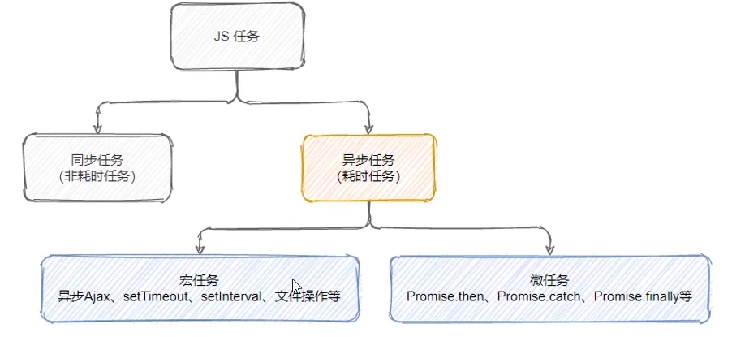


宏任务和微任务的执行顺序

每一个宏任务执行完毕后，都会检查是否存在待执行的微任务，如果有，则执行完所有的微任务之后再执行下一个宏任务

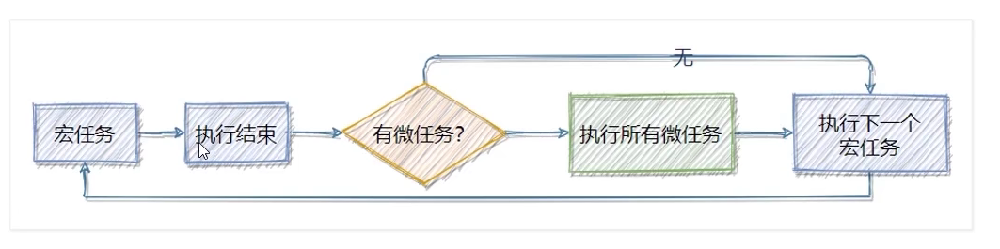


面试题1：

~~~js
setTimeout(() => {
  console.log('A')
}, 0)

new Promise(function (resolve) {
  console.log('B')
  resolve()
}).then(function () {
  console.log('C')
})

console.log('D')
~~~


输出结果

~~~
B D A C
~~~

>- new Promise 是一个同步任务（不要和之前的 fs.readFile 搞混了，之前的 fs 模块才是异步任务）


面试题2：

~~~js
console.log('1')
setTimeout(() => {
  console.log('2')
  new Promise(function (resolve) {
    console.log('3')
    resolve()
  }).then(function () {
    console.log('4')
  })
}, 0)

new Promise(function (resolve) {
  console.log('5')
  resolve()
}).then(function () {
  console.log('6')
})

setTimeout(() => {
  console.log('7')
  new Promise(function (resolve) {
    console.log('8')
    resolve()
  }).then(function () {
    console.log('9')
  })
}, 0)

~~~


输出结果：

~~~
156234789
~~~

> 同步任务 1,5 先执行，然后先清空微任务队列 6，再继续执行剩下的宏任务


