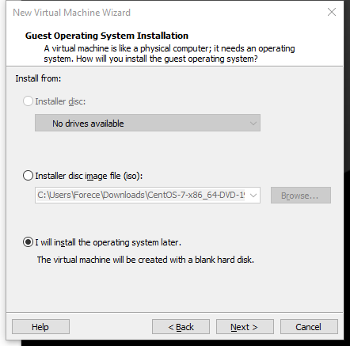
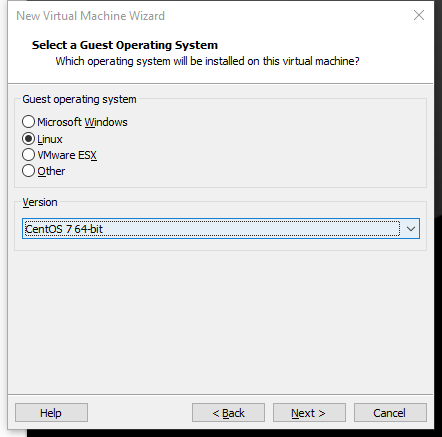
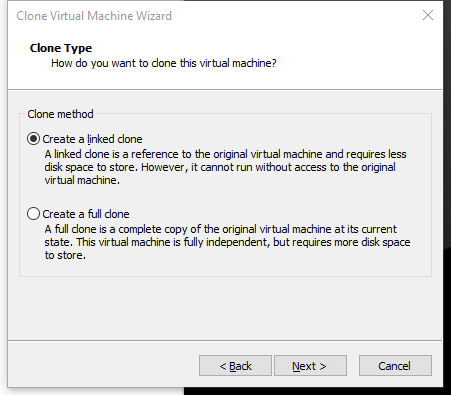

# VMARE 安装 Linux

1. 创建空白硬盘

2. 选择需要安装 Linux 系统或者内核

3. VMware文件会跟随系统文件大小自动调整，最大20GB，

4. 虚拟机内存分配，不能超过真实电脑的一半，最低628MB

5. 网络连接

>桥接：利用本地网卡进行连接，占用同网络的IP地址，可以和同网段其他计算机连接，缺点是限制数量
>
>NAT：利用VMnet8，进行网络连接，只能和本机通信，无法真实网段中其他计算机通信，但是可以访问互联网。
>
>Host-Only：利用VMnet1网卡，进行网络连接，只能和本机通信，不能访问互联网

6. 快照是当前虚拟机状态，克隆是克隆出另外一台虚拟机，可以克隆当前状态或者快照状态

> 链接克隆是只共享文件，新的克隆机依附于原始虚拟机，如果原始虚拟机崩溃了，新的克隆机也无法使用，完整克隆则是整个克隆

# 分区

主分区：最多有4个

扩展分区：最多只能1个

主分区+扩展分区最多4个

不能写入数据，只能包含逻辑分区

逻辑分区

**格式化EXT4**

相当于4K为一个单位

**inode 节点：**

每个文件的索引

