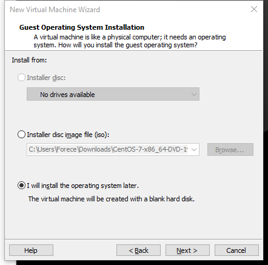
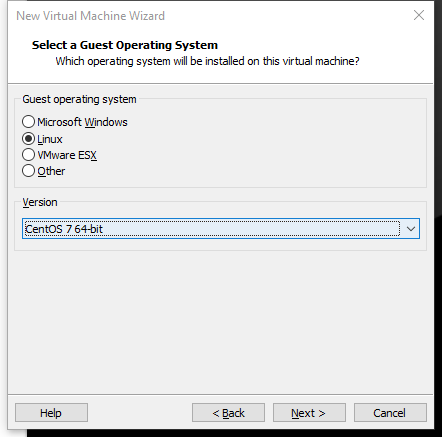
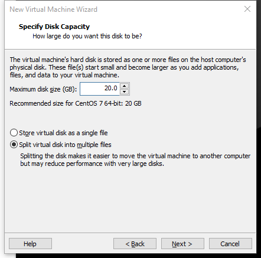
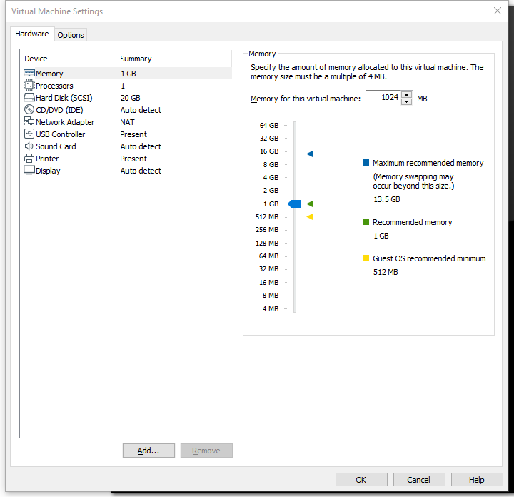
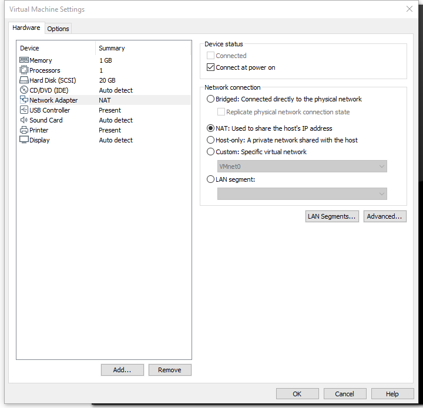
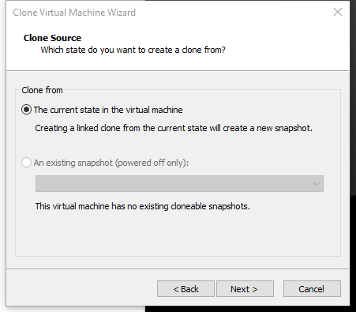
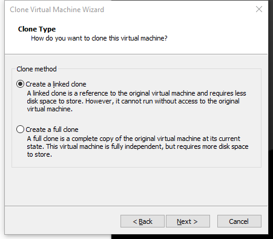

# VMARE 安装 Linux

1. 创建空白硬盘




2. 选择需要安装 Linux 系统或者内核




3. VMware文件会跟随系统文件大小自动调整，最大20GB，



4. 虚拟机内存分配，不能超过真实电脑的一半，最低628MB




5. 网络连接




>桥接：利用本地网卡进行连接，占用同网络的IP地址，可以和同网段其他计算机连接，缺点是限制数量
>
>NAT：利用VMnet8，进行网络连接，只能和本机通信，无法真实网段中其他计算机通信，但是可以访问互联网。
>
>Host-Only：利用VMnet1网卡，进行网络连接，只能和本机通信，不能访问互联网


6. 快照是当前虚拟机状态，克隆是克隆出另外一台虚拟机，可以克隆当前状态或者快照状态




> 链接克隆是只共享文件，新的克隆机依附于原始虚拟机，如果原始虚拟机崩溃了，新的克隆机也无法使用，完整克隆则是整个克隆





# 分区

主分区：最多有4个

扩展分区：最多只能1个

主分区+扩展分区最多4个

不能写入数据，只能包含逻辑分区

逻辑分区


**格式化EXT4**

相当于4K为一个单位


**inode 节点：**

每个文件的索引


# 常用命令

配置用户权限

~~~shell
chown -R nginx:nginx wwwroot
~~~


查看剩余内存

~~~shell
free -m
~~~


查看硬盘占用

~~~shell
df -lh
du -sh  ./*
~~~


查找大文件

~~~shell
find /home -type f -size +800M
~~~


查看 php-fpm 占用内存

~~~
ps -ylC php-fpm --sort:rss
~~~


重启命令

~~~
# 重启 Nginx
service nginx restart
# 重启 php-fpm
# 重启 mysql
~~~


~~~
$ sudo systemctl start php-fpm      # 启动php-fpm
$ sudo systemctl stop php-fpm       # 停止php-fpm
$ sudo systemctl reload php-fpm     # 重载php-fpm
$ sudo systemctl restart php-fpm    # 重启php-fpm
~~~


# 常用文件位置

/etc/php.ini

/etc/php-fpm.conf

/etc/php-fpm.d/www.conf


查找 php.ini 位置

~~~
 php --ini
~~~


Forece.net

www.conf

~~~
# Pure 配置
pm.max_children = 30
pm.start_servers = 5
pm.min_spare_servers = 5
pm.max_spare_servers = 20
;pm.process_idle_timeout = 10s;
;pm.max_requests = 500

~~~


~~~
# 优化配置
pm.max_children = 40
pm.start_servers = 15
pm.min_spare_servers = 15
pm.max_spare_servers = 25
request_terminate_timeout = 300
~~~


An example: if our cloud server has 4 GB RAM and a MariaDB database service is running as well that consumes at least 1 GB our best aim is to get 4 - 1 - 0,5 (marge) GB = 2,5 GB RAM or 2560 Mb.

**pm.max_children** brings us to 2560 Mb / 60 Mb = **42** max_children


还有一个 emergency 选项 php-fpm.conf


/etc/nginx.conf

/etc/nginx/conf.d/www.forece.net.conf

~~~
~~~


1.**[PHP](https://towait.com/all/php/)的执行超时时间**，以[CentOS](https://towait.com/all/centos/)7为例，文件位于 `/etc/php.ini`

找到`max_execution_time`，将这个值改大一点

```
max_execution_time = 300
```

2.**[Nginx](https://towait.com/all/nginx/)的读取超时时间**，这个默认参数好像是没有的，需要我们在对应的`.conf`文件中添加：

参数内容位于`location ~ .php$ { }`区域内，或者直接找到`include fastcgi_params; `在下面加上这一行

```
fastcgi_read_timeout 300;
```

\#3.**Option**: 我修改了以上两个参数就解决了问题，但是有网友也有修改了`PHP-FPM`的`request_terminate_timeout`参数，文件位于 `/etc/php-fpm.d/www.conf`

找到`request_terminate_timeout`参数,修改为

```
request_terminate_timeout = 300
```


```
	fastcgi_connect_timeout 60;
	fastcgi_read_timeout 300;
	fastcgi_send_timeout 300;
```


fastcgi_buffers由 4 64k 改为 2 256k；

fastcgi_buffer_size 由 64k 改为 128K；

fastcgi_busy_buffers_size 由 128K 改为 256K；

fastcgi_temp_file_write_size 由 128K 改为 256K。


限制 IP 访问

~~~
		# Protected Files
		
		location ~ ^/(wp-admin|wp-login\.php) {
			allow 1.2.3.4;
			deny all;
		}
 
~~~


重定向

~~~
		location = /wp-login.php {
			redirect ^ http://mirrors.aliyun.com/centos/7.6.1810/isos/x86_64/CentOS-7-x86_64-DVD-1810.iso permanent;
		}
		
		location = /xmlrpc.php {
			redirect ^ http://mirrors.aliyun.com/centos/7.6.1810/isos/x86_64/CentOS-7-x86_64-DVD-1810.iso permanent;
		}
~~~

