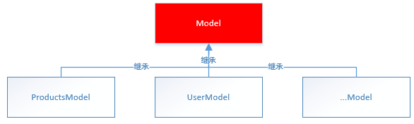
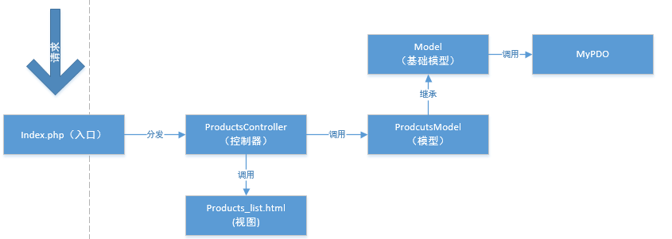
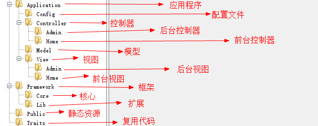
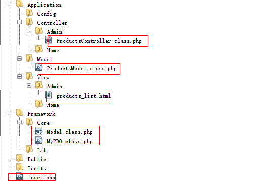
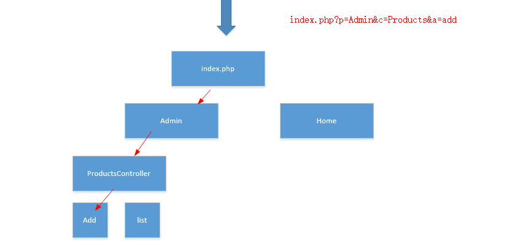
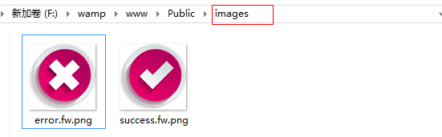

# MVC 概念

MVC是一个编程思想，是一种设计框架，其中

- M - 业务模型（model）
- V  - 用户界面（view）
- C  - 控制器 （controller）

使用MVC的目的是将M和V的实现代码分离，从而使同一个程序可以使用不同的表现形式。比如一批统计数据可以分别用柱状图、饼图来表示。C存在的目的则是确保M和V的同步，一旦M改变，V应该同步更新。

- V即View视图是指用户看到并与之交互的界面。比如由html元素组成的网页界面，或者软件的客户端界面。MVC的好处之一在于它能为应用程序处理很多不同的视图。在视图中其实没有真正的处理发生，它只是作为一种输出数据并允许用户操作的方式。
- M即model模型是指模型表示业务规则。在MVC的三个部件中，模型拥有最多的处理任务。被模型返回的数据是中立的，模型与数据格式无关，这样一个模型能为多个视图提供数据，由于应用于模型的代码只需写一次就可以被多个视图重用，所以减少了代码的重复性。
- C即controller控制器是指控制器接受用户的输入并调用模型和视图去完成用户的需求，控制器本身不输出任何东西和做任何处理。它只是接收请求并决定调用哪个模型构件去处理请求，然后再确定用哪个视图来显示返回的数据。


 


注意：只有控制器可以接受请求，而模型和视图是由控制器进行调用分配。


# MVC 示例

- 数据
- PDO 单例类
- 在站点创建 index.php


## 分析结构

原始单页面 index.php

~~~php
<?php

// 自动加载类（控制）
spl_autoload_register(function ($classname) {
    require strtolower($classname) . '.class.php';
});

// 连接数据库（控制）
$params = array(
    'pwd' => '',
    'dbname' => 'data'
);

// 获取数据（模型）
$db = PDOdb::getInstance($params);
$list = $db->fetchAll("SELECT * FROM t1");


?>
<!-- 视图 -->
<!DOCTYPE html>
<html lang="en">

<head>
    <meta charset="UTF-8">
    <meta http-equiv="X-UA-Compatible" content="IE=edge">
    <meta name="viewport" content="width=device-width, initial-scale=1.0">
    <title>Document</title>
</head>

<body>
    <table border='1' width='980' bordercolor="black">
        <tr>
            <th>编号</th>
            <th>用户名</th>
            <th>签名</th>
            <th>时间</th>
            <th>删除</th>
        </tr>
        <?php foreach ($list as $row) : ?>
            <tr>
                <td><?= $row['id'] ?></td>
                <td><?= $row['username'] ?></td>
                <td><?= $row['signature'] ?></td>
                <td><?= $row['ctime'] ?></td>
                <td><a href="#">删除</a></td>
            </tr>
        <?php endforeach; ?>
    </table>
</body>

</html>
~~~


- Controller 业务
  - 自动加载类
  - 连接数据库
- Model 业务
  - 获取数据
- View 视图
  - HTML 页面表格


## 分离视图

product_list.html

~~~php+HTML
<!DOCTYPE html>
<html lang="en">
  <head>
    <meta charset="UTF-8" />
    <meta http-equiv="X-UA-Compatible" content="IE=edge" />
    <meta name="viewport" content="width=device-width, initial-scale=1.0" />
    <title>Document</title>
  </head>

  <body>
    <table border="1" width="980" bordercolor="black">
      <tr>
        <th>编号</th>
        <th>用户名</th>
        <th>签名</th>
        <th>时间</th>
        <th>删除</th>
      </tr>
      <?php foreach ($list as $row) : ?>
      <tr>
        <td><?= $row['id'] ?></td>
        <td><?= $row['username'] ?></td>
        <td><?= $row['signature'] ?></td>
        <td><?= $row['ctime'] ?></td>
        <td><a href="#">删除</a></td>
      </tr>
      <?php endforeach; ?>
    </table>
  </body>
</html>

~~~


index.php 

加载 product_list.html 视图文件

~~~php
<?php

// 自动加载类
spl_autoload_register(function ($classname) {
    require strtolower($classname) . '.class.php';
});

// 连接数据库
$params = array(
    'pwd' => '',
    'dbname' => 'data'
);

// 获取数据
$db = MyPDO::getInstance($params);
$list = $db->fetchAll("SELECT * FROM t1");

// 加载视图文件
require "./product_list.html";
~~~


## 分离模型

模型的规则

1、一个表对应一个模型，表名和模型名一致（必须的）

2、模型以Model结尾（不是必须的）


代码实现:

在站点下创建 ProductsModel.class.php 页面

~~~php
<?php
//products模型用来操作products表
class ProductsModel {
	//获取products表的数据
	public function getList() {
		//连接数据库
		$param=array(
			'user'	=>	'root',
			'pwd'	=>	'root'
		);
		$mypdo= MyPDO::getInstance($param);
		//获取商品数据
		return $mypdo->fetchAll('select * from products');
	}
}
~~~


在 index.php 页面中调用模型的 getList()

```php
<?php
//自动加载类
spl_autoload_register(function($class_name){
	require "./{$class_name}.class.php";
});
//实例化模型
$model=new ProductsModel();
$list=$model->getList();
//加载视图
require './products_list.html';
```


## 基础模型（公用代码）

对于一些公用方法，我们可以创建一个父类，然后将公用方法写到父类中，子类就可以避免代码冗余。可以直接调用父类中的方法。


   

例：连接数据库的代码每个模型都要使用，所有我们需要将连接数据库的代码封装到基础模型类中（Model）

第一步：在站点下创建Model.class.php页面（基础模型）

```php
<?php
//基础模型
class Model {
	protected $mypdo;
	public function __construct() {
		$this->initMyPDO();
	}
	//连接数据库
	private function initMyPDO() {
		$param=array(
			'user'	=>	'root',
			'pwd'	=>	''
		);
		$this->mypdo= MyPDO::getInstance($param);
	}
}
```

第二步：ProductsModel继承基础模型类

```php
<?php
//products模型用来操作products表
class ProductsModel extends Model{
	//获取products表的数据
	public function getList() {
		return $this->mypdo->fetchAll('select * from products');
	}
}
```


## 分离控制器

控制器代码放在index.php页面中是不合理的，因为项目中的控制器会很多，而index.php只有一个。所以需要将控制器分离开来

控制器的规则：

1、一个模块对应一个控制器（必须的）

2、控制器以Controller结尾（不是必须的）

3、控制器中的方法以Action结尾（不是必须的）,目的防止方法名是PHP关键字

创建ProductsController.class.php

```php
<?php
//商品模块
class ProductsController {
	//获取商品列表
	public function listAction() {
		//实例化模型
		$model=new ProductsModel();
		$list=$model->getList();
		//加载视图
		require './products_list.html';
	}
}
```


通过在url地址上传递参数来寻址

c：控制器

a：方法


index.php页面

```php
<?php
//自动加载类
spl_autoload_register(function($class_name){
	require "./{$class_name}.class.php";
});
//确定路由
$c=$_GET['c']??'Products';   //控制器
$a=$_GET['a']??'list';		//方法
$c=ucfirst(strtolower($c));		//首字母大写
$a=strtolower($a);				//转成小写
$controller_name=$c.'Controller';	//拼接控制器类名
$action_name=$a.'Action';	//拼接方法名
//请求分发
$obj=new $controller_name();
$obj->$action_name();
```


注意：每次请求都要从index.php进入。所以index.php又叫入口文件。


MVC 结构示意图：


 


## 添加功能

只需要添加 入口、Model 和 Controller 即可

入口(products_list.html)

```html
<td><a href="index.php?c=Products&a=del&proid=<?=$rows['proID']?>" onclick="return confirm('确定要删除吗')">删除</a></td>
```


控制器（ProductsController）

```php
<?php
//商品模块
class ProductsController {
	..
	//删除商品
	public function delAction() {
		$id=(int)$_GET['proid'];	//如果参数明确是整数，要强制转成整形
		$model=new ProductsModel();
		if($model->del($id))
			header('location:index.php?c=Products&a=list');
		else {
			echo '删除失败';
			exit;
		}
	}
}

```


模型（ProductsModel）

```php
<?php
//products模型用来操作products表
class ProductsModel extends Model{
	...
	//删除商品
	public function del($proid) {
		return $this->mypdo->exec("delete from products where proid=$proid");
	}
}

```


# 框架目录

## 创建目录结构

  


## 文件分类存放

将上一讲的文件分类存放到不同的目录中

  


将文件存放到不同的目录以后，由于类文件地址发生了变化，所以无法完成自动加载类，那么今天的主要任务就是围绕如何实现类的自动加载展开。

由于每次都请求入口文件，所以”.“表示入口文件所在的目录


## 添加命名空间

通过文件目录地址做命名空间，这样获取了命名空间就能知道文件存放的地址。

Model.class.php

```php
namespace Core;
class Model {
    ...
```

MyPDO.class.php

```php
namespace Core;
class MyPDO{
    ...
```

ProductsModel.class.php

```php
<?php
namespace Model;
//products模型用来操作products表
class ProductsModel extends Model{
    ...
```

ProductsController.class.php

```php
<?php
namespace Controller\Admin;
//商品模块
class ProductsController {
    ...
```


## 框架类实现

### 定义路径常量

由于文件路径使用频率很高，而且路径比较长，所以将固定不变的路径定义成路径常量

知识点

```php
1、getcwd()：入口文件的绝对路径
2、windows下默认的目录分隔符是`\`，Linux下默认的目录分隔符是`/`。DIRECTORY_SEPARATOR常量根据不同的操作系统返回不同的目录分隔符。
```

代码实现

在Core文件夹下创建Framework.class.php

```php
private static function initConst(){
    define('DS', DIRECTORY_SEPARATOR);  //定义目录分隔符
    define('ROOT_PATH', getcwd().DS);  //入口文件所在的目录
    define('APP_PATH', ROOT_PATH.'Application'.DS);   //application目录
    define('CONFIG_PATH', APP_PATH.'Config'.DS);
    define('CONTROLLER_PATH', APP_PATH.'Controller'.DS);
    define('MODEL_PATH', APP_PATH.'Model'.DS);
    define('VIEW_PATH', APP_PATH.'View'.DS);
    define('FRAMEWORK_PATH', ROOT_PATH.'Framework'.DS);
    define('CORE_PATH', FRAMEWORK_PATH.'Core'.DS);
    define('LIB_PATH', FRAMEWORK_PATH.'Lib'.DS);
    define('TRAITS_PATH', ROOT_PATH.'Traits'.DS);
}
```


### 引入配置文件

1、在config目录下创建config.php

```php
<?php
return array(
    //数据库配置
    'database'=>array(),
    //应用程序配置
    'app'       =>array(
        'dp'    =>  'Admin',        //默认平台
        'dc'    =>  'Products',     //默认控制器
        'da'    =>  'list'          //默认方法
    ),
);
```

2、在框架类中引入配置文件

```php
private static function initConfig(){
   $GLOBALS['config']=require CONFIG_PATH.'config.php';
}
```

思考：配置文件为什么不保存在常量中？

答：因为7.0之前，常量不能保存数组和对象。


### 确定路由

p：【platform】平台

c：【controller】控制器

a：【action】方法

  

```php
private static function initRoutes(){
    $p=$_GET['p']??$GLOBALS['config']['app']['dp'];
    $c=$_GET['c']??$GLOBALS['config']['app']['dc'];
    $a=$_GET['a']??$GLOBALS['config']['app']['da'];
    $p=ucfirst(strtolower($p));
    $c=ucfirst(strtolower($c));		//首字母大写
    $a=strtolower($a);			//转成小写
    define('PLATFROM_NAME', $p);    //平台名常量
    define('CONTROLLER_NAME', $c);  //控制器名常量
    define('ACTION_NAME', $a);      //方法名常量
    define('__URL__', CONTROLLER_PATH.$p.DS);   //当前请求控制器的目录地址
    define('__VIEW__',VIEW_PATH.$p.DS);     //当前视图的目录地址
}
```

### 自动加载类

```php
private static function initAutoLoad(){
    spl_autoload_register(function($class_name){
        $namespace= dirname($class_name);   //命名空间
        $class_name= basename($class_name); //类名
        if(in_array($namespace, array('Core','Lib')))   //命名空间在Core和Lib下
            $path= FRAMEWORK_PATH.$namespace.DS.$class_name.'.class.php';
        elseif($namespace=='Model')     //文件在Model下
            $path=MODEL_PATH.$class_name.'.class.php';
        elseif($namespace=='Traits')    //文件在Traits下
            $path=TRAITS_PATH.$class_name.'.class.php';
        else   //控制器
            $path=CONTROLLER_PATH.PLATFROM_NAME.DS.$class_name.'.class.php'; 
        if(file_exists($path) && is_file($path))
            require $path;
    });
}
```

### 请求分发

```php
private static function initDispatch(){
    $controller_name='\Controller\\'.PLATFROM_NAME.'\\'.CONTROLLER_NAME.'Controller';	//拼接控制器类名
    $action_name=ACTION_NAME.'Action';	//拼接方法名
    $obj=new $controller_name();
    $obj->$action_name();
} 
```

### 封装run()方法

```php
class Framework{
    //启动框架
    public static function run(){
        self::initConst();
        self::initConfig();
        self::initRoutes();
        self::initAutoLoad();
        self::initDispatch();
    }
    ...
```


### 在入口中调用run()方法

```php
<?php
require './Framework/Core/Framework.class.php';
Framework::run();
```

run()方法调用后就启动了框架。


## 运行项目

1、连接数据库的参数从配置文件中获取

 ```php
class Model {
	...
	//连接数据库
	private function initMyPDO() {
       $this->mypdo= MyPDO::getInstance($GLOBALS['config']['database']);
	}
}
 ```

2、更改ProductsControleller控制器

```php
<?php
namespace Controller\Admin;
//商品模块
class ProductsController {
	//获取商品列表
	public function listAction() {
            //实例化模型
            $model=new \Model\ProductsModel();
            $list=$model->getList();
            //加载视图
            require __VIEW__.'products_list.html';
	}
	//删除商品
	public function delAction() {
		...
		$model=new \Model\ProductsModel();
		...
	}
}
```

3、更改ProductsModel类

```php
<?php
namespace Model;
class ProductsModel extends \Core\Model{
	
}
```

4、更改MyPDO类

```php
...
private function fetchType($type){
    switch ($type){
        case 'num':
            return \PDO::FETCH_NUM;
        case 'both':
            return \PDO::FETCH_BOTH;
        case 'obj':
            return \PDO::FETCH_OBJ;
        default:
             return \PDO::FETCH_ASSOC;
    }
}
...
//所有的内置类都在公共的命名空间下。
```

测试：成功


## traits代码复用

有的控制器操作完毕后要跳转，有的不需要，

解决：将跳转的方法封装到traits中。

 代码实现

1、将准备好的图片拷贝到Public目录下

  

2、在Traits目录中创建Jump.class.php

```php
<?php
//跳转的插件
namespace Traits;
trait Jump{
    //封装成功的跳转
    public function success($url,$info='',$time=1){
        $this->redirect($url, $info, $time, 'success');
    }
    //封装失败跳转
    public function error($url,$info='',$time=3){
        $this->redirect($url, $info, $time, 'error');
    }
    /*
     * 作用：跳转的方法
     * @param $url string 跳转的地址
     * @param $info string 显示信息
     * @param $time int 停留时间
     * @param $flag string 显示模式  success|error
     */
    private function redirect($url,$info,$time,$flag){
        if($info=='')
            header ("location:{$url}");
        else{
          echo <<<str
<!DOCTYPE html>
<html lang="en">
<head>
	<meta charset="UTF-8">
    <!--
    <meta http-equiv="refresh" content="3;http://www.php.com"/>
    -->
	<title>Document</title>
<style>
body{
	text-align: center;
	font-family: '微软雅黑';
	font-size: 18px;
}
#success,#error{
	font-size: 36px;
	margin: 10px auto;
}
#success{
	color: #090;
}
#error{
	color: #F00;
}
</style>
</head>
<body>
	
	<div id='{$flag}'>{$info}</div>
	<div><span id='t'>{$time}</span>秒以后跳转</div>
</body>
</html>
<script>
window.onload=function(){
	var t={$time};
	setInterval(function(){
		document.getElementById('t').innerHTML=--t;
		if(t==0)
			location.href='index.php';
	},1000)
}
</script>
str;
        exit;
        }
    }
}
```

在ProductsController控制器中使用原型

```php
namespace Controller\Admin;
//商品模块
class ProductsController{
    use \Traits\Jump;   //复用代码
    ...
```


## 删除功能

入口

```html
<a href="index.php?p=Admin&c=Products&a=del&proid=<?=$rows['proID']?>" onclick="return confirm('确定要删除吗')">删除</a>
```

控制器（ProductsController）

 ```php
public function delAction() {
    $id=(int)$_GET['proid'];	//如果参数明确是整数，要强制转成整形
    $model=new \Model\ProductsModel();
    if($model->del($id))
        $this->success('index.php?p=Admin&c=Products&a=list', '删除成功');
    else 
        $this->error('index.php?p=admin&c=Products&a=list', '删除失败');
}
 ```

模型、视图

```
无改变
```

