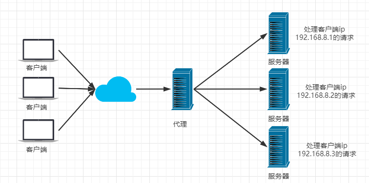

# Nginx 简介

## 1. 什么是 Nginx？

Nginx (engine x) 是一个高性能的HTTP和反向代理web服务器，同时也提供了IMAP/POP3/SMTP服务。Nginx是由伊戈尔·赛索耶夫为俄罗斯访问量第二的Rambler.ru站点（俄文：Рамблер）开发的，第一个公开版本0.1.0发布于2004年10月4日。2011年6月1日，nginx 1.0.4发布。

其特点是占有内存少，并发能力强，事实上nginx的并发能力在同类型的网页服务器中表现较好，中国大陆使用nginx网站用户有：百度、京东、新浪、网易、腾讯、淘宝等。在全球活跃的网站中有12.18%的使用比率，大约为2220万个网站。

Nginx 是一个安装非常的简单、配置文件非常简洁（还能够支持perl语法）、Bug非常少的服务。Nginx 启动特别容易，并且几乎可以做到7*24不间断运行，即使运行数个月也不需要重新启动。你还能够不间断服务的情况下进行软件版本的升级。

Nginx代码完全用C语言从头写成。官方数据测试表明能够支持高达 50,000 个并发连接数的响应。

## 2. Nginx 作用

Http代理，反向代理：作为web服务器最常用的功能之一，尤其是反向代理。

正向代理

用户通过 VPN 代理访问网站

反向代理

用户访问中间件，中间件自动分配服务器

Nginx提供的负载均衡策略有2种：内置策略和扩展策略。

- 内置策略为轮询，加权轮询，Ip hash。
- 扩展策略，就天马行空，只有你想不到的没有他做不到的。

轮询

加权轮询

iphash对客户端请求的ip进行hash操作，然后根据hash结果将同一个客户端ip的请求分发给同一台服务器进行处理，可以解决session不共享的问题。

动静分离，在我们的软件开发中，有些请求是需要后台处理的，有些请求是不需要经过后台处理的（如：css、html、jpg、js等等文件），这些不需要经过后台处理的文件称为静态文件。让动态网站里的动态网页根据一定规则把不变的资源和经常变的资源区分开来，动静资源做好了拆分以后，我们就可以根据静态资源的特点将其做缓存操作。提高资源响应的速度。

# Nginx 安装

## 1. 安装 gcc

安装 nginx 需要先将官网下载的源码进行编译，编译依赖 gcc 环境，如果没有 gcc 环境，则需要安装：

~~~shell
yum install gcc-c++
~~~

## 2. PCRE pcre-devel 安装

PCRE(Perl Compatible Regular Expressions) 是一个Perl库，包括 perl 兼容的正则表达式库。nginx 的 http 模块使用 pcre 来解析正则表达式，所以需要在 linux 上安装 pcre 库，pcre-devel 是使用 pcre 开发的一个二次开发库。nginx也需要此库。命令：

~~~
yum install -y pcre pcre-devel
~~~

## 3. zlib 安装

zlib 库提供了很多种压缩和解压缩的方式， nginx 使用 zlib 对 http 包的内容进行 gzip ，所以需要在 Centos 上安装 zlib 库。

~~~
yum install -y zlib zlib-devel
~~~

## 4. OpenSSL 安装

OpenSSL 是一个强大的安全套接字层密码库，囊括主要的密码算法、常用的密钥和证书封装管理功能及 SSL 协议，并提供丰富的应用程序供测试或其它目的使用。nginx 不仅支持 http 协议，还支持 https（即在ssl协议上传输http），所以需要在 Centos 安装 OpenSSL 库。

~~~
yum install -y openssl openssl-devel
~~~

## 5. 下载安装包

手动下载.tar.gz安装包，地址：https://nginx.org/en/download.html

下载完毕上传到服务器上 /root

## 6. 解压

~~~
tar -zxvf nginx-1.18.0.tar.gz
cd nginx-1.18.0
~~~

## 7. 配置

使用默认配置，在nginx根目录下执行

~~~
./configure
make
make install
~~~

> 查找安装路径： `whereis nginx`

## 8. Nginx 常用命令

~~~
cd /usr/local/nginx/sbin/
./nginx  启动
./nginx -s stop  停止
./nginx -s quit  安全退出
./nginx -s reload  重新加载配置文件
ps aux|grep nginx  查看nginx进程
~~~

注意：如何连接不上，检查阿里云安全组是否开放端口，或者服务器防火墙是否开放端口！
相关命令：

~~~
# 开启
service firewalld start
# 重启
service firewalld restart
# 关闭
service firewalld stop
# 查看防火墙规则
firewall-cmd --list-all
# 查询端口是否开放
firewall-cmd --query-port=8080/tcp
# 开放80端口
firewall-cmd --permanent --add-port=80/tcp
# 移除端口
firewall-cmd --permanent --remove-port=8080/tcp
#重启防火墙(修改配置后要重启防火墙)
firewall-cmd --reload
# 参数解释
1、firwall-cmd：是Linux提供的操作firewall的一个工具；
2、--permanent：表示设置为持久；
3、--add-port：标识添加的端口；
~~~

# 负载均衡

## 1. 轮询，加权轮询

~~~
upstream lb{
    server 127.0.0.1:8080 weight=1;
    server 127.0.0.1:8081 weight=1;
}
location / {
    proxy_pass http://lb;
}
~~~

