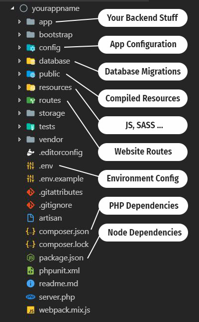
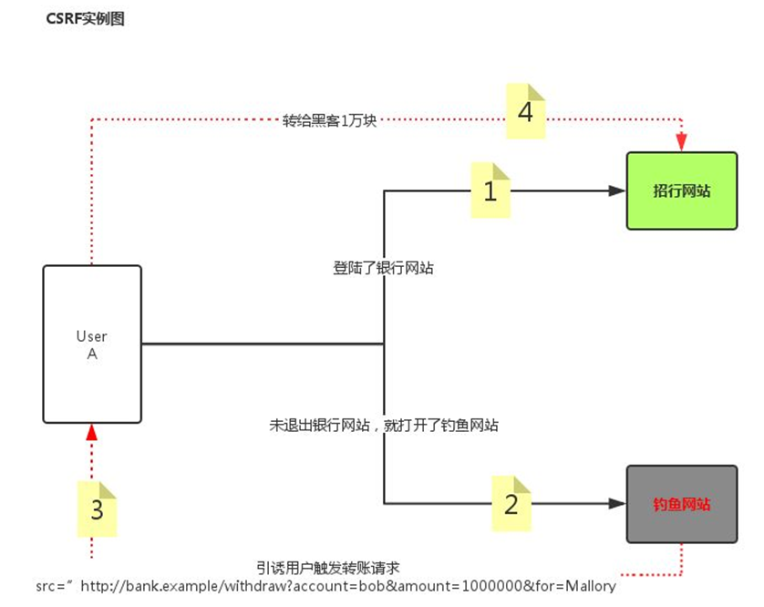

# Laravel 简介

## 1. 简介

Laravel是一套简洁、优雅的PHP WEB开发框架（PHP Web Framework），具有富于表达性且简洁的语法，Laravel是易于理解且强大的，它提供了强大的工具用以开发大型，健壮的应用，例如具有自动验证、路由、Session、缓存、数据库迁移工具、单元测试等常用的工具和功能。


官网：https://laravel.com/
中文官网：http://www.golaravel.com/
中文社区：https://laravel-china.org/


目前大部分的框架公共的特点（了解）：

- 单入口，所有的请求必须从单入口开始，主要是便于管理（统一的参数过滤）

- MVC的思想（分层思想，主要是为了协同开发，实现后期的维护方便）

- ORM操作数据库（Object Relations Model，关联模型）：AR模式

注意：Laravel框架有一个特点，所有的URL访问都必须事先定好路由规则。


## 2. 开发环境配置与要求

Laravel框架的运行对环境是有严格要求的，php.ini 需要开启

```
extension=php_openssl.dll
extension=php_pdo_mysql.dll
extension=php_mbstring.dll
extension=php_fileinfo.dll（验证码代码依赖需要该扩展）
extension=php_curl.dll（主要用于请求的发送）
```


httpd.conf配置文件需要开启的模块:

```
LoadModule deflate_module modules/mod_deflate.so
LoadModule rewrite_module modules/mod_rewrite.so
```


## 3. PHP的注意事项

- 将 php.exe 添加到环境变量
- 命令行 php -v 显示版本需要和 WAMP 的 PHP 版本一致


## 4. Composer 安装

composer是PHP中用来管理依赖（dependency）关系的工具，你可以在自己的项目中声明所依赖的外部工具库（libraries）,composer会帮您安装这些依赖的库文件。简单来说 composer是一个工具，是为php项目准备的软件管家。


官方网站：https://getcomposer.org
下载地址：https://getcomposer.org/download/


注意前提条件：

- 开启PHP中openssl扩展
- 安装composer需要明确php.exe的文件路径
- 安装 composer需要联网


安装完成后，进入到命令提示符（cmd）,运行“composer”，如果没有报错，则安装完成。如果没有成功，查看下环境变量：

~~~
C:\ProgramData\ComposerSetup\bin
~~~


配置镜像源

```
composer config -g repo.packagist composer https://mirrors.aliyun.com/composer/
```


安装 Laravel

```
composer create-project  laravel/laravel  --prefer-dist  ./laravel
```

- composer：表示需要执行composer

- create-project：表示需要通过composer创建一个项目

- laravel/laravel：创建一个Laravel项目

- --prefer-dist：表示强制使用压缩包方式下载（省时间）

- ./或者其他名称：表示项目需要创建的路径【**在创建项目的时候一定要确保路径目录为空**】

> 运行composer的时候需要注意，在什么地方运行（命令行的当前工作路径）composer则就会在什么地方创建项目。


如果要下载其他版本，比如5.4版本中最新版本号（用*表示），可以使用这个命令

```
composer create-project laravel/laravel=5.4.* --prefer-dist ./laravel5.4
```


## 5. Laravel 架构




app目录：项目的核心目录，主要用于存放核心代码，也包括控制器、模型、中间件。

```
app
|---- Console
|---- Exception
|---- Http								// 控制器
	  |---- Controller					// 控制器目录
	  |---- |---- Controller.php		// 控制器基类
	  |---- MiddlerWare					// 中间件目录
	  |---- Kernel.php					// 框架核心文件
|---- Models							// 模型文件
|---- Provodiers
```


bootstrap 目录，Laravel 启动目录

config目录，项目的配置目录，主要存放配置文件，比如数据库的配置

```
tree
|---- app.php					全局配置文件
|---- auth.php					用户登录时候需要用到的用户认证模块的配置文件
|---- broadcasting.php		
|---- cache.php				
|---- cors.php			
|---- database.php				数据库的配置文件
|---- filesystems.php			文件系统（如文件存储等）的配置文件
|---- hashing.php		
|---- logging.php		
|---- mail.php		
|---- queue.php			
|---- services.php			
|---- session.php			
|---- view.php			
```


database 目录，数据迁移目录

```
database
|---- factories					存放一些工厂模式需要用的一些文件
|---- migrations				迁移，存放的是迁移文件（创建/删除/修改数据表操作的类文件）
|---- seeders					播种、种子，存放的是种子（填充器）文件（模拟向数据表中写入数据的操作类
```


public 目录，项目的入口文件和系统的静态资源目录（css,img,js,uploads）

- 后期的网站的根目录
- 外部静态文件（js、css、图片等）都需要放到Public目录下

```
public
|---- .htaccess
|---- favicon.ico
|---- index.php
|---- robots.txt
|---- web.config
```


resources目录，存放视图文件，还有就是语言包文件的目录

```
resources
|---- css
|---- js
|---- lang						存放语言包文件
|---- views						视图文件目录
```


routes目录，是定义路由的目录

```
routes
|---- api.php
|---- channels.php
|---- console.php
|---- web.php					定义路由的文件
```


storage目录，主要是存放缓存文件和日志文件

**注意**：如果在linux环境下，该目录需要有可写权限。（后期用户上传文件如果存在本地则也在storage下）

~~~
storage
|---- app						保存用户上传文件
|---- framework					框架自带文件存储目录
|---- logs						框架日志文件存储位置
~~~


vendor 目录，主要是存放第三方的类库文件，laravel思想主要是共同的开发，不要重复的造轮子（例如，里面可能存在验证码类，上传类，邮件类），该目录还存放laravel框架的源码。注意如果要使用composer软件管理的，composer下载的类库都是存放在该目录下面的。


env文件：主要是设置一些系统相关的环境配置文件信息。config目录里面的文件配置内容一般都是读取该文件里面的配置信息（config里面的配置项的值基本都是来自.env文件）。


artisan脚手架文件，主要用于生成的代码的（自动生成），比如生成控制器，模型文件等。

```
php artisan 需要执行的指令
```

- 要求1：php必须添加环境变量，并且保证版本；
- 要求2：artisan必须存在命令行当前的工作路径下；


composer.json依赖包配置文件，声明当前需要的软件依赖，但是不能删除，composer需要使用。


## 6. 启动方式

### 6.1 方式一

Laravel框架提供了更简单的方式启动项目，直接用脚手架工具启动

```
php artisan serve
```


**不推荐使用：**

- 能够跑php代码，但是不启动数据库。
- 该方式启动后，如果修改了项目的配置.env的话，则需要重新启动才会生效。
- 如果使用命令行方式进行启动，则如果想继续访问页面，需要命令行不能关闭


### 6.2 方式二

使用 wamp 或 lamp环境（常见）

- 配置虚拟主机（绑定到 public 目录）
- 修改 hosts
- 重启服务


# 路由

什么是路由：将用户的请求按照事先规划的方案提交给指定的控制器或者功能函数来进行处理。【通俗的讲，路由就是访问地址形式】

在博客中，当我们在URL地址中，传递p（平台）、c（控制器）、a（方法）三个参数时，系统会自动跳转到指定模型中指定控制器的指定方法，这些处理过程都是由框架自动完成的。但是，在Laravel框架中，其并没有指定固定参数，其路由必须要手工进行配置。


## 1. 根路由

路由文件在routes/web.php

~~~php
<?php
use Illuminate\Support\Facades\Route;

Route::get('/', function () {
    return view('welcome');
});

~~~


我们在浏览器中访问本地 Laravel 网站虚拟域名时，会显示内容的原因就是因为我们定义了根路由，在 route/web.php 中，`/` 代表着根路径，也就是网站的入口首页。返回视图页面 welcome，这个welcome 页面位置在 resources/views/welcome.blade.php


## 2. 定义路由格式

```
Route::请求方式（'请求的URL', 匿名函数或控制器响应的方法）
```


比如请求 /home 这个 url：

~~~php
Route::get('/home',function() {
    return 'hello home';
});
~~~

> 当访问 laravel.net/home 则会返回我们定义的字符串 hello home


注意：路由地址中的第一个“/”可以不写（包括“根路由”）。

如果还有更多的路由需要去定义，则仿照上述的形式语法继续编写即可。但是只要需要访问，则必须需要定义路由。


## 3. 路由请求方式

```
Route::get($uri, $callback);
Route::post($uri, $callback);
Route::put($uri, $callback);
Route::delete($uri, $callback);
Route::patch($uri, $callback);
Route::options($uri, $callback);
```


如果一个页面需要 Get 也需要 Post 请求的话，那么可以使用 match 或 any

```php
// 同时支持 Get 或 Post 请求
Route::match(['get','post'],'/home', function (){
    return 'hello home';
});

// 支持所有模式
Route::any('/home', function (){
    return 'hello home';
});
```

> 建议不要用 any，需要什么就指定什么


如果路由方法与实际的请求类型不一致，则会抛出异常，报错


## 4. 路由参数

路由参数其实就是给路由传递参数，参数分为必选参数和可选参数。

~~~php
Route::get('/read/{id}', function ($id) {
    return $id;
});
~~~


可选参数就是给参数加上默认值，前边路由请求地址对应变量需要加上 `?`

~~~php
Route::get('/read/{id?}', function ($id = 0) {
    return $id;
});
~~~


传递多个参数

~~~php
Route::get('/read/{id}/{name}', function ($id,$name) {
    return $id.':'.$name;
});
~~~


路由参数还支持传统的路由参数传递，如 `url?id=xxx&aaa=xxxx` ，这种方式传递参数不受路由的限制的，不需要在路由文件中事先定义好路由参数（不建议，因为没有对 $_GET 进行过滤，不知道是否数据是安全数据）

~~~php
Route::get('/read1', function () {
    return $_GET['id'];
});
~~~

> 访问 URL 传递参数 `http://lara.net/read1?id=10`


设定默认值

~~~php
Route::get('/read1', function () {
   	// return $_GET['id'] ? $_GET['id'] : 999;
    return $_GET['id'] ?? 999;
});
~~~


## 5. 路由别名 alias

路由别名相当于在路由定义的时候，为路由起了一个别名，在模板中使用别名，方便以后路由改变，而不用大幅度更改代码。


起别名的方法可以直接用对象方法的形式， `->name('别名')`

```
Route::请求类型(路由地址,响应方法) -> name(别名);
```


比如 URL 为 article/novel/fiction/ 这样的一个路由，就可以给它起一个 fiction 的别名：

~~~php
Route::get('article/novel/fiction', function () {
    return '别名';
})->name('fiction');
~~~


之后在视图中调用的时候就可以直接使用别名来调用

~~~html
<a href='{{route('fiction')}}'>xxxx</a>
~~~


## 6. artisan 查看路由

```
php artisan route:list
```


会列出所有路由以及别名

```
+--------+---------------+-----------------------+---------+---------+------------+
| Domain | Method        | URI                   | Name    | Action  | Middleware |
+--------+---------------+-----------------------+---------+---------+------------+
|        | GET|HEAD      | /                     |         | Closure | web        |
|        | GET|HEAD      | api/user              |         | Closure | api        |
|        |               |                       |         |         | auth:api   |
|        | GET|HEAD      | article/novel/fiction | fiction | Closure | web        |
|        | GET|POST|HEAD | home                  |         | Closure | web        |
|        | GET|HEAD      | read/{id?}            |         | Closure | web        |
|        | GET|HEAD      | read/{id}/{name}      |         | Closure | web        |
+--------+---------------+-----------------------+---------+---------+------------+
```


## 7. 路由群组

路由群组就是把一些有公共特征的路由，放在一个路由群组中，类似于对路由进行分类，方便进行管理，如：

~~~
/admin/login
/admin/logout
/admin/index
/admin/user/add
/admin/user/delete
~~~

> 他们的共同点（这个共同点不局限于只是前缀）是，都有/admin/前缀，为了管理方便，可以把他们放到一个路由分组中，这个分组称之为路由群组。


使用prefix属性指定路由前缀，也就是其路由中都具备的相同部分。语法：

~~~
Route::group(公共属性数组,回调函数);
~~~

> 回调函数中放的剔除公共属性之后的路由


比如，想要为所有路由URLs前面添加前缀 admin

~~~php
Route::group(['prefix'=>'admin'],function(){
    // 匹配 /admin/login 
   Route::get('login',function(){
       return '/admin/login';
   });
   Route::get('logout',function(){
       return '/admin/logout';
   });
   Route::get('user/add',function(){
       return '/admin/user/add';
   });
});
~~~


使用路由群组，不会改变路由 URL 地址，只是在定义中将路由进行分类统一处理。


# 控制器

控制器主要的作用主要负责接收用户输入请求，调度模型处理数据最后利用视图展示数据。


## 1. 控制器位置

其位置位于app/Http/Controllers


## 2. 控制器文件命名方式

文件的命名方式：大驼峰+Controller.php，如：

~~~
LoginController.php
RegisterController.php
ForgotPasswordController.php
~~~


## 3. 结构代码

~~~php
<?php

// 命名空间
namespace App\Http\Controllers;

// 请求类
use Illuminate\Http\Request;

// 继承基类（由于是在同一目录下，则不需要引入）
class TestController extends Controller
{
    //
}
~~~


如果是多模块，在 Controllers 中其他目录下的控制器，需要引入基类

~~~php
use App\Http\Controllers\Controller;
~~~


## 4. 创建控制器

使用 artisan 命令可以方便快捷的创建控制器，并且自动写好命名空间与类的引用

~~~
php artisan make:controller 控制器名
~~~


如：

~~~shell
php artisan make:controller TestController
php artisan make:controller Admin\TestController
~~~


## 5. 控制器路由

控制器路由就是使用路由规则调用控制器下的方法，而不再走回调函数。路由设置格式基本相同，只是将匿名函数换成 `控制器类名@方法名`定义格式如下：

~~~php
Route::请求方法('路由表达式','控制器@方法名');
~~~


例：

~~~php
// 5.4 版本
Route::get('/home','TestController\@index');
Route::get('/home','Admin\TestController\@index');

// 8.5 版本
use App\Http\Controllers\TestController;					// 需要引入命名空间
Route::get('/home',[TestController::class, 'test1']);

// 或者完整引入命名空间
Route::get('/home',[App\Http\Controllers\TestController::class, 'test1']);
Route::get('/home',[App\Http\Controllers\Admin\TestController::class, 'test1']);
~~~


## 6. 接受用户请求

接受用户请求，需要使用到 Laravel 内置的一个类 `Illuminate\Support\Facades\Input` 

Facades 门面思想，介于一个类的实例化与没有实例化中间的一个状态。其实是类的一个接口实现。在这个状态下可以不实例化类但是可以调用类中的方法。说白了就是静态方法的调用。

~~~
Input::get(‘参数的名字’, ‘如果参数没有被传递使用该默认值’)    	// 类似php里三元运算符
Input::all() 											// 获取所有的用户的输入
Input::get('参数的名字')									 // 获取指定单个参数
Input::only([ ‘id’,’age’]) 								// 获取指定几个用户的输入
Input::except([ ‘id’,’age’])							// 获取指定几个用户的输入以外的所有的参数
Input::has('name')										// 判断某个输入的参数是否存在
~~~

> 上述方法既可以获取get中的信息，也可以获取post中信息。


在laravel中如果需要使用facades的话，需要引入类

~~~php
Use Illuminate\Support\Facades\Input
~~~


例：

~~~php
<?php

namespace App\Http\Controllers;

use Illuminate\Http\Request;
use Illuminate\Support\Facades\Input;

class TestController extends Controller
{
    public function test1(){
        dump(Input::all());
    }
}

~~~


可以在config/app.php中定义长串的别名（在aliases数组中定义别名）：

```
'Input' => Illuminate\Support\Facades\Input::class,
```


之后就可以使用别名引入

~~~php
use Input
~~~


使用 `dd` 测试请求数据，dd 即 dump + die

~~~php
dd(Input::get('id','默认参数'));
~~~

> 适合断点调试，后续代码不会执行


# DB 类操作数据库

按照MVC 的架构，对数据的操作应该放在 Model 中完成，但如果不使用Model，我们也可以用 laravel框架提供的 DB 类操作数据库。而且，对于某些极其复杂的sql，用Model 已经很难完成，需要开发者自己手写sql语句，使用 DB 类去执行原生sql。


laravel 中 DB 类的基本用法

~~~php
DB::table('tableName')
~~~

> 获取操作tableName表的实例，返回的是对象


## 1. 数据库连接配置

数据库配置文件在 `.env` 文件中，

```
DB_CONNECTION=mysql
DB_HOST=127.0.0.1
DB_PORT=3306
DB_DATABASE=homestead
DB_USERNAME=homestead
DB_PASSWORD=secret
```


也可以在config目录下面的database.php文件里面配置。使用env函数，表示先从env文件里面获取，如果获取成功则使用，如果获取失败，则使用env函数的第二个参数。

~~~php
'mysql' => [
    'driver' => 'mysql',
    // 默认读取 env 文件，失败则使用第二参数
    'host' => env('DB_HOST', '127.0.0.1'),
    'port' => env('DB_PORT', '3306'),
    'database' => env('DB_DATABASE', 'forge'),
    'username' => env('DB_USERNAME', 'forge'),
    'password' => env('DB_PASSWORD', ''),
    'unix_socket' => env('DB_SOCKET', ''),
    'charset' => 'utf8mb4',
    'collation' => 'utf8mb4_unicode_ci',
    'prefix' => '',
    'strict' => true,
    'engine' => null,
],
~~~


> 注意：如果是php artisan serve方式启动的，修改了配置文件，则需要重新启动，才能读取修改后的配置文件；如果是wamp/lamp等环境则不需要重启。


## 2. 查询数据库

使用 artisan 创建一个数据库 Controller

~~~php
php artisan make:controller DbController
~~~


然后在 DbController.php 中引入 DB 类

~~~php
use DB;
~~~


可以直接引用 DB 的原因是因为在 config/app.php 中已经定义了 DB 别名

~~~php
'DB' => Illuminate\Support\Facades\DB::class,
~~~


编写查询方法

~~~php
<?php

namespace App\Http\Controllers;

use Illuminate\Http\Request;
use DB;

class DbController extends Controller {
    public function select() {
        // 查询 tpshop_user 表中的所有数据
        // SQL 语句： SELECT * FROM tpshop_user;
        return DB::table('tpshop_user')->get();
    }
}

~~~

> get() 方法可以查看表中内容


返回值为取出的数据，以对象形式呈现（不是数组）

~~~json
[
    {
        "id": 2,
        "username": "zhangsan",
        "password": "88888888"
    },
    {
        "id": 3,
        "username": "zhangsan",
        "password": "88888888"
    },
    {
        "id": 4,
        "username": "lisi",
        "password": "88888888"
    },
    {
        "id": 5,
        "username": "wangwu",
        "password": "88888888"
    }
]
~~~


然后在 route/web.php 中定义路由

~~~php
Route::get('/select', 'DbController@select');
~~~


然后访问定义的路由地址即可：

```
http://127.0.0.1:8000/select
```


## 3. 添加信息

web.php 定义路由

~~~php
Route::get('/select', 'DbController@insert');
~~~


对数据库中的某个表增加数据主要有两个函数可以实现，分别是insert()和insertGetId()

- insert(数组)可以同时添加一条或多条，返回值是布尔类型，表示是否执行成功
- insertGetId(一维数组)，只能添加一条数据，返回自增的id。


insert 方法，添加多条数据

~~~php
public function add() {
    DB::table('user')->insert([
        [
            'username' => 'zhangsan',
            'password' => '123456'
        ],
        [
            'username' => 'lisi',
            'password' => '654321'
        ]
    ]);
}
~~~


insertGetId() 添加单条数据

~~~php
public function add() {
    DB::table('user')->insertGetId(
        [
            'username' => 'wangwu',
            'password' => '123456'
        ]
    );
}
~~~


## 4. 修改数据

数据修改可以使用 update()、increment() 和 decrement() 方法来实现。

- update 方法表示可以修改整个记录中的全部字段；
- increment 和 decrement 表示修改数字字段的数值（递增或者递减），典型的应用：记录登录次数、积分的增加；


使用 where() 方法定位数据位置，然后进行修改，如：

~~~php
public function edit() {
    DB::table('user')->where('id', '1')->update([
        'username' => '张三'
    ]);
}
~~~


where 方法之后可以继续调用 where 之类的方法，如：

~~~
-> where() -> where() -> where()..			这个语法是并且（and）关系语法。
-> where() -> orWhere() -> orWhere()…		这个语法是或者（or）关系语法。
~~~


where参数顺序：

```
-> where(字段名,运算符,字段值)
```

例如 id=1，则可以写成：`where('id', '=', 1)`，可以简写成 `where('id', 1)`【只有=号可以简写】


update 操作的返回值，表示受到影响的行数，如：

~~~php
public function edit() {
    $res = DB::table('user')->where('id', '>', '1')->update([
        'password' => '88888888'
    ]);
    // 返回受影响行数
    dump($res);
}
~~~


increment 每次访问自增数据，如：

~~~php
DB::table('user')->where('id', '1')->increment('score');			// 每次字段值 + 1
DB::table('user')->where('id', '1')->increment('score', 5);			// 每次字段值 + 5
~~~


## 5. 删除数据

数据删除可以通过 delete 函数和 truncate 函数实现，

- delete表示删除记录；返回值为受影响记录行数
- truncate表示清空整个数据表；


~~~php
// 删除 id=1 的记录
DB::table('user')->where('id','1')->delete();

// 清空数据，保留表结构
DB::table('user') -> truncate();
~~~


## 6. 查询数据

遍历 get() 获取的数据集

~~~php
public function select() {
    $data = DB::table('user')->get();
    foreach ($data as $key => $value) {
        echo $value->id . ' ' . $value->username . ' ' . $value->password.'<br/>';
    }
}
~~~


get() 方法也可以利用 where 取出指定数据

~~~php
public function select() {
    return DB::table('user')->where('id', '2')->get();
}
~~~


取出 gender = '男'，age > 18 的数据

~~~php
DB::table('user')->where('gender', '男')->where('age','>','18')->get();
~~~


取出单行数据

~~~php
DB::table('member')->where('id','1')->first()
~~~

> 等价于 limit 1


- get 一般用于列表展示数据
- first 一般用于表单验证、详情页面、修改功能等等


获取某个具体的值（一个字段）

~~~php
DB::table('member')->where('id','1')->value('username');
~~~


获取某些字段数据（多个字段）

~~~php
$users = DB::table('member')->select('name', 'email')->get();
$users = DB::table('member')->select('name as user_name')->get();

// 不解析，原生输出（直接将 raw 数据拼接到 select
$data = DB::table('user')->select(DB::raw('username, password'))->get();
~~~


排序操作

~~~php
DB::table('member')->orderBy('age','desc')->get();
~~~


分页操作

~~~php
DB::table('member')->limit(3)->offset(2)->get();
~~~

- Limit：表示限制输出的条数
- Offset：从什么地方开始
- 组合起来等价于limit 5,5


## 7. 执行原生 SQL 语句

~~~php
// 执行原生查询语句
DB::select("selec语句");

// 执行原生插入语句
DB::insert("insert语句"); 

// 执行原生修改语句
DB::update("update语句"); 

// 执行原生删除语句
DB::delete("delete语句"); 

// 执行一个通用语句
DB::statement("语句"); 
~~~


# 视图

## 1. 视图位置

```
resources/views/
```


- 视图可以分目录管理
- 视图后缀一般是 `.blade.php`
- 视图创建无法使用 artisan


## 2. 视图文件的命名

- 文件名建议小写

- 文件名的后缀是 .blade.php


可以使用.php结尾，但是这样的话就不能使用 laravel 提供的标签 `{{ $title }}` 语法显示数据，只能使用原生语法` <?php echo $title;?>` 显示数据，两个视图文件同时存在，则.blade.php后缀的优先显示。


## 3. 视图创建

创建路由

~~~php
Route::get('/view1', 'viewController@test1');
~~~


创建 ViewController.php 控制器， return 视图文件的名称

~~~php
<?php

namespace App\Http\Controllers;

use Illuminate\Http\Request;

class ViewController extends Controller {
    public function test1() {
        return view('admin/view/test1');
    }
}

~~~

> 可以使用 admin.view.test1 这样的写法


创建对应视图文件，`模块名\控制器名\方法名`，如：

~~~
resources\views\admin\view\test1.blade.php
~~~


此时访问路由文件，就可以看到模板

~~~
http://127.0.0.1:8000/view1
~~~


## 4. 变量分配与展示

通过控制器，将数据传入模板进行展示，语法：

~~~php
view('模板文件路径',数组);
~~~

> 数组就是需要分配的变量集合，数组是一个键值数组，其键与变量名尽量一致


还有其他两种用法：

~~~php
view('模板文件路径')->with(数组);
view('模板文件路径')->with(名称,值)->with(名称,值);
~~~


传入数据后，在模板中使用模板语法 `{{ $变量名 }}` 

> 变量名就是分配过来的数组的键 (key)


例：

~~~php
public function test1() {
    $data = time();
    // 建议键与值名称一致
    return view('admin/view/test1', ['data' => $data]);
}
~~~


模板文件

~~~html
<h1>{{$data}}</h1>
~~~


传入多个值例：

~~~php
public function test1() {
    $data1 = time();
    $data2 = 'zhangsan';
    return view('admin/view/test1', ['data1' => $data1], ['data2' => $data2]);
}
~~~


模板文件

~~~html
<h1>{{$data1}}</h1>
<h1>{{$data2}}</h1>
~~~


变量在视图中展示的时候，视图中可以书写原生 PHP 代码，只需要写好之后在最外层套2个“{ }”即可。例如对于时间戳的格式化：

~~~html
<h1> {{date('Y-m-d H:i:s', $data1)}} </h1>
~~~


## 5. compact 函数传参

compact 函数是 PHP 内置函数，与 laravel 框架无关，主要作用是打包数组，语法：

~~~php
compact('变量名1','变量名2','变量名3'....);
~~~


将所有变量打包成一个数组，如：

~~~php
$data1 = '1';
$data2 = '2';
$data3 = [3, 4, 5];
// 注意要用字符串，不能使用 $data1; 
$datas = compact('data1', 'data2', 'data3');
dump($datas);
~~~


显示结果：

~~~php
array:3 [
  "data1" => "1"
  "data2" => "2"
  "data3" => array:3 [
    0 => 3
    1 => 4
    2 => 5
  ]
]
~~~


刚好是我们给视图传参的格式，所以如果有多数据传值到视图，可以直接用 compact 传值

~~~php
return view('admin/view/test1', compact('data1', 'data2', 'data3'));
~~~


## 6.  视图中遍历数据

在视图中用 foreach 进行数据遍历，语法：

~~~html
@foreach($data as $key => $value)
	// 循环体
@endforeach
~~~


例：

控制器传入数据

~~~php
public function test1() {
    $data = DB::table('user')->get();
    return view('admin/view/test1', compact('data'));
}
~~~


模板文件

~~~html
@foreach($data as $key => $val)
{{$val->id}} / {{$val->username}} / {{$val->password}} <br />
@endforeach
~~~

> 和 PHP 语法一样，如果不需要 $key 可以直接写成 `@foreach($data as $val)` 


传入的数据是结果集，所以需要用 -> 对象形式展示，如果传入数据是数组，则可以写成 {{ $val['id'] }}  这种形式


## 7. 判断标签

laravel 中的 if 条件语句也和 PHP 语法类似

~~~
@if(条件表达式1)
	执行语句1
@elseif(条件表达式2)
	执行语句2
...
@else
	执行语句3
@endif
~~~


例：动态输出今日是周几

控制器传入数据

~~~php
public function test1() {
    $data = date('N');
    return view('admin/view/test1', compact('data'));
}
~~~


模板判断

~~~html
@if($data==1)
星期一
@elseif($data==2)
星期二
@elseif($data==3)
星期三
@elseif($data==4)
星期四
@elseif($data==5)
星期五
@elseif($data==6)
星期六
@else
星期日
@endif
~~~


## 8. 模板的继承

继承不仅仅在php类中存在，在视图中同样存在。一般是用于做有公共部分的页面。


| 头部 |
| :--: |
| 内容 |
| 底部 |


以上图为例，可以将头和尾单独的放到一个页面中去（父页面），可变的区域称之为叫子页面，如果子页面需要用到父页面的东西，则需要使用继承。


语法：

~~~
@yield('名字')			// 在父级页面中的占位，也就是空出可变区域
~~~


在父页面中，头尾是固定的，中间是可变的区域，由于内容不知道是什么，所以通过yield占位，等待子页面去补充（等待子页面重写yield区域），如：


基类模板 base.blade.php

~~~html
<!-- 头部内容 -->
<!DOCTYPE html>
<html lang="en">

<head>
    <meta charset="UTF-8">
    <meta http-equiv="X-UA-Compatible" content="IE=edge">
    <meta name="viewport" content="width=device-width, initial-scale=1.0">
    <title>Document</title>
</head>

<body>
<!-- 内容主体 -->
@yield('main')


<!-- 底部内容 -->
</body>

</html>
~~~


继承语法：

在子类模板中，使用 @extends() 来继承基类模板

~~~html
@extends('/admin/view/base')
~~~

> 其名称要是完整的路径，类似view视图路径，不用加 .blade.php 后缀


使用 @section() 将标签绑定到父级页面（区块名称就是基类模板中 yield 占位的参数名，如之前定义的 main）

~~~
@section('main')
// 填写自定义内容主题
@endsection
~~~


如子类模板：

~~~html
@extends('/admin/view/base')
@section('main')
主体内容
@endsection
~~~


## 9. 模板包含

模板包含是将页面内容引入进来，这种方法也可以进行模板区块分离，只不过这次是将 header、footer 重写，而不需要基类模板，模板包含语法：

~~~
@include(模版文件名)		文件名不含后缀，语法类似view方法参数
~~~


例：

header.blade.php

~~~html
<!DOCTYPE html>
<html lang="en">

<head>
    <meta charset="UTF-8">
    <meta http-equiv="X-UA-Compatible" content="IE=edge">
    <meta name="viewport" content="width=device-width, initial-scale=1.0">
    <title>Document</title>
</head>

<body>
~~~


footer.blade.php

~~~html
</body>

</html>
~~~


main.blade.php

~~~html
@include('/admin/view/header')

主体内容

@include('/admin/view/footer')
~~~


# CSRF 攻击

## 1. 什么是 CSRF ？

CSRF是跨站请求伪造（Cross-site request forgery）的英文缩写：





当用户存在登录其他站点的 Session 的时候，点击了黑客网站中的跨站链接（此链接是真实的链接），由于还保存着 Session 也就是说处于登录状态，所以可以执行带 GET 参数的操作。导致用户受到攻击。


防范：

一切请求要检测来源，查看是否是从本站其他页面中发起的请求。


## 2. Laravel 防范 CSRF 

Laravel框架中避免CSRF攻击很简单：Laravel自动为每个用户Session生成了一个CSRF Token，该Token可用于验证登录用户和发起请求者是否是同一人，如果不是则请求失败。【该原理和验证码的原理是一致】 

- 每次请求都会携带 Token
- 只有本站用户才能拿到 Token
- 服务器验证 Session 是否匹配请求中的 Token
- 其他网站的链接无法携带 Token 进行访问


Laravel提供了一个全局帮助函数csrf_token来获取该Token值，因此只需在视图提交表单中添加如下HTML代码即可在请求中带上Token：

~~~php
<input type="hidden" name="_token" value="<?php echo csrf_token(); ?>">
~~~


定义路由

~~~php
Route::get('/transfer', 'TestController@transfer');
Route::post('/result', 'TestController@result');
~~~


在控制器中编写对应方法

~~~php
public function transfer() {
    return view('admin/view/transfer');
}

public function result() {
    return '成功转账';
}
~~~


编写模板

~~~html
<!DOCTYPE html>
<html lang="en">

<head>
    <meta charset="UTF-8">
    <meta http-equiv="X-UA-Compatible" content="IE=edge">
    <meta name="viewport" content="width=device-width, initial-scale=1.0">
    <title>Document</title>
</head>

<body>
    <form action="/result" method="post">
        收款人：<input type="text" name="benificial" placeholder="请输入收款人"><br />
        收款额：<input type="text" name="amount" placeholder="请输入收款金额"><br />
        <input type="submit" value="提交">
    </form>
</body>

</html>
~~~


可以看到结果，Laravel 报错，因为 Laravel 默认开启 CSRF 校验，防止跨站请求，所以需要在表单中加入 _token 字段

~~~html
<input type="hidden" name="_token" value="<?= csrf_token(); ?>">
~~~

> 也可以使用模板标签 {{ csrf_token }}


csrf_token() 输出的只是 Token 值，而 csrf_field() 就相当于

~~~html
<input type="hidden" name="_token" value="{{ csrf_token() }}">
~~~

> 一般在视图中，使用 csrf_field 即可，大部分在 Ajax 中做异步提交时才会单独使用 Token 值


## 3. 从CSRF验证中排除例外路由

并不是所有请求都需要避免CSRF攻击，比如去第三方API获取数据的请求。

可以通过在VerifyCsrfToken（app/Http/Middleware/VerifyCsrfToken.php）中间件中将要排除的请求URL添加到$except属性数组中：

~~~php
    protected $except = [
        // 关闭指定请求的 CSRF 防护
        '/result',
        '/money'
        
        // 关闭所有请求的 CSRF 验证
        '*'
    ];
~~~


# 模型操作

Laravel 自带的 Eloquent ORM 提供了一个美观、简单的与数据库打交道的 ActiveRecord 实现（AR模式），每张数据表都对应一个与该表进行交互的“Model模型”，模型允许你在表中进行数据查询，以及插入、更新、删除等操作。


- 每个数据表 = 与数据表进行交互的Model模型映射（实例化模型）
- 记录中的字段 = 与模型类的属性映射（给属性赋值，字段名就是属性名）
- 表中的每个记录 = 与一个完整的请求实例映射（具体的CURD操作）


## 1. 定义模型

### 1.1 模型位置

定义模型的位置，默认是在app目录下面：


### 1.2 命名方法

本身 laravel 对模型的命名没有严格的要求，一般采用  表名(首字母大写).php
比如：Member.php  User.php   Goods.php


### 1.3 创建模型

可以在项目目录中使用 artisan 命令；例如创建一个member模型【模型也可分目录管理】

~~~
php artisan make:model Member
~~~


### 1.4 基础结构代码

~~~php
<?php

namespace App;

use Illuminate\Database\Eloquent\Model;

class Member extends Model
{
    //
}

~~~


### 1.5 定义模型属性

$table 属性，用来设置模型连接的表名，值是不要前缀的表名（真实的表名），如：

~~~php
class Member extends Model
{
    protected $table = 'member';
}
~~~

> 修饰词： protected


如果不指定 $table 则使用类名的复数形式作为表名。如果模型名为 Member ，其默认会去找 members 表。


$primaryKey 属性，用来设置主键名称，默认 id 为主键（一般在主键字段不是 id 的时候需要指定主键）如：

~~~php
protected $primaryKey = 'username';
~~~

> 修饰词： protected


$timestamps 属性，默认操作表中的 created_at 和 updated_at 两个字段，设置为 false 表示不开启自动记录时间

~~~php
public $timestamps = false;
~~~

> 修饰词：public
>
> 字段数据类型为 date 时间格式


$fillable 属性，当使用模型插入数据时，限制插入到数据库的字段

~~~php
protected $fillabe = ['username', 'password', 'email'];
~~~


反向指定的属性为 $guarded （保护该字段不被修改）

~~~php
protected $guarded = ['username'];
~~~

> 注意：使用模型中create插入数据时，要设置$fillable允许入库的字段，使用$guarded是设置排除入库的字段。


## 2. 模型控制器中调用

引入Member模型类；

~~~php
use App\Member;
~~~


模型的使用：模型在控制器中的使用方式有2种：

1. 直接像使用DB门面一样的操作方式：以调用静态方法为主的形式，该形式下模型不需要实例化例如：

   ~~~
   Member::get()
   ~~~

   > 等价于 `DB::table(‘member’) -> get()；`

   

2. 实例化模型然后再去使用模型类（普通）例如：

   ~~~
   $model = new Member();
   $model -> get();
   ~~~


两种形式的选择标准：

- 如果使用的方法都是laravel框架自带的，则任意选择；
- 如果使用的方法有用户自己在模型中定义的，使用第2种形式。


## 3. 定义测试路由

~~~
Route::get('/model_add', 'ModelController@add');
Route::get('/model_del', 'ModelController@del');
Route::get('/model_edit', 'ModelController@edit');
Route::get('/model_select', 'ModelController@select');
~~~


## 4. 基本操作

### 4.1 添加数据

在 Laravel 中添加数据有两种方法：

- AR 模式
- 隐式转换


**AR 模式**

使用 AR 模式必须要实例化模型，然后对模型的属性进行赋值、保存，就完成了插入数据的操作。

~~~php
public function add() {
    // 创建模型实例（将表映射到模型）
    $model = new Member;
    // 设置添加数据（将字段映射到属性）
    $model->username = 'lisi';
    $model->password = '778899';
    $model->email = 'lisi@qq.com';
    // 保存数据到数据库（将记录映射到实例）
    $model->save();
}
~~~

> 模型的属性值即为数据库中字段名，save() 方法的返回值为布尔型（表示是否执行成功）


上面的这种方法可以完成数据的插入，但是不建议使用。我们可以使用 laravel 提供的更高级的操作。


**隐式转换**

隐式转换可以将表单中的数据直接提交到数据库中


1. 因为是表单提交，所以需要将路由改成 post 或 any 形式

~~~php
Route::any('/model_add', 'MemberController@add');
~~~


2. 控制器中，需要引入 Request 类，用于依赖注入，获得表单提交的数据，create 静态方法用于添加数据。

~~~php
use Illuminate\Http\Request;

class MemberController extends Controller {
    public function add(Request $request) {
        $res = Member::create($request->all());
        dump($res);  // 返回值是一个对象
    }
~~~


Request 这个类是在框架自身在创建控制器的时候已经引入，它可以接受传递请求过来的数据，有以下几种方法：

~~~
$request->all()								// 获取全部传递数据
$request->input('name');					// 获取指定的
$request->only(['name1','name2'…])
$request->except(['name1','name2'…])
$request->has('name')
$request->get('name')
~~~


3. 控制器中创建展示提交页面的方法

~~~php
public function add_form(Request $request) {
	return view('add');
}
~~~


4. 创建路由

~~~php
Route::get('/add_form', 'MemberController@add_form');
~~~


5. 模板文件 views/add_form.blade.php

~~~html
    <form action="model_add" method="post">
        <input type="text" name="username" placeholder="用户名"></br>
        <input type="text" name="password" placeholder="密码"></br>
        <input type="text" name="email" placeholder="邮箱"></br>
        {{csrf_field()}}
        <input type="submit" value="提交">
    </form>
~~~


6. 在模型中设置允许字段

因为在表单中 _token 属性是不存在数据库表中的，所以需要在模型文件中设置 $fillable 字段

~~~php
protected $fillable = ['username', 'password', 'email'];
~~~


整个操作相当于将数据库执行操作做成了一个 API，只要提交数据到这个 API 就完成了对数据库的操作。


DB类中的insert方法，在模型中也是可以使用的（其他方法也是如此）

insert 方法必须要求先排除不写入数据表的字段，模型中的 fillable 属性对 insert 不生效，如果不事先排除如 `_token`  等字段，则会报错；

~~~php
$res = Member::insert($request->except('_token'));
~~~


### 4.2 查询数据

获取指定主键的一条数据，

~~~php
$info = Member::find(4); 
~~~

> 静态方法调用，获取主键为4的数据（等价于条件where id = 4），其结果集默认是一个对象。


如果需要在laravel中对象的结果集转化成数组，则需要在最终添加方法的调用：

~~~
 -> get() -> toArray();
~~~


例：

~~~php
$info = Member::find(4)->toArray(); 
~~~


查询多行并且指定字段

~~~php
Member::all()							// 查询全部的数据，类似于get()
Member::all([字段1,字段2])				 // 与get方法的区别，all不支持连接其他的辅助查询方法

相当于get方法
Member::get()    
Member::get([字段1,字段2])

按条件查询指定多个字段
Member ::where('id','>',2)->get([' 列 1',' 列 2']);	//数组选列
Member::where('id','>',2)->select('列1','列2')->get(); //字符串选列
Member::where('id','>',2)->select( [' 列 1',' 列 2'] )->get(); //数组选列

~~~


案例：测试在all方法之前，写一些辅助方法实现连贯操作（报错）
注意：all方法之前，必须是模型/DB类，不能是其他的辅助方法（例如where等），否则会报错，此时可以使用get方法替代all。


### 4.3 修改数据

在 laravel 里面如果需要更新数据（ORM模型方式），需要先调用模型的 find 方法获取对应的记录，返回一个模型对象，然后为该模型对象设置要更新的数据（对象的属性），最后调用save方法即可。

~~~php
public function edit() {
    $data = Member::find(2);
    $data->username = '李白';
    $data->save();
}
~~~

> 修改 save() 操作返回的是布尔值


也可以使用 update 方法来更新数据，返回受影响行数

~~~php
public function edit() {
    $res = Member::where('id', 2)->update(['password' => '987654321']);
    dump($res);
}
~~~


### 4.4 删除数据

在 laravel 里面如果要删除数据，如果需要使用AR模式删除数据必须先根据主键id查询对应的记录，返回一个模型对象，然后调用模型对象的delete方法即可。

~~~php
public function del() {
    $res = Member::find(2)->delete();
}
~~~


同样可以使用 DB 操作模式

~~~php
public function del() {
    $res = Member::where('id','2')->delete();
}
~~~


## 5. 模型使用场景

比较常见的使用模型的场景：
a. 可能在数据入表之前需要对数据进行比较的处理步骤，这个时候建议在模型中自定义方法对数据进行处理；
b. 如果需要使用关联模型的话，则必须要定义与使用模型；


# 自动验证

自动验证：前端会有一些对表单的验证操作（通过JavaScript），但是JavaScript有些情况下是不好用的（例如禁用JavaScript）。因此后端也需要有一套类似的机制，能够在后端实现对用户提交的数据进行验证，这个就是后端的自动验证。


创建表单模板 post.blade.php

~~~html
<!DOCTYPE html>
<html lang="en">

<head>
    <meta charset="UTF-8">
    <meta http-equiv="X-UA-Compatible" content="IE=edge">
    <meta name="viewport" content="width=device-width, initial-scale=1.0">
    <title>Document</title>
</head>

<body>
    <form action="validate" method="post">
        <input type="text" name="username" placeholder="用户名"></br>
        <input type="text" name="password" placeholder="密码"></br>
        <input type="text" name="email" placeholder="邮箱"></br>
        {{csrf_field()}}
        <input type="submit" value="提交">
    </form>
</body>

</html>
~~~


创建路由

~~~php
Route::get('/post', 'TestController@index');
Route::post('/validate', 'TestController@validate');
~~~


控制器

~~~php
class TestController extends Controller {
    public function index() {
        return view('post');
    }

    public function vali() {
    }
}
~~~


## 1. 验证器

使用控制器中的validate方法来完成，

~~~php
$this->validate($request,[验证规则]);
~~~

> 如果验证失败，laravel会自动将用户重定向回上一个位置，并将验证错误信息一次性存放到session中。


~~~
required: 			不能为空
max:				255最长255个字符，
min:1				最少1个字符
email:				验证邮箱是否合法
confirmed:			验证两个字段是否相同，如果验证的字段是password,则必须输入一个与之匹配的password_confirmation字段
integer:			验证字段必须是整型
ip:					验证字段必须是IP地址
numeric 			验证字段必须是数值
max:value 			验证字段必须小于等于最大值，和字符串，数值，文件字段的size规则一起使用。
min:value 			验证字段的最小值，对字符串、数值、文件字段而言，和size规则使用方式一致。
size:value 			验证字段必须有和给定值value想匹配的尺寸，对字符串而言，value是相应的字符数目，对数值而言，value是给定整型值；对文件而言，value是相应的文件字节数。
string 				验证字段必须是字符串
unique:				表名，字段，需要排除的ID

~~~

>注意：多个验证规则可以通过 "|" 字符进行隔开


如验证多个规则：

~~~php
$this->validate($request, [
    'username' => 'required|max:20|min:6|unique:members',
    'password' => 'required|max:20|min:6',
    'email' => 'required|email'
]);
~~~


## 2. 输出错误信息

由于 laravel 进行验证的时候，如果失败，会自动跳转到上一个页面，错误信息会存储到 Session 中，但是界面中没有显示，我们需要将错误信息展示给用户。

验证失败后，Session 中的错误信息 $error 会自动绑定视图，可以直接调用，只需要在视图模板中进行判断输出就可以了，如：

~~~
@if(count($errors)>0)
@foreach($errors->all() as $error)
{{$error}}<br />
@endforeach
@endif
~~~


错误信息

~~~
The username field is required.
The password field is required.
The email field is required.
~~~


默认错误信息是英文的，所以我们需要自定义错误信息，可以在定义自动验证的时候，给validate方法传递第三个参数，第三个参数即错误提示：

~~~php
public function vali(Request $request) {
    $this->validate($request, [
        'username' => 'required|max:20|min:6|unique:members',
        'password' => 'required|max:20|min:6',
        'email' => 'required|email'
    ], [
        'username.required' => '用户名不能为空',
        'nusernameame.min' => '用户名至少6个字符'
    ]);
}
~~~

> 这种方法需要将所有的属性+规则都要翻译一遍


**借助第三方语言包**

由于中文和英文都是属于语言范畴，如果要切换提示文字，则需要有中文语言包的支持。目前框架只有en语言包，则需要其他语言包需要去下载，需要借助 composer 工具来进行下载


官方网站：http://packagist.org/


搜索关键字 `laravel-lang` ，找到收藏和下载比较多的包文件，里边有安装方法，比如：

~~~
composer require laravel-lang/lang
~~~


然后将下载好的语言包文件放在 `\resources\lang` 文件夹中

~~~
\vendor\laravel-lang\lang\locales\zh_CN
~~~


修改配置文件 config/app.php

~~~
'locale' => 'zh_CN',
~~~


然后所有提示都会变成中文，对于一些自定义字段，如果语言包中没有对应翻译可以修改 `/resources/lang/zh_CN/validation.php` 

~~~php
return [
    'accepted'             => '您必须接受 :attribute。',
    'active_url'           => ':attribute 不是一个有效的网址。',
    'after'                => ':attribute 必须要晚于 :date。',
    ]
~~~


**Ajax 请求错误信息**

如果是 Ajax 提交的请求，不会 302 返回原界面，没有 $error 变量，但是会返回 JSON 格式的错误信息

~~~html
<meta name="csrf-token" content="{{ csrf_token() }}">
<script src="https://cdn.jsdelivr.net/npm/jquery@3/dist/jquery.min.js"></script>
<script>
    $.ajaxSetup({
        headers: {
            'X-CSRF-TOKEN': $('meta[name="csrf-token"]').attr('content')
        }
    });

    $(function() {
        $.ajax({
            type: 'POST',
            url: '/validate',
            data: '',
            success: function(msg) {
                alert(1);
            },
            error: function(msg) {
                $('#error').html(msg.responseText);
            }
        });
    })
</script>
~~~


# 上传文件

Laravel 将上传文件当做一个 http 请求，首先修改数据库添加字段 avatar 用作保存上传头像地址

~~~mysql
ALTER TABLE `member`
ADD COLUMN `avatar`  varchar(100) CHARACTER SET utf8mb4 COLLATE utf8md4_general_ci NOT NULL AFTER `email`;
~~~


路由还是原来的路由

~~~php
Route::get('/post', 'TestController@index');
Route::post('/validate', 'TestController@vali');
~~~


修改模板，添加头像表单，添加 enctype

~~~html
<!DOCTYPE html>
<html lang="en">

<head>
    <meta charset="UTF-8">
    <meta http-equiv="X-UA-Compatible" content="IE=edge">
    <meta name="viewport" content="width=device-width, initial-scale=1.0">
    <title>Document</title>
</head>

<body>
    <form action="validate" method="post" enctype="multipart/form-data">
        <input type="text" name="username" placeholder="用户名"><br />
        <input type="text" name="password" placeholder="密码"><br />
        <input type="text" name="email" placeholder="邮箱"><br />
        {{csrf_field()}}
        <input type="file" name="avatar"><br />
        <input type="submit" value="提交">
    </form>
</body>

</html>
~~~


控制器中，用依赖注入中的 $request->file() 接收文件数据

~~~php
$file = $request->file('avatar');

// 也可以直接写表单中的 name
$file = $request->avatar
~~~


使用 hasFile() 方法判断文件请求是否存在

~~~php
if ($request->hasFile('avatar')){
    //
}
~~~


使用 isValid 验证文件在上传过程中是否出错

~~~php
if ($request->file('avatar')->isValid()){
    
}
~~~


验证过程：

1. 判断是否有文件请求
2. 判断上传是否成功
3. 获取上传文件相关信息
4. 保存文件（将文件从临时文件夹到指定目录）


创建上传文件路径文件夹（一般存放在 public/statics/upload）


关于项目中的 `/` 和 `./` 路径的说明：

~~~
如果一个路径是给php代码使用的则建议使用 “./”
如果路径是给前端浏览器使用的则使用 “/”
~~~

> 在后端代码中，/ 表示的不是站点或项目根目录，而是表示磁盘根目录


获取上传文件的路径和扩展名

~~~php
$path = $request->file('avatar')->path();
$extention = $request->file('avatar')->extention();
~~~


验证表单 +文件上传

~~~php
public function vali(Request $request) {
    $this->validate($request, [
        'username' => 'required|max:20|min:2|unique:members',
        'password' => 'required|max:20|min:2',
        'email' => 'required|email'
    ]);

    // 验证文件是否正确上传
    if ($request->hasFile('avatar') && $request->file('avatar')->isValid()) {
        // 对文件进行重新命名
        $name = sha1(time() . rand(100000, 999999)) . '.' . $request->file('avatar')->extension();
        // 文件的移动操作
        $request->file('avatar')->move('./statics/upload', $name);
        $path = './statics/upload/' . $name;
    }
	
    // avatar 字段信息太多，后边手动定义头像地址
    $data = $request->except(['_token', 'avatar']);
    // 如果没有头像路径，则会报错
    $data['avatar'] = isset($path) ? $path : '';
    $result = Member::insert($data);

    // 告知用户操作是否成功
    return $result ? 'OK' : 'Fail';
}
~~~


如果使用的是create方法添加数据到数据表中，则这里还要修改一下模型里面的一个fillable属性，代表允许插入到数据库的字段

~~~php
protected $fillable = ['username', 'password', 'email','avatar'];
~~~


# 数据分页

在laravel里面要完成分页是很简单的，它的思想之前的框架有些不一样，之前框架使用的是分页类完成分页，laravel是直接调用模型的分页方法，返回对应的数据和分页的字符串。


分页类的在框架中的位置

~~~
vendor/laravel/framework/src/illuminate/Pagination/Paginator.php
~~~


分页效果的实现大致需要哪几个步骤才能实现？
a. 查询符合分页条件的总的记录数
b. 计算总的页数（总记录数/每页记录数，并且向上取整）
c. 拼凑分页的链接
d. （核心）使用limit语法来限制分页的记录数
e. 展示分页的页码和分页数据
f. 如果可以，建议去考虑下分页的样式显示问题


在laravel中步骤分为：
a. 分页
b. 展示
c. 处理样式


案例：使用分页功能实现当前member数据表的分页效果

创建路由

~~~php
Route::get('/page','TestController@page');
~~~


控制器创建page方法，先将数据都输出

~~~php
public function page() {
    $data = Member::get();
    // 将数据传给模板
    return view('page', compact('data'));
}
~~~


模板文件

~~~html
<!DOCTYPE html>
<html lang="en">

    <head>
        <meta charset="UTF-8">
        <meta http-equiv="X-UA-Compatible" content="IE=edge">
        <meta name="viewport" content="width=device-width, initial-scale=1.0">
        <title>Document</title>
    </head>

    <body>
        <table border='1' cellspacing="0">
            <tr>
                <th>id</th>
                <th>username</th>
                <th>password</th>
                <th>email</th>
                <th>avatar</th>
            </tr>
            @foreach($data as $val)
            <tr>
                <td>{{$val->id}}</td>
                <td>{{$val->username}}</td>
                <td>{{$val->password}}</td>
                <td>{{$val->email}}</td>
                <td>avatar}}" alt="" width="100"></td>
            </tr>
            @endforeach
        </table>
    </body>

</html>
~~~


分页功能可以使用 DB 或 模型两种方法来实现：


1. 使用模型方法

~~~
Model::paginate(每页显示的记录数)
~~~

> 同样，paginate和get一样，支持使用where以及orderBy等辅助查询的方法。


例：

~~~php
$data = Member::paginate(2);
~~~

> 调用模型中的 paginate 方法，后边参数显示几条数据


访问页面后，页面只显示2条数据，通过 get 传参可以跳转页面

~~~
http://127.0.0.1:8000/page
http://127.0.0.1:8000/page?page=2
~~~


展示分页链接

~~~php
{{$保存数据的对象 -> links()}}

或
    
{{$保存数据的对象 -> render()}}
~~~


在模板文件中添加分页代码即可

~~~php
{{$data->render()}}
~~~


将页面的提示 `>>` 和 `<<` 改成 `上一页` 和 `下一页` ，可以直接改源码模板文件：

~~~
\vendor\laravel\framework\src\Illuminate\Pagination\resources\views\default.blade.php
~~~


~~~html
{{-- Previous Page Link --}}
@if ($paginator->onFirstPage())
<li class="disabled"><span>上一页</span></li>
@else
<li><a href="{{ $paginator->previousPageUrl() }}" rel="prev">上一页</a></li>
@endif
~~~


~~~html
{{-- Next Page Link --}}
@if ($paginator->hasMorePages())
<li><a href="{{ $paginator->nextPageUrl() }}" rel="next">下一页</a></li>
@else
<li class="disabled"><span>下一页</span></li>
@endif
~~~


可以使用simplePaginate()表示简单分页，只有上一页和下一页，没有分页字符串。

~~~php
$info = Member::orderby('age','desc')->simplePaginate(2);
~~~


分页数据对象的其他实用方法如下

~~~
分页数据对象->count()        			//当前页数据条数
分页数据对象->currentPage()  			//当前页码
分页数据对象->firstItem()    			//当前页第一条数据的序号
分页数据对象->hasMorePages() 			//是否有后续页码
分页数据对象->lastItem()     			//当前页最后一条数据的序号
分页数据对象->lastPage() 				//最后页序号
分页数据对象->nextPageUrl()  			//下一页的链接地址
分页数据对象->perPage()      			//每页显示数据条数
分页数据对象->previousPageUrl()  		//上一页的链接地址
分页数据对象->total() 				//记录总条数
分页数据对象->url(5)         			//制作指定页码的链接地址

~~~


样式代码可以百度上寻找：https://www.cnblogs.com/lamp01/p/6869762.html


# 验证码

验证码：captcha，全自动区分人与计算机的图灵测试。

生成验证码需要经过：画画布、生成干扰线、生成噪点、生成验证码、生成验证码存入session、输出图片。


常见的验证码类型：

- 字符验证码
- 短信验证码
- 电话验证码
- 12306类型验证码
- 拖拽验证码等


## 1. 验证码依赖安装

去 packagist 网站搜索验证码的代码依赖：关键词：captcha

地址：https://packagist.org/packages/mews/captcha

环境要求：php>=5.4，需要开启GD库，同时需要开启 fileinfo 和 mbstring 扩展


Composer 方法安装代码依赖包：

~~~shell
composer require mews/captcha
~~~


修改配置文件：config/app.php ，配置 provider 信息，添加一行信息：

~~~php
Mews\Captcha\CapchaServiceProvider::class,
~~~


配置别名aliases键，添加一个别名记录

~~~
'Captcha' => Mews\Captcha\Facades\Captcha::class,
~~~


如果（可选）需要定义自己的配置，则需要生成配置文件：

~~~
php artisan vendor:publish
~~~

> 命令执行之后会在config目录下找到对应的配置文件


## 2. 验证码使用

显示验证码有两种方法，函数调用方式或类中的静态方法：

~~~
captcha_src();
Captcha::src();
~~~


captcha_src() 直接调用显示的是验证码地址：

~~~
http://127.0.0.1:8000/captcha/default?uTZ7FMxo
~~~


在模板中调用验证码

~~~

~~~


如果需要自定义配置（如长度、宽高等），可以修改配置文件config/captcha.php文件（当前默认是9个长度），可以去进行修改。

~~~php
return [
    'characters' => ['2', '3', '4', '6', '7', '8', '9', 'a', 'b', 'c', 'd', 'e', 'f', 'g', 'h', 'j', 'm', 'n', 'p', 'q', 'r', 't', 'u', 'x', 'y', 'z', 'A', 'B', 'C', 'D', 'E', 'F', 'G', 'H', 'J', 'M', 'N', 'P', 'Q', 'R', 'T', 'U', 'X', 'Y', 'Z'],
    'default' => [
        'length' => 9,
        'width' => 120,
        'height' => 36,
        'quality' => 90,
        'math' => false,
        'expire' => 60,
        'encrypt' => false,
    ],
~~~


## 3. 验证码验证操作

直接在验证器中加入 captcha 规则就可以验证了，如：

~~~php
$this->validate($request, [
    'username' => 'required|max:20|min:2|unique:members',
    'password' => 'required|max:20|min:2',
    'email' => 'required|email',
    'captcha' => 'required|captcha',
]);
~~~


## 4. 报错翻译

在语言包文件中 `\resources\lang\zh_CN\validation.php` 添加 captcha 元素即可解决字段名没有翻译的问题。

~~~
'captcha'               => '验证码',
~~~


出现 validation.captcha 的问题是因为验证码不正确，validation.captcha 表示的是 validation.php 里面的 capctha 元素，因此补上captcha 元素即可。所以不需要写在 attributes 里，而是写在最外层就可以了。

~~~php
'captcha' =>   '验证码错误',
~~~


也可以在控制器自动验证方法中直接定义第三个参数作为错误信息：

~~~php
public function vali(Request $request) {
    $this->validate($request, [
        'username' => 'required|max:20|min:2|unique:members',
        'password' => 'required|max:20|min:2',
        'email' => 'required|email',
        'captcha' => 'required|captcha',
    ], [
        'captcha.required' => '验证码不得为空',
        'captcha.captcha' => '验证码错误'
    ]);
~~~


## 5. 点击切换验证码功能

实现点击验证码切换功能，则还需要写一段JavaScript代码（jQuery）

~~~js
<script src="https://cdn.bootcss.com/jquery/3.3.1/jquery.min.js"></script>
<script>
    $(function() {
    $('img').click(function() {
        $(this).attr('src', '{{captcha_src()}}' + '&_=' + Math.random());
    });
});
</script>
~~~


# 数据表迁移与填充

迁移：创建数据表的操作+删除数据表的操作
填充：往数据表里填充写入测试的数据（数据的插入操作）


## 1. 数据的迁移操作

在迁移过程中，操作可以分为两个部分：

- 创建与编写迁移文件（创建&编写sql）
- 执行迁移文件（执行sql）


### 1.1 迁移文件的创建于编写

迁移文件默认的位置：

~~~
\database\migrations
~~~


目录中存放两个文件

~~~
2014_10_12_000000_create_users_table.php
2014_10_12_100000_create_password_resets_table.php
~~~

> 如果不打算使用系统自带的认证模块的话需要删除掉。


参照示范文件编写迁移文件，假设数据表的名字叫做paper。迁移文件名：create_paper_table，也可以使用 artisan 命令来创建迁移文件

~~~
php artisan make:migration 迁移文件名
~~~

> 迁移文件不需要分目录进行管理，可以直接书写名称即可


如：

~~~
php artisan make:migration create_paper_table
~~~


迁移文件自动创建好，如：2021_07_16_041932_create_paper_table.php，并且帮我们把基础结构写好

~~~php
<?php

use Illuminate\Support\Facades\Schema;
use Illuminate\Database\Schema\Blueprint;
use Illuminate\Database\Migrations\Migration;

class CreatePaperTable extends Migration
{
    /**
     * Run the migrations.
     *
     * @return void
     */
    
    // 创建数据表方法
    public function up()
    {
        // 创建表名为 paper， 依赖注入 $table 为表的实例
        Schema::create('paper', function (Blueprint $table) {
            
            // 添加 id 字段
            $table->increments('id');
            $table->timestamps();
        });
    }

    /**
     * Reverse the migrations.
     *
     * @return void
     */
    
    // 删除数据表方法
    public function down()
    {
        
        // 需要删除的表名 paper
        Schema::dropIfExists('paper');
    }
}
~~~


Schema门面（类）是用于操作数据表的门面，调用其具体的方法之后就可以实现创建数据表与删除数据表，可以参考示例文件中的写法：

~~~php
Schema::create('users', function (Blueprint $table) {
    $table->increments('id');				// 添加自增字段 id
    $table->string('name');					// 添加 name 字段
    $table->string('email')->unique();		// 添加 email 字段
    $table->string('password');				// 添加 password 字段
    $table->rememberToken();
    $table->timestamps();
});
~~~


在创建数据表的列的时候遵循语法：

~~~php
$table -> 列类型方法(字段名,[长度/值范围]) -> 列修饰方法([修饰的值]);
~~~


列类型方法的作用：指定列的名称并且设置列的类型长度或者其值范围（仅针对枚举类型）

修饰方法：主要是补充列的一些特征，例如有些列不能为空，或者有默认值等等

常用字段与修饰可参考手册：https://learnku.com/docs/laravel/5.5/migrations/1329


paper 表字段分析：

| 字段        | 说明                                                         |
| ----------- | ------------------------------------------------------------ |
| id          | 表的主键、自增                                               |
| paper_name  | 试卷名称，唯一，varchar(100)，不为空                         |
| total_score | 试卷总分，整型数字，tinyint，默认为100                       |
| start_time  | 试卷开始考试时间，时间戳类型（整型int）                      |
| duration    | 考试时间长度，单位分钟，整型tinyint                          |
| status      | 试卷是否启用的状态，1表示启用，2表示禁用，默认为1，tinyint类型 |


创建迁移文件

~~~php
Schema::create('paper', function (Blueprint $table) {
    $table->increments('id');				
    $table->string('paper_name', 100)->unique()->nullable($value = false);					
    $table->tinyInteger('total_score')->default(100);		
    $table->integer('start_time');				
    $table->tinyInteger('duration');	
    $table->tinyInteger('status')->default(1);
});
~~~


### 1.2 执行迁移文件

执行分为 up 执行和 down 执行


**Up方法的执行：**

如果在当前的项目中第一次执行迁移文件的话，则需要先去执行 artisan 命令：

~~~shell
php artisan migrate:install
~~~

> 在执行过上述的命令之后，在数据表中会多出一个数据表，migrations，用于创建记录迁移文件的记录数据表（可以看作类似于SVN的版本控制机制）。


迁移命令

~~~
php artisan migrate
~~~

注意：执行 artisan 迁移命令前需要删除系统自带的迁移文件，只保留自己的。

删除的原因，默认迁移操作会执行迁移文件夹中所有**没有被执行**的迁移文件。

执行完毕后会在 migrations 表单中产生记录，并且创建 paper 表


如果再次执行 php artisan migrate 不会有任何操作，除非改动表结构

> 在执行迁移的时候系统会将迁移文件夹里面文件与数据表的迁移记录表进行匹配，匹配上则不执行，匹配不上则执行


**Down 方法执行：**（回滚操作，删除数据表）

```
php artisan migrate:rollback
```

> 回滚最后一次（批次号，针对的是批次号，不是单个表）的迁移操作，回滚操作不删除迁移文件


回滚操作只删除迁移表中的记录和对应的数据表，其他操作不执行。

注意：删除（回滚）之后会删除上一个批次的迁移记录，并且同批次建立的数据表也会删除，但是迁移文件依旧存在，方便后期继续迁移（创建数据表）


## 2. 数据填充操作

填充操作就是往数据表中写测试数据的操作（增加操作），在开发阶段是很实用的功能。


### 2.1 创建填充器

填充器文件所在位置

~~~
/database/seeds
~~~


**创建填充器**

使用 artisan命令创建填充器，如：

~~~
php artisan make:seeder 填充器名称
~~~


填充器命名：表名首字母大写+TableSeeder，如：

~~~
PaperTableSeeder
~~~


创建填充器

~~~
php artisan make:seeder PaperTableSeeder
~~~


填充器结构

~~~php
<?php

use Illuminate\Database\Seeder;

class PaperTableSeeder extends Seeder
{
    /**
     * Run the database seeds.
     *
     * @return void
     */
    public function run()
    {
        //
    }
}

~~~


### 2.2 编写填充器

编写填充器的代码，实现往数据表中写入数据，在填充器文件中可以使用DB门面去新增数据，但是需要注意，DB门面在使用的时候不需要用户自己引入，一旦引入则报错，可以直接使用。

~~~php
public function run() {
    DB::table('paper')->insert([
        [
            'paper_name' => '小学一年级语文考试',
            'total_score' => '100',
            'start_time' => time() + 86400,
            'duration' => 120,
            'status' => 1
        ],
        [
            'paper_name' => '小学一年级数学考试',
            'total_score' => '100',
            'start_time' => time() + 86400,
            'duration' => 120,
            'status' => 1
        ],
        [
            'paper_name' => '小学一年级英语考试',
            'total_score' => '100',
            'start_time' => time() + 86400,
            'duration' => 120,
            'status' => 1
        ],

    ]);
}
~~~


### 2.3 执行填充器文件

种子文件不像迁移文件，迁移操作有单独的对应关系表去记录，由于种子文件的执行没有任何的记录，所以在执行种子文件的时候需要指定需要执行的种子文件

~~~
php artisan db:seed --class=需要执行的种子文件名（不带.php）
~~~


如：

~~~
php artisan db:seed --class=PaperTableSeeder
~~~

> 如果没任何提示则说明其执行成功


填充器的执行操作没有回滚一说，没有删除。如果需要回滚，则可以手动清空对应的数据表。


# 响应

在laravel中，响应正常情况下有2个类型：

- 常规的直接响应
- 另外一个是ajax的响应


## 1. 常规响应

常规响应，一般就是直接在控制器中返回视图或者字符串，如：

~~~php
public function index() {
    return view('post');	// 返回视图
    // return 'OK';			// 响应字符串
}
~~~

> 在 laravel 框架中，不允许响应布尔值。


## 2. Ajax 响应

当通过 Js 或 Jquery 发送 Ajax 请求时，返回 Json 数据格式会便于处理，Laravel 框架将响应数据转换为 Json 格式的语法：

~~~php
return response() -> json(需要json输出的数据);		// 数据是数组格式，对象也可以
~~~


创建路由

~~~
Route::get('/ajax', 'TestController@ajax');
~~~


创建需要的方法并获取基本数据

~~~php
public function ajax() {
    // 获取数据库数据
    $data = Member::get();
    // 将数据以 Json 形式响应
    return response()->json($data);
}
~~~


不建议用 PHP 自带方法 json_encode() 来转换数据，以为 Laravel 框架会将响应头 Content-Type 也修改为 JSON 格式，而 `return json_endoe($data)` 仍旧会用 text/html 响应头解析返回的数据。


## 3. 重定向响应

在有一些页面，例如表单提交页面，完成操作之后不能停留在当前页面，最好做一个跳转操作，也就是需要一个跳转的响应。可以使用 redirect() 方法来进行跳转，如：

~~~php
return redirect(路由);						// 直接跳转
return redirect(路由)->withErrors([]);		// 携带错误信息跳转
~~~

> 错误信息的获取与之前自动验证那里的方式一样，通过$errors变量来获取即可。


利用之前的上传页面来进行测试，之前只是简单做了一下判断，然后显示状态

~~~php
// 告知用户操作是否成功
return $result ? 'OK' : 'Fail';
~~~


修改为表单提交成功跳转到首页（'/'），否则跳转到表单页

~~~php
// 告知用户操作是否成功
// return $result ? 'OK' : 'Fail';
if ($result) {
    return redirect('/');
} else {
    return redirect('/post')->withErrors(['请重提交表单']);
}
~~~

> redirect() 跳转是 302 临时跳转


# 会话控制

Session 控制，一般用于用户登录，Laravel 框架中 Session 默认以文件形式保存，Session 文件存放位置：

~~~
storage\framework\sessions
~~~


## 1. 使用 Session 类

控制器头部引用 Session 类，

~~~php
use Illuminate\Support\Facades\Session;
~~~


由于session类在app.php中已经定义好别名，所以在控制器中引入的时候可以直接

~~~php
use Session;
~~~


Session 的一些内置方法：

~~~
Session::put('key', 'value');										Session中存储一个变量（没有返回值）
$value = Session::get('key');										Session中获取一个变量
$value = Session::get('key', 'default');							Session中获取一个变量或返回一个默认值（如果变量不存在）
$value = Session::get('key', function() { return 'default'; });		Session中获取一个变量，如果变量不存在可以通过匿名函数返回一个值
Session::all();														Session中获取所有变量
Session::has('users')												检查一个变量是否在Session中存在（返回布尔型）
Session::forget('key');												Session中删除一个变量（没有返回值）
Session::flush();													Session中删除所有变量
~~~


补充：session方法也可以在视图中使用，如：

~~~
{{ Session::get('code') }}；
~~~


如果使用 Laravel 框架自带的验证功能模块（用户认证机制）的话，则 Session 就可以不需要使用了。


在 laravel 框架中还支持快捷函数 session()，也可以设置和使用session的

~~~
session([key => value]);		// 设置 Session
session(key);					// 获取 Session 值
~~~


# 缓存机制

Laravel 为不同的缓存系统提供了统一的 API（在框架中的写法）。缓存配置位于 config/cache.php。在该文件中你可以指定在应用中默认使用哪个缓存驱动。Laravel 目前支持主流的缓存后端如 Memcached 和 Redis 等。


主要方法：

~~~
Cache::put()  
Cache::get()  
Cache::add() 
Cache::pull() 
Cache::forever()
Cache::forget()
Cache::has()
~~~


系统默认是使用文件缓存，其缓存文件存储的位置位于（storage/framework/cache/data），可以在配置文件 cache.php 中修改

~~~php
'file' => [
    'driver' => 'file',
    'path' => storage_path('framework/cache/data'),
],
~~~


## 1. 设置缓存

创建路由

~~~
Route::get('/cache', 'TestController@cache');
~~~


**设置缓存**

~~~
Cache::put('key', 'value', $minutes);
~~~

- key 键
- value 值
- minutes 时长

注意：如果该键已经存在，则直接覆盖原来的值，有效期必须设置，单位是分钟


控制器引入缓存类

~~~php
use Cache;		// 已经有 Alias，可以直接简写
~~~


控制器设置缓存

~~~php
public function cache() {
    Cache::put('username', 'zhangsan', 10);
}
~~~


此时查看缓存文件 /storage/framework/cache 会创建缓存文件，里边内容为：

~~~
1626444918s:8:"zhangsan";
~~~

| 值         | 说明               |
| ---------- | ------------------ |
| 1626444918 | 时间戳（过期时间） |
| s          | 字符串             |
| 8          | 内容长度           |
| zhangsan   | 缓存内容           |


**添加缓存**

```
Cache::add('key', 'value', $minutes);
```

> add 方法只会在缓存项不存在的情况下添加数据到缓存，如果数据被成功添加到缓存返回 true，否则，返回false：


**永久缓存**

forever 方法用于持久化存储数据到缓存，这些值必须通过 forget 方法才能手动从缓存中移除

~~~
Cache::forever('key', 'value');
~~~

> 永久存储并不是真的永久，只不过其截至的时间是比较大的值（到2286年）


## 2. 获取缓存

Cache 门面的 get 方法用于从缓存中获取缓存项，如果缓存项不存在，返回 null。

~~~
$value = Cache::get('key');					获取指定的key值
$value = Cache::get('key', 'default');		获取指定的key值，如果不存在，则使用默认值
~~~


可以传递一个匿名函数作为默认值，如果缓存项不存在的话闭包的结果将会被返回。传递匿名函数允许你可以从数据库或其它外部服务获取默认值：

~~~php
$value = Cache::get('key', function() {
    // 如果缓存中不存在，则返回数据库内数据
    return DB::table(...)->get();
});
~~~


可以使用 has() 方法检查缓存项是否存在

~~~php
if (Cache::has('key')) {
    //
}

~~~


## 3. 删除缓存

pull() 方法可以从缓存中获取缓存项然后删除，如果缓存项不存在的话返回null，一般设置一次性的存储的数据

~~~php
$value = Cache::pull('key');
~~~


使用forget 方法从缓存中移除缓存项数据

~~~php
Cache::forget('key');
~~~


使用 flush 方法清除所有缓存：并且删除对应的目录

~~~php
Cache::flush();
~~~


## 4. 缓存数值增加/减少

increment 和 decrement 方法可用于调整缓存中的整型数值。这两个方法都可以接收第二个参数来指明缓存项数值增加和减少的数目：一般会用作计数器。

~~~php
Cache::increment('key');
Cache::increment('key', $amount);
Cache::decrement('key');
Cache::decrement('key', $amount);
~~~

> 如果用计数器，则在初始化的时候不能使用put和forever，因为这2个方法都会重复的初始化计数器。


## 5. 获取并存储

有时候你可能想要获取缓存项，但如果请求的缓存项不存在时给它存储一个默认值。可以使用 remember() 方法


例：从缓存中获取所有用户数据，如果不存在则从数据库中提取并添加到缓存中

~~~php
$value = Cache::remember('key', $minutes, function() {
    return DB::table('users')->get();
});
~~~

> 如果缓存项不存在，传递给 remember 方法的闭包被执行并且将结果存放到缓存中。


如果缓存获取值是不存在，则可以通过后续的回调代码去执行对应的操作获取其值，并返回，同时会设置一个指定有效期的缓存，方便下次直接使用，例如获取微信 AccessToken

~~~php
public function getAcessToken() {
    return Cache::remember('access_token', 100, function () {
        $api = 'https://api.weixin.qq.com/cgi-bin/token?grant_type=client_credential&appid' . config('common.appID') . '&secret=' . config('common.appsecret');
        $data = $this->http_get($api);
        $tmpArr = json_decode($data, true);
        $accessToken = $tmpArr['access_token'];
        return $accessToken;
    });
}
~~~


还可以联合 remember 和 forever 方法：

~~~php
$value = Cache::rememberForever('users', function() {
    return DB::table('users')->get();
});
~~~


# 联表查询

联表要求至少得有2张表（除了自己连接自己，自联查询），并且还是存在关系的两张表。


例如：可以建立2张表：文章表、作者表

~~~
文章表（article）：
		Id					主键
		Article_name		文章名称，varchar(50)，notnull
		Author_id			作者（作者id），int，notnull
~~~


~~~
作者表（author）：
		Id					主键
		Author_name			作者名称，varchar(20)，notnull
~~~


创建迁移文件

~~~
php artisan make:migration create_article_table
php artisan make:migration create_author_table
~~~


编写2个迁移文件的代码

文章表迁移代码：

~~~php
~~~


作者表迁移代码：

~~~php
~~~


执行生成数据表的迁移文件

~~~
php artisan migrate
~~~


模拟数据

创建填充器文件

~~~
php artisan make:seeder ArticleAndAuthorTableSeeder
~~~


编写填充器

~~~

~~~


执行填充器

~~~
php artisan db:seed --class=ArticleAndAuthorTableSeeder
~~~


## 1. 联表查询

要求查询数据表（文章表、作者表），查询出文章的信息包含了作者名称。


分析：

~~~
表：文章表（article）主 t1、作者表（author）从 t2
关联关系：t1.author_id = t2.id
~~~


原生SQL

~~~sql
select t1.id,t1.article_name as article_name,t2.author_name as author_name from article as t1 left join author as t2 on t1.author_id = t2.id;
~~~


将上述的sql语句改成链式操作，语法：

~~~
DB门面 -> join联表方式名称(关联的表名,表1的字段,运算符,表2的字段)
~~~


~~~php
public function test() {
    $data = DB::table('article as t1')
        ->select('t1.id', 't1.article_name as article_name', 't2.author_name as author_name')
        ->leftJoin('author as t2', 't1.author_id', '=', 't2.id')
        ->get();
    dump($data);
}
~~~


## 2. 关联模型

关联模型就是绑定模型（表）的关系（关联表），后续需要使用联表的时候就可以直接使用关联模型。注意：关联模型必须要创建模型。


### 2.1 一对一关系

例如：一篇文章只有一个作者


**创建模型**

~~~
php artisan make:model Article
php artisan make:model Author
~~~


**定义基本的结构代码**

~~~php
<?php

namespace App;

use Illuminate\Database\Eloquent\Model;

class Article extends Model
{
    protected  $table = 'article';
    public $timestamps = false;
}

~~~


~~~php
<?php

namespace App;

use Illuminate\Database\Eloquent\Model;

class Author extends Model
{
    protected  $table = 'author';
    public $timestamps = false;
}

~~~


**关联模型的关联方法**

在写关联模型的时候要分析出是谁关联谁（类似于联表查询的主、从表），谁做主动关联的模型，语法：

~~~php
public function 被关联的模型名小写(){
		return $this -> hasOne('需要关联模型的命名空间','被关联模型的关系字段','本模型中的关系字段');
~~~


当前的案例是文章关联作者，需要关联代码写在主模型中（文章模型中）

~~~php
public function rel_author(){
		return $this -> hasOne('App\Author', 'id', 'author_id');
~~~


**关联关系的使用方法：使用动态属性进行调用**

定义路由：

~~~
Route::get('/link','TestController@link');
~~~


引入文章模型

~~~
use App\Article;
~~~


控制器代码

~~~php
public function link(){
    $data = Article:all();
    foreach ($data as $key => $value){
        echo '文章id'. $value->id . '<br/>';
        echo '文章名称'. $value->article_name . '<br/>';        
        echo '作者名称'. $value->rel_author->author_name . '<br/>';		// 关联引用
        echo '<hr/>';
    }
}
~~~


使用一对一关联关系之后，其可以替代之前写join联表操作


### 2.2 一对多关系

例：一篇文章有多个评论


由于文章和评论的关系是一对多的关系，所以需要再去创建一个数据表（评论表）

~~~
字段 id				主键
字段 comment			评论内容
字段 article_id		和文章的关系字段，文章id
~~~


创建评论模型

~~~
php artisan make:model Comment
~~~


定义其基本的属性：

~~~php
<?php

namespace App;

use Illuminate\Database\Eloquent\Model;

class Comment extends Model
{
    protected  $table = 'comment';
    public $timestamps = false;
}

~~~


**编写关联文件**

~~~php
public function 被关联的模型名小写(){
		return $this -> hasMany('需要关联模型的命名空间','被关联模型的关系字段','本模型中的关系字段');
~~~


查询出每个文章（主）下所有的评论（从）

~~~php
public function rel_comment(){
		return $this -> hasOne('App\Comment', 'article_id', 'id');
~~~

> 与hasOne方法相比，其只是把方法名称做了变化，其他与之前一致。


编写控制器

~~~php
public function link(){
    $data = Article:all();
    foreach ($data as $key => $value){
        echo '文章id'. $value->id . '<br/>';
        echo '文章名称'. $value->article_name . '<br/>';        
        echo '作者名称'. $value->rel_author->author_name . '<br/>';		// 关联引用
        echo '<hr/>';
        foreach ($value -> rel_comment as $k => $v){
            echo '&emsp;&emsp;' . $v-> comment . '<br/>';
        }
        echo '<hr/>';
    }
}
~~~


### 2.3 多对多关系

一个文章可能有多个关键词，一个关键词可能被多个文章使用。因此，文章和关键词之间是多对多的关系。


多对多的关系经过拆分之后其实就是两个一对多的关系。由于是双向一对多的关系，因此光靠2张表是无法建立的关系的，需要依靠第三张表建立关系


当前已经存在文章表，因此还需要关键词表和关系表。

~~~
关键词表：
	字段id			主键
	字段keyword		关键词

文章与关键词的关系表：
	字段id			主键
	字段article_id	文章id
	字段key_id		关键词id
~~~


简易模拟：

| id   | 关键词 | id   | 文章id | 关键词id |
| ---- | ------ | ---- | ------ | -------- |
| 1    | 芳华   | 1    | 1      | 1        |
| 2    | 冯小刚 | 2    | 1      | 2        |
|      |        | 3    | 2      | 1        |


根据手册中记录的语法要求，不需要给关系表单独的创建模型，这里只需要给关键词表创建模型即可

~~~
php artisan make:model Keyword
~~~


表结构

~~~php
<?php

namespace App;

use Illuminate\Database\Eloquent\Model;

class Keyword extends Model
{
    protected  $table = 'keyword';
    public $timestamps = false;
}

~~~


查询出每个文章（主）下全部的关键词（从）

~~~php
return $this -> belongsToMany('被关联模型的元素空间路径','多对多模型的关系表名','关系表中当前模型中的关系键', '关系表中被关联模型的关系键');
~~~

> 上述语法提及到的关系键是指在关系表中的字段名


此处的关系映射依旧写在文章模型中

~~~php
public function rel_keyword(){
    return $this -> belongsToMany('App\Keyword', 'relation', 'article_id', 'keyword_id');
}
~~~


控制器

~~~php
public function link(){
    $data = Article:all();
    foreach ($data as $key => $value){
        echo '文章id'. $value->id . '<br/>';
        echo '文章名称'. $value->article_name . '<br/>';        
        echo '作者名称'. $value->rel_author->author_name . '<br/>';		// 关联引用
        echo '<hr/>';
        foreach ($value -> rel_comment as $k => $v){
            echo '&emsp;&emsp;' . $v-> comment . '<br/>';
        }
        echo '<hr/>';
        foreach ($value -> rel_keyword as $k => $v){
            echo '&emsp;&emsp;' . $v-> keyword . '<br/>';
        }
        echo '<hr/>';
    }
}
~~~

