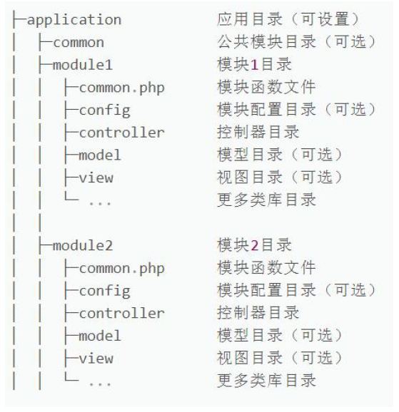
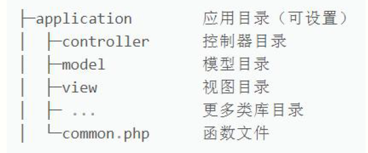
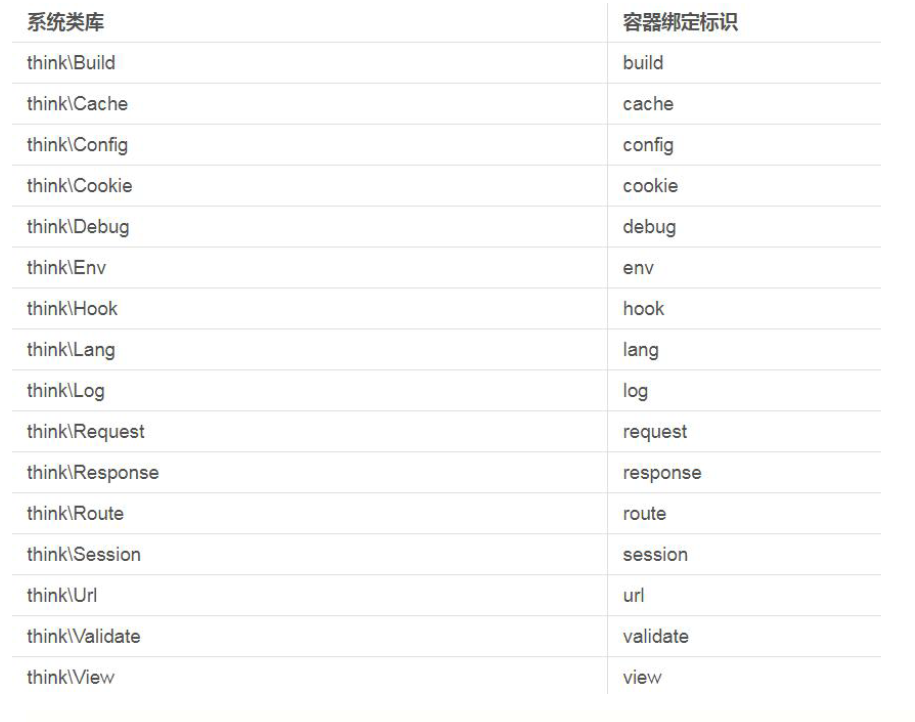
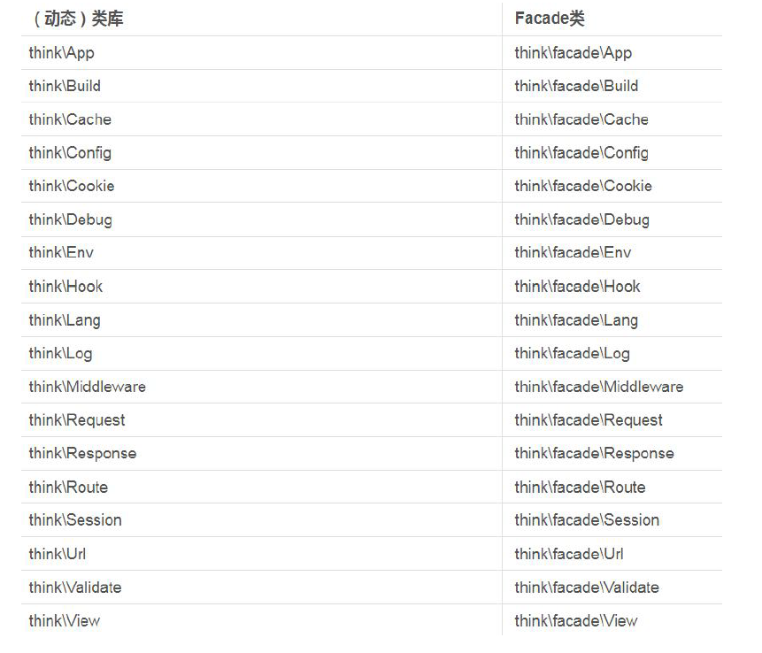
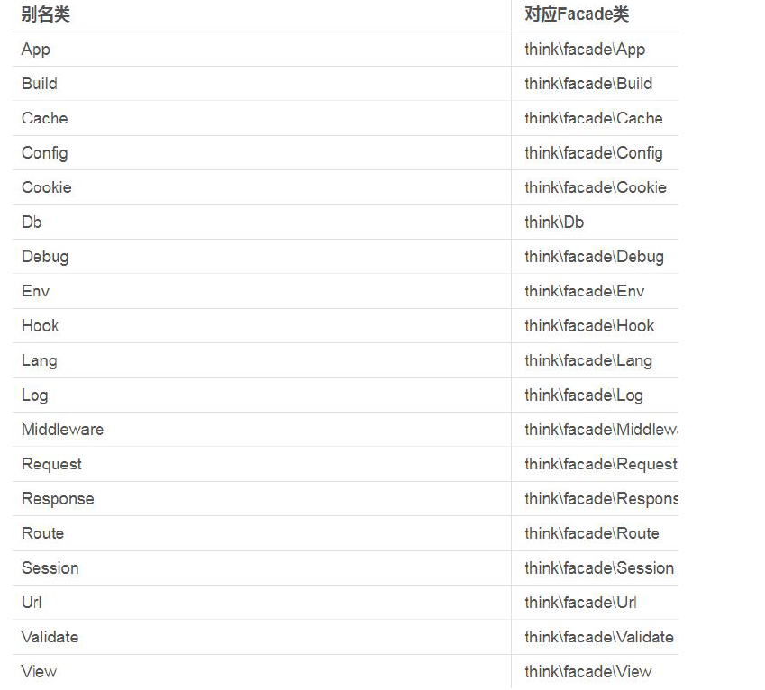
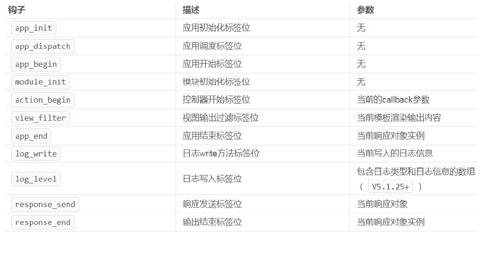
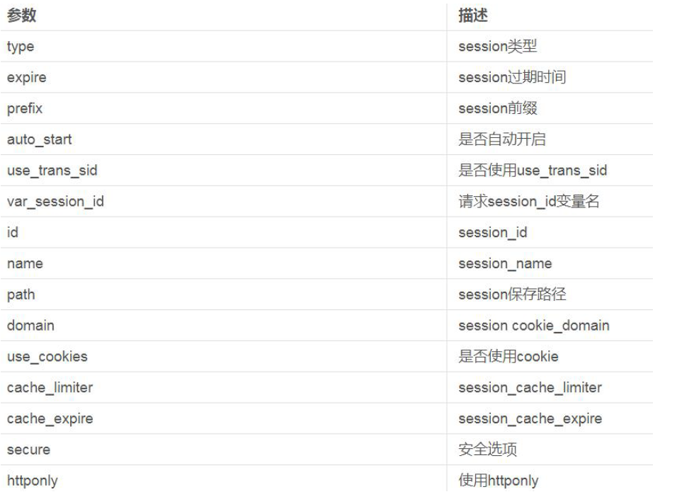
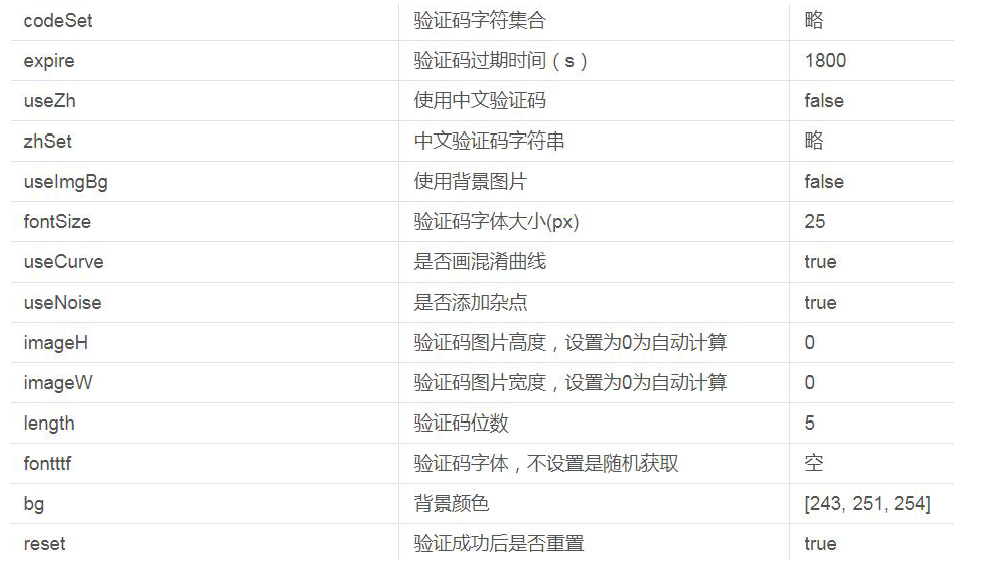
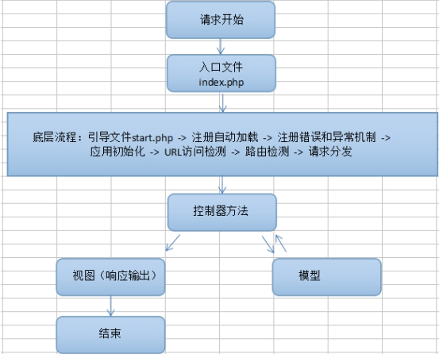

前置知识：

- PHP 基础
- 面向对象基础
- MVC 基础


# 框架概述

## 1. 什么是框架

框架就是一些代码类、方法（函数）、变量、常量的集合，这些代码是功能结构性的代码（并非业务代码）。业务代码其实就是具体的一些模块的增删改查逻辑代码。使用框架开发项目，有便于代码重用、开发效率高、代码规范好、便于功能扩展等优点。


## 2. PHP 中的主流框架

- Zend Framework 框架，PHP官方框架。
- YII框架，又叫易框架。Symfony 框架。
- Laravel框架，市场使用较多。
- Codelgniter框架，简称CI框架。
- ThinkPHP框架，简称TP框架，常用版本：3.2.3 和 5.0.*版本，以及现在最新的 6.x 版本


ThinkPHP是国人自己开发的框架。有中文官网、中文帮助文档、中文社区，以及丰富的百度搜索资源。所以 ThinkPHP 很适合作为入门级的开发框架。

这些框架大多都基于MVC设计思想和面向对象的。

 

**MVC设计思想：**

M: 模型model，处理业务数据，与数据库做交互。

V: 视图view，显示html页面，用户能够看到并与之交互的页面。

C: 控制器controller，接收请求，调用模型处理数据，调用视图显示页面。

> 整个网站应用，分为模型、视图、控制器三大部分组成。


# ThinkPHP 框架安装

ThinkPHP 5.1 要求PHP 版本是5.6 以上；

ThiknPHP 6 要求 PHP 版本是 7.1 以上;


安装之前需要在 php.ini 中开启PDO 数据库引擎和MBstring 字符串扩展

~~~
extension=pdo_mysql
extension=mbstring
~~~


开启 URL 重写功能，可以使用 URL 直接访问控制器，在 Apache 中打开 mod_rewrite 功能

~~~
LoadModule rewrite_module modules/mod_rewrite.so
~~~


## 1. 安装 Composer

目前官网已经不提供独立下载包，需要使用 Composer 来进行安装 Thinkphp

Composer 官网：https://getcomposer.org/download/

Composer 下载地址：https://getcomposer.org/Composer-Setup.exe


Linux 安装方法：

~~~shell
php -r "copy('https://getcomposer.org/installer', 'composer-setup.php');"
php -r "if (hash_file('sha384', 'composer-setup.php') === '756890a4488ce9024fc62c56153228907f1545c228516cbf63f885e036d37e9a59d27d63f46af1d4d07ee0f76181c7d3') { echo 'Installer verified'; } else { echo 'Installer corrupt'; unlink('composer-setup.php'); } echo PHP_EOL;"
php composer-setup.php
php -r "unlink('composer-setup.php');"
~~~


设置下载源：

~~~shell
# 官网下载源
composer config -g repo.packagist composer https://packagist.phpcomposer.com

# 阿里云下载源
composer config -g repo.packagist composer https://mirrors.aliyun.com/composer/
~~~


## 2. 下载 Thinkphp

如果你是首次安装ThinkPHP5.1，那么先从cmd 中切换到你要加载的目录，用 composer 创建项目

~~~
composer create-project topthink/think=5.1.* tp5.1test
~~~


直接安装最新版

~~~
composer create-project topthink/think tp
~~~


升级项目（需要进入到项目目录）

~~~
composer update topthink/framework
~~~


测试是否能够正常进入主页

Thinkphp 入口是在 Public 目录中，而不是项目根目录

~~~
http://localhost/tp5.1/public
~~~


# Thinkphp 框架结构

## 1. 目录结构

```
 1.project  应用部署目录
 2.├─application           应用目录（可设置）
 3.│  ├─common             公共模块目录（可更改）
 4.│  ├─index              模块目录(可更改)
 5.│  │  ├─config.php      模块配置文件
 6.│  │  ├─common.php      模块函数文件
 7.│  │  ├─controller      控制器目录
 8.│  │  ├─model           模型目录
 9.│  │  ├─view            视图目录
10.│  │  └─ ...            更多类库目录
11.│  ├─command.php        命令行工具配置文件
12.│  ├─common.php         应用公共（函数）文件
13.│  ├─config.php         应用（公共）配置文件
14.│  ├─database.php       数据库配置文件
15.│  ├─tags.php           应用行为扩展定义文件
16.│  └─route.php          路由配置文件
17.├─extend                扩展类库目录（可定义）
18.├─public                WEB 部署目录（对外访问目录）
19.│  ├─static             静态资源存放目录(css,js,image)
20.│  ├─index.php          应用入口文件
21.│  ├─router.php         快速测试文件
22.│  └─.htaccess          用于 apache 的重写
23.├─runtime               应用的运行时目录（可写，可设置）
24.├─vendor                第三方类库目录（Composer）
25.├─thinkphp              框架系统目录
26.│  ├─lang               语言包目录
27.│  ├─library            框架核心类库目录
28.│  │  ├─think           Think 类库包目录
29.│  │  └─traits          系统 Traits 目录
30.│  ├─tpl                系统模板目录
31.│  ├─.htaccess          用于 apache 的重写
32.│  ├─.travis.yml        CI 定义文件
33.│  ├─base.php           基础定义文件
34.│  ├─composer.json      composer 定义文件
35.│  ├─console.php        控制台入口文件
36.│  ├─convention.php     惯例配置文件
37.│  ├─helper.php         助手函数文件（可选）
38.│  ├─LICENSE.txt        授权说明文件
39.│  ├─phpunit.xml        单元测试配置文件
40.│  ├─README.md          README 文件
41.│  └─start.php          框架引导文件
42.├─build.php             自动生成定义文件（参考）
43.├─composer.json         composer 定义文件
44.├─LICENSE.txt           授权说明文件
45.├─README.md             README 文件
46.├─think                 命令行入口文件
```


## 2. URL 解析

1. ThinkPHP 框架非常多的操作都是通过URL 来实现的；
2. http://serverName/index.php/模块/控制器/操作/参数/值…；
3. index.php 为入口文件，在public 目录内的index.php 文件；
4. 模块在application 目录下默认有一个index 目录，这就是一个模块；
5. 而在index 目录下有一个controller 控制器目录的Index.php 控制器；
   - Index.php 文件首字母必须是大写
   - Index.php 控制器的类名也必须是 class Index，否则错误；
6. 而操作就是控制器 class Index 里面的方法，比如：index 或 hello；
7. 那么完整形式为：public/index.php/index/index/index（index.php 入口文件 - index 模块 - index 控制器 - index 方法）
8. 官方默认 index 可以省略，所以可以直接访问 `http://localhost/tp5.1/public` 


官方提供的 hello 方法，可以传递参数 `/public/index.php/index/index/hello/name/zhangsan`


## 3. 创建模块

为了更清晰的了解URL 路径的执行过程，我们参照 Index 自己创建一个完全不重复的URL；

1. 在application 目录下创建一个test 目录（模块）；
2. 在test 模块下创建控制器目录 controller，并在旗下创建 Abc.php（控制器）;
3. 创建如下代码：

~~~php
<?php
    // 一定要指定命名空间
    // 可以直接写 app 作为 Application 的缩写
    namespace app\test\controller;

// 类名和控制器名相同
class Abc
{
    // 定义控制器中的方法
    public function eat($who = '隔壁老王')
    {
        // 方法的返回值即为页面显示内容
        return $who.'吃饭！';
    }
}
~~~


代码中eat 是方法（操作），$who 是参数，'隔壁老王'是值；

完整形式为：public/index.php/test/abc/eat/who/主人老李


## 4. URL 模式

1. 上个要点已经了解了URL 所有访问规则，通过创建test 模块更加了解；

2. 如果wamp 环境没有开启伪静态，那么ThinkPHP 不支持URL 重写；

3. 没有开启URL 重写，那只能使用PATH_INFO 模式，如下：

4. public/index.php?s=test/abc/eat/who/主人老李；

5. 我们这里是Apache，其它环境请，如果你使用了，请参考手册；

6. 打开httpd.conf 文件，加载mod_rewrite.so，即去掉前面的#号；

7. 将下面代码（默认已修改），放入public中入口文件index.php 同级目录下的.htaccess；

   ~~~
   <IfModule mod_rewrite.c>
     Options +FollowSymlinks -Multiviews
     RewriteEngine On
   
     RewriteCond %{REQUEST_FILENAME} !-d
     RewriteCond %{REQUEST_FILENAME} !-f
     RewriteRule ^(.*)$ index.php/$1 [QSA,PT,L]
   </IfModule>
   
   ~~~

   > 类似正则，!-d 不是目录， !-f 不是文件，那么重写路径 

   

8. 然后重启环境；

9. 此时的URL 重写，可以省略 index.php 了，路径如下：public/test/abc/eat/who/主人老李


## 5. 配置文件

三个层级的配置文件：

- 框架主配置文件（惯例配置文件） thinkphp/convention.php 

- 应用公共配置文件 config/app.php， config/database.php 对整个应用生效

- 模块配置文件 application/模块目录/config.php 对当前模块生效

 

其他说明：

配置文件格式 return array( 键值对 ) 形式存在，例：

~~~php
<?php

return [
    'template'  =>  [
        'layout_on'     =>  true, //开启布局
        'layout_name'   =>  'layout', //布局文件名称
    ]
];
~~~


加载顺序： 框架主配置文件 》 应用公共配置文件 》 模块配置文件

配置文件生效顺序： 后加载的生效（后加载的配置项会覆盖之前配置项）


如果要手动进行配置，一般不要修改框架本身的主配置文件，而是在应用或者模块配置文件中进行配置。


### 5.1 更改默认模块名

可以省略入口文件 index.php ， Index 模块名， Index 控制器名， index 方法名的原因就是因为在 config/app.php 中定义了默认参数

~~~
// 默认模块名
'default_module'         => 'index',
// 默认控制器名
'default_controller'     => 'Index',
// 默认操作名
'default_action'         => 'index',
~~~

> 如果是多模块，一般分为前台和后台，前台模块名为 home，后台一般是 admin


### 5.2 调试模式

默认情况下，如果代码有误（比如控制器名拼写有误），页面不会出现详细错误信息，只是提示有错误。不方便进行错误调试。这种模式通常叫做“部署模式”（生产模式）。


开发阶段可以将框架设置为调试模式，便于进行错误调试：

~~~
// 应用调试模式
'app_debug'              => true,
~~~


会提示详细错误信息 和 错误位置（参考位置）。

相对于 线上环境（开发完成后的阶段），叫做 部署模式或者生产模式。

### 

## 6. 模块设计

一个模块的结构是：




### 6.1. 单模块

**入口文件绑定实现单模块**

如果你只有 test 这一个模块时，你可以绑定这个模块，从而省略写法；

打开public/index.php 的文件，追加一个方法：

~~~
Container::get('app')->bind('test')->run()->send();
~~~

此时，URL 调用就变成了：public/abc/eat；多模块时，则其它无法访问


**修改配置实现单模块**

如果你的应用只有一个模块，那可以直接设置单模块；

在config 目录下的app.php 修改：

~~~
// 是否支持多模块
'app_multi_module' => false,
~~~


目录结构改变

因为没有模块，所以不用新建目录，index 模块目录也可以删掉，直接在 application 目录下创建 controller 即可




URL 地址public/index/one，即：控制器/操作；


### 6.2. 单模块单控制器

如果你的应用特别简单，只有一个模块，一个控制器，那改写下追加的方法：

~~~
Container::get('app')->bind('test/abc')->run()->send();
~~~

此时，URL 调用就变成了：public/eat；得到了极简；其它控制器则无法访问；


### 6.3 空模块

1. 可以通过环境变量设置空目录，将不存在的目录统一指向指定目录；
2. 在config 目录下的app.php 修改：

~~~
// 默认的空模块名
'empty_module' => 'index',
~~~

3. 空模块只有在多模块开启，且没有绑定模块的情况下生效；
4. 一般空模块用于 404 Not Found 页面


## 6. 环境变量 env

ThinkPHP5.1 提供了一个类库Env 来获取环境变量；

~~~php
return Env::get('app_path');
~~~


| 系统路径      | Env 参数名称 |
| ------------- | ------------ |
| 应用根目录    | root_path    |
| 应用目录      | app_path     |
| 框架目录      | think_path   |
| 配置目录      | config_path  |
| 扩展目录      | extend_path  |
| composer 目录 | vendor_path  |
| 运行缓存目录  | runtime_path |
| 路由目录      | route_path   |
| 当前模块目录  | module_path  |


# Thinkphp 控制器

## 1. 定义控制器

控制器，即 controller，需要先有模块，才会有控制器，控制器文件存放在 application/模块名/controller 目录下，控制器中定义的类名和控制器文件名大小写保持一致，并采用驼峰式（首字母大写）


编写控制器：

- 声明命名空间  namespace  app\模块目录名\controller
- 引入控制器基类（可选） use think\Controller; think是命名空间 Controller是基类控制器
- 定义当前控制器类，继承控制器基类（可选）


示例：定义测试控制器Test.php

~~~
<?php
namespace app\test\controller;

// 引入基类
use think\Controller;

// 继承基类
class Test extends Controller {
    public function index() {
        return 'hello test';
    }
}
~~~

> 继承控制器基类，可以更方便使用功能，但不是必须的；系统也提供了其它方式，在不继承的情况下完成相同功能；


## 2. 控制器文件名

前面我们知道如果控制器是一个单词，首字母大写，比如 class Index；URL 访问时直接 `public/index` 即可；

那么如果创建的是双字母组合，比如class HelloWorld；URL 访问时必须为：`public/hello_world`；


如果你想原样的方式访问URL，则需要关闭配置文件中自动转换；

~~~
'url_convert' => false,
~~~

> 此时，URL 访问可以为：public/HelloWorld；


**控制器文件名后缀（没必要）**

控制器默认没有后缀，Index 模块控制器即为 Index.php，如果想加上后缀加以区分，则需要在配置文件中修改

~~~
'controller_suffix' => false,
~~~

为

~~~
'controller_suffix' => 'Controller',
~~~


表示控制器以Controller为后缀。例如Index控制器，文件名为IndexController.php


## 3. 框架中的命名空间

命名空间本身是PHP就有的，用来防止命名冲突问题的。TP框架中的命名空间，通常和目录挂钩。

原因：TP中的自动加载机制，会将类的命名空间作为加载路径的一部分。


TP中命名空间使用：

- 声明命名空间 使用namespace关键字

- 引入指定的类 使用use关键字  命名空间\类名称

- 完全限定式访问  在使用类时，\完整命名空间\类名称（继承和实例化）

- 如果一个类没有命名空间，使用 \类名


### 3.1 改变根命名空间

如果你想改变根命名空间 app 为其它，可以在根目录下创建.env 文件；

然后写上配对的键值对即可，app_namespace=application;


## 4. 前置操作

### 4.1 控制器初始化重写

如果继承了基类控制器，那么可以定义控制器初始化方法：initialize()，initialize() 方法是在控制器基类的一个方法，会在调用控制器方法之前执行；可以在控制器中添加方法，如：

~~~php
protected function initialize()
{
    // 调用基类初始化方法
	parent::initialize();
    
    // 添加自己代码
	echo 'init';
}
~~~

> initialize()方法不需要任何返回值，输出用PHP 方式，return 无效；


### 4.2 $beforeActionList 属性

继承Controller 类后可以设置一个$beforeActionList 属性来创建前置方法；

~~~php
<?php

namespace app\test\controller;

use think\Controller;

class Test extends Controller {
    public function index() {
        return 'index';
    }

    protected $beforeActionList = [
        // 所有方法执行前会调用 first 方法
        'first',
        // second 方法不执行（当调用one方法的时候）
        'second' => ['except' => 'one'],
        //third 前置只能通过调用 one 和 two 方法触发
        'third' => ['only' => 'one, two'],
    ];

    protected function first() {
        echo 'first<br/>';
    }

    protected function second() {
        echo 'second<br/>';
    }

    protected function third() {
        echo 'third<br/>';
    }

    public function one() {
        echo 'one';
    }

    public function two() {
        echo 'two';
    }

    public function three() {
        echo 'three';
    }
}
~~~


## 5. 跳转和重定向

Controller 类提供了两个跳转的方法：

- success(msg,url)
- error(msg)；


一般用来做执行成功或失败后的跳转，如：注册成功、登录失败后的跳转。

~~~php
class Test extends Controller {
    public $flag = false;
    public function index() {
        if ($this->flag) {
            // 如果不指定url，则返回 $_SERVER['HTTP_REFERER']
            $this->success('成功', '../');
        } else {
            // 自动返回上一页
            $this->error('失败');
        }
    }
}

~~~

`$_SERVER['HTTP_REFERER']` 也是上一页，如果不指定 URL 路径的话，那么当用户通过浏览器进入到该地址的时候，没有 Referer （没有上一页的记录）就会出现死循环。


**重定向页面**

跳转和重定向出现的页面是系统默认页面，可以在 `thinkphp/tpl/dispatch_jump.tpl` 中修改该页面


也可以在 config/app.php 配置文件中修改指向新的页面：

~~~
// 默认跳转页面对应的模板文件
'dispatch_success_tmpl'  => Env::get('think_path') . 'tpl/dispatch_jump.tpl',
'dispatch_error_tmpl'    => Env::get('think_path') . 'tpl/dispatch_jump.tpl',
~~~


如果需要自定义跳转页面，可以使用如下的模版变量：

| 变量  | 说明                 |
| ----- | -------------------- |
| $data | 要返回的数据         |
| $msg  | 页面提示信息         |
| $code | 返回的code           |
| $wait | 跳转等待时间单位为秒 |
| $url  | 跳转页面地址         |


### 5.1 空方法

当用户访问没有定义的控制器或没有定义的方法时，会导致出现报错信息，为了避免这个错误，可以指定默认方法，或者报错信息。


当访问了一个不存在的方法时，系统会报错，我们可以使用_empty()来拦截；

~~~php
public function _empty($name)
{
    // return '不存在当前方法：'.$name;
    return index;
}
~~~


### 5.2 空控制器

当访问了一个不存在的控制器时，系统也会报错，我们可以在 Controller 文件夹中创建 Error.php ，定义 Error 类来拦截；

~~~php
class Error
{
    public function index(Request $request)
    {
        return '当前控制器不存在：'.$request->controller();
    }
}
~~~


系统默认为Error 类，如果需要自定义，则在app.php 配置文件中修改；

~~~
// 默认的空控制器名
'empty_controller' => 'Error',
~~~


# 渲染输出

## 1. return 输出

ThinkPHP 直接采用方法内return 返回的方式直接就输出了，如:

~~~php
public function index(){
    return "output";
}
~~~

> 当然使用 echo 也没什么大毛病


## 2. json 输出

如果 return 的是数组，则无法直接 return，需要将数组转换为 json 格式

~~~
$data = array('a'=>1, 'b'=>2, 'c'=>3);
return json($data);
~~~


## 3. view 输出模板

使用view 输出模版，前提是需要在对应文件夹下创建模板文件，`模块\view\控制器名\方法名.html`

~~~
\application\test\view\test\index.html
~~~


然后再方法中

~~~
return view();
~~~


## 4. 更改默认输出格式

默认输出方式为html 格式输出，如果返回的是数组，则会报错；可以更改配置文件里的默认输出类型，更改为json；

~~~
'default_return_type' => 'json',
~~~

> 一般来说正常输出都是 html，ajax 默认是 json


# 命令行创建模块、控制器、模型

## 1. 创建模块

首先 php.exe 需要加入到环境变量，然后在 **项目根目录** 执行命令（think文件所在的目录）

~~~
php think build --module 模块名
~~~


## 2. 创建控制器

~~~
php think make:controller 模块名/控制器名 
php think make:controller 模块名/控制器名 --plain
~~~

> 注意：控制器名首字母大写。

加上 --plain 参数 表示创建没有方法的空控制器类。否则控制器类中会自带一些增删改查模板方法。


## 3. 创建模型

~~~
php think make:model 模块名/模型名
~~~


# 数据库

ThinkPHP 采用内置抽象层将不同的数据库操作进行封装处理，数据抽象层基于PDO 模式，无须针对不同的数据库编写相应的代码。


## 1. 连接数据库

在根目录的config 下的database.php 可以设置数据库连接信息，大部分系统已经给了默认值，你只需要修改和填写需要的值即可。

~~~
// 数据库类型
'type'            => 'mysql',
// 服务器地址
'hostname'        => '127.0.0.1',
// 数据库名
'database'        => '',
// 用户名
'username'        => 'root',
// 密码
'password'        => '',
// 端口
'hostport'        => '',
// 连接dsn
'dsn'             => '',
// 数据库连接参数
'params'          => [],
// 数据库编码默认采用utf8
'charset'         => 'utf8',
// 数据库表前缀
'prefix'          => '',
~~~


type 属性默认支持的数据库有：mysql、sqlite、pgsql、sqlsrv；


## 2. 输出数据

### 2.1. 不使用模型

配置完数据库，我们使用如下代码，在控制器端输出mysql 里的数据，该方法不需要创建模型文件；

~~~php
<?php

namespace app\test\controller;

use think\Controller;
use think\Db;

class Datatest extends Controller {
    public function getNoModelData() {
        // $data = Db::table('tpshop_address')->select();
        // 级联操作，返回的对象中使用 select() 方法获取数据
        $data = Db::name('address')->select();
        return json($data);
    }
}

~~~

> Db::table 静态方法需要完整填写数据库表前缀，Db::name 会自动添加前缀


### 2.2. 使用模型

Model 即模型，就是处理和配置数据库的相关信息，在项目应用根目录创建model 文件夹，并且创建Address.php（对应表名称）；

~~~php
namespace app\model;
use think\Model;
class User extends Model
{
}
~~~


控制器调用方法

~~~php
<?php

namespace app\test\controller;

use think\Controller;

// 需要引入model类
use app\test\model\Address;

class Datatest extends Controller {

    public function getModelData() {
        $data = Address::select();
        return json($data);
    }
}
~~~


## 3. 打开数据库调试模式

很多时候，我们需要调试SQL 是否正确，建议打开Trace，可以查看原生SQL；


在 config/database.php 中打开 trace 模式

~~~
// 应用Trace
'app_trace' => true,
~~~

> 之后就可以在右下角点开数据库面板查看数据库操作信息了


也可以使用 Db 中的静态方法来查看上一条 SQL 语句

~~~php
Db::getLastSql();
~~~


## 3. 数据库操作

### 3.1 查询数据

#### select()

查询多条数据，可以使用模型查询，也可以使用非模型查询，如：

~~~php
// 非模型查询
Db::table('tpshop_address')->select();

// 模型查询
Address::select();
~~~


#### find() 

查询单条数据，默认是表中第一条数据。

~~~php
Db::table('tp_user')->find();
~~~


#### where()

想指定数据查询，可以使用where()方法；

~~~php
Db::table('tp_user')->where('id', 27)->find()
~~~


链式查询：

- `table('tp_user')` 返回选择表对象
- `->where('id', 27)` 调用对象中的 where 方法，返回 id 为 27 的记录对象
- `->find()` 调用对象中的 find() 方法，返回数据


相当于

~~~sql
SELECT * FROM `tp_user` WHERE `id` = 27 LIMIT 1
~~~


select() 和 find() 如果没有查询到任何数据，返回 null


#### findOrFail()

使用findOrFail()方法同样可以查询一条数据，在没有数据时抛出一个异常；

~~~php
Db::table('tp_user')->where('id', 1)->findOrFail()
~~~


捕获异常

~~~php
try {
    $data = Db::table('tp_user')->where('id', 1)->findOrFail();
} catch (DataNotFoundException $e){
    return '查询不到数据！';
}
~~~


#### findOrEmpty()

使用findOrEmpty()方法也可以查询一条数据，但在没有数据时返回一个空数组；

~~~php
Db::table('tp_user')->where('id', 1)->findOrEmpty();
~~~


#### selectOrFail()

多列数据在查询不到任何数据时返回空数组，使用selectOrFail()抛出异常；

~~~php
Db::table('tp_user')->where('id', 1)->selectOrFail();
~~~


#### value()

通过value()方法，可以查询指定字段的值（单个），没有数据返回null；

~~~php
Db::name('user')->where('id', 27)->value('username');
~~~


#### colunm()

通过colunm()方法，可以查询指定列的值（多个），没有数据返回空数组；

~~~php
Db::name('user')->column('username');
~~~


可以指定id 作为列值的索引；

~~~php
Db::name('user')->column('username', 'id');
~~~


#### 助手函数 db

ThinkPHP 提供了一个助手函数db，可以更方便的查询；

~~~php
db('user')->select();
~~~


### 3.2 链式查询

前面课程中我们通过指向符号“->”多次连续调用方法称为：链式查询，如：

~~~php
Db::table('tp_user')->where('id', 27)->find()
~~~


通过 `Db::table('tp_user')` 我们可以得到一个 Query 查询对象，这个对象中包含了数据库的一些方法，比如可以通过 where 方法对这个对象进行查询。查询后返回的结果依然是一个 Query 对象，所以可以一直嵌套下去，直到使用 find(), select() 等方法返回的是一个数组而不是对象为止。


常用链式操作方法

~~~php
$model = new Address();
$model->field('id,name')->select(); //指定要查询的字段，原生sql中select后面的字段
$model->order('id desc,time desc')->select(); //相当于原生sql中的order by
$model->limit(3)->select(); //相当于原生sql中的limit条件
$model->limit(0,3)->select(); 
$model->limit('0,3')->select(); 
$model->group('cate_id')->select();  //相当于原生sql中的group by
$model->having('id>3')->select();  //相当于原生sql中的having条件
$model->alias('a')->join('think_user_type t','a.id=t.user_id', 'left')->select(); //alias方法设置别名，join方法连表查询
//Address::alias('a')->join('tpshop_user u','a.user_id = u.id', 'left')->select();
~~~

注：TP框架中，中间的方法没有顺序要求，当时用于获取最终结果的find和select等方法，必须在最后。


如果多次调用数据库查询，那么每次静态创建都会生成一个实例，造成浪费；我们可以把对象实例保存下来，再进行反复调用即可；

~~~
$user = Db::name('user');
$data = $user->select();
~~~


当同一个对象实例第二次查询后，会保留第一次查询的值；

~~~
$data1 = $user->order('id', 'desc')->select();
$data2 = $user->select();
return Db::getLastSql();
SELECT * FROM `tp_user` ORDER BY `id` DESC
~~~


使用removeOption()方法，可以清理掉上一次查询保留的值

~~~php
$user->removeOption('where')->select();
~~~


### 3.3 添加数据

使用insert()方法可以向数据表添加一条数据；

~~~php
// 按照数据库字段信息定义数据
$data = [
'username' => '辉夜',
'password' => '123',
'gender' => '女',
'email' => 'huiye@163.com',
'price' => 90,
'details' => '123',
'create_time' => date('Y-m-d H:i:s')
];

// 新增数据
Db::name('user')->insert($data);
~~~


如果新增成功，insert()方法会返回一个1 值；

~~~php
$flag = Db::name('user')->insert($data);
if ($flag) return '新增成功！';
~~~


你可以使用data()方法来设置添加的数据数组；

~~~php
Db::name('user')->data($data)->insert();
~~~


如果你添加一个不存在的数据，会抛出一个异常Exception；但是可以通过关闭严格模式来忽略

~~~
Db::name('user')->strict(false)->insert($data);
~~~


如果采用的是mysql 数据库，支持REPLACE 写入；

~~~php
Db::name('user')->insert($data, true);
~~~


使用insertGetId()方法，可以在新增成功后返回当前数据ID；

~~~php
Db::name('user')->insertGetId($data);
~~~


使用insertAll()方法，可以批量新增数据，但要保持数组结构一致；

~~~php
$data = [
    [
        'username' => '辉夜1',
        'password' => '123',
        'gender' => '女',
        'email' => 'huiye@163.com',
        'price' => 90,
        'details' => 123,
        'create_time' => date('Y-m-d H:i:s')
    ],
    [
        'username' => '辉夜2',
        'password' => '123',
        'gender' => '女',
        'email' => 'huiye@163.com',
        'price' => 90,
        'details' => 123,
        'create_time' => date('Y-m-d H:i:s')
    ],
];

Db::name('user')->insertAll($data);
~~~


批量新增也支持data()方法，和单独新增类似；

~~~php
Db::name('user')->data($data)->insertAll();
~~~


批量新增也支持reaplce 写入，和单独新增类似；

~~~php
Db::name('user')->insertAll($data, true);
~~~


### 3.4 更新数据

使用update()方法来修改数据，修改成功返回影响行数，没有修改返回0；

~~~php
$data = [
    'username' => '李白'
];
$update = Db::name('user')->where('id', 38)->update($data);
return $update;
~~~


或者使用data()方法传入要修改的数组，如果两边都传入会合并；

~~~php
Db::name('user')->where('id', 38)->data($data)->update(['password'=>'456']);
~~~

> 没什么必要，最好都写在一起


如果修改数组中包含主键，那么可以直接修改；

~~~php
$data = [
    'username' => '李白',
    'id' => 38
];
Db::name('user')->update($data);
~~~


使用inc()方法可以对字段增值， dec()方法可以对字段减值；

~~~php
Db::name('user')->inc('price')->dec('price', 3)->update($data);
~~~

> 增值和减值如果同时对一个字段操作，前面一个会失效；


使用exp()方法可以在字段中使用mysql 函数；

~~~php
Db::name('user')->exp('email', 'UPPER(email)')->update($data);
~~~


使用raw()方法修改更新，更加容易方便；

~~~php
$data = [
    'username' => '李白',
    'email' => Db::raw('UPPER(email)'),
    'price' => Db::raw('price - 3'),
    'id' => 38
];
Db::name('user')->update($data);
~~~


使用setField()方法可以更新一个字段值；

~~~php
Db::name('user')->where('id', 38)->setField('username', '辉夜');
~~~


增值setInc()和减值setDec()也有简单的做法，方便更新一个字段值；

~~~php
Db::name('user')->where('id', 38)->setInc('price');
~~~

> 增值和减值如果不指定第二个参数，则步长为1；


### 3.5 删除数据

极简删除可以根据主键直接删除，删除成功返回影响行数，否则0；

~~~php
Db::name('user')->delete(51);
~~~


根据主键，还可以删除多条记录；

~~~php
Db::name('user')->delete([48,49,50]);
~~~


正常情况下，通过where()方法来删除；

~~~php
Db::name('user')->where('id', 47)->delete();
~~~


通过true 参数删除数据表所有数据，我还没测试，大家自行测试下；

~~~php
Db::name('user')->delete(true);
~~~


### 3.6 查询表达式

#### 比较查询

在查询数据进行筛选时，我们采用where()方法，比如id=80；

~~~php
Db::name('user')->where('id', 80)->find();
Db::name('user')->where('id','=',80)->find();
~~~


~~~php
where(字段名,表达式,查询条件)；
~~~

> 默认表达式为 = 


使用<>、>、<、>=、<=可以筛选出各种符合比较值的数据列表，如：

~~~php
Db::name('user')->where('id','<>',80)->select();
~~~


#### 区间查询

使用like 表达式进行模糊查询；

~~~php
Db::name('user')->where('email','like','xiao%')->select();
~~~


like 表达式还可以支持数组传递进行模糊查询；

~~~php
Db::name('user')->where('email','like',['xiao%','wu%'], 'or')->select();
~~~

相当于

~~~sql
SELECT * FROM `tp_user` WHERE (`email` LIKE 'xiao%' OR `email` LIKE 'wu%')
~~~


like 表达式具有两个快捷方式whereLike()和whereNoLike()；

~~~php
Db::name('user')->whereLike('email','xiao%')->select();
Db::name('user')->whereNotLike('email','xiao%')->select();
~~~


between 表达式具有两个快捷方式whereBetween()和whereNotBetween()；

~~~php
Db::name('user')->where('id','between','19,25')->select();
Db::name('user')->where('id','between',[19, 25])->select();
Db::name('user')->whereBetween('id',[19, 25])->select();
Db::name('user')->whereNotBetween('id',[19, 25])->select();
~~~


in 表达式具有两个快捷方式whereIn()和whereNotIn()；

~~~php
Db::name('user')->where('id','in', '19,21,29')->select();
Db::name('user')->whereIn('id','19,21,29')->select();
Db::name('user')->whereNotIn('id','19,21,29')->select();
~~~


null 表达式具有两个快捷方式whereNull()和whereNotNull()；

~~~php
Db::name('user')->where('uid','null')->select();
Db::name('user')->where('uid','not null')->select();
Db::name('user')->whereNull('uid')->select();
Db::name('user')->whereNotNull('uid')->select();
~~~


#### 其它查询

使用exp 可以自定义字段后的SQL 语句；

~~~php
Db::name('user')->where('id','exp','IN (19,21,25)')->select();
Db::name('user')->whereExp('id','IN (19,21,25)')->select();
~~~


### 3.7 时间查询

#### 传统方式

可以使用>、<、>=、<=来筛选匹配时间的数据；

~~~php
Db::name('user')->where('create_time', '> time', '2018-1-1')->select();
~~~


可以使用between 关键字来设置时间的区间；

~~~php
Db::name('user')->where('create_time', 'between time', ['2018-1-1','2019-12-31'])->select();
Db::name('user')->where('create_time', 'not between time', ['2018-1-1','2019-12-31'])->select();
~~~


#### 快捷方式

时间查询的快捷方法为whereTime()，直接使用>、<、>=、<=；

~~~php
Db::name('user')->whereTime('create_time', '>', '2018-1-1')->select();
~~~


快捷方式也可以使用between 和not between；

~~~php
Db::name('user')->whereBetween('create_time', ['2018-1-1','2019-12-31'])->select();
~~~


还有一种快捷方式为：whereBetweenTime()，如果只有一个参数就表示一天；

~~~php
Db::name('user')->whereBetweenTime('create_time', '2018-1-1','2019-12-31')->select();
~~~


默认的大于>，可以省略；

~~~php
Db::name('user')->whereTime('create_time', '2018-1-1')->select();
~~~


#### 固定查询

| 关键字     | 说明 |
| ---------- | ---- |
| today 或 d | 今天 |
| yesterday  | 昨天 |
| week 或 w  | 本周 |
| last week  | 上周 |
| month 或 m | 本月 |
| last month | 上月 |
| year 或 y  | 今年 |
| last year  | 去年 |


~~~php
Db::name('user')->whereTime('create_time','d')->select();
Db::name('user')->whereTime('create_time','y')->select();
~~~


#### 其他查询

查询指定时间的数据，比如两小时内的；

~~~php
Db::name('user')->whereTime('create_time', '-2 hour')->select();
~~~


查询两个时间字段时间有效期的数据，比如会员开始到结束的期间；

~~~php
Db::name('user')->whereBetweenTimeField('start_time','end_time')->select();
~~~


### 3.8 聚合查询

使用count()方法，可以求出所查询数据的数量；

~~~php
Db::name('user')->count();
~~~


count()可设置指定id，比如有空值(Null)的uid，不会计算数量；

~~~php 
Db::name('user')->count('uid');
~~~


使用max()方法，求出所查询数据字段的最大值；

~~~php
Db::name('user')->max('price');
~~~


如果max()方法，求出的值不是数值，则通过第二参数强制转换；

~~~php
Db::name('user')->max('price', false);
~~~


使用min()方法，求出所查询数据字段的最小值，也可以强制转换；

~~~php
Db::name('user')->min('price');
~~~


使用avg()方法，求出所查询数据字段的平均值；

~~~php
Db::name('user')->avg('price');
~~~


使用sum()方法，求出所查询数据字段的总和；

~~~php
Db::name('user')->sum('price');
~~~


### 3.9 子查询

使用fetchSql()方法，可以设置不执行SQL，而返回SQL 语句，默认true；

~~~php
Db::name('user')->fetchSql(true)->select();
~~~


使用buidSql()方法，也是返回SQL 语句，但不需要再执行select()，且有括号；

~~~php
Db::name('user')->buildSql(true);
~~~


结合以上方法，我们实现一个子查询；

~~~php
$subQuery = Db::name('two')->field('uid')->where('gender','男')->buildSql(true);
$result = Db::name('one')->where('id','exp','IN '.$subQuery)->select();
~~~


使用闭包的方式执行子查询；

~~~php
$result = Db::name('one')->where('id', 'in', function ($query) {
	$query->name('two')->where('gender', '男')->field('uid');
})->select();
~~~


### 3.10 原生查询

使用query()方法，进行原生SQL 查询，适用于读取操作，SQL 错误返回false；

~~~php
Db::query('select * from tp_user');
~~~


使用execute 方法，进行原生SQL 更新写入等，SQL 错误返回false；

~~~php
Db::execute('update tp_user set username="孙悟空" where id=29');
~~~


### 3.11 链式方法

#### where

表达式查询，就是where()方法的基础查询方式；

~~~php
Db::name('user')->where('id', '>', 70)->select();
~~~


关联数组查询，通过键值对来数组键值对匹配的查询方式；

~~~php
$result = Db::name('user')->where([
    'gender' => '男',
    'price' => 100
])->select();
~~~


索引数组查询，通过数组里的数组拼装方式来查询；

~~~php
$result = Db::name('user')->where([
    ['gender', '=', '男'],
    ['price', '=', '100']
])->select();
~~~


将复杂的数组组装后，通过变量传递，将增加可读性；

~~~php
$map[] = ['gender', '=', '男'];
$map[] = ['price', 'in', [60, 70, 80]];
$result = Db::name('user')->where($map)->select();
~~~


字符串形式传递，简单粗暴的查询方式；

~~~php
Db::name('user')->where('gender="男" AND price IN (60, 70, 80)')->select();
~~~


#### field

使用field()方法，可以指定要查询的字段；

~~~php
Db::name('user')->field('id, username, email')->select();
Db::name('user')->field(['id', 'username', 'email'])->select();
~~~


使用field()方法，给指定的字段设置别名；

~~~php
Db::name('user')->field('id,username as name')->select();
Db::name('user')->field(['id', 'username'=>'name',])->select();
~~~


在field()方法里，可以直接给字段设置MySQL 函数；

~~~php
Db::name('user')->field('id,SUM(price)')->select();
~~~


对于更加复杂的MySQL 函数，必须使用字段数组形式；

~~~php
Db::name('user')->field(['id', 'LEFT(email, 5)'=>'leftemail'])->select();
~~~


使用field(true)的布尔参数，可以显式的查询获取所有字段，而不是*；

~~~php
Db::name('user')->field(true)->select();
~~~


使用field()方法中字段排除，可以屏蔽掉想要不显示的字段；

~~~php
Db::name('user')->field('details,email', true)->select();
Db::name('user')->field(['details,email'], true)->select();
~~~


使用field()方法在新增时，验证字段的合法性；

~~~php
Db::name('user')->field('username, email, details')->insert($data);
~~~


#### alias

使用alias()方法，给数据库起一个别名；

~~~php
Db::name('user')->alias('a')->select();
~~~


#### limit

使用limit()方法，限制获取输出数据的个数；

~~~php
Db::name('user')->limit(5)->select();
~~~


分页模式，即传递两个参数，比如从第3 条开始显示5 条limit(2,5)；

```
Db::name('user')->limit(2, 5)->select();
```


实现分页，需要严格计算每页显示的条数，然后从第几条开始；

```
//第一页
Db::name('user')->limit(0, 5)->select();
//第二页
Db::name('user')->limit(5, 5)->select();
```


#### page

page()分页方法，优化了limit()方法，无须计算分页条数；

```
//第一页
Db::name('user')->page(1, 5)->select();
//第二页
Db::na
me('user')->page(2, 5)->select();
```


#### order

使用order()方法，可以指定排序方式，没有指定第二参数，默认asc；

```
Db::name('user')->order('id', 'desc')->select();
```


支持数组的方式，对多个字段进行排序；

```
Db::name('user')->order(['create_time'=>'desc', 'price'=>'asc'])->select();
```


#### group

使用group()方法，给性别不同的人进行price 字段的总和统计；

```
Db::name('user')->field('gender, sum(price)')->group('gender')->select();
```


也可以进行多字段分组统计；

```
Db::name('user')->field('gender, sum(price)')->group('gender,password')->select();
```


#### having

使用group()分组之后，再使用having()进行筛选；

```
$result = Db::name('user')
->field('gender, sum(price)')
->group('gender')
->having('sum(price)>600')
->select();
```


# 模型

## 1. 定义模型

定义一个和数据库表向匹配的模型；在当前模块中创建 model 文件夹，然后在 model 文件夹中创建 User.php （对应表名称），在文件中，写入代码：

~~~php
<?php

// 命名空间（app\模块名\model
namespace app\test\model;

// 引入基类
use think\Model;

// 定义模型类
class Address extends Model {
}

~~~


模型会自动对应数据表，并且有一套自己的命名规则；

模型类需要去除表前缀(tp_)，采用驼峰式命名，并且首字母大写；

~~~
tp_user(表名) => User
tp_user_type(表名) => UserType
~~~


如果担心设置的模型类名和PHP 关键字冲突，可以开启应用类后缀；

在app.php 中，设置class_suffix 属性为true 即可；

```
// 应用类库后缀
'class_suffix' => true,
```


所有的文件名需要改名为

~~~
UserModel.class.php
UserController.class.php
~~~


设置完毕后，所有的控制器类名和模型类名需要加上Controller 和Model；

```
class UserModel
```


## 2. 使用模型

在控制器中创建控制器，如果需要使用到模型，需要引入模型

~~~php
<?php

namespace app\test\controller;

use think\Controller;

// 使用 Db 来操作数据库（如果使用模型则不需要引入）
use think\Db;

// 引入创建模型（只能操作单一表）
use app\test\model\Address;

class Datatest extends Controller {

    public function getModelData() {
        // 调用类中静态方法
        $data = Address::select();
        return (json($data));
    }
}
~~~


如果在控制器中使用相同名字的控制器，如模型 User.php， 控制器也是 User.php，需要加上命名空间

~~~php
$data = \app\test\model\User::select();
~~~


或者引用的时候使用别名

~~~php
<?php

namespace app\test\controller;
use think\Controller;
use app\test\model\User as UserModel;

class Datatest extends Controller {

    public function getModelData() {
        // 调用类中静态方法
        $data = UserModel::select();
        return (json($data));
    }
}
~~~


设置主键

在模型文件中写入代码：

~~~php
protected $pk = 'uid';
~~~

> 固定变量名


在模型定义中，虽然自动连接以文件名名称的数据库表，但是可以通过设置，来操作其它的数据表；

~~~php
protected $table = 'tp_one';
~~~

> 固定变量名


模型和控制器一样，也有初始化，在这里必须设置static 静态方法；

~~~php
//模型初始化
protected static function init()
{
//第一次实例化的时候执行init
    echo '初始化User 模型';
}
~~~


## 3. 模型操作

模型操作数据和数据库操作一样，只不过不需要指定表了；

~~~php
UserModel::select();
~~~


数据库操作返回的列表是一个二维数组，而模型操作返回的是一个结果集；

~~~php
[[]] 和[{}]
~~~


## 4. 数据添加

使用实例化的方式添加一条数据，首先实例化方式如下，两种均可：

~~~php
$user = new UserModel();
$user = new \app\model\User();
~~~


设置要新增的数据，然后用save()方法写入到数据库中，save()返回布尔值；

~~~php
// 创建模型实例
$user = new User();

// 字段赋值
$user -> name = 'thinkphp';
$user -> email = 'tp@qq.com';

// 新增数据
$user -> save();
~~~


可以直接在 $user 利用 data 方法赋值，

~~~php
// 创建模型实例
$user = new User();

// 字段赋值
$user -> data([
    'name' = 'thinkphp',
    'email' = 'tp@qq.com'
]);

// 新增数据
$user -> save();
~~~


也可以直接在初始化中传入数据

~~~php
$user = User([
    'name' = 'thinkphp',
    'email' = 'tp@qq.com'
]);
$user -> save();
~~~


save() 方法返回值是写入的记录数

~~~php
$flag = $user->save();
if ($flag) return '新增成功！';
~~~


获取自增ID

~~~php
$user->save();
echo $user->id;
~~~


模型新增也提供了replace()方法来实现REPLACE into 新增；

~~~php
$user->replace()->save();
~~~


过滤非字段

~~~php
// 过滤数据库中没有的字段
$user->allowField(true)->save();

// 写入指定字段
$user->allowField(['name'], ['password']) -> save();
~~~


添加多条记录 saveAll()

~~~php
$data = [
    ['username' => '辉夜1','password' => '123'],
	['username' => '辉夜2','password' => '123']
    ];

$user = new UserModel();
$user->saveAll($data);
~~~

> 不会返回记录数，而是返回新增的数据信息结果集


**create() 静态方法**

~~~php
$data = [
    'name' = 'thinkphp',
    'email' = 'tp@qq.com'
];
    $user = User::create($data);
	echo $user->id;
~~~


过滤非数据表字段

~~~
$user->create($data, true);
~~~


## 5. 数据删除

使用get()方法，通过主键(id)查询到想要删除的数据；

~~~php
$user = UserModel::get(93);
~~~


然后再通过delete()方法，将数据删除，返回布尔值；

~~~php
$user->delete();
~~~


也可以使用静态方法调用destroy()方法，通过主键(id)删除数据；

~~~php
UserModel::destroy(92)
~~~


静态方法destroy()方法，也可以批量删除数据；

~~~php
UserModel::destroy('80, 90, 91');
UserModel::destroy([80, 90, 91]);
~~~


通过数据库类的查询条件删除；

~~~php
UserModel::where('id', '>', 80)->delete();
~~~


使用闭包的方式进行删除；

~~~php
UserModel::destroy(function ($query) {
    $query->where('id', '>', 80);
});
~~~


## 6. 数据修改

使用get()方法通过主键获取数据，然后通过save()方法保存修改，返回布尔值；

~~~php
// 选定记录
$user = UserModel::get(118);

// 设置数据
$user->username = '李黑';
$user->email = 'lihei@163.com';

// 保存修改数据
$user->save();
~~~


通过where()方法结合find()方法的查询条件获取的数据，进行修改；

~~~php
$user = UserModel::where('username', '李黑')->find();
$user->username = '李白';
$user->email = 'libai@163.com';
$user->save();
~~~


save()方法只会更新变化的数据，如果提交的修改数据没有变化，则不更新；

但如果你想强制更新数据，即使数据一样，那么可以使用force()方法；

~~~php
$user->force()->save();
~~~


Db::raw()执行SQL 函数的方式，同样在这里有效；

~~~php
$user->price = Db::raw('price+1');
~~~


如果只是单纯的增减数据修改，可以使用inc/dec；

~~~php
$user->price = ['inc', 1];
~~~


直接通过save([],[])两个数组参数的方式更新数据；

~~~php
$user->save([
    'username' => '李黑',
    'email' => 'lihei@163.com'
],['id'=>118]);
~~~


通过saveAll()方法，可以批量修改数据，返回被修改的数据集合；

~~~php
$list = [
    ['id'=>118, 'username'=>'李白', 'email'=>'libai@163.com'],
    ['id'=>128, 'username'=>'李白', 'email'=>'libai@163.com'],
    ['id'=>129, 'username'=>'李白', 'email'=>'libai@163.com']
];
$user->saveAll($list);
~~~

> 批量更新saveAll()只能通过主键id 进行更新；


使用静态方法结合update()方法来更新数据，这里返回的是影响行数；

~~~php
UserModel::where('id', 118)->update([
    'username' => '李黑',
    'email' => 'lihei@163.com'
]);
~~~


另外一种静态方法update()，返回的是对象实例；

~~~php
UserModel::update([
    'id' => 118,
    'username' => '李黑',
    'email' => 'lihei@163.com'
]);
~~~


模型的新增和修改都是save()进行执行的，它采用了自动识别体系来完成；

实例化模型后调用save()方法表示新增，查询数据后调用save()表示修改；当然，如果在save()传入更新修改条件后也表示修改；


如果编写的代码比较复杂的话，可以用isUpdate()方法显示操作；

~~~php
//强制更新
$user->isUpdate(true)->save();
//强制新增
$user->isUpdate(false)->save();
~~~


## 7. 数据查询

使用get()方法，通过主键(id)查询到想要的数据；

~~~php
$user = UserModel::get(129);
return json($user);
~~~


也可以使用where()方法进行条件筛选查询数据；

~~~php
$user = UserModel::where('username', '辉夜')->find();
return json($user);
~~~


不管是get()方法还是find()方法，如果数据不存在则返回Null；


和数据库查询一样，模型也有getOrFail()方法，数据不存在抛出异常；

同上，还有findOrEmpty()方法，数据不存在返回空模型；


通过模型->符号，可以得到单独的字段数据；

~~~php
return $user->username;
~~~


如果在模型内部获取数据，请不要用$this->username，而用如下方法；

~~~php
public function getUserName()
{
    return self::where('username', '辉夜')->find()->getAttr('username');
}
~~~


通过all()方法，实现IN 模式的多数据获取；

~~~php
$user = UserModel::all('79, 118, 128');
$user = UserModel::all([79, 118, 128]);
~~~


使用链式查询得到想要的数据；

~~~php
UserModel::where('gender', '男')->order('id', 'asc')->limit(2)->select();
~~~


获取某个字段或者某个列的值

~~~php
UserModel::where('id', 79)->value('username');
UserModel::whereIn('id',[79,118,128])->column('username','id');
~~~


模型支持动态查询：getBy*，*表示字段名；

~~~php
UserModel::getByUsername('辉夜');
UserModel::getByEmail('huiye@163.com');
~~~


模型支持聚合查询；

~~~php
UserModel::max('price');
~~~


## 8. 模型获取器

获取器的作用是对模型实例的数据做出自动处理。

一个获取器对应模型的一个特殊方法，该方法为 public，方法名的命名规范为：getFieldAttr()；

> Field 为字段名，如 getEmailAttr();


举个例子，数据库表示状态status 字段采用的是数值，而页面上，我们需要输出status 字段希望是中文，就可以使用获取器

在User 模型端，我创建一个对外的方法，如下：

~~~php
public function getStatusAttr($value)
{
    $status = [-1=>'删除', 0=>'禁用', 1=>'正常', 2=>'待审核'];
    return $status[$value];
}
~~~


然后，在控制器端，直接输出数据库字段的值即可得到获取器转换的对应值；

~~~php
$user = UserModel::get(21);
return $user->status;
~~~


除了getFieldAttr 中Field 可以是字段值，也可以是自定义的虚拟字段；

~~~php
public function getNothingAttr($value, $data)
{
    $myGet = [-1=>'删除', 0=>'禁用', 1=>'正常', 2=>'待审核'];
    return $myGet[$data['status']];
}
return $user->nothing;
~~~

> Nothing 这个字段不存在，而此时参数$value 只是为了占位，并未使用；
>
> 第二个参数$data 得到的是筛选到的数据，然后得到最终值；


如果你定义了获取器，并且想获取原始值，可以使用getData()方法；

~~~php
return $user->getData('status');
~~~


直接输出无参数的getData()，可以得到原始值，而$user 输出是改变后的；

~~~php
dump($user->getData());
dump($user);
~~~


使用WithAttr 在控制器端实现动态获取器，比如设置所有email 为大写；

~~~php
$result = UserModel::WithAttr('email', function ($value) {
    return strtoupper($value);
})->select();
return json($result);
~~~


使用WithAttr 在控制器端实现动态获取器，比如设置status 翻译为中文；

~~~php
$result = UserModel::WithAttr('status', function ($value) {
    $status = [-1=>'删除', 0=>'禁用', 1=>'正常', 2=>'待审核'];
    return $status[$value];
})->select();
return json($result);
~~~


同时定义了模型获取器和动态获取器，那么模型修改器优先级更高；


## 9. 模型修改器

模型修改器的作用，就是对模型设置对象的值进行处理；比如，我们要新增数据的时候，对数据就行格式化、过滤、转换等处理；

模型修改器的命名规则为：setFieldAttr；同样，Filed 是字段名，如：setEmailAttr


我们要设置一个新增，规定邮箱的英文都必须大写，修改器如下：

~~~php
public function setEmailAttr($value)
{
    return strtoupper($value);
}
~~~


除了新增会调用修改器，修改更新也会触发修改器；

模型修改器只对模型方法有效，调用数据库的方法是无效的，比如->insert();


## 10. 模型搜索器

搜索器是用于封装字段（或搜索标识）的查询表达式；

一个搜索器对应模型的一个特殊方法，该方法为public；方法名的命名规范为：searchFieldNameAttr()；


举个例子，我们要封装一个邮箱字符模糊查询，然后封装一个时间限定查询；

在User 模型端，我创建两个对外的方法，如下：

~~~php
public function searchEmailAttr($query, $value)
{
    $query->where('email', 'like', $value.'%');
}
public function searchCreateTimeAttr($query, $value)
{
    $query->whereBetweenTime('create_time', $value[0], $value[1]);
}
~~~


然后，在控制器端，通过withSearch()静态方法实现模型搜索器的调用；

~~~php
$result = UserModel::withSearch(['email', 'create_time'],[
    'email' => 'xiao',
    'create_time' => ['2014-1-1', '2017-1-1']
])->select();
~~~


withSearch()中第一个数组参数，限定搜索器的字段，第二个则是表达式值；

如果想在搜索器查询的基础上再增加查询条件，直接使用链式查询即可；

~~~php
UserModel::withSearch(...)->where('gender', '女')->select()
~~~


如果你想在搜索器添加一个可以排序的功能，具体如下：

~~~php
public function searchEmailAttr($query, $value, $data)
{
    $query->where('email', 'like', $value.'%');
    if (isset($data['sort'])) {
        $query->order($data['sort']);
    }
}
~~~


~~~php
$result = UserModel::withSearch(['email', 'create_time'],[
    'email' => 'xiao',
    'create_time' => ['2014-1-1', '2017-1-1'],
    'sort' => ['price'=>'desc']
])->select();
~~~

搜索器的第三个参数$data，可以得到withSearch()方法第二参数的值；

字段也可以设置别名：'create_time'=>'ctime'


## 11. 模型数据集

数据集由all()和select()方法返回数据集对象；数据集对象和数组操作方法一样，循环遍历、删除元素等；

判断数据集是否为空，我们需要采用isEmpty()方法；

~~~php
$resut = UserModel::where('id', 111)->select();
if ($resut->isEmpty()) {
    return '没有数据！';
}
~~~


使用模型方法hidden()可以隐藏某个字段，使用visible()只显示某个字段；

使用append()可以添加某个获取器字段，使用withAttr()对字段进行函数处理；

~~~php
$result = UserModel::select();
$result->hidden(['password'])->append(['nothing'])->withAttr('email', function ($value) {
    return strtoupper($value);
});
return json($result);
~~~


使用模型方法filter()对筛选的数据进行过滤；

~~~php
$result = UserModel::select()->filter(function ($data) {
    return $data['price'] > 100;
});
return json($result);
~~~


也可以使用数据集之后链接where()方法来代替filter()方法；

~~~php
$result = UserModel::select()->where('price', '>', '100');
~~~


数据集甚至还可以使用order()方法进行排序；

~~~php
$result = UserModel::select()->order('price', 'desc');
~~~


使用diff()和intersect()方法可以计算两个数据集的差集和交集；

~~~php
$result1 = UserModel::where('price', '>', '80')->select();
$result2 = UserModel::where('price', '<', '100')->select();
return json($result1->diff($result2));
return json($result2->intersect($result1));
~~~


## 12. 模型自动时间戳

系统自动创建和更新时间戳功能默认是关闭状态；如果你想全局开启，在database.php 中，设置为true；

~~~php
// 自动写入时间戳字段
'auto_timestamp' => true,
~~~


如果你只想设置某一个模型开启，需要设置特有字段；

~~~php
//开启自动时间戳
protected $autoWriteTimestamp = true;
~~~

当然，还有一种方法，就是全局开启，单独关闭某个或某几个模型为false；


自动时间戳开启后，会自动写入create_time 和update_time 两个字段；此时，它们的默认的类型是int，如果是时间类型，可以更改如下：

~~~php
// 配置中更改
'auto_timestamp' => 'datetime', 

//模型文件中更改
protected $autoWriteTimestamp = 'datetime';
~~~


都配置完毕后，当我们新增一条数据时，无须新增create_time 会自动写入时间；同理，当我们修改一条数据时，无须修改update_time 会自动更新时间；但是数据库中需要有对应字段。


如果创建和修改时间戳不是默认定义的名字，也可以自定义匹配数据库中的字段；

~~~php
protected $createTime = 'create_at';
protected $updateTime = 'update_at';
~~~


如果业务中只需要create_time 而不需要update_time，可以关闭它；

~~~php
protected $updateTime = false;
~~~


也可以动态实现不修改update_time，具体如下：

~~~php
$user->isAutoWriteTimestamp(false)->save();
~~~


自动时间戳只能在模型下有效，数据库方法不可以使用；


## 13. 模型只读字段

模型中可以设置只读字段，就是无法被修改的字段设置；


我们要设置username 和email 不允许被修改，如下：

~~~php
protected $readonly = ['username', 'email'];
~~~


除了在模型端设置，也可以动态设置只读字段；

~~~php
$user->readonly(['username', 'email'])->save();
~~~


同样，只读字段只支持模型方式不支持数据库方式；


## 14. 模型类型转换

系统可以通过模型端设置写入或读取时对字段类型进行转换，一般用于字符串类型与数值型的转换，便于计算。


如：

在模型端设置你想要类型转换的字段属性，属性值为数组；

~~~php
protected $type = [
    'price' => 'integer',
    'status' => 'boolean',
    'create_time' => 'datetime:Y-m-d'
];
~~~


在控制器端显示

~~~php
public function typeConversion()
{
    $user = UserModel::get(21);
    var_dump($user->price);
    var_dump($user->status);
    var_dump($user->create_time);
}
~~~

> 类型转换还是会调用属性里的获取器等操作，编码时要注意这方面的问题；


## 15. 模型数据自动完成

类似于自动时间戳，模型中数据完成通过auto、insert 和update 三种形式完成数据填充或修改

auto 表示新增和修改操作，insert 只表示新增，update 只表示修改；

~~~php
protected $auto = ['email'];  		// 当新增或修改数据的时候，自动触发修改器
protected $insert = ['uid'=>1];  	// 当新增数据时，使用默认值填充数据
protected $update = [];				// 当修改数据时，进行的自动数据完成
~~~


## 16. 模型查询范围

在模型端创建一个封装的查询或写入方法，方便控制器端等调用；比如，封装一个筛选所有性别为男的查询，并且只显示部分字段5 条；


方法名规范：前缀scope，后缀随意，调用时直接把后缀作为参数使用；

~~~php
public function scopeGenderMale($query)
{
    $query->where('gender', '男')
        ->field('id,username,gender,email')->limit(5);
}
~~~


在控制器端，我们我们直接调用并输出结果即可；

~~~php
public function queryScope()
{
    $result = UserModel::scope('gendermale')->select();
    //$result = UserModel::gendermale()->select();
    return json($result);
}
~~~


也可以实现多个查询封装方法连缀调用，比如找出邮箱xiao 并大于80 分的；

~~~php
public function scopeEmailLike($query, $value)
{
    $query->where('email', 'like', '%'.$value.'%');
}
public function scopePriceGreater($query, $value)
{
    $query->where('price', '>', 80);
}
~~~


控制器调用

~~~php
$result = UserModel::emailLike('xiao')->priceGreater(80)->select();
~~~


查询范围只能使用find()和select()两种方法；


全局范围查询，就是在此模型下不管怎么查询都会加上全局条件；

~~~php
//全局范围查询
protected function base($query)
{
    $query->where('status', 1);
}
~~~


在定义了全局查询后，如果某些不需要全局查询可以使用useGlobalScope 取消；

~~~php
UserModel::useGlobalScope(false)
~~~


当然，设置为true，则开启全局范围查询，注意：这个方法需要跟在::后面；

~~~php
UserModel::useGlobalScope(true)
~~~


## 17. 输出

通过模版进行数据输出；

~~~php
public function view()
{
    $user = UserModel::get(21);
    $this->assign('user', $user);
    return $this->fetch();
}
~~~


根据错误提示，可以创建相对应的模版，然后进行数据显示；

~~~php
{$user.username}.
{$user.gender}.
{$user.email}
~~~


使用toArray()方法，将对象按照数组的方式输出；

~~~php
$user = UserModel::get(21);
print_r($user->toArray());
~~~


和之前的数据集一样，它也支持hidden、append、visible 等方法；

~~~php
print_r($user->hidden(['password,update_time'])->toArray());
~~~


toArray()方法也支持all()和select()等列表数据；

~~~php
print_r(UserModel::select()->toArray());
~~~


使用toJson()方法将数据对象进行序列化操作，也支持hidden 等方法；

~~~php
print_r($user->toJson());
~~~


## 18. JSON 字段

#### 数据库 Json 字段

在数据库中创建一个 JSON 类型的字段，然后使用 insert() 方法插入数据

~~~php
$data = [
    'username' => '辉夜',
    'password' => '123',
    'gender' => '女',
    'email' => 'huiye@163.com',
    'price' => 90,
    'details' => '123',
    'uid' => 1011,
    'status' => 1,
    'list' => ['username'=>'辉夜', 'gender'=>'女',
               'email'=>'huiye@163.com'],
];
Db::name('user')->insert($data);
~~~

> list 为 JSON 字段，以数组的方式写入数据库，数据库中最终结果是 {xxx:xxx, yyy:yyy,} 的 JSON 格式


如果数据库字段为 text 类型数据，想将 json 数据写入的话，那么就不可以直接用数组形式插入，否则会报错，需要使用 `->json(['字段名'])` 来进行转换

~~~php
'details' => ['content'=>123],
~~~


插入语句

~~~php
Db::name('user')->json(['details'])->insert($data);
~~~


在查询上，也可以使用`->json(['list,details'])`方法来获取数据；

~~~php
$user = Db::name('user')->json(['list','details'])->where('id', 173)->find();
return json($user);
~~~


如果要将json 字段里的数据作为查询条件，可以通过如下方式实现：

~~~php
$user = Db::name('user')->json(['list','details'])->where('list->username', '辉夜')->find();
~~~


如果想完全修改json 数据，可以使用如下的方式实现：

~~~php
$data['list'] = ['username'=>'李白', 'gender'=>'男'];
Db::name('user')->json(['list'])->where('id', 174)->update($data);
~~~


如果只想修改json 数据里的某一个项目，可以使用如下的方式实现：

~~~php
$data['list->username'] = '李黑';
Db::name('user')->json(['list'])->where('id', 174)->update($data);
~~~


#### 模型 Json 字段

使用模型方式去新增包含json 数据的字段；

~~~php
$user = new UserModel();
$user->username = '李白';
$user->password = '123';
$user->gender = '男';
$user->email = 'libai@163.com';
$user->price = 100;
$user->uid = 1011;
$user->status = 1;
$user->details = ['content'=>123];
$user->list = ['username'=>'辉夜', 'gender'=>'女','email'=>'huiye@163.com','uid'=>1011];
$user->save();
~~~


对于本身不是json 字段，想要写入json 字段的字符字段，需要设置；

~~~php
protected $json = ['details', 'list'];
~~~


也可以通过对象的方式，进行对json 字段的写入操作；

~~~php
$list = new \StdClass();
$list->username = '辉夜';
$list->gender = '女';
$list->email = 'huiye@163.com';
$list->uid = 1011;
$user->list = $list;
~~~


通过对象调用方式，直接获取json 里面的数据；

~~~php
$user = UserModel::get(179);
return $user->list->username;
~~~


通过json 的数据查询，获取一条数据；

~~~php
$user = UserModel::where('list->username', '辉夜')->find();
return $user->list->email;
~~~


更新修改json 数据，直接通过对象方式即可；

~~~php
$user = UserModel::get(179);
$user->list->username = '李白';
$user->save();
~~~


## 19. 软删除

#### 数据库软删除

所谓软删除，并不是真的删除数据，而是给数据设置一个标记；

首先，我们需要在数据表创建一个delete_time，默认为NULL；

其次，使用软删除功能，软删除其实就是update 操作，创建一个时间标记；

~~~php
Db::name('user')
    ->where('id', 192)
    ->useSoftDelete('delete_time', date('Y-m-d H:i:s'))
    ->delete();
return Db::getLastSql();
~~~


此时，这条数据就被软删除了。但是在数据库中还是存有记录


#### 模型软删除

介于数据库软删除没有太多的可操作的方法，官方手册推荐使用模型软操作；

首先，需要在模型端设置软删除的功能，引入SoftDelete，它是trait；

~~~php
use SoftDelete;
protected $deleteTime = 'delete_time';
~~~


delete_time 默认我们设置的是null，如果你想更改这个默认值，可以设置：

~~~php
//protected $defaultSoftDelete = 0;
~~~


默认情况下，开启了软删除功能的查询，模型会自动屏蔽被软删除的数据；

~~~php
$user = UserModel::select();
return json($user);
~~~


在开启软删除功能的前提下，使用withTrashed()方法取消屏蔽软删除的数据；

~~~php
$user = UserModel::withTrashed()->select();
return json($user);
~~~


如果只想查询被软删除的数据，使用onlyTrashed()方法即可；

~~~php
$user = UserModel::onlyTrashed()->select();
return json($user);
~~~


如果想让某一条被软删除的数据恢复到正常数据，可以使用restore()方法；

~~~php
$user = UserModel::onlyTrashed()->find();
$user->restore();
~~~


如果想让一条软删除的数据真正删除，在恢复正常后，使用delete(true)；

~~~php
$user = UserModel::onlyTrashed()->get(193);
$user->restore();
$user->delete(true);
~~~


# 视图

## 1. 模板引擎

MVC 中，M(模型)和C(控制器)是前面我们所了解的内容；而V(视图)，也就是模版页面，是MVC 中第三个核心内容；模版引擎分为两种，一种内置的，一种外置作为插件引入的，我们用内置的即可；


内置的模版引擎的配置文件是config/template.php；

~~~php
return [
    // 模板引擎类型 支持 php think 支持扩展
    'type'         => 'Think',
    // 默认模板渲染规则 1 解析为小写+下划线 2 全部转换小写 3 保持操作方法
    'auto_rule'    => 1,
    // 模板路径
    'view_path'    => '',
    // 模板后缀
    'view_suffix'  => 'html',
    // 模板文件名分隔符
    'view_depr'    => DIRECTORY_SEPARATOR,
    // 模板引擎普通标签开始标记
    'tpl_begin'    => '{',
    // 模板引擎普通标签结束标记
    'tpl_end'      => '}',
    // 标签库标签开始标记
    'taglib_begin' => '{',
    // 标签库标签结束标记
    'taglib_end'   => '}',
];
~~~

> 默认情况下已经很好了，不需要修改任何参数，view_path 默认是view 目录；


## 2. 视图渲染

在控制器端，我们首先继承一下控制器基类(不是必须的，助手函数也行)；

先采用第一种不带任何参数的最典型的做法(自动定位)，看它报错信息；

~~~php
class See extends Controller
{
    public function index()
    {
        //自动定位
        return $this->fetch();
    }
}
~~~


模版路径为：当前模块/view/当前控制器名(小写)/当前操作(小写).html


如果你想制定一个输出的模版，可以在fetch()方法传递相应的参数；

~~~php
return $this->fetch('edit'); //指定模版
return $this->fetch('public/edit'); //指定目录下的模版
return $this->fetch('admin@public/edit'); //指定模块下的模版
return $this->fetch('/edit'); //view_path 下的模版
~~~


如果没有继承Controller 控制器的话，可以使用助手函数view()方法；

~~~php
return view('edit');
~~~


## 3. 视图赋值

在继承控制器基类的情况下，我们可以使用assign()方法进行赋值；

~~~php
$this->assign('name', 'ThinkPHP');
~~~


在模板中使用大括号进行输出

~~~php
{$name}
~~~


也可以通过数组的方式，进行多个变量的赋值；

~~~php
$this->assign([
'username' => '辉夜', //{$username}
'email' => 'huiye@163.com' //{$email}
]);
~~~


assign()方法和fetch()方法也可以合二为一进行操作；

~~~php
return $this->fetch('index', [
    'username' => '辉夜',
    'email' => 'huiye@163.com'
]);
~~~


使用display()方法，可以不通过模版直接解析变量；

~~~php
$content = '{$username}.{$email}';
return $this->display($content, [
    'username' => '辉夜',
    'email' => 'huiye@163.com'
]);
~~~


使用view()助手函数实现渲染并赋值操作；

~~~php
return view('index', [
    'username' => '辉夜',
    'email' => 'huiye@163.com'
]);
~~~


~~~php
return view('index')->assign([
    'username' => '辉夜',
    'email' => 'huiye@163.com'
]);
~~~


使用View::share()静态方法，可以在系统任意位置做全局变量赋值；

~~~php
\think\facade\View::share('key', 'value'); //也支持数组
~~~


## 4. 视图过滤

如果需要对模版页面输出的变量进行过滤，可以使用filter()方法；

~~~php
$this->assign([
    'username' => '辉1 夜',
    'email' => 'huiye@163.com'
]);

return $this->filter(function($content){
    return str_replace("1",'<br/>',$content);
})->fetch();
~~~

> 这里的$content 表示所有的模版变量，找到1 之后，实现换行操作；


如果控制器有N 个方法，都需要过滤，可以直接在初始化中全局过滤；

~~~php
public function initialize()
{
    return $this->filter(function($content){
        return str_replace("1",'<br/>',$content);
    });
}
~~~


也可以使用助手函数实现模版变量的过滤功能；

~~~php
return view()->filter(function($content){
    return str_replace("1",'<br/>',$content);
});
~~~


## 5. 变量输出

上一节课视图赋值讲到过，模版的变量的输出方式，控制器实现赋值；

~~~php
$this->assign('name', 'ThinkPHP');
~~~


当模版位置创建好后，输出控制器的赋值变量时，说你用花括号和$符号；

~~~php
{$name}
~~~


当程序运行的时候，会在runtime/temp 目录下生成一个编译文件；

~~~php
<?php echo htmlentities($name); ?>
~~~


如果传递的值是数组，那么编译文件也会自动相应的对应输出方式；

~~~php
$data['username'] = '辉夜';
$data['email'] = 'huiye@163.com';
$this->assign('user', $data);
~~~

模版调用：

~~~php
{$user.username}.{$user.email} //或{$user['email']}
~~~

编译文件

~~~php
<?php echo htmlentities($user['username']); ?>
~~~


如果传递的值是对象，那么编译文件也会自动相应的对应输出方式；

~~~php
$obj = new \stdClass();
$obj->username = '辉夜';
$obj->email = 'huiye@163.com';
$this->assign('obj', $obj);
~~~

模版调用：

~~~php
{$obj->username}.{$obj->email}
~~~

编译文件：

~~~php
<?php echo htmlentities($obj->username); ?>
~~~


如果是模型对象的数据列表，数组和对象方式均可；


如果输出的变量没有值，可以直接设置默认值代替；

~~~php
{$user.username|default='没有用户名'}
~~~


使用$Think.xxx.yyy 方式，可以输出系统的变量；

系统变量有：`$_SERVER、$_ENV、$_GET、$_POST、$_REQUEST、$_SESSION 和$_COOKIE`；

~~~php
{$Think.get.name}
~~~


除了变量，常量也可以在模版直接输出；

~~~php
{$Think.const.PHP_VERSION}
{$Think.PHP_VERSION}
~~~


系统配置也可以直接在模版输出，配置参数可以在config 文件下；

~~~php
{$Think.config.default_return_type}
~~~


## 6. 模板中的函数

控制器端先赋值一个密码的变量，模版区设置md5 加密操作；

~~~php
$this->assign('password', '123456');
~~~


模板文件

~~~php
{$password|md5}
~~~


可以查看 runtime 下的编译文件，发现系统默认在编译的会采用htmlentities 过滤函数，用来防止XSS 跨站脚本攻击；

如果你想更换一个过滤函数，比如htmlspecialchars，可以在配置文件设置；具体在config 下的template.php 中，增加一条如下配置即可；

~~~php
'default_filter' => 'htmlspecialchars'
~~~


如果在某个字符，你不需要进行HTML 实体转义的话，可以单独使用raw 处理；

~~~php
{$user['email']|raw}
~~~


系统还提供了一些固定的过滤方法，如下：

| 函数    | 说明                               |
| ------- | ---------------------------------- |
| date    | 格式化时间{$time\|date='Y-m-d'}    |
| format  | 格式化字符串{$number\|format='%x'} |
| upper   | 转换为大写                         |
| lower   | 转换为小写                         |
| first   | 输出数组的第一个元素               |
| last    | 输出数组的最后一个元素             |
| default | 默认值                             |
| raw     | 不使用转义                         |


~~~php
$this->assign('time', time());
{$time|date='Y-m-d'}

$this->assign('number', '14');
{$number|format='%x'}
~~~


如果函数中，需要多个参数调用，直接用逗号隔开即可；

~~~php
{$name|substr=0,3}
~~~


在模版中也支持多个函数进行操作，用|号隔开即可，函数从左到右依次执行；

~~~php
{$password|md5|upper|substr=0,3}
~~~


你也可以在模版中直接使用PHP 的语法模式，该方法不会使用过滤转义：

~~~php
{:substr(strtoupper(md5($password)), 0, 3)}
~~~


## 7. 运算符

在模版中的运算符有+、-、*、/、%、++、--等；

~~~php
{$number + $number}
~~~


如果模版中有运算符，则函数方法则不再支持；

~~~php
{$number + $number|default='没有值'}
~~~


模版也可以实现三元运算，包括其它写法；

~~~php
{$name ? '正确' : '错误'} //$name 为true 返回正确，否则返回错误
{$name ?= '真'} //$name 为true 返回真
{$Think.get.name ?? '不存在'} //??用于系统变量，没有值时输出
{$name ?: '不存在'} //?:用于普通变量，没有值时输出
~~~


三元运算符也支持运算后返回布尔值判断；

~~~php
{$a == $b ? '真' : '假'}
~~~


## 8. 模版的循环标签

### 8.1 foreach 循环

控制前端先通过模型把相应的数据列表给筛选出来；

~~~php
$list = UserModel::all();
$this->assign('list', $list);
return $this->fetch('user');
~~~


在模版端使用对称的标签{foreach}...{/foreach}实现循环；

~~~php
{foreach $list as $key=>$obj}
{$key}.{$obj.id}.{$obj.username}({$obj.gender})
.{$obj.email}<br>
{/foreach}
~~~

> 其中$list 是控制前端传递的数据集，$key 是index 索引，$obj 是数据对象；


也可以在模版中直接执行模型数据调用，而不需要在控制器设置；

~~~php
{foreach :model('user')->all() as $key=>$obj}
{$key}.{$obj.id}.{$obj.username}({$obj.gender})
.{$obj.email}<br>
{/foreach}
~~~


### 8.2 volist 循环

volist 也是将查询得到的数据集通过循环的方式进行输出；

~~~php
{volist name='list' id='obj'}
{$key}.{$obj.id}.{$obj.username}({$obj.gender})
.{$obj.email}<br>
{/volist}
~~~


volist 中的name 属性表示数据总集，id 属性表示当前循环的数据单条集；

volist 也可以直接使用模型对象获取数据集的方式进行循环输出；

~~~php
{volist name=':model("user")->all()' id='obj'}
{$key}.{$obj.id}.{$obj.username}({$obj.gender})
.{$obj.email}<br>
{/volist}
~~~


使用offset 属性和length 属性从第4 条开始显示5 条，这里下标从0 开始；

~~~php
{volist name='list' id='obj' offset='3' length='5'}
{$key}.{$obj.id}.{$obj.username}({$obj.gender})
.{$obj.email}<br>
{/volist}
~~~


可以使用eq 标签(下节课比较标签的知识点)，来实现奇数或偶数的筛选数据；

~~~php
{volist name='list' id='obj' mod='2'}
{eq name='mod' value='0'}
{$key}.{$obj.id}.{$obj.username}({$obj.gender})
.{$obj.email}<br>
{/eq}
{/volist}
~~~

通过编译文件可以理解，mod=2 表示索引除以2 得到的余数是否等于0 或1；如果余数设置为0，那么输出的即偶数，如果设置为1，则输出的是奇数。当然，切换到其它数字，也会有更多的排列效果；


使用empty 属性，可以当没有任何数据的时候，实现输出指定的提示；

~~~php
{volist name=':model("user")->where("id", 1000)->all()'
id='obj' empty='没有任何数据'}
{$key}.{$obj.id}.{$obj.username}({$obj.gender})
.{$obj.email}<br>
{/volist}
~~~

> empty 属性，可以是控制器端传递过来的变量，比如：empty='$empty'；


使用key='k'，让索引从1 开始计算，不指定就用{$i}，指定后失效；

~~~PHP
{volist name='list' id='obj' key='k'}
{$k}.{$key}.{$obj.id}.{$obj.username}({$obj.gender})
.{$obj.email}<br>
{/volist}
~~~


### 8.3 for 循环

for 循环，顾名思义，通过起始和终止值，结合步长实现的循环；

~~~php
{for start='1' end='100' comparison='<' step='2' name='i'}
{$i}
{/for}
~~~


## 9. 模板的比较标签

{eq}..{/eq}标签，比较两个值是否相同，相同即输出包含内容；

~~~php
$this->assign('username', 'Mr.Lee');
{eq name='username' value='Mr.Lee'}
李先生
{/eq}
~~~


属性name 里是一个变量，$符号可加可不加；而value 里是一个字符串；

如果value 也需要是一个变量的话，那么value 需要加上$后的变量；

~~~php
{eq name='username' value='$username'}
~~~


{eq}标签有一个别名标签：{equal}，效果是一样的；

相对应的{neq}或{notequal}，实现相反的效果；

~~~php
{neq name='username' value='Mr.Wang'}
两个值不相等
{/neq}
~~~


这一组标签也支持else 操作，标签为：{else/}；

~~~
{eq name='username' value='Mr.Lee'}
两个值相等
{else/}
两个值不等
{/eq}
~~~


除了相等和不等，还有其他六种比较形式；

{gt}(>)、{egt}(>=)、{lt}(<)、{elt}(<=)、{heq}(===)和{nheq}(!==)；

```
{egt name='number' value='10'}
大于等于10
{else/}
小于10
{/egt}
```


所有的标签都可以统一为{compare}标签使用，增加一个type 方法指定即可；

```
{compare name='username' value='Mr.Lee' type='eq'}
两个值相等
{/compare}
```


## 10. 模板定义标签

如果你想在模版文件中去定义一个变量，可以使用{assgin}标签；

```
{assign name='var' value='123'} //也支持变量value='$name'
{$var}
```


有变量的定义就会有常量的定义，可以使用{define}标签；

```
{define name='PI' value='3.1415'}
{$Think.const.PI}
```


有时，实在不知道在模版中怎么进行编码时，可以采用{php}标签进行原生编码；

```
{php}
echo '原生编码防止脱发';
{/php}
```

> 要注意的是：原生编码就是PHP 编码，不能再使用模版引擎的特殊编码方式；比如{eq}，{$user.name}这些标签语法均不支持；


标签之间，是支持嵌套功能的，比如从列表中找到“樱桃小丸子”；

```
{foreach $list as $key=>$obj}
{eq name='obj.username' value='樱桃小丸子'}
{$key}.{$obj.id}.{$obj.username}({$obj.gender})
.{$obj.email}<br>
{/eq}
{/foreach}
```


## 11. 模板的条件判断标签

### 11.1 switch 标签

~~~php
{switch number}
{case 1}1{/case}
{case 5}5{/case}
{case 10}10{/case}
{default/}不存在
{/switch}
~~~


{case}也支持多个条件判断，使用|线隔开即可

~~~php 
{case 10|20|30}10,20,30 均可{/case}
~~~


{case}后面也可以是变量，设置变量后不可以使用|线；

~~~php
{case $id}
~~~


### 11.2 if 标签

使用简单条件判断的{if}标签；

~~~php
{if $number > 10}大于10{/if}
~~~


{if}标签的条件判断可以使用AND、OR 等语法；

~~~php
{if ($number > 10) OR ($number > 5)}大于10{/if}
~~~


{if}标签支持{else/}语法；

~~~php
{if $number > 10}
大于10
{else/}
小于10
{/if}
~~~


{if}标签也支持{elseif}多重条件判断；

~~~php
{if $number > 100}
大于100
{elseif $number > 50}
大于50
{else}
小于50
{/if}
~~~


{if}标签中的条件判断支持PHP 写法，比如函数和对象调用；

~~~php
{if strtoupper($user->name) == 'MR.LEE'}
确认李先生
{/if}
~~~


### 11.3 范围标签

范围标签：{in}和{notin}，判断值是否存在或不存在指定的数据列表中；

~~~php
{in name='number' value='10,20,30,40,50'}存在{/in}
{in name='number' value='10,20,30,40,50'}
存在数据列表中
{else/}
不存在数据列表中
{/in}
~~~

name 值可以是是系统变量，比如$Think.get.username，value 可以是变量；


范围标签：{between}和{notbetween}，判断值是否存在或不存在数据区间中；

~~~php
{between name='number' value='10,50'}存在{/between}
{between name='number' value='10,50'}
存在数据区间中
{else/}
不存在数据区间中
{/between}
~~~

between 中的value 只能是两个值，表示一个区间，第三个值会无效；

区间不但可以表达数字，也可以是字母，比如a-z，A-Z；


### 11.4 是否存在标签

是否存在：{present}和{notpresent}判断变量是否已经定义赋值(是否存在)；

~~~php
{present name='user'}存在{/present}
{present name='user'}
user 已存在
{else/}
user 不存在
{/present}
~~~


是否为空：{empty}和{notempty}判断变量是否为空值；

~~~php
{empty name='username'}有值{/empty}
{empty name='username'}
username 有值
{else/}
username 没值
{/empty}
~~~


常量是否定义：{defined}判断常量是否定义(是否存在)；

~~~php
{defined name='PI'}
PI 存在
{else/}
PI 不存在
{/defined}
~~~


## 12. 模版的加载包含输出

### 12.1 包含文件

使用{include}标签来加载公用重复的文件，比如头部、尾部和导航部分；

在模版view 目录创建一个public 公共目录，分别创建header、footer 和nav；

然后创建Block 控制器，引入控制器模版index，这个模版包含三个公用文件；

~~~php
{include file='public/header,public/nav'/}
index
{include file='public/footer'/}
~~~


也可以包含一个文件的完整路径，包括后缀，如下：

~~~php
{include file="../application/view/public/nav.html"/}
~~~


模版的标题和关键字，可以通过固定的语法进行传递；

对于标题，在控制器先设置一下标题变量，然后设置{include}设置属性；

~~~php
$this->assign('title', '模版');
~~~


模板 index.html 文件

~~~php
{include file='public/header' title='$title' keywords='这是一个模版！'/}
~~~


切换到public/header.html 模版页面，使用[xxx]的方式调用数据；

~~~php
<title>[title]</title>
<meta name="keywords" content="[keywords]" />
~~~


### 12.2 输出替换

有时，我们需要调用一些静态文件，比如css/js 等；一般来说，我们将这些静态文件存放在根目录public/static/css(或js)；

那么，直接写完整路径，比较繁长，可以把这些路径整理打包；在目前二级目录下，template.php 中，配置新增一个参数；

~~~php
'tpl_replace_string' => [
'__JS__' => 'static/js',
'__CSS__' => 'static/css',
]
~~~


如果是在顶级域名下，直接在改成/static/css 即可，加一个反斜杠；


html 文件调用端，直接通过`__CSS__ , (__JS__)`配置的魔术方法调用即可；

~~~php
<link rel="stylesheet" type="text/css" href="__CSS__/basic.css">
<script type="text/javascript" src="__JS__/basic.js"></script>
~~~

> 在测试的时候，由于是更改的配置文件刷新，每次都要删除编译文件才能生效；


### 12.3 文件加载

传统方式调用CSS 或JS 文件时，采用link 和script 标签实现；系统提供了更加智能的加载方式，方便加载CSS 和JS 等文件；


使用{load}标签和href 属性来链接，不需要设置任何其它参数

~~~php
{load href='__CSS__/basic.css'/}
{load href='__JS__/basic.js'/}
~~~


也支持href 多属性值的写法，如下：

~~~php
{load href='__CSS__/basic.css, __JS__/basic.js'}
~~~


{load}还提供了两个别名{js}、{css}来更好的实现可读性；

~~~php
{js href='__JS__/basic.js'}
{css href='__CSS__/basic.css'}
~~~

> {js}和{css}只是别名而已，识别.js 还是.css 是根据后缀的；


## 13. 模板的布局

默认情况下，不支持模版布局功能，需要在配置文件中开启；在配置文件template.php 中，配置开始模版布局功能；

~~~php
'layout_on' => true,
~~~

此时，执行上一节课的模版控制器，会发现提示缺少模版layout.html；


这个默认的布局文件，是可以更改的，位置和名字均可配置；

~~~php
'layout_name' => 'public/layout',
~~~


我们清空上一节课index.html 的模版代码，只写一个“主体”二字；然后将所有的代码拷贝到layout.html 的布局模版中去，删除本身的“主体”；

然后执行index.html 模版时，使用{__CONTENT__}类似魔术方法的标签来引入index.html“主体”内容

~~~
{include file='public/header,public/nav' title='$title' keywords='这是一个模版！'/}
{include file="../application/view/public/nav.html"/}
{__CONTENT__}
{include file='public/footer'/}
~~~


可以更改{__CONTENT__}的名字，只要在配置文件中配置；

~~~
'layout_item' => '{__REPLACE__}'
~~~


注意：在测试的时候，如果更改了配置文件，务必删除temp 下编译文件再刷新；


另外，不需要在配置文件开启 layout_on 也可以使用模板布局，我们需要使用 {layout} 标签，如：

~~~php
{layout name="public/layout" repalce='[__CONTENT__]'}
~~~


或者直接在控制器中也可以开启模板布局

~~~php
$this->view->engine->layout(true);
~~~

这种方法，虽然不需要配置文件开启，但如果不用默认的路径，还是要配置路径等；


## 14. 模板的继承

模版继承是另一种布局方式，这种布局的思路更加的灵活；首先，我们要创建一个public/base.html 的基模版文件，文件名随意；

~~~html
<!DOCTYPE html>
<html lang="en">
    <head>
        <meta charset="UTF-8">
        <title>{$title}</title>
    </head>
    <body>
    </body>
</html>
~~~


创建一个新的方法extend 载入新的模版extend.html，然后加载基模版；

~~~php
{extend name='public/base'}
{extend name='../application/view/public/base.html'}
~~~


对于模版基类里的变量{$title}，直接在控制器设置传值即可；

~~~php
$this->assign('title', '模版');
~~~


在基模版base.html 中，设置几个可替换的区块部分，{block}标签实现；

~~~php
{block name='nav'}nav{/block}
{block name='include'}{include file='public:nav'}{/block}
{block name='footer'} @ThinkPHP 版权所有{/block}
~~~


在extend.html 模版中，改变nav，变成自己所需要的部分；

~~~php
{block name='nav'}
<ol>
    <li>首页</li>
    <li>分类</li>
    <li>关于</li>
    </ol>
{/block}
~~~


在base.html 中，{include}可以加载内容，而在extend.html 可以改变加载；

~~~php
{block name='include'}{include file='public:header'}{/block}
~~~


在base.html 中已设置的内容，可以通过{__block__}加载到extend.html 中；

~~~php
{block name='footer'}
本站来自： {__block__} | 翻版必究
{/block}
~~~


## 15. 禁止解析

有时，我们需要输出类似模版标签或语法的数据，这时会被模版解析；此时，我们就使用模版的原样输出标签{literal}；

~~~php
{literal}
变量标签形式：{$name}
{/literal}
~~~


## 16. 模版注释

对于在HTML 页面中的标签，用HTML 注释是无效的，需要模版定义的注释；

~~~php
{//$name}
{/*$name*/}
{/*
多行注释
*/}
~~~

> 注释和{符号之间不能有空格，否则无法实现注释隐藏；
>
> 生成编译文件后，注释的内容会自动被删除，不会显示；


## 17. 标签扩展

标签库分为内置和扩展标签，内置标签库是Cx 标签库，就是我们一直用的；标签库源文件在：根目录下thinkphp/library/think/template/taglib；

其中TagLib.php 是标签解析基类，Cx.php 是标签库解析类，继承自TagLib；


通读源代码，我们发现，基本都是我们之前所学习的标签，用法也很简单；

~~~php
{eq name='xxx'}yyy{/eq}
~~~


因为Cx 是内置标签，使用的时候是非常简洁的形式，如果是扩展标签则如下格式：

~~~php
{cx:eq name='xxx'}yyy{/cx:eq}
~~~


如果自己定义一个扩展的标签库，可以按照Cx.php，在它旁边创建Html.php；

~~~php
class Html extends TagLib
{
    //定义标签列表
    protected $tags = [
        //标签定义： attr 属性列表close 是否闭合(0 或者1，默认1)
        'font' => ['attr' => 'color,size', 'close'=>1]
    ];
    //闭合标签
    public function tagFont($tag, $content)
    {
        $parseStr = '<span style="color: ' . $tag['color'] .
            ';font-size:' . ($tag['size'] * 10) . 'px">' . $content . '</span>';
        return $parseStr;
    }
}
~~~


对于，扩展标签，我们需要在模版中引入这个标签，并使用扩展标签；

~~~php
{taglib name="html"}
{html:font color='red' size='10'}
我是ThinkPHP
{/html:font}
~~~


如果想把这个扩展标签库移到应用目录区，比如：application\taglib；我们这个时候，需要在template.php 配置一下预加载标签；

~~~php
// 预先加载的标签库
'taglib_pre_load' => 'app\taglib\Html',
~~~


最后，需要更改一下Html.php 的命名空间；

~~~php
namespace app\taglib;
~~~


# 路由

## 1. 路由简介

路由的作用就是让URL 地址更加的规范和优雅，或者说更加简洁；设置路由对URL 的检测、验证等一系列操作提供了极大的便利性；在ThinkPHP5.1 中，路由是默认开启的，没有配置开关，不需要手动配置；


创建一个Address 控制器类，创建两个方法，具体如下：

~~~PHP
class Address extends Controller
{
    public function index()
    {
        return 'index';
    }
    public function details($id)
    {
        return 'details 目前调用的id：'.$id;
    }
}
~~~


为了让我们路由的课程观看更加直观，我们采用内置服务器的方式来演示；通过命令行模式键入到当前项目目录后输入命令：php think run 启动；此时，public 目录会自动被绑定到顶级域名：127.0.0.1:8000 上，我们只要在地址栏键入：http://localhost:8000 或(127.0.0.1:8000)即可；


## 2. 路由定义

在没有定义路由规则的情况下，我们访问address/details 包含id 的URL 为：

~~~url
http://localhost:8000/address/details/id/5
http://localhost:8000/address/details/id/5.html
~~~


将这个URL 定义路由规则，在根目录route 下的Route.php 里配置；

~~~php
Route::get('details/:id', 'Address/details');
~~~


当配置好路由规则后，会出现非法请求的错误，我们需要用路由规则的URL 访问；

~~~
http://localhost:8000/details/5
http://localhost:8000/details/5.html
~~~


一般来说GET 方法是用的最多的，所以我们使用Route::get()最多，其它如下：

~~~
Route::rule('details/:id', 'Address/xxx, 'GET'); //GET
Route::rule('details/:id', 'Address/xxx, 'POST'); //POST
Route::rule('details/:id', 'Address/xxx, 'GET|POST'); //GET 或POST
~~~


所有请求方式(快捷方式)：GET(get)、POST(post)、DELETE(delete)、PUT(put)、PATCH(patch)、*(any，任意请求方式)

快捷方式，就是直接用Route::get、Route::post 等方式即可，无须第三参数；


当我们设置了强制路由的时候，访问首页就会报错，必须强制设置首页路由；开始强制路由，需要在app.php 里面进行配置，然后配置首页路由；

~~~php
'url_route_must' => true,
Route::get('/', 'index'); //当写一个index，表面控制器是Index
~~~


在路由的规则表达式中，有多种地址的配置规则，具体如下：

~~~php
//静态路由
Route::get('ad', 'address/index');
//静态动态结合的地址
Route::get('details/:id', 'address/details');
//多参数静态动态结合的地址
Route::get('search/:id/:uid', 'address/search');
//全动态地址，不限制是否search 固定
Route::get(':search/:id/:uid', 'address/search');
//包含可选参数的地址
Route::get('find/:id/[:content]', 'address/find');
//规则完全匹配的地址
Route::get('search/:id/:uid$', 'address/search');
//也可以开启全局完全匹配，在app.php 中配置
'route_complete_match' => true,
~~~


路由定义好之后，我们在控制器要创建这个路由地址，可以通过url()方法实现；

~~~php
//不定义标识的做法
return url('address/details', ['id'=>10]);
//定义标识的做法
Route::get('details/:id', 'address/details')->name('det');
return url('det', ['id'=>10]);
~~~


## 3. 路由的变量规则

系统默认的路由变量规则为\w+，即字母、数字和下划线；如果我们需要对于具体的变量进行单独的规则设置，则需要通过pattern()方法；

将details 方法里的id 传值，严格限制必须只能是数字\d+；

~~~php
Route::get('details/:id', 'address/details')
    ->name('det')
    ->pattern('id', '\d+');
~~~


也可以设置search 方法的两个值的规则，通过数组的方式传递参数；

~~~php
Route::get('search/:id/:uid', 'address/search')
    ->pattern([
        'id' => '\d+',
        'uid' => '\d+'
    ]);
~~~


以上两种，均为局部变量规则，也可以直接在Route.php 设置全局变量规则；

~~~php
Route::pattern([
    'id' => '\d+',
    'uid' => '\d+'
]);
~~~


也支持使用组合变量规则方式，实现路由规则；

~~~php
Route::get('details-<id>', 'address/details')
    ->pattern('id', '\d+');
~~~


动态组合的拼装，地址和参数如果都是模糊动态的，可以使用如下方法；

~~~php
Route::get('details-:name-:id', 'Hello_:name/details')
    ->pattern('id', '\d+');
~~~


在不设定任何规则的情况下，系统默认为\w+，在配置文件中可以更改默认规则；

~~~php
'default_route_pattern' => '[\w\-]+',
~~~


闭包支持

闭包支持我们可以通过URL 直接执行，而不需要通过控制器和方法；

~~~php
Route::get('think', function () {
    return 'hello,ThinkPHP5!';
});
~~~


闭包支持也可以传递参数和动态规则；

~~~php
Route::get('hello/:name', function ($name) {
return 'Hello,' . $name;
});
~~~


## 4. 路由地址

路由的地址一般为：控制器/方法，如果多模块则：模块/控制器/方法；

~~~php
//默认Index 控制器
Route::get('/', 'index');
//控制器/方法
Route::get('details/:id', 'Address/details');
//模块/控制器/方法
Route::get('details/:id', 'index/Address/details');
~~~


支持多级控制器，并且支持路由到相应的地址，多级控制器是指在控制器中创建文件夹，如：

~~~php
目录为：application\controller\group
~~~


需要修改命名空间

~~~php
namespace app\controller\group;
~~~


比如在 group 下创建了新的控制器 Address.php, 里边有 index 方法，那么访问地址就不能是

~~~
/public/test/group/address/index/
~~~

> 因为它会直接去找 Group.php 这个控制器


如果需要访问文件夹中的控制器的话，需要这样书写

~~~
/public/test/group.address/index
~~~

> group 文件夹下的 Address 控制器下的 index 方法


所以多级路由的创建方法

~~~php
Route::get('details/:id', 'group.Address/details');
~~~


支持动态路由地址以及额外参数地址；

~~~php
Route::get('details-:name-:id', 'Hello_:name/details');

//获取隐式GET 值：$this->request->param('flag');
Route::get('details/:id', 'Address/details?flag=1&status=1');
~~~


支持直接去执行方法，不单单是普通方法，还有静态方法；

~~~php
Route::get('details/:id', 'app\controller\Address@details');
Route::get('stat/:id', 'app\controller\Address::stat');
~~~


路由也支持重定向功能，实现一个外部跳转；

~~~php
Route::get('details/:id', 'http://www.liyanhui.com/details/:id')->status(302);
Route::redirect('details/:id','http://www.liyanhui.com/details/:id', 302);
~~~


路由也可以对模版进行传值；

~~~php
Route::view('see/:name', 'See/other');
Route::view('see/:name', 'See/other',
['email'=>'huiye@163.com']);
~~~


## 5. 路由缓存

路由缓存可以极大的提高性能，需要在部署环境下才有效果，在app.php 开启；

~~~php
'route_check_cache' => true,
~~~


为了测试路由缓存是否真的在起作用，可以通过一条命令行命令来清理缓存测试；

~~~
>php think clear --route
~~~


## 6. 路由参数

设置路由的时候，可以设置第三个数组参数，主要实施匹配检测和行为执行；

ext 参数作用是检测URL 后缀，比如：我们强制所有URL 后缀为.html；

~~~php
Route::get('details/:id', 'address/details', ['ext'=>'html']);
...['ext'=>'html|shtml'] //支持多个
~~~


第三数组参数也可以作为对象的方法存在，比如改下成如下形式；

~~~php
Route::get('details/:id', 'address/details')->ext('html');
~~~


https 参数作用是检测是否为https 请求，结合ext 强制html 如下；

~~~php
Route::get('details/:id', 'address/details', ['ext'=>'html', 'https'=>true]);
Route::get('details/:id', 'address/details')->ext('html')->https();
~~~


如果想让全局统一配置URL 后缀的话，可以在app.php 中设置；

~~~php
//设置false 为禁止后缀，空允许所有后缀
'url_html_suffix' => 'html',
~~~


denyExt 参数作用是禁止某些后缀的使用；

~~~php
Route::get('details/:id', 'address/details')->denyExt('gif|jpg|png');
~~~


filter 参数作用是对额外参数进行检测；

~~~php
Route::get('details/:id', 'address/details')->filter('id', 10);
~~~


model 参数作用是绑定到模型，第三参数设置false 避免异常，也可以多参数；

~~~php
Route::get('user/:id', 'address/getUser')->model('id', '\app\model\User');
...->model('id', '\app\model\User',false);
Route::get('user/:id/:name'...->model('id&name', '\app\model\User');
~~~


option 参数作用是全局的路由进行配置，且可以多次调用；

~~~php
Route::>option('ext', 'html')->option('https', true);
~~~


## 7. 快捷路由

快捷路由可以快速给控制器注册路由，还可以更加不同的请求类型设置前缀；

~~~php
Route::controller('short', 'Short');
~~~


快捷路由控制器和方法的编写原则，给方法前面加上get 或post 等请求类型；

~~~php
class Short extends Controller
{
    public function index()
    {
        return 'index';
    }
    public function getInfo()
    {
        return 'getInfo';
    }
    public function getList()
    {
        return 'getList';
    }
    public function postInfo()
    {
        return 'postInfo';
    }
}
~~~


## 8. 路由分组

路由分组，即将相同前缀的路由合并分组，这样可以简化路由定义，提高匹配效率；

在定义分组路由前，我们专门做一个类，来实际演练这个效果；

~~~php
class Collect extends Controller
{
    public function index()
    {
        return 'index';
    }
    public function read($id)
    {
        return 'read id:'.$id;
    }
    public function who($name)
    {
        return 'your name:'.$name;
    }
}
~~~


使用group()方法，来进行分组路由的注册；

~~~php
Route::group('col', [
':id' => 'Collect/read',
':name' => 'Collect/who'
])->ext('html')->pattern(['id'=>'\d+$', 'name'=>'\w+$']);
~~~


使用group()方法，并采用闭包的形式进行注册；

~~~php
Route::group('col', function () {
    Route::get(':id', 'Collect/read');
    Route::get(':name', 'Collect/who');
})->ext('html')->pattern(['id'=>'\d+$', 'name'=>'\w+$']);
~~~


使用prefix()方法，简化路径的地址；

~~~php
Route::group('col', function () {
    Route::get(':id', 'read');
    Route::get(':name', 'who');
}) ->prefix('Collect/')
    ->ext('html')
    ->pattern(['id'=>'\d+$', 'name'=>'\w+$']);
~~~


使用append()方法，可以额外传入参数，用request 获取；

~~~php
Route::group()...->append(['flag'=>1]);
~~~


路由规则(主要是分组和域名路由)定义的文件，加载时会解析消耗较多的资源；尤其是规则特别庞大的时候，延迟解析开启让你只有在匹配的时候才会注册解析；我们在app.php 中开启延迟解析，多复制几组规则，然后通过trace 来查看内存；

~~~php
'url_lazy_route' => true,
~~~


## 9. 注解路由

路由系统还提供了一个可以在注解(注释)中直接创建路由的方式，但默认关闭；我们在app.php 中，开启路由注解功能；

~~~php
'route_annotation' => true,
~~~


然后在控制器设置注解代码即可，可以使用PHPDOC 生成一段，然后添加路由规则；

~~~php
/**
* @param $id
* @return string
* @route('col/:id');
*/
~~~


第二参数，可以设置请求类型，而需要设置更多的规则，可以换行设置；

~~~php
/**
* @param $id
* @return string
* @route('col/:id', 'get')
* ->ext('html')
* ->pattern(['id'=>'\d+'])
*
*/
~~~


有几个注意点：语句结尾不需要分号，路由规则结束后，需要有一个空行；

支持资源路由，下节课会讲到具体资源路由；

~~~php
/**
* @route('col')
*/
class Collect extends Controller
~~~


## 10. MISS 路由 

全局MISS,类似开启强制路由功能，匹配不到相应规则时自动跳转到MISS；

~~~php
Route::miss('public/miss');
~~~


在控制器 Error.php 中添加 miss() 方法

~~~php
public function miss(){
    return '404 not found';
}
~~~


分组MISS，可以在分组中使用miss 方法，当不满足匹配规则时跳转到这里；

~~~php
Route::miss('Collect/miss');
~~~

然后在 Collect 添加 miss() 方法即可


## 11. 跨域请求

当不同域名进行跨域请求的时候，由于浏览器的安全限制，会被拦截；所以，为了解除这个限制，我们通过路由allowCrossDomain()来实现；

~~~php
Route::get('col/:id', 'Collect/read')
->ext('html')->allowCrossDomain();
~~~


实现跨域比如没有实现的header 头文件多了几条开头为Access 的信息；此时，这个页面，就可以支持跨域请求的操纵了；


我们创建一个不同端口号或不同域名的ajax 按钮，点击获取这个路由页面信息；如果，没有开启跨域请求，则会爆出提醒：

~~~
已拦截跨源请求：同源策略禁止读取位于http://localhost:8000/col/5.html 的远程资源。（原因：CORS 头缺
少'Access-Control-Allow-Origin'）
~~~


开启后，即正常获取得到的数据；

如果你想限制跨域请求的域名，则可以增加一条参数；

~~~php
Route::get('col/:id', 'Collect/read')
->ext('html')
->header('Access-Control-Allow-Origin','http://localhost')
->allowCrossDomain();
~~~


## 12. 路由绑定

路由绑定可以简化URL 和路由规则的定义，可以绑定到模块/控制器/操作；由于本身不是规则，需要关闭强制路由来测试，本身绑定并不是定义路由；

~~~
index 模块/User 控制器/read：http://.../index/user/read/id/5；
~~~


~~~
//绑定路由到index 模块
Route::bind('index); 				http://.../user/read/id/5
//绑定路由到User 控制器
Route::bind('index/User); 			http://.../read/id/5
//绑定路由到read 操作
Route::bind('index/User/read); 		http://.../id/5
~~~


当我们再创建一个admin 模块，只要绑定到admin 模块，开启路由就切换了；

~~~
Route::bind('admin');
Route::get('user/:id','/user/read'); //未绑定则：admin/user/read
~~~


## 13. 路由别名

给一个控制器起一个别名，可以通过别名自动生成一系列规则；比如，给index 模块下的User 控制器创建别名：user，省去了模块index；

~~~
Route::alias('user', 'index/User');
~~~


也可以直接绑定到类，来实现相同的效果；

~~~
Route::alias('user', '\app\index\controller\User');
~~~


也支持别名设置限定条件，比如ext 等；

```
Route::alias('user', 'index/User', ['ext'=>'html']);
Route::alias('user', 'index/User')->ext('html');
```


## 14. 资源路由

资源路由，采用固定的常用方法来实现简化URL 的功能；

在路由route.php 文件下创建一个资源路由，资源名称可自定义；

~~~php
Route::resource('blog', 'Blog'); //多应用即：index/Blog
~~~

> 这里的blog 表示资源规则名，Blog 表示路由的访问路径；


资源路由注册成功后，会自动提供以下方法，无须手动注册；

- GET 访问模式下：index(blog),create(blog/create), read(blog/:id), edit(blog/:id/edit)

- POST 访问模式下：save(blog)；
- PUT 方式模式下：update(blog/:id)；
- DELETE 方式模式下：delete(blog/:id)；


访问模式：

```
http://localhost:8000/blog/ (index)
http://localhost:8000/blog/5 (read)
http://localhost:8000/blog/5/edit (edit)
```


对于POST，是新增，一般是表单的POST 提交，而PUT 和DELETE 用AJAX 访问；

将跨域提交那个例子修改成.ajax，其中type 设置为DELETE 即可访问到；

```
$.ajax({
type : "DELETE",
url : "http://localhost:8000/blog/10",
success : function (res) {
console.log(res);
}
});
```


默认的参数采用id 名称，如果你想别的，比如：blog_id，则：

```
->vars(['blog'=>'blog_id']); //相应的delete($blog_id)
```


也可以通过only()方法限定系统提供的资源方法，比如：

```
->only(['index','save','create'])
```


还可以通过except()方法排除系统提供的资源方法，比如：

```
->except(['read','delete','update'])
```


使用rest()方法，更改系统给予的默认方法，1.请求方式；2.地址；3.操作；

```
Route::rest('create', ['GET', '/:id/add', 'add']);

//批量
Route::rest([
'save' => ['POST', '', 'store'],
'update' => ['PUT', '/:id', 'save'],
'delete' => ['DELETE', '/:id', 'destory'],
]);
```


使用嵌套资源路由，可以让上级资源对下级资源进行操作，创建Comment 资源；

```
class Comment
{
public function read($id, $blog_id)
{
return 'Comment id:'.$id.'，Blog id:'.$blog_id;
}
public function edit($id, $blog_id)
{
return 'Comment id:'.$id.'，Blog id:'.$blog_id;
}
}
```


使用嵌套资源路由，可以让上级资源对下级资源进行操作，创建Comment 资源；

```
Route::resource('blog.comment', 'Comment');
```


资源嵌套生成的路由规则如下：

```
http://localhost:8000/blog/:blog_id/comment/:id
http://localhost:8000/blog/:blog_id/comment/:id/edit
```


嵌套资源生成的上级资源默认id 为：blog_id，可以通过vars 更改；

```
Route::resource('blog.comment', 'Comment')
->vars(['blog'=>'blogid']);
```


## 15. 域名路由

要使用域名路由，首先，在本地我们需要通过hosts 文件来映射；打开 `C:\Windows\System32\drivers\etc` 找到hosts 文件；

在末尾添加

~~~
127.0.0.1 news.abc.com
127.0.0.1 a.news.abc.com
~~~


如果想访问thinkphp 独立的服务器，开启后，直接:8080 即可；

~~~
http://news.abc.com:8000
~~~


拿Collect 控制器举例，复习一下路由的规则；

```
Route::get('edit/:id', 'Collect/edit');
```


如果想限定在news.abc.com 这个域名下才有效，通过域名路由闭包的形式；

```
Route::domain('news', function () {
Route::get('edit/:id', 'Collect/edit');
});
```

这里的domain()即域名路由，第一参数，表示二级(子)域名的名称；


除了闭包方式，也可以通过数组的方式来设置域名路由；

```
Route::domain('news', [
'edit/:id' => ['Collect/edit']
]);
```


除了二级(子)域名设置外，也可以设置完整域名；

```
Route::domain('news.abc.com', [
'edit/:id' => ['Collect/edit']
]);
```


支持多个二级(子)域名，使用相同的路有规则；

```
Route::domain(['news', 'blog', 'live'], function () {
Route::get('edit/:id', 'Collect/edit');
});
```


可以作为方法，进行二级(子)域名的检测，或完整域名检测；

```
Route::get('edit/:id', 'Collect/edit')->domain('news');
Route::get('edit/:id', 'Collect/edit')->domain('news.abc.com');
```


## 16. 域名绑定

在app.php 中可以设置根域名，如果不设置，会默认自动获取；

```
'url_domain_root' => 'abc.com',
```


当设置了根域名后，如果实际域名不符，将解析失败；

域名设置还支持绑定指定的模块，比如多应用的admin 模块；

```
Route::domain('news', 'admin');
Route::domain('news.abc.com', 'admin');
Route::domain('127.0.0.1', 'admin');
```


如果遇到三级域名，并且需要通用泛指，可以使用*通配符；

```
Route::domain('*.news', [
'edit/:id' => ['Collect/edit']
]);
```


而直接使用通配符*，则指定所有的二级域名；

```
Route::domain('*', [
'edit/:id' => ['Collect/edit']
]);
```


## 16. 路由 URL 地址生成

之前所有的URL，都是手动键入的，而路由也提供了一套生成方法；

```
Url::build('地址表达式',['参数'],['URL 后缀'],['域名'])
url('地址表达式',['参数'],['URL 后缀'],['域名'])
```


在Collect 演示生成，拿Blog 来实现URL 地址；

使用build()方法，只传一个控制器时，会被误认为Collect 下的blog 方法；

```
Url::build('Blog'); // /collect/blog.html
```


在没有设置路由的情况下，传递一个控制器以及操作方法；

```
Url::build('Blog/create'); // /blog/create.html
```


如果设置了对应路由，第4 条生成的URL 会相应的改变；

```
Route::get('bc', 'Blog/create'); // /bc.html
Route::get('bl/cr', 'Blog/create'); // /bl/cr.html
```


下面是没有设置路由和设置路由的带参数的URL 生成；

```
Url::build('Blog/read', 'id=5'); // /blog/read/id/5.html
// /read/5.html
```


参数部分，也可以用数组的方式，当然，多参数也支持；

```
Url::build('Blog/read', ['id'=>5]);
Url::build('Blog/read', 'id=5&uid=10');
Url::build('Blog/read', ['id'=>5, 'uid'=>10]);
```


也可以使用助手函数url 直接来设置

```
url('Blog/read', ['id'=>5]);
```


也可以使用普通的地址来设置url；

```
Url::build('Blog/read?id=5');
```


也可以使用和路由规则配对的方式设置url；

```
Url::build('/read/5');
```


在app.php 可以设置默认html 后缀，也可以在方法第三个参数设置；

```
url('Blog/edit', ['id'=>5], 'shtml');
```


使用#name，可以生成一个带锚点的url；

```
url('Blog/edit#name', ['id'=>5]);
```


使用 `Url::root('/index.php')`在URL 前面加上一个index.php；

但这个添加需要整体考虑路径是否支持或正确，否则无法访问；


在本身有index.php 的时候，使用Url::root('/')隐藏；

```
Url::root('/index.php');
```


# 请求

## 1. 请求对象

当控制器继承了控制器基类时，自动会被注入Request 请求对象的功能；

~~~php
<?php

namespace app\test\controller;

use think\Controller;

class Rely extends Controller {
    public function index() {
        return $this->request->param('name');
    }
}

~~~


通过访问 URL，可以获取传递过来的 name 参数

~~~
http://127.0.0.1/tp5.1/public/test/rely/index/name/10
~~~


如果我们不继承控制器基类，可是自行注入Request 对象，依赖注入后面会讲；

~~~php
<?php

namespace app\test\controller;

use think\Controller;
// 需要引入类
use think\Request;

// 不需要继承控制器基类
class Rely {
    // 传递类对象
    public function index(Request $request) {
        // 直接使用
        return $request->param('name');
    }
}

~~~


还可以通过构造方法进行注入，通过构造注入，就不需要每个方法都注入一遍；

~~~php
use think\Request;
class Rely
{
    protected $request;
    public function __construct(Request $request)
    {
        $this->request = $request;
    }
    public function index()
    {
        return $this->request->param('name');
    }
}
~~~


使用Facade 方式应用于没有进行依赖注入时使用Request 对象的场合；

~~~php
use think\facade\Request;
class Rely
{
    public function index()
    {
        return Request::param('name');
    }
}
~~~


使用助手函数request()方法也可以应用在没有依赖注入的场合；

~~~php
class Rely
{
    public function index()
    {
        return request()->param('name');
    }
}
~~~


## 2. 请求信息

Request 对象除了param 方法外，还有一些请求的固定信息，如表：


### 获取当前系统信息

~~~php
// 获取当前域名
echo '获取当前域名：'.$request->domain() . '<br/>';

// 获取当前入口文件
echo '获取当前入口文件：'.$request->baseFile() . '<br/>';

// 获取当前URL地址，不含域名
echo '获取当前URL地址，不含域名：'.$request->url() . '<br/>';

// 获取包含域名的完整url地址
echo '获取包含域名的完整url地址：'.$request->url(true) . '<br/>';

// 获取URL地址 不含QUERY_STRING
echo '获取URL地址 不含QUERY_STRING：'.$request->baseurl() . '<br/>';

// 获取URL访问的ROOT地址
echo '获取URL访问的ROOT地址：'.$request->root() . '<br/>';

// 获取URL访问的ROOT地址
echo '获取URL访问的ROOT地址 ：'.$request->root(true) . '<br/>';

// 获取URL地址中的 PATH_INFO 信息
echo '获取URL地址中的 PATH_INFO 信息：'.$request->pathinfo() . '<br/>';

// 获取URL地址中的 PATH_INFO 信息，不含后缀
echo '获取URL地址中的 PATH_INFO 信息，不含后缀：'.$request->path() . '<br/>';

// 获取URL地址中的后缀信息
echo '获取URL地址中的后缀信息：'.$request->ext() . '<br/>';
~~~


### 获取请求的参数

~~~php
echo '请求方法：'.$request->method() . '<br/>';

echo '资源类型：'.$request->type() . '<br/>';

echo '访问ip：'.$request->ip() . '<br/>';

echo '是否为ajax请求：'.var_export($request->isAjax(), true) . '<br/>';

echo '请求参数：';
dump($request->param());

echo '请求参数：仅包含name';
dump($request->only(['name']));

echo '请求参数：排除name';
dump($request->except(['name']));
~~~


### 获取get，post参数

~~~php
echo 'GET参数：';
dump($request->get());

echo 'GET参数：name';
dump($request->get('name'));

echo 'POST参数：name';
dump($request->post('name'));

echo 'cookie参数：name';
dump($request->cookie('name'));

echo '上传文件信息：image';
dump($request->file('image'));

echo '获取参数name，无论get还是post';
echo $request->param('name');
~~~


### 获取当前的控制器，方法

~~~php
echo '模块：'.$request->module();

echo '<br/>控制器：'.$request->controller();

echo '<br/>操作：'.$request->action();
~~~


### 获取路由和调度信息

~~~php
echo '路由信息：';
dump($request->routeInfo());

echo '调度信息：';
dump($request->dispatch());
~~~


## 3. 请求变量

Request 对象支持全局变量的检测、获取和安全过滤，支持`$_GET`、`$_POST`...等；

使用has()方法，可以检测全局变量是否已经设置：

```
dump(request()->has('id', 'get'));
dump($this->request->has('useranme', 'post'));
dump(Request::has('username', 'post'));
```


Request 支持的所有变量类型方法，如下表：

| 变量    | 说明                         |
| ------- | ---------------------------- |
| param   | 获取当前请求的变量           |
| get     | 获取 $_GET                   |
| post    | 获取 $_POST                  |
| put     | 获取 PUT                     |
| delete  | 获取 DELETE                  |
| session | 获取 $_SESSION               |
| cookie  | 获取 $_COOKIE                |
| request | 获取 $_REQUEST               |
| server  | 获取 $_SERVER                |
| env     | 获取 $_ENV                   |
| route   | 获取路由包括（PATHINFO）变量 |
| file    | 获取 $_FILES 变量            |

> 注意：除了::server()和::env()方法外，其它方法传递的变量名区分大小写；因为::server()和::env()属于系统变量，会强制转换为大写后获取值；


param()变量方法是自动识别GET、POST 等的当前请求，推荐使用；

~~~php
//获取请求为name 的值，过滤
dump(Request::param('name'));
//获取所有请求的变量，以数组形式，过滤
dump(Request::param());
//获取所有请求的变量(原始变量)，不包含上传变量，不过滤
dump(Request::param(false));
//获取所有请求的变量，包含上传变量，过滤
dump(Request::param(true));
~~~

> 过滤特殊字符，需要在设置中开启过滤方式


如果使用依赖注入的方式，可以将变量作为对象的属性进行调用；

~~~php
public function read(\think\Request $request)
{
    return $request->name;
}
~~~


如果采用的是路由URL，也可以获取到变量，但param::get()不支持路由变量；

~~~php
public function edit($id)
{
    dump(Request::param());
    dump(Request::route()); // 路由请求不支持get 变量
    dump(Request::get()); // get 变量不支持路由请求
}
~~~


如果获取不到值，支持请求的变量设置一个默认值

~~~php
dump(Request::param('name', 'nodata'));
~~~


对于变量的过滤，在全局设置一个过滤函数，也可以单独对某个变量过滤；

~~~php
'default_filter' => 'htmlspecialchars',
Request::param('name', '', 'htmlspecialchars');
Request::param('name', '', 'strtoupper');
~~~


使用only()方法，可以获取指定的变量，也可以设置默认值；

~~~php
dump(Request::only('id,name'));
dump(Request::only(['id','name']));
dump(Request::only(['id'=>1,'name'=>'nodata']));
~~~


使用only()方法，默认是param 变量，可以在第二参数设置GET、POST 等；

~~~php
dump(Request::only(['id','name'], 'post'));
~~~


相反的except()方法，就是排除指定的变量；

~~~php
dump(Request::except('id,name'));
dump(Request::except(['id','name']));
dump(Request::except(['id'=>1,'name'=>'nodata']));
dump(Request::except(['id','name'], 'post'));
~~~


使用变量修饰符，可以将参数强制转换成指定的类型；

~~~
/s(字符串)、/d(整型)、/b(布尔)、/a(数组)、/f(浮点)；

Request::param('id/d');
~~~


助手函数

为了简化操作，Request 对象提供了助手函数；

~~~php
dump(input());  // 获取传参
dump(input('?get.id')); //判断get 下的id 是否存在
dump(input('?post.name')); //判断post 下的name 是否存在
dump(input('get.'));  // 获取所有 get 参数
dump(input('post.'));  // 获取所有 post 参数
dump(input('param.name')); //获取param 下的name 值
dump(input('param.name', 'nodata')); //默认值
dump(input('param.name', '', 'htmlspecialchars')); //过滤器
dump(input('param.id/d')); //设置强制转换
~~~


## 4. 请求类型

除了用 method() 方法来判断当前的请求类型，还有很多专用的请求判断，如：

| 方法      | 说明 |
| --------- | ---- |
| method    |      |
| isGet     |      |
| isPost    |      |
| isPut     |      |
| isDelete  |      |
| isAjax    |      |
| isPjax    |      |
| isJson    |      |
| isMobile  |      |
| isHead    |      |
| isPatch   |      |
| isOptions |      |
| isCli     |      |
| isCgi     |      |


使用普通表单提交，通过method()方法获取类型；

~~~php
<form action="http://localhost/tp5.1/public/rely" method="post">
    <input type="text" name="name" value="Lee">
    <input type="submit" value="提交">
    </form>
    return Request::method();
~~~


在表单提交时，我们也可以设置请求类型伪装，设置隐藏字段_method；

而在判断请求，使用method(true)可以获取原始请求，否则获取伪装请求；

~~~php
<input type="hidden" name="_method" value="PUT">
Request::method(true);
~~~


如果想更改请求伪装变量类型的名称，可以在app.php 中更改；

~~~php
'var_method' => '_method',
~~~


AJAX/PJAX 伪装，使用?_ajax=1 和?_pjax=1，并使用isAjax()和isPjax()；

~~~php
.../rely?_ajax=1
dump(Request::isAjax());
~~~


这里需要用isAjax()和isPjax()来判断，用method 无法判断是否为a(p)jax；

在app.php 也可以更改ajax 和pjax 的名称；

~~~php
'var_ajax' => '_ajax',
'var_pjax' => '_pjax',
~~~


HTTP 头信息

使用header()方法可以输出HTTP 头信息，返回是数组类型，也可单信息获取；

```
dump(Request::header());
dump(Request::header('host'));
```


## 5. 伪静态

先使用Url::build()方法获取当前的url 路径，得到默认的后缀为.html；

```
return Url::build();
```


可以通过app.php 修改伪静态的后缀，比如修改成shtml、xml 等；

```
'url_html_suffix' => 'xml',
```


如果地址栏用后缀访问成功后，可以使用Request::ext()方法得到当前伪静态；

```
return Request::ext();
```


配置文件伪静态后缀，可以支持多个，用竖线隔开，访问时不在区间内则报错；

```
'url_html_suffix' => 'shtml|xml|pdf',
```


直接将伪静态配置文件设置为false，则关闭伪静态功能；

```
'url_html_suffix' => false,
```


## 6. 参数绑定

参数绑定功能：即URL 地址栏的数据传参，我们一直在使用的功能；

~~~php
public function get($id)
{
    return 'get:'.$id;
}
~~~


操作方法URL：/get，而带上id 参数后，则为：/get/id/5；

如果缺少了/5 或者缺少了/id/5，则都会报错方法参数错误：id；那么解决方案，就是给$id = 0 一个默认值，防止URL 参数错误；

~~~php
public function details($id = 10) {
    return $id;
}
~~~


如果设置了两个参数，那么参数传递的执行顺序可以设置，比如；

~~~php
public function get($id, $name)
{
    return 'get:'.$id.'，'.$name;
}
~~~


不管是：/id/5/name/lee，还是：/name/lee/id/5，都不会产生错误；但如果你在app.php 中设置了，必须按照顺序去传递参数，则需要严格

~~~php
// URL 参数方式0 按名称成对解析1 按顺序解析
'url_param_type' => 1,
/get/5/lee //不需要再传递id 和name，直接按顺序传值即可
~~~


## 7. 请求缓存

请求缓存仅对GET 请求有效，并设置有效期；可以设置全局请求缓存，在app.php 中设置；

~~~php
'request_cache' => true,
'request_cache_expire' => 3600,
~~~

当第二次访问时，会自动获取请求缓存的数据响应输出，并发送304 状态码；


如果要对路由设置一条缓存，直接使用cache(3600)方法；

~~~php
Route::get('edit/:id', 'Rely/edit')->cache(3600);
~~~


## 8. 响应操作

响应输出，之前已经都掌握了，包括return、json()和view()；

return 默认会输出html 格式，配置文件默认设定的default_return_type；而背后是response 对象，可以用response()输出达到相同的效果；

~~~php
return response($data);
~~~


使用response()方法可以设置第二参数，状态码，或调用code()方法；

```php
return response($data, 201);
return response($data)->code(202);
```


使用json()、view()方法和response()返回的数据类型不同，效果一样；

~~~php
return json($data, 201);
return json($data)->code(202);
~~~


不但可以设置状态码，还可以设置header()头文件信息；

~~~php
return json($data)->code(202)
->header(['Cache-control' => 'no-cache,must-revalidate']);
~~~


## 9. 重定向

使用redirect()方法可以实现页面重定向，需要return 执行；

~~~php
return redirect('http://www.baidu.com');
~~~


站内重定向，直接输入路由地址或相对地址即可，需要用顶级域名，二级会错误；

~~~php
return redirect('edit/5');
return redirect('/address/details/id/5');
~~~


也可以通过params()方法传递数组参数键值对的方式，进行跳转；

~~~php
return redirect('/address/details')->params(['id'=>5]);
return redirect('/address/details', ['id'=>5]);
~~~


## 10. 文件下载

文字下载和图片下载都使用download()方法即可，路径为实际路径；

~~~php
return \download('image.jpg', 'my');
~~~


文本下载需要将第三个参数改为 true，强制下载，否则会在网页上打开

~~~php
$data = '这是一个测试文件';
return \download($data, 'test.txt', true); 
~~~


# 依赖注入🥺

依赖注入其实本质上是指对类的依赖通过构造器完成自动注入，例如在控制器架构方法和操作方法中一旦对参数进行对象类型约束则会自动触发依赖注入，由于访问控制器的参数都来自于URL请求，普通变量就是通过参数绑定自动获取，对象变量则是通过依赖注入生成。


## 1. 依赖注入

下依赖注入的写法，创建一个模型

~~~php
namespace app\model;
use think\Model;
class One extends Model
{
    public $name = 'Mr.Lee';
}
~~~


创建一个控制器Inject，通过依赖注入将模型One 对象引入其内；

~~~php
namespace app\controller;
use app\model\One;
class Inject
{
    protected $one;
    public function __construct(One $one)
    {
        $this->one = $one;
    }
    public function index()
    {
        return $this->one->name;
    }
}
~~~


依赖注入：即允许通过类的方法传递对象的能力，并且限制了对象的类型(约束)；而传递的对象背后的那个类被自动绑定并且实例化了，这就是依赖注入；


## 2. 容器

依赖注入的类统一由容器管理的，大多数情况下是自动绑定和自动实例化的；如果想手动来完成绑定和实例化，可以使用bind()和app()助手函数来实现

~~~php
class Inject
{
    public function index()
    {
        bind('one', 'app\model\One');
        return app('one')->name;
    }
}
~~~


bind('one','...')绑定类库标识，这个标识具有唯一性，以便快速调用；

app('one')快速调用，并自动实例化对象，标识严格保持一致包括大小写；


自动实例化对象的方式，是采用单例模式实现，如果想重新实例化一个对象，则：

~~~php
//每次调用总是会重新实例化
$one = app('one', true);
return $one->name;
~~~


当然，你也可以直接通过app()绑定一个类到容器中并自动实例化；

~~~php
return app('app\model\One')->name;
~~~


使用bind([])可以实现批量绑定，只不过系统有专门提供批量绑定的文件；

~~~php
bind([
    'one' => 'app\model\One',
    'user' => 'app\model\User'
]);
return app('one')->name;
bind([
    'one' => \app\model\One::class,
    'user' => \app\model\User::class
]);
return app('user')->name;
~~~


::class 模式，不需要单引号，而且需要在最前面加上\，之前的加不加都行；系统提供了provider.php 文件，用于批量绑定类到容器中，这里不加不报错

~~~php
return [
    'one' => app\model\One::class,
    'user' => app\model\User::class
];
~~~


系统内置了很多常用的类库，以便开发者快速调用，具体如下：



实现同一个效果可以由容器的bind()和app()实现，也可以使用依赖注入实现，还有Facade(下节课重点探讨)实现，以及助手函数实现；

~~~php
return app('request')->param('name');
~~~


## 3. Facade

### 3.1 静态调用

Facade，即门面设计模式，为容器的类提供了一种静态的调用方式；在之前的很多课程中，我们大量的引入Facade 类库，并且通过静态调用；	比如请求Request::?，路由Route::?，数据库Db::?等等，均来自Facade；下面我们手工来创建一个自己的静态调用类库，来了解一下流程；


首先，在应用目录下创建common 公共类库文件夹，并创建Test.php；

~~~php
namespace app\common;
class Test
{
    public function hello($name)
    {
        return 'Hello, '.$name;
    }
}
~~~


再在同一个目录下创建facade 文件夹，并创建Test.php，用于生成静态调用；

~~~php
namespace app\Facade;
use think\Facade;
class Test extends Facade
{
    protected static function getFacadeClass()
    {
        return 'app\common\Test';
    }
}
~~~


然后在控制器端，就可以和之前系统提供的静态调用一样调用了；

~~~php
return Test::hello('Mr.Lee!');
~~~


除了在getFacadeClass()方法显示绑定，也可以在应用公共函数文件进行绑定；这里的绑定后，就不需要getFacadeClass()方法了，还可以进行批量统一绑定

~~~php
// 应用公共文件
use think\Facade;
Facade::bind('app\facade\Test', 'app\common\Test');
Facade::bind([
    'app\facade\Test' => 'app\common\Test',
]);
~~~


### 3.2 核心类库

以下是系统提供的常用Facade 核心类库表；




在真正使用Facade 核心类库时，直接使用提供的别名即可，具体别名如下：




# 钩子和行为🥺

1. 首先，钩子和行为在6.0 的版本被废弃了，用事件来取代；
2. 虽说用事件来取代，不过意思的一样的，我们还是有必要理解一下；
3. 什么是行为，就是在系统执行的流程中执行的一个动作；
4. 比如，当执行到路由时，对路由的设置进行一系列的检测，这种就叫行为；
5. 而钩子又是什么呢？可以理解为行为执行的那个位置点，触发点；
6. 系统架构里用了很多这种方式实现框架程序，我们自己手工来创建一个试试；


小实例

在应用目录下创建一个behavior 文件夹，用于存放行为类，比如Test.php

~~~php
namespace app\behavior;
class Test
{
    public function run($params)
    {
        echo $params.'，只要触发，我就执行！';
    }
}
~~~


行为类创建好之后，设置一个入口方法run()，run()方法只要钩子被触发就执行；比如，我们将行为注册到tags.php 中应用初始化的数组里(app_init)；

~~~php
// 应用初始化
'app_init' => [
'app\behavior\Test',
],
~~~


我们也可以自定义一个钩子，然后注册到tags.php 中，执行后触发；

~~~php
public function bhv()
{
//钩子
Hook::listen('eat', '吃饭');
}

//自定义
'eat' => [
'app\behavior\Test',
],
~~~


那么，我们可不可以让初始化对应的是初始化的行为，自定义对应自定义的行为呢；app_init 对应的方法是appInit(有下划线的大写)，而自定义eat 就是eat；

~~~php
public function appInit($params)
{
    echo '初始化的行为被触发！';
}
public function eat($params)
{
    echo $params.'的行为被触发！';
}
~~~


系统除了app_init 钩子，还提供了一系列的钩子供使用；




# 中间件🥺

1. 中间件和钩子有点类似，它主要用于拦截和过滤HTTP 请求，并进行相应处理；
2. 这些请求的功能可以是URL 重定向、权限验证等等；
3. 为了进一步了解中间件的用法，我们首先定义一个基础的中间件；
4. 可以通过命令行模式，在应用目录下生成一个中间件文件和文件夹；

```
php think make:middleware Check
```


具体路径为：application\http\middleware\Check.php；

~~~php
namespace app\http\middleware;
use think\Request;
class Check
{
    public function handle(Request $request, \Closure $next)
    {
        if ($request->param('name') == 'index') {
            return redirect('/');
        }
        return $next($request);
    }
}
~~~


然后将这个中间件进行注册，在应用目录下创建middleware.php 中间件配置；

~~~php
return [
    app\http\middleware\Check::class
];
~~~


7. 中间件的入口执行方法必须是：handle()方法，第一参数请求，第二参数是闭包；
8. 业务代码判断请求的name 如果等于index，就拦截住，不再执行，跳转到首页；
9. 但如果请求的name 是lee，那需要继续往下执行才行，不能被拦死；
10. 那么就需要$next($request)把这个请求去调用回调函数；
11. 中间件handle()方法规定需要返回response 对象，才能正常使用；
12. 而$next($request)，研读源码追踪发现，它就是返回的response 对象；
13. 为了测试拦截后，无法继续执行，可以return response()助手函数测试；


## 2. 前/后置中间件

1. 上节课，我们创建了一个简单的中间件，它拦截HTTP 验证请求匹配后跳转；
2. 这种将$next($request)放在方法底部的方式，属于前置中间件；
3. 前置中间件就是请求阶段来进行拦截验证，比如登录判断、跳转、权限等；
4. 而后置中间件就是请求完毕之后再进行验证，比如写入日志等等；

~~~php
public function handle(Request $request, \Closure $next)
{
    //中间件代码，前置
    return $next($request);
}
public function handle(Request $request, \Closure $next)
{
    $response = $next($request);
    //中间件代码，后置
    return $response;
}
~~~


## 3. 路由中间件

创建一个给路由使用的中间件，判断路由的ID 值实现相应的验证；

~~~php
class Auth
{
    public function handle(Request $request, \Closure $next)
    {
        if ($request->param('id') == 10)
        {
            echo '是管理员，提供后台权限并跳转操作';
        }
        return $next($request);
    }
}
~~~


如果将Auth 中间件注册到middleware.php 中，就变成公有中间件了；路由方法提供了一个middleware()方法，让指定的路由采用指定的中间件；

~~~php
Route::rule('read/:id', 'Inject/read')->middleware('Auth');
~~~


middleware()方法，除了传类名，还可以是命名空间的两种形式，均支持；

~~~php
->middleware('app\http\middleware\Auth')
->middleware(app\http\middleware\Auth::class)
~~~


一个路由规则，如果要注册多个中间件，可以用数组的绑定；

~~~php
Route::rule('read/:id', 'Inject/read')
->middleware(['Auth', 'Check']);
~~~


也支持分组路由，闭包路由等

~~~php
Route::group('read', function () {
    Route::rule(':id', 'Inject/read');
})->middleware('Auth');
Route::rule('read/:id', 'Inject/read')
    ->middleware(function ($request, Closure $next) {
        if ($request->param('id') == 10) {
            echo '是管理员！';
        }
        return $next($request);
    });
~~~


中间件handler()方法的第三参数，可以路由进行设置；

~~~php
Route::rule('read/:id', 'Inject/read')
->middleware('Auth:abc');
public function handle(Request $request, \Closure $next, $name)
{
echo $name;
}
~~~


在定义全局中间件绑定的时候，如果想传入参数，可以设置为数组模式；

~~~php
[app\http\middleware\Auth::class,'hello']
'Auth',
'Auth:hello'
~~~


## 4. 控制器中间件

可以让中间件在控制器里注册，控制器必须继承Controller 基类；

~~~php
class Inject extends Controller
{
protected $middleware = ['Auth'];
}
~~~


默认情况下，控制器中间件对所有操作方法有效，支持做限制；

~~~php
protected $middleware = [
    'Auth' => ['only' =>['index', 'test']],
    'Check' => ['except' =>['bhv', 'read']],
];
~~~


中间件给控制器传递参数，通过Request 对象实现；

~~~php
$request->name = 'Mr.Lee';
~~~


# 异常处理

系统输出的异常信息比PHP 原生的要人性化的多，但需要开启调试模式；如果你想更改异常页面的样式、布局之类的，可以修改这个页面：

~~~php
thinkphp/tpl/think_exception.tpl
~~~


如果你想要直接替换掉异常页面，换成别的，可以在app.php 中进行设置：

```
// 异常页面的模板文件
'exception_tmpl' => Env::get('think_path') .'tpl/think_exception.tpl',
```


默认情况下，对所有PHP 的错误都会抛出异常信息，可以用错误级别关闭；

```
error_reporting(0);
```


系统的异常抛出是自动进行的，并不需要你手动抛出，但也支持手动；

```
throw new Exception('异常消息', 10086);
```


我们可以使用try...catch 对可能发生的异常进行手动捕获或抛出；

```php
try {
    echo 0/0;
} catch (ErrorException $e)
{
    echo '发生错误：'.$e->getMessage();
}
```


我们可以抛出HTTP 异常，所谓HTTP 异常比如404 错误，500 错误之类；

```
throw new HttpException(404, '页面不存在');
```


系统提供了一个助手函数abort()方法简化HTTP 异常抛出；

```
abort(404, '页面不存在');
```


如果系统关闭了调试模式，进入部署环境下，可以设置HTTP 错误页面，比如404；

```
'http_exception_template' => [
// 定义404 错误的模板文件地址
404 => Env::get('app_path') . '404.html',
]
```


# 日志处理

日志处理的操作由Log 类完成，它记录着所有程序中运行的错误记录；在config 目录下的log.php 配置文件，用于设置日志信息；我们在runtime 目录下后一个log 文件夹，里面按照日期排好了每月的日志；使用record()方法，记录一条测试日志；

```
Log::record('测试日志！');
```

我们在log 日志文件夹里找到最新生成的日志，可以看到生成的日志信息；


系统提供了不同日志级别，默认info 级别，从低到高排列如下：

```
debug/info/notice/warning/error/critical/alert/emergency；
```


一般记录就是info 信息，我们也可以指定我们的信息级别；

```
Log::record('测试日志！', 'error');
```


系统还提供了关闭写入的功能，在配置文件中关闭，或者使用::close()方法；

```
Log::close();
'close' => false,
```


系统发生异常后，会自动写入error 日志，如果你想手动也可以；

```
try {
echo 0/0;
} catch (ErrorException $e)
{
echo '发生错误：'.$e->getMessage();
Log::record('被除数不得为零', 'error');
}
```


对于各种日志级别，系统提供了一些快捷方式和助手函数，比如：

```
Log::error('错误日志！'); //Log::record('错误日志！', 'error')
Log::info('信息日志！'); //Log::record('信息日志！', 'info')
trace('错误日志！', 'error');
trace('信息日志！', 'info');
```


如果你开启的是调试模式，那每次加载都会写入内存的运行数据，关闭就不写入；

系统默认并不记录HTTP 异常，因为这种异常容易遭受攻击不断写入日志；

在配置文件log.php 中，可以设置路径，来更改日志文件的存储位置；

```
Env::get('app_path') .'../runtime/logs/',
```


在配置文件log.php 中，可以设置限定日志文件的级别，不属于的无法写入；

```
'level' => ['info'],
```


在配置文件log.php 中，添加转换为json 格式，部署模式不知；

```
'json' => true
```


使用::getLog()方法，可以获取写入到内存中的日志；

```
$logs = Log::getLog();
dump($logs);
```


使用::clear()方法，可以清理掉内存中的日志；

```
Log::clear();
```


在配置文件log.php 中，可以设置以单独文件存储的方式；

```
'single' => true,
```


在配置文件log.php 中，设置max_files 最大文件数量，会按日期文件存储；一旦超过指定的数量，早期的会被清理掉，验证时，更改服务器时间，设置如下：

```
'max_files' => 2,
```


# 验证器

## 1. 验证器定义

验证器的使用，我们必须先定义它，系统提供了一条命令直接生成想要的类；

```
php think make:validate User
```


这条命令会自动在应用目录下生成一个validate 文件夹，并生成User.php 类；

```
class User extends Validate
```


自动生成了两个属性：$rule 表示定义规则，$message 表示错误提示信息；

```php
protected $rule = [
    'name' => 'require|max:20', //不得为空，不得大于20 位
    'price' => 'number|between:1,100', //必须是数值，1-100 之间
    'email' => 'email' //邮箱格式要正确
];

protected $message = [
    'name.require' => '姓名不得为空',
    'name.max' => '姓名不得大于20 位',
    'price.number' => '价格必须是数字',
    'price.between' => '价格必须1-100 之间',
    'email' => '邮箱的格式错误'
];
```

如果不设置$message 定义的话，将提示默认的错误信息；


验证器定义好了之后，我们需要进行调用测试，创建一个Verify.php 控制器；

```php
$data = [
    'name' => '蜡笔小新',
    'price' => 90,
    'email' => 'xiaoxin@163.com',
];

$validate = new \app\validate\User();
if (!$validate->check($data)) {
    dump($validate->getError());
}
```


如果继承控制器基类的话，可以直接使用 $this 中的 validate 方法，更加方便验证；

~~~php
$result = $this->validate([
    'name' => '蜡笔小新',
    'price' => 90,
    'email' => 'xiaoxin@163.com',
], '\app\validate\User');

if ($result !== true) {
    dump($result);
}
~~~

默认情况下，一旦有数据验证不符合规则，就立刻停止验证进行返回；


如果，我们要验证所有的错误信息，那需要手动开启批量验证；

~~~php
protected $batchValidate = true;
~~~

> 再次验证会验证所有数据，否则如果碰到不符合数据，直接返回，不继续验证


默认情况下，验证失败后不会抛出异常，需要手动设置，如下：

~~~php
protected $failException = true;
~~~


系统提供了常用的规则让开发者直接使用，

~~~php
protected $rule = [
    'name' => 'require|max:20|checkName:李炎恢',
];
~~~


也可以自行定义独有的特殊规则；

~~~php
//自定义规则，名称中不得是“李炎恢”
protected function checkName($value, $rule)
{
    return $rule != $value ? true : '名称不得是“李炎恢”';
}
~~~


对于自定义规则中，一共可以有五个参数，我们分别了解一下；

~~~php
protected function checkName($value, $rule, $data, $field, $title)
{
    dump($data); //所有数据信息
    dump($field); //当前字段名
    dump($title); //字段描述，没有就是字段名
}
~~~


如何设置字段描述，只要在字段名用|后设置即可：

~~~php
'name|用户名' => 'require|max:20|checkName:李炎恢',
~~~


## 2. 验证规则

在上一节验证器定义的时候，我们采用的字符串模式，也支持数组模式；

~~~php
protected $rule = [
    'name' => [
        'require',
        'max' => 10,
        'checkName' => '李炎恢'
    ],
    'price' => [
        'number',
        'between' => '1,100'
    ],
    'email' => 'email'
];
~~~

数组模式在验证规则很多很乱的情况下，更容易管理，可读性更高；


如果你想使用独立验证，就是手动调用验证类，而不是调用User.php 验证类；这种调用方式，一般来说，就是独立、唯一，并不共享的调用方式；

~~~php
$validate = new Validate();
//$validate->rule('name', 'require|max:10');
$validate->rule([
    'name' => 'require|max:10',
    'price' => 'number|between:1,100',
    'email' => 'email'
]);
~~~


独立验证默认也是返回一条错误信息，如果要批量返回所有错误使用batch()；

~~~php
$validate->batch()->check($data)
~~~


独立验支持对象化的定义方式，但不支持在属性方式的定义；

~~~php
$validate = new Validate();
//$validate->rule('name', ValidateRule::isRequire()->max(10));
$validate->rule([
    'name' => ValidateRule::isRequire()->max(10),
    'price' => ValidateRule::isNumber()->between('1,100'),
    'email' => ValidateRule::isEmail()
]);
~~~


独立验支持闭包的自定义方式，但不支持属性方式和多规则方式；

~~~php
$validate = new Validate();
$validate->rule([
    'name' => function ($value, $data) {
        return $value != '' ? true : '姓名不得为空';
    },
    'price'=> function ($value) {
        return $value > 0 ? true : '价格不得小于零';
    }
]);
~~~


## 3. 错误信息

上一节课，我们可以在属性定义错误信息，如果不定义讲使用默认错误信息；如果使用默认错误信息，将字段设置描述信息，提示也会使用描述的信息；

~~~php
protected $rule = [
    'name|姓名' => 'require|max:10',
];
~~~


如果在控制器使用独立验证规则，也可以在控制器设置错误信息；

~~~php
$validate->message([
    'name.require' => '姓名不可以是空的呢',
    'name.max' => '姓名太长可不好',
]);
~~~


你也可以直接把错误信息写入到语言包里，进行调用，语言包：lang/zh-cn.php；

~~~php
'name.require' => 'name_require' //控制器设置
'name_require' => 'name 不得为空' //语言包设置
~~~


## 4. 验证场景

有时，我们并不希望所有的字段都得到验证，比如修改更新时不验证邮箱；可以在验证类User.php 中，设置一个$scene 属性，用来限定场景验证；

~~~php
protected $scene = [
    'insert' => ['name', 'price', 'email'],
    'edit' => ['name', 'price'],
];
~~~


上述中，insert 新增需要验证三个字段，而edit 更新则只要验证两个字段；在控制器端，验证时，根据不同的验证手段，绑定验证场景有下面两种方式：

~~~php
$validate->scene('edit')->check($data)
    '\app\validate\User.edit'
~~~


在验证类端，可以设置一个公共方法对场景的细节进行定义；

~~~php
public function sceneEdit()
{
    $edit = $this->only(['name', 'price']) //仅对两个字段验证
        ->remove('name', 'max') //移出掉最大字段的限制
        ->append('price', 'require'); //增加一个不能为空的限制
    return $edit;
}
~~~


注意：请不要对一个字段进行两个或以上的移出和添加，会被覆盖；

~~~php
remove('name', 'xxx|yyy|zzz')或remove('name', ['xxx', 'yyy', 'zzz']);

// 而不是
remove('name', 'xxx')->remove('name', 'yyy')->remove('name', 'zzz');
~~~


## 5. 路由验证

路由验证，即在路由的参数来调用验证类进行验证，和字段验证一模一样

~~~php
protected $rule = [
    'id' => 'number|between:1,10'
];
protected $message = [
    'id.between' => 'id 只能是1-10 之间',
    'id.number' => 'id 必须是数字'
];
Route::rule('read/:id','Verify/read')
->validate(\app\validate\User::class, 'eidt');
~~~


如果不实用验证器类，也可以使用独立的验证方式，也可以使用对象化；

~~~php
Route::rule('read/:id','Verify/read')
    ->validate([
        'id' => 'number|between:1,10',
        'email' => \think\validate\ValidateRule::isEmail()
    ], 'edit', [
        'id.between' => 'id 限定在1-10 之间',
        'email' => '邮箱格式错误'
    ], true);
~~~


## 6. 验证静态调用

静态调用，即使用facade 模式进行调用验证，非常适合单个数据的验证；引入facade 中的Validate 时，和think\Validate 冲突，只需引入一个即可；

~~~php
//验证邮箱是否合法
dump(Validate::isEmail('bnbbs@163.com'));
//验证是否为空
dump(Validate::isRequre(''));
//验证是否为数值
dump(Validate::isNumber(10));
~~~

静态调用返回的结果是false 和true，错误信息需要自行错误；


静态调用，也是支持多规则验证的，使用checkRule()方法实现；

~~~php
//验证数值合法性
dump(Validate::checkRule(10, 'number|between:1,10'));
~~~


checkRule()不支持错误信息，需要自己实现，但支持对象化规则定义；

~~~php
dump(Validate::checkRule(10, ValidateRule::isNumber()->between('1,10')));
~~~


## 7. 令牌

表单令牌就是在表单中增加一个隐藏字段，随机生成一串字符，确定不是伪造；这种随机产生的字符和服务器的session 进行对比，通过则是合法表单。首先，创建一个带有令牌的表单，在See 控制器下的vali 方法模版实现；

~~~html
<form action="http://localhost/tp5.1test3/public/verify/form" method="post">
    <input type="hidden" name="__token__" value="{$Request.token}">
    <input type="submit" value="提交表单">
</form>
~~~


为了验证系统内部的机制，可以通过打印测试出内部的构造；

~~~php
//打印出生成的token 随机数
echo Request::token();
//打印出保存到session 的token
echo Session::get('__token__');
~~~


验证器部分，只要使用内置规则token 即可验证，具体流程如下：

~~~php
$data = [
    'user' => input('post.user'),
    '__token__' => input('post.__token__'),
];
$validate = new \think\Validate();
$validate->rule([
    'user' => 'require|token',
]);
if (!$validate->batch()->check($data)) {
    dump($validate->getError());
}
~~~


## 8. 独立验证

之前，已经了解了一些独立验证的地方，系统还提供了make 方法实现独立验证；只不过这个方法，并且在TP6 就废弃了，所以，简单了解一下即可；

~~~php
$data = [
    'name' => '',
    'email' => 'bnbbs163.com'
];
$validate = Validate::make([
    'name' => 'require|max:25',
    'email' => 'email'
]);
if (!$validate->batch()->check($data)) {
    dump($validate->getError());
}
~~~


## 9. 内置规则

内置的规则内容较多，并且严格区分大小写，这里按照类别一一列出；静态方法支持两种形式，比如::number()或者isNumber()均可；而require 是PHP 保留字，那么就必须用isRequire()或must()；


格式验证类：

~~~php
'field' => 'require', //不得为空::isRequire 或::must
'field' => 'number', //是否是纯数字，非负数非小数点
'field' => 'integer', //是否是整数
'field' => 'float', //是否是浮点数
'field' => 'boolean', //是否是布尔值，或者bool
'field' => 'email', //是否是email
'field' => 'array', //是否是数组
'field' => 'accepted', //是否是“yes”“no”“1”这三个值
'field' => 'date', //是否是有效日期
'field' => 'alpha', //是否是纯字母
'field' => 'alphaNum', //是否是字母和数字
'field' => 'alphaDash', //是否是字母和数字以及_-(下划线和破折号)
'field' => 'chs', //是否是纯汉字
'field' => 'chsAlpha', //是否是汉字字母
'field' => 'chsAlphaNum', //是否是汉字字母数字
'field' => 'chsDash', //是否是汉字字母数字以及_-(下划线和破折号)
'field' => 'cntrl', //是否是控制字符(换行、缩进、空格)
'field' => 'graph', //是否是可打印字符(空格除外)
'field' => 'print', //是否是可打印字符(包含空格)
'field' => 'lower', //是否是小写字符
'field' => 'upper', //是否是大写字符
'field' => 'space', //是否是空白字符
'field' => 'xdigit', //是否是十六进制
'field' => 'activeUrl', //是否是有效域名或IP 地址
'field' => 'url', //是否是有效URL 地址
'field' => 'ip', //是否是有效IP(支持ipv4,ipv6)
'field' => 'dateFormat:Y-m-d', //是否是指定日期格式
'field' => 'mobile', //是否是有效手机
'field' => 'idCard', //是否是有效身份证
'field' => 'macAddr', //是否是有效MAC 地址
'field' => 'zip', //是否是有效邮编
~~~


长度和区间验证类

~~~php
'field' => 'in:1,2,3', //是否是有某个值
'field' => 'notIn:1,2,3', //是否是没有某个值
'field' => 'between:1,100', //是否是在区间中
'field' => 'notBetween:1,100', //是否是不在区间中
'field' => 'length:2,20', //是否字符长度在范围中
'field' => 'length:4', //是否字符长度匹配
'field' => 'max:20', //是否字符最大长度
'field' => 'min:5', //是否字符最小长度
//length、max、min 也可以判断数组长度和File 文件大小
'field' => 'after:2020-1-1', //是否在指定日期之后
'field' => 'before:2020-1-1', //是否在指定日期之前
//是否在当前操作是否在某个有效期内
'field' => 'expire:2019-1-1,2020-1-1',
//验证当前请求的IP 是否在某个范围之间，
'field' => 'allowIp:221.221.78.1, 192.168.0.1',
//验证当前请求的IP 是否被禁用
'field' => 'denyIp:221.221.78.1, 127.0.0.1',
~~~


字段比较类：

~~~php
'field' => 'confirm:password', //是否和另一个字段匹配
'field' => 'differnet:password',//是否和另一个字段不匹配
'field' => 'eq:100', //是否等于某个值，=、same 均可
'field' => 'gt:100', //是否大于某个值，支持>
'field' => 'egt:100', //是否大于等于某个值，支持>=
'field' => 'lt:100', //是否小于某个值，支持<
'field' => 'elt:100', //是否小于等于某个值，支持<=
//比较方式也支持字段比较，比如：'field'=>'lt:price'
~~~


其它验证类：

~~~php
'field' => '\d{6}', //正则表达式验证
'field' => 'regex:\d{6}', //正则表达式验证
'field' => 'file', //判断是否是上传文件
'field' => 'image:150,150,gif', //判断图片(参数可选)
'field' => 'fileExt:jpg,txt', //判断文件允许的后缀
'field' => 'fileMime:text/html',//判断文件允许的文件类型
'field' => 'fileSize:2048', //判断文件允许的字节大小
'field' => 'behavior:\app\...', //判断行为验证
'field' => 'unique:user', //验证field 字段的值是否在user 表
'field' => 'requireWith:account'//当account 有值时,requireWidth 必须
~~~


# Session

## 1. Session

Session 第一次调用时，会按照config/session.php 进行初始化；

~~~php
return [
    // SESSION 前缀
    'prefix' => 'think',
    // 是否自动开启SESSION
    'auto_start' => true,
];
~~~

从上面截取配置内容可以了解到，名称前缀定义了think，并且自动开启；Session 是服务器的内容存储，而相对的客户端的是Cookie，基础知识不再赘述；


系统也支持通过方法调用的形式进行初始化，比如::init()方法；

~~~php
Session::init([
    'prefix' => 'tp',
    'auto_start' => true,
]);
~~~


所有配置参数，如下表：




直接使用::set()和::get()方法去设置Session 的存取；

~~~php
Session::set('user', 'Mr.Lee');
echo Session::get('user');
dump(Request::session());
echo $_SESSION['think']['user'];
~~~


::set()赋值中，第三个参数可以设置前缀，即Session 作用域；

~~~php
Session::set('user', 'Mr.Lee', 'tp');
~~~


::get()取值时，第二参数可强调作用域，不写则默认当前作用域；

~~~php
Session::get('user', 'tp');
~~~


::has()判断当前作用域session 是否赋值，第二参数可以指定作用域；

~~~php
Session::has('user');
Session::has('user', 'tp');
~~~


::delete()删除，默认删除当前作用域的值，第二参数可以指定作用域；

~~~php
Session::delete('user');
Session::delete('user', 'tp');
~~~


::prefix()方法，可以指定当前作用域；

~~~php
Session::prefix('tp');
~~~


::pull()方法，取出当前的值，并删除掉这个session，不存在返回null；

~~~php
echo Session::pull('user');
~~~


::clear()方法，清除当前作用域的session，可指定作用域；

~~~php
Session::clear('');
Session::clear('think');
~~~


::flash()方法，设置闪存数据，只请求一次有效的情况，再请求会失效；

~~~php
Session::flash('user','Mr.Lee');
~~~


::flush()方法，可以清理闪存数据的有效session；

~~~php
Session::flush();
~~~


## 2. 二维操作

二维操作，就是对象和数组的调用方式，如下：

~~~php
// 赋值（当前作用域）
Session::set('obj.user','Mr.Lee');
// 判断（当前作用域）是否赋值
Session::has('obj.user');
// 取值（当前作用域）
Session::get('obj.user');
// 删除（当前作用域）
Session::delete('obj.user');
~~~


## 3. 助手函数

助手函数，更加方便操作

~~~php
//赋值
session('user', 'Mr.Wang');
//带作用域赋值
session('user', 'Mr.Lee', 'tp');
//has 判断
session('?user');
//delete 删除
session('user', null);
//清理
session(null);
//带作用域清理
session(null, 'tp');
//带作用域输出
echo session('user', '', 'tp');
//输出
echo session('user');
~~~


# Cookie

## 1. Cookie

Cookie 是客户端存储，无须手动初始化，配置文件cookie.php 中会自行初始化；

~~~php
return [
// cookie 名称前缀
'prefix' => '',
// cookie 保存时间
'expire' => 0,
// cookie 保存路径
'path' => '/',
// 是否使用setcookie
'setcookie' => true,
];
~~~


当然，也可以自行手动初始化，也可以单独设置cookie 前缀；

~~~php
Cookie::init([
'prefix' => 'think_',
'expire' => 3600,
'path' => '/'
]);
Cookie::prefix('tp_');
~~~


::set()方法，创建一个最基本的cookie，可以设置前缀、过期时间、数组等；

~~~php
Cookie::set('user', 'Mr.Lee');
Cookie::set('user', 'Mr.Lee', 3600);
Cookie::set('user', 'Mr.Lee', [
'prefix' => 'think_',
'expire' => 3600
]);
~~~


::forever()方法，永久保存Cookie(就是十年的意思)；

~~~php
Cookie::forever('user', 'Mr.Lee');
~~~


::has()方法，判断是否赋值，第二参数可设置前缀；

~~~php
Cookie::has('user');
Cookie::has('user','think_');
~~~


::get()取值时，第二参数可设置前缀；

~~~php
Cookie::get('user');
Cookie::get('user','think_');
~~~


::delete()删除，第二参数可以设置前缀；

~~~php
Cookie::delete('user');
Cookie::delete('user', 'tp_');
~~~


::clear()方法，清空Cookie，这里必须指定前缀，否则无法清空；

~~~php
Cookie::clear('think_');
~~~


## 2. 助手函数

助手函数，更加方便操作，如下：

~~~php
//初始化
cookie([
    'prefix' => 'tp_',
    'expire' => 3600,
]);
//输出
echo cookie('user');
//设置
cookie('user', 'Mr.Lee', 3600);
//删除
cookie('user', null);
//清除
cookie(null, 'tp_');
~~~


# 多语言

## 1. 配置多语言

如果要开启多语言切换功能，需要在app.php 配置文件中开启；

~~~php
// 是否开启多语言
'lang_switch_on' => true,
~~~


默认应用目录会调用application\lang 目录下的语言包，我们创建三个；

~~~php
//错误信息，zh-cn.php
return [
'require_name' => '用户名不得为空！',
'email_error' => '邮箱地址不正确！',
];
//error message，en-us.php
return [
'require_name' => 'The user name cannot be empty!',
'email_error' => 'Incorrect email address!',
];
//エラーメッセージ， ja-jp.php
return [
'require_name' => 'ユーザ名は空ではいけません！',
'email_error' => 'メールアドレスが間違っています！',
];
~~~


以上三个语言包，会根据条件自动加载，如果不在指定的目录则需要::load()；

~~~php
Lang::load( '../application/common/lang/xx-xx.php');
~~~


系统默认会指定：zh-cn 这个语言包，我们通过::get()来输出错误信息；

~~~php
Lang::get('email_error');
~~~


通过URL 方式来切换语言，?lang=en-us 即可，也可以在公共文件设置cookie；

~~~php
\think\facade\Cookie::prefix('think_');
\think\facade\Cookie::set('var', 'en-us');
~~~


在模版中调用语言信息，可以用$Think.lang.xxx 或{:lang('xxx')}；


助手函数：lang('email_error');


可以在公共文件，设置语言包限定列表，如下：

~~~php
Lang::setAllowLangList(['zh-cn','en-us','ja-jp']);
~~~

> 当开启限定列表后，默认语言又可以设置了。


# 分页功能

不管是数据库操作还是模型操作，都使用paginate()方法来实现；

~~~php
//查找user 表所有数据，每页显示5 条
$list = Db::name('user')->paginate(5);
return json($list);
~~~


通过生成的数据列表，可以得到分页必须的参数变量，具体如下；

```
total(总条数)
per_page(每页条数)
current_page(当前页码)
last_page(最终页码)
```


创建一个静态模版页面，并使用{volist}标签遍历列表；

~~~html
<table border="1">
    <tr>
        <th>编号</th>
        <th>姓名</th>
        <th>性别</th>
        <th>邮箱</th>
        <th>价格</th>
    </tr>
    {volist name='list' id='user'}
    <tr>
        <td>{$user.id}</td>
        <td>{$user.username}</td>
        <td>{$user.gender}</td>
        <td>{$user.email}</td>
        <td>{$user.price}</td>
    </tr>
    {/volist}
</table>
~~~


分页功能还提供了一个固定方式，实现分页按钮，只需要设置相应的CSS 即可；

~~~
{$list|raw}
~~~


~~~html


<ul class="pagination">
    <li><a href="?page=1">&laquo;</a></li>
    <li><a href="?page=1">1</a></li>
    <li class="active"><span>2</span></li>
    <li class="disabled"><span>&raquo;</span></li>
</ul>

.pagination {
list-style: none;
margin: 0;
padding: 0;
}
.pagination li {
display: inline-block;
padding: 20px;
}
~~~


也可以单独赋值分页的模版变量；

~~~php
// 获取分页显示
$page = $list->render();
$this->assign('page', $page);
{$page|raw}
~~~


也可以单独获取到总记录数量；

~~~php
$total = $list->total();
~~~


可以限定总记录数，比如，限定总记录数只有10 条；

~~~php
->paginate(5, 10);
~~~


如果你使用模型方式分页，则可以通过获取器修改字段值，而分页本身也可以；

~~~php
->each(function ($item, $key) {
$item['gender'] = '【'.$item['gender'].'】';
return $item;
});
~~~


也可以设置分页的页码为简洁分页，就是没有1，2，3，4 这种，只有上下页；

~~~php
->paginate(5, true);
~~~


# 上传功能

如果要实现上传功能，首先需要建立一个上传表单，具体如下：

~~~html
<form action="http://localhost/tp5.1test3/public/upload"
      enctype="multipart/form-data" method="post">
    <input type="file" name="image">
    <input type="submit" value="确定">
</form>
~~~


创建一个控制器upload.php，用于处理上传文件；

~~~php
class Upload
{
    public function index()
    {
        //获取表单的上传数据
        $file = Request::file('image');
        //移动到应用目录uploads 下
        $info = $file->move('../application/uploads');
        //判断上传信息
        if ($info) {
            //输出上传信息
            echo $info->getExtension();
            echo '<br>';
            echo $info->getSaveName();
            echo '<br>';
            echo $info->getFileName();
        } else {
            //输出错误信息
            echo $file->getError();
        }
    }
}
~~~


批量上传，使用image[]作为名称，并使用foreach()遍历上传；

~~~html
<form action="http://localhost/tp5.1test3/public/upload/uploads"
      enctype="multipart/form-data" method="post">
    <input type="file" name="image[]">
    <input type="file" name="image[]">
    <input type="file" name="image[]">
    <input type="submit" value="确定">
</form>
~~~


~~~php
public function uploads()
{
    //获取表单的上传数据
    $files = Request::file('image');
    foreach ($files as $file) {
        //移动到应用目录uploads 下
        $info = $file->move('../application/uploads');
        //判断上传信息
        if ($info) {
            //输出上传信息
            echo $info->getExtension();
            echo '<br>';
            echo $info->getSaveName();
            echo '<br>';
            echo $info->getFileName();
        } else {
            //输出错误信息
            echo $file->getError();
        }
    }
}
~~~


上传文件，可以通过validate()方法进行验证，包括大小限定、后缀限定等；

~~~php
$info = $file->validate([
    'size' => 102400,
    'ext' => 'jpg,gif,png',
    //'type' => 'text/html'
])->move('../application/uploads');
~~~


默认情况下，上传的文件是以日期和微秒生成的方式：date；生成的规则还支持另外两种方式：md5 和sha1；

~~~php
$file->rule('md5')->move('../application/uploads');
~~~


也可以通过传递一个方法或函数来自定义命名，比如使用uniqid()；

~~~php
$file->rule('uniqid'); //uniqid()产生一个微秒时间生成一个唯一的ID
~~~


在move()方法的，第二参数设置为空字符串，可以表示按原本的名称保存；

~~~php
$file->move('../application/uploads', '');
~~~


如果设置原本的名称上传，会导致上传同名的文件被新的覆盖；那么也可以设置，在同名的基础上，不去覆盖之前的文件；

~~~php
$file->move('../application/uploads', true, false);
~~~


# 缓存功能

系统内置了很多类型的缓存，除了File，其它均需要结合相关产品；我们这里主要演示File 文本缓存，其它的需要学习相关产品；


在app.php 中，配置文件cache.php 进行缓存配置，可以用::init()；

~~~php
// 驱动方式
'type' => 'File',
// 缓存保存目录(默认runtime/cache)
'path' => '',
// 缓存前缀
'prefix' => '',
// 缓存有效期0 表示永久缓存
'expire' => 0,
~~~


::set()方法，可以设置一个缓存，然后再runtime/cache 查看生成结果；

~~~php
Cache::set('user', 'Mr.Lee');
~~~


::inc()和::dec()实现缓存数据的自增和自减操作；

~~~php
Cache::inc('num');
Cache::inc('price', 3);
Cache::dec('num');
Cache::dec('price', 3);
~~~


::has()方法，判断缓存是否存在，返回布尔值；

~~~php
Cache::has('user');
~~~


::get()方法，从缓存中获取到相应的数据，无数据返回null；

~~~php
Cache::get('user');
~~~


::delete()方法，可以删除指定的缓存文件；

~~~php
Cache::rm('user');
~~~


::pull()方法，先获取缓存值，然后再删除掉这个缓存，无数据返回null；

~~~php
Cache::pull('user');
~~~


::clear()方法，可以清除所有缓存；

~~~php
Cache::clear();
~~~


::tag()标签，可以将多个缓存归类到标签中，方便统一管理，比如清除；

~~~php
Cache::tag('tag')->set('user', 'Mr.Lee');
Cache::tag('tag')->set('age', 20);
Cache::set('user', 'Mr.Lee');
Cache::set('age', 20);
Cache::tag('tag', ['user', 'age']);
Cache::clear('tag');
~~~


助手函数的使用：cache()；

~~~php
//设置缓存
cache('user', 'Mr.Lee', 3600);
//输出缓存
echo cache('user');
//删除指定缓存
cache('user', null);
~~~


# 验证码功能

验证码功能不是系统内置的功能了，需要通过composer 引入进来；

~~~
composer require topthink/think-captcha=2.0.*
~~~


引入进来之后，我们在模版中，验证一下验证码是否能正常显示；

~~~html
<div>{:captcha_img()}</div>
<div></div>
~~~


创建一个模版页面，设置一个验证码和文本框提交比对；

~~~html
<form action="../code" method="post">
    <input type="text" name="code">
    <input type="submit" value="验证">
</form>
~~~


创建Code 控制器，用于接受表单的值，然后采用validate 验证验证码；

~~~php
class Code extends Controller
{
    public function index()
    {
        $data = [
            'code' => Request::post('code')
        ];
        $flag = $this->validate($data, [
            'code|验证码' => 'require|captcha'
        ]);
        dump($flag);
    }
}
~~~


第二种方法，可以通过对象的方式来实现，使用Captcha 类；

~~~php
public function show()
{
    $captcha = new Captcha();
    return $captcha->entry();
}

<div></div>

    public function check()
{
    $captcha = new Captcha();
    dump($captcha->check(Request::post('code')));
}
~~~


如果一个页面生成了多个验证码，那需要通过id 设置标识来确认；

~~~php
return $captcha->entry(1);
$captcha->check(Request::post('code'), 1)
~~~


还有一个独立的验证码检测函数来验证是否匹配

~~~php
captcha_check(Request::post('code'), 1)
~~~


验证码的所有配置参数如下，根据需要进行调用：




可以通过创建对象的方式，来传入配置参数；

~~~php
$config = [
    //字体大小
    'fontSize' => 30,
    //验证码位数
    'length' => 3,
    //验证码杂点
    'useNoise' => true,
];
$captcha = new Captcha($config);
~~~


对象方式，也可以采用动态方式设置，具体如下

~~~php
$captcha = new Captcha();
$captcha->length = 3;
$captcha->useNoise = true;
$captcha->fontSize = 30;
~~~


如果没有采用创建对象的方式，那么可以采用在config 创建captcha.php；

~~~php
return [
    //字体大小
    'fontSize' => 30,
    //验证码位数
    'length' => 3,
    //验证码杂点
    'useNoise' => false,
];
~~~


在下载的验证码语言包里：vendor/topthink/...下，有.ttf 字体；

~~~php
//字体选择
'fontttf' => '1.ttf'
~~~


也可以设置指定的背景图片，开启中文验证，指定验证码等等；

~~~php
//背景图片
'useImgBg' => true
//中文验证
'useZh' => true
~~~


# 图像处理

图像处理功能不是系统内置的功能了，需要通过composer 引入进来；

```
composer require topthink/think-image
```


引入进来之后，首先创建图像处理对象；

~~~php
$image = Image::open('image.png');
~~~


获得了图像处理对象后，可以得到这张图片的各种属性；

~~~php
//图片宽度
echo $image->width();
//图片高度
echo $image->height();
//图片类型
echo $image->type();
//图片mime
echo $image->mime();
//图片大小
dump($image->size());
~~~


使用crop()方法可以裁剪图片，并使用save()方法保存到指定路径；可以点击追踪方法内部，参看源码参数，了解更多的传值方法；

~~~php
//裁剪图片
$image->crop(550,400)->save('crop1.png');
~~~


使用thumb()方法，可以生成缩略图，配合save()把缩略图保存下来；

~~~php
//生成缩略图
$image->thumb(500,500)->save('thumb1.png');
~~~


这里要注意一个问题，虽然设置了宽和高，但高度变成了282，说明是等比例的；可以点击追逐方法内部，第三个参数默认为：$type = self::THUMB_SCALING；而这个常量设置的定义如下：

~~~php
/* 缩略图相关常量定义*/
const THUMB_SCALING = 1; //常量，标识缩略图等比例缩放类型
const THUMB_FILLED = 2; //常量，标识缩略图缩放后填充类型
const THUMB_CENTER = 3; //常量，标识缩略图居中裁剪类型
~~~


使用rotate()方法，可以旋转图片，默认是90 度，参数可以设置；

~~~php
$image->rotate(180)->save('rotate1.png');
~~~


save()方法可以配置的参数除了保存文件名的路径，还有以下几个，`save('路径',['类型','质量','是否隔行扫描'])`，追踪到方法查看；

~~~php
save($pathname, $type = null, $quality = 80, $interlace = true)
~~~


water()方法，可以给图片增加一个图片水印，默认位置为右下角，可看源码常量；

~~~php
$image->water('mr.lee.png')->save('water1.png');
~~~


text()方法，可以给图片增加一个文字水印，具体如下

~~~php
$image->text('Mr.Lee',getcwd().'/1.ttf',20,'#ffffff')->save('text1.png');
~~~


# 函数文件

- 框架助手函数文件 thinkphp/helper.php

- 应用公共函数文件 application/common.php

- 模块函数文件 application/模块目录/common.php


一般不建议直接修改 thinkphp/helper.php


# 请求声明周期

框架的生命周期，也就是请求的执行流程：




