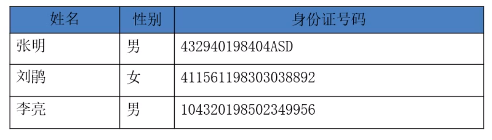

# 一、PHP 环境

PHP（Hypertext Preprocessor） 是超文本预处理器，一门服务器端的脚本语言。PHP 文件不能脱离服务器环境独立运行。不像HTML双击就可以看到结果，PHP必须通过服务器访问。


五个基本概念

1、静态页面和动态页面

```
静态页面：服务器不执行的页面
动态页面：服务器执行的页面
```


2、客户端和服务器端

```
浏览者这段是客户端
服务器端：给浏览者提供服务
```

 

3、端口和端口号        端口号的范围： 0-65535


4、BS架构和CS架构

BS：通过浏览器去访问服务器

```
b:browser（浏览器）
s:sever(服务器)

优点：
1、只要有浏览器就可以访问
2、开发低

缺点：
2、开发的代码都放在服务器上    胖服务器-瘦客户端
```

> 所有的web都是BS架构的


CS：通过客户端软件去访问服务器

```
c:client（客户端）
s:server(服务器)

优点：
1、可以开发客户端和服务器端，这时候就可以实现负载的均衡

缺点：
1、必须要安装一个软件才能去访问
2、开发成本高
```

> 例如：QQ、炒股软件


5、前台和后台

```
前台：浏览器看到的界面
后台：管理员看到的界面
```


 PHP的优点

1. 跨平台，既能在windows上运行，也能在linux上运行
2. 源码开放：不会涉及到版权问题
3. 语法简单：PHP入门简单
4. 运行在服务器端，只要在服务器部署环境就可以了。


Web服务原理

静态网站原理（浏览器-服务器）

动态网站原理（浏览器-服务器-数据库）

智能网站原理（浏览器-服务器【分析推荐】-数据库）


PHP 环境一般需要三个模块：

- Apache（Nginx） 提供服务器 Web 支持
- PHP  提供 PHP 脚本运行环境（这里的PHP只是服务器Web支持的一个扩展包）
- Mysql  提供数据库环境


编辑器：

- Visual Studio Code
- phpstorm（收费）


VSCODE 插件：

- PHP Intelephense（格式化插件）
- auto rename tag
- auto close tag
- tabout


## 1. Windows 中的 PHP 环境

phpStudy, XAMPP, WAMP


### 1.1 下载 WAMP

https://www.wampserver.com/


### 1.2 目录结构

~~~
- wamp
|---- bin  // 程序包文件夹
|		| ---- apache
|		|		| ---- bin  // 操作 Apache 的命令执行文件
|		|		|		| ---- php.ini  // PHP 配置文件
|		|		| ---- conf  // Apache 配置文件
|		|		|		| ---- extra  // Apache 配置扩展文件
|		| ---- php
|		|		| ---- ext  // 模块文件夹
|		| ---- mysql
|		|		| ---- bin  // mysql 所有命令执行文件
|		|		| ---- data  // 数据库文件路径
| ---- logs  // Apache、php、mysql 日志文件
| ---- alias  // 别名配置文件夹
| ---- www  // 发布网站根目录
~~~


### 更改 www 虚拟目录

找到 `C:\wamp64\bin\apache\apache2.4.46\conf` 中的 `httpd.conf` 更改对应代码：

~~~
DocumentRoot "${INSTALL_DIR}/www"
~~~


权限：

~~~shell
# 权限顺序：先允许，后拒绝
# Allow 和 Deny 可以写具体 IP，也可以写范围如：192.168
Order allow, deny
Allow from all
Deny from all

# +Indexes 允许索引
Options +Indexes +FollowSymLinks +Multiviews
~~~


如果有虚拟主机，开启了引入 httpd-vhosts.conf 对应 vhost 文件夹也需要更改 DocumentRoot ，具体更改路径看下边


### 更改默认首页

同样是在 `C:\wamp64\bin\apache\apache2.4.46\conf` 中的 `httpd.conf` 更改对应代码，优先级从前到后

~~~
DirectoryIndex index.php index.php3 index.html index.htm
~~~


### 更改默认端口

可以监听多个端口

~~~
Listen 0.0.0.0:80
Listen [::0]:80
Listen 81
~~~


### 1.3 WAMP 配置虚拟域名

在 D:\wamp\bin\apache\Apache2.2.11\conf 文件夹下，找到 httpd.conf ，使用诸如 Editplus 之类的编辑器打开它（不然会出现没有换行的情况），搜索

~~~
#Include conf/extra/httpd-vhosts.conf
~~~

把前面的#去掉，然后保存。


然后再去 D:\wamp\bin\apache\Apache2.2.11\conf\extra 文件夹下，找到 httpd-vhosts.conf
里边有两个 Example 的例子，直接按照例子改下就好了，如：

~~~
<VirtualHost *:80>
ServerAdmin admin@forece.net
DocumentRoot "d:/wamp/www/forece.net"
ServerName forece-local.net
</VirtualHost>
~~~


然后在 wamp/www 创建文件夹 forece.net


然后我们在 c:\windows\system32\drivers\etc\host 里边在将刚才创建的虚拟域名

~~~
127.0.0.1 forece-local.net
~~~


重启 WAMP


### 1.4 PHP 配置文件查询

~~~php
<?php phpinfo(); ?>
~~~

> 在页面中可以查看 PHP 配置文件位置


### 1.5 命令

~~~shell
httpd -v  # 查看版本
httpd -t  # 查看错误信息 test
php -v  # 查看php版本

~~~


### 1.6 补充

- 集成环境 WAMP 中，index.php 的权重要比 index.html 权重要高，同时拥有 index.php 和 index.html 的情况下，会先访问 index.php 文件
- 如果出现中文乱码，注意 HTML 和 php 文件中的 charset，还有 WAMP 中 php.ini 中的 charset


## 2. Linux 安装 PHP 环境

- LAMP
- LNMP


## 二、PHP 语法

## 1. PHP 语言标记

PHP 标记是可以嵌入 HTML 代码当中的，可以在任意 HTML 代码中插入 PHP 标记。PHP语言在服务端经过解析，然后生成新的HTML页面返回给用户。如：


~~~php+HTML
<!DOCTYPE html>
<html lang="en">
<head>
    <meta charset="UTF-8">
    <meta http-equiv="X-UA-Compatible" content="IE=edge">
    <meta name="viewport" content="width=device-width, initial-scale=1.0">
    <meta name="<?php echo KEYWORDS; ?>" content="">
    <meta name="<?php echo DESCRIPTION; ?>" content="">
    <title><?php echo TITLE; ?></title>
</head>

~~~


1. 标准格式： 

  ~~~php 
  <?php // 代码  ?> 
  ~~~

  > 标准风格标记，属于 XML 风格，如无特殊要求，开发中一般都用这种标记。

  

2. 长风格： 

  ~~~php
  <script language="php> 代码 </script>
  ~~~

  > 类似 javascript 风格，并不常用

  

3. 短风格：

  ~~~php
  <? 代码 ?>
  ~~~

  > 默认是被配置文件禁用的，需要通过 php.ini 中的 short_open_tag 才可以正常是使用

  

4. ASP/JSP风格：

  ~~~php
   <% 代码 %>
  ~~~

  > 属于 ASP 风格，默认也是被禁用的，需要将 php.ini 中的 asp_tags 打开才可以正常使用

  

- 短风格和ASP风格默认是被关闭的，因为可能会与一些其他技术发生冲突，例如 XML，所以一般如果书写 PHP 代码的话，只使用标准格式即可。
- 如果整篇代码只有 PHP 代码的文件， 结束标志 ?> 是不允许存在的，因为 PHP 自身并不需要 ?> ，这样做可以防止它的末尾被以外的注入。
- PHP 代码中，任意一行PHP代码都是是以 `;` （指令分隔符）结尾的，如果是在整个脚本的最后一行，`;` 可以不用写
- 空白、Tab、回车换行在PHP中是不被解析的。一般用来做风格控制
- 所有符号都是英文符号


### 1.1 echo 语句

echo 可以输出一个或多个字符串，echo 是一个语言结构，使用的时候可以不用加括号，也可以加上括号： echo 或 echo()。

~~~php
<?php
echo "hello world";
~~~


print 输出和 echo 类似，只是 print 有返回值，输出成功返回1，失败返回0

~~~php
<?php
	print "hello world"
~~~


特殊用法：

~~~php
<?=time();?>  // 相当于 <?php echo time(); ?>
~~~


## 2. 注释

~~~php
// 单行注释

/* 
多行注释
多行注释
多行注释
*/

/**
文档注释
文档注释
*/
~~~

> 注释要写在代码的上方或后边


## 3. 代码风格

下列情况应该总是使用两个空行

- 一个源文件的两个代码片段之间
- 两个类的声明之间


下列情况应该总是使用一个空行

- 两个函数声明之间
- 函数内的局部变量和函数的第一条语句之间
- 块注释或单行注释之前。
- 一个函数内的两个逻辑代码段之间，用来提高可读性。


# 三、变量

变量是用于临时（程序运行时）存储数据的容器。PHP 是弱类型语言，不要声明变量的数据种类，给变量赋值，数据是什么类型，变量就是什么类型。用柜子打比方来说，将书放进柜子，柜子就是书柜。衣服放进柜子，柜子就是衣柜。


## 1. 定义变量

定义变量的方法

~~~php
$变量名 = 数据;
~~~


变量名的命名规则：

- 不能以数字开头
- 不能使用PHP运算符号（+, -, *, / % &)
- 可以使用系统关键字（if, for）（因为加了$符，如 $if ）
- 变量区分大小写，命令不区分大小写
- 变量命名规则：$timeInfoLocation; （小驼峰命名法，首单词字母小写，次单词首字母大写）
- 变量名最好有意义，不要使用无意义的变量名。


在变量使用范围内，我们可以借助 `unset()` 函数释放指定的变量，使用 `isset()` 函数检测变量是否设置，使用 `empty()` 函数检查一个变量的内容是否为空。如：使用 `isset()` 测试变量是否存在

~~~php
if(isset($a));  {
    echo $a;
}
else{
    echo "not exist!";
}
~~~


## 2. 可变变量

~~~php
$one="######";
$two="one";
$three="two";
$four="three";

echo $four.<br/>; 
echo $$four.<br/>;  //相当于$three, 也就是 two
echo $$$four.<br/>; //相当于 $$three, $two, 也就是 one
echo $$$$four.<br/>; //相当于 $one， ######
~~~


利用可变变量（进阶）

~~~php
<?php
$name1 = 'tom';
$name2 = 'berry';
if (rand(1, 10) % 2) {
    $name = 'name1';
} else {
    $name = 'name2';
}
echo $$name;
~~~


## 3. 变量的引用赋值

类似于指针，指向原始变量，使用引用赋值，用 “&” 符号指向目标变量。


~~~php
$one=10;
$two=&$one;
$two=100;

echo $one."<br>";
echo $two."<br>";  // 指向 one 变量，只要其中之一改变，另外一个也改变。

// 输出结果：
100
100
~~~


PHP 引用并不像 C 语言中的地址指针，例如， 在表达式 $a=&$b 中，不会导致 $a 和 $b 在内存上同体，只是把各自的值相关联起来，基于这一点，使用 unset() 则不会导致所引用的变量消失。


在执行 unset() 后，变量 $a 和 $b 仅仅是互相取消值关联， $a 并没有因为 $b 的释放而消失。

~~~php
<?php
$a = 10;
$b = &$a;

// 销毁变量名
unset($b);
echo $a;

// 输出结果：
10;
~~~

> 只有变量值没有被任何变量引用的时候，变量值才会被系统回收


## 4. 变量类型

变量类型是指保存在该变量中的数据类型。 PHP 语言是一种弱类型检查语言，和其他语言不同的是，变量或常量的数据类型由程序的上下文决定。强类型语言中，变量需要先指定类型，如C语言，`int m=3;` 而在PHP语言中直接可以用 `$m=3;` 具体是什么类型由存放的内容决定，而不是人为事先指定的。

- 标量：整形、布尔型、浮点型、字符串
- 复合类型：数组、对象
- 特殊类型：资源类型、空类型


~~~php
var_dump(变量或值); // 查看变量值和类型

如：
var_dump(3); 
var_dump($a);
~~~


### 4.1 布尔型

最简单的类型，只有 true 或 false。即真或假。在PHP中进行关系运算（比较）或者逻辑运算中，返回值都是布尔型。


以下值都被认为是 False，其他都是 Ture（包括任何资源）

1. False
2. 整型0，（-1或其他任何非零，不论正负，都是 True）
3. 浮点型值 0.0 （其他任何浮点型都是 True）
4. 空白字符串和字符串“0” // 空白字符串是 "" ，而不是 " "，空格字符串是有值的。
5. 没有成员变量的数组
6. 没有单元的对象
7. 特殊类型 NULL 


echo 和 print 只能输出字符串，如果用 echo 输出布尔型：

~~~php
echo true;  // 1
echo false;  // 空
~~~

> 建议用 var_dump() 来查看数据类型


### 4.2 整型

整型变量用于存储整数，如 -2，-1,0,1,2..... 等等。一般用十进制，不过也支持八进制或十六进制。定义变量时，需要注意进制。


定义变量：

~~~php
$int=10; // 十进制
$int=045; //  八进制
$int=0xff; // 十六进制
~~~


进制转换：

| 进制     | 缩写 | 全程         |
| -------- | ---- | ------------ |
| 十进制   | dec  | decimalist   |
| 二进制   | bin  | binary       |
| 八进制   | oct  | octonary     |
| 十六进制 | hex  | hexdecimalst |


~~~php
echo decbin(16);  // 十进制转二进制
echo hexdec("FF");  // 十六进制转十进制
~~~


整型数值有最大的使用范围，32位系统中，最大值整数为二十多亿，具体为 2,147,483,647。 int型占4个字节，一个字节8位，也就是 1111 1111 1111 1111 1111 1111 1111 1111，值为：4294967295，但PHP 不支持无符号整数，所以最小值为 -2,147,483,648。 ，如果给定一个数据超出了整型这个范围，则自动转换为 float 型。同样，如果运算结果超出了 integer 的范围，也会返回 float 型。


可以使用 `PHP_INT_MAX` 全局变量查看整型长度最大值

~~~php
echo PHP_INT_MAX;
~~~


### 4.3 浮点型

浮点数，也就是小数（也称为双精度数或实数），通常用来表示整数无法表示的数据，例如金钱值、距离值、速度值等。浮点数的字长也是和平台相关的，允许表示的范围为 1.7E-38~1.7E+38.


~~~php
$num1 = 10.0;
var_dump($num1);  // float

$num2 = -10.1;
var_dump($num2);  // float 

$num3 = 3.14E+5;  // 科学计数法：相当于 3.14 x 10^5
$num4 = 3.14E-5;  // 科学计数法：相当于 3.14 x 10^-5
~~~


浮点数只是一种近似的数值，如果用浮点数表示 8，则该结果内部的表示其实是类似 7.99999999999，所以永远不要比较两个浮点数是否相等。

~~~php
var_dump(0.9 == (1-0.1));  // true
var_dump(0.1 == (1-0.9));  // false
~~~


如果需要比较浮点数，需要确定小数点的位数，可以使用四舍五入函数 round()，或 number_format()

~~~php
$num1 = round(0.1, 2);
$num2 = round(1 - 0.9, 2);
var_dump($num1 == $num2);  // true
~~~


或者用 bccomp() 函数

~~~php
// -1 	左边数比右边大
// 0 	左边数与右边相等
// 1	左边数小于右边
var_dump(bccomp(0.1, 1-0.9, 5));
~~~


如果一个整数超出了整型的范围，会自动转化为浮点型。


### 4.4 字符串

字符串也是 PHP 中的标量类型之一，它是一系列字符，和强类型语言不通，PHP 没有字符一说，也就是没有 char 类型，所有字符都算是字符串类型。字符串可以使用单引号，双引号，定界符三种方法定义。


**单引号**

~~~php
$str= 'Hello World'; 
~~~


指定一个简单字符串的最简单的方法使用单引号括起来。在单引号引起来的字符串中不能再包含单引号。如果需要在单引号中表示另一个单引号的话，需要用反斜线（\) 转义。如：

~~~php
$str ='This is an \'Apple\'';

输出：
This is an 'Apple'
~~~


注意：

- 在单引号中不能使用其他转义字符，只能转义单引号和转义符号本身

- 另外，在单引号字符串中出现的变量不会被变量的值替代，即 PHP 不会解析单引号中的变量，而是将变量名原样输出。


所以在定义简单字符串时，使用单引号效率会更高，因为 PHP 解析时不会花费一些处理字符转移和解析变量上的开销。因为，如果没特殊需求，应使用单引号定义字符串。


**双引号**
如果使用双引号括起字符串，PHP 懂得更多特殊字的转义序列。另外，双引号字符串最重要的一点是其中的变量名会被变量值替代。


常用转义字符：


~~~php
$str="aa$int aaa"; // 用空格隔开，使变量可以正常解析
$str="aa{$int}aaa"; // 用大括号隔开变量旁边的两个字符串
$str="aa${int}aaa"; // 用大括号隔开，但一般不使用这种方法。
$str="\$int"; // 不解析变量，直接显示 $int 这个字符串，
~~~


**定界符**（大量字符串使用）：

在大篇幅文章中，里边可能包含很多的单引号和双引号，我们不可能一个一个用转义符将这些特殊符号转义。所以我们用定界符。

~~~php
$str=<<<one
        This is an "example" text; it can contain any characters
        and sympols.
one;
~~~

> //one后边不能有任何符号，结束符前不能有任何符号


- 使用 <<< 小于号

- 小于号后边可以任意命名一个标记名，左侧挨着<<<，直接回车，不能加任何字符。

- 在结尾的字符串定界中，一定要顶头写，和开始的字符串要一致，并且直接回车。

- 定界符文本不能初始化类成员，和双引号的功能一样。虽然定界符文本不需要转义符号，不过仍然可以使用转义符号。定界符中的变量也会被解析。

- 在开始的定界符号中，如果使用单引号将标记括起来，则不对变量进行转义。如：$str=<<<'EOF' 


### 4.5 其他类型

**数组**

数组是 PHP 中一种重要的复合数据类型，数组可以存放多个数据。之后会详解数组~~

~~~php
$arr = array(1,2,3,4,5);
~~~


**对象**
对象在 PHP 中也是一种复合数据类型，但对象是一种更高级的数据类型，一个对象类型的变量，是由一组属性值和一组方法构成的。其中属性表明对象的一种状态，方法通常用来表明对象的功能。

~~~
$obj = {name:"Jay"};
~~~


**资源类型**

资源是一种特殊类型，保存了到外部资源的一个引用。资源是通过专门的函数来建立和使用的。使用资源类型变量保存有为打开文件、数据库连接、图形画布区域等的特殊句柄。


**空类型**

空类型也是一种特殊变量，它没有值， NULL 不表示空格，也不表示为零，也不是空字符串。 NULL 不区分大小写。


**NULL**

尚未被赋值的变量或被 `unset()` 函数销毁的变量。


**伪类型**
一般用在解释说明中，不是真实类型，只是为了确保代码的易读性。

~~~php
/*  
@param number $a 
demo (mixed $a) 
*/
~~~

- mixed 说明一个参数可以接受多种不同的类型
- number 说明一个参数可以使整型或浮点型
- callback 说明可以用自定义函数来作为一个参数。


## 5. 数据之间类型的转换

类型转换是指将变量或值从一种数据类型转换成其他数据类型。转换方法有两种，一种强制转换，另外一种是自动转换。如果是数字类型之间的转换，注意精度的丢失。


### 5.1 自动转换

在参与运算时，小类型会往大类型转。

- 布尔型参与运算时，TRUE转换为整型1，FALSE 将转换为整型0后再参与运算

- 有NULL参与运算时，NULL值将转换为整型0再参与运算，NULL转换为字符串为''

- 有 int 和 float 型参与运算时，先将 integer 型变量转换为 float 再参与运算

- 有字符串和数值型数据参与运算时，字符串先转换为数字，再参与运算，如123abc 转换为整数123，字符串123.45abc转换为123.45，字符串abc，则转换为0。123e3abc自动变换为123e3。

> 注意，如果浮点型转整型，注意数值范围，有可能会丢失数据。


### 5.2 强制转换

用 `settype()` 函数强制转换，将原变量给转换。

~~~php
gettype();  // 获取变量类型
settype(); // 转换变量类型
~~~


例：

~~~php
$int = 10;
echo gettype($int); // 获取 $int 变量的类型
settype($int, "string"); // 将 $int 变量转换为字符串型
~~~


### 5.3 追加类型符号

在变量使用时，前边加上类型符号，是在赋值时，给新变量一个新类型，原类型不变。

- (int), (integer)
- (bool), (boolean)
- (float), (double), (real)
- (string)
- (array)
- (object)


例：

~~~php
<?php
$int = "10000";
$d = (int)$int;
echo gettype($d);
echo "<br/>";
echo gettype($int);

# 结果：
integer
string
~~~


### 5.4 转换函数

还可以使用专门的转换函数强制转换

- intval() 
- floatval()
- strval()

```php
$str = "123.45abc";
$int = intval($str); // 获取变量 $str 的整型值 123
$flo = floatval($str); // 获取变量 $str 的浮点值 123.45
$str = strval(123.45); // 转换123.45为字符串。
```


### 5.5 判断变量类型的函数

可以用 gettype(); 函数来进行判断变量类型，如：

~~~php
<?php
$a = "name";
if(gettype($a) == "string") {
	echo "\$a is string type";
}
~~~


也可以使用 php 提供的判断函数

- is_bool()
- is_int(), is_integer(), is_long()
- is_float(), is_double(), is_real()
- is_string()
- is_array()
- is_object()
- is_resource()
- is_null()
- is_scalar()
- is_numberic()
- is_callable()


~~~php
if (empty($a));  // 是判断变量内容是否为空
if (is_null($a));  // 是判断变量类型是否为空
~~~


## 6. 常量

在php中声明常量是通过 define(); 函数来定义的。常量的命名和变量类似，也要遵循php命名规则。另外，声明常量默认和常量一样区分大小写。不过按照惯例来说，常量名称总是大写的。但不要在前边加$符号。


- 常量的效率要比变量高


### 6.1 常量的声明

声明格式如下：

~~~php
define("NAME", "张三");
~~~


默认常量是区分大小写的，当声明函数时，在后边添加一个参数，则可以使定义的常量不区分大小写。如：

~~~php
define("NAME", "张三", true);
~~~


- 常量一旦声明，则不会改变
- 常量可以参与计算，如果常量没有声明值，则系统在使用时，会被当作字符串使用。如果不加单引号或双引号，虽然会被自动转换，但是速度要慢很多（效率低）。所以，如果常量是字符串，则需要用双引号或单引号来引用。
- 常量只支持标量数据类型
- 常量不能使用 unset(); 清除一个常量。
- 常量可以使用 defined(); 函数来查看是否被定义。
- 常量的范围是全局的
- 也可以使用 echo constant ("常量名"); 来输出常量。


可以通过 defined() 判断常量是否已经被定义

~~~php
if (!defined('NAME')) {
    define('NAME', 'zs');
}
echo NAME;
~~~


还可以使用 const 关键字定义常量

~~~php
const NAME = 'tom';
~~~


### 6.2 系统中预定义的常量

像 M_PI 数学中的 π，还有 NULL，TRUE，FALSE 等这些都是系统预定义好的常量。用 `get_defined_constants();` 来获取所有已定义常量。


获取所有预定义变量

~~~php
print_r(get_defined_constants());
~~~

> 因为是数组，所以不能用 echo 来输出到屏幕


简单的预定义变量

~~~php
PHP_OS			// 当前系统名
PHP_VERSION		// PHP 当前版本
DIRECTORY_SEPARATOR  // 目录分隔符
~~~


### 6.3 PHP 中的魔术常量

魔术常量，虽然常量会能改变其本身的值，但是下边这几个常量的值是根据其所在文件的位置而改变。

~~~php
__LINE__		// 当前文行数
__FILE__		// 当前的文件名
__DIR__			// 当前文件夹
__FUNCTION__	// 当前的函数名
__CLASS__		// 当前的类名
__METHOD__		// 当前对象的方法名
__NAMESPACE__	// 当前命名空间的名称
~~~


# 四、PHP中的运算符

运算符可以根据操作数的个数分为一元运算符、二元运算符、三元运算符。

- 一元运算符只运算一个值，如!（取反运算符）或 ++ （加一运算符）。
- 二元运算符可以运算两个值，比如，加减乘除等等。
- 三元运算符只有一个 (?:)


~~~php
运算元		运算符		运算元
1			+			1
~~~


一元运算符：! ++ -- +1 -1
二元运算符：+ - * / % > < = 
三元运算符：1?(2:3)


按不同功能分类，可以分为算数运算符、字符串运算符、赋值运算符、比较运算符、逻辑运算符、位运算符和其他运算符。

- 算术运算符： + - * / % ++ --
- 赋值运算符： = += -= *= /= %=
- 比较运算符： > < == >= <= ===  != !==
- 逻辑运算符： && || !
- 位运算符： & | ^ ~ >> <<
- 其他运算符： 1?2:3, @ -> 


### 1. 算数运算符

算数运算符中除了常见的 + - * / 之外，还有 %, ++, --

使用方法和平常的用法一样，以下说一下几个特别的算术运算符。


####  1.1 加号

其他语言中，+号除了有加法的作用，还有连接字符串的功能，但是PHP中不能连接字符串，如：Javascript 语言中的加号

~~~javascript
var a=10;
alert(1+1+"4+5+6"+1+1);  // 结果是24+5+611，前边是数学运算，后边是字符串连接
~~~


在PHP中，如果用 + 的话，

~~~php
echo 1+1+"4+5+6"+1+1;
~~~

> 结果为8，因为字符串会自动转换整数4。


#### 1.2 % 号

% 是模运算符，作用是求余数。也称作求余运算符。正负号由前边的数决定，浮点数求余将%运算符两侧数字自动转换为整数后然后进行运算。

~~~php
<?php
echo 5 % 2;
echo "<br/>";
echo 6.2 % 4;

结果：
1
2
~~~


用途：

- 求余数
- 让一个数不超过一个值（任何数和5求模都不会超过5）
- 求什么被整除  `if($num % 5 == 0){ }`


#### 1.3 ++ 、-- 运算符

~~~php
++$a // 运算符在前边，先做运算在使用变量
$a++  // 变量在前边，先使用变量在运算
~~~


例：

~~~php
$a = 5;
$b = $a++ + ++$a; // 先用$a, 为5，然后自增变6，再自增为7
echo $b; // 12
echo "<br/>";
echo $a; // 7
~~~


$a = $a+1 与 $a++ 区别

- $a= $a+1 的话，布尔型会转换为整型参与计算，而使用递增/递减运算符的话，布尔型不参与++ -- 运算，结果依然是布尔型。

- 递减运算符对 NULL 也没有效果，但是递增 NULL 的结果为1.


另外，在处理字符串变量运算时，字符串会被自动转换为数字型或者0，而自增运算符的话，会自增字符串中的字母，如：

```php
$a = "a";
$a++;
echo $a; // 会显示b

$a = "z";
$a++;
echo $a // 显示aa

$a = "aaaa"
$a++;
echo $a; // 会显示 aaab
```

> 注意：字符变量只能递增不能递减


### 2. 字符串运算符

在PHP中字符串运算符只有一个，是英文的句号（.) ，也称为连接运算符，它是一个二元运算符，返回其左右参数连接后的字符串。这个运算符不仅可以将两个字符串连接起来，也可以将一个字符串和任何标量数据类型相连接，合并成新的字符串。

~~~php
$name = "Tom";
echo "My name is ".$name;
~~~

> 字符串连接符不能连数值，只能连变量或字符串。


echo 输出字符串与变量的几种方法：

~~~php
<?php
$a = 10;
echo '这个变量的值：'.$a.'<br>';  // 字符串连接符连接变量与字符串
echo "这个变量的值：{$a}<br>";  // 双引号解析变量
echo "这个变量的值：",$a,"<br>"; // 参数
~~~


### 3. 赋值运算符

= 赋值运算符，将右侧表达式的值赋给左侧的变量。如： `x=3;`

~~~php
$a +=1; // $a = $a +1;
$a -=1; // $a = $a -1;
$a *=1; // $a = $a *1;
$a /=1; // $a = $a /1;
$a %=1; // $a = $a %1;
$a .="1"; // $a = $a."1";
~~~


### 4. 比较运算符

比较运算符也称为关系运算符，是一种常用的二元运算符，用于对运算符两边的操作数进行比较。比较运算符的结果是布尔型。比较后的关系为真，true，假为false。

~~~php
$a > $b;
$a < $b;
$a == $b;
$a >= $b;
$a <= $b;
$a <> $b; 或 $a != $b;
$a === $b; // 全等于，左侧操作数等于右侧操作数，并且类型也相同时，返回 TRUE
$a !== $b; // 非全等于，左侧不等于右侧，并且类型也不相同时，返回 TRUE

$a = "007";
$b = 7;
var_dump( $a == $b);  // 返回 ture，因为比较运算符会将两测的操作数自动转换为相同类型。
var_dump( $a === $b); // 返回 false，因为类型不同
~~~


### 5. 逻辑运算符

逻辑运算符用来判断一件事情是 “对” 还是 “错” ，或者说是成立还是不成立，逻辑运算符只能操作布尔型数值，处理后的结果也是布尔型的数值。逻辑运算符有 and, or, not, xor ，还有 &&, ||, !  ，符号和英文的作用是一样的，只不过符号的优先级要比英文的要高，建议使用符号。


#### 5.1 and 和 &&  -  逻辑与

两边操作数都为 True 时，返回 True，否则 False

~~~php
$a=4;
$a > 5 && $a <100;  // 前边判断不成立，后方即不判断直接判定为 False

~~~


#### 5.2 or 和 ||  -  逻辑或

两边都为 False，返回 False，否则 True

~~~php
$a=4;
$a<5 || $a<100; // 前方判断成立，直接为 True, 后边不执行
~~~


例：

~~~php
$link = mysql_connect("localhost", "root", "") or die("数据库连接失败!");
// 如果连接成功则不显示后方数据，如果失败则显示连接数据库失败
~~~


#### 5. 3 not 和 !   -  逻辑非

当操作数为 True 时返回 False，否则 True

~~~php
$a = true;
// 当$a为true的时候不执行代码，当$a为false的时候执行代码
if(!$a){
    // 代码
}
~~~


#### 5.4 xor -  逻辑异或

两边操作数只有一个为 True 时，返回 True，否则 False


例：判断是否是闰年

~~~php
<?php 
$year =2000;
if(( $year%4==0 && $year%100!=0) || $year%400==0) {
echo "$year is leap year";
}
else {
echo "$year is not leap year";
}
~~~


#### 5.5 短路

在逻辑运算符中，运算是从左向右的，指如果在进行前面的表达式的运算过程，通过判断已经明确的知道整个表达式的结果，那么就不会进行后面表达式的运算判断。

```php
$a = 0;
$b = 0;
if ($a = 3 || $b = 3) {
    $a++;
    $b++;
}
echo $a.",".$b;
```

> 赋值运算符优先级最低， 可以看成 $a=(3||$b=3)，因为在 || 运算中，左侧 3 已经是 true 了，所以短路，右侧不进行运算，得到布尔型数据 true, $a = ture; 又因为 ++ 自增运算符对布尔型不起作用，所以 $a 输出为 1， 而$b没执行，$b 还是0，$b++ 后为 1；


~~~php
$a = 0;
$b = 0;
if ($a = 3 && $b = 3) {
    $a++;
    $b++;
}
echo $a.",".$b;
~~~

> 和上方一样，先判断 3 && $b=3，左侧为真，右侧是赋值运算符，也为真，等式成立，$a 为 true，自增对布尔型数据无效，$a 输出为 $1，$b被赋值为3，然后$b++后为 4。


### 6. 位运算符

任何信息在计算机中都是以二进制数形式保存的，位运算符允许对整型数中指定的位进行置位。如果左右参数都是字符串，则位运算符将操作字符的 ASCII 值，如果是浮点数则会自动转换为整型再参与位运算。位运算用于对操作数中的每个二级制位进行运算，包括位逻辑运算符和位移运算符，没有错位和进位。


32位计算机，整型数据由4个字节保存，1个字节8个位，所以是一共32个0，左侧第一个位时符号位（0为正数，1为负数），剩下的代表数据。

0 0000000 00000000 00000000 00000000


二进制最后一位是2的0次方，第二位是2的1次方，以此类推一直到2的31次方，可以把一个数拆解成 2的n次方相加，就可以得到这个数的二进制。

```
104 = 64 + 32 + 8  = 2^6 + 2^5 + 2^3 
01101000 = 104
```


位运算符：

```
&		按位与			参与运算的两位都为1，运算结果为1，否则为0
| 		按位或			参与运算的两位都为0，运算结果为0，否则为1
^		按位异或		参与运算的两位不同，运算结果为1，否则为0
~		按位非			将二进制表示的操作数中的1变成0,0变成1
<<		左移			
>>		右移
```


#### 6.1 & 按位与：

```
00001100

00001101   &
-------------------

00001100
```


#### 6.2 | 按位或：

```
00001100

00001101  |
-------------------

00001101
```


#### 6.3 按位异或

```
00001100

00001101    ^
--------------------------

00000001
```


#### 6.4 按位非：

```
~00001100
-------------------
11110011
```


#### 6.5 << 左移

```
var dump (12 << 2);

00001100 <<2
---------------

00110000
```

> 二进制整体左移，左侧溢出，右侧补0。
> 每移动一位，相当于*2。


#### 6.6 >> 右移 

```
varm dump(12>>2);

00001100 >>2
---------------------

00000011
```

> 二进制整体右移，右侧溢出，左侧补0
> 每移动一位，相当于 /2。


补充：

在正数进行位移的时候，位运算以0补位，负数位移的时候，位运算以1补位。

```
varm dump(-5>>2);

11111011 >>2
---------------------

11111110

结果：
-2
```


负数二进制换算，反码 + 1 

```
-1 的二进制

正数： 1
0000 0000 0000 0000 0000 0000 0000 0001
反码：
1111 1111 1111 1111 1111 1111 1111 1110
补码：（反码+1）
1111 1111 1111 1111 1111 1111 1111 1111
```


负数二进制转换为十进制

```
二进制：
1111 1111 1111 1111 1111 1111 1111 1111
补码：（二进制-1）
1111 1111 1111 1111 1111 1111 1111 1110
反码：
0000 0000 0000 0000 0000 0000 0000 0001
```

> 由该二进制转为十进制，结果为1，然后加上负号，-1


其他语言中还有 >>> 和 <<< ，也是位运算符，忽略符号位，带着符号位整体移动，补位只补0。如：

```
-1 >>> 2

二进制：
1111 1111 1111 1111 1111 1111 1111 1111
无符号右移两位：
0011 1111 1111 1111 1111 1111 1111 1111

```


#### 6.7 位运算

整型位运算

```
var_dump(2 & 4);  //结果为0

0010
0100  &
-------
0000
```


字符串的位运算


位运算时的数据类型为 string/integer时，分析时要转换为二进制，但是在程序中书写及输出结果时仍为 string / integer 类型。如： 

```
var_dump( 'A' & 'a'); // 结果为 A
var_dump('A' | 'a'); // 结果为 a


相当于
65 & 97;
65 | 97;
```

> 先将 A 转换为 ASCII 码的值，然后再做位运算，运算后再将数值换源成 ASCII 吗转换为字符串。多个字符串同样适用，如 'AA'


字符串和整型进行位运算时，相当于字符串和整型进行运算，数字类字符串会自动转换为整型，其他文字字符串转换为0，规则与之前介绍的一样。

```
var_dump('a' & 97);  // 结果为0
```

>因为 a 是字符串，字符串与数字做运算，字符串先要转换为整型，文本类型字符串会变为0，与 97 做位运算，结果还是0。


#### 6.8 逻辑运算符与位运算符的区别

逻辑运算符结果是布尔型，而位运算符运算出来的结果是数值

```
var_dump( true && false); // 结果为 false
var_dump( true & false);  // 结果为 0
```

> & 也可以用作 if 的条件判断中，因为 1 和 0 也可以当做判断。


- && 或 || 会短路（如果左侧不成立，右侧不会执行）
- & 或 | 不会短路（两侧都会执行）

> - 所以如果只有一个条件或者不需要短路，可以使用位运算符。
> - 如果多个条件，又需要短路，最好还是用逻辑运算符


### 7. 其他运算符

#### 7.1 ?: 三元运算符

?: 可以提供简单的逻辑判断，是 PHP 中唯一的三元运算符，类似于条件语句 "if ... else...."

```
条件 ? 表达式1 ： 表达式2
```

> 如果条件为真，则执行表达式1，否则执行表达式2


```
$a < $b ? $c = 1:$c = 0
```


**进阶三元运算符：(expr1) ? :(expr2)**   

> 这个是php5.3开始才有的功能

在 expr1 求值为 TRUE 时返回 expr1，否则返回 expr2。


例子

```
$a = $a ?: 1;
```


#### 7.2 ?? 运算符

?? 运算符由三元运算符进化而来，PHP7.1 支持

~~~php
(expr1)??(expr2)
~~~


例：

~~~php
echo $name ?? '姓名不详';
~~~

如果 $name 为空，则使用 ?? 后边的字符串或变量，如果不为空，则使用 $name


 这个运算符相当于：

```php
$name = isset($name) ? $name : '姓名不详';
echo $name;
```

> isset() 检查变量是否被声明，empty() 检查变量是否为空.


#### 7.2 ``执行运算符 

注意，这个符号不是引号，是键盘上数字1左侧的反引号

反引号中的语句，是被 PHP 当做 shell 命令来执行的，如：

~~~php
$a = `ls -al`;
echo `ipconfig`;  // 返回系统命令执行的结果
~~~

> 效果与函数 shell_exec(); 相同

虽然可以执行 shell 命令，但是有安全隐患，并且对平台有要求，因为不同系统 shell 命令不同，所以对跨平台支持不太好。


#### 7.3 @ 错误控制运算符

当将其放置在一个 PHP 表达式之前时，该表达式可能产生的任何错误信息都会被忽略。它只对表达式有效。如果用@屏蔽掉警告信息，这些信息不会输出给浏览器，存在的错误并没有被真正解决。

```php
@$num = 100/0;  // 除数不能为0
```

> 注意不要写在关键字上，而需要写在表达式上，如：echo @num;  而不能写成 @echo $num; 因为 echo 不是表达式。


### 8. 运算符优先级

| 结合方向 | 运算符                                                       | 附加信息                   |
| :------- | :----------------------------------------------------------- | :------------------------- |
| 不适用   | `clone` `new`                                                | clone 和 new               |
| 右       | `**`                                                         | 算术运算符                 |
| 不适用   | `++` `--` `~` `(int)` `(float)` `(string)` `(array)` `(object)` `(bool)` `@` | 类型、递增／递减           |
| 左       | `instanceof`                                                 | 类型                       |
| 不适用   | `!`                                                          | 逻辑运算符                 |
| 左       | `*` `/` `%`                                                  | 算术运算符                 |
| 左       | `+` `-` `.`                                                  | 算术运算符 和 字符串运算符 |
| 左       | `<<` `>>`                                                    | 位运算符                   |
| 无       | `<` `<=` `>` `>=`                                            | 比较运算符                 |
| 无       | `==` `!=` `===` `!==` `<>` `<=>`                             | 比较运算符                 |
| 左       | `&`                                                          | 位运算符 和 引用           |
| 左       | `^`                                                          | 位运算符                   |
| 左       | `|`                                                          | 位运算符                   |
| 左       | `&&`                                                         | 逻辑运算符                 |
| 左       | `||`                                                         | 逻辑运算符                 |
| 右       | `??`                                                         | null 合并运算符            |
| 左       | `? :`                                                        | 三元运算符                 |
| 右       | `=` `+=` `-=` `*=` `**=` `/=` `.=` `%=` `&=` `|=` `^=` `<<=` `>>=` `??=` | 赋值运算符                 |
| 不适用   | `yield from`                                                 | yield from                 |
| 不适用   | `yield`                                                      | yield                      |
| 不适用   | `print`                                                      | print                      |
| 左       | `and`                                                        | 逻辑运算符                 |
| 左       | `xor`                                                        | 逻辑运算符                 |
| 左       | `or`                                                         | 逻辑运算符                 |

> 括号可以提升优先级，将表达式中的某个部分看做一个整体。如果不清楚优先级，最好使用括号。


例：

```php
if($a = 3 && $b = 3){
	// 代码
}
```

> && 优先级比 = 要高，所以这个表达式应该看做 $a = (3 && $b = 3) ，结果 $a = true


### 9. 表达式

在 PHP 中，几乎所编写的任何代码都可以看做一个表达式，通常只要有变量、常量和运算符参与的的组合。简单但最精确的定义：“任何有值的东西”


# 五、流程控制

流程控制对于任何一门编程语言来说都是至关重要的，它提供了程序控制步骤的基本手段，是程序的核心部分。在任何一门程序设计语言中，都需要支持满足程序结构化所需要的三种结构：

- 顺序结构
- 分支结构（选择结构）
- 循环结构


## 1. 顺序结构

在程序结构中，最基本的就是顺序结构，顺序结构就是语句按出现的先后次序顺序执行。在 PHP 程序中，顺序结构的语句主要是赋值语句、输入/输出语句等。如：

```php
$a = 10;
$b = 20;
$sum = $a * $b;
echo $sum;
```


## 2. 分支结构

分支结构的执行是依据一定的条件选择执行，分支结构可以有以下几种形式：

- 单一条件分支结构

- 双向条件分支结构

- 多向条件分支结构

- 巢状条件分支结构


### 2.1 单一条件分支结构

```php
if (表达式)  // 不能在后边加分号
语句块; // 条件成立则执行，不成立则跳过
```


如果是多条语句，则可以用 { } 如：

```php
if (表达式) {
    语句1;
    语句2;
    语句3;
    语句4;
}
```

> 建议不论包含多少语句，都使用大括号 { }


### 2.2 双向条件分支结构

if 语句中也可以包含 else 子句，经常需要在满足某个条件时执行一条语句，而在不满足该条件时执行其他语句。 else 可以在 if 语句中的表达式为 False 时执行。 else 语句是 if 语句的子句，必须和 if 一起使用，不能单独存在。


~~~php
if (表达式) {		// if 判断是否成立
    语句;			// 条件成立则执行的语句
}
else {			
	语句;			// if 条件失败则执行 else 中的语句
}
~~~


例：求闰年

~~~php
<body>
<?php
if(!empty($_POST)){	//$_POST不为空说明有post提交的数据
	//var_dump($_POST);
	$year=$_POST['year'];	//获取年份
	if($year==''){
		echo '您没有输入年份';
	}else{
		if(is_numeric($year)){	//判断$year是否是数字或字符串数字
			$year+=0;		//将字符串数字转成数字型  
			if(is_int($year)){	//is_int用来检测变量是否是整型
				if($year<1){
					echo '年份必须正整数';
				}else{
					if($year%4==0 && $year%100!=0 || $year%400==0)
						echo "{$year}是闰年";
					else
						echo "{$year}是平年";
				}
			}else{
				echo '您输入的不是整数';
			}
		}else{
			echo '您输入的不是数字';
		}
	}
}	
?>
<form method="post" action="">
	请输入年份： <input type="text" name="year"> <br />
	<input type="submit" name="button" value="判断闰年">
</form>
</body>
~~~


### 2.3 多向条件分支结构

**多向条件分支结构 elseif() 子句，也可以用 else if()**

~~~php
语法格式：
if(表达式1){  // 如果表达式1为true，执行语句1
    语句1;
}elseif (表达式2){  //如果表达式2为True，则执行语句2
    语句2;
}else if(表达式3){  // 如果表达式所有条件都不成立（FALSE），执行 语句n
    语句3;
}else{
    语句n;
}		
~~~


在 elseif 语句中同时只能有一个表达式为 TRUE，即在 elseif 语句中只能有一个语句块被执行，即从多个 elseif 从句是排斥关系。这种多向条件分支结构适合对同一个变量的值在不同范围内进行判断。


注意 elseif 是连在一起的，如果 else if 这样分开来写的话，就变成了：

~~~php
if (条件){
    else {
        if (条件){


        }else {
        }
    }
}
~~~


使用 elseif 语句有一条基本规则，即总是有限把包含范围小的条件放在前边处理，如 $hour < 6 和 $hour < 9 两个条件。

```
if ($hour < 6) {
    echo "凌晨好";
} elseif ($hour < 9) {
    echo "早上好";
} else {
    echo "你好";
}
```


例：求平均成绩

~~~php
<body>
<?php
if(isset($_POST['button'])){	//点击了提交按钮
	$ch=$_POST['ch'];		//获取语文成绩
	$math=$_POST['math'];	//获取数学成绩
	if($ch=='' || !is_numeric($ch) || $ch<0 || $ch>100){
		echo '语文成绩必须在0-100之间';
	}
	elseif($math=='' || !is_numeric($math) || !($math>=0 && $math<=100)){
		echo '数学成绩必须在0-100之间';
	}else{
		$avg=($ch+$math)/2;		//求平均值
		echo "您的平均分是：{$avg}<br>";
		if($avg>=90)
			echo 'A';
		elseif($avg>=80)
			echo 'B';
		elseif($avg>=70)
			echo 'C';
		elseif($avg>=60)
			echo 'D';
		else
			echo 'E';
	}
}
?>
<form method="post" action="">
	语文: <input type="text" name="ch"> <br />
	数学： <input type="text" name="math"> <br />
	<input type="submit" name="button" value="判断成绩">
</form>
</body>
~~~


**多向条件分支结构还有一个 Switch 结构：**

判断表达式中的值是否 == case 值，如果为 true，则执行 case 中的代码。

~~~php
<?php
switch (表达式) {       //使用 switch 语句，对表达式求值
    case 值1：		    // 如果表达式的值和 “值1” 匹配，则执行 语句1、2、3、4，然后退出
        语句1;
        语句2;
        语句3;
        语句4;
        break;		    // break 用来退出分支结构
    case 值2:
        语句5;
        break;
    case 值3:
        语句6;
        break;
        ......			// case 语句可以无限增加
    default:			// 如果和其他 case 都不匹配的话，执行 default 默认，但 default 不必须的
        语句n+1;
        }				// 不要忘了花括号结束
        
~~~


switch - case 需要注意的一些细节：

1. 如果 case 语句过多，需要将多个语句做成一个函数或对象

2. switch（变量）的类型，允许整型或字符串或布尔型。

3. switch 语句是顺序执行，根据变量匹配好case后，依次执行case中的语句，直到switch结束或者碰到 break，break 是退出 switch 结构使用的，如果需要同时匹配多个值，可以使用多个 case，而不用加 break。

   ```
   case 1:
   case11:
   case111:
   echo " 这些case都符合";
   break;
   ```

4. 单个值匹配的时候，switch - case 比较方便，但 general 来说，else if 要比 switch 强大。一般判断范围的时候，我们用 else if


例题：改变文字颜色

~~~php+HTML
<body>
<?php
if(isset($_POST['button'])) {
	switch($_POST['color']){
		case '1':
			$color='#FF0000';	//红色
			break;
		case '2':
			$color='#009900';	// 绿色
			break;
		case '3':
			$color='#0000FF';	//蓝色
			break;
		default:
			$color='#000000';	//黑色
	}
	echo <<<str
	<script type="text/javascript">
	window.onload=function(){
		document.getElementById('shi').style.color='$color';
	}
	</script>
str;
}
?>

<div id="shi">
	锄禾日当午， <br />
	
汗滴禾下土。 <br />
	
谁知盘中餐， <br />
	
粒粒皆辛苦。 <br />
</div>
<form method="post" action="">
	<select name="color">
		<option value="0">请选择颜色</option>
		<option value="1">红色</option>
		<option value="2">绿色</option>
		<option value="3">蓝色</option>
	</select>
	<input type="submit" name="button" value="更改颜色">
</form>
</body>
~~~


### 2.4 巢状条件分支结构

巢状条件分支结构就是 if 语句的嵌套，即指在 if 或 else 后边的语句块中又包含 if 语句。 if 语句可以无限层的嵌套在其他的 if 语句中。语法表达式如下：

~~~php
if (表达式1) {
	if (表达式2) {
		...
	} else {
		...
	}
} else {
	if (表达式3) {
		...
	} else {
		...
	}
}
~~~


例：

~~~php
<?php
$name = "Jason";
$sex = "F";
$age = 30;

if ($sex == "Male") {
    if ($age > 60) {
        echo "{$name}, This guy has been retired " . ($age - 60) . " years";
    } else {
        echo "{$name}, This guy has to wait " . (60 - $age) . " years to retire";
    }
} else {
    if ($age > 55) {
        echo "{$name} has been retired " . ($age - 55) . " years";
    } else {
        echo "{$name} has to wait " . (55 - $age) . " years to retire";
    }
}

~~~


### 2.5 HTML 条件语句拆分写法

~~~php
<?php if(2 > 1){ ?>
    <p>输出HTML语句</p>
<?php } ?>
~~~

> 同样方法也适用于循环


## 3. 循环结构

根据循环停止的条件不同、PHP提供两种类型的循环语句，一种是计数类循环语句，通常使用 for 语句，另外一种是条件循环语句，通常使用 while 或 do...while 来完成。另外还有一个已经不怎么使用的 goto 语句。

- while
- do...while
- for 
- goto


### 3.1 while

while 语句中的表达式结果一定要是布尔型的 true 或 false，如果是其他类型的值也会自动转换为布尔型。当表达式为 true 时，执行代码块。然后继续判断表达式，进入循环。直到表达式为 false 跳出循环。语法如下：

~~~php
while (表达式){
	语句块; // 循环体
}
~~~


一般会再 while 外，定义一个计数器，然后在 while 循环中给出一个跳出条件。


例：

~~~php
$i=0;
while($i<=100){
	echo "$i <br/>";
	$i++;
}
~~~


练习题：

请说出以下两端代码中最后 $i 的结果，以及两端代码中输出有什么不同。

~~~php
// 代码1
$i = 0;
while($i<10){
    echo ++$i;

}

echo "<br/>".$i;

// 代码2
$i = 0;
while($i<10){
    echo $i++;

}

echo "<br/>".$i;
~~~

> - 第一段代码循环体是 ++$i ，先做自增再执行 echo 显示，所以显示的 123456789，在 $i == 8 的时候，继续进入循环，然后自增再显示9，此时 $i 还是比10 小。进入循环，$i 自增到 10，然后 echo 输出 10。此时表达式变为 false，跳出循环，然后显示 $i ，$i 依然是 10
> - 第二段代码循环体是 $i++，先显示再自增，所以显示的是 0123456789，在 $i == 8 的时候，进入循环，显示 8 ，自增到9，然后继续进入循环，显示 9 ，自增到 10 ，跳出循环。输出 $i = 10


while 语句也可以用 break; 来退出循环。一般针对于死循环，循环内部一定要有跳出条件。

~~~php
$i = 0;
while (ture) {
    echo "{$i}";
    $i++;
    if ($i>=100) {
        break;
    }
}
~~~


**输出10行10列的表格**

~~~php
<?php

echo '<table border="1" align="center" width="800"';
echo '<caption><h1>Table</h1></caption>';

$i=0;
while ($i<100) {
    if ($i % 10 ==0) {
        echo '<tr>';
    }
    echo '<td>'.$i.'</td>';
    $i++;
    if ($i % 10 ==0) {
        echo '</tr>';
    }
}
echo '</table>';
echo '<br/>';
echo '<br/>';
~~~


while 语句也和 if 语句一样可以进行多层嵌套，通常是在有矩阵形式的输出时使用。while 虽然可以嵌套多层，但是如果没有必要最好不要超过3层以上

~~~php
<?php

echo '<table border="1" align="center" width="800"';
echo '<caption><h1>Table</h1></caption>';
$j=0;
while ($j<10) {
    $i=0;                                     // 如果内循环需要不断执行的话，不能放在外边，置零重新开始
    echo '<tr>';
    while ($i<10) {
        echo '<td>'.$i.'</td>';
        $i++;
    }
    echo '</tr>';
    $j++;
}
echo '</table>';
echo '<br/>';
echo '<br/>';

~~~


### 3.2 do...while

do...while 循环和 while 循环类似，区别是在于表达式的值是在每次循环结束时而不是在开始时检查。和 while 的区别是 do...while 循环语句保证会执行一次，之后再进入 while 循环。


do...while 语句格式：

~~~php
<?php

do {
    语句块;    
} while(表达式){
    语句块;
};  // 记得这里有分号。
~~~


do...while 循环在 PHP 中使用的较少，它最适合循环中的语句至少必须执行一次的情况。当然也可以用 while 语句完成同样的工作。


### 3.3 for

while 和 do...while 循环通常用于条件型循环，即遇到特定条件才停止循环。而 for 语句循环适用于明显知道重复执行次数的情况。


for 语句的使用格式：

~~~php
for（初始化; 条件表达式; 增量) {
    语句块;
}
~~~

- 初始化总是一个赋值语句，它用来给循环控制变量赋初值

- 条件表达式是一个判断，一般是布尔型，当表达式为真则执行循环体，假则退出循环体。
- 增量是定义循环控制变量，每循环一次，控制变量按什么方式变化。一般是自增或自减。每次循环后执行。


for 语句执行顺序：

第一次循环：

1. 执行初始化

2. 执行条件表达式

3. 执行循环体

4. 执行增量


进入第二次循环：

5. 执行表达式
6. 执行循环体

6. 执行增量


进入第三次循环：

7. 执行表达式

   .......


例：

~~~php
for ($i=1; $i<10; $i++) {
    echo "这是第 $i 次循环";
}
~~~


在 for 语句中，一个或多个表达式是允许为空的，如：

**缺少初始化**

~~~php
$i=1;
for (; $i<10; $i++) {
    echo "这是第 $i 次循环";
}
~~~


**缺少表达式**

~~~php
for ($i=1; ; $i++) {
    echo "这是第 $i 次循环";
    if ($i>10) {
        break;
    }
}
~~~


**缺少增量**

~~~php
for ($i=1; $i<10;) {
    echo "这是第 $i 次循环";
    $i++;
}
~~~


for 语句中，可以在每个表达式中编写多条语句。多个表达式用逗号隔开，如：

~~~php
<?php
for ($i=1, $j=2; $i<=10 && $j <= 100; $i++, $j++){
    // 循环体
}
~~~


for 语句中，也可以进行嵌套

~~~php
<?php
for ($i=1; $i<=9; $i++) {
    for ($j=1; $j<=$i; $j++) {
        echo "$j x $i = ".$j*$i." ";
    }    
    echo "<br/>";
}
~~~


## 4. 特殊流程控制语句

如果想在循环体执行过程中终止循环，或是跳过一些循环继续执行其他循环，需要使用一些特殊的流程控制语句。


### 4.1 break 语句

break 可以结束当前 for、foreach、while、do...while 或者 switch 结构的执行。 

~~~php
for ($i=1; $i<=10; $i++) {
    echo $i;
    if ($i=5) {
        break;
    }
}
~~~


如果是多层嵌套，可以通过 break 接收一个可选的数字参数来决定跳出几层循环语句，或是几重 switch 语句。从里层开始计数，默认 break 参数为 1，默认跳出1层循环。

~~~php
for ($i = 0; $i < 10; $i++) {
    if ($i > 5) {
        break;
    }
    for ($j = 0; $j < 10; $j++) {
        if ($j > 5) {
            break 2;
        }
        echo "#";
    }
    echo '<br>';
}
~~~


### 4.2 continue 语句

continue 语句只能用再循环语句内部，功能是跳过该次循环，继续执行下一次循环结构。在 while 和 do...while 语句中， continue 语句跳转到循环条件开始处开始继续执行下一步循环，对于 for 语句，是执行增量更新，然后再继续下一步循环。如：


~~~php
// 求1-100之间所有不被3整除数之合
$sum = 0;
for ($i = 1; $i <= 100; $i++) {
    if ($i % 3 == 0)
        continue;
    $sum += $i;
}
echo "结果为: $sum";
~~~


如果是在 while 循环语句中使用 continue，在循环中遇到 continue 语句后，就不会继续执行该循环中在 contitnue 之后的语句。需要注意增量的问题，如：

~~~php
$i = 0;
while ($i < 100) {
    if ($i % 3 == 0)
        continue;
    echo "{$i} @@@@@@@@@@@@<br>";
    $i++;
}
~~~

> 上边的程序是死循环，因为 continue 后，虽然跳出本次循环，但是又回到 while($i<100) 条件判断语句这里，而增量$i并没有增加。所以会出现死循环。


另外和 break 语句一样， continue 语句也可以接受一个可选的参数来决定跳出多重语句，如：

~~~php
<?php
for($i = 1; $i<10; $i++){
    echo $i."<br/>";
    for($j = 9; $j>=0; $j--){
        echo $j."<br/>";
        if($j==7){            
            continue 2;
        }
    }
}
~~~


### 4.3 exit 语句

如果遇到 exit; 或 exit(); 程序直接退出，可以待一个参数输出一条信息。如：

~~~php
$conn = mysql_connect("localhost", "root", "123456") or exit ("连接数据库失败");
~~~

> die(); 函数是 exit(); 函数的别名。


### 4.4 goto 语句

goto 语句 需要一个标记，格式为标记名 + 冒号，由于 goto 语句的缺陷很多，所以一般不建议使用，只做了解即可。

~~~php
$a = 1;
$b = 2;
if ($a > $b){
    goto big;
}else{
    goto small;
}

big:
echo "BIG";

small:
echo "SMALL";
~~~


利用 goto 语句做循环：

~~~php
xx:
echo "#######";
goto xx;  // 死循环
~~~


不过很容易出现死循环，一般在里边加增量，用 if 判断，再用 goto 跳出。

~~~php
xx:
echo "######";
$i = 0;
$i++;
if ($i > 5) goto next;

next:
echo "!!!!!!!";
~~~


最好是用 { } 将代码段括起来

~~~php
xx: {
    echo "######";
    $i = 0;
    $i++;
    if ($i > 5) {
        goto next;
    }
}

next: {
    echo "!!!!!!!";
}
~~~


另外， PHP 中的 goto 语句使用时只能在同一个文件的作用域中跳转，也就是说无法跳出一个函数或类方法，也无法跳入另一个函数，更无法跳入任何循环或者switch结构中。 goto 语句常见的用法是跳出循环或者switch语句，可以代替多层的 break。


## 5. 替代语法

除了循环正常语法外，还可以使用另外一种书写方式：

~~~php
// if 替代语法
if ():
elseif ():
else:
endif;

// switch 替代语法
switch():
endswitch;

// while 替代语法
while():
endwhile;

// for 替代语法
for():
endfor;

// foreach 替代语法
foreach():
endforeach;
~~~


一般在混编的时候用的比较多，如：

~~~php+HTML
<?php
for ($i = 1; $i <= 10; $i++) :
	if ($i % 2 == 0) :
?>
0白日依山尽</br>
<?php
	endif;
endfor;
?>
~~~


## 6. 例题

1、 通过for循环将数组中值求和、求平均值

```php+HTML
<?php
//1、求数组的和、平均值
$num=[1,20,53,23,14,12,15];
$sum=0;
for($i=0,$n=count($num);$i<$n;$i++){
	$sum+=$num[$i];
}
echo '和是：'.$sum,'<br>';		//和是：138
echo '平均值：'.number_format($sum/count($num),1);   //精确到小数点后面1位  平均值：19.7
echo '<hr>';
```


2、数组翻转

```php
$stu=['tom','berry','ketty','rose','jake'];
for($i=0,$j=count($stu)-1;$i<$j;$i++,$j--){
	[$stu[$i],$stu[$j]]=[$stu[$j],$stu[$i]];   //元素交换
}
print_r($stu); //Array ( [0] => jake [1] => rose [2] => ketty [3] => berry [4] => tom ) 
```


3、遍历二维数组

```php
$stu=[
	[1,2,3,4],
	[10,20,30,40]
];
for($i=0;$i<count($stu);$i++){	//循环第一列
	for($j=0;$j<count($stu[$i]);$j++){   //循环第二列
		echo $stu[$i][$j],'&nbsp;';
	}
	echo '<br>';
}
//运行结果
1 2 3 4 
10 20 30 40 
```


4、 循环输出1-100，其中3的倍数输出A，5的倍数输出B，15输出C。

```php
for($i=1; $i<=100; $i++) {
	if($i%15==0)   //先写%15,，因为可以%15的值一定可以%3和%5
		echo 'C';
	elseif($i%3==0)
		echo 'A';
	elseif($i%5==0)
		echo 'B';
	else
		echo $i;

	echo '&nbsp;';
}
```


5、  打印水仙花数  

```php
for($i=100;$i<=999;$i++){
	$a=(int)($i/100);		//百位数
	$b=(int)(($i%100)/10);	//十位数
	$c=$i%10;				//个位数
	if($i==pow($a,3)+pow($b,3)+pow($c,3))
		echo $i,'<br>';
}
//pow($a,3)  表示$a的三次方
//运行结果
153
370
371
407
```


6、  打印100以内的斐波那契数（迭代法）1 1 2 3 5 8 13 21 .....

```php
$num1=1;   //第一个数
$num2=1;    //第二个数
echo $num1,'&nbsp;',$num2,'&nbsp;';
while(true){
	$num3=$num1+$num2;   //第三个数是前面两个数的和
	if($num3>100)		 //超过100就终止循环
		break;
	echo $num3,'&nbsp;';
	$num1=$num2;		//将$num2移给$num1
	$num2=$num3;		//将$num3移给$num2
}
//1 1 2 3 5 8 13 21 34 55 89 
```


# 六、PHP 函数应用

## 1. 函数的定义

函数是被命名的：每个函数都有唯一的名称，在程序的其他部分使用该名称，可以执行函数中的语句。称为调用函数。


函数就是有一定功能的一些语句组织在一起的一种形式，函数可以遵照给它的一组值或参数完成特定的任务，并且可能返回一个值，定义函数的目的是将程序按功能分块，方便程序的使用。函数分为两种，一种是系统内部提供的函数，比如  gettype(), isset(), die()。


当系统函数无法满足我们的需求时，或者需要一个特殊功能的函数，我们可以自己自定义一个函数。比如：

- 走路();

- 吃药();


走路或吃药都是自定义函数，里边包含了很多语句，这些语句块的作用就是为了完成这个走路这个目的。而我们需要使用的时候，直接调用函数，就会直接运行函数中包含的语句，达到目的。不用再重新写函数中的语句。

- 控制程序设计的复杂性
- 提高软件的可靠性
- 提高软件的开发效率
- 提高软件的可维护性
- 提高程序的重用性


## 2. 函数的声明

在PHP中声明一个自定义的函数语法格式：

~~~php
function 函数名 (参数1, 参数2, 参数3, ..., 参数n) {
	函数体;
	return 返回值;
}
~~~

函数名不区分大小写。命名函数时不能重复定义相同名字的函数，也不能与系统函数重名。


例：

~~~php
<?php

// 声明一个函数
function table()
{
    echo '<table border="1" align="center" width="800">';
    echo '<caption><h1>Table</h1></caption>';

    for ($i = 0; $i < 10; $i++) {
        $bg = ($i % 2 == 0) ? "#cccccc" : "";
        echo '<tr bgcolor="' . $bg . '">';
        for ($j = 0; $j < 10; $j++) {
            echo '<td>' . $j . '</td>';
        }
        echo '</tr>';
    }
    echo '</table>';
}

// 调用函数
table();
~~~


## 3. 函数的调用

table 就是函数的名字，我们之后调用函数就可以用 table(); 这样就执行了函数中的语句。在 PHP 中可以在函数的声明之后调用函数，也可以在函数的声明之前调用，还可以在函数中调用函数。但是如果只是写了 function，而没有调用函数的话，则函数中的语句不会被执行。


## 4. 函数的参数

参数列表是由0个、1个或多个参数组成的。每一个参数是一个表达式，用逗号分隔。对于有参函数，在PHP程序中和被调用函数之间有数据传递关系。定义函数时，函数名后边括号内的表达式为形式参数，在调用函数时，括号内的表达式为实际参数。实参和形参需要按顺序对应传递数据。

函数参数的作用是让用户在调用函数的时候，改变函数内部的执行行为，从而达到用户自定函数的执行效果。


例：

~~~php
<?php

function add($num1, $num2){
    echo $num1 + $num2;
}

add(10, 20);

输出：
30
~~~


输出一个表格：

~~~php
<?php

/**
自定义函数 table()， 声明三个参数，参数之间使用逗号分隔
@param	string	$tablename	字符串类型的表名
@param	int		$rows		整型的行数
@param	int		$cols		整型的列数
 */

//声明函数时，提供的参数（形式上的参数）
function table($tablename, $rows, $cols)
{
    echo '<table border="1" align="center" width="800">';
    echo '<caption><h1>' . $tablename . '</h1></caption>';

    for ($i = 0; $i < $rows; $i++) {
        $bg = ($i % 2 == 0) ? "#cccccc" : "";
        echo '<tr bgcolor="' . $bg . '">';
        for ($j = 0; $j < $cols; $j++) {
            echo '<td>' . $j . '</td>';
        }
        echo '</tr>';
    }
    echo '</table>';
}

table("Table1", 5, 10); //实参(实际的参数）
echo '<br/>';
table("Table2", 10, 10);

~~~


## 5. 函数的返回值

函数的返回值是将函数执行后的结果返回给调用者。如果函数没有返回值，就是只能算一个执行过程。由于作用域的差异，调用函数的脚本程序不能直接使用函数体里边的信息，但可以通过关键字 return 向调用者传递数据。 return 语句在函数体中使用时， 有以下两个作用。

- return 语句可以向函数调用者返回函数体中任意确定的值。
- 将程序控制权返回到调用者的作用域，即退出函数。在函数体中如果执行了return语句，它后边的语句就不会执行了。
- 函数没有 return 时，返回 null


### 5.1 返回值或变量

return 语句可以向函数调用者返回函数体中任意确定的值。如：

~~~php
<?php

function add($num1, $num2){
    return $num1 + $num2;
}

$result = add(10, 20);
echo $result;

输出：
30
~~~


### 5.2 中断作用

return 语句可以起到 break 的作用

~~~php
function add($num1, $num2){
    while(true){
        $num1+=$num2;
        $num2++;
        if($num2==10){
            return $num1;  // 当 $num2 == 10 的时候，中断函数，返回 $num1 的值
        }

    }
}

$result = add(0, 1);
echo $result;
~~~


如果 return 在函数外边，则中断整个 php 程序运行，即不运行后边的代码。

~~~php
echo '123';
return;
echo '456';  // 不会执行
~~~


return 只能中断当前页面，如果包含文件中被return，只会中断包含文件后边的代码。而在本文件包含代码后边的代码，还会继续执行。


main.php

~~~php
echo '白日依山尽';
include './test.php';
echo '黄河入海流';  // 继续执行
~~~


test.php

~~~php
echo '111111';
return;  // 中断
echo '222222';  // 不会执行 
~~~


如果在引用文件中需要中断整个程序，需要使用 exit(); 或 die(); 

~~~php
echo '111111';
exit();  // 中断
echo '222222';  // 不会执行 
~~~


### 5.3 返回 null

函数没有 return 时，返回 null

~~~php
<?php

function add($num1, $num2){
    echo $num1 + $num2;
}

$result = add(10, 20);
var_dump($result);

输出：
30
C:\wamp64\www\php.php:8:null
~~~


用参数的形式输出一个表格，并保存为 html 文件：

~~~php
<?php


/**
自定义函数 table()， 声明三个参数，参数之间使用逗号分隔
@param	string	$tablename	字符串类型的表名
@param	int		$rows		整型的行数
@param	int		$cols		整型的列数
 */

//声明函数时，提供的参数（形式上的参数）
function table($tablename, $rows, $cols)
{
    $str = "";
    $str .= '<table border="1" align="center" width="800">';
    $str .= '<caption><h1>' . $tablename . '</h1></caption>';

    for ($i = 0; $i < $rows; $i++) {
        $bg = ($i % 2 == 0) ? "#cccccc" : "";
        $str .= '<tr bgcolor="' . $bg . '">';
        for ($j = 0; $j < $cols; $j++) {
            $str .= '<td>' . $j . '</td>';
        }
        $str .= '</tr>';
    }
    $str .= '</table>';

    return $str;
}

table("Table1", 5, 10);  // 屏幕上不会显示任何表格
echo table("Table1", 5, 10); // 实际上相当于 echo 函数中最后返回的 $str;
echo '<br/>';
file_put_contents("demo.html", table("Table2", 10, 10));  // 用 file_put_contents() 内部函数将 $str 保存在 html 文件中。

~~~

所有的输出语句都是字符串，我们创建一个变量 $str ，然后将所有的输出语句全都放在这个 $str 变量中，最后返回这个变量，这个就是 table 函数的返回值，当你执行 table(); 的时候，虽然函数运行了，但是因为函数体里边已经没有了输出语句，所以并不会在屏幕上输出任何数据。但是这些数据已经保存在了 $str 这个变量里。这个 $str 返回给了函数，也就是说执行 table(); 之后，table(); 最后得到的值就是 $str。也就是说 table(); 变成了一个变量。那么这时候我们再想输出表格时，就需要用 echo 语句来输出表格了。

另外函数多了返回值，用处也比没有返回值的功能要强，因为我们可以利用返回值来做各种事情，既可以输出，也可以将输出的文字保存在数据库中或文件中。


函数的优先级是很高的，先执行函数，得到返回值后再进行其他计算。


### 5.4 返回值约束（7.1 php）

约束该函数的返回值必须是指定数据类型，如：

~~~php
function fun($num1, $num2): int
{
    return $num1 + $num2;
}
echo fun(10, 20);
~~~


约束类型：

- int
- float
- string
- bool
- array
- object
- void（表示空，return; ）


## 6. function_exists()

可以用 function_exists() 函数判断函数是否存在 

~~~php
if (function_exists("table")) {
    echo " table 函数存在";
} else {
    echo " table 函数不存在";
}
~~~


## 7. 变量的范围

大部分的 PHP 变量只有一个单独的使用范围，也包含了 include 和 require 引入的文件。当一个变量执行赋值动作后，会随着声明区域位置的差异而由不同的使用范围。大体上变量根据位置分为局部变量和全局变量。


### 7.1 局部变量

当函数被调用完，函数里边所有被声明的变量，都会被释放，无法在函数外使用。函数内部声明的变量，值能在函数内部调用，这就是局部变量。

局部变量也称为内部变量，是在函数内部声明的变量，离开函数后再使用这种变量是非法的。不仅在函数中声明的变量是局部变量，函数的参数也是一个局部变量，和函数体内部的变量是一样的。区别在于参数可以在调用时从外部传值。

- 局部变量的值，无法在函数外部使用，如果想在外部使用，则需要使用 return 关键字将值传回函数。

- 函数内部的局部变量，在函数结束后就会被释放了。


~~~php
<?php

function add($num1, $num2){
    $total = $num1 + $num2;
}

$result = add(10, 20);
echo $result;
echo $total;
~~~

> 不论是 $result 还是 $total 都无法显示，因为没有返回值，所以 $result 是 null，而 $total 是函数内部变量，也无法在函数外部使用。


注意：和 js 不一样，php 函数中无法使用外部定义的变量。

~~~php
<?php
$num1 = 10;
function fun()
{
    echo $num1;  // 报错，显示未定义
}
fun();
~~~


### 7.2 全局变量

全局变量也称为外部变量，是在函数的外部定义的，它的作用域为从变量定义处开始，到本程序文件的末尾。和其他编程语言不通，全局变量不是自动设置为可用的。在PHP中，由于函数可以视为单独的程序片段，所以局部变量会覆盖全局变量的能见度，因此在函数中无法直接调用全局变量。

如果需要在函数中调用全局变量，则需要用 global 重新在函数中声明变量。告诉函数这些变量是全局变量，如：

~~~php
<?php

$one = 1;
$two = 2;
function demo()
{
    global $one, $two;
    echo '$one + $two = ' . $one + $two . '<br/>';
}
~~~


- 如果函数中需要使用的全局变量，不仅仅需要在函数中使用 global 关键字，还需要注意顺序问题，需要将变量声明在函数调用之前。
- 全局变量或函数外部变量在程序结束后或被 unset() 之后才会释放


也可以使用超全局数组 $GLOBALS 来获取全局变量，如：

~~~php
<?php
$num1 = 10;
function fun()
{
    echo $GLOBALS['num1'];
}
fun();
~~~


### 7.3 常量

在程序中，常量可以在任何地方使用，包括函数内部。

~~~php
<?php

define("NAME", "TEXT");
function demo()
{
    echo NAME;
}
demo();
~~~


像 `$_POST`、`$_GET`这些算是全局数组，默认为全局变量，不用在函数内再次用 global 重新声明，如：

~~~php
<?php

$_POST['a'] = 100;
$_GET['b'] = 300;
function demo()
{
    echo $_POST['a'];
}
demo();
~~~


### 7.4 静态变量

局部变量从存储方式上可分为动态存储类型和静态存储类型。局部变量在函数中，如不专门声明为 static 存储类别，默认都是动态存储的。变量在函数调用完则会被自动释放。

如果希望在函数执行后，变量依旧想保存在内存中，应使用静态变量。在函数执行完毕后，静态变量并不会消失。静态变量将接续前次结果继续运算。

**静态变量仅在脚本执行期间函数第一次被调用时初始化**。第二次被使用时，程序会查看变量是否是静态，如果是静态变量，则到静态区查看是否存在同名变量，如果有则使用，不会再重新声明。声明静态函数，需要用关键字 static 。静态变量，只在同一函数多次调用中共享。（如果在其他函数中同样声明同名静态函数，互不影响）


~~~php
<?php

function demo()
{
    static $a = 0;
    $a++;
    echo $a . "<br>";
}
demo();		// 第一次执行 a=1
demo();		// 第二次执行 a=2
demo();		// 第三次执行 a=3
demo();		// 第四次执行 a=4
demo();		// 第五次执行 a=5
~~~


全局也可以声明 static 静态变量，但是没有意义~ 


常量和静态变量的区别：

- 常量和静态变量都初始化一次
- 常量值固定，静态变量可以更改值
- 常量没有作用域，静态变量有作用域


## 8. 函数文档说明

无论是使用系统函数还是自定义函数，我们都要通过如下函数的三要素来了解一个函数：

- 函数的功能描述
- 函数的参数
- 函数的返回值

所以在文档中，我们需要将这些要素写在文档中，以便他人使用我们定义的函数。


如下所示，一般函数声明时所写的文档注释，第一行为功能描述，然后是参数描述，返回值描述，文档最后一行是函数使用格式说明。

~~~php
<?php

/**
功能：处理两个数相加
@param int $a		第一个加数
@param int $b		第二个加数
@return int		返回两个加数的和
add(int $a, int $b) //参数传整型
 */

function add($a, $b)
{
    return $a + $b;
}
~~~


### 8.1 常规参数的函数格式文档

常规参数的函数格式说明：

~~~php
string example(string $name, int $age, double $height)
~~~

在上边常规参数的函数语法格式示例中，声明一个名为 example 的函数函数执行后返回一个字符串类型的值。该函数有三个参数，调用时传递的参数个数和顺序必须一致，第一个参数是字符串型，第二个是整型，第三个是双精度浮点型。


### 8.2 伪类型参数的函数

有些参数无法定义数据类型，比如说下边的这个 number ，实际上 PHP 中并没有 number 这个类型，只是我们给它起的一个名，这个类型可以传整型和浮点型。

~~~php
/**
功能：处理两个数相加
@param number $a		第一个加数
@param number $b		第二个加数
@return number 		返回两个加数的和

add(number $a, number $b) //参数传伪类型
*/
~~~

> 除了 number 这种伪类型，还可以使用 mixed 或 callback。


## 9. 参数的传递

### 91. 传递引用参数


在 PHP 中默认是按值传递参数，而且函数的参数也属于局部变量，所以即使在函数内部改变参数的值，它并不会改变函数外部的值。函数为子程序，而调用函数的程序可以称为父程序。父程序直接传递指定的值或变量给函数使用。由于所传递的值或变量与函数里的数值分别储存于不同的内存区块。所以如果函数对所导入的数值做了任何改动，并不会对父程序造成直接影响。


如果希望允许函数修改传入变量的值，则必须通过引用传递参数。直接把该变量的内存地址传递给参数，因此，在变量在函数中有任何变动时，则会连队父程序造成影响。在函数定义中，需要加上符号 & 即可。

1. 只有在内存中的变量，才有地址

2. 有引用关系的两个变量，只要有一个变量值发生改变，另一个也发生改变


如果在函数说明中，有 & 出现，说明这个参数是一个引用参数，你调用传参数时，就必须传一个变量。如：

~~~php
<?php

$b = 20;
function demo(&$a)
{
    $a = 100;
}

demo(20); // 错误，不能将20这个数值传送给地址。
demo($b); // 正确，可以将$b的地址传送给&$a，那么在函数中 $a 的值变了，那么 $b 也跟着变化。
~~~

> 引用参数的目的是为了函数中将参数处理后，外部的变量也会同时改变。


### 9.2 默认参数（可选参数）的传递

给函数参数设定默认值，如果没有传值，自动按默认处理，但是一定要按顺序传值。如果部分参数有默认值的话，一定要将有默认值的参数定义时放在后边。

~~~php
<?php

/**
默认参数
demo(string $name, int $age, [string $sex, string $email]); // 中括号为可选参数
 */

function demo($name,  $age, $sex = "three", $email = "four")
{
    echo "{$name} -- {$age} -- {$sex} -- {$email} <br/>";
}

demo();  // 无法执行，因为没有传参
demo("妹子");  // 无法执行，因为只传递了一个必选参数
demo("妹子", 20, "女");  // 可以执行，最后的 $email 变量没有传参但是有默认值，自动以默认值作为参数的值
~~~

> 有默认值的为可选参数，没有默认值的为必选参数。


参数的默认值必须为具体的值，不能是变量，但是可以是常量，如：

~~~php
<?php
define('PI', 3.14);
function fun($r, $pi = PI)
{
    $squre = $pi * $r * $r;
    return $squre;
}

echo fun(3);
~~~


### 9.3 可变个数参数的函数

- 当实参少于形参，程序会报错
- 当实参多于形参，只取前边对应的值


~~~php
function fun($n1, $n2){
    echo $n1, $n2;
}
fun(10); // 报错
fun(10,20,30);  // 只取前两个值
~~~


还要一种情况是我们不知道需要传递多少个参数，可以不定义形参，当实参传递的时候，可以使用PHP提供的几个内部函数来获得参数值：

- func_get_args() 
- func_get_arg()
- func_num_args()


~~~php
<?php

function demo(){
    var_dump(func_get_args());  // 以数组形式获取所有参数
    var_dump(func_get_arg(3));  // 获取第4个参数
    var_dump(func_num_args());  // 获取参数的总个数
}

demo(1,2,3,4,"name");
~~~

> 虽然函数没有定义任何参数，但是还是可以通过 func_get_args() 获取传递过来的参数，以数组形式获得。


例：求所有参数的和

~~~php
<?php

function demo()
{
    $arr = func_get_args();     //将所有实参放入数组 $arr 中。
    $sum = 0;
    for ($i = 0; $i < count($arr); $i++) {    // count 是统计数组中的个数
        $sum += $arr[$i];
    }
    return $sum;
}

$result = demo(1, 2, 3, 4, 5, 6);
echo $result;
~~~


类似 js 中的剩余参数，还可以通过`...` 来获取所有参数，如：

~~~php
function fun(...$args){
    // 以数组方式将参数存储在 $args 中
    print_r($args);
}
fun(10,20,30);   
~~~


如果是数组参数传递的话，还可以用 `...` 进行数组的解构：

~~~php
<?php
function fun(...$args)
{
    print_r($args);
}
$num1 = [10, 20];
fun(...$num1);  // 将数组中的参数展开

~~~


### 9.4 参数类型的约束

有时候需要传递指定类型的参数，比如只能传整数型或者字符串型的参数。在 7.1版本后，PHP 支持强类型声明变量。


~~~php
function fun(string $name, int $age)
{
    echo "姓名：{$name},<br/>";
    echo "年龄：{$age},<br/>";
}
fun('tom', 18);
~~~

> 如果没有按照指定类型传递参数，程序会报错


## 10. 回调函数

所谓回调函数，就是指调用函数是并不是传递一个标准的变量作为参数，而是将一个函数作为参数传递到调用的函数中。如果函数的格式说明中出现 "callback" 类型的参数，则该函数就是回调函数。如：

~~~php
usort ( array &$array , callable $value_compare_func ) : bool
~~~

> usort 函数是一个系统内部函数，将用用户自定义的比较函数对一个数组中的值进行排序。其中 $value_compare_func 就是一个回调函数。需要传入一个函数当做 usort 函数的参数。


如果传一个变量（值）到函数中，如果并不能解决问题时，就需要传一个过程进入到函数。在函数调用时，在参数中传的不是一个变量或值，而是一个函数，这就是回调函数。例：

~~~php
<?php
function mycom($a, $b)
{
    if ($a > $b)
        return 1;
    else if ($a < $b)
        return -1;
    else
        return 0;
}

$arr = array(1, 5, 8, 9, 3, 2, 4, 7, 6);
print_r($arr);

// usort 是一个用来给数组排序的函数，排序方法是按照我们自定义函数的方法来进行排序的。根据自定义函数的返回值结果进行排序。
// 调用 mycom() 函数，来判断return的值，只要将需要调用的函数的名称以字符串形式放在参数中，就可以实现回调参数的作用。
usort($arr, "mycom");
echo '<br>';
print_r($arr);
~~~


制作一个回调函数，例：

~~~php
// 过滤能被5整除的数字

<?php
function demo($num, $callBack)
{    
    for ($i = 0; $i < $num; $i++) {   // 循环，让 $i 从 0 开始一直到 $num
        if ($callBack($i))        // 如果 test($i) 为真的话，那么跳过（相当于过滤功能）
            continue;
        echo $i . "<br/>"; // 否则输出 $i 
    }
}

function test($i)
{
    if ($i % 5 == 0)
        return true;
    else
        return false;
}

demo(500, "test");
~~~


利用 call_user_func_array() 制作回调函数，例：

~~~php
mixed call_user_func_array ( callable $callback , array $param_arr )
~~~

> 该函数有两个参数：把第一个参数作为回调函数（callback）调用，把参数数组作（param_arr）为回调函数的的参数传入。
>
> - 注意：参数个数如果是变化的时候，就不能直接调用这个函数


~~~php
function fun( $msg1 , $msg2 )
{
    echo 'msg1:'.$msg1;
    echo "<br />\n";
    echo 'msg2:'.$msg2;
}
call_user_func_array('fun', array('Hello', 'World'));  // 第一个是需要调用的函数 fun()，第二个是一个数组，数组里边的元素是 fun 的定义参数，当调用 fun() 函数时，会依次将数组中的值传递给 fun() 当做 fun() 函数中的参数。
~~~

> 这里使用了PHP内置的函数call_user_func_array来进行调用。call_user_func_array有两个参数，第1个参数是一个字符串，表示要调用的函数名，第2个参数是一个数组，表示参数列表，按照顺序依次会传递给要调用的函数。
>
> 数组中的元素必须要和 fun() 函数中定义的参数数量相等


利用 call_user_func_array 对自定义回调函数的修改

~~~php
<?php
// 将500传入$num， 将 test() 传入 $fun
function demo($num, $fun)
{    	
    for ($i = 0; $i < $num; $i++) {
        if (call_user_func_array($fun, array($i)))
            // 利用系统函数调用另一个函数test, 而test的参数为$i，虽然是数组，但是这个数组中只有一个成员。即每次循环得到的 $i 的值。
            continue;
        echo $i . "<br/>";
    }
}

function test($i)
{
    if ($i % 5 == 0)
        return true;
    else
        return false;
}

demo(500, "test");
~~~


## 11. 递归函数

在函数中调用自己就是递归函数，但是如果不加条件的自己调用自己就会陷入死循环，如：

~~~php
<?php
function test()
{
    test(); // 自己调用自己，但是会陷入死循环，需要有退出自己的条件
}
test();
~~~


最简单的递归：

~~~php
<?php
// 输出 10，8,7,6,5,4,3,2,1
function show($num)
{
    echo $num;
    if ($num == 1) {
        return;
    }
    show($num - 1);
}
show(10);

~~~


归去来兮：

~~~php
<?php
function test($n)
{
    echo $n . "<br>";
    if ($n > 0) {
        test($n - 1);
    } else {
        echo "--------<br>";
    }
    echo $n . "<br/>";
}

test(10);

运行结果：
10
9
8
7
6
5
4
3
2
1
0
----------
0
1
2
3
4
5
6
7
8
9
10
~~~


~~~
第一步，执行test(10)，echo 10，然后因为10>0，执行test(9)，
第二步，执行test（9），echo 9，然后因为9>0，执行test（8）
第三步，执行test（8），echo 8，然后因为8>0，执行test（7）
...
第十步，执行test（0），echo 0，此时0>0的条件不满足，不在执行test（）函数，而是echo “----------”，并且执行后面的 echo 0
第十一步，最里边的一层执行完毕，返回上一层的 test(1)，继续执行 if 后边的语句 echo $n 这时候的 $n = 1，然后输出1
第十二步，返回上一层，执行 echo 2
...
最后一步，回到最外层，执行 echo 10
~~~


例：求斐波那契数列第n位数值

~~~php
function fbnq($n)
{
    if ($n == 1 || $n == 2) {
        return 1;
    }
    return fbnq($n - 1) + fbnq($n - 2);
}
echo fbnq(10);
~~~


遍历目录下所有文件

~~~php
<?php
$dirname = "/.phpmyadmin";

function fordir($dirname)
{
    $dir = opendir($dirname); // 打开目录资源，返回资源给 $dir
    readdir($dir) . '<br>'; //读当前目录的第一个文件名，读到结尾后返回假
    readdir($dir); // 过滤头 . 和 ..
    readdir($dir);
    while ($file = readdir($dir)) {
        $file = $dirname . "/" . $file;
        if (is_dir($file)) {
            echo "目录: {$file}<br>";
        } else {
            echo "文件: {$file}<br>";
        }
    }
    closedir($dir);
}
fordir($dirname);

~~~


## 12. 引用外部php文件（自定义函数库）

函数库并不是定义函数的 PHP 语法，而是编程时的一种设计模式。为了更好地组织代码，使自定义的函数可以在同一个项目的多个文件中使用，通常将多个自定义的函数组织到同一个文件或多个文件中。


### 12.1 include

在文件中直接用 include 命令直接引入其他文件中的函数，即可以在本文件中使用其他文件中的函数。

假设我们在 function.inc.php 中定义了三个函数：one(), two(), three() 。我们需要在 index.php 中调用这些函数。那么在 index.php 中我们可以这样写：

~~~php
<?php
include "./function.inc.php";  // 也可以直接写 include("./function.inc.php"); 以参数形式传递（效率低，不建议）
one();
two();
three();
~~~

> - 如果是当前路径用可以直接写文件名（受php设置影响），或用 ./function.inc.php
> - 如果是上一级路径需要写 ../function.inc.php
> - 如果是下一级路径需要写 ./folderName/function.inc.php


直接写文件名的方法受 php.ini 文件中的 include_path 影响，默认为当前文件夹，如果被更改，则会造成无法找到文件的后果，建议使用相对路径。


除了在 php.ini 中修改外，还可以在单文件中修改 include_path 默认路径：

~~~php
set_include_path('c:/aa/bb/cc/dd');

// 用分号分割设置多个默认路径，当第一个无法找到时，会去第二个路径找。
set_include_path('.';'c:\php\pear');
~~~


include 不仅仅可以引入 php 文件，也可以引入其他类型的文件 txt、html 等等。如：

```php
include "./demo.txt";
include "./text.html";
```


incldue 可以多次引用外部文件

~~~php
include './demo.html'; 
// 重复显示
include './demo.html';
include './demo.html';
~~~


### 12.2 include_once

为了避免重复命名函数或者变量的情况出现，在 include 命令中包含的文件不能再次被 include。

include_once 命令比 include 多了一个判断功能，用 include_once 包含文件，系统会判断该文件是否已经被包含了。如果已包含过了，则不会再次包括。

```php
// 可以重复使用，不会报错
// 但只会显示一次
include_once "./demo.php";
include_once "./demo.php";
include_once "./demo.php";
include_once "./demo.php"; 
```

> 由于需要做判断，所以 include_once 效率要比 include 低，建议尽量用 include


### 12.3 require 和 require_once

require 和 require_once 和 include 与 include_once 类似，include() 与 require() 的区别

- 当PHP程序处理失败时，include() 会出现警告，脚本还会继续执行。而 require() 会出现致命错误，脚本停止运行。
- PHP在执行前就会读入 require() 语句所引入的文件。 而当PHP脚本文件读到 include 语句时，才将它包含的文件读进来。
- include()执行时需要引用的文件每次都要进行读取和评估，require()执行时需要引用的文件只处理一次(实际上执行时需要引用的文件内容替换了require()语句)
- include() 当在if判断为false的时候，不会被引入。require不管是不是false都会被引入
- include() 有返回值，require() 没有。？？


什么时候使用 include() 和 require()

- require通常使用方法，这个函数通常放在 PHP 程序的最前面，PHP 程序在执行前，就会先读入 require 所指定引入的文件，使它变成 PHP 程序网页的一部份。常用的函数，亦可以这个方法将它引入网页中。如果可能执行多次的代码，则使用 require(); 语句效率比较高。

- include通常使用方法，这个函数一般是放在流程控制的处理部分中。PHP 程序网页在读到 include 的文件时，才将它读进来。这种方式，可以把程序执行时的流程简单化。如果每次执行代码时读取不同的文件，或者有通过一组文件迭代的循环，就使用 include() 语句。


### 12.4 返回页面结果

将包含文件当做变量使用，一般常用做配置文件的引入，如：

main.php

~~~php
$arr = require './test.php';
print_r($arr);
~~~


test.php

~~~php
<?php
return array('num1' => 11, 'num2' => 22);
~~~


### 12.5 应用场景（页面分离）

通过 include 或 require 可以将页面固定区域分离出去，不用每个页面都要写重复部分，利于修改和维护。这种使用方法同样适用于多次重复的代码在不同页面的调用，如：

- 分离头部、底部
- 分离 function 功能


包含文件相当于把包含文件中的代码拷贝到主文件中去执行，通过引入文件的特性，可以在包含的 html 文件中使用 php 代码，如：

~~~html
// demo.html
<?php
    echo '测试';
?>
~~~


~~~php
// main.php
include './demo.html';
~~~

> 可以看到 html 中的 php 代码被正常执行了，这是因为 demo.html 的内容被引入到 php 文件当中。


这种包含的特性不适用与魔术常量，魔术常量获取的是所在文件的信息：

~~~php
// test.php
<?php
echo __LINE__;
echo '<br/>';
~~~


~~~PHP
// main.php
<?php


include './test.php';
echo __LINE__;


// 输出结果
2  
15
~~~


## 13. 可变函数（变量函数）

变量函数也称为可变函数，如果一个变量名后边有圆括号，PHP将寻找与变量的值同名的函数，并且尝试执行它。如：

~~~php
<?php

function test() {
    echo "test";
    }
    
$demo = "test";
$demo();  // 这句相当于先把$demo直接转换成$demo的值（test），然后再加括号，意义等同于 test();
~~~

> 可变函数不能用于 echo, print, unset(), isset(), empty(), include, require 以及类似的语言结构


## 14. 匿名函数和闭包

闭包概念：在一个内部函数中，对外部作用域的变量进行引用


### 14.1 匿名函数

匿名函数只在 PHP 5.3 以上的版本存在，它允许临时创建一个没有指定名称的函数，常用作回调函数参数的值。

~~~php
<?php
$var = function ($a, $b, $c) {
    return $a + $b + $c;
}; //如果使用匿名参数，必须给函数赋值，然后一定要加分号
echo $var(1, 2, 3); // 用变量函数来调用
var_dump($var); //  对象类型，是内置类 Closure（闭包） 的对象实例
~~~


### 14.2 嵌套函数

PHP 内部函数，当创建一个函数时，该函数里边又包括两个函数，这两个函数就是内部函数，属于局部变量，外部无法直接调用。就起到了一个封装的作用。如：

~~~php
<?php
function demo()
{
    echo "11111111<br/>";
    function one()
    {
        echo "222222<br/>";
    }
}

demo();
one(); // 当demo(); 被执行后， one(); 才会被声明，才可以被执行。如果单独调用 one 则无法正常调用。
~~~


### 14.3 闭包🔥

闭包的实现主要靠匿名函数，将匿名函数在普通函数中当做参数传入，也可以被返回，就实现了一个简单的闭包。通俗的说，就是子函数可以使用父函数中的局部变量。这种行为就叫做闭包。


1、 函数内部访问外部变量

- 参数传值
- global 声明全局变量
- $GLOBALS 全局变量
- 使用 use 关键字


~~~php
// 参数传值
$str = 'abc';
function demo($str)
{
    echo $str;
}
demo($str);
~~~


~~~php
// global 声明全局变量
$str = 'abc';
function demo()
{
    global $str;
    echo $str;
}
demo();
~~~


~~~php
// GLOBALS 全局变量
$str = 'abc';
function demo()
{
    echo $GLOBALS['str'];
}
demo();
~~~


~~~php
// use 关键字
$str = 'abc';
// 需要使用匿名函数
$demo = function () use ($str) {
    echo $str;
};

$demo();
~~~


2、函数外部访问函数内部变量（闭包实现）

闭包概念：在一个内部函数中，对外部作用域的变量进行引用，(并且一般外部函数的返回值为内部函数)，那么内部函数就被认为是闭包。


~~~php
function demo()
{
    $one = function ($str) {
        echo $str;
    };
    $one('hello world');
}

demo();
~~~

> 在函数中使用匿名函数，但是这个不是真正的闭包，只是在内部函数中，执行了我们需要运行的函数


外部函数的返回值是内部函数，形成闭包

~~~php
function demo()
{
    $one = function ($str) {
        echo $str;
    };
    return $one;
}
$f = demo();
$f('hello world');  // 全局调用内部函数
~~~


连接闭包和外界变量的关键字： use

~~~php
<?php
function demo()
{
    $a = 10;
    $b = 20;
    $one = function ($str) use ($a, $b) { // 只传了副本进来，函数内部改变了值，对外部不影响
        echo $str . "<br>";
        $a++;
        echo $a . "<br>";
        echo $b . "<br>";
    };

    $one('hello world');
    echo $a;
}

demo();

输出结果：
hello world
11
20
10
~~~


如果想让内部变量变化，外部变量同样变化的话，那么在用 use 的时候需要加上 &，通过引用地址来连接内部变量和外部变量。

~~~php
<?php
function demo()
{
    $a = 10;
    $b = 20;
    $one = function ($str) use (&$a, &$b) {
        echo $str . "<br>";
        $a++;
        echo $a . "<br>";
        echo $b . "<br>";
    };
    return $one;
}

$var = demo();  // 相当于 $var = $one
$var("hello world");  // 因为运行过 demo(); 所以可以执行里边的子函数 $one()
~~~


闭包的两个特点：

1. 作为一个函数变量的一个引用，当函数返回时，其处于激活状态

2. 一个闭包就是当一个函数返回时，一个没有释放的栈区。


# 错误处理

## 1. 错误级别

PHP 中常见错误有三种：notice、warning、fatal error

- notice 提示
- warning 警告
- fatal error 致命错误


notice 和 warning 出现后脚本会继续执行，fatal error 错误出现后脚本停止，不再继续执行后续代码。


## 2. 错误配置

不管哪种错误，默认都会显示在浏览器页面中，开发模式中我们需要看到这些错误，完善我们的代码。


当正式运营的时候，为了客户体验，显然不希望在页面上出现任何错误提示。可以通过修改配置文件达到隐藏错误信息的目的：


在 php.ini 配置文件中：

~~~
error_reporting = E_ALL	报告所有的错误
display_errors = On		将错误显示在浏览器上
log_errors = On			将错误记录在日志中
error_log = ''			错误日志保存地址
~~~


E_ALL 报告所有错误，可以查看手册查看全局变量，选择报告指定类型错误。


在 PHP 文件中修改 php.ini 配置

~~~php
$debug = true;
ini_set('error_reporting', E_ALL);

// 如果是开发模式
if ($debug) {
    ini_set('display_errors', 'on');
    ini_set('log_errors', 'off');

// 否则是运行模式
} else {
    ini_set('display_errors', 'off');
    ini_set('log_errors', 'on');
    ini_set('error_log', './err.log');
}
~~~


## 3. 自定义错误

可以使用 `trigger_error()` 触发自定义错误，如：

~~~php
<?php
$age = 100;
if ($age > 80) {
    trigger_error('年龄不能超过80岁');  // 默认触发 notice 级别错误
    trigger_error('年龄不能超过80岁', E_USER_ERROR);  // 设置成触发 ERROR 级别错误
}
echo $age;
~~~

> 用户级别错误的常量名一定是 USER 类型的错误


定义自定义错误处理函数

~~~php
function error(){
    echo '这是自定义错误处理';
}
set_error_handler('error');
~~~


错误处理函数中还可以传入参数

~~~php

function error($errno, $errstr, $errfile, $errline){
    
}
~~~


~~~php
/**
*自定义错误处理函数
*@param $errno int 错误类别
*@param $errstr string 错误信息
*@param $errfile string 文件地址
*@param $errline int 错误行号
*/
function error($errno,$errstr,$errfile,$errline) {
	switch($errno){
		case E_NOTICE:
		case E_USER_NOTICE:
			echo '记录在日志中，上班后在处理<br>';
			break;
		case E_WARNING:
		case E_USER_WARNING:	
			echo '给管理员发邮件<br>';
			break;
		case E_ERROR:
		case E_USER_ERROR:
			echo '给管理员打电话<br>';
			break;
	}
	echo "错误信息：{$errstr}<br>";
	echo "错误文件：{$errfile}<br>";
	echo "错误行号：{$errline}<br>";
}
set_error_handler('error');
echo $num;

//运行结果
记录在日志中，上班后在处理
错误信息：Undefined variable: num
错误文件：F:\wamp\www\4-demo.php
错误行号：50
~~~


# 七、数组

数组是PHP中最重要的数据类型之一，因为PHP是弱类型语言，所以数组变量可以存储任意多个、任意类型的数据。使用数组的目的就是将多个相互关联的数据组织在一起形成集合，作为一个单元使用。以达到批量处理数据的目的。


- 把若干变量按有序的形式组织起来的一种形式，这些数据元素的集合称为数组。
- 数组按下标个数分类有一维数组，二维数组等，二维数组以上数组通常称为多维数组。
- 数组是一个容器，使用目的是可以批量操作。


## 1. 数组的分类

PHP中有两种数组：索引数组和关联数组

- 索引（indexed）数组的索引值是整数，以0开始。当通过位置来标识东西时用索引数组。

- 关联（associative）数组以字符串作为索引值，关联数组更像操作表。索引值为列名，用于访问列数据。


~~~php
$arr= array("one", 10, 13.4, true);  // 一个数组可以存各种类型的变量。
$arr[0] = "aaaa";  // 索引数组
$arr['one'] = "bbbb"; // 关联数组
~~~


数组中存的是多个内容，数组中的内容叫做“元素”， 每个元素都是由键和值组成的（key / value），key 也称作下标，值则为元素内容

~~~php
$a = array(1,2,3,4,5);  // 索引数组， 索引从0开始，0,1,2,3,4,5 是键。 1,2,3,4,5 是值
$b = array("one" =>"111111", "two"=>"222222");  // 关联数组 one 是键、11111为值
~~~


当key为数字的时候为索引数组，当key为字符串时为关联数组。

```
// 索引数组
$arr[0] = 1;
$arr[1] = 2;
$arr[2] = 3;

// 关联数组
$arr["one"] = 1;
$arr["two"] = 2;
$arr["three"] = 3;
```


索引数组和关联数组是可以同时存在于一个数组变量当中，如：

~~~php
$arr[0] = 1;
$arr[1] = 2;
$arr[2] = 3;
$arr["one"] = 1;
$arr["two"] = 2;
$arr["three"] = 3;
~~~


## 2. 创建数组

在PHP中自定义数组可以使用以下几种方法：

- 直接赋值的方式声明数组
- 使用 array() 语言结构声明数组
- 使用 `[ ]` 声明数组


### 2.1 索引数组创建方法

~~~php
// 直接赋值
$arr[0] = 1;
$arr[1] = 2;
$arr[3] = 3;

// 使用[]单独创建，默认为索引下标，从0开始计数
$arr[] = 1;
$arr[] = 2;
$arr[] = 3

// 使用字面量[]批量创建
$arr = [1,2,3];

// 使用 array() 创建
$arr = array(1,2,3);

// 使用 array() 创建
$arr = array(
	0 => 10,
    1 => 20,
    2 => 30
);
~~~


还有一些其他赋值方法，比如说 for 循环，给数组赋值，本质上还是用 [ ] 赋值。

~~~php
<?php
$arr = array();
for ($i = 0; $i < 5; $i++) {
    $arr[] = $i * $i;
}
var_dump($arr);
~~~


### 2.2 关联数组声明方法

~~~php
// 直接赋值
$arr['num'] = 10;
$arr['name'] = 'zhangsan';

// 使用 [] 创建
$arr = ["one" =>"111111", "two"=>"222222"];

// 使用 array()
$arr = array("one" =>"111111", 
             "two"=>"222222"
);

~~~


### 2.3 { } 与 [ ]

可以用 [] 来操作下标，也可以使用 {} 进行互换，建议使用中括号。

```php
$arr1['one'] = 1;
$arr[0] = 1;
echo $arr['one'];

$arr{'one'} = 1;
$arr{0}=1;
echo $arr{'one'};
```


在PHP中，中括号不会被认为特殊符号，如果使用 {} 则会输出字符串。

```php
$arr = array("one" =>"111111", "three"=>"222222");
echo "11111$arr[three]11111";  //[]中不要再加引号
echo "11111$arr{three}11111";  //会输出 three 字符串，并且有警告

输出结果：
1111122222211111
11111Array{three}11111
```


### 2.4 关联数组中的双引号

~~~php
echo $arr[four];
echo $arr["four"];
~~~

> 如果在下标中不加双引号，会被认为是常量，自动转换为字符串。效率会低。


### 2.5 下标

包含有合法整型值的字符串会被转换为整型

~~~php
$arr["2"] = 2; //下标为2
$arr["02"] = 2; // 下标为02
$arr[2.7] = 2; // 下标为2（取整数部分）;
$arr[-10] = 2; // 下标为-10（负数可以做下标）
$arr[true] = 5; // 下标为1;
$arr[false] = 6; // 下标为0;
$arr[null] =7; // 下标为空
~~~


在 PHP 中，索引数组的下标可以使非连续的值，只要在初始化时指定非连续的下标值即可。

~~~php
$arr[] = 1;						// 下标为0
$arr[14] = 14;					// 指定非连续的下标为14
$arr[] = "中石化";				// 紧跟最高的下标值增1后为15
$arr[14] = 18;					// 重新定义14键值的元素
$arr[] = "gao@gmail.com";		// 会紧跟最高的下标值增1
~~~


关联数组字符串下标不会影响索引下标的排列规则。

~~~php
$arr[] = 1;
$arr[4] = 4;
$arr['one'] = 5;
$arr[] = 6; // 下标为5
~~~


负数也可以作为下标

~~~php
$arr[-100] = 'aa';
~~~


### 2.6 数组赋值（7.1版本）

~~~php
$num1 = 20;
$num2 = 40;
[$num1, $num2] = [$num2, $num1];
print_r($arr);
~~~


## 3. 输出数组

用 print_r() 或 var_dump() 输出数组，如：

~~~php
print_r($arr);
var_dump($arr);
~~~


用源代码格式输出

~~~php
echo '<pre>'; 
print_r($arr);
echo '</pre>';
~~~


用函数调用数组：

~~~php
<?php
function demo()
{
    return array("one", "two", "three");
}
$arr = demo();
echo $arr[0];
echo '<br>';
echo demo()[1]; // 直接用函数后边带中括号的方式调用已声明的数组。
~~~


## 4. 数组函数

### 4.1 isset()

isset() 可以判断数组是否存在，如：

~~~php
$arr = array(1,2,3,4,5);
	if (isset ($arr[0])) {
		echo '存在';
	}else{
		echo '不存在';
	}
~~~


### 4.2 unset()

unset() 或者利用 null 可以清空数组中元素的值

~~~php
$arr = array(1,2,3,4,5);
unset($arr[0]);
$arr[1] = null;
~~~

> 使用 unset() 和 空 的区别是，unset 直接清除元素，而 null 只是将值清除，而索引下标还在。两种方法都不会造成数组重新索引，如果需要重新索引，需要用 array_values() 重新索引。


## 5. 多维数组

创建多维数组，可以将多个一维数组当做一个新的数组的元素进行创建，如：

~~~php
<?php
$one = array("name"=>"zs","age"=>"20", "sex"=>"female", "email"=>"a@cc.com");
$two= array("name"=>"ls","age"=>"22", "sex"=>"male", "email"=>"b@cc.com");
$three= array("name"=>"ww","age"=>"25", "sex"=>"female", "email"=>"c@cc.com");

$group = array($one,$two,$three);
var_dump($group[1]);  // 查看 $two 数组

$arr1 = $group[1];
var_dump($arr1['email']);  // 查看 $two 关联数组中 email 的值

?>
~~~


可以用 arrary() 方法直接创建多维数组，如：

~~~php
<?php
$group = array (
array("name"=>"zs","age"=>"20", "sex"=>"female", "email"=>"a@cc.com"),
array("name"=>"ls","age"=>"22", "sex"=>"male", "email"=>"b@cc.com"),
array("name"=>"ww","age"=>"25", "sex"=>"female", "email"=>"c@cc.com")
);

var_dump($group[1]);
echo $group[1]['email'];
?>
~~~


还可以用中括号 [] 方式来创建多维数组，如：

~~~php
<?php
$group = [
    ["name" => "zs", "age" => "20", "sex" => "female", "email" => "a@cc.com"],
    ["name" => "ls", "age" => "22", "sex" => "male", "email" => "b@cc.com"],
    ["name" => "ww", "age" => "25", "sex" => "female", "email" => "c@cc.com"]
];
echo '<pre>';
print_r($group);
echo '</pre>';
~~~


三维数组

~~~php
<?php
$group = [
    "group1" => [
        ["name" => "zs", "age" => "20", "sex" => "female", "email" => "a@cc.com"],
        ["name" => "ls", "age" => "22", "sex" => "male", "email" => "b@cc.com"],
        ["name" => "ww", "age" => "25", "sex" => "female", "email" => "c@cc.com"]
    ],
    "group2" => [
        ["name" => "zs", "age" => "20", "sex" => "female", "email" => "a@cc.com"],
        ["name" => "ls", "age" => "22", "sex" => "male", "email" => "b@cc.com"],
        ["name" => "ww", "age" => "25", "sex" => "female", "email" => "c@cc.com"]
    ],
    "group3" => [
        ["name" => "zs", "age" => "20", "sex" => "female", "email" => "a@cc.com"],
        ["name" => "ls", "age" => "22", "sex" => "male", "email" => "b@cc.com"],
        ["name" => "ww", "age" => "25", "sex" => "female", "email" => "c@cc.com"]
    ],
];
echo '<pre>';
print_r($group);
echo '</pre>';

~~~


## 6. 遍历数组

数组遍历方法很多，可以使用多种方式进行遍历，基本有以下几种方法：

- for 循环遍历
- foreach 遍历
- list(), each(), while() 遍历
- 数组内部指针控制函数遍历数组


### 6.1 for 循环遍历

利用 count() 函数获得数组长度

~~~php
<?php
$arr = array('a', 'b', 'c', 'd');
for ($i = 0; $i < count($arr); $i++) {
    echo $arr[$i];
}
~~~


优点：

- 效率高，通过循环取值，就是其他语言访问数组的方式。


缺点：

- 当数组下标不连续时，则无法使用 for 循环

- 关联数组 for 不能遍历出值


### 6.2 foreach 遍历

- 数组有多少个元素， foreach 就循环多少次

- foreach 会将数组中的元素在每次循环中，依次将元素的值给自定义变量

- foreach 对关联数组或索引数组都有效


遍历索引数组

~~~php
<?php
$arr = array('a', 'b', 'c', 'd');
foreach ($arr as $v) {
    echo $v;
}
~~~


遍历关联数组

~~~php
<?php
$arr = array('a', 'b', 'c', 'd');
foreach ($arr as $k => $v) {
    echo $k;  // 自定义名称：索引
    echo $v;  // 自定义名称：元素值
}
~~~


遍历多维数组

~~~php
<?php
$arr = [
    [1, 2, 3],
    [4, 5, 6]
];

// 第一次遍历的$val1值就是外层数组元素
foreach ($arr as $val1) {
    // 拿到 $val1 遍历单一数组
    foreach ($val1 as $val2) {
        echo $val2;
    }
}
~~~


### 6.3 list(), each(), while()

#### 6.3.1 list() 

list() 将数组中的元素转换为变量使用，类似于 Js 中的解构

~~~php
<?php
list($a, $b, $c) = array(1, 2, 3);
echo $a, $b, $c;
~~~


只接收前两个数组元素

~~~php
<?php
list($a, $b) = array(1, 2, 3);
echo $a, $b, $c;
~~~


接收第一个和第三个数组元素

~~~php
<?php
list($a,, $c) = array(1, 2, 3);
echo $a, $c;
~~~


list 函数应用：

~~~php
$str = "Hello_World";

// explode() 函数是将字符串分割，以数组形式返回
list($a,$b) = explode("_",$str);
echo $a.'<br>';
echo $b.'<br>';
~~~


#### 6.3.2 each() 【7.2 弃用】

each — 返回数组中当前的键／值对并将数组指针向前移动一步

~~~php
<?php
$arr = ["a", "b", "c"];
$one = each($arr);
echo '<pre>';
print_r($one);
echo  '</pre>';

// 输出结果
Array
(
    [1] => a  // Value
    [value] => a  // Value
    [0] => 0  // 下标
    [key] => 0  // 下标
)
~~~

> each() 只处理当前的元素（默认第一个元素），将当前的元素转为数组信息，处理完成后，指针则向下一个元素移动。


指针移动

~~~php
<?php
$arr = ["a", "b", "c"];

$one = each($arr);
echo '<pre>';
print_r($one);

$two = each($arr);
print_r($two);

$three = each($arr);
print_r($three);

//如果指针已经在结束位置，如果再使用 each() 获取元素，返回假
$four = each($arr);  
val_dump($four);
echo  '</pre>';
~~~


#### 6.3.3 while 循环遍历数组

~~~php
<?php
$arr = [1, 2, 3, 4, 5];
//每次读入$arr数组的值，赋值给$tmp，直到最后没值可读取返回假，停止循环
while ($tmp = each($arr)); {   
    print_r($tmp);
    echo '<br>';
}

/* 利用 each() 和 while 输出键和值 */
$arr = [1, 2, 3, 4, 5];
while ($tmp = each($arr)); {
    echo "{$tmp[0]} => {$tmp[1]} <br>";
}

/* 利用 each()、list() 和 while 输出键和值 */
$arr = [1, 2, 3, 4, 5];
while (list($key, $value) = each($arr)); {   //list() 只能接受索引数组，所以传入了0,1的下标
    echo "{$key} => {$val} <br>";
}

~~~


#### 6.3.4 使用数组的内部指针控制函数遍历数组

使用 each() 函数读取数组内容，读到最后一个数组元素后，数组内部指针自动为假，如果需要再次遍历这个数组的话，那么需要利用数组内部指针控制函数重新将指针重置。

~~~php
$arr = [1,2,3,4,5];
echo key($arr)."->".current($arr)."<br>"; //读取当前的键和值
next($arr); // 移动至下一个指针
end($arr); // 移动到最后一个指针
prev($arr); // 移动到倒数第二个
reset($arr); // 重新将指针回复到初始值（默认第一个）
~~~

> each(); 和 current(); 函数类似，区别在于 each() 函数读取完当前位置的键值后，自动将指针移动到下一个，而 current() 函数读取完函数后，不会自动移动。


## 7. 预定义全局变量数组

在 PHP 脚本中，系统提供了一些已经定义了的特殊数组，这些数组被称为自动全局数组（变量）或者超全局变量。可以直接使用。不用特意去声明，因为已经在系统中默认声明了。所以如果用户在自定义变量时，应避免和预定义的全局变量同名。他们在全局范围内自动生效，不用使用 global 关键字访问他们。


~~~
$_SERVER
$_ENV
$_GET
$_POST
$_REQUEST
$_FILES
$_COOKIE
$_SESSION
$GLOBALS
~~~


### 7.1 服务器变量 $_SERVER

$_SERVER 是一个包含诸如头信息、路径和脚本位置的数组，数组的实体由Web服务器创建，比如客户端浏览器类型、客户端IP信息，服务器地址、服务器路径等等信息


### 7.2 $_GET

$_GET 数组也是超全局变量数组，是通过 URL GET 方法传递的变量组成的数组。利用 GET 传送数据的方法有：

- 浏览器 Url 传送数据
- a 标签传送数据
- Form 表单传送数据


**1. URL 传送数据**

在 url 中可以直接写上传递的参数

```
http://www.forece.net/server.php?name=zhangsan&age=10
```


如果点击了以上链接，那么 $_GET 数组中就有了 name, age 两个关联元素，在 index.php 中可以用数组的方式显示。


**2. a标签传送数据**

~~~html
<a href="http://www.forece.net/index.php?action=1&user=lamp&tid=10&page=5"></a>
~~~


**3. js 跳转传送数据**

~~~js
location.href = 'index.php?name=tom&age=18';
location.assign('index.php?name=tom&age=18')
location.replace('index.php?name=tom&age=18')

~~~


**4. php 跳转传送数据**

~~~php
header('location:index.php?name=tom&age=18');
~~~


**5. Form 表单传送数据**

- 传送数据需要在 form 标签内
- action 指定需要接收的 php 文件
- method 指定传送方式
- 在 input 标签中需要有 name 属性（key）
- value 属性则为属性值

```html
<form action="index.php" method="GET">
<input type="text" name="username" value="zhangsan" />
<input type="text" name="age" value="16" />
<input type="submit" value="提交" />
</form>
```


GET 传送数据也可以接受数组，如：

~~~php+HTML
http://www.forece.net/index.php?action[]=add&action[]=1&user=lamp&tid=10&page=5
~~~


**4. PHP 接受 GET 参数**

```
echo $_GET['username']
```


### 7.3 $_POST

`$_POST` 数组是通过 `HTTP POST` 方法传递的变量组成的数组。 `$_POST` 和 `$_GET` 数组都可以保存表单提交的变量，可以在表单标记中的 method 属性来决定使用 POST 或者 GET。 


POST 方式无法在 URL 直接提交参数，必须在表单中传递数据，只需要把表单的 method 属性改为 POST 方式提交

```html
<form action="index.php" method="POST">
<input type="text" name="username" value="zhangsan" />
<input type="text" name="age" value="16" />
<input type="submit" value="提交" />
</form>
```


POST 也可以接受数组

~~~html
<input type="text" name="id[]"><br>
<input type="text" name="id[2]"><br>
<input type="text" name="id[three]"><br>
~~~


另外，GET 和 POST 可以同时提交，如：

~~~html
<form action="add.php?type=1&list=2" method="post">
    编号：<input type="text" name="id"><br>
    姓名：<input type="text" name="name"><br>
    公司：<input type="text" name="company"><br>
    地址：<input type="text" name="address"><br>
    电话：<input type="text" name="tel"><br>
</form>
~~~


**PHP 接收数据**

```php
echo $_POST['username'];
var_dump($_POST);
```

> $\_GET 和 $_POST 都是数组变量，可以用 var_dump() 查看变量内容。


$_POST 默认上传大小为 8MB，具体设置可以在 php.ini 中修改


### GET 和 POST 区别

| GET                                            | POST                                           |
| ---------------------------------------------- | ---------------------------------------------- |
| 不安全（明文传递，在地址栏中可以看到参数和值） | 安全                                           |
| 提交参数是一个一个提交，数据独立               | 提交所有参数作为一个整体一起提交，XML 格式提交 |
| 提交一般不超过255个字节                        | 提交大小取决于 php.ini 设置 `post_max_size`    |
| 比较灵活，有页面跳转就可以传递参数（方法多）   | 提交需要有表单的参与                           |


### GET 和 POST 案例

需要注意的是，一般都会对 GET 和 POST 提交的数据进行验证，比如这里用 `empty()` 验证了用户是否有数据提交。


~~~php+HTML
<!DOCTYPE html>
<html lang="en">

<head>
    <meta charset="UTF-8" />
    <meta http-equiv="X-UA-Compatible" content="IE=edge" />
    <meta name="viewport" content="width=device-width, initial-scale=1.0" />
    <title>Document</title>
</head>

<body>
    <?php


    //post数组中不为空
    if (!empty($_POST)) {
        echo '这是post提交的数据<br>';
        echo '语文：' . $_POST['ch'], '<br>';
        echo '数学：' . $_POST['math'], '<br>';
    }
    echo '<hr>';
    //获取get提交的数据
    if (!empty($_GET)) {
        echo '这是get提交的数据<br>';
        echo '语文：' . $_GET['ch'], '<br>';
        echo '数学：' . $_GET['math'], '<br>';
    }
    echo '<hr>';

    //既能获取get又能获取post提交的数据
    if (!empty($_REQUEST)) {
        echo $_REQUEST['ch'], '<br>';
        echo $_REQUEST['math'];
    }


    ?>

    <body>
        <!--表单提交数据-->
        <form method="post" action="index.php">
            语文： <input type="text" name="ch"> <br />
            数学： <input type="text" name="math"> <br />
            <input type="submit" name="button" value="提交"> <br><br>
        </form>
        <!--超链接提交数据-->
        <a href="index.php?ch=77&math=88">跳转</a> <br><br>
        <!--js提交数据-->
        <input type="button" value="点击" onclick="location.href='index.php?ch=66&math=55'"> <br><br>

        <input type="button" value="点击" onclick="location.assign('index.php?ch=11&math=22')">
    </body>
</body>

</html>
~~~


复选框提交数据（数组提交）

~~~php
<body>
<?php
if(isset($_POST['button'])) {
	print_r($_POST['hobby']);
}
?>
<form method="post" action="">
	爱好： 
	<input type="checkbox" name="hobby[]" value='爬山'>爬山
	<input type="checkbox" name="hobby[]" value='抽烟'>抽烟
	<input type="checkbox" name="hobby[]" value='喝酒'>喝酒
	<input type="checkbox" name="hobby[]" value='烫头'>烫头
	<input type="submit" name="button" value="提交">
</form>
</body>
~~~


综合案例

~~~php+HTML
<body>
<?php
if(isset($_POST['button'])) {
	echo '姓名：'.$_POST['username'].'<br>';
	echo '密码：'.$_POST['pwd'].'<br>';
	echo '性别：'.$_POST['sex'].'<br>';
	echo '爱好：',isset($_POST['hobby'])?implode(',',$_POST['hobby']):'没有爱好','<br>';
	echo '籍贯：'.$_POST['jiguan'],'<br>';
	echo '留言：'.$_POST['words'];
}
?>
<form method="post" action="">
	姓名： <input type="text" name="username"> <br />
	密码： <input type="password" name="pwd"> <br />
	性别： <input type="radio" name="sex" value='1' checked>男
		   <input type="radio" name="sex" value='0'>女 <br />
	爱好： 
	<input type="checkbox" name="hobby[]" value='爬山'>爬山
	<input type="checkbox" name="hobby[]" value='抽烟'>抽烟
	<input type="checkbox" name="hobby[]" value='喝酒'>喝酒
	<input type="checkbox" name="hobby[]" value='烫头'>烫头 <br />
	籍贯：
	<select name="jiguan">
		<option value="021">上海</option>
		<option value="010">北京</option>
	</select> <br>
	留言： <textarea name="words" rows="5" cols="30"></textarea> <br />

	<input type="submit" name="button" value="提交">
</form>
</body>
~~~


### 7.4 $_REQUEST

`$_REQUEST` 关联数组包含 `$_GET`, `$_POST `和 `$_COOKIE` 中的全部内容。如果表单中有一个输入域的名称为 `name="address"`, 表单是通过 POST 方法提交的，则 address 文本输入框中的数据保存在 `$_POST["address"]` 中；如果表单是通过 GET 方法提交的，数据则保存在 `$_GET["address"]` 中。不管是 POST 还是 GET 方法提交的所有数据，都可以通过 `$_REQUEST["address"]` 获得。但 `$_REQUEST` 的速度比较慢，不推荐使用。


虽然 $_REQUEST 很方便，但是如果当 GET 和 POST 中有同名的情况下，取决于 php.ini 中的 request_order 顺序。默认先 GET 后 POST。后取值的覆盖先取值的。


另外因为可以接受所有递交变量的原因。也给安全带来了隐患。不建议使用。


如果不清楚用 POST 或 GET 的情况下，可以用

~~~php
$arr = !empty($_POST) ? $_POST : $_GET; //如果 POST 不为空的话，那么就使用 POST，否则用 GET 接受数据。
~~~


另外最好不要用超全局变量作为函数的形参


### 7.5 HTTP 文件上传变量： $_FILES

使用表单的 file 输入域上传文件时，必须使用 POST 方法提交，但在服务器文件中，并不能通过 `$_POST` 超全局变量数组获取表单中 file 输入域的内容。而 `$_FILES` 超全局变量数组是表单通过 POST 方法传递的已上传文件项目组成的数组。 `$_FILES` 是一个二维数组，包含5个子数组元素，其中第一个下标是表单中 file 输入域的名称，第二个下标用于描述上传文件的属性。


### 7.6 HTTP Cookies： $_COOKIE

`$_COOKIE` 超全局变量数组是经由 HTTP Cookies 方法提交至脚本的变量。通常这些 Cookies 是由以前执行的 PHP 脚本通过 setCookie() 函数设置到客户端浏览器中的，当 PHP 脚本从客户端浏览器提取一个 Cookie 后，它将自动地把它转换成一个变量，可以通过这个 `$_COOKIE` 超全局变量数组和 Cookie 的名称来存取指定的 Cookie 值。


### 7.7 Session 变量: $_SESSION

在 PHP 5 中，会话控制是在服务器端使用 Session 跟踪用户。当服务器页面中使用 session_start() 桉树开启 Session 后，就可以使用 $_SESSION 数组注册全局变量，用户就可以在整个网站中访问这些会话信息。


### 7.8  Global 变量： $GLOBALS

$GLOBAL 是由所有已定义的全局变量组成的数组，变量名就是该数组的索引。该数组在所有的脚本中都有效，在函数或对象的方法中不需要使用 global 关键字访问它。所以在函数中使用函数外部声明的全局变量时，可以使用 $GLOBALS 数组替代 global 关键字。如：

~~~php
$a=1;
$b=2;

function sum() {
$GLOBALS['b'] = $GLOBALS['a'] + $GLOBALS['b'];
}

sum();
echo $b;
~~~

> 在 php.ini 默认关闭的，不建议开启，因为包含以上所有超全局数组，会带来变量重复以及安全问题。


## 8. 数组函数

PHP 中的数组功能非常强大，在 PHP 5 中提供了近百个操作数组的系统函数，包括排序函数、替换函数、数组计算函数，以及其他一些有用的数组函数。也可以自定义一些函数对数组进行操作。


### 8.1 数组的键/值操作函数

#### 8.1.1 array_values()

array_values() 函数的作用是返回数组中所有元素的值。传入一个数组，返回一个只包含传入数组键值的数组。被返回的数组使用索引数组来保存传回来的值。它适合用于数组中元素下标混乱的数组，或者可以将关联数组转换为索引数组。


~~~php
$array = array("name" => "Lee", "age" => "18", "sex" => "male");
$arr = array_values($array);
print_r($array);
echo "<br>";
print_r($arr);

// 输出结果
Array ( [name] => Lee [age] => 18 [sex] => male )
Array ( [0] => Lee [1] => 18 [2] => male )
~~~


可以看出，使用 array_values() 函数后，原数组并没有改变，将返还值赋给了新数组 $arr 后，变成了索引数组，并且只保留了原数组的值。


#### 8.1.2 array_keys()

和 array_values() 类似，array_keys() 函数返回的是数组的索引

~~~php
array array_keys ( array $array [, mixed $search_value [, bool $strict = FALSE ]] )
~~~


参数：

- $arrary 传入的数组
- $search_value 只返回指定该值的键名
- strict 数据是否全匹配（即类型和数值都要一样）


例：

~~~php
$array = array("name" => "Lee", "age" => "18", "sex" => "male", "example" => 18);
// 原数组
print_r($array);
echo "<br>";
// 返回新数组为保存所有键名的索引数组
print_r(array_keys($array));
echo "<br>";
// 返回数组保存原数组键值为18的键名
print_r(array_keys($array, "18"));
echo "<br>";
// 返回数组保存原数组键值为18的键名，且18必须为字符串
print_r(array_keys($array, "18", true));
echo "<br>";

// 输出结果
Array ( [name] => Lee [age] => 18 [sex] => male [example] => 18 )
Array ( [0] => name [1] => age [2] => sex [3] => example )
Array ( [0] => age [1] => example )
Array ( [0] => age )
~~~


#### 8.1.3  in_array()

检查数组中是否存在某个值，大海捞针，在大海（haystack）中搜索针（ needle），如果没有设置 strict 则使用宽松的比较。

~~~php
bool in_array ( mixed $needle , array $haystack [, bool $strict = FALSE ] )
~~~


参数：

- needle - 待搜索的值 (如果needle是字符串，区分大小写)
- haystack - 待搜索的数组。
- strict - 默认为假，为真的话会检查 needle 的类型是否和 haystack 中的相同


返回值为布尔型，如果找到则为真，否则为假


例：

~~~php
$arr = array("hello", "world");
if (in_array('hello', $arr)) {
    echo "在数组中";
} else {
    echo "不在数组中";
}
~~~


#### 8.1.4 array_search()

用法和 in_array() 类似，在数组中搜索给定的值，如果成功则返回首个相应的键名

~~~php
mixed array_search ( mixed $needle , array $haystack [, bool $strict = false ] )
~~~


返回值：

如果找到了 needle 则返回它的键，否则返回 false。

如果 needle 在 haystack 中出现不止一次，则返回第一个匹配的键。要返回所有匹配值的键，应该用 array_keys() 加上可选参数 search_value 来代替。


~~~php
$arr = array("hello", "world");
echo array_search('world', $arr);

//
1
~~~


#### 8.1.5 array_key_exists()

检查数组里是否有指定的键名或索引，数组里有键 key 时，array_key_exists() 返回 true。 key 可以是任何能作为数组索引的值。

~~~php
bool array_key_exists ( mixed $key , array $array )
~~~


参数：

- $key - 索引值
- $array - 待检查的数组


返回值：

成功时返回 TRUE， 或者在失败时返回 FALSE。


注意：仅仅搜索第一维的键。 多维数组里嵌套的键不会被搜索到。


例：

~~~php
$arr = array("name" => "zhangsan", "id" => "1",);
echo array_key_exists('name', $arr);
~~~


另外，也可以使用 isset() 对数组中的键名或索引进行检查，但 isset() 对于数组中为 NULL 的值不会返回 TRUE，而 array_key_exists() 会。


因为 isset() 是用来判断变量是否被初始化的，如果将变量赋值为null的话，那么isset会认为该变量没有被赋值。所以即使数组中有这个元素，但是元素键值为null，那么 isset() 则会认为该元素没有被赋值。也就会返回假。而 array_key_exists() 则是专门用来判断键是否存在的，所以即使元素没有被赋值，也会返回真。


#### 8.1.6. array_flip()

交换数组中的键和值，array_flip() 返回一个反转后的 array，例如 array 中的键名变成了值，而 array 中的值成了键名。

~~~php
array array_flip ( array $array )
~~~


注意： 

- array 中的值需要能够作为合法的键名（例如需要是 integer 或者 string）。如果类型不对，将出现一个警告，并且有问题的键／值对将不会出现在结果里。
- 如果同一个值出现多次，则最后一个键名将作为它的值，其它键会被丢弃。


返回值：

成功时返回交换后的数组，如果失败返回 NULL。 


~~~php
$input = array("oranges", "apples", "pears");
$flipped = array_flip($input);
print_r($flipped);

// Array ( [oranges] => 0 [apples] => 1 [pears] => 2 )
~~~


数组中有同值元素

~~~php
<?php
$input = array("a" => 1, "b" => 1, "c" => 2);
$flipped = array_flip($input);
print_r($flipped);

// Array ( [1] => b [2] => c )
~~~


因为数组的下标只能用整型或字符串，所以当键值为浮点型、数组、NULL 或其他类型的时候，那么会提示无法转换。函数返回 NULL


#### array_reverse()

返回单元顺序相反的数组，array_reverse() 接受数组 array 作为输入并返回一个单元为相反顺序的新数组。

~~~php
array array_reverse ( array $array [, bool $preserve_keys = false ] )
~~~


参数：

- array 输入的数组。
- preserve_keys  如果设置为 TRUE 会保留数字的键。 非数字的键则不受这个设置的影响，总是会被保留。


~~~php
<?php
$input = array("php", 4, array("green", "red"));
$reversed = array_reverse($input); // 二维数组不受影响
$preserved = array_reverse($input, true);  //顺序变了，但是键名依然保留原来的。

print_r($input);
print_r($reversed);
print_r($preserved);
    
// 输出结果
Array ( [0] => php [1] => 4 [2] => Array ( [0] => green [1] => red ) ) 
Array ( [0] => Array ( [0] => green [1] => red ) [1] => 4 [2] => php ) 
Array ( [2] => Array ( [0] => green [1] => red ) [1] => 4 [0] => php )
~~~


### 8.2 数组统计和唯一性

#### 8.2.1 count()

count() 的作用是计算数组中的元素数目或对象中的属性个数。对于数组，返回其元素的个数，对于其他值，则返回1。（因为只有一个元素）。如果参数是变量而变量没有定义或是变量包含一个空的数组，则该函数返回0。

~~~php
int count( mixed var [, int mode]);
~~~


参数：

- var 需要计数的数组或对象
- mode 指定函数的模式是否递归地计算多维数组中的数组的元素个数。默认为0


~~~php
$arr = [1,2,3];
echo count($arr);

// 3
~~~


~~~php
$arr = [1, array('red', 'white')];
echo count($arr, 1);

// 4
~~~

> 先统计外层数组有两个，再统计内层数组两个，总共4个


#### 8.2.2 array_count_values()

用于统计数组中所有值出现的次数，该函数只有一个参数，参数规定输入一个数组，返回一个数组，其元素的键名是原数组的值，键值是该值在原数组中出现的次数。

~~~php
array array_count_values( array input)
~~~


~~~php
$array = array(1, 2, 3, 3, 3, 6, 7, 8, 9, 9);
$newArray = array_count_values($array);
print_r($newArray);

// Array ( [1] => 1 [2] => 1 [3] => 3 [6] => 1 [7] => 1 [8] => 1 [9] => 2 )
~~~

> 可以看到，3出现了3次，9出现了2次，其他各键值只出现了1次。


#### 8.2.3 array_unique()

函数 array_unique()  用于删除数组中重复的值，并返回没有重复值的新数组。该函数只有一个参数。

~~~php
array array_unique( array array)
~~~

参数需要接受一个数组，当数组中的几个元素的值相等时，只保留第一个元素，其他的元素被删除，并返回的新数组中的键名不变。


~~~php
$a = array("a" => "php", "b" => "mysql", "c" => "php");
print_r(array_unique($a));

// Array ( [a] => php [b] => mysql )
~~~


### 8.3 使用回调函数处理数组的函数

#### 8.3.1 array_filter()

array_filter() 函数用来过滤数组中的元素，返回按用户自定义函数过滤后的新数组。 该函数有两个参数。

~~~php
array array_filter( array input [, callback callback] )
~~~


参数：

- input 需要过滤的数组
- callback 回调函数（用户自定义的函数）


callback 回调函数要求：

- 需要一个参数（该参数实际上是每次遍历数组传入的数组元素）
- 需要一个返回值，返回值为 true 时，遍历的元素会被放入新数组。


不传回调函数，所有的0，假，null，"" 值都会被过滤掉

~~~php
$arr = array(1,2,3,-4,0,false,-1,"", null, -2,-3,4,8);
var_dump(array_filter($arr));
~~~


自定义回调函数过滤数组

~~~php
function myFun($value)
{
    if ($value >= 0) {
        // 当传入的变量大于0时，则返回真
        return true;
    } else
        return false;
}

$arr = [-8, -10, 0, 2, 3, 4];
// 以字符串形式传入回调函数的名字
print_r(array_filter($arr, "myFun"));

// Array ( [2] => 0 [3] => 2 [4] => 3 [5] => 4 )
~~~

> 新数组保留原数组元素的索引值，关联数组会也会保留数组元素的键名


也可以直接使用匿名函数

~~~php
$arr = [-8, -10, 0, 2, 3, 4];
print_r(array_filter($arr, function ($value) {
    return ($value >= 0) ? true : false;
}));
~~~


结果是一样的，但是可以看出，虽然已经用 array_filter() 过滤了函数，但是键名还是原来的，如果想重新给新数组键名排序的话，可以再用 array_values() 函数来重新索引排序。


#### 8.3.2 array_walk()

利用回调函数对数组中每个元素进行处理（值与键）

~~~php
bool array_walk ( array &$array , callable $callback [, mixed $userdata = NULL ] )
~~~


参数：

- $arrary  数组
- $callback 回调函数


返回值是布尔型


例：求数组中每个元素的平方

~~~php
$arr = [2, 4, 6, 8, 10];
function myFn($v)
{
    $v *= $v;
    echo $v;
    echo "<br/>";
}

array_walk($arr, "myFn");

// 
4
16
36
64
100
~~~


虽然回调函数应用到了每一个函数，但是原数组并没有改变，原因在于第一个函数传值的时候，并没利用引用（指针）传值，所以原数组并没有改变。如果想让原数组在执行函数后改变的话，在声明回调函数的时候，变量应该加上 & 符号，如下：

~~~php
function myFun(&$value) {

}
~~~


array_walk() 还可以处理数组元素的索引，需要在回调函数中声明第二个参数：

~~~php
function myFun($value, $key) {

}
~~~


回调函数中还可以传入第三个参数，对应 array_walk() 中的第三个参数。

例：

~~~php
$arr = array(1, 2, 3, 4, 5);
array_walk($arr, function ($value, $key, $str) {
    echo "{$key} {$str} {$value}<br>";
}, "########");

~~~


#### 8.3.3 array_map()

将回调函数作用到给定数组的元素上

~~~php
array array_map ( callable $callback , array $array1 [, array $... ] )
~~~


参数：

$callback 回调函数，回调函数的返回值形成一个新的数组

$ array 数组（可以有多个数组）回调函数会作用到每个数组


返回值也是一个数组


当只有一个数组的时候，效果与 array_walk() 函数类似。

~~~php
function myFun1($v)
{  // $v 参数为传入数组元素中的值
    if ($v === "MySQL") {
        return "Oracle";
    } else return $v;
}
$lamp = array("Linux", "Appach", "MySQL", "PHP");
print_r(array_map("myFun1", $lamp));

// Array ( [0] => Linux [1] => Appach [2] => Oracle [3] => PHP )
~~~


多个数组

~~~php
$arr1 = array(1, 2, 3, 4, 5);
$arr2 = array("one", "two", "three", "four", "five");
print_r($arr1);
echo '<br>';

function myFun($v1, $v2)
{ // 自定义回调函数，第一个参数对应第一个数组、
  // 第二个参数对应第二个数组
  // 两个数组长短需一样，如果长度不一致，则会用 null 补齐。
    echo "$v1 ---- $v2<br>"; //对每个数组的元素进行遍历处理
    return $v1 * $v1 * $v1;  //这个数组是由多个数组进行处理后返回的新数组

}

$newArr = array_map("myFun", $arr1, $arr2);

print_r($newArr);
echo '<br>';


// 输出结果
Array ( [0] => 1 [1] => 2 [2] => 3 [3] => 4 [4] => 5 )
1 ---- one
2 ---- two
3 ---- three
4 ---- four
5 ---- five
Array ( [0] => 1 [1] => 8 [2] => 27 [3] => 64 [4] => 125 )
~~~


### 8.4 数组的排序

#### 8.4.1 冒泡排序法


~~~php
$arr = array(9, 8, 7, 6, 5, 4, 3, 2, 1, 0);
$len = count($arr);
for ($i = 0; $i < $len - 1; $i++) {  //外部循环比较了9次，$len = 10，所以需要减一
    for ($j = 0; $j < $len - 1 - $i; $j++) { // 内部循环每次比较次数不同，从头开始第一次循环需要比较9次，然后第二次循环需要比较8次，一直到最后依次循环比较1次就可以了。
        if ($arr[$j] < $arr[$j + 1]) {
            $tmp = $arr[$j];
            $arr[$j] = $arr[$j + 1];
            $arr[$j + 1] = $tmp;
        }
    }
}

print_r($arr);
~~~

> 如果需要降序排列，改变小于号为大于号即可。


#### 8.4.2 二分法排序


中间是 key 值，比 key 小的放在左边 $left 数组中。比 key 大的放在右边的 $right 数组中。然后以此类推，再往下分叉。


~~~php
<?php

    $arr = array(9, 8, 7, 6, 5, 4, 3, 2, 1, 0);

function qsort($arr)
{
    // 判断是否是空数组
    if (!is_array($arr) || empty($arr))
        return array();

    $len = count($arr);

    // 如果数组中只有一个元素，直接返回这个数组
    if ($len <= 1)
        return $arr;

    $key[0] = $arr[0];
    $left = array();
    $right = array();

    // 第一数已经拿出放到 $arr[0]，所以不用遍历，$i 从 1 开始遍历
    for ($i = 1; $i < $len; $i++) {
        if ($arr[$i] <= $key[0]) {
            $left[] = $arr[$i];
        } else {
            $right[] = $arr[$i];
        }
    }
    // 利用递归将 $left 和 $right 分解
    $left = qsort($left);
    $right = qsort($right);

    // 利用 array_merge() 函数合并
    return array_merge($left, $key, $right);
}

print_r($arr);
echo '<br>';
print_r(qsort($arr));

~~~


#### 8.4.3 sort(), rsort()

sort() 按由小到大的顺序对给定数组的键值排序（升序），rsort() 为降序排列。

排序函数 sort() / rsort() 直接作用在原数组上，因为传入的引用数组。排序过后，键名会重新排列，原数组的键名会被取代。

~~~php
bool sort ( array &$array [, int $sort_flags = SORT_REGULAR ] )
bool rsort ( array &$array [, int $sort_flags = SORT_REGULAR ] )
~~~


参数：

- &array 以引用方式传入指定排序的数组


第二个参数是可选的，给出了排序的方式。是固定的常量。

- SORT_REGULAR: 默认值，将自动识别数组元素的类型进行排序
- SORT_NUMERIC:用于数字元素排列
- SORT_STRING: 用于字符串元素排列
- SORT_LOCALE_STRING: 根据当前的 locale 设置来把元素当做字符串进行比


排列规则：

- 如果数组是数字的情况，sort() 按照从小到大的顺序进行排列

- 如果数组是字符串的情况，先比较第一个字母，按照 a,b,c,d,e,f,g 的顺序排列，如果首字母相同，再比较第二个。
- 字符串与数字混合情况，先比较字符串，再比较数字


~~~php
$arr1 = array(4,3,2,1,5);
$arr2 = array("z", "c" , "d", "da", "ef");
$arr3 = array(3,4,2,2,"f","et","33t","t33");

sort($arr1);
print_r($arr1);
echo '<br>';

sort($arr2);
print_r($arr2);
echo '<br>';

sort($arr3);
print_r($arr3);

// 输出结果
Array ( [0] => 1 [1] => 2 [2] => 3 [3] => 4 [4] => 5 ) 
Array ( [0] => c [1] => d [2] => da [3] => ef [4] => z )   //如果首字母相同，单字母顺序靠前，然后排序
Array ( [0] => et [1] => f [2] => t33 [3] => 2 [4] => 2 [5] => 3 [6] => 4 [7] => 33t ) //如果数字与字符串混合，字母排列靠前，数字随后
~~~


#### 8.4.4 ksort(), krsort()

ksort() 函数按照键名对数组进行由小到大的排序，krsort() 函数按照键名对数组进行由大到小的排序。排序后数组值保留原来的键值与键名，只是顺序改变。


~~~php
$lamp = array(7 => "Linux", 2 => "Appache", 5 => "MySQL", 6 => "PHP");
print_r($lamp);
echo '<br>';

ksort($lamp);
print_r($lamp);

krsort($lamp);
print_r($lamp);

// 输出结果
Array ( [7] => Linux [2] => Appache [5] => MySQL [6] => PHP )
Array ( [2] => Appache [5] => MySQL [6] => PHP [7] => Linux ) Array ( [7] => Linux [6] => PHP [5] => MySQL [2] => Appache )
~~~


可以看出， ksort() 函数是按照键值的大小进行升序排列，而 krsort() 函数对数组进行降序排列。如果下标是字符串的话，那么按照字母出现的顺序进行排列。


总结排序如下：

- 数字 + 字母（大写），如 1Z, 3C 这样的序列最高

- 大写字母

- 小写字母

- 数字


#### 8.4.5 asort(), arsort()

asort() 和 arsort() 一般针对关联数组，和 sort() 与 rsort() 唯一区别是， sort() 会直接丢弃键名，然后重新索引，而 asort() 会保留键名，按照键值排序。


~~~php
$lamp = array(7 => "Linux", 2 => "Appache", 5 => "MySQL", 6 => "PHP");
print_r($lamp);
echo '<br>';

asort($lamp);
print_r($lamp);

//
Array ( [7] => Linux [2] => Appache [5] => MySQL [6] => PHP )
Array ( [2] => Appache [7] => Linux [5] => MySQL [6] => PHP )
~~~


#### 8.4.6 natsort(), natcasesort()

自然排序不是使用计算机规则，而是我们的日常的自然排列顺序。字母从a~z，数字从1~9，短者优先。 可以使用 natsort() 函数来进行排列，该函数排列结果是忽略键名的，只针对键值。natsort() 函数是区分大小写的，根据 ASCII 码，大写在小写前边，所以如果是大写字符串的话，排列会在小写的前边。


~~~php
<?php

$data = array("file1.txt", "file9.txt", "file11.txt", "FILE1.TXT", "FILE22.TXT", "file.txt");
print_r($data);
echo '<br>';

sort($data);
print_r($data);
echo '<br>';

natsort($data);
print_r($data);
echo '<br>';

natcasesort($data);
print_r($data);
echo '<br>';


Array ( [0] => file1.txt [1] => file9.txt [2] => file11.txt [3] => FILE1.TXT [4] => FILE22.TXT [5] => file.txt )  //原数组
Array ( [0] => FILE1.TXT [1] => FILE22.TXT [2] => file.txt [3] => file1.txt [4] => file11.txt [5] => file9.txt ) //普通排序法（根据首字符ASSIC顺序排序）
Array ( [0] => FILE1.TXT [1] => FILE22.TXT [2] => file.txt [3] => file1.txt [5] => file9.txt [4] => file11.txt ) //自然排序法（区分大小写，大写在前）
Array ( [2] => file.txt [0] => FILE1.TXT [3] => file1.txt [5] => file9.txt [4] => file11.txt [1] => FILE22.TXT )  //自然排序法（不区分大小写）
~~~


#### 8.4.7 usort(), uasort(), uksort()

除了系统集成的排序函数，PHP也可以让用户自定义自己的排序算法，可以通过用户自己自定义的比较函数作为回调函数的数组排序函数。包括 usort(), uasort(), uksort()。

~~~php
bool usort( array &$array, callable $value_compare_func)
bool uasort( array &$array, callable $key_compare_func)
bool uksort( array &$array, callable $key_compare_func)
~~~


$key_compare_func 这个用户自定义函数需要有两个参数，代表数组中的相邻的两个元素，分别两两对比。根据对比结果，可以返回 1,0,-1 三个值。


- If a = b, return 0，位置保持不变
- If a > b, return 1，则交换两个元素位置
- If a < b, return -1，位置保持不变


~~~php
$lamp = array(7 => "Linux", 2 => "Appache", 5 => "MySQL", 6 => "PHP");
print_r($lamp);
echo '<br>';
usort($lamp, function ($a, $b) {
    $len1 = strlen($a);
    $len2 = strlen($b);
    if ($len1 > $len2) {
        return 1;
    } else if ($len1 < $len2) {
        return -1;
    } else {
        return 0;
    }
});
print_r($lamp);

//
Array ( [7] => Linux [2] => Appache [5] => MySQL [6] => PHP )
Array ( [0] => PHP [1] => Linux [2] => MySQL [3] => Appache )
~~~


#### 8.4.8 array_multisort()

array_multisort() 可以用来一次对多个数组进行排序，或者根据某一维或多维对多维数组进行排序。 

~~~php
bool array_multisort( array &$array1[, mixed $array1_sort_order = SORT_ASC[, mixed $array1_sort_flags = SORT_REGULAR[, mixed $...]]] )
~~~


参数：

- array1 要排序的 array
- array1_sort_order 排列的顺序。 
  - SORT_ASC 按照上升顺序排序，SORT_DESC 按照下降顺序排序。 
  - 此参数可以和 array1_sort_flags 互换，也可以完全删除，默认是 SORT_ASC 。
- array1_sort_flags 为 array 参数设定选项： 
  - SORT_REGULAR - 将项目按照通常方法比较（不修改类型）  
  - SORT_NUMERIC - 按照数字大小比较 
  - SORT_STRING - 按照字符串比较
  - SORT_LOCALE_STRING - 根据当前的本地化设置，按照字符串比较。它会使用 locale 信息，可以通过 setlocale() 修改此信息。   
  - SORT_NATURAL - 以字符串的"自然排序"，类似 natsort()  
  - SORT_FLAG_CASE - 可以组合 (按位或 OR) SORT_STRING 或者 SORT_NATURAL 大小写不敏感的方式排序字符串。  
  - 参数可以和 array1_sort_order 交换或者省略，默认情况下是 SORT_REGULAR。


~~~php
$a = array(2, 4, 1, 3, 0);
$b = array("a", "b", "c", "d", "e");
array_multisort($a, $b);

print_r($a);
echo '<br>';
print_r($b);


//
Array ( [0] => 0 [1] => 1 [2] => 2 [3] => 3 [4] => 4 )
Array ( [0] => e [1] => c [2] => a [3] => d [4] => b )
~~~

> 第二个数组根据第一个数组变化而变化，第二个元素对应第一个元素的位置。如 b 数组的 "e", 对应 a 数组的 0。第一个参数是要排序的主要数组。如果数组中的值比较为相同的，就按照下一个输入数组中相应值的大小来排序，以此类推。


可以给数组加参数，不过还是第二个数组参照第一个数组改变排列顺序。

~~~php
array_multisort($a,SORT_DESC,$b,SORT_DESC);
~~~


按年龄顺序排列

~~~php
$data = array(
    array("id" => 1, "name" => "aa", "age" => 10),
    array("id" => 2, "name" => "ww", "age" => 30),
    array("id" => 3, "name" => "cc", "age" => 20),
    array("id" => 4, "name" => "dd", "age" => 40),
);

$ages = array();
foreach ($data as $value) {
    $ages[] = $value['age'];
}

array_multisort($ages, $data); // 按年龄排序

echo '<pre>';
print_r($data);
echo '</pre>';

~~~

> 用 foreach 将年龄遍历出来，放入新的数组 $ages，然后用 array_mutlsort() 数组以 $ages 为基准进行排列。


~~~php
$data = array(
    array("id" => 1, "name" => "aa", "age" => 10),
    array("id" => 2, "name" => "ww", "age" => 30),
    array("id" => 3, "name" => "cc", "age" => 20),
    array("id" => 4, "name" => "dd", "age" => 40),
);

$ages = array();
$names = array();
foreach ($data as $value) {
    $ages[] = $value['age'];
    $names[] = $value['name'];
}

array_multisort($ages, $names, $data); // 按年龄排序，如果年龄相等的话，按照名字排序

echo '<pre>';
print_r($data);
echo '</pre>';

~~~


### 8.5 拆分、合并、分解数组

#### 8.5.1 array_slice()

array_slice() 函数的作用是在数组中根据条件取出一段值并返回。如果数组中有字符串键，则返回的数组将保留键名。

~~~php
array array_slice( array $array, int $offset[, int $length = NULL[, bool $preserve_keys = false]] )
~~~


- $array 函数所要处理的数组
- $offset 需要传入一个整型数值，规定取出元素的开始位置（偏移），如果是正数，则从前往后开始取，如果是负值，则从后向前。
- $length 传入一个整型数值，代表长度，如果是正数，则从偏移地址向后取传入的长度。如果是负值，则从偏移地址处向前取传入的长度。如果未设置该值，则返回所有元素。
- $preserve_keys 需要一个布尔型的值。如果为TRUE值，则所返回的数组将保留键名；设置为 FALSE 值（默认），将重新设置索引键值。


~~~php
$a = array("Linux", "Appache", "MySQL", "PHP");

// 从数组中第二个元素开始取值，0为第一个，1为第二个。取长度为2的数组元素
print_r(array_slice($a, 1, 2));  // 输出结果 Array ( [0] => Appache [1] => MySQL )
echo '<br>';

// 从数组中第二个元素开始取值，因为没有设定长度，则返回第二个元素后的所有元素
print_r(array_slice($a, 1)); // 输出结果 Array ( [0] => Appache [1] => MySQL [2] => PHP ) 
echo '<br>';

// 从数组中倒数第二个元素开始取值，取长度为2的数组元素
print_r(array_slice($a, -2, 1)); // 输出结果 Array ( [0] => MySQL )
echo '<br>';

// 最后一个参数为 ture，保留所有键值
print_r(array_slice($a, 1, 2, true)); // 输出结果 Array ( [1] => Appache [2] => MySQL ) 
echo '<br>';

//声明一个关联数组，用 array_slice() 函数取值，从第二个元素开始取两个元素。因为键名是字符串，所以返回值保留键名
$lamp = array("a" => "Linux", "b" => "Appache", "c" => "MySQL", "d" => "PHP");
print_r(array_slice($lamp, 1, 2)); // 输出结果 Array ( [b] => Appache [c] => MySQL )
~~~


#### 8.5.2 array_splice()

去掉数组中的某一部分并用其它值取代 ，array_splice() 函数与 array_slice() 函数类似，选择数组中的一系列元素，但不返回，而是删除它们并用其他值代替。如果提供了第四个参数，则之前选中的那些元素将被第四个参数指定的数组取代。最后生成的数组将会返回。

~~~php
array_splice( array &$input, int $offset[, int $length = count($input)[, mixed $replacement = array()]] ) : array
~~~


主要区别：

- array_slice() 是提取元素返回新数组，原数组值不变
- array_splice() 是删除数组中的元素，返回剩余元素所组成的新数组，原数组值改变。


注意：传入的数组为引用数组，所以执行函数后，原数组会改变。


参数：

- $array 为必选项，传入需要处理的数组。
- $offset 和之前 array_slice() 函数一样，传入偏移地址，可为正、可为负。为正时，则从输入数组中该值指定的偏移量开始移除。为负时，则从输入数组末尾倒数该值指定的偏移量开始移除。
- $length，传入一个整型，如果省略该参数，则移除数组中从 offset 到结尾的所有部分，如果指定了 length 并且为正值，则移除 length 个元素；如果指定了 length 且为负值，则移除从 offset 到数组末尾倒数 length 为止中间所有的元素。
- replacement 也是可选的，被溢出的元素由此数组中的元素替代。如果没有溢出任何值，则此数组中的元素将查到指定为止。


~~~php
$a = array("Linux", "Appache", "MySQL", "PHP");
// 从数组中第三个元素开始删除，删除后边的所有元素
array_splice($a, 2); // 输出结果 Array ( [0] => Linux [1] => Appache ) 
print_r($a); //原数组改变
echo '<br>';

$a = array("Linux", "Appache", "MySQL", "PHP"); //因为数组改变，所以要重新给数组赋初值
// 从数组中删除从第二个元素到最后一个元素（不包括最后一个元素）之间的所有元素
array_splice($a, 1, -2); // 输出结果 Array ( [0] => Linux [1] => PHP ) 
print_r($a);
echo '<br>';

$a = array("Linux", "Appache", "MySQL", "PHP");
// 从数组中第二个元素开始删除，长度为整个数组的元素数目，即4，因为数组是从第二个开始删除，所以删除剩余的所有元素。再加上有第四个参数web，所以补位到第三个元素位置。
array_splice($a, 1, count($a), "web"); //输出结果 Array ( [0] => Linux [1] => web ) 
print_r($a);
echo '<br>';


$a = array("Linux", "Appache", "MySQL", "PHP");
// 和上组例题类似，只是补充的元素从单一元素变为了数组，所以这回替换两个元素。从-1元素开始删除，删除一个元素，然后替换为参数数组内元素
array_splice($a, -1, 1, array("web", "www"));   //输出结果 Array ( [0] => Linux [1] => Appache [2] => MySQL [3] => web [4] => www )
print_r($a);
~~~


#### 8.5.3 array_combine()

array_combine() 函数的作用是通过合并两个数组来创建一个新数组，其中一个数组是键名，另外一个数组的值为键值。如果其中一个数组为空，或者两个数组的元素个数不同，则该函数返回 false。其函数的原型如下：

~~~php
array array_combine( array $keys, array $values)
~~~

该函数两个参数都是必填参数，两个参数必须有相同数目的元素。否则报错


~~~php
$a = array("Linux", "Appache", "MySQL", "PHP");
$b = array(1, 2, 3, 4);
//合并两个数组，第一个数组为键名，第二个数组为键值
print_r(array_combine($a, $b));

// 
Array ( [Linux] => 1 [Appache] => 2 [MySQL] => 3 [PHP] => 4 )
~~~


#### 8.5.4 array_merge()

array_merge() 函数的作用是把一个或多个数组合并为一个数组。如果键名有重复，则该键的键值为最后一个键名的对应的值（后面的覆盖前面的）。如果数组是索引数组，则键名会以连续方式重新索引。这里要注意，如果仅仅向 array_merge() 函数输入了一个数组，且键名是整数，则该函数将返回带有整数键名的新数组，其键名以0开始进行重新索引。

~~~php
array array_merge( array $array1[, array $...] )
~~~


~~~php
$a = array("a" => "Linux", "b" => "Apache");
$b = array("c" => "MySQL", "d" => "PHP");

// 将$a 数组与 $b 数组合并，$a 数组在前，然后 $b 数组加载 $a 数组最后一个元素后边
print_r(array_merge($a, $b)); // 输出结果 Array ( [a] => Linux [b] => Apache [c] => MySQL [d] => PHP ) 
echo "<br>";

$a = array("a" => "Linux", "b" => "Apache");
$b = array("c" => "MySQL", "b" => "PHP");
// 因为键名 b 重复，所以合并的时候，b键名的键值由最后一个键名对应的值，即PHP
print_r(array_merge($a, $b)); // 输出结果 Array ( [a] => Linux [b] => PHP [c] => MySQL ) 
echo "<br>";


$a = array(3 => "PHP", 4 => "MySQL");
// 当两个数组为索引数组时，键名重新由0开始，重新排列
print_r(array_merge($a)); // 输出结果 Array ( [0] => PHP [1] => MySQL )
~~~


#### 8.5.5 array_insersect()

array_intersect() 函数的作用是计算数组的交际。返回的结果数组中包含了所有在被比较数组中，也同时出现在所有其他参数数组中的值，键名保留不变

~~~php
array array_intersect( array $array1, array $array2 [, array $...] )
~~~


参数：

- $array1 传入与其他数组进行比较的第一个数组
- $array2 第二个参数也是必选项，传入与第一个数组进行比较的数组
- 第三个参数之后可以有多个参数，可以传入多个数组。


~~~php
$a1 = array("Linux", "Apache", "MySQL", "PHP");
$a2 = array("Linux", "Tomcat", "MySQL", "JSP");
$a3 = array("Linux", "Nignx", "A", "PHP");
// 用第一个数组与第二个数组比较，只有0,2 的键值相等，所以输出交集
print_r(array_intersect($a1, $a2)); //输出结果 Array ( [0] => Linux [2] => MySQL )

// 用第一个数组同时与第二、三个数组比较，只有0的键值相等，所以输出交集
print_r(array_intersect($a1, $a2, $a3)); // 输出结果 Array ( [0] => Linux )
~~~


#### 8.5.6 array_diff()

array_diff() 函数的作用是返回两个数组的差集数组。该数组包括了所有在被比较的数组中，但是不在任何其他参数数组中的元素值。在返回的数组中，键名保持不变，其函数的原型如下：

~~~php
array array_diff( array $array1, array $array2[, array $...] )
~~~


- 第一个参数是必选项，传入与其他数组进行比较的数组。
- 第二个参数也是必选项，传入与第一个数组进行比较的数组。
- 第三个参数以后都是可选项，可以用一个或任意多个数组与第一个数组进行比较。


~~~php
$a1 = array("Linux", "Apache", "MySQL", "PHP");
$a2 = array("Linux", "Tomcat", "MySQL", "JSP");
$a3 = array("Linux", "Nignx", "MySQL", "PHP");

// 第二个数组与第一个数组比较，然后输出第一个数组中的与第二个数组中有差异的元素
print_r(array_diff($a1, $a2)); //输出结果 Array ( [1] => Apache [3] => PHP )

print_r(array_diff($a1, $a2, $a3)); // 输出结果 Array ( [1] => Apache )

~~~


### 8.6 添加删除数组元素

在强类型的编程语言中，有专用的数据结构解决方案，通常都是建立一个容器，在这个容器中可以存储任意类型的数据。比如链表、堆栈以及队列等都是数据结构中常用的形式。因为 PHP 是弱类型语言，所以数组可以存储多种类型的数据，而且PHP中的数组没有长度限制，可以简单轻松达成强类型语言使用数据结构才能完成的工作。


#### 8.6.1 array_push()

将元素压入数组，在数组尾部添加元素

~~~php
int array_push( array &$array, mixed $value1[, mixed $...] )
~~~

注意：即使数组中有字符串键名，添加的元素也是种是数字索引。


~~~php
$a1 = "Web";
$a2 = "Linux";
$a3 = "Apache";

// 栈容器可以有初值
$arr = array(1, 2, 3, 4);
// 将 $a1, $a2, $a3 依次压入栈中
array_push($arr, $a1, $a2, $a3);
print_r($arr); // 输出 Array ( [0] => 1 [1] => 2 [2] => 3 [3] => 4 [4] => Web [5] => Linux [6] => Apache )
echo "<br>";

// 栈容器中是关联数组
$arr = array("a" => "Linux", "b" => "PHP");
//可以直接压字符串进栈
array_push($arr, "Nginx");
// 后压入栈的字符串依然是自动索引数组
print_r($arr); //输出 Array ( [a] => Linux [b] => PHP [0] => Nginx )
echo "<br>";

// 另外可以直接用赋值初始化来代替 array_push() 函数
$arr[] = "Apache";
print_r($arr); // 输出 Array ( [a] => Linux [b] => PHP [0] => Nginx [1] => Apache )
~~~

> 如果用 array_push() 函数来给数组增加单元，不如用 $array[]=$value 的形式，因为这样没有调用函数的额外负担，而且使用后者还可以添加键值是字符串的关联数组。


#### 8.6.2 array_pop()

array_pop() 函数删除数组中的最后一个元素，即将数组的最后一个单元弹出（出栈），并将数组的长度减1，如果数组为空（或者不是数组）将返回 NULL

~~~php
mixed array_pop( array &$array)
~~~


~~~php
$arr = array(1, 2, 3, 4, 5);
print_r($arr);  // 输出 Array ( [0] => 1 [1] => 2 [2] => 3 [3] => 4 [4] => 5 ) 
echo '<br>';
//从容器的顶部弹出一个元素出栈
array_pop($arr);
print_r($arr); // 输出 Array ( [0] => 1 [1] => 2 [2] => 3 [3] => 4 )
~~~


#### 8.6.3 array_unshift()

使用 array_unshift() 实现在数组开头插入一个元素

~~~php
$lamp = array("Linux", "Appach", "MySQL", "PHP");
print_r($lamp); //输出 Array ( [0] => Linux [1] => Appach [2] => MySQL [3] => PHP ) 
echo '<br>';
//一个元素从左侧入队列
array_unshift($lamp, "Web");
//最后一个元素从右侧出队列
array_pop($lamp);
print_r($lamp); // 输出 Array ( [0] => Web [1] => Linux [2] => Appach [3] => MySQL )
~~~


#### 8.6.4 array_shift()

使用 array_shift() 实现删除数组中的第一个元素

~~~php
$lamp = array("Linux", "Appach", "MySQL", "PHP");
print_r($lamp); //输出 Array ( [0] => Linux [1] => Appach [2] => MySQL [3] => PHP ) 
echo '<br>';
//一个元素从右侧入队列
array_push($lamp, "Web");
//第一个元素从左侧出队列
array_shift($lamp);
print_r($lamp); // 输出 Array ( [0] => Appach [1] => MySQL [2] => PHP [3] => Web )
~~~


### 8.7 其他数组函数

#### 8.7.1 array_rand()

array_rand() 函数从数组中随机选出一个或多个元素并返回。

~~~php
mixed array_rand( array $array[, int $num = 1] )
~~~

- 第一个参数是要接受一个数组作为输入数组

- 第二个参数是一个可选的参数，指明用户想取出多少个元素。如果没有指定，则默认为1个元素。

注意：array_rand() 返回一个随机元素的键值，如果取出多个随机元素，则返回包含键名的数组。


~~~php
$lamp = array("Linux", "Appach", "MySQL", "PHP");

//输出随机从 $lamp 数组中取出的元素键名
echo array_rand($lamp) . '<br>';

//输出另一个随机从 $lamp 数组中取出的元素键值
echo $lamp[array_rand($lamp)] . '<br>';

// 随机从 $lamp 数组中取出两个元素的键名存放在 $key 数组中
$key = array_rand($lamp, 2);

// 分别输出刚才得到的两个随机值
echo $lamp[$key[0]] . '<br>';
echo $lamp[$key[1]] . '<br>';

~~~


#### 8.7.2 shuffle()

shuffle() 函数把数组中的元素按随机顺序重新排列，即将数组中的顺序打乱。若成功则返回 TRUE，否则返回 FALSE。每执行一次则返回不同顺序的数组。


~~~php
$lamp = array("a" => "Linux", "Appach", "MySQL", "PHP");
print_r($lamp);
echo '<br>';
// 打乱数组内顺序，关联数组键值被重置为索引数组
shuffle($lamp);
print_r($lamp); // 输出 Array ( [0] => PHP [1] => MySQL [2] => Appach [3] => Linux )
~~~


#### 8.7.3 array_sum()

函数 array_sum() 函数返回数组中所有值的综合。如果所有值都是整数，则返回一个整数值，如果其中有一个值或多个值是浮点数，则返回浮点数。


~~~php
$lamp = array(1, 2, 3, 4, 5, 6, 7, 8, 9, 10);
//计算数组内所有值的和
print_r(array_sum($lamp));
echo '<br>';

~~~


#### 8.7.4 range()

range() 函数创建并返回一个包含指定范围的元素的数组。

~~~php
array range( mixed $start, mixed $end[, number $step = 1] )
~~~

- 第一个参数 start 为必选项，规定数组元素的最小值。
- 第二个参数 end 为必选项，规定数组元素的最大值
- 第三个参数 step 为可选项，规定元素之间的步值，默认为1.
- 功能：该函数创建一个数组，包含从 first 到 second 之间的整数或字符。如果 second 比 first 小，则返回反序的数组。


~~~php
$number = range(0, 5);
print_r($number);

$number = range(0, 50, 10);
print_r($number);

// 除了整型数字初始化以外，还可以完成对连续字母数组的声明
$number = range("a", "d");
print_r($number);
~~~


#### 8.7.5 array_fill()

array_fill() 和 range() 类似，用给定的值填充数组

~~~php
array array_fill( int $start_index, int $num, mixed $value)
~~~

array_fill() 用 value 参数的值将一个数组填充 num 个条目，键名由 start_index 参数指定的开始。 

- 第一个参数 start_index，返回的数组的第一个索引值。 如果 start_index 是负数，那么返回的数组的第一个索引将会是 start_index ，而后面索引则从0开始。 
- 第二个参数 num，插入元素的数量。必须大于或等于 0。 
- 第三个参数 value，用来填充的值。 


~~~php
$a = array_fill(0, 10, "hello");
print_r($a);
~~~


### 9. 数组中常见错误

#### 9.1 数组运算符号

~~~php
// 用加号合并数组，下标相同的会覆盖，前边的覆盖后边的
$a = array("a", "b", "c");
$b = array(10, 11, 12, "c");
// 合并两个数组，但是因为下标相同，所以新数组中还是只显示3个元素
$c = $a + $b;
print_r($c); //输出 Array ( [0] => a [1] => b [2] => c )
~~~

>如果让 $b 数组下标不同，如 `$b = array(5=>10,11,12);`则输出 Array ( [0] => a [1] => b [2] => c [5] => 10 [6] => 11 [7] => 12 )


除了 + 运算符，还可以用其他数组运算符

~~~php
$a == $b 	// 如果 $a, $b 具有相同的键/值，则为 TRUE
$a === $b 	// 如果 $a, $b 具有相同的键/值，并且顺序和类型都相同则为 TRUE
$a!=$b 		// 不等则为 TRUE
$a<>$b 		// 不等
$a !== $b 	// 不全等
~~~


#### 9.2 删除数组元素

之前可以用 array_shift() 或 array_pop() 两个函数来对数组进行删除操作，不过这两个函数只能删除数组前面第一个元素或数组最后一个元素，如果想要删除数组中间的某个元素的话，那么就要用到之前学到的 unset() 函数。但是要注意数组将不会重建索引，所以需要用 array_values() 函数重新索引。


~~~php
$a = array(1 => 'one', 2 => 'two', 3 => 'three');
// 删除数组中下标为2的元素
unset($a[2]);
print_r($a); // Array ( [1] => one [3] => three ) 
echo "<br>";
// 重建索引
$b = array_values($a); // Array ( [0] => one [1] => three )
print_r($b);

~~~


面试题

~~~php
<?php
$lamp = array('os'=>'Linux', 'webserver'=>'Apache', 'db'=>'MySQL', 'language'=>'php');

//[]内部是字符串，外部也是字符串，可以自动识别
echo "OS is $lamp[os]";

//无法解析，单引号是特殊字符，解析的时候就会变成 $lamp[ 这个变量了。
echo "OS is $lamp['os'].";

//正常解析
echo "OS is {lamp['os']}";

//可以解析，但是os是常量，当搜寻不到常量的时候，会将常量转换为字符串，效率慢
echo "OS is {lamp[os]}";

//正常引用对象中的属性
echo "This square is $square->width meters broad.";

//不能解析，如果需要紧贴着连接其他字符串的话，需要用{}解决
echo "This square is $square->width00 meters broad.";

//可以解析，用花括号将变量隔离即可
echo "This square is {$square->width}00 meters broad.";
~~~


# 字符串处理

在C语言中，字符串是作为字节数组处理的。在JAVA语言中，字符串是作为对象处理的。而PHP则把字符串作为一种基本的数据类型来处理，而且没有长度限制。在PHP中提供了大量的字符串操作函数，对于一些比较复杂的字符串操作，则需要借助PHP所支持的正则表达式来完成。


因为PHP是弱类型语言，所以其他类型的数据一般都可以直接用于字符串操作函数里，而自动转换成字符串类型进行处理。如：

~~~php
echo substr("123456", 2, 4); //将字符串用 substr() 函数处理
echo substr(123456,2,4); // 将整型先转换成字符串，然后用substr()函数处理
echo hello;		// 会先寻找 hello 常量，如果找不到则将常量名看做是字符串使用
~~~


## 1. 字符串数组取值（7.1版本）

字符串可以用数组下标的方式获取字符串中的字符，可以用 [] 或 {} 来输出字符串中的指定字符。

~~~php
$str = 'string';
echo $str[0];  // s 获取第一个字符
echo $str[-1];  // g 获取最后一个字符
echo $str{-2};  // n
~~~


> 可以将字符串当做数组看，但是字符串并不是真正的数组，不能使用数组的处理函数操作，如 count($str); 并不能返回字符串的长度。只会计算数组中有几个元素，因为不是数组，所以 count 只会返回 1 个元素。（空字符串也算一个元素）


## 2. 去除空格或其他字符

~~~php
trim();		// 去除两侧空格
ltrim();	// 去除左侧空格
rtrim();	// 去除右侧空格
~~~

> 返回新的字符串，对原字符串无影响


例：

~~~php
$str = '  ubuntu  ';
echo trim($str);
~~~


给函数传入参数，可以去除其他字符，如：

~~~php
$str = 'abcddcba';
echo trim($str, 'ba');  // cdda
~~~

> 不是按照顺序或以'ba'整体的方式去除，而是遍历所有字符，只要包含 'b' 或 'a' 都会去除。


~~~php
$nstr = trim($str, "0..9a..z "); //删除两侧0-9数字，a-z字母，空格
~~~


## 3. 大小写转换

~~~php
strtoupper();
strtolower();
ucfirst() - 将字符串第一个字符转换为大写
ucwords() - 将字符串每个单词的第一个字符大写
~~~

> 将字符串当做参数传入，返回一个新的字符串，对原字符串无影响


例：

~~~php
echo strtoupper('abcd');  // ABCD
echo ucfirst($strtolower($c)); // 将字符串都转换为小写后，再将第一个字符大写。
~~~


## 4. 字符串查找

### 4.1 strlen()

获取字符串长度

~~~php
strlen( string $string) : int
~~~


例：

~~~php
$str = 'abcdef';
echo strlen($str); // 6

// 获取字符串最后一个字符
echo $str[strlen($str) - 1];  // f
$str[strlen($str) - 1] = 'z';
echo $str;  // abcdez
~~~


### 4.2 mb_strlen()

获取字符串长度，与 strlen() 只针对单字节编码字符，对中文统计不友好，mb_strlen() 支持字符集，统计总个数。

~~~php
echo strlen("大家好");  // 9
echo mb_strlen("大家好");  // 3
~~~


### 4.3 substr_count()

计算字串出现的次数

~~~php
substr_count( string $haystack, string $needle[, int $offset = 0[, int $length]] ) : int
~~~

> 该函数不会计算重叠字符串。


统计 is 出现的次数，例：

~~~php
$text = 'This is a test';
echo substr_count($text, 'is'); // 2
~~~


$offset 偏移量，表示从字符串第几位开始统计，例：

~~~php
$text = 'This is a test';
echo substr_count($text, 'is', 10); // 0
~~~


$length 搜索长度，表示从 offset 位（或起始位置）统计 $length 个长度，例：

~~~php
$text = 'This is a test';
echo substr_count($text, 'is', 1, 10); // 2
~~~


### 4.4 strpos()

查找字符串首次出现的位置，返回值为字符串索引位置。

~~~php
strpos( string $haystack, mixed $needle[, int $offset = 0] ) : int
~~~


例：

~~~php
$text = 'This is a test';
echo strpos($text, 'is');  // 2
~~~

> 第一次出现的地方是 this 中的 is，字符串第2位


$offset 偏移

~~~php
$text = 'This is a test';
echo strpos($text, 'is', 4);  // 5
~~~


strrpos() - 从一个字符串寻找最后一次出现的位置，并返回该位置


### 4.5 strstr()

查找字符串的首次出现，返回对应字符串第一次出现的位置到结尾的字符串。

~~~php
strstr( string $haystack, mixed $needle[, bool $before_needle = FALSE] ) : string
~~~


~~~php
$str = 'testtest';
echo strstr($str, 'tt');  // ttest
~~~

> 返回从 tt 到字符串结尾的部分，即 ttest


$before_needle 为反向，返回字符串出现位置到左侧的所有字符串。

~~~php
$str = 'testtest';
echo strstr($str, 'tt', true);  // tes
~~~

> 不包含指定字符串


## 5. 字符串替换

### 5.1 str_replace()

字符串替换

~~~php
str_replace( mixed $search, mixed $replace, mixed $subject[, int &$count] ) : mixed
~~~

该函数返回一个字符串或者数组。该字符串或数组是将 `subject` 中全部的 `search` 都被 `replace` 替换之后的结果。 


如果 `search` 和 `replace` 为数组，那么 **str_replace()** 将对 `subject` 做二者的映射替换。如果 `replace` 的值的个数少于 `search` 的个数，多余的替换将使用空字符串来进行。如果 `search` 是一个数组而 `replace` 是一个字符串，那么 `search` 中每个元素的替换将始终使用这个字符串。该转换不会改变大小写。   


另外 subject 也可以是一个数组


例：

~~~php
$str = 'testtest';
echo str_replace('t', 'T', $str);  // TesTTesT
~~~


count 为统计的替换次数

~~~php
$str = 'testtest';
echo str_replace('t', 'T', $str, $count);  // TesTTesT
echo $count;  // 4
~~~


### 5.2 str_pad()

字符串填充

~~~php
$str = "LAMP";
echo str_pad($str,10); //指定长度为10，默认使用空格在右侧填充
echo str_pad($str,10,"#"); // 指定长度为10，使用#号在右侧填充

// 默认长度为10，用 -= 从左侧填充，输出 -=-=-=LAMP
echo str_pad($str,10,"-=", STR_PAD_LEFT); 
echo str_pad($str, 10, "_", STR_PAD_BOTH); // 默认长度为10，从两侧填充
echo str_pad($str, 6, "___"); // 指定长度为6，右侧填充，如果替补长度超出规定，舍去最后多出来的。
~~~


## 6. 字符串截取分割

### 6.1 substr()

返回字符串 `string` 由 `start` 和 `length` 参数指定的子字符串。 

~~~php
echo substr("abcdef", 2);    // 返回 "cdef"
echo substr("abcdef", 2, 1);    // 返回 "c"
echo substr("abcdef", -2);    // 返回 "ef"
echo substr("abcdef", -3, 1); // 返回 "d"
~~~


同样对于中文，可以使用 mb_substr() 来进行操作，如：

~~~php
echo mb_substr("你好中国", 2);  // 中国
~~~


提取文件名

~~~php
$str = "http://www.forece.net/computer.txt";
$location = strrpos($str, "/")+1;
echo $fileName= substr($str, $location);
~~~


### 6.2 explode()

使用一个字符串分割另一个字符串

~~~php
explode( string $delimiter, string $string[, int $limit] ) : array
~~~

此函数返回由字符串组成的数组，每个元素都是    `string`    的一个子串，它们被字符串    `delimiter`    作为边界点分割出来。 


例：

~~~php
$str = 'a|b|c|d|e';
var_dump(explode('|', $str));

// 输出结果
array (size=5)
  0 => string 'a' (length=1)
  1 => string 'b' (length=1)
  2 => string 'c' (length=1)
  3 => string 'd' (length=1)
  4 => string 'e' (length=1)
~~~


可选参数 $limit 可以指定分割次数

~~~php
$str = 'a|b|c|d|e';
var_dump(explode('|', $str, 3));

// 输出结果
array (size=3)
  0 => string 'a' (length=1)
  1 => string 'b' (length=1)
  2 => string 'c|d|e' (length=5)
~~~


### 6.3 str_split()

将字符串按照指定长度分割为数组

~~~php
str_split( string $string[, int $split_length = 1] ) : array
~~~


~~~php
$str = 'powerapple';
var_dump(str_split($str, 5));

// 输出结果
array (size=2)
  0 => string 'power' (length=5)
  1 => string 'apple' (length=5)
~~~

> 如果不加长度，则默认为1，每个字符为一个数组


### 6.4 implode()

将一个一维数组的值转化为字符串

~~~php
implode( string $glue, array $pieces) : string
~~~


例：

~~~php
$array = array('lastname', 'email', 'phone');
$comma_separated = implode(",", $array);
echo $comma_separated; // lastname,email,phone
~~~


## 7. 处理 HTML 标签函数

### 7.1 htmlspecialchars()

将特殊字符转换为 HTML 实体

~~~
& (& 符号) 		&amp; 
" (双引号) 		&quot;，除非设置了 ENT_NOQUOTES 
' (单引号) 		设置了 ENT_QUOTES 后， &#039;(如果是 ENT_HTML401) ，或者 &apos; (如果是 ENT_XML1、 ENT_XHTML 或 ENT_HTML5)。  
< (小于) 			&lt; 
> (大于) 			&gt; 
~~~


例：

~~~php
$str = '<alert>js</alert>';
echo htmlspecialchars($str);  // &lt;alert&gt;js&lt;/alert&gt;gt;
~~~

> 在源码中才可以看到被转化的实体，HTML 页面实体会被浏览器解析


函数第二个参数为可选参数，默认为 ENT_COMPAT 将只转换双引号，而保留单引号， ENT_QUOTES 则同时转换着两种引号，而 ENT_NOQUOTES 将不对引号进行转换。


htmlspecialchars_decode() 函数的作用和 htmlspecialchars() 刚好相反。它将特殊的HTML实体转换回普通字符。 


相同功能的函数：

- htmlentities()  - 可以转义更多字符，该函数可以将所有的 ASCII 码字符转换为对应的实体代码。
- html_entity_decode()


### 7.2 strip_tags()

该函数尝试返回给定的字符串 str 去除空字符、HTML 、JS 和 PHP 标记后的结果。它使用与函数 fgetss() 一样的机制去除标记。 


例：

~~~php
$str = '<alert>js</alert>';
echo strip_tags($str);  // js
~~~


### 7.3 nl2br()

在浏览器中输出字符串时，只能通过 `<br>` 来换行，而在很多文件中，换行符是 "\n"。浏览器无法自动识别 "\n" 格式的换行符。可以使用 nl2br() 函数来进行转换。


~~~php
$str = "abcdefg\n";
$str.="this is new line\n";
echo $str;  // 没有换行
echo nl2br($str);  // 转换 \n 为 <br>
~~~


### 7.4 addslashes()

给特殊字符加转义符

~~~php
echo addslashes("aa'bb'"),'<br>';	//aa\'bb\'
~~~


## 8. 输出字符串

~~~php
echo()		- 输出字符串
print()		- 输出一个字符串
die()		- 输出一条消息，并退出当前脚本 
printf()	- 输出格式化字符串
sprintf()	- 把格式化字符串写入一个变量
~~~


### 8.1 echo()

该函数用于输出一个或多个字符串，是在 PHP 中使用最多的函数，因为使用它的效率要比其他字符串输出函数高。 echo() 实际上不是一个函数（是一个语言结构），因此无需对其使用括号。（也可以加括号）


~~~php
str= "What's LAMP";

echo $str;	// 直接输出变量
echo "<br>";	// 直接输出字符串
echo $str."abcdefg"; // 用点运算符连接多个字符串

echo "This
Text
spans
multiple
lines.<br>";	// 可以将一行文本转换成多行输出

//可以输出用逗号隔开的多个参数
echo 'This','is','a','string','with multiple parameters<br>';
~~~


### 8.2 print()

该函数的功能和 echo() 函数一样，它有返回值，若成功则返回1，失败则返回0，例如，传输中客户浏览器突然挂了，则会造成输出失败的情况。该函数的执行效率没有 echo() 函数高。print 也是指令，可以加括号也可以不加括号，和 echo 的区别是，print 是有返回值的。print 成功后，返回1。


~~~php
var_dump(print("aaaaaa<br>")); // 返回值1
~~~


### 8.3 die(), exit()

die() 函数是 exit() 函数的别名，如果参数是一个字符串，则该函数会在退出前输出它，如果参数是一个整数，这个值会被用做退出状态，退出状态的值在 0~254之间，退出状态 255 由PHP保留，不会被使用。状态0用于成功退出终止程序。


~~~php
exit("aaaa");
die("bbbb");
~~~


### 8.4 ord(), chr()

ord() 返回字符对应的 ASCII 码，chr() 返回 ASCII 对应的字符。

~~~php
$c = "A";
$ascii = ord($c);

$c = 66;
$chr = chr($c);
~~~


### 8.5 number_format()

在做国际化程序的时候，需要针对时间、货币、数字做本地化格式。可以用 number_format() 函数来做数字的格式化输出。

~~~php
<?php
$number = 123456789.12012;
echo $number."<br>";
echo number_format($number)."<br>";  //默认输出整数，千分位格式化，以逗号隔开
echo number_format($number,2)."<br>"; //千分位格式化，第一个参数为保留几位小数
echo number_format($number,2,"#",",")."<br>"; //千分位格式化，保留2位小数，以#替换小数点，逗号为千分位分隔符

// 输出结果：
123456789.12012
123,456,789
123,456,789.12
123,456,789#12

~~~


### 8.6 md5()

将一个字符串加密为 MD5 格式，有第二个参数，默认为 FALSE，加密为32位MD5，如果为TRUE，则加密为16位MD5

~~~php
echo md5("123456"); 	//e10adc3949ba59abbe56e057f20f883e
~~~


在设计保存密码到数据库时，一定不要使用明文，可以使用 md5 + salt 的形式来加密用户的密码。如：

~~~php
md5($str."lamp");
~~~


## 9. 字符串比较

### 9.1 使用 == 比较字符串

~~~php
$str1 = "abc";
$str2 = "abc";
if ($str1 == $str2) {
    echo "相等";
} else {
    echo "不相等";
}
~~~


### 9.2 strcmp()

二进制安全字符串比较，如果 str1 小于 str2，返回负数，如果 str1 大于 str2，返回正数，二者相同则返回 0.

~~~php
$str1 = "abc";
$str2 = "abc";
switch (strcmp($str1, $str2)) {
    case 0:
        echo "相等";
        break;
    case -1:
        echo "小于";
        break;
    case 1:
        echo "大于";
        break;
}
~~~

> 按字符个数的 ASCII 码比较，如果第一个字符串的首字符的 ASCII 大于 第二个字符串首字符的 ASCII 码，则第一个字符串大于第二个字符串。相等的话进行下一个字符的比较。


strcasecmp() 函数和 strcmp() 类似，只不过不区分大小写


### 9.3 strnatcmp()

按自然顺序比较

~~~php
$arr = array("file4.txt", "file3.txt", "file31.txt", "file12.txt");
usort($arr, "strnatcmp");
print_r($arr);
~~~


strnatcmp() - 区分大小写
strnatcasecmp() - 不区分大小写


## 10. 对中文字符串处理

需要在 php.ini 中开启扩展 mbstring

~~~php
extension=mbstring
~~~


包括的函数有：

~~~
mb_check_encoding — 检查字符串在指定的编码里是否有效
mb_chr — Return character by Unicode code point value
mb_convert_case — 对字符串进行大小写转换
mb_convert_encoding — 转换字符的编码
mb_convert_kana — Convert "kana" one from another ("zen-kaku", "han-kaku" and more)
mb_convert_variables — 转换一个或多个变量的字符编码
mb_decode_mimeheader — 解码 MIME 头字段中的字符串
mb_decode_numericentity — 根据 HTML 数字字符串解码成字符
mb_detect_encoding — 检测字符的编码
mb_detect_order — 设置/获取 字符编码的检测顺序
mb_encode_mimeheader — 为 MIME 头编码字符串
mb_encode_numericentity — Encode character to HTML numeric string reference
mb_encoding_aliases — Get aliases of a known encoding type
mb_ereg_match — Regular expression match for multibyte string
mb_ereg_replace_callback — Perform a regular expression search and replace with multibyte support using a callback
mb_ereg_replace — Replace regular expression with multibyte support
mb_ereg_search_getpos — Returns start point for next regular expression match
mb_ereg_search_getregs — Retrieve the result from the last multibyte regular expression match
mb_ereg_search_init — Setup string and regular expression for a multibyte regular expression match
mb_ereg_search_pos — Returns position and length of a matched part of the multibyte regular expression for a predefined multibyte string
mb_ereg_search_regs — Returns the matched part of a multibyte regular expression
mb_ereg_search_setpos — Set start point of next regular expression match
mb_ereg_search — Multibyte regular expression match for predefined multibyte string
mb_ereg — Regular expression match with multibyte support
mb_eregi_replace — Replace regular expression with multibyte support ignoring case
mb_eregi — Regular expression match ignoring case with multibyte support
mb_get_info — 获取 mbstring 的内部设置
mb_http_input — 检测 HTTP 输入字符编码
mb_http_output — 设置/获取 HTTP 输出字符编码
mb_internal_encoding — 设置/获取内部字符编码
mb_language — 设置/获取当前的语言
mb_list_encodings — 返回所有支持编码的数组
mb_ord — Get Unicode code point of character
mb_output_handler — 在输出缓冲中转换字符编码的回调函数
mb_parse_str — 解析 GET/POST/COOKIE 数据并设置全局变量
mb_preferred_mime_name — 获取 MIME 字符串
mb_regex_encoding — Set/Get character encoding for multibyte regex
mb_regex_set_options — Set/Get the default options for mbregex functions
mb_scrub — Description
mb_send_mail — 发送编码过的邮件
mb_split — 使用正则表达式分割多字节字符串
mb_str_split — Given a multibyte string, return an array of its characters
mb_strcut — 获取字符的一部分
mb_strimwidth — 获取按指定宽度截断的字符串
mb_stripos — 大小写不敏感地查找字符串在另一个字符串中首次出现的位置
mb_stristr — 大小写不敏感地查找字符串在另一个字符串里的首次出现
mb_strlen — 获取字符串的长度
mb_strpos — 查找字符串在另一个字符串中首次出现的位置
mb_strrchr — 查找指定字符在另一个字符串中最后一次的出现
mb_strrichr — 大小写不敏感地查找指定字符在另一个字符串中最后一次的出现
mb_strripos — 大小写不敏感地在字符串中查找一个字符串最后出现的位置
mb_strrpos — 查找字符串在一个字符串中最后出现的位置
mb_strstr — 查找字符串在另一个字符串里的首次出现
mb_strtolower — 使字符串小写
mb_strtoupper — 使字符串大写
mb_strwidth — 返回字符串的宽度
mb_substitute_character — 设置/获取替代字符
mb_substr_count — 统计字符串出现的次数
mb_substr — 获取部分字符串
~~~


# 正则表达式

正则表达式也称为模式表达式，它自身具有一套非常完整的、可以编写模式的语法体系，提供了一种灵活且至关的字符串处理方法。正则表达式描述了一种字符串的匹配模式，通过这个模式在特定的函数中对字符串进行匹配、查找、替换以及分割等操作。

在 PHP 中支持两套正则表达式的处理函数库，一套是 PCRE 库提供的、与 Perl 语言兼容的正则表达式函数。使用以 "preg_" 为前缀名的函数，而且表达式都应被包含在定界符中，如斜线(/)。另一套是 POSIX扩展语法的正则表达式函数。一般在老版本的PHP中使用。新版本基本上都使用 Perl 式的正则表达式。


preg_match()	- 进行正则匹配
preg_match_all() - 进行全局正则匹配
preg_relplace() - 执行正则搜索替换
preg_split() - 用正则分割
preg_grep() - 返回与模式匹配的数组单元
preg_replace_callback() - 用回调函数执行正则表达式的搜索和替换


## 1. 正则表达式的语法规则

正则表达式由四部分组成（定界符、原子、元字符、模式修正符）

### 1.1 定界符

在 Perl 语言中兼容的正则表达式函数中，一定要给正则字符串加上定界符，即将正则包含在两个反斜线 "/" 之间。作为定界的字符也不仅仅局限于使用斜线 "/"，除了字符、数字和反斜线 "\" 以外的任何字符都可以作为定界符号，例如 "#", "!", "{}", "|" 等都是可以的，只不过通常大部分人都使用 "/" 。如：

~~~php
$reg = "/a/";
~~~


### 1.2 原子

原子是正则表达式最基本的组成单位，而且在每个模式中最少要包含一个原子。原子是由所有那些未显式指定位元字符的打印和非打印字符组成。


#### 1.2.1 普通字符

普通字符是最常见的原子，包括所有的小写、小写字母，字符，数字等。例如：a~z，A~Z，0~9

~~~php
$reg = "/5/";		//用于匹配字符串是否有5这个字符
$reg = "/php/";		//用于匹配字符串是否有php这个字符串出现
~~~


~~~php
$str = 'I learn PHP';
$pattern = '/PHP/';
preg_match_all($pattern, $str, $arr);
var_dump($arr);

输出结果：
array (size=1)
  0 => 
    array (size=1)
      0 => string 'PHP' (length=3)
~~~


#### 1.2.2 特殊字符

任何一个符号都可以作为原子使用，但是如果这个符号在正则表达式中有一些特殊意义，我们就必须使用转义字符 "\" 取消它的特殊意义，使其变成一个普通的原子。如果想匹配双引号、单引号，星号、句号等等的话，如果作为原子使用，则需要使用转义字符，如：

~~~php
$reg ='/\"/';  //双引号作为原子
$reg = "/\//";   // 反斜线作为原子
$reg = "/\<br\>/";  // 尖括号作为原子
~~~


~~~php
$str = 'http://www.forece.net';
$pattern = '/http:\/\//';
preg_match_all($pattern, $str, $arr);
var_dump($arr);

输出结果：
array (size=1)
  0 => 
    array (size=1)
      0 => string 'http://' (length=7)
~~~


#### 1.2.3 非打印字符

所谓非打印字符，是指一些在字符串中的格式控制符号，例如空格、回车、制表符(TAB)等等。常用正则中的非打印字符有：

~~~php
\f		//匹配一个换页符
\n		//匹配一个换行符
\r		//匹配一个回车符
\t		//匹配一个制表符
~~~


#### 1.2.4 通用字符

之前介绍的原子，都是一个原子只能匹配一个字符。而有一类原子是可以匹配一类字符，如匹配任意一个数字，匹配任意一个字母等。这时候就需要使用 “通用字符类型”

~~~
\d	匹配任意一个十进制数字，等价于[0-9]
\D	匹配任意一个除10进制数字以外的字符，等价于[^0-9]
\s	匹配任意一个空白字符，等价于[\f\n\r\t\v]
\S	匹配除空白字符以外的任意一个字符，等价于[^\f\n\r\t\v]
\w	匹配任意一个数字、字母或下划线，等价于[0-9a-zA-Z]
\W	匹配除数字、字母和下划线以外的任意一个字符，等价于[^0-9a-zA-Z]
.	匹配除了换行符外的任意一个字符，但不包括换行符
~~~


#### 1.2.5 自定义原子

虽然系统给出了一些通用原子，可以代表某一类原子，但是还有很多其他类原子是没有提供的，比如所有小写字母，所有大写字母等等。所以就需要我们自己定义出特定的类原子。系统提供了原子表[]，就可以自定义一组类原子。如：

~~~php
$reg="/[a-z]/";	//匹配任意一个小写字母
$reg="/[a-zA-Z]/"; // 匹配任意一个字母，忽略大小写
$reg="/0[xX][0-9a-fA-F]+/";	// 匹配一个简单十六进制数，如 0x2f、0X3AE、0x4aB等
$reg="/[^0]/";  // 匹配除了0以外的所有字符
~~~


### 1.3 元字符

利用 Perl 正则表达式还可以使用各种元字符来搜索匹配。所谓元字符，就是用于扩展原子的单一性，扩展原子的功能。原子和元字符的配合，可以有效匹配一多个字符串。元字符不能单独出现。如果在正则表达式中匹配元字符本身，则需要使用 \ 进行转义。


~~~
*		匹配0次、1次或多次其前的原子，相当于 {0,}
+		匹配1次或多次其前的与原子，相当于 {1,}
?		匹配0次或1次其前的原子，相当于{0,1}
.		匹配除了换行符外的任意一个字符，但不包括换行符
|		匹配两个或多个分支选择
{n}		表示其前面的原子正好出现n次
{n,}	表示其前面的原子出现不少于n次
{n,m}	表示其前面的原子至少出现n次，最多出现m次
^或\A	匹配输出字符串的开始位置（或在多行模式下行的开头，即紧随一换行符之后）
$或\Z	匹配输出字符串的结束位置（或在多行模式下行的结尾，即紧随一换行符之前）
\b		匹配单词的边界
\B		匹配除单词边界以外的部分
[]		匹配方括号中指定的任意一个原子
[^]		匹配除方括号中的原子以外的任意一个原子
()		匹配其整体为一个原子，即模式单元。可以理解由多个单原子组成的大原子
~~~


#### 1.3.1 限定符

限定符是用来指定正则表达式的一个给定原子必须要出现多少次才能满足所有匹配。其中包括（*, +, ?, {n}, {n,}, {n,m} 共6种限定符，他们之间的区别主要是重复匹配的次数不同。其中 *, +, {n,} 限定符都是贪婪的，因为他们会尽可能多地匹配文字。


~~~
* 匹配符
$pattern = '/te*st/';

可以匹配：
tst		0次
test	1次
teeest	多次
~~~


~~~
+
$pattern = '/te+st/';

可以匹配：
test		1次
teest		2次
teeest		多次
~~~


~~~
?
$pattern = '/te?st/';

可以匹配：
tst			0次
test		1次
~~~


~~~
{n}
$str = '10086';
$pattern = '/10{2}86/';
~~~


#### 1.3.2 边界限定

用来限定字符串或单词的边界范围，以获得更准确的匹配结果。元字符 ^ 或 \A ， 和 $ 或 \Z 分表指定字符串的开始与结束，而 \b 用于描述字符串中每个单词的前或后边界，与之相反的元字符 \B 表示非单词边界。

~~~
^, $
$str = 'abctestabc';
$pattern1 = '/^test/';  // 无法匹配，因为$str是以a开头的，只能匹配以test开头的字符串
$pattern2 = '/^a.*abc$/';  // 以a开头，abc结尾的字符串
~~~


~~~
\b
$str = 'this is a test';
$pat1 = '/\bis\b/';  // is 单词左右侧都是空格，有边界，所以匹配
~~~


~~~
\B
$str = 'this is a test';
$pat1 = '/\Bis\b/';  // 左侧没有边界，右侧有边界，这里匹配的is是this中的is，而不是单词is
~~~


~~~
| 相当于或
<?php
$pattern = '/test|abc/';
$str1 = 'abc123';
$str2 = 'test888';
$str3 = '666abc666test';
echo preg_match($pattern, $str1);  // 如果匹配，则返回1
echo preg_match($pattern, $str2);
echo preg_match($pattern, $str3);

输出结果：
111
~~~

> | 可以分配多选一模式，例如，正则 LAMP|J2EE 表示可以匹配 LAMP，也可以匹配 J2EE，因为 | 的优先级是最低的，所以不等于 LAM(P|J)2EE。


#### 1.3.3 贪婪匹配和非贪婪匹配

通过 *, + 等元字符可以限定匹配字符的次数，这时候就出现了一个问题，比如求101是否匹配字符串 101000000000100

~~~php
$str = '101000000000100';
$pattern = '/1.*1/'; 
preg_match_all($pattern, $str, $arr);
var_dump($arr);
~~~

> 将会匹配到1010000000001


这种匹配模式我们称之为贪婪匹配，我们的目的是匹配101，但是正则 `.*` 代表0次多次，所以 1010 也是符合这个正则的，一直到 10100000000010 才不符合这个正则。即第一个1到最后一个1结束，尽可能多的匹配，所以被称为贪婪匹配。


如果只需要匹配 101，则需要给*加上修饰符?，如：

~~~php
$str = '101000000000100';
$pattern = '/1.*?1/';
preg_match_all($pattern, $str, $arr);
var_dump($arr);
~~~

> 匹配到字符串101


`?`是用来修饰`.*`的，即`.*` 可以匹配任意字符0次或多次，但是如果与后边的字符相匹配，那么就停止匹配。即从第一个1到离它最近的1结束，尽可能少的匹配，我们称这种匹配模式为非贪婪匹配。


所有带有量词的都是非贪婪匹配: 如：

~~~
.*?
.+?
.{2,6}? 
.??
~~~


#### 1.3.4 模式单元

模式单元是使用元字符小括号 "()" 将多个原子组成的大原子，被当做一个单元独立使用，与数学表达式中的括号作用类似。一个模式单元中的表达式将被优先匹配。

~~~
$pattern = "/(very)*good/";
~~~

> 上边的例子中，very 被当做一个词组大原子，可以匹配 good, very good, very very good 等。


在正则表达式中使用括号，在 `preg_match_all()` 函数中，可以在已匹配出的字符串中找到对应的部分，以数组形式存储在 $arr 中序列后边，如：

~~~php
$str = 'abcabctestabcabc';
$pattern = '/t(es)t/';
preg_match_all($pattern, $str, $arr);
var_dump($arr);

// 输出结果：
array (size=2)
  0 => 
    array (size=1)
      0 => string 'test' (length=4)
  1 => 
    array (size=1)
      0 => string 'es' (length=2)
~~~


例：匹配域名

~~~php
$str = 'http://www.forece.net';
$pattern = '/http:\/\/.{3}\.(.*?)\..{3}/';
preg_match_all($pattern, $str, $arr);
var_dump($arr);
// 输出结果：
array (size=2)
  0 => 
    array (size=1)
      0 => string 'http://www.forece.net' (length=21)
  1 => 
    array (size=1)
      0 => string 'forece' (length=6)
~~~


#### 1.3.5 后向引用

使用元字符 () 标记的开始和结束多个原子，不仅是一个独立的单元，也是一个子表达式。当有括号出现时，正则除了完整匹配整个字符串外，还会针对()内容单独匹配，结果会存储在一个临时的缓冲区中。可以供以后使用。每个括号中的子匹配都按照正则表达式中从左到右存储。存储自匹配的缓冲区编号从1开始，连续编号直至最大99个子表达式。每个缓冲区都可以使用 \n 访问。其中 n 代表编号，如 \1, \2, \3, \4 等等。如果在正则表达式中使用，则需要对 \ 进行转义，如： \\1


简单来说，就是可以在括号后边使用 `\\数字` 来代表括号中所匹配的内容，如：

~~~php
$str = 'abctesteabc';
$pattern = '/t(e)st\\1/';
preg_match_all($pattern, $str, $arr);
var_dump($arr);
// 输出结果：
array (size=2)
  0 => 
    array (size=1)
      0 => string 'teste' (length=5)
  1 => 
    array (size=1)
      0 => string 'e' (length=1)
~~~

> `\\1` 代表前边括号中的内容，即字符串e


一般用于前后符号需要一致的情况下，比如日期的分隔符：

~~~
'/^\d{4}\W\d{2}\W\d{2}$/';		// 可以匹配，2008-08-08 或 2008/08-08
'/^\d{4}(\W)\d{2}\\1\d{2}$/';	// 可以匹配， 2008-08-08 或 2008/08/08 ，前后符号必须一致
~~~


当需要使用模式单元而又不想存储匹配结果时，可以使用非捕获元字符 "?:", "?=" 或 "?!" 来忽略对相关匹配的保存。

~~~
'/(Windows)(Linux)\\2OS/'		// \\2 再次引用第二个缓冲区的字符串 "Linux"
'/(?:Windows)(Linux)\\1OS/'		// 使用 ?: 忽略第一个子表达式的存储，所以 \\1 引用的是 Linux
~~~


#### 1.3.6 正则运算符优先级

| 运算符                      | 描述                                                         |
| --------------------------- | ------------------------------------------------------------ |
| \                           | 转义符                                                       |
| (), (?:), (?=), []          | 圆括号和方括号                                               |
| *, +, ?, {n}, {n,}, {n,m}   | 限定符                                                       |
| ^, $, \任何元字符、任何字符 | 定位点和序列（即：位置和顺序）                               |
| \|                          | 替换，"或"操作 字符具有高于替换运算符的优先级，使得"m\|food"匹配"m"或"food"。若要匹配"mood"或"food"，请使用括号创建子表达式，从而产生"(m\|f)ood"。 |


### 1.4 模式修正符

模式修正符在正则表达式定界符之外使用（最后一个斜线"/"之后），如："/php/i" ，模式修正符是用来扩展整个正则表达式在匹配、替换等操作时的某些功能。常用的模式修正符有：

| 模式修正符 | 说明                                                         |
| ---------- | ------------------------------------------------------------ |
| i          | 表示在和模式进行匹配进不区分大小写                           |
| m          | 将模式视为多行，使用^和$表示任何一行都可以以正则表达式开始或结束 |
| s          | 如果没有使用这个模式修正符号，元字符中的"."默认不能表示换行符号,将字符串视为单行 |
| x          | 表示模式中的空白忽略不计                                     |
| e          | 正则表达式必须使用在preg_replace替换字符串的函数中时才可以使用(讲这个函数时再说)，7.0禁用 |
| A          | 以模式字符串开头，相当于元字符^                              |
| Z          | 以模式字符串结尾，相当于元字符$                              |
| U          | 正则表达式的特点：就是比较“贪婪”，使用该模式修正符可以取消贪婪模式 |


i，不区分大小写

~~~php
$str = 'test Test TEST tesT';
$pattern = '/test/i';
preg_match_all($pattern, $str, $arr);
var_dump($arr);

// 输出结果
array (size=1)
  0 => 
    array (size=4)
      0 => string 'test' (length=4)
      1 => string 'Test' (length=4)
      2 => string 'TEST' (length=4)
      3 => string 'tesT' (length=4)

~~~


m，多行模式

- Windows 中换行为 \r\n

- Linux 中换行为 \n

~~~php
$str = 'test\ntest\ntest';
$pattern = '/test/m';
preg_match_all($pattern, $str, $arr);
var_dump($arr);
// 输出结果
array (size=1)
  0 => 
    array (size=3)
      0 => string 'test' (length=4)
      1 => string 'test' (length=4)
      2 => string 'test' (length=4)
~~~

> 发现有无m都可以匹配，不知道为什么


s，使`.`匹配所有字符，包括换行符。其原理是将整个字符串当做单行来

~~~php
$str = 'aaaabcd
c';
$pattern = '/a.*c/s';
preg_match_all($pattern, $str, $arr);
var_dump($arr);
~~~


u, 贪婪模式

~~~php
$pattern1 = '/t.*?t/';
$pattern2 = '/t.*t/U'
~~~

> 两个正则效果一样，但是不能同时用这两个模式，如果同时用则代表负负为正，又重新开启了贪婪模式，一般不建议用模式修正符U，因为不兼容其他语言。


x，忽略空格

~~~php
$str = 'webserver';
$pattern = '/web server/x';
preg_match_all($pattern, $str, $arr);
var_dump($arr);
~~~

> 注意，忽略的是正则中的空格，而不是字符串中的空格


## 2. 正则函数

### 2.1 preg_match()

该函数通常用于表单验证。可以按指定的正则表达式模式，对字符串进行一次搜索和匹配。语法：

~~~php
preg_match( string $pattern, string $subject[, array &$matches[, int $flags = 0[, int $offset = 0]]] ) : int
~~~

| 参数     | 说明                                                         |
| -------- | ------------------------------------------------------------ |
| $pattern | 正则表达式                                                   |
| $subject | 需要进行匹配的字符串                                         |
| $matches | 数组形式存在，可以保存匹配的结果。如果有小括号()的话，则还会保存子模式匹配的字符串。 |

> 该函数只做一次匹配，最终返回0或1为匹配结果数。


preg_match() 只要获得第一次匹配就停止继续寻找，结果只有0次或1次，如：

~~~php
$str = 'test0,test1,test2';
$pattern = '/test.?/';
preg_match($pattern, $str, $arr);
var_dump($arr);

// 输出结果
array (size=1)
  0 => string 'test0' (length=5)
~~~

> 没有继续匹配 test1 和 test2


如果匹配成功，preg_match() 返回值为1，否则为0

~~~php
$str = '我的家在东北松花江上';
$pattern = '/松花江/';
if (preg_match($pattern, $str)) {
    echo '找到了';
} else {
    echo '没有找到';
}

// 输出结果：
找到了
~~~


可以通过小括号，输出 $arr 数组中的子组，0为匹配字符串，后边的序列为子组，例：

~~~php
$reg = '/(https?|ftps?):\/\/(www|mail|bbs|ftp)\.(.*?)\.(net|com|org|cn)\/(.*)/';
$subject = "http://www.forece.net/1.php";

if (preg_match($reg, $subject, $arr)) {
    echo "URL是 {$arr[0]} <br>";
    echo "协议是 {$arr[1]} <br>";
    echo "主机是 {$arr[2]} <br>";
    echo "域名为 {$arr[3]} <br>";
    echo "顶域名为 {$arr[4]} <br>";
    echo "文件为 {$arr[5]} <br>";
} else {
    echo "没有匹配";
}

// 输出结果：
URL是 http://www.forece.net/1.php
协议是 http
主机是 www
域名为 forece
顶域名为 net
文件为 1.php
~~~


参数 flags 可以被设置为 PREG_OFFSET_CAPTURE，如果传递了这个标记，对于每一个出现的匹配返回时会附加字符串偏移量(相对于目标字符串的)。

~~~php
preg_match('/(foo)(bar)(baz)/', 'foobarbaz', $matches, PREG_OFFSET_CAPTURE);
var_dump($matches);

// 输出结果：
array (size=4)
  0 => 
    array (size=2)
      0 => string 'foobarbaz' (length=9)
      1 => int 0
  1 => 
    array (size=2)
      0 => string 'foo' (length=3)
      1 => int 0
  2 => 
    array (size=2)
      0 => string 'bar' (length=3)
      1 => int 3
  3 => 
    array (size=2)
      0 => string 'baz' (length=3)
      1 => int 6
~~~


可选参数 offset 用于指定从目标字符串的某个位置开始搜索（单位是字节），对中文支持不友好。

~~~php
preg_match('/test/', '999test999', $matches, $offset=4);
var_dump($matches);
~~~

> 无法找到，因为第4位是e，之后没有匹配的字符串了。


### 2.2 preg_match_all()

该函数与 preg_match() 函数类似，不同的是函数 preg_match() 在第一次匹配后就会停止搜索，而函数 preg_match_all() 则会一直搜索到指定字符串的借位，可以获取所有匹配到的结果。语法：

~~~php
nt preg_match_all ( string $pattern , string $subject [, array &$matches [, int $flags = PREG_PATTERN_ORDER [, int $offset = 0 ]]] )
~~~


同样的例子，在 preg_match_all() 中就可以匹配所有符合的字符串，如：

~~~php
$str = 'test0,test1,test2';
$pattern = '/test.?/';
preg_match($pattern, $str, $arr);
var_dump($arr);

// 输出结果：
array (size=1)
  0 => 
    array (size=3)
      0 => string 'test0' (length=5)
      1 => string 'test1' (length=5)
      2 => string 'test2' (length=5)

~~~


匹配子组：

~~~php
$str = 'test tabcst,tAAAst';
$pattern = '/t(.*?)st/';
preg_match_all($pattern, $str, $arr);
var_dump($arr);

// 输出结果：
array (size=2)
  0 => 
    array (size=3)
      0 => string 'test' (length=4)
      1 => string 'tabcst' (length=6)
      2 => string 'tAAAst' (length=6)
  1 => 
    array (size=3)
      0 => string 'e' (length=1)
      1 => string 'abc' (length=3)
      2 => string 'AAA' (length=3)
~~~

> 结果为二维数组，下标为0的数组存储所有匹配字符串，下标为1的数组存储对应匹配的子组


preg_match_all() 返回值为匹配的次数，没有匹配返回值为0

~~~php
$str = 'test1 test2 test3';
$pattern = '/test./';
echo preg_match_all($pattern, $str);

// 输出结果：
3
~~~


flag 参数

| 参数值              | 说明     |
| ------------------- | -------- |
| PREG_PATTERN_ORDER  | 默认排序 |
| PREG_SET_ORDER      | 集合排序 |
| PREG_OFFSET_CAPTURE | 偏移值   |


PREG_PATTERN_ORDER 是将所有的匹配字符串分为一组，子组分为另外一组，有多少括号就有多少个子组，而 PREG_SET_ORDER 是将每个匹配的字符串和子组分别分组，如：

~~~php
$str = 'test tabcst,tAAAst';
$pattern = '/t(.*?)st/';
preg_match_all($pattern, $str, $arr, $flags = PREG_SET_ORDER);
var_dump($arr);

//输出结果：
array (size=3)
  0 => 
    array (size=2)
      0 => string 'test' (length=4)
      1 => string 'e' (length=1)
  1 => 
    array (size=2)
      0 => string 'tabcst' (length=6)
      1 => string 'abc' (length=3)
  2 => 
    array (size=2)
      0 => string 'tAAAst' (length=6)
      1 => string 'AAA' (length=3)
~~~


PREG_OFFSET_CAPTURE 和 preg_match() 中的参数一样，显示匹配字符串在原字符串中的位置：

~~~php
$str = 'test tabcst,tAAAst';
$pattern = '/t(.*?)st/';
preg_match_all($pattern, $str, $arr, $flags = PREG_OFFSET_CAPTURE);
var_dump($arr);

// 输出结果
array (size=2)
  0 => 
    array (size=3)
      0 => 
        array (size=2)
          0 => string 'test' (length=4)
          1 => int 0
      1 => 
        array (size=2)
          0 => string 'tabcst' (length=6)
          1 => int 5
      2 => 
        array (size=2)
          0 => string 'tAAAst' (length=6)
          1 => int 12
  1 => 
    array (size=3)
      0 => 
        array (size=2)
          0 => string 'e' (length=1)
          1 => int 1
      1 => 
        array (size=2)
          0 => string 'abc' (length=3)
          1 => int 6
      2 => 
        array (size=2)
          0 => string 'AAA' (length=3)
          1 => int 13
~~~


$offset 从偏移位置开始搜索，如：

~~~php
$str = 'test tabcst,tAAAst';
$pattern = '/t(.*?)st/';
preg_match_all($pattern, $str, $arr, $flags = PREG_OFFSET_CAPTURE, 11);
var_dump($arr);

// 输出结果：
array (size=2)
  0 => 
    array (size=1)
      0 => 
        array (size=2)
          0 => string 'tAAAst' (length=6)
          1 => int 12
  1 => 
    array (size=1)
      0 => 
        array (size=2)
          0 => string 'AAA' (length=3)
          1 => int 13
~~~

> 从位置11开始匹配，只匹配到最后一个。


### 2.3 preg_grep()

preg_match() 与 preg_match_all() 函数是用来匹配单一字符串，而 preg_grep() 是用来匹配字符串数组的。该函数返回一个数组。

~~~php
$array = array("Linux", "Lamp", "LUUUU", "Windows", "Ubuntu");
$reg = "/^L/";
$L = preg_grep($reg, $array);
var_dump($L);

// 输出结果：
array (size=3)
  0 => string 'Linux' (length=5)
  1 => string 'Lamp' (length=4)
  2 => string 'LUUUU' (length=5)
~~~


### 2.4 preg_replace()

执行一个正则表达式的搜索和替换，如果不需要正则，建议使用 str_replace()

~~~php
preg_replace( mixed $pattern, mixed $replacement, mixed $subject[, int $limit = -1[, int &$count]] ) : mixed
~~~

| 参数         | 说明                                   |
| ------------ | -------------------------------------- |
| $pattern     | 正则                                   |
| $replacement | 用于替换的字符串或字符串数组。         |
| $subject     | 要进行搜索和替换的字符串或字符串数组。 |
| $limit       | 替换的最大次数。默认是 -1(无限)。      |
| $count       | 替换次数                               |

> $pattern, $replacement 和 $subject 都可以是数组


例：

~~~php
$str = 'Watch Youtube Channel 688214';
$reg = "/\d+/";
$newStr = preg_replace($reg, '786222', $str);
var_dump($newStr);
~~~

> 返回值是替换过的字符串，对原字符串没有影响


div 标签替换：

~~~php
$pattern = '/<div>.*?<\/div>/';
$rep_str = '<a>测试</a>';
$str = '<div>需要被替换的字符串</div>';
if (preg_match($pattern, $str, $arr)) {
    $newStr = preg_replace($pattern, $rep_str, $str);
    var_dump($newStr);
} else {
    echo '没找到对应字符串';
}
~~~


后向引用，保留标签内容：

~~~php
$pattern = '/<div>(.*?)<\/div>/';
$rep_str = '<a>\\1</a>';  // 后向引用
// 推荐使用 $rep_str = '<a>$1</a>';
$str = '<div>需要被替换的字符串</div>';
if (preg_match($pattern, $str, $arr)) {
    $newStr = preg_replace($pattern, $rep_str, $str);
    var_dump($newStr);
} else {
    echo '没找到对应字符串';
}
~~~


双括号保留样式：

~~~php
$pattern = '/<div(.*?)>(.*?)<\/div>/';
$rep_str = '<a$1>$2</a>';
$str = 'ABC<div style="color:red;">需要被替换的字符串</div>';
if (preg_match($pattern, $str, $arr)) {
    $newStr = preg_replace($pattern, $rep_str, $str);
    var_dump($newStr);
} else {
    echo '没找到对应字符串';
}
~~~


数组替换：

~~~php
$string = 'The quick brown fox jumps over the lazy dog.';
$patterns = array();
$patterns[0] = '/quick/';
$patterns[1] = '/brown/';
$patterns[2] = '/fox/';
$replacements = array();
$replacements[2] = 'bear';
$replacements[1] = 'black';
$replacements[0] = 'slow';
echo preg_replace($patterns, $replacements, $string);
~~~


### 2.5 preg_replace_callback()

执行一个正则表达式搜索并且使用一个回调进行替换，这个函数的行为除了可以指定一个 `callback` 替代 `replacement` 进行替换字符串的计算

~~~php
preg_replace_callback( mixed $pattern, callable $callback, mixed $subject[, int $limit = -1[, int &$count]] ) : mixed
~~~


~~~php
// 将文本中的年份增加一年.
$text = "今年是2021年\n";
$text .= "去年是2020年\n";
// 回调函数
function next_year($matches)
{
  // 通常: $matches[0]是完成的匹配
  // $matches[1]是第一个捕获子组的匹配
  // 以此类推
    return $matches[1] + 1;
}
echo preg_replace_callback("/(\d{4})/", "next_year", $text);
~~~


### 2.6 preg_quote()

转义正则表达式字符，可以直接用该函数创建正则表达式，将所有符号自动添加转义符号。

~~~php
$keywords = '$40 for a g3/400';
$keywords = preg_quote($keywords, '/');
echo $keywords; // 返回 \$40 for a g3\/400
~~~


### 2.7 preg_split()

复杂的字符串分割，可以使用正则 preg_split() ，简单的字符串分割，可以使用字符串处理函数 explode() 进行分割

~~~php
array preg_split ( string $pattern , string $subject [, int $limit = -1 [, int $flags = 0 ]] )
~~~


flags

- PREG_SPLIT_NO_EMPTY  - 如果这个标记被设置， preg_split() 将仅返回分隔后的非空部分。

- PREG_SPLIT_DELIM_CAPTURE - 如果这个标记设置了，用于分隔的模式中的括号表达式将被捕获并返回。

- PREG_SPLIT_OFFSET_CAPTURE  - 如果这个标记被设置, 对于每一个出现的匹配返回时将会附加字符串偏移量. 注意：这将会改变返回数组中的每一个元素, 使其每个元素成为一个由第0 个元素为分隔后的子串，第1个元素为该子串在subject 中的偏移量组成的数组。


~~~php
$str = "this is a test";
print_r(preg_split('/ /', $str));

输出结果：
Array ( [0] => this [1] => is [2] => a [3] => test )
~~~


~~~php
$str = "lamp";
print_r(preg_split('//', $str, -1, PREG_SPLIT_NO_EMPTY)); //分割每个字符，不显示空字符
Array ( [0] => l [1] => a [2] => m [3] => p )
~~~


# 文件操作处理

文件系统是对文件存储器空间进行组织和分配、负责文件的存储并对存入的文件进行保护和检索的系统。具体的说就是负责为用户建立文件、存入、读出、修改、删除等操作。


## 1. 文件类型

- Windows 中的文件类型：file、dir、unknown 三种文件类型
- UNIX 系统中的文件类型：block、char、dir、fifo、file、link、unknown


| 文件类型 | 描述                                                         |
| -------- | ------------------------------------------------------------ |
| block    | 块设备文件，如某个磁盘分区，软驱，光驱等                     |
| char     | 字符设备是指在I/O传输过程中以字符为单位进行传输的设备，如键盘，打印机等 |
| dir      | 目录类型，目录也是文件的一种                                 |
| fifo     | 命名管道，常用于将信息从一个进程传递到另一个进程             |
| file     | 普通文件类型，如文本文件或可执行文件等                       |
| link     | 符号连接，是指向文件指针的指针，类似Windows 中的快捷方式     |
| unknown  | 未知类型                                                     |


可以利用 filetype() 来查看文件类型，如：

~~~php
var_dump(filetype('.'));  // dir
var_dump(filetype('./test.php'));  // file
~~~


## 2. 文件夹操作

###  2.1 mkdir()

创建文件夹

~~~php
// 创建文件夹
mkdir('./aa');

// 只有当父文件夹存在的时候才可以创建子文件夹
mkdir('./aa/bb'); 

// 以递归方式创建文件夹，不存在自动创建
mkdir('./cc/bb/aa', 0777, true);
~~~


### 2.2 rmdir()

删除一个空文件夹

~~~php
rmdir('./aa');
~~~

> php 处于安全考虑没有提供递归删除


### 2.3 rename()

重命名文件夹

~~~php
// 将 aa 文件夹改名为 bb
rename('./aa', './bb');
~~~


### 2.4 is_dir()

判断是否是文件夹，返回布尔型

~~~php
echo is_dir('./aa');
~~~


### 2.6 dirname()

返回目录名

~~~php
echo basename('./bb/test.php');  

// 输出结果
./bb
~~~


### 2.7 pathinfo()

返回文件路径信息，以数组方式存储

~~~php
var_dump(pathinfo('./bb/test.php'));
    
// 输出结果
array (size=4)
  'dirname' => string './bb' (length=4)
  'basename' => string 'test.php' (length=8)
  'extension' => string 'php' (length=3)
  'filename' => string 'test' (length=4)
~~~


### 2.8 opendir(), readdir(), closedir()

~~~php
<?php
// 打开文件夹，$folder 是资源变量
$folder = opendir('./');
// 读取文件夹内容，每次指针移动到下一个文件
echo readdir($folder), '<br/>';
echo readdir($folder), '<br/>';

// 关闭文件夹
closedir($folder);
~~~

> 每个文件夹都存在 `.`, `..` 这两个文件夹，代表当前目录和上一级目录。


遍历文件夹内所有文件

~~~php
$folder = opendir('./');
// 使用 while 循环遍历文件夹所有文件
while ($f = readdir($folder)) {
    if ($f == '.' || $f == '..') {
        continue;
    } else {
        echo $f, '<br/>';
    }
}

// 使用 iconv 将字符串转码（中文乱码）
echo iconv('gbk', 'utf-8', readdir($folder)), '<br/>';
closedir($folder);
~~~


### 2.9 rewinddir()

倒回目录句柄到目录首部

~~~php
$folder = opendir('./');
echo readdir($folder), '<br/>';
echo readdir($folder), '<br/>';
// 倒回目录句柄
rewinddir();
echo readdir($folder), '<br/>';
closedir($folder);
~~~


### 2.9 scandir()

返回指定路径中的文件和目录

~~~php
var_dump(scandir('.'));

// 输出结果
  0 => string '.' (length=1)
  1 => string '..' (length=2)
  2 => string 'demo.html' (length=9)
  3 => string 'index.php' (length=9)
  4 => string 'test.php' (length=8)
~~~


### 2.10 glob()

寻找当前目录下phpmyadmin文件夹中所有php文件

~~~php
print_r (glob("phpmyadmin/*.php")); 
~~~


用 glob() 遍历文件

~~~php
foreach (glob("phpmyadmin/*.php") as $filename ) {
    each $filename."<br>";
}
~~~


### 2.11 统计目录大小

~~~
函数 disk_total_space()  - 返回空间大小
函数 disk_free_space() - 返回可用空间大小
~~~


友好显示大小

~~~php
function tosize($size) {
	$s=$size;
	$dw="";

	if($size > pow(2, 40)) {
		$s = $size/pow(2, 40);
		$dw = "TB";
	} elseif($size > pow(2, 30)) {
		$s = $size/pow(2, 30);
		$dw = "GB";
	} elseif($size > pow(2, 20)) {
		$s = $size/pow(2, 20);
		$dw = "MB";
	} elseif($size > pow(2, 10)) {
		$s = $size/pow(2, 10);
		$dw = "KB";
	}else {	
		$s = $size;
		$dw = "types";
	}

	return $s.$dw;
}
~~~


## 3. 文件操作

### 3.1 is_file()

判断是否是文件类型

~~~php
var_dump(is_file('./test.php'));

// true
~~~


### 3.2 basename()

返回文件名

~~~php
echo basename('./test.php');
~~~


### 3.3 文件的属性

~~~
file_exists()	// 判断文件（文件夹）是否存在
is_readable()	// 判断文件是否可读
is_writeable()	// 判断文件是否可写
file_size()		// 返回文件大小（字节）
filectime()		// 返回文件创建时间（时间戳）
filemtime()		// 返回文件修改时间（时间戳）
fileatime()		// 返回文件上次访问时间（时间戳）
stat()			// 以数组形式返回文件基本属性
~~~


### 3.4 文件的读写操作

#### 3.4.1 fopen(), fread(), fclose()

~~~php
fopen('文件路径','打开模式');
~~~


| 打开模式 | 说明                                                         |
| -------- | ------------------------------------------------------------ |
| r        | 只读方式打开，将文件指针指向文件头。                         |
| r+       | 读写方式打开，将文件指针指向文件头。                         |
| w        | 写入方式打开，将文件指针指向文件头并将文件大小截为零。如果文件不存在则尝试创建之。 |
| w+       | 读写方式打开，将文件指针指向文件头并将文件大小截为零。如果文件不存在则尝试创建之。 |
| a        | 读写方式打开，将文件指针指向文件末尾。如果文件不存在则尝试创建之。 |
| a+       | 读写方式打开，将文件指针指向文件末尾。如果文件不存在则尝试创建之。 |


二进制读取（按字节读取）

~~~php
fread('文件资源','读取长度');
~~~

> 中文占3个字节，如需要读取整个文件内容可以用 filesize() 获取。


打开文件，读取文件，关闭文件

~~~php
<?php
$filename = './a.txt';
$handle = fopen($filename, 'r');
$content = fread($handle, filesize($filename));
fclose($handle);
echo $content;
~~~


#### 3.4.2 fgets()

读取一行文件

~~~php
echo fgets($handle);
~~~


#### 3.4.3 fgetc()

读取一个字符

~~~php
echo fgetc($handle);
~~~


#### 3.4.4 feof()

测试文件指针是否到文件末尾

~~~php
$filename = './a.txt';
$handle = fopen($filename, 'r');
echo fgetc($handle);
var_dump(feof($handle));  // false
echo fread($handle, filesize($filename));
var_dump(feof($handle));  // true
fclose($handle);
~~~


#### 3.4.5 fwrite()

写入文件，打开文件模式需要是 w, w+, a, a+

~~~php
$f = fopen('./b.txt', 'w');
fwrite($f, 'abcdefg');
fclose($f);
~~~

> fwrite() 是 fputs() 的别名


#### 3.4.6 rewind()

退回文件指针到初始位置

~~~php
$f = fopen('./b.txt', 'w');
fwrite($f, 'abcdefg');
rewind($f);
fwrite($f, '111');
fclose($f);

// 文件内容
111defg
~~~


#### 3.4.7 flock()

文件锁定


#### 3.4.8 ftruncate()

将文件阶段到给定的长度


#### 3.4.9 file()

将文件读取到一个数组中


#### 3.4.10 copy()

拷贝文件


#### 3.4.11 unlink()

删除文件

~~~php
unlink('文件路径');
~~~


例：删除文件或文件夹

~~~php
$file = './bb';
if (is_dir($file)) {
    rmdir($file);
} elseif (file_exists($file)) {
    unlink($file);
} else {
    echo '文件或文件夹不存在';
}
~~~


#### 3.4.12 file_get_contents()

将文件读入一个字符串

~~~php
$content =  file_get_contents('./b.txt');
echo $content;
~~~

> 另外 file_get_contents 也可以进行二进制读取，如图片文件，压缩文件。


#### 3.4.13 file_put_contents()

将字符串写入文件，用 `file_put_contents` 不需要打开文件句柄，写入模式类似于 w

~~~php
$str = "床前明月光,\r\n疑是地上霜";
file_put_contents('./b.txt', $str);
~~~

> 注意如果有换行符需要使用双引号将换行符转义


| 换行符    | 说明                 |
| --------- | -------------------- |
| \r 回车符 | 将光标移动到当前行首 |
| \n 换行符 | 将光标移动到下一行   |

> 键盘回车键相当于做了两步


#### 3.4.14 rename()

重命名文件


#### 3.4.15 readfile()

读入一个文件并做输出，相当于做了一个 `file_get_content`，然后再 `echo `

~~~php
readfile('./b.txt');
~~~


#### 3.4.16 fseek()

定位文件指针


## 4. 文件操作中的常量

在 Linux 和 Windows 中有很多地方不一样，比如路径分隔符，目录分隔符还有换行符，为了避免跨平台问题，PHP 提供了一些常量可以自适应不同的系统。


### 4.1 DIRECTORY_SEPARATOR

Windows 和 Linux 中的路径分割符不同：

- Windows 路径：C:\Appserv\www\aa.php
- Linux 路径：/usr/local/apache/


可以使用 `DIRECTORY_SEPARATOR` 常量来做为路径分隔符，如：

~~~php
$filePath = '.'.DIRECTORY_SEPARATOR.'test.php';
echo $filePath;
~~~


### 4.2 PATH_SEPARATOR

`PATH_SEPARATOR` 是目录分隔符常量：


Windows 下目录分隔符是分号， `;`

~~~
C:\Appserv\www; C:\windows\system32
~~~


Linux 下目录分隔符是冒号 `:`

~~~php
/usr/local:/ect/aaa
~~~


### 4.3 换行符

换行符常量 `PHP_EOL`


- Windows 下换行符 (\r\n)
- Linux 下换行符 (\n)


## 5. 相对路径和绝对路径

相对路径是相对于文件所在路径的其他路径，如：

~~~php
aaa/bbb/ccc/demo.php
./aaa/bbb/ccc/demo.php
../../../aaa/bbb
~~~


绝对路径是唯一路径，相对于电脑的路径

~~~
c:/aaa/bbb
/user/hello
~~~


根路径

- PHP 程序找根目录，是找操作系统的根，所以如果用 `mkdir("/folder") `的话，那么会在服务器系统的根目录。
- 如果是浏览器来找根的话，那么会找 Web 服务器管理的根目录，`` 的话，那么就是会在服务器中设置的 Web 文件夹中为根目录


## 例题：

统计文件与文件夹个数

~~~php
<?php

$dir_number=0;
$file_number=0;

function getnumber($directory) {
    global $dir_number;
    global $file_number;
    $dir=opendir($directory);

    while($filename=readdir($dir)){
        if($filename!="." && $filename!=".."){
            $filename=$directory."/".$filename;

            if(is_dir($filename) ){
                $dir_number++;
                getnumber($filename);
            } else {
                $file_number++;
            }
        }
    }

    closedir($dir);

}

getnumber("charity");
echo "目录数为:{$dir_number}<br>";
echo "文件数为:{$file_number}<br>";
~~~


统计文件夹大小（包括子目录和子目录中文件）

~~~php
function folderSize($directory) {
		$dir_size=0;
		$dir=opendir($directory);
		
		while($filename=readdir($dir)){
			if($filename!="." && $filename!=".."){
				$filename=$directory."/".$filename;
				
				if(is_dir($filename) ){
					$dir_size+=folderSize($filename);
				} else {
					$dir_size+=filesize($filename);
				}
			}
		}

	closedir($dir);
	return $dir_size;	

}
$dir_size = folderSize("charity");
echo round($dir_size/pow(1024,2),2)."MB";
~~~


## 6. 文件上传

### 6.1 PHP 上传文件

~~~php+HTML
<?php
if (!empty($_POST)) {
    echo '<pre>';
    print_r($_FILES);
    echo '</pre>';
}
?>
<form method="post" action="" enctype="multipart/form-data">
    <input type="file" name='avatar'>
    <input type="submit" name='submit' value="上传">
</form>
~~~


| enctype 属性参数                  | 说明                                       |
| --------------------------------- | ------------------------------------------ |
| application/x-www-form-urlencoded | 表单数据转换成 XML格式（只能传字符串）     |
| multipart/form-data               | 复合数据（字符串+2进制文件）               |
| text/plain                        | 字符串（不带格式，纯文本）一般用于电子邮件 |


### 6.2 php.ini 文件上传相关设置

~~~
file_uploads			上传开关
memory_limit			设置脚本最大占用内存
upload_max_filesize		上传文件大小的最大值
post_max_size			表单最大值
upoad_tmp_dir			默认上传路径
~~~


### 6.3 $_FILES

通过文件上传，可以看到 `$_FILES ` 超全局变量数组的结构：

```
Array
(
    [avatar] => Array
        (
            [name] => 未标题-1.jpg
            [type] => image/jpeg
            [tmp_name] => C:\wamp64\tmp\php3239.tmp
            [error] => 0
            [size] => 481506
        )

)
```


超全局变量 `$_FILES` 是一个二维数组，用来保存客户端上传到服务器的文件信息：

1、`$_FILES[][‘name’]`：上传的文件名
2、`$_FILES[][‘type]`：上传的类型，这个类型是MIME类型（image/jpeg、image/gif、image/png）
3、`$_FILES[][‘size’]`：文件的大小，以字节为单位
4、`$_FILES[][‘tmp_name’]`：文件上传时的临时文件
5、`$_FILES[][‘error’]`：错误编码(值有0、1、2、3、4、6、7)0表示正确


| `$_FILES[][‘error’]`值 | 错误描述                                                     |
| ---------------------- | ------------------------------------------------------------ |
| 0                      | 正确                                                         |
| 1                      | 文件大小超过了php.ini中允许的最大值    upload_max_filesize = 2M |
| 2                      | 文件大小超过了表单允许的最大值                               |
| 3                      | 只有部分文件上传                                             |
| 4                      | 没有文件上传                                                 |
| 6                      | 找不到临时文件                                               |
| 7                      | 文件写入失败                                                 |


### 6.4 上传文件相关函数

~~~
is_uploaded_file()		验证是否通过 http 上传
move_uploaded_file()	移动上传文件
is_set()				检测变量是否在($_POST)
~~~


#### 6.4.1. is_upload_file()

验证是否通过 http 上传，语法：

~~~php
is_uploaded_file($_FILES['表单名']['tmp_name']);
~~~


~~~php
<?php
    if (!empty($_POST)) {
        echo is_uploaded_file($_FILES['avatar']['tmp_name']);
    }
?>
~~~


#### 6.4.2. move_uploaded_file()

将文件从临时文件夹移动到指定文件夹，语法：

~~~php
move_uploaded_file(临时地址,目标地址);
~~~


~~~php
<?php
if(!empty($_POST)) {
	if($_FILES['face']['error']==0){  //上传正确
        //文件上传
		move_uploaded_file($_FILES['face']['tmp_name'],'./'.$_FILES['face']['name']);
	}else{
		echo '上传有误';
		echo '错误码:'.$_FILES['face']['error'];
	}
}
?>
~~~

> 如果目标文件夹有同名文件，则会被覆盖


#### 6.4.3. uniqid() 

唯一文件名方法：

- 时间戳
- uniqid() 函数生成唯一 id


通过时间戳

~~~php
$path = './face.png';
echo time() . rand(100, 999) . strrchr($path, '.');  // 时间戳 + 3位随机数 + 扩展名（返回字符串从右侧第一次出现后的字符）
~~~


通过 uniqid()

~~~php
$path = './face.png';
echo uniqid().strrchr($path, '.');
echo uniqid('goods_').strrchr($path, '.');  // 添加前缀
echo uniqid('goods_', true).strrchr($path, '.');  // 添加随机数（微秒级别）

~~~


#### 6.4.4 上传文件白名单（指定文件上传）

方法一：判断文件名扩展名

~~~php
if(!empty($_POST)) {
	$allow=array('.jpg','.png','.gif');	//允许的扩展名
	$ext=strrchr($_FILES['face']['name'],'.');  //上传文件扩展名
	if(in_array($ext,$allow))
		echo '允许上传';
	else
		echo '文件不合法';
}
~~~

> 不能识别文件伪装（改变扩展名）


方法二：通过`$_FIELS[]['type']`类型

~~~php
if(!empty($_POST)) {
	$allow=array('image/jpeg','image/png','image/gif');	//允许的类别
	$mime=$_FILES['face']['type'];  //上传文件类型
	if(in_array($mime,$allow))
		echo '允许上传';
	else
		echo '文件不合法';
}
~~~

> 不能识别文件伪装（改变扩展名）


方法三：php_fileinfo扩展（可以防止文件伪装）

在 php.ini 中开启 fileinfo 扩展

```php
extension=php_fileinfo.dll
```

> 注意：开启fileinfo扩展以后，就可以使用finfo_*的函数了


~~~php
if(!empty($_POST)) {
	//第一步：创建finfo资源
	$info=finfo_open(FILEINFO_MIME_TYPE);
	//var_dump($info);		//resource(2) of type (file_info) 
	//第二步：将finfo资源和文件做比较
	$mime=finfo_file($info,$_FILES['face']['tmp_name']);
	//第三步，比较是否合法
	$allow=array('image/jpeg','image/png','image/gif');	//允许的类别
	echo in_array($mime,$allow)?'合法':'不合法';
}
~~~


### 6.5 安全文件上传验证

- 验证是否有数据上传
- 验证是否属于服务器允许上传文件类型（扩展名）
- 验证文件大小
- 验证是否是 http 上传
- 唯一文件名
- 移动到指定文件夹


~~~php+HTML
<body>
<?php
/**
*验证错误
*如果有错，就返回错误，如果没错，就返回null
*/
function check($file) {
	//1：验证是否有误
	if($file['error']!=0){
		switch($file['error']) {
			case 1:
				return '文件大小超过了php.ini中允许的最大值,最大值是：'.ini_get('upload_max_filesize');
			case 2:
				return '文件大小超过了表单允许的最大值';
			case 3:
				return '只有部分文件上传';
			case 4:
				return '没有文件上传';
			case 6:
				return '找不到临时文件';
			case 7:
				return '文件写入失败';
			default:
				return '未知错误';
		}
	}
	//2、验证格式
	$info=finfo_open(FILEINFO_MIME_TYPE);
	$mime=finfo_file($info,$file['tmp_name']);
	$allow=array('image/jpeg','image/png','image/gif');	//允许的类别
	if(!in_array($mime,$allow)){
		return '只能上传'.implode(',',$allow).'格式';
	}
	//3、验证大小
	$size=123456789;
	if($file['size']>$size){
		return '文件大小不能超过'.number_format($size/1024,1).'K';
	}
	//4、验证是否是http上传
	if(!is_uploaded_file($file['tmp_name']))
		return '文件不是HTTP POST上传的<br>';

	return null;  //没有错误
}

//表单提交
if(!empty($_POST)) {
	//上传文件过程中有错误就显示错误
	if($error=check($_FILES['fa'])){
		echo $error;
	}else{
		//文件上传，上传的文件保存到当天的文件夹中
		$foldername=date('Y-m-d');		//文件夹名称
		$folderpath="./uploads/{$foldername}";	//文件夹路径
		if(!is_dir($folderpath))
			mkdir($folderpath);
		$filename=uniqid('',true).strrchr($_FILES['face']['name'],'.');	//文件名
		$filepath="$folderpath/$filename";	//文件路径
		if(move_uploaded_file($_FILES['face']['tmp_name'],$filepath))
			echo "上传成功,路径是：{$foldername}/{$filename}";
		else
			echo '上传失败<br>';
	}

}
?>
<form method="post" action="" enctype='multipart/form-data'>
	<input type="file" name="face">
	<input type="submit" name="button" value="上传">
</form>
</body>
~~~


## 5. 下载文件

对于图片文件，以及压缩文件，客户可以直接通过浏览器访问路径进行资源的打开和下载。不过很多情况下，我们不希望客户知道我们的路径，可以通过 php 来读取文件，然后让客户获取文件内容。这样就达到了隐藏文件路径的目的。


首先需要设置头部信息，加载文件类型，如图片文件：

~~~php
header('Content-type:image/jpeg');
echo file_get_contents('./face.jpg');
~~~


自动获取文件 mime-info 需要开启 file_info 扩展

~~~php
$file = './a.txt';
$fileinfo = finfo_open(FILEINFO_MIME_TYPE);
$mType = finfo_file($fileinfo, $file);
var_dump($mType);
finfo_close($fileinfo);

// 设置 mimetype 属性
header('content-type:' . $mType);


// 输出结果
// text/plain
~~~


指定描述（附件下载）

~~~php
header('content-disposition:attachment; filename='.basename($file));
~~~


指定大小

~~~php
header('content-length'.filesize($file));
~~~


将文件读取输出到浏览器中

~~~php
readfile($file);
~~~


# 日期与时间

## 1. 时间戳

时间戳是从 Unix 纪元（格林威治时间 1970年1月1日0时0分0秒）开始到当前时间的秒数


## 1.1 time()

返回当前时间的时间戳可以使用 time()

~~~php
echo time();
~~~


## 1.2 mktime()

返回指定时间时间戳使用 mktime(时,分,秒,月,日,年)

~~~php
$timeStamp = mktime(14, 20, 10, 1, 24, 1985);
~~~


## 1.3 strtotime()

将字符串时间转换为时间戳

~~~php
echo strtotime("now");
echo strtotime("8 may 2012");
echo strtotime("+1 day");
echo strtotime("last monday");
~~~


计算两个时间时间戳差值

~~~php
$dateA = "2014-11-12 11:33:22";
$dateB = "2015-3-4";

echo (strtotime($dateB) - strtotime($dateA)) / (24 * 60 * 60);  // 相隔天数
~~~


## 1.3 microtime()

获取微秒时间戳使用 microtime()

~~~php
echo microtime(); // 输出格式： 0.53309700 1622617012
echo microtime(true);   // 输出格式： 1622617053.7071
~~~


## 2. date()

将时间戳转换为当前时间：

~~~php
date(格式,时间戳)
~~~

> 不写时间戳，默认转换为当前时间的时间戳


~~~php
echo date('Y-m-d H:i:s');
echo '<br/>';
echo date('Y-m-d H:i:s', 1622615435);
~~~


## 3. 设置时区

php.ini 中找到 date.timezone

~~~shell
date.timezone=PRC
~~~


也可以在 php 文件中设置时区

~~~php
date_default_timezone_set("PRC");
date_default_timezone_set(GMT+8);
date_default_timezone_set("Asia/Shanghai");
~~~


## 4. 时间应用

### 4.1 计算程序运行时间

~~~php
<?php
$startTime = microtime(true);
$sum = 0;
for ($i = 0; $i < 999999; $i++) {
    $sum += $i;
}
$endTime = microtime(true);
$useage = $endTime - $startTime;
echo $useage;
~~~


# 图像处理


# 面向对象

面向对象编程 Object Oriented Pogramming 简写 OOP，在了解面向对象之前，需要了解面向过程。


## 面向过程

面向过程：把完成某一个需求的所有步骤从头到尾逐步实现，程序员根据开发需求，将某些功能独立的代码封装成一个又一个函数，最后顺序的调用不同的函数。

面向对象和面向过程这两种思想都是编程思想，面向过程是早期编程思想。只要步骤清晰，程序执行方式从上到下。面向过程的思想容易理解，不过这种思想存在一定的局限性。比如其中某个步骤需要改变，那么后边连带的操作也需要改变。所以对程序的扩展性，重用性，稳定性这些方面比较差。


面向过程：

- 以事件为中心的编程思想
- 分析出解决问题所需要的步骤
- 再用函数（最小单位）把这些步骤一步一步实现
- 使用的时候一个一个依次调用


用很简单的一个例子来解释面向过程和面向对象的区别，把大象关进冰箱，总共分几步：


面向过程思想：

- 打开冰箱 => 把大象扔进去 => 把冰箱门关上


面向对象思想：

- 两个对象，一个是冰箱、一个是大象

- 两个方法，打开冰箱门、关上冰箱门


用下五子棋的例子来描述面向过程：

~~~
下五子棋 {
    开始游戏();
    黑子先走();
    绘制画面();
    判断输赢();
    轮到白子();
    绘制画面();
    判断输赢();
	返回到 黑子先走();
	输出最后结果；
}
~~~


面向过程特点：

- 注重步骤与过程，不注重职责分工
- 如果需求复杂，代码会变得很复杂
- 开发复杂项目，没有固定套路，开发难度很大。


## 面向对象

在日常生活或编程中，简单的问题可以用面向过程的思路来解决，直接有效，但是当问题的规模变得更大时，用面向过程的思想是远远不够的。所以慢慢就出现了面向对象的编程思想。世界上有很多人和事物，每一个都可以看做一个对象，而每个对象都有自己的属性和行为，对象与对象之间通过方法来交互。面向对象是一种以“对象”为中心的编程思想，把要解决的问题分解成各个对象，建立对象的目的不是为了完成一个步骤，而是为了描叙某个对象在整个解决问题的步骤中的属性和行为。


对象的概念：
对象是人们要进行研究的任何事物，从最简单的整数到复杂的飞机等均可看做对象，它不仅能表示具体的事物，还能表示抽象的规则、计划或时间。


对象的状态和行为：
对象具有状态（属性），一个对象用数据值来描述它的状态。对象还有操作（方法），用于改变对象的状态，操作就是对象的行为。对象实现了数据和操作的接合，使数据和操作封装于对象的统一体中。对象是由属性（变量）和方法（函数）构成的。


面向对象的特点：

- 面向对象是以功能来划分问题，而不是步骤
- 注重的是对象，和对象的使用
- 只有面向对象的程序，才真正的符合人类的思维逻辑


再用五子棋这个游戏来举例，面向对象的编程思想

在下五子棋的例子中，用面向对象的方法来解决的话，首先将整个五子棋游戏分为三个对象:
（1）黑白双方，这两方的行为是一样的。
（2）棋盘系统，负责绘制画面
（3）规则系统，负责判定犯规、输赢等。


然后赋予每个对象一些属性和行为：
（4）第一类对象（黑白双方）负责接受用户输入，并告知第二类对象（棋盘系统）棋子布局的变化，棋盘系统接收到了棋子的变化，并负责在屏幕上面显示出这种变化，同时利用第三类对象（规则系统）来对棋局进行判定。


可以看出，面向对象是以功能来划分问题，而不是以步骤解决。比如绘制画面这个行为，在面向过程中是分散在了多个步骤中的，可能会出现不同的绘制版本，所以要考虑到实际情况进行各种各样的简化。而面向对象的设计中，绘图只可能在棋盘系统这个对象中出现，从而保证了绘图的统一。


## 面向过程和面向对象优缺点

**面向过程**

优点：

- 流程化使得编程任务明确，在开发之前基本考虑了实现方式和最终结果，具体步骤清楚，便于节点分析。
- 效率高，面向过程强调代码的短小精悍，善于结合数据结构来开发高效率的程序。

缺点：

- 需要深入的思考，耗费精力，代码重用性低，扩展能力差，后期维护难度比较大。


**面向对象**

优点：

- 结构清晰，程序是模块化和结构化，更加符合人类的思维方式；
- 易扩展，代码重用率高，可继承，可覆盖，可以设计出低耦合的系统；
- 易维护，系统低耦合的特点有利于减少程序的后期维护工作量。

缺点：

- 开销大，当要修改对象内部时，对象的属性不允许外部直接存取，所以要增加许多没有其他意义、只负责读或写的行为。这会为编程工作增加负担，增加运行开销，并且使程序显得臃肿。
- 性能低，由于面向更高的逻辑抽象层，使得面向对象在实现的时候，不得不做出性能上面的牺牲，计算时间和空间存储大小都开销很大。


## 类和对象

### 类和对象的概念

类和对象是面向对象编程的两个核心概念

- 类：是对一群具有相同特征或行为的事物的一个统称，是抽象的，不能直接使用，在类中，特征被称为属性，行为被称为方法。

> 类就相当于制造飞机时的图纸，是一个模板，是负责创建对象的。

- 对象：是由类创建出来的一个具体存在，可以直接使用，由哪一个类创建出来的对象，就拥有在哪一个类中定义的属性和方法。

> 对象就相当于用图纸创造的飞机


**类和对象的关系**
类是模板，对象是根据类这个模板创建出来的，应该先有类，再有对象。类只有一个，而对象可以有很多个。不同的对象之间属性和方法可能会各不相同。类中定义了什么属性和方法，对象中就有什么属性和方法。


就好比盖房子需要图纸，通过图纸我们可以造房子，而图纸就是类，房子就是对象。对其中一个房子做任何动作（如装修）都不会影响其他房子。但是如果对类进行修改，那么造出的房子都会被改变。在程序中直接使用的是对象而不是类。


类是模板，我们一般不会去直接操纵模板，而是利用模板生成对象（实体），通过对象来实现目的：

对象的两个主要特征：

对象的行为：可以对对象施加哪些操作；如电视机的开、关、转换频道等。

对象的状态（属性）：当施加方法时，对象如何响应；如电视机的外形、尺寸、颜色


**类的设计**
在使用面向对象开发前，需要先分析需求，确定一下，程序中需要包含哪些类，以植物大战僵尸来举例：


设计一个类，需要满足以下三个要素：

- 类名：这类事物的名字，满足大驼峰命名法（MyClass）
- 属性：这类事物具有什么样的特征
- 方法：这类事物具有什么样的行为


面向对象编程是通过面向对象的模式思想去设计程序，例如一个项目需要用到多少类，定义什么样的类，每个类在什么时候去创建对象，哪里能用到对象，对象和对象之间的关系，以及对象之间如何传递信息等等。


### 定义类

类的声明和函数的声明比较类似，只需要使用一个关键字 class，后边加上一个自定义的类别名称，并加上大括号就可以了。有时候也需要在 class 关键字的前面加一些修饰类的关键字，比如 abstract 或 final 等。


简单定义一个类：

~~~php
class 类名 {
	// 属性;
    // 方法;
    // 常量;
}
~~~


类的名称命名规则：

- 字母、下划线开头，后边是字母、数字、下划线组成
- 不能用 PHP 关键字作为类名
- 类名不区分大小写（关键字和类都不区分），只有变量区分大小写
- 每个单词的首字母大写（大驼峰命名法）


例：

~~~php
class Person {
	成员属性：
	姓名、性别、年龄、身高、体重、电话、地址等
	成员方法：
	说话、学习、走路、吃饭、开车等
}
~~~


从定义的角度来看类的声明，可以分为两部分：一个是静态描述、一个是动态描述。静态描述就是我们所说的属性，在程序中可以用变量来实现。动态描述也就是对象的功能，例如人可以开车、可以说话等。抽象成程序时，我们把动态描述写成函数。在对象中声明的函数叫做方法。属性和方法都是类中的成员，属性又叫作对象的成员属性，方法又叫做对象的成员方法。


创建类文件的时候，以 .class.php 为结尾。 如： input.class.php


#### 成员属性

在类中直接声明的变量就称为成员属性，可以在类中声明多个变量，即对象中有多个成员属性。在类中声明的成员属性可以赋初值。不过当成员属性有初值后，当用这个类实例化出多个对象时，所有对象都会拥有这个初始值属性。


~~~php
<?php
class Person
{
    var $name;
    var $age;
    var $sex = "male";
}
~~~

在类中声明成员属性的时候，需要在变量前加上关键字，如： public, private, static 等，如果不需要有特定意义的修饰，就使用 var 关键字。


#### 成员方法

在类中直接声明的函数就称为成员方法。可以在类中声明多个函数，对象中就有多个成员方法。

~~~php
<?php
class Person {
    function say() {
    // 方法体;
    }
    
    function eat($food) {		// 定义吃饭的功能，带上一个参数
    // 方法体;
    }
    
    private function run() {		// 定义人可以走路的功能，使用 private 修饰限定控制访问权限
    // 方法体;
    }
~~~


### 实例化对象

在程序中并不是直接使用类，而是使用通过类创建的对象。所以在使用对象之前要通过声明的类实例化化出一个或多个对象。

~~~php
$变量名 = new  类名称 [(参数列表)];
~~~

> 其中，$变量名 是通过类所创建的一个对象的引用名称，可以通过这个引用来访问对象中的成员。


例：

~~~php
class Phone {
}

$phone1 = new Phone();
$phone2 = new Phone();
$phone3 = new Phone();
~~~


一个类可以实例化出多个对象，每个对象都是独立的。如上边例子中，通过 new Phone() 实例化出三个对象 $phone1, $phone2, $phone3 相当于在内存中开辟了三份空间用于存放每个对象。就像三部电话一样，每个电话是独立存在的。


比较对象

只要对象结构和值相同，对象就相等，但是不全等（全等需要指向同一个对象）

~~~php
class Phone {
}

$phone1 = new Phone();
$phone2 = new Phone();

var_dump($phone1 == $phone2);  // true
var_dump($phone1 === $phone2);  // false

~~~


#### 对象类型在内存中的分配

在程序运行时，需要被加载到内存中，才可以被执行。需要了解一下内存结构。逻辑上内存被分为4段，分别为栈空间、堆空间、初始化数据段和代码段。程序中不同类型数据的声明将会被存放在不同的内存段里边。


- 栈空间段

栈的特点是空间小，被CPU访问速度快，用于存放程序中的临时创建的变量。一般用于存储占用空间长度不变并且占用空间小的数据类型的内存段。如整型数据、浮点型、布尔型这些数据

- 堆空间段

内存中大部分空间是堆空间段，它用于存储数据长度可变或者占用内存较大的数据。例如：字符串、数组、对象

- 初始化数据段

初始化数据段用来存放可执行文件中已初始化的全局变量，一般是存放程序静态分配的变量

- 代码段

代码段用来存放可执行文件的操作指令，代码段需要防止在运行时被非法修改，所以只允许读取操作，不允许写入。一般函数存储在这段内存中。


对象类型的数据是一种占用空间较大的数据类型，占用空间长短无法确定，所以对象创建完会被放在堆内存段，但对象的应用名称是存放在栈里边的。如：

~~~php
$person1 = new Person();
~~~


new Person() 是创建了一个新对象，这个对象存放在了堆内存中。而等号左侧的被赋值的变量 $person1 被赋值的其实是对象存储在堆内存中的一个首地址，因为地址是16进制的，所以它是定值，这个 $person1 变量就会被存放在栈空间段中。


对象传递的是地址

~~~php
<?php
class Phone
{
}

$phone1 = new Phone();
$phone2 = new Phone();
$phone3 = $phone2;

var_dump($phone1);
var_dump($phone2);
var_dump($phone3);

var_dump($phone2 === $phone3); // true

// 输出：
C:\wamp64\www\learnPHP\index.php:10:
object(Phone)[1]
C:\wamp64\www\learnPHP\index.php:11:
object(Phone)[2]
C:\wamp64\www\learnPHP\index.php:12:
object(Phone)[2]
~~~

可以看到 $phone3 对象和 $phone2 对象相等。所以赋值操作只是将对象的地址传递给新的变量。两个变量所引用的对象是同一个。


#### 对象中成员的访问

访问对象中的成员和访问数组中的元素类似，只能通过对象的引用来访问对象中的每个成员。需要使用一个特殊的运算符 `->` 来完成对象成员的访问。格式如下：

~~~php
class Person
{
    var $name;
    function say()
    {
        echo "Hello World";
    }
}

// 从 Person 类中创建对象
$person1 = new Person();

// 将 "Lee" 赋值给对象的 name 属性
$person1->name = "Lee";  //注意，这里的 name 成员属性没有 $ 
echo $person1->name;

// 调用对象中的方法
$person1->say();
~~~


对象添加属性

~~~php
<?php
class Phone
{
    public $model = 'VIVO';
}

$phone1 = new Phone();

// 给对象添加属性，但是类中的成员不变。
$phone1->price = 2000;
print_r($phone1);

// 新对象中没有 price 属性
$phone2 = new Phone();
print_r($phone2);
~~~


用 unset() 删除对象属性

~~~php
// 删除对象属性
unset($phone1->price);	
print_r($phone);
~~~


#### 对象引用 This

在对象的内部，在对象的成员方法中访问自己对象中的成员属性，或者访问自己对象内其他成员方法时，可以使用特殊对象引用 $this。成员方法属于哪个对象，$this 就代表哪个对象。


~~~php
class Person
{
    var $name = "Lee";
    function say()
    {
        // 调用对象中的属性，$this 代表的就是生成的对象自己。
        echo "Hello $this->name";
    }
}

$person1 = new Person();
$person1->say();
~~~


给对象属性以传参形式赋值

~~~php
<?php
class Person
{
    public $name;
    public $age;

    function setInfo($name, $age)
    {
        $this->name = $name;
        $this->age = $age;
    }
}

$person1 = new Person();
$person2 = new Person();

$person1->setInfo("Lee", 18);
$person2->setInfo("Jay", 19);

var_dump($person1, $person2);

~~~

> 一般使用构造方法来完成对属性的初始化


## 遍历对象

通过 foreach 命令来遍历对象的成员属性名和值

~~~php
<?php
class Student {
    var $name = 'tom';
    var $sex = '男';
    var $age = 22;
}

$stu = new Student();
foreach ($stu as $k => $v) {
    echo "{$k}=>{$v}<br/>";
}
~~~


## 构造方法与析构方法

构造方法与析构方法是对象中的两个特殊方法：

- 构造方法时对象创建完成后第一个被对象自动调用的方法。
- 析构方法是对象在销毁之前最后一个呗对象自动调用的方法。


通常用构造方法完成一些对象初始化工作，而析构方法完成一些对象在销毁前的清理工作（如释放资源）


### 构造方法

当从类中实例化对象的时候，构造方法会自动运行。不用自己调用该方法。


每个声明的类中都有一个默认存在一个没有参数列表并且内容为空的方法。这个方法就是构造方法。当创建一个对象时，构造方法就会被调用一次，即每次使用 new 关键字来实例化对象时都会调用到构造方法。

- 在 PHP4 中，我们将方法名命名为与类名相同。这个方法就成为了构造方法。

- 在 PHP5 中，我们使用 `__construct()` 这个方法名来实现构造方法。这样做的好处是，当类名发生变化时，不需要更改相应的构造函数名称。

> 如果两个方法同时存在，则调用 __contruct() ，不会调用PHP4中旧版本的构造方法。


~~~php
function __construct([参数列表]) {
	// 方法体;
}
~~~


例：

~~~php
<?php
class Person
{
    function __construct()
    {
        echo '构造方法自动运行';
    }
}

$p1 = new Person();

~~~


PHP4 中的构造方法（虽然会执行，但是会报错，不建议使用）：

~~~php
<?php
class Person
{
    function Person()
    {
        echo '构造方法自动运行';
    }
}

$p1 = new Person();

~~~

> 所以不要定义与类名同名的方法


一般使用构造方法的参数来进行对象的初始化：

~~~php
class Person
{
    var $name;
    var $age;
    var $sex;

    // 使用构造方法初始化对象
    function __construct($name = "", $sex = "male", $age = 16)
    {
        $this->name = $name;
        $this->sex = $sex;
        $this->age = $age;
    }

    function say()
    {
        echo "My name is " . $this->name . ", Sex: " . $this->sex . ", Age: " . $this->age . "<br>";
    }
}

$person1 = new Person("Lee", "Male", 20);
$person2 = new Person();
$person3 = new Person("John", "Male");

$person1->say();
$person2->say();
$person3->say();

// 输出结果：
My name is Lee, Sex: Male, Age: 20
My name is , Sex: male, Age: 16
My name is John, Sex: Male, Age: 16

~~~

> 上边例子中，使用构造方法传入三个参数的值分别赋给三个成员属相。如果在创建对象中没有传入参数，则使用默认参数为成员属性初始化。


### 析构方法

析构方法相对应的就是析构方法，PHP 将在对象被销毁前自动调用这个方法。析构方法允许在销毁一个对象之前执行一些特定的操作，如关闭文件、释放结果等。


当堆内存段中的对象失去访问它的引用时，它就不能被访问了，在 PHP 中有一种回收机制，当对象不能被访问时就会自动收回对象在堆中占用的内存空间。


析构方法声明格式与构造方法类似：

~~~php
function __destruct() {
	//方法体;
}
~~~

> 析构方法不能有参数


例：

~~~php
<?php
class Person
{
    var $name;
    function __construct($name = "李四")
    {
        $this->name = $name;
        echo "{$this->name}创建了<br/>";
    }

    function __destruct()
    {
        echo $this->name . "销毁了<br/>";
    }
}

$person1 = new Person("张三");
$person2 = new Person();
$person3 = new Person("王五");

// $person1 = null;  // 手动销毁会自动调用析构方法

// 输出结果
张三创建了
李四创建了
王五创建了
王五销毁了
李四销毁了
张三销毁了
~~~

> 当对象在声明完以后，程序运行结束，清空所有内存，它的引用就被赋予了空值。所以就会触发析构方法。因为对象的引用都是存放在栈内存中的，由于栈的后进先出的特点，最后创建的对象引用会被最先释放，所以先调用最后声明对象。


如果想改变析构方法的输出顺序的话，那么需要手动将对象赋予空值。

- 给对象赋值为 null
- 使用 unset()  释放对象


没有变量引用时，创建完对象，当时就会触发垃圾回收机制。会立即执行析构方法

~~~php
new Person("张三");
new Person("李四");

// 输出结果
张三创建了
张三销毁了
李四创建了
李四销毁了
~~~


创建对象使用同一个变量引用，新的对象覆盖之前的引用，造成之前的引用消失，即之前的对象失去引用。触发析构方法。

~~~php
$p = new Person("张三");
$p = new Person("李四");

// 输出结果
张三创建了
李四创建了
张三销毁了
李四销毁了

~~~


## 封装性

封装性是面向对象编程中的三大特征之一，就是把对象的成员属性或成员方法不让外部轻易访问。只开放有限的接口使之与外部发生联系。


如果对象中的属性或方法没有被封装，一旦对象创建完成，就可以通过对象的引用获取任意成员属性的值或执行对象中的方法。如：

~~~php
$person1 = new Person("Lee", "Male", 20);
$person1->say(); // 从外部调用方法
$person1->name = "Apple"; // 从外部更改成员属性
~~~


一般封装性是为了保密或者为了安全，不希望其他用户看到程序内部的代码。所以封装就是要求对象以外的部分不能随意存取对象的内部数据。


### 设置私有成员

在声明成员属性或方法时，在声明时使用 private 关键字修饰词就可以实现封装。封装后的成员在对象外部无法被访问或调用。但在对象内部的成员方法中可以访问。


~~~php
class Person
{
    private $name;
    private $age;
    private $sex;

    // 对外公开方法
    function run()
    {
        $this->left();
        $this->right();
    }

    // 封装方法
    private function left()
    {
        echo "迈左腿<br>";
    }

    private function right()
    {
        echo "迈右腿<br>";
    }
}

$person1 = new Person();
$person1->run();
~~~

以上 $name, $age, $sex  成员属性被封装，无法被外界直接赋值或改变。只能通过构造方法来赋予初值。另外 left() 和 right() 这两个方法也被封装，无法被外界直接调用，不过在 run() 这个方法中，在对象中自己可以调用自己的方法 left(), right() 。


### 私有成员的访问

上边讲了当对象成员方法被封装后，可以通过对象内部的其他方法来调用被私有化的方法。但是如果想让外部用户在有限的规则下改变成员属性的话，我们除了用构造方法赋予初值外，还可以设置一些成员方法来限制用户，以便让用我在我们的规则下正确设置成员属性。


~~~php
<?php
class Person
{
    private $name = '白云';
    private $sex;

    //虽然不能直接从外部读取成员属性，但是我们可以设置一个公有方法来让外部读取成员属性的值
    public function getName()
    {
        return $this->name;
    }

    //通过这个公有方法可以让外部在有限的条件下设置成员属性的值
    public function setSex($sex)
    {
        if ($sex == "male" || $sex == "female")
            $this->sex = $sex;
    }
}

$person1 = new Person();
echo $person1->getName();
$person1->setSex('female');

~~~

虽然可以用构造方法来给成员属性初始化，但是这也意味着当对象被实例化后，则无法再次对成员属性进行修改，如果这个程序时一个户口系统，那么当用户更改姓名时，或者在初始化的时候不小心设置错了，则无法进行修改操作了。所以如上方程序中创建了公有方法 getName() 和 setSex() 提供了获取姓名属性和设置年龄的访问接口，但在设置时限制了一些条件。


### 封装魔术方法

像之前的 `__construct` 和 `__destruct` 两个方法，都是用的魔术方法，也就是说，当我们运行程序的时候，会自动使用构造方法来给成员属性初始化，自动调用`__construct` 方法，而当程序结束时，会自动调用 `__destruct `。


而 php 中除了构造方法和析构方法之外还有很多其他魔术方法，比如 `__set()`, `__get()`, `__isset()` 和 `__unset()` 4个方法。


#### `__set()` 

当给私有属性赋值的时候，会自动调用 `__set()` 方法。


语法：

~~~php
void __set (string name, mixed value);
~~~

| 参数  | 说明       |
| ----- | ---------- |
| name  | 成员属性名 |
| value | 成员属性值 |


在上边的例子中，当成员属性被封装后，我们无法直接给属性赋值，所以创建了一个方法 setSex 用来改变属性的值。如：

~~~php
public function setSex($sex) {
	if($sex=="male" || $sex=="female")
	$this->sex=$sex;
}
~~~


但是，当程序中有成百上千个属性的时候，我们就需要创建同样多的方法。而` __set()` 这个魔术方法，就可以简化这个过程，只用这一个方法就可以完成这些工作。当成员属性被设置为私有属性时，再用普通方法去给属性赋值的时候，就会自动调用 __set() 方法。如：

~~~php
<?php

class Person
{
    private $name;
    private $sex;

    // 创建__set 方法，$name, $value 是形参，当被触发的时候，会自动传入相应的值
    function __set($name, $value)
    {
        if ($name == "sex") {
            if ($value == "male" || $value == "female") {
                // 这里的 $name 是参数sex，而不是对象中的成员$name
                $this->$name = $value;
            } else {
                echo '非法参数';
            }
        }
    }

    function getValue()
    {
        echo $this->sex;
    }
}

$person1 = new Person();

// 给私有属性赋值，自动触发 __set() 方法
// 将成员属性名 sex 传入 __set() 方法中的第一个参数 $name
// 将成员属性值 female 传入第二个参数 $value 中。
$person1->sex = "female";
$person1->getValue();


// 对成员属性值进行判断，因为 __set() 方法中只允许设置 male 或 female，所以 secret 该值无效。提示非法参数
$person1->sex = "secret";

~~~


通过利用 __set() 方法，可以将所有的给私有属性赋值的判断或过程写进这个方法，当需要给私有属性赋值的时候，会自动调用这个方法。如果不需要进行任何判断，可以在方法中写入以下代码，直接进行简单赋值。

~~~php
function __set($name, $value){
    $this->$name = $value;
}
~~~


#### `__get()`

`__get()` 方法 和 `__set()` 类似，只不过，`__set` 是用来给成员属性赋值的，而 `__get` 是用来获取属性值的。所以它的参数只有一个，那就是成员属性名。通过它可以在对象外部获取私有成员属性的值。

~~~php
mixed __get (string name)
~~~


~~~php
<?php

class Person {
    private $name = "Lee";
    private $sex = "Female";

    function __get($name) {
        // 当查看 name 时，正常返回
        if ($name == "name") {
            return $this->name;
            // 当查看 sex 时，返回 secret
        } else if ($name == "sex") {
            return 'secret';
        }
    }
}

$person1 = new Person();
echo $person1->name;
echo '<br/>';
echo $person1->sex;

~~~


针对多个属性可以使用 in_array() 来判断：

~~~php
<?php
class Student {
	private $name;			//读写属性
	private $add='中国';		//只读属性
	private $age;			//只写属性
	
	public function __set($k,$v) {
		if(in_array($k,array('name','age')))
			$this->$k=$v;
		else
			echo "{$k}属性是只读属性<br>";
	}
	public function __get($k) {
		if(in_array($k,array('name','add')))
			return $this->$k;
		else
			echo "{$k}是只写属性<br>";
	}
}
//测试
$stu=new Student;
$stu->name='tom';
$stu->age=22;
echo '姓名：'.$stu->name,'<br>';
echo '地址：'.$stu->add,'<br>';
~~~


#### `__isset()`

用 isset() 对私有属性判断是否存在的时候，会自动调用 `__isset()` 方法

~~~php
bool __isset (string name)
~~~


设置魔术方法 `__isset()`，屏蔽用户查看成员属性name的值

~~~php
<?php

class Person {
    private $name = "Lee";
    private $sex = "Female";

    function __isset($name) {
        // 如果 isset 查看对象中是否有 name 属性，那么返回 false
        if ($name == "name") {
            return false;
        }
        // 其他属性随意查看
        return isset($this->$name);
    }
}


$stu = new Person();
var_dump(isset($stu->name));  // false
var_dump(isset($stu->sex));  // true

~~~


#### `__unset()`

当使用 unset() 函数销毁无法访问的对象属性时，会自动调用 `__unset()` 方法

~~~php
void __unset (string name)
~~~


设置魔术方法 `__unset()`, 禁止用户删除成员属性sex的值。

~~~php
<?php

class Person {
    private $name = "Lee";
    private $sex = "Female";

    public function __unset($name) {
        // 如果 unset 对象中的 sex 属性，那么返回 false
        if ($name == "sex") {
            return false;
        }
        // 其他属性随便 unset
        unset($this->$name);
    }
}


$stu = new Person();
unset($stu->name);  // 销毁 name 属性
unset($stu->sex);  // 无法销毁 sex 属性
print_r($stu);

~~~


## 继承性

继承性也是面向对象程序设计中的重要特性之一，它意味着从一个先前定义的类中继承数据和函数，并且可以重新定义或加进新数据和函数，从而建立类的层次或者等级关系。通过继承机制，可以利用已有的数据类型来定义新的数据类型。所定义的新的数据类型不仅拥有新定义的成员，同时还拥有旧的成员。我们称已存在的用来派生新类的类为基类，又称为父类或超类。由已存在的类派生出的新类称为派生类或者是子类。简单来说，继承性就是通过子类对已存在的父类进行的功能拓展。


C++ 中允许多重继承，父类可以拥有多个子类，并且子类可以同时继承多个父类，如下图所示，作家和程序员继承父类（人），然而程序员作者（子类）同时拥有作家（父类）和程序员（父类）的两个属性，即既能编程又能写作


而 Java、PHP 中值允许单继承，父类可以拥有多个子类，但一个子类只允许拥有一个父类，


### 声明子类

声明一个子类： 用关键词 extends 来继承父类，语法：

~~~php
class 子类 extends 父类 {
    // 子类属性
    // 子类方法
}
~~~


子类继承父类的属性和方法

~~~php
<?php

// 定义父类
class Person
{
    public $school = '北京一中';
    function eat()
    {
        echo '吃饭';
    }
}

// 子类继承父类
class Student extends Person
{
}

// 创建子类对象
$stu1 = new Student();

// 子类对象继承父类属性和方法
echo $stu1->school;  // 一中
$stu1->eat();  // 吃饭

~~~


子类也可以有自己的属性和方法：

~~~php
<?php

class Person
{
    public $school = '北京一中';
    function eat()
    {
        echo '吃饭';
    }
}

class Student extends Person
{
    // 定义子类自己的方法
    function study()
    {
        echo '学习';
    }
}

$stu1 = new Student();
echo $stu1->school;
$stu1->study();
~~~


当调用子类的属性和方法时，程序会先在子类中寻找对应的属性和方法，如果找不到再去父类中去寻找并调用。


### 访问类型控制

之前学过封装性，设置私有成员只需要在成员属性和成员方法声明的时候加上修饰符 private 即可。如果不需要封装，那么则用 var 或 public 。在类中，引入了一个新的修饰符 protected。三个修饰符拥有不同的权限。


#### public

public 修饰符时，所有类中的成员将没有访问限制，所有外部成员、子类、同一个类中都可以随意调用。

~~~php
var $property;			//没有使用访问控制的修饰符，默认是public
public $property;
function fun() {...}		//没有使用访问控制修饰符，默认是public
public function fun {...}
~~~


#### private

当类中的成员被定义为 private 时，对于同一个类中的成员没有任何限制，但是子类或者外部成员则无法随意调用。

~~~php
<?php

class Person
{
    private $name = "Lee";
    private function say()
    {
        echo "Name:{$this->name}";
    }
}

class Student extends Person
{
    public $school = "ABC";
    function say2()
    {
        echo "Name:{$this->name}, School:{$this->school}";
    }
}
$stu1 = new Student();
// $stu1->say(); //报错，外部无法直接调用封装后的父类方法
// $stu1->say2();//报错，子类无法直接调用父类中的属性

~~~


#### protected

被修饰为 protected 的成员，对于该类的子类及子类的子类都有访问权限，但无法被该类的外部代码访问。如果将上方的父类成员属性和方法的修饰符从 private 改为 protected，则无报错信息。不过外部依旧无法调用封装后的属性和方法。


## 私有属性成员的遍历

当类成员属性有私有属性的时候，在类外部就无法遍历到私有属性的成员，需要在内部定义遍历方法来进行遍历。

~~~php
<?php
class Student {
	public $name='tom';
	protected $sex='男';
	private $age=22;

	public function show() {
		foreach($this as $k=>$v) {
			echo "{$k}-{$v}<br>";
		}
	}
}
//测试
$stu=new Student;
foreach($stu as $k=>$v) {
	echo "{$k}-{$v}<br>";
}
echo '<hr>';
$stu->show();
~~~

> 外部遍历只能遍历到 public 的成员属性。私有属性成员不显示


### 子类调用父类方法

解决办法一：

可以在子类中创建一个父类的实例，然后用实例调用父类的方法。

~~~php
<?php
class Person
{
    function say()
    {
        echo "HELLO PHP";
    }
}

class Student extends Person
{
    function test()
    {
        // 创建实例，调用父类的方法
        $s = new Person();
        $s->say();
    }
}

$stu = new Student;
$stu->test();
~~~


也可以通过 $this 调用父类的方法，

~~~php
<?php
class Person
{
    function say()
    {
        echo "HELLO PHP";
    }
}

class Student extends Person
{
    function test()
    {
        // 实例会在子类中寻找 say(), 如果找不到就去父类中寻找 say()
		$this->say();
    }
}

$stu = new Student;
$stu->test();
~~~


### 多重继承

PHP 不允许一个子类继承多个父类，而一个父类可以有多个子类。这个子类还可以拥有自己的子类。


~~~php
<?php
class Grandpa {
    function fn1() {
        echo "是爷爷";
    }
}

class Father extends Grandpa {
}

class Son extends Father {
}

$p = new Son();
$p->fn1();  // 可以调用父类的父类的方法

~~~


## 多态性

多态是面向对象的三大特性中除封装和继承之外的另一个重要特性。它展现了动态绑定的功能，也称为同名异式。多台的功能可以让软件在开发和维护时，达到充分的延展性。多台最直接的定义就是让具有继承关系的不同类对象，可以对相同名称的成员函数进行调用。


在PHP中，多态性指的就是方法的重写，方法重写是指在一个子类中可以重新修改父类中的某些方法，使其具有自己的特征。这可以通过声明抽象类或接口来规范。


多态：多种形态，指同一个方法，起到不同的作用。

- 方法重写
- 方法重载


### 子类重写父类方法

如果子类中的方法，必须要与父类中的方法同名，我们称为方法重载。也就是重新改写父类中的同名方法。


在 PHP 中不能定义重名的函数，也不能再同一个类中定义重名的方法，所以也就没有方法重载。但在子类中可以定义和父类同名的方法，因为父类的方法已经在子类中存在，这样在子类中就可以把父类中继承过来的方法覆盖重写。


用个例子来解释重载的必要性，比如说有个鸟类，在这个类中有个通用方法飞翔。鸟类中有个子类是鸵鸟。很显然鸵鸟无法飞翔，但是它又继承了父类鸟中的所有方法，所以我们就必须在鸵鸟子类中将飞翔这个方法改写。


~~~php
<?php

class Bird {
    function action() {
        echo "飞行";
    }
}

class Ostrich extends Bird {
    function action() {
        echo "奔跑";
    }
}

$a = new Ostrich();
$a->action();
~~~

> 上方中 Bird 类中的 action() 方法，已经重新改写，所以调用的时候，action() 方法使用的是子类中重新写的方法，而不是使用继承自父类的同名action()方法。


注意：

- 子类和父类方法必须同名
- 参数个数需要一致
- 子类的修饰不能比父类更严格


### 子类重载父类方法

在一个类中，有多个同名函数，通过参数不同，来区分不同的方法，称为方法重载。

~~~php
class Person {
    function show(){        
    }
    function show($num1){     
    }
    function show($num1,$num2){
    }
}
~~~


PHP 不支持 类中有同名的方法，我们可以通过子类进行方法重写

~~~php
<?php

class Person
{
    protected $name = "Lee";
    protected function say()
    {
        echo "Name:{$this->name}";
    }
}

class Student extends Person
{
    public $school = "北京二中";
    function say()
    {
        echo "Name:{$this->name} <br/> School:{$this->school}";
    }
}

$stu1 = new Student();
$stu1->say();

~~~


从上边的代码来看，重写的方法 say() 中有段代码和父类中的 say() 是完全一样的，`echo "Name:{$this->name};` ，而这段代码就是完整的父类 say() 方法。我们的目的其实就是在父类方法的基础上增加一些功能。如果照上边的写法，就会造成代码冗余，并且当父类方法改变后，我们子类的代码也需要跟着改变，对之后的代码维护带来不便。


另外，之前我们编写的代码父类是可见的，所以我们可以随意粘贴复制，但是在实际情况中，某些父类会非常庞大，我们只知道方法名，但是无法看到代码。所以就不能再重载时复制被覆盖方法中的原码。


我们在对象中学到特殊属性 $this ，通过 $this 我们可以用来调用对象中的属性或方法。但是我们不能用 $this 来调用父类中同名的方法。因为这样就会造成了递归。如：

~~~php
function say(){
    // say() 中调用了 say()，造成递归
	$this->say();
}
~~~


解决方法：

PHP 提供了一个方法用来调用父类中的方法。就是 父类名::方法名 来调用父类中的方法。如：

~~~php
function say(){
	Person::say();
}
~~~


为了以后便于维护或升级，通常我们用 parent::方法名 ，parent 这个关键词会自动找到相应的父类名。如：

~~~php
function say(){
	parent::say();
}
~~~


那么重新修改一下之前的代码：

~~~php
<?php

class Person
{
    protected $name = "Lee";
    protected function say()
    {
        echo "Name:{$this->name}";
    }
}

class Student extends Person
{
    public $school = "ABC";
    function say()
    {
        // 子类同名方法中，调用父类方法
        parent::say();
        
        // 子类独有代码
        echo ',' . "School:{$this->school}";
    }
}

$stu1 = new Student();
$stu1->say();

~~~

在子类覆盖类的方法时需要注意的是，在子类中重写的方法的访问权限一定不能低于父类被覆盖的方法的访问权限。如父类中方法的访问权限是 protected，那么在子类中重写的方法权限就只能是 protected 或 public。如果父类是 public。那么子类中重写的方法只能是 public。


### 继承中的构造方法

构造方法在没有重载的情况下只执行一次：

- 如果子类有构造函数，则执行子类的构造函数
- 如果子类没有构造方法，则执行父类的构造方法
- 子类和父类都有构造方法，执行子类构造方法


执行子类构造方法：

~~~php
<?php
class Person
{
}

class Student extends Person
{
    function __construct()
    {
        echo "子类构造方法";
    }
}

$p = new Student();
~~~


执行父类构造方法：

~~~php
<?php
class Person
{
    function __construct()
    {
        echo "父类构造方法";
    }
}

class Student extends Person
{
}

$p = new Student();

~~~


子类父类都有构造方法，执行子类构造方法，默认不再调用父类构造方法：

~~~php
<?php
class Person
{
    function __construct()
    {
        echo "父类构造方法";
    }
}

class Student extends Person
{
    function __construct()
    {
        echo "子类构造方法";
    }
}

$p = new Student();

~~~


构造方法也可以用 parrent::__construct 在子类中重载，这时会执行父类构造方法，也会执行子类构造方法。

~~~php
<?php
class Person
{
    function __construct()
    {
        echo "父类构造方法";
    }
}

class Student extends Person
{
    function __construct()
    {
        parent::__construct();
        echo "子类构造方法";
    }
}

$p = new Student();

~~~


例：构造方法重载传递参数

~~~php
<?php
class Person
{
    protected $name;
    protected $age;
    function __construct($name, $age)
    {
        $this->name = $name;
        $this->age = $age;
    }
}

class Student extends Person
{
    private $score;
    function __construct($name, $age, $score)
    {
        // 将$name和$age当参数传到父类中的构造方法
        parent::__construct($name, $age);
        // 实际上子类的构造方法
        $this->score = $score;
    }

    function getInfo()
    {
        echo $this->name, '<br/>';
        echo $this->age, '<br/>';
        echo $this->score, '<br/>';
    }
}

$p = new Student('Lee', 18, 88);
$p->getinfo();

~~~


### 私有属性的继承

如果属性名相同，并且是 public 对外开放，调用子类属性，只显示子类属性

~~~php
<?php

class A
{
    public $name = 'A';
}

class B extends A
{
    public $name = 'B';
}

$obj = new B();
var_dump($obj);

// 输出结果：
C:\wamp64\www\learnPHP\index.php:14:
object(B)[1]
  public 'name' => string 'B' (length=1)

~~~


私有属性可以继承，但不能被重写。

~~~php
<?php

class A
{
    private $name = 'A';
}

class B extends A
{
    // 不会覆盖 A 中属性
    private $name = 'B';
}

$obj = new B();
var_dump($obj);

// 输出结果：
C:\wamp64\www\learnPHP\index.php:14:
object(B)[1]
  public 'name' => string 'B' (length=1)
  private 'name' (A) => string 'A' (length=1)
~~~


属性都是 Private 的情况下，属性只在自己的类中生效

~~~php
<?php

class A
{
    private $name = 'A';
    function showA()
    {
        echo $this->name;
    }
}

class B extends A
{
    private $name = 'B';
    function showB()
    {
        echo $this->name;
    }
}

// B的实例继承A的属性和方法
$obj = new B();

// B的实例调用A的方法，$obj 虽然继承了A类属性，但是因为是 private，所以 $this->name 只显示A中的属性。
$obj->showA();  // 显示 A

// 子类调用自己的方法，显示自己的属性
$obj->showB();  // 显示 B

~~~


父类属性是 protected 的情况，可以被重写（和public一样）

~~~php
<?php

class A
{
    protected $name = 'A';
    function showA()
    {
        echo $this->name;
    }
}

class B extends A
{
    // 重写 $name 属性
    protected $name = 'B';
    function showB()
    {
        echo $this->name;
    }
}

$obj = new B();
$obj->showA();  // B
$obj->showB();  // B

~~~


父类是 Private，子类 Public

~~~php
<?php

class A
{
    private $name = 'A';
    function showA()
    {
        echo $this->name;
    }
}

class B extends A
{
    protected $name = 'B';
    function showB()
    {
        echo $this->name;
    }
}

$obj = new B();

// $obj中有两个$name,一个是私有的，一个是公有的
// 在showA()中既能访问私有的$name,也能访问公有的$name,但是私有的比公有的权限高，所以输出A
$obj->showA();
$obj->showB();

~~~


## 常见关键字

### final

final 关键字可以加在类或类中的方法前。但不能使用 final 标识成员属性。final关键字有点类似将指定类或方法变成常量。使用 final 关键字的作用：

- 使用 final 表示的类，不能被继承
- 在类中使用 final 表示的成员方法，在子类中不能被覆盖。

如：

~~~php
final class Person {...}; // 或这个类无法被继承、即无法被扩展
~~~


在类中的方法中添加关键字 final，如：

~~~php
class Person {
	final function() {  // 此方法无法被重载，也就是说在子类中无法重新改写该方法。
	}
}; 
~~~


### static

使用 static 关键字可以将类中的成员或方法表示为静态的。

- static 修饰的属性叫做静态属性，方法叫做静态方法
- 静态成员加载类的时候分配空间，程序执行完毕后销毁（即使对象失去引用，静态属性、方法依然存在）
- 静态成员在内存中只有一份。


如果一个类中的某个成员属性被大多数对象公用，那么可以将这个成员属性设置为静态的。如： country 这个国家属性，所有其他对象的国籍都为 China，那么则可以使用 static 关键字将这个属性设置为静态，以节省空间和效率。如：

~~~php
class Person {
    public $name;
    public $sex;
    public $age;
    static $country;
}
~~~


这个 $country 静态属性是唯一存在的，不论从 Person 类创建了多少个对象（甚至不用创建对象），这个 static 成员总是唯一存在的，在多个对象之间共享。因为 static 标识的成员是属于类的，所以与对象实例和其他的类无关。类的静态属性类似于函数的全局变量。**类中的静态成员是不需要对象而使用类名直接访问的**。

如：

~~~php
类名::$静态成员属性名;
类名::静态成员方法名();
~~~


例：

~~~php
<?php

class Person
{
    public static  $country = 'China';
}

// 在实例化之前就已经分配了$name
$obj1 = new Person();

// 手动销毁对象
unset($obj1);

// 静态属性依然存在
echo Person::$country;

~~~


在类中声明的成员方法中，也可以使用关键字 self 来访问其他静态成员。因为静态成员是属于类的，而不属于其他对象，所以不能用 $this 来引用。

~~~php
self::静态成员属性名;
self::静态成员方法名();
~~~


在类中调用自己的静态成员属性，最好不要用类名，而是用 self 来代替，如：

~~~php
<?php
class Person
{
    static $name = "Lee";
    static $sex;
    static $age;
    static $country = "China";

    static function say()
    {
        echo "Name:" . self::$name . " Country:" . self::$country;
    }
}

Person::say();

// 输出结果：
Name:Lee Country:China
~~~

在使用静态方法时需要注意，在静态方法中只能访问静态成员。不能访问非静态成员。


例：统计在线人数

~~~php
<?php
class Student {
	private static $num=0;	//静态变量，在内存中就一份
	public function __construct() {
		self::$num++;      //self表示所在类的类名
	}
	public function __destruct() {
		self::$num--;
	}
	public function show() {
		echo '总人数是：'.self::$num,'<br>';
	}
}
//测试
$stu1=new Student;
$stu2=new Student;
$stu3=new Student;
$stu2->show();			//总人数是：3
unset($stu2);
$stu3->show();			//总人数是：2
~~~


静态方法和属性也可以继承

~~~php
<?php

class Person
{
    public static  $country = 'China';
    static function say()
    {
        echo self::$country;
    }
}

class Student extends Person
{
}

echo Student::$country;
Student::say();

~~~


延时绑定：在静态方法中使用 static 调用静态成员（只有生成对象后，才知道该关键字代表哪个类）

~~~php
<?php

class Person
{
    public static  $country = 'China';
    static function say()
    {
        // static 代表对象所属类
        echo static::$country;
    }
}

$p = new Person();
$p->say();

~~~


static 关键字和 self 关键字的区别

- static 指向对象所在类（需要生成对象后才能知道该类的指向）
- self 指向本类（不需要生成对象就能知道该类指向）

~~~php
<?php

class Person
{
    public static  $country = 'China';
    static function show1()
    {
        echo self::$country."<br/>";  // 本类
        echo static::$country."<br/>";  // 必须生成对象才有指向
    }
}

class Student extends Person
{
    public static  $country = 'USA';
    static function show2()
    {
        echo self::$country."<br/>";
        echo static::$country."<br/>";
    }
}

$p = new Student();
$p->show1();  // $p 所属于 Student 类，show1 调用的实际上是 Student::$country;
$p->show2();

~~~


### const

在 PHP 中定义常量是通过调用 define() 函数来完成的。但是在类中将成员属性设置为常量需要用 const 关键字来完成。

1. 常量设置完成后，无法改变常量值
2. 常量也被储存在静态内存区

3. static 和 const 关键字的区别就是 static 是用来将所有相同的属性或方法储存为一个独立公用体。而这个共用体的值是可以改变的，const 和普通常量一样，值是无法改变的。

4. const 调用方式和 static 静态成员一样，通过 self:: 关键字访问。

5. cosnt 常量名必须是大写，且无 $


define 和 const 区别

- 定义语法不同 
  - `define('A', 'A');` 
  - const A='A';
- const 常量可以做类成员，define 常量不可以做类成员


~~~php
<?php
class Person
{
    const NAME = 'TYPE-C'; // 创建常量
    
    // 7.1 以后支持修饰符，如：
    // public const NAME = 'TYPE-C';

    static function show_Constant()
    {
        echo self::NAME . "<br>";
    }
}

Person::show_Constant(); // 直接用类名调用方法
$p = new Person();
$p->show_Constant(); // 用对象调用方法
~~~


### instanceof

instanceof 操作符用于检测当前对象实例是否属于某一个类的类型。instanceof 类似于 +、-、*、/，只不过这个操作符有点特殊，用字符串来表示的。返回值为布尔型，如：

~~~php
$p instanceof Student;
~~~


例：

~~~php
<?php
class Person
{
}
class Student extends Person
{
}

$p = new Person();
$s = new  Student();
echo $p instanceof Student; // $p 不是 Student 的实例，输出空白（布尔型 false 输出的时候是空白）
echo $s instanceof Student; // $s 属于 Student 的子类，判断为 true
echo $s instanceof Person; // Student 属于 Person 的父类，所以判断为 True
~~~


## 抽象类

### 抽象方法 abstract

什么是抽象方法：

1. 当一个方法没有方法体，直接使用分号结束的方法，这个方法称为抽象方法。

2. 抽象方法必须使用 abstract 抽象关键字前缀来修饰方法。


如：

~~~php
abstract function say(){        
};
~~~


什么是抽象类：

1. 如果一个类中有一个方法时抽象的方法，则这个类就是抽象类。

2. 如果声明一个抽象类，则这个类同样必须要使用 abstract 关键字

抽象类除了抽象方法外，和正常类完全一样。抽象类就像一个 ”半成品“ 的类，抽象类不能被实例化，但是可以拥有子类，拥有继承性。


定义抽象类：

~~~php
abstract class Person{  // 拥有抽象方法的类需要使用 abstract 关键字
    abstract function say();  // 抽象方法没有方法体
}
~~~


注意：

1. 抽象类不能实例化对象

2. 如果看见抽象类，就必须写这个类的子类，将抽象类中的抽象方法覆盖

3. 子类必须全部实现（覆盖重写）抽象方法，这个子类才能创建对象，如果只实现部分，那么还有抽象方法的类必须是抽象类。


完整的抽象类：

~~~php
<?php

abstract class Person {
    abstract function say();
}

class Student extends Person {
    // 子类继承抽象类，完成方法重写
    function say() {
        echo "Hello World";
    }
}

$stu = new Student;
$stu->say();

~~~


抽象方法的作用：

抽象方法的作用就是规定了，子类必须有这个方法的实现，功能交给子类。抽象类中只有结构，没有实现方法。实现的方法交给子类去完成。


抽象类的作用：

- 要求子类的结构，所以抽象类相当于一个规范，统一命名规则


- 阻止实例化

如果类里边没有抽象方法，但是类有关键字 abstract，那么这个类还是抽象类，还是不可以实例化。（抽象类中的方法都是静态方法，可以直接用类名调用，没必要实例化）


对于这个没有抽象方法的抽象类的子类可以不用重写方法

~~~php
abstract class Person
{
    function say()
    {
        echo "hello world";
    }
}
class Student extends Person
{
}

$stu = new Student();
$stu->say();
~~~


### 接口技术 Iterface 

抽象类是一种特殊的类，而接口是一种特殊的抽象类，当一个抽象类里边的方法都是抽象方法，那么就可以定义这个抽象类为接口。


共同点：

1. 抽象类和接口都有抽象方法

2. 抽象类和接口都不能创建实例对象

3. 抽象类和接口的使用意义都是为了创建一个标准


不同点：

1. 接口中的方法，必须全都是抽象方法，不能有任何不抽象的方法，所以在接口中的抽象方法不需要使用 abstract 关键字，但还是需要用分号结束方法，不能有方法体。（不能再次使用 abstract 关键字，因为已经默认是抽象方法）
2. 接口中的成员属性，必须用 const 关键字，也就是说所有属性都必须是常量
3. 所有权限必须是公开的 public
4. 声明接口时，不使用 class 关键字，而是用 interface


定义一个接口类

~~~php
// abstract class 省略
interface Student {
    // 接口中的成员属性必须是常量
    const COUNTRY = 'China';
    // public abstract 省略
    function fn1;
    function fn2;
    function fn3;
}
~~~


使用接口的一些特性：

虽然一个类只能继承一个父类，但是却可以继承多个接口，不过继承接口需要用关键字 implements 实现。我们用 extends 继承类，用 implements 继承接口，当有多个接口时，用逗号隔开。


~~~php
<?php

interface Person
{
    function fn1();
    function fn2();
}

// 接口实现
class Student implements Person
{
    function fn1()
    {
    }
    function fn2()
    {
    }
}

~~~


另外接口也可以用 extends 来继承另外一个接口

~~~php
<?php

interface Demo
{
    function fn1();
    function fn2();
}

interface Alpha extends Demo
{
    function fn3();
}
~~~


类不可以多重继承，但是接口可以多重实现

~~~php
<?php

interface Demo
{
    function fn1();
}

interface Alpha
{
    function fn2();
}

// 接口Beta继承Demo和Alpha
interface Beta extends Demo, Alpha
{
    function fn3();
}

~~~

> 如果接口方法同名，不影响，因为终归要重写此方法。


接口不可以生成实例，必须由类来实现

~~~php
<?php

interface Demo
{
    function fn1();
}

interface Alpha
{
    function fn2();
}

interface Beta extends Demo, Alpha
{
    function fn3();
}

class Obj implements Beta
{
    // 必须完成方法重写（由于Beta接口继承Demo和Alpha，所以也要实现这两个类中的抽象方法）
    function fn1()
    {
    }
    function fn2()
    {
    }
    function fn3()
    {
    }
}

// 只有类才可以创建对象
$o = new Obj();

~~~


复杂例子：类继承同时实现多重接口

~~~php
<?php
    interface Demo
{   
    function test1();          
    function test2();
}

//创建一个接口，继承 Demo 接口
interface Test extends Demo
{    
    function test4();
}

//创建普通类
class World
{                    
    function test5()
    {
    }
}

//再创建一个接口
interface Abc
{                    
    function test6();
}

//可以创建一个抽象类，用来完成接口中的部分方法
abstract class One implements Demo
{
    function test2()
    {
    }
}

// 创建一个类，继承父类 World，继承接口 Test, Abc，因为类只能有一个父类，所以 World 就是 Hello 的父类，无法再继承其他类，但是可以继承多个接口 Test, Abc。 继承接口后，必须在子类中声明所有的接口方法，才可以创建对象。

class Hello extends World implements Test, Abc
{
    function test1()
    { // 因为 Test 继承于 Demo，所以也要声明来自 Demo 中的抽象方法
    }

    function test2()
    { // 因为 Test 继承于 Demo，所以也要声明来自 Demo 中的抽象方法
    }

    function test4()
    { // 声明 Test 接口中自己的抽象方法
    }

    function test6()
    { // 声明 Abc 接口中的抽象方法
    }
}

$h = new Hello;        //创建 Hello 的对象
$h->test2();			//测试是否继承了接口中的方法

~~~


接口中实现多态

用一个简单的例子来介绍多态性，比如计算机的USB设备，鼠标、键盘、摄像头等等，每插入一个USB设备，就会为计算机扩展一样功能，这就是所谓的多态性。每个USB设备都需要遵守计算机的USB接口的开发规范，都有相同的能被计算机加载并启动的方法，然后各自又都有自己的相应功能。


用PHP语言来模拟USB应用功能：

~~~php
<?php
interface USB
{
    function run();
}

class Computer
{
    function useUSB($usb)
    {
        $usb->run();
    }
}

$computer = new Computer;

$keyboard = new Keyboard;
$mouse = new Mouse;

$computer->useUSB($keyboard); //运行键盘功能
$computer->useUSB($mouse); //运行鼠标功能
$computer->useUSB(new externalHdd()); // 可以直接在参数中创建对象
~~~


上边代码中声明了一个接口USB，并在接口中声明了一个抽象方法 run(), 目的就是定义一个规范，让每个USB设备都遵守，就是在子类设备中必须重写run()方法，这样才能被计算机应用到。在 Computer 的 useUSB() 方法中，出现了一个调用 run() 的方法，所以不管什么USB设备，都需要有一个 run(); 功能，用来让 Compuer 来调用 USB 设备。所以，所有的USB设备都只需要按照接口规则重写自己的run()功能，就可以在不改动主程序的情况下，让主程序直接调用自己了。如：


~~~php
class Keyboard implements USB
{
    function run()
    {
        echo "运行USB键盘设备<br>";
    }
}

class Mouse implements USB
{
    function run()
    {
        echo "运行USB鼠标设备<br>";
    }
}

class ExternalHdd implements USB
{
    function run()
    {
        echo "运行USB移动硬盘<br>";
    }
}
~~~


## 匿名类（PHP 7.0）

如果一个类只实例化一次，那么可以使用匿名类

~~~php
$stu = new class
{
    public $name = 'tom';
    function __construct()
    {
        echo '匿名类';
    }
};  // 因为是赋值语句，注意分号

// 对象和类可以一同销毁
unset($stu);
~~~


## 方法绑定（PHP 7.0）

有时候实例化一个类，类中定义多种方法，但是对象只需要调用一种方法，可以将方法绑定到对象上。用闭包实现。


语法：

~~~php
闭包->call(对象);  // 将闭包绑定到对象上,并调用
~~~


例：

~~~php
<?php
$lang = 'en';
//类
class Student
{
}
//匿名函数
if ($lang == 'ch') {
    $fun = function () {
        echo '我是一名学生';
    };
} else {
    $fun = function () {
        echo 'i am a studnet';
    };
}
//绑定
$stu = new Student;
$fun->call($stu);	//i am a studnet
~~~


## 自动加载类

在项目开发中，为了维护方便，默认规定一个文件中只能写一个类，并且在执行过程中会有很多的类参与，所以像这样写肯定是不成的。

~~~php
class Goods {
    ...
}

class Book extends Goods {
    ...
}
~~~

> 一个文件中有两个类


通常为每个类的定义都单独建立一个文件 classname.class.php 类似这样的文件名（中间加 class 是为了更容易辨别哪些是类文件，不加不影响使用），如 `goods.class.php` , `book.class.php` 然后将类的定义代码放到对应文件中。


然后在主文件（index.php）中使用 include 或 require 引入这些类文件，之后再进行类的实例化和调用，如：

~~~php
<?
require 'goods.class.php';
require 'books.class.php';

$book1 = new Books('《风云》');
$book1->getName();
~~~


书写规则：

1. 一个文件中只能放一个类（必须）
2. 文件名和类名同名（必须）
3. 类文件以.class.php结尾（不是必须）


### `__autoload()`

如果没有使用 include 或 require 加载类文件（xxx.class.php）的话，那么 PHP 会自动抛出错误。我们可以使用 `__autoload()` 方法来解决这个问题。


PHP 提供了类的自动加载功能，当你尝试使用一个 PHP 没有引用的类时，会自动触发一个 `__autoload()` 的全局函数（这个不是在类中声明的函数）。如果存在这个函数，PHP会将需要调用的类名当做参数传入该函数。


~~~php
function __autoload($className)
{
    // 这里引入的实际上是 include("User.class.php"); （注意这里的类文件名首字母是大写）
    include($className.".class.php"); 
}

// User类没有在当前页面发现声明，自动调用 __autoload() 函数，然后自动引用 user.class.php 文件。
$obj = new User(); 
$obj2 = new Shop();
~~~


不过一般我们会为了防止大小写问题对文件名做一下处理：

~~~php
function __autoload($className)
{
    // 利用 strtolower() 函数将传入的类名小写化，然后进行引用。因为通常类文件都是用小写 + class.php 这样的格式命名的。
    include(strtolower($className) . ".class.php"); 
}

// User类没有在当前页面发现声明，自动调用 __autoload() 函数，然后自动引用 user.class.php 文件。
$obj = new User(); 
$obj2 = new Shop();
~~~


注意：`__autoload()` 方法在 PHP 7.2 中就不支持使用了。


### `spl_autoload_register()`

通过 spl_autoload_register() 注册__autoload() 函数，因为支持注册多个自动加载函数，所以可以将自动调用函数进行分类，比如 LoadNews, PostNews 等。


应用场景：

- class 文件所在目录不同
- class 文件后缀不同


当调用类的时候，如果找不到则按队列顺序进行类文件寻找，

~~~php
<?php
//加载类函数
function loadNewsClass($class_name) {
	require "./load/{$class_name}.class.php";
}

function postNewsClass($class_name) {
	require "./post/{$class_name}.class.php";
}

function generalClass($class_name) {
	require "./{$class_name}.php";
}

function functionClass($class_name) {
    require "./{$class_name}.fn.php";
}


//注册加载类函数
spl_autoload_register('loadNewsClass');
spl_autoload_register('postNewsClass');
spl_autoload_register('generalClass');
spl_autoload_register('functionClass');

//测试
$book=new Book();
$book->setName('面向对象编程');
$phone=new Phone();
$phone->setName('苹果6s');
$book->getName();
$phone->getName();
~~~


也可以使用匿名函数

~~~php
<?php
spl_autoload_register(function($class_name){
	require "./{$class_name}.class.php";
});

//测试
$book=new Book();
$book->setName('面向对象编程');
$phone=new Phone();
$phone->setName('苹果6s');
$book->getName();
$phone->getName();


~~~


### 类文件存储不规则的加载方法

将类名和文件地址做一个映射，组成一个关联数组，例：

~~~php
<?php
spl_autoload_register(function($class_name){
	//类名和文件地址映射成一个关联数组
	$map=array(
		'Goods'	=>	'./aa/Goods.class.php',
		'Book'	=>	'./bb/Book.class.php',
		'Phone'	=>	'./cc/Phone.class.php'
	);
	//在映射数组中找到就包含
	if(isset($map[$class_name]))
		require $map[$class_name];
});
//测试
$book=new Book();
$book->setName('面向对象编程');
$phone=new Phone();
$phone->setName('苹果6s');
$book->getName();
$phone->getName();
~~~

> 在项目中，绝大部分都是规则存储的，不规则的比较少。


## 其他魔术方法

魔术方法即对类或对象执行某个动作时（如：生成对象、克隆、序列化、对属性赋值等等）自动触发的一个方法。一般以两个下划线 `__` 起始。

~~~
__construct()		// 当创建实例的时候自动执行
__destruct()		// 当实例被销毁的时候自动执行
__clone()			// 当实例被克隆的时候自动执行

__set()				// 当给对象私有属性赋值的时候自动执行
__get()				// 当获取无法访问的对象属性时自动执行
__isset()			// 当使用 isset() 函数查看无法访问的对象属性是否存在时动执行
__unset()			// 当使用 unset() 函数销毁无法访问的对象属性时

__autoload()		// 当尝试使用一个没有引用的类时（不是魔术方法，不定义在类中）

__toString()		// 把对象当做字符串时候的时候自动执行（如：echo $object）
__invoke()			// 把对象当做函数的时候自动执行（如：$object()）

__call()			// 调用无法访问的方法时自动执行
__callstatic()		// 调用不存在或无法访问的静态方法时自动执行

__sleep()			// 执行序列化时自动执行
__wakeup()			// 执行反序列化时自动执行

~~~


### `__toString()`

`__toString()` 是快速获取对象字符串表示的最便捷的方法，当我们用 echo 输出对象的时候，会输出错误信息。而在类中声明了 `__toString()` 方法的时候，再用 echo 输出对象的时候，就会自动执行 `__toString()` 的方法。因为是需要输出字符串，所以 `__toString()` 一定需要一个字符串的返回值。


~~~php
<?php

class Person {
    private $name;

    function __construct($name) {
        $this->name = $name;
    }

    public function __toString() {
        return $this->name;
    }
}

$p1 = new Person("Lee");
echo $p1;  //直接输出 Lee
~~~


### `__invoke`

在创建实例后，可以直接调用对象，就像用函数那样，调用对象。如： $p() ，当直接调用对象时，会自动触发这个魔术方法。

可以在 __invoke() 方法内传入参数，里边的参数相当于外部调用的参数。

~~~php
<?php
class Person
{
    function __invoke($a, $b, $c)
    {
        echo "$a$b$c";
    }
}

$p = new Person();
$p(1, 2, 3);
~~~


### `__call()`

如果尝试调用对象中不存在的方法，一定会出现系统报错，并退出程序不能继续执行。在PHP 中，可以添加一个魔术方法 __call()，则调用对象中不存在的方法时会自动调用该方法。


`__call()` 方法需要两个参数：

- 第一个参数是调用不存在的方法时，接受这个方法名称字符串；

- 第二个参数将把不存在的方法的参数列表以数组的形式传递。


~~~php
<?php
class Person
{
    public $name;

    function say()
    {
        echo "My name is " . $this->name;
    }

    function __call($functionName, $args)
    {
        echo "你所调用的函数: " . $functionName . " （参数： ";
        print_r($args);
        echo ")不存在! <br>\n";
    }
}

$p1 = new Person();
$p1->run();
$p1->make("Tools", "Time", "Address");

// 输出结果
你所调用的函数: run （参数： Array ( ) )不存在!
你所调用的函数: make （参数： Array ( [0] => Tools [1] => Time [2] => Address ) )不存在!

~~~


利用 __call() 来模拟方法重载，方法重载是在一个类中，拥有多个同名方法，以参数数量不同，选择不同的方法来执行，如：

~~~php
<?php

class Math {
    public function call($num1, $num2) {
    }
    public function call($num1, $num2, $num3) {
    }
    public function call($num1, $num2, $num3, $num4) {
    }
}

~~~


PHP 是不支持这种重载方法的，但是我们可以利用 __call() 来模拟

~~~php
<?php
class Math {
	public function __call($fn_name,$fn_args) {
		$sum=0;
		foreach($fn_args as $v) {
			$sum+=$v;
		}
		echo implode(',',$fn_args).'的和是：'.$sum,'<br>';
	}
}
//利用魔术方法模拟方法重载
$math=new Math();
$math->call(10,20);
$math->call(10,20,30);
$math->call(10,20,30,40);
~~~


### `__callstatic() `

这个魔术方法和 __call() 类似，只不过一个是针对对象的，这个是针对静态类方法的。当外部调用不存在（私有）的静态方法时，会自动触发这个方法。

~~~php
<?php

class Person {
    static function __callstatic($method, $args) {
        echo "你调用的静态方法" . $method . "参数：";
        print_r($args);
        echo "不存在";
    }
}

Person::hello(1, 2, 3);

~~~


## 克隆对象 `__clone()`

在 PHP 中的对象模型是通过引用来调用对象的，  我们所创建的对象，其真实内容是保存在堆内存区的，而我们用 $p=new Person(); 这样的语句创建对象的时候，实际上 $p 只是保存了一个引用地址。而我们用 $p1 = $p 这样的语句试图创建另外一个对象是不合理的。因为两个变量保存的其实是一个对象。只是 $p, $p1 保存的是同样的对象的内存地址。


如果想创建出一个一模一样的对象，需要使用 clone 关键字。

~~~php
$p2 = clone $p1; // 将 $p1 克隆出一个副本 $p2，两个对象都是独立存在的。
~~~


如果需要对克隆后的副本对象在克隆时重新为新成员属性赋初值，则可以在类中声明一个魔术方法 "`__clone()`"。该方法在使用 clone 关键字对对象克隆时自动调用的。需要注意的是在 __clone() 中的方法中，使用 $this 关键字是副本对象的引用。而不是原始对象。如：

~~~php
<?php

class Person
{
    var $name;
    var $age;
    var $sex;

    // 创建克隆魔术方法，当使用 clone 命令时，自动调用该方法。对克隆对象进行初始化
    function __clone()
    {
        echo '正在克隆';
        // $this 指向的是克隆对象（$p2），而不是原始对象，被克隆对象($p1)
        $this->name = "Tim";
        $this->age = 50;
        $this->sex = "Male";
    }
}

$p1 = new Person();
$p2 = clone $p1;

var_dump($p2);

~~~


## 设计模式

### 单态设计

单态模式的主要作用是保证在面向对象编程设计中，一个类只能有一个实例对象存在。在很多操作中，比如建立目录、数据库连接都有可能会用到这种技术。


单态设计模式，目的是让一个类只能创建一个对象，用三公一私的方式进行实现：

1、私有的静态属性用来保存对象的单例
2、私有的构造方法用来阻止在类的外部实例化
3、私有的__clone阻止在类的外部clone对象
4、公有的静态方法用来获取对象的单例


首先不能让外部直接创建对象（给构造方法加上 private 关键字封装），如：

~~~php
<?php

class DB {
    // 防止外部创建对象
    private function __construct() {
    }
}
~~~


因为不能在外部创建对象，所以我们需要在类内部定义一个方法，用来创建对象。只能用 `类名::方法名()` 这样的方式使用内部方法。只有静态方法才可以在不创建对象的情况下就可以直接调用。（因为使用了 static 后，程序加载类就加载了方法，否则必须创建对象才可以调用方法）

~~~php
<?php

class DB {
    private function __construct() {
    }
	// 静态方法：使用类方法创建单例
    public static function getInstance() {        
    }
}

~~~


在类的内部还需要一个成员属性，用来保存这个单独实例（单例），静态化后的方法无法使用非静态化的成员属性，所以成员属性也需要是静态属性。

有可能 $instance 被外部访问改变值，如： `DB::$instance =1;` 为了不让外部直接访问，所以还需要给方法和属性加上 private 关键字封装。

~~~php
<?php

class DB {
    // 静态属性来保存单例
    // 静态方法只能调用静态属性，并且静态属性不会因为实例消失而值消失;
    // private 防止被外界改值
    private static $instance;
    private function __construct() {
    }

    public static function getInstance() {
    }
}

~~~


完成创建实例的静态方法

~~~php
<?php

class DB {
    private static $instance;
    private function __construct() {
    }

    public static function getInstance() {
        // 如果$instance属性不是 DB所创建的实例，那么创建实例。
        if (!self::$instance instanceof self) {
            self::$instance = new self();
        }
        return self::$instance;
    }
}

$db = DB::getInstance();
~~~

 

利用 null 值来判断：

~~~php
<?php
class Person
{

    private static $obj = null;
    private function __construct()
    {
        echo "Create Singleton Pattern<br/>";
    }

    static function createObj()
    {
        if (self::$obj == null) {
            self::$obj = new self();
            return self::$obj;
        }
    }

$p = Person::createObj();
$p2 = Person::createObj();
$p->say();
var_dump(is_object($p)); // 可以看出，$p2 并没有被创建对象，返回 false
~~~


如果被克隆，则产生了第二个实例，所以还需要重载克隆功能，加上判断条件。

~~~php
<?php

class DB {
    private static $instance;
    private function __construct() {
    }
    
    // 将克隆方法私有化，不能被外界调用。否则出错
    private function __clone(){        
    }
    
    public static function getInstance() {
        // 如果$instance属性不是 DB所创建的实例，那么创建实例。
        if (!self::$instance instanceof self) {
            self::$instance = new self();
        }
        return self::$instance;
    }
}

$db = DB::getInstance();
~~~


### 工厂模式

传递不同参数，获得不同对象

~~~php
<?php
class ProductsA {
}
class ProductsB {
}
//工厂模式
class ProductsFactory {
    public function create($num) {
        switch ($num) {
            case 1:
                return new ProductsA;
            case 2:
                return new ProductsB;
            default:
                return null;
        }
    }
}
//测试
$factory = new ProductsFactory();
$obj1 = $factory->create(1);
$obj2 = $factory->create(2);
var_dump($obj1, $obj2); //object(ProductsA)#2 (0) { } object(ProductsB)#3 (0) { } 
~~~


### 策略模式

传递不同参数，调用不同的策略（方法）

~~~php
<?php
class Walk {
	public function way() {
		echo '走着去<br>';
	}
}
class Car {
	public function way() {
		echo '坐车去<br>';
	}
}
//策略模式
class Student {
	public function go($obj) {
		$obj->way();
	}
}
//测试
$stu=new Student;
$stu->go(new Walk());	//走着去
$stu->go(new Bus());	//坐车去
~~~


## 对象序列化和反序列化

通常字符串、数字等数据类型可以以文件的形式保存在计算机中，但是像数组、对象这些复杂数据类型只有在程序运行时，才可以在内存中才可以查看到。我们可以通过序列化将这些数据类型以字符串形式，将此时的状态保存在文件中。需要时再恢复。


对象通过写出描述自己状态的数值来记录自己，这个过程称为对象的串行话（Serialization）。串行话就是把整个对象转换为二进制字符串。


以下两种情况需要把对象串行话：

1. 对象需要在网络中传输时，将对象串行话成二进制字符串后在网络中传输

2. 对象需要永久保存时，将对象串行话后写入文件或数据库中。


#### 序列化

使用 serialize() 函数来串行化一个对象，把对象转换为二进制字符串。 serialize() 函数的参数即为对象的引用名，返回值为一个对象被串行话后的字符串。

~~~php
<?php

$arr = array("AA", "BB", "CC");

class Obj {
    public $name = 'XX';
    public $age = 18;
    public $sex = 'male';
}

$p = new Obj();

// 序列化数组和对象
echo $pa = serialize($arr), '<br/>';
echo $po = serialize($p);

// 将序列化变量保存到文件中
file_put_contents("file_arr.txt", $pa);
file_put_contents("file_obj.txt", $po);


// 输出结果
a:3:{i:0;s:2:"AA";i:1;s:2:"BB";i:2;s:2:"CC";}
O:3:"Obj":3:{s:4:"name";s:2:"XX";s:3:"age";i:18;s:3:"sex";s:4:"male";}
~~~


#### 反序列化

如果需要使用这些序列化数据的话，我们需要把这些序列化字符串转换为对象，我们可以使用 unserialize() 函数来反串行话一个对象。 这个函数的参数为 serialize() 函数的返回值，而 unserilize() 函数的返回值是重新组织好的对象。


然后再执行反串行话文件： unserialize.php

~~~php
<?php

$pa = file_get_contents("file_arr.txt");
$po = file_get_contents('file_obj.txt');
$arr = unserialize($pa);
$obj = unserialize($po);

var_dump($arr);
var_dump($obj);
~~~


输出结果：

~~~
C:\wamp64\www\learnPHP\index.php:8:
array (size=3)
  0 => string 'AA' (length=2)
  1 => string 'BB' (length=2)
  2 => string 'CC' (length=2)

C:\wamp64\www\learnPHP\index.php:9:
object(__PHP_Incomplete_Class)[1]
  public '__PHP_Incomplete_Class_Name' => string 'Obj' (length=3)
  public 'name' => string 'XX' (length=2)
  public 'age' => int 18
  public 'sex' => string 'male' (length=4)
~~~


数组恢复正常，但是关于对象，可以发现反序列化后，无法正常识别对象属于哪个类，这是因为在反序列化过程中，必须要有原始类的参与，也就是说需要将类的定义结构写在代码中，如：

~~~php
<?php
    
class Obj {
    public $name = 'XX';
    public $age = 18;
    public $sex = 'male';
}

$pa = file_get_contents("file_arr.txt");
$po = file_get_contents('file_obj.txt');
$arr = unserialize($pa);
$obj = unserialize($po);

var_dump($arr);
var_dump($obj);
~~~


#### `__sleep()`

在串行话和反串行话中，还有两个魔术方法，一个是 `__sleep()` 和 `__wakeup()`，当调用 serialize() 函数的时候，会自动触发 `__sleep()` 方法，而调用 unserialize() 函数的时候，会自动触发`__wakeup()` 方法。


`__sleep()` 方法不需要接受任何参数，但需要返回一个数组，在数组中包含需要串行话的属性。未被包含在数组中的属性将在串行话时被忽略。如果没有在类中声明 `__sleep()` 方法，对象中的所有属性将被串行话。


~~~php
<?php
class Student {
	private $name;
	private $sex;
	private $add='中国';
	public function __construct($name,$sex) {
		$this->name=$name;
		$this->sex=$sex;
	}
    
	// 序列化的时候自动调用
	// return array 序列化的属性名
	public function __sleep() {
        // 地址字段固定，节省空间（省略）
        // 反序列化时会自动加入
		return array('name','sex');
	}
}
//测试
$stu=new Student('tom','男');
$str=serialize($stu);	//序列化
print_r($stu);
~~~


#### `__wakeup()`

而 `__wakeup()` 方法没有参数，这个方法是用来在重新组织对象后，再次对重新组织的对象初始化成员属性。


~~~php
<?php
class Student {
	private $name;
	private $sex;
	private $add='中国';
	public function __construct($name,$sex) {
		$this->name=$name;
		$this->sex=$sex;
	}
	//反序列化的时候自动调用 __wakeup()
	public function __wakeup() {
        // 当反序列化时，自动添加一个成员属性
		$this->type='学生';
	}
}

$str = file_get_contents("file.txt");
$stu=unserialize($str);	//反序列化
print_r($stu);
~~~


## 数组的串行化 JSON

数组也是可以串行化的，当我们需要将数组中的数据持久保存的话或者在网络中传输，我们也可以将数组串行化。


如果只是简单将数组保存的话，我们有很多方式：

1. 比如将数组中的数据用逗号分割做成一个字符串
2. 或者在数据库中做多个字段，存入数据库


给数组做串行化，一般用于跨设备、跨语言的情况。因为两种编程系统不兼容，因为串行化是统一标准。所以串行化是唯一沟通这两个系统或设备的桥梁。从一种语言做串行化输出，而另外一个系统做反串行化则可以继续编辑这个数组。如 Javascript 和 PHP， Android 系统和 Windows 系统。


数组串行化 JSON 格式 （Javascript Object Notation）

~~~php
json_encode() ，只要将数组名当为参数传入函数，就会得到数组串行化的字符串返回值
json_decode()，只要将串行化的字符串当为参数传回函数，返回值就会得到到重组的对象。如果加上第二个参数，true，则返回值为数组。
~~~


例：

~~~php
$arr = Array("name"=>"Lee", "age"=>18, "sex"=>"male");
$str = json_encode($arr); //串行化数组
$newArr = $json_decode($str, true) // 反串行化数组
~~~


## Trait（原型）

PHP 从 5.4 版本开始支持 Trait。Trait 和 Class 很相似。类一般的特性 Trait 都可以实现。Trait 的出现是为了减少单继承语言的限制。可以在不同层次结构内独立的类中复用类的方法集。所以之前说PHP虽然只能单继承类，但是为了更好的开发，出现了 interface，出现了 trait。


声明 trait 需要使用 trait 关键字，所有类支持的特性，trait 都有，也支持 final、static、abstract 等修饰词。不过和 interface 一样，无法使用 new 实例化。简单声明trait的声明方法如下：

~~~php
<?php
trait DemoTrait
{
    public $property1 = true;
    static $property2 = 1;

    function method1(){}
    abstract public function method2();
}

~~~


如果需要使用 trait，则需要使用关键字 use，只需要在类中使用 use trait名，就可以将 trait 混入类。效果类似 include，只不过 include 是引用文件，而 use 是引用 trait。


~~~php
<?php
trait DemoTrait
{
    public $property1 = true;
    static $property2 = 1;

    function method1()
    {
    }

    abstract public function method2();
}

class Demo_class
{
    use DemoTrait;
}

$obj = new Demo_class();
$obj->method1; // 因为混入了trait，所以可以调用trait中的方法。

~~~


和 interface 一样，也可以在普通类中引入多个 trait，只需要用逗号隔开就可以了。这样就突破了类不能多继承的特性，如：

~~~php
class Demo_class{
    use Trait1,Trait2,Trait3;
}
~~~


当继承和 Trait 同时存在时，Trait 的优先级比类继承要高，也就是说 Trait 中的方法或类会覆盖掉继承中的类和方法，如：

~~~php
<?php

class Person {
    public function getInfo() {
        echo 'Class';
    }
}

trait A {
    public function getInfo() {
        echo 'Trait';
    }
}

class Student extends Person {
    use A;
}

$obj = new Student();
$obj->getInfo();  // Trait

~~~


trait 非常灵活，不仅可以多个引入，还可以做 trait 的嵌套。

~~~php
trait Trait1 {
    function method1(){
    }
}

trait Trait2{
    use Trait1;
    function method2(){
    }
}

class Demo{
    use Trait2;
}

$obj = new Demo;
$obj->method1();		//因为Demo中引入了Trait2，而 Trait2 又引入了 Trait1，所以以Demo类生成的对象$obj可以调用Trait1中的方法。
~~~


需要注意的是，当多个 Trait 被引用的时候，如果出现了同名方法或属相，则会发生冲突。需要用关键字 insteadof 来进行指定到底使用哪个。替换后还可以用 as 进行改名操作。如：

~~~php
<?php

trait Trait1 {
    function func() {
        echo '1';
    }
}

trait Trait2 {
    function func() {
    }
}

class Demo_class {
    use Trait1, Trait2 {
        Trait1::func insteadof Trait2;  // 使用 insteadof 关键字，指定 func 方法被调用时，则使用 trait1 中的 func 方法
        Trait1::func as func1;			// 使用 as 改名（必须替换后才可以改名）
    }
}

$obj = new Demo_class();
$obj->func();
$obj->func1();

~~~


as 不仅仅可以做改名操作，还可以进行权限更改

~~~php
<?php

trait Trait1 {
    private function func() {
        echo '1';
    }
}

class Person {
    use Trait1 {
        // func as public;  // 仅更改权限
        func as public func1;  // 更改权限且改名
    }
}

$obj = new Person();
$obj->func1();

~~~


如果在 trait 中使用了 abstract 关键字声明一个抽象方法，那么在引入trait的普通类中必须完整补完这个抽象方法。

~~~php
trait Trait1 {
    abstract function func();
}

class Demo{
    use Trait1;

    function func() {
    }
}

~~~


Interface 与 Trait 的区别：

trait：
类似小插件，可以用use放在类中间，让trait里面定义的方法作为class的一部分，本身不能直接实例化。


interface:
里面的方法都是虚拟的，需要在继承的时候对这些方法进行重定义，也就是说，方法是说明性质的，并没有实际操作，而你在继承的时候，需要对方法进行function，不然就会出错，而且不能缺失。


总结：

- trait必须实现方法体
- trait可以预定义类成员，但是成员不能被调用者覆盖，必须有相同的初始化参数。


- interface不能实现方法体
- interface不允许预定义成员。


一个类可以实现多个interface，也可以使用多个trait。从另一个角度来讲，interface 更多的是为了指定标准化，而 trait 更多的是为了解决多继承的问题。


## 与类有关的魔术常量

- `__CLASS__` 显示本类的名称
- `__METHOD__` 显示本方法的名称


~~~php
<?php

class Demo
{
    function test()
    {
        echo __CLASS__ . "<br>";
        echo __METHOD__ . "<br>";
    }
}

$p = new Demo;
$p->test();
~~~


## 与类有关的函数

~~~
1. class_alias
2. class_exists
3. get_called_class
4. get_class_methods
5. get_class_vars
6. get_class
7. get_declared_classes
8. get_declared_interfaces
9. get_object_vars
10. get_parent_class
11. interface_exists
12. is_subclass_of
13. method_exists
14. property_exists
~~~


# 命名空间

在一个大的项目中，可能会遇到同名的类、函数、常量，为了区分这些元素，我们可以将这些元素分别存放到不同的命名空间中。

- 命名空间就是包，用来存放项目中的类、函数、常量

- 通过namespace关键字来声明命名空间


## 创建命名空间

创建一个命名空间可以使用 namespace 关键字，如：

~~~php
<?php
namespace MyProject;
/* Code */
~~~

注意： namespace 需要些在 PHP 脚本的顶部，必须是第一个 PHP 指令，不能在 namespace 前面出现非 PHP 代码、HTML 或空格。


从代码 namespace MyProject; 到下一个 "namespace" 出现之前，这段结构算是一个独立空间。如果多个 namespace 一起使用，则只有最后一个命名空间才能被识别，但可以在同一个文件中定义不同的命名空间，代码如下：

~~~php
<?php
namespace MyProject1;
class User {
}

namespace MyProject2;
class User{
}

~~~


也可以将 namespace 中的代码用大括号包起来，使代码易读性更好。如：

~~~php
<?php

namespace MyProject {
    class User
    {
    }
}

~~~


## 调用命名空间的函数和类

命名空间只能存放类、函数、const 常量（define定义的常量不可以出现在命名空间）

在相同的空间中可以直接调用自己空间下的任何元素，而在不同空间之间是不可以直接调用其他空间元素的，需要使用类似 Windows 路径的命名空间的语法，代码如下：

~~~php
<?php

namespace MyProject1;
function demo() {
    echo "fn1";
}

class User {

}

namespace MyProject2;
function demo() {
    echo "fn2";
}

class User{

}

// 调用MyProject1空间中的demo()函数
\MyProject1\demo();

// 调用MyProject2空间中的User类
$user = new \MyProject2\User();  

~~~


不过不建议在同一个文件中声明多个命名空间，最好每个独立文件只定义一个命名空间。如果文件中有多个命名空间，使用大括号命名法的话，不能在命名空间（大括号）写其他代码


## 命名空间的子空间

命名空间和文件系统的结构很像，文件夹可以有子文件夹，命名空间也可以定义子空间。如：

~~~php
<?php

namespace broshop\cart;

class Test {
}

namespace broshop\order;

class Test {
}

$test = new Test(); // 调用当前（broshop\order）命名空间中的类
$cart_test = new \broshop\cart\Test(); // 调用 broshop\cart 空间中的类。

~~~

> 命名空间的子空间还可以定义很多层次，一般声明方法通常使用公司域名的导致，再加上项目名称组合而成。如： net\forece\www


## 命名空间的公共空间

如果一个页面没有 namespace 命名空间，那么在这个文件中的所有元素就处于公共空间中，如果想调用公共空间中的元素，直接使用绝对路径 \ 即可调用。如：

~~~php
<?php

function getInfo() {
    echo 'China';
}

\getInfo();
~~~

除了自己定义的元素，还包括 PHP 自带的元素，都属于公共空间。


包含文件不影响当前的命名空间，引入文件没有声明命名空间的话，里边的代码也属于公共空间

~~~php
<?php

namespace China;
include "common.inc.php";  // 有一个 Demo 类和 fun() 函数

//无法调用，因为调用的是 China 中的 Demo(), 系统没找到
// $demo = new Demo(); 

$demo = new \Demo();
\fun();
var_dump($demo);

~~~


如果直接用 namespace 做匿名空间的话，相当于全局空间。

默认中命名空间里，如果定义一个与系统函数同名的方法，则会自动优先调取命名空间的函数。如：

~~~php
<?php

namespace net\forece\www;

$a = 100;

function var_dump($a) {
    echo "$a $a $a";
}

\var_dump($a);   //加上完全限定名称后，则直接调用全局中的 var_dump() 函数
var_dump($a); // 会自动调用自定义的 var_dump() 函数
~~~


## 访问命名空间的三种方式

~~~php
<?php
namespace cn;
class User {}

$cn_User = new User();				//非限定名称，表示调用本空间的元素
$ydma_User = new ydma\User();		//限定名称，表示调用 \cn\ydma\User(); 使用的是相对路径
$ydma_User = new \cn\User();		//完全限定名称，表示调用 \cn\User(); 使用的是绝对路径
$ydma_User = new \cn\ydma\User();	//完全限定名称
~~~


命名空间中不能使用变量函数，如果想使用，必须使用完全限定名称，如：

~~~php
<?php

namespace Project1;

function demo() {
    echo "####<br>";
}

$fun = "\Project1\demo";
$fun();
~~~


## 引入和别名

### 引入命名空间

使用关键字 use 可以在命名空间中引入另一个命名空间，类似于 Windows 中的将文件夹复制到另一个文件夹中。

~~~php
<?php

namespace China\Beijing\Shunyi;

function getInfo() {
    echo '李白<br>';
}

namespace USA;

function getInfo() {
    echo 'Lincoln<br>';
}

//引入命名空间
use China\Beijing\Shunyi;

//测试
getInfo();            // Lincoln，因为还是在 USA 命名空间中
Shunyi\getInfo();	// 李白

// 相当于 USA\Shunyi\getInfo();
// 引入空间 \China\Beijing\Shunyi 相当于在 USA 中开辟了一块地方存放 Shunyi 这个地址用来连接两个空间 ，这样的话 USA\Shunyi\getInfo() 就能找到了。 
// 因为不是将命名空间存放在另外一个命名空间，引入只是起到了一个连接作用，所以不能写成 USA\Shunyi\getInfo()
~~~

> 简单理解就是把 China\Beijing\Shunyi 这个文件夹放到了 USA 这个文件夹中，这样在 USA 中调用 getInfo() 的函数其实就是 \Shunyi\getInfo()


### 引入命名空间中的元素

- 引入类：use

- 引入函数：use function    [php7.0以后支持]

- 引入常量：use const	[php7.0以后支持]


将元素引入到当前命名空间，就可以直接调用了

~~~php
<?php

namespace China\Beijing\Shunyi;

class Student {}
function getInfo() {
    echo '李白<br>';
}
const TYPE = '学生';

namespace USA;
//引入类
use China\Beijing\Shunyi\Student;
//引入函数
use function China\Beijing\Shunyi\getInfo;
//引入常量
use const China\Beijing\Shunyi\TYPE;

//测试
$stu = new Student;
var_dump($stu);
echo '<br>';
getInfo();
echo TYPE;

~~~


### use...as 别名

如果在用 use 进行导入的时候，当前空间有相同名字的元素，将会发生致命错误，所以我们需要用 use ... as 来创建别名


~~~php
<?php

namespace China;
class User {}
function getInfo() {
    echo 'China';
}

namespace USA;
class User {}
function getInfo() {
    echo 'USA';
}


// 引入其他命名空间函数并起别名
use function China\getInfo as getInfo1;
getInfo1();

// 引入其他命名空间类并起别名
use China\User as ChinaUser;
$user = new ChinaUser;

~~~


除了使用别名和导入，还可以通过 “namespace” 关键字和 “`__NAMESPACE__`” 魔法常量动态的访问元素。其中 namespace 关键字表示当前空间，`__NAMESPACE__` 的值是当前空间的名称。


~~~php
<?php
namespace cn\ydma;
const PATH ='/cn/ydma';
class User{ }

echo namespace\PATH; // 使用 namespace 代表当前的空间，这里 namespace 代表 cn\ydma
$User = new namespace\User(); 

echo __NAMESPACE__;
$User_class_name =  __NAMESPACE__.'\User';  // 相当于 cn\ydma\User
$User = new $User_class_name(); 
~~~


### 不同文件中的命名空间

b.php

~~~php
<?php
namespace b;

final class Demo{
    public function index(){
        echo 'index';
    }
}
~~~


a.php

~~~php
// 不使用 use 引入b命名空间
require "./b.php";
$a = new \b\Demo;
$a->index();
~~~


a.php

~~~php
// 使用 use 引入b命名空间
require "./b.php";
use \b\Demo;
$a = new b\Demo;
$a->index();
~~~


# 迭代器

## 遍历数组

遍历数组原理：

- 复位数组指针
- 检查指针是否有效
- 获取当前值
- 获取当前键
- 指针下移


~~~php
<?php

$arr = ['Linux', 'Appache', 'Mysql'];
// 复位数组内指针
reset($arr);

// 验证指针是否合法（验证是否有键）
if (key($arr) !== null) {
    // 取出键、值
    echo key($arr) . ' => ' . current($arr) . '<br/>';
    // 指针下移
    next($arr);
}
~~~


循环遍历数组：

~~~php
<?php

$arr = ['Linux', 'Appache', 'Mysql'];
// 复位数组内指针
reset($arr);

// 验证指针是否合法（验证是否有键）
while (key($arr) !== null) {
    // 取出键、值
    echo key($arr) . ' => ' . current($arr) . '<br/>';
    // 指针下移
    next($arr);
}
~~~


## 迭代器 Iterator

迭代器 Iterator 实际上是一个 PHP 内置接口（Interface），当对对象使用 foreach 遍历的时候，会按照迭代器接口指定的方法运行。


迭代器构造：

~~~php
Iterator extends Traversable {
/* 方法 */
abstract public current ( ) : mixed
abstract public key ( ) : scalar
abstract public next ( ) : void
abstract public rewind ( ) : void
abstract public valid ( ) : bool
}
~~~


通过接口实现的类，必须要将接口中的方法补全，这个例子展示了使用 foreach 时，迭代器方法的调用顺序：

~~~php
<?php
//定义类实现迭代器接口
class MyClass implements Iterator{
	//$list属性用来保存学生数组
	private $list=array();
	//添加学生
	public function addStu($name) {
		$this->list[]=$name;
	}
	//实现接口中的复位方法
	public function rewind() {
		reset($this->list);
	}
	//验证当前指针是否合法
	public function valid() {
		return key($this->list)!==null;
	}
	//获取值
	public function current() {
		return current($this->list);
	}
	//获取键
	public function key() {
		return key($this->list);
	}
	//指针下移
	public function next() {
		next($this->list);
	}
}

//创建班级
$class=new MyClass();
//添加学生
$class->addStu('tom');
$class->addStu('berry');
$class->addStu('ketty');
//遍历班级
foreach($class as $k=>$v){
	echo "{$k}-{$v}<br>";
}
/*
0-tom
1-berry
2-ketty
*/
~~~


# MySQL

MySQL 是一个关系型数据库管理系统，可以将数据保存到不同的表中。并且是一款开源、免费的数据库管理系统。


特点：

1、每个表都是独立的

2、通过关系字段将多个表连接起来

3、关系：多个表的公共字段

4、关系型数据库中多表联合查询效率低下


为了解决关系型数据库多表查询效率的问题，项目中使用了NoSQL(非关系型数据库，Redis、mongodb等等)，在数据库中按照键值对来存储，它是关系型数据库的补充。


Windows 图形化 Mysql 工具：

- Navicat
- Mysql-Front
- MySQL Workbench
- phpmyadmin - Web 界面


## 1. Mysql 控制台命令

### 1.1 进入 MySQL 控制台：

在 Windows 或 Linux 中进入 Mysql 控制台的命令是一样的，如：

```mysql
mysql -h 数据库地址 -P 端口号 -u 用户名 - p 密码
mysql -h localhost -P 3306 -u root -p root
mysql -h 127.0.0.1 -P 3306 -u root -p root
```

> 在 Windows 环境中可以直接将 `wamp64/bin/ mysql/mysql8.0.18/bin` 加入到环境变量中，就可以直接执行 mysql.exe 命令进入到控制台了。


| 参数 | 说明           |
| ---- | -------------- |
| -h   | host           |
| -u   | username       |
| -p   | password       |
| -P   | port 默认 3306 |


当连接本地数据库时，端口号默认 3306，可以省略 -h 和 -P 参数，如：

~~~shell
mysql -uroot -proot
~~~

> 密码 -p 后可以不填写明文密码，按回车后会有提示输入密码，防止窥屏。


### 1.2 退出 MySQL 控制台

```mysql
exit
quit
\q
```


### 1.3 常见到的错误提示

```
1. -> 表示当前命令没有命令执行符或者说等待命令执行符来确认
2. '> 表示前面的SQL语句缺少单引号
3. "> 表示前面的SQL语句缺少双引号
```


## 2. MySQL 基本概念和语法规范

数据库时用来存放数据的仓库，数据库中存放的是表，一个数据库中可以存放多个表，表中可以存放数据。

1. 表：表是用来存放数据的。

2. 关系：两个表的公共字段
3. 行：也称记录，也称实体

4. 列：也称字段，也称属性


数据冗余：相同的数据存储在不同的地方，冗余只能减少，不能杜绝。减少冗余的方法是分表。


语法规范：

- 关键字与函数名全部大写
- 数据库名称，表名称，字段名称全部小写
- SQL 语句必须以分号结尾（命令执行符确认执行）


## 3. 常用字符集

关于 ASCII、GBK、UTF-8 等一些说明：

- **ASCII** (American Standard Code for Information Interchange，美国标准信息交换代码)是基于拉丁字母的一套电脑编码系统，主要用于显示现代英语和其他西欧语言。它是现今最通用的单字节编码系统，并等同于国际标准ISO/IEC 646。

- **GBK编码** 由于ASCII编码不支持中文，因此，当中国人用到计算机时，就需要寻求一种编码方式来支持中文。于是，国人就定义了一套编码规则。加了7000多个汉字进去，当时叫做 GB2312，BIG5 后来又扩展了一下增加了繁体和更多汉字，作为一个扩展，这套字符编码叫做 GBK。双字节编码

- **Unicode 字符集** 是当时 ISO （国际标准化组织） 为了国际化，将世界上所有文字、字符整合起来，形成的这么一套编码集。

- **UTF-8** 是因为 Unicode 传输起来太慢了，所以开发的这么一个编码规则，1~4字节。是目前互联网广泛使用的字符集。类似的还有 UTF-16。


在 Mysql 中 utf8 是 utf8mb3， 不是真正的 utf8，如果需要设置 utf8，选择 utf8mb4


数据库字符集依赖关系：

内容字符集 -> 字段字符集 -> 表字符集 -> 库字符集


## 4. SQL语句

结构化查询语句，主要分4大类：

DDL 数据库定义语言 （CREATE DROP ALTER）

DML 数据库操作语言 （INSERT DELETE UPDATE）

DQL 数据库查询语言 （SELECT WHERE 等）

DCL 数据库控制语言（了解）


数据库操作离不开四个字：增、删、改、查

- 对库的操作、对表的操作、对字段的操作、对内容的操作


## 5. 对数据库的操作

### 5.1 查询数据库命令

```
SHOW DATABASES;  // 显示数据库
```


系统默认数据库：

- information_schema  

  主要存储系统中的一些数据库对象信息，如用户表信息，列信息，权限信息，字符集信息，分区信息等等。

- mysql

  保存MySQL的权限、参数、对象和状态信息。

- performance_schema

  主要存储数据库服务器性能参数

- sys

  该库所有数据来自performancce_schema。主要是快速了解数据库运行情况。


### 5.2 创建数据库

```mysql
CREATE DATABASE 数据库名;
```

> 不能重复创建同名的数据库名


可以用 IF 语句判断，但是不推荐，尽量减少数据库压力

```mysql
CREATE DATABASE IF NOT EXISTS 数据库名;
```


数据库创建默认使用安装数据库时的编码，如果需要特殊指定，需要使用 CHARSET 关键字，如：创建 utf8mb4 字符集的数据库

```mysql
CREATE DATABASE 数据库名 CHARSET UTF8MB4;
```


反引号创建特殊字符或关键字的数据库

~~~mysql
CREATE DATABASE `create`;
CREATE DATABASE `%$`;
~~~


### 数据库存放位置

数据库存放位置，需要查看 my.ini，如 Windows 下数据库位置 ：

~~~shell
# my.ini 路径
C:\wamp64\bin\mysql\mysql5.7.31
# 数据库路径
datadir="c:/wamp64/bin/mysql/mysql5.7.31/data"
~~~


Linux 下 Mysql 数据库位置

~~~shell
# my.ini 路径
/etc/my.cnf

# 数据库路径
datadir=/var/lib/mysql
~~~


其中 data 里边有个叫做 db.opt 的文件，新建数据库默认创建这个文件，保存着字符集和校对规则：

~~~
default-character-set=utf8mb4
default-collation=utf8mb4_general_ci
~~~


### 5.3 删除数据库

MySQL 没有提供修改数据库名的操作，如果需要修改名称，则需要删除数据库，重新创建新的数据库。

```mysql
DROP DATABASE 数据库名;
DROP DATABASE IF EXISTS 数据库名;
```

> 无法删除不存在的数据库


### 5.4 修改数据库

查看数据库信息：

```
SHOW CREATE DATABASE 数据库名;
```


例：

~~~mysql
mysql> show create database emp;
+----------+-------------------------------------------------------------+
| Database | Create Database                                             |
+----------+-------------------------------------------------------------+
| emp      | CREATE DATABASE `emp` /*!40100 DEFAULT CHARACTER SET gbk */ |
+----------+-------------------------------------------------------------+
1 row in set (0.00 sec)
~~~


修改数据库默认字符集：

```
ALTER DATABASE 数据库名 CHARSET utf8mb4;
```

> 注意，数据库创建后，只能修改字符集编码，不能修改名称。


### 5.5 选择数据库

```
USE 数据库名;
```


## 6. 数据库表的操作

### 6.1 显示数据库表

```
SHOW TABLES;
```


### 6.2 创建表

用 CREATE TABLE 命令可以创建表名，可单条创建也可以一次性创建多个表。初始化表的时候，可以定义字段的数据类型以及列的约束条件。语法：

~~~mysql
create table [if not exists] `表名` (
    `字段名` 数据类型 [null|not null] [default] [auto_increment] [primary key] [comment], 
    `字段名` 数据类型 [null|not null] [default] [auto_increment] [primary key] [comment],
    ...)
    [engine=存储引擎] [charset=字符编码]
~~~

> 表名和字段名如果使用特殊符号和关键字，也需要用反引号包括起来。


| 参数           | 说明                                                         |
| -------------- | ------------------------------------------------------------ |
| null\|not null | 是否为空                                                     |
| default        | 默认值                                                       |
| auto_increment | 自动增长,默认从1开始，每次递增1                              |
| primary key    | 主键，主键的值不能重复，不能为空,每个表必须只能有一个主键    |
| comment        | 备注                                                         |
| engine         | 引擎决定了数据的存储和查找   myisam、innodb，默认使用 innodb |
| charset        | 表的字符编码，默认使用数据库本身字符编码                     |


简单来说：

~~~mysql
CREATE TABLE 表名(
	字段1 字段1数据类型 列的约束条件,
	字段2 字段2数据类型 列的约束条件
	...
	字段n 字段n数据类型 列的约束条件);
~~~

> 列的约束条件默认为 null ，可以不填


例：

```mysql
CREATE TABLE user(
	id INT AUTO_INCREMENT PRIMARY KEY,
	username VARCHAR(18) NOT NULL,
	psw CHAR(32), NOT NULL,
	sex TINYINT NOT NULL DEFAULT 0,
	age TINYINT UNSIGNED NOT NULL);
```

>密码字段 psw 使用 CHAR 固定长度，一般用 MD5 32位加密


最简单的创建表，可以只写表名称、字段名称和数据类型，例：

~~~mysql
CRETAE TABLE t1(t1 INT);  // 创建表 t1 ，字段类型为 INT 型。
CRETAE TABLE t1(t1 INT(5));  // 创建表 t1 ，字段类型为 INT 型，显示宽度为5
~~~


## 通讯字符集

当创建表内字段中包含中文时，如果出现乱码，则需要设置通讯字符集：

~~~mysql
mysql> set names gbk;  
Query OK, 0 rows affected (0.00 sec)

-- 创建复杂的表
mysql> create table stu2(
    -> id int auto_increment primary key comment '主键',
    -> name varchar(20) not null comment '姓名',
    -> `add` varchar(50) not null default '地址不详' comment '地址',
    -> score int comment '成绩,可以为空'
    -> )engine=myisam;
Query OK, 0 rows affected (0.06 sec)
~~~


只有当客户端编码和服务器连接层编码一致，才可以保证中文不出现乱码，一般蓝说客户端、服务器连接层、数据库建议使用统一编码：


客户端就是 Shell ，我们连接到数据库的图形工具（CMD, Putty 等）


服务端连接字符集设置可以用代码查看：

~~~mysql
mysql> show variables like 'character_set_%';
+--------------------------+-------------------------------------------------+
| Variable_name            | Value                                           |
+--------------------------+-------------------------------------------------+
| character_set_client     | gbk                                             |
| character_set_connection | gbk                                             |
| character_set_database   | latin1                                          |
| character_set_filesystem | binary                                          |
| character_set_results    | gbk         		                             |
| character_set_server     | latin1                                          |
| character_set_system     | utf8                                            |
| character_sets_dir       | c:\wamp64\bin\mysql\mysql5.7.31\share\charsets\ |
+--------------------------+-------------------------------------------------+
8 rows in set, 1 warning (0.00 sec)
~~~


更改服务器客户端和返回结果的字符集：

~~~mysql
SET character_set_client gbk;
SET character_set_connection gbk;
SET character_set_results gbk;
~~~


也可以用一条命令更改：

~~~mysql
SET names gbk;
~~~


## 补充：Mysql 开启严格模式

通过开启 Mysql 严格模式，可以报错，比如通讯字符集不匹配，插入数据执行成功，但是数据没有写入数据库的错误：

打开my.ini，在sql-mode的值中，添加STRICT_TRANS_TABLES

```mysql
sql-mode="NO_AUTO_CREATE_USER,NO_ENGINE_SUBSTITUTION,STRICT_TRANS_TABLES"
```


### 字符集 **CHARSET** 

```
CREATE TABLE user(id INT NOT NULL AUTO_INCREMENT PRIMARY KEY,
	name VARCHAR(30) NOT NULL)
	ENGINE=MYSISAM DEFAULT CHARSET=UTF8MB4;
```

> 使用 DEFAULT CHARSET 可以设置默认字符集


### 数据库引擎 **ENGINE**

- MYSISAM
- INNODB

```
# 创建指定引擎
CREATE TABLE user(id INT NOT NULL AUTO_INCREMENT PRIMARY KEY,
	name VARCHAR(30) NOT NULL) ENGINE=MYSIAM DEFAULT CHARSET=UTF8MB4;
	
# 修改表引擎
ALTER TABLE stuinfo ENGINE = Innodb;
```


**Mysiam 和 Innodb 的区别**

| 引擎   |                                                              |
| ------ | ------------------------------------------------------------ |
| Myisam | 1、查询速度快<br>2、容易产生碎片<br>3、不能约束数据          |
| Innodb | 1、以前没有myisam查询速度快，现在已经提速了<br>2、不产生碎片<br>3、可以约束数据 |


默认引擎 Mysiam，可以在 my.ini 中设置：

~~~
default-storage-engine=Innodb;
~~~


## 表文件

使用命令创建数据库表之后，在 data 文件夹中会自动创建对应的表文件，Innodb 表文件是单独文件：

~~~
stu.frm  # 表结构文件
~~~


Innodb 的表数据文件保存在上一级目录中的 ibdata 文件中，所有表数据都存放在一起，自动分表 ibdata1, ibdata2, ibdata3...


而 Mysiam 引擎的表文件是多个文件，数据文件分开存放

~~~
stu.frm		# Framwork 表结构
stu.MYD		# Mysql Data 表数据
stu.MYI		# Mysql Index 表索引
~~~


### 6.4 查看表

1. 查看表数据结构

```
DESC 表名;
```


2. 查询建表语句

```
SHOW CREATE TABLE 表名\G;
```

> \G 是以格式化显示


### 6.5 删除表

```
DROP TABLE 表名[,表名2,表名3];
DROP TABLE IF EXISTS 表名[,表名2，表名3];
```


### 6.6 修改表

```
ALTER TABLE 原表名 RENAME 新表名;  // 修改表名 (还可以使用 RENAME TO / RENAME AS)
ALTER TABLE 表名称 ENGINE = 引擎名称;  // 修改引擎
```


### 6.7 复制表

```
CREATE TABLE 空表 SELECT * FROM 源表;
```

> 用此方法复制表，可以复制表结构和数据，但是无法复制主键和自增属性，需要重新添加


也可以复制指定字段，如：

~~~mysql
CREATE TABLE new_stu SELECT id, name FROM stu;
~~~


通过 LIKE 可以复制表结构，语法：

~~~mysql
CREATE TABLE 新表 LIKE 旧表;
~~~

> 可以复制表结构，同时主键和自增属性也可以被复制过来，但不能复制数据。


例：

~~~mysql
CREATE TABLE new_stu LIKE stu;
~~~


### 6.8 移动表

将表移动到其他数据库中

~~~mysql
ALTER TABLE 表名 RENAME 目标数据库.目标表名;
ALTER TABLE stu RENAME test.stu;
~~~


## 7. 对数据库字段的操作

### 7.1 添加字段

```
ALTER TABLE 表名 ADD [COLUMN] 字段名 数据类型 [属性][添加位置];
ALTER TABLE users ADD COLUMN address VARCHAR(60) NOT NULL;
```

> 如果不设置位置，默认添加到表的最后


```
ALTER TABLE users ADD address VARCHAR(60) NOT NULL FIRST;  // 在第一个字段前添加新的字段
ALTER TABLE users ADD address VARCHAR(60) NOT NULL;  // 在最后一个字段后添加新的字段
ALTER TABLE users ADD address VARCHAR(60) NOT NULL AFTER psw; // 在 psw 字段后添加新的字段
```

> 注意，MySQL 中没有 BEFORE 的用法，第一列用 FIRST，非第一列用 AFTER


### 7.2 修改字段

MODIFY 修改字段数据类型、属性

```
ALTER TABLE 表名 MODIFY [COLUMN] 字段名 新数据类型 [新属性] [新的位置];
ALTER TABLE users MODIFY COLUMN name VARCHAR(40) NOT NULL;
```

> 不能修改主键、自增属性，需要使用 ADD 


CHANGE 修改字段名

```
ALTER TABLE 表名 CHANGE [COLUMN] 原字段名 新字段名 新字段名的数据类型 [新字段名的属性] [新字段名的位置];
ALTER TABLE t10 CHANGE COLUMN address13 address99 varchar(50) NOT NULL AFTER pass;
```

> - 改名不能只添加新字段名，还需要添加新字段名的数据类型
> - MODIFY 和 CHANGE 都可以修字段的数据类型、位置


### 7.3 删除字段

```
ALTER TABLE 表名 DROP [COLUMN] 字段名[, DROP 字段名2, DROP 字段名3];
ALTER TABLE users DROP address;
```


### 7.4 查询字段

```
DESC 表名;
```


## 8. 数据的操作

### 8.1 插入记录

#### 8.1.1 插入单条记录

```
INSERT INTO 表名(字段1 [, 字段2, 字段3, 字段4...]) VALUES(对应数值1 [, 对应数值2, 对应数值3...]);
INSERT users(id, username, password) VALUES(10,'power',123456);
```

> 插入记录时，可以不按照定义字段顺序插入顺序，但值必须与字段对应。


也可以不用指定字段名，但 VALUES 应该与表中定义字段排序一致，此时，必须按顺序填写，如：

```
INSERT INTO 表名 VALUES(对应数值1 [, 对应数值2, 对应数值3...]);
INSERT users VALUES(1,'power',123456);
```

> 插入表数据的时候，注意字符串需要用单引号或双引号，数字类型可以有引号也可以没有。


不可以忽略字段名或字段值，必须一一对应，可以使用 null 占位，如：

```
INSERT INTO users(id, username, password) VALUES(NULL, 'user1', '77889'); 
```

> 使用 NULL 占位主键位置，如id，插入时会自动自增


如果有默认值，插入记录时可以用关键字 default 

~~~mysql
INSERT INTO t1 VALUES(null, 'Lily', default, default);
~~~


#### 8.1.2 插入多条记录

```
INSERT users(id, username, password) VALUES
(1,'user1',123456),
(2,'user1',123456)
(3,'user1',123456)
(4,'user1',123456);
```


如果字段名和 MySQL 关键字冲突，可以使用 `` 反引号包括字段名，如：

```
INSERT INTO users(`username`) VALUES('jojo');
```


#### 8.1.3 查看警告

当给表中插入部分字段时，如果非空数据，会提示警告没有设置默认值，查看警告命令如下：

```
SHOW WARNINGS;
```


### 8.2 查询记录

语法：

~~~mysql
SELECT [选项] [列名] [FROM 表名] [WHERE 条件] [GROUP BY 分组] [ORDER BY 排序] [HAVING 条件] [LIMIT 限制]
~~~


SELECT 语句可以直接输出值：

~~~mysql
SELECT 10*10;  # 表达式为列名，结果为值
SELECT '字符串';  # 字符串为列名，值还是字符串
~~~


SELECT 语句可以直接使用函数：

~~~mysql
SELECT RAND();
~~~


##### 8.2.1 查询所有记录

```
SELECT * FROM 表名;
SELECT * FROM users;
```

> `*` 代表所有记录


##### 8.2.2 查询字段记录

```
SELECT 字段名1 [, 字段名2...] FROM 表名;
SELECT id, age FROM t1;
```

> 查询显示出来的字段顺序，是根据 SELECT 后边输入的字段顺序来显示的。


字段值可以进行计算进行查询：

~~~mysql
SELECT id, name, math, chinese, math+chinese from stu;
~~~


FROM 表名，可以查询多个表，返回笛卡尔积：

~~~mysql
# 表1
+------+
| str  |
+------+
| aa   |
| bb   |
+------+

# 表2
+------+
| num  |
+------+
| 10   |
| 20   |
+------+

SELECT * FROM t1, t2;
+------+------+
| str  | num  |
+------+------+
| aa   |   10 |
| bb   |   10 |
| aa   |   20 |
| bb   |   20 |
+------+------+


~~~


##### DUAL 伪表

DUAL 表是一个伪表。在有些特定情况下，没有具体的表的参与，但是为了保证select语句的完整又必须要一个表名，这时候就使用伪表。

~~~mysql
SELECT 10*10 from DUAL;
~~~


##### 8.2.3 条件查询 WHERE

利用 WHERE 做条件查询，在数据源中进行筛选。返回条件为真记录。通过 MySQL 中的运算符加以条件，如：

```
SELECT * FROM users WHERE id=7;
```


##### 8.2.4 MySQL 运算符

算数运算符

```
+
-
*
/ 或 DIV
% 或 MOD
```


比较运算符：

```
=
!= 或 <>
<=> 				// 判断是否为 null，如 null <=> null， 返回 1
<
>
<=
>=
```

> 其中 = 在 WHERE 中使用，不是赋值运算符，多个条件之间可以使用 OR AND 等逻辑运算符。


其他运算符：

~~~
BETWEEN...AND		// BETWEEN 10 AND 20 (存在于指定范围，包含10和20)
IN  				// 存在于指定集合, 如：IN(1,3,4,5,6)
IS NULL  			// 空
IS NOT NULL			// 非空
LIKE  				// 通配符匹配
REGEXP  			// 正则匹配
~~~


```mysql
SELECT * FROM t1 WHERE id>5;
SELECT * FROM t1 WHERE addr='北京' or addr='上海';
SELECT * FROM t1 WHERE addr IN ('北京','上海');
SELECT * FROM t1 WHERE addr NOT IN ('北京','上海');
SELECT * FROM t1 WHERE age BETWEEN 10 AND 20;
SELECT * FROM t1 WHERE chinese is NULL OR MATH IS NULL;		-- 空记录不能用 = ，必须使用 is 或 is not 来判断 NULL

# 查看需要补考的学生
select * from stu where ch<60 or math<60 or ch is null or math is null;

SELECT * FROM t1 WHERE useranme REGEXP '^g$';  				--  正则匹配 usersname 字段中以g结尾的字段记录
SELECT * FROM t1 WHERE username like '%hei';  				-- %代表通配符，可匹配任意字符串
SELECT * FROM t1 WHERE username like '_e%';  				-- 可匹配第二个字母为e的字符串，其中_匹配任意单一字符。
```


逻辑运算符

```
! 或 NOT
&& 或 AND
|| 或 OR
XOR
```


一般直接用英文不使用字符，如：

```mysql
SELECT * FROM t1 where id=1 OR id=3;
```


位运算符

```
&
|
^
~
<<
>>
```


### 8.3 更新记录

```
UPDATE 表名 SET 字段1 = 值1 [, 字段2 = 值2, 字段3 = 值3 ...] [WHERE 条件];
UPDATE t1 SET age = 60 WHERE id=6;
```

> 如果不加 WHERE 条件，会修改所有表内字段1数据的值


更新多个表的记录

```
UPDATE 表1[,表2, 表3...] SET 表1.字段1=值 [表2.字段1=值] [WHERE 条件];
```


### 8.4 删除记录

```
DELETE FROM 表名 [WHERE 条件];
DELETE FROM t1 WHERE id=1;
```


还可以使用 TRUNCATE 命令清空表格，如：

~~~mysql
TRUNCATE 表名;
~~~


TRUNCATE 命令是销毁原表并创建一个新表，DELETE 是遍历一条一条记录进行删除。按清空表效率来说 TRUNCATE 比 DELETE 要更快。


删除多个表单

```
DELETE 表1 [, 表2, 表3...] FROM 表1 [, 表2, 表3...] [WHERE 条件];
```


## 数据类型

Mysql 中的数据类型是强类型，即定义字段时，必须指定数据类型。


数据库类型：

https://www.cnblogs.com/-xlp/p/8617760.html


#### 6.3.1 整型

| MySQL数据类型 | 含义（有符号）                                               |
| ------------- | ------------------------------------------------------------ |
| tinyint(m)    | 1个字节 范围(-128~127)  - 8位 11111111 ，即 100000000， 2的8次方减1 = 255，首位是符号位，正数 127，余下来的是 -128~0 |
| smallint(m)   | 2个字节 范围(-32768~32767)                                   |
| mediumint(m)  | 3个字节 范围(-8388608~8388607)                               |
| int(m)        | 4个字节 范围(-2147483648~2147483647)                         |
| bigint(m)     | 8个字节 范围(+-9.22*10的18次方)                              |


**UNSIGNED**

注意类型取值范围，合理配置，默认为有符号，如果字段内容不需要有负数的存在，最好在类型后边加上 UNSIGNED，UNSIGNED 只能用于数值整型如：

~~~mysql
CREATE TABLE t1(age INT UNSIGNED);
~~~

>取值范围如果加了UNSIGNED，则最大值翻倍，如 TINYINT UNSIGNED的取值范围为 (0~255)。


**ZEROFILL**

int(m)里的m是表示SELECT查询结果集中的显示宽度，并不影响实际的取值范围，不会影响到显示的宽度，一般配合 zerofill 填充 0 显示，如：

```mysql
CREATE TABLE t1(id INT(5) ZEROFILL);  // 创建表t1，整型数据，显示范围为5个单位，不够位以0填充。如插入表数据为5，显示的是00005
ALTER TABLE t2 MODIFY 
```

> - ZEROFILL 只能用于数值整型
> - 如果没有 zerofill，INT(5) 与 INT(10) 没有区别
> - 当使用zerofill 时，默认会自动加unsigned（无符号）属性，宽度变为原来的2倍。
> - 如果数据的宽度超出 zerofill 的宽度，则按实际数据的宽度，如：INT(5) ZEROFILL , 数据为 123456, 显示的值还是 123456


#### 6.3.2 **浮点型**(float和double)

| MySQL数据类型 | 含义                                             |
| ------------- | ------------------------------------------------ |
| float(m,d)    | 单精度浮点型  8位精度(4字节)   m总个数，d小数位  |
| double(m,d)   | 双精度浮点型  16位精度(8字节)   m总个数，d小数位 |


创建浮点型字段

~~~mysql
CREATE TABLE t1(field1 float);
CREATE TABLE t1(field2 float(6,3));
~~~

> 设一个字段定义为float(6,3)，如果插入一个数123.45678，实际数据库里存的是123.457，但总个数还以实际为准，即6位。小数部分最大是3位，如果插入数12.123456，存储的是12.123，如果插入12.12，存储的是12.120。


不能超出规定范围，如 float(6,3) ，不可以插入 8888.88，只可以插入 888.888，如果不指定 m、n ，默认小数点6位


浮点数支持科学计数法

~~~mysql
-- 5.3的 -8次方
INSERT INTO t1(id, num) VALUES(1, 5.3E-8); 
~~~


浮点数有丢失精度的问题：

~~~mysql
mysql> insert into stu6 values(99.999999999);
Query OK, 1 row affected (0.00 sec)

mysql> select * from stu6;
+------+
| num  |
+------+
|  100 |
+------+
~~~


#### 6.3.3 **定点数**

浮点型在数据库中存放的是近似值，而定点类型在数据库中存放的是精确值。 是以字符串形式表示的浮点数。适合用来表示货币等不能出错的小数。长度取决于存储单元的字节数。


原理是将整数部分和小数部分分开存储：


| MySQL数据类型 | 含义                                                   |
| ------------- | ------------------------------------------------------ |
| decimal(m,d)  | 以字符串形式表示的浮点数 ， 参数m是总个数，d是小数位。 |


在数据库创建定点数类型的字段

~~~mysql
CREATE TABLE t1(price DECIMAL);  // 在 t1 中创建 price 字段，DECIMAL类型，默认参数为（10, 0）
CREATE TABLE t2(price DECIMAL(7,2))  // 默认最大数值 99999.99 
~~~


浮点数与定点数都可以使用 ZEROFILL 属性填充

~~~mysql
CREATE TABLE t1(price float(8,2) ZEROFILL);
CREATE TABLE t1(price decimal(8,2) ZEROFILL);
~~~

> float 用 ZEROFILL 会比 decimal 少一位，同样是(8,2) ，float 会是 22222.22，而 decimal 会是 222222.22


精度丢失案例：

https://www.cnblogs.com/ypha/p/14018470.html


#### 6.3.4 字符串

**普通字符串**

| 类型       | 大小                              | 用途             |
| :--------- | :-------------------------------- | :--------------- |
| CHAR(n)    | 0-255 bytes（实际上可以存储更多） | 定长字符串       |
| VARCHAR(n) | 0-65535 bytes                     | 变长字符串       |
| TINYTEXT   | 0-255 bytes                       | 短文本字符串     |
| TEXT       | 0-65 535 bytes                    | 长文本数据       |
| MEDIUMTEXT | 0-16 777 215 bytes                | 中等长度文本数据 |
| LONGTEXT   | 0-4 294 967 295 bytes             | 极大文本数据     |


**CHAR**

- 定长字符串，参数 n 在老版本（5.0 以下 MySQL）中，这个参数是字节数，一个汉字占3个字节。
- 新版本的 MySQL 中， 参数 n 代表字符数，如果参数是 10 的话，代表可以存储10个字符（包括汉字）
- CHAR 可以不加参数，则默认长度为1个字符，占用字节数与字符集有关。
- 如果存储值得长度不足 n 的话，则用空格占位
- 使用查询语句的时候会将 CHAR 类型中数据尾部的空格去掉，所以 CHAR 类型存储的字符串末尾不能有空格。VARCHAR 可以保留空格
- CHAR 类型字符串检索速度要比其他类型快（固定长度的关系）

> CHAR 类型一般用于固定长度的表单提交数据存储 ；例如：身份证号，手机号，电话，密码等


**VARCHAR**

- VARCHAR 后边必须跟参数

- VARCHAR 是变长字符串，存储空间以插入数据的大小来决定。
- VARCHAR 中的参数和 CHAR 一样，也是指定字符数，1个汉字也是1个字符。（但字符占的字节不同，所以对字符数有限制）


**关于 VARCHAR 最多能存多少值**

- mysql 的记录行长度是有限制的，不是无限长的，这个长度是`64K`，即`65535`个字节，对所有的表都是一样的。
- MySQL 对于变长类型的字段会有 1-2 个字节来保存字符长度。
- 当字符数小于等于 255 时，MySQL 只用 1 个字节来记录，因为 2 的 8 次方减 1 只能存到 255。
- 当字符数多余 255 时，就得用 2 个字节来存长度了。
- 在 `utf8mb4` 状态下的 varchar，最大只能到 (65535-2) / 4 = 16383 余 1.
- 在`utf8mb3`状态下的 varchar，最大只能到 (65535 - 2) / 3 = 21844 余 1。
- 在`gbk`状态下的 varchar, 最大只能到 (65535 - 2) / 2 = 32766 余 1


无效，需要重新查看：

https://www.cnblogs.com/mq0036/p/11647530.html

> 那么那余数的那一个字节用来干什么呢？**答案：MySQL记录中，如果用 MyISAM 引擎的话，有任何一个字段允许为空，那么系统会自动从整个记录中保留一个字节来存储null。如果想释放该字节，那么所有字段设置 not null（无论有多少个字段允许为空，只会保留一个字节去存储null）。** 对于InnoDB 则没有区别，可以直接把余数也加上。


**补充字符占位：**

- 字符类型若为gbk，每个字符最多占2个字节
- 字符类型若为utf8，每个字符最多占3个字节
- 字符类型若为utf8mb，每个字符最多占4个字节

> 但是，如果超过 5000 以上的字符我们就会用 text 而不会去用 varchar 了。


**最后来看个练习题：**

https://ruby-china.org/topics/24920

```
CREATE DATABASE demo CHARSET utf8mb4;
USE demo;
CREATE TABLE t1(
	name_chn VARCHAR(8))
	name_en VARCHAR(8));
INSERT INTO t1 value('GBK中文字符集', 'abcde');
```

英文和中文所占的字节数？

> 英文占 5+1 = 6 Bytes
>
> 中文占 3 + 5*4 = 23 Bytes


可以通过以下代码验证：

```
select length(name_chn) from t1;
select length(name_en) from t1;
```


对于 UTF8MB4 最好设置不超过 varchar(60); 避免超过255个字节。


**CHAR 和 VARCHAR 到底用哪个？**

对于MyISAM表，尽量使用Char，对于那些经常需要修改而容易形成碎片的myisam和isam数据表就更是如此，它的缺点就是占用磁盘空间；

对于InnoDB表，因为它的数据行内部存储格式对固定长度的数据行和可变长度的数据行不加区分（所有数据行共用一个表头部分，这个表头部分存放着指向各有关数据列的指针），所以使用char类型不见得会比使用varchar类型好。事实上，因为char类型通常要比varchar类型占用更多的空间， 所以从减少空间占用量和减少磁盘i/o的角度，使用varchar类型反而更有利。


- 在确定字段为短小且定长的时候，用char会好一些
- 在某字段需要频繁改写的时候，用char会好一些（因为varchar每次存储都要有额外的计算，得到长度等工作，如果一个非常频繁改变的，那就要有很多的精力用于计算，而这些对于char来说是不需要的。
- 设计varchar()值的时候，不要一股脑的都用varchar(255)：mysql会把表信息放到内存中（查询第一次后，就缓存住 了，linux下很明显，但windows下似乎没有，不知道为啥），这时内存的申请是按照固定长度来的，如果varchar很大就会有问题。
- 关于varchar(255)和varchar(256) ：根据mysql官方文档，varchar(255)需要一个字节记录字段的长度 256以上需要两个字节记录长度。设置长度超过256会有点浪费。
- 因为在业务中使用innoDB多一些，所以尽量还是用varchar好一些


效率来说基本是char>varchar>text，但是如果使用的是Innodb引擎的话，推荐使用varchar代替char。


**VARCHAR 和 TEXT 的区别：** 

- varchar可指定参数n，text不能指定，
- 内部存储varchar是存入的实际字符数+1个字节（n<=255）或2个字节(n>255)，text是实际字符数+2个字节。 
- text类型不能有默认值。
- varchar可直接创建索引，text创建索引要指定前多少个字符。
- varchar查询速度快于text，在都创建索引的情况下，text的索引似乎不起作用。


**注意：一个记录中的所有字段的总长度也不能超过 65535，但是不包含 TEXT, LONGTEXT 这些大数据。**

- INT, CHAR, VARCHAR 在数据库中字段位置存放的是值
- TEXT LONGTEXT 在数据库字段中存放的是地址，当需要的时候从指定位置调取该数据。


**二进制字符串**

| 类型       | 大小                  | 用途                            |
| :--------- | :-------------------- | :------------------------------ |
| TINYBLOB   | 0-255 bytes           | 不超过 255 个字符的二进制字符串 |
| BLOB       | 0-65 535 bytes        | 二进制形式的长文本数据          |
| MEDIUMBLOB | 0-16 777 215 bytes    | 二进制形式的中等长度文本数据    |
| LONGBLOB   | 0-4 294 967 295 bytes | 二进制形式的极大文本数据        |


二进制字符串

- 将字符串以二进制存储在文件中
- 可以有参数，如 BLOG(800)
- 可读取字符串，在 PHP 中还原文件在硬盘中，如 BASE64 图片类型文件


**枚举类型字符串**

一般很少用到枚举类型，一般选择，我们只给数字就可以做判断了。比如 0,1,2。要比字符串判断简单很多。在数据库中能存整型存整型，不能再考虑字符串。减少 MySQL 服务器压力。

| 类型                          | 大小                | 用途                                   |
| :---------------------------- | :------------------ | :------------------------------------- |
| ENUM('value1', 'value2', ...) | 1或2个字节          | 枚举：可赋予某个枚举成员，65535 个成员 |
| SET('value1', 'value2', ...)  | 1、2、3、4或8个字节 | 集合：可赋予多个集合成员，64个成员     |


1. ENUM 枚举类型

   类似于选项，定义的时候可以给定可选值，插入数据库的时候只能选择当初定义的值，如果插入了其他值会报错。最多可以定义 65535 个成员（选项）如：

   ~~~mysql
   CREATE TABLE t1(sex ENUM('Male', 'Female'));
   INSERT INTO t1(sex) VALUES('Male');
   
   # 枚举通过整型数字来进行管理的，第一个值是1，第二个值是2...，枚举在数据中存储的是整形数字。
   INSERT INTO t1(sex) VALUES(1);  // 相当于 Male
   SELECT * FROM t1 WHERE sex=1;
   ~~~

   

   枚举优点：

   - 限制值
   - 节省空间
   - 运行速度快（整型比字符串处理速度快）

   

   2<sup>16</sup> = 65536 ，取值范围是 0~65535，因为枚举是从1开始取值，0不计数，所以取值范围是 1~65535。

   

2. SET 集合类型

   类似于多选，比如说爱好（运动、看书...）可包括最多 64 个成员，成员数不同，存储所占字节也不同。 如：

   ~~~mysql
   CREATE TABLE t1(sex SET('爬山', '读书', '游泳', '烫头'));  
   INSERT INTO t1(sex) VALUES('爬山', '游泳');  // 插入数据的时候，可以同时插入爬山和游泳。
   INSERT INTO t1(sex) VALUES('游泳', '爬山');  // 插入数据的时候，顺序可以不同，但是显示的时候顺序一样。
   ~~~
   
   

集合和枚举都是用数字存储，集合类似于二进制，0和1代表是或否，比如（爬山，读书，游泳，烫头），选中前3个，在数据库中实际上是以 1110 表示的。

~~~mysql
'爬山','读书','游泳','烫头'
  1		2	  4		8
  2^0   2^1   2^2   2^3
  
mysql> select hobby+0 from stu13;
+---------+
| hobby+0 |
+---------+
|       1 |
|       5 |
|       5 |
+---------+

mysql> insert into stu13 values ('rose',15);
Query OK, 1 row affected (0.00 sec)
~~~


了解了存储方式，就知道为什么集合最多存储 64 个选项了。因为最多 8个字节，8个字节是64位，也就是64个选项。


可以利用 Find_in_set 函数对 Set 进行查询

~~~mysql
SELECT * FROM t1 where find_in_set('爬山', 'sex');
~~~


#### 6.3.5 日期时间类型

关于日期类型的字段，一般不会使用，而是使用后端程序如 PHP，来获取时间戳来转换时间。

| MySQL数据类型 | 字节    | 含义                                                       |
| ------------- | ------- | ---------------------------------------------------------- |
| date          | 3个字节 | 日期 '2008-12-2'，范围：1000-01-01 ~ 9999-12-31            |
| time          | 3个字节 | 时间 '12:25:36'，范围：-839:59:59 ~ 839:59:59              |
| datetime      | 8个字节 | 日期时间 '2008-12-2 22:06:44'，最大值 9999-12-31 23:59:59  |
| timestamp     | 4个字节 | 自动存储记录修改时间 19700101000000 到 2038-01-19 11:14:07 |
| year          | 1个字节 | 'YYYY' 格式的年份值，1901-2155。                           |

> 若定义一个字段为timestamp，这个字段里的时间数据会随其他字段修改的时候自动刷新，所以这个数据类型的字段可以存放这条记录最后被修改的时间。


创建日期类型的字段

~~~mysql
CREATE TABLE t1(`time` datetime);
INSERT INTO t1(`time`) VALUES('2012-12-11 12:12:12');
~~~


创建时间类型字段

~~~mysql
CREATE TABLE t1(`time` time);
INSERT INTO t1(`time`) VALUES('20:8:10');
INSERT INTO t1(`time`) VALUES('220:8:10');
INSERT INTO t1(`time`) VALUES('-220:8:10');
INSERT INTO t1(`time`) VALUES('10 20:8:10');  // 10天

~~~


#### 布尔型

Mysql 没有布尔型，通过命令创建的布尔型字段，实际上是由 tinyint 构成。

~~~mysql
mysql> create table stu18(
    -> flag boolean
    -> );
Query OK, 0 rows affected (0.05 sec)

mysql> desc stu18;
+-------+------------+------+-----+---------+-------+
| Field | Type       | Null | Key | Default | Extra |
+-------+------------+------+-----+---------+-------+
| flag  | tinyint(1) | YES  |     | NULL    |       |
+-------+------------+------+-----+---------+-------+
1 row in set (0.00 sec)

mysql> insert into stu18 values (true),(false);
Query OK, 2 rows affected (0.00 sec)
Records: 2  Duplicates: 0  Warnings: 0

mysql> select * from stu18;
+------+
| flag |
+------+
|    1 |
|    0 |
+------+
2 rows in set (0.00 sec
~~~


## 练习：

~~~
电话号码一般使用什么数据类型存储?			 varchar
手机号码用什么数据类型						char
性别一般使用什么数据类型存储?				  char  tinyint  enum
年龄信息一般使用什么数据类型存储?			 tinyint
照片信息一般使用什么数据类型存储?		 	 binary（如果是照片本身则用二进制存储，但一般是用 varchar 存储照片路径）
薪水一般使用什么数据类型存储?			      decimal
~~~


## 数据类型的属性（列的约束）

| MySQL关键字        | 含义                     |
| ------------------ | ------------------------ |
| NULL               | 数据列可包含NULL值       |
| NOT NULL           | 数据列不允许包含NULL值   |
| DEFAULT            | 默认值                   |
| PRIMARY KEY        | 主键                     |
| AUTO_INCREMENT     | 自动递增，适用于整数类型 |
| UNSIGNED           | 无符号                   |
| CHARACTER SET name | 指定一个字符集           |

 

### **NULL**

数据中可以包含空值，默认为 `NULL`，表示字段值允许为空，而 `NOT NULL`  表示字段值不能为空。

> 主键不能为空


### **NOT NULL**

插入数据时，该字段必须有值

```mysql
CREATE TABLE t1 score INT NOT NULL;
ALTER TABLE t1 MODIFY score INT NOT NULL;
```


### 默认值 **DEFAULT**

当数据被写入数据库中，如果插入的数据中，没有该字段的数据，用 DEFAULT 替换。

```mysql
-- 创建字段（不为空，默认值为0）
CREATE TABLE t1(score INT DEFAULT 0);

-- 设置字段默认值
ALERT TABLE t1 MODIFY score INT DEFAULT 0;

-- 插入记录，用默认值填充数据
INSERT INTO t1(score) VALUES(DEFAULT);
```


### 自增属性 **AUTO_INCREMENT**

字段值从1开始，每次有新的记录插入，自动自增1，自动增长的值不会有重复，适合生成唯一id。只要字段属性是 AUTO_INCREMENT ，必须是主键，定义的时候需要带上 PRIMARY KEY。

- 只能应用于整数类型，一般从1开始，每行自增1
- 一个表中最多只能有一个 AUTO_INCREMENT 列
- 对于 AUTO_INCREMENT 应定义为 NOT NULL 并且定义为 PRIMARY KEY 或 UNIQUE 键


```mysql
CREATE TABLE t1(id INT AUTO_INCREMENT NOT NULL PRIMARY KEY);
CREATE TABLE t1(id INT AUTO_INCREMENT NOT NULL, PRIMARY KEY(id)); 
```


修改自增

```mysql
ALERT TABLE t1 MODIFY id int AUTO_INCREMENT PRIMARY KEY;  // 修改自增
```


注意：自增属性一定是主键、但是主键不一定有 AUTO_INCREMENT 属性。


### 主键 **PRIMARY KEY**

主键可以唯一标识某条记录的一个字段或多个字段，作用是便于查找或删除某条记录，可以根据唯一值查找多个字段作为主键（如姓名+地址），但不推荐用多个字段作为主键。一般一个表中只有一个字段做为主键。


- 主键最好是正整数， NOT NULL, AUTO_INCREMENT
- 主键最好不要设置在某个与实际信息相关的字段上，一般主键为 id  // 为什么？
- 一个表只能有一个主键，最好是单一字段  // 复合主键？
- 根据主键的值进行查询速度更快，是因为创建了索引
- 设置主键后，插入数据可以不用写主键名（需要设置 AUTO_INCREMENT 属性后）
- 主键不一定自增，但自增一定是需要配合主键使用。


创建主键为id的表单

```mysql
CREATE TABLE t1(id INT PRIMARY KEY, score INT);
CREATE TABLE t1(id INT, score INT, PRIMARY KEY(id));
```


创建组合键（虽然是两个字段都显示是主键，但是主键只是一个，是这两个组合而成）

```mysql
CREATE TABLE t1(id INT, classname VARCHAR(20), PRIMARY KEY(id, classname));
```


添加主键（创建时没有添加的话）

```mysql
ALTER TABLE t1 ADD PRIMARY KEY(id);
```


删除主键

```mysql
ALTER TABLE t1 DROP PRIMARY KEY;
```


如果字段中有 AUTO_INCREMENT 属性的话，必须先删除该属性再删除主键

```mysql
ALTER TABLE t1 MODIFY id INT;
ALTER TABLE t1 DROP PRIMARY KEY;
```


插入数据

~~~
CREATE TABLE stu(id INT UNSIGNED AUTO_INCREMENT PRIMARY KEY,
                name VARCHAR(20) NOT NULL;

-- 正常插入数据                 
INSERT INTO stu(id, name) VALUES(1,'ZHANGSAN');

-- 指定主键键值
INSERT INTO stu VALUES(10,'LISI');

-- 省略主键（主键自动默认自增）
INSERT INTO stu(name) VALUES('WANGWU');

-- 只要主键不唯一就可以，比如跳回3
INSERT INTO stu VALUES(3,'ZHAOLIU');

-- 使用 null 自增，默认自增只会找最大主键进行自增
INSERT INTO stu VALUES(null, 'BAIQI');


SELECT * FROM stu;
mysql> SELECT * FROM stu;
+----+----------+
| id | name     |
+----+----------+
|  1 | ZHANGSAN |
| 10 | LISI     |
| 11 | WANGWU   |
|  3 | ZHAOLIU  |
| 12 | BAIQI    |
+----+----------+
5 rows in set (0.00 sec)

~~~

> 主键自增列的记录被删除的话，该主键值默认不再使用，继续自增，但使用 truncate 删除的表，则会重新从1开始 计数（无法恢复数据）


**练习**

~~~
在主键列输入的数值，允许为空吗?		不可以
一个表可以有多个主键吗?				不可以
在一个学校数据库中，如果一个学校内允许重名的学员，但是一个班级内不允许学员重名，可以组合班级和姓名两个字段一起来作为主键吗？						对
标识列（自动增长列）允许为字符数据类型吗？	不允许
一个自动增长列中，插入3行，删除2行，插入3行，删除2行，插入3行，删除2行，再次插入是多少？  10
~~~


**补充：**插入数据主键冲突

当插入数据时，新数据的主键字段已经存在表中，则会报错，可以使用 REPLACE 关键字进行字段的更新：

~~~mysql
# 如果插入的主键不冲突就直接插入，如果冲突则进行替换。
REPLACE INTO stu VALUES(2, 'Ketty');
~~~


建议使用：

~~~mysql
# 当插入的值与主键或唯一键有冲突的时候，进行 UPDATE 操作
INSERT INTO stu VALUES(2,'Ketty') ON DUPLICATE KEY UPDATE name="Ketty";
~~~


- REPLACE 是删除原来的记录，并重新插入新的记录
- ON DUPLICATE KEY UPDATE 是插入的时候进行判断，再进行更新


### 唯一键 **UNIQUE**

主键和唯一键的区别：

| 主键                 | 唯一键                 |
| -------------------- | ---------------------- |
| 不能重复，不能为空   | 不能重复，可以为空     |
| 一个表只能有一个主键 | 一个表可以有多个唯一键 |


创建唯一键

~~~mysql
CREATE TABLE t1(name VARCHAR(20) UNIQUE);
CREATE TABLE t1(name VARCHAR(20), UNIQUE(name));
~~~


修改字段为唯一键

~~~mysql
ALERT TABLE t1 ADD UNIQUE(name);
~~~


删除唯一键

~~~mysql
ALERT TABLE t1 DROP INDEX name;
~~~


### 备注 COMMENT 

~~~MYSQL
CREATE TABLE stu(id INT PRIMARY KEY COMMENT '学号');
~~~


## SQL 注释

~~~mysql
-- 单行注释
# 单行注释
多行注释  /*     */
~~~


例：

~~~mysql
CREATE TABLE stu(
id INT PRIMARY KEY, -- 主键
name VARCHAR(20) NOT NULL, # 姓名
sex TINYINT)
/* 这是一个学生表
*/
~~~


## 数据完整性

### 1. 实体完整性

表单字段定义没有出错，数据没有问题，无法识别数据的唯一性，


解决方法：

- 主键约束
- 唯一约束
- 标识列


### 2. 域完整性

表单字段定义没有出错，数据有问题（插入数据不符合需求）




解决方法：

- 数据类型约束
- 非空约束
- 默认值约束


### 3. 引用完整性

外键没有对应主键，无法使引用配对


- 主表（一般数据比较多的表）
- 主键（主表的主键）
- 从表（用来做辅助查询的表）
- 外键（从表中与主键有对应关系的字段，注意，不是从表的主键）


解决方法：

- 外键约束


1. 主表中没有的记录，从表不允许插入
2. 从表中有的记录，主表中不允许删除
3. 删除主表前，先删子表


### 4. 自定义完整性

- 存储过程
- 触发器


## 表关系

### 1. 外键

外键是从表中和主表有关系的公共字段，只有 Innodb 引擎中才可以使用外键


创建外键：

~~~mysql
# 创建主表
CREATE TABLE stuinfo(
    id TINYINT UNSIGNED PRIMARY KEY,
    stuname VARCHAR(20)) ENGINE = Innodb;


# 创建从表，设置外键
# 公共字段名可以不一样，但是数据类型需一致
CREATE TABLE stuscore(
    sid TINYINT UNSIGNED PRIMARY KEY,
    score TINYINT UNSIGNED,
    FOREIGN key(sid) REFERENCES stuinfo(id)) ENGINE = Innodb;
~~~


只有主键有数据才可以插入从表外键

~~~mysql
INSERT INTO stuinfo VALUES(1,'ZS');
INSERT INTO stuscore VALUES(1, 99);

# 无法插入主表中没有记录的值
INSERT INTO stuscore VALUES(11,90);
~~~


修改添加外键：

~~~mysql
ALTER TABLE stuscore ADD FOREIGN KEY(sid) REFERENCES stuinfo(id);
~~~


通过 SHOW CREATE TABLE 查看表中外键信息：

~~~mysql
mysql> show create table stuscore\G
*************************** 1. row ***************************
       Table: stuscore
Create Table: CREATE TABLE `stuscore` (
  `sid` tinyint(3) unsigned NOT NULL,
  `score` tinyint(3) unsigned DEFAULT NULL,
  PRIMARY KEY (`sid`),
  CONSTRAINT `stuscore_ibfk_1` FOREIGN KEY (`sid`) REFERENCES `stuinfo` (`id`)
) ENGINE=InnoDB DEFAULT CHARSET=latin1
1 row in set (0.00 sec)
~~~

> stuscore_ibfk_1 为外键名字


删除外键

~~~mysql
ALTER TABLE stuscore DROP FOREIGN KEY `stuscore_ibfk_1`;
~~~


#### 1.1 外键操作

- 严格限制（参见主表和从表）
- 置空操作（set null）：如果主表记录删除，或关联字段更新，则从表外键字段被设置为null。
- 级联操作（cascade）：如果主表记录删除，则从表记录也被删除。主表更新，从表外键字段也更新。


语法：

~~~mysql
FOREIGN KEY (外键字段) REFERENCES 主表名 (关联字段) [主表记录删除时的动作] [主表记录更新时的动作]。
~~~


在做置空操作和级联操作时，外键不能是主键，由于主键不能为空的特性（如果主表记录删除，外键如果是主键的话，则不能为空）

~~~mysql
drop table if exists stuinfo;
create table stuinfo(
       id tinyint primary key comment '学号，主键',
       name varchar(20) comment '姓名'
)engine=innodb;

drop table if exists stuscore;
create table stuscore(
       id int auto_increment primary key comment '主键',
       sid tinyint comment '学号，外键',
       score tinyint unsigned comment '成绩',
       foreign key(sid) references stuinfo(id) on delete set null on update cascade
)engine=innodb;
~~~


### 2. 实体之间的关系


#### 2.1 一对多

主表中一条记录对应从表中的多条记录


实现一对多的方式：主表中主键对应从表中非主键的多条记录


例：

~~~
班主任表 - 学生表
品牌表 - 商品表
~~~


#### 2.2 多对一

因为主表和从表可以自行定义，将一对多的关系反过来就是多对一。


#### 2.3 一对一

主表中一条记录只对应从表中的一条记录


思考：一对一两个表完全可以用一个表实现，为什么还要分成两个表？

```
答：在字段数量很多情况下，数据量也就很大，每次查询都需要检索大量数据，这样效率低下。我们可以将所有字段分成两个部分，“常用字段”和“不常用字段”，这样对大部分查询者来说效率提高了。【表的垂直分割】
```


#### 2.4 多对多

主表中的一条记录对应从表中的多条记录，从表中的一条记录，对应主表中的多条记录。


例：

~~~
讲师表——学生表
课程表——学生表
商品表——订单表
~~~


## 数据库设计

1. 收集信息：与该系统有关人员进行交流、坐谈，充分理解数据库需要完成的任务
2. 标识对象（实体－Entity）：标识数据库要管理的关键对象或实体 
3. 标识每个实体的属性（Attribute）
4. 标识对象之间的关系（Relationship）
5. 将模型转换成数据库
6. 规范化


### 1. 收集信息

```
BBS论坛的基本功能：
用户注册和登录，后台数据库需要存放用户的注册信息和在线状态信息；
用户发贴，后台数据库需要存放贴子相关信息，如贴子内容、标题等；
用户可以对发帖进行回复；
论坛版块管理：后台数据库需要存放各个版块信息，如版主、版块名称、贴子数等；
```


### 2. 标识对象

```
实体一般是名词：
1、用户对象
2、板块对象
3、帖子对象
4、跟帖对象
```

> 一般来说有几个对象就有几个表


### 3. 标识每个实体的属性

 


> 实体的属性可以看做是字段


### 4. 标识对象之间的关系

通过对象和属性，标注对象之间的关系，比如：

- 主贴和回帖有主从关系
- 版块和用户之间的关系（VIP版块，版主）
- 版块和主贴之间的关系


关系之间就是之前提到的一对多，多对一之类的关系，可以进行分表。


#### 4.1. E-R（Entity－Relationship）实体关系图）

用文字表达一般比较难以直观体现，可以通过 E-R 图来表示：

 


 


完整的E-R图

 


#### 4.2   将E-R图转成表

1. 实体转成表，属性转成字段
2. 如果没有合适的字段做主键，给表添加一个自动增长列做主键。


## 数据规范化

设计好的表结构，才可以让查询更快捷准确，并且减少数据数据冗余，设计数据库结构需要遵守三个范式，满足范式前提条件是必须满足上一个范式。如使用第三范式，必须满足第一范式和第二范式。


https://www.cnblogs.com/gongcheng-/p/10901824.html


### 1. 第一范式：确保每列原则性

第一范式：的目标是确保每列的原子性，一个字段表示一个含义

 


思考如下表是否满足第一范式：

| 班级编号 | 班级名称 | 教室 | 上课时间              |
| -------- | -------- | ---- | --------------------- |
| 1        | PHP74期  | 412  | 2019-08-12~2019-12-15 |


显然上课时间不准确，不能准确代表时间

| 班级编号 | 班级名称 | 教室 | 开课时间   | 结业时间   |
| -------- | -------- | ---- | ---------- | ---------- |
| 1        | PHP74期  | 412  | 2019-08-12 | 2019-12-15 |


思考：地址包含省、市、县、地区是否需要拆分？

答：如果仅仅起地址的作用，不需要统计，可以不拆分；如果有按地区统计的功能需要拆分。在实际项目中，建议拆分。


### 2. 第二范式：非键字段必须依赖于键字段

第二范式：第二范式（2NF）要求实体的属性完全依赖于主关键字。在满足第一范式的前提下，要求每个表只描述一件事情，

  

思考：如下表设计是否合理

 

### 3.  第三范式：消除传递依赖

第三范式：第三范式（3NF）要求一个数据库表中不包含已在其它表中已包含的非主关键字信息。在满足第二范式的前提下，除了主键以外的其他列消除传递依赖。

 

思考：如下表设计是否合理？

 

结论：不满足第三范式，因为语文和数学确定了，总分就确定了

### 4.  反3NF 

范式越高，数据冗余越少，但是效率有时就越地下，为了提高运行效率，可以适当让数据冗余。

| 学号 | 姓名 | 语文 | 数学 | 总分 |
| ---- | ---- | ---- | ---- | ---- |
| 1    | 李白 | 77   | 88   | 165  |

上面的设计不满足第三范式，但是高考分数表就是这样设计的，为什么？

答：高考分数峰值访问量非常大，这时候就是性能更重要。当性能和规范化冲突的时候，我们首选性能。这就是“反三范式”。


小结

1、第一范式约束的所有字段

2、第二范式约束的主键和非主键的关系

3、第三范式约束的非主键之间的关系

4、范式越高，冗余越少，但表业越多。

5、规范化和性能的关系 ：性能比规范化更重要


## 查询进阶

### 1. 别名

可以给字段起别名，当有的字段太长，可以给字段起别名，可以用 as 关键字，也可以省略。

~~~mysql
SELECT id, name, math+chinese as '总分' from stu;
~~~


```
SELECT employee.password psw from user;
SELECT employee.id employee.password as psw FROM user WHERE id>6;
```


给表起别名

```
SELECT * FROM employee e WHERE e.id=6;
SELECT a.id, a.username, a.password FROM users as a;
```


### 2. 聚合查询

```
SELECT [字段1, 字段2, 字段3...] 聚合函数 FROM 表名 [WHERE 条件] [GROUP BY 字段1, 字段2, 字段3...[ WITH ROLLUP]] [HAVING 条件];
```


聚合函数：

~~~
COUNT()		# 统计
SUM()		# 总和
AVG()		# 平均数
MAX()		# 最大值
MIN()		# 最小值
~~~


#### 2.1 COUNT 统计

利用 COUNT 函数可以查询表中有多少条记录，如：

```
SELECT COUNT(id) FROM t1;
SELECT COUNT(*) FROM t1;
```

> 如果查询的是主键，可以用 * 来代替


#### 2.2 SUM 求和

```
SLEECT SUM(salary) FROM t1;
```


#### 2.3 MAX, MIN

```
SELECT MAX(salary) FROM t1;
SELECT MIN(salary) FROM t1;
```


#### 2.4 AVG()

~~~mysql
SELECT AVG(sallary) FROM t1;
~~~


对字段进行多种聚合查询：

~~~mysql
SELECT SUM(salary)， MAX(salary), MIN(salary), COUNT(*) FROM t1;
~~~


### 3. ORDER BY 排序

利用 ORDER BY 做排序查询

```
SELECT * FROM 表名[WHERE 条件] ORDER BY 字段1 [DESC|ASC];
SELECT * FROM t1 ORDER BY salary DESC;
```


- DESC 降序
- ASC 升序（默认）


~~~mysql
-- 按年龄的升序排列
select * from stu order by stuage asc;
select * from stu order by stuage;		-- 默认是升序，可省略不写

-- 按总分降序
select *,ch+math as '总分' from stu order by ch+math desc;
~~~


多个字段条件排序

先按字段1的排序方式排列，当字段1的值相同，再按字段2的方式排序

```
SELECT * FROM 表名[WHERE 条件] ORDER BY 字段1 [DESC|ASC] [,字段2 [DESC|ASC]...];
```


~~~mysql
-- 年龄升序，如果年龄一样，按ch降序排列
mysql> select * from stu order by stuage asc,ch desc;
~~~


### 4. LIMIT 限制

用 LIMIT 限制显示查询结果的数量

```
SELECT * FROM t1 ORDER BY salary DESC LIMIT 1;
```

> 默认从0位置开始，只显示1条查询结果


LIMIT(从第几行开始, 取几条记录)

```
LIMIT(0, 1)  // 从第0条开始，取1条记录
LIMIT(5, 10)  // 从第5条开始，取20条记录
```


### 5. GROUP BY 分组查询

将查询的结果分组，分组查询的目的是用来做统计数据。

```mysql
-- 查询男生和女生的各自语文平均分
mysql> select stusex,avg(ch) '平均分' from stu group by stusex;
+--------+---------+
| stusex | 平均分   |
+--------+---------+
| 女      | 72.2500 |
| 男      | 77.0000 |
+--------+---------+
2 rows in set (0.00 sec)

-- 查询男生和女生各自多少人
mysql> select stusex,count(*) 人数 from stu group by stusex;
+--------+------+
| stusex | 人数     |
+--------+------+
| 女      |    4 |
| 男       |    5 |
+--------+------+
2 rows in set (0.00 sec)
```


#### 5.1 GROUP_CONCAT()

查询字段是普通字段，只取第一个值

~~~MYSQL
SELECT stuname, stusex, count(*) as 人数 from stu group by stusex;
~~~

> 其中 stuname 只取分组中查询到的第一个人，并不代表分组中只有这么一个 stuname，所以 如果是分组查询，查询字段应是分组字段和聚合函数。


可以使用 GROUP_CONCAT() 将组内值进行连接

~~~mysql
mysql> select group_concat(stuname),stusex,avg(math) from stu group by stusex;
+-------------------------------------+--------+-----------+
| group_concat(stuname)               | stusex | avg(math) |
+-------------------------------------+--------+-----------+
| 李斯文,诸葛丽丽,梅超风,Tabm             | 女      |   70.5000 |
| 张秋丽,李文才,欧阳俊雄,争青小子,Tom      | 男       |   77.2500 |
+-------------------------------------+--------+-----------+
2 rows in set (0.00 sec)
~~~


#### 5.2 多列分组

~~~mysql
mysql> select stuaddress,stusex,avg(math) from stu group by stuaddress,stusex;
+------------+--------+-----------+
| stuaddress | stusex | avg(math) |
+------------+--------+-----------+
| 上海          | 男       |   76.0000 |
| 北京           | 女      |   82.0000 |
| 北京           | 男       |   67.0000 |
| 天津           | 男       |   83.0000 |
| 河北          | 女      |   72.0000 |
| 河南           | 女      |   56.0000 |
+------------+--------+-----------+
6 rows in set (0.00 sec)
~~~


#### 5.3 ROLLUP 对分组查询结果再求和

```
SELECT department SUM(salary) FROM t1 GROUP BY department with ROLLUP;
```

> 最后总计不知道属于哪个 department，显示 null。如要总计，不建议填写字段名


#### 5.4 HAVING 对分类结果再进行过滤

HAVING 是在结果集上再次进行筛选

```
SELECT department， SUM(salary) FROM t1 GROUP BY department HAVING SUM(salary)>600;
```

> 过滤出部门工资总数超过600的部门


**HAVING 和 WHERE 的区别：**

- HAVING 是对聚合后的结果进行过滤
- WHERE 是对聚合前的结果进行过滤

> 应尽量使用 WHERE 先过滤


~~~mysql
-- 查询女生姓名
mysql> select stuname from stu where stusex='女';
+----------+
| stuname  |
+----------+
| 李斯文        |
| 诸葛丽丽         |
| 梅超风        |
| Tabm     |
+----------+
4 rows in set (0.00 sec)

-- 使用having报错，因为结果集中没有stusex字段
mysql> select stuname from stu having stusex='女';
ERROR 1054 (42S22): Unknown column 'stusex' in 'having clause'
~~~


#### 去重查询

利用 DISTINCT 查询不重复的记录，在字段中去除有重复 VALUE 的结果并返回查询结果，一般只选择一个字段进行查询。 

```
SELECT DISTINCT 字段1[, 字段2] FROM 表名;
```

> 多字段查询，字段1值相同，字段2值不同，不会被认为是重复的记录。


~~~mysql
-- 显示城市（过滤重复城市）
SELECT DISTINCT city FROM stu;
~~~


默认是 ALL ，将所有记录查询出来

~~~mysql
SELECT ALL addr FROM stu;
~~~


## 模糊查询

- 通配符

- LIKE


### 1. 通配符

| 通配符   | 说明                             |
| -------- | -------------------------------- |
| _ 下划线 | 表示任意一个字符                 |
| % 百分号 | 表示任意（零个、一个或多个）字符 |


### 2. 模糊查询

~~~mysql
SELECT * FROM t1 WHERE stuname like '张%';					-- %代表通配符，可匹配任意字符串，匹配姓张的学生
SELECT * FROM t1 WHERE username like '_e%';  				-- 可匹配第二个字母为e的字符串，其中_匹配任意单一字符。
~~~


### 3. 正则查询

~~~mysql
SELECT * FROM t1 WHERE useranme REGEXP 'g$';  				--  正则匹配 usersname 字段中以g结尾的字段记录
~~~


## 表连接

将多个表中的字段连接起来形成一个新表进行输出，但不对数据库进行实际操作，只是根据结果运算出来的一个新的表。表连接有内连接和外连接：

- 内连接： 选取两张表相互匹配的记录
- 外连接：选取两张表相互匹配的记录并选出不匹配的记录


### 内连接

语法：

~~~mysql
-- 语法1：
SELECT * FROM 表1 INNER JOIN 表2 on 表1.公共字段 = 表2.公共字段;

-- 语法2：
SELECT * FROM 表1, 表2 WHERE 表1.公共字段 = 表2.公共字段;
~~~

> INNER 可以省略


例：

| id   | ename |
| ---- | ----- |
| 1    | 张三  |
| 2    | 王五  |
| 3    | 李四  |


| id   | late_record |
| ---- | ----------- |
| 1    | 2021-01-01  |
| 1    | 2022-02-03  |
| 3    | 2021-05-02  |


内连接，进行字段拼接。

```mysql
mysql> select * from stuinfo, late_record where stuinfo.id = late_record.id;
+----+---------+------+-------------+
| id | stuname | id   | late_record |
+----+---------+------+-------------+
|  1 | ZS      |    1 | 2021-01-01  |
|  1 | ZS      |    1 | 2022-02-03  |
|  3 | CC      |    3 | 2021-05-02  |
+----+---------+------+-------------+
```


其中 `*` 可以写具体字段名，如 stuinfo.id, late_record.late_record，表记录字段重名的需写上表名.字段名，不重名的可以直接写字段名。

~~~mysql
select stuinfo.id, stuname, late_record from stuinfo, late_record where stuinfo.id = late_record.id;
+----+---------+-------------+
| id | stuname | late_record |
+----+---------+-------------+
|  1 | ZS      | 2021-01-01  |
|  1 | ZS      | 2022-02-03  |
|  3 | CC      | 2021-05-02  |
+----+---------+-----------
~~~


多表连接

~~~mysql
select * from 表1 inner join 表2 on 表1.公共字段=表2.公共字段 inner join 表3 on 表2.公共字段=表3.公共字段
~~~

> 表连接的越多，效率越低


### 外连接（左连接、右连接）

- 左连接
- 右连接


左外连接，如果左边没有对应的记录，用 NULL 显示。

```mysql
mysql> select * from stuinfo left join late_record on stuinfo.id = late_record.id;
+----+---------+------+-------------+
| id | stuname | id   | late_record |
+----+---------+------+-------------+
|  1 | ZS      |    1 | 2021-01-01  |
|  1 | ZS      |    1 | 2022-02-03  |
|  3 | CC      |    3 | 2021-05-02  |
|  2 | BB      | NULL | NULL        |
|  4 | DD      | NULL | NULL        |
|  5 | Bobby   | NULL | NULL        |
+----+---------+------+-------------+
6 rows in set (0.00 sec)
```

左表信息都列出来，右表在右侧，仅显示匹配部分，后显示没有匹配的部分


右连接与左连接相反，以右边的表为准，左边如果没有对应的记录用null显示

~~~mysql
select * from 表1 right join 表2 on 表1.公共字段=表2.公共字段
~~~


### 交叉连接

返回笛卡尔积

~~~mysql
SELECT * FROM 表1 CROSS JOIN 表2;
~~~


- 如果没有连接条件返回笛卡尔积
- 如果有链接条件 WHERE ，和内连接一样。


### 自然连接

自动判断条件连接，判断条件的依据是同名字段，自动判断连接条件（同名字段）然后将表进行连接。如果没有同名字段，则返回笛卡尔积。同名字段只显示一个，并放在表中字段第一位。

- 自然内连接
- 自然左外连接
- 自然右外连接


自然内连接

~~~mysql
SELECT * FROM stuinfo NATURAL JOIN stuscore;
~~~


自然左外连接

~~~MYSQL
SELECT * FROM stuinfo NATURAL LEFT JOIN stuscore;
~~~


自然右外连接

~~~mysql
SELECT * FROM stuinfo NATURAL RIGHT JOIN stuscore;
~~~


1、表连接是通过同名字段来连接的

2、如果没有同名字段就返回笛卡尔积

3、同名的连接字段只显示一个，并且将该字段放在最前面


### USING 指定字段

当使用连接的时候，如果有两个同名字段，系统不会识别出该用哪个字段做公共关系的连接，需要使用 USING 指定字段，如：

~~~mysql
select * from stuinfo inner join stumarks using(stuno);
~~~


using 关键字也可以用在外连接中

~~~mysql
select * from stuinfo left join stumarks on stuinfo.id = stumarks.id
~~~


也可以写成

~~~mysql
select * from stuinfo left join stumarks using(id);
~~~


### UNIO记录联合

将两个或多个表按照一定条件查询的结果合并到一起显示，结果自动去重，纵向连接


语法：

~~~mysql
SELECT * FROM 表名 UNION [选项] SELECT 语句
~~~


```
-- 将办公室人员和清洁人员表联合起来
SELECT name FROM employee_office UNION SELECT name FROM employee_cleaning;
```


UNION 可以将复杂条件转成两个简单条件

~~~mysql
-- 方法一：
mysql> select * from stu where (stuaddress='上海' and stusex='男') or (stuaddress='北京' and stusex='女');
+--------+---------+--------+--------+---------+------------+------+------+
| stuNo  | stuName | stuSex | stuAge | stuSeat | stuAddress | ch   | math |
+--------+---------+--------+--------+---------+------------+------+------+
| s25302 | 李文才       | 男       |     31 |       3 | 上海          |   77 |   76 |
| s25303 | 李斯文       | 女      |     22 |       2 | 北京           |   55 |   82 |
+--------+---------+--------+--------+---------+------------+------+------+
2 rows in set (0.00 sec)

-- 方法二：union
mysql> select * from stu where stuaddress='上海' and stusex='男' union select * from stu where stuaddress='北京' and stusex='女';
+--------+---------+--------+--------+---------+------------+------+------+
| stuNo  | stuName | stuSex | stuAge | stuSeat | stuAddress | ch   | math |
+--------+---------+--------+--------+---------+------------+------+------+
| s25302 | 李文才       | 男       |     31 |       3 | 上海          |   77 |   76 |
| s25303 | 李斯文       | 女      |     22 |       2 | 北京           |   55 |   82 |
+--------+---------+--------+--------+---------+------------+------+------+
2 rows in set (0.00 sec)

结论：union可以将一个复杂的条件转成两个简单的条件
~~~


选项：

- DISTINCT （默认）
- ALL （显示所有）

> UNION 具有去重作用，UNION ALL 会显示所有结果。


UNION 注意事项：

1、     union两边的select语句的字段个数必须一致 

2、     union两边的select语句的字段名可以不一致，最终按第一个select语句的字段名。

3、     union两边的select语句中的数据类型可以不一致。


## 子查询

一个查询需要另一个查询结果参与的时候称为子查询。子查询为父查询提供条件。


关键字：

```
IN
NOT IN  // 不在结果当中
=  // 如果查询结果唯一，可以用 = 代替 IN
!=
EXISTS  // 查询结果是否存在，返回 TRUE 或 FALSE
NOT EXISTS
```


### 标量子查询

子查询返回的值是一个，子查询返回单条记录

~~~mysql
-- 查找成绩为80的学生
SELECT * FROM stuinfo WHERE stuno = (SELECT stuno FROM stumarks WHERE score = 80);

-- 查找最高分的学生
select * from stuinfo where stuno=(select stuno from stumarks order by writtenexam desc limit 1);
select * from stuinfo where stuno=(select stuno from stumarks where writtenexam=(select max(writtenexam) from stumarks))
~~~


### 列子查询

如果子查询返回的结果是多条记录，需要使用 IN 或 NOT IN

```
-- 查找迟到的员工
SELECT * FROM employee WHERE id in (SELECT eid FROM employee_late)

-- 查找不及格的同学
select * from stuinfo where stuno in (select stuno from stumarks where writtenexam<60);

-- 查找需要补考的同学
select * from stuinfo where stuno not in (select stuno from stumarks where writtenexam>=60);
```


### 行子查询

子查询返回的结果是多个字段组成

~~~mysql
-- 查找语文成绩最高的男生和女生

mysql> select * from stu where(stusex,ch) in (select stusex,max(ch) from stu group by stusex);
+--------+----------+--------+--------+---------+------------+------+------+
| stuNo  | stuName  | stuSex | stuAge | stuSeat | stuAddress | ch   | math |
+--------+----------+--------+--------+---------+------------+------+------+
| s25318 | 争青小子        | 男       |     26 |       6 | 天津           |   86 |   92 |
| s25321 | Tabm     | 女      |     23 |       9 | 河北          |   88 |   77 |
+--------+----------+--------+--------+---------+------------+------+------+
2 rows in set (0.00 sec)
~~~


### 表子查询💥

将子查询的结果作为表

~~~mysql
-- 查找语文成绩最高的男生和女生

mysql> select * from (select * from stu order by ch desc) t group by stusex;
+--------+----------+--------+--------+---------+------------+------+------+
| stuNo  | stuName  | stuSex | stuAge | stuSeat | stuAddress | ch   | math |
+--------+----------+--------+--------+---------+------------+------+------+
| s25321 | Tabm     | 女      |     23 |       9 | 河北          |   88 |   77 |
| s25318 | 争青小子        | 男       |     26 |       6 | 天津           |   86 |   92 |
+--------+----------+--------+--------+---------+------------+------+------+
2 rows in set (0.00 sec)
~~~

> 注意：from后面跟的是数据源，如果将子查询当成表来看， 必须给结果集取别名。


### EXISTS 子查询

~~~mysql
-- 如果笔试成绩有人超过80人，就显示所有学生信息
mysql> select * from stuinfo where exists (select * from stumarks where writtenexam>=80);

-- 没有超过80的学生，就显示所有学生信息
mysql> select * from stuinfo where not exists (select * from stumarks where writtenexam>=80);
Empty set (0.00 sec)
~~~


综合用法

```
SELECT * FROM employee WHERE id IN(SELECT eid FROM employee_late GROUP BY eid HAVING COUNT(*)>1);
SELECT * FROM employee WHERE EXISTS(SELECT * FROM employee_late WHERE employee_late.id = employee.eid);
```


## 视图

1、视图是一张虚拟表，它表示一张表的部分数据或多张表的综合数据，其结构和数据是建立在对表的查询基础上

2、视图中并不存放数据，而是存放在视图所引用的原始表（基表）中

3、同一张原始表，根据不同用户的不同需求，可以创建不同的视图


视图的作用：

1、筛选表中的行

2、防止未经许可的用户访问敏感数据

3、隐藏数据表的结构

4、降低数据表的复杂程度


### 创建视图

~~~mysql
-- 创建视图
CREATE VIEW 视图名 AS SELECT 语句;
	
-- 查询视图
SELECT 列名 FROM 视图;
~~~


例：

~~~mysql
-- 创建视图
mysql> create view view1
    -> as
    -> select * from stu where ch>=60 and math>=60;
Query OK, 0 rows affected (0.00 sec)

-- 查询视图
mysql> select * from view1;
+--------+----------+--------+--------+---------+------------+------+------+
| stuNo  | stuName  | stuSex | stuAge | stuSeat | stuAddress | ch   | math |
+--------+----------+--------+--------+---------+------------+------+------+
| s25302 | 李文才    | 男       |     31 |       3 | 上海          |   77 |   76 |
| s25318 | 争青小子  | 男       |     26 |       6 | 天津           |   86 |   92 |
| s25319 | 梅超风       | 女      |     23 |       5 | 河北          |   74 |   67 |
| s25320 | Tom      | 男       |     24 |       8 | 北京           |   65 |   67 |
| s25321 | Tabm     | 女      |     23 |       9 | 河北          |   88 |   77 |
+--------+----------+--------+--------+---------+------------+------+------+
5 rows in set (0.02 sec)

-- 视图可以使得降低SQL语句的复杂度
mysql> create view view2
    -> as
    -> select stuno,stusex,writtenexam,labexam from stuinfo natural join stumarks;
Query OK, 0 rows affected (0.01 sec)
~~~


### 修改视图

~~~mysql
alter view 视图名 as select 语句
~~~


例：

~~~mysql
mysql> alter view view2
    -> as
    -> select stuname from stuinfo;
Query OK, 0 rows affected (0.00 sec)
~~~


### 删除视图

语法

```
drop view [if exists ] 视图1，视图,...
```

例题

```mysql
mysql> drop view view2;
Query OK, 0 rows affected (0.00 sec)
```


### 查看视图

```mysql
-- 方法一；
mysql> show tables;	-- 显示所有的表和视图

-- 方法二：精确查找视图（视图信息存储在information_schema下的views表中）
mysql> select table_name from information_schema.views;
+------------+
| table_name |
+------------+
| view1      |
+------------+
1 row in set (0.05 sec)

-- 方法三：通过表的comment属性查询视图
mysql> show table status\G;		-- 查询所有表和视图的详细状态信息
mysql> show table status where comment='view'\G   -- 只查找视图信息
```

查询视图的结构

```mysql
mysql> desc view1;
```


查询创建视图的语法

```mysql
mysql> show create view view1\G
```


### 视图算法

场景：找出语文成绩最高的男生和女生

方法一：

```mysql
mysql> select * from (select * from stu order by ch desc) t group by stusex;
+--------+----------+--------+--------+---------+------------+------+------+
| stuNo  | stuName  | stuSex | stuAge | stuSeat | stuAddress | ch   | math |
+--------+----------+--------+--------+---------+------------+------+------+
| s25321 | Tabm     | 女      |     23 |       9 | 河北          |   88 |   77 |
| s25318 | 争青小子        | 男       |     26 |       6 | 天津           |   86 |   92 |
+--------+----------+--------+--------+---------+------------+------+------+
2 rows in set (0.00 sec)
```


方法二：

```mysql
mysql> create view view3
    -> as
    -> select * from stu order by ch desc;
Query OK, 0 rows affected (0.00 sec)

mysql> select * from view3 group by stusex;
+--------+---------+--------+--------+---------+------------+------+------+
| stuNo  | stuName | stuSex | stuAge | stuSeat | stuAddress | ch   | math |
+--------+---------+--------+--------+---------+------------+------+------+
| s25301 | 张秋丽        | 男       |     18 |       1 | 北京           |   80 | NULL |
| s25303 | 李斯文       | 女      |     22 |       2 | 北京           |   55 |   82 |
+--------+---------+--------+--------+---------+------------+------+------+
2 rows in set (0.00 sec)
```

结论：方法一和方法二的结果不一样，这是因为视图的算法造成的。


视图的算法有：

1、merge：合并算法（将视图语句和外层语句合并后再执行）

2、temptable:临时表算法（将视图作为一个临时表来执行）

3、undefined：未定义算法（用哪种算法有MySQL决定，这是默认算法，视图一般会选merge算法）


重新通过视图实现

```mysql
-- 创建视图，指定算法为临时表算法
mysql> create or replace algorithm=temptable view view3
    -> as
    -> select * from stu order by ch desc;
Query OK, 0 rows affected (0.00 sec)

mysql> select * from view3 group by stusex;
+--------+----------+--------+--------+---------+------------+------+------+
| stuNo  | stuName  | stuSex | stuAge | stuSeat | stuAddress | ch   | math |
+--------+----------+--------+--------+---------+------------+------+------+
| s25321 | Tabm     | 女      |     23 |       9 | 河北          |   88 |   77 |
| s25318 | 争青小子        | 男       |     26 |       6 | 天津           |   86 |   92 |
+--------+----------+--------+--------+---------+------------+------+------+
2 rows in set (0.00 sec)
```

结论：和子查询结果一致。


## 事物

### 概述

事务(TRANSACTION)是一个整体，要么一起执行，要么一起不执行


### 事务特性

事务必须具备以下四个属性，简称ACID 属性：

原子性（Atomicity）：事务是一个完整的操作。事务的各步操作是不可分的（原子的）；要么都执行，要么都不执行

一致性（Consistency）：当事务完成时，数据必须处于一致状态

隔离性（Isolation）：对数据进行修改的所有并发事务是彼此隔离的。（多客户端操作不影响）

永久性（Durability）：事务完成后，它对数据库的修改被永久保持。


### 事务处理

开启事务

```mysql
start transaction  或 begin [work]
```

提交事务

```mysql
commit
```

回滚事务

```mysql
rollback
```

例题：

```mysql
-- 插入测试数据
mysql> create table bank(
    -> card char(4) primary key comment '卡号',
    -> money decimal(10,2) not null
    -> )engine=innodb charset=utf8;
Query OK, 0 rows affected (0.05 sec)

mysql> insert into bank values ('1001',1000),('1002',1);
Query OK, 2 rows affected (0.00 sec)
Records: 2  Duplicates: 0  Warnings: 0

-- 开启事务
mysql> begin;
Query OK, 0 rows affected (0.00 sec)

mysql> delimiter //   -- 更改定界符
mysql> update bank set money=money-100 where card='1001';
    -> update bank set money=money+100 where card='1002' //
Query OK, 1 row affected (0.04 sec)
Rows matched: 1  Changed: 1  Warnings: 0

-- 回滚事务
mysql> rollback //
Query OK, 0 rows affected (0.00 sec)

mysql> select * from bank  //
+------+---------+
| card | money   |
+------+---------+
| 1001 | 1000.00 |
| 1002 |    1.00 |
+------+---------+
2 rows in set (0.00 sec)

------------------------------------------------------------------
-- 开启事务
mysql> start transaction  //
Query OK, 0 rows affected (0.00 sec)

mysql> update bank set money=money-100 where card='1001';
    -> update bank set money=money+100 where card='1002' //
Query OK, 1 row affected (0.00 sec)
Rows matched: 1  Changed: 1  Warnings: 0

-- 提交事务
mysql> commit //
Query OK, 0 rows affected (0.00 sec)

mysql> select * from bank //
+------+--------+
| card | money  |
+------+--------+
| 1001 | 900.00 |
| 1002 | 101.00 |
+------+--------+
```


设置事务的回滚点

```mysql
-- 开启事务
mysql> begin  //
Query OK, 0 rows affected (0.00 sec)

mysql> insert into bank values ('1003',500) //
Query OK, 1 row affected (0.00 sec)

-- 记录事务的回滚点
mysql> savepoint a1  //
Query OK, 0 rows affected (0.00 sec)

mysql> insert into bank values ('1004',200) //
Query OK, 1 row affected (0.00 sec)

-- 回滚到回滚点
mysql> rollback  to a1  //
Query OK, 0 rows affected (0.00 sec)
-- 查询
mysql> select * from bank //
+------+--------+
| card | money  |
+------+--------+
| 1001 | 900.00 |
| 1002 | 101.00 |
| 1003 | 500.00 |
+------+--------+
3 rows in set (0.00 sec)

```


自动提交事务

每一个SQL语句都是一个独立的事务，当出现错误的时候，会自动回滚到没提交的状态，并且报错。


小结：

1、事务是事务开启的时候开始

2、提交事务、回滚事务后事务都结束

3、只有innodb支持事务

4、一个SQL语句就是一个独立的事务，开启事务是将多个SQL语句放到一个事务中执行


## 索引

优点

- 加快查询速度


缺点：

- 带索引的表在数据库中需要更多的存储空间
- 增、删、改命令需要更长的处理时间，因为它们需要对索引进行更新


### 创建索引的指导原则

适合创建索引的列

```
1、该列用于频繁搜索
2、该列用于对数据进行排序
3、在WHERE子句中出现的列，在join子句中出现的列。
```

请不要使用下面的列创建索引：

```
1、列中仅包含几个不同的值。（如性别，就男和女）
2、表中仅包含几行。为小型表创建索引可能不太划算，因为MySQL在索引中搜索数据所花的时间比在表中逐行搜索所花的时间更长 
```


### 创建索引

1、主键索引：主要创建了主键就会自动的创建主键索引

2、唯一索引：创建唯一键就创建了唯一索引

```mysql
-- 创建表的时候添加唯一索引
create table t5(
    id int primary key,
    name varchar(20),
    unique ix_name(name)	-- 添加唯一索引
);

-- 给表添加唯一索引
mysql> create table t5(
    -> name varchar(20),
    -> addr varchar(50)
    -> );
Query OK, 0 rows affected (0.00 sec)

mysql> create unique index ix_name on t5(name);
Query OK, 0 rows affected (0.06 sec)
Records: 0  Duplicates: 0  Warnings: 0

-- 通过更改表的方式创建唯一索引
mysql> alter table t5 add unique ix_addr (addr);
Query OK, 0 rows affected (0.00 sec)
Records: 0  Duplicates: 0  Warnings: 0
```


普通索引

```mysql
-- 创建表的时候添加普通索引
mysql> create table t6(
    ->        id int primary key,
    ->        name varchar(20),
    ->        index ix_name(name)
    -> );
Query OK, 0 rows affected (0.02 sec)

-- 给表添加普通索引
mysql> create table t7(
    -> name varchar(20),
    -> addr varchar(50)
    -> );
Query OK, 0 rows affected (0.00 sec)

mysql> create index ix_name on t7(name) ;
Query OK, 0 rows affected (0.08 sec)
Records: 0  Duplicates: 0  Warnings: 0

-- 通过更改表的方式创建索引
mysql> alter table t7 add index ix_addr(addr);
Query OK, 0 rows affected (0.02 sec)
Records: 0  Duplicates: 0  Warnings: 0
```

小结：

1、创建主键就会创建主键索引

2、创建唯一键就会创建唯一索引

3、创建唯一键的语法


```
--语法一
create unique [index] 索引名 on 表名（字段名）
-- 方法二
alter table 表名 add uniqe [index] 索引名(字段名)
```

4、创建普通索引

```
-- 语法一
create index 索引名 on 表名（字段名）
-- 语法二
alter table 表名 add index 索引名(字段名)
```

5、索引创建后，数据库根据查询语句自动选择索引


### 删除索引

语法：drop index 索引名 on 表名

```mysql
mysql> drop index ix_name on t7;
Query OK, 0 rows affected (0.01 sec)
Records: 0  Duplicates: 0  Warnings: 0
```


## 9. 数据库编码

如果数据库中有中文，则需要使用中文编码，如 GBK, UTF8（汉字占3字节）, UTF8MB4（汉字占4字节）


创建 UTF8MB4 编码的表单

```
CREATE TABLE t1(name CHAR(10)) DEFAULT CHARSET=UTF8MB4;
```


### 9.1 MYSQL 字符集和校对规则

**MySQL 支持字符集**

可以用下边任意一条语句查看当前版本的 MySQL 所支持的字符集：

```
SHOW CHARACTER SET;  
SELECT * FROM information_schema.character_sets;
```


**MySQL 校对规则**

字符集用来定义 MySQL 存储字符串的方式，校对规则用于定义字符串比较方式。如：

```
utf8mb4_general_ci
gbk_chinese_ci
```


- GBK - 字符集
- chinese - 语言
- ci - 规则


规则中，ci 代表忽略大小写。 cs 大小写敏感。 bin 二进制比较（比如 'a' 与 'A'）的二进制就不同。举个例子：

~~~mysql
create table stu1(name char(1)) charset=utf8 collate=utf8_general_ci;
create table stu2(name char(1))charset=utf8 collate=utf8_bin;
insert into stu1 values ('a'),('B');
insert into stu2 values ('a'),('B');
~~~


测试：两个表的数据都是有小到大排序

~~~mysql
mysql> select * from stu1 order by name;   -- 不区分大小写
+------+
| name |
+------+
| a    |
| B    |
+------+
2 rows in set (0.08 sec)

mysql> select * from stu2 order by name;   -- 区分大小写
+------+
| name |
+------+
| B    |
| a    |
+------+
2 rows in set (0.00 sec)
~~~


字符集可以选择多个校对规则，可以使用下边的命令查看字符集校对规则：

```
SHOW COLLATION LIKE 'gb2312%';
```


### 9.2 字符集和校对规则优先级

字符集和校对规则有4个级别默认设置：

- 服务器级
- 数据库级
- 表
- 字段


优先级：

字段 > 表 > 数据级 > 服务器级

> 当创建时指定了字符集和校对规则时，则用指定的，如果没有则默认为上一级的字符集和校对规则。


#### 9.2.1 服务器级别

设置字符集和校对规则在 MySQL 配置文件 my.ini 文件当中：

```
[mysqld]
character-set-server=utf8  // 下划线或横线
```


或者在启动项中指定（Linux 命令）

```
mysqld --character-set-server=utf8
```


#### 9.2.2 数据库级别

数据库级别字符集和校对规则可以在创建数据库时指定，也可以用 ALTER DATABASE 命令修改（但是数据库中不能有内容）如果已经有数据，则需要导出数据库，修改字符集后再导入。  


创建数据库指定默认字符集和校对规则

```
CREATE DATABASE db_name DEFAULT CHARACTER SET charset_name DEFAULT COLLATE collation_name;
ALTER DATABASE db_name DEFAULT CHARACTER SET charset_name DEFAULT COLLATE collation_name;  // 修改默认字符集和校对规则（无内容数据库）
```


默认规则：

- 指定了字符集和校对规则 - 使用指定的字符集和校对规则
- 指定了字符集没有指定校对规则 - 使用字符集的默认校对规则
- 指定了校对规则没有指定字符集 - 使用校对规则对应字符集
- 都咩有指定 - 使用上一级别默认字符集和校对规则


查看当前数据库使用的字符集和校对规则：

```
SHOW VARIABLES LIKE 'character-set-database';
SHOW VARIABLES LIKE 'collation_database';
```


#### 9.2.3 表级别

```
CREATE TABLE tbl_name (column_list) [DEFAULT CHARACTER SET charset_name] [ COLLATE collation_name];
```


查看表信息

```
SHOW CREATE TABLE tbl_name\G;
```


#### 9.2.4 字段级别

一般不会给字段单独设置字符集和校对规则，字段级别一般都是默认为表的字符集和校对规则


## MySQL 函数


### 字符串函数

```
CONCAT(S1, S2, ...)  // 连接字符串
INSERT(str, x, y, instr) // 将 str 字符串从 x 位，y个长度替换位 instr
LOW(str) / UPPER(str)  // 转换大小写
LEFT(str, x) / RIGHT(str, x)  // 返回左，右 x 个字符
LPAD(str, n, pad) / RPAD(str, n, pad)  // 填充
TRIM(str) / LTRIM(str) / RTRIM(str)  // 去空格
REPEAT(str, x)  // 返回 str 重复 x 次的结果
REPLACE(str, a, b)  // 用 b 替换 a
STRCMP(s1, s2)   // 比较
SUBSTRING(sgr, x, y)  // 截取 x 位置， y 个长度
LENGTH(str)  // 返回字符串长度
```


~~~mysql
-- 大小写转换
mysql> select ucase('i name is tom') '转成大写',lcase('My Name IS TOM') '转成小写';
+---------------+----------------+
| 转成大写       | 转成小写         |
+---------------+----------------+
| I NAME IS TOM | my name is tom |
+---------------+----------------+
1 row in set (0.00 sec)

-- 截取字符串
mysql> select left('abcdef',3) '从左边截取',right('abcdef',3) '从右边截取',substring('abcdef',2,3) '字符串';
+------------+------------+--------+
| 从左边截取  | 从右边截取    | 字符串      |
+------------+------------+--------+
| abc        | def        | bcd    |
+------------+------------+--------+
1 row in set (0.00 sec)

-- 字符串相连
mysql> select concat('中国','北京','顺义') '地址';
+--------------+
| 地址            |
+--------------+
| 中国北京顺义           |
+--------------+
1 row in set (0.00 sec)

mysql> select concat(stuname,'-',stusex) 信息 from stuinfo;
+-------------+
| 信息           |
+-------------+
| 张秋丽-男           |
| 李文才-男          |
| 李斯文-女         |
| 欧阳俊雄-男          |
| 诸葛丽丽-女          |
| 争青小子-男          |
| 梅超风-女         |
+-------------+
7 rows in set (0.00 sec)

-- coalesce(str1,str2)  :str1有值显示str1,如果str1为空就显示str2
-- 将成绩为空的显示为缺考
mysql> select stuname,coalesce(writtenexam,'缺考'),coalesce(labexam,'缺考') from stuinfo natural left join stumarks;
+----------+------------------------------+--------------------------+
| stuname  | coalesce(writtenexam,'缺考')    | coalesce(labexam,'缺考')    |
+----------+------------------------------+--------------------------+
| 张秋丽         | 77                          | 82                       |
| 李文才        | 50                           | 90                       |
| 李斯文        | 80                           | 58                       |
| 欧阳俊雄        | 65                           | 50                       |
| 诸葛丽丽         | 缺考                            | 缺考                        |
| 争青小子        | 56                           | 48                       |
| 梅超风        | 缺考                            | 缺考                        |
+----------+------------------------------+--------------------------+
7 rows in set (0.02 sec)

-- length（）:字节长度，char_length()：字符长度
mysql> select length('锄禾日当午') 字节,char_length('锄禾日当午') 字符;
+------+------+
| 字节  | 字符    |
+------+------+
|   10 |    5 |
+------+------+
1 row in set (0.00 sec)
~~~


### 数值函数

```
ABS(x)  // x 的绝对值
CELL(x)  // 向上取整
FLOOR(x)  // 向下取整
MOD(x, y)  // x/y 的余数
RAND()  // 0~1 随机数
ROUND(x, y)  // 将 x 四舍五入，保留 y 位小数
TRUNCATE(x, y)  // 返回数字 x 截断为 y 位小数（不四舍五入，直接去掉小数位）
```


~~~mysql
-- 获取随机数
mysql> select rand();
+------------------+
| rand()           |
+------------------+
| 0.25443412666622 |
+------------------+
1 row in set (0.00 sec)

-- 随机排序
mysql> select * from stuinfo order by rand();

-- 随机获取一条记录
mysql> select * from stuinfo order by rand() limit 1;

-- 四舍五入，向上取整，向下取整
mysql> select round(3.1415926,3) '四舍五入',truncate(3.14159,3) '截取数据',ceil(3.1) '向上取整',floor(3.9) '向下取整';
+----------+----------+----------+----------+
| 四舍五入  | 截取数据  | 向上取整   | 向下取整        |
+----------+----------+----------+----------+
|    3.142 |    3.141 |        4 |        3 |
+----------+----------+----------+----------+
1 row in set (0.04 sec)
注意： 截取数据直接截取，不四舍五入
~~~


### 日期函数

```
CURDATE()
CURTIME()
NOW()
UNIX_TIMESTAMP(date)
WEEK(date)
YEAR(date)
HOUR(time)
MINUTE(time)
MONTHNAME(date)
DATE_FORMAT(date, fmt)
DATE_ADD(add, INTERVAL, expr type)
DATEDIFF(expr1, expr2)
```


~~~mysql
-- 时间戳
mysql> select unix_timestamp();
+------------------+
| unix_timestamp() |
+------------------+
|       1560330458 |
+------------------+
1 row in set (0.00 sec)

-- 格式化时间戳
mysql> select from_unixtime(unix_timestamp());
+---------------------------------+
| from_unixtime(unix_timestamp()) |
+---------------------------------+
| 2019-06-12 17:08:18             |
+---------------------------------+
1 row in set (0.05 sec)

-- 获取当前格式化时间
mysql> select now();
+---------------------+
| now()               |
+---------------------+
| 2019-06-12 17:08:50 |
+---------------------+
1 row in set (0.00 sec)

-- 获取年，月，日，小时，分钟，秒
mysql> select year(now()) 年,month(now()) 月,day(now()) 日,hour(now()) 小时,minute(now()) 分钟,second(now())秒;
+------+------+------+------+------+------+
| 年   | 月   | 日    | 小时  | 分钟 | 秒     |
+------+------+------+------+------+------+
| 2019 |    6 |   12 |   17 |   10 |   48 |
+------+------+------+------+------+------+
1 row in set (0.00 sec)

-- 星期，本年第几天;
mysql> select dayname(now()) 星期,dayofyear(now()) 本年第几天;
+-----------+------------+
| 星期          | 本年第几天          |
+-----------+------------+
| Wednesday |        163 |
+-----------+------------+
1 row in set (0.00 sec)

-- 日期相减
mysql> select datediff(now(),'2010-08-08') 相距天数;
+----------+
| 相距天数         |
+----------+
|     3230 |
+----------+
1 row in set (0.00 sec)
~~~


### 流程函数

```
IF(value, t, f)
IFNULL(value1, value2)
CASE WHEN [value1] THEN [result1] .. ELSE [DEFAULT] END;
CASE [EXPR] WHEN [VALUE1] THEN [RESULT] ... ELSE [DEFAULT] END;
```


### 其他函数

```
DATABASE()  // 当前数据库名
VERSION()  // 当前数据库版本
USER()  // 当前用户
INET_ATON(IP)  // 返回 IP 代表的数字
INET_NTOA(NUM)  // 返回 NUM 代表的 IP
PASSWORD(STR)  // 加密
MD5(STR)  // MD5 加密
SHA(STR)  // SHA 加密
```


~~~mysql
mysql> select md5('aa');
+----------------------------------+
| md5('aa')                        |
+----------------------------------+
| 4124bc0a9335c27f086f24ba207a4912 |
+----------------------------------+
1 row in set (0.00 sec)

mysql> select sha('aa');
+------------------------------------------+
| sha('aa')                                |
+------------------------------------------+
| e0c9035898dd52fc65c41454cec9c4d2611bfb37 |
+------------------------------------------+
1 row in set (0.00 sec)
~~~


## 预处理

每个代码的段的执行都要经历：词法分析——语法分析——编译——执行

预编译一次，可以多次执行。用来解决一条SQL语句频繁执行的问题。

```
预处理语句：prepare 预处理名字 from ‘sql语句’
执行预处理：execute 预处理名字 [using 变量]
```

例题：不带参数的预处理

```mysql
-- 创建预处理
mysql> prepare stmt from 'select * from stuinfo';
Query OK, 0 rows affected (0.06 sec)
Statement prepared

-- 执行预处理
mysql> execute stmt;
+--------+----------+--------+--------+---------+------------+
| stuNo  | stuName  | stuSex | stuAge | stuSeat | stuAddress |
+--------+----------+--------+--------+---------+------------+
| s25301 | 张秋丽         | 男       |     18 |       1 | 北京           |
| s25302 | 李文才        | 男       |     31 |       3 | 上海          |
| s25303 | 李斯文        | 女      |     22 |       2 | 北京           |
| s25304 | 欧阳俊雄        | 男       |     28 |       4 | 天津           |
| s25305 | 诸葛丽丽         | 女      |     23 |       7 | 河南           |
| s25318 | 争青小子        | 男       |     26 |       6 | 天津           |
| s25319 | 梅超风        | 女      |     23 |       5 | 河北          |
+--------+----------+--------+--------+---------+------------+
7 rows in set (0.00 sec)
```


例题：带一个参数的预处理

```mysql
-- 创建带有位置占位符的预处理语句
mysql> prepare stmt from 'select * from stuinfo where stuno=?' ;
Query OK, 0 rows affected (0.00 sec)
Statement prepared

-- 调用预处理，并传参数
mysql> delimiter //
mysql> set @id='s25301';
    -> execute stmt using @id //
Query OK, 0 rows affected (0.00 sec)

+--------+---------+--------+--------+---------+------------+
| stuNo  | stuName | stuSex | stuAge | stuSeat | stuAddress |
+--------+---------+--------+--------+---------+------------+
| s25301 | 张秋丽        | 男       |     18 |       1 | 北京           |
+--------+---------+--------+--------+---------+------------+
1 row in set (0.00 sec)
```


例题：传递多个参数

```mysql
mysql> prepare stmt from 'select * from stuinfo where stuage>? and stusex=?' //
Query OK, 0 rows affected (0.00 sec)
Statement prepared

mysql> set @age=20;
    -> set @sex='男';
    -> execute stmt using @age,@sex //
Query OK, 0 rows affected (0.00 sec)

Query OK, 0 rows affected (0.00 sec)

+--------+----------+--------+--------+---------+------------+
| stuNo  | stuName  | stuSex | stuAge | stuSeat | stuAddress |
+--------+----------+--------+--------+---------+------------+
| s25302 | 李文才        | 男       |     31 |       3 | 上海          |
| s25304 | 欧阳俊雄        | 男       |     28 |       4 | 天津           |
| s25318 | 争青小子        | 男       |     26 |       6 | 天津           |
+--------+----------+--------+--------+---------+------------+
3 rows in set (0.00 sec)
```


小结：

1、MySQL中变量以@开头

2、通过set给变量赋值

3、？是位置占位符


## phpmyadmin 的使用

- 存储引擎
- 用户权限
- 导出导入


% 用户，远程连接


## 数据库备份与还原

数据库中的数据需要定期备份，数据量小的可以一周备份一次，数据量的可以一天备份一次。


### 数据备份

利用mysqldump工具，语法：

```
mysqldump 数据库连接 数据库 > SQL文件备份地址
```


例题：

```mysql
-- 将data数据库中所有的表导出到data.sql中
mysqldump -uroot -proot data>c:\data.sql

-- 将data数据库中的stuinfo、stumarks表
mysqldump -uroot -proot data stuinfo stumarks>c:\data.sql

-- 导出data数据库，导出的语句中带有创建数据库的语法
mysqldump -uroot -proot -B data>c:\data1.sql
```


### 数据还原

方法一：MySQL的source指令（需要登录MySQL才能使用）

```mysql
mysql> source c:/data.sql;
注意：地址分隔符用斜线，不能用反斜线
```


方法二：通过mysql指令数据还原（不需要登录MySQL）

语法：

```
mysql 连接数据库 导入的数据库名 < 导入的SQL文件
```

例题：

```mysql
F:\wamp\PHPTutorial\MySQL\bin>mysql -uroot -proot data1 < c:\data.sql
```


# PHP 扩展 MySQLi

通过 PHP 控制 MySQL 数据库


## 1. 安装 MySQLi

```
phpinfo(); // 查看是否安装 MySQLi 扩展
```


如果没有 mysqli 扩展，需要到 php.ini 中查看是否开启了扩展：

```
extension=mysqli
```


如果还没有 mysqli 扩展，则需要下载 php_mysqli.dll 文件到 php/php7.4.0/ext/ 文件夹中，然后在 php.ini 中添加支持扩展语句。重启服务器即可。


## 2. 利用 PHP 与 MySQL 交互

- 连接数据库
- 选择数据库
- 设置字符集
- 准备操作的 SQL 语句
- 发送 SQL 语句
- 判断并且处理结果
- 关闭数据库


## 3. 连接数据库

### 3.1 mysqli_connect()

语法：

```php
mysqli_connect([ string $host = ini_get("mysqli.default_host")[, string $username = ini_get("mysqli.default_user")[, string $passwd = ini_get("mysqli.default_pw")[, string $dbname = ""[, int $port = ini_get("mysqli.default_port")[, string $socket = ini_get("mysqli.default_socket")]]]]]] ) : mysqli
```

> 返回一个连接数据库的对象，之后可以对这个对象进行 MySQL 的操作


简单来说就是：

```
$link = mysqli_connect('localhost', 'username', 'password', 'database', '3306');
```

> 端口默认 3306，如果没有改端口，可以不用写


如果连接数据库失败，会返回一个 false，为了避免报错，需要 @ 符屏蔽错误，并且对失败结果进行判断

```
$link = @mysqli_connect('localhost', 'root', '', 'ew_cms', '3306') or die('连接或选择数据库失败');
```


### 3.2 mysqli_select_db()

如果在 mysqli_connect 中没有使用选择数据库参数 database 的话，可以使用：

```
 mysqli_select_db($link, $db_name);
```

> 或者使用该函数用来切换数据库


### 3.3 mysql_connect_errno()

当数据库连接失败的时候，可以使用 mysql_connect_errno() 来查看错误代码。正常连接代码为0，该函数会返回一个 INT 类型的变量。

```
vardump(mysqli_connect_errno());
```


### 3.4 mysql_connect_error()

如果想知道是什么具体错误的话，可以使用 mysql_connect_error() 来显示具体错误信息，该函数当数据库连接失败的时候，会返回一个字符串。

```
if(mysqli_connect_errno()){
	exit(mysqli_connect_error());
}
```


## 4. 设置字符集

```
$r = mysqli_set_charset($link, charset:'utf8mb4');
```

> 如果成功返回true，失败返回 null


也可以利用 SQL 语句设置字符集

~~~mysql
$res = mysqli_query($link, 'SET NAMES utf8');
~~~


## 5. 准备操作的SQL

```
$sql = "SELECT * FROM ew_user";
```


## 6. 发送 SQL 语句到 MySQL

成功执行SELECT, SHOW, DESCRIBE或 EXPLAIN查询会返回结果集（对象），其他命令成功返回 True，失败返回 False

```
$result = mysqli_query($link, $sql);  // 将返回的结果赋值给$result
```

> 当 SQL 语句是查询语句时，成功返回则一个OBJ对象，如果失败返回 false，在返回对象中有个属性叫做 num_rows => xxx ，代表着有几条数据执行成功。


执行单条 SQL 语句，只返回 TRUE 或 FALSE

```
mysqli_real_query($link, $sql); // 不会返回结果集，会返回布尔值代表命令是否执行成功。
```

> 执行 Query 后，服务器会产生结果集，虽然 mysqli_real_query() 没有拿到返回的结果集，但是 $result 还是存在于 MySQL 服务器上，可以用 mysqli_store_result($link) 取回结果集。


## 7. 判断并处理结果

```
mysqli_num_rows($result)  // 取得结果集中行的数目。仅对 SELECT 有效。其他操作用 mysqli_afftected_rows()
mysqli_num_fields($result)  // 取得结果集中的列数。

mysqli_affected_rows($link)  // 返回前一次 MySQL 操作所影响的记录行数。
mysqli_insert_id($link)  // 返回最后一次操作自动生成并使用的id（添加数据时）

mysqli_fetch_row($result)  // 以索引数组的方式获取一条记录，并将指针移动到下一条数据，直到最后一条数据输出完毕，返回 null
mysqli_fetch_assoc($result)  // 以关联数组的方式获取一条数据，并将指针移动到下一条数据，直到最后一条数据输出完毕，返回 null
mysqli_fetch_array($result, [$array_type]);  // 以索引或关联方式获取一条数据，MYSQL_ASSOC, MYSQL_NUM, MYSQL_BOTH(默认)
mysqli_fetech_all($result, [$array_type]);  // 根据array_type参数决定索引或关联方式获取所有数据
mysqli_fetch_field(data,field_offset) // 函数从结果集中取得列信息并作为对象返回。

mysqli_free_result($result)  // 释放结果集内存

mysqli_errno($link)  // 查看 SQL 错误代码
mysqli_error($link)  // 查看 SQL 错误信息
```


例：

~~~mysql
-- 创建表
CREATE DATABASE data CHARSET UTF8MB4;
CREATE TABLE t1(id INT UNSIGNED AUTO_INCREMENT PRIMARY KEY,username VARCHAR(20)) ENGINE=Innodb;
INSERT INTO t1 VALUES(1, '君乐宝'), (2, '大美丽'),(3, '白展堂');
~~~


~~~php
<?php
// 连接数据库
$link = mysqli_connect('localhost', 'root', '', 'data') or die('连接或选择数据库失败');

// 设置字符集
mysqli_set_charset($link, 'utf8mb4');

// INSERT 插入数据
$insertSQL = "INSERT INTO t1 VALUES(4, '奥特曼');";

// 执行 SQL 语句
mysqli_query($link, $insertSQL);

// 返回最新插入记录的主键
echo mysqli_insert_id($link);  // 4

// SELECT 查询语句
$select_sql = "SELECT * FROM t1;";

// 执行 SQL 语句
$res = mysqli_query($link, $select_sql);

// 返回结果集中的行数
echo mysqli_num_rows($res);  // 4

// 返回受影响的行数
echo mysqli_affected_rows($link);  // 4

// 返回结果集中指针所在的一条记录
$rows_1 = mysqli_fetch_row($res);  // 返回集合第一条记录，指针下移  Array ( [0] => 1 [1] => 君乐宝 )
$rows_2 = mysqli_fetch_row($res);  // 返回集合第二条记录，指针下移  Array ( [0] => 2 [1] => 大美丽 )
print_r($rows_1);
print_r($rows_2);

// 关联数组返回结果集当前指针处的一条记录
$rows_3 = mysqli_fetch_assoc($res);
print_r($rows_3);  // Array ( [id] => 3 [username] => 白展堂 )


// 删除记录
$res = mysqli_query($link, 'DELETE FROM t1 WHERE id=4;');
if($res){
    echo '受影响的记录是'.mysqli_affected_rows($link);
} else {
    echo '错误码：'.mysqli_errno($link),'<br>';
	echo '错误信息：'.mysqli_error($link); 
}

// 销毁结果集
mysqli_free_result($res)  // 释放结果集内存

~~~


循环拿到所有结果

~~~php
<?php

$link = mysqli_connect('localhost', 'root', '', 'data') or die('连接或选择数据库失败');
mysqli_set_charset($link, 'utf8mb4');

$sql = 'SELECT * FROM t1';
$res = mysqli_query($link, $sql);

echo '<pre>';
while ($row = mysqli_fetch_assoc($res)) {
    print_r($row);
}

// 输出结果
Array
(
    [id] => 1
    [username] => 君乐宝
)
Array
(
    [id] => 2
    [username] => 大美丽
)
Array
(
    [id] => 3
    [username] => 白展堂
)
Array
(
    [id] => 4
    [username] => 奥特曼
)
~~~


```
mysqli_multi_query($link, $query1; $query2);  // 一次性执行多条 SQL 语句，SQL 命令用 ; 隔开
```

> 返回布尔型，但需要注意，结果只对第一条命令负责，后边命令没有执行成功的话，还是会返回 True


如果想进行判断，则需要进行遍历，搭配函数

```
mysqli_more_result()
mysqli_next_result()
```


### 7.1 查询数据

```php
if($result && mysqli_num_rows($result) > 0 {
	while($row=mysqli_fetch_assoc($result)){
	echo '<tr>';
	echo '<td>'.$row['id'].'</td>';
	echo '<td>'.$row['username'].'</td>';
	echo '<td>'.$row['name'].'</td>';
	echo '<td>'.$row['sec'].'</td>';
	echo '<td>'.$row['age'].'</td>';
	echo '<td>'.$row['email'].'</td>';
	echo '<td><a href="">删除</a><a href="">修改</a></td>';
	echo '</tr>';
	}
})
```


### 7.2 添加数据

```php
$username = '虎子';
$pwd = '123';
$name = '张三';
$sex = 0;
$age = 23;
$email = '333555@qq.com';

$sql = "INSERT INTO ew_user(username, pwd, name, sex, age, email) VALUES('{$username}', '{$pwd}', '{$name}', {$sex}, {age}, '{$email}' )"
```

> 字符串 VALUES 中需要加引号，由于是变量，所以使用 {} ，只有双引号才可以解析字符串中的 {} 变量。其中 $sex 和 $age 属于整型，不用加引号。


发送 sql 语句

```php
$result = mysqli_query($link, $sql);
```

> 如果是 INSERT INTO 语句，返回值为 true 或 false，


判断并处理结果

如果想知道有几条记录被插入，需要用到函数 mysqli_affected_rows($link)，如：

```php
$affected = mysqli_affected_rows($link);
```


还可以用 mysqli_insert_id($link) 获取新插入数据的 id，如：

```php
$id = mysqli_insert_id($link);
```


当 SQL 语句有数据被添加时，返回新数据的 id

```php
if($result && mysqli_affected_rows($link)>0){
	echo mysqli_insert_id($link);
}
```


### 7.3 修改数据

```
$username = '虎子';
$pwd = '123';
$name = '张三';
$email = '333555@qq.com';
$sql = "UPDATE ew_user SET username='{$username}', password='{$pwd}', name='{$name}', email='{$email}' WHERE id=4";
```


发送 sql 语句

```
$result = mysqli_query($link, $sql);
```

> 返回值为 true 或 false


判断结果

```
if($result && mysqli_affected_rows($link)>0){
	echo '修改成功';
}else
	echo '修改失败';
}
```


### 7.4 删除数据

```
$sql = "DELETE FROM ew_user WHERE id=10";
```

> 返回 ture 或 false


```
$result = mysqli_query($link, $sql);
if($result && mysqli_afftect_rows($link)>0){
	echo '<script>alert(\'删除成功\');location="./mysqli_func.php"</script>';
}else{
	echo '删除失败';
}
```


## 8. 关闭数据库

```
mysqli_close($link);
```


## 9. 用 `$_GET` 或 `$_POST` 传参

```
// HTML $_GET 传参
echo '<td><a href="./delete.php?id='.$row['id'].'">删除</a></td>';
```


```
// PHP $_GET 接受参数
$sql = "DELETE FROM ew_user WHERE id={$_GET['id']}";
```


## Mysql 新闻项目（CRUD）

### 包含文件

inc/conn.php

~~~php
<?php

$link = mysqli_connect('localhost', 'root', '', 'data') or die('数据连接错误');
mysqli_set_charset($link, 'UTF8MB4');

~~~


### 首页 index.php

- 引入数据库文件
- 表格
- 读取数据库
- 遍历数据


~~~php+HTML
<!DOCTYPE html>
<html lang="en">

<head>
    <meta charset="UTF-8">
    <meta http-equiv="X-UA-Compatible" content="IE=edge">
    <meta name="viewport" content="width=device-width, initial-scale=1.0">
    <title>CRUD 数据库</title>
</head>

<style>
    table,
    tr,
    th,
    td {
        border: solid 1px black;
    }

    th,
    td {
        width: 200px;
    }
</style>

<body>
    <?php
    require './inc/conn.php';
    $res = mysqli_query($link, 'SELECT * FROM t1');
    $list = mysqli_fetch_all($res, MYSQLI_ASSOC);
    ?>
    <a href="./add.php">添加信息</a><br /><br />
    <table>
        <tr>
            <th>id</th>
            <th>用户名</th>
            <th>签名</th>
            <th>注册时间</th>
            <th>修改</th>
            <th>删除</th>
        </tr>

        <?php foreach ($list as $rows) : ?>
            <tr>
                <td><?php echo $rows['id'] ?></td>
                <td><?php echo $rows['username'] ?></td>
                <td><?php echo $rows['signature'] ?></td>
                <td><?php echo date('Y-m-d H:i:s', $rows['ctime']) ?></td>
                <td><input type="button" value="修改" onclick="location.href='edit.php?id=<?php echo $rows['id'] ?>'"></td>
                <td><input type="button" value="删除" onclick="if(confirm('确定要删除吗'))location.href='./del.php?id=<?php echo $rows['id'] ?>'"></td>
            </tr>
        <?php endforeach; ?>

    </table>
</body>

</html>
~~~


### 添加数据 add.php

入口，index.php

~~~php+HTML
<a href="./add.php">添加信息</a>
~~~


添加数据页面 add.php

~~~php+HTML
<!DOCTYPE html>
<html lang="en">

<head>
    <meta charset="UTF-8">
    <meta http-equiv="X-UA-Compatible" content="IE=edge">
    <meta name="viewport" content="width=device-width, initial-scale=1.0">
    <title>Document</title>
</head>

<?php require "./inc/conn.php";
if ($_POST) {
    $username = $_POST['username'];
    $signature = $_POST['signature'];
    $ctime = time();
    // 注意插入的字符串要带单引号
    echo $sql = "INSERT INTO t1 VALUES(null, '$username', '$signature', $ctime);";
    if (mysqli_query($link, $sql)) {
        header('location:./index.php');
    } else {
        echo '错误代码:' . mysqli_errno($link) . '<br/>';
        echo '错误信息' . mysqli_error($link);
    }
}

?>

<body>
    <form action="" method="POST">
        用户名：<input type="text" name="username"><br /><br />
        签名：<textarea name="signature" id="" cols="30" rows="10"></textarea> <br /> <br />
        <input type="submit" name="button" value="提交">
    </form>
</body>

</html>
~~~


### 删除数据 del.php

步骤：

1、在list.php页面点击删除按钮，跳转到del.php页面，传递删除的id

2、在del.php页面连接数据库

3、通过id删除数据

4、删除成功后，跳转到list.php


入口 index.php

~~~php+HTML
<input type="button" value="删除" onclick="if(confirm('确定要删除吗'))location.href='./del.php?id=<?php echo $rows['id']?>'">
~~~


del.php

~~~php+HTML
<?php

require './inc/conn.php';
if ($_GET['id']) {
    $sql = "DELETE FROM t1 WHERE id= $_GET[id];";
    if (mysqli_query($link, $sql)) {
        header('location:./index.php');
    } else {
        echo '删除失败';
    }
}
~~~


修改数据

入口

~~~php+HTML
<input type="button" value="修改" onclick="location.href='edit.php?id=<?php echo $rows['id']?>'">
~~~


步骤

第一步：显示修改界面

​	1、连接数据库

​	2、获取修改的数据

​	3、将数据显示到表单中

第二步：执行修改逻辑

​	1、获取新数据

​	2、拼接修改的SQL语句，执行修改逻辑


edit.php

~~~php+HTML
<!DOCTYPE html>
<html lang="en">

<head>
    <meta charset="UTF-8">
    <meta http-equiv="X-UA-Compatible" content="IE=edge">
    <meta name="viewport" content="width=device-width, initial-scale=1.0">
    <title>Document</title>
</head>

<?php require "./inc/conn.php";

if ($_GET['id']) {
    $sql = "SELECT * FROM t1 WHERE id={$_GET['id']};";
    $res = mysqli_query($link, $sql);
    $rows = mysqli_fetch_assoc($res);
}

if ($_POST) {
    $username = $_POST['username'];
    $signature = $_POST['signature'];
    $ctime = time();
    echo $sql = "UPDATE t1 SET username = '$username', signature = '$signature' WHERE id = {$_GET['id']}";
    if (mysqli_query($link, $sql)) {
        header('location:./index.php');
    } else {
        echo '错误代码:' . mysqli_errno($link) . '<br/>';
        echo '错误信息' . mysqli_error($link);
    }
}

?>

<body>
    <form action="" method="POST">
        用户名：<input type="text" name="username" value='<?php echo $rows['username']; ?>' <br /><br />
        签名：<textarea name="signature" id="" cols="30" rows="10"><?php echo $rows['signature']; ?></textarea> <br /> <br />
        <input type="submit" name="button" value="提交">
        <input type="button" value="返回" onclick="location.href='index.php'">
    </form>
</body>

</html>
~~~


## 封装 MySQL 函数

因为每次做处理都要执行连接数据库、设置字符集、发送 SQL 语句，关闭数据库等类似的操作，所以我们可以将这一系列操作封装成一个函数。


## 安全处理 MySQL

### 实体

有些时候，在 text 中会有一些特殊符号，比如说 `这是一条'非常重要'的字符串` ，当碰到这样的字符串时，MySQL 会执行失败，我们需要转义 SQL 语句中的特殊符号。

```
$str = mysqli_real_escape_string($link, $escapestr);
```


例：

~~~php
$str = "'我是不安全'的字符串'";
// 转义特殊字符
$newstr=mysqli_real_escape_string($link,$str);
// 转义后插入，执行成功
mysqli_query($link,"INSERT into websites2 (name) VALUES ('$newstr')");
~~~


### 预处理

预处理语句对于防止 MySQL 注入是非常有用的。预处理语句用于执行多个相同的 SQL 语句，并且执行效率更高。预处理语句的工作原理如下：

- 预处理：创建 SQL 语句模板并发送到数据库。预留的值使用参数 "?" 标记 。
- 数据库解析，编译，对SQL语句模板执行查询优化，并存储结果不输出。
- 执行：最后，将应用绑定的值传递给参数（"?" 标记），数据库执行语句。应用可以多次执行语句，如果参数的值不一样。


相比于直接执行SQL语句，预处理语句有两个主要优点：

- 预处理语句大大减少了分析时间，只做了一次查询（虽然语句多次执行）。
- 绑定参数减少了服务器带宽，你只需要发送查询的参数，而不是整个语句。
- 预处理语句针对SQL注入是非常有用的，因为参数值发送后使用不同的协议，保证了数据的合法性。


#### 1 设计SQL语句模板

```
$query = 'INSERT INTO t1(id, username) VALUES(?,?)';  // ? 是占位符，用来传递变量
```


#### 2 创建预处理对象

```
$obj = mysqli_prepare($link, $query);
```


#### 3 绑定参数

```
mysqli_stmt_bind_param($stmt, types:'ii', &var1:$user1, &var2:$password);
```


```
$val1 = 18;
$val2 = 'zhangsan'
mysqli_stmt_bind_param($obj, 'is', $val1, $val2);
```

- $obj 为预处理对象
- is 代表着变量类型，由变量首字母表示，如 INT, STRING 等等
- $val1, $val2 代表着需要传递的变量


#### 4 执行预处理SQL语句

```
mysqli_stmt_execute($obj);
```

- 当 Query 是 SELECT 语句时，返回结果集


#### 5 查看报错信息

```
mysqli_stmt_errno()
mysqli_stmt_error()
```


#### 6 获得字段相关信息

```
mysqli_stmt_insesrt_id($stmt); // 返回新插入数据的id（针对 INSERT INTO 使用）
mysqli_stmt_affected_rows($stmt)  // 返回影响行（对 DELETE, MODIFY 使用）
```


```
$resutl = mysqli_stmt_get_result()  // 获取 SELECT 查询信息结果集

$result = mysqli_stmt_result_metadata($stmt);
mysqli_fetch_field($result);
mysqli_fetech_fields($result);  // 获取所有
```


7 取回结果集行数

```
mysqli_stmt_store_result($stmt);
var_dump(mysqli_stmt_num_rows($stmt));
```


#### 8. 关闭预处理语句

```
mysqli_stmt_free_result($stmt);  // 释放结果集所占内存
mysqli_stmt_close($stmt);  // 关闭预处理对象
```


# 案例：封装 MySQL 单例

因为数据库连接、操作基本上都是需要用到单例（只需要一个实例对数据库进行操作）。避免大量创建实例的操作，节省系统资源。


## 创建单例

那么先简单创建一个单例出来，三私一公：

~~~php
<?php
class MySQLDB {
    // 静态对象
    private static $instance;
    
    // 防止创建实例
    private function __construct() {
    }
    
    // 防止克隆
    private function __clone() {
    }
    
    // 类创建实例静态方法
    public static function getInstance() {
        if (!self::$instance instanceof self) {
            self::$instance = new self();
        }
        return self::$instance;
    }
}

$db = MySQLDB::getInstance();

~~~


## 初始化参数

将一些需要配置的参数（如数据库地址，用户名，密码，端口等），放到配置文件当中。

~~~php
<?php
class MySQLDB {

    private $host;
    private $username;
    private $password;
    private $dbname;
    private $port;
    private $charset;
    private $link;

    private static $instance;
    private function __construct($params) {
        // 调用初始化函数
        $this->initParam($params);
        // $this->$link = mysqli_connect($host, $username, $password, $dbname, $port);
    }
    private function __clone() {
    }

    // 初始化传入参数
    public static function getInstance($params = array()) {
        if (!self::$instance instanceof self) {
            self::$instance = new self($params);
        }
        return self::$instance;
    }

    // 初始化数据库参数
    private function initParam($params) {
        $this->host = $params['host'] ?? 'localhost';
        $this->username = $params['username'] ?? 'root';
        $this->password = $params['password'] ?? 'root';
        $this->dbname = $params['dbname'] ?? 'data';
        $this->port = $params['port'] ?? '3306';
        $this->charset = $params['charset'] ?? 'utf8mb4';
    }
}

$params = array(
    'host' => 'localhost',
    'username' => 'root',
    'password' => '',
    'dbname' => 'data',
    'port' => '3306',
    'charset' => 'utf8mb4'
);

$db = MySQLDB::getInstance($params);
var_dump($db);
~~~


## 连接数据库

参数带入类成员属性后，就可以连接数据库了。

~~~php
<?php
class MySQLDB {

    private $host;
    private $username;
    private $password;
    private $dbname;
    private $port;
    private $charset;
    private $link;

    private static $instance;
    private function __construct($params) {
        // 调用初始化函数
        $this->initParam($params);
        // 调用数据库连接函数
        $this->connectDB();
    }
    private function __clone() {
    }

    // 初始化传入参数
    public static function getInstance($params = array()) {
        if (!self::$instance instanceof self) {
            self::$instance = new self($params);
        }
        return self::$instance;
    }

    // 初始化数据库参数
    private function initParam($params) {
        $this->host = $params['host'] ?? 'localhost';
        $this->username = $params['username'] ?? 'root';
        $this->password = $params['password'] ?? 'root';
        $this->dbname = $params['dbname'] ?? 'data';
        $this->port = $params['port'] ?? '3306';
        $this->charset = $params['charset'] ?? 'utf8mb4';
    }

    // 连接数据库函数
    private function connectDB() {
        $this->link = mysqli_connect($this->host, $this->username, $this->password, $this->dbname, $this->port);
        if (mysqli_connect_error()) {
            echo "数据库连接错误<br/>";
            echo "数据库错误编号：" . mysqli_connect_errno() . "<br/>";
            echo "数据库错误信息：" . mysqli_connect_error() . "<br/>";
            exit();
        }
        mysqli_set_charset($this->link, $this->charset);
    }
}

$params = array(
    'host' => 'localhost',
    'username' => 'root',
    'password' => '',
    'dbname' => 'data',
    'port' => '3306',
    'charset' => 'utf8mb4'
);

$db = MySQLDB::getInstance($params);
var_dump($db);
~~~


## 操作数据库

数据库操作，基本上就是增删改查，只有查需要返回数据，其他操作只需要确定是否正确执行即可。所以我们把数据库操作分为两个步骤。

### 增、删、改操作

首先判断是否是增删改查需求，针对 SQL 语句进行首单词截取

~~~php
// 方法1
$sql = 'deletE into';
$keyword = explode(' ', $sql);
if (in_array(strtolower($keyword[0]), ['update', 'insert', 'delete'])) {
    echo "增删改需求";
}

// 方法2
$keywords = strstr($sql, ' ', 1);
if (in_array(strtolower($keywords), ['update', 'insert', 'delete'])) {
    echo "增删改需求";
}
~~~


然后创建方法：

~~~php
// 执行 SQL 语句
private function execute($sql) {
    if (!$res = mysqli_query($this->link, $sql)) {
        echo 'SQL语句执行失败<br>';
        echo '错误信息：' . mysqli_error($this->link), '<br>';
        echo '错误码：' . mysqli_errno($this->link), '<br>';
        echo '错误的SQL语句：' . $sql, '<br>';
        exit;
    }
    return $res;
}

// 执行增删改语句（验证SQL+调用执行方法）
public function exec($sql) {
    $keywords = strstr($sql, ' ', 1);
    if (in_array(strtolower($keywords), ['update', 'insert', 'delete'])) {
        return $this->execute($sql);
    } else {
        echo "非法访问";
        exit();
    }
}

// 获取最新id编号
public function getLastInsertId() {
    return mysqli_insert_id($this->link);
}
~~~


测试数据

~~~php
if ($db->exec("INSERT INTO t1 VALUES(null, '毕福剑', '毕姥爷', unix_timestamp())")) {
    echo "插入成功，最新id编号：" . $db->getLastInsertId();
}
~~~


### 查询操作

#### 查询多条记录

首先判断查询语句

~~~php
$sql = "SELECT * FROM t1";
$keywords = strstr($sql, ' ', 1);
if (in_array(strtolower($keywords), ['select', 'show', 'desc'])) {
    echo "查询需求";
}
exit();
~~~


执行查询 SQL 语句方法

~~~php
// 执行查询语句（验证SQL语句 + 调用执行方法）
private function query($sql) {
    $keywords = strstr($sql, ' ', 1);
    if (in_array(strtolower($keywords), ['select', 'show', 'desc'])) {
        return $this->execute($sql);  // 返回的是结果对象（不能显示给用户）
    } else {
        echo "非法访问";
        exit();
    }
}
~~~


因为返回的是结果对象，而不是我们想要的数据，所以还需要再次写一个方法拿到数组信息

~~~php
// 对查询语句返回值进行处理，只返回数组信息
public function fetchAll($sql) {
    $res = $this->query($sql);
    return mysqli_fetch_all($res);
}
}
~~~


测试

~~~php
$res = $db->fetchAll("SELECT * FROM t1");
var_dump($res);
~~~


mysqli_fetch_all() 还有第二个参数，也可以做一下验证

~~~php
// 对查询语句返回值进行处理，只返回数组信息
public function fetchAll($sql, $type = 'assoc') {
    $res = $this->query($sql);
    $type = $this->getType($type);
    return mysqli_fetch_all($res, $type);
}

// fetch_all 参数验证
public function getType($type) {
    switch ($type) {
        case 'num':
            return MYSQLI_NUM;
        case 'both':
            return MYSQLI_BOTH;
        default:
            return MYSQLI_ASSOC;
    }
}

测试：
$res = $db->fetchAll("SELECT * FROM t1", 'assoc');
var_dump($res);
~~~


#### 查询单条记录

~~~php
//匹配一行一列
public function fetchColumn($sql) {
    $list = $this->fetchRow($sql, 'num');
    var_dump($list);
    print_r($list[0]);
    // if (!empty($list))
    //     return $list[0];
    // return null;
}

~~~


查询单行单列记录

~~~php
// fetch_all 返回数组种类参数判定
private function getType($type) {
    switch ($type) {
        case 'num':
            return MYSQLI_NUM;
        case 'both':
            return MYSQLI_BOTH;
        default:
            return MYSQLI_ASSOC;
    }
}
~~~


## 完整代码

~~~php
<?php
// $sql = "de * FROM t1";
// $keywords = strstr($sql, ' ', 1);
// if (in_array(strtolower($keywords), ['select', 'show', 'desc'])) {
//     echo "查询需求";
// }

// exit;

class MySQLDB {

    private $host;
    private $username;
    private $password;
    private $dbname;
    private $port;
    private $charset;
    private $link;

    private static $instance;
    private function __construct($params) {
        // 调用初始化函数
        $this->initParam($params);
        // 调用数据库连接函数
        $this->connectDB();
    }
    private function __clone() {
    }

    // 初始化传入参数
    public static function getInstance($params = array()) {
        if (!self::$instance instanceof self) {
            self::$instance = new self($params);
        }
        return self::$instance;
    }

    // 初始化数据库参数
    private function initParam($params) {
        $this->host = $params['host'] ?? 'localhost';
        $this->username = $params['username'] ?? 'root';
        $this->password = $params['password'] ?? 'root';
        $this->dbname = $params['dbname'] ?? 'data';
        $this->port = $params['port'] ?? '3306';
        $this->charset = $params['charset'] ?? 'utf8mb4';
    }

    // 连接数据库函数
    private function connectDB() {
        $this->link = mysqli_connect($this->host, $this->username, $this->password, $this->dbname, $this->port);
        if (mysqli_connect_error()) {
            echo "数据库连接错误<br/>";
            echo "数据库错误编号：" . mysqli_connect_errno() . "<br/>";
            echo "数据库错误信息：" . mysqli_connect_error() . "<br/>";
            exit();
        }
        mysqli_set_charset($this->link, $this->charset);
    }

    // 执行 SQL 语句
    private function execute($sql) {
        if (!$res = mysqli_query($this->link, $sql)) {
            echo 'SQL语句执行失败<br>';
            echo '错误信息：' . mysqli_error($this->link), '<br>';
            echo '错误码：' . mysqli_errno($this->link), '<br>';
            echo '错误的SQL语句：' . $sql, '<br>';
            exit;
        }
        return $res;
    }

    // 执行增删改语句（验证SQL+调用执行方法）
    public function exec($sql) {
        $keywords = strstr($sql, ' ', 1);
        if (in_array(strtolower($keywords), ['update', 'insert', 'delete'])) {
            return $this->execute($sql);
        } else {
            echo "非法访问";
            exit();
        }
    }

    // 获取最新id编号
    public function getLastInsertId() {
        return mysqli_insert_id($this->link);
    }

    // 执行查询语句（验证SQL语句 + 调用执行方法）
    private function query($sql) {
        $keywords = strstr($sql, ' ', 1);
        if (in_array(strtolower($keywords), ['select', 'show', 'desc'])) {
            return $this->execute($sql);  // 返回的是结果对象（不能显示给用户）
        } else {
            echo "非法访问";
            exit();
        }
    }

    // 对查询语句返回值进行处理，只返回数组信息
    public function fetchAll($sql, $type = 'assoc') {
        $res = $this->query($sql);
        $type = $this->getType($type);
        return mysqli_fetch_all($res, $type);
    }

    //匹配一维数组
    public function fetchRow($sql, $type = 'assoc') {
        $list = $this->fetchAll($sql, $type);
        if (!empty($list))
            return $list[0];
        return array();
    }

    //匹配一行一列
    public function fetchColumn($sql) {
        $list = $this->fetchRow($sql, 'num');
        var_dump($list);
        print_r($list[0]);
        // if (!empty($list))
        //     return $list[0];
        // return null;
    }

    // fetch_all 返回数组种类参数判定
    private function getType($type) {
        switch ($type) {
            case 'num':
                return MYSQLI_NUM;
            case 'both':
                return MYSQLI_BOTH;
            default:
                return MYSQLI_ASSOC;
        }
    }
}


$params = array(
    'host' => 'localhost',
    'username' => 'root',
    'password' => '',
    'dbname' => 'data',
    'port' => '3306',
    'charset' => 'utf8mb4'
);

$db = MySQLDB::getInstance($params);
// if ($db->exec("INSERT INTO t1 VALUES(null, '毕福剑', '毕姥爷', unix_timestamp())")) {
//     echo "插入成功，最新id编号：" . $db->getLastInsertId();
// }
$res = $db->fetchAll("SELECT * FROM t1", 'assoc');
var_dump($res);
$res = $db->fetchRow("SELECT * FROM t1 LIMIT 1", 'assoc');
var_dump($res);
$res = $db->fetchColumn("SELECT COUNT(*) FROM t1");
var_dump($res);

~~~


# 案例：分页

## 分析

~~~
-- 获取当前页码数据
页码1		SELECT * FROM products limit 0,10;
页码2		SELECT * FROM products limit 10,10;
页码3		SELECT * FROM products limit 20,10;


$page		页码
$start		起始位置
$pagesize	页面大小

起始位置获取： $start = ($page - 1) * $pagesize;
~~~


那么如何获取 $page, $start, $pagesize 这三个变量呢？

- 页码 $page 由用户点击传递进来
- $pagesize 由开发人员定义
- $start 起始位置由公式推导出


获取总页数（默认每页10条记录）

~~~
10条记录		1页		10/10 = 1
20条记录		2页		20/10 = 2
21条记录		3页		celi(21/10) = 3; 

公式：$pagecount = ceil($rowcount / $pagesize);
~~~


总记录数

~~~
$rowcount = SELECT count(*) FROM products;
~~~


## 步骤

- 获取总记录数
- 求出总页数
- 循环显示页码
- 通过当前页，求出起始位置
- 获取当前页面数据，遍历显示


## 代码实现

通过封装的单例，直接执行 SQL 语句来获取数据

~~~php+HTML
<?php

// 自动加载类
spl_autoload_register(function ($classname) {
    require "./" . strtolower($classname) . ".class.php";
});


// 数据库连接参数
$params = array(
    'host' => 'localhost',
    'username' => 'root',
    'password' => '',
    'dbname' => 'data',
    'port' => '3306',
    'charset' => 'utf8mb4'
);

// 生成单例
$db = MySQLDB::getInstance($params);

?>

<!DOCTYPE html>
<html lang="en">

<head>
    <meta charset="UTF-8">
    <meta http-equiv="X-UA-Compatible" content="IE=edge">
    <meta name="viewport" content="width=device-width, initial-scale=1.0">
    <title>Document</title>
</head>

<body>

</body>

</html>

<?php
// 页面大小
$pagesize = 2;

// 第一步：获取总记录数
$rowcount = $db->fetchColumn("SELECT count(*) FROM t1;");
// 第二步：求出总页数
$pagecount = ceil($rowcount / $pagesize);


// 第四步：通过当前页面，求出起始位置
$page = $_GET['page'] ?? 1;
$page = $page < 1 ? 1 : $page;
$page = $page > $pagecount ? $pagecount : $page;
$start = ($page - 1) * $pagesize;
// 第五步：获取当前页面数据，并遍历显示
$sql = "SELECT * FROM t1 LIMIT $start, $pagesize";
$res = $db->fetchAll($sql);
?>
<table>
    <tr>
        <th>编号</th>
        <th>商品名称</th>
        <th>规格</th>
        <th>价格</th>
    </tr>
    <?php foreach ($res as $row) : ?>
        <tr>
            <td><?= $row['id'] ?></td>
            <td><?= $row['username'] ?></td>
            <td><?= $row['signature'] ?></td>
            <td><?= $row['ctime'] ?></td>
        </tr>
    <?php endforeach; ?>
</table>


<!-- 第三步：循环显示页码 -->
一共有<?= $rowcount ?>条记录，每页放<?= $pagesize ?>条记录,当前是<?= $page ?>页 <br />
【<a href="?page=1">首页</a>】
<?php if ($page > 1) : ?>
    【<a href="?page=<?= $page - 1 ?>">上一页</a>】
<?php endif; ?>
<?php for ($i = 1; $i <= $pagecount; $i++) : ?>
    <a href="?page=<?= $i ?>"><?= $i ?></a>
<?php endfor; ?>
<?php if ($page < $pagecount) : ?>
    【<a href="?page=<?= $page + 1 ?>">下一页</a>】
<?php endif; ?>
【<a href="?page=<?= $pagecount ?>">末页</a>】
~~~


## 分页优化

在上面的分页代码中，虽然SQL语句比较经典，但是每次都要获取不需要的数据，浪费资源

```mysql
$sql="select * from products limit $startno,$pagesize";
```

优化

```mysql
$sql="select * from products where proid>=(select proid from products limit $startno,1) limit $pagesize";
```


# 错误处理

之前讲过错误抑制符@，用在表达式上可以屏蔽错误（不建议，一般使用异常处理来处理各种错误）

~~~php
$link = @mysqli_connect('localhost', 'root', '', 'ew_cms', '3306') or die('连接或选择数据库失败');
~~~


这些错误报告级别是错误处理程序旨在处理的错误的不同的类型：

| 值   | 描述                                                         | 常量                |
| :--- | :----------------------------------------------------------- | :------------------ |
| 2    | 非致命的 run-time 错误。不暂停脚本执行。                     | E_WARNING           |
| 8    | Run-time 通知。脚本发现可能有错误发生，但也可能在脚本正常运行时发生。 | E_NOTICE            |
| 256  | 致命的用户生成的错误。这类似于程序员使用 PHP 函数 trigger_error() 设置的 E_ERROR。 | E_USER_ERROR        |
| 512  | 非致命的用户生成的警告。这类似于程序员使用 PHP 函数 trigger_error() 设置的 E_WARNING。 | E_USER_WARNING      |
| 1024 | 用户生成的通知。这类似于程序员使用 PHP 函数 trigger_error() 设置的 E_NOTICE。 | E_USER_NOTICE       |
| 4096 | 可捕获的致命错误。类似 E_ERROR，但可被用户定义的处理程序捕获。(参见 set_error_handler()) | E_RECOVERABLE_ERROR |
| 8191 | 所有错误和警告，除级别 E_STRICT 以外。（在 PHP 6.0，E_STRICT 是 E_ALL 的一部分） | E_ALL               |


注意：如果想要网页显示错误报告功能，需要在 php.ini 文件中，将 display_errors 指令的值设置为 on。也可以在 PHP 脚本中调用 ini_set() 函数，动态设置配置文件 php.ini 中的指令，如：

~~~php
ini_set('display_errors', 1);
~~~


## 调整错误报告级别

一般来说，有些错误可以直接屏蔽，比如 NOTICE 错误，而有些错误我们需要必须显示。可以通过修改 php.ini 配置文件或在PHP文件中直接设置错误报告级别。


php.ini 文件中修改配置指令 error_reporting 的值，修改成功后需要重启服务器。可以用 &、|、~运算符组合使用。

~~~
// 显示任何非注意的错误（默认值）
error_reporting = E_ALL & ~E_NOTICE
~~~


可以在 php 脚本中使用 error_reporting() 函数。

~~~php
ini_set('display_errors', 1);
error_reporting(0); // 设置为0会完全关闭错误报告
~~~


## 自定义错误报告输出格式

用户可以自定义错误报告的输出格式，可以改变错误报告打印的位置（标准PHP的错误报告是哪里发生错误就在哪处显示），有时候默认的输出方式会严重破坏页面布局，为了友好显示，我们可以自定错误报告的输出位置，可以放置在顶部也可以放在底部。


通常使用 set_error_handler() 函数设置用户自定义的错误处理函数。该函数是用于将默认的错误报告处理方法设置为用户自定义的方法。该函数有两个参数，其中第一个参数是必选的，需要一个回调函数，规定发生错误时运行的函数，这个回调函数一定要声明4个参数，否则无效。按顺序分别为错误级别、错误信息、错误文件和错误行号。该函数的第二个参数为可选的，规定在哪个错误报告级别会显示用户定义的错误，默认是 E_ALL。


~~~php
set_error_handler("error_handler");
$mess = ""
function error_handler($error_level, $error_message, $error_file, $error_line) {
global $mess;
$mess = "发生错误为{$error_level}类型，错误消息{$error_message}，在文件{$error_file}中，第{$error_line}行。<br>";
}
~~~


## 记录错误日志

对于PHP开发者来说，一旦某个产品投入使用，应该立即将 display_errors 选项关闭，以免这些错误所透露的路径、数据库连接、数据表等信息而遭到黑客攻击。但是，对于开发者来说，还是需要持续监控PHP程序是否有错误产生，这就需要我们将错误报告作为日志记录。


开启日志记录需要打开 php.ini 文件中的log_errors

~~~
log_errors = On //打开错误日志
log_errors_max_len = 1024 //每个错误日志最大长度
error_log ="D:/wamp64/logs/php_error.log" //自定义错误日志记录位置
error_log = syslog //将错误日志写入系统日志中
~~~


可以用 error_log() 函数，送出一个用户自定的错误信息，语法：

~~~php
bool error_log ( string $message [, int $message_type = 0 [, string $destination [, string $extra_headers ]]] )
~~~

例：

~~~php
error_log("数据库连接错误");
~~~


~~~php
error_log("Oracle数据库不可用!",0);
error_log("出现大麻烦了!", 1, "webmaster@domain.com");
error_log("出现问题", 2, "localhost:5000");
error_log("出现问题", 3, "/usr/local/errors.log");
~~~


# 异常处理

集中处理在代码中出现的异常

在代码块中发生了异常直接抛出，代码块中不处理异常，将异常集中起来一起处理。


关键字

~~~
try:监测代码块
catch:捕获异常
throw:抛出异常
finally:无论有无异常都会执行，可以省略
Exception：异常类
~~~


一个异常（Exception）则是在一个程序执行过程中出现的一个例外或是一个事件，我们通常预设好针对异常的处理方法。异常处理和编写程序的流程控制相似，处理异常需要在PHP脚本中使用以下语句：

~~~php
try{				//所有需要进行异常处理的代码都必须放入这个代码块中
	...
} catch(ex1) {		//使用该代码捕获一个异常，并进行处理
	...
}
finally {			//不论是否有异常，都要执行，finally可以省略	
    ...
}
~~~


## 抛出异常和捕获异常

在 PHP 代码中所产生的异常可以被 throw 语句抛出并被 catch 语句捕获，需要进行异常处理的代码都必须放入 try 代码块内，以便捕获可能存在的异常。每一个 try 至少要有一个与之对应的 catch，也不能出现单独的 catch。另外 try 和 catch 之间不能有任何的代码出现。


在 PHP 中，异常必须手动抛出，throw 关键字将触发异常处理机制，所以当在 try 中的代码块出现异常时，实例化一个内置的 Exception 类，然后跳过出现异常的 try 代码段，进入 catch 代码段中执行，并传递给 catch 代码块一个对象。


针对 PHP 手动抛出异常，可以理解为我们需要进行预判，然后针对可能出现的异常，来进行抛出。

~~~php+HTML
<?php
if(isset($_POST['button'])) {
	try{
		$age=$_POST['age'];
		if($age=='')
			throw new Exception('年龄不能为空',1001);	//抛出异常
		if(!is_numeric($age))
			throw new Exception('年龄必须是数字',1002);	//抛出异常
		if(!($age>=10 && $age<=30)) 
			throw new Exception('年龄必须在10-30之间',1003);	//抛出异常
		echo '您的年龄合适';
	}catch(Exception $ex){		//捕获异常
		echo '错误信息：'.$ex->getMessage(),'<br>';
		echo '错误码：'.$ex->getCode(),'<br>';
		echo '文件地址：'.$ex->getFile(),'<br>';
		echo '错误行号：'.$ex->getLine(),'<br>';
	}
	finally{
		echo '关闭数据库连接';  //不管是否有异常，finally都要执行
	}
}
?>
<form method="post" action="">
	年龄： <input type="text" name="age"> <br />
	<input type="submit" name="button" value="提交">
</form>
~~~

try 代码块中不处理异常，只是针对有可能会出现的异常抛出一个异常类，然后再 catch 部分做集中处理。finally 不管有没有异常都会执行。

当 try 代码中出现异常时，停止执行后续代码，进入捕获异常代码块处理异常


## 异常类 Exception

Exception 是一个类，抛出异常的时候可以定义类的参数

~~~php
Exception {

/* 属性 */
protected string $message;
protected int $code;
protected string $file;
protected int $line;

/* 方法 */
public __construct([ string $message = ""[, int $code = 0[, Throwable $previous = NULL]]] )
final public getMessage( void) : string
final public getPrevious( void) : Throwable
final public getCode( void) : int
final public getFile( void) : string
final public getLine( void) : int
final public getTrace( void) : array
final public getTraceAsString( void) : string
public __toString( void) : string
final private __clone( void) : void
}
~~~


类的方法说明

~~~
•Exception::__construct — 异常构造函数
•Exception::getMessage — 获取异常消息内容
•Exception::getPrevious — 返回异常链中的前一个异常
•Exception::getCode — 获取异常代码
•Exception::getFile — 创建异常时的程序文件名称
•Exception::getLine — 获取创建的异常所在文件中的行号
•Exception::getTrace — 获取异常追踪信息
•Exception::getTraceAsString — 获取字符串类型的异常追踪信息
•Exception::__toString — 将异常对象转换为字符串
•Exception::__clone — 异常克隆
~~~


## 错误报告与异常处理

结合错误报告，我们可以做个简单的例子。

~~~php
<?php

// 自定义错误报告处理函数
set_error_handler("myerrorfun");
function myerrorfun($type, $mess, $file, $line)
{
    if ($type == E_WARNING)
        throw new Exception("发生问题了，出现了例外!<br/>{$mess}<br/>$file<br/>$line<br/>");
}

// 定义一个函数（需要传递一个参数）
function run($d)
{
    echo $d . "<br>";
}


// 异常处理
try {
    run(C);  // 传入一个不存在的常量，报错
} catch (Exception $e) {    // Exception $e 相当于实例化异常类 $e = new Exception('');
    echo $e->getMessage() . "<br>";
    echo "处理错误";
}

~~~

上方代码中，当出现了警告错误时，抛出一个异常。所以当 run() 函数给出不存在的常量参数的时候，触发了错误报告，然后抛出一个异常对象，然后跳转到 catch 这个捕获异常代码段，执行如果出现异常后的补救代码。


## 扩展 PHP 内置的异常处理类

内置的异常处理类就是之前例子中的 Exception 类，这是个父类，在某些情况下，可能需要扩展这个类来得到更多的功能。

~~~php
<?php
class Exception
{
    protected $message = 'Unknown exception';   // 异常信息
    private   $string;                          // __toString cache
    protected $code = 0;                        // 用户自定义异常代码
    protected $file;                            // 发生异常的文件名
    protected $line;                            // 发生异常的代码行号
    private   $trace;                           // backtrace
    private   $previous;                        // previous exception if nested exception

    public function __construct($message = null, $code = 0, Exception $previous = null);

    final private function __clone();           // Inhibits cloning of exceptions.

    final public  function getMessage();        // 返回异常信息
    final public  function getCode();           // 返回异常代码
    final public  function getFile();           // 返回发生异常的文件名
    final public  function getLine();           // 返回发生异常的代码行号
    final public  function getTrace();          // backtrace() 数组
    final public  function getPrevious();       // 之前的 exception
    final public  function getTraceAsString();  // 已格成化成字符串的 getTrace() 信息

    // Overrideable
    public function __toString();               // 可输出的字符串
}
?>
~~~

如果使用自定义的类来扩展内置异常处理类，并且要重新定义构造函数的话，建议同时调用 parent::`__construct()` 来检查所有的变量是否已被赋值。当对象要输出字符串的时候，可以重载 `__toString()` 并自定义输出的样式。


## 自定义异常子类

在 try 代码块之后，必须至少给出一个 catch 代码块，也可以将多个 catch 代码块与一个 try 代码块进行关联。如果没给个 catch 代码块可以捕获一个不同类型的异常，那么使用多个 catch 就可以捕获不同的类所产生的异常。当产生一个异常时，PHP将查询一个匹配的 catch 代码块，如果有多个 catch 代码块，传递给每一个 catch 代码块的对象必须具有不同的类型。

~~~php
<?php
//自定义空异常类
class MyNullException extends Exception {
}
//自定义类型异常
class MyTypeException extends Exception {
}
//自定义范围异常
class MyRangeException extends Exception {
}
//逻辑代码
if(isset($_POST['button'])) {
	try{
		$name=$_POST['name'];
		$age=$_POST['age'];
		if($name=='')
			throw new MyNullException('姓名不能为空');
		if($age=='')
			throw new MyNullException('年龄不能为空');
		if(!is_numeric($age))
			throw new MyTypeException('年龄不是数字');
		if($age<10 || $age>30)
			throw new MyRangeException('年龄必须在10-30之间');
		echo '姓名：'.$name,'<br>';
		echo '年龄：'.$age;
	}catch(MyNullException $ex){
		echo $ex->getMessage(),'<br>';
		echo '错误记录在日志中';
	}catch(MyTypeException $ex){
		echo $ex->getMessage(),'<br>';
		echo '发送电子邮件';
	}catch(MyRangeException $ex){
		echo $ex->getMessage(),'<br>';
		echo '给管理员打电话';
	}

}
?>
<form method="post" action="">
	姓名： <input type="text" name="name"> <br />
	年龄： <input type="text" name="age"> <br />
	<input type="submit" name="button" value="提交">
</form>
~~~


# PDO

PHP 连接数据库的三种方式：

- mysql 扩展 （7.0 已淘汰）
- mysqli 扩展
- PDO 扩展


PDO（PHP Data Object）扩展为PHP访问各种数据库提供了一个轻量级，一致性的接口。无论访问什么数据库，都可以通过一致性的接口去操作。

mysqli 虽然好用，但是只针对 MySQL 数据库，PDO 类似一个翻译，可以支持各种数据库


## 开启 PDO 扩展

在 php.ini 中开启 PDO 连接数据库的扩展

```shell
extension=php_pdo_mysql.dll # PDO 连接 mysql 数据库扩展
extension=pdo_sqlite		# SQLite 扩展
extension=pdo_oci			# Oracle 扩展
extension=pdo_odbc			# 通用数据库扩展
extension=pdo_pgsql			# PostgreSql 扩展
```


## PDO核心类

- PDO类：表示PHP和数据库之间的一个连接
- PDOStatement 类
  - 表示执行数据查询语句（select ,show）后的相关结果集
  - 预处理对象
- PDOException 类：表示PDO的异常


## 实例化PDO对象

PDO 类

~~~php
PDO {
    __construct ( string $dsn , string $username = ? , string $password = ? , array $driver_options = ? )
    beginTransaction ( ) : bool
    commit ( ) : bool
    errorCode ( ) : mixed
    public errorInfo ( ) : array
    exec ( string $statement ) : int
    getAttribute ( int $attribute ) : mixed
    static getAvailableDrivers ( ) : array
    inTransaction ( ) : bool
    lastInsertId ( string $name = null ) : string
    public prepare ( string $statement , array $driver_options = array() ) : PDOStatement
    public query ( string $statement ) : PDOStatement
    public quote ( string $string , int $parameter_type = PDO::PARAM_STR ) : string
    rollBack ( ) : bool
    setAttribute ( int $attribute , mixed $value ) : bool
}
~~~


通过 PDO 类中的 __contruct() 方法实例化 PDO 对象

```
$db = new PDO($dsn, $user, $pass, array(PDO::ATTR_PERSISTENT => true));
```


参数中的 DSN（data source name），数据源名称，包含的是连接数据库的信息，格式如下：

~~~php
$dsn=数据库类型:host=主机地址;port=端口号;dbname=数据库名称;charset=字符集
~~~


数据库类型：

```
MySQL数据库	=>	mysql:
oracle数据库	=>	oci:
SQL Server 		=>sqlsrv:
具体驱动类型参见手册“PDO驱动”
```


PDO 实例化

~~~php
<?php
$dsn='mysql:host=localhost;port=3306;dbname=data;charset=utf8mb4';
$db=new PDO($dsn,'root','root');
var_dump($db); //object(PDO)#1 (0) { } 
~~~


- $dsn 连接设置中没有先后顺序
- $dsn 中 host, port, dbname, charset 不区分大小写
- 位置如果默认位置 localhost 可以省略
- 端口如果是默认端口 3306 可以省略
- 字符集 charset 也可以省略（使用数据库默认字符集）
- dbname 也可以省略（即不马上连接数据库）
- 只有 PDO 数据库驱动名称和冒号不能省略，如：mysql: ， 驱动名只能小写


## 操作数据库

### 数据增、删、改

用类中的 exec() 方法即可传入 SQL 语句

~~~php
$db->exec($sql);  // 返回影响记录数
~~~


例：

~~~php
<?php

$dsn = 'mysql:host=localhost;port=3306;dbname=data;charset=utf8mb4';
$db = new PDO($dsn, 'root', '');

// 增加记录
if($db->exec("INSERT INTO t1 VALUES(null, 'FF','FF',unix_timestamp())")){
    echo $db->lastInsertId();  // 查看最新增加 id
}

// 删除记录
echo $db->exec("DELETE FROM t1 WHERE id=11");  // 返回受影响记录数目

// 更改记录
$db->exec("UPDATE t1 set username='毕福剑' where id=1");

~~~


函数封装：

~~~php
<?php

$dsn = 'mysql:host=localhost;port=3306;dbname=data;charset=utf8mb4';
$db = new PDO($dsn, 'root', '');

// $sql = "Insert INTO t1 VALUES(null, 'aa', 'aa', 123)";
$sql = "UPDATE t1 set username='3DD' Where id=12";
// $sql = "delete from t1 where id=10";
$keywords = strstr($sql, ' ', 1);
if (in_array(strtolower($keywords), ['update', 'delete'])) {
    $res = $db->exec($sql);
    if ($res) {
        echo '执行成功，受影响记录数目：' . $res;
    } else {
        echo '执行失败，请检查SQL语句是否正确<br/>';
        echo '错误编号：' . $db->errorCode() . '<br/>';
        echo '错误信息：<br/>';
        var_dump($db->errorInfo());
    }
} else if (in_array(strtolower($keywords), ['insert'])) {
    $res = $db->exec($sql);
    if ($db->lastInsertId()) {
        echo '执行成功，新增长的ID为：' . $db->lastInsertId();
    } else {
        echo '执行失败，请检查SQL语句是否正确<br/>';
        echo '错误编号：' . $db->errorCode() . '<br/>';
        echo '错误信息：<br/>';
        var_dump($db->errorInfo());
    }
} else {
    echo '执行失败';
    echo '错误编号：' . $db->errorCode();
    echo '错误信息：<br/>';
    var_dump($db->errorInfo());
}

~~~


### 数据查询

数据查询需要使用到 PDOStatement 类，语法：

~~~php
$db->query($sql);
~~~


执行 query 方法后，返回的是结果集，和 mysqli 有些类似，还是需要使用 fetchAll() 方法来取得结果集中的数据。


获取二维数组：

~~~php
<?php

$dsn = 'mysql:host=localhost;port=3306;dbname=data;charset=utf8mb4';
$db = new PDO($dsn, 'root', '');

$sql = "SELECT * FROM t1";

$stmt = $db->query($sql);  // 返回结果集对象 object(PDOStatement)

$rs=$stmt->fetchAll();  					//默认返回关联和索引数组
//$rs=$stmt->fetchAll(PDO::FETCH_BOTH);     //返回关联和索引数组
//$rs=$stmt->fetchAll(PDO::FETCH_NUM);      //返回索引数组
//$rs=$stmt->fetchAll(PDO::FETCH_ASSOC);    //返回关联数组
//$rs=$stmt->fetchAll(PDO::FETCH_OBJ);      //返回对象数组
var_dump($rs);

~~~


同 mysqli 一样，分为数字、索引、两者都有：

- PDO::FETCH_NUM
- PDO::FETCH_ASSOC
- PDO::FETCH_BOTH


获取一维数组：

~~~php
<?php

$dsn = 'mysql:host=localhost;port=3306;dbname=data;charset=utf8mb4';
$db = new PDO($dsn, 'root', '');
$sql = "SELECT * FROM t1 LIMIT 1";
$stmt = $db->query($sql);

$rs=$stmt->fetch();     			//关联和索引数组
// $rs=$stmt->fetch(PDO::FETCH_NUM);   //索引数组
// $rs=$stmt->fetch(PDO::FETCH_ASSOC); //关联数组
~~~


fetch() 获取单条数据，获取数据完指针下移，直到最后返回 null

例：while 循环获取所有数据

~~~php
<?php
$dsn = 'mysql:host=localhost;port=3306;dbname=data;charset=utf8mb4';
$db = new PDO($dsn, 'root', '');
$sql = "SELECT * FROM t1";
$stmt = $db->query($sql);

// 使用 while 循环获取所有数据
while ($row = $stmt->fetch()) {
    $rs[] = $row;
}

var_dump($rs);
~~~


获取当前行的列数据，fetchColumn() 可以获取当前行的第n列，获取数据后指针下移一行，如：

~~~php
<?php
$dsn = 'mysql:host=localhost;port=3306;dbname=data;charset=utf8mb4';
$db = new PDO($dsn, 'root', '');
$sql = "SELECT * FROM t1";
$stmt = $db->query($sql);

$rs = $stmt->fetchColumn();		// 默认第一列数据
$rs = $stmt->fetchColumn(1);	// 获取第二列数据
var_dump($rs);
~~~

> 注意，fetchColumn() 操作完指针时下移一行，而不是右移一列


输出结果集总行数和总列数，例：

~~~php
<?php
$dsn = 'mysql:host=localhost;port=3306;dbname=data;charset=utf8mb4';
$db = new PDO($dsn, 'root', '');
$sql = "SELECT * FROM t1";
$stmt = $db->query($sql);

echo $stmt->rowCount();		// 输出总行数
echo '<br>';
echo $stmt->columnCount();	// 输出总列数


~~~


遍历 PDOStatement 对象

~~~php
<?php
$dsn = 'mysql:host=localhost;port=3306;dbname=data;charset=utf8mb4';
$db = new PDO($dsn, 'root', '');
$sql = "SELECT * FROM t1";
$stmt = $db->query($sql);

foreach ($stmt as $row) {
    echo $row['id'], '-', $row['username'], '<br>';		// ['字段名']
}
~~~


## PDO 事物操作

事务：是一个整体，要么一起执行，要么一起回滚

事务的特性：原子性，一致性，隔离性，永久性

需要将多个SQL语句作为一个整体执行，就需要使用到事务


SQL语法：

~~~php
start transaction 或 begin		开启事务
commit						  	提交事务
rollback						回滚事务
~~~


对应 PDO 方法

~~~php
$db->beginTransaction();  // 开启事物
/* 事务整体代码 */
if(判断条件){
    $db->commit();		// 提交事务
} else {
    $db->rollBack();	// 回滚事务
}
~~~


创建测试数据

~~~sql
create table bank(
       cardid char(4) primary key comment '卡号',
       balance decimal(10,2) not null comment '余额'
)engine=innodb charset=utf8 comment '银行卡号表'

insert into bank values ('1001',1000),('1002',1)
~~~


PDO 操作事务

~~~php+HTML
<body>
    <?php
    if (!empty($_POST)) {
        $dsn = 'mysql:dbname=data;charset=utf8';
        $pdo = new PDO($dsn, 'root', 'root');
        $out = $_POST['card_out'];    //转出卡号
        $in = $_POST['card_in'];      //注入卡号
        $money = $_POST['money'];     //金额
        $pdo->beginTransaction();   //开启事务

        //转账
        $flag1 = $pdo->exec("update bank set balance=balance-$money where cardid='$out'");
        $flag2 = $pdo->exec("update bank set balance=balance+$money where cardid='$in'");

        //查看转出的账号是否大于0，大于0返回true，否则返回false
        $stmt = $pdo->query("select balance from bank where cardid='$out'");
        $flag3 = $stmt->fetchColumn() >= 0 ? 1 : 0;

        if ($flag1 && $flag2 && $flag3) {
            $pdo->commit();    //提交事务
            echo '转账成功';
        } else {
            $pdo->rollBack();  //回滚事务
            echo '转账失败';
        }
    }
    ?>
    <form action="" method="post">
        转出卡号： <input type="text" name="card_out" id=""> <br>
        转入卡号： <input type="text" name="card_in" id=""> <br>
        金额：<input type="text" name="money" id=""> <br>
        <input type="submit" value="提交">
    </form>
</body>
~~~


## PDO 操作预处理

预处理好处：编译一次多次执行，用来解决一条SQL语句多次执行的问题，提高了执行效率，提高安全性。


SQL 预处理语句：

```mysql
prepare 预处理名字 from 'sql语句'
```


SQL 执行预处理

```mysql
execute 预处理名字 [using 变量]
```


PDO 中的预处理

~~~php
$db->prepare('SQL语句');	// 准备预处理，返回预处理对象 PDOStatement
$db->execute();			// 执行预处理
~~~


**PDO中的预处理——位置占位符**

在 PDO 中，预处理的占位符也是 ? ，将变量传递给占位符可以使用 bindParam() 方法，或 bindValue() 方法。

```php
<?php
    $dsn='mysql:dbname=data;charset=utf8';
    $pdo=new PDO($dsn,'root','root');
    //创建预处理对象
    $stmt=$pdo->prepare("insert into bank values (?,?)");   //?是占位符
    //执行预处理
    $cards=[
        ['1003',500],
        ['1004',100]
    ];
    foreach($cards as $card){
        //绑定参数，并执行预处理
        //方法一：绑定参数（可传变量和值）
        /*
        $stmt->bindParam(1, $card[0]);  //占位符的位置从1开始
        $stmt->bindParam(2, $card[1]);
        $stmt->execute();               //执行预处理
         */
        //方法二：绑定值（只能传值，如：1000。不能传递变量）
        /*
        $stmt->bindValue(1, $card[0]);
        $stmt->bindValue(2, $card[1]);
        $stmt->execute();
         */
        //方法三：如果占位符的顺序和数组的顺序一致，可以直接传递数组
        $stmt->execute($card);  
    }
```


**PDO中的预处理——参数占位符**

```PHP
<?php
$dsn='mysql:dbname=data;charset=utf8';
$pdo=new PDO($dsn,'root','root');
//创建预处理对象
$stmt=$pdo->prepare("insert into bank values (:p1,:p2)");   //:p1,:p2是参数占位符
//执行预处理
$cards=[
    ['p1'=>'1003','p2'=>500],
    ['p1'=>'1004','p2'=>1000]
];
foreach($cards as $card){
    //方法一：
    /*
    $stmt->bindParam(':p1', $card['p1']);
    $stmt->bindParam(':p2', $card['p2']);
    $stmt->execute();
     */
    //方法二：但数组的下标和参数名一致的时候就可以直接传递关联数组
    $stmt->execute($card);
}
```


## PDO 异常处理

```php
<?php
try{
    $dsn='mysql:dbname=data;charset=utf8';
    $pdo=new PDO($dsn,'root','root');
    //这是PDO错误模式属性，PDO自动抛出异常
    $pdo->setAttribute(PDO::ATTR_ERRMODE, PDO::ERRMODE_EXCEPTION);
    $pdo->query('select * from newsssssss');  //自动抛出异常
} catch (PDOException $ex) {
    echo '错误信息：'.$ex->getMessage(),'<br>';
    echo '错误文件：'.$ex->getFile(),'<br>';
    echo '错误行号：'.$ex->getLine();
}
```

小结：

1、PDOException是PDO的异常类

2、实例化PDO会自动抛出异常

3、其他操作不会抛出异常，需要设置PDO的异常模式

4、PDO异常模式

```
PDO::ERRMODE_EXCEPTION	抛出异常
PDO::ERRMODE_SILENT		中断
PDO::ERRMODE_WARNING	警告
```


## PDO 单例封装

1、单例模式

2、初始化参数

3、连接数据库

4、执行增删改

5、执行查询

​	a）返回二维数组

​	b）返回一维数组

​	c）返回一行一列


实现步骤：

第一部分：单例、初始化参数、实例化PDO

```php
<?php
class MyPDO{
    private $type;      //数据库类别
    private $host;      //主机地址
    private $port;      //端口号
    private $dbname;    //数据库名
    private $charset;   //字符集
    private $user;      //用户名
    private $pwd;       //密码
    private $pdo;       //保存PDO对象
    private static $instance;
    private function __construct($param) {
        $this->initParam($param);
        $this->initPDO();
    }
    private function __clone() {
    }
    public static function getInstance($param=array()){
        if(!self::$instance instanceof self)
            self::$instance=new self($param);
        return self::$instance;
    }
    //初始化参数
    private function initParam($param){
        $this->type=$param['type']??'mysql';
        $this->host=$param['host']??'127.0.0.1';
        $this->port=$param['port']??'3306';
        $this->dbname=$param['dbname']??'data';
        $this->charset=$param['charset']??'utf8';
        $this->user=$param['user']??'root';
        $this->pwd=$param['pwd']??'root';
    }
    //初始化PDO
    private function initPDO(){
        try{
            $dsn="{$this->type}:host={$this->host};port={$this->port};dbname={$this->dbname};charset={$this->charset}";
            $this->pdo=new PDO($dsn, $this->user, $this->pwd);
        } catch (PDOException $ex) {
            echo '错误编号：'.$ex->getCode(),'<br>';
            echo '错误行号：'.$ex->getLine(),'<br>';
            echo '错误文件：'.$ex->getFile(),'<br>';
            echo '错误信息：'.$ex->getMessage(),'<br>';
            exit;
        }
    }
}
//测试
$param=array(
);
$mypdo= MyPDO::getInstance($param);
var_dump($mypdo);
```


第二部分：数据操作部分

```php
<?php
class MyPDO{
    private $type;      //数据库类别
    private $host;      //主机地址
    private $port;      //端口号
    private $dbname;    //数据库名
    private $charset;   //字符集
    private $user;      //用户名
    private $pwd;       //密码
    private $pdo;       //保存PDO对象
    private static $instance;
    private function __construct($param) {
        $this->initParam($param);
        $this->initPDO();
        $this->initException();
    }
    private function __clone() {
    }
    public static function getInstance($param=array()){
        if(!self::$instance instanceof self)
            self::$instance=new self($param);
        return self::$instance;
    }
    //初始化参数
    private function initParam($param){
        $this->type=$param['type']??'mysql';
        $this->host=$param['host']??'127.0.0.1';
        $this->port=$param['port']??'3306';
        $this->dbname=$param['dbname']??'data';
        $this->charset=$param['charset']??'utf8';
        $this->user=$param['user']??'root';
        $this->pwd=$param['pwd']??'root';
    }
    //初始化PDO
    private function initPDO(){
        try{
            $dsn="{$this->type}:host={$this->host};port={$this->port};dbname={$this->dbname};charset={$this->charset}";
            $this->pdo=new PDO($dsn, $this->user, $this->pwd);
        } catch (PDOException $ex) {
            $this->showException($ex);
            exit;
        }
    }
    
    //显示异常
    private function showException($ex,$sql=''){
        if($sql!=''){
            echo 'SQL语句执行失败<br>';
            echo '错误的SQL语句是：'.$sql,'<br>';
        }
        echo '错误编号：'.$ex->getCode(),'<br>';
        echo '错误行号：'.$ex->getLine(),'<br>';
        echo '错误文件：'.$ex->getFile(),'<br>';
        echo '错误信息：'.$ex->getMessage(),'<br>';
        exit;
    }
    //设置异常模式
    private function initException(){
        $this->pdo->setAttribute(PDO::ATTR_ERRMODE,PDO::ERRMODE_EXCEPTION);
    }

    //执行增、删、改操作
    public function exec($sql){
        try{
            return $this->pdo->exec($sql);
        } catch (PDOException $ex) {
            $this->showException($ex, $sql);
        }
    }
    //获取自动增长的编号
    public function lastInsertId(){
        return $this->pdo->lastInsertId();
    }
}
//测试
$param=array(
   
);
$mypdo= MyPDO::getInstance($param);
//echo $mypdo->exec('delete from news where id=6');
if($mypdo->exec("insert into news values (null,'11','1111',unix_timestamp())"))
    echo '自动增长的编号是：'.$mypdo->lastInsertId ();
```


第三部分：数据查询部分

```php
<?php
class MyPDO{
   ...
    
    //判断匹配的类型
    private function fetchType($type){
        switch ($type){
            case 'num':
                return PDO::FETCH_NUM;
            case 'both':
                return PDO::FETCH_BOTH;
            case 'obj':
                return PDO::FETCH_OBJ;
            default:
                 return PDO::FETCH_ASSOC;
        }
    }
    //获取所有数据 ，返回二维数组
    public function fetchAll($sql,$type='assoc'){
        try{
            $stmt=$this->pdo->query($sql);  //获取PDOStatement对象
            $type= $this->fetchType($type); //获取匹配方法
            return $stmt->fetchAll($type);
        } catch (Exception $ex) {
            $this->showException($ex, $sql);
        }
    }
    //获取一维数组
    public function fetchRow($sql,$type='assoc'){
        try{
            $stmt=$this->pdo->query($sql);  //获取PDOStatement对象
            $type= $this->fetchType($type); //获取匹配方法
            return $stmt->fetch($type);
        } catch (PDOException $ex) {
            $this->showException($ex, $sql);

        }
    }
    //返回一行一列
    public function fetchColumn($sql){
        try{
             $stmt=$this->pdo->query($sql);
            return $stmt->fetchColumn();
        } catch (PDOException $ex) {
            $this->showException($ex, $sql);

        }
        
    }
    
}
//测试
$param=array(
   
);
$mypdo= MyPDO::getInstance($param);
//echo $mypdo->exec('delete from news where id=6');
/*
if($mypdo->exec("insert into news values (null,'11','1111',unix_timestamp())"))
    echo '自动增长的编号是：'.$mypdo->lastInsertId ();
 */

//$list=$mypdo->fetchAll('select * from news');
//$list=$mypdo->fetchRow('select * from news where id=1');
$list=$mypdo->fetchColumn('select count(*) from news');
echo '<pre>';
var_dump($list);
```


完整PDO单例代码：

~~~php
<?php
    class PDOdb {
    private $type;      //数据库类别
    private $host;      //主机地址
    private $port;      //端口号
    private $dbname;    //数据库名
    private $charset;   //字符集
    private $user;      //用户名
    private $pwd;       //密码
    private $pdo;       //保存PDO对象
    private static $instance;
    private function __construct($param) {
        $this->initParam($param);
        $this->initPDO();
        $this->initException();
    }
    private function __clone() {
    }
    public static function getInstance($param = array()) {
        if (!self::$instance instanceof self)
            self::$instance = new self($param);
        return self::$instance;
    }
    //初始化参数
    private function initParam($param) {
        $this->type = $param['type'] ?? 'mysql';
        $this->host = $param['host'] ?? '127.0.0.1';
        $this->port = $param['port'] ?? '3306';
        $this->dbname = $param['dbname'] ?? 'data';
        $this->charset = $param['charset'] ?? 'utf8mb4';
        $this->user = $param['user'] ?? 'root';
        $this->pwd = $param['pwd'] ?? 'root';
    }
    //初始化PDO
    private function initPDO() {
        try {
            $dsn = "{$this->type}:host={$this->host};port={$this->port};dbname={$this->dbname};charset={$this->charset}";
            $this->pdo = new PDO($dsn, $this->user, $this->pwd);
        } catch (PDOException $ex) {
            $this->showException($ex);
        }
    }

    //显示异常
    private function showException($ex, $sql = '') {
        if ($sql != '') {
            echo 'SQL语句执行失败<br>';
            echo '错误的SQL语句是：' . $sql, '<br>';
        }
        echo '错误编号：' . $ex->getCode(), '<br>';
        echo '错误行号：' . $ex->getLine(), '<br>';
        echo '错误文件：' . $ex->getFile(), '<br>';
        echo '错误信息：' . $ex->getMessage(), '<br>';
        exit;
    }
    //设置异常模式
    private function initException() {
        $this->pdo->setAttribute(PDO::ATTR_ERRMODE, PDO::ERRMODE_EXCEPTION);
    }

    //执行增、删、改操作
    public function exec($sql) {
        try {
            return $this->pdo->exec($sql);
        } catch (PDOException $ex) {
            $this->showException($ex, $sql);
        }
    }
    //获取自动增长的编号
    public function lastInsertId() {
        return $this->pdo->lastInsertId();
    }
    //判断匹配的类型
    private function fetchType($type) {
        switch ($type) {
            case 'num':
                return PDO::FETCH_NUM;
            case 'both':
                return PDO::FETCH_BOTH;
            case 'obj':
                return PDO::FETCH_OBJ;
            default:
                return PDO::FETCH_ASSOC;
        }
    }
    //获取所有数据 ，返回二维数组
    public function fetchAll($sql, $type = 'assoc') {
        try {
            $stmt = $this->pdo->query($sql);  //获取PDOStatement对象
            $type = $this->fetchType($type); //获取匹配方法
            return $stmt->fetchAll($type);
        } catch (PDOException $ex) {
            $this->showException($ex, $sql);
        }
    }
    //获取一维数组
    public function fetchRow($sql, $type = 'assoc') {
        try {
            $stmt = $this->pdo->query($sql);  //获取PDOStatement对象
            $type = $this->fetchType($type); //获取匹配方法
            return $stmt->fetch($type);
        } catch (PDOException $ex) {
            $this->showException($ex, $sql);
        }
    }
    //返回一行一列
    public function fetchColumn($sql) {
        try {
            $stmt = $this->pdo->query($sql);
            return $stmt->fetchColumn();
        } catch (PDOException $ex) {
            $this->showException($ex, $sql);
        }
    }
    // 返回受影响记录数
    public function rowCount($sql) {
        try {
            $stmt = $this->pdo->query($sql);
            return $stmt->rowCount();
        } catch (PDOException $ex) {
            $this->showException($ex, $sql);
        }
    }
}

~~~


# 案例：封装 Mysql 语句

之前的代码一直是 mysqli_query($sql) 执行 SQL 语句，或者是 PDO 的实例 $db->exec($sql), $db->query($sql)，为了开发安全，尽量不在 PHP 代码中写 SQL 语句，所以我们需要对方法进一步封装。利用传参的方式执行 SQL 语句。


## Insert 语句

~~~php
<?php

// SQL 语句
// $sql = "INSERT INTO products ('id', 'name' 'price') VALUES ('10', 'pen', '14')";


// 表名
$table = 'products';

// 将字段和值以数组方式保存
$data['id'] = '10';
$data['name'] = 'pen';
$data['price'] = 14;

//取索引、值
$keys = array_keys($data);
$values = array_values($data);

// 防止使用关键字，加反引号
$keys = array_map(function ($v) {
    return "`{$v}`";
}, $keys);

// 将所有值转换为字符串
$values = array_map(function ($v) {
    return "'{$v}'";
}, $values);

// 用 , 拼接成字符串
$keys = implode(',', $keys);
$values = implode(',', $values);


// 拼接 SQL 语句
echo $sql = "INSERT INTO `{$table}` ({$keys}) VALUES ({$values})";

~~~


## UPDATE 语句

~~~php
<?php
$table = 'products';    //表名
$data['proname'] = '钢笔';
$data['proprice'] = 120;
$data['proID'] = '111';
//获取主键
function getPrimaryKey($table) {
    //连接数据库
    $link = mysqli_connect('localhost', 'root', 'root', 'data');
    mysqli_set_charset($link, 'utf8');
    //查看表结构
    $rs = mysqli_query($link, "desc `{$table}`");
    //循环判断主键
    while ($rows = mysqli_fetch_assoc($rs)) {
        if ($rows['Key'] == 'PRI')
            return $rows['Field'];
    }
}
//第一步：获取非主键
$keys = array_keys($data);    //获取所有键
$pk = getPrimaryKey($table);    //获取主键
$index = array_search($pk, $keys);    //返回主键在数组中的下标
unset($keys[$index]);        //删除主键

//第二步：拼接`键`='值'的形式
$keys = array_map(function ($key) use ($data) {
    return "`{$key}`='{$data[$key]}'";
}, $keys);
$keys = implode(',', $keys);

//第三步：拼接SQL语句
echo $sql = "update `{$table}` set $keys where $pk='{$data[$pk]}'";

~~~


## SELECT 语句

~~~php
<?php
/**
*$table string 表名
*$cond array 条件
*/
function select($table,$cond=array()) {
	$sql="select * from `{$table}` where 1";
	//拼接条件
	if(!empty($cond)){
		foreach($cond as $k=>$v){
			if(is_array($v)){	//条件的值是数组类型
				switch($v[0]){	//$v[0]保存的是符号，$v[1]是值
					case 'eq':		//等于  equal
						$op='=';
						break;
					case 'gt':		//大于  greater than
						$op='>';
						break;
					case 'lt':
						$op='<';
						break;
					case 'gte':
					case 'egt':
						$op='>=';
						break;
					case 'lte':
					case 'elt':
						$op='<=';
						break;
					case 'neq':
						$op='<>';
						break;
				}
				$sql.=" and `$k` $op '$v[1]'";
			}else{
				$sql.=" and `$k`='$v'";
			}
		}
	}

	return $sql;
}

//测试
$table='products';	//表名
$cond=array(
	'proname'	=>	'钢笔',
	'proprice'	=>	array('eq','12'),
	'aa'	=>	array('gt',10),
	'bb'	=>	array('lt',20),
);

echo select($table),'<br>';
echo select($table,$cond);
~~~


## 获取表名

~~~php
<?php
namespace Core;
class Model {
	private $table;
	public function __construct($table='') {
		if($table!='')		//直接给基础模型传递表名
			$this->table=$table;
		else {				//实例化子类模型
			$this->table=substr(basename(get_class($this)),0,-5);
		}

		echo $this->table,'<br>';
	}
}

namespace Model;
class ProductsModel extends \Core\Model{
	
}
namespace Controller\Admin;

new \Core\Model('news');			//news
new \Model\ProductsModel();			//Products
~~~


## 在项目中封装万能的增、删、改、查

~~~php
<?php
namespace Core;
//基础模型
class Model {
    protected $mypdo;
    private $table; //表名
    private $pk;    //主键
    public function __construct($table='') {
        $this->initMyPDO();
        $this->initTable($table);
        $this->getPrimaryKey();
    }
    //连接数据库
    private function initMyPDO() {
        $this->mypdo= MyPDO::getInstance($GLOBALS['config']['database']);
    }
    //获取表名
    private function initTable($table){
        if($table!='')		//直接给基础模型传递表名
            $this->table=$table;
        else {				//实例化子类模型
            $this->table=substr(basename(get_class($this)),0,-5);
        }
    }
    //获取主键
    private function getPrimaryKey() {
	$rs=$this->mypdo->fetchAll("desc `{$this->table}`");
	foreach($rs as $rows){
            if($rows['Key']=='PRI'){
                $this->pk=$rows['Field'];
                break;
            }
	}
    }
    //万能的插入
    public function insert($data){
        $keys=array_keys($data);		//获取所有的字段名
        $keys=array_map(function($key){	//在所有的字段名上添加反引号
                return "`{$key}`";
        },$keys);
        $keys=implode(',',$keys);		//字段名用逗号连接起来
        $values=array_values($data);	//获取所有的值
        $values=array_map(function($value){	//所有的值上添加单引号
                return "'{$value}'";
        },$values);
        $values=implode(',',$values);	//值通过逗号连接起来
        $sql="insert into `{$this->table}` ($keys) values ($values)";
        return $this->mypdo->exec($sql);
    }
    //万能的更新
    public function update($data){
        $keys=array_keys($data);	//获取所有键
        $index=array_search($this->pk,$keys);	//返回主键在数组中的下标
        unset($keys[$index]);		//删除主键
        $keys=array_map(function($key) use ($data){
                return "`{$key}`='{$data[$key]}'";
        },$keys);
        $keys=implode(',',$keys);
        $sql="update `{$this->table}` set $keys where $this->pk='{$data[$this->pk]}'";
        return $this->mypdo->exec($sql);
    }
    //删除
    public function delete($id){
        $sql="delete from `{$this->table}` where `{$this->pk}`='$id'";
        return $this->mypdo->exec($sql);
    }
    //查询,返回二维数组
    public function select($cond=array()){
        $sql="select * from `{$this->table}` where 1";
	if(!empty($cond)){
            foreach($cond as $k=>$v){
                if(is_array($v)){	//条件的值是数组类型
                        switch($v[0]){	//$v[0]保存的是符号，$v[1]是值
                                case 'eq':		//等于  equal
                                        $op='=';
                                        break;
                                case 'gt':		//大于  greater than
                                        $op='>';
                                        break;
                                case 'lt':
                                        $op='<';
                                        break;
                                case 'gte':
                                case 'egt':
                                        $op='>=';
                                        break;
                                case 'lte':
                                case 'elt':
                                        $op='<=';
                                        break;
                                case 'neq':
                                        $op='<>';
                                        break;
                        }
                        $sql.=" and `$k` $op '$v[1]'";
                }else{
                        $sql.=" and `$k`='$v'";
                }
            }
	}
        return $this->mypdo->fetchAll($sql);
    }
    //查询，返回一维数组
    public function find($id){
        $sql="select * from `{$this->table}` where `{$this->pk}`='$id'";
        return $this->mypdo->fetchRow($sql);
    }
}
~~~


# Cookie

将变量从一个页面传递到另外一个页面的方法：

- include & require
- GET & POST
- Cookie


客户端（浏览器）登录，服务器端（PHP）将用户的有关的信息变成 Cookie 设置在客户端中，当用户再访问网站时（同网），请求头会自动携带 Cookie，服务端验证 Cookie 通过后，用户则不会再需要登录。


通过 header() 函数操作响应头

~~~php
header(键:值);

header('location:index.php')
header('content-type:charset=utf8');

// 自定义响应头
header('name:tom');
header('Set-Cookie: name=tom')

~~~


## 设置响应头 Cookie

setcookie() 向客户端设置 cookie

~~~php
setcookie('name', 'zhangsan');
setcookie('email', '470216@qq.com');
~~~

> 当客户端访问页面时，服务端设置 cookie 并将 cookie 保存在客户端，之后客户端再访问其他页面，也会携带被设置的 cookie


注意：Cookie 一般只可以放数字和字符串。


将数组放入 Cookie

~~~php
setcookie('member[name]', 'zs');
setcookie('member[age]', '16');
setcookie('member[sex]', 'male');
~~~


可以利用序列化将序列化后的数组传入 cookie

~~~php
$goods['gid'] = 1;
$goods['gnum'] = "手机";
$goods = serialize($goods);
setcookie('goods', $goods);
~~~


然后取值的时候使用 unserialize() 复原即可

~~~php
$arr = unserialize($_COOKIE['goods']);
~~~


## 获取客户端 cookie 值

当客户端携带 Cookie 后，在服务端可以使用 `$_COOKIE` 全局变量获取 Cookie 值

~~~php
echo $_COOKIE['字段值'];
~~~


例：

~~~php
echo $_COOKIE['name'];
~~~


## 永久性 Cookie

当浏览器关闭时，客户端中的 Cookie 会被自动销毁，可以给 cookie 设置过期时间，使得 cookie 长时间有效，如：

~~~php
setcookie('name', 'zhangsan', time() + 3600);
setcookie('email', '470216@qq.com', time() + 3600);
~~~

> 单位秒


- 另外 Cookie 不会在浏览器中共享，即切换浏览器，不会引入之前使用浏览器保存的 Cookie


## 设置 Cookie 的有效目录

Cookie 只在当前目录文件或子目录文件中有效，当跳转到父级目录时，Cookie 失效，如：

Cookie 设置在 Public/login.php

- 访问 ./Public/index.php 会携带 Cookie
- 访问 ./index.php 则 Cookie 消失


一般 Cookie 会设置为整站有效

~~~php
setcookie('name', 'zhangsan', time()+3600, '/');
~~~

> / 代表根目录，即网站下的所有文件及子目录文件都有效


## 设置 Cookie 支持域名

每个域名相当于是一个独立的网站，网站之间的cookie是不可以相互访问的。可以设置 Cookie 的有效域名

~~~php
setcookie('name','tom',time()+3600,'/','baidu.com');
~~~

> 只要在顶级域名下的二级域名，Cookie 都有效


## Cookie 安全传输

安全传输就是https传输，默认情况下https和http都可以传输cookie，设置参数为 true，则只允许 https 传输 cookie

```php
setcookie('name','tom',0,'/','',true);	 //   true表示只能是https传输
```


## Cookie 安全访问

默认情况下，PHP和JS都可以访问cookie

安全访问：PHP可以访问，JS不可以  默认是false。


php代码

```php
<?php
setcookie('name','tom',0,'/','',false,true);	
?>
<a href="/5-demo2.php">跳转</a>

```


html代码

```php+HTML
<?php
echo $_COOKIE['name'],'<br>';     //PHP获取cookie
?>

<script type="text/javascript">
	document.write(document.cookie);  //js获取cookie
</script>
```


## 删除 Cookie

~~~php
<?php
//setcookie('name',false);			//删除cookie方法一，设置值为 false
//setcookie('name');				//删除cookie方法二，值为空，同 false
setcookie('name','tom',time()-1);	//删除cookie方法三，让过期时间失效
~~~


遍历删除所有 Cookie 值

~~~php
foreach ($_COOKIE as $k => $v) {
    setcookie($k, false);
}
~~~


遍历删除数组 Cookie 值

~~~php
foreach ($_COOKIE['member'] as $k => $v) {
    setcookie("member[$k]");
}
~~~


## 随机ID

随机 id 防止给不同人同一个 cookie

~~~php
$id = uniqid(rand(1000, 9999) . '_');
setcookie('id', $id, time() + 3600);
~~~


## Cookie 缺点

1、因为在浏览器中可以看到cookie 的值，所以安全性低

2、因为只能保存字符串和数字，所以可控性差

3、因为数据放在请求头中传输，增加了请求时候的数据负载。

4、因为数据存储在浏览器中，但浏览器存储空间是有吸限制的，一般是4K。


# Seesion 会话

Session 与 Cookie 不同， Session 是保存在服务端用来验证 Cookie 的，从而达到识别登录信息的作用。


会话过程：

当客户端第一次访问服务端时，服务端分配一个空间给客户端，并将秘钥通过响应头返回给客户端，并保存在 Cookie 当中。

当客户端再次访问服务端时，服务端通过验证服务端存储信息与客户端Cookie的一致性，来识别用户。


Cookie  与  Session 同样都是在客户端保存信息，用来识别用户，但是 Session 要比 Cookie 优秀：

- Cookie 携带的是明文信息，用户名、密码都是可见的。 
- Cookie 保存的信息有限

- Session 将只是将秘钥保存在 Cookie 中，其他信息都存放在服务端。可以说是加强了安全性。
- Session 将信息保存在服务端，可以保存任何数据（数字、字符串、数组、对象）


## 开启 Session

默认情况下，服务端不开启 Session，需要手动开启：

~~~php
session_start();  // 开启会话或打开已存在的会话
~~~


重复开启会话会报错，一般常出现包含文件中，可以使用@错误抑制符忽略错误

~~~php
session_start();
@session_start();
~~~


## 保存 Session

~~~php
session_start();
$_SESSION['name'] = 'zs';
$_SESSION['region'] = 'BJ';

// 保存数组
$_SESSION['num'] = array(1, 2, 3, 4, 5);

// 保存对象
class Person {}
$student = new Person();
$_SESSION['stu'] = $student;
~~~


## 读取 Session

`$_SESSION` 其实就是超全局变量，直接用输出语句就可以读取了

~~~php
session_start();  // 需要打开已存在 Session
echo $_SESSION['name'];
~~~


输出会话编号，也就是当设置完 Session 信息后，服务端给客户端的秘钥，用 session_id() 读取客户端携带的秘钥

~~~php
echo session_id();
~~~


## 销毁 Session

~~~php
session_start();		// 需要开启会话
session_unset();		// 释放会话所有变量（但文件还存在）
unset($_SESSION['name']);	// 销毁 SESSION 中某个变量
session_destory();		// 销毁 SESSION 文件
setcookie(session_name(), '', time()-1, '/');  // 注意 Cookie Path， Session 默认路径为 '/'，而 setcookie 默认为当前目录
~~~


## 与会话有关的配置

php.ini 配置：

~~~shell
session.save_path ="c:/wamp64/tmp"		# 会话保存路径
session.auto_start = 1					# session自动开启，默认不自动开启
session.save_handler = files			# 会话以文件的形式保存
session.gc_maxlifetime = 1440			# 会话的生命周期是1440秒，24分钟

# 了解
session.name = PHPSESSID
session.cookie_lifetime = 0				Cookie 客户端秘钥的过期时间
session.cookie_path = /					会话编号整站有效
session.cookie_domain =					会话编号在当前域名下有效
~~~


## 垃圾回收机制

1、会话文件超过了生命周期是垃圾文件。

2、PHP自动进行垃圾回收

3、垃圾回收的概率默认是1/1000

```php
session.gc_probability = 1
session.gc_divisor = 1000
```


## session和cookie的区别

|          | cookie   | session                |
| -------- | -------- | ---------------------- |
| 保存位置 | 客户端   | 服务器端               |
| 数据大小 | 小（4K） | 大                     |
| 数据类型 | 字符串   | 除了资源以外的所有类型 |
| 安全性   | 不安全   | 安全                   |


## 禁用 Cookie 对 Session 的影响

session是基于cookie的，如果禁用cookie，session无法使用。


解决：

默认情况下，session只依赖于cookie,session的编号只能通过cookie传输

可以在 php.ini 中设置为session不仅仅依赖于cookie

```
session.use_only_cookies = 0    // session不仅仅依赖于cookie
session.use_trans_sid = 1		//允许通过其他方式传递session_id
```

> 设置后，php自动添加get和post传递session_id


## Session 存入数据库

Session 默认存储在文件当中，但是一般的做法是将 Session 存放在数据库中。


### 创建 session 表

~~~mysql
CREATE TABLE sess (
    sess_id VARCHAR(50) PRIMARY KEY,
    sess_value TEXT,
    sess_ctime INT UNSIGNED NOT NULL
) ENGINE=INNODB CHARSET=utf8mb4;
~~~


将 session 存储在内存引擎当中

~~~mysql
drop table if exists sess;
create table sess(
       sess_id varchar(50) primary key comment '会话编号',
       sess_value varchar(2000) comment '会话值',
       sess_time int unsigned not null comment '会话产生时间'
)engine=memory  charset=utf8 comment '会话表'
~~~

- memory引擎数据存储在内存中，速度快，但是重启 Mysql 服务后数据清空
- memory引擎中的字段不可以是text类型


### session 入库

set_session_save_handler() 设置用户自定义会话存储函数

https://www.php.net/manual/zh/function.session-set-save-handler.php


在开启 session 会话后，会自动调用这个函数，并且执行里边的 callback 方法，这些 callback 方法我们可以自定义。返回值是布尔型。

~~~php
session_set_save_handler(
    callable $open,
    callable $close,
    callable $read,
    callable $write,
    callable $destroy,
    callable $gc,
    callable $create_sid = ?,
    callable $validate_sid = ?,
    callable $update_timestamp = ?
): bool
~~~

- session_set_save_handler()必须在session_start()之前
- read必须返回字符串，其他函数返回bool值


函数调用时间：

~~~
open()：开启会话执行
close()：关闭会话执行
read():打开会话后就执行
write()：更改会话会话的值和关闭会话之前执行,如果调用了session_destroy()就不会调用write()
destroy()：调用session_destroy()的时候自动执行
gc()：垃圾回收的时候自动执行。
~~~


~~~php
<?php
function open() {
    global $link;
    $link = mysqli_connect('localhost', 'root', '', 'data');
    mysqli_set_charset($link, 'utf8mb4');
    return true;
}

function close() {
    return true;
}

function read($sess_id) {
    global $link;
    $sql = "select sess_value from sess where sess_id = '$sess_id'";
    $rs = mysqli_query($link, $sql);
    $rows = mysqli_fetch_row($rs);
    return (string)$rows[0];
}

function write($sess_id, $sess_value) {
    global $link;
    // 插入键值，如果主键已经存在执行 update 操作
    $sql = "insert into sess values ('$sess_id', '$sess_value', unix_timestamp()) ON DUPLICATE KEY UPDATE sess_value='$sess_value', sess_ctime = unix_timestamp();";
    return mysqli_query($link, $sql);
    return true;
}

function destroy($sess_id) {
    global $link;
    $sql = "delete from sess where sess_id ='$sess_id'";
    return mysqli_query($link, $sql);
}

function gc($lifetime) {
    global $link;
    $expire = time() - $lifetime;
    $sql = "delete from sess where sess_time < $expire";
    return mysqli_query($link, $sql);
}

session_set_save_handler('open', 'close', 'read', 'write', 'destroy', 'gc');
session_start();

// 保存 Session
$_SESSION['name'] = 'Tom';
$_SESSION['age'] = '18';

~~~


关于出现 `Warning: Unknown: Failed to write session data using user defined save handler. (session.save_path: c:/wamp64/tmp) in Unknown on line *0*` 错误的解决方案。

- 查看 session.save_path 的可读写权限
- 查看所有 function 是否都有返回值，只有 read 返回值是字符串
- 查看所有 SQL 语句是否正确（一个一个 function 排查）
- 查看字段名是否拼写正确
- 查看插入值时是否考虑有覆盖主键名的问题（用 ON DUPLICATE KEY UPDATE）


### 项目封装

1、在Lib目录下创建Session.class.php页面

```php
<?php
namespace Lib;
class Session{
    private $mypdo;
    public function __construct() {
        session_set_save_handler(
            [$this,'open'],
            [$this,'close'],
            [$this,'read'],
            [$this,'write'],
            [$this,'destroy'],
            [$this,'gc']
        );
        session_start();
    }
    public function open() {
        $this->mypdo= \Core\MyPDO::getInstance($GLOBALS['config']['database']);
        return true;
    }
    //关闭会话
    public function close() {
        return true;
    }
    //读取会话
    public function read($sess_id) {
        $sql="select sess_value from sess where sess_id='$sess_id'";
        return (string)$this->mypdo->fetchColumn($sql);
    }
    //写入会话
    public function write($sess_id,$sess_value) {
        $sql="insert into sess values ('$sess_id','$sess_value',unix_timestamp()) on duplicate key update sess_value='$sess_value',sess_time=unix_timestamp()";
        return $this->mypdo->exec($sql)!==false;
    }
    //销毁会话
    public function destroy($sess_id) {
        $sql="delete from sess where sess_id='$sess_id'";
        return $this->mypdo->exec($sql)!==false;
    }
    //垃圾回收
    public function gc($lifetime) {
        $expires=time()-$lifetime;	//过期时间点
        $sql="delete from sess where sess_time<$expires";
        return $this->mypdo->exec($sql)!==false;
    }
}
```


2、由于需要启动项目的时候就开启会话存储，将session入库的调用放在基础控制器中。在Core目录下创建Controller.class.php（基础控制器）

```php
<?php
//基础控制器
namespace Core;
class Controller{
    public function __construct() {
        $this->initSession();
    }
    //初始化session
    private function initSession(){
        new \Lib\Session();
    }
}
```


3、所有的控制器都继承基础控制器

```php
<?php
namespace Controller\Admin;
//商品模块
class ProductsController extends \Core\Controller{
    ...
```

测试结果：只要访问控制器就会启动session入库。


## 登录模块

### 创建用户表

~~~php
drop table if exists `user`;
create table `user`(
       user_id smallint unsigned auto_increment primary key comment '主键',
       user_name varchar(20) not null comment '用户名',
       user_pwd char(32) not null comment '密码',
       user_face varchar(50) comment '头像',
       user_login_ip int comment '最后登录的IP',
       user_login_time int unsigned comment '最后登录的时间',
       user_login_count smallint unsigned default 0 comment '登录次数',
       is_admin tinyint default 0 comment '超级管理员'
)engine=innodb charset=utf8mb4 comment '用户表';
~~~


### 显示页面

注册页面

~~~html
<!DOCTYPE html>
<html lang="en">

<head>
    <meta charset="UTF-8">
    <meta http-equiv="X-UA-Compatible" content="IE=edge">
    <meta name="viewport" content="width=device-width, initial-scale=1.0">
    <title>Document</title>
    <link href="https://cdn.jsdelivr.net/npm/@bootcss/v3.bootcss.com@1.0.10/dist/css/bootstrap.min.css" rel="stylesheet">
</head>

<body>
    <div class="container">
        <form class="form-signin" action="" method="POST">
            <h2 class="form-signin-heading">Register</h2>
            <label for="username" class="sr-only">Username</label>
            <input type="text" id="username" name="username" class="form-control" placeholder="User Name" required autofocus>
            <label for="inputPassword" class="sr-only">Password</label>
            <input type="password" id="inputPassword" name="password" class="form-control" placeholder="Password" required>
            <button class="btn btn-lg btn-primary btn-block" name="submit" type="submit">Register</button>
        </form>
</body>

</html>
~~~


登录页面

~~~html
<!DOCTYPE html>
<html lang="en">

<head>
    <meta charset="UTF-8">
    <meta http-equiv="X-UA-Compatible" content="IE=edge">
    <meta name="viewport" content="width=device-width, initial-scale=1.0">
    <title>Document</title>
    <link href="https://cdn.jsdelivr.net/npm/@bootcss/v3.bootcss.com@1.0.10/dist/css/bootstrap.min.css" rel="stylesheet">
</head>

<body>
    <div class="container">

        <form class="form-signin" action="" method="POST">
            <h2 class="form-signin-heading">Sign in</h2>
            <label for="inputEmail" class="sr-only">Email address</label>
            <input type="email" id="inputEmail" name="email" class="form-control" placeholder="Email address" required autofocus>
            <label for="inputPassword" class="sr-only">Password</label>
            <input type="password" id="inputPassword" name="password" class="form-control" placeholder="Password" required>
            <div class="checkbox">
                <label>
                    <input type="checkbox" value="remember-me"> Remember me
                </label>
            </div>
            <button class="btn btn-lg btn-primary btn-block" name="submit" type="submit">Sign in</button>
        </form>
</body>

</html>
~~~


主页

~~~html
<!DOCTYPE html>
<html lang="en">

<head>
    <meta charset="UTF-8">
    <meta http-equiv="X-UA-Compatible" content="IE=edge">
    <meta name="viewport" content="width=device-width, initial-scale=1.0">
    <title>Document</title>
</head>

<body>
    登录成功
</body>

</html>
~~~


### PHP代码

注册页面

~~~php+HTML
<!DOCTYPE html>
<html lang="en">

<head>
    <meta charset="UTF-8">
    <meta http-equiv="X-UA-Compatible" content="IE=edge">
    <meta name="viewport" content="width=device-width, initial-scale=1.0">
    <title>Document</title>
    <link href="https://cdn.jsdelivr.net/npm/@bootcss/v3.bootcss.com@1.0.10/dist/css/bootstrap.min.css" rel="stylesheet">
</head>

<?php
if (!empty($_POST)) {
    $link = mysqli_connect('localhost', 'root', '', 'data');
    mysqli_set_charset($link, 'utf8mb4');
    $sql =  "INSERT INTO user (`user_name`, `user_pwd`) VALUES('{$_POST['username']}','{$_POST['password']}')";
    $rs = mysqli_query($link, $sql);
    if ($rs) {
        header('location:main.php');
    }
}

?>

<body>
    <div class="container">
        <form class="form-signin" action="" method="POST">
            <h2 class="form-signin-heading">Register</h2>
            <label for="username" class="sr-only">Username</label>
            <input type="text" id="username" name="username" class="form-control" placeholder="User Name" required autofocus>
            <label for="inputPassword" class="sr-only">Password</label>
            <input type="password" id="inputPassword" name="password" class="form-control" placeholder="Password" required>
            <button class="btn btn-lg btn-primary btn-block" name="submit" type="submit">Register</button>
        </form>
</body>

</html>
~~~


登录页面

~~~php+HTML
<!DOCTYPE html>
<html lang="en">

<head>
    <meta charset="UTF-8">
    <meta http-equiv="X-UA-Compatible" content="IE=edge">
    <meta name="viewport" content="width=device-width, initial-scale=1.0">
    <title>Document</title>
    <link href="https://cdn.jsdelivr.net/npm/@bootcss/v3.bootcss.com@1.0.10/dist/css/bootstrap.min.css" rel="stylesheet">
</head>

<body>
    <?php
    if (!empty($_POST)) {
        $link = mysqli_connect('localhost', 'root', '', 'data');
        mysqli_set_charset($link, 'utf8mb4');
        $sql =  "SELECT * FROM user WHERE `user_name` = '{$_POST['username']}' and `user_pwd` = '{$_POST['password']}' ";
        $rs = mysqli_fetch_all(mysqli_query($link, $sql));
        if ($rs) {
            header('location:main.php');
        } else {
            echo "用户名密码不正确";
        }
    }
    ?>


    <div class="container">

        <form class="form-signin" action="" method="POST">
            <h2 class="form-signin-heading">Sign in</h2>
            <label for="username" class="sr-only">User Name</label>
            <input type="text" id="username" name="username" class="form-control" placeholder="username" required autofocus>
            <label for="inputPassword" class="sr-only">Password</label>
            <input type="password" id="inputPassword" name="password" class="form-control" placeholder="Password" required>
            <div class="checkbox">
                <label>
                    <input type="checkbox" value="remember-me"> Remember me
                </label>
            </div>
            <button class="btn btn-lg btn-primary btn-block" name="submit" type="submit">Sign in</button>
        </form>
</body>

</html>
~~~


### 增强模块

#### 异步验证注册是否有重名用户

添加 Ajax 请求

~~~html
<script>
    window.onload = function() {
    var req = new XMLHttpRequest();
    document.getElementById('username').onblur = function() {
        // 清空上次查询文字
        document.getElementById('msg').innerHTML = '';
        req.open('get', 'checkuser.php?username=' + this.value)
        // 当请求得到回应时
        req.onreadystatechange = function() {
            if (req.readyState == 4 && req.status == 200) {
                // 当响应体返回结果为1时
                if (req.responseText == 1) {
                    document.getElementById('msg').innerHTML = '用户名已存在'
                }
            }
        }
        req.send()
    }
}
</script>
~~~


增加提示框

~~~html
<span id="msg" style="color:red;"></span>
~~~


请求处理页面 checkuser.php

~~~php
<?php

if (!empty($_GET)) {
    $link = mysqli_connect('localhost', 'root', '', 'data');
    mysqli_set_charset($link, 'utf8mb4');
    $sql =  "SELECT * FROM user WHERE user_name = '{$_GET['username']}'";
    $rs = mysqli_fetch_all(mysqli_query($link, $sql));
    echo $rs ? 1 : 0;
}

~~~


#### MD5加密密码

把所有提交过来的代码用 md5 + salt 方式加密，salt 越长越不容易破解

~~~
md5(md5($_POST['password']).salt());
~~~


#### 防止SQL注入

正常 SQL 语句应该是这样的：

~~~sql
SELECT * FROM user WHERE `user_name` = 'qqq' and `user_pwd` = '666';
~~~


但是如果有人在提交字段中写成下方的形式，就会造成注入（忽略用户名和密码）

~~~sql
SELECT * FROM user WHERE `user_name` = '' or 1=1 -- '' and `user_pwd` = '666';
~~~


类似的注入：

~~~mysql
' or 1=1 or '
' or 1=1 -- '
' or 1 # '
~~~


防范措施：

- 设置只允许出现的字符

~~~php
if (!empty($_POST)) {
    $link = mysqli_connect('localhost', 'root', '', 'data');
    mysqli_set_charset($link, 'utf8mb4');
    foreach ($_POST as $k => $v) {
        // 正则判断 POST 数据（只允许数字、字母、下划线和中文）
        if (preg_match('/^[A-Za-z0-9_\x{4e00}-\x{9fa5}]+$/u', $v)) {
            // 通过正则进行 SQL 查询
            $sql =  "SELECT * FROM user WHERE `user_name` = '{$_POST['username']}' and `user_pwd` = '{$_POST['password']}' "; 
            $rs = mysqli_fetch_all(mysqli_query($link, $sql));
            if ($rs) {
                header('location:main.php');
            } else {
                echo "用户名密码不正确";
            };
            // 否则提示错误，并退出
        } else {
            echo "用户名或密码包含非法字符！";
            exit;
        }
        var_dump($_POST);
    }
}
~~~


- 给特殊字符转义

~~~php
// mysqli 转义（需要放在连接数据库和字符集下边）
foreach ($_POST as $k => $v) {
$_POST[$k] = mysqli_real_escape_string($link, $v);
}

// addslashes() 转义
foreach ($_POST as $k => $v) {
    $_POST[$k] = addslashes($v);
}
~~~


- 给引号替换为空

~~~php
foreach ($_POST as $k => $v) {
    $_POST[$k] = str_replace("'", "", $v);
}
~~~


- MD5 加密

经过 md5 加密过的字符串不会出现注入现象


- 预处理

在程序运行时第一次操作数据库之前，SQL语句已经被数据库分析，编译和优化，对应的执行计划也会缓存下来并允许数据库以参数化的形式进行查询，当运行时动态地把参数传给PreprareStatement时，即使参数里有敏感字符如 or '1=1'也数据库会作为一个参数一个字段的属性值来处理而不会作为一个SQL指令，如此，就起到了SQL注入的作用了！


PDO 预处理

~~~php
$stmt = $pdo->prepare('SELECT * FROM employees WHERE name = :name');
$stmt->execute(array('name' => $name));
foreach ($stmt as $row) {
// do something with $row
~~~


Mysqli 预处理

~~~php
$stmt = $dbConnection->prepare('SELECT * FROM employees WHERE name = ?');
$stmt->bind_param('s', $name);
$stmt->execute();
$result = $stmt->get_result();
while ($row = $result->fetch_assoc()) {
// do something with $row
}
~~~


还要防止联合查询（确定参数是整数的话）

~~~php
SELECT * FROM user WHERE id = 20 UNION SELECT * from user;
~~~


解决方法：将所有参数转换为整型

~~~php
$_GET['id'] = (int)$_GET['id'];
~~~


最后还要防止客户端 POST 提交，需要验证是否使用 HTTP 或 HTTPS 提交 POST 数据


#### 防止直接访问后台

翻墙：通过直接在地址栏输入URL地址进入模板页面

解决：用户登录成功以后，给用户一个令牌（session），在整个访问的过程中，令牌不消失。没有令牌无法访问。

~~~php
session_start();
if (!empty($_POST)) {
    $link = mysqli_connect('localhost', 'root', '', 'data');
    mysqli_set_charset($link, 'utf8mb4');
    foreach ($_POST as $k => $v) {
        $_POST[$k] = addslashes($v);
    }
    $sql =  "SELECT * FROM user WHERE `user_name` = '{$_POST['username']}' and `user_pwd` = '{$_POST['password']}' ";
    $rs = mysqli_fetch_all(mysqli_query($link, $sql));
    if ($rs) {
        // 保存 Session
        $_SESSION['user'] = array($_POST['username'], $_POST['password']);
        header('location:main.php');
    } else {
        echo "用户名密码不正确";
    }
}
~~~


main.php

~~~php
session_start();
var_dump($_SESSION);
if (!empty($_SESSION)) {
    echo "登录成功";
} else {
    echo "没有登录";
}
~~~


补充：

- 数据库 session
- 过期时间
- 注销按钮
- 前台验证，后台验证（重复用户名强制注册等等）


# GD库

图片绘画库，用来创建验证码，缩略图、水印、在图片上附着信息（比如游戏动态签名）等图片处理函数。

## 开启 GD 库

php.ini 中，需要打开 GD 库扩展：

~~~shell
extension=gd2
~~~


## 创建图像

创建图像

~~~php
// 新建一个基于调色板的图像
imagecreate( int $x_size, int $y_size) : resource

// 推荐使用 imagecreatetruecolor — 新建一个真彩色图像
imagecreatetruecolor( int $width, int $height) : resource
~~~

> 返回图像资源文件


`imagecreate()`和`imagecreatetruecolor()`的区别

- imagecreate()：创建支持256种颜色的画布
- imagecreatetruecolor()：创建真彩色画布，支持256*256*256种颜色


## 显示图像

用 jpeg 格式输出图像

~~~php
imagejpeg( resource $image[, string $filename[, int $quality]] ) : bool
~~~

> 执行函数后，浏览器打开 php 文件即为图片文件（需要修改 header 中的 Content-Type）


除了 jpeg 格式，还可以输出其他格式：

~~~php
imagejpeg($resource);  
imagegif($resource);
imagepng($resource);
imagebmp($resource);
~~~


选参可以直接保存图片到当前路径

~~~php
imagejpeg($img, './image.jpeg');
~~~

> 保存图像不需要设置


## 设置颜色

~~~php
imagecolorallocate($img, 255, 0, 0);  // 给图片分配颜色，默认第一个颜色为背景色
~~~

> 只对 imagecreate() 创建的图像有效


例：

~~~php
$img = imagecreate(200, 300);
// 给图片分配颜色
imagecolorallocate($img, 255, 0, 0);  
// 需要改变响应头，让浏览器以图片形式解析
header("content-type:image/jpeg");
// 输出图片
imagejpeg($img);
~~~


随机背景色：

~~~php
$img = imagecreate(200, 300);
imagecolorallocate($img, rand(0, 255), rand(0, 255), rand(0, 255));
header("content-type:image/jpeg");
imagejpeg($img);
~~~


除此之外，imagecolorallocate() 返回一个标识符，代表了由给定的 RGB 成分组成的颜色

~~~php
$color1 = imagecolorallocate($img, 255, 0, 0);  // 将变量 $color1 定义为红色
~~~


## 填充颜色

~~~php
imagefill( resource $image, int $x, int $y, int $color) : bool
~~~

> imagefill() 在 image 图像的坐标 x，y（图像左上角为 0, 0）处用 color 颜色执行区域填充（即与 x, y 点颜色相同且相邻的点都会被填充）。 


imagefill 可以使用在 imagecreatetruecolor() 创建出的图像

~~~php
$im = imagecreatetruecolor(100, 100);

// 将背景设为红色
$red = imagecolorallocate($im, 255, 0, 0);
imagefill($im, 0, 0, $red);

header('Content-type: image/png');
imagepng($im);
~~~


## 打开已有图像

~~~php
imagecreatefromjpeg( string $filename) : resource  // 由文件或 URL 创建一个新图象。
~~~


例：

~~~php
$img = imagecreatefromjpeg("logo.jpg");  // 打开本地图像
header("content-type:image/jpeg");
imagejpeg($img);
~~~


## 获取图片属性

~~~php
imagesx( resource $image) : int
imagesy( resource $image) : int
getimagesize( string $filename[, array &$imageinfo] ) : array
~~~


例：

~~~php
$img = imagecreatefromjpeg("logo.jpg"); 

// 获取图片宽、高
echo imagesx($img),"<br/>",imagesy($img);

// 获取图片属性
$img_info = getimagesize("logo.jpg");
var_dump($img_info);
~~~


结果：

~~~
194
70
C:\wamp64\www\learnPHP\gd_img.php:6:
array (size=7)
  0 => int 194
  1 => int 70
  2 => int 2
  3 => string 'width="194" height="70"' (length=23)
  'bits' => int 8
  'channels' => int 3
  'mime' => string 'image/jpeg' (length=10)
~~~


## 文字相关

获取字体属性

~~~php
// 设置为5号字体
$font = 5;
// 获取字体宽、高
echo imagefontwidth($font), "<br/>", imagefontheight($font);
~~~


## 向图像中写入字符串

~~~php
imagestring( resource $image, int $font, int $x, int $y, string $s, int $col) : bool
~~~

> imagestring() 用 col 颜色将字符串 s 画到 image 所代表的图像的 x，y 坐标处（这是字符串左上角坐标，整幅图像的左上角为 0，0）。如果 font 是 1，2，3，4 或 5，则使用内置字体。


如：

~~~php
<?php
$im = imagecreatetruecolor(100, 100);

// 将背景设为红色
$red = imagecolorallocate($im, 255, 0, 0);
$text_color = imagecolorallocate($im, 255, 255, 255);
imagefill($im, 0, 0, $red);
imagestring($im, 5, 0, 0, 'text', $text_color);

header('Content-type: image/png');
imagepng($im);
~~~


但是系统内置字体不支持中文，所以需要引入字体

~~~php
imagettftext( resource $image, float $size, float $angle, int $x, int $y, int $color, string $fontfile, string $text) : array
~~~

> 使用 TrueType 字体将 指定的 `text` 写入图像。 


例：

~~~php
<?php
header('Content-type: image/png');
$im = imagecreatetruecolor(400, 400);
$red = imagecolorallocate($im, 255, 0, 0);
$text_color = imagecolorallocate($im, 255, 255, 255);
imagefill($im, 0, 0, $red);

// 设置字体路径
$fontpath = realpath("./gbk.ttf");
imagettftext($im, 25, 0, 40, 40,  $text_color, $fontpath, 'text');
imagepng($im);

~~~

> 和 imagestring() 不同，这里的 x，y 所表示的坐标定义了第一个字符的基本点（大概是字符的左下角）


用 imagettfbbox() 返回 Truetype 字体坐标系

~~~php
$im = imagecreatetruecolor(400, 400);
$red = imagecolorallocate($im, 255, 0, 0);
$text_color = imagecolorallocate($im, 255, 255, 255);
imagefill($im, 0, 0, $red);
$fontpath = realpath("./gbk.ttf");
var_dump(imagettfbbox(25, 0, $fontpath, 'text'));
~~~

> imagettfbbox() 返回一个含有 8 个单元的数组表示了文本外框的四个角
>
> 左下, 右下, 右上, 左上


## 绘制图形

绘制像素点

~~~php
imagesetpixel( resource $image, int $x, int $y, int $color) : bool
~~~

> imagesetpixel() 在 image 图像中用 color 颜色在 x，y 坐标（图像左上角为 0，0）上画一个点。


~~~php
<?php
header('Content-type: image/png');
$im = imagecreatetruecolor(400, 400);
$red = imagecolorallocate($im, 255, 0, 0);
$color = imagecolorallocate($im, 255, 255, 255);
imagefill($im, 0, 0, $red);

// 绘制像素点
imagesetpixel($im, 250, 250, $color);
imagepng($im);
~~~


绘制直线

~~~php
<?php
header('Content-type: image/png');
$im = imagecreatetruecolor(400, 400);
$red = imagecolorallocate($im, 255, 0, 0);
$color = imagecolorallocate($im, 255, 255, 255);
imagefill($im, 0, 0, $red);

// 绘制直线（x,y to x,y）
imageline($im, 0, 0, 400, 400, $color);
imagepng($im);

~~~


绘制矩形

~~~php
imagerectangle( resource $image, int $x1, int $y1, int $x2, int $y2, int $col) : bool
~~~

> imagerectangle() 用 col 颜色在 image 图像中画一个矩形，其左上角坐标为 x1, y1，右下角坐标为 x2, y2。图像的左上角坐标为 0, 0。 


例：

~~~php
<?php
header('Content-type: image/png');
$im = imagecreatetruecolor(400, 400);
$red = imagecolorallocate($im, 255, 0, 0);
$color = imagecolorallocate($im, 255, 255, 255);
imagefill($im, 0, 0, $red);

// 绘制矩形
imagerectangle($im, 20, 20, 380, 380, $color);
imagepng($im);

~~~


## 销毁图形

~~~php
imagedestroy( resource $image) : bool
~~~

> imagedestroy() 释放与 image 关联的内存。


## 案例：验证码

~~~php
<?php
//第一步：创建随机字符串
//1.1  创建字符数组
$all_array=array_merge(range('a','z'),range('A','Z'),range(0,9));	//所有字符数组
$div_array=['1','l','0','o','O','I'];	//去除容易混淆的字符
$array=array_diff($all_array,$div_array);	//剩余的字符数组
unset($all_array,$div_array);		//销毁不需要使用的数组

//1.2	随机获取4个字符
$index=array_rand($array,4);	//随机取4个字符,返回字符下标，按先后顺序排列
shuffle($index);	//打乱字符

//1.3	通过下标拼接字符串
$code='';
foreach($index as $i){
	$code.=$array[$i];
}

//第二步：创建画布
$img=imagecreate(150,30);
imagecolorallocate($img,255,0,0);			//分配背景色
$color=imagecolorallocate($img,255,255,255);	//分配前景色

//第三步：将字符串写到画布上
$font=5;		//内置5号字体

// 计算居中后，文字左上角坐标（图像宽度 - 文字宽度)/2
$x=(imagesx($img)-imagefontwidth($font)*strlen($code))/2;
$y=(imagesy($img)-imagefontheight($font))/2;
imagestring($img,$font,$x,$y,$code,$color);

//显示验证码
header('content-type:image/gif');
imagegif($img);
~~~


小结

1. range()：生成指定范围的数组
2. array_merge()：合并数组
3. array_diff()：计算数组的差集
4. array_rand()：随机获取数组元素
5. shuffle()：打乱数组
6. 去除容易混淆的字符
7. 数组要打乱
8. 起始点x=(图片宽度-字符串宽度)/2        字符串宽度=字符的宽度*字符的个数
9. 起始点y=(图片高度-字符高度)/2


## 案例：自定义图片背景验证码

~~~php
<?php
//第一步：生成随机字符串
$codeSet='2345678abcdefhijkmnpqrstuvwxyzABCDEFGHJKLMNPQRTUVWXY';
$code='';
$max=strlen($codeSet);
for($i=1;$i<=4;$i++){
	$index=rand(0,$max-1);
	$code.=$codeSet[$index];
}
//第二步：打开图片
$path='./captcha/captcha_bg'.rand(1,5).'.jpg';
$img=imagecreatefromjpeg($path);
//第三步：将字符串写到图片上
$font=5;		//内置5号字体
$x=(imagesx($img)-imagefontwidth($font)*strlen($code))/2;
$y=(imagesy($img)-imagefontheight($font))/2;
//随机前景色
$color=imagecolorallocate($img,255,255,255);	//设置背景色
if(rand(1,100)%2)
	$color=imagecolorallocate($img,255,0,0);	//设置背景色	

imagestring($img,$font,$x,$y,$code,$color);
//显示验证码
header('content-type:image/gif');
imagegif($img);
~~~


## 案例：中文验证码

~~~php
<?php
//第一步：生成随机字符串
$codeSet='们以我到他会作时要动国产的一是工就年阶义发成部民可出能方进在了不和有大这主中人上为来';
$max=mb_strlen($codeSet)-1;	//中文字符的最大索引号
$code='';
for($i=0; $i<4; $i++) {
	$start=rand(0,$max);
	$code.=mb_substr($codeSet,$start,1);
}
//第二步：创建画布
$img=imagecreate(150,40);
imagecolorallocate($img,255,0,0);
//第三步：将字符串写到画布上
//3.1  指定字符串的参数
$color=imagecolorallocate($img,255,255,255);
$size=15;	//字号
$angle=0;	//角度
$fontfile='./ttf/simhei.ttf';	//字体路径
//3.2 测定字符串的范围
$info=imagettfbbox($size,$angle,$fontfile,$code);
$code_w=$info[4]-$info[6];	//字符串的宽度
$code_h=$info[1]-$info[7];	//字符串的高度

$x=(imagesx($img)-$code_w)/2;	//起始点的$x
$y=(imagesy($img)+$code_h)/2;	//起始点的$y，需要注意中文不写在基线上，而是基线居中
//3.3  将中文字符串写到画布上
imagettftext($img,$size,$angle,$x,$y,$color,$fontfile,$code);	//将文字写到画布上
//显示验证码
header('content-type:image/jpeg');
imagejpeg($img);
~~~


## 案例：文字水印

实现方法和验证码一样，在图片上输出固定文字即可。

~~~php
<?php
//第一步：打开图片
$img=imagecreatefromjpeg('./face.jpg');
//第二步：将文字写到图片上
$color=imagecolorallocate($img,255,0,0);
$size=35;	//字号
$angle=0;	//角度
$fontfile='./ttf/simhei.ttf';	//字体路径
$code='传智播客黑马程序员';

$info=imagettfbbox($size,$angle,$fontfile,$code);
$code_w=$info[4]-$info[6];	//字符串的宽度
$code_h=$info[1]-$info[7];	//字符串的高度

$x=imagesx($img)-$code_w;	//起始点的$x
$y=imagesy($img)-$code_h;	//起始点的$y
//将中文字符串写到画布上
imagettftext($img,$size,$angle,$x,$y,$color,$fontfile,$code);	//将文字写到画布上
//第三步：保存图片
imagejpeg($img,'./face.jpg');
~~~


## 多图像编辑

### imagecopy() - 复制图层（图片水印）

~~~php
imagecopy( resource $dst_im, resource $src_im, int $dst_x, int $dst_y, int $src_x, int $src_y, int $src_w, int $src_h) : bool
~~~

> 将 src_im 图像中坐标从 src_x，src_y  开始，宽度为 src_w，高度为 src_h 的一部分拷贝到 dst_im 图像中坐标为 dst_x 和 dst_y 的位置上。 


~~~php
<?php
//第一步：打开源图
$src_img=imagecreatefromjpeg('./water.jpg');
//第二步：打开目标图
$dst_img=imagecreatefromjpeg('./face.jpg');
//第三步：将源图复制到目标图上
$dst_x=imagesx($dst_img)-imagesx($src_img);   //开始粘贴的x
$dst_y=imagesy($dst_img)-imagesy($src_img);	  //开始粘贴的y
$src_w=imagesx($src_img);
$src_h=imagesy($src_img);
imagecopy($dst_img,$src_img,$dst_x,$dst_y,0,0,$src_w,$src_h);
//显示水印图
header('content-type:image/jpeg');
imagejpeg($dst_img);
~~~


可以拷贝全部图片，也可以拷贝部分图片


### imagecopymerge() - 合并图层

imagecopymerge() 其实和 imagecopy() 用法类似，只不过这个方法可以调整透明度。

~~~php
imagecopymerge( resource $dst_im, resource $src_im, int $dst_x, int $dst_y, int $src_x, int $src_y, int $src_w, int $src_h, int $pct) : bool
~~~

> 将 src_im 图像中坐标从 src_x，src_y  开始，宽度为 src_w，高度为 src_h 的一部分拷贝到 dst_im 图像中坐标为 dst_x 和 dst_y 的位置上。两图像将根据 pct 来决定合并程度，其值范围从 0 到 100。当 pct = 0 时，实际上什么也没做，当为 100 时对于调色板图像本函数和 imagecopy() 完全一样，它对真彩色图像实现了 alpha 透明。 


### imagecopyresampled() - 重新采样（缩略图，裁切）

重采样拷贝部分图像并调整大小

~~~php
imagecopyresampled( resource $dst_image, resource $src_image, int $dst_x, int $dst_y, int $src_x, int $src_y, int $dst_w, int $dst_h, int $src_w, int $src_h) : bool
~~~

> imagecopyresampled() 将一幅图像中的一块正方形区域拷贝到另一个图像中，平滑地插入像素值，因此，尤其是，减小了图像的大小而仍然保持了极大的清晰度。 


~~~php
<?php
//第一步：创建目标图
$dst_img=imagecreatetruecolor(200,200);
//第二步：打开源图
$src_img=imagecreatefromjpeg('./face.jpg');
//第三步：复制源图拷贝到目标图上，并缩放大小
$src_w=imagesx($src_img);
$src_h=imagesy($src_img);
imagecopyresampled($dst_img,$src_img,0,0,0,0,200,200,$src_w,$src_h);
//第四步：保存缩略图
//header('content-type:image/jpeg');
imagejpeg($dst_img,'./face1.jpg');
~~~


## GD 扩展 Debug

因为图片显示不会在页面上报错，如果出错，就不会正常显示图片。有以下几种方法来排查错误：

- 注释header
- 如果没有报错，就留心一下图片代码前有无字符串输出，图片前面是不允许有任何字符串输出的
- 查看源码，图片代码前是否有空白字符
- 如果上面的三招无效，在header()前添加ob_clean();


## 验证码封装

captcha.class.php

~~~php
<?php

class Captcha {
    private $width;
    private $height;

    public function __construct($width = 80, $height = 32) {
        $this->width = $width;
        $this->height = $height;
    }

    private function generateCode() {
        session_start();  // 需要开启 session 
        $all_array = array_merge(range('a', 'z'), range('A', 'Z'), range(0, 9));
        $div_array = ['1', 'l', '0', 'o', 'O', 'I'];
        $array = array_diff($all_array, $div_array);
        unset($all_array, $div_array);
        $index = array_rand($array, 4);
        shuffle($index);
        $code = '';
        foreach ($index as $i) {
            $code .= $array[$i];
        }
        $_SESSION['captcha'] = $code;  // 将验证码文字保存在 session 中
        return $code;
    }

    public function generateCaptcha() {
        $code = $this->generateCode();
        $img = imagecreate($this->width, $this->height);
        imagecolorallocate($img, 255, 0, 0);
        $color = imagecolorallocate($img, 255, 255, 255);
        $font = 5;
        $x = (imagesx($img) - imagefontwidth($font) * strlen($code)) / 2;
        $y = (imagesy($img) - imagefontheight($font)) / 2;
        imagestring($img, $font, $x, $y, $code, $color);
        header('content-type:image/gif');
        imagegif($img);
    }

    public function verify($code) {
        return strtoupper($code) == strtoupper($_SESSION['captcha']);
    }
}

~~~


gd_img.php

用来生成图片

~~~php
<?php
require './class/captcha.class.php';
$captcha = new Captcha();
$captcha->generateCaptcha();
~~~


captchatest.php

~~~php+HTML
<!DOCTYPE html>
<html lang="en">

<head>
    <meta charset="UTF-8">
    <meta http-equiv="X-UA-Compatible" content="IE=edge">
    <meta name="viewport" content="width=device-width, initial-scale=1.0">
    <title>Document</title>
</head>

<body>

    <?php
    session_start();  // 本页面同样需要开启 session
    if (!empty($_POST)) {
        // 调用 Captcha 类中的验证方法
        require './class/captcha.class.php';
        $captcha = new Captcha();
        if ($captcha->verify($_POST['code'])) {
            echo '验证码正确';
        } else {
            echo '验证码不正确';
        }
    }
    ?>

    <form action="#" method="post">
        <input type="text" name="code">
        <!-- 加随机数防止浏览器缓存图片 -->
        
        <input type="submit" name="" value="测试">
    </form>
</body>

</html>
~~~


# 封装：文件上传

upload.class.php	

~~~php
<?php

class Upload {
    private $path;  //上传的路径
    private $size;  //上传的大小
    private $type;  //允许上传的类型
    private $error; //保存错误信息

    public function __construct($path, $size, $type) {
        $this->path = $path;
        $this->size = $size;
        $this->type = $type;
    }
    //返回错误信息
    public function getError() {
        return $this->error;
    }
    /*
     * 文件上传
     * @param $files array $_FILES['name']
     * @return bool|string 成功返回文件路径，失败返回false
     */
    public function uploadfile($files) {
        if ($this->checkError($files)) {  //没有错误就上传
            $foldername = date('Y-m-d');        //文件夹名称
            $folderpath = $this->path . $foldername;    //文件夹路径
            if (!is_dir($folderpath))
                mkdir($folderpath);
            $filename = uniqid('', true) . strrchr($files['name'], '.'); //文件名
            $filepath = "$folderpath/$filename";    //文件路径
            if (move_uploaded_file($files['tmp_name'], $filepath))
                return "{$folderpath}/{$filename}";
            else {
                $this->error = '上传失败<br>';
                return false;
            }
        }
        return false;
    }
    //验证上传是否有误
    private function checkError($files) {
        //1、验证错误号
        if ($files['error'] != 0) {
            switch ($files['error']) {
                case 1:
                    $this->error = '文件大小超过了php.ini中允许的最大值,最大值是：' . ini_get('upload_max_filesize');
                    return false;
                case 2:
                    $this->error = '文件大小超过了表单允许的最大值';
                    return false;
                case 3:
                    $this->error = '只有部分文件上传';
                    return false;
                case 4:
                    $this->error = '没有文件上传';
                    return false;
                case 6:
                    $this->error = '找不到临时文件';
                    return false;
                case 7:
                    $this->error = '文件写入失败';
                    return false;
                default:
                    $this->error = '未知错误';
                    return false;
            }
        }
        //2、验证格式
        $info = finfo_open(FILEINFO_MIME_TYPE);
        $mime = finfo_file($info, $files['tmp_name']);
        if (!in_array($mime, $this->type)) {
            $this->error = '只能上传' . implode(',', $this->type) . '格式';
            return false;
        }
        //3、验证大小
        if ($files['size'] > $this->size) {
            $this->error = '文件大小不能超过' . number_format($this->size / 1024, 1) . 'K';
            return false;
        }
        //4、验证是否是http上传
        if (!is_uploaded_file($files['tmp_name'])) {
            $this->error = '文件不是HTTP POST上传的<br>';
            return false;
        }
        return true;
    }
}

~~~


test_upload.php

~~~php
<!DOCTYPE html>
<html lang="en">

<head>
    <meta charset="UTF-8">
    <meta http-equiv="X-UA-Compatible" content="IE=edge">
    <meta name="viewport" content="width=device-width, initial-scale=1.0">
    <title>Document</title>
</head>

<body>
    <?php
    require './class/upload.class.php';
    if (!empty($_POST)) {
        $path = './Uploads/';
        $size = 1024000;
        $type = array('image/jpeg', 'image/gif');
        $upload = new Upload($path, $size, $type);
        if ($path = $upload->uploadfile($_FILES['upload'])) {
            echo $path;
        } else {
            echo $upload->getError();
        }
    }

    ?>
    <form action="" method="POST" enctype="multipart/form-data">
        <input type="file" name="upload" id="">
        <input type="submit" name="button" value="提交">
    </form>
</body>

</html>
~~~


# 封装：缩略图

thumbnail.class.php

~~~php
<?php

class Thumbnail {
    public $a = 10;

    public function thumb($src_path, $prefix = 'small_', $w = 200, $h = 200) {
        $dst_img = imagecreatetruecolor($w, $h);
        $src_img = imagecreatefromjpeg($src_path);
        $src_w = imagesx($src_img);
        $src_h = imagesy($src_img);
        imagecopyresampled($dst_img, $src_img, 0, 0, 0, 0, $w, $h, $src_w, $src_h);
        $filename = basename($src_path);
        $foldername = dirname($src_path);
        $save_path = dirname($src_path) . '/' . $prefix . $filename;
        imagejpeg($dst_img, $save_path);
        return "{$foldername}/{$prefix}{$filename}";
    }
}

~~~


结合上传文件自动生成缩略图

~~~php
<!DOCTYPE html>
<html lang="en">

<head>
    <meta charset="UTF-8">
    <meta http-equiv="X-UA-Compatible" content="IE=edge">
    <meta name="viewport" content="width=device-width, initial-scale=1.0">
    <title>Document</title>
</head>

<body>
    <?php
    require './class/upload.class.php';
    require './class/thumbnail.class.php';

    if (!empty($_POST)) {
        $uploadpath = 'Uploads/';
        $size = 1024000;
        $type = array('image/jpeg', 'image/gif');
        $upload = new Upload($uploadpath, $size, $type);
        if ($path = $upload->uploadfile($_FILES['upload'])) {
            $thumbnaiil = new Thumbnail();
            $thumbnaiil->thumb($path, 'small_', 200, 200);
        } else {
            echo $upload->getError();
        }
    }

    ?>
    <form action="" method="POST" enctype="multipart/form-data">
        <input type="file" name="upload" id="">
        <input type="submit" name="button" value="提交">
    </form>
</body>

</html>
~~~


# 案例：记住密码

登录成功，设置 Cookie 值

~~~php
<?php

if (isset($_POST['remember'])) {
    $time = time() + 3600 * 24 * 7;
    setcookie('name', $_POST['username'], $time);
    setcookie('pwd', $_POST['password'], $time);
}
~~~


登录页面从客户端获取 Cookie 值

~~~php
$name = $_COOKIE['name'] ?? '';
$pwd = $_COOKIE['pwd'] ?? '';
~~~


并且在表单中用变量替换

~~~php
<input type="text" class="input" name="username" placeholder="登录账号" value="<?=$name?>"  />
<input type="password" class="input" name="password" placeholder="登录密码" value="<?=$pwd?>" />
~~~


# 案例：安全登出

退出：退出的时候不销毁令牌
安全退出：退出的时候销毁了令牌

~~~html
<a class="button button-little bg-yellow" href="index.php?p=Admin&c=Login&a=logout" target="_top">安全退出</a>

_top：表示在最顶端的窗口中打开
~~~


~~~php
session_destroy();
header('location:index.php?p=Admin&c=Login&a=login');
~~~


# Smarty 模板引擎

模板引擎是为了前后端分离，让前后端人员专注开发自己的 Part


## 生成模板引擎

示例 HTML 代码

~~~php
<body>
{$title}
</body>
~~~


PHP 代码

如果直接 require 引入将 `{$title}` 替换成 `<?php echo $title ?>` 的话，那么输出的仅仅是字符串，不会将 php 标签转义，所以需要将文件保存，再重新引用。

~~~php
<?php
$title='锄禾';
$str=file_get_contents('./index.html');			// 读取 html 文件
$str=str_replace('{','<?php echo ',$str);		// 替换左大括号
$str=str_replace('}',';?>',$str);				// 替换右大括号
file_put_contents('./index.html.php', $str);	// 写入混编文件
require './index.html.php';						// 包含混编文件
~~~


## 封装模板引擎

将这个功能封装成一个类，方便以后直接调用


smarty.class.php

~~~php
<?php
class Smarty {

    /*
    *作用：编译模板
    *@param $tpl string 模板的路径
    */
    
    public $title;  // 引入需要替换的变量，否则无法调用外部变量

    public function compile($tpl) {
        $com_file = $tpl . '.php';
        $str = file_get_contents($tpl);
        $str = str_replace('{$', '<?php echo $this->', $str);
        $str = str_replace('}', ';?>', $str);
        file_put_contents($com_file, $str);
        require $com_file;
    }
}

~~~


index.php

~~~php
<?php
require './class/smarty.class.php';
$smarty = new Smarty();
$smarty->title = '锄禾';
$smarty->compile('./test.html');
~~~


但是一个模板类，不可能只为一个变量服务，否则每次还需要修改类文件，往里边不断添加属性。最好是引入一个数组，将所有变量保存在里边，然后用一个方法将变量添加到数组内部。例：

~~~php
<?php
class Smarty{
	private $tpl_var=array();
	//赋值
	public function assign($k,$v){
		$this->tpl_var[$k]=$v;
	}
	/*
	*作用：编译模板
	*@param $tpl string 模板的路径
	*/
	public function compile($tpl){
		$com_file=$tpl.'.php';		//混编文件地址
		$str=file_get_contents($tpl);
		$str=str_replace('{$','<?php echo $this->tpl_var[\'',$str);	//替换左大括号
		$str=str_replace('}','\'];?>',$str);			//替换右大括号
		file_put_contents($com_file, $str);	//写入混编文件
		require $com_file;	//包含混编文件
	}
}
~~~


index.p

~~~php
<?php
require './Smarty.class.php';
$smarty=new Smarty();
$smarty->assign('title','锄禾');
$smarty->compile('./index.html');
~~~


## 优化封装类

为了避免重复生成，可以对生成的 php 文件进行判断

~~~php
public function compile($tpl) {
    $com_file = $tpl . '.php';        
    if (file_exists($com_file)) {
        require $com_file; 
    } else {
        $str = file_get_contents($tpl);
        $str = str_replace('{$', '<?php echo $this->tpl_var[\'', $str);   
        $str = str_replace('}', '\'];?>', $str);            
        file_put_contents($com_file, $str);    
        require $com_file;  
    }
}

~~~


还需要对模板文件进行判断，如果模板改动，那么也需要重新生成文件

判断原理：如果模板文件比混编文件的修改时间要晚，那么证明模板文件被修改了。

~~~php
<?php
class Smarty{
	private $tpl_var=array();
	//赋值
	public function assign($k,$v){
		$this->tpl_var[$k]=$v;
	}
	/*
	*作用：编译模板
	*@param $tpl string 模板的路径
	*/
	public function compile($tpl){
		$com_file=$tpl.'.php';		//混编文件地址
		//文件存在，并且模板文件修改时间<混编文件修改时间
		if(file_exists($com_file) && filemtime($tpl)<filemtime($com_file))
			require $com_file;
		else{
			$str=file_get_contents($tpl);
			$str=str_replace('{$','<?php echo $this->tpl_var[\'',$str);	//替换左大括号
			$str=str_replace('}','\'];?>',$str);			//替换右大括号
			file_put_contents($com_file, $str);	//写入混编文件
			require $com_file;	//包含混编文件
		}
	}
}
~~~


## 文件分类

~~~shell
smarty
|
|   index.php				// 入口文件
|
+---class
|       smarty.class.php	// smarty 类文件
|
+---view					// 模板文件
|       index.html
|
\---viewc					// 混编文件
        index.html.php
~~~


smarty.class.php

~~~php
<?php
class Smarty {
    public $template_dir = './templates/';    //默认模板目录
    public $templatec_dir = './templates_c/';    //默认混编目录

    private $tpl_var = array();
    //赋值
    public function assign($k, $v) {
        $this->tpl_var[$k] = $v;
    }
    /*
	*作用：编译模板
	*@param $tpl string 模板的名字
	*/
    public function compile($tpl) {
        $tpl_file = $this->template_dir . $tpl;    //拼接模板地址
        $com_file = $this->templatec_dir . $tpl . '.php';        //混编文件地址
        //文件存在，并且模板文件修改时间<混编文件修改时间
        if (file_exists($com_file) && filemtime($tpl_file) < filemtime($com_file))
            require $com_file;
        else {
            $str = file_get_contents($tpl_file);
            $str = str_replace('{$', '<?php echo $this->tpl_var[\'', $str);    //替换左大括号
            $str = str_replace('}', '\'];?>', $str);            //替换右大括号
            file_put_contents($com_file, $str);    //写入混编文件
            require $com_file;    //包含混编文件
        }
    }
}

~~~

> 这样 容易将路径写死，如果是开放给别人使用，最后将路径做成 protected，不让外部访问，然后创建一个方法进行赋值。


index.php

~~~php
<?php
require './class/smarty.class.php';
$smarty = new Smarty();
$smarty->template_dir = './view/';    //更改模板目录
$smarty->templatec_dir = './viewc/';    //更改混编目录
$smarty->assign('title', '锄禾');
$smarty->compile('index.html');

~~~


## 封装核心

编译的方法是smarty的核心方法，核心方法一般是不可以直接调用，需要进行二次封装


smarty.class.php

```php
<?php
class Smarty{
	...
	public function display($tpl){
		require $this->compile($tpl);
	}
	/*
	*作用：编译模板
	*@param $tpl string 模板的名字
	*/
	private function compile($tpl){
		..
		//文件存在，并且模板文件修改时间<混编文件修改时间
		if(file_exists($com_file) && filemtime($tpl_file)<filemtime($com_file))
			return $com_file;    //返回混编地址
		else{
			$str=file_get_contents($tpl_file);
			$str=str_replace('{$','<?php echo $this->tpl_var[\'',$str);	//替换左大括号
			$str=str_replace('}','\'];?>',$str);			//替换右大括号
			file_put_contents($com_file, $str);	//写入混编文件
			return $com_file;	//返回混编地址
		}
	}
}
```

index.php

```php
<?php
...
$smarty->assign('title','锄禾');
$smarty->display('index.html');	//传递文件名
```


## 官方 smarty

到 `www.smarty.net`网站下载最新的 smarty 版本


### 目录结构

~~~
+---demo					// 演示文件
\---libs					// 核心文件
    +---plugins				// 自定义插件
    \---sysplugins			// 系统插件
    Smarty.class.php		// smarty 核心文件
    SmartyBC.class.php		// 兼容老版本
~~~


### Smarty 属性和方法

~~~
public $left_delimiter = "{";		//左界定
public $right_delimiter = "}";		//右界定
protected $template_dir = array('./templates/');	//默认模板目录
protected $compile_dir = './templates_c/';			//默认混编目录
protected $config_dir = array('./configs/');		//默认配置目录
protected $cache_dir = './cache/';					//默认缓存目录


public function setTemplateDir(){}					//设置模板文件夹
public function setConfigDir(){}					//设置配置文件夹
public function setCompileDir(){}					//设置混编文件夹
public function setCacheDir(){}						//设置缓存文件夹
~~~


### Smarty 简单操作

1、将libs目录拷贝到站点下，改名为smarty

2、创建模板目录templates

3、创建混编目录templates_c

4、在站点下创建1-demo.php

```php
<?php
require './Smarty/Smarty.class.php';
$smarty=new Smarty();
$smarty->assign('title','锄禾');
$smarty->left_delimiter='{{';		//更改左界定
$smarty->right_delimiter='}}';		//更改右界定
$smarty->setTemplateDir('./view/');	//设置模板目录
$smarty->setCompileDir('./viewc/');	//设置混编目录
$smarty->display('1-demo.html');
```

在templates下创建demo1.html

```html
<body>
	{{$title}}
</body>
```


## Smarty 注释

只可以在模板 html 中

~~~
{* 这是注释 *}
~~~


## Smarty 变量

smarty中变量有3中，普通变量、配置变量、保留变量


### **1、普通变量**

普通变量就是我们自己定义的变量

方法一：在PHP中定义

```php
$smarty->assign('name','tom');
```


方法二：可以在模板定义

```html
语法：{assign var='变量名' value='值'}
例如：{assign var='sex' value='男'}
```

简化写法：

```php
{$sex='男'}
```


例题：

php代码

```php
<?php
require './Smarty/smarty.class.php';
$smarty=new Smarty();
$smarty->assign('name','tom');		//给变量赋值
$smarty->display('1-demo.html');
```

HTML代码

```html
<body>
	姓名：{$name}  <br>

    {assign var='age' value=20}
	年龄：{$age}<br>

	{$add='北京'}
	地址：{$add}
</body>
```


### 2、保留变量

Smarty中有一个特殊的保留变量（内置变量），类似于PHP中的所有的超全局变量、常量、时间等信息

|             表达式             |            描述             |
| :----------------------------: | :-------------------------: |
|       {$smarty.get.name}       |    获取get提交的name的值    |
|      {$smarty.post.name}       |   获取post提交的name的值    |
|     {$smarty.request.name}     | 获取get和post提交的name的值 |
|     {$smarty.cookies.name}     |   获取cookie中的name的值    |
|     {$smarty.session.name}     |   获取session中的name的值   |
|      {$smarty.const.name}      |        获取常量name         |
| {$smarty.server.DOCUMENT_ROOT} |  获取服务器的虚拟目录地址   |
|     {$smarty.config.name}      |     获取配置文件中的值      |
|         {$smarty.now}          |           时间戳            |
|        {$smarty.ldelim}        |         获取左界定          |
|        {$smarty.rdelim}        |         获取右界定          |

例题

PHP代码

```php
<?php
require './Smarty/smarty.class.php';
$smarty=new Smarty();
define('name', '常量name');
setcookie('name','cookie的值');
$_SESSION['name']='session的值';
$smarty->display('1-demo.html');
```


HTML代码

```html
<body>
get提交：{$smarty.get.name}<br>
post提交：{$smarty.post.name}<br>
request提交：{$smarty.request.name}<br>
常量：{$smarty.const.name}<br>
cookie的值：{$smarty.cookies.name}<br>
session：{$smarty.session.name}<br>
时间戳：{$smarty.now}<br>
版本号：{$smarty.version}<br>
根目录：{$smarty.server.DOCUMENT_ROOT}<br>
左界定：{$smarty.ldelim}<br>
右界定：{$smarty.rdelim}
</body>
```


### 3、配置变量

从配置文件中获取变量值，配置文件默认的文件夹是`configs`

1、在站点下创建配置文件夹`configs`


2、在`configs`目录下创建smarty.conf文件

```php
color='#FF0000';
size='15px';
```


3、PHP页面

```php
<?php
require './Smarty/smarty.class.php';
$smarty=new Smarty();
$smarty->display('1-demo.html');
```


4、HTML页面

```html
{config_load file='smarty.conf'}   <!--引入配置文件-->
<style>
body{
	color:{#color#};
	font-size: {$smarty.config.size}
}
</style>
```


小结：

1、要使用配置文件中的值，首先必须引入配置文件，通过{config_load}标签引入

2、获取配置文件中的值的方法有两种

​	第一：{#变量名#}

​	第二：{$smarty.config.变量名}


配置文件中的节 

在配置文件中，`[ ]`表示配置文件的段落


例题：

配置文件

```php
color=#FF0000
size=30px
    
[spring]	# 配置文件中的段落
color=#009900;
size=20px;

[winter]
color=#000000;
size=5px;
```


注意：

1、全局的一定要写在节的前面

2、配置文件中[]表示节

3、配置文件中的注释是 # 


HTML页面

```php+HTML
{config_load file='smarty.conf' section='winter'}   -- 通过section引入配置文件中的段落
<style>
body{
	color:{#color#};
	font-size: {$smarty.config.size}
}
</style>
```


## 运算符

smary中的运算符是PHP是一样的。除此以外，smarty还支持如下的运算符。

|      运算符      |                             描述                             |
| :--------------: | :----------------------------------------------------------: |
|        eq        |                    equal			相等                     |
|       neq        |                   not equal		不等于                    |
|        gt        |                 greater than	       大于                  |
|        lt        |                    less than		小于                     |
|       lte        |              less than or equal		小于等于              |
|       gte        |             great than or equal		大于等于              |
|     is even      |                            是偶数                            |
|      is odd      |                            是奇数                            |
|   is not even    |                           不是偶数                           |
|    is not odd    |                           不是奇数                           |
|       not        |                              非                              |
|       mod        |                           求模取余                           |
|      div by      |                            被整除                            |
| is [not] div by  | 能否被某数整除，例如：{if $smarty.get.age is div by 3}...{/if} |
| is [not] even by |                      商的结果是否为偶数                      |
| is [not] odd by  |                      商的结果是否为奇数                      |


## 判断

语法：

```html
{if 条件}

{elseif 条件}

{else}

{/if}
```


例题：

php代码

```php
<?php
require './Smarty/smarty.class.php';
$smarty=new Smarty();
$smarty->display('1-demo.html');
```


html代码

```php+HTML
<body>
{if is_numeric($smarty.get.score)}    {#判断是否是数字#}
	{if $smarty.get.score gte 90}
		A
	{elseif $smarty.get.score gte 80}
		B
	{else}
		C
	{/if}
{else}
	不是数字
{/if}

<hr>
{if $smarty.get.score is even}
	是偶数
{elseif $smarty.get.score is odd}
	是奇数
{/if}
</body>
```

小结：在判断中是可以使用PHP的函数的


## 数组

smarty中访问数组的方式有两种

```
数组[下标]
数组.下标
```

PHP代码

```php
<?php
require './Smarty/smarty.class.php';
$smarty=new Smarty();
$stu=array('tom','berry');		//索引数组
$emp=array('name'=>'rose','sex'=>'女');	//关联数组
$goods=array(
	array('name'=>'手机','price'=>22),
	array('name'=>'钢笔','price'=>10)
);
$smarty->assign('stu',$stu);
$smarty->assign('emp',$emp);
$smarty->assign('goods',$goods);
$smarty->display('2-demo.html');
```

HTML代码

```html
<body>
学生：{$stu[0]}-{$stu.1}  <br>
雇员：{$emp['name']}-{$emp.sex}<br>
商品：
<ul>
	<li>{$goods[0]['name']}</li>
	<li>{$goods[0].price}</li>
	<li>{$goods.1['name']}</li>
	<li>{$goods.1.price}</li>
</ul>
</body>
```


## 循环

smarty中支持的循环有：{for}、{while}、{foreach}、{section}。对于开发来说用的最多就是{foreach}循环

### for

语法：

```php
{for 初始值 to 结束值 [step 步长]}

{/for}
 默认步长是1
```

例题

```html
<body>
{for $i=1 to 5}
	{$i}：锄禾日当午<br>
{/for}
<hr>
{for $i=1 to 5 step 2}
	{$i}：锄禾日当午<br>
{/for}
</body>
```


### while

语法

```php
{while 条件}

{/while}
```

例题（输出5句）：

```php+HTML
<body>
{$i=1}
{while $i<=5}
	{$i++}：锄禾日当午<br>
{/while}
</body>
```


### foreach

既能遍历关联数组也能遍历索引数组

语法：

```
{foreach 数组 as $k=>$v}

{foreachelse}
	没有数组输出
{/foreach}
```

foreach的属性

```
@index:从0开始的索引
@iteration：从1开始的编号
@first：是否是第一个元素
@last：是否是最后一个元素
```

PHP代码

```php
<?php
require './Smarty/smarty.class.php';
$smarty=new Smarty();
$smarty->assign('stu',array('first'=>'tom','second'=>'berry','third'=>'ketty','forth'=>'rose'));
$smarty->display('3-demo.html');
```

html代码

```php+HTML
<table border='1' bordercolor='#000' width='780'>
	<tr>
		<th>是否是第一个元素</th>
		<th>索引</th>
		<th>编号</th>
		<th>键</th>
		<th>值</th>
		<th>是否是最后一个元素</th>
	</tr>
	{foreach $stu as $k=>$v}
	<tr>
		<td>{$v@first}</td>
		<td>{$v@index}</td>
		<td>{$v@iteration}</td>
		<td>{$k}</td>
		<td>{$v}</td>
		<td>{$v@last}</td>
	</tr>
	{foreachelse}
		没有输出
	{/foreach}
</table>
```


### section

section不支持关联数组，只能遍历索引数组

语法：

```html
{section name=自定义名字 loop=数组}
{/section}
```

例题：

php

```php
<?php
require './Smarty/smarty.class.php';
$smarty=new Smarty();
$smarty->assign('stu',array('tom','berry'));
$smarty->display('4-demo.html');
```

html代码

```html
<table border='1' bordercolor='#000' width='780'>
<tr>
	<th>是否是第一个元素</th>
	<th>索引</th>
	<th>编号</th>
	<th>值</th>
	<th>是否是最后一个元素</th>
</tr>
{section name=s loop=$stu}
<tr>
	<td>{$smarty.section.s.first}</td>
	<td>{$smarty.section.s.index}</td>
	<td>{$smarty.section.s.iteration}</td>
	<td>{$stu[s]}</td>
	<td>{$smarty.section.s.last}</td>
</tr>
{sectionelse}
	没有输出
{/section}
</table>
```

 

## 函数

函数有两种，自定义函数和内置函数

- smarty 的内置函数就是封装的PHP的关键字，如 if、for、while、foreach 等等。
- 自定义函数是 smarty 独有的一些函数，html_image, html_table 等等。


### 变量修饰器

变量修饰器的本质就是PHP函数，用来转换数据


php代码

```php
<?php
require './Smarty/smarty.class.php';
$smarty=new Smarty();
$smarty->display('5-demo.html');
```

html代码

```html
<body>
转成大写：{'abc'|upper} <br>
转成小写：{'ABC'|lower} <br>
默认值：{$add|default:'地址不详'}<br>
去除标签：{'<b>你好吗</b>'|strip_tags}<br>
实体转换：{'<b>你好吗</b>'|escape}<br>
日期：{$smarty.now|date_format:'%Y-%m-%d %H:%M:%S'}
多个管道连续使用：{'<b>boy</b>'|strip_tags|upper}<br>
</body>
```


注意：

1、将PHP的关键字或函数封装成标签称为函数，将PHP关键字封装成smarty关键字称为修饰器。内部的本质都是、PHP函数或PHP关键字。

2、`|`称为管道运算符，将前面的参数传递后后面的修饰器使用


### 自定义变量修饰器

变量修饰器存放在plugins目录中


规则：

1. 文件的命名规则：modifier.变量修饰器名称.php
2. 文件内方法命名规则：smarty_modifier_变量修饰器名称(形参...){}


例题

1、在plugins目录中创建modifier.cal.php页面

```php
<?php
function smarty_modifier_cal($num1,$num2,$num3){
	return $num1+$num2+$num3;
}
```


2、在模板中调用

```php
{10|cal:20:30}

10作为第一个参数传递
参数之间用冒号分隔
```

 

## 避免Smarty解析

smarty的定界符和css、js中的大括号产生冲突的时候，css、js中的大括号不要被smarty解析

方法一：更换定界符

方法二：左大括号后面添加空白字符


方法三：{literal} {/literal}

smarty不解析{literal} {/literal}中的内容

```html
<style>
{literal}
body{color: #FF0000;}
{/literal}
</style>
```


在 Smarty 中执行 PHP

~~~
{php}代码{/php};
~~~


## 缓存

缓存：页面缓存、空间缓存、数据缓存。smarty中的缓存就是页面缓存

smarty的缓存是页面缓存。

### 开启缓存

```
$smarty->caching=true|1;		//开启缓存
```


### 缓存的更新

方法一：删除缓存，系统会重新生成新的缓存文件

方法二：更新了模板文件，配置文件，缓存自动更新

方法三：过了缓存的生命周期，默认是3600秒

方法四：强制更新


PHP代码

```php
<?php
require './Smarty/smarty.class.php';
$smarty=new Smarty();
$smarty->caching=true;		//开启缓存
if(date('H')>=9)
	$smarty->force_cache=true;	//强制更新缓存（定时开启缓存）
$smarty->display('6-demo.html');
```


### 缓存的生命周期

```
$smarty->cache_lifetime=-1 | 0 | N
-1:永远不过期
0:立即过期
N:有效期是N秒，默认是3600秒
```

PHP代码

```php
$smarty->cache_lifetime=3;	//缓存的生命周期
```


### 局部不缓存

局部不缓存有两种方法

```
1、变量不缓存    {$变量名  nocache}
2、整个块不缓存   {nocache}   {/nocache}
```

 代码

```html
不缓存：{$smarty.now nocache}  <br>
不缓存：{nocache}
	{$smarty.now}<br>
{/nocache}
```


### 缓存分页

通过$smarty->display(模板,识别id)。通过识别id来缓存分页、集合

PHP页面

```php
<?php
require './Smarty/smarty.class.php';
$smarty=new Smarty();
$smarty->caching=1;
$smarty->display('7-demo.html',$_GET['pageno']);
```

html页面

```html
<body>
	这是第{$smarty.get.pageno}页
</body>
```


### 缓存集合

每个组合都会产生缓存

PHP代码

```php
<?php
require './Smarty/smarty.class.php';
$smarty=new Smarty();
$smarty->caching=1;
$color=$_GET['color'];
$size=$_GET['size'];
$smarty->display('7-demo.html',"$color|$size");
```

HTML代码

```html
<body>
	颜色：{$smarty.get.color}<br>
	大小：{$smarty.get.size}
</body>
```


### 清除缓存

```
$smarty->clearCache(模板,[识别id])
$smarty->clearAllCache();   //清除所有缓存
```


代码

```php
<?php
require './Smarty/smarty.class.php';
$smarty=new Smarty();
//$smarty->clearCache('7-demo.html',1);
//$smarty->clearCache('7-demo.html','red|10');
//$smarty->clearCache('7-demo.html');
$smarty->clearAllCache();	//清除所有缓存
```


# Restful 接口设计

## Restful 接口编程

### 1. 背景

随着互联网的发展, 尤其是移动互联为代表的Web3.0时代. 客户端层出不穷, 以APP、微信、PC浏览器为代表, 服务端业务逻辑是基本一致的。那么有没有一种方式可以做到”服务端一次编写, 客户端随时接入”呢?


流行的方案就是"**接口编程**"


简单来说就是前后端分离，前端只需要携带参数访问后端接口，就可以拿到相应数据，然后利用模板引擎进行渲染即可。所以后端只需要提供数据就可以了。因为是纯数据，所以可以适应于各种客户端平台。


### 2. 接口编程

API（Application Programming Interface,应用程序编程接口），程序之间交互数据的一种方式，可以是客户端对服务端发送请求（正常获取数据），也可以是服务端对服务端发送请求（爬虫）。以 浏览器和服务器之间的数据交互（ajax请求） 为例：

~~~html
<!DOCTYPE html>
<html lang="en">
    <head>
        <meta charset="UTF-8" />
        <meta http-equiv="X-UA-Compatible" content="IE=edge" />
        <meta name="viewport" content="width=device-width, initial-scale=1.0" />
        <title>Document</title>
        <script src="jqury.js"></script>
    </head>
    <body>
        <input type="button" value="发送请求" id="btn" />
        <script>
            $(function () {
                $("#btn").click(function () {
                    $.ajax({
                        url: "http://www.api.net/api",
                        type: "get",
                        data: "page=1",
                        dataType: "json",
                        success: function (res) {},
                    });
                });
            });
        </script>
    </body>
</html>

~~~


请求方式：GET / POST

请求协议： http / https

返回参数格式：普通字符串、JSON格式、XML格式，现在通用JSON格式


## Restful 设计风格

### 1. Rest 与 Restful

REST（英文：Representational State Transfer，简称REST），表述性状态转移，指的是一组架构原则。

Restful: 遵守了rest 原则 的web服务或web应用。


### 2. API 设计六要素

资源路径(URI)、HTTP动词(Method)、过滤信息(query-string)、状态码(Status-code)、错误信息(Error)、返回结果(Result)


#### 2.1. 资源路径URI

资源：所有在服务器保存的数据(如:音乐/视频/文章/个人信息...)都是服务器端资源.（项目中资源通常都是指的数据表的一条数据）

URI（Uniform Resource Identifier）：统一资源标志符，包含URL和URN。

URL（Uniform Resource Locator）：统一资源定位符

URN（Uniform Resource Name）：统一资源命名


在HTTP协议中, URI的组成如下

~~~
Schema://host[:port]/path[?query-string]
~~~


- Schema: 使用的协议类型, 如http/https/ftp等 
- host: 主机域名或IP 
- port: 端口号(可选) 
- path: 路径
- query-string: 查询参数(可选)


#### 2.2. HTTP 动词（请求方式）

对于资源, 一般有4个操作, CURD(增/删/改/查)

- GET: 从服务器获取资源(一项或多项)

- POST: 在服务器新建一个资源

- PUT: 在服务器更新资源, 服务器返回完整的属性

- DELETE: 从服务器删除资源


#### 2.3.过滤信息

通常也叫做请求参数或查询字符串。


#### 2.4. 响应状态码

服务端返回的信息, 用来告诉客户端操作结果。

常见状态码：


| **状态码** | **含义**    | **说明**             |
| ---------- | ----------- | -------------------- |
| 200        | OK          | 操作成功, 并返回数据 |
| 201        | CREATED     | 新建成功             |
| 204        | NO CONTENT  | 删除成功             |
| 400        | BAD REQUEST | 请求语法错误         |
| 403        | Forbidden   | 请求没有权限的资源   |
| 404        | NOT FOUND   | 没有找到请求的资源   |


#### 2.5. 错误信息

如果状态码是4xx或者5xx, 需要告诉客户端对应的错误信息. 通常以Json格式返回：

~~~
{“error”: “错误信息”,}
~~~


#### 2.6. 返回结果

针对不同的操作, 服务需要返回的结果应该符合这样的规范

GET /collections -- 返回资源列表(数组)

GET /collections/:id -- 返回单个资源 eg. /collections/1

POST /collections -- 返回新生成的资源

PUT /collections/:id -- 返回资源的完整属性

DELETE /collections/:id -- 返回204状态码+空文档


实际开发中，通常会将 状态码、错误信息、返回数据，都放到返回结果中。

~~~
{"code":200, 'msg':'success', "data":{"id":1,"goods_name":"tp"}}
~~~


## RestFul接口设计风格

RESTFul是一种软件设计风格, 主要用于有客户端与服务端交互的软件. 

RESTFul 是目前最流行的 API 设计规范，用于 Web 数据接口的设计。


RESTFul风格的数据接口示例：

以新闻资源为例：URI及HTTP动词设计如下

| HTTP动词 | URI路径              | 说明               |
| -------- | -------------------- | ------------------ |
| GET      | http://域名/news     | 获取列表数据       |
| GET      | http://域名/news/:id | 根据id获取一条数据 |
| POST     | http://域名/news     | 添加一条数据       |
| PUT      | http://域名/news/:id | 根据id修改一条数据 |
| DELETE   | http://域名/news/:id | 根据id删除一条数据 |


## Ajax 请求 restful 接口

~~~html
<!DOCTYPE html>
<html lang="en">
<head>
    <meta charset="UTF-8">
    <title>ajax请求restful接口</title>
    <script src="/static/admin/js/jquery-1.8.1.min.js"></script>
</head>
<body>
<input type="button" id="index" value="index">
<input type="button" id="create" value="create">
<input type="button" id="save" value="save">
<input type="button" id="read" value="read">
<input type="button" id="edit" value="edit">
<input type="button" id="update" value="update">
<input type="button" id="delete" value="delete">
<script>
    $(function(){
        $('#index').click(function(){
            $.ajax({
                "url":"/news",
                "type":"get",
                "data":"",
                "dataType":"json",
                "success":function(res){
                    console.log(res);
                }
            });
        });
        $('#create').click(function(){
            $.ajax({
                "url":"/news/create",
                "type":"get",
                "data":"",
                "dataType":"json",
                "success":function(res){
                    console.log(res);
                }
            });
        });
        $('#save').click(function(){
            $.ajax({
                "url":"/news",
                "type":"post",
                "data":"",
                "dataType":"json",
                "success":function(res){
                    console.log(res);
                }
            });
        });
        $('#read').click(function(){
            $.ajax({
                "url":"/news/33",
                "type":"get",
                "data":"",
                "dataType":"json",
                "success":function(res){
                    console.log(res);
                }
            });
        });
        $('#edit').click(function(){
            $.ajax({
                "url":"/news/33/edit",
                "type":"get",
                "data":"",
                "dataType":"json",
                "success":function(res){
                    console.log(res);
                }
            });
        });
        $('#update').click(function(){
            $.ajax({
                "url":"/news/33",
                "type":"put",
                "data":"",
                "dataType":"json",
                "success":function(res){
                    console.log(res);
                }
            });
        });
        $('#delete').click(function(){
            $.ajax({
                "url":"/news/33",
                "type":"delete",
                "data":"",
                "dataType":"json",
                "success":function(res){
                    console.log(res);
                }
            });
        });
    });
</script>
</body>
</html>
~~~


聚合平台：https://www.juhe.cn/


## 接口文档

### 1. 接口内容

- 接口名称
- 场景说明
- 接口说明
- 请求参数
- 响应参数
- 错误码


### 2. 接口说明

接口地址： http://api.com/login

返回格式：json/xml

请求方式：http post/get

请求示例：http://api.com/login?username=zs&password=123456


### 3. 请求参数

| 字段名 | 是否必填 | 类型 | 示例值 | 描述 |
| ------ | -------- | ---- | ------ | ---- |
|        |          |      |        |      |


### 4. 响应参数

| 字段名 | 描述 | 返回示例 |
| ------ | ---- | -------- |
|        |      |          |


如果是 JSON 格式返回值，可以直接把返回实例单独拿出来

~~~
{
    "code": 0,
    "msg": "\"string\"",
    "data": [
        {
            "id": 1,
            "name": "\"string\"value"
        },
        {
            "id": 1,
            "name": "\"name\""
        }
    ]
}
~~~


### 5. 错误码内容

| 错误码 | 说明 |
| ------ | ---- |
|        |      |


### 6. 示例代码

针对不同语言，可以写出示例代码

- PHP 示例代码
- Python 示例代码
- C# 示例代码
- Go 示例代码
- Java 示例代码


### 7. 常见问题


# CURL 服务端请求

Curl 是利用 URL 语法在命令行模式下工作的传输工具，实现服务端与服务端的数据传输，一般用来获取其他网页的内容。还可以通过 CURL 实现 FTP 文件上传，代理服务器、HTTP 认证、设置 SSL 和 Cookie 等。


## PHP 发送请求的方法

- file_get_contents 函数

传递完整的 url 参数，通常是 get 请求

~~~php
$content = file_get_contents("http://www.baidu.com/");
echo $content;
~~~


- curl 请求

PHP 中比较规范的一种发送请求方式，需要创建会话


## 开启 CURL 扩展

在 phi.ini 文件中，需要开启 curl 扩展才可以使用 curl 发送请求

~~~
extension=curl
~~~


不是必须，但是建议开启 openssl 扩展（调用一些第三方接口需要使用）

~~~
extension=openssl
~~~


## CURL 请求流程（GET）

1. 使用 curl_init() 初始化请求会话
2. 使用 curl_setopt() 设置请求一些选项
3. 使用 curl_exec() 执行命令，发送请求
4. 使用 curl_close() 关闭请求会话


~~~php
// 创建会话
$ch = curl_init();

// 设置 URL
curl_setopt($ch, CURLOPT_URL, "http://www.baidu.com");

// 执行发送请求，获取url内容，并输出到浏览器上
curl_exec($ch);

// 关闭会话
curl_close($ch);
~~~


也可以在初始化的时候设置 URL

~~~php
$ch = curl_init("http://www.baidu.com");
~~~


## 常用 curl_setopt 参数

| 参数                   | 作用                                                         |
| ---------------------- | ------------------------------------------------------------ |
| CURLOPT_URL            | 需要获取的URL地址，也可以在curl_init()函数中设置。           |
| CURLOPT_POST           | 启用时会发送一个常规的POST请求，类型为：application/x-www-form-urlencoded，就像表单提交的一样。 |
| CURLOPT_POSTFIELDS     | 全部数据使用HTTP协议中的"POST"操作来发送。要发送文件，在文件名前面加上@前缀并使用完整路径。这个参数可以通过urlencoded后的字符串类似'para1=val1&para2=val2&...'或使用一个以字段名为键值，字段数据为值的数组。如果value是一个数组，Content-Type头将会被设置成multipart/form-data。 |
| CURLOPT_SSL_VERIFYPEER | 禁用后cURL将终止从服务端进行验证。使用CURLOPT_CAINFO选项设置证书使用CURLOPT_CAPATH选项设置证书目录 如果CURLOPT_SSL_VERIFYPEER(默认值为2)被启用，CURLOPT_SSL_VERIFYHOST需要被设置成TRUE否则设置为FALSE。 |
| CURLOPT_RETURNTRANSFER | 将curl_exec()获取的信息以文件流的形式返回，而不是直接输出。  |
| CURLOPT_CONNECTTIMEOUT | 在发起连接前等待的时间，如果设置为0，则无限等待。            |
| CURLOPT_USERAGENT      | 在HTTP请求中包含一个"User-Agent: "头的字符串。               |


### 保存页面内容

默认 curl_exec() 成功执行返回 true，失败返回 false，如果想获取页面内容，保存到一个变量中，需要调用 curl_setopt() 设置

~~~php
curl_setopt($ch, CURLOPT_RETURNTRANSFER, true);
~~~


~~~php
$ch = curl_init();
curl_setopt($ch, CURLOPT_URL, "http://www.baidu.com");
curl_setopt($ch, CURLOPT_RETURNTRANSFER, true);
$res = curl_exec($ch);
curl_close($ch);

echo $res;
~~~


通过 crul_exec() 失败返回 false 的特性，可以加以判断

~~~php
$res = curl_exec($ch);
if ($res === false) {
    echo "Curl Error:". curl_error($ch);  // 调用 curl_error() 输出错误报告
}
~~~

> 使用 === 全等的原因是需要区分 $ch 返回值为空字符串


### 发送 POST 请求

~~~php
$ch = curl_init("./test.php");
curl_setopt($ch, CURLOPT_POST, true);
curl_setopt($ch, CURLOPT_POSTFIELDS, ["id"=>"1", "name"=>"zhangsan"]);
curl_setopt($ch, CURLOPT_RETURNTRANSFER, true);
$res = curl_exec($ch);
curl_close($ch);
echo $res;
~~~


### 对 HTTPS 网站发送请求

~~~php
$ch = curl_init("./test.php");
curl_setopt($ch, CURLOPT_POST, true);
curl_setopt($ch, CURLOPT_POSTFIELDS, ["id"=>"1", "name"=>"zhangsan"]);
curl_setopt($ch, CURLOPT_RETURNTRANSFER, true);
curl_setopt($ch, CURLOPT_SSL_VERIFYPEER, false);		// 取消服务器对本地证书的验证
$res = curl_exec($ch);
curl_close($ch);
echo $res;
~~~


## curl_getinfo()

获取请求页面信息，可以判断页面状态码，文件头信息等等。

~~~php
$responde_code = curl_getinfo($ch, CURLINFO_HTTP_CODE);
if ($responde_code === '404'){
    echo '请求页面不存在';
    return false;
} else {
    return $res;
}
~~~


参数：

这个参数可能是以下常量之一:

- **CURLINFO_EFFECTIVE_URL** - 最后一个有效的URL地址
- **CURLINFO_HTTP_CODE** - 最后一个收到的HTTP代码
- **CURLINFO_FILETIME** - 远程获取文档的时间，如果无法获取，则返回值为"-1"
- **CURLINFO_TOTAL_TIME** - 最后一次传输所消耗的时间
- **CURLINFO_NAMELOOKUP_TIME** - 名称解析所消耗的时间
- **CURLINFO_CONNECT_TIME** - 建立连接所消耗的时间
- **CURLINFO_PRETRANSFER_TIME** - 从建立连接到准备传输所使用的时间
- **CURLINFO_STARTTRANSFER_TIME** - 从建立连接到传输开始所使用的时间
- **CURLINFO_REDIRECT_TIME** - 在事务传输开始前重定向所使用的时间
- **CURLINFO_SIZE_UPLOAD** - 上传数据量的总值
- **CURLINFO_SIZE_DOWNLOAD** - 下载数据量的总值
- **CURLINFO_SPEED_DOWNLOAD** - 平均下载速度
- **CURLINFO_SPEED_UPLOAD** - 平均上传速度
- **CURLINFO_HEADER_SIZE** - header部分的大小
- **CURLINFO_HEADER_OUT** - 发送请求的字符串
- **CURLINFO_REQUEST_SIZE** - 在HTTP请求中有问题的请求的大小
- **CURLINFO_SSL_VERIFYRESULT** - 通过设置**CURLOPT_SSL_VERIFYPEER**返回的SSL证书验证请求的结果
- **CURLINFO_CONTENT_LENGTH_DOWNLOAD** - 从*Content-Length:* field中读取的下载内容长度
- **CURLINFO_CONTENT_LENGTH_UPLOAD** - 上传内容大小的说明
- **CURLINFO_CONTENT_TYPE** - 下载内容的*Content-Type:*值，NULL表示服务器没有发送有效的*Content-Type:* header


## 封装 curl

~~~php
<?php

// 设置默认参数（默认GET提交，无POST字段，无https协议）
function curl_request($url, $method = false, $params = [], $https = false) {

    // 调用 curl_init() 初始化请求
    $ch = curl_init($url);

    // 调用 curl_setopt() 设置请求选项
    if ($method) {
        // true 发送 POST 请求，默认发送 get 请求
        // post 请求 设置请求方式
        curl_setopt($ch, CURLOPT_POST, true);
        //设置 POST 传递字段参数
        curl_setopt($ch, CURLOPT_POSTFIELDS, $params);
    }
    
    // 设置发送请求最大时长
    curl_setopt($ch, CURLOPT_CONNECTTIMEOUT, 10);

    // 如果是 https 请求，需要进制从服务器端验证本地的证书
    if ($https) {
        curl_setopt($ch, CURLOPT_SSL_VERIFYPEER, false);
    }

    // 调用 curl_exec() 发送请求，获取结果
    curl_setopt($ch, CURLOPT_RETURNTRANSFER, true);
    $res = curl_exec($ch);

    // 调用 curl_close() 关闭请求会话
    curl_close($ch);

    // 返回结果
    return $res;
}

// GET 请求测试
echo curl_request("http://www.baidu.com");

// POST 请求测试
$data = ["username" => "test", "password" => "test"];
$res = curl_request("http://127.0.0.1/learnPHP/api.php", true, $data);
echo $res;

// POST 请求解析JSON
$res = curl_request("http://127.0.0.1/learnPHP/api.php", true, $data);
$arr = json_decode($res, true);
varm_dump($arr);

~~~


## CURL 上传文件


## CURL 实现模拟登录

获取 Cookie 信息

~~~PHP
function login_post($url, $cookie, $post){
    $ch = curl_init();
    curl_setopt($ch, CURLOPT_URL, $url);                                // 登录提交地址
    curl_setopt($ch, CURLOPT_HEADER, 0);                                // 是否显示头信息
    curl_setopt($ch, CURLOPT_RETURNTRANSFER, 0);                        // 是否自动显示返回信息
    curl_setopt($ch, CURLOPT_COOKIEJAR, $cookie);                       // 设置 Cookie 信息保存在指定文件中
    curl_setopt($ch, CURLOPT_POST, 1);                                  // 以 POST 方式提交
    curl_setopt($ch, CURLOPT_POSTFIELDS, http_build_query($post));      // 要提交的信息
    curl_exec($ch);                                                     // 执行 CURL
    curl_close($ch);                                                    // 关闭CURL资源，并释放系统资源  
}
~~~

- $cookie 参数是一个保存 Cookie 的文件
- http_build_query() 函数可以将数组转换成相连接的字符串


携带 Cookie 获取页面信息

~~~php
function get_content($url, $cookie) {
    $ch = curl_init();
    curl_setopt($ch, CURLOPT_URL, $url);
    curl_setopt($ch, CURLOPT_HEADER, 0);
    curl_setopt($ch, CURLOPT_RETURNTRANSFER, 1);
    curl_setopt($ch, CURLOPT_COOKIEFILE, $cookie);
    $rs = curl_exec($ch);
    curl_close($ch);
    return $rs;
}
~~~


执行代码

~~~php
// 设置 POST 表单
$post = array(
    '_username' => 'g@ydma.cn',
    '_password' => '123456',
    '_submit' => '登录'
);

$url = "http://www.ydma.cn/login/check";

// 设置 COOKIE 保存路径
$cookie = dirname(__FILE__) . './cookie_ydma.txt';

// 登录后要获取信息的地址
$url2 = "http://www.ydma.cn/course/59";

// 调用函数 login_post() 模拟登录
login_post($url, $cookie, $post);

// 获取登录后指定页面信息
$content = get_content($url2, $cookie);

// 删除 cookie 文件
@unlink($cookie);

// 保存页面信息
file_put_contents('save.txt', $content);

~~~


# 附录：PHP 编码规范

1. PSR 是 PHP Standard Recommendations 的简写，由 PHP FIG 组织制定的 PHP 规范，是 PHP 开发的实践标准。
2. 目前已表决通过了 6 套标准，已经得到大部分 PHP 框架的支持和认可。
3. 网址：http://psr.phphub.org/
4. https://learnku.com/docs/psr/basic-coding-standard/1605


## PSR-1 基础编码规范

- PHP 代码文件 必须 以 <?php 或 <?= 标签开始；

- PHP 代码文件 必须 以 不带 BOM 的 UTF-8 编码；
- PHP 代码中 应该 声明任一标志（类、函数、常量等），或引起副作用（如果一个函数修改了自己范围之外的资源，那就叫做有副作用，如：生成输出以及修改 .ini 配置文件等），但是不应该二者都有；
- 命名空间以及类 必须 符合 PSR 的自动加载规范： [PSR-0（已废弃）或 PSR-4] 中的一个。
- 类的命名 必须 遵循 StudlyCaps 大写开头的驼峰命名规范；
- 类中的常量所有字母都 必须 大写，单词间用下划线分隔；
- 方法名称 必须 符合 camelCase 式的小写开头驼峰命名规范。


副作用：(side effects)，一个文件只做一件事情，如果做了其他事情就是产生了副作用

不产生副作用：一个文件只做一件事

产生副作用：一个文件做了多件事情


## PSR-2 编码风格规范

- 代码 必须 遵循 [PSR-1] 中的编码规范 。
- 代码 必须 使用 4 个空格符而不是「Tab 键」进行缩进。
- 每行的字符数 应该 软性保持在 80 个之内，理论上 一定不可 多于 120 个，但 一定不可 有硬性限制。
- 每个 namespace 命名空间声明语句和 use 声明语句块后面，必须 插入一个空白行。
- 类的开始花括号（{） 必须 写在类声明后自成一行，结束花括号（}）也 必须 写在类主体后自成一行。
- 方法的开始花括号（{） 必须 写在函数声明后自成一行，结束花括号（}）也 必须 写在函数主体后自成一行。
- 类的属性和方法 必须 添加访问修饰符（private、protected 以及 public），abstract 以及 final 必须 声明在访问修饰符之前，而 static 必须 声明在访问修饰符之后。
- 控制结构的关键字后 必须 要有一个空格符，而调用方法或函数时则 一定不可 有。
- 控制结构的开始花括号（{） 必须 写在声明的同一行，而结束花括号（}） 必须 写在主体后自成一行。
- 控制结构的开始左括号后和结束右括号前，都 一定不可 有空格符。
