# 一、Web 应用技术

## 1. C/S 架构

WEB 系统，通常可以分为 ： 客户端 和 服务端 。也有人喜欢把 客户端 称之为 前端 ，服务端称之为 后端 。


- Client - 浏览器， 手机APP
  - 可以显示界面UI（前端）
- Server - 服务器
  - 处理数据（后端）

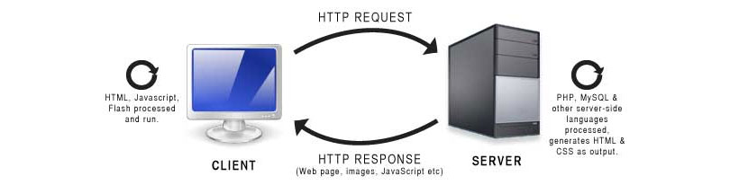


## 2. 前端

HTML, CSS, JS, DATA ，前端开发的重点是 ： 提供用户界面给 用户进行观看和操作。


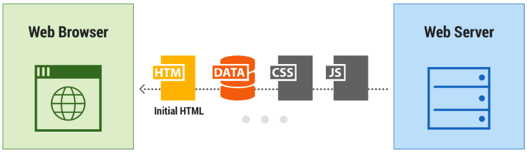


## 3. 后端

后端要开发 服务进程，处理前端http请求，返回相应的数据。通常 包括数据的 查询、增加、删除、修改。


- 静态文件存储
- API接口（返回前端请求）
- 数据库
- 缓存、异步任务、云服务、效率优化

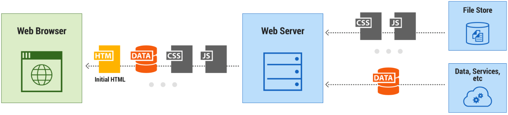


# 二、安装和运行 Django

Django是一个 基于Python语言的 开源免费的 Web应用 开发框架。


## 1. 安装 Django

**安装命令**

```
pip instrall django
```


**查看Django版本**

```
python -m django --version
```


## 2. 创建项目

我们可以创建 `d:\projects` 作为我们的项目所在的目录。

然后从命令行窗口中 进入到 `d:\projects` 目录，执行下面的命令创建项目目录

```py
django-admin startproject bysms
```


**目录结构**

注意最后的 `bysms` 就是项目的根目录名，执行上面命令后，就会创建 如下的目录结构：

```
bysms/
    manage.py
    bysms/
        __init__.py
        settings.py
        urls.py
        wsgi.py
```

- 最外层 `bysms/` 就是项目根目录 `d:\projects\bysms\` ， 项目文件都放在里面。
- `manage.py` 是一个工具脚本，用作项目管理的。以后我们会使用它执行管理操作。
- 里面的 `bysms/` 目录是python包。 里面包含项目的重要配置文件。这个目录名字不能随便改，因为manage.py 要用到它。
- `bysms/settings.py` 是 Django 项目的配置文件. 包含了非常重要的配置项，以后我们可能需要修改里面的配置。
- `bysms/urls.py` 里面存放了 一张表， 声明了前端发过来的各种http请求，分别由哪些函数处理. 这个我们后面会重点的讲。
- `bysms/wsgi.py`要了解这个文件的作用， 我们必须明白wsgi 是什么意思


## 3. WSGI

python 组织制定了 web 服务网关接口（Web Server Gateway Interface） 规范 ，简称wsgi。参考文档 https://www.python.org/dev/peps/pep-3333/

遵循wsgi规范的 web后端系统， 我们可以理解为 由两个部分组成

```
wsgi web server` 和 `wsgi web application
```

它们通常是运行在一个python进程中的两个模块，或者说两个子系统。

`wsgi web server` 接受到前端的http请求后，会调用 `wsgi web application` 的接口（ 比如函数或者类方法）方法，由`wsgi web application` 具体处理该请求。然后再把处理结果返回给 `wsgi web server`， `wsgi web server`再返回给前端。


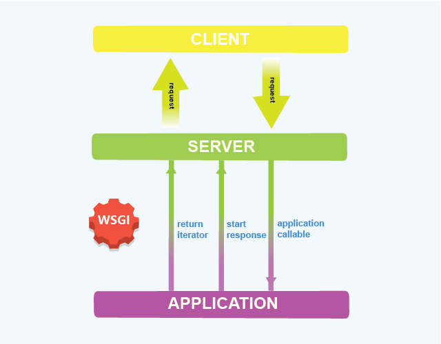


因为这两个子系统有各自负责的重点。

`wsgi web server` 负责 **提供高效的http请求处理环境**，可以使用多线程、多进程或者协程的机制。

http 请求发送到 `wsgi web server` ， `wsgi web server` 分配 线程或者进程或者 轻量级线程(协程)，然后在 这些 线程、进程、或者协程里面，去调用执行 `wsgi web application` 的入口代码。

`wsgi web application` 被调用后，负责 **处理 业务逻辑**。 业务逻辑的处理可能非常复杂， `wsgi web application` 需要精心的设计来正确处理。

django是 `wsgi web application` 的框架，它只有一个简单的单线程 `wsgi web server`。 供调试时使用。


产品正式上线运行的时候，通常我们需要高效的 `wsgi web server` 产品，比如 gunicorn，uwsgi，cherrypy等，结合Django ，组成一个高效的 后端服务。

所以这个 `wsgi.py` 就是 提供给`wsgi web server`调用 的接口文件，里面的变量application对应对象实现了 wsgi入口，供`wsgi web server`调用 。


## 4. 运行 Django web服务

刚才我们说了， django虽然只是 `wsgi web application` 的框架，但是它也有一个简单的 `wsgi web server`。 供调试时使用。

```
python manage.py runserver 0.0.0.0:80
```

其中 `0.0.0.0:80` 是指定 web服务绑定的 IP 地址和端口。

`0.0.0.0` 表示绑定本机所有的IP地址， 就是可以通过任何一个本机的IP (包括 环回地址 `127.0.0.1 `) 都可以访问我们的服务。


请打开浏览器，地址栏输入 ‘127.0.0.1’ ，就可以看到如下的界面，表示Django服务搭建成功，启动成功。

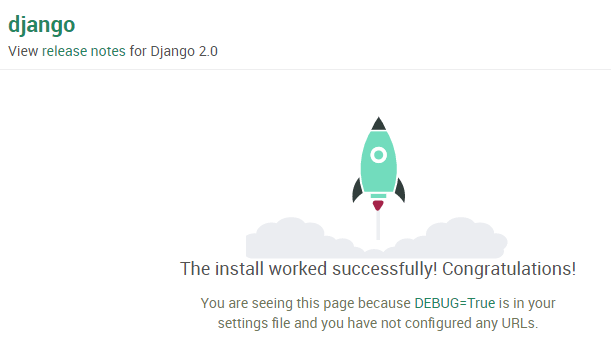


注意，启动web服务的命令行窗口不能关闭，如果关闭，web服务就停止了。


另外在 setting.py 中可以设置允许的IP，比如：

```
Allowed_Host = ['192.168.1.100']
```

修改之后，还需要重新运行 manage.py 文件


## 5. 创建APP

一个项目可以有多个APP，APP为独立模块，实现独立的功能。

```
python manage.py startapp xxx
```

> xxx 是APP名称，这里用 sales 来举例


这样就会创建一个目录名为 sales， 对应 一个名为 sales 的app，里面包含了如下自动生成的文件。

```py
sales/
    __init__.py
    admin.py
    apps.py
    migrations/
        __init__.py
    models.py
    tests.py
    views.py
```


## 6. 简单交互

### 6.1 views.py

刚才我们创建的 sales 应用里面 有个 views.py 文件。 这个文件里面通常是写处理http 请求的代码的。

比如，我们 设计 凡是浏览器访问的http 请求的 url 地址 是 `/sales/orders/` , 就由 views.py 里面的函数 `listorders` 来处理， 返回一段字符串给浏览器。

请大家 打开 views.py , 在里面加入如下内容

```py
from django.http import HttpResponse

def listorders(request):
    return HttpResponse("下面是系统中所有的订单信息。。。")
```


**注意**

- 这里面最终的返回结果是 `HttpResponse` 对象的参数字符串 ，也就是这句话

  `下面是系统中所有的订单信息。。。`

- listorders的参数 `request` 是Django中的 `HttpRequest` 对象，包含了HTTP请求中的信息。

  后端程序处理请求，常常要根据**请求中的数据**进行相应的处理：

  比如请求添加一个用户，那么HTTP请求消息中就会携带要添加用户的信息（姓名、登录账号等）。

  我们写后端的代码，这些信息就在 `HttpRequest`对象中获取。

  所以这个参数非常重要。

  `HttpRequest` 对象的属性和用法，具体可以[参考官方文档这里](https://docs.djangoproject.com/zh-hans/3.1/ref/request-response/)

  它的用法后面涉及到的地方会讲。这里暂时用不到该参数。


### 6.2 配置路由 urls.py

路由是用来处理当客户端对服务端发送请求时，服务端需要分配由谁来处理这个请求。

我们需要 **告诉 Django** ，当前端发送过来的HTTP请求 url地址 是 `/sales/orders/` , 就由 views.py 里面的函数 `listorders` 来处理


打开该文件，在 `urlpatterns` 列表变量中添加一条路由信息，结果如下

```py
from django.contrib import admin
from django.urls import path

# 别忘了导入 listorders 函数
from sales.views import listorders

urlpatterns = [
    path('admin/', admin.site.urls),

    # 添加如下的路由记录
    path('sales/orders/', listorders),
]
```


`urlpatterns` 列表 就是 Django 的 url 路由的入口。

里面是一条条的路由记录，我们添加的

```py
path('sales/orders/', listorders)
```


就是告诉 当前端过来的请求 url地址 是 `/sales/orders/` , 就由 views.py 里面的函数 `listorders` 来处理。

所以，所谓 `路由` 就是指 ： 根据 HTTP请求的url路径， 设置 由哪个 函数来处理这个请求。

通常我们项目代码的修改， Django的测试服务可以自动检测到，并且重新加载，不需要我们重启 Django Web 服务。

如果大家想重新启动 Django web 服务， 大家可以在启动web服务的命令行窗口，按ctrl + break（也就是Pause按钮）先停止服务。 然后再次运行启动命令。

我们这时，就可以登录浏览器输入网址 `http://127.0.0.1/sales/orders/`

回车后，就会出现如下内容

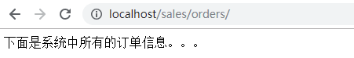

这就是浏览器的请求经过 Django路由后， 选择执行我们定义的函数 listorders，该函数 返回的字符串， 被作为http响应的消息体中的内容返回给 浏览器了。

所以浏览器最终显示的就是 我们 `listorders` 函数返回的字符串。


### 6.3 拆分路由表（路由子表）

url 路由表就是可以像上面这样，一个请求对应一个处理函数。但是有的时候，我们的项目比较大的时候， 请求的url 会特别多。比如我们的系统提供给 客户、销售商、管理员 访问的url是不一样的，如下：

```py
customer/
customer/orders/      

sales/
sales/orders/  

mgr/
mgr/customers/
mgr/medicines/
mgr/orders/
```

复杂的系统url条目多达几百甚至上千个， 放在一个表中，查看时，要找一条路由记录就非常麻烦。这时，我们通常可以将不同的路由记录 按照功能 分拆到不同的 **url路由子表** 文件中。比如，这里我们可以把 访问 的 url 凡是 以 `sales` 开头的全部都 由 sales app目录下面的 子路由文件 urls.py 处理。


首先我们需要在 sales 目录下面创建一个新的文件 `sales\urls.py` 。然后在这个 `sales\urls.py` 文件中输入如下内容

```py
from django.urls import path

from . import views

urlpatterns = [
    path('orders/', views.listorders),
]
```

然后，我们再修改主url路由文件 `bysms/urls.py` , 如下

```py
from django.contrib import admin

# 导入一个include函数
from django.urls import path, include

from sales.views import listorders
urlpatterns = [
    path('admin/', admin.site.urls),

    # 凡是 url 以 sales/  开头的，
    # 都根据 sales.urls 里面的 子路由表进行路由
    path('sales/', include('sales.urls')),

]
```

当一个http请求过来时， Django检查 url，比如这里是`sales/orders/`，先到主url路由文件 `bysms/urls.py`中查看 是否有匹配的路由项。如果有匹配 ( 这里匹配了 `sales/` )， 并且匹配的对象 不是 函数， 而是 一个子路由设置 , 比如这里是 `include('sales.urls')`就会去子路由文件中查看， 这里就是 sales.urls 对应的文件 `sales\urls.py` 。


注意这时，会从请求url中去掉 前面主路由文件 已经匹配上的部分（这里是 `sales/` ）, 将剩余的部分 （这里是 `orders/` ）去子路由文件中查看是否有匹配的路由项。


这里就匹配了 `orders/` ，匹配的对象，这里是 `views.listorders` ，它是一个处理函数，就调用该函数处理 这个http请求， 将该函数的返回对象 构建 HTTP响应消息，返回给客户端。


> 复杂路由可以搜索 Django url route


# 三、数据库

sqlite 没有 独立的数据库服务进程，数据操作被做成库直接供应用程序调用。 Django中可以直接使用，无须先搭建数据服务。

> 如果需要更改 mysql 等其他数据库 只需修改一些配置就可以了。


## 1. 创建数据库

项目中数据库的配置在 `bysms/settings.py` 中，这里

```py
# Database
# https://docs.djangoproject.com/en/2.0/ref/settings/#databases

DATABASES = {
    'default': {
        'ENGINE': 'django.db.backends.sqlite3',
        'NAME': os.path.join(BASE_DIR, 'db.sqlite3'),
    }
}
```

大家可以发现，我们使用命令创建的项目， 缺省就是使用 sqlite。 而且对于的数据库文件，缺省的文件名是 `db.sqlite3` ， 就在项目的根目录下面


首先我们需要创建数据库，执行如下命令

```py
python manage.py migrate
```

就会在 项目的根目录下面 生成一个配置文件中指定的数据库文件 `db.sqlite3`。

并且 会在其中创建一些表。

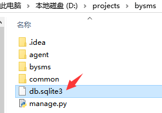


## 2. sqlite 桌面客户端 sqlitestudio

我们可以点击下面[链接](https://sqlitestudio.pl/index.rvt?act=download)，下载sqlite 数据库工具 sqlitestudio

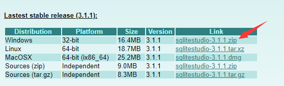

下载后解压即可， 运行该工具， 然后打开上面的 文件 `db.sqlite3`

可以发现该库中有下面这些表已经创建好了。

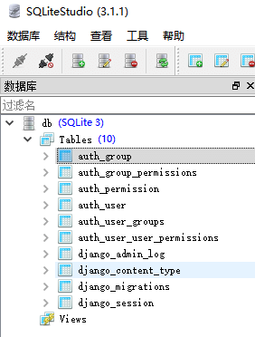

这些表都是 Django缺省设置中， 需要的一些 基本表。

包括: 用户表 auth_user， 登录会话表 django_session 等等。


## 2. ORM

下图是某个数据库 里面 一张 medicine 表的 格式定义。 描述药品表的格式

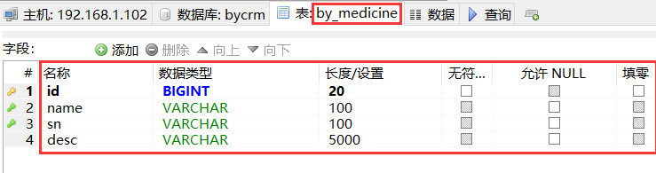


下图是这张表里面存储的一条条数据

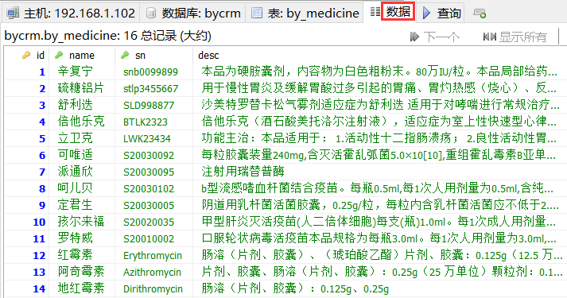


这个medicine表结构定义，就像定义了 一个medicine类， 定义好了之后，这个medicine表里面的一条条记录对应的就是一个个具体的药品。就是 medicine类的实例。


既然 数据库 `表定义和表记录之间的关系` 就像 `类和实例` 之间的关系，Django 就让开发者 通过 类 和 实例的操作 来对应 数据库 表 和记录的操作。

Django 里面， 数据库表的操作，包括 表的定义、表中数据的增删改查，都可以通过 **Model** 类型的对象进行的。


通常，在Django中

- 定义一张数据库的表 就是定义一个继承自 django.db.models.Model 的类
- 定义该表中的字段（列）， 就是定义该类里面的一些属性
- 类的方法就是对该表中数据的处理方法，包括 数据的增删改查


这样，开发者对数据库的访问，从原来的使用底层的 sql 语句，变成 面向对象的开发，通过一系列对象的类定义 和方法调用就可以 操作数据库。

这样做：

首先 极大的简化了我们应用中的数据库开发，因为无需使用sql语句操作数据库了， 提高了开发的效率；

其次 屏蔽了 不同的数据库访问的底层细节，基本做到了 开发好代码后，如果要换数据库，几乎不需要改代码， 修改几个配置项就可以了。

这种 通过 对象 操作数据库 的方法 被称之为 ORM （object relational mapping），下面我们就来看怎样使用。


## 4. 定义数据库

我们开发系统，需要定义我们需要的数据库表。首先，我们再创建一个名为common的应用目录， 里面存放我们项目需要的一些公共的表的定义。


进入项目根目录，执行下面的命令。就会创建一个目录名为 common， 对应 一个名为 common 的app

```py
python manage.py startapp common 
```


里面包含了如下自动生成的文件。

```py
common/
    __init__.py
    admin.py
    apps.py
    migrations/
        __init__.py
    models.py
    tests.py
    views.py
```


前面已经说过，Django是通过定义类来定义数据库表的。所以，我们要定义数据库的表，无需执行sql语句，只需要在app目录下面 定义特殊的类就可以了。


数据库表的定义，一般是放在app目录中的 models.py里面的。打开 common/models.py，发现里面是空的，因为我们还没有定义我们的业务所需要的表。


我们修改它，加入如下内容

```py
from django.db import models

class Customer(models.Model):
    # 客户名称
    name = models.CharField(max_length=200)

    # 联系电话
    phonenumber = models.CharField(max_length=200)

    # 地址
    address = models.CharField(max_length=200)
```


这个 Customer 类继承自 django.db.models.Model， 就是用来定义数据库表的。里面的 name、phonenumber、address 是该表的3个字段。定义表中的字段 就是定义一些静态属性，这些属性是 django.db.models 里面的各种 Field 对象，对应不同类型的字段。


比如这里的3个字段 都是 CharField 对象，对应 varchar类型的数据库字段。后面的参数 `max_length` 指明了该 varchar字段的 最大长度。


Djanog 有很多字段对象类型， 对应不同的类型的数据库字段。参考[官方文档](https://docs.djangoproject.com/en/2.0/ref/models/fields/#model-field-types)


## 5. 创建数据库表

定义好表以后，我们需要创建数据库表，我们需要告诉Django： 我们的 common 应用中的 model.py 有数据库的定义。在项目配置文件 setting.py 中，找到 INSTALLED_APPS。

```py
INSTALLED_APPS = [
    'django.contrib.admin',
    'django.contrib.auth',
    'django.contrib.contenttypes',
    'django.contrib.sessions',
    'django.contrib.messages',
    'django.contrib.staticfiles',

    # 加入下面这行
    'common.apps.CommonConfig',
]
```


`common.apps.CommonConfig` 告诉 Django ， CommonConfig 是 common/apps.py 文件中定义的一个应用配置的类。


是这样的

```py
class CommonConfig(AppConfig):
    name = 'common'
```

CommonConfig 是 AppConfig的 子类， 就表示这个是应用的配置类。

这里 name = ‘common’ ， name 是用来定义 应用的python模块路径的。 这里就是说 应用 模块路径为 common 。


关于 其他的配置参数， 大家可以参考[官方文档](https://docs.djangoproject.com/en/dev/ref/applications/#configurable-attributes)


## 6. 更新数据库

现在Django知道了我们的 common 应用， 我们可以在项目根目录下执行命令

```
d:\projects\bysms>python manage.py makemigrations common
```


得到如下结果

```
Migrations for 'common':
  common\migrations\0001_initial.py
    - Create model Customer
```

这个命令，告诉Django ， 去看看common这个app里面的models.py ，我们已经修改了数据定义， 你现在去产生相应的更新脚本。

执行一下，会发现在 common\migrations 目录下面出现了0001_initial.py, 这个脚本就是相应要进行的数据库操作代码。


随即，执行如下命令

```py
d:\projects\bysms>python manage.py migrate

Operations to perform:
  Apply all migrations: admin, auth, common, contenttypes, sessions
Running migrations:
  Applying common.0001_initial... OK
```

就真正去数据库创建表了。

用 sqlitestudio 查看数据库，发现创建了一张名为 common_customer的表，如下

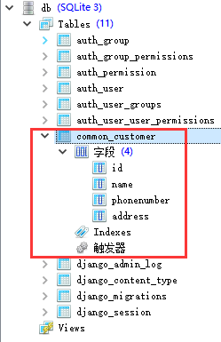

其中 3 个字段就是我们上面定义的 Customer 类里面的 name、phonenumber、address 属性名。

多出来的 id 字段是该表的主键， 是Django自动帮我们添加的。

这个不需要我们在类中显式的定义。


**注意：**

如果以后我们修改了Models.py 里面的库表的定义，都需要再次运行 python manage.py makemigrations common 和 python manage.py migrate 命令，使数据库同步该修改结果


## 7. 创建管理员

Django提供了一个管理员操作界面可以方便的 添加、修改、删除你定义的 model 表数据。

首先，我们需要创建 一个超级管理员账号。

进入到项目的根目录，执行如下命令，依次输入你要创建的管理员的 登录名、email、密码。

```py
d:\projects\bysms>python manage.py createsuperuser
Username (leave blank to use 'byhy'): byhy
Email address: byhy@163.com
Password:
Password (again):
Superuser created successfully.
```


注意密码至少8个字符。 这里，我们设置密码为 `88888888`

然后我们需要修改应用里面的 管理员 配置文件 common/admin.py，注册我们定义的model类。这样Django才会知道

```py
from django.contrib import admin

from .models import Customer

admin.site.register(Customer)
```


好了，现在就可以访问 ```http://127.0.0.1/admin/``` ，输入刚才注册的用户密码登录。

登录后可以看到如下界面。这里面是目前系统中可以修改的表。

点击我们的定义的Customers表

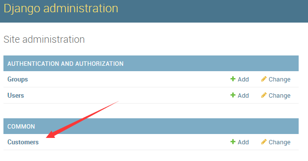


点击下面的 ADD CUSTOMER 按钮来添加一条客户记录

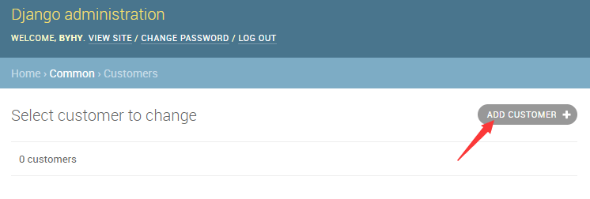


在跳出的界面中输入客户信息后，点击SAVE按钮

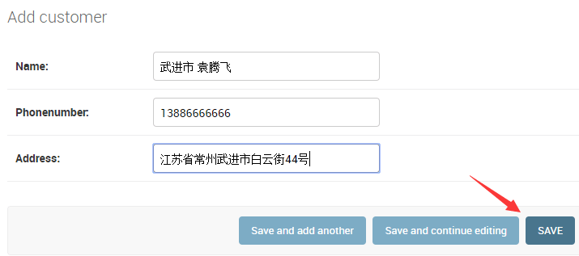


完成上面操作后，我们使用数据库查看工具，就发现数据库中确实有了添加的数据信息。

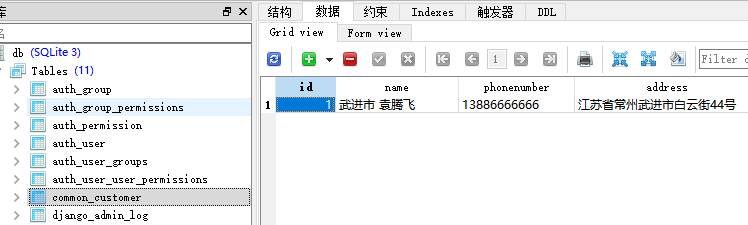


如果你是中文的操作系统，想使用中文的admin界面，应该在配置文件 `settings.py` 中 `MIDDLEWARE` 最后加入如下配置

```py
MIDDLEWARE = [
    'django.middleware.security.SecurityMiddleware',
    'django.contrib.sessions.middleware.SessionMiddleware',
    'django.middleware.common.CommonMiddleware',
    'django.contrib.auth.middleware.AuthenticationMiddleware',
    'django.contrib.messages.middleware.MessageMiddleware',
    'django.middleware.clickjacking.XFrameOptionsMiddleware',
    # admin界面语言本地化
    'django.middleware.locale.LocaleMiddleware',
]
```


要注意上面的界面 Django 内置的给管理员使用的。只是实现了一些通用的功能，而且界面语言偏英语的。

在实际的工作项目中， 还是需要我们自己开发前端界面给他们使用。


## 8. 读取数据库

读取数据库需要在 views.py 中定义方法

在文件sales/views.py 中，定义一个listcustomers 函数，内容如下：

```py
# 导入 Customer 对象定义
from  common.models import  Customer

def listcustomers(request):
    # 返回一个 QuerySet 对象 ，包含所有的表记录
    # 每条表记录都是是一个dict对象，
    # key 是字段名，value 是 字段值
    qs = Customer.objects.values()

    # 定义返回字符串
    retStr = ''
    for customer in  qs:
        for name,value in customer.items():
            retStr += f'{name} : {value} | '

        # <br> 表示换行
        retStr += '<br>'

    return HttpResponse(retStr)
```

Customer.objects.values() 就会返回一个 QuerySet 对象，这个对象是Django 定义的，在这里它包含所有的Customer 表记录。


QuerySet 对象 可以使用 for 循环遍历取出里面所有的元素。每个元素 对应 一条表记录。

每条表记录元素都是一个dict对象，其中 每个元素的 key 是表字段名，value 是 该记录的字段值


上面的代码就可以将 每条记录的信息存储到字符串中 返回给 前端浏览器。我们还需要修改路由表， 加上对 `sales/customers/` url请求的 路由。


前面，我们在bysms\urls.py 主路由文件中，已经有如下的记录了

```py
    # 凡是 url 以 sales/  开头的，
    # 都根据 sales.urls 里面的 子路由表进行路由
    path('sales/', include('sales.urls')),
```

这条URL记录，指明 凡是 url 以 sales/ 开头的，都根据 sales.urls 里面的 子路由表进行路由。


我们只需修改 `sales/urls.py` 即可，添加如下记录

```py
    path('customers/', views.listcustomers),
```


大家可以使用 admin 登录， 再添加一些 客户记录。

然后可以在浏览器输入如下 网址： `http://127.0.0.1/sales/customers/`

回车后，浏览器显示结果类似如下

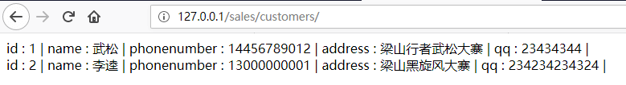


和我们数据库中的记录信息一致

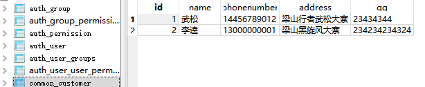


