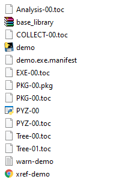

subprocess

subprocess 模块可以完成一些 os.system 处理不了的任务，比如说 os.system 就无法处理屏幕上返回的一些数据。


使用方法：

```
from subprocess import PIPE, Popen

# 返回的是 Popen 实例对象
proc = Popen(
	# 执行的命令
    'fsutil volume diskfree c:',
    
    # 指定输入、输出、错误管道
    stdin  = None,
    stdout = PIPE,
    stderr = PIPE,
    
    # 打开 Shell 模式
    shell=True)

# communicate 方法返回 输出到 标准输出 和 标准错误 的字节串内容
# 标准输出设备和 标准错误设备 当前都是本终端设备
outinfo, errinfo = proc.communicate()

# 注意返回的内容是bytes 不是 str ，我的是中文windows，所以用gbk解码
outinfo = outinfo.decode('gbk')
errinfo = errinfo.decode('gbk')
print (outinfo)
print ('-------------')
print (errinfo)

outputList = outinfo.splitlines()

# 剩余量
free  = int(outputList[0].split(':')[1].strip())

# 总空间
total = int(outputList[1].split(':')[1].strip())

if (free/total < 0.1):
    print('!! 剩余空间告急！！')
else:
    print('剩余空间足够')
```


有的时候，启动外部程序后，我们的Python程序本身并不需要等待外部程序结束。

比如，我们启动 wget下载命令， 下载1个文件。让它下载就可以了， 然后我们的程序还要继续去做其他的任务。这时候， 我们就不能用os.system， 因为它会等待 外部程序结束。我们可以用subprocess里面的Popen。

```
from subprocess import Popen
proc = Popen(
        args='wget http://xxxxserver/xxxx.zip',
        shell=True
    )

print ('让它下载，我们接下来做其他事情。。。。')
```


# time, datetime, calendar

Python中，对日期和时间的操作，主要使用这3个内置模块： datetime 、 time 和 calendar


## 1. time

开发程序时，经常需要获取两个代码位置在执行时的时间差，比如，我们想知道某个函数执行大概耗费了多少时间，就可以使用time.time()来做。


**获取当前时间戳**

```
import time
cur_time = time.time()
print(cur_time)

# 输出结果
1595045105.916531
```

> time.time() 会返回 从 1970年1月1日0点到当前时间的经过的秒数 ，可以简称为秒数时间。.


**获取指定时间戳**

```
import time
time_stamp = int(time.mktime(time.strptime('2020-07-18 14:06:59', '%Y-%m-%d %H:%M:%S')))
print(time_stamp)
```


**将时间戳转化为日期格式字符串**

```
import time

time_stamp = time.time()
time_local = time.localtime(time_stamp)

# 转换成新的时间格式(2016-05-05 20:28:54)
dt = time.strftime("%Y-%m-%d %H:%M:%S", time_local)

# 输出结果
2020-07-18 00:12:26
```

> 这里使用的时当前时间戳，也可以使用转化过的指定时间戳


**time.sleep()**

最常用的可能时 time.sleep() 方法，可以让程序暂停指定秒

```
time.sleep(5)
```


## 1. datetime

**获取当前日期**

要得到当前时间对应的字符串，可以使用datetime

```
from datetime import datetime
print(str(datetime.now()))

# 输出结果
2020-07-18 00:07:04.767845
```


**改变日期输出格式**

```
from datetime import datetime
print(datetime.now().strftime('%Y-%m-%d ** %H:%M:%S'))
```


**获取对应年、月、日、分、时、秒**

```
from datetime import datetime
time = datetime.now()
tar_time = datetime(2018, 6, 30, 23, 3, 54, 238947)

# 年-月-日
print(tar_time.date())

# 年
print(datetime.now().year)

# 月
print(datetime.now().month)

# 日
print(datetime.now().day)

# 时
print(datetime.now().hour)

# 分
print(datetime.now().minute)

# 秒
print(datetime.now().second)

# 毫秒
print(datetime.now().microsecond)

# 获取星期几用 weekday方法
# 0 代表星期一，1 代表星期二 依次类推
print(datetime.now().weekday())
```

> 可以直接将 datetime.now() 换为 tar_time 保存的时间戳


从某个时间点往前或者后推一段时间

```
thatDay = "2018-6-24"
from datetime import datetime,timedelta
theDay = datetime.strptime(thatDay, "%Y-%m-%d").date()

# 后推120天 就是 + timedelta(days=120)
target = theDay + timedelta(days=120)

print(target)
print(target.weekday())

# 前推120天 就是 - timedelta(days=120)
target = theDay - timedelta(days=120)

print(target)
print(target.weekday())
```


## 3. calendar

获取某个月总共有多少天

```
from calendar import monthrange
# monthrange返回的是元组
# 第一个元素是指定月第一天是星期几
# 第二个元素是指定月有多少天
mr = monthrange(2011, 2)

# 得到2011年2月有多少天
print(mr[1])
```


# os

在 `Python` 中，如果希望通过程序实现创建、重命名、删除、改变路径、查看目录内容功能，需要导入 `os` 模块


## 1. 文件操作

| 序号 | 方法名 | 说明       | 示例                              |
| ---- | ------ | ---------- | --------------------------------- |
| 01   | rename | 重命名文件 | `os.rename(源文件名, 目标文件名)` |
| 02   | remove | 删除文件   | `os.remove(文件名)`               |


```
import os
os.rename("random.txt", "random1.txt")
os.remove("random1.txt")
```


## 2. 目录操作

| 序号 | 方法名     | 说明           | 示例                      |
| ---- | ---------- | -------------- | ------------------------- |
| 01   | listdir    | 目录列表       | `os.listdir(目录名)`      |
| 02   | mkdir      | 创建目录       | `os.mkdir(目录名)`        |
| 03   | rmdir      | 删除目录       | `os.rmdir(目录名)`        |
| 04   | getcwd     | 获取当前目录   | `os.getcwd()`             |
| 05   | chdir      | 修改工作目录   | `os.chdir(目标目录)`      |
| 06   | path.isdir | 判断是否是文件 | `os.path.isdir(文件路径)` |

> 提示：文件或者目录操作都支持 **相对路径** 和 **绝对路径**


递归的创建目录结构

```
import os
os.makedirs('tmp/python/fileop',exist_ok=True)
```

> 会在当前工作目录下面创建 tmp目录，在tmp目录下面再创建 python目录，在Python目录下面再创建fileop目录，`exist_ok=True` 指定了，如果某个要创建的目录已经存在，也不报错


## 3. 路径操作

对于文件名的操作，比如 获取文件名称，文件所在目录，文件路径的拼接等，都可以使用 os.path 模块。如果你的程序需要在Linux、Windows等多个平台运行，它们的路径的分隔符是不同的，Windows上是 `\` , 而 Linux上是 `/`。这时，我们应该使用 os.path 模块。 它能够自动处理类似 Data/data.csv 和 Data\data.csv 这样的文件路径差异。

```
import os
path = '/Users/forece/Data/data.csv'

# 获取路径中的文件名部分
print(os.path.basename(path))

# 获取路径中的目录部分
print(os.path.dirname(path))

# 文件路径的拼接
os.path.join('tmp', 'data', os.path.basename(path))

# 输出内容
data.csv
/Users/forece/Data
tmp\data\data.csv
```


判断文件、目录是否存在

```
import os
print(os.path.exists('d:/systems/cmd.exe'))
print(os.path.exists('d:/systems'))
```

> exists方法返回值为True表示 存在，否则表示不存在。


判断是否是文件、目录

```
import os
print(os.path.isfile('d:/systems/cmd.exe'))
print(os.path.isdir('d:/systems'))
```


判断文件大小、修改日期

```
# 返回文件大小
print(os.path.getsize('file1.txt') )

# 返回文件的最后修改日期，是秒时间
print(os.path.getmtime('file1.txt'))
1272478234.0

# 可以把秒时间 转化为日期时间
import time
print(time.ctime(os.path.getmtime('/etc/passwd')))
```


返回当前路径

```
cwd = os.getcwd()
```


更改当前路径

```
os.chdir(path)
```


返回参数的绝对路径

~~~python
os.path.abspath('./folder')
~~~

> 返回当前路径下 folder 目录的绝对路径


判断是否为绝对路径

~~~python
# 判断参数是否为绝对路径
os.path.isabs('./folder')
~~~

> 返回 False


返回两个路径之间的相对路径

~~~python
os.path.relpath('C:\\', 'C:\\Windows\system32')
~~~

> 返回 `..\\..`


## 4. 遍历目录/文件

搜索 .exe 文件

~~~python
import os

for filename in os.listdir():
    if '.exe' in filename:
        print(filename)
~~~


假如我们要获取某个目录中所有的 文件， 包括子目录里面的文件。 可以使用 os库中的walk方法

os.walk() 需要传入一个需要遍历的路径，返回的是一个三元组（root, dirs, files)

- root 当前路径本身
- dirs 当前路径的所有子目录
- files 当前路径的所有文件


```python
import os

# 目标目录
targetDir = r'd:\tmp\util\dist\check'
files = []
dirs  = []

# 下面的三个变量 dirpath, dirnames, filenames
# dirpath 代表当前遍历到的目录名
# dirnames 是列表对象，存放当前dirpath中的所有子目录名
# filenames 是列表对象，存放当前dirpath中的所有文件名

for (dirpath, dirnames, filenames) in os.walk(targetDir):
   files += filenames
   dirs += dirnames

print(files)
print(dirs)
```


得到目录中所有的文件和子目录名

```
import os

# 目标目录
targetDir = r'd:\tmp\util\dist\check'


files =  os.listdir(targetDir)
print(files)
```

>listdir返回的是该目录下面所有的文件和子目录。


如果我们只需要获取目录中所有的文件，或者只需要子目录，可以这样

```
import os
from os.path import isfile, join,isdir

# 目标目录
targetDir = r'd:\tmp\util\dist\check'

# 所有的文件
print([f for f in os.listdir(targetDir) if isfile(join(targetDir, f))])

# 所有的目录
print([f for f in os.listdir(targetDir) if isdir(join(targetDir, f))])
```


得到目录中指定扩展名的文件和子目录

```
# 可以使用glob库
import glob
exes = glob.glob(r'd:\tmp\*.txt')

print(exes)
```


## 5. 调用外部命令

```
import os
os.system("cmd")
```


或者利用变量将命令写入

```
import os
command = "pip install pygame"
os.system("command")
```


# shutil

shutil 提供了多个针对文件或文件夹的高级操作，可以轻松实现文件的复制和删除操作


递归删除目录结构

```
shutil.rmtree('./tmp')
```


复制文件

```python
import shutil

# 复制文件
shutil.copy('d:/test.txt', './code')

# 复制并更名
shutil.copy('d:/tools/first.py', 'e:/first.py')
```

> 注意，如果拷贝前，e:/first.py 已经存在，则会被拷贝覆盖，所以使用该函数一定要小心。


递归复制所有文件

```
from shutil import copytree

# 拷贝 d:/tools/aaa 目录中所有的内容 到 e:/bbb 中
copytree('d:/tools/aaa', 'e:/new/bbb')
```

注意拷贝前， 目标目录必须 `不存在` ，否则会报错。

- 上面的代码执行前面，如果 e:/new/bbb 已经存在，执行到copytree时，就会报错
- 上面的代码执行前面，如果 e:/new 这个目录都不存在，执行到copytree时，就会 创建 e:/new 目录，再创建 e:/new/bbb 目录，再拷贝 d:/tools/aaa 目录中所有的内容 到 e:/new/bbb 中。
- 上面的代码执行前面，如果 e:/new 这个目录存在，但是 e:/new/bbb 不存在，执行到copytree时，就只会 创建 e:/new/bbb ，再拷贝 d:/tools/aaa 目录中所有的内容 到 e:/new/bbb 中。


移动文件或文件夹

~~~python
import shutil

# 复制文件
shutil.move('d:/test.txt', './code')

# 复制并更名
shutil.move('d:/tools/first.py', 'e:/first.py')
~~~

> 移动时，文件或文件夹必须不存在


# 压缩相关

## 1. zipfile

~~~python
import os
import zipfile

# 解压后的目标路径
target_path = os.getcwd()
zippath = '../agent_flask.zip'

# 创建一个 ZipFile 对象
zip_file  = zipfile.ZipFile(zippath)
# 返回 ZIP 文件中包含的所有文件和文件夹字符串的列表
names = zip_file.namelist()
# 返回一个关于特定文件的 ZipInfo 对象
file_info = zip_file.getinfo('agent_flask/agent.py')
print(f'压缩前大小:{file_info.file_size}')
print(f'压缩后大小:{file_info.compress_size}')

# 将压缩文件中的内容解压到具体的路径
zip_file.extractall(target_path)

zip_file.close()
print('Done')


~~~


解压特定文件

~~~python
import os
import zipfile

# 解压后的目标路径
target_path = os.getcwd()
zippath = '../agent_flask.zip'
# 过滤列表
notextractfiles = ['agent.py', '.idea', '.svn', '.DS_Store']

# 创建一个 ZipFile 对象
zip_file  = zipfile.ZipFile(zippath)
# 返回 ZIP 文件中包含的所有文件和文件夹字符串的列表
names = zip_file.namelist()

# 过滤掉不解压的文件
for file_name in names:
    notfiles = [file for file in notextractfiles if file in file_name]
    if not len(notfiles):
        zip_file.extract(file_name, target_path)

zip_file.close()
print('Done')


~~~


压缩文件

~~~python
import os
import zipfile

path = 'agent_flask'
newzip = zipfile.ZipFile('new.zip', 'w')

for root, dirs, files in os.walk(path):
    for file in files:
        fullpath = os.path.join(root, file)
        newzip.write(fullpath, compress_type=zipfile.ZIP_DEFLATED)

newzip.close()

~~~


## 2. tarfile

解压文件


压缩文件


#  retrying

顾名思义，让程序不断尝试执行，超出限制则会报错。

```
from retrying import retry

@retry(stop_max_attempt_number=3)
def fun1():
    print("this is fun1")
    raise ValueError("this is a test error")
```

程序会执行3次，只要有一次没有报错就会通过


# pyinstaller

pyinstaller 目的是将 py 文件打包成为可以执行的 exe 文件，让最终用户不用安装 python 环境也可以运行我们的代码。


比如：创建一个简单 python 程序，程序文件名为 demo.py

```
print("Welcome to my Demo")
```


用 pyinstall 将 demo.py 转换为 exe 文件

在cmd窗口， cd进入到该代码文件所在的目录下面，执行如下的命令

```
pyinstaller demo.py --workpath d:\pybuild  --distpath d:\pybuild\dist
```

>参数 `--workpath` 指定了制作过程中临时文件的存放目录
>
>参数 `--distpath` 指定了最终的可执行文件目录所在的父目录


上面的命令执行结束后，我们进入到 目录 `d:\pybuild\dist\` 中，就会发现有一个目录叫demo，该目录中包含了如下文件





**图形界面程序打包**

有时候，我们开发的是一个图形界面的程序，使用类似上面的命令运行的时候，也会有一个console窗口，我们在 执行打包命令的时候，可以加上参数 --noconsole 就可以去掉该窗口。

```
pyinstaller guitool.py --noconsole --workpath d:\pybuild  --distpath d:\pybuild\dist
```


**应用程序图标**

可以在PyInstaller创建可执行程序时，通过参数 --icon="logo.ico" 指定应用图标

```
pyinstaller httpclient.py --noconsole --hidden-import PySide2.QtXml --icon="logo.ico"
```


有的时候，我们运行打包好的程序，会出现导入库错误的提示，比如下面

```py
ImportError: could not import module 'PySide2.QtXml'
```

这意思是PyInstaller打包的时候，没有把 PySide2.QtXml库打包。

因为PyInstaller是通过分析我们的代码里面的 `import` 语句，推断我们的程序需要哪些库的。

但是有些代码，导入库的时候，是 `动态导入` 。

所谓动态导入就是，写代码的时候并不确定要导入什么库，而是在运行的时候才知道。

这种情况，不是用 import语句，而是用 `__import__` 或者 `exec` 、 `eval` 这样的方式，来导入库。

PyInstaller对此有说明，[参考这里](https://pythonhosted.org/PyInstaller/when-things-go-wrong.html#listing-hidden-imports)


PyInstaller 没法分析出动态导入的库有哪些，我们可以通过命令行参数 `--hidden-import` 告诉它。

比如，如果我们运行出现 `could not import module 'PySide2.QtXml'` 的错误 ， 就可以这样

```
pyinstaller httpclient.py  --hidden-import PySide2.QtXml
```


pyinstaller 常见错误：https://zhuanlan.zhihu.com/p/35338321


# captcha

**1. 安装 Captcha 模块**

```
pip install captcha
```


**2. 生成图片验证码**

```
from captcha.image import ImageCaptcha

image = ImageCaptcha()
image.write('Forece', 'captcha.png')
```

ImageCaptcha 类的初始化方法有 width、height、fonts 和 font_sizes 四个可选参数，分别指定验证码的宽度、高度、字体和字体尺寸的信息。

其中，fonts 参数允许你使用多个字体文件，可以以参数形式填写路径

```
image = ImageCaptcha(fonts=['data/STSONG.TTF', 'data/SIMYOU.TTF'])
```


write 方法有 chars、output 和 format 三个参数，其中：

- chars 参数 -> 指定要生成的文本
- output 参数 -> 指定输出的位置
- format 参数 -> 指定生成的图片格式


**3. 生成音频验证码**

```
from captcha.audio import AudioCaptcha

audio = AudioCaptcha(voicedir='data/')
audio.write('2048', 'captcha.wav')
```

AudioCaptcha 类的初始化方法只有一个参数，那就是指定声音素材的路径，如果留空，只支持数字语音，并且以英文发音方式读出，素材路径可以以文件夹方式存储


如：


如果文件夹内有多个语音，则会随机选择一个语音文件

write 方法有 chars 和 output 两个参数，其中：

- chars 参数 -> 指定要生成的文本
- output 参数 -> 指定生成音频文件的位置


# wordcloud

```
import wordcloud

file = open(r"./words.txt", encoding="utf-8")
text = file.read()
wc = wordcloud.WordCloud(font_path=r"C:\Windows\Fonts\simhei.ttf",
                         stopwords={"野生技术协会", "编程", "教育", "讲座", "编程技术宅", "教学", "电脑", "技术", "编程教育", "编程入门", "开发", "科学",
                                    "演示", "软件", "编程视频教程", "编程课程", "教学视频", "经验分享", "IT", "编程语言", "编程学习", "互联网", "考试",
                                    "考研", "科技", "语言", "技术宅", "面试", "自学", "原创", "公开课", "程序员", "学习", "课程", "教程", "计算机",
                                    "线上课堂", "视频教程"}
                         ).generate(text)
wc.to_file("py.png")
```


文档：https://fishc.com.cn/thread-140301-1-1.html


jieba 分词 + 按指定 mask 图形输出

~~~python
import wordcloud as wc
import jieba
import numpy as np
import matplotlib.pyplot as plt
from PIL import Image

with open("2021.txt", mode="r", encoding="utf-8")as fp:
    content = fp.read()
    res = jieba.lcut(content)
    text = " ".join(res)

mk = np.array(Image.open(r"alice.png"))
exclude = {'我们', '你们', '他们', '它们', '因为', '因而', '所以', '如果', '那么',
           '的', '和', '顺丰', '篇', '在', '为', '并', '及', '与', '从', '将', '对', '年', '等', '了', '已'
           }
word_cloud = wc.WordCloud(font_path=r"C:\Windows\Fonts\simhei.ttf", mask=mk, stopwords=exclude, max_words=33)
word_cloud.generate(text)
plt.imshow(word_cloud)
word_cloud.to_file('lala.png')
plt.show()

~~~


# itchat


# jieba

- 主要用到了 jieba.cut 创建分词生成器
- 利用 collections 库中的 Counter 来统计

~~~python
import jieba
from collections import Counter


def read_file(path):
    with open(path, 'r') as f:
        res = f.read()
        return res


txt = read_file('output_words.txt')

# 获得分词的生成器
words = jieba.cut(txt)
spam_list = ['，', '。',',', '.', '\n', '\r', '的', '了', '就','在',' ']
words_list = [word for word in words if word and word not in spam_list]

# words_list = []
# for word in words:
#     if word and word not in spam_list:
#         words_list.append(word)

res = Counter(words_list)
res = sorted(res.items(),key = lambda x:x[1], reverse=True)

# def xx(x):
#     return x[1]

top_5 = res[:5]
print(top_5)
for word in words:
    print(f'{word[0]} 词频为：{word[1]/len((words_list))}')

~~~


排序 sorted：

~~~python
# 对列表进行排序，默认顺序是从小到大
l = [3, 6, 7, 8, 2, 5, 1, 9]
sorted(l)
# 对列表进行排序，倒叙排列
sorted(l, reverse=True)

# 创建新列表，列表中每个元素为一个元组
# 默认排序方式会根据元组中第一个元素进行排序
l2 = [(1, 'd'), (4, 'c'), (9, 'a'), (2, 'r'), (6, 'e')]
sorted(l2)
# 使用 key 参数，指定使用元组中第二个元素进行排序
sorted(l2, key=lambda x: x[1])

# 创建字典
d = {1: 'd', 4: 'b', 5: 'c', 6: 'r', 3: 'f'}
# 使用 key 参数进行排序
sorted(d.items(), key=lambda x: x[1])
~~~


# pyhook


# pyechart


# hashlib 

单项加密：只有加密过程，不能解密（MD5, SHA）

对称加密：

非对称加密：


MD5 加密

```
import hashlib

# 生成对象
x = hashlib.md5()

# 将字符串abc以md5方式加密
x.update('abc'.encode('utf-8'))

# 输出加密过后的密文
print(x.hexdigest())
```


让文件名以 md5 形式命名，防止下载重复

```
from hashlib import md5

def save_image(content):
	file_path = {0}/{1}.{2}.format(os.getcwd(), md5(content).hexdigest(), 'jpg')
    if not os.path.exists(file_path):
    	with open(file_path, 'wb') as f:
    		f.write(content)
    		f.close()
```


SHA 加密

```
import hashlib

hash1 = hashlib.sha1('123456'.encode())
hash2 = hashlib.sha224('123456'.encode())
hash3 = hashlib.sha256('123456'.encode())
hash4 = hashlib.sha384('123456'.encode())
```


# uuid

uuid 模块是为了生成全局唯一id，UUID是128位的全局唯一标识符，通常由32字节的字符串表示。它可以保证时间和空间的唯一性，也称为GUID，全称为：

```objectivec
UUID —— Universally Unique IDentifier      Python 中叫 UUID
GUID —— Globally Unique IDentifier          C#  中叫 GUID
```


UUID1

由MAC地址、当前时间戳、随机数生成。可以保证全球范围内的唯一性，但MAC的使用同时带来安全性问题，局域网中可以使用IP来代替MAC。

```
import uuid

print(uuid.uuid1())

# 输出结果
2b7dda1f-d84e-11ea-ae59-1c1b0d6b347d
```


# 邮件相关

## 1. smtplib


## 2. imaplib


网易授权接口


## 3. yagmail


## 4. email

解析邮件


# twillo


# 鼠标键盘相关

## 1. pyautogui


# Excel 相关

## 1. CSV

csv 文件是一个文本格式的表格文件，也就是说没有 excel 加密方式。用文本方式存储表格数据，以逗号来分隔列，回车分隔行


```python
import csv

file = open('demo.csv', 'w', encoding='utf-8', newline='')
w = csv.writer(file)

# 写入单行数据
w.writerow(['name','age','score','city'])
w.writerow(['zhangsan','19','90','beijing'])

# 写入多行数据
w.writerows(
    [
        ['name','age','score','city'],
        ['zhangsan','19','90','beijing']
    ]
)

# 读取数据
r = csv.reader(file)
# 遍历csv数据
for data in r:
    print(data)

file.close()
```


## 2. xlrd, xlwt, xlutils


使用 xlrd 读取 excel 文件

~~~python
import xlrd
# 读取已存在的 xlsx 文件
book = xlrd.open_workbook('people.xlsx')

# 读取 sheet 的三种方式
sheet = book.sheet()[0]
sheet = book.sheet_by_index(0)
sheet = book.sheet_by_name('Sheet1')

# 读取单元格数据（下标从0开始）
row = 1
col = 0
sheet.cell(row, col)
~~~


使用 xlwt 写入数据

~~~python
import xlwt

# 创建 xls 文件对象
book = xlwt.Workbook()

# 新建工作表
sheet = book.add_sheet('Sheet1')

# 写入数据
row = 0
col = 0
sheet.write(row,col,'单元格内容')

# 保存为 xls 文件
book.save('file.xls')

~~~

> xlwt 不支持 xlsx


使用 xlutils 进行追加数据操作

~~~python
import xlrd
import xlwt
from xlutils.copy import copy
rd_book = xlrd.open_workbook('people.xlsx')
rd_sheet = rd_book.sheets()[0]

# 拷贝 Book 对象为 Workbook 对象
wt_book = copy(rd_book)
wt_sheet = wt_book.get_sheet(0)
wt_sheet.write(row,0,'修改内容')
~~~


## 3. openpyxl

创建 xlsx 文件，并写入数据

~~~python
import openpyxl
# 创建工作簿
wb = openpyxl.Workbook()
# 选择默认 sheet 工作簿对象
ws = wb.active
# 创建新的 sheet（第二个参数为排序）
ws2 = wb.create_sheet('Sheet2',1)
# 修改单元格（下标从1开始，与 EXCEL 对应）
ws2.cell(row=1, column=1, value='First')
# 添加行
ws2.append([1,2,3,4,5])
# 保存文件
wb.save('file.xlsx')

~~~


读取 xlsx 文件

~~~python
import openpyxl
wb = openpyxl.load_workbook('data.xlsx')
ws = wb.active # 获取默认 Sheet
ws = wb['Sheet2'] # 获取指定 Sheet
~~~


修改属性

~~~python
# 改变单元格背景颜色
ws.sheet_propertites.tabColor = '99CCCC'

# 改变字体
font = openpyxl.Font(name='微软雅黑', size=25, italic=True, color=colors.RED, bold=True)
ws['A1'].font = font

# 加入注释
cell.comment = Comment(text="这是一个注释", author="xxx")

# 改变行高
ws.row_dimensions[5].height = 40

# 改变列宽
ws.column_dimensions['A'].width = 30

# 合并单元格
ws.merge_cells('A7:C7')
ws.merge_cells('A9:C13')

~~~


读取大数据（百万条数据）

~~~python
from openpyxl import load_workbook
# read_only 设置为 True
wb = load_workbook(filename='big.xlsx', read_only=True)
ws = wb['big_sheet']

for row in ws.rows:
    for cell in row:
        print(cell.value)
~~~


写入大数据（百万条数据）

~~~python
from openpyxl import Workbook
from openpyxl.cell import WriteOnlyCell

# 开启只写模式，不包含任何工作表，需要使用 create_sheet 创建
wb = Workbook(write_only = True)
ws = wb.create_sheet()

# 写入数据，只能使用 append
cell = WriteOnlyCell(ws, value="只写状态下写入的内容")
ws.append([cell,3.14,None])

~~~


## 4. panda

- Series 是一种类似于一维数组的对象，是由一组数据以及一组与之相关的数据标签（即索引）组成。仅由一组数据也可产生简单的Series对象。
- DataFrame 是Pandas中的一个表格型的数据结构，包含有一组有序的列，每列可以是不同的值类型,DataFrame即有行索引也有列索引，可以被看做是由Series组成的字典。


Dataframe 类以于 Excel 中的一个工作表它也有行与列的概念 pandas 可以很方便的将 Excel 工作表与 DataFrame 相互转换。如图：


Dataframe 中的一行或一列其实就是 Serires，它类似于 Excel 工作表中的一行或一列。


创建 Series，并组成 Dataframe


创建 Series

~~~python
import pandas as pd

# 创建 Serires 需要指定值与对应的 index，如果不设置 name 参数，则 Series 的 name 为 None

s1 = pd.Series([1,2,3],index=[1,2,3],name='A')

print(s1)
1    1
2    2
3    3

print(s1.index)
Name: A, dtype: int64
        
print(s1[1])
1
~~~


创建 Dataframe

~~~python
import pandas as pd

s1 = pd.Series([1,2,3],index=[1,2,3],name='A')
s2 = pd.Series([10,20,30],index=[1,2,3],name='B')
s3 = pd.Series([100,200,300],index=[1,2,3],name='C')

# 以 list 的形式，则会将 s1, s2, s3 当做行加入 DF 中，其中的 name 就是行号
df = pd.DataFrame([s1,s2,s3])
print(df)
     1    2    3
A    1    2    3
B   10   20   30
C  100  200  300

# 将 Series 当做列加入 DF， index 做为行号
df2 = pd.DataFrame({
    s1.name:s1,
    s2.name:s2,
    s3.name:s3
})
print(df2)
   A   B    C
1  1  10  100
2  2  20  200
3  3  30  300
~~~


将 DF 写入 excel 文件

~~~python
import pandas as pd

df = pd.DataFrame({
    'id':[1,2,3],
    'name':['张三','李四','王五'],
    'age':[28,25,30]
})

# 自定义索引，不然 pandas 会使用默认的索引
df = df.set_index('id')
print(df)
   name  age
id          
1    张三   28
2    李四   25
3    王五   30

df.to_excel('people.xlsx')

~~~


读取 excel 文件

~~~python
import pandas as pd

# header = 2 表示从第三行开始（从0开始），跳过前两行， sheet_name 指定读取的工作表
people = pd.read_excel('people.xlsx', header=2, sheet_name='sheet1')
# 输出列名
print(people.colums)

# 如果读入的 Excel 中没有开头标题，则可以将 header = None
people = pd.read_excel('people.xlsx', header=None)
people.columns = ['id', 'name', 'age']
print(people.columns)

# 指定 id 列为索引
people2 = pd.read_excel('people.xlsx', index_col='id')
# 输出前5行，此时就不会产生默认索引了
print(people.head())

# skiprows 开头跳过几行，usecols 使用哪些列中的数据， dtype 设置某一列的类型
peoples = pd.read_excel('people.xlsx', skiprows=4, usecols='E:H', dtype={'ID': str, 'gender': str, 'birthday': str})

~~~


修改 excel 行数据


~~~python
import pandas as pd

# 如果不设置 dtype 类型，pandas 遇到空数据就会转换为 float64 类型
peoples = pd.read_excel('people.xlsx', skiprows=4, usecols='E:H', dtype={'ID': str, 'gender': str, 'birthday': str})

# 直接在 DF 上操作
for i in peoples.index:
    # 通过 at 方法直接定位 DF 中元素的位置
    peoples.at[i, 'ID'] = i + 1
    peoples.at[i, 'gender'] = 'Male' if i % 2 == 0 else 'Female'
    peoples.at[i, 'birthday'] = data(starday.year + i, startday.month, startday.day)

# inplace 表示在原表上进行修改
peoples.set_index('ID', inplace=True)
peoples.to_excel('people2.xlsx')

~~~


修改 excle 列数据


~~~python
import pandas as pd

peoples = pd.read_excel('people.xlsx', index_col='ID')

def add_1000(x):
    return x + 1000

# 三种方式
# 1. 直接对 series 相加
peoples['money'] = peoples['money'] + 1000
# 2. apply 会逐个元素的调用函数
peoples['money'] = peoples['money'].apply(add_1000)
# 3. 匿名函数
peoples['money'] = peoples['money'].apply(lambda x:x+1000)
peoples.to_excel('people2.xlsx')

~~~


排序


~~~python
import pandas as pd

peoples = pd.read_excel('people.xlsx', index_col='ID')

# sort_values 按值排序， by 针对哪一列
peoples.sort_values(by='money', inplace=True, ascending=False)
print(peopels)

# 对多列进行排序，列表顺序为优先级
peoples.sort_values(by=['jake', 'money'], inplace=True, ascending=[True, False])
print(peoples)

~~~


排序后索引变动引来的问题

~~~python
students.sort_values(by='Score', inplace=True, ascending=False)
print(students)

# 通过下面去获取，虽然排序改变，但是下标并没有改变
print(sutdents.Name[0])

# 方法1：
# iloc 通过绝对位置去获取数据
print(students.iloc[0,:]['Name'])

# 方法2：
# 重新排列标签
students.reset_index(drop=True, inplace=True)
print(students)
print(students['Name'][0])
~~~


过滤数据

~~~python
import pandas as pd


def age_50_to_90(a):
    return 50 <= a < 90


def level_a(s):
    return 40 <= s <= 100


students = pd.read_excel('people.xlsx', index_col='ID')

# 使用 DF 的 loc 去定位出过滤后的数据
# 利用 Serires 的 apply 去运用过滤的方法，将该列中的每个元素传入指定函数
students = students.loc[students['Age'].apply(age_50_to_90)].loc[students['Score'].apply(level_a)]

~~~


合并 Dataframe


~~~python
import pandas as pd

students = pd.read_excel('Students.xlsx', sheet_name='Students')
scores = pd.read_excel('Scores.xlsx', sheet_name='Score')
table = students.merge(scores, how='left', on='ID',).fillna(0)
table.Score = table.Socre.astype(int)
print(table)

~~~

- 合并时 studnets 在 left 而 socres 在 right，如果不指定 how， 那么合并时， students 与 scores 就是取交集的效果，这里指定位 left，那么合并时，students 中无论是否存在于 scores 对应的值都会被保留
- on 用于设置合并的列，集 students与scores以ID作为合并的列（两者都有ID这一列），如果students与scores中不存在相同名称的列，可以使用 left_on = ID, right_on=XX
- fillna 如果合并后没有匹配到关联数据，则以 0 填充


另外一种情况

~~~python
import pandas as pd

# 读入时将ID设置为了index，此时列中就不存在ID了
students = pd.read_excel('Students.xlsx', sheet_name='Students', index_col='ID')
scores = pd.read_excel('Scores.xlsx', sheet_name='Score', index_col='ID')
# 列中没有ID，此时就不能用 on=ID，需要使用 left_on=students.index, right_on=scores.index
table = students.merge(scores, how='left', left_on='students.index', right_index='scores.index').fillna(0)
table.Score = table.Socre.astype(int)
print(table)

~~~


使用 join 来横向合并

- join 只有 on 方法，没有 left_on 或 right_on
- join 默认就是使用 index 来进行两个 DataFrame 的拼接，如果要非 index，就可以通过 on 去指定

~~~python
import pandas as pd

# 读入时将ID设置为了index，此时列中就不存在ID了
students = pd.read_excel('Students.xlsx', sheet_name='Students', index_col='ID')
scores = pd.read_excel('Scores.xlsx', sheet_name='Score', index_col='ID')

table = students.join(scores, how='left').fillna(0)
table.Score = table.Socre.astype(int)
print(table)

~~~


拆分数据


~~~python
import pandas as pd

names = pd.read_excel('Students.xlsx', sheet_name='Students', index_col='ID')
# 将完整名字拆分
df = names['Full Name'].str.split(expand=True)
names['First Name'] = df[0]
names['Last Name'] = df[1]
print(names)

~~~


对数据求和、求平均

首先需要了解 axis 这个概念，axis 即不是行也不是列


~~~python
import pandas as pd

df = pd.DataFrame([[1,1,1,1],[2,2,2,2],[3,3,3,3]],columns=['col1','col2','col3','col4'])

# 统计每行中的所有列平均值
df.mean(axis=1)

# 删除 col4 列中的每一数据
# 因为只有 col4 这一个列，所以会遍历每一行中的所有列，也就是这一列
df.drop('col4',axis=1)
~~~


求和与平均值


~~~python
import pandas as pd

students = pd.read_excel('019.xlsx', index_col='ID')

# 对每一行中的每一列进行运算
row_sum = students[['Test_1','Test_2','Test_3']].sum(axis=1)
row_mean = students[['Test_1','Test_2','Test_3']].mean(axis=1)

# 为 DF 添加新列
students['Total'] = row_sum
students['Average'] = row_mean

# axis 默认为0， 对每一列中的每一行进行求平均操作
col_mean = students[['Test_1','Test_2','Test_3','Total','Average']].mean()
col_mean['Name'] = 'Summary'

# 通过 append() 方法添加新的一行，忽略 index
students = students.append(col_mean,ignore_index=True)
print(students)


# 删除 col4 列中的每一数据
# 因为只有 col4 这一个列，所以会遍历每一行中的所有列，也就是这一列
df.drop('col4',axis=1)
~~~


# Word 相关

## 1. Python-docx

创建 word 文档

~~~python
from docx import Document
document = Document()
document.save('new.docx')
~~~


打开已存在文档

~~~python
from docx import Document
document = Document('exist.docx')
document.save('new.docx')
~~~


Word 文档结构


向文档添加数据

~~~python
document = Document()
document.add_paragraph('这是一个段落')
document.add_heading('这是标题', level=1)
document.add_page_break() # 分页符
~~~


向文档添加表格

~~~python
# 添加一个 2×2 表格
table = document.add_table(rows=2, cols=2)

# 设置表格样式
table.style = 'Table Grid'

# 获取第一行第二列单元格
cell = table.cell(0, 1)
 
# 设置单元格文本
cell.text = '我是单元格文字'
 
# 表格的行
row = table.rows[1]
row.cells[0].text = 'Foo bar to you.'
row.cells[1].text = 'And a hearty foo bar to you too sir!'
 
# 增加行
row = table.add_row()
~~~


向文档添加图片

~~~python
# 向文档添加图片
document.add_picture('image-filename.png')

# 设置图片的跨度为 10 厘米
from docx.shared import Cm
document.add_picture('image-filename.png', width=Cm(10))

~~~


文字样式

~~~python
paragraph = document.add_paragraph('添加一个段落')
# 设置 节段文字为加粗
run = paragraph.add_run('添加一个节段')
run.bold = True

# 设置 节段文字为斜体
run = paragraph.add_run('我是斜体的')
run.italic = True
~~~


设置字体

~~~python
paragraph = document.add_paragraph('我的字体是 宋体')
run = paragraph.runs[0]
run.font.name = '宋体'
run._element.rPr.rFonts.set(qn('w:eastAsia'), '宋体')
~~~


## 2. win32com

可以将 doc 旧文档格式转换为 docx 新版本格式

~~~
pip install pypiwin32
~~~

> 只支持 windows 系统


转换格式

~~~python
import os
from win32com import client as wc

# 获取当前路径
path = os.getcwd()

# 打开 word 应用程序
word = wc.Dispatch('Word.Application')

# 打开对应 word 文件
doc = word.Documents.Open(os.path.join(path,'exist.doc'))

# 保存为 docx 格式文件，其中参数12指docx文件
doc.SaveAs(os.path.join(path,'new_exist.docx'),12)

# 关闭原来的word文件
doc.Close()

word.Quit()
~~~


# PDF 相关

## 1. pdfminer3k

安装

~~~
pip install pdfminer3k
pip install pdfminer.six
~~~


读取 pdf 文件过程：


~~~python
from pdfminer.pdfparser import PDFParser
from pdfminer.pdfdocument import PDFDocument

# 1. 打开pdf文档
fp = open('test.pdf', 'rb')

# 2. 创建文档解释器和PDF文档对象并将两者关联
# 创建文档解释器
pdfparser = PDFParser(fp)
# 创建PDF文档的对象并链接解释器和文档对象
doc = PDFDocument(pdfparser)
~~~


# 数据库相关

## 1. pyMySQL

如果你想使用 的客户端库是PyMySQL ，运行命令 `pip install PyMySQL` 安装

```
import MySQLdb

# 创建一个 Connection 对象，代表了一个数据库连接
connection = MySQLdb.connect(
                host="192.168.0.100",# 数据库IP地址  
                user="username",     #  mysql用户名
                passwd="xxxxx",      # mysql用户登录密码
                db="dbname" ,        # 数据库名
                # 如果数据库里面的文本是utf8编码的，
                #charset指定是utf8
                charset = "utf8")   

# 返回一个 Cursor对象
c = connection.cursor()

# 执行一个获取 users 表中所有记录的 sql 语句
c.execute("""SELECT * FROM users """)


# rowcount属性记录了最近一次 execute 方法获取的数据行数
numrows = c.rowcount

for x in range(numrows):
    # fetchone 方法返回的是一个元组，
    # 代表获取的一行记录，元组里面每个元素代表一个字段
    row = c.fetchone()
    print(row)
```


我们可以发现，对数据库的操作是 `通过SQL语句` 进行的。

我们的代码需要先创建一个 Connection 对象 ， 然后再通过Connection 对象创建一个Cursor 对象。

最后使用Cursor对象的execute方法，传入要数据库服务执行的SQL语句。

调用execute执行完SQL语句后，cursor 对象的 fetchone 方法是获取一行记录。

fetchone 方法返回的是一个元组，代表获取的一行记录，元组里面每个元素代表一个字段。

上面的代码通过一个for循环，可以依次获取到数据库的记录行。


我们还可以用 fetchmany 方法来获取多行记录，该方法的参数就是要获取记录的条数，比如

```py
# 执行一个获取 users 表中所有记录的 sql 语句
c.execute("""SELECT * FROM users """)

# fetchmany方法返回的是一个元组，
# 里面每个元素也是元组，代表一行记录
rows = c.fetchmany(2)
print(rows)
```

我们还可以用 fetchall 方法来获取所有记录，比如

```py
# 执行一个获取 users 表中所有记录的 sql 语句
c.execute("""SELECT * FROM users """)

# fetchall方法返回的是一个元组，
# 里面每个元素也是元组，代表一行记录
rows = c.fetchall()
print(rows)
```


插入数据到数据库表

我们来看下面这样的一个插入数据到数据库表的例子。

```py
import MySQLdb

# 创建一个Connection 对象，代表了一个数据库连接
connection = MySQLdb.connect(
                host="192.168.0.100",# 数据库IP地址  
                user="username",     #  mysql用户名
                passwd="xxxxx",      # mysql用户登录密码
                db="dbname" ,        # 数据库名
                # 如果数据库里面的文本是utf8编码的，
                #charset指定是utf8
                charset = "utf8")   

# 返回一个cursor对象
c = connection.cursor()


#  插入一行数据到 user 表中
c.execute(f"""INSERT INTO users ( name, nickname, phone) VALUES ('baiyueheiyu', '白月黑羽', '13312345678')"""
                   )

# 注意 一定要commit，否则添加数据不生效
connection.commit()

connection.close()
```

插入数据操作当然也是通过 Cursor对象的execute方法，传入要数据库服务执行的 `插入操作对应的SQL语句` 。

注意， 凡是执行 `更改` 数据的SQL语句，包括：插入、修改、删除， 后面一定要调用connection的commit方法，否则不生效。


# 可视化相关

## 1. Matplotlib

Pandas 绘图是基于Matplotlib库的，Pandas 只是在其基础上简化了很多方法，但也造成了Pandas绘图没有Matplotlib那么灵活，因为Pandas本质就是使用Matplotlib进行绘图，所以绘图对象也可以直接被Matplotlib操作


引入 Matplotlib

```
import matplotlib.pyplot as plt

# 绘图函数
plt.plot()

# 显示图表
plt.show()

# 保存图表
plt.savefig('pic.jpg')
```


matplotlib 支持很多图形

| 函数                                  | 说明          |
| ------------------------------------- | ------------- |
| plt.plot(x,y,fmt,...)                 | 坐标图        |
| plt.boxplot(data, notch, position)    | 箱型图        |
| plt.bar(left,height,width,bottom)     | 条形图        |
| plt.barh(width, bottom, left, height) | 横向条形图    |
| plt.polar(theta, r)                   | 极坐标图      |
| plt.pie(data, explode)                | 饼图          |
| plt.psd(x, NFFT=256, pad_to, Fs)      | 功率谱密度图  |
| plt.specgram(x, NFFT=256, pad_to, F)  | 谱图          |
| plt.cohere(x, y , NFFT=256, Fs)       | X-Y相关性函数 |
| plt.scatter(x, y)                     | 散点图        |
| plt.step(x, y, where)                 | 步阶图        |
| plt.hist(x, bins, normed)             | 直方图        |


- 柱状图侧重于个体的描述，能准确的知道每个项目的大小
- 饼状图侧重于描述在整个系统中，每个个体所占的权重
- 折线图侧重于描述数据变化的趋势


### 1. plot() 坐标图

plot 方法用来绘制折线图，参数可以传 np 数组，也可以传列表

```
plt.plot([1,2,3,4],[2,4,6,8])
```

> 坐标以 (1,2), (2,4), (3,6), (4,8) 依次连接的一条折线图


```
plt.plot(array,[marker][line][color])
```


| plot 绘制图像类型 | 参数                  |
| ----------------- | --------------------- |
| 线型 linestyle    | -,-.,--,..            |
| 点型 marker       | v,^,s,*,H,+,x,D,o,... |
| 颜色 color        | b,g,r,y,k,w,...       |


参数使用格式：

```
        'b'    # blue markers with default shape
        'or'   # red circles
        '-g'   # green solid line
        '--'   # dashed line with default color
        '^k:'  # black triangle_up markers connected by a dotted line
```


也可以直接带参数名：

```
plt.plot([1,2,3,4],[2,4,6,8], marker='o', color='red')
```


线型 linestyle

```
``'-'``          solid line style
``'--'``         dashed line style
``'-.'``         dash-dot line style
``':'``          dotted line style
```


点型 marker

    ``'.'``          point marker
    ``','``          pixel marker
    ``'o'``          circle marker
    ``'v'``          triangle_down marker
    ``'^'``          triangle_up marker
    ``'<'``          triangle_left marker
    ``'>'``          triangle_right marker
    ``'1'``          tri_down marker
    ``'2'``          tri_up marker
    ``'3'``          tri_left marker
    ``'4'``          tri_right marker
    ``'s'``          square marker
    ``'p'``          pentagon marker
    ``'*'``          star marker
    ``'h'``          hexagon1 marker
    ``'H'``          hexagon2 marker
    ``'+'``          plus marker
    ``'x'``          x marker
    ``'D'``          diamond marker
    ``'d'``          thin_diamond marker
    ``'|'``          vline marker
    ``'_'``          hline marker


颜色 color

    ``'b'``          blue
    ``'g'``          green
    ``'r'``          red
    ``'c'``          cyan
    ``'m'``          magenta
    ``'y'``          yellow
    ``'k'``          black
    ``'w'``          white


设置图像标题、坐标轴标题

```
import matplotlib.pyplot as plt

plt.plot([1,2,3,4],[2,4,6,8], marker='o', color='red')
plt.title('Matplotlib Diagram')
plt.xlabel('X Lable')
plt.ylabel('Y Lable')
plt.show()

```


设置 x轴、y轴范围

```
plt.xlim(0,10)
plt.ylim(0,20)
```

> 第一个参数为起始值，第二个参数为终止值


设置x轴、y轴刻度

```
plt.xticks([0,2,4,6,8,10,15])
plt.yticks([0,2,3,4,5,6,7,8])

# 用 np.arrange() 做刻度
plt.xticks(np.arange(0,10,2))

# 替换数值为字符串作为刻度
plt.xticks(np.arange(0,10,2), ['a','b','c','d','e'])
```


设置图例

需要在 plot 参数中传入 label 参数，然后再调用 legend 方法

```
import numpy as np
import pandas as pd
import matplotlib.pyplot as plt

plt.plot([1,2,3,4],[2,4,6,8], marker='o', color='red', label='Line A')
plt.plot([1,2,3,4],[1,4,7,9], marker='o', color='black', label='Line B')
plt.title('Matplotlib Diagram')
plt.xlabel('X Lable')
plt.ylabel('Y Lable')
plt.xlim(0,10)
plt.ylim(0,20)
plt.xticks(np.arange(0,10,2), ['a','b','c','d','e'])
plt.yticks([0,2,3,4,5,6,7,8])
plt.legend()
plt.show()
```


读取CSV数据，绘制plot折线图

```
from matplotlib import pyplot as plt
import pandas as pd

# 读取股票csv文件、设置date列为时间对象、将date列作为索引、用花式索引提取指定列
df = pd.read_csv('600519.csv', parse_dates=['date'], index_col='date')[['open','close','high','low']]
df.plot()
plt.show()
```


读取 Excel 数据，绘制叠加折线图


~~~python
import pandas as pd
import matplotlib.pyplot as plt

weeks = pd.read_excel('people.xlsx', index_col='ID')

# 绘制折线图，直接调用 plot 即可
weeks.plot(y=['age', 'Score'])
plt.title('Title', fontsize=16, fontweight='bold')
plt.xticks(weeks.index, fontsize=8)
plt.show()

~~~


绘制区域叠加折线图


~~~
weeks.plot.area(y=['age', 'Score'])
~~~


按照数学公式绘制 plot 图

y = x, y=x^2, y=x^3+x^2+1 三个公式在一个plot图中

```
from matplotlib import pyplot as plt
import numpy as np
import pandas as pd

x = np.arange(100)
y1 = x.copy()
y2 = x**2
y3 = x**3+x**2+1

plt.plot(x,y1,'-r', label='y=x')
plt.plot(x,y2,'-b', label='y=x^2')
plt.plot(x,y3,'-', label='y=x^3+x^2+1')
plt.legend()
plt.show()
```


plot 画布和子图

画布：figure

如果有多个图标的话，需要创建一个画布

```
fig = plt.figure()
```


子图：subplot

然后将子图放在之前创建的画布上，参数2，2，1的意思是将画布分为2行2列的布局，然后将子图放在第一个位置上

```
from matplotlib import pyplot as plt
import numpy as np
import pandas as pd

x = np.arange(100)
y1 = x.copy()
y2 = x**2
y3 = x**3+x**2+1

fig = plt.figure()
ax1 = fig.add_subplot(2,2,1)
ax2 = fig.add_subplot(2,2,2)
ax3 = fig.add_subplot(2,2,3)

ax1.plot(x,y1,'-r', label='y=x')
ax2.plot(x,y2,'-b', label='y=x^2')
ax3.plot(x,y3,'-', label='y=x^3+x^2+1')
fig.legend()
plt.show()
```


调节子图间距

```
subplots_adjust(left,bottom,right,top,wspace,hspace)
```


### 2. bar() 柱状图

使用方法

```
plt.bar(x, height, width=0.8, bottom=None, *, align='center', data=None, **kwargs)bar()
```


绘制简单柱状图

```
# 第一个数组是位置，第二个数组是值
plt.bar([1,2,3,4],[5,6,7,8])
plt.show()
```


可以将位置换成自己需要的 Lable 和 Color

```
from matplotlib import pyplot as plt
import numpy as np
import pandas as pd

data = [5,6,7,8]
colors = ['red','blue','black','pink']
lab = ['Spring','Summer','Fall','Winter']
plt.bar(np.arange(len(data)),data, color=colors)
plt.xticks(np.arange(len(data)),lab)
plt.show()
```


更改柱形宽度

```
plt.bar(np.arange(len(data)),data, width=0.5, color=colors)
```

> width 也可以传入一个数组，更改多个柱状图宽度


更改 Lable 位置

```
plt.bar(np.arange(len(data)),data, align='edge', color=colors)
```

> 默认为居中 center


读取 Excel 数据绘制柱状图


~~~python
import pandas as pd
import matplotlib.pyplot as plt

students = pd.read_excel('people.xlsx')
# 对 df 进行按份数排序
students.sort_values(by='Score', inplace=True, ascending=False)

# 使用 plt.bar() 绘制柱状图
plt.bar(students.Name, students.Score, color='orange')

# 设置标题， x轴名称与y轴名称， fontsize 设置字号
plt.title('Student Score', fontsize=16)
plt.xlabel('Name')
plt.ylabel('Score')

# 因为 x 轴字体太长，可以利用 rotation 将其你旋转 90 度
plt.xticks(students.Name, rotation='90')
plt.tight_layout()
plt.show()

~~~


叠加柱状图


~~~python
import pandas as pd
import matplotlib.pyplot as plt

users = pd.read_excel('people.xlsx')

# 增加一列，用于计算总量
users['Total'] = users['Jan'] + users['Feb'] + users['Mar']
# 排序
users.sort_values(by='Total', inplace=True, ascending=False)
# 竖立的叠加柱状图，利用 stacked 就可以实现叠加形式
users.plot.bar(x='Name', y=['Jan','Feb','Mar'], stacked=True)

plt.tight_layout()
plt.show()
~~~


如果想横向显示，则直接改为

~~~python
users.plot.barh(x='Name', y=['Jan','Feb','Mar'], stacked=True)
~~~


### 3. pie() 饼状图

```
pie(x, explode=None, labels=None, colors=None, autopct=None, pctdistance=0.6, shadow=False, labeldistance=1.1, startangle=None, radius=None, counterclock=True, wedgeprops=None, textprops=None, center=(0, 0), frame=False, rotatelabels=False, *, data=None)
```


简单饼状图

```
from matplotlib import pyplot as plt
import numpy as np
import pandas as pd

data = [1,2,3,4,10,20,30]
plt.pie(data)
plt.show()
```


设置标签

```
from matplotlib import pyplot as plt
import numpy as np
import pandas as pd

data = [1,2,3,4,10]
label = ['a','b','c','d','e']
plt.pie(data, labels=label)
plt.show()
```


显示百分比

```
plt.pie(data, labels=label, autopct='%.2f%%')
```


突出指定部分

```
plt.pie(data, labels=label, autopct='%.2f%%', explode=[0,0,0.1,0,0])
```

> 第几位就在列表使用 0~1 之间的数值


读取 Excel 数据并绘制饼图


~~~python
import pandas as pd
import matplotlib.pyplot as plt

# 饼图会以索引作为饼图中每一块的显示标签，所以这里使用 index_col 指定索引
students = pd.read_excel('people.xlsx', index_col='From')

# pie 绘制饼图，饼图只需要使用一列数据，所以直接使用 Series 绘制即可
# counterclock 为 False，让饼图以顺时针的方式显示
# startangle 起始位置，这样最大的部分就从 -270 度的位置开始绘制
students['2019'].plot.pie(fontsize=8, counterclock=False, startangle=270)
plt.title('title', fontsize=16, fontweight='bold')
plt.ylabel('2019', fontsize=12, fontweight='bold')
plt.show()

~~~


### 4. 中文支持

matplotlib 默认不支持中文，需要添加中文字体支持

~~~python
import pandas as pd
import matplotlib.pyplot as plt
# 添加中文字体支持
from matplotlib.font_manager import FontProperties

students = pd.read_excel('people.xlsx')
students.sort_values(by='Score', inplace=True, ascending=False)
plt.bar(students.Name, students.Score, color='orange')

# SimSun.ttc 宋体简体字
font = FontProperties(fname=r"c:\windows\fonts\SimSun.ttc", size=16)
# 设置标题， x轴名称与y轴名称， 字体属性
plt.title('学生分数', fontproperties=font)
plt.xlabel('姓名', fontproperties=font)
plt.ylabel('分数', fontproperties=font)

plt.xticks(students.Name, rotation='90')
plt.tight_layout()
plt.show()

~~~

