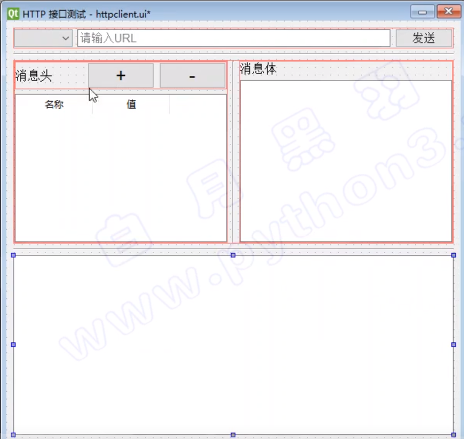

# Pyside2 / PyQT5

http://www.python3.vip/tut/py/gui/qt_01/

程序的用户交互界面，英文称之为 UI (user interface)，当一个应用的 UI 比较复杂的时候，命令行方式就不便用户使用了，这时我们需要图形界面。

如果用 Python 语言开发 跨平台 的图形界面的程序，主要有3种选择：

- Tkinter

  - Python 官方采用的标准库
  - 优点：开源、稳定、发布程序较小
  - 缺点：是空间相对较少

  

- wxPython

  - 基于 wxWidgets
  - 优点：开源、空间比较丰富。
  - 缺点：稳定性相对较差、文档少、用户少

  

- PySide2、PyQt5
  - 基于 Qt 的 Python 库
  - 优点：控件丰富、跨平台体验好、文档完善、用户多
  - 缺点：库比较大，发不出来的程序比较大
  - 

如果要开发小工具，界面比较简单，可以采用Tkinter。

如果是发布功能比较多的正式产品，采用 基于Qt的PySide2、PyQt5。


PySide2 与 PyQt5 的区别：

PySide2 是 Qt 公司自己开发的，而 PyQt5 是第三方公司开发的，两个库的使用对程序员来说，差别很小：它们的调用接口几乎一模一样。


## 1. 安装 pyside2

```
pip install pyside2
```

> 建议：如果你的程序要发布给客户使用，建议使用32位的Python解释器，这样打包发布的exe程序可以兼容32位的Windows


## 2. 简单图形化界面的制作

```
from PySide2.QtWidgets import QApplication, QMainWindow, QPushButton,  QPlainTextEdit, QMessageBox

# 初始化程序
app = QApplication([])

# 创建主窗口
window = QMainWindow()

# 调整窗口大小、位置（位置相对于屏幕）
window.resize(500, 400)
window.move(300, 310)

# 创建窗口标题
window.setWindowTitle('薪资统计')

# 创建文本框（指定它的父控件对象 是 window）
textEdit = QPlainTextEdit(window)

# 设置文本框默认提示内容
textEdit.setPlaceholderText("请输入薪资表")

# 设置文本框大小、位置（位置相对于父窗口）
textEdit.move(10,25)
textEdit.resize(300,350)

# 创建按钮控件
button = QPushButton('统计', window)

# 设置按钮位置
button.move(380,80)

# 显示窗口
window.show()

# 进入QApplication的事件处理循环
app.exec_()
```

> 除了主窗口创建不需要指定父窗口，其他基于 QWidget 子类的空间都需要在参数中指定父窗口


## 3. 控件方法

生成了界面，那么如何让界面互动起来，就需要调用各个控件的方法。比如按钮被点击

```
button.clicked.connect(calculate)
```

> 就是利用 QPushButton 创建的对象 button ，然后调用类中的方法 clicked.connect，参数是一个函数。通过这个方法，我们可以让这个按钮在点击的时候执行我们编写的函数。


```
def calculate():
    print("按钮被点击了")
```


## 4. 封装成类

```
from PySide2.QtWidgets import QApplication, QMainWindow, QPushButton,  QPlainTextEdit,QMessageBox

class Stats():
    def __init__(self):
        self.window = QMainWindow()
        self.window.resize(500, 400)
        self.window.move(300, 300)
        self.window.setWindowTitle('薪资统计')

        self.textEdit = QPlainTextEdit(self.window)
        self.textEdit.setPlaceholderText("请输入薪资表")
        self.textEdit.move(10, 25)
        self.textEdit.resize(300, 350)

        self.button = QPushButton('统计', self.window)
        self.button.move(380, 80)

        self.button.clicked.connect(self.handleCalc)


    def handleCalc(self):
        info = self.textEdit.toPlainText()

        # 薪资20000 以上 和 以下 的人员名单
        salary_above_20k = ''
        salary_below_20k = ''
        for line in info.splitlines():
            if not line.strip():
                continue
            parts = line.split(' ')
            # 去掉列表中的空字符串内容
            parts = [p for p in parts if p]
            name,salary,age = parts
            if int(salary) >= 20000:
                salary_above_20k += name + '\n'
            else:
                salary_below_20k += name + '\n'

        QMessageBox.about(self.window,
                    '统计结果',
                    f'''薪资20000 以上的有：\n{salary_above_20k}
                    \n薪资20000 以下的有：\n{salary_below_20k}'''
                    )

app = QApplication([])
stats = Stats()
stats.window.show()
app.exec_()
```


## 5. 切换窗体

运行程序的时候，经常会遇到窗体跳转，即按一个按钮则跳转到另外一个界面的情况。原理很简单，主要就是 实例化另外一个窗口，显示新窗口，关闭老窗口。

```
from PySide2 import QtWidgets
import sys

class Window2(QtWidgets.QMainWindow):

    def __init__(self):
        super().__init__()
        self.setWindowTitle('窗口2')

        centralWidget = QtWidgets.QWidget()
        self.setCentralWidget(centralWidget)

        button = QtWidgets.QPushButton('按钮2')

        grid = QtWidgets.QGridLayout(centralWidget)
        grid.addWidget(button)


class MainWindow(QtWidgets.QMainWindow):
    def __init__(self):
        super().__init__()
        self.setWindowTitle('窗口1')

        centralWidget = QtWidgets.QWidget()
        self.setCentralWidget(centralWidget)

        button = QtWidgets.QPushButton('打开新窗口')
        button.clicked.connect(self.open_new_window)

        grid = QtWidgets.QGridLayout(centralWidget)
        grid.addWidget(button)

    def open_new_window(self):
        # 实例化另外一个窗口
        self.window2 = Window2()
        # 显示新窗口
        self.window2.show()
        # 关闭自己
        self.close()

if __name__ == '__main__':
    app = QtWidgets.QApplication(sys.argv)
    window = MainWindow()
    window.show()
    sys.exit(app.exec_())
```


## 6. 弹出模式对话框

```
from PySide2 import QtWidgets
import sys

class MyDialog(QtWidgets.QDialog):
    def __init__(self):
        super().__init__()
        self.setWindowTitle('模式对话框')

        self.resize(500, 400)
        self.textEdit = QtWidgets.QPlainTextEdit(self)
        self.textEdit.setPlaceholderText("请输入薪资表")
        self.textEdit.move(10, 25)
        self.textEdit.resize(300, 350)

        self.button = QtWidgets.QPushButton('统计', self)
        self.button.move(380, 80)

class MainWindow(QtWidgets.QMainWindow):
    def __init__(self):
        super().__init__()
        self.setWindowTitle('主窗口')

        centralWidget = QtWidgets.QWidget()
        self.setCentralWidget(centralWidget)

        button = QtWidgets.QPushButton('打开模式对话框')
        button.clicked.connect(self.open_new_window)

        grid = QtWidgets.QGridLayout(centralWidget)
        grid.addWidget(button)

    def open_new_window(self):
        # 实例化一个对话框类
        self.dlg = MyDialog()        
        # 显示对话框，代码阻塞在这里，
        # 等待对话框关闭后，才能继续往后执行
        self.dlg.exec_()

if __name__ == '__main__':
    app = QtWidgets.QApplication(sys.argv)
    window = MainWindow()
    window.show()
    sys.exit(app.exec_())
```


## 7. Qt Designer

QT程序界面的 一个个窗口、控件，就是像上面那样用相应的代码创建出来的。但是手写代码调整位置以及大小实在是耗费时间。Qt 提供了设计 UI 界面的程序， Qt Designer

运行在Python安装目录下 Lib\site-packages\PySide2\designer.exe 这个可执行文件

通过 Pycharm 安装的话，在 AppData\Roaming\Python\Python38\site-packages\PySide2

> 界面和 VS 差不多，直接拖拽就可以设计出自己需要的 UI 了。


可以设置控件的对象名称、对象的属性等等，在设计完界面之后，保存文件为 ui 文件，可以放在与 python 文件相同的目录，一般建议如果有多个 ui 的话，最好创建一个文件夹，将所有 ui 放在一起。ui 格式为 XML 格式。


## 8. 动态调用 UI

创建完 UI 界面后，需要让 Python 程序加载 UI

```
from PySide2.QtWidgets import QApplication, QMessageBox
from PySide2.QtUiTools import QUiLoader

class Stats:

    def __init__(self):
        # 从文件中加载UI定义

        # 从 UI 定义中动态 创建一个相应的窗口对象
        # 注意：里面的控件对象也成为窗口对象的属性了
        # 比如 self.ui.button , self.ui.textEdit
        self.ui = QUiLoader().load('main.ui')

        self.ui.button.clicked.connect(self.handleCalc)

    def handleCalc(self):
        info = self.ui.textEdit.toPlainText()

        salary_above_20k = ''
        salary_below_20k = ''
        for line in info.splitlines():
            if not line.strip():
                continue
            parts = line.split(' ')

            parts = [p for p in parts if p]
            name,salary,age = parts
            if int(salary) >= 20000:
                salary_above_20k += name + '\n'
            else:
                salary_below_20k += name + '\n'

        QMessageBox.about(self.ui,
                    '统计结果',
                    f'''薪资20000 以上的有：\n{salary_above_20k}
                    \n薪资20000 以下的有：\n{salary_below_20k}'''
                    )

app = QApplication([])
stats = Stats()
stats.ui.show()
app.exec_()
```


**PyQt5 加载 UI 文件代码格式**

```
from PyQt5 import uic

class Stats:

    def __init__(self):
        # 从文件中加载UI定义
        self.ui = uic.loadUi("main.ui")
```


## 9. Layout 布局（自适应）

http://www.python3.vip/tut/py/gui/qt_01/

​	

在 UI Designer 中设计 UI 的时候，如果想要自适应大小，可以使用 Layout 布局。

和 HTML CSS 设计一样，先设计小模块，然后按照垂直或水平布局。最后将最顶级窗口进行布局。就可以实现窗体自适应了。





> 布局顺序：先将模块摆放好，然后从里到外进行布局，布局的时候可以直接将控件拖进右侧栏中的对象查看器中。


**调整大小**

利用布局中 layoutStretch 比例进行布局（有点像Bootstrap）

利用控件 Vertial Spacer / Horizannal Spacer 添加空白控件


## 10. 发布程序

pyinstaller 进行封装成 exe 文件，在CMD环境中，进入 py 脚本的目录，然后运行以下代码

```
pyinstaller httpclient.py --noconsole --hidden-import PySide2.QtXml
```

这样就会在当前目录下产生一个名为 `dist` 的目录。里面就有一个名为 httpclient 的目录，我们的可执行程序 httpclient.exe 就在里面。


如果想在其他目录生成，可以加参数

```
pyinstaller httpclient.py --workpath d:\pybuild  --distpath d:\pybuild\dist --noconsole --hidden-import PySide2.QtXml
```


参数 `--workpath` 指定了制作过程中临时文件的存放目录

参数 `--distpath` 指定了最终的可执行文件目录所在的父目录

参数 `--noconsole` 指定不要命令行窗口，否则我们的程序运行的时候，还会多一个黑窗口。 但是我建议大家可以先去掉这个参数，等确定运行成功后，再加上参数重新制作exe。因为这个黑窗口可以显示出程序的报错，这样我们容易找到问题的线索。

参数 `--hidden-import PySide2.QtXml` 参数是因为这个 QtXml库是动态导入，PyInstaller没法分析出来，需要我们告诉它，


> 另外需要将 UI 文件放到 dist 文件夹中，如果代码中需要引入一些其他文件，也需要一并放入该文件夹


## 11. 添加程序图标

程序内左上角应用程序图标

```
from PySide2.QtGui import  QIcon

app = QApplication([])
# 加载 icon
app.setWindowIcon(QIcon('logo.png'))
```

注意：这些图标png文件，在使用PyInstaller创建可执行程序时，也要拷贝到程序所在目录。否则可执行程序运行后不会显示图标。


EXE文件图标

打包的时候添加 `--icon="logo.ico"` 参数即可

```
pyinstaller httpclient.py --noconsole --hidden-import PySide2.QtXml --icon="logo.ico"
```


## 12. QSS

类似于 CSS，在最顶层的 MainWindow 对象中 styleSheet 属性中添加 CSS 代码

```
QPushButton { 
    color: red ;
    font-size:15px;
}
```


**QSS 选择器**

| Selector            | 示例                        | 说明                                              |
| ------------------- | --------------------------- | ------------------------------------------------- |
| Universal Selector  | `*`                         | 星号匹配所有的界面元素                            |
| Type Selector       | `QPushButton`               | 选择所有 QPushButton类型 （包括其子类）           |
| Class Selector      | `.QPushButton`              | 选择所有 QPushButton类型 ，但是不包括其子类       |
| ID Selector         | `QPushButton#okButton`      | 选择所有 `对象名为 okButton` 的QPushButton类型    |
| Property Selector   | `QPushButton[flat="false"]` | 选择所有 flat 属性值为 false 的 QPushButton类型。 |
| Descendant Selector | `QDialog QPushButton`       | 选择所有 QDialog `内部` QPushButton类型           |
| Child Selector      | `QDialog > QPushButton`     | 选择所有 QDialog `直接子节点` QPushButton类型     |


伪选择器

我们可以这样指定当鼠标移动到一个元素上方的时候，元素的显示样式

```css
QPushButton:hover { color: red }
```

再比如，指定一个元素是disable状态的显示样式

```css
QPushButton:disabled { color: red }
```

再比如，指定一个元素是鼠标悬浮，并且处于勾选（checked）状态的显示样式

```css
QCheckBox:hover:checked { color: white }
```


**背景**

可以指定某些元素的背景色，像这样

```css
QTextEdit { background-color: yellow }
```

颜色可以使用红绿蓝数字，像这样

```css
QTextEdit { background-color: #e7d8d8 }
```

也可以像这样指定背景图片

```css
QTextEdit {
    background-image: url(gg03.png);
}
```


**边框**

可以像这样指定边框 `border:1px solid #1d649c;`


其中

`1px` 是边框宽度

`solid` 是边框线为实线， 也可以是 `dashed`(虚线) 和 `dotted`（点）


比如

```css
*[myclass=bar2btn]:hover{
	border:1px solid #1d649c;
}
```

边框可以指定为无边框 `border:none`


**字体、大小、颜色**

可以这样指定元素的 文字字体、大小、颜色

```css
*{	
	font-family:微软雅黑;
	font-size:15px;
	color: #1d649c;
}
```


**宽度、高度**

可以这样指定元素的 宽度、高度

```css
QPushButton {	
	width:50px;
	height:20px;
}
```


**margin、padding**

见下图，根据视频讲解，理解margin、padding 的概念


可以这样指定元素的 元素的 margin

```css
QTextEdit {
	margin:10px 11px 12px 13px
}
```

分别指定了元素的上右下左margin。

也可以使用 margin-top, margin-right, margin-bottom, margin-left 单独指定 元素的上右下左margin

比如

```css
QTextEdit {
	margin:10px 50px;
	padding:10px 50px;
}
```


## 13. 多线程与主线程分离

## 14. 内嵌浏览器


