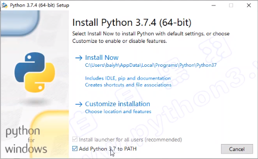
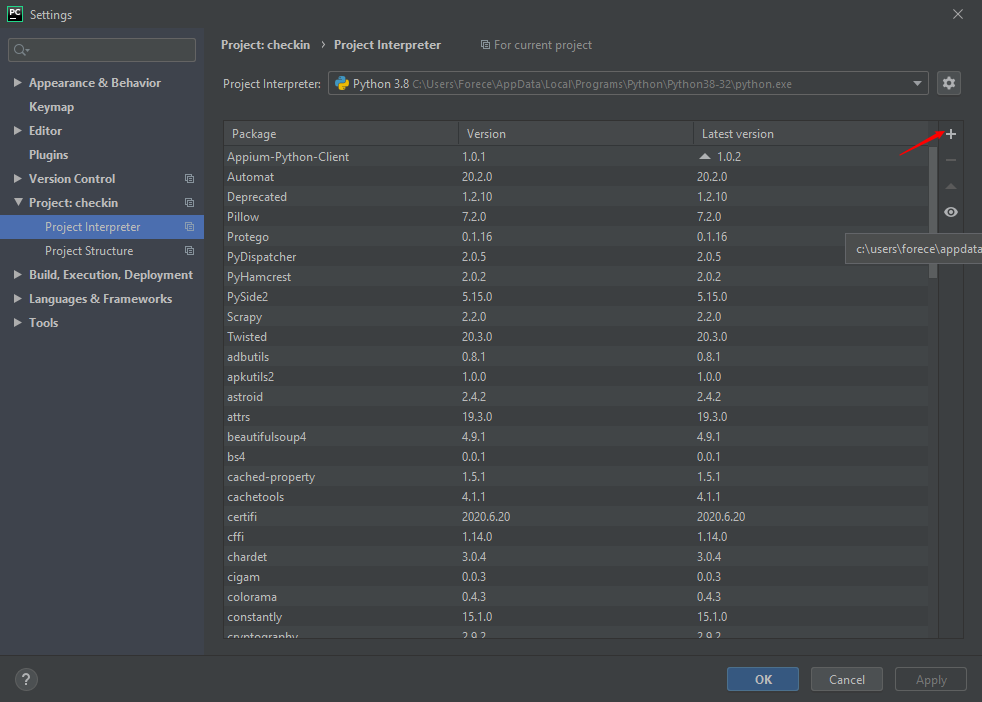

# 一、Python 起源

Python是面向对象，解释型的计算机程序设计语言。是一种开放原代码的脚本编程语言。Python 本身的意思是蟒蛇的意思，目前比较流行的一款编程语言，精简、多平台、并且在AI人工智领域很活跃。


Python 的创始人为吉多·范罗苏姆（Guido van Rossum），因为喜欢一个叫 Monty Python's Flying Circus 的情景喜剧，所以任性的将这门自己开发的编程语言叫做了 Python。


## 1. Python 之禅

因为是受到 ABC 语言的影响，所以 Python 的编程思想也是越简单、越容易理解越好。Python 之禅是由Tim Peters 在递交邮件给 Guido 的时候发表的一个针对 Python 编程设计的19条编程理念

Python之禅作为一个信息条款被录入Python增强建议（PEP）的第20条，在Python语言的官方网站也能找到。它还作为复活节彩蛋被包含在Python解释器中。如果输入 `import this` 就会在Python的编程环境IDLE中显示。


>**PEP 20 -- The Zen of Python**
>Beautiful is better than ugly.
>Explicit is better than implicit.
>Simple is better than complex.
>Complex is better than complicated.
>Flat is better than nested.
>Sparse is better than dense.
>Readability counts.
>Special cases aren't special enough to break the rules.
>Although practicality beats purity.
>Errors should never pass silently.
>Unless explicitly silenced.
>In the face of ambiguity, refuse the temptation to guess.
>There should be one-- and preferably only one --obvious way to do it.
>Although that way may not be obvious at first unless you're Dutch.
>Now is better than never.
>Although never is often better than *right* now.
>If the implementation is hard to explain, it's a bad idea.
>If the implementation is easy to explain, it may be a good idea.
>Namespaces are one honking great idea -- let's do more of those!


Life is short, You need Python.

人生苦短，我用Python

加油吧，少年！


## 2. Python 的特点

Python 是完全面向对象的语言

- 函数、模块、数字、字符串都是对象，在 Python 中一切皆对象
- 完全支持继承、重载、多重继承
- 支持重载运算符，也支持泛型设计


Python 拥有一个强大的标准库，Python 语言的核心只包含 数字、字符串、列表、字典、文件 等常见类型和函数，而由 Python 标准库提供了 系统管理、网络通信、文本处理、数据库接口、图形系统、XML 处理 等额外的功能


Python 社区提供了大量的第三方模块，使用方式与标准库类似。它们的功能覆盖 科学计算、人工智能、机器学习、Web 开发、数据库接口、图形系统 多个领域


标准库就是BIF（Built-In Functions），第三方模块就是 Modules，不管是标准库还是模块，如果需要使用都需要用 import 引用。


## 3. 解释器

计算机不能直接理解任何除机器语言以外的语言，所以必须要把程序员所写的程序语言翻译成机器语言，计算机才能执行程序。将其他语言翻译成机器语言的工具，被称为编译器。

编译器翻译的方式有两种：一个是编译，另外一个是解释。两种方式之间的区别在于翻译时间点的不同。当编译器以解释方式运行的时候，也称之为解释器。


**编译型语言（如C）**，只能在单平台上运行，运行前需要将所有代码进行编译器进行编译，生成可执行文件，然后直接由CPU行，只能针对同平台运行。速度快

**解释型语言（Python）**，由于可以在不同平台安装解释器，所以跨平台效果比较好，因为逐行解释，所以速度较慢。


## 4. Python 的安装

官网地址：https://www.python.org
下载 3.x 版本，新命令已经和2.x版本不兼容了



> 注意： 需要勾选加入环境变量


如果忘记勾选加入系统变量可以在 Windows 中设置


> 注意：Install for all user ，路径最好安装在根目录，避免权限问题


## 5. 运行环境

### 5.1 IDLE

IDLE 是 Python 软件包自带的一个集成开发环境，初学者可以利用它方便地创建、运行、测试和调试Python程序。


进入 IDLE 后，因为只是 Shell 所以每句python命令只是单行逐步执行，CTRL+N 新建文件后可以输入多行命令，然后保存后，按F5执行即可。


**快捷键**

> Alt + N 上一条命令
> Alt + P 下一条命令


### 5.2 交互式 Python

#### python

交互式方式进入方法就是在 shell 中输入python，进入python环境


**退出方式：**

1. 直接输入 exit()
2. CTRL+Z


####  ipython

ipython 也是一个 python 的交互式 shell，比默认的 python shell 要好用很多


1. 安装

- pip install ipython


2. 运行

- 在shell中运行 python

3. 特点

- 支持自动补全
- 支持自动缩进
- 同时支持 python 语句和 Linux 命令

4. 退出方式

- EXIT
- CTRL+D


### 5.3 Pycharm

pyCharm - 目前比较流行的像Visual Studio一样集成IDE环境。IDE（Integrated Development Environment）


Python 可以将一对小括号中的代码自动连接在一起，如果代码很长，直接将代码括起来，然后选择行大小按回车即可

~~~python
x = ('This will build a very long long '
     'long long long long long long string')
     
 (x = 'This will build a very long long long long long long long long string')

TouchAction(driver).press(x=200, y=200).press(x=200, y=200).\
    press(x=200, y=200).press(x=200, y=200).performed()
~~~


## 6. Python 命名规则

### 6.1 文件项目命名规则

- 建议只使用小写字母、数字和下划线
- 文件名不能以数字开始


### 6.2 Python 手册命名规范：


## 7. Python 注释方法：

### 7.1 单行注释

以 `#` 开头，`#` 右边的所有东西都被当做说明文字，而不是真正要执行的程序，只起到辅助说明作用
示例代码如下：

~~~python
# 这是第一个单行注释
print("hello python")
~~~

为了保证代码的可读性，`#` 后面建议先添加一个空格，然后再编写相应的说明文字


在代码后面增加的单行注释

在程序开发时，同样可以使用 `#` 在代码的后面（旁边）增加说明性的文字
但是，需要注意的是，为了保证代码的可读性，注释和代码之间至少要有两个空格

示例代码如下：

~~~python
print("hello python")  # 输出 hello python
~~~


### 7.2 多行注释

~~~python
"""
这是一个多行注释
在多行注释之间，可以写很多很多的内容……
"""
print("hello python")
~~~


> 在 PyCharm 里的快捷键，选上需要注释的块，然后按 CTRL + /


### 7.3 添加任务列表：

~~~python
# TODO(负责人) 注释
~~~


## 8. 小技巧

## 8.1 shebang

在脚本中, 第一行以` #!` 开头的代码, 在计算机行业中叫做 `shebang`, 也叫做 sha-bang / hashbang / pound-bang / hash-pling, 其作用是"指定由哪个解释器来执行脚本"。

~~~python
#!/usr/bin/env python3
~~~

> 举个例子, 很多人在系统中同时安装了 Python2 和 Python3, 但是 2 和 3 是不兼容的, 所以执行脚本时必须指定解释器.


## 8.2 Python 2.x 兼容中文：

Python3 已经默认 UTF-8 编码，支持了中文，但是如果你的程序在老版本的 Python 中运行的话，那么如果你的代码中有特殊字符（比如中文，就会无法执行）需要在 py 文件头部声明一下编码。

~~~python
#coding=utf-8
#coding:utf-8
# -*- coding:UTF-8 -*-
~~~

> 以上三种写法都是合法有效的
> **但是, `coding` 和 `=`之间, 或者`coding` 和 `:`之间, 不能有空格!**


# 二、输出函数 Print

print 函数的作用，可以把 `""` 内部的内容，输出到屏幕上

~~~python
print ("Hello World!")  # 可以输出文字
print (5+3)  # 可以计算
print ("Well" + "Done")  # 可以连接字符串
print ("Abc" + " 456")  # 带空格连接
print("1.01 ** 365)  # 输出1.01的365次方
print ("ABC" *8)  # 重复打印8遍ABC
print ("ABC\n" *8)  # 重复打印8遍ABC带换行
print ("c:\\hello.py")  # 用\来转义字符
print ('he said "OK"')  # 或直接用单引号来引用整个带符号的字符串
~~~

~~~python
# 注意：字符串和数字不能同时输出，需要将数字转换为字符串如：
print(phrase + "is" + str(age) + " years old")
~~~


在默认情况下 print 函数输出内容之后，会自动在内容末尾增加换行，如果不希望在末尾增加换行，可以在 print 函数输出内容的后面增加， `end=""`

其中 "" 中间可以指定 print 函数输出内容之后，继续希望显示的内容

~~~python
# print 函数输出后不换行
print("*", end="")
~~~

~~~python
# 只输出换行
print("")
~~~


# 三、数据类型

## 1. 数据类型

~~~python
# int - 整型
int_number = 50

# float - 浮点型
float_number = 3.145

# string - 字符串变量
string = "This is a string"

# boolean - 布尔型
i = True
b = Flase
~~~


## 2. 字符串变量拼接

~~~python
# 字符串变量使用 + 拼接字符串
print("string1" + "string2")

# 使用 * 重复拼接相同字符串
print("*" * 50)
~~~

> 注意：数字型变量和字符串变量不能进行其他的运算


## 3. 数据类型的转换

~~~python
# 转整形
int("20.0")

# 转浮点型
float(3)

# 转字符串
str(800)
~~~


int(), float(), str() 这几个转换数据类型的函数，不会改变原来变量的类型，只是新生成了一个新的变量。

~~~python
num_a = 30.4
num_b = 30.4
int(num_a)  # 没有改变原来的 num_a，只是 int(num_a) 这个整体是整型
num_b = int(num_b)  # 重新将变量赋值，所以数据类型已经改变
print(type(num_a))
print(type(nub_b))

# 输出结果
<class 'float'>
<class 'int'>
~~~


## 4. type() 查看数据类型

~~~python
# 查看变量a的数据类型
a = 30
print(type(a))

# 输出结果
<class 'int'>
~~~


## 5. isinstance() 判断数据类型

~~~python
# 判断数据类型
a = "name"
print(isinstance(a,str))  # 判断a是否是字符串型

# 输出结果
True

~~~


# 四、数据输入 

使用 input 函数，可以将用户在控制台输入的数据传入变量

~~~python
input("这里的字符会在控制台中显示，并且等待用户输入字符")
~~~


可以直接给 input 输入的数据赋值

```python
temp=input("随便输入一个数字\n")
```


# 五、帮助文档

内置函数，英文为 Bulit-in functions，我的理解就是可以在 Python 的 IDLE 里面直接使用的函数，而其他函数使用是需要通过 import 语句调入扩展包后才能使用。


在 Python 或 IDLE 中，输入 `dir(__builtins__)`可以看到 Python 提供的内置方法列表（注意，builtins 前后是两个下划线哦）其中小写的就是 BIF。如果想具体查看某个 BIF 的功能，比如 input()，可以在 shell 中输入 help(input)，就会得到这个 BIF 的功能描述。

```python
dir(__builtins__)  # 查看 Python 提供的内置方法列表
help(input)  # 查看 input 命令功能描述
print(str.__doc__)  # 查看 str 函数文档
```


输入函数，然后按 `.`  然后按 `Tab`，可以查看函数所有使用方法


# 六、运算符

## 1. 数学计算符

~~~python
+ - * / %  # 加、减、乘、除、求余
~~~

```python
//  # 取整数 
9//2  # 输出结果为4
```

```
**  # 幂运算，又称作次方
print(2**3)  # 求2的3次方
```


## 2. 比较运算符

~~~python
<
>
<=
>=
==  # 相等
!=  # 不等
~~~


## 3. 逻辑运算符

```python
and	 # 逻辑与
or	 # 逻辑或
not	 # 逻辑非
```

a = 10, b = 20

| 运算符 | 逻辑表达式 | 描述                                                         | 实例                    |
| :----- | :--------- | :----------------------------------------------------------- | :---------------------- |
| and    | x and y    | 布尔"与" - 如果 x 为 False，x and y 返回 False，否则它返回 y 的计算值。 | (a and b) 返回 20。     |
| or     | x or y     | 布尔"或" - 如果 x 是非 0，它返回 x 的值，否则它返回 y 的计算值。 | (a or b) 返回 10。      |
| not    | not x      | 布尔"非" - 如果 x 为 True，返回 False 。如果 x 为 False，它返回 True。 | not(a and b) 返回 False |


## 4. 赋值运算符

~~~python
i = i + 1
i += 1 # 也可以写成
~~~

同样的写法还有：

~~~python
=
+=
-=
*=
/=
//=
%=
**=
~~~


## 5. 运算符优先级


## 6. 字符串的常用操作

在 ipython3 中定义一个字符串，例如：`hello_str = ""`
输入 `hello_str.` 按下 TAB 键，ipython 会提示字符串能够使用的方法如下：


### 6.1 字符串大小写转换

~~~python
# 将字符串转换成小写
string.lower()

#  将字符串转换为大写
string.upper()

# 对字符串字母的大小写进行反转
string.swapcase()

# 将首字母转换成大写
string.capitalize()

# 将字符串中每个“单词”首字母大写。
string.title()
~~~


方法可以连起来使用：

~~~python
#转换大写后进行判断
print(string.upper().isupper())
~~~


### 6.2 判断字符串内容

判断内容是字母

~~~python
string.isalnum()  # 如果 string 至少有一个字符并且所有字符都是字母或数字则返回True
string.isalpha()  # 如果 string 至少有一个字符并且所有字符都是字母则返回Tue
~~~


判断内容是数字

~~~python
string.isdecimal()   # 如果 string 只包含数字则返回 True（全角数字）
string.isdigit()   # string 只包含数字则返回 True（全角数字，①，\u002 平方符号²）
string.isnumeric()  # 如果 string 只包含数字则返回 True，全角数字，汉字数字
~~~


判断内容大小写

~~~python
string.istitle()  # 判断 string 标题化（每个单词首字母大写）
string.islower()  # 判断 string 中字符是否都是小写
string.isupper()  # 判断 string 中字符是否都是大写
~~~


判断空格

~~~python
string.isspace()  # 如果 string 中只包含空格，则返回 True
# 还可以判断包括空格在内的 \n \t \r
~~~


判断数字函数的区别：

~~~python
# 一般编程只针对平常数字，建议使用此函数来判断数字
string.isdecima()

# 可以判断 unicode 数字，如①, /u00b2（平方符号²）
string.isdigit()

# 可以判断 unicode 数字，如①, /u00b2（平方符号²）
# 还可以判断中文数字，如一千零一
string.isnumber()
~~~

>注意：三个函数不能判断小数


### 6.3 字符串搜索定位与替换

```
str.startswith(prefix[, start[, end]])  # 检查字符串是否已 prefix 起始
```

```
str = "this is string example....wow!!!"
# 字符串是否以 this 开头
print (str.startswith( 'this' ))
# 从第八个字符开始的字符串是否以 string 开头   
print (str.startswith( 'string', 8 ))  
# 从第2个字符开始到第四个字符结束的字符串是否以 this 开头
print (str.startswith( 'this', 2, 4 )) 
```

```
str.endswith(suffix[, start[, end]])  # 是否已xxx为结尾
```

```
# 检查 str1 是否包含在 str 中（可指定范围），如果是则返回索引值，否则返回-1
str.find(str1, start=0, end=len(str))  
str.rfind(sub[, start[, end]])  # 类似 find 函数，从右侧开始找
str.index(sub[, start[, end]])  # 类似 find 函数，如果没找到会报错
str.rindex(sub[, start[, end]])  # 类似 index 函数，从右侧开始找

str.replace(old, new[, count])  # 在 str 中将old替换成为new，替换不超过count次
str.count(sub, start= 0,end=len(string))  # 统计sub在str中出现的次数
len(str)  # 求 str 字符串长度
```

>**string.index() 和 string.find() 区别**
>
>都是返回字符串索引位置，如果子字符串没有在源字符串中找到的话，那么index会报错，find会返回-1

> string.replace() 会返回一个新的字符串，不会对源字符串进行修改。


### 6.4 文本对齐

```
# 返回一个原字符串左对齐，并使用空格（可用其他字符）填充至长度为 width 的新字符串
str.ljust(width[, fillchar])  
str.rjust(width[, fillchar])  # 右对齐
str.center(width[, fillchar])  # 居中对齐
str.zfill(width)  # 返回指定长度的字符串，原字符串右对齐，前面填充0
```


### 6.5 去除空白字符

```
str.lstrip([chars])  # 去掉 str 左侧的空白字符
str.rstrip([chars])  # 去掉 str 右侧的空白字符
str.strip([chars])  # 去掉 str 两侧所有空格
```


### 6.6 字符串的联合与分割

```
str.join(iterable)  # 以 str 作为分隔符，将一个迭代元素合并成一个新字符串

str.partition(sep)  # 把字符串str分成一个3元素的元组
str = "www.runoob.com"
print str.partition(".")  # 输出结果为 ('www', '.', 'runoob.com')

str.rpartition(sep)  # 类似 partition() ，从右侧开始查找

string.split(str="", num)  # 以 str 为分隔符切片 string
string.rsplit(sep=None, maxsplit=-1)  # 从右侧开始分割
string.splitlines()  # 按照(\r, \n) 分割，返回一个包含各行作为元素的列表
```


### 6.7 字符串编码

以 encoding 指定的编码格式解码 string，如果出错默认报一个 ValueError 的 异 常 ， 除非 errors 指 定 的 是 'ignore' 或 者'replace'

```
str.encode(encoding="utf-8", errors="strict")
```


### 6.8 字符串切片

sequence特性的数据对象 都支持 切片操作 ， 字符串是具有sequence特性的，当然也支持切片。

假想我们手里有把刀，要从下面的字符串中切出你好，就应该在箭头所示的地方切两刀，就得到 `你好` 这个子字符串了


如果用正数表示就是 2 和 4 ， Python中可以用 hello[2:4] 这样的切片表达式来得到该字符串。 大家可以运行如下代码看看

```
hello = '刘总你好啊'
print(hello[2:4])  # 输出你好
```


当然也可以用负数表示， 就是 -3 和 -1 ， Python中可以用 hello[-3:-1] 这样的切片表达式来得到该字符串。 大家可以运行如下代码看看

```
hello = '刘总你好啊'
print(hello[-3:-1])  # 输出你好
```


省略切片索引：

```
 hello[2:]  # 输出你好啊
 hello[:-3]  # 输出刘总
```


切片步数：

```
str[start:stop:step]
hello[0::2] # 输出刘你啊
```


https://zhuanlan.zhihu.com/p/79541418


### 6.9 格式化字符串输出

#### 新版格式化输出方式

Python2.6 开始，新增了一种格式化字符串的函数 str.format()，它增强了字符串格式化的功能。基本语法是通过 {} 和 : 来代替以前的 % 。format 函数可以接受不限个参数，位置可以不按顺序。

```
"{} {}".format("hello", "world")    # 不设置指定位置，按默认顺序
'hello world'

"{0} {1}".format("hello", "world")  # 设置指定位置
'hello world'

"{1} {0} {1}".format("hello", "world")  # 设置指定位置
'world hello world'
```


也可以设置参数

```
print("网站名：{name}, 地址 {url}".format(name="菜鸟教程", url="www.runoob.com"))

# 通过字典设置参数
site = {"name": "菜鸟教程", "url": "www.runoob.com"}
print("网站名：{name}, 地址 {url}".format(**site))

# 通过列表索引设置参数
my_list = ['菜鸟教程', 'www.runoob.com']
print("网站名：{0[0]}, 地址 {0[1]}".format(my_list))  # "0" 是必须的
```


数字格式化
下表展示了 str.format() 格式化数字的多种方法：

```
print("{:.2f}".format(3.1415926))
3.14
```


#### 旧版格式化输出方式

在 Python 可以使用 % 作为格式化操作符，专门用于处理字符串中的格式

```
%s  # 字符串
%d  # 有符号十进制整数， %06d 表示输出的整数显示位数，不足的地方使用0补全
%f  # 浮点数， %.02f 表示小数点后只显示两位
%%  # 输出 %
```

语法格式如下：

```
print("格式化字符串" % 变量1)
print("格式化字符串" % (变量1, 变量2))  # 多个变量需要以元组的形式（加括号）
```

```
print("我的名字叫%s" % name)
print("我卖的%06d号水果, 价格为%.02f每斤" % (num, price))
```

如果需要在格式化里做运算，需要用小括号，否则会造成字符串重复输出

```
percentage = 0.25
print("利率为%.02f%%" % (percentage * 100))
```

%c是格式化字符串，中间的%是转义结束，后边括号是需要进行替换的字符

```
print("%c %c %c" % (97,98,99))
```


字符串格式化符号附录

```
%c 格式化字符及其 ASCII 码
%s 格式化字符串
%d 格式化整数
%o 格式化无符号八进制数
%x 格式化无符号十六进制数
%X 格式化无符号十六进制数（大写）
%f 格式化浮点数字，可指定小数点后的精度
%e 用科学计数法格式化浮点数
%E 作用同 %e，用科学计数法格式化浮点数
%g 根据值的大小决定使用 %f 或 %e
%G 作用同 %g，根据值的大小决定使用 %f 或者 %E
```


格式化操作符辅助命令

```
m.n 	m 是显示整个数值占位的最小总宽度，n 是小数点后的位数
- 		用于左对齐
+ 		在正数前面显示加号（+）
# 		在八进制数前面显示 '0o'，在十六进制数前面显示 '0x' 或 '0X'
0 		显示的数字前面填充 '0' 取代空格
```


### 6.10 Python 的转义字符

```
\' 单引号
\" 双引号
\a 发出系统响铃声
\b 退格符
\n 换行符
\t 横向制表符（TAB）
\v 纵向制表符
\r 回车符
\f 换页符
\o 八进制数代表的字符
\x 十六进制数代表的字符
\0 表示一个空字符
\\ 反斜杠
```


输出带有单引号的字符串

```
print("Let's Go")
```

输出带有双引号的字符串

```
print('Tommy say "What are you doing"')
```

输出带有路径符号\的字符串

```
print('C:\\Temp')
print(r'C:\Temp')  # r代表字符串中对\不进行转义
```

输出多行文本

```
print('''
多行文本
多行文本
多行文本
多行文本
''')
```


# 七、条件分支

## 1. If 条件判断

```
if 条件表达式:
	# 执行代码
```


一般条件分支

```
if (is_male == true):
    print("He is Male")
else:
    print("He is not a Male")
```

>  提示：if 判断条件是否成立，如果成立则执行if代码，如果不成立则执行else代码


## 2. 逻辑运算符

Python 中可以使用 and、or、not 三种逻辑运算符来把多个条件按照逻辑进行连接，变成更复杂的条件。

```
if (is_male==True) and (is_tall==True):
    print("He is qualified")
else:
    print("He is not qualified")
```


## 3. 多分支语句

```
if 条件1:
    # 代码段1
elif 条件2:
    # 代码段2
else:
    # 上方条件都不满足，最终执行代码
```

> elif 可以看成 “否则的话，那么再如果”


若全部用if语句，程序运行时会遍历所有if（不管每个if后的逻辑运算是否为True）。而用if-elif，程序运行时，只要if或后续某一个elif之一满足逻辑值为True，则程序执行完对应输出语句后自动结束该轮if-elif（即不会再去冗余地执行后续的elif或else）

```
a = True
b = True
if a:
    print("代码块1")
if b:
    print("代码块2")
```

> 代码块1和代码块2都会被输出，而再想一下如果是使用elif:


```
a = True
b = True
if a:
    print("代码块1")
elif b:
    print("代码块2")
```

> 只会输出代码块1，而不会输出代码块2了


```
a = False
b = True
if a:
    print("代码块1")
elif b:
    print("代码块2")
```

> 输出的话就是代码块2了，如果a不满足，继续判断，直到不满足所有的条件，输出else代码


而嵌套则是相反的意思

```
a = True
b = True
if a:
    print('代码块1')
    if b:
        print('代码块2')
```

> 当满足a的条件，则继续向下判断。


混合条件可以用 or、and、not 来作为条件连接

```
is_male=False
is_tall=True

if is_male and is_tall:
    print("He is a Tall Male")
elif is_male and not is_tall:
    print("He is a Male but not Tall")
elif not is_male and is_tall:
    print("He is not a Male but Tall")
else:
    print("He is not a Male and not Tall")
```

> 提示：if 判断条件是否成立，如果成立则执行if代码，如果不成立则继续判断elif代码，直到最后都判断完，执行else代码


## 4.  数值区间判断

不能写成 `percentage >= 0  and percentage <= 1`，需要写成如下格式，更精炼也更容易理解

```
if 0 <= percentage <= 1:
    print("正确")
```


## 5. 三元操作符/三元表达式

语法：

```
x if 条件表达式 else y
```


普通 if 判断后赋值

```
x,y = 4,5
if x<y:
small = x
else:
small = y
```


用三元表达式

```
small = x if (x<y) else y
```


## 补充：随机数模块

Python 中生成一个随机数需要引入随机数的模块

```
import random
```

Python 中生成一个随机数需要引入随机数的模块


导入模块后，可以在模块名称后边敲一个 `.` 然后按TAB键，会提示该模块中包含的所有函数，使用随机整数的方法如下：

```
random.randint(a,b)  # 返回[a,b]之间的整数，包含a和b
random.randint(1,10) # 返回10以内随机整数
```


# 八、循环语句

## 1. while 语句基本语法

```
初始条件设置  # 通常是计数器
while 条件:
 循环体代码
 处理条件（终止条件）
```


```
# 输出1-9

i = 1 
while i < 10:
    print(i)
    i += 1
```


## 2. 循环中断

break 和 continue 是专门在循环中使用的关键字

- break 某一条件满足时，退出循环
- continue 某一条件满足时，跳过此次循环，执行下一次循环


## 3. 循环嵌套

while 循环嵌套就是： while 里边还有 while

```
while 条件1：
    循环体
    while 条件2：
        循环体
        处理条件2
    处理条件1
```


## 4. for 遍历循环

遍历就是从头到尾依次从列表中获取数据，在循环体内部针对每一个元素，执行相同的操作。使用 for 循环可以实现迭代遍历。

语法：

```
for 循环变量 in 列表:
    循环体
```


遍历列表中每个元素：

```
name_list = ["A","B","C"]
for i in name_list:
    print(i, end=' ') #用空格隔开每次输出内容
```


遍历字符串：

```
for i in "Total":
    print(i)
```


## 5. range 函数

python 中 range() 函数可创建一个整数列表，一般用在 for 循环中。

语法：

```
range(start, stop[, step])
```

start： 计数从 start 开始。默认是从 0 开始。例如range（5）等价于range（0， 5）;
stop： 计数到 stop 结束，但不包括 stop。例如：range（0， 5） 是[0, 1, 2, 3, 4]没有5
step： 步长，默认为1。例如：range（0， 5） 等价于 range(0, 5, 1)


指定遍历次数（10次）：

```
for i in range(10):
    print(i)
```


输出3-6

```
for i in range(3,7):
    print(i)
```


遍历数组

```
letters = ["A","B","C"]
for i in range(len(letters)):
    print(letters[i])
```


判断变量是否在字符串中

```
letter = "b"
if letter in "AEIOUaeiou":
    print("true")
else:
    print("false")
```


精简

```
letter = "b"
if letter.lower() in "aeiou":
    print("true")
else:
    print("false")
```


生成整数列表

需要将 range 转换成列表才可以

```
list1 = range(10)
print(list1)

list2 = list(range(10))
print(list2)

# 输出结果
[0, 1, 2, 3, 4, 5, 6, 7, 8, 9]
range(0, 10)

```


# 九、函数 - Function

## 1. 函数的定义

```
def 函数名():
 函数封装代码
 return # 如果没有返回数值，可以没有 return
```

> 所有 Function Code 必须要有缩进Tab，定义名后要有冒号


定义一个 say_hi 函数：

```
def say_hi():
    print("Hello")
say_hi()
```

> 函数体相对比较独立，在函数定义的上方，应该与其他代码保留2个空行


## 2. 函数参数的使用

在函数名后边的小括号内部填写参数，多个参数会用逗号分隔。

```
def sum_2_num(num1, num2):
    result = num1 + num2
    print("%d + %d = %d" % (num1, num2, result))
    
    
sum_2_num(50,20)
```


多参数的传值：
参数传值需要按照定义参数的顺序来进行传值，如果顺序错了，则值就给错了。多参数环境下，记不住参数顺序可以直接给实参附上形参的名称来进行传参。

```
def sayhi(name, From):
    print(name + " Say hello from " + From)
sayhi(name="Li Lei", From="China")
```


默认参数：
定义函数的时候，可以给参数设定默认值，如果调用函数的时候没有传参，则默认使用定义参数。

```
def sayhi(name="Lee", isfrom="China"):
    print('%s is from %s' % (name, isfrom))


sayhi()

# 输出结果：
# Lee is from China
```

> 如果有默认参数时，需要将默认参数放在最尾


不指定参数数量：
在定义函数参数的时候，如果不确定参数的数量，则在参数名前边加*号。这样用户传多少个值，这个函数就有多少个参数。

```
def test(*params):
    print('参数长度是: ', len(params))
    print('第一个参数是: ', params[0])


test(1, "Num", 2, 3, 4, 5, 8.8)
```

> 参数名前增加一个 * ，可以接收元组，一般参数名为 *args
> 参数名前增加两个 * ， 可以接收字典，一般参数名为 **kwargs


```
def demo(num, *args, **kwargs):
    print(num)
    print(args)
    print(kwargs)
demo(1,2,3,4,5, name="小明", age=18, gender=True)

# 输出结果

1
(2, 3, 4, 5)
{'name': '小明', 'age': 18, 'gender': True}
```


## 3. 函数的文档注释

在开发中，如果希望给函数添加注释，应该定义在函数的下方，使用连续的三对双引号，在双引号体内部编写说明文字，以及参数说明。

```
def say_hi(name):
    """
    A function to say hello to someone
    :param name: define a person's name
    :return: no return value
    """
    print('hi ' + name)


say_hi('Lee')
```


查看函数文档注释

```
help(sayhi)
print(sayhi.__doc__)
```


## 4. 函数的返回值 return

在程序开发中，有时候，会希望一个函数执行结束后，告诉调用者一个结果，以便调用者针对具体的结果做后续的处理。在函数中使用 return 关键字可以返回结果。可以使用变量来接收函数返回的结果。


> 当 return 代码执行完毕后，后续代码则不会被执行。代表该函数已经执行结束。


```
def sum_2_num(num1, num2):
    return num1 + num2
    
    
  result = sum_2_num(50,20)
  print('计算结果是 %d' % result)
```


return 的返回值可以是一个数据、一个函数，也可以是多个数据，当返回多个数据的时候，则以元组的形式返回，如：

```
def demo():
    a = 1
    b = 2
    return a, b

print(demo())
print(type(demo()))

# 输出结果

(1, 2)
<class 'tuple'>
```


返回值是列表

```
def r():
    return [1,3,4,5]
```

> 因为列表其实只是一个变量，里边包含多个元素而已，其实返回的还是一个变量，不算多个变量


当返回多个变量时，可以分别用两个变量接受这个返回值，如：

```
def r():
    return 1, 2


a, b = r()

print(a)
print(b)

# 输出结果

1
2
```


## 补充：a，b 值互换面试题

解法1：

```
c = a
a = b
b = c
```


解法2：

```
a = a + b
b = a - b
a = a - b
```


画图解释， 小方框代表a，大方框代表b

第一步：a = a + b


> a 的值变为了 a + b 两个值的和


第二步：b = a - b


> b 的值变为了两个值得和减去之前b的值，就变成了a的值，完成了 b = a 的操作


第三步：a = a - b


> 此时 a 的值还是两个值得和，b 已经变成了a，那么用两个值得和减去已经变为a的b，就得出b的值了。


解法3：

```
a, b = b, a
```

和函数返回值一样，利用多个变量接收函数的的多个返回值，函数的返回值为多个元素的时候，是一个元组。


## 5. 其他函数

### id() 函数

查看变量内存地址

```
a = 1
print(id(a))
print('0x%x' % id(a))

# 输出结果
# 2024142768
# 0x78a5f7b0  # 一般内存用16进制表示
```


### dir() 函数

列出类或对象中所有属性和方法

```
print(dir(list))
```


### chr(), ord()

```
# 将字符转换为ASCII
print(chr(97))

# 将ASCII转换为数字
print(ord('a'))
```


进制转换

```
bin(obj)  # 二进制
oct(obj)  # 八进制
hex(obj)  # 十六进制
```


### abs() 绝对值函数

```
# 求 -5 的绝对值
print(abs(-5))
```


### pow() 幂运算函数

```
# 求2的3次方
print(pow(2,3))
```


### max() 最大值函数

```
print(max(3,5,8,9))
```


### min() 最小值函数

```
print(min(2,6))
```


### round() 函数

```
# 四舍五入（取整）
print(round(3.8))


# 四舍五入（保留1位小数）
print(round(3.48,1))
```


### math 库数学函数

除了默认的一些数学函数外，python 还提供了 math 模块，提供更多的数学计算函数，在使用这些函数前，需要先引入 math 模块。
from math import *


#### floor() 函数 

```
# 向下取整
print(math.floor(3.7))

# 输出结果
# 3
```


#### ceil() 函数

```
# 向上取整
print(math.ceil(3.7))

# 输出结果
# 4
```


#### sqrt() 函数

```
#求平方根
print(sqrt(36))

# 输出结果
# 6.0
```


## 6. 嵌套函数

嵌套函数，就是一个函数中包含另外一个函数

```
def fun1():
    print("this is fun1")
    def fun2():
        print("this is fun2")
    fun2()  # 在 fun1 中调用 fun2 函数
fun1()
```

> 但是fun2()无法在外边进行调用，因为 fun2 属于局部变量，执行完 fun1，fun2 就被回收了


**闭包基础**

把一个函数当做另外一个函数的返回值

```
def fun1():
    print('我是fun1，我被调用了')
    return 'fun1'

def fun2():
    print('我是fun2，我被调用了')
    return fun1()

x = fun2()
```

> 当进行赋值的时候，会执行 fun2() 时，fun1 也会被调用，最后 x 的值是 fun1 的返回值


```
def fun1():
    print('我是fun1，我被调用了')
    return 'fun1'

def fun2():
    print('我是fun2，我被调用了')
    return fun1

x = fun2()
```

> 进行赋值的时候，会将fun2的返回值给x，而fun2的返回值是fun1函数的内存地址，所以fun1不会被执行。


```
def fun1():
    print('我是fun1，我被调用了')
    return 'fun1'

def fun2():
    print('我是fun2，我被调用了')
    return fun1

x = fun2()

# 此时x相当于fun1，所以x()就相当于fun1()
x()

# 先调用fun2，然后再调用 fun1
fun2()()
```


闭包应用

闭包概念：在一个内部函数中，对外部作用域的变量进行引用，(并且一般外部函数的返回值为内部函数)，那么内部函数就被认为是闭包。简单来说就是有一个嵌套函数，然后内部函数需要引用一个外部变量，并且外部函数的返回值是这个内部函数。

```
def fun1(x):
    print(x)
    def fun2(y):
        print(y)
        return x * y

    return fun2


i = fun1(5)  # 调用fun1函数，给5传参给fun1的形参x，但是 fun1 的返回值是 fun2，所以 i 其实是 fun2()
print(i(6)) # 调用 i(6)，相当于 fun2(6)，这样两个形参都有值了，x=5，y=6
print(fun1(5)(6)) # 同理，fun1(5) 返回值是 fun2(),所以 fun1(5)(6) 可以看做 fun2(6)
```


闭包函数中调用外层函数中的变量，需要加 nonlocal 声明

```
def fun1():
    x=5
    def fun2():
    	# 这里让x变量不再重新声明一个新变量，而是使用外部函数中的变量
        nonlocal x
        x*=x
        return x
    return fun2()
print(fun1())
```


**计算代码运行时间**

```
import time

start = time.time()
x = 0
for i in range(1,10000000):
    x += i
print(x)
end = time.time()
print('代码运行时间为{}'.format(end - start))
```


写成函数来计算时间

```
import time

def calc_time(fn):
    start = time.time()
    fn()
    end = time.time()
    print('代码运行时间为{}'.format(end - start))

def test():
    x = 0
    for i in range(1,10000000):
        x += i
    print(x)
    
calc_time(test)
```


装饰器也是闭包的一种应用

```
import time

def calc_time(fn):
    def inner():
        start = time.time()
        fn()
        end = time.time()
        print('代码运行时间为{}'.format(end - start))
    return inner

# 1. 自动调用 calc_time 函数
# 2. 并且将被装饰的函数以参数形式传递给 calc_time 函数
@calc_time
def test():
    x = 0
    for i in range(1,10000000):
        x += i
    print(x)

# 此时 test 函数已经被装饰。变成了 inner 函数
# @calc_time 的意义 test = calc_time(test)
# calc_time(test) 的返回值是 inner
# test() 就相当于 inner()
test()
```


装饰器一般应用在不改动原代码的情况下，给代码添加新功能，比如原代码中只显示时间，需要在不改动原代码的情况下，让同样的函数前边加上当地时间四个字。

源代码：

```
import time

def getXXXTime():
    return time.strftime('%Y_%m_%d %H:%M:%S',time.localtime())

print (getXXXTime())  
```


装饰器修改代码：

```
import time

# 定义一个装饰器函数
def sayLocal(func):
    def wrapper():
        curTime = func()
        return f'当地时间： {curTime}'
    return wrapper

def getXXXTime():
    return time.strftime('%Y_%m_%d %H:%M:%S',time.localtime())

# 装饰 getXXXTime
getXXXTime = sayLocal(getXXXTime)

print (getXXXTime())  
```


可以更简便的以 `@sayLocal` 开头后面接装饰器函数 

```
import time

def sayLocal(func):
    def wrapper():
        curTime = func()
        return f'当地时间： {curTime}'
    return wrapper

@sayLocal
def getXXXTime():
    return time.strftime('%Y_%m_%d %H:%M:%S',time.localtime())

print (getXXXTime())  
```


**带返回值函数的装饰器**

```
import time

def calc_time(fn):
    def inner():
        start = time.time()
        fn()
        end = time.time()
        print('代码运行时间为{}'.format(end - start))
    return inner

@calc_time
def test():
    x = 0
    for i in range(1,10000000):
        x += i
    return x

# 这时候输出的test函数运行结果是空，因为test()已经不是调用test()了，调用的是calc_time(test)，
# 所以返回值是 inner 函数的运行结果，而inner没有返回值，所以是空
print(test())
```


修改代码，我们只需要让 inner 函数有返回值，就可以输出 calc_time(test) 函数的返回值了。

```
import time

def calc_time(fn):
    def inner():
        start = time.time()
        s = fn()
        end = time.time()
        print('代码运行时间为{}'.format(end - start))
        return s
    return inner

@calc_time
def test():
    x = 0
    for i in range(1,10000000):
        x += i
    return x


print(test())
```


**带参数的函数装饰器**

需要将 inner，fn，都加上参数

```
import time

def calc_time(fn):
    def inner(x):
        start = time.time()
        s = fn(x)
        end = time.time()
        print('代码运行时间为{}'.format(end - start))
        return s
    return inner

@calc_time
def test(n):
    x = 0
    for i in range(1,n):
        x += i
    return x


print(test(10000000))
```


传不确定参数

```
def play_limit(fn):
    def inner(x, y, *args, **kwargs):
        if args[0] <= 22:
            fn(x,y)
        else:
            print('太晚了，赶紧睡')
    return inner

@play_limit
def play_game(name, game):
    print('{}正在玩{}'.format(name, game))

play_game('张三','王者荣耀', 23)
```


传字典参数

```
def play_limit(fn):
    def inner(x, y, *args, **kwargs):
        if kwargs['clock'] <= 22:
            fn(x,y)
        else:
            print('太晚了，赶紧睡')
    return inner

@play_limit
def play_game(name, game):
    print('{}正在玩{}'.format(name, game, clock=18))

play_game('张三','王者荣耀', clock=23)
```


建议不要用 kwargs['index']形式获取value值，如果没有传参的话，会被报错，建议用 kwargs.get('clock') 来代替。并且可以设置默认值

```
def play_limit(fn):
    def inner(x, y, *args, **kwargs):
        if kwargs.get('clock', 23) <= 22:
            fn(x,y)
        else:
            print('太晚了，赶紧睡')
    return inner

@play_limit
def play_game(name, game):
    print('{}正在玩{}'.format(name, game, clock=18))

play_game('张三','王者荣耀')
```


即使这样，我们还是需要在源代码中修改一下传入新参数。装饰器可以做到对源代码不做任何修改的进行传参。

```
def play_limit(clock):
    def handle_action(fn):
        def do_action(name,game):
            if clock <21:
                fn(name,game)
            else:
                print('太晚了，不能玩游戏')
        return do_action
    return handle_action

@play_limit(22)
def play_game(name, game):
    print('{}正在玩{}'.format(name, game))

play_game('张三','王者荣耀')
```

> 多嵌套了一层，相当于将 play_game = play_limit(22)(play_game)


- play_game = play_limit(22) 拿到了返回值 handle_action，这时候 play_game 就变成了 handle_action 函数的内存地址
- 然后再用 handle_action(play_game)，返回值是 do_action，两层嵌套下来，play_game 就变成了 do_action


查看用户权限应用

```
user_permission = 15

DEL_PERMISSION = 8  # 1000
READ_PERMISSION = 4  # 0100
WRITE_PERMISSION = 2  # 0010
EXE_PERMISSION = 1  # 0001

def check_permission(x,y):
    def handle_action(fn):
        def do_action():
            if x & y !=0:  # 有权限，可以执行
                fn()
            else:
                print('对不起，您没有相应的权限')
        return do_action
    return handle_action

@check_permission(user_permission, READ_PERMISSION)
def read():
    print('有读取权限')

@check_permission(user_permission, WRITE_PERMISSION)
def write():
    print('有写入权限')

@check_permission(user_permission, EXE_PERMISSION)
def exe():
    print('有执行权限')

@check_permission(user_permission, DEL_PERMISSION)
def delete():
    print('有删除权限')


read()
write()
exe()
delete()
```


## 7. 匿名函数 lambda

函数的赋值

```
def fun1():
    return 1+2

add = fun1
print(add())
```

> 赋值语句 x = y，其实就是把 y 的地址给x。而函数也是一样，将自身函数的内存地址告诉一个变量。相当于给原函数起了一个别名
>
> add = fun1() 和 add = fun1 是不同的，一个是获得fun1的返回值，另外一个是获得fun1的内存地址。


也可以用 id 方法来查看两个函数的内存地址

```
print(id(fun1))
print(id(add))
```


定义一个lambda函数，冒号左边为参数，右侧为返回值，因为匿名函数没有名字，所以还需要将匿名函数的内存地址给一个变量，这样才可以调用。

```
a = lambda x:x+10
print(a(5))

# 输出结果
15
```


多参数

```
a = lambda x,y:x+y
print(a(3,4))

# 输出结果
7
```


匿名函数的常用应用场景是将自身作为参数放在另外一个函数当中

```
def calc(x, y, fn):
    return fn(x,y)
x = calc(10, 5, lambda x, y: x+y)
print(x)
```


求10以内奇数，将迭代类型传入函数x%2,余数为1则为true，用filter过滤掉为false结果

```
print(list(filter(lambda x:x%2,range(10))))
```


map函数，将迭代类型的数据传入函数中，进行x*2，并返还

```
print(list(map(lambda x:x*2,range(10))))
```


## 8. 递归函数

递归函数就是函数调用自身的一种编程技巧，函数内部的代码是相同的，只是针对参数不同，处理的结果也不同，当参数满足一个条件时，函数不再执行。一般这个条件通常被称为递归的出口。否则会出现死循环。

```
def sum_numbers(num):
    print(num)
    if num == 1:
        return
    sum_numbers(num - 1)
sum_numbers(3)

# 输出结果

3
2
1
```


阶乘例子

```
def fun(n):
    # 因为range(1,n)不包括n，所以需要先弄一个result=n
    result=n
    for i in range(1,n):
        result *= i
    return result
print(fun(5))
```


递归阶乘

```
def fun(n):
    if n==1:
        return n
    else:
        return n*fun(n-1)
print(fun(5))
```

解释：
fun(5) = 5 * fun(4)
fun(4) = 4 * fun(3)
fun(3) = 3 * fun(2)
fun(2) = 2 * (fun1)
fun(1) = 1


# 十、列表（list）

在 Python 中，字符串、列表、元组、字典这些变量有公用的特点：

- 都是一个序列（sequence），也可以理解为容器
- 可以用[]取值
- 可以用 for in 遍历
- 可以计算长度、最大/最小值、比较、删除元素操作
- 可以用 + 链接，也可以用 * 重复元素
- 可以切片


## 1. 列表的定义

列表（list）是 Python 中使用最频繁的数据类型，在其他语言中通常叫做数组，列表用于存储一串信息（多个变量）。列表用 [] 定义，数据之间用逗号分隔。列表的索引从0开始。

> 索引就是数据在列表中的位置编号，索引又可以被称为下标，如果从列表中取值时，超出索引范围，程序会报错。


```
name_list = ['Zhang', 'Li', 'Zhao']
print(name_list[0])


# 输出结果
Zhang
```


Python 中的数组不仅仅可以插入同类型数据，也可以混合数据类型

```
friend = ["Kevin", "Tom", "John", 123, False]
```


## 2. 列表的取值

```
# 定义一个列表
friend = ["Kevin", "Tom", "John"]

# 输出整个数组
print(friend)

# 输出数组中第一个组成员
print(friend[0])

# 输出数组中最后一个组成员
print(friend[-1])

# 输出从第2到最后一个成员
print(friend[1:])

# 输出第2到第3个成员
print(friend[1:3])

# 数组里边值总计
print(sum([1,2,3,4,5]))
```


## 3. 添加列表元素

```
# 向原数组增加另一个数组
friend.extend(num)

# 同一数组中增加成员
friend.append("Jenny")

# 在第二个位置插入新成员
friend.insert(1,"Sam")
```


## 4. 删除列表元素

```
# 从数组中移除 Kevin 
friend.remove("Kevin")

# 删除数组
del friend
del friend[0]

#  从数组中移除最后一个成员，有返回值，返回值就是最后一个成员
friend.pop()

# pop加参数，剔除第二个成员
friend.pop(1)

# 清空数组
friend.clear()
```


## 5. 查看列表元素

```
# 查看Tom处于数组中的位置
print(friend.index("Tom"))

# 在数组列表中第2到第8位中判断Tom的序号
print(friend.index("Tom",1,8)

# 判断是否存在
print('Kevin' in friend)
print('Jane' in friend)

# 统计数组中John的数量
print(friend.count("John"))
```


## 6. 列表的排序

```
# 正序排列
friend.sort()

# 降序排列
friend.sort(reverse=True)

# 反向排列
friend.reverse()
```


## 7. 多个列表的操作

合并列表

```
# 运算符 + 合并数组
alist = [1, 2, 3]
blist = [4, 5, 6]
clist = alist + blist
print(clist)

# 输出结果
[1, 2, 3, 4, 5, 6]
```

```
# 内建方法 extend() 扩展数组
alist = [1, 2, 3]
blist = [4, 5, 6]
alist.extend(blist)
print(alist)

# 输出结果
[1, 2, 3, 4, 5, 6]
```

> \+ 和 extend() 的区别，+ 会生成一个新的变量，而 extend 则是在原有的列表基础上进行扩展。


复制列表

```
friend2 = friend.copy()
friend2 = friend[:]
```

> 数组中复制是创建一个新的数组，如果用 = 的话，类似指针，指向同一个地址

```
blist = alist

print(blist)
print(id(alist))
print(id(blist))

# 输出结果
[1, 2, 3]
17150984
17150984
```

> copy() 方法只是浅拷贝（只会复制第一层数组，如果多层数组嵌套则需要使用深拷贝方法 copy.deepcopy() ，需要引入 copy 模块


可以去 http://www.pythontutor.com/visualize.html 来查看数据的可视化分析

```
import copy

list1 = ['a',[1,2,3],'b','c']
list2 = list1.copy()
list3 = copy.deepcopy(list1)
```


数组比较运算

```
alist = [1, 2, 3]
blist = [4, 5, 6]
print(alist < blist)

# 输出结果
True
```

> 数组中比较大小，比较第一个成员大小


## 8. 列表推导式

如果想遍历一个列表，一般写法是这样：

```
list1 = [1,2,3,4,5,6]
list2 = []
for num in list1:
    list2.append(num*num)
```


使用列表推导式可以写成这样：

```
list1 = [1,2,3,4,5,6] 
list2 = [num**2 for num in list1]
```

>前边是一个函数的返回值，后边为 for in 遍历语句，遍历后返回的数值保存在 list2 列表中


列表推导式还可以添加其他条件语句

```
list1 = [i for i in range(10) if i % 2 == 0]
print(list1)

# 输出结果
[0, 2, 4, 6, 8]
```


进阶1

```
list1 = [(x, y) for x in range(5, 9) for y in range(10, 20)]
```

相当于

```
for x in range(5, 9):
    for y in range(10, 20):
        list2.append((x, y))
```


进阶2

```
m = [i for i in range(0, 100)]
n = [m[j:j+3] for j in range(1, 100, 3)]
```


# 十一、常量，元组（tuple）

## 1. 创建元组

Tuple（元组）与列表类似，不同之处在于元组的元素不能修改。元组用()定义。

```
new_tuple = (1,2,3,4,5)
```


元组中只包含一个元素的时候，需要在元素后边添加逗号

```
single_tuple = (1,)
```


数组中的元组

```
coordinates = [(3,4),(3,2),(3,1)]
```


## 2. 访问元组

元组可以使用下标索引来访问元组中的值

```
print(coordinates[0])  # 用索引取值
print(new_tuple[1:4])  # 用切片取值
```


## 3. 修改元组

元组中的元素无法修改，可以用特殊方法重新赋值，或者拼接

```
member = ('1','2','3','4','5')
member = member[:1] + ('1.1',) + member[1:]  # 在第一个元素后插入新元素
print(member)

# 输出结果
('1', '1.1', '2', '3', '4', '5')
```


```
member1 = (1,2,3)
member2 = (4,5,6)
member3 = member1 + member2
print(member3)

# 输出结果
(1, 2, 3, 4, 5, 6)
```


## 4. 删除元组

元组中的元素值是不允许删除的，但我们可以使用del语句来删除整个元组

```
tup = ('physics', 'chemistry', 1997, 2000)
del tup
```


## 5. 列表、元组、字符串互相转换

```
list(1,2,3,4,5)
tuple[1,2,3,4,5]
```


## 6. 应用场景

尽管可以使用 for in 遍历元组，但是在开发过程中，更多的应用场景是返回值，如函数有多个返回值，用逗号隔开，则返回的值就是元组。

```
def fun1():
    num1 = 1
    num2 = 2
    return num1, num2
    
print(fun1())

# 输出结果
(1, 2)
```


另外格式化字符串，后边的括号本质上也是一个元组

```
info = ("zhangsan", 18)
print("%s is %d years old" % info)
```


# 十二、字典（Dictionary）：Key+Value

字典是除列表以外 Python 中最灵活的数据类型，字典同样可以用来存储多个数据。字典用 {} 定义，字典使用键值对存储数据，键值对之间使用逗号分隔。

字典和列表的区别：

- 列表是有序的对象集合
- 字典是无序的对象集合


## 1. 创建字典

```
xiaoming = {"name":"xiaoming",
            "age":18,
            "gender":"Male",
            "height":1.75}
```


> 键 key 是索引
> 值 value 是数据
> 键和值之间使用冒号分割
> 键必须是唯一的
> 值可以取任何数据类型，但键只能使用字符串、数字或元组


定义一个字典

```
month_conversion={
    "Jan":"January",
    "Feb":"Febuary",
    "Mar":"March",
    "Apr":"April",
    "May":"May",
    "Jun":"June",
    "Jul":"July",
    "Aug":"August",
    "Sep":"September",
    "Oct":"Octorber",
    "Nov":"November",
    "Dec":"December"
}
```


## 2. 字典的取值

```
# 获取键对应值
print(month_conversion["Jan"])
print(month_conversion.get("Dec"))

# 获取对应值（如错误key，则返回提示）
print(month_conversion.get("Wed","Not a Valid Key"))
```


## 3. 增加或修改字典元素

```
# 增加一对键值，如果key不存在则新增，如存在则修改
month_conversion['name'] = 'Month'
```


## 4. 统计字典内元素数量

```
print(len(month_conversion))
```


## 5. 创建字典的其他方法

### 5.1 dict()

```
dict1 = dict((('A',1),('B',2),('C',3)))
print(dict1)

# 输出结果
{'A': 1, 'B': 2, 'C': 3}
```


```
dict2 = dict(A='BB',B='CC')
print(dict2)

# 输出结果
{'A': 'BB', 'B': 'CC'}
```


### 5.2 fromkeys()

内建方法 fromkeys() ，创建新的字典，以第一个参数为key，第二个参数为value的字典。如果没有 Value，则显示 None

```
dict1 = {}
print(dict1.fromkeys((1, 2, 3)))

# 输出结果
{1: None, 2: None, 3: None}
```

```
# 创建 dict1 字典，字典元素键分别为1，2，3。所有值为 "numbers"
dict1={}
print(dict1.fromkeys((1,2,3),'numbers'))

# 输出结果
{1: 'numbers', 2: 'numbers', 3: 'numbers'}
```

```
# 创建 dict1 字典，字典键从0-2，所有键赋值为字符串"赞"
dict1={}
dict1 = dict1.fromkeys(range(3),'赞')

# 输出结果
{0: '赞', 1: '赞', 2: '赞', 3: '赞'}
```

> 注意： 和 dict 不同， fromkeys 是字典的内建方法，是基于字典变量的方法，所以需要先创建一个空字典才可以使用。


## 6. 遍历字典 key(), values(), items()

普通遍历字典的方法，用 for 循环，每次循环的循环体就是字典的键，通过键可以将对应的值取出。

```
# 遍历字典，for循环中的 item 每次载入的就是 key
for item in month_conversion:
    print('%s - %s' % (item, month_conversion[item]))
```


字典内置了三个方法 key(), values(), items() 可以更简单的遍历字典


内建方法 keys()，一般用于遍历每个键名

```
new_dict = {"a": 1,
            "b": 2,
            "c": 3}
            
for each_key in new_dict.keys():
    print(each_key)

# 输出结果
a
b
c
```


内建方法 values()，遍历每个键值

```
new_dict = {"a": 1,
            "b": 2,
            "c": 3}

for each_value in new_dict.values():
    print(each_value)

# 输出结果
1
2
3
```


内建方法 items()，会以元组的形式同时将字典中每个元素的键和值输出

```
new_dict = {"a": 1,
            "b": 2,
            "c": 3}

for item in new_dict.items():
    print(item)

# 输出结果
('a', 1)
('b', 2)
('c', 3)
```


遍历的时候可以用 key, value 同时遍历

```
new_dict = {"a": 1,
            "b": 2,
            "c": 3}

for key, value in new_dict.items():
    print(key, value)

# 输出结果
a 1
b 2
c 3
```


## 7. 判断字典内元素

内建方法 get()

```
dict1 = {}
#没有第32项，返回 None，也可以加第二个参数，让其返回该参数
print(dict1.get(32))
print(dict1.get(32, '无'))

# 输出结果
None
无
```


也可以用 in 来查

```
31 in dict1
32 not in dict1
```


## 8. 删除字典内元素

popitem()

```
# 弹出最后一组映射
dict1.popitem()
```


pop()

```
# 弹出 key 为 "a" 的映射，这里必须带参数，如果是列表的话则不用，自动弹出最后一组
new_dict = {"a": 1,
            "b": 2,
            "c": 3}

new_dict.pop('a')
print(new_dict)

# 输出结果
{'b': 2, 'c': 3}
```


clear() 清空字典

```
# 清空字典
dict1.clear()
```


## 9. 合并字典

update() 合并字典，如被合并字典有相同键，则覆盖键值对，否则则会新增键值对

```
dict1={
    1:'玫瑰',
    2:'月季',
    3:'牡丹',
    4:'郁金香'
}

dict2={4:'百合'}
dict1.update(dict2)
print(dict1)

# 输出结果
{1: '玫瑰', 2: '月季', 3: '牡丹', 4: '百合'}
```


## 10. 字典推导式

```
dict1 = {'a':100, 'b':200, 'c':300}
dict2 = {v:k for k,v in dict1.items()}
```


相当于

```
dict1 = {'a':100, 'b':200, 'c':300}
dict2 = {}

for x,y in dict1.items():
    dict2[y] = x

print(dict2)
```


# 十三、集合（Set）

集合：是一个无序且不重复的元素集合。集合最多的应用场景就是去重（删除重复元素），并且会自动将数组进行正序排列。


set() 函数转换字典或列表为集合

```
# 创建集合 set()，参数可以是元组、列表

num = {1,2,3,4,5}
set1 = set([1,2,3,4,5])
```


例子：将 [1,2,3,4,3,2,2,2,3,4,5,6,7] 中的重复元素去除

```
set1=[1,2,3,4,3,2,2,2,3,4,5,6,7]
print(set(set1))
```


内置方法 add(), remove()，添加/删除集合中的成员

```
new_list =[1,2,3]
new_set = set(new_list)
new_set.add(8)
new_set.remove(3)
print(new_set)

# 输出结果
{8, 1, 2}
```


fronzenset() 转换元素为固定集合，无法改变容器内元素

```
new_list =[1,2,3]
new_set = set(new_list)

# 参数可以是列表、元组或集合
frozen_set = frozenset(new_set)

# 元素被转换为固定集合后，无法添加或删除元素，会报错
frozen_set.add(8)
```


# 十四、字符串、元素、列表、字典、集合的公共方法

字符串、元素、列表、字典、集合的特性有共同点，所以有一些方法是通用的。


## 1. 公共方法

len() 统计容器中元素的个数

```
num_list = [1,2,3,4,5]
print(len(num_list))

# 输出结果
5
```


del() 删除变量

```
# 将 num_list 从内存中销毁

num_list = [1,2,3,4,5]
del(num_list)
```

```
# 删除容器中第一个元素
num_list = [1,2,3,4,5]
del(num_list[0])
```

```
# 删除字典中元素
num_list = {"a":1,
            "b":2}
del(num_list['a'])
print(num_list)
```


max() 、min() 返回容器中元素的最大值、最小值

```
num_list = [1, 2, 3, 4, 5]
print(max(num_list))
print(min(num_list))
```

> 如果是字典只针对 key 比较


## 2. 切片

关于切片之前已经讲过，切片支持的数据类型有字符串、列表、元组
切片使用索引值来限定范围，列表和元组都是有序集合，所以可以通过索引值来切片，而字典和集合是无序容器，所以无法使用切片功能

```
num_list = [1,2,3,4,5]
print(num_list[2:])
```


## 3. 运算符

运算符 +
运算符 + 可以合并元素

```
list_a = [1,2,3]
list_b = [4,5,6]
list_c = list_a + list_b
print(list_c)

# 输出结果
[1, 2, 3, 4, 5, 6]
```

> 支持的数据类型：字符串、列表、元组


运算符 *
运算符 * 重复元素

```
print("*" * 10)

# 输出结果
**********
```

> 支持的数据类型：字符串、列表、元组


运算符 in、not in
检查元素是否存在

```
print(3 in (1, 2, 3))
print(4 not in [1, 2, 3])

# 输出结果
True
True
```

> 支持的数据类型：字符串、列表、元组、字典
> in 在对字典操作时，判断的是字典的键


比较运算符

```
print((1,2,3)<(2,2,3))

# 输出结果
True
```

> 支持的数据类型：字符串、列表、元组


## 4. 遍历方法

用 for in 语句可以遍历字符串、列表、元组、字典。


## 5. 迭代操作函数

### sorted() 函数

```
sorted(iterable, cmp=None, key=None, reverse=False)
```

- iterable -- 可迭代对象。
- cmp -- 比较的函数，这个具有两个参数，参数的值都是从可迭代对象中取出，此函数必须遵守的规则为，大于则返回1，小于则返回-1，等于则返回0。
- key -- 主要是用来进行比较的元素，只有一个参数，具体的函数的参数就是取自于可迭代对象中，指定可迭代对象中的一个元素来进行排序。
- reverse -- 排序规则，reverse = True 降序 ， reverse = False 升序（默认）。


```
dict1 = {'a':3, 'b':2, 'c':1}
print(sorted(dict1.values()))
```

> 字典默认按照key进行排序


列表中的字典（JSON数据）

```
students = [
    {'name':'zhangsan', 'age':20, 'score':80, 'height':177},
    {'name':'lisi', 'age':18, 'score':100, 'height':167},
    {'name':'wangwu', 'age':19, 'score':66, 'height':173},
    {'name':'zhaoliu', 'age':22, 'score':59, 'height':185},
]

# 传入的foo函数需要一个参数，而这个参数就会遍历列表中所有元素
# 将需要指定排序的元素返回，则会按照该元素升序排列
def foo(x):
    return x['age']

print(sorted(students, key=foo))
```


匿名函数写法

```
print(sorted(students, key=lambda x: x['age']))
```


### filter() 函数

filter() 函数可以让我们调用一个自定义方法，然后用这个方法遍历一个迭代数据，达到过滤的效果。


```
filter(function, iterable)
```

- function -- 判断函数。
- iterable -- 可迭代对象。


如下方代码，我们定义了一个 odd() 函数来判断奇数，然后将这个函数当做参数传入 filter()，返回一个对象。

```
def odd(x):
 return x%2  # 如果是奇数返回1，如果是偶数返回0
temp = range(10)
show=filter(odd,temp)  # 用odd(x)函数遍历temp中所有元素，经过运算如果为真则保留。
print(list(show))  # 用 list 查看对象内容

# lambda 函数简写
print(list(filter(lambda x:x%2, range(10))))
```

> 第一个参数方法，第二个参数迭代数据，返回一个对象，因为对象是迭代数据，所以需要用list转换成列表显示。


思考：

如果将 odd 函数写成这样会是什么结果？

```
def odd(x):
    if x%2 == 0:
        return x 
```


进阶

```
students = [
    {'name': 'zhangsan', 'age': 20, 'score': 80, 'height': 177},
    {'name': 'lisi', 'age': 18, 'score': 100, 'height': 167},
    {'name': 'wangwu', 'age': 19, 'score': 66, 'height': 173},
    {'name': 'zhaoliu', 'age': 22, 'score': 59, 'height': 185},
]


# 传入的foo函数需要一个参数，而这个参数就会遍历列表中所有元素
# 将不符合条件的元素过滤掉
def foo(x):
    if x['age'] <= 20:
        return x


print(list(filter(foo,students)))

# 简写
print(list(filter(lambda x: x['age'] <= 20, students)))
```


### map()

**map()** 会根据提供的函数对指定序列做映射。遍历跌倒数据中每一个元素，然后将元素以参数形式传入函数中，进行遍历操作。


```
map(function, iterable, ...)
```

- function -- 函数
- iterable -- 一个或多个序列


将列表中每个元素进行加2操作

```
list1 = range(10)

def foo(x):
    x+=2
    return x

print(list(map(foo,list1)))

# 简写
print(list(map(lambda x:x+2, range(10))))
```


### reduce()

**reduce()** 函数会对参数序列中元素进行累积。

函数将一个数据集合（链表，元组等）中的所有数据进行下列操作：用传给 reduce 中的函数 function（有两个参数）先对集合中的第 1、2 个元素进行操作，得到的结果再与第三个数据用 function 函数运算，最后得到一个结果。

```
reduce(function, iterable[, initializer])
```

- function -- 函数，有两个参数
- iterable -- 可迭代对象
- initializer -- 可选，初始参数


```
print(reduce(lambda x,y: x+y['score'], students, 0))
```

> 因为第一个和第二个数据都是列表，但是执行第三次操作的时候，x 就不是 x['score'] 的形式了。变成了 x = 180 的形式，所以无法继续操作，这时候需要设置一个初始值0，这样x以后每次相加都会是数字形式迭代。


### 


# 十五、全局变量、局部变量

变量和数据都是保存在内存中的，在 Python 中，函数的参数传递以及返回值都是靠引用传递的。


## 1. 引用的概念

在 Python 中，变量和数据是分开存储的，数据保存在内存的一个位置，变量保存着数据再内存中的地址，变量中记录数据的地址，就叫做引用，使用 id() 函数可以查看变量中保存数据所在的内存地址。

> 如果变量已经被定义，当给这个已经被定义的变量赋值的时候，本质上是修改了数据的引用


## 2. 可变和不可变类型

不可变类型，内存中的数据不允许被修改

- 数字类型： int、bool、float、complex、long(2.x)
- 字符串：str
- 元组：tuple


可变类型，内存中的数据可以被修改

- 列表、字典


## 3. 局部变量和全局变量

局部变量是在函数内部定义的变量，只能在函数内部使用
全局变量是在函数外部定义的变量（没有定义在某一个函数内），所有函数内部都可以使用这个变量。


### 3.1 局部变量

局部变量是在函数内部定义的变量，只能在函数内部使用，函数执行结束后，函数内部的局部变量会被系统回收。不同的函数，可以定义相同的名字的局部变量，不互相影响。

> 局部变量的作用：在函数内部使用，临时保存函数内部需要使用的数据

```
count=5
def myFun():
    count=10
    print(count)  # 这里的 count 是局部变量 10
myFun()
print(count)  # 这里 count 是全局变量的 5
```


### 3.2 全局变量 global 关键字

如果想在函数内部使用全局变量，需要在函数内部加上 globle 关键字

```
count=5
def myFun():
    global count  # 调用全局变量
    count=10  # 更改函数外全局变量 count 的值
    print(count)
myFun()
print(count)  # 输出为10
```


## 4. 函数不可变和可变的参数

在函数内部，如果有变量与函数外部的变量同名，我们知道两个变量互不影响，但是我们如果针对参数使用赋值语句呢？

```
def demo(num):
    num = 100
    print(num)

gl_num = 99
demo(gl_num)
print(gl_num)

# 输出结果

100
99
```

> 结论：针对参数进行的赋值，并不会影响外部实参


原理解释：

1. Python 解释器由上到下执行，看到函数不会立即执行。
2. 然后看到 gl_num = 99 后，在内存中开辟一个空间存储数字99，然后让变量gl_num 引用数字99
3. 然后执行函数，将参数传入函数
4. 函数中 num 这个参数实际上也是个变量，Python 会让 num 这个变量引用 99 （相同的位置）
5. 然后在内存中开辟一个新的空间存放100
6. 将 num 变量引用100
7. 执行 print(num)，这时候 num 已经引用的是 100 了
8. 函数执行完毕，num 被系统回收
9. gl_num 引用没有变，依然是 99
10. 输出 gl_num


在函数内部使用内建方法更改参数的值，会更改实参的值

```
def demo(num_list):
    num_list.append(4)
    print(num_list)

gl_list = [1,2,3]
demo(gl_list)
print(gl_list)


# 输出结果
[1, 2, 3, 4]
[1, 2, 3, 4]
```


> 因为实参和形参引用的都是同一个地址，当内存中列表的值发生改变，在外边引用的变量也会同时改变


在 Python 中， += 针对数字是 num = num + num，而针对列表则使用的是 extend 方法，所以当列表作为参数传入函数当中，如果使用了 num_list = num_list  + num_list  ，则不会影响外部变量。而使用 += 的话，则外部变量同时会跟着内部变量一起改变。


## 5. 变量的生命周期

局部变量在函数执行时才会被创建，函数执行完毕后，局部变量被系统回收。全局变量在程序执行完毕后才会被系统回收。


## 6. 全局变量命名的建议

为了避免局部变量和全局变量出现混淆，在定义全局变量时，有些公司会有一些开发要求，例如：在全局变量名前增加 g_ 或者 gl_ 前缀


# 十六、面向对象OOP

## 1. 面向对象概念

面向对象编程 Object Oriented Pogramming 简写 OOP，在了解面向对象之前，需要了解面向过程。


### 1.1 面向过程

把完成某一个需求的所有步骤从头到尾逐步实现，程序员根据开发需求，将某些功能独立的代码封装成一个又一个函数，最后顺序的调用不同的函数。


特点：

- 注重步骤与过程，不注重职责分工
- 如果需求复杂，代码会变得很复杂
- 开发复杂项目，没有固定套路，开发难度很大。


用下五子棋的例子来描述面向过程：

```
下五子棋 {
    开始游戏();
    黑子先走();
    绘制画面();
    判断输赢();
    轮到白子();
    绘制画面();
    判断输赢();
	返回到 黑子先走();
	输出最后结果；
}
```


### 1.2 面向对象

在日常生活或编程中，简单的问题可以用面向过程的思路来解决，直接有效，但是当问题的规模变得更大时，用面向过程的思想是远远不够的。所以慢慢就出现了面向对象的编程思想。世界上有很多人和事物，每一个都可以看做一个对象，而每个对象都有自己的属性和行为，对象与对象之间通过方法来交互。面向对象是一种以“对象”为中心的编程思想，把要解决的问题分解成各个对象，建立对象的目的不是为了完成一个步骤，而是为了描叙某个对象在整个解决问题的步骤中的属性和行为。


相比较函数，面向对象是更大的封装，根据职责在一个对象中封装多个方法。在完成某一个需求前，首先确定职责（要做的事情），根据职责确定不同的对象，在对象内部封装不同的方法，最后完成代码，就是顺序的让不同对象调用不同的方法。


再用五子棋这个游戏来举例，面向对象的编程思想

在下五子棋的例子中，用面向对象的方法来解决的话，首先将整个五子棋游戏分为三个对象:
（1）黑白双方，这两方的行为是一样的。
（2）棋盘系统，负责绘制画面
（3）规则系统，负责判定犯规、输赢等。


然后赋予每个对象一些属性和行为：
（4）第一类对象（黑白双方）负责接受用户输入，并告知第二类对象（棋盘系统）棋子布局的变化，棋盘系统接收到了棋子的变化，并负责在屏幕上面显示出这种变化，同时利用第三类对象（规则系统）来对棋局进行判定。


可以看出，面向对象是以功能来划分问题，而不是以步骤解决。比如绘制画面这个行为，在面向过程中是分散在了多个步骤中的，可能会出现不同的绘制版本，所以要考虑到实际情况进行各种各样的简化。而面向对象的设计中，绘图只可能在棋盘系统这个对象中出现，从而保证了绘图的统一。


### 1.3 面向过程与面向对象的优缺点

**面向过程**

优点：

- 流程化使得编程任务明确，在开发之前基本考虑了实现方式和最终结果，具体步骤清楚，便于节点分析。
- 效率高，面向过程强调代码的短小精悍，善于结合数据结构来开发高效率的程序。

缺点：

- 需要深入的思考，耗费精力，代码重用性低，扩展能力差，后期维护难度比较大。


**面向对象**

优点：

- 结构清晰，程序是模块化和结构化，更加符合人类的思维方式；
- 易扩展，代码重用率高，可继承，可覆盖，可以设计出低耦合的系统；
- 易维护，系统低耦合的特点有利于减少程序的后期维护工作量。

缺点：

- 开销大，当要修改对象内部时，对象的属性不允许外部直接存取，所以要增加许多没有其他意义、只负责读或写的行为。这会为编程工作增加负担，增加运行开销，并且使程序显得臃肿。
- 性能低，由于面向更高的逻辑抽象层，使得面向对象在实现的时候，不得不做出性能上面的牺牲，计算时间和空间存储大小都开销很大。


## 2. 类和对象

### 2.1 类和对象的概念

类和对象是面向对象编程的两个核心概念


- 类：是对一群具有相同特征或行为的事物的一个统称，是抽象的，不能直接使用，在类中，特征被称为属性，行为被称为方法。

> 类就相当于制造飞机时的图纸，是一个模板，是负责创建对象的。

- 对象：是由类创建出来的一个具体存在，可以直接使用，由哪一个类创建出来的对象，就拥有在哪一个类中定义的属性和方法。

> 对象就相当于用图纸创造的飞机


类和对象的关系
类是模板，对象是根据类这个模板创建出来的，应该先有类，再有对象。类只有一个，而对象可以有很多个。不同的对象之间属性和方法可能会各不相同。类中定义了什么属性和方法，对象中就有什么属性和方法。


类的设计
在使用面向对象开发前，需要先分析需求，确定一下，程序中需要包含哪些类，以植物大战僵尸来举例：


设计一个类，需要满足以下三个要素：

- 类名：这类事物的名字，满足大驼峰命名法（MyClass）
- 属性：这类事物具有什么样的特征
- 方法：这类事物具有什么样的行为


查看对象的属性和方法
在 Python 中对象几乎无所不在，之前学习的变量、数据、函数都是对象，在 Python 中可以使用以下两个方法验证。


1. 进入 ipython，在标识符（变量或数据）后边输入一个 `.`  然后按下 TAB 键，会提示该对象能够调用的方法列表。
2. 使用内置函数 dir 传入标识符/数据，可以查看对象内所有的属性和方法。


提示： `__方法名__` 格式的方法是 Python 提供的内置方法/属性

```
__new__		创建对象时，会被自动调用
__init__	对象被初始化时，会被自动调用
__del__		对象被销毁时，会被自动调用
__str__		返回对象描述信息，print 函数输出使用
```


### 2.2 定义简单的类

在 Python 中定义一个类，语法如下：

    class 类名:
    
        属性1 = 变量
    
    	def 方法1(self, 参数):
        	pass

> 类包含属性和方法，属性一般是变量，而方法是函数


创建一个对象（实例）

使用 类名() 创建对象

```
class myClass:
	pass

obj = myClass()  # 创建了一个 obj 实例
```


术语：

1. 创建出来的 **对象** 叫做 **类** 的 **实例**
2. 创建对象的 **动作** 叫做 **实例化**
3. **对象的属性** 叫做 **实例属性**
4. **对象调用的方法** 叫做 **实例方法**


在程序执行时：

1. 对象各自拥有自己的 **实例属性**
2. 调用对象方法，可以通过 `self.` 
   * 访问自己的属性
   * 调用自己的方法


**结论**

* **每一个对象** 都有自己 **独立的内存空间**，**保存各自不同的属性**
* **多个对象的方法**，**在内存中只有一份**，在调用方法时，**需要把对象的引用** 传递到方法内部


### 2.3 类的属性赋值方法

#### 2.3.1 外部赋值

可以在外部赋值（不推荐，破坏了类的完整性）

```
class Cat:
 pass


tom = Cat()
tom.name = 'Tom'
print(tom.name)
```


#### 2.3.2 在内部定义属性

```
class Cat:
    name = 'Tom'
    gender = 'Male'

    def eat(self):
        print("%s is eating" % self.name)


tom = Cat()
tom.eat()
```


#### 2.3.3 初始化方法 \__init__

当使用类名() 创建对象时，会自动执行以下操作：

1. 为对象在内存中分配空间 -- 创建对象
2. 为对象的属性设置初始值 -- 初始化方法 `__init__`


这个初始化方法 `__init__` 就是对象的内置方法

```
class Cat:
    def __init__(self):
        print("初始化方法")


tom = Cat()
```

> 当创建对象时，就会自动调用 `__init__` 这个初始化方法


在初始化方法内部定义属性
在 `__init__` 方法内部使用 self.属性名 = 属性的初始值就可以定义属性，定义属性后，再时候用 Cat 类创建的对象，都会拥有该属性。也可以在 `__init__` 中定义参数，在创建的时候传入参数就可以把对象属性初始化。

    class Cat:
    
        def __init__(self, name):
            self.name = name
            #如果需要固定参数，直接在初始化中定义即可
            self.gender = 'Male'
            print("初始化方法")
    
        def eat(self):
            print("%s is eating" % self.name)
    
        def drink(self):
            print("%s is drinking" % self.name)


​    
​    tom = Cat('Tom')
​    tom.eat()

> 在类的外部，用 变量名. 访问类的属性和方法
> 在类的封装方法中，用 self. 访问对象的属性和方法
> self 指向的就是对象实例的地址，通过引用，让类知道哪个对象调用的方法。


初始化属性的默认值

```
# 要求这个类必须有这些参数（属性）
class Ball:
    def  __init__(self,name='默认名字')
        self.name = name
    def kick(self):
        print('踢他' + self.name)
```


类属性和实例属性

* **类属性** 就是给 **类对象** 中定义的 **属性**
* 通常用来记录 **与这个类相关** 的特征
* **类属性** **不会用于**记录 **具体对象的特征**

```
class Tool(object):

    # 使用赋值语句，定义类属性，记录创建工具对象的总数
    count = 0

    def __init__(self, name):
        self.name = name

        # 针对类属性做一个计数+1
        Tool.count += 1


# 创建工具对象
tool1 = Tool("斧头")
tool2 = Tool("榔头")
tool3 = Tool("铁锹")

# 知道使用 Tool 类到底创建了多少个对象?
print("现在创建了 %d 个工具" % Tool.count)

```


属性的获取机制

在 `Python` 中 **属性的获取** 存在一个 **向上查找机制**


* 因此，要访问类属性有两种方式：
  1. **类名.类属性**
  2. **对象.类属性** （不推荐）

**注意**

* 如果使用 `对象.类属性 = 值` 赋值语句，只会 **给对象添加一个属性**，而不会影响到 **类属性的值**


类也是一种对象，如果对类直接操作的话，那么类里边所有属性则都会改变，用类创建的实例也跟着改变。

```
class C:
    count = 0


a = C()
b = C()
a.count = 10  # a中的count则会改变
# b.count #b中的count不会跟着改变
C.count = 10  # 类里边的count变量改变
# a.count #count不会跟着类改变，因为已经初始化过了
# b.count #则会跟着改变
```


### 2.4 内置方法和属性

#### 2.4.1 \__del__ 方法

对象从内存中销毁前，会被自动调用，如果需要在对象被销毁前，再做一些事情，可以使用 `__del__` 方法，一个对象一旦被 `__del__` 调用，生命周期结束。

```
class Person:
    def __init__(self, name):
        self.name = name
        print("对象 %s 被初始化" % self.name)

    def __del__(self):
        print("对象 %s 被销毁" % self.name)


tom = Person("Tom")

# 输出结果
对象 Tom 被初始化
对象 Tom 被销毁
```


#### 2.4.2 \__str__ 方法

在 Python 中，使用 print 输出对象变量，默认情况下，会输出这个变量引用的对象时由哪一个类创建的对象，以及在内存中的地址（十六进制表示）

```
class Person:
    pass
tom = Person()
print(tom)

# 输出结果
<__main__.Person object at 0x012DE4D8>
```

> 是由 Person 类创建的对象，内存地址是 0x012DE4D8


如果在开发中，希望使用 print 输出对象变量时，可以打印自定义的内容，就可以利用 `__str__` 这个内置方法了

> 注意：`__str__` 方法必须返回一个字符串

```
class Person:
    def __str__(self):
        return ("print 我创建的对象，就会输出这段文字")


tom = Person()
print(tom)
```


### 2.5 类的封装

面向对象三大特征

- 封装：根据职责将属性和方法封装到一个抽象的类中
- 继承：实现代码的重用，相同的代码不需要重复的编写
- 多态：不同的对象调用相同的方法，产生不同的执行结果，增加代码的灵活度。


封装是面向对象编程的一大特点，面向对象编程的第一步就是将属性和方法封装到一个抽象的类中。外界使用类创建对象，然后让对象调用方法。

> 把所有属性和方法放在类中，用户就无法知道这个类调用的是什么，拥有什么属性，起到保护作用


一个类的对象，可以是另一个类的属性，或者方法中的参数。如果要开发多个相关类，则需要判断，那个类被使用，则先开发哪个类。


### 2.6 身份运算符

身份运算符用于笔记哦啊啊两个对象的内存地址是否一致（是否是同一个对象的引用）


is 

判断两个标识符是不是引用同一个对象

```
x is y

# 类似
id(x) == id(y)
```


is not

判断两个标识符是不是引用不同对象

```
x is not y

# 类似
id(x) != id(y)
```


is 与 == 区别

- is 用于判断两个变量引用对象是否为同一个
- == 用于判断引用变量的值是否相等


```
a = [1, 2, 3]
b = [1, 2, 3]
print(b is a)
print(b == a)

# 输出结果
False
True
```


应用场景

比如用来判断参数是否为空对象

```
if self.gun is None:
```


### 2.7 私有属性和私有方法

在实际开发中，对象的某些属性和方法可能只希望在对象的内部被使用，二不希望在外部访问到。

- 私有属性就是对象不希望公开的属性
- 私有方法就是对象不希望公开的方法


定义私有属性和私有方法

在属性名或方法名前增加两个下划线，就可以定义私有属性或方法

```
class Women:
	__name = "Jane"
	__age = "17"
	
	def __secret(self):
		pass

xiaofang = Women()
print(xiaofang.__name)       
```

> 程序会报错，无法找到该属性


在类内部调用私有属性和私有方法

```
class Women:
    __name = "Jane"
    __age = "17"

    def __secret(self):
        print(self.__name)
        print(self.__age)

    def show_secret(self):
        self.__secret()

xiaofang = Women()
xiaofang.show_secret()

# 输出结果
Jane
17
```

> 在外部虽然无法直接调用私有属性和私有方法，但是如果在类内部，则无这个限制。


伪私有属性和私有方法

在 Python 中，其实并没有真正意义的私有

- 在给属性、方法命名时，实际上是对名称做了一些特殊处理，使得外界无法访问
- 处理方式：在名称前面加上 `_类名` => `_类名__名称`

```
class Women:
	__name = "Jane"
	__age = "17"
	
	def __secret(self):
		pass

xiaofang = Women()
print(xiaofang.__name)  # 外界无法访问私有属性
print(xiaofang._Women__name)  # 外界可以访问
```

> 建议不要使用这种方法调用，因为私有属性和私有方法本来就是为了隐藏。


### 2.8 类的继承

#### 2.8.1 类的继承的概念

子类拥有父类的所有方法和属性


专业术语：

- Dog 类是 Animal 类的子类， Animal 类是 Dog 类的父类， Dog 类从 Animal 类继承
- Dog 类是 Animal 类的派生类， Animal 类是 Dog 类的基类， Dog 类从 Animal 类派生


继承的传递性

如果 C 类从 B 类继承，B类又从A类继承，那么 C 类就具有 B 类和 A 类的所有属性和方法。

> 子类拥有父类以及父类的父类中封装的所有属性和方法


类的继承语法

```
class 类名(父类名):
	pass
```

> 子类继承自父类，可以直接享受父类中已经封装号的方法，不需要再次开发
>
> 子类中应该根据职责，封装子类特有的属性和方法


```
# 定义一个 myClass 的新类，让这个类继承列表类的所有功能
class MyClass(list):
    pass


# 生成一个对象
new_list = MyClass()

# new_list 拥有列表的所有方法和属性
new_list.append(1)
print(new_list)

# 输出对象
[1]
```

> myClass 继承 list 这个类的所有方法和属性，新生成的对象 new_list 相当于 new_list = list()


#### 2.8.2 方法的重写

子类拥有父类的所有方法和属性，当父类的方法实现不能满足子类需求时，可以对方法进行重写（override）


- Dog 类继承 Animal 类的所有属性和方法
- Dog 类拥有自己独有的方法 bark(self)
- XiaoTianQuan 继承自 Dog 类，拥有 Dog 类和 Animal 类的所有属性和方法，并且拥有自己的独有方法 fly(self)，而且 bark(self) 方法与 Dog 类中的 bark(self) 并不相同


重写父类方法有两种情况：

1. 覆盖父类的方法
2. 对父类方法进行扩展


**覆盖父类的方法**

如果在开发中，父类的方法实现和子类方法实现完全不同，就可以使用覆盖的方式，在子类中重新编写父类的方法实现

> 具体的实现方式，就是在子类中定义一个和父类同名的方法并且实现

重写之后，在运行时，只会调用子类中重写的方法，而不会再调用父类中封装的方法。


子类方法的覆盖重写

```
class Parent:
    def hello(self):
        print("调用父类")
class Child(Parent):
    def hello(self):
        print("调用子类")
        

a=Parent()
b=Child()

a.hello()
b.hello()

# 输出结果
调用父类
调用子类
```


**对父类方法进行扩展**

如果开发中，子类方法实现中包含父类的方法实现（父类原本封装的方法实现是子类方法的一部分）就可以使用扩展的方式。

1. 在子类中重写父类的方法
2. 在需要的位置使用 `super().父类方法` 来调用父类方法的执行
3. 代码其他的位置针对子类的需求，编写子类特有的代码实现


```
class Animal:
    def run(self):
        print("跑")

    def eat(self):
        print("吃")


class Cat(Animal):
    def eat(self):
        super().eat()
        print("吃猫粮")


tom = Cat()
tom.eat()

# 输出结果
吃
吃猫粮
```

> 新生成的对象tom是Cat类，继承自Animal类，两个类都有eat()方法。
>
> 在Cat类中对eat() 方法进行了扩展，使用 super().eat() 先继承了父类 Animal 中的 eat() 方法，然后又增加了新的功能


关于 super

在 Python 中 super 是一个特殊的类，super() 就是使用 super 类创建出来的对象。最常使用的场景就是在重写父类方法时，调用在父类中封装的方法实现。


调用父类方法的另一种方式

在 Python 2.x 版本，如果需要调用父类的方法，还可以使用一下方式

```
父类名.方法(self)
```

- 这种方式，目前在 Python 3.x 还支持这种方式
- **不推荐使用**， 因为一旦父类发生变化，方法调用位置的类名同样需要修改

> 在开发时，父类名和super() 方式不要混用
>
> 如果使用当前子类名调用方法，会形成递归调用，出现死循环


#### 2.8.3 多继承

子类可以拥有多个父类，并且具有所有父类的属性和方法


语法：

```
class 子类名(父类名1, 父类名2...)
	pass
```


一个子类可以继承多个父类

```
class Child(Parent, Grandfather)
    pass
```


Python 中的 MRO -- 方法搜索顺序

如果一个子类继承多个父类，那么如果多个父类中有相同的方法，那么子类会继承哪个顺序呢？Python 针对类提供了一个内置属性 `__mro__` ，可以查看方法的搜索顺序。


MRO 是 method resolution order 的简写，主要用于在多继承时判断方法、属性的调用路径。

```
class A:
    def show(self):
        print("A的方法")
class B:
    def show(self):
        print("B的方法")
class C(A,B):
    pass

obj = C()
obj.show()
print(C.__mro__)

# 输出结果
A的方法
(<class '__main__.C'>, <class '__main__.A'>, <class '__main__.B'>, <class 'object'>)
```

> 可以看到以C类创建出来的对象调用的A类中的方法，使用`__mro__` 属性可以看到调用的顺序，如果自身有重写该方法，那么调用自身的，否则调用A、再调用B


如果将定义C类的继承顺序改写，那么生成的结果也会不同

```
class C(B,A):
    pass
```

> 结论：如果多个类有相同的方法，根据继承顺序的不同，调用的顺序也不同。


**新式类与旧式类**

object 是 Python 为所有对象提供的基类，提供一些内置的属性和方法，可以使用 dir 函数查看。

- 新式类：Python 3.x 中，如果没有定义父类，默认以 object 为基类，**推荐使用**。
- 旧式类 ：在 Python2.x 中，不会默认以 object 为基类

> 新式类与旧式类在多继承时，会影响到方法的搜索顺序


建议在定义类时，如果没有父类，统一继承自 object

```
class 类名(object):
	pass
```


#### 2.8.4 父类的私有属性和私有方法

1. 子类对象不能再自己的方法内部，直接访问父类的私有属性或私有方法
2. 子类对象可以通过父类的公有方法间接访问到私有属性或私有方法


- B 的对象不能直接访问 `__num2` 属性
- B 的对象不能再 demo 方法内访问 __num2 属性
- B 的对象可以在 demo 方法内，调用父类的 test 方法
- 父类的 test 方法内部，能够访问 `__num2` 属性和`__test` 方法


### 2.9 多态

面向对象的三大特征

1. 封装：根据职责将属性和方法封装到一个抽象的类中
   - 定义类的准则
2. 继承：实现代码的重用，相同的代码不需要重复编写
   - 设计类的技巧
   - 子类针对自己特有的需求，编写特定的代码
3. 多态：不同的子类对象调用相同的父类方法，产生不同的执行结果
   - 多态可以增加代码的灵活度
   - 以继承的和重写父类方法为前提
   - 是调用方法的技巧，不会影响到类的内部设计


不同对象对同一个方法响应不同的行动，类里边的方法相同，但是实现的效果却不一样。


多态案例演练


1. 在 `Dog` 类中封装方法 `game`
   * 普通狗只是简单的玩耍
2. 定义 `XiaoTianDog` 继承自 `Dog`，并且重写 `game` 方法
   * 哮天犬需要在天上玩耍
3. 定义 `Person` 类，并且封装一个 **和狗玩** 的方法
   * 在方法内部，直接让 **狗对象** 调用 `game` 方法


```
class Dog(object):

    def __init__(self, name):
        self.name = name

    def game(self):
        print("%s 蹦蹦跳跳的玩耍..." % self.name)


class XiaoTianDog(Dog):

    def game(self):
        print("%s 飞到天上去玩耍..." % self.name)


class Person(object):

    def __init__(self, name):
        self.name = name

    def game_with_dog(self, dog):

        print("%s 和 %s 快乐的玩耍..." % (self.name, dog.name))

        # 让狗玩耍
        dog.game()


# 1. 创建一个狗对象
# wangcai = Dog("旺财")
wangcai = XiaoTianDog("飞天旺财")

# 2. 创建一个小明对象
xiaoming = Person("小明")

# 3. 让小明调用和狗玩的方法
xiaoming.game_with_dog(wangcai)
```


### 2.10 类方法和类的静态方法

**类方法** 就是针对 **类对象** 定义的方法

* 在 **类方法** 内部可以直接访问 **类属性** 或者调用其他的 **类方法**
* 类方法是直接针对类进行操作的方法。


语法如下：

```
@classmethod
def 类方法名(cls):
    pass
```

* 类方法需要用 **修饰器** `@classmethod` 来标识，**告诉解释器这是一个类方法**
* 类方法的 **第一个参数** 应该是 `cls`
  * 由 **哪一个类** 调用的方法，方法内的 `cls` 就是 **哪一个类的引用**
  * 这个参数和 **实例方法** 的第一个参数是 `self` 类似
  * **提示** 使用其他名称也可以，不过习惯使用 `cls`

- 通过 **类名.** 调用 **类方法**，**调用方法时**，不需要传递 `cls` 参数

- **在方法内部**
  - 可以通过 `cls.` **访问类的属性**
  - 也可以通过 `cls.` **调用其他的类方法**

  

```
class Tool(object):
    # 使用赋值语句，定义类属性，记录创建工具对象的总数
    count = 0

    def __init__(self, name):
        self.name = name

        # 针对类属性做一个计数+1
        Tool.count += 1


    def show_tool_count(cls):
        """显示工具对象的总数"""
        print("工具对象的总数 %d" % cls.count)


# 创建工具对象
tool1 = Tool("斧头")
tool2 = Tool("榔头")
tool3 = Tool("铁锹")

Tool.show_tool_count()
```

> 在类方法内部，可以直接使用 `cls` 访问 **类属性** 或者 **调用类方法**


静态方法

* 在开发时，如果需要在 **类** 中封装一个方法，这个方法：
  * 既 **不需要** 访问 **实例属性** 或者调用 **实例方法**
  * 也 **不需要** 访问 **类属性** 或者调用 **类方法**
* 这个时候，可以把这个方法封装成一个 **静态方法**


语法：

```
@staticmethod
def 静态方法名():
    pass
```

* **静态方法** 需要用 **修饰器** `@staticmethod` 来标识，**告诉解释器这是一个静态方法**
* 通过 **类名.** 调用 **静态方法**


```
class Dog(object):
    
    # 狗对象计数
    dog_count = 0
    
    @staticmethod
    def run():
        
        # 不需要访问实例属性也不需要访问类属性的方法
        print("狗在跑...")

    def __init__(self, name):
        self.name = name
        
```


### 2.11 类、对象相关BIF

```
#判断子类
issubclass(class,classinfo) 
```

> 所有的类都会被认为是自己的子类，classinfo可以是类对象构成的元组，只要这个类是某个类的子类则会返回True


```
#判断是否是某个类的实例
isinstance(object, classinfo) 
```


```
#判断是有某个属性
hasattr(object, name)
```


```
#返回指定属性的值，否则返回默认值
getattr(object, name[,default])	

#设置指定属性的值
setattr(object, name, value)

#删除属性
delattr(object, name)

#设置属性
property(fget=None, fset=None, fdel=None, doc=None)
```

```
class C:
	def __init__(self, size=10):
		self.size = size
    def getSize(self):
    	return self.size
    def setSize(self, value):
    	self.size = value
  	del delSize(self):
  		del self.size
    x = property(getSize, setSize, delSize)
```


### 2.12 单例

单例的目的是让类创建对象，在系统中只有唯一的实例，每一次执行类名() 返回的对象，内存地址都是相同的。


单例设计模式的应用场景

- 音乐播放
- 回收站
- 打印机


\__new__ 方法

使用类名() 创建对象时， Python 的解释器首相会调用 `__new__ ` 方法来为对象分配空间。然后返回对象的引用


Python 解释器获得对象引用后，将引用作为第一个参数，传递给 `__init__` 方法。


* 重写 `__new__` 方法 **一定要** `return super().__new__(cls)` 
* 否则 Python 的解释器 **得不到** 分配了空间的 **对象引用**，**就不会调用对象的初始化方法**
* 注意：`__new__` 是一个静态方法，在调用时需要 **主动传递** `cls` 参数


当一般创建实例的时候，实例分别会被分配到不同的内存空间


```python
class MusicPlayer:
    pass


# 两个实例被分配的空间不同
player1 = MusicPlayer()
print(player1)

player2 = MusicPlayer()
print(player2)
```


而单例则需要固定内存地址，让每次创建的实例，只分配到固定的内存空间。

```python
class MusicPlayer:
    pass
    # 定义一个类属性 instance
    instance = None

    # 定义一个类属性 init_flag 来记录是否被初始化
    init_flag = False

    # 类方法，第一个参数和self相同，谁调用了这个类方法，这个cls就是谁
    def __new__(cls, *args, **kwargs):

        # 1. 判断类属性是否是空对象（判断类是否已经创建了对象）
        if cls.instance is None:
            # 2. 调用父类中的__new__方法来创建内存空间，虽然方法是父类，但是cls参数确是本类。
            cls.instance = super().__new__(cls)
        # 3. 返回引用的地址
        return cls.instance

    def __init__(self):
        if MusicPlayer.init_flag == False:
            print("初始化播放器")
            MusicPlayer.init_flag = True

        else:
            return


# 两个实例被分配的空间相同
player1 = MusicPlayer()
print(player1)

player2 = MusicPlayer()
print(player2)

```


## 3. 可迭代对象

可迭代对象有很多种： list/tuple/dict/set/str/range/filter/map

而可迭代对象都可以遍历，用 `for...in 可迭代对象`


什么是可迭代对象？

只要内置方法中有 `__iter__` 方法的对象就是可迭代对象


```
from collections.abc import Iterable

class Demo(object):
    def __init__(self,x):
        self.x = x

class Iter(object):
    def __init__(self,x):
        self.x = x
    def __iter__(self):
        pass

d = Demo(100)
print(isinstance(d, Iterable))

names = list('hello')
print(isinstance(names,Iterable))

i = Iter(100)
print(isinstance(names,Iterable))
```

> 虽然创建了 i 这个可迭代对象，但是不可以用 for...in 遍历。因为 `__iter__` 方法里边没有内容。而 for...in 循环的本质就是调用 `__iter__` 方法，然后返回一个对象，之后调用这个对象的 `__next__` 方法。


```
from collections.abc import Iterable

class Foo(object):
    def __next__(self):
        return 1

class Demo(object):
    def __init__(self,x):
        self.x = x

class Iter(object):
    def __init__(self,x):
        self.x = x
    def __iter__(self):
        x = Foo()
        return x

d = Demo(100)
print(isinstance(d, Iterable))

names = list('hello')
print(isinstance(names,Iterable))

i = Iter(100)
print(isinstance(names,Iterable))

for j in i:
    print(j)
```

> 不过这样会陷入死循环，一致调用 `__next__` 方法


```
class Iter(object):
    def __init__(self,x):
        self.x = x
        self.count = 0
    def __iter__(self):
        return self
    def __next__(self):
        self.count += 1
        if self.count <= self.x:
            return 'hello'
        else:
            raise StopIteration  # 终止迭代器

test = Iter(10)

for i in test:
    print(i)
```


再稍作修改，上边的对象就可以变成 range 了

```
class Iter(object):
    def __init__(self,x):
        self.x = x
        self.count = 0
    def __iter__(self):
        return self
    def __next__(self):
        self.count += 1
        if self.count <= self.x:
            return self.count - 1
        else:
            raise StopIteration  # 终止迭代器

test = Iter(10)

for i in test:
    print(i)
```


内置函数中的 iter 本质上就是调用魔术方法 `__iter__` ， next 方法就是调用 `__next__` 魔术方法

```
d = Demo(d)
i = iter(d)
print(next(i))

# 相当于
i = d.__iter__()
i.__next__
```

> iter函数还可以将可迭代对象转换为迭代器。


用迭代方法计算 Fibnacci 第 n 位

```
class Fibnacci(object):
    def __init__(self,n):
        self.n = n
        self.num1 = self.num2 = 1
        self.count = 0
    def __iter__(self):
        return self
    def __next__(self):
        self.count += 1
        if self.count <= self.n:
            x = self.num1
            self.num1, self.num2 = self.num2, self.num1 + self.num2
            return x
        else:
            raise StopIteration  # 终止迭代器

f = Fibnacci(12)

for i in f:
    print(i)
```

> 如果只想得到指定位置，做个循环让迭代器进行计算，然后用 next 调用下一个即可。
>
> ```
> for i in f:
> 	pass
> print(next(f))
> ```


### 3.1 zip 函数

zip 函数可以将多个可迭代对象连接起来，将每个可迭代对象的同下标元素合并生成一个元组。

```
from collections.abc import Iterator, Iterable, Generator

list1 = [1,2,3]
list2 = [4,5,6]
zipdata = zip(list1,list2)
print(zipdata)

print(isinstance(zipdata, Iterable))
print(isinstance(zipdata, Iterator))
print(isinstance(zipdata, Generator))

# 输出结果
<zip object at 0x02F3E028>
[(1, 4), (2, 5), (3, 6)]
True
True
False
```

> 从结果可以看出，zip函数会返回一个元组，并且是迭代器。


可以用 for 循环来遍历 zip

```
list1 = [1,2,3]
list2 = [4,5,6]
zipdata = zip(list1,list2)

for (x, y) in zipdata:
    print ('{}+{}={}'.format(x,y,x+y))
```


用zip来创建字典

```
list1 = ['name','age','score']
list2 = ['张三','18','90']
dict1 = {}
for (k,v) in zip(list1,list2):
    dict1[k] = v

print(dict1)
```

```
list1 = ['name','age','score']
list2 = ['张三','18','90']
dict1 = dict(zip(list1,list2))

print(dict1)
```


### 3.2 enumerate 函数

同时生成可迭代对象中元素的值和索引

```
from collections.abc import Iterator, Iterable, Generator

list1 = ['张三', '李四', '王五', '赵六']
enu = enumerate(list1)
print(enu)
print(list(enu))

print(isinstance(enu, Iterable))
print(isinstance(enu, Iterator))
print(isinstance(enu, Generator))


# 输出结果
[(0, '张三'), (1, '李四'), (2, '王五'), (3, '赵六')]
```


## 4. 生成器

列表与生成器和迭代器的区别就是，列表需要占内存，而生成器和迭代器是将数据算出来的，不用将数据存储在内存当中。


生成器生成方法：

- 使用推导式，只是将[]换成()
- 使用函数 + yield


### 4.1 推导式生成器

```
g = (x for x in range(100))
print(type(g))
print(g)

# 调用生成器中的下一个元素
print(next(g))
```


判断 range 是否可迭代、迭代器、生成器

```
from collections.abc import Iterable, Iterator, Generator

r = range(10)
print(isinstance(r, Iterable))
print(isinstance(r, Iterator))
print(isinstance(r, Generator))

# 输出结果
True
False
False
```

> 所以range只是一个可迭代对象，而不是迭代器，也不是生成器


再来看看用生成器生成的对象

```
g = (x for x in range(100))
print(isinstance(g, Iterable))
print(isinstance(g, Iterator))
print(isinstance(g, Generator))

# 输出结果
True
True
True
```


### 4.2 函数 + yield

yield 类似于 return，当碰到 return，我们会将 return 后边的变量作为返回值返回给函数。而 yield 则将跟随的变量作为一个生成器对象返回给函数。

```
def fun():
    for i in range(5):
        yield i
        print('------->'i)

g = fun()
print(g)

# 输出结果
<generator object fun at 0x016ACD10>
```


调用 next 方法

```
def fun():
    for i in range(5):
        yield i
        print('------->'i)

g = fun()
print(g)
print(next(g))

# 输出结果
<generator object fun at 0x008BDCD8>
0
```

> 可以看到只输出了第一个返回值0，并没有输出 yield 后边的代码，因为 yield 有两个功能，一个是暂停，另外一个是给出返回值


当第二次执行 next 时，程序会返回到之前暂停的位置，然后继续执行后边的代码，再次进入循环

```
def fun():
    for i in range(5):
        yield i
        print('------->'i)

g = fun()
print(g)
print(next(g))
print(next(g))

# 输出结果
<generator object fun at 0x008BDCD8>
0
```


send 方法，将参数传送给函数中 yield

```
def fun():
    for i in range(5):
        x = yield i
        print(x)

g = fun()
g.send(None)
g.send(10)
```

> 第一次send必须传入空值，因为第一次 yield 返回 i，但是还没有进行赋值操作，所以此时 yield 是空值


```
# 菲波那切数列
def Fib(max):
    n, a, b = 0, 0, 1
    while n < max:
        yield b
        a, b = b, a + b
        n = n + 1
    return '亲！没有数据了...'
# 调用方法，生成出10个数来
f=Fib(10)
# 使用一个循环捕获最后return 返回的值，保存在异常StopIteration的value中
while  True:
    try:
        x=next(f)
        print("f:",x)
    except StopIteration as e:
        print("生成器最后的返回值是：",e.value)
        break
```


通过生成器 yield 实现协程

```
def study():
    for i in range(5):
        print('学习中------>', i)
        yield

def listen():
    for i in range(5):
        print('音乐中------>', i)
        yield

def wechat():
    for i in range(5):
        print('聊天中------>', i)
        yield


c1 = study()
c2 = listen()
c3 = wechat()


while True:
    c1.__next__()
    c2.__next__()
    c3.__next__()
```

> 运行函数的时候碰到 yield 就会暂停函数，然后返回给赋值对象。然后一直调用 next 就可以简单实现协程效果。切换运行的代码块。


### 4.3 迭代器和生成器

- 迭代器是一个可以记住遍历的位置的对象。迭代器对象从集合的第一个元素开始访问，直到所有的元素被访问完结束。迭代器只能往前不会后退。

- 生成器是一个返回迭代器的函数，只能用于迭代操作，更简单点理解生成器就是一个迭代器。


# 十七、异常处理

在编写程序的时候，程序经常会报错，我们称这些报错信息为异常。

```
# 如果用户输入了字符串，程序会报错
num = int(input("请输入一个整数： "))
print(num)
```


## 1. 简单的捕获异常语法

* 在程序开发中，如果 **对某些代码的执行不能确定是否正确**，可以增加 `try(尝试)` 来 **捕获异常**
* 捕获异常最简单的语法格式：

```python
try:
    尝试执行的代码
except:
    出现错误的处理
```

* `try` **尝试**，下方编写要尝试代码，不确定是否能够正常执行的代码
* `except` **如果不是**，下方编写尝试失败的代码


## 2. 简单异常捕获演练

要求用户输入整数

```python
try:
    # 提示用户输入一个数字
    num = int(input("请输入数字："))
except:
    print("请输入正确的数字")
```

### 

## 3. 异常处理完整写法

```
try:
    #正常代码

except:
    #异常代码返回

else:
    # 没有异常才会执行的代码
    
finally:
    #无论如何都会执行
```


## 4. 错误类型捕获

* 在程序执行时，可能会遇到 **不同类型的异常**，并且需要 **针对不同类型的异常，做出不同的响应**，这个时候，就需要捕获错误类型了

```
try:
    # 尝试执行的代码
    pass
except 错误类型1:
    # 针对错误类型1，对应的代码处理
    pass
except (错误类型2, 错误类型3):
    # 针对错误类型2 和 3，对应的代码处理
    pass
except Exception as result:
    print("未知错误 %s" % result)
```


内置异常代码列表

| AssertionError        | 断言语句（assert）失败                                       |
| --------------------- | ------------------------------------------------------------ |
| AttributeError        | 尝试访问未知的对象属性                                       |
| EOFError              | 用户输入文件末尾标志EOF（Ctrl+d）                            |
| FloatingPointError    | 浮点计算错误                                                 |
| GeneratorExit         | generator.close()方法被调用的时候                            |
| ImportError           | 导入模块失败的时候                                           |
| IndexError            | 索引超出序列的范围                                           |
| KeyError              | 字典中查找一个不存在的关键字                                 |
| KeyboardInterrupt     | 用户输入中断键（Ctrl+c）                                     |
| MemoryError           | 内存溢出（可通过删除对象释放内存）                           |
| NameError             | 尝试访问一个不存在的变量                                     |
| NotImplementedError   | 尚未实现的方法                                               |
| OSError               | 操作系统产生的异常（例如打开一个不存在的文件）               |
| OverflowError         | 数值运算超出最大限制                                         |
| ReferenceError        | 弱引用（weak reference）试图访问一个已经被垃圾回收机制回收了的对象 |
| RuntimeError          | 一般的运行时错误                                             |
| StopIteration         | 迭代器没有更多的值                                           |
| SyntaxError           | Python的语法错误                                             |
| IndentationError      | 缩进错误                                                     |
| TabError              | Tab和空格混合使用                                            |
| SystemError           | Python编译器系统错误                                         |
| SystemExit            | Python编译器进程被关闭                                       |
| TypeError             | 不同类型间的无效操作                                         |
| UnboundLocalError     | 访问一个未初始化的本地变量（NameError的子类）                |
| UnicodeError          | Unicode相关的错误（ValueError的子类）                        |
| UnicodeEncodeError    | Unicode编码时的错误（UnicodeError的子类）                    |
| UnicodeDecodeError    | Unicode解码时的错误（UnicodeError的子类）                    |
| UnicodeTranslateError | Unicode转换时的错误（UnicodeError的子类）                    |
| ValueError            | 传入无效的参数                                               |
| ZeroDivisionError     | 除数为零                                                     |


## 5. 捕获未知错误

* 在开发时，**要预判到所有可能出现的错误**，还是有一定难度的
* 如果希望程序 **无论出现任何错误**，都不会因为 `Python` 解释器 **抛出异常而被终止**，可以再增加一个 `except`

```
except Exception as result:
    print("未知错误 %s" % result)
```


## 6. 异常的传递

当函数/方法执行出现异常会 **将异常传递** 给 函数/方法 的 **调用一方**。如果 **传递到主程序**，仍然 **没有异常处理**，程序才会被终止


* 在开发中，可以在主函数中增加 **异常捕获**
* 而在主函数中调用的其他函数，只要出现异常，都会传递到主函数的 **异常捕获** 中
* 这样就不需要在代码中，增加大量的 **异常捕获**，能够保证代码的整洁


```
def demo1():
    return int(input("请输入一个整数："))


def demo2():
    return demo1()

try:
    print(demo2())
except ValueError:
    print("请输入正确的整数")
except Exception as result:
    print("未知错误 %s" % result)
```


## 7. 抛出异常

* `Python` 中提供了一个 `Exception` **异常类**
* 在开发时，如果满足 **特定业务需求时**，希望 **抛出异常**，可以：
  1. **创建** 一个 `Exception` 的 **对象**
  2. 使用 `raise` **关键字** 抛出 **异常对象**

```
def input_password():

    # 1. 提示用户输入密码
    pwd = input("请输入密码：")

    # 2. 判断密码长度，如果长度 >= 8，返回用户输入的密码
    if len(pwd) >= 8:
        return pwd

    # 3. 密码长度不够，需要抛出异常
    # 1> 创建异常对象 - 使用异常的错误信息字符串作为参数
    ex = Exception("密码长度不够")

    # 2> 抛出异常对象
    raise ex


try:
    user_pwd = input_password()
    print(user_pwd)
except Exception as result:
    print("发现错误：%s" % result)
```


可以直接创建自定义异常类

```
class LenthError(Exception):
    def __init__(self, x, y):
        self.x = x
        self.y = y

    def __str__(self):
        return '长度必须要在{}至{}之间'.format(self.x, self.y)


password = input('Please input your password:')
m = 6
n = 12
if m <= len(password) <= n:
    print('密码正确')
else
    raise LenthError(m,n)
```


# 十八、模块

## 1. 什么是模块

模块就是我们的 python 文件，将一些 function 或 class 写入文件，方便其他 python 文件调用。


> **模块是 Python 程序架构的一个核心概念**

* 每一个以扩展名 `py` 结尾的 `Python` 源代码文件都是一个 **模块**
* **模块名** 同样也是一个 **标识符**，需要符合标识符的命名规则
* 在模块中定义的 **全局变量** 、**函数**、**类** 都是提供给外界直接使用的 **工具**
* **模块** 就好比是 **工具包**，要想使用这个工具包中的工具，就需要先 **导入** 这个模块


如随机模块

~~~
import random
print(random.randint(0, 10))
~~~


## 2. 导入模块的几种方式

import 导入

```
import 模块名1
import 模块名2 
```

> 提示：在导入模块时，每个导入应该独占一行

**导入之后**

* 通过 `模块名.` 使用 **模块提供的工具** —— **全局变量**、**函数**、**类**

```
import easygui
easygui.draw()
```


使用 `as` 指定模块的别名

> **如果模块的名字太长**，可以使用 `as` 指定模块的名称，以方便在代码中的使用

```
import 模块名1 as 模块别名
```

> 注意：**模块别名** 应该符合 **大驼峰命名法**

```
import easygui as g
g.draw()
```


from...import 导入

如果希望 **从某一个模块** 中，导入 **部分** 工具，就可以使用 `from ... import` 的方式

```
# 从 模块 导入 某一个工具
from 模块名1 import 工具名
```

导入之后

* **不需要** 通过 `模块名.`
* 可以直接使用 **模块提供的工具** —— **全局变量**、**函数**、**类**

```
from easygui import *
draw()
```


**注意**

> 如果 **两个模块**，存在 **同名的函数**，那么 **后导入模块的函数**，会 **覆盖掉先导入的函数**

* 开发时 `import` 代码应该统一写在 **代码的顶部**，更容易及时发现冲突
* 一旦发现冲突，可以使用 `as` 关键字 **给其中一个工具起一个别名**


## 3. 创建一个模块

创建一个 hello.py 的文件

~~~
def hello():
    print('hello world')
~~~


再同一个目录下创建另一个 py 文件，然后引入 hello 模块

~~~
import hello
hello.hello()
~~~


## 4. 模块的搜索顺序

1. 搜索 **当前目录** 指定模块名的文件，**如果有就直接导入**
2. 如果没有，再搜索 **系统目录** 

> 在开发时，给文件起名，不要和 **系统的模块文件** **重名**

`Python` 中每一个模块都有一个内置属性 `__file__` 可以 **查看模块** 的 **完整路径**


## 5. 查看模块的使用方法

~~~
dir(timeit)  # 查看模块包含的类
timeit.__all__  # 查看可供调用的外部函数
timeit.__doc__  # 查看使用说明
timeit.__file__  # 查看模块路径
help(timeit)  # 查看使用说明详细版
~~~


## 6. 模块内测试代码

\__name__ 属性

> * `__name__` 属性可以做到，测试模块的代码 **只在测试情况下被运行**，而在 **被导入时不会被执行**！

* `__name__` 是 `Python` 的一个内置属性，记录着一个 **字符串**
* 如果 **是被其他文件导入的**，`__name__` 就是 **模块名**
* 如果 **是当前执行的程序** `__name__` 是 **`__main__`**


~~~
if __name__ == '__main__':
# 指的代码运行在本程序中，那么就执行，如果是作为导入模块，则不执行
~~~


## 7. 包 Package

包是一个包含多个模块的特殊目录

目录名下有一个特殊的文件 

```
__init__.py
# 需要在外界使用包的时候，需要在 __init__.py 文件中提供模块列表
from . import send_message
from . import receive_message
```

> 包命名方式和变量名一致，小写字母加下划线


使用 import 包名可以一次性导入包中所有的模块

~~~
# m1 是文件夹，easygui.py 是里边的一个模块，另外需要在m1中创建一个 __init__.py的文件
import m1.easygui as e
~~~


案例：

1. 新建一个 hm_message 的包
2. 创建两个模块 send_message, receive_message
3. 在 send_message 创建一个函数 send
4. 在 receive_message 创建一个函数 receive
5. 在外部导入包 hm_message 包


## 8. pip 安装第三方模块

* **第三方模块** 通常是指由 **知名的第三方团队** **开发的** 并且被 **程序员广泛使用** 的 `Python` 包 / 模块
  * 例如 `pygame` 就是一套非常成熟的 **游戏开发模块**
* `pip` 是一个现代的，通用的 `Python` 包管理工具
* 提供了对 `Python` 包的查找、下载、安装、卸载等功能


~~~
pip install
pip install --upgrade
pip uninsall
pip list
pip show
~~~

pip 其他参数：https://www.runoob.com/w3cnote/python-pip-install-usage.html


pip 换源

~~~
pip install scrapy -i https://pypi.tuna.tsinghua.edu.cn/simple
~~~


pip 源

~~~
阿里云 http://mirrors.aliyun.com/pypi/simple/ 
中国科技大学 https://pypi.mirrors.ustc.edu.cn/simple/ 
豆瓣(douban) http://pypi.douban.com/simple/ 
清华大学 https://pypi.tuna.tsinghua.edu.cn/simple/ 
中国科学技术大学 http://pypi.mirrors.ustc.edu.cn/simple/
~~~


#### Pycharm 安装模块

File - Settings - Project - Project Interpreter - 选择环境 - 按加号安装




# 十九、文件处理

## 1. 文件的基本操作

在计算机中要操作文件的套路十分固定，一共包含三个步骤：

1. 打开文件
2. 读、写文件
3. 关闭文件


## 2. 操作文件的函数/方法

Python 中药操作文件需要记住1个函数和3个方法

```
open	打开文件，并且返回文件操作对象
read	将文件内容读取到内存
wrtie	将制定内容写入文件
close	关闭文件
```

> open 函数负责打开文件，并且返回文件对象
>
> read/write/close 三个方法都需要通过文件对象来调用


打开文件

```
file = open("E:\\file.txt",'读取参数')
```


关闭文件

```
file.close()
```


## 3. 读取文件 read()

open 函数的第一个参数时要打开的文件名

- 如果文件存在，返回文件操作对象
- 如果文件不存在，抛出异常


read 方法可以一次性读入并返回文件的所有内容


```
file = open("README.md")
text = file.read()
print(text)
file.close()
```


文件指针

文件指针标记从哪个位置开始读取数据

第一次打开文件时，通常指针会指向文件开始的位置，当执行了read 方法后，文件指针会移动到读取内容的末尾。

```
file = open("random.txt")
text = file.read()
text1 = file.read()  
print(text1)
file.close()
```

> 指针已经在上次调用 read() 方法时到了末尾，无法再读取内容，输出内容为空


## 4. 打开文件模式

open 函数默认以只读方式打开文件，并且返回文件对象。open 函数还支持其他访问方式。

```
f = open("文件名", "访问方式")
```


| **打开模式** | **执行操作**                                   |
| ------------ | ---------------------------------------------- |
| 'r'          | 以只读方式打开文件（默认）                     |
| 'w'          | 以写入的方式打开文件，会覆盖已存在的文件       |
| 'x'          | 如果文件已经存在，使用此模式打开将引发异常     |
| 'a'          | 以写入模式打开，如果文件存在，则在末尾追加写入 |
| 'b'          | 以二进制模式打开文件                           |
| 't'          | 以文本模式打开（默认）                         |
| '+'          | 可读写模式（可添加到其他模式中使用）           |
| 'U'          | 通用换行符支持                                 |


### 4.1 with 上下文管理器

with 关键词是一个上下文管理器，经常与文件打开配合，如： `with open` ，用来自动关闭文件。如果一个程序中需要打开多个文件，那么打开太多文件的话，会出现错误 too many open files。用 with 关键字配合 open 后，会自动关闭文件。

```
with open('files.txt', 'w') as fp:
	fp.write('something')
```


- with 语句后边跟一个对象
- 当进入with代码块时，会自动调用对象中的 `__enter__` 方法
- 当 with 代码块结束的时候，会自动调用 `__exit__` 方法


```
class Demo():
    def __enter__(self):
        print('enter方法被调用了')
    def __exit__(self, exc_type, exc_val, exc_tb):
        print('exit方法被调用了')

def create_job():
    return Demo()

with Demo() as d:
    print(d)
```

> 这里的 d 不是 Demo() 对象，而是类中 `__enter__`方法的返回值


## 5. 写入文件

```
# 打开文件
f = open("README", "w")

f.write("hello python！\n")
f.write("今天天气真好")

# 关闭文件
f.close()
```


用 print 函数也可以直接写入文件

```
print('hello', file=open('ss.txt', 'w'))
```


## 6. 按行读取文件 readline

* `read` 方法默认会把文件的 **所有内容** **一次性读取到内存**
* 如果文件太大，对内存的占用会非常严重


`readline` 方法

* `readline` 方法可以一次读取一行内容
* 方法执行后，会把 **文件指针** 移动到下一行，准备再次读取


读取大文件的正确姿势

```
# 打开文件
file = open("README")

while True:
    # 读取一行内容
    text = file.readline()

    # 判断是否读到内容
    if not text:
        break

    # 每读取一行的末尾已经有了一个 `\n`
    print(text, end="")

# 关闭文件
file.close()
```


## 7. 复制文件

小文件复制

```
# 1. 打开文件
file_read = open("README")
file_write = open("README[复件]", "w")

# 2. 读取并写入文件
text = file_read.read()
file_write.write(text)

# 3. 关闭文件
file_read.close()
file_write.close()
```


大文件复制

```
# 1. 打开文件
file_read = open("README")
file_write = open("README[复件]", "w")

# 2. 读取并写入文件
while True:
    # 每次读取一行
    text = file_read.readline()

    # 判断是否读取到内容
    if not text:
        break

    file_write.write(text)

# 3. 关闭文件
file_read.close()
file_write.close()
```


## 文件对象的其他方法

file 对象使用 open 函数来创建，下表列出了 file 对象常用的函数：

| 序号 | 方法及描述                                                   |
| :--- | :----------------------------------------------------------- |
| 1    | file.close()关闭文件。关闭后文件不能再进行读写操作。         |
| 2    | file.flush()刷新文件内部缓冲，直接把内部缓冲区的数据立刻写入文件, 而不是被动的等待输出缓冲区写入。**只有关闭文件才会从缓存中写入文件。** |
| 3    | file.fileno()返回一个整型的文件描述符(file descriptor FD 整型), 可以用在如os模块的read方法等一些底层操作上。 |
| 4    | file.isatty()如果文件连接到一个终端设备返回 True，否则返回 False。 |
| 5    | file.next()返回文件下一行。                                  |
| 6    | [file.read(size\])从文件读取指定的字节数，如果未给定或为负则读取所有。 |
| 7    | [file.readline(size\])读取整行，包括 "\n" 字符。             |
| 8    | [file.readlines(sizeint\])读取所有行并返回列表，若给定sizeint>0，则是设置一次读多少字节，这是为了减轻读取压力。 |
| 9    | [file.seek(offset, whence\])设置文件当前位置**（参数是文本的字节数）** |
| 10   | file.tell()返回文件当前位置。                                |
| 11   | [file.truncate(size\])截取文件，截取的字节通过size指定，默认为当前文件位置。 |
| 12   | file.write(str)将字符串写入文件，返回的是写入的字符长度。    |
| 13   | file.writelines(sequence)向文件写入一个序列字符串列表，如果需要换行则要自己加入每行的换行符。 |


## 文件读取时经常出现的 GBK 错误是什么？

在读取文件的时候，经常会出现如下错误

```
UnicodeDecodeError: 'gbk' codec can't decode byte 0x98 in position 18: illegal multibyte sequence
```


修复错误的方法也很简单，只要在打开文件的时候加上 `encoding='utf8'` 就可以了

```
f = open('ss.txt', 'r', encoding='utf8')
print(f.readline())
```


很多人都知道解决办法，却不知道为什么会报错，从 python3 开始，文件的存储都是以 UTF8 格式存储的，那么这个 GBK 错误是怎么来的？主要是因为 UTF-8 占3个字节，读取造成了混乱。


## 8. OS 模块

在 `Python` 中，如果希望通过程序实现创建、重命名、删除、改变路径、查看目录内容功能，需要导入 `os` 模块


## 8.1 文件操作

| 序号 | 方法名 | 说明       | 示例                              |
| ---- | ------ | ---------- | --------------------------------- |
| 01   | rename | 重命名文件 | `os.rename(源文件名, 目标文件名)` |
| 02   | remove | 删除文件   | `os.remove(文件名)`               |


```
import os
os.rename("random.txt", "random1.txt")
os.remove("random1.txt")
```


拷贝文件

```
from shutil import copyfile

# 拷贝 d:/tools/first.py 到 e:/first.py
copyfile('d:/tools/first.py', 'e:/first.py')
```

> 注意，如果拷贝前，e:/first.py 已经存在，则会被拷贝覆盖，所以使用该函数一定要小心。


## 8.2 目录操作

| 序号 | 方法名     | 说明           | 示例                      |
| ---- | ---------- | -------------- | ------------------------- |
| 01   | listdir    | 目录列表       | `os.listdir(目录名)`      |
| 02   | mkdir      | 创建目录       | `os.mkdir(目录名)`        |
| 03   | rmdir      | 删除目录       | `os.rmdir(目录名)`        |
| 04   | getcwd     | 获取当前目录   | `os.getcwd()`             |
| 05   | chdir      | 修改工作目录   | `os.chdir(目标目录)`      |
| 06   | path.isdir | 判断是否是文件 | `os.path.isdir(文件路径)` |

> 提示：文件或者目录操作都支持 **相对路径** 和 **绝对路径**


递归的创建目录结构

```
import os
os.makedirs('tmp/python/fileop',exist_ok=True)
```

> 会在当前工作目录下面创建 tmp目录，在tmp目录下面再创建 python目录，在Python目录下面再创建fileop目录`exist_ok=True` 指定了，如果某个要创建的目录已经存在，也不报错


递归删除目录结构

```
shutil.rmtree()
shutil.rmtree('tmp')
```


递归拷贝目录

```
from shutil import copytree

# 拷贝 d:/tools/aaa 目录中所有的内容 到 e:/bbb 中
copytree('d:/tools/aaa', 'e:/new/bbb')
```

注意拷贝前， 目标目录必须 `不存在` ，否则会报错。

上面的代码执行前面，如果 e:/new/bbb 已经存在，执行到copytree时，就会报错

上面的代码执行前面，如果 e:/new 这个目录都不存在，执行到copytree时，就会 创建 e:/new 目录，再创建 e:/new/bbb 目录，再拷贝 d:/tools/aaa 目录中所有的内容 到 e:/new/bbb 中。

上面的代码执行前面，如果 e:/new 这个目录存在，但是 e:/new/bbb 不存在，执行到copytree时，就只会 创建 e:/new/bbb ，再拷贝 d:/tools/aaa 目录中所有的内容 到 e:/new/bbb 中。


## 8.3 路径操作

对于文件名的操作，比如 获取文件名称，文件所在目录，文件路径的拼接等，都可以使用 os.path 模块。如果你的程序需要在Linux、Windows等多个平台运行，它们的路径的分隔符是不同的，Windows上是 `\` , 而 Linux上是 `/`。这时，我们应该使用 os.path 模块。 它能够自动处理类似 Data/data.csv 和 Data\data.csv 这样的文件路径差异。

```
import os
path = '/Users/forece/Data/data.csv'

# 获取路径中的文件名部分
print(os.path.basename(path))

# 获取路径中的目录部分
print(os.path.dirname(path))

# 文件路径的拼接
os.path.join('tmp', 'data', os.path.basename(path))

# 输出内容
data.csv
/Users/forece/Data
tmp\data\data.csv
```


判断文件、目录是否存在

```
import os
print(os.path.exists('d:/systems/cmd.exe'))
print(os.path.exists('d:/systems'))
```

> exists方法返回值为True表示 存在，否则表示不存在。


判断是否是文件、目录

```
import os
print(os.path.isfile('d:/systems/cmd.exe'))
print(os.path.isdir('d:/systems'))
```


判断文件大小、修改日期

```
# 返回文件大小
print(os.path.getsize('file1.txt') )

# 返回文件的最后修改日期，是秒时间
print(os.path.getmtime('file1.txt'))
1272478234.0

# 可以把秒时间 转化为日期时间
import time
print(time.ctime(os.path.getmtime('/etc/passwd')))
```


返回当前目录

```
cwd = os.getcwd()
```


更改当前目录

```
os.chdir(path)
```


## 8.4 遍历目录/文件

假如我们要获取某个目录中所有的 文件， 包括子目录里面的文件。 可以使用 os库中的walk方法

```
import os

# 目标目录
targetDir = r'd:\tmp\util\dist\check'
files = []
dirs  = []

# 下面的三个变量 dirpath, dirnames, filenames
# dirpath 代表当前遍历到的目录名
# dirnames 是列表对象，存放当前dirpath中的所有子目录名
# filenames 是列表对象，存放当前dirpath中的所有文件名

for (dirpath, dirnames, filenames) in os.walk(targetDir):
   files += filenames
   dirs += dirnames

print(files)
print(dirs)
```


得到目录中所有的文件和子目录名

```
import os

# 目标目录
targetDir = r'd:\tmp\util\dist\check'


files =  os.listdir(targetDir)
print(files)
```

>listdir返回的是该目录下面所有的文件和子目录。


如果我们只需要获取目录中所有的文件，或者只需要子目录，可以这样

```
import os
from os.path import isfile, join,isdir

# 目标目录
targetDir = r'd:\tmp\util\dist\check'

# 所有的文件
print([f for f in os.listdir(targetDir) if isfile(join(targetDir, f))])

# 所有的目录
print([f for f in os.listdir(targetDir) if isdir(join(targetDir, f))])
```


得到目录中指定扩展名的文件和子目录

```
# 可以使用glob库
import glob
exes = glob.glob(r'd:\tmp\*.txt')

print(exes)
```


## 8.5 调用外部命令

```
import os
os.system("cmd")
```


或者利用变量将命令写入

```
import os
command = "pip install pygame"
os.system("command")
```


# 二十、eval 函数

`eval()` 函数十分强大 —— **将字符串** 当成 **有效的表达式** 来求值 并 **返回计算结果**

```
# 基本的数学计算
In [1]: eval("1 + 1")
Out[1]: 2

# 字符串重复
In [2]: eval("'*' * 10")
Out[2]: '**********'

# 将字符串转换成列表
In [3]: type(eval("[1, 2, 3, 4, 5]"))
Out[3]: list

# 将字符串转换成字典
In [4]: type(eval("{'name': 'xiaoming', 'age': 18}"))
Out[4]: dict
```


用 eval 制作一个计算器

```
input_str = input("请输入一个算术题：")
print(eval(input_str))
```


不要滥用 `eval`

> 在开发时千万不要使用 `eval` 直接转换 `input` 的结果

```python
__import__('os').system('ls')
```

* 等价代码

```python
import os
os.system("终端命令")
```

* 执行成功，返回 0
* 执行失败，返回错误信息

