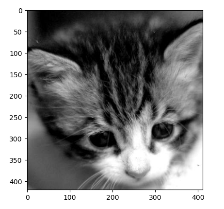
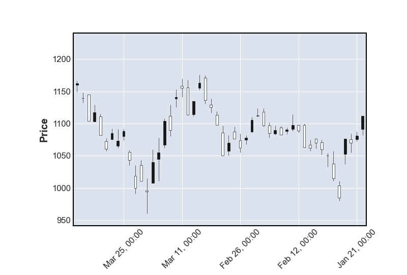

# 安装 Anacoda

**为什么要安装 Anacoda？**

因为集成了很多数据化工具，有可即使效果。


**conda、miniconda、anaconda的区别**

conda是一种通用包管理系统，旨在构建和管理任何语言和任何类型的软件。举个例子：包管理与pip的使用类似，环境管理则允许用户方便地安装不同版本的python并可以快速切换。

Anaconda则是一个打包的集合，里面预装好了conda、某个版本的python、众多packages、科学计算工具等等，就是把很多常用的不常用的库都给你装好了。

Miniconda，顾名思义，它只包含最基本的内容——python与conda，以及相关的必须依赖项，对于空间要求严格的用户，Miniconda是一种选择。就只包含最基本的东西，其他的库得自己装。


**安装地址：**

https://www.anaconda.com/


打开 Jupyter Notebook 命令行

开始 - Anacoda - Jupyter


## Jupyter notebook 快捷键

- Shift+Enter： 运行本单元，选中下个单元
- Ctrl+Enter： 运行本单元
- Y： 单元转入代码状态
- M： 单元转入markdown状态
- A： 在上方插入单元
- B： 在下方插入单元
- X： 剪贴选中单元
- C： 复制选中单元
- V： 粘贴到下方单元
- D+D： 连续按两次，删除选中单元
- Tab： 代码补全或缩进
- Ctrl+/： 注释


# Numpy

Numpy 是 Python 语言中做科学计算的基础库。重在于数值计算，也是大部分 Python 科学计算的基础，多用于在大型、多维数组上执行的数值运算。


**导入 numpy**

```
import numpy as np
```


## 1. 创建 numpy 数组

### 1.1 np.array() 创建

```
numpy.array(object, dtype = None, copy = True, order = None, subok = False, ndmin = 0)
```


参数说明：

| 名称   | 描述                                                      |
| :----- | :-------------------------------------------------------- |
| object | 数组或嵌套的数列                                          |
| dtype  | 数组元素的数据类型，可选                                  |
| copy   | 对象是否需要复制，可选                                    |
| order  | 创建数组的样式，C为行方向，F为列方向，A为任意方向（默认） |
| subok  | 默认返回一个与基类类型一致的数组                          |
| ndmin  | 指定生成数组的最小维度                                    |


object 是列表也可以是元组，可以直接用已经生成的列表变量，也可以将列表直接写在参数中，例：

```
# 生成一维数组
arr = np.array([1,2,3,4,5])  

# 生成二维数组
list2d = [[1,2,3],[4,5,6]]
arr2d = np.array(list2d)  
```


**数组列表的区别**：

- 数组中存储的数据元素类型必须是统一类型
- 优先级：字符串 - 浮点型 - 整数


列表是深拷贝（新开辟一块内存存放数据）、数组是浅拷贝（共享内存数据）

```
import numpy as np
list1 = [0,1,2,3,4,5]
a = list1[0:3]

arr1 = np.array([0,1,2,3,4,5])
b = arr1[0:3]

a[0] = 20
b[0] = 20

print(a)
print(b)
print(list1)
print(arr1)
```

> 数组可以用 .copy() 方法来深拷贝


np.asarray() 也可以创建数组，类似 array() 方法，比 array 方法少了两个参数

```
numpy.asarray(a, dtype = None, order = None)
```

| 参数  | 描述                                                         |
| :---- | :----------------------------------------------------------- |
| a     | 任意形式的输入参数，可以是，列表, 列表的元组, 元组, 元组的元组, 元组的列表，多维数组 |
| dtype | 数据类型，可选                                               |
| order | 可选，有"C"和"F"两个选项,分别代表，行优先和列优先，在计算机内存中的存储元素的顺序。 |


### 1.2 numpy 内置方法创建数组

**np.ones**()

```
np.ones(shape, dtype=None, order='C')
```

| 参数  | 描述                                                         |
| :---- | :----------------------------------------------------------- |
| shape | 数组形状                                                     |
| dtype | 数据类型，可选                                               |
| order | 有"C"和"F"两个选项,分别代表，行优先和列优先，在计算机内存中的存储元素的顺序。 |


例：

```
# 生成一维数组，所有元素都是 1.
arr1 = np.ones(10)
print(arr1)

# 指定数组元素类型（默认为浮点型）
arr2 = np.ones(10, dtype='int64')
print(arr2)

# 设置为字符串型
arr3 = np.ones(10, dtype='str')
print(arr3)

# 生成四行五列的数组
arr2d = np.ones(shape=(4,5), dtype='int64')  
print(arr)
```

> 类似的还有 np.empty(), np.zero() ，只不过是一个创建空数组，另一个填充值为0（默认元素浮点型）


**numpy.zeros**

创建指定大小的数组，数组元素以 0 来填充：

```
numpy.zeros(shape, dtype = float, order = 'C')
```

```
import numpy as np
 
# 默认为浮点数
x = np.zeros(5) 
print(x)
 
# 设置类型为整数
a = np.zeros(10, dtype='int64')
print(a)

# 设置多维
z = np.zeros((2,3), dtype='int64')
print(z)
```


**np.empty()**

numpy.empty 方法用来创建一个指定形状（shape）、数据类型（dtype）且未初始化的数组：

```
numpy.empty(shape, dtype = float, order = 'C')
```

```
import numpy as np 

# 创建一个三行两列的空数组
x = np.empty([3,2], dtype = int) 
print (x)

# 输出结果：
[[ 6917529027641081856  5764616291768666155]
 [ 6917529027641081859 -5764598754299804209]
 [          4497473538      844429428932120]]

```

> 元素内容为随机值，因为未初始化


**np.linspace()**

numpy.linspace 函数用于创建一个一维数组，数组是一个等差数列构成的，格式如下：

```
np.linspace(start, stop, num=50, endpoint=True, retstep=False, dtype=None)
```

| 参数       | 描述                                                         |
| :--------- | :----------------------------------------------------------- |
| `start`    | 序列的起始值                                                 |
| `stop`     | 序列的终止值，如果`endpoint`为`true`，该值包含于数列中       |
| `num`      | 要生成的等步长的样本数量，默认为`50`                         |
| `endpoint` | 该值为 `true` 时，数列中包含`stop`值，反之不包含，默认是True。 |
| `retstep`  | 如果为 True 时，生成的数组中会显示元素之间的等差间距，反之不显示。 |
| `dtype`    | `ndarray` 的数据类型                                         |


例：

```
arr = np.linspace(0,100,num=20)
print(arr)

# Result:
[  0.           5.26315789  10.52631579  15.78947368  21.05263158
  26.31578947  31.57894737  36.84210526  42.10526316  47.36842105
  52.63157895  57.89473684  63.15789474  68.42105263  73.68421053
  78.94736842  84.21052632  89.47368421  94.73684211 100.        ]
```

> 创建20个元素的数组，从0开始到100的等差数列，默认元素类型为浮点型


**np.arrange()**

numpy 包中的使用 arange 函数创建数值范围并返回 ndarray 对象，函数格式如下：

```
arrange([start,] stop[, step,], dtype=None)
```

| 参数    | 描述                                                         |
| :------ | :----------------------------------------------------------- |
| `start` | 起始值，默认为`0`                                            |
| `stop`  | 终止值（不包含）                                             |
| `step`  | 步长，默认为`1`                                              |
| `dtype` | 返回`ndarray`的数据类型，如果没有提供，则会使用输入数据的类型。 |


例：

```
# 生成从0-100，步长为2的数组
arr = np.arange(0, 100, step=2)
print(arr)

# 生成从0-2，步长为0.2的数组
arr1 = np.arange(0, 2, 0.2)
print(arr1)
```


**np.random.randint()**

生成随机元素数组

```
np.random.randint(low, high=None, size=None, dtype='1')
```


例：

```
arr = np.random.randint(0,100,size=(3,4))
print(arr)

# result:
[[27 30 90 50]
 [59 94 25  9]
 [ 6 30 68 76]]
```


如果想固定随机数组，在声明数组前边一行加上 np.random.seed()

```
np.random.seed(1)
arr = np.random.randint(0,100,size=(3,4))
print(arr)
```


**np.eye**()

生成对角线为1的数组

```
# 生成6行6列对角线元素为1的数组
arr1 = np.eye(6,6, dtype='int64')
print(arr1)
```


**np.diag()**

生成对角线为指定数值的数组

```
# 生成3行3列对角线元素为1,2,3的数组
arr1 = np.diag([1,2,3])
print(arr1)
```


### 1.3 plt 创建

```
import matplotlib.pyplot as plt
img_arr = plt.imread('1.jpg')  # 将图片数据进行读取，返回的是一个三维数组
print(img_arr)

# 输出结果：
[[[ 84  84  84]
  [ 83  83  83]
  [ 80  80  80]
  ...
  [119 119 119]
  [117 117 117]
  [115 115 115]]

 [[ 84  84  84]
  [ 83  83  83]
  [ 80  80  80]
  ...
  [118 118 118]
  [116 116 116]
  [115 115 115]]

 [[ 84  84  84]
  [ 83  83  83]
  [ 80  80  80]
  ...
  [117 117 117]
  [115 115 115]
  [114 114 114]]

 ...

 [[137 137 137]
  [135 135 135]
  [132 132 132]
  ...
  [201 201 201]
  [199 199 199]
  [198 198 198]]

 [[136 136 136]
  [134 134 134]
  [132 132 132]
  ...
  [198 198 198]
  [196 196 196]
  [194 194 194]]

 [[136 136 136]
  [133 133 133]
  [131 131 131]
  ...
  [196 196 196]
  [193 193 193]
  [190 190 190]]]
```


将三维数组以图片方式显示

```
plt.imshow(img_arr)
plt.show()
```

> plt.imshow()函数负责对图像进行处理，并显示其格式，而plt.show()则是将plt.imshow()处理后的函数显示出来。


## 2. numpy 数组属性

numpy 数组常用属性：shape、ndim、size、dtype

| 属性             | 说明                                                         |
| :--------------- | :----------------------------------------------------------- |
| ndarray.ndim     | 秩，即轴的数量或维度的数量                                   |
| ndarray.shape    | 数组的维度，对于矩阵，n 行 m 列                              |
| ndarray.size     | 数组元素的总个数，相当于 .shape 中 n*m 的值                  |
| ndarray.dtype    | ndarray 对象的元素类型                                       |
| ndarray.itemsize | ndarray 对象中每个元素的大小，以字节为单位                   |
| ndarray.flags    | ndarray 对象的内存信息                                       |
| ndarray.real     | ndarray元素的实部                                            |
| ndarray.imag     | ndarray 元素的虚部                                           |
| ndarray.data     | 包含实际数组元素的缓冲区，由于一般通过数组的索引获取元素，所以通常不需要使用这个属性。 |


### 2.1 ndim - 显示数组维度

ndarray.ndim 用于返回数组的维数，等于秩。

```
arr = np.ones(shape=(4,5))
print(arr.ndim)

# 输出结果:
2
```

> arr 是一个二维数组


### 2.2 shape - 返回数组形状

ndarray.shape 表示数组的维度，返回一个元组，这个元组的长度就是维度的数目，即 ndim 属性(秩)。比如，一个二维数组，其维度表示"行数"和"列数"。

```
arr = np.ones(shape=(4,5))
print(arr.shape)

# 输出结果:
(4,5)
```

> 回显 shape ，四行五列


### 2.3 size - 显示数组元素个数

```
arr = np.ones(shape=(4,5))
print(arr.size)

# 输出结果:
20
```


### 2.4 dtype - 显示数组元素类型

```
arr = np.ones(shape=(4,5))
print(arr.dtype)

# 输出结果:
float64
```


numpy 数据类型

在创建数组的时候，可以用 dtype 参数来设定数据类型

```
array(dtype=?)
```


例：

```
import numpy as np
arr = np.array([1,2,3,4,5])
arr1 = np.array([1,2,3,4,5], dtype='float64')
print(arr.dtype)
print(arr1.dtype)

# 输出结果
int32
float64
```


对已有数组进行数据类型的修改

```
arr.dtpe = '?'
```


例：

```
import numpy as np
arr = np.array([1,2,3,4,5])
print(arr.dtype)
arr.dtype('int8')
print(arr.dtype)

# 输出结果
int32
int8
```


| 名称       | 描述                                                         |
| :--------- | :----------------------------------------------------------- |
| bool_      | 布尔型数据类型（True 或者 False）                            |
| int_       | 默认的整数类型（类似于 C 语言中的 long，int32 或 int64）     |
| intc       | 与 C 的 int 类型一样，一般是 int32 或 int 64                 |
| intp       | 用于索引的整数类型（类似于 C 的 ssize_t，一般情况下仍然是 int32 或 int64） |
| int8       | 字节（-128 to 127）                                          |
| int16      | 整数（-32768 to 32767）                                      |
| int32      | 整数（-2147483648 to 2147483647）                            |
| int64      | 整数（-9223372036854775808 to 9223372036854775807）          |
| uint8      | 无符号整数（0 to 255）                                       |
| uint16     | 无符号整数（0 to 65535）                                     |
| uint32     | 无符号整数（0 to 4294967295）                                |
| uint64     | 无符号整数（0 to 18446744073709551615）                      |
| float_     | float64 类型的简写                                           |
| float16    | 半精度浮点数，包括：1 个符号位，5 个指数位，10 个尾数位      |
| float32    | 单精度浮点数，包括：1 个符号位，8 个指数位，23 个尾数位      |
| float64    | 双精度浮点数，包括：1 个符号位，11 个指数位，52 个尾数位     |
| complex_   | complex128 类型的简写，即 128 位复数                         |
| complex64  | 复数，表示双 32 位浮点数（实数部分和虚数部分）               |
| complex128 | 复数，表示双 64 位浮点数（实数部分和虚数部分）               |


## 3. numpy 数据索引及切片

### 3.1 数组索引

索引操作和列表使用的是同样的方法

```
import numpy as np
arr = np.array([1,2,3,4,5])
print(arr[2])

# 输出结果
3
```


### 3.2 数组切片

#### 1. 一维数组切片

ndarray 数组可以基于 0 - n 的下标进行索引，切片对象可以通过内置的 slice 函数，并设置 start, stop 及 step 参数进行，从原数组中切割出一个新数组。

```
import numpy as np
 
a = np.arange(10)
s = slice(2,7,2)   # 从索引 2 开始到索引 7 停止，间隔为2
print (a[s])

# 输出结果
[2  4  6]
```


我们也可以通过冒号分隔切片参数 **start:stop:step** 来进行切片操作：

```
import numpy as np
 
a = np.arange(10)

# 取钱三个元素的值，给到新数组中
a1 = a[0:3]  
print(a1)

# 将倒数第三个元素到倒数第二个元素的值重新赋值
a1[-3:-1] = a[8:10]  

# 从索引 2 开始到索引 7 停止，间隔为 2
b = a[2:7:2]   

print(a1)
print(b)
```


> 冒号 **:** 的解释：如果只放置一个参数，如 **[2]**，将返回与该索引相对应的单个元素。如果为 **[2:]**，表示从该索引开始以后的所有项都将被提取。如果使用了两个参数，如 **[2:7]**，那么则提取两个索引(不包括停止索引)之间的项。


#### 2. 二维数组切片

在数组切片中，除了可以用和列表类似的切片方法，np 中还有一个新的索引方法 `a[0,1]` 相当于`a[0][1]` 


二维数组切片：**取出前两行**

```
import numpy as np
arr = np.random.randint(0, 100, size=(5,7))
print(arr)

# 取出第三行第四个元素，同 arr[2][3]
print(arr[2,3])
print('*'*30)

# 切片操作，从0元素开始到第三个元素结束（不包括第三个），即取出前两行
print(arr[0:2])  

# 输出结果
[[39 32 93 36 53 85 76]
 [58 97 27 35 96 31 20]
 [ 7 67 50  7 93 64 18]
 [94 59 31 70 44 84 60]
 [85 83 68 27 54 87 39]]
******************************
[[39 32 93 36 53 85 76]
 [58 97 27 35 96 31 20]]
```


二维数组切片：**取出前两列**

以逗号为分割，`arr[行, 列]`

```
print(arr[:,0:2]) 
```


**取出前两行的前两列**

```
print(arr[0:2,0:2]) 
```


取出第二行，第三列之后的所有元素

```
print(arr[1:,2:])
```


**自定义切片**

因为逗号可以将数组索引分割成行和列，那么就可以利用 [],[] 的形式提取我们所需要的元素。并且按照我们所需要的顺序提取。

```
import numpy as np

arr = np.random.randint(0, 100, size=(5,7))
print(arr)

# 取出前两行，按照第二行、第一行的顺序
print('*'*30)
print(arr[[3,2]])

# 输出第四行第一列的元素，第三行第二列元素 (3,0)(2,1)
print('*'*30)
print(arr[[3,2],[0,1]])

# 输出第二列、第一列元素
print('*'*30)
print(arr[:,[1,2]])

# 先取出最后一行和第一行，然后再提取第一列、第二列和第五列
print('*'*30)
print(arr[[-1,0]][:,[0,1,4]])
```

> 注意 arr[:,1] 与 arr[:,[1]] 是不同的，一个是生成一维数组，一个是二维数组


提取第2行、第4行中的第1列和第3列

```
[[ 0  1  2  3  4]
 [ 5  6  7  8  9]
 [10 11 12 13 14]
 [15 16 17 18 19]]
```

```
import numpy as np

arr1 = np.arange(20).reshape(4,-1)
print(arr1)

# 切行
print(arr1[[1,3],])

# 切列
print(arr1[:,[0,2]])

# 合并
print(arr1[[1,3],][:,[0,2]])
```


**数组数据反转**

```
import numpy as np

arr = np.array(([1, 2, 3], [4, 5, 6], [7, 8, 9]))

# 行反转
print(arr[::-1, :])

# 列反转
print(arr[:, ::-1])

# 行列都反转
print(arr[::-1, ::-1])
```


通过行列反转，可以对图片转化的数组进行图片变化，比如水平反转就是列反转，垂直反转就是行反转

```
import matplotlib.pyplot as plt
img_arr = plt.imread('1.jpg')

print(img_arr.shape)  # (622, 412, 3) 表示 622行，412列， 3为颜色

# 垂直反转
plt.imshow(img_arr[::-1,:,:])

# 水平反转
plt.imshow(img_arr[:,::-1,:])

# 全部反转包括颜色
plt.imshow(img_arr[::-1, ::-1, ::-1])

```


裁剪指定区域


```
import matplotlib.pyplot as plt

img_arr = plt.imread('./cat/1.jpg')

# 从0到420行进行切片取出
plt.imshow(img_arr[0:420,:,:])
plt.show()
```





## 4. 数组变形

将二维数组变为一维数组

```
import numpy as np

arr = np.array(([1, 2, 3], [4, 5, 6]))
arr1 = arr.reshape((6,))  # 参数必须是一个元组，并且变形的元素数量必须和原数组一致
print(arr1)
```


将一维数组变为二维数组

```
import numpy as np

arr = np.array(([1, 2, 3, 4, 5, 6]))
arr1 = arr.reshape((2,3))  
print(arr1)

# 可以只写一个参数，另外一个用-1，reshape会自动计算
arr2 = arr.reshape((2,-1))  
print(arr2)

# 只写 -1 则会将数组转化为一维数组
arr3 = arr.reshape(-1)
print(arr3)
```


其实 shape 属性也可以调整数组

```
import numpy as np 
 
a = np.array([[1,2,3],[4,5,6]]) 
a.shape =  (3,2)  
print (a)

# 输出结果
[[1 2]
 [3 4]
 [5 6]]
```

> reshape 不改变原数组，而 shape 会改变原数组


将多维数组变成一维数组 ravel(), flatten()

```
import numpy as np

arr = np.array(([1, 2, 3], [4, 5, 6]))
flatten_arr = arr.flatten()
ravel_arr = arr.ravel()
print(flatten_arr)
print(ravel_arr)

# 按列平展
flatten_arr2 = arr.flatten(order='F')
ravel_arr2 = arr.ravel(order='F')
print(flatten_arr2)
print(ravel_arr2)
```


ravel 对原数组进行改动，flatten 不会

```
import numpy as np

arr = np.array(([1, 2, 3], [4, 5, 6]))
arr.ravel()[0] = 100
arr.flatten()[1] = 20

print(arr)
```


横向、纵向合并 np.hstack()， np.vstack()

```
import numpy as np

arr1 = np.array(([1, 2, 3], [4, 5, 6]))
arr2 = np.array(([10, 11, 12, 14], [20, 21, 22, 14]))

# 需要行数相同，将数组列数合并，参数是元组或列表
arr3 = np.hstack((arr1, arr2))

print(arr3)

```

> vstack() 用法一样，只不过两个数组需要列数相同


扩展数组 np.tile()

```
import numpy as np

arr1 = np.array(([1, 2, 3], [4, 5, 6]))

# 将2行3列的数组扩展成8行15列的数组(2x4),(3x5)
arr1 = np.tile(arr1,(4,5))
print(arr1)

```


## 5. 级联操作

在 NumPy中，每一个线性的数组称为是一个轴（axis），也就是维度（dimensions）。比如说，二维数组相当于是两个一维数组，其中第一个一维数组中每个元素又是一个一维数组。所以一维数组就是 NumPy 中的轴（axis），第一个轴相当于是底层数组，第二个轴是底层数组里的数组。而轴的数量——秩，就是数组的维数。


很多时候可以声明 axis。axis=0，表示沿着第 0 轴进行操作，即对每一列进行操作；axis=1，表示沿着第1轴进行操作，即对每一行进行操作。

```
np.concatenate((arr, arr), axis=0)
```

>axis = 0 垂直方向
>
>axis = 1 水平方向


例：

```
import numpy as np

arr = np.array(([1, 2, 3], [4, 5, 6]))
arr1 = np.concatenate((arr,arr), axis=1)
print(arr1)

# 输出结果
[[1 2 3 1 2 3]
 [4 5 6 4 5 6]]
```


## 6. 常用统计函数

常用的通用函数包括：

一元函数：sum、max、min、amax、amin、mean、abs、sqrt、around、ceil、floor、rint、trunc、modf、isnan、isinf、cos、sin、tan

二元函数：add, substract, multiply, divide, power, maximum, mininum


### 1. 一元函数

sum() 求和

```
import numpy as np

arr = np.array(([1, 2, 3], [4, 5, 6]))
print(arr.sum())
print(arr.sum(axis=0))  # 按列求和
print(arr.sum(axis=1))  # 按行求和

# 输出结果：
21
[5 7 9]
[ 6 15]
```


max(), min(), amax(), amin() 用于计算数组中的元素沿指定轴的最小、最大值

```
import numpy as np

arr1 = np.array([1,2,3,4,5,6,-1,1.22222,1.44,1.88])
print(np.max(arr1))
print(np.min(arr1))

# 返回最大值、最小值
print(np.amax(arr1))
print(np.amin(arr1))

# 返回最大值、最小值下标
print(np.argmax(arr1))
print(np.argmin(arr1))
```

> max 和 min 只是 amax 和 amin 的别名


mean(), abs(), sqrt()

```
import numpy as np

arr1 = np.array([1,2,3,4,5,6,-1,1.22222,1.44,1.88])

# 返回平均值
print(np.mean(arr1))

# 返回绝对值
print(np.abs(arr1))

# 返回开根号
print(np.sqrt(arr1))
```


sin(), cos(), tan() 数学函数

```
import numpy as np

arr = np.array(([1, 2, 3]))
print(np.sin(arr))
print(np.cos(arr))
print(np.tan(arr))
```


around(), floor(), ceil(), trunc(), rint()   函数返回指定数字的四舍五入值

```
import numpy as np

arr = np.array(([1.666, 2.2222, 3.1]))

# 四舍五入
print(np.around(arr, decimals=2))

# 上取整
print(np.ceil(arr))

# 下取整
print(np.floor(arr))

# 截取整数部分
print(np.trunc(arr))

# 四舍五入到最近整数
print(np.rint(arr))


# 输出结果
[1.67 2.22 3.1 ]
[2. 3. 4.]
[1. 2. 3.]
[1. 2. 3.]
[2. 2. 3.]
```

> decimals 参数负数为小数点左侧、正数为小数点右侧


modf() 分离整数与小数部分

```
import numpy as np

arr = np.array(([1.0, 1.1, 1.2, 1.3, 1.4, 1.5]))
x, y = np.modf(arr)
print(x)
print(y)
```


isnan(), isinf()

nan 和 inf 是两个特殊的表示方法

- nan (not a number) 表示不是一个数
- inf (infinity) 无穷大


0/0 在数学中不存在结果，会返回 nan

```
import numpy as np

arr = np.array(([0,1,2,3,4,5]))
x = arr/arr
print(x)

# 判断数组元素是否为 nan
print(np.isnan(x[0]))

# 判断数组所有元素是否为nan，返回布尔型数组
print(np.isnan(x))

# 返回去除nan的数组
print(x[~(np.isnan(x))])

```


任何数除以0都会返回无穷大结果

```
import numpy as np

arr1 = np.array([1,2,3,4,5])
arr2 = np.array([2,3,4,0,4])
x = arr1/arr2

print(x)
print(np.isinf(x[3]))
print(np.isinf(x))
print(x[~np.isinf(x)])
```


### 2. 二元函数

add, substract, multiply, divide, power 基本运算

```
import numpy as np

arr1 = np.array([1,2,3,4,5])
arr2 = np.array([10,20,30,40,50])
print(np.add(arr1,arr2))
print(np.subtract(arr1,arr2))
print(np.multiply(arr1,arr2))
print(np.divide(arr1,arr2))
print(np.power(arr1,arr2))
```


maximum(), minimum()

和 amax, amin 不一样的是，maximum(), minimum() 函数是依次比较两个数组中的每个元素大小，并返回一个新数组

```
import numpy as np

arr1 = np.array([1,2,3,4,5])
arr2 = np.array([2,3,4,0,4])

print(np.maximum(arr1,arr2))
```


numpy.ptp()

计算数组中元素最大值与最小值的差（最大值-最小值）

```
import numpy as np

arr1 = np.array([1,2,3,4,9,99])
print(np.ptp(arr1))
```


numpy.median() 

用于计算数组中的中位数


var() 方差

每个样本值与全体样本值平均数只差的平方值的平均数。

```
import numpy as np

arr1 = np.array([1,2,3,4,5])

# 求平均值
print(np.mean(arr1))

# 求方差
# 方差是每个元素的值减去平均值的平方之和的平均数
# ((1-3)**2 + (2-3)**2 + (3-3)**2 + (4-3)**2 + (5-3) **2)/5
print(np.var(arr1))
print(((1-3)**2 + (2-3)**2 + (3-3)**2 + (4-3)**2 + (5-3) **2)/5)
```


std() 标准差

计算组平均值分散程度的一种方法，标准差是方差的平方根。

```
import numpy as np
import math

arr1 = np.array([1,2,3,4,5])
print(np.std(arr1))
print(math.sqrt((((1-3)**2 + (2-3)**2 + (3-3)**2 + (4-3)**2 + (5-3) **2)/5)))
```


## 7. numpy 应用

numpy 数组之间的运算，可以和标量进行运算，也可以和同样大小数组进行运算。

```
import numpy as np


list1 = [1,2,3,4,5]
list2 = [10,20,30,40,50]
list1 = np.array(list1)
list2 = np.array(list2)

# 将 list1 数组里边所有元素进行加1操作
list1 = list+1

# 两个数组相乘，并算出总和
list3 = list1 * list2

print(list3)
print(list3.sum())
```


numpy 数组之间也可以用比较符进行运算

```
import numpy as np

arr = np.random.randint(0, 100, size=(5,7))
print(arr)

# 比较数组中所有元素，大于50返回True，反之返回False
print('*'*30)
print(arr>50)

# 取反操作
print('*'*30)
print(~(arr>50))
```


提取数组中大于50的数值并返回一个新的数组

```
print(arr[arr>50])
```

> 通过 arr>50 可以得到一个全是 True 或 False 的数组，将这个数组当做索引传入到相同数量元素的数组当中，会返回一个由所有 True 对应位置的元素的数组。


还可以和 &、|、! 等逻辑运算符配合

```
# 提取数组中大于50的偶数
print(arr[(arr>50) & (arr%2 == 0)])
```


行、列转换

```
import numpy as np

list1 = np.array([[1,2,3],[4,5,6]])
print(list1.T)
```


随机生成函数

```
import numpy as np

# 生成一个 0 到 1 之间的随机数
ran1 = np.random.rand()

# 0-10之间生成一个随机整数
ran2 = np.random.randint(0,10)

# 在给出列表中选择一个生成随机数
ran3 = np.random.choice((1,2,3,4,5))

# 打乱数组顺序
ran4 = np.array([1,2,3,4,5])
np.random.shuffle(ran4)

# 生成一个 2.0~4.0 平均分布的随机数
ran5 = np.random.uniform(2.0, 4.0)

# 加上size参数则会生成数组
arr1 = np.random.randint(0,10,size=10)

# 加上 shape 可以指定行列
arr2 = np.random.randint(0,10,(2,5))

print(ran1)
print(ran2)
print(ran3)
print(ran4)
print(ran5)

print(arr1)
print(arr2)

```


# Pandas

Pandas 是基于 Numpy 的一种工具，该工具是为了解决数据分析任务而创建的。pandas 提供了大量能使我们快速便捷地处理数据的函数和方法。numpy 主要处理数值型数据，而 pandas 主要处理非数值型数据


引入 pandas 模块

```
import pandas as pd
```


Pandas 的两个常用类

- Series
- DataFrame


## 1. Series

Series 是一种类似于**一维数组**的对象，由下边两个部分组成：

- values：一组数据（ndarray类型）
- index：相关的数据索引标签


Series 创建：

- 由列表或 numpy 数组创建
- 由字典创建


### 1.1 创建 Series 数组

```
import pandas as pd
from pandas import Series, DataFrame

ser = Series(data=[1,2,3])
print(ser)

# 输出结果
0    1
1    2
2    3
dtype: int64
```

> 左列是索引、右列是值


可以用 index 改变索引名称

```
import pandas as pd
from pandas import Series, DataFrame

ser = Series(data=[1,2,3], index=['a','b','c'])
print(ser)

# 输出结果：
a    1
b    2
c    3
dtype: int64
```

> 设定 index 后并不会覆盖原先的序号索引


其他创建方式

```
import pandas as pd

# 省略参数

ser1 = pd.Series([1,2,3], ['a','b','c'])
print(ser1)

# 使用字典形式创建Series
ser2 = pd.Series({'a':1, 'b':2, 'c':3})
print(ser2)

# 统一赋值
ser3 = pd.Series(0, ['a','b','c'])
print(ser3)
```


索引、切片取值的几种方法

```
ser[0]
ser['a']
ser.a
ser[0:2]
```


### 1.2 Series 使用特性

- Series 支持 array 的特性
- Serires 支持字典的特性


#### 1. Series 的 array 特性

支持从 array 或 list 创建对象

```
import numpy as np
import pandas as pd

list1 = [1,2,3,4,5]
arr = np.array([1,2,3,4,5])
ser1 = pd.Series(arr)
ser2 = pd.Series(list1)
print(ser1)
print(ser2)
```


与标量运算

```
import numpy as np
import pandas as pd

arr = np.array([1,2,3,4,5])
ser1 = pd.Series(arr)
print(ser1*2)
```


两个 Series 之间的运算

```
import numpy as np
import pandas as pd

arr = np.array([1,2,3,4,5])
ser1 = pd.Series(arr)
print(ser1*ser1)
```


索引切片

```
import pandas as pd


ser1 = pd.Series([1,2,3,4,5], ['a','b','c','d','e'])

# 普通索引
print(ser1[0])
print(ser1[0:2])
print(ser1['d'])
print(ser1.e)

# 花式索引提取指定位置
print(ser1[['a','c']])

# 用索引进行切片的话，左右都是闭区间
print(ser1['b':'d'])
```


通用函数

可以使用 numpy 的函数对 Series 对象进行操作，如：

```
import numpy as np
import pandas as pd


ser1 = pd.Series([-1,20,-3,4,5], ['a','b','c','d','e'])
print(np.abs(ser1))
```


布尔值过滤

```
import pandas as pd


ser1 = pd.Series([-1,20,-3,4,5], ['a','b','c','d','e'])
print(ser1>3)
print(ser1[ser1>3])
```


#### 2. Series 的字典特性

从字典创建 Series

```
import pandas as pd

ser2 = pd.Series({'a':1, 'b':2, 'c':3})
print(ser2)
```


in 运算

```
import pandas as pd

ser2 = pd.Series({'a':1, 'b':2, 'c':3})
for k,v in ser2.items():
    print(k,v)

# 当遍历 Series 的时候，遍历的是 Value 而不是 Key
for i in ser2:
    print(i)

# 判断元素key是否在 Series 中
print('a' in ser2)
```


键索引

```
import pandas as pd

ser2 = pd.Series({'a':1, 'b':2, 'c':3})
print(ser2['a'])
```


loc 和 iloc

当使用整数作为索引的时候，会出现一个让解释器无法辨别索引的问题。

```
ser1 = pd.Series(np.arange(20))
print(ser1)  # 输出结果是一个0-19的数组，索引也是0-19

ser2 = ser1[10:] # 对series进行切片
print(ser2)
```


ser2 的值为

```
10    10
11    11
12    12
13    13
14    14
15    15
16    16
17    17
18    18
19    19
```


如果这时候再使用 ser2[10] 的话，会将10当做标签值，而不是索引值

```
print(ser2[10]) # 输出10
```


为了不引起歧义，使用 loc[] 和 iloc[] 来区分标签和索引

```
print(ser2.loc[10])  # 输出标记为10的value
print(ser2.iloc[9])  # 输出索引为9的value
```

> loc: location
>
> iloc: index + location


### 1.3 Series 属性值

```
# 数组的维度
ser.shape

# 数组的个数
ser.size

# 数组显性索引
ser.index

# 数组元素值
ser.values
```


### 1.4 Series 常用方法

```
# 显示前 n 个元素
ser.head(n)

# 显示后 n 个元素
ser.tail(n)
```


去重

```
s = Series(data=[1,1,1,1,3,3,4,5,2,5])
s.unique()

# 返回去重之后元素的个数
s.nunique()
```


检查元素是否为空

```
s.isnull
s.notnull()
```


### 1.5 Series 运算

```
import pandas as pd
from pandas import Series, DataFrame

ser1 = Series(data=[1,2,3], index=['c','b','a'])
ser2 = Series(data=[4,5,6], index=['a','d','c'])
print(ser1+ser2)

# 输出结果
a    5.0
b    NaN
c    9.0
d    NaN
dtype: float64
```

> 索引一致的元素进行运算，否则补空，即使顺序不同，也会按照标签的名称进行运算


处理缺失数据 NaN

```
from pandas import Series, DataFrame

ser1 = Series(data=[1,2,3], index=['c','b','a'])
ser2 = Series(data=[4,5,6], index=['a','d','c'])
ser3 = ser1 + ser2

# 两种方法判断 nan 数据
print(Series.isnull(ser3))
print(ser3.isnull())

# 判断非 nan 数据
print(ser3.notnull())

# 利用布尔型索引，排除nan数据
print(ser3[ser3.notnull()])

# dropna 方法直接排除nan数据
print(ser3.dropna())

# fillna 给 nan 数据赋值
print(ser3.fillna(0))
```


有时候我们对数组进行运算的时候，如果标签不同，也希望将值保留下来。则会用到 add, sub, mul, div 方法，这样的话，即使两个 Series 有不同元素，也会保留元素的value，不会出现 NaN 的情况

```
from pandas import Series, DataFrame

ser1 = Series(data=[1,2,3], index=['c','b','a'])
ser2 = Series(data=[4,5,6], index=['a','d','c'])
print(ser1.add(ser2, fill_value=0))

# 输出结果
a    7.0
b    2.0
c    7.0
d    5.0
dtype: float64
```


## 2. DataFrame

DataFrame 是一个【表格型】的数据结构。DataFrame由按照一定顺序排列的多列数据组成。DataFrame 是由 Series 组成。

- 行索引：index
- 列索引：columns
- 值：values


### 2.1 创建DataFrame

由数组创建

```
import pandas as pd
from pandas import Series, DataFrame

df = DataFrame(data=[[1,2,3],[4,5,6]])
print(df)

# 输出结果
   0  1  2
0  1  2  3
1  4  5  6
```


由字典创建

```
import pandas as pd
from pandas import Series, DataFrame

dict = {'name':['tom','jay','salary'],
        'salary':[10000,2000,15000]}
df = DataFrame(data=dict)
print(df)

# 输出结果
     name  salary
0     tom   10000
1     jay    2000
2  salary   15000
```


通过 Series 对象创建

```
import pandas as pd

ser1 = pd.Series([1,2,3], index=['a','b','c'])
ser2 = pd.Series([1,2,3,4], index=['b','a','c','d'])
df = pd.DataFrame({'one':ser1, 'two':ser2})
print(df)

# 输出结果
   one  two
a  1.0    2
b  2.0    1
c  3.0    3
d  NaN    4
```


### 2.2 DataFrame 属性

```
# 返回数组元素
df.values

# 返回列索引
df.columns

# 返回行索引
df.index

# 返回数组维度
df.shape

# 转换行列（会自动将元素转换为统一数据类型）
df.T

# 获取快速统计
df.describe()
```


```
import pandas as pd

ser1 = pd.Series([1,2,3], index=['a','b','c'])
ser2 = pd.Series([1,2,3,4], index=['b','a','c','d'])
df = pd.DataFrame({'one':ser1, 'two':ser2})

print(df.values)
```


### 2.3 DataFarame 索引和切片

```
import numpy as np
import pandas as pd
from pandas import Series, DataFrame

df = DataFrame(data=np.random.randint(0, 100, size=(5, 4)), columns=['a', 'b', 'c', 'd'],
               index=['A', 'B', 'C', 'D', 'E'])
print(df)

# 输出结果
    a   b   c   d
A  41  47  17  71
B  87  28  63  30
C  52  44  96  16
D  68  78  18  86
E   9  79  94  11
```


取列操作

```
print(df.a)
print(df['a'])
print(df.iloc[:, 0])
```


取行操作

```
print(df.iloc[0])
print(df.loc['A'])
```


取元素

```
# 按标签取值
print(df.loc['B','b'])

# 按索引取值
print(df.iloc[1,1])
```


取多行

```
print(df.iloc[[0,1],2])  # 取0、1行，第2列元素
```


切行

```
print(df[0:2])  # 取前两行
```


切列

```
print(df.iloc[:,0:2])  # 取前两列
```


### 2.4 DataFrame 数据存储与读取

#### 1. DataFrame 从文件读取

```
df.read_csv()
df.read_excel()
df.read_sql()
df.read_json()
```


从文件中将数据读取为 DataFrame 格式数据，已知 df.csv 内容为

```
a,b,c,date
1,2,3,2020-01-01
4,5,6,2020-01-02
7,8,9,2020-01-03
```


第一行为列索引，行索引默认为0、1、2

```
import pandas as pd

data = pd.read_csv('df.csv')
print(data)

# 输出结果
   a  b  c        date
0  1  2  3  2020-01-01
1  4  5  6  2020-01-02
2  7  8  9  2020-01-03
```


**参数：index_col**

如果想让date列为索引值

```
data = pd.read_csv('df.csv', index_col='date')
```


**参数：header, names**

如果文件中没有表头，可以自己设置表头

```
import pandas as pd

# 默认生成以0开始的序列作为列表头
data = pd.read_csv('df.csv', header=None)

# 指定表头
data = pd.read_csv('df.csv', header=None, names= ['a','b','c','date'])
```


**参数：sep**

指定分隔符，当使用 read_table() 读取文件的时候，与 read_csv() 不同的是。table 文件使用的是 | 为分隔符，而 csv 文件使用的是逗号，可以用 sep 参数指定分隔符。

```
data = pd.read_csv('df.csv', sep=',')

# 可以用正则
data = pd.read_csv('df.csv', sep='\s+')
```


**参数：skip_rows**

用来 skip 第n行，以列表形式传入

```
data = pd.read_csv('df.csv', skiprows=[0,1])
```


**参数：na_values**

将某些字符串解释为NaN数据，因为如果数据中数据类型需要对齐，如果出现一个非数字的数据，比如 None，会将整列数据作为字符串数据处理，影响之后的统计或计算。

```
# 将 None 值得数据转换为 NaN 的数据类型（NaN 为浮点型）
data = pd.read_csv('df.csv', na_values=['None'])
```


#### 2. DataFrame 写入文件

```
df.to_csv()
df.to_excel()
df.to_sql()
df.to_json()
```


写入文件参数

| 参数           | 作用                                   |
| -------------- | -------------------------------------- |
| sep            | 指定文件分隔符                         |
| na_rep         | 指定缺失值转换的字符串，默认为空字符串 |
| header = False | 不输出列名                             |
| index = False  | 不输出索引                             |
| columns        | 输出指定的列，以列表方式传入列         |


### 2.5 DataFrame 方法

#### 1. 对缺失数据处理

在 DataFrame 中同样有 NaN 类型数据

```
import pandas as pd

ser1 = pd.Series([1,2,3], index=['a','b','c'])
ser2 = pd.Series([1,2,3,4], index=['b','a','c','d'])
df1 = pd.DataFrame({'one':ser1, 'two':ser2})
df2 = pd.DataFrame({'one':[1,2,3,4], 'two':[4,5,6,7]}, index=['a','b','c','d'])
print(df1)
print(df2)
df = df1+df2
print(df)

# 输出结果
a  2.0    6
b  4.0    6
c  6.0    9
d  NaN   11
```

> NaN 数据相加还是 NaN，其他元素按照标签位置进行运算


对于 NaN 数据的处理

```
# 将 NaN 数据填充0处理
df.fillna(0)

# 将 NaN 所在行删除
df.dropna()
# 只有在该行所有值都是 NaN 时才进行行删除
df.dropna(how='all')
# 将 NaN 所在列删除
df.dropna(axis=1)

判断 NaN 数据
df.isnull()
df.notnull()

```


#### 2. 常用方法

##### 2.1 添加元素

**添加行、列**

```
import numpy as np
import pandas as pd
import mplfinance as mpf

df = pd.DataFrame([1,2,3],['a','b','c'])

# 添加列
df['new'] = 0

# 添加行
df.loc['a'] = [10,11]
print(df)
```

> 如果是数组则依次给行内或列内元素赋值，如果单独变量，则是给整体赋值。


##### 2.2 删除元素


##### 2.3 改变元素


##### 2.4 查看元素


很多方法和 numpy 库方法都是通用的


add, sub, mul, div

当需要合并 DataFrame 表格时，如果用 + - 等符号，如果表格长度不一致，或者索引有所区别的话，会出现整列 NaN 的情况，如果想要保留原始数据，仅添加新数据的话，则需要用到这些方法。

```
df1 = pd.DataFrame({'one':[1,2,3,4], 'two':[4,5,6,7]}, index=['a','b','c','d'])
df2 = pd.DataFrame({'one':[1,2,3,4], 'three':[4,5,6,7]}, index=['a','b','c','e'])

print(df1 + df2)
print(df1.add(df2, fill_value=0).fillna(0))

# 输出结果
   one  three  two
a  2.0    NaN  NaN
b  4.0    NaN  NaN
c  6.0    NaN  NaN
d  NaN    NaN  NaN
e  NaN    NaN  NaN
   one  three  two
a  2.0    4.0  4.0
b  4.0    5.0  5.0
c  6.0    6.0  6.0
d  4.0    0.0  7.0
e  4.0    7.0  0.0
```


更改列名

```
df1.rename(columns={'SubTotal': 'Warranty'}, inplace=True)
```

> 更改 SubTotal 为 Wararnty


更改 DataFrame 中元素内容 apply

```
def rename_func(x):
    if x != '':
        x = x[:-7] + '.' + x[-7:]
        return x

df['SalesRep'] = df['SalesRep'].apply(rename_func)
```

> 这里的 x 就是元素内容，apply 需要传入一个函数名


常用 lambda 函数与 apply 配合

```
df['SalesRep'] = df['SalesRep'].apply(rename_func)
```


删除数据

```
df.drop(labels='列名', axis=1, inplace=True)
```

> drop 方法中的 axis 0 为行，1为列
>
> inplace=True 对原数组也进行改变，否则原数组不变，需要对方法的返回值进行赋值生成一个新的数组。


查看数据类型

```
df.info()
```


查看前、后n行数据

```
print(df.head(2))
print(df.tail(2))
```


求平均值

```
# 求平均值, 按列计算
print(df.mean())
# 求平均值，按行计算
print(df.mean(axis=1))
```


求和

```
df.sum()
```


排序

```
import pandas as pd

df = pd.DataFrame({'one':[1,2,3,4], 'two':[8,3,2,4]}, index=['a','b','c','d'])

# 按值排序
print(df.sort_values(by='two'))
# 倒叙排序
print(df.sort_values(by='two', ascending=False))

# 按索引排序
print(df.sort_index())
# 降序排序
print(df.sort_index(ascending=False))
```

> NaN 不参与排序


## 3. 时间处理对象

使用 datetime 模块

```
import datetime

datetime.datetime.strptime('2020-01-01','%Y-%m-%d')
```

> 做解析的时候只可以用 YYYY-MM-DD 格式


使用 dateutil 模块，支持更多格式

```
from dateutil import parser

parser.parser('2001/01/01')
parser.parser('2001-JAN-01')
```


在 Pandas 中可以使用方法 to_datetime() 创建时间对象

```
import pandas as pd

date = pd.to_datetime(['2020-01-01', '2001-Feb-09'])
print(date)
```


批量生成时间对象

```
# 生成从 2020-01-01 到 2020-01-15 的时间列表
date = pd.date_range('2020-01-01','2020-01-15')

# 生成 60 天的时间对象
date = pd.date_range('2020-01-01',periods=60)

# 按照 Feq 生成时间
date = pd.date_range('2020-01-01',periods=60, freq='D')  # 天
date = pd.date_range('2020-01-01',periods=60, freq='H')  # 小时
date = pd.date_range('2020-01-01',periods=60, freq='W')  # 周
date = pd.date_range('2020-01-01',periods=60, freq='W-Sun')  # 默认每周日
date = pd.date_range('2020-01-01',periods=60, freq='B')  # 工作日
date = pd.date_range('2020-01-01',periods=60, freq='M')  # 月
date = pd.date_range('2020-01-01',periods=60, freq='S')  # 半月
date = pd.date_range('2020-01-01',periods=60, freq='T')  # 分
date = pd.date_range('2020-01-01',periods=60, freq='S')  # 秒
date = pd.date_range('2020-01-01',periods=60, freq='A')  # 年

date = pd.date_range('2020-01-01',periods=60, freq='3D')  # 间隔3天
date = pd.date_range('2020-01-01',periods=60, freq='1h20min')  # 1小时20min
```


生成一个以时间为序列的 Series 对象

```
import pandas as pd
import numpy as np

date = pd.Series(np.arange(50), index=pd.date_range('2020-01-01',periods=50))
print(date)

# 输出1月份数据
print(date['2020-01'])

# 输出年数据
print(date['2020'])

# 输出指定时间
print(date['2020-01':'2020-2'])
```


resample()

```
import pandas as pd
import numpy as np

date = pd.Series(np.arange(100), index=pd.date_range('2020-01-01',periods=100))

# 每周列求和
print(date.resample('W').sum())

# 每周列求平均
print(date.resample('W').mean()
```


将文件中的时间列设置为索引，并且转换为时间对象

```
import pandas as pd

data = pd.read_csv('df.csv', index_col='date', parse_dates=True)
print(data)
```

> parse_dates 也可以传入一个列表将指定列转换为时间对象 `parse_dates=['date']`


# Matplotlib

引入 Matplotlib

```
import matplotlib.pyplot as plt

# 绘图函数
plt.plot()

# 显示图表
plt.show()
```


matplotlib 支持很多图形

| 函数                                  | 说明          |
| ------------------------------------- | ------------- |
| plt.plot(x,y,fmt,...)                 | 坐标图        |
| plt.boxplot(data, notch, position)    | 箱型图        |
| plt.bar(left,height,width,bottom)     | 条形图        |
| plt.barh(width, bottom, left, height) | 横向条形图    |
| plt.polar(theta, r)                   | 极坐标图      |
| plt.pie(data, explode)                | 饼图          |
| plt.psd(x, NFFT=256, pad_to, Fs)      | 功率谱密度图  |
| plt.specgram(x, NFFT=256, pad_to, F)  | 谱图          |
| plt.cohere(x, y , NFFT=256, Fs)       | X-Y相关性函数 |
| plt.scatter(x, y)                     | 散点图        |
| plt.step(x, y, where)                 | 步阶图        |
| plt.hist(x, bins, normed)             | 直方图        |


## 1. plot() 坐标图

plot 方法用来绘制折线图，参数可以传 np 数组，也可以传列表

```
plt.plot([1,2,3,4],[2,4,6,8])
```

> 坐标以 (1,2), (2,4), (3,6), (4,8) 依次连接的一条折线图


```
plt.plot(array,[marker][line][color])
```


| plot 绘制图像类型 | 参数                  |
| ----------------- | --------------------- |
| 线型 linestyle    | -,-.,--,..            |
| 点型 marker       | v,^,s,*,H,+,x,D,o,... |
| 颜色 color        | b,g,r,y,k,w,...       |


参数使用格式：

```
        'b'    # blue markers with default shape
        'or'   # red circles
        '-g'   # green solid line
        '--'   # dashed line with default color
        '^k:'  # black triangle_up markers connected by a dotted line
```


也可以直接带参数名：

```
plt.plot([1,2,3,4],[2,4,6,8], marker='o', color='red')
```


线型 linestyle

```
``'-'``          solid line style
``'--'``         dashed line style
``'-.'``         dash-dot line style
``':'``          dotted line style
```


点型 marker

    ``'.'``          point marker
    ``','``          pixel marker
    ``'o'``          circle marker
    ``'v'``          triangle_down marker
    ``'^'``          triangle_up marker
    ``'<'``          triangle_left marker
    ``'>'``          triangle_right marker
    ``'1'``          tri_down marker
    ``'2'``          tri_up marker
    ``'3'``          tri_left marker
    ``'4'``          tri_right marker
    ``'s'``          square marker
    ``'p'``          pentagon marker
    ``'*'``          star marker
    ``'h'``          hexagon1 marker
    ``'H'``          hexagon2 marker
    ``'+'``          plus marker
    ``'x'``          x marker
    ``'D'``          diamond marker
    ``'d'``          thin_diamond marker
    ``'|'``          vline marker
    ``'_'``          hline marker


颜色 color

    ``'b'``          blue
    ``'g'``          green
    ``'r'``          red
    ``'c'``          cyan
    ``'m'``          magenta
    ``'y'``          yellow
    ``'k'``          black
    ``'w'``          white


设置图像标题、坐标轴标题

```
import matplotlib.pyplot as plt

plt.plot([1,2,3,4],[2,4,6,8], marker='o', color='red')
plt.title('Matplotlib Diagram')
plt.xlabel('X Lable')
plt.ylabel('Y Lable')
plt.show()

```


设置 x轴、y轴范围

```
plt.xlim(0,10)
plt.ylim(0,20)
```

> 第一个参数为起始值，第二个参数为终止值


设置x轴、y轴刻度

```
plt.xticks([0,2,4,6,8,10,15])
plt.yticks([0,2,3,4,5,6,7,8])

# 用 np.arrange() 做刻度
plt.xticks(np.arange(0,10,2))

# 替换数值为字符串作为刻度
plt.xticks(np.arange(0,10,2), ['a','b','c','d','e'])
```


设置图例

需要在 plot 参数中传入 label 参数，然后再调用 legend 方法

```
import numpy as np
import pandas as pd
import matplotlib.pyplot as plt

plt.plot([1,2,3,4],[2,4,6,8], marker='o', color='red', label='Line A')
plt.plot([1,2,3,4],[1,4,7,9], marker='o', color='black', label='Line B')
plt.title('Matplotlib Diagram')
plt.xlabel('X Lable')
plt.ylabel('Y Lable')
plt.xlim(0,10)
plt.ylim(0,20)
plt.xticks(np.arange(0,10,2), ['a','b','c','d','e'])
plt.yticks([0,2,3,4,5,6,7,8])
plt.legend()
plt.show()
```


读取CSV数据，绘制plot折线图

```
from matplotlib import pyplot as plt
import pandas as pd

# 读取股票csv文件、设置date列为时间对象、将date列作为索引、用花式索引提取指定列
df = pd.read_csv('600519.csv', parse_dates=['date'], index_col='date')[['open','close','high','low']]
df.plot()
plt.show()
```


按照数学公式绘制 plot 图

y = x, y=x^2, y=x^3+x^2+1 三个公式在一个plot图中

```
from matplotlib import pyplot as plt
import numpy as np
import pandas as pd

x = np.arange(100)
y1 = x.copy()
y2 = x**2
y3 = x**3+x**2+1

plt.plot(x,y1,'-r', label='y=x')
plt.plot(x,y2,'-b', label='y=x^2')
plt.plot(x,y3,'-', label='y=x^3+x^2+1')
plt.legend()
plt.show()
```


plot 画布和子图

画布：figure

如果有多个图标的话，需要创建一个画布

```
fig = plt.figure()
```


子图：subplot

然后将子图放在之前创建的画布上，参数2，2，1的意思是将画布分为2行2列的布局，然后将子图放在第一个位置上

```
from matplotlib import pyplot as plt
import numpy as np
import pandas as pd

x = np.arange(100)
y1 = x.copy()
y2 = x**2
y3 = x**3+x**2+1

fig = plt.figure()
ax1 = fig.add_subplot(2,2,1)
ax2 = fig.add_subplot(2,2,2)
ax3 = fig.add_subplot(2,2,3)

ax1.plot(x,y1,'-r', label='y=x')
ax2.plot(x,y2,'-b', label='y=x^2')
ax3.plot(x,y3,'-', label='y=x^3+x^2+1')
fig.legend()
plt.show()
```


调节子图间距

```
subplots_adjust(left,bottom,right,top,wspace,hspace)
```


## 2. bar() 柱状图

使用方法

```
bar(x, height, width=0.8, bottom=None, *, align='center', data=None, **kwargs)bar()
```


绘制简单柱状图

```
# 第一个数组是位置，第二个数组是值
plt.bar([1,2,3,4],[5,6,7,8])
plt.show()
```


可以将位置换成自己需要的 Lable 和 Color

```
from matplotlib import pyplot as plt
import numpy as np
import pandas as pd

data = [5,6,7,8]
colors = ['red','blue','black','pink']
lab = ['Spring','Summer','Fall','Winter']
plt.bar(np.arange(len(data)),data, color=colors)
plt.xticks(np.arange(len(data)),lab)
plt.show()
```


更改柱形宽度

```
plt.bar(np.arange(len(data)),data, width=0.5, color=colors)
```

> width 也可以传入一个数组，更改多个柱状图宽度


更改 Lable 位置

```
plt.bar(np.arange(len(data)),data, align='edge', color=colors)
```

> 默认为居中 center


## 3. pie() 饼状图

```
pie(x, explode=None, labels=None, colors=None, autopct=None, pctdistance=0.6, shadow=False, labeldistance=1.1, startangle=None, radius=None, counterclock=True, wedgeprops=None, textprops=None, center=(0, 0), frame=False, rotatelabels=False, *, data=None)
```


简单饼状图

```
from matplotlib import pyplot as plt
import numpy as np
import pandas as pd

data = [1,2,3,4,10,20,30]
plt.pie(data)
plt.show()
```


设置标签

```
from matplotlib import pyplot as plt
import numpy as np
import pandas as pd

data = [1,2,3,4,10]
label = ['a','b','c','d','e']
plt.pie(data, labels=label)
plt.show()
```


显示百分比

```
plt.pie(data, labels=label, autopct='%.2f%%')
```


突出指定部分

```
plt.pie(data, labels=label, autopct='%.2f%%', explode=[0,0,0.1,0,0])
```

> 第几位就在列表使用 0~1 之间的数值


## 4. K线图

需要引入 `matplotlib.finance` ，现在已经分离出来单独一个模块 `mpl_finance`，然而这个模块没多久又被弃用了，现在安装 `mplfinance`


安装 mplfinance

```
pip install mplfinance
```


引入 mplfinance

```
import mplfinance
```


最基本绘图方法

```
 mpf.plot(data)
```


这个 data 是一个 Pandas DataFrame 数据对象，这个对象需要包含 OHLC 数据（ Open、High、Low、Close ）如：

| Open       | High    | Low     | Close   | Volume  |           |
| :--------- | :------ | :------ | :------ | :------ | :-------- |
| Date       |         |         |         |         |           |
| 2019-11-01 | 3050.72 | 3066.95 | 3050.72 | 3066.91 | 510301237 |
| 2019-11-04 | 3078.96 | 3085.20 | 3074.87 | 3078.27 | 524848878 |
| 2019-11-05 | 3080.80 | 3083.95 | 3072.15 | 3074.62 | 585634570 |

```
import mplfinance as mpf
import pandas as pd

# 读取股票csv文件、设置date列为时间对象、将date列作为索引、用花式索引提取指定列
df = pd.read_csv('600519.csv', parse_dates=['date'], index_col='date')[['open','close','high','low']]

# 绘制蜡烛图
mpf.plot(df, type='candle')
```




股票的绘制图形种类除了蜡烛图，也有很多其他种类的 type

| 参数   | 图形种类           |
| ------ | ------------------ |
| ohlc   | 条形图（默认图形） |
| candle | 蜡烛图             |
| line   | 折线图             |
| renko  | 砖型图             |
| pnf    | OX图               |


除了绘制普通的K线图，还可以添加均线参数 mav

```
mpf.plot(df, type='candle', mav=(5))
```

> mav 需要是一个整型数据，元组数据可以绘制多条均线


还可以添加 volume 交易量

```
mpf.plot(daily,type='candle',mav=(3,6,9),volume=True)
```


默认图形只显示交易日图形，非交易日图形会被自动隐藏，如果需要打开，则需要把参数 show_nontrading 打开

```
mpf.plot(daily,type='candle',mav=(3,6,9),volume=True,show_nontrading=True)
```


