# 一、爬虫基础

爬虫就是**请求**网站并**提取**数据的**自动化**程序。


## 1. URL

**URL 定义**

统一资源定位符（英语：Uniform Resource Locator，缩写：URL；是互联网上用来标识某一处资源的地址。以下面这个URL为例，介绍下普通URL的各部分组成：


**URL 的组成**

```
http://tieba.baidu.com/f/index/forumpark?pcn=%E5%B0%8F%E8%AF%B4&pci=161&ct=0&rn=20&pn=1
```

>[协议类型]: //服务器地址:端口号/文件路径文件名?查询#片段ID


### 1.2. 常见协议类型

#### 1.2.1 HTTP

HTTP 协议是 Hyper Text Transfer Protocol（超文本传输协议）的缩写，是用于从万维网（WWW: World Wide Web ）服务器传输超文本到本地浏览器的传送协议。HTTP是一个基于TCP/IP通信协议来传递数据（HTML 文件, 图片文件, 查询结果等）。

> 默认端口号 80


HTTP 传输数据流程

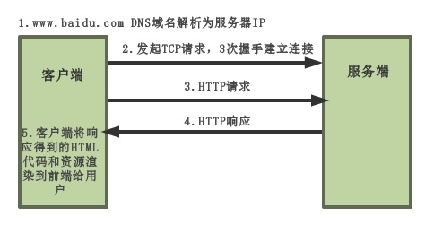


#### 1.2.2 HTTPS

HTTPS 协议（HyperText Transfer Protocol over Secure Socket Layer）：一般理解为HTTP+SSL/TLS，通过 SSL证书来验证服务器的身份，并为浏览器和服务器之间的通信进行加密。

> 默认端口号：443


HTTPS 传输数据的流程

1. 首先客户端通过URL访问服务器建立SSL连接。
2. 服务端收到客户端请求后，会将网站支持的证书信息（证书中包含公钥）传送一份给客户端。
3. 客户端的服务器开始协商SSL连接的安全等级，也就是信息加密的等级。
4. 客户端的浏览器根据双方同意的安全等级，建立会话密钥，然后利用网站的公钥将会话密钥加密，并传送给网站。
5. 服务器利用自己的私钥解密出会话密钥。
6. 服务器利用会话密钥加密与客户端之间的通信。


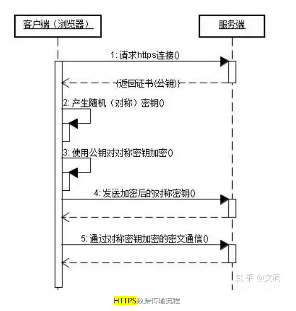


**HTTP 和 HTTPS 的比较：**

http 协议：

请求信息明文传输，容易被窃听截取。

数据的完整性未校验，容易被篡改

没有验证对方身份，存在冒充危险

https 协议：

HTTPS协议多次握手，导致页面的加载时间延长近50%；

HTTPS连接缓存不如HTTP高效，会增加数据开销和功耗；

申请SSL证书需要钱，功能越强大的证书费用越高。

SSL涉及到的安全算法会消耗 CPU 资源，对服务器资源消耗较大。


**总结：**

http 高效，但不安全

https 安全，但耗费资源，降低速度


#### 1.2.3 FTP

FTP（File Transfer Protocol，文件传输协议） 是TCP/IP 协议组中的协议之一。 FTP协议包括两个组成部分，其一为FTP服务器，其二为FTP客户端。 其中FTP服务器用来存储文件，用户可以使用FTP客户端通过FTP协议访问位于FTP服务器上的资源。

> 默认端口号：21


#### 1.2.4 SSH 协议

Secure Shell（安全外壳协议，简称SSH）是一种加密的网络传输协议，可在不安全的网络中为网络服务提供安全的传输环境。 SSH通过在网络中建立安全隧道来实现SSH客户端与服务器之间的连接。 SSH最常见的用途是远程登录系统，人们通常利用SSH来传输命令行界面和远程执行命令。

> 默认端口号：22


### 1.3. 服务器地址

**IP 地址**

只要计算机上连接上了网络，都会被分配一个IP地址，而网站也是一样，是一台24小时上网的电脑。只不过我们称之为服务器。那么这台服务器也相应的会有对应的IP地址。我们通过访问这台服务器的IP地址，就会访问到该网站。

而 IP 地址一般是以四组数字构成的（IPv4已经分配完毕，现在开始升级为IPv6）

如百度的IP地址： 220.181.38.148

我们直接访问这个IP地址就相当于访问了 www.baidu.com


**域名**

网站这么多，IP地址都是数字，对于用户访问造成了困难。所以人们就发明了域名这个东西，相当于把这些 IP 地址起了一个别名，我们访问域名，就相当于访问了 IP 地址。


**DNS**

DNS一般指域名系统（服务）协议。域名系统（服务）协议（DNS）是一种分布式网络目录服务，主要用于域名与 IP 地址的相互转换，以及控制因特网的电子邮件的发送。

域名转换为 IP 地址，则需要 DNS 服务器的解析。在本机电脑上，可以自己设置 DNS 服务器。一般 ISP（网络供应商）都会拥有自己的 DNS 服务器，当你访问域名的时候，会默认使用你 ISP 的 DNS l来解析域名。当然你也可以自己设置其他的 DNS，比如谷歌的 8.8.8.8 或 阿里的 223.5.5.5


### 1.4. 端口号

如果把 IP 地址比喻为一个房子的地址的话，那么端口号就代表房子里边的房间的定义。比如客厅、卧室、厨房等。各个房间都有不同的作用。通过访问不同端口，我们可以获得服务器的不同功能。

常见端口一般都是和协议匹配的，比如HTTP的80端口、FTP的21端口、SSH的22端口等等。


### 1.5. 文件路径

和电脑里边的路径一样，在网络中我们访问指定文件、页面也需要路径。毕竟网站也只是一台计算机，和我们的的普通电脑一样，在指定的位置找到指定文件。只不过我们是通过浏览器来完成这些操作的。


**绝对路径**

绝对路径是指文件在硬盘上真正存在的路径。也是完整的表示该文件具体位置的一个路径。

```
网站：
https://www.forece.net/index.php

Windows：
c:\swapfile.sys

Linux：
/home/wwwroot/test/index.html
```


**相对路径**

所谓相对路径，就是相对于自己目前位置的目标文件位置。比如目前我在 C:\User\ 这个路径中，那么 ..\ 就是 C:\ 这个位置。

```
"." -- 代表目前所在的目录
".." -- 代表上一层目录
```

>Windows 习惯用 "\" 作为目录分隔符
>
>Linux 习惯用 "/" 作为目录分隔符


### 1.6. 文件名

可以理解为访问的资源，比如访问页面 index.htm 或者图片 image.jpg 都是不同的文件。


### 1.7. 参数部分

从“？”开始到“#”为止之间的部分为参数部分，又称搜索部分、查询部分。如：“boardID=5&ID=24618&page=1”。参数可以允许有多个参数，参数与参数之间用“&”作为分隔符。一般参数是为了查询数据，带一些我们需要查询的参数发送给服务器。

> 例子中可以理解为我们要访问网站中第5个板块，ID为24618的帖子，显示第一页


### 1.8. 锚点

一般在 # 后边，在 HTML 常用来跳转到该位置，不是每个网页都会有锚点。


## 2. HTTP请求协议

### 2.1  HTTP 请求原理

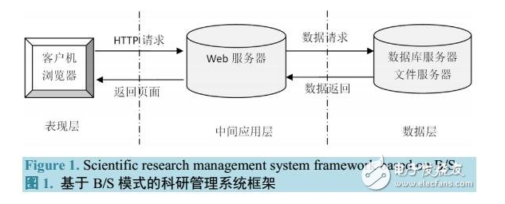

关于浏览器对 Web 服务器发出请求，一般都携带一些数据，这些数据有浏览器的数据，也有用户本身的数据。我们称这些数据为请求头 Request Header


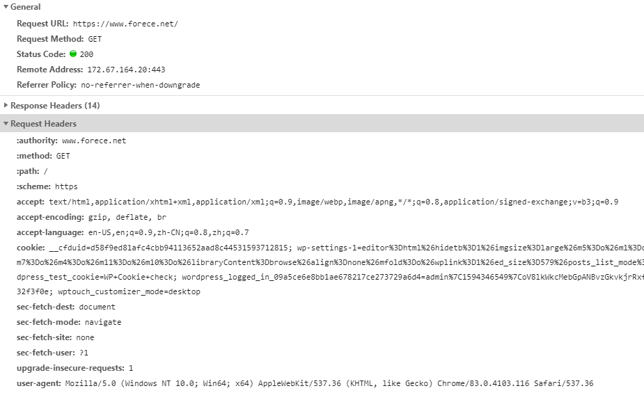

### 2.2 HTTP 请求方式

HTTP 请求方式分为 GET 提交和 POST 提交

#### 2.2.1 GET提交

请求的数据会附在URL之后（就是把数据放置在HTTP协议头中），以?分割URL和传输数据，多个参数用&连接；例如：

```
login.action?name=hyddd&password=idontknow&verify=%E4%BD%A0%E5%A5%BD
```

如果数据是英文字母/数字，原样发送，如果是空格，转换为+，如果是中文/其他字符，则直接把字符串用BASE64加密，得出如： %E4%BD%A0%E5%A5%BD，其中％XX中的XX为该符号以16进制表示的ASCII。

虽然 HTTP 协议对传输的数据大小没有限制，也没有规定 URL 长度的限制，但是不同浏览器对于 URL 的长度是有限制的。比如IE对URL长度的限制是2083字节(2K+35)。对于其他浏览器，如Netscape、FireFox等，理论上没有长度限制，其限制取决于操作系统的支持。所以利用 GET 传输数据其实是有长度限制的。


#### 2.2.2 POST提交

把提交的数据放置在是 HTTP 包的包体中。GET提交的数据会在地址栏中显示出来，而POST提交，地址栏不会改变

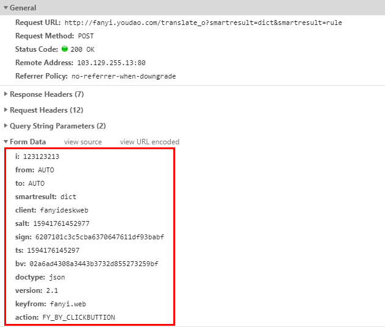

红框中就是通过 POST 提交的数据

POST 中传输数据由于不是通过URL传值，理论上数据不受限。但实际各个WEB服务器会规定对post提交数据大小进行限制，Apache、IIS6都有各自的配置。

综合来看，我们可以得出这么一个结论：POST 不仅传输的数据要多，而且要比 GET 安全性高。传输的数据通过GET提交数据，用户名和密码将明文出现在URL上，如果页面可以被缓存或者其他人可以访问这台机器，就可以从历史记录获得该用户的账号和密码。


### 2.3 请求行

```
POST http://180.163.243.87/cloudquery.php HTTP/1.1
```

请求行分为三部分：

第一部分是请求方式 POST

第二部分是请求URL，也就是我们要请求的目标对象

第三部分是请求协议


### 2.4 请求头

无论时 GET 提交模式，还是 POST 提交模式，当浏览器发送请求时，会携带一些数据发送给服务器，我们称这些数据为请求头（Request Headers）。


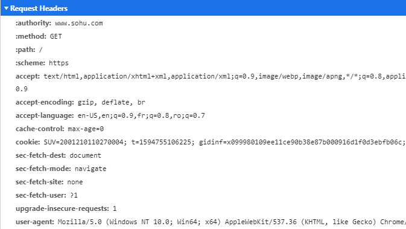


请求头中几个比较重要的字段：

**user-agent**
User Agent 中文名为用户代理，简称UA，它是一个特殊字符串头，使得服务器能够识别客户使用的操作系统及版本、CPU 类型、浏览器及版本、浏览器渲染引擎、浏览器语言、浏览器插件等。


**cookie**
因为HTTP协议是无状态的，即服务器不知道用户上一次做了什么，这严重阻碍了交互式Web应用程序的实现。在典型的网上购物场景中，用户浏览了几个页面，买了一盒饼干和两瓶饮料。最后结帐时，由于HTTP的无状态性，不通过额外的手段，服务器并不知道用户到底买了什么，所以Cookie就是用来绕开HTTP的无状态性的“额外手段”之一。服务器可以设置或读取Cookies中包含信息，借此维护用户跟服务器会话中的状态。

在刚才的购物场景中，当用户选购了第一项商品，服务器在向用户发送网页的同时，还发送了一段Cookie，记录着那项商品的信息。当用户访问另一个页面，浏览器会把Cookie发送给服务器，于是服务器知道他之前选购了什么。用户继续选购饮料，服务器就在原来那段Cookie里追加新的商品信息。结帐时，服务器读取发送来的Cookie就行了。

Cookie另一个典型的应用是当登录一个网站时，网站往往会请求用户输入用户名和密码，并且用户可以勾选“下次自动登录”。如果勾选了，那么下次访问同一网站时，用户会发现没输入用户名和密码就已经登录了。这正是因为前一次登录时，服务器发送了包含登录凭据（用户名加密码的某种加密形式）的Cookie到用户的硬盘上。第二次登录时，如果该Cookie尚未到期，浏览器会发送该Cookie，服务器验证凭据，于是不必输入用户名和密码就让用户登录了。


**reffer**
HTTP来源地址（referer，或 HTTP referer）是HTTP表头的一个字段，用来表示从哪儿链接到目前的网页，采用的格式是URL。换句话说，借着HTTP来源地址，目前的网页可以检查访客从哪里而来，这也常被用来对付伪造的跨网站请求。


### 2.5 响应状态码

访问一个网页时，浏览器会向web服务器发出请求。此网页所在的服务器会返回一个包含HTTP状态码的信息头用以响应浏览器的请求。


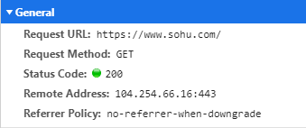


**状态码分类：**

1XX- 信息型，服务器收到请求，需要请求者继续操作。

2XX- 成功型，请求成功收到，理解并处理。

3XX - 重定向，需要进一步的操作以完成请求。

4XX - 客户端错误，请求包含语法错误或无法完成请求。

5XX - 服务器错误，服务器在处理请求的过程中发生了错误。


**常见状态码：**

200 OK - 客户端请求成功

301 - 资源（网页等）被永久转移到其它URL

302 - 临时跳转

400 Bad Request - 客户端请求有语法错误，不能被服务器所理解

401 Unauthorized - 请求未经授权，这个状态代码必须和WWW-Authenticate报头域一起使用

404 - 请求资源不存在，可能是输入了错误的URL

500 - 服务器内部发生了不可预期的错误

503 Server Unavailable - 服务器当前不能处理客户端的请求，一段时间后可能恢复正常。


### 2.6 响应体

客户端（浏览器）发送请求后，服务器会返回响应，如果时访问网页，则会返回响应头和响应体。响应头类似请求头，响应体一般是我们网页的源码内容。


响应头：

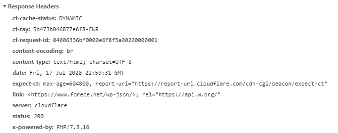


响应体：


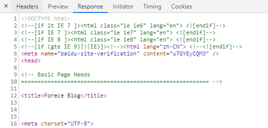


## 3. Chrome / Fiddler  抓包

### 3.1 Chrome 抓包

一般我们用 Chrome 浏览器自带的开发者工具就可以进行抓包了，打开 Chrome 开发者工具快捷键 `F12` 


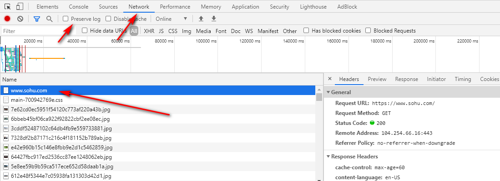


打开开发者工具，然后选择 Network，刷新网页，我们就可以看到浏览器对该服务器发送的请求，除了网页请求，浏览器还会对网页上的图片、CSS、JS 等文件发送请求，所以当需要进行抓包的时候，我们需要根据响应体来查看这个请求是否是我们所需要的请求。


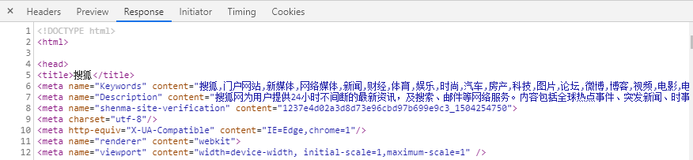


Preserve Log

Preserve Log 是抓包记录。比如登录的时候，我们发送请求后，浏览器会跳转页面，这时候 Chrome 就会对新弹出来的网页进行抓包。那么之前登录所发送的请求包就消失了，勾选 Preserve Log 后则会继续保留之前的请求记录。


### 3.2 Fiddler 抓包

Fiddler 是一个强大的抓包工具，并且集成了很多内置工具。


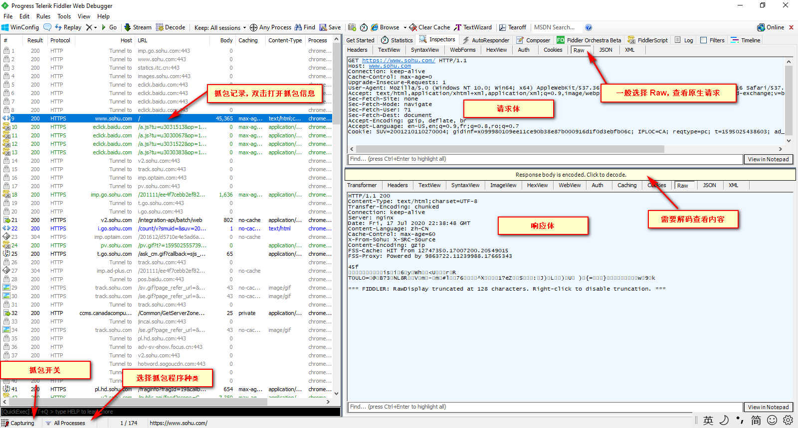


另外一开始 Fiddler 并不支持 HTTPS 抓包，需要配置以下 HTTPS 抓包， Tools - Options

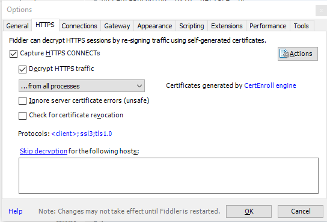


# 二、Requests 库

官方文档：https://requests.readthedocs.io/en/master/


## 1. 发送 Get 请求

```
requests.get(url, params=None, **kwargs)
```

>参数1：一个 URL 地址
>
>参数2：默认为空
>
>字典参数：**kwargs 可以跟不限定数量的字典参数，比如 data、headers 等


例子：发送get请求到百度首页

```
import requests
url = 'https://www.baidu.com'

# 发起get请求，创建一个对象
req = requests.get(url)
```


**响应的常用属性**

```
# 发起get请求，创建一个对象
req = requests.get(url)

# 返回页面状态
print(req)  # 返回结果： <Response [200]>

# 返回响应代码
print(req.status_code)  # 200

# 返回页面内容
print(req.content) # b'...' 返回二进制文本流

# 返回以UTF-8编码的网页内容
print(req.content.decode('utf-8'))

# 返回文本文字（中文会有乱码，需要解码）
req.encoding = 'utf-8'
print(req.text)

# 返回响应头
print(req.headers)

# 返回请求头
print(req.request.headers)

# 返回 url
print(req.url)

# 返回Cookies
print(req.cookies)
print(req.cookies.get_dict())

# 返回以json格式的数据
print(req.json()))
```


## 2. 案例：

### 2.1 爬取百度首页

```python
import requests

url = 'https://www.baidu.com'
req = requests.get(url)
code = req.status_code
print(code)

if code == 200:
    with open('./1.html', 'w', encoding='utf-8') as fp:
        fp.write(req.content.decode('utf-8'))
        
```


### 2.2 带参数GET

在 Forece 博客上搜索，通过抓包可以发现，搜索是通过GET方式对服务器进行请求的。比如搜索 Forece，在抓包过程中可以看到我们构造了一个s:Forece的字典进行传递数据的。


然后我们就可以通过构造一个参数进行 GET，另外我们还可以在 GET 中加入 Header 信息


```python
import requests

url = 'https://www.forece.net/?'
param = {'s':'Forece'}
headers = {'User-Agent': 'Mozilla/5.0 (Windows NT 10.0; Win64; x64) AppleWebKit/537.36 (KHTML, like Gecko) Chrome/83.0.4103.116 Safari/537.36'}
req = requests.get(url, params=param, headers=headers)
code = req.status_code
print(code)

if code == 200:
    with open('./2.html', 'w', encoding='utf-8') as fp:
        fp.write(req.content.decode('utf-8'))
```


### 2.3 GET 下载文件

```python
import requests
import random

for i in range(20):
    height = random.randint(440, 550)
    width = random.randint(440, 550)
    url = 'https://placekitten.com/%s/%s' % (str(width), str(height))
    res = requests.get(url)
    cat_image = res.content
    with open(r'cat\{}.jpg'.format(i), 'wb') as f:
        f.write(cat_image)
```


下载大文件

```
# 开启流模式
r = requests.get(file_url,stream=True)
with open(filename, 'wb') as f:
  for chunk in r,iter_content(chunk_size=32): 
  f.write(chunk)  # 每一次循环存储一次下载下来的内容
```

> chunk_size 设置每次下载文件的大小


## 3. 文件编码保存错误

有时候保存文件会出现乱码或者报错

```python
Traceback (most recent call last):
  File "C:/Users/Forece/PycharmProjects/crawler/request_py.py", line 14, in <module>
    fp.write(req.content.decode('utf-8'))
UnicodeEncodeError: 'gbk' codec can't encode character '\xa9' in position 38160: illegal multibyte sequence
```


解决方法：

在windows下面，新文件的默认编码是gbk，这样的话，python解释器会用gbk编码去解析我们的网络数据流txt，然而txt此时已经是decode过的unicode编码，这样的话就会导致解析不了，Linux 则无这种问题，出现上述问题。 解决的办法就是，改变目标文件的编码

```
f = open("out.html","w",encoding='utf-8')  
```


## 4. 发送POST 请求

```python
requests.post(url, data=data, headers=header)
```


向百度翻译 POST 数据，然后获取结果

```python
import requests
url = 'https://fanyi.baidu.com/sug'
header = {'User-Agent':'Mozilla/5.0 (Windows NT 10.0; Win64; x64) AppleWebKit/537.36 (KHTML, like Gecko) Chrome/81.0.4044.129 Safari/537.36'}
data = {'kw': '中国'}
req = requests.post(url, data=data, headers=header)
code = req.status_code
print(code)

if code == 200:
    print('请求成功')
    translate_data = req.json()
    if translate_data['errno'] == 0:
        print('响应成功')
        print(translate_data['data'][0]['v'])
```


**超时参数 timeout**
限制发送请求，在n秒内必须获得服务器响应，否则报错

```
req = requests.post(url, data=data, headers=header, timeout=3)
```


## 5. Cookies 和 Sessions 登录原理

Sessions 是网站给用户的一个ID，用来验证用户的，这个ID会保存在用户的 Cookies 中

Cookies 是保存在浏览器中的通信证，如果更换浏览器或者清空Cookies，再次连接网站时，失去登录效果


Cookie 获取流程：

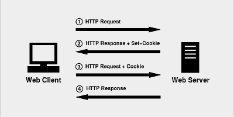


1. 首先，客户端会发送一个http请求到服务器端。

2. 服务器端接受客户端请求后，建立一个session，并发送一个http响应到客户端，这个响应头，其中3. 就包含Set-Cookie头部。该头部包含了sessionId。Set-Cookie格式如下，具体请看Cookie详解

4. Set-Cookie: value[; expires=date][; domain=domain][; path=path][; secure]

5. 在客户端发起的第二次请求，假如服务器给了set-Cookie，浏览器会自动在请求头中添加cookie

5. 服务器接收请求，分解cookie，验证信息，核对成功后返回response给客户端


https://zhuanlan.zhihu.com/p/92949110


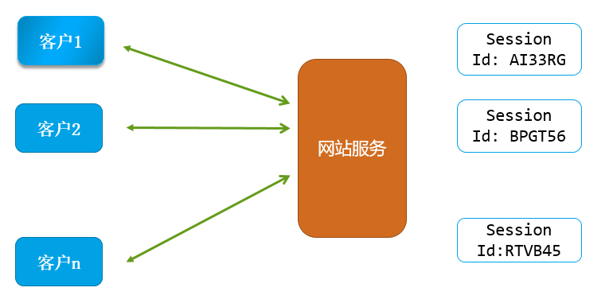


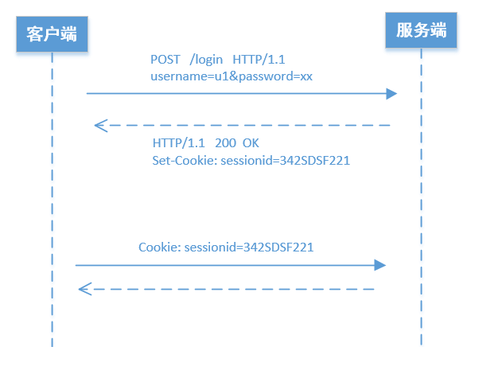


**用 Cookies 登录网站**

在浏览器中登录，然后用F12开发者工具获取Cookies，然后访问该页面

```python
import requests
url = 'https://www.discuz.net/forum.php?mod=guide&view=my'
header = {'User-Agent':'Mozilla/5.0 (Windows NT 10.0; Win64; x64) AppleWebKit/537.36 (KHTML, like Gecko) Chrome/81.0.4044.129 Safari/537.36',
          'Cookie': 'Cookie'}  # 修改自己的 Cookie 值
req = requests.post(url, headers=header)
code = req.status_code
print(code)


if code == 200:
    with open('./2.html', 'w', encoding='utf-8') as fp:
        fp.write(req.content.decode('gbk'))
```


**让程序自动获取 Cookies，自动登录任意 Discuz 论坛**

```
import requests
url = 'https://www.discuz.net/forum.php?mod=guide&view=my'
login_url = 'https://www.discuz.net/member.php?mod=logging&action=login'
header = {'User-Agent':'Mozilla/5.0 (Windows NT 10.0; Win64; x64) AppleWebKit/537.36 (KHTML, like Gecko) Chrome/81.0.4044.129 Safari/537.36'}
data = {}  # 抓包 POST 数据

# 创建 session
req = requests.session()

# 用 session 创建的对象发送登录请求
res = req.post(login_url, data=data, headers=header)
code = res.status_code
print(code)


if code == 200:
    # 如登录正常，将res对象重新用session get方式发送请求，因为req用的session模式，会自动记录cookies，再次请求会自动添加
    res = req.get(url, headers=header)
    with open('./2.html', 'w', encoding='gbk') as fp:
        fp.write(res.content.decode('gbk'))
```


## 6. 快速转换字典方法

在 PyCharm 中利用正则更改

```
源匹配为 (.*): (.*)$
替换匹配为 "$1": "$2",
```


## 7. Token 验证登录

**XSS 、CSRF 攻击**

 例子1：

一个网站用户 Alice 可能正在浏览聊天论坛，而同时另一个用户 Eve 也在此论坛中发布了一个具有 Alice 银行链接的图片消息。设想一下，Eve 编写了一个在 Alice 的银行站点上进行取款的form提交的链接，并将此链接作为图片tag。如果 Alice 的银行在cookie中保存他的授权信息，并且此cookie没有过期，那么当 Alice 的浏览器尝试装载图片时将提交这个取款form和他的cookie，这样在没经 Alice 同意的情况下便授权了这次事务。


例子2：

银行网站A 登录，浏览器保存登录状态, http://www.bank.com/transfer_money.php，没有Log out

游戏论坛B，论坛有人发了一个银行网站的链接。导致用户点击了链接，并执行了A网站的一些操作。甚至可以不用点击链接，直接在 Javascript 中就可以让用户悄无声息的运行了代码。因为 GET 和 POST 都可以带 Cookies 直接进行操作，所以加了动态 token 验证，用户就无法直接使用 Cookies 直接免验证登录了。token是开发者为了防范csrf而特别设计的令牌，浏览器不会自动添加到headers里，攻击者也无法访问用户的token，所以提交的表单无法通过服务器过滤，也就无法形成攻击。


**Token认证流程**

token 的认证流程与cookie很相似

用户登录，成功后服务器返回Token给客户端。

客户端收到数据后保存在客户端

客户端再次访问服务器，将token放入headers中

服务器端采用filter过滤器校验。校验成功则返回请求数据，校验失败则返回错误码


**登录带 Token 的网站**

```python
from lxml import etree
import requests

url = 'https://www.lmonkey.com/login'
target_url = 'https://www.lmonkey.com/my/order'
header = {'user-agent': 'Mozilla/5.0 (Windows NT 10.0; Win64; x64) AppleWebKit/537.36 (KHTML, like Gecko) Chrome/81.0.4044.129 Safari/537.36'}

# Get 请求获取页面Token
res = requests.session()
html = res.get(url, headers=header)

# 获取Token
html = html.content.decode('utf-8')
html = etree.HTML(html)
token = html.xpath('//meta[@name="csrf-token"]/@content')

data = {
"_token": token[0],
"username": "用户名",
"password": "密码"
}

# Post 请求登录
html = res.post(url, data=data, headers=header)
print(html.status_code)

# Get 指定页面
if html.status_code == 200:
    html = res.get(target_url, headers=header)
    with open('./output.html', 'w', encoding='utf-8') as fp:
        fp.write(html.content.decode('utf-8')
```


## 8. POST 上传文件

用post方式上传文件，只读2进制模式打开文件，在 requests.post 方法的参数中添加 files 参数，参数是字典形式，key 为服务器提供的字段名，value 是打开的文件。


```python
# 需要先打开要上传的文件
f = open(r"D:\upload\a.jpg","rb")

# 接收一个字典  key是服务器用于提取文件的字段名  f时要上传的文件对象
response = requests.post(
    url="http://httpbin.org/post",
    files={"img":f}  # 这个img是通过抓包得到的key，不是自己想写什么就写什么的
)
print(response.status_code)
```


## 9. 证书验证

如果网站证书出现问题的话，可以使用 `verify = False` 参数来忽略认证

```
res = requests.get(url, verify = False)
```


# 三、JSON 数据结构

## 1. JSON 的定义
JSON是JavaSript对象表示法，json格式是一种轻量级的文本数据交换格式，拥有存储空间小，处理速度快等优势


## 2. JSON 数据结构
Json 本质上是一种嵌套字典格式，但键值所对应的值，往往更加复杂，不仅是数字，还可以是字符串，数组，列表等

在 python 爬数据的时候，有时候 web服务器返回来的数据是一些 json数据，但是我们用 type 命令查看类型的时候，显示的是 str 类型，如：


json 格式样例：

```
[{"UserID":11, "Name":"Truly", "Email":"zhuleipro@hotmail.com"}]
```


```
historyTransactions = [

    {
        'time'   : '20170101070311',  # 交易时间
        'amount' : '3088',            # 交易金额
        'productid' : '45454455555',  # 货号
        'productname' : 'iphone7'     # 货名
    },
    {
        'time'   : '20170101050311',  # 交易时间
        'amount' : '18',              # 交易金额
        'productid' : '453455772955', # 货号
        'productname' : '奥妙洗衣液'   # 货名
    },
    ...
]
```


## 3. json.loads

用 json.loads 方法将 json 字符串转化为 python 类型（列表或字典）

```
import json
json.loads(json字符串)
```


## 4. json.dump

将 python 类型转化为 json 字符串，一般我们写入文件的时候，需要将 json 格式数据再转换为字符串格式。

```
import json
json.dumps({"a":"1", "b":"2"})
```


默认不转换中文字符为 Ascii 码

```
json.dumps(data, ensure_ascii=False)
```


换行缩进

```
json.dumps(data, indent=2)
```


# 四、Xpath（XML Path Language）

## 1. XPATH 基本规则

```
nodename	选取此节点的所有子节点
 /			从根节点选取。                                             
 //			从匹配选择的当前节点选择文档中的节点，而不考虑它们的位置。 
 .			选取当前节点。                                             
 ..			选取当前节点的父节点。                                     
 @			选取属性。
```


**网页节点示意图**

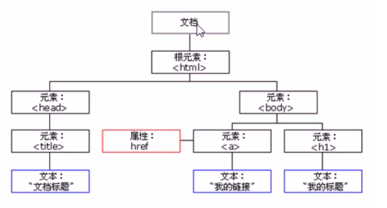


## 2. 在 Python 中使用 xpath

**安装 xpath**

```
pip install lxml
```


**引入 xpath 模块**

```
from lxml import etree
```


**创建 xpath 实例的几种方法：**

1. 直接引入本地文件

```
html = etree.parse('2.html', etree.HTMLParser()) 
```

2. 直接引入变量

```
html = etree.parse(text, etree.HTMLParser()) 
```


**简单解析一段html代码**

```
    from lxml import etree

    text = '''
    <!DOCTYPE html>
    <html>
    <body>

    <div class="drink">
        <ol>
          <li>咖啡</li>
          <li>牛奶</li>
          <li>茶</li>
        </ol>
    </div>

    <div class="cake">
        <ol>
          <li class="cake"><a href="/1/">蛋糕</a></li>
          <li><a href="/2/">甜点</a></li>
          <li><a href="/3/">布丁</a></li>
        </ol>
    </div>

    </body>
    </html>'''

    # 使用etree解析字符串
    html = etree.HTML(text)
    r = html.xpath('/html/body/div/ol/li')
    print(r)  # 会输出匹配的变量地址 <Element li at 0x2dba268>

    # 选择所有div下边的子节点
    r = html.xpath('//div/*')

    r = html.xpath('/html/body/div/ol/li/text()')
    print(r)  # 会输出所有匹配的li标签中内容

    r = html.xpath('//div[@class="cake"]/ol/li/a/text()')
    print(r)  # 匹配div标签中class属性为cake下的ol/li/a下边的文本内容

    r = html.xpath('//div[@class="cake"]//li/a/text()')
    print(r)  # 匹配class，指定第一层，然后还可以用 //过滤中间层，直接指定最后一层
```


## 3. 按属性选取

```
# 按属性选择，不管什么标签，只要标签内含有class属性为name的节点
r = html.xpath('//*[@class="name"]')

# 如果class包含多个值，需要写全
r = html.xpath('//*[@class="city huge-city"]')

# 选择a标签属性中包含 city 的元素
r = html.xpath('//a[contain(@href,"city"')])

# 选择a标签属性中以 city 字符开头
r = html.xpath('//a[starts-with(@href,"city"')])

# 选择a标签属性中以 city 字符结尾
r = html.xpath('//a[ends-with(@href,"city"')])

# 获取a标签中的属性值（链接地址）
r = html.xpath('//div[@class="cake"]//li/a/@href')

# 选择文本为蛋糕的标签
r = html.xpath('//a[text()="蛋糕"]')
```


## 4. 按次序选取

```
r = html.xpath('/html/body//div/ol/li[1]/text()')
print(r)  # 输出第一个li中的内容（注意xpath索引是从1开始）

r = html.xpath('//li[last()]/text()')
print(r)  # 输出倒数第一个li中的内容

r = html.xpath('//li[position()=last()]/text()')
print(r)  # 输出倒数第一个li中的内容

r = html.xpath('//li[last()-1]/text()')
print(r)  # 输出倒数第二个li中的内容

# 选取option类型的第一和第二个子元素
r = html.xpath('//option[position()<=2]')

# 选择class属性为multi_choice的后3个子元素
r = html.xpath('//*[@class="multi_choice"]/*[position()>=last()-2]')
```


## 5. 子节点、父节点、兄弟节点

```
# 选择id='china'的所有子节点
//*[@id='china']/*

# 选择id='china'的父节点
//*[@id='china']/..

# 选择class='cake'节点后的第一个li兄弟节点中a标签中的内容
r = html.xpath('//li[@class="cake"]/following-sibling::li[1]//a/text()')

# 选择class='single_choice'的所有前边的所有兄弟节点
//*[@class='single_choice']/preceding-sibling::*
```


## 6. 多个表达式选择多个不同元素

```
//option | //H4
```


## 7. 案例

**获取学习猿地猿著文章信息**

```
from lxml import etree
import requests

url = 'https://www.lmonkey.com/essence'
header = {'user-agent': 'Mozilla/5.0 (Windows NT 10.0; Win64; x64) AppleWebKit/537.36 (KHTML, like Gecko) Chrome/81.0.4044.129 Safari/537.36'}

html = requests.get(url, headers=header)
html = etree.HTML(html.content.decode('utf-8'))
author = html.xpath('/html/body/div[1]/div[2]/div/div[1]/div//div/div[2]/p/strong/a/text()')
title = html.xpath('/html/body/div[1]/div[2]/div/div[1]/div//div/div[2]/a[1]/div/text()')
title_url = html.xpath('/html/body/div[1]/div[2]/div/div[1]/div//div/div[2]/a/@href')

# 通过zip函数将三个变量连接起来形成元组，所有数据组成一个迭代数据，可以遍历来查看
res = zip(author, title, title_url)

# for i in res:
#     print(i)

# 将连接后的变量转换成列表
print(list(res))


```


# 五、BeautifulSoup

BeautifulSoup 类似 XPATH，也是做元素提取的一种工具

中文文档：https://beautifulsoup.readthedocs.io/zh_CN/v4.4.0/#


## 1. 安装 Beautifulsoup 

```
pip install beautifulsoup4
```


## 2. 导入 Beautifulsoup 模块

```
from bs4 import Beautifulsoup
```


## 3. 用 BS4 处理文件/字符串

```
from bs4 import BeautifulSoup
soup = BeautifulSoup(open("index.html"))  # 用bs4打开文件
soup = BeautifulSoup("<html>data</html>") # 用bs4直接编辑str
soup = BeautifulSoup(html, 'lxml')  # 用bs4编辑变量，并使用 lxml 解析器解析
print(soup) # 可以看一下 soup 内容是什么
```

> BeautifulSoup 第一个参数是传入需要编辑的对象，第二个参数是解析器，如果解析器不加以指定的话，BS4 会自动选择最佳解析器。不过这种写法在其他平台环境上会造成未知错误。所以使用BS4的时候，最好加上解析器。


错误提示：

```
GuessedAtParserWarning: No parser was explicitly specified, so I'm using the best available HTML parser for this system ("lxml"). This usually isn't a problem, but if you run this code on another system, or in a different virtual environment, it may use a different parser and behave differently.

```


## 4. 安装解析器

Beautiful Soup 支持Python标准库中的HTML解析器, 还支持一些第三方的解析器,其中一个是 lxml .根据操作系统不同,可以选择下列方法来安装 lxml，其实就是之前学过的 xpath 所在的库

```
pip install lxml
```


另一个可供选择的解析器是纯Python实现的 [html5lib](http://code.google.com/p/html5lib/) , html5lib的解析方式与浏览器相同,可以选择下列方法来安装html5lib:

```
pip install html5lib
```


下表列出了主要的解析器,以及它们的优缺点:

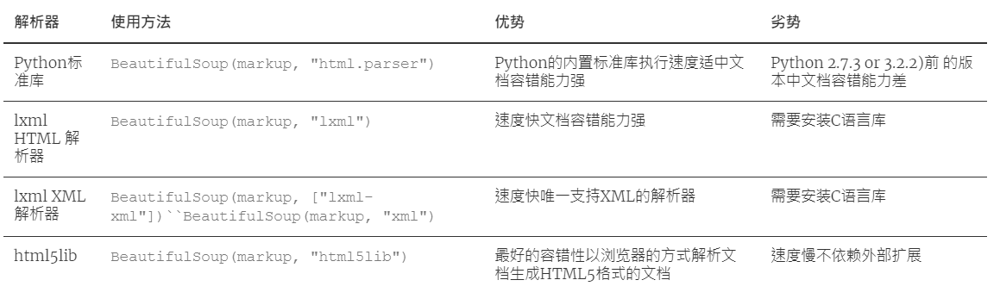


## 5. BS4 选择编码

任何HTML或XML文档都有自己的编码方式,比如ASCII 或 UTF-8,但是使用Beautiful Soup解析后,文档都被转换成了Unicode，BS4 有一个自动编码检测的子库，可以识别当前文档的编码并转换为 Unicode。

```
print(soup.original_encoding)
```

> 用来查看文档原始编码


虽然自动编码字库大部分时候可以正确识别编码，但是有时候也会出错。可以通过传入 from_encoing 参数来强制指定编码

```
soup = BeautifulSoup(markup, from_encoding="iso-8859-8")
```


## 6. 按TAG查找元素

Beautiful Soup 将复杂HTML文档转换成一个复杂的树形结构，和 XPATH 一样，BS 也是一种提取元素的工具。在文档树（DOM）中，每一个标签（如div, img, a, h1, title）都属于 Tag。按 Tag 查找的方法很简单，只需要用 `.` 就可以找出相应的元素。不过只可以找出第一个匹配的元素。


```
# 按Tag查找
print(soup.h2)
print(soup.a)
print(soup.article.div.ul.li) # 这里的.相当于 XPATH 中的 // ，一层一层递进

# 按Tag属性查找
print(soup.a['class'])  # 因为class属于多值属性，所以它的返回值为数组。如：['nav']
print(soup.a['href'])  # 查找a标签的链接值
print(soup.a['name'])  # 查找a标签中，name的属性值
print(soup.a.attrs)  # 也可以直接用 Tag 方式返回属性值

# Tag 中的字符串
print(soup.a.string)
print(soup.a.get_text())
print(soup.p.contents)  # 输出节点包含所有节点（子节点/孙节点...）内容，以列表形式存储每个节点
print(soup.prettify())     # 格式化输出soup对象的内容
```


**get_text() 与 string 的区别：**

get_text() 会输出所有子元素内的文本，而 string 只会对只有一个子元素的元素输出文本。

```
from bs4 import BeautifulSoup

text = '''
<div>
    <h1>This is a H1 Tag'</h1>
    <a href="http://www.forece.net">Forece Blog</a>
</div>'''
soup = BeautifulSoup(text, 'lxml')  # 用bs4编辑变量
print(soup.div.string)
print(soup.a.string)
print(soup.div.get_text())

# 输出结果
None
Forece Blog

This is a H1 Tag'
Forece Blog
```


## 7. CSS 选择器

CSS 选择器会将所有匹配的元素以列表的形式呈现


完整 CSS 选择器列表：

https://www.w3school.com.cn/cssref/css_selectors.asp


```
print(soup.select('a'))  # 标签名
print(soup.select('.class'))  # Class 名
print(soup.select('#nav'))  # ID 名
print(soup.select('article ul li'))  # 后代选择器
print(soup.select('div>ul>li'))  # 子代选择器


# 通过是否存在某个属性来查找，搜索具有 id 属性的 li 标签
soup.select('li[id]') 

 # 通过属性的值来查找查找，搜索 id 为 sponsor 的 li 标签
soup.select('li[id="sponsor"]')
```


## 8. 父节点、子节点、兄弟节点

```
# 父节点 parent 和 parents
tag = soup.h2
print(tag.parent)

# 子节点（会返回一个迭代数据，需要遍历循环或者使用 list(), 转换列表会将换行也保存下来
tag = soup.div
for child in tag.children:
    print(child)

# 子孙节点
tag = soup.div
for child in tag.descendants:
	print(child)

```

> children 只获得子节点，descendants 可以获取子节点以及子节点下边的任意节点


兄弟节点

.next_sibling 和 .previous_sibling 属性用来插叙兄弟节点，使用方式与其他的节点类似。但使用的时候经常出现空白情况。

```
from bs4 import BeautifulSoup

text = '''
<a href="http://example.com/elsie" class="sister" id="link1">Elsie</a>
<a href="http://example.com/lacie" class="sister" id="link2">Lacie</a>
<a href="http://example.com/tillie" class="sister" id="link3">Tillie</a>
'''
soup = BeautifulSoup(text, 'lxml') 
print(soup.a.next_sibling)

# 输出结果为空

```


通过 list 转换，我们可以明白到底为什么

```
print(list(soup.a.next_sibling))

# 输出结果
['\n']
```

> 其实我们忽略了 a 标签后边的第一个元素，其实是换行符。


所以一般情况下我们使用兄弟元素的复数形式：

```
next_eles = soup.a.next_siblings
for i in next_eles:
	print(i)

# 或者转换成列表提取我们所需要的元素
next_eles = list(soup.a.next_siblings)
print(next_eles[1])
```


> 至于 previous_sibling 和 previous_siblings 用法和 next_sibling 一样。


## 9. find() 和 find_all()

```
find_all(name , attrs , recursive , string , ** kwargs)
```

```
import requests
from bs4 import BeautifulSoup
import re

# 获取HTML内容，并用BS4解析
url = 'https://www.mengchenghui.com/'
res = requests.get(url)
html = res.content.decode('utf-8')
soup = BeautifulSoup(html, 'lxml')

# 读取title标签（用find只返回第一个，find_all返回所有）
print(soup.find('title').get_text())

# 找到所有a标签链接，并拿到a标签内的内容
a_tag = soup.find_all('a')
for i in a_tag:
    print(i.get_text())

# 找到li标签中，class为month的内容
print(soup.find_all('li', {'class': 'month'}))

# 也可以通过Tag选择方法过滤掉一些不必要的元素
print(soup.article.div.ul.find_all('li'))

# 按 Class 查找（因为 class 为Python的保留关键字，所以作为参数时加上了下划线）
title = soup.find_all('div', class_="topic_title")

# 按 id 寻找
title = soup.find_all(id='link2')

# 按属性寻找
data_soup.find_all(attrs={"data-foo": "value"})

# 按字符串寻找（完整字符串）
soup.find_all("a", string="Elsie")

# 搜索包含 Reeoo 字符串的标签：
soup.find_all(string=re.compile("Reeoo"))

# limit 参数，返回指定个数
soup.find_all('div', class_='thumb', limit=3)

# 是否存在指定的属性，搜索所有带有 target 属性的标签，注意这里不要加引号
soup.find_all(target=True)

# recursive 参数
find_all() 会检索当前tag的所有子孙节点,如果只想搜索tag的直接子节点,可以使用参数 recursive=False。

```


## 10. BS4搭配正则使用

```
img_link = soup.find_all("img", {"src": re.compile('.*?\.jpg')})
for link in img_link:
    # 因为src="链接"这种形式就是字典的模式，所以可以用打印键值的方式输出
    print(link['src'])  

# 多项匹配在a标签内，包含 target=_blank，以/item/起始
link = soup.find_all('a',
                    {
                        'target': '_blank',
                        'href': re.compile("/item/(%.{2})+$")})
```


## 11. 其他搜索方法

```
find_parents() 和 find_parent()
find_next_siblings() 和 find_next_sibling()
find_previous_siblings() 和 find_previous_sibling()
```


# 六、正则表达式

一个正则表达式（或RE）指定了一集与之匹配的字符串

官方文档：https://docs.python.org/zh-cn/3/library/re.html


## 1. 引入正则

```
import re
```


## 2. 正则的简单示例

```
import re

# 定义需要处理的字符串
vars = 'iloveyou55522123<div>test</div>'

# 定义规则，查找所有匹配的单个数字
pattern = '\d'

# 用正则处理字符串
result = re.findall(pattern, vars)

# 以列表形式储存所有的字符
print(result)
['5', '5', '5', '2', '2', '1', '2', '3']

```


## 3. 正则匹配规则

### 3.1 普通字符

```
# 直接输入字符串，匹配相同字符串
pattern = 'love'
```


### 3.2 转义字符


掌握：

```
pattern = '\d'  # 匹配数字
pattern = '\D'  # 匹配非数字
pattern = '\w'  # 匹配单个 字母、数字、下划线
pattern = '\W'  # 匹配单个 非（字母、数字、下划线）
pattern = '\s'  # 匹配单个空格符、制表符
pattern = '\S'  # 匹配单个非空格符、制表符
```


了解：

```
\n	匹配换行符
\t	匹配制表符

\A	匹配字符串开始
\Z	匹配字符串结束（只匹配到换行符前）
\z	匹配字符串结束
```


### 3.3 特殊字符

```
reg = '.'  # 任意字符
```


`*`  匹配次数，任意次数，如果一开始字符不符合要求，则停止匹配。如果符合匹配，则尽可能多匹配

```
import re

vars = 'iloveyou 555love2212<div>test</div>'
reg = re.compile('\w*')
res = reg.search(vars)
print(res.group())

# 输出结果
iloveyou  # 因为\w不匹配空格，所以停止匹配

# 如果字符串首字母为空格的话，那么则直接返回
```


`+`  匹配次数，任意次数，至少匹配一次，如果一开始字符没符合要求，则继续往后找，知道找到一次合格的匹配

```
import re

vars = ' ￥ 2wiloveyou 555love2212<div>test</div>'
reg = re.compile('\w+')
res = reg.search(vars)
print(res.group())

# 输出结果
2wiloveyou
```


`?`  拒绝贪婪，只要前面的匹配规则只要达成则返回（尽可能少匹配）

```
import re
var = "<h1>RUNOOB-菜鸟教程</h1>"
pattern = '<.*?>'
data = re.search(pattern, var)
print(data.group())

# 输出结果
<h1>
```

> 如果使用 `.*` 则会匹配到 `<h1>RUNOOB-菜鸟教程</h1>`


与 `*` 搭配会出现问题

```
reg = re.compile('\w*?')  # 只返回空，因为*代表任意次，所以0次也可以，直接返回
```


`*` 和 `?` 的区别

```
import re

content = '''Hello 123 World'''
result = re.match('^He.*(\d+).*World$', content)
print(result.group(1))

# 输出结果
3
```

```
import re

content = '''Hello 123 World'''
result = re.match('^He.*?(\d+).*World$', content)
print(result.group(1))

# 输出结果
123
```

> `?` 限制了`*` ，让 `*`  尽可能的少匹配


\b 边界

~~~python
import re

vars = 'hi, China'
pattern = r'\bhi\b'
result = re.findall(pattern, vars)
print(result)

# 只会匹配到hi，而不会匹配到 China 中的 hi

~~~


\B 是 \b 的取非（匹配的字符不能出现在开头或结尾）

~~~
import re

vars = 'hi, China'
pattern = r'\Bhi'
result = re.findall(pattern, vars)
print(result)

# 只会匹配到 China 中的 hi，而不会匹配到第一个 hi
~~~


{} - 前方的表达式执行次数

```
reg = '\d{3}'  # 匹配3个连续的数字
reg = '\d{2,5}'  # 匹配2-5个连续的数字
```


[] - 范围区间

```
reg = '[a-z]'  # 匹配a-z的字符
reg = '[A-Z]'  # 匹配A-Z的字符
reg = '[0-9]'  # 匹配0-9字符
```


() - 代表子组

```
import re

vars = ' ￥ 2wiloveyou 555love2212<div>test</div>'
reg = re.compile('\d+([a-z]+)\d+')  # 用小括号将love作为匹配的子组
res = reg.search(vars)
print(res.groups())  # 用groups来提取子组
```


^ - 代表开始

$ - 代表结尾

```
# 匹配一个手机号
import re

vars = '13526478540'
reg = re.compile('^1\d{10}$')  # 以数字1开始，10个连续数字为结尾的规则
res = reg.search(vars)
print(res.group())
```


`|` - 多项匹配

```
a | b  # 匹配a或者匹配b
```


### 3.4 模式

不区分大小写

```
import re

vars = '123ILOVEU456'
reg = re.compile('[a-z]{5,10}',re.I)  # I模式，不区分大小写
res = reg.search(vars)
print(res.group())
```


换行

```
import re

content = '''Hello 123 
World'''
result = re.findall('^He.*?(\d+).*World$', content, re.S)
print(result)
```


## 4. 正则方法

**group()**

匹配后的结果，可以用 group() 方法来查看

```
print(result.group())
```


**span()**

匹配结果对比原字符串的范围

```
print(result.span())
```


**re.findall()**

按照正则表达式的规则在字符串中匹配所有符合规则的元素，结果返回一个列表，如果没有找到返回空列表

~~~
import re

vars = 'iloveyou555love22123<div>test</div>'
pattern = 'love'
result = re.findall(pattern,vars)
print(result)

['love', 'love']

~~~


**re.match()**

从字符串起始位置开始匹配，精确匹配，如果第一个字符就不匹配，那么返回 None，成功则返回对象，用 对象.group() 拿去结果。只返回一个结果

~~~
import re

vars = 'iloveyou55522123<div>test</div>'
pattern = 'ilove'
result = re.match(pattern, vars)  # 如果 pattern 为 love，则返回 None
print(result.group())  # 获取匹配的结果
print(result.span())  # 获取匹配结果的索引区间
~~~


**re.search()**

从字符串起始位置开始搜索，模糊匹配，如果第一个字符不匹配继续搜索，一直搜索到字符串结束，其他功能与 Match 一样。同样只返回一个结果

~~~
import re

vars = 'iloveyou55522123<div>test</div>'
pattern = 'ilove'
result = re.search(pattern, vars)  # 如果 pattern 为 love，也会匹配到
print(result.group())  # 获取匹配的结果
print(result.span())  # 获取匹配结果的索引区间
~~~

> 尽量用 search，因为 match 要求比较严格


**re.split()**

用 *pattern* 分开 *string* 

~~~python
import re

vars = 'I wake up in the morning'
pattern = '\W'
result = re.split(pattern, vars)
print(result)
~~~


> *maxsplit* 参数，默认为0，有多少匹配就分割多少次。如果设置了该参数，则分割指定次数，剩下的字符返回到列表最后一个元素


**re.sub(规则, 替换字符, 需要处理的字符串)**

按照正则表达式规则，在字符串中找到需要被替换的字符串，完成一个替换

~~~
import re

vars = 'iloveyou555love22123<div>test</div>'
pattern = 'love'
replace_str = 'hate'
result = re.sub(pattern, replace_str, vars)
print(result)
~~~


**complie()**

可以直接将正则表达式为一个正则对象，使用对象直接操作，当大批量处理的时候，建议使用 complie()

~~~
import re

vars = 'iloveyou555love2212<div>test</div>'
# 生成一个正则对象
reg = re.compile('\d{3}')
# 用正则对象来进行操作
result = reg.findall(vars)
print(result)
~~~


~~~
import re

lines = [
    'i love 511 you',
    'i love 521 you',
    'i love 531 you',
    'i love 541 you'
]
vars = 'iloveyou555love2212<div>test</div>'
# 生成一个正则对象
reg = re.compile('\d{3}')
# 用正则对象来进行操作

for i in lines:
    result = reg.findall(i)
    print(result)
~~~


## 5. 常用正则表达式

常用提取文字方法

```
import re

content = 'Hello 123 World'
result = re.match('^He.*?(\d+).*World$', content)
print(result.group(1))
```

> 使用 `.*?`  + `()` 的方式将我们所需要的文字用子集的方式提取出来


带换行提取文字方法

```
import re

content = '''Hello 123 
World'''
result = re.findall('^He.*?(\d+).*World$', content, re.S)
print(result)
```


```
import re
pattern = re.compile(pattern, re.S)
result = re.findall(pattern, content)
for result in results:
	# 将元组中的元素分别赋值给不同变量
	url, name, author, date = result
	print(url, name, author, date)
```


### 1. 校验数字的表达式

~~~
数字：^[0-9]*$
n位的数字：^\d{n}$
至少n位的数字：^\d{n,}$
m-n位的数字：^\d{m,n}$
零和非零开头的数字：^(0|[1-9][0-9]*)$
非零开头的最多带两位小数的数字：^([1-9][0-9]*)+(.[0-9]{1,2})?$
带1-2位小数的正数或负数：^(\-)?\d+(\.\d{1,2})?$
正数、负数、和小数：^(\-|\+)?\d+(\.\d+)?$
有两位小数的正实数：^[0-9]+(.[0-9]{2})?$
有1~3位小数的正实数：^[0-9]+(.[0-9]{1,3})?$
非零的正整数：^[1-9]\d*$ 或 ^([1-9][0-9]*){1,3}$ 或 ^\+?[1-9][0-9]*$
非零的负整数：^\-[1-9][]0-9"*$ 或 ^-[1-9]\d*$
非负整数：^\d+$ 或 ^[1-9]\d*|0$
非正整数：^-[1-9]\d*|0$ 或 ^((-\d+)|(0+))$
非负浮点数：^\d+(\.\d+)?$ 或 ^[1-9]\d*\.\d*|0\.\d*[1-9]\d*|0?\.0+|0$
非正浮点数：^((-\d+(\.\d+)?)|(0+(\.0+)?))$ 或 ^(-([1-9]\d*\.\d*|0\.\d*[1-9]\d*))|0?\.0+|0$
正浮点数：^[1-9]\d*\.\d*|0\.\d*[1-9]\d*$ 或 ^(([0-9]+\.[0-9]*[1-9][0-9]*)|([0-9]*[1-9][0-9]*\.[0-9]+)|([0-9]*[1-9][0-9]*))$
负浮点数：^-([1-9]\d*\.\d*|0\.\d*[1-9]\d*)$ 或 ^(-(([0-9]+\.[0-9]*[1-9][0-9]*)|([0-9]*[1-9][0-9]*\.[0-9]+)|([0-9]*[1-9][0-9]*)))$
浮点数：^(-?\d+)(\.\d+)?$ 或 ^-?([1-9]\d*\.\d*|0\.\d*[1-9]\d*|0?\.0+|0)$
~~~


### 2. 校验字符的表达式

~~~
 1 汉字：^[\u4e00-\u9fa5]{0,}$
 2 英文和数字：^[A-Za-z0-9]+$ 或 ^[A-Za-z0-9]{4,40}$
 3 长度为3-20的所有字符：^.{3,20}$
 4 由26个英文字母组成的字符串：^[A-Za-z]+$
 5 由26个大写英文字母组成的字符串：^[A-Z]+$
 6 由26个小写英文字母组成的字符串：^[a-z]+$
 7 由数字和26个英文字母组成的字符串：^[A-Za-z0-9]+$
 8 由数字、26个英文字母或者下划线组成的字符串：^\w+$ 或 ^\w{3,20}$
 9 中文、英文、数字包括下划线：^[\u4E00-\u9FA5A-Za-z0-9_]+$
10 中文、英文、数字但不包括下划线等符号：^[\u4E00-\u9FA5A-Za-z0-9]+$ 或 ^[\u4E00-\u9FA5A-Za-z0-9]{2,20}$
11 可以输入含有^%&',;=?$\"等字符：[^%&',;=?$\x22]+
12 禁止输入含有~的字符：[^~\x22]+
~~~


### 3. 特殊需求表达式

~~~
 1 Email地址：^\w+([-+.]\w+)*@\w+([-.]\w+)*\.\w+([-.]\w+)*$
 2 域名：[a-zA-Z0-9][-a-zA-Z0-9]{0,62}(/.[a-zA-Z0-9][-a-zA-Z0-9]{0,62})+/.?
 3 InternetURL：[a-zA-z]+://[^\s]* 或 ^http://([\w-]+\.)+[\w-]+(/[\w-./?%&=]*)?$
 4 手机号码：^(13[0-9]|14[0-9]|15[0-9]|16[0-9]|17[0-9]|18[0-9]|19[0-9])\d{8}$ (由于工信部放号段不定时，所以建议使用泛解析 ^([1][3,4,5,6,7,8,9])\d{9}$)
 5 电话号码("XXX-XXXXXXX"、"XXXX-XXXXXXXX"、"XXX-XXXXXXX"、"XXX-XXXXXXXX"、"XXXXXXX"和"XXXXXXXX)：^(\(\d{3,4}-)|\d{3.4}-)?\d{7,8}$ 
 6 国内电话号码(0511-4405222、021-87888822)：\d{3}-\d{8}|\d{4}-\d{7} 
 7 18位身份证号码(数字、字母x结尾)：^((\d{18})|([0-9x]{18})|([0-9X]{18}))$
 8 帐号是否合法(字母开头，允许5-16字节，允许字母数字下划线)：^[a-zA-Z][a-zA-Z0-9_]{4,15}$
 9 密码(以字母开头，长度在6~18之间，只能包含字母、数字和下划线)：^[a-zA-Z]\w{5,17}$
10 强密码(必须包含大小写字母和数字的组合，不能使用特殊字符，长度在8-10之间)：^(?=.*\d)(?=.*[a-z])(?=.*[A-Z]).{8,10}$  
11 日期格式：^\d{4}-\d{1,2}-\d{1,2}
12 一年的12个月(01～09和1～12)：^(0?[1-9]|1[0-2])$
13 一个月的31天(01～09和1～31)：^((0?[1-9])|((1|2)[0-9])|30|31)$ 
14 钱的输入格式：
15    1.有四种钱的表示形式我们可以接受:"10000.00" 和 "10,000.00", 和没有 "分" 的 "10000" 和 "10,000"：^[1-9][0-9]*$ 
16    2.这表示任意一个不以0开头的数字,但是,这也意味着一个字符"0"不通过,所以我们采用下面的形式：^(0|[1-9][0-9]*)$ 
17    3.一个0或者一个不以0开头的数字.我们还可以允许开头有一个负号：^(0|-?[1-9][0-9]*)$ 
18    4.这表示一个0或者一个可能为负的开头不为0的数字.让用户以0开头好了.把负号的也去掉,因为钱总不能是负的吧.下面我们要加的是说明可能的小数部分：^[0-9]+(.[0-9]+)?$ 
19    5.必须说明的是,小数点后面至少应该有1位数,所以"10."是不通过的,但是 "10" 和 "10.2" 是通过的：^[0-9]+(.[0-9]{2})?$ 
20    6.这样我们规定小数点后面必须有两位,如果你认为太苛刻了,可以这样：^[0-9]+(.[0-9]{1,2})?$ 
21    7.这样就允许用户只写一位小数.下面我们该考虑数字中的逗号了,我们可以这样：^[0-9]{1,3}(,[0-9]{3})*(.[0-9]{1,2})?$ 
22    8.1到3个数字,后面跟着任意个 逗号+3个数字,逗号成为可选,而不是必须：^([0-9]+|[0-9]{1,3}(,[0-9]{3})*)(.[0-9]{1,2})?$ 
23    备注：这就是最终结果了,别忘了"+"可以用"*"替代如果你觉得空字符串也可以接受的话(奇怪,为什么?)最后,别忘了在用函数时去掉去掉那个反斜杠,一般的错误都在这里
24 xml文件：^([a-zA-Z]+-?)+[a-zA-Z0-9]+\\.[x|X][m|M][l|L]$
25 中文字符的正则表达式：[\u4e00-\u9fa5]
26 双字节字符：[^\x00-\xff]    (包括汉字在内，可以用来计算字符串的长度(一个双字节字符长度计2，ASCII字符计1))
27 空白行的正则表达式：\n\s*\r    (可以用来删除空白行)
28 HTML标记的正则表达式：<(\S*?)[^>]*>.*?</\1>|<.*? />    (网上流传的版本太糟糕，上面这个也仅仅能部分，对于复杂的嵌套标记依旧无能为力)
29 首尾空白字符的正则表达式：^\s*|\s*$或(^\s*)|(\s*$)    (可以用来删除行首行尾的空白字符(包括空格、制表符、换页符等等)，非常有用的表达式)
30 腾讯QQ号：[1-9][0-9]{4,}    (腾讯QQ号从10000开始)
31 中国邮政编码：[1-9]\d{5}(?!\d)    (中国邮政编码为6位数字)
32 IP地址：\d+\.\d+\.\d+\.\d+    (提取IP地址时有用)
33 IP地址：((?:(?:25[0-5]|2[0-4]\\d|[01]?\\d?\\d)\\.){3}(?:25[0-5]|2[0-4]\\d|[01]?\\d?\\d))
~~~


## 6. 用正则匹配页面标题、URL、作者

~~~python
import requests
import re
import json

url = 'https://www.lmonkey.com/ask'
headers = {
    'user-agent': 'Mozilla/5.0 (Windows NT 10.0; Win64; x64) AppleWebKit/537.36 (KHTML, like Gecko) Chrome/81.0.4044.129 Safari/537.36'}

res = requests.get(url, headers=headers)
res_html = res.text
author_name_reg = re.compile('<strong>(.*?)</strong>')
article_link_reg = re.compile('<a href="(https://www.lmonkey.com/ask/\d+)" target="_blank"')
article_title_reg = re.compile('<div class="topic_title mb-0 lh-180 ml-n2">(.*?)<small')
author_name = author_name_reg.findall(res_html)  # 返回一个列表
article_link = article_link_reg.findall(res_html)  # 返回一个列表
article_title = article_title_reg.findall(res_html)  # 返回一个列表
data = zip(article_title, author_name, article_link)

# 处理数据
datalist = []
for i in data:
    res = {'title': i[0], 'name': i[1], 'link': i[2]}
    datalist.append(res)

# 数据推导式
# datalist = {'title': i[0], 'name': i[1], 'link': i[2]} for i in data

# 数据入库
with open('./data.json', 'w', encoding='utf-8') as fp:
    json.dump(datalist, fp) # 可以加参数 ensure_ascii = False 转换ASCII码
~~~


```python
import requests
import re
import json


def get_one_page(url, headers):
    content = requests.get(url, headers=headers).content.decode('utf-8')
    return content


def parse(content):
    pattern = '<dd>.*?board-index.*?>(\d+)</i>.*?title="(.*?)".*?(.*?)</p>.*?<p class="releasetime">(.*?)</p>.*?<i class="integer">(.*?)</i><i class="fraction">(.*?)</i></p>'
    # pattern = '<dd>.*?board-index.*?>(\d+)</i>.*?'
    items = re.findall(pattern, content, re.S)
    for item in items:
        # 相当于 return 一个 item，让主程序处理，然后继续回来执行，然后再 return
        yield {
            'index': item[0],
            'title': item[1],
            'image': item[2],
            'actors': item[3].strip()[3:],
            'time': item[4][5:],
            'score': item[5] + item[6]
        }


def write_file(content):
    with open("movie.txt", "a", encoding='utf-8') as f:
        # 字典格式，需要转换成字符串再写入
        f.write(json.dumps(content) + '\n')
        f.close()


def main():
    url = 'https://maoyan.com/board/4?offset=0'
    headers = {
        'User-Agent': 'Mozilla/5.0 (Windows NT 10.0; Win64; x64) AppleWebKit/537.36 (KHTML, like Gecko) Chrome/81.0.4044.122 Safari/537.36'}
    content = get_one_page(url, headers)
    for item in parse(content):
        write_file(item)


if __name__ == '__main__':
    main()

```


# 七、代理操作

**fake-useragent** 库可以让 python 模拟 user-agent 信息

```
from fake_useragent import UserAgent

ua = UserAgent()
headers = {'user-agent': ua.random}
```


requests 库还可以设置代理

```python
import requests
from fake_useragent import UserAgent

url = 'https://www.lmonkey.com/ask'
ua = UserAgent()
headers = {'user-agent': ua.random}

proxies = {
    'http': 'http://124.112.105.99:4216',
    'https': 'https://124.112.105.99:4216'
}

print(headers)
res = requests.get(url, headers=headers, proxies=proxies, timeout=5)
```


# 八、多线程

https://www.cnblogs.com/fnng/p/3670789.html


demon & join

https://blog.csdn.net/Mr_health/article/details/86176261

## 1. 进程和线程的概念

### 1.1 进程

简单的说：**进程就是运行着的程序**。

我们写的python程序（或者其他应用程序比如画笔、qq等），运行起来，就称之为一个**进程**，在windows下面打开任务管理器，里面显示了当前系统上运行着的进程。


### 1.2 线程

而系统中每个进程里面至少包含一个 **线程** 。

线程是操作系统创建的，每个线程对应一个代码执行的数据结构，保存了代码执行过程中的重要的状态信息。没有线程，操作系统没法管理和维护 代码运行的状态信息。

如果 Python 程序中没有做线程处理，那么系统会自动的创建一个线程，因为只有一个线程，我们成为主线程。我们的程序就在这个线程中解释并执行。


## 2. 多线程处理工作

为了加快程序的效率，充分利用计算机的硬件优势。将 CPU 多核的优势充分利用，多线程可以帮助我们更快的完成我们所需要的工作。10个人干活肯定要比1个人干活要快！


应用程序必须 通过操作系统提供的 **系统调用**，请求操作系统分配一个新的线程。python3 将 系统调用创建线程 的功能封装在 标准库 threading 中。

```
print('主线程执行代码') 

# 从 threading 库中导入Thread类
from threading import Thread
from time import sleep

# 定义一个函数，作为新线程执行的入口函数（这个函数就是我们希望多线程执行的函数）
def threadFunc(arg1,arg2):
    print('子线程 开始')
    print(f'线程函数参数是：{arg1}, {arg2}')
    sleep(5)
    print('子线程 结束')


# 创建 Thread 类的实例对象， 并且指定新线程的入口函数
# 传入两个参数：第一个参数是需要执行的函数名，第二个参数是我们需要给执行函数传入的实参（如果之前定义了的话）
thread = Thread(target=threadFunc,
                args=('参数1', '参数2')
                )

# 执行start 方法，就会创建新线程，
# 并且新线程会去执行入口函数里面的代码。
# 这时候 这个进程 有两个线程了。
thread.start()

# 主线程的代码执行 子线程对象的join方法
# 就会等待子线程结束，才继续执行下面的代码
thread.join()
print('主线程结束')
```


阻塞线程 join

因为很多时候，我们希望等待所有子线程执行完毕后，再继续执行多线程任务 start() 后边的代码，比如说：爬虫多线程爬取所有页面后，再来处理爬取回来的内容。如果主线程比子线程结束快的话，那么我们的数据就没有爬取完整就进行了数据处理。就好像一个领导把任务分给几个员工，等几个员工完成工作后，他需要收集他们的提高报告，进行后续处理。


如果一个线程A的代码调用了对应线程B的Thread对象的 `join` 方法，线程A就会停止继续执行代码，等待线程B结束。 线程B结束后，线程A才继续执行后续的代码。join通常用于主线程把任务分配给几个子线程，等待子线程完成工作后，需要对他们任务处理结果进行再处理。


从上边的代码来看，thread.join() 是在主线程中运行的，我们在主线程中创建了新的线程 thread.start() ，所以是主线程运行了子线程的join方法。因此主线程要等待子线程。


创建10个线程

```
from threading import Thread
from time import sleep

# 至少两个参数
def threadFunc(num, amount):
    print("新线程%s" % str(num))
    sleep(1)


threadlist = []

for i in range(10):
	# 第一个参数必须是迭代数据，第二个参数可以忽略
    thread = Thread(target=threadFunc, args=(i, 1))
    thread.start()
    # 将所有线程对象加入列表中
    threadlist.append(thread)

# 阻塞所有子线程，等待所有子线程结束再继续往下执行
for thread in threadlist:
    thread.join()

print("主线程结束")

```


简单代码

```
from threading import Thread
import time


def threadFunc():
    print('子线程 开始')
    print('子线程 结束')
    time.sleep(5)


thread_list = []

for i in range(5):
    thread = Thread(target=threadFunc)
    thread.start()
    thread_list.append(thread)

for j in thread_list:
    j.join()

print("主线程结束")

```


多线程处理公共数据

当多线程同时对一个变量（列表、字典）进行数据处理的时候，就会出现冲突。为了防止这种冲突，我们需要对公共变量加锁处理，让公共变量被一个线程处理的时候，其他线程无法同时对这个变量处理。

```
from threading import Thread,Lock
from time import sleep

bank = {
    'byhy' : 0
}

bankLock = Lock()

# 定义一个函数，作为新线程执行的入口函数
def deposit(theadidx,amount):
    # 操作共享数据前，申请获取锁
    bankLock.acquire()
    
    balance =  bank['byhy']
    # 执行一些任务，耗费了0.1秒
    sleep(0.1)
    bank['byhy']  = balance + amount
    print(f'子线程 {theadidx} 结束')
    
    # 操作完共享数据后，申请释放锁
    bankLock.release()

theadlist = []
for idx in range(10):
    thread = Thread(target = deposit,
                    args = (idx,1)
                    )
    thread.start()
    # 把线程对象都存储到 threadlist中
    theadlist.append(thread)

for thread in theadlist:
    thread.join()

print('主线程结束')
print(f'最后我们的账号余额为 {bank["byhy"]}')
```


Deamon 守护线程


```
import requests
# from multiprocessing import Process
from threading import Thread
import time


def work(n):
    print(f'开始任务{n}')
    time.sleep(3)
    print(f'完成任务{n}')


task_list = ['1', '2', '3']

# 单进程工作
# for item in task_list:
#     work(item)

if __name__ == '__main__':
    plist = []
    for item in task_list:
        # 创建进程
        p = Thread(target=work, args=(item,))
        # 启动进程
        p.start()
        # 把创建的进程加入列表
        plist.append(p)

    for i in plist:
        i.join()
```


线程池

```
from concurrent.futures import ThreadPoolExecutor
import time
import threading


def work(n):
    print(f'开始任务{n}:线程号：{threading.current_thread()}')
    time.sleep(3)
    print(f'完成任务{n}:线程号：{threading.current_thread()}')


task_list = ['1', '2', '3']

# 创建进程池
if __name__ == '__main__':
    pool = ThreadPoolExecutor(max_workers=3)
    for item in task_list:
        pool.submit(work, item)

    pool.shutdown(True)

```


## 3. 进程池

运行十次函数

```
from multiprocessing import Pool
import time

def main(n):
    print("进程池%s" % str(n))
    time.sleep(2)


if __name__ == '__main__':
    start = time.time()
    for i in range(10):
        main(i)
    print(time.time() - start)
```


创建10个进程

```
from multiprocessing import Pool
import time

def main(n):
    print("进程池%s" % str(n))
    time.sleep(2)


if __name__ == '__main__':
    start = time.time()
    pool = Pool()  # Pool 默认大小是CPU的核数，可以指定
    pool.map(main, range(10))
    print(time.time() - start)

```

> pool.map 中的两个参数：
>
> 参数1：回调函数，需要多进程执行的函数
>
> 参数2：一个可迭代数据，每一个迭代元素会以参数形式传入给回调函数


# Asyncio 多任务异步处理

## 安装 asyncio

```
pip install asyncio
```


## 协程对象

如果一个函数的定义被 async 关键词修饰，则该函数就变成了一个特殊的函数。

```
async def my_fun():
	print("Test Code")

c = my_fun()
print(c)
```

> 特殊之处：
>
> - 该函数调用后函数的内部实现语句不会被立即执行
> - 该 async 会返回一个协程对象


## 任务对象

创建任务对象需要基于已有的协程对象。任务对象是一个高级的协程对象。可以返回协程对象中的状态。

```
task = asyncio.ensure_future(c)
```


## 事件循环

事件循环也是一个对象，可以看做是一个容器，可以将多个任务对象存放在事件循环中。如果事件循环启动后，则事件循环对象可以异步的将每一个任务对象进行执行。

```
# 创建事件循环对象
loop = asyncio.get_event_loop()

# 将 task 存储到事件循环对象中
loop.run_until_complete(task)
```


如果协程函数中有 return 值，那么事件循环中被执行的任务对象不会有返回值。需要给任务对象绑定一个回调函数


定义一个回调函数

```
def parse(task):
	page_text = task.result()
	print('i am a callback', page_text)
```

> 必须有一个参数，该参数就表示该函数的调用者


给任务对象绑定回调函数

```
task.add_done_callback(parse)
```


将多个任务对象放到循环中

```
tasks = []
for ur in urls:
	c = get_request(url)
	task = asyncio.ensure_future(c)
	task.add_done_callback(parse)
	tasks.append(task)
	
loop - asyncio.get_event_loop()
loop.run_until_complete(asyncio.wait(tasks))
```

> wait 表示挂起，将任务列表中每个任务对象进行挂起。


# 九、Scrapy 框架

Scrapy 框架是用 Python 开发的一个快速，高层次的屏幕抓取和 web 抓取框架，用于数据挖掘、检测和自动化测试。


**Scrapy 架构图**

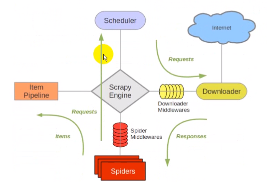


- Scrapy Engine：负责 Spider、ItemPipeline、Downloader、Scheduler 中间的通讯、信号、数据传输等。
- Scheduler（调度器）：它负责接收引擎发送过来的 Request 请求，并按照一定的方式进行整理排列，入队，当引擎需要时，交换给引擎
- Downloader：负责下载 Engine 发送的所有 Reuqest 请求，并将其获取到的 Responses 交换给 引擎，由引擎交给 Spider 来处理。
- Spider：它负责处理所有 Rsponses，从中提取数据，并将需要跟进的 URL 提交给引擎，再次进入 Scheduler
- Item Pipeline：它负责处理 Spider 中获取到的 Item，并进行后期处理（分析、过滤、存储）的地方
- Downloader Middlewares（下载中间件）：可以当做是一个可以自定义扩展下载功能的组件
- Spider Middlewares（Spider 中间件）：可以理解为是一个可以自定义扩展和操作引擎和Spider中间通信的功能组件


## 1. 安装 Scrapy

```
pip install scrapy
```


## 2. 创建 Scrapy 项目

在命令行中

```
scrapy startproject 项目名
```


**Scrapy 文件结构**

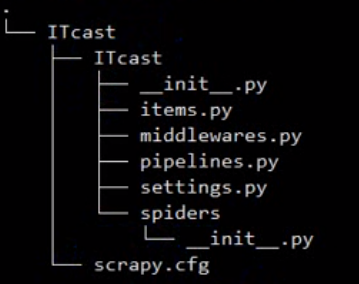


```
scrapy.cfg	用来发布项目
items.py	定义需要爬取并需要后期处理的数据
settings.py	配置 scrapy 爬虫文件，可以修改 User-Agent、爬取时间间隔、代理等
pipeline.py	用于存放执行后期数据处理的功能，从而使数据爬取和数据处理两个功能分开。
```


## 3. 生成采集模块 spider

同样在命令行中输入命令

```
scrapy genspider example example.com
```

- 参数1：爬虫名称
- 参数2：允许的域名


## 4. 制作 scrapy 爬虫

### 4.1 items.py （设定抓取目标）

```
import scrapy

class MySpiderItem(scrapy.Item):
   # name = scrapy.Field()  # 创建字段（需要获取的变量）
    
    # 自定义字段，如：
    teacher_name = scrapy.Field()
    teacher_title = scrapy.Field()
    teacher_desc = scrapy.Field()
    pass
```


### 4.2 setting.py（配置文件）

```
USER_AGENT = 'Mozilla/5.0 (Windows NT 10.0; Win64; x64) AppleWebKit/537.36 (KHTML, like Gecko) Chrome/83.0.4103.116 Safari/537.36'

# 后边的值是权限，可以设置多个管道存储方法
ITEM_PIPELINES = {
    'my_spider.pipelines.MySpiderPipeline': 300,
}  
```


还可以设置图片/文件下载位置，如： 

```
IMAGES_STORE = '/home/python/project/my_spider/photos'
```


> 还可以设置 DEFAULT_REQUEST_HEADERS ，找到默认配置，取消注释即可


### 4.3 生成爬虫文件

```
scrapy genspider 爬虫名 爬虫域
```

> 按照格式自己手写也可以


生成文件 spiders/itcast.py

```
import scrapy


class ItcastSpider(scrapy.Spider):
    name = 'itcast' # 爬虫名
    allowed_domains = ['http://www.itcast.cn'] # 允许域
    start_urls = ['http://http://www.itcast.cn/']  # 爬取URL列表

    def parse(self, response):  # 解析方法，每个初始URL完成下载后会被调用
        pass
```


简单爬取 ITCAST 页面信息（编辑 itcast.py）：

```
import scrapy
from my_spider.items import MySpiderItem

class ItcastSpider(scrapy.Spider):
    name = 'itcast'
    allowed_domains = ['itcast.cn']
    start_urls = ['http://www.itcast.cn/channel/teacher.shtml']

    def parse(self, response):
        node_list = response.xpath("//div[@class='li_txt']")

        # 创建 items 列表，用来存储所有的信息
        # items = []

        for node in node_list:

            # 创建 item 字段对象，用来存储信息
            item = MySpiderItem()
            # .extract() 将 xpath 对象转换为 Unicode 字符串
            teacher_name = node.xpath("./h3/text()").extract()
            teacher_title = node.xpath("./h4/text()").extract()
            teacher_desc = node.xpath("./p/text()").extract()

            # xpath 返回的是列表，需要提取里边的元素
            # print(teacher_name[0])
            # print(teacher_title[0])
            # print(teacher_desc[0])

            item['teacher_name'] = teacher_name[0]
            item['teacher_title'] = teacher_title[0]
            item['teacher_desc'] = teacher_desc[0]

            # 将对象添加到列表中
            # items.append(item)

            # 将获取的数据交给 piplines 处理，然后继续回来执行循环
            yield item

        # 返回 items 给引擎，不经过 piplines，可以使用 scrapy crawl -o 直接输出文件
        # return items
```


yield 解释：

https://www.bilibili.com/read/cv1442605/


### 4.4 pipelines.py（设计管道存储）

> 如果使用 pipeline 处理文件，需要在 setting 中将 pipelines 设置取消注释


默认管道文件：

```
from itemadapter import ItemAdapter

class MySpiderPipeline:
    def process_item(self, item, spider):
        return item
```


利用 pipelines 存储信息：

```
from itemadapter import ItemAdapter
import json

class MySpiderPipeline:
    def __init__(self):
        self.f = open("data.json", "w")
        
    def process_item(self, item, spider):
        # 转换 item 为字典格式，然后转换为 json 格式
        content = json.dumps(dict(item), ensure_ascii = False)
        self.f.write(content + "\n")
        
        # 如果有多个管道文件，按优先级返回给下一个管道文件
        # 如果单一管道，则将 item 返回给引擎，请求处理下一个 item
        return item
        
    def close_spider(self, spider):
        # 关闭文件
        self.f.close()
```

> 这里 \__init__(self） 也可以用 open_spider(self, spider)


### 4.5 执行 Scrapy

```
# 运行爬虫
scrapy crawl 爬虫名
```

```
# 直接生成 json 文件
scrapy crawl 爬虫名 -o data.json

# 生成 csv 文件
scrapy crawl 爬虫名 -o data.csv

# 生成 xml 文件
scrapy crawl 爬虫名 -o data.xml
```


## 5. 用 Scrapy Shell 做 Debug

```
scrapy shell "url"
```

之后就会进入类似 ipython 或 idle 的 shell，可以在 shell 中调试爬虫，如用 response.body 查看页面内容，或者 response.xpath 查看提取元素等。


```
# 查看响应体
response.body

# 查看响应头
response.headers

# 用 xpath 提取元素
response.selector.xpath()
response.xpath()

# 用 css 提取元素
response.selector.css()
response.css()

# 用正则提取
response.selector.re()
```


**start_requests()**

此方法必须返回一个可迭代的第一个请求来抓取这个爬虫。有了start_requests()，就不写了start_urls，写了也没有用。默认实现是：start_urls，但是可以复写的方法start_requests。例如，如果您需要通过使用POST请求登录来启动，您可以：

```
class MySpider(scrapy.Spider):
    name = 'myspider'

    def start_requests(self):
        return [scrapy.FormRequest("http://www.example.com/login",
                                   formdata={'user': 'john', 'pass': 'secret'},
                                   callback=self.logged_in)]

    def logged_in(self, response):
        # here you would extract links to follow and return Requests for
        # each of them, with another callback
        pass

```


## 6. 项目演练

### 6.1 爬取腾讯招聘


**1. 创建项目**

```
scrapy startproject my_spider
```


**2. 在 items.py 中定义爬取字段**

```
import scrapy

class MySpiderItem(scrapy.Item):
    title = scrapy.Field()
    location = scrapy.Field()
    category = scrapy.Field()
    date = scrapy.Field()
```


**3. 创建爬虫**

```
scrapy genspider tencent tencent.com
```


**4. 编写爬虫文件 spider\tencent.py**

```
import scrapy
from my_spider.items import MySpiderItem

class TencentSpider(scrapy.Spider):
    name = 'tencent'
    allowed_domains = ['tencenet.com']
    # start_urls = ['https://careers.tencent.com/search.html?index=1']
    base_urls = ['https://careers.tencent.com/search.html?index=']
    offset = 1
    start_urls = [base_urls + str(offset)]

    def parse(self, response):
        node_list = response.xpath('//div[@class="recruit-list"]')
        for node in node_list:
            item = MySpiderItem()
            item['title'] = node.xpath("//h4/text()").extract()[0].encode("utf-8")
            item['location'] = node.xpath('//p[@class="recruit-tips"]/span[2]/text()').extract()[0].encode("utf-8")
            item['category'] = node.xpath('//p[@class="recruit-tips"]/span[3]/text()').extract()[0].encode("utf-8")
            item['date'] = node.xpath('//p[@class="recruit-tips"]/span[4]/text()').extract()[0].encode("utf-8")

        yield item

    if self.offset < 582
    self.offset += 1
    url = self.baseURL + str(self.offset)
    yield scrapy.Request(url, callback = self.parse)
```


**5. 编写管道文件 pipelines.py**

```
import json

class MySpiderPipeline:
    def __init__(self):
        self.f = open("data.json", "w")
        
    def process_item(self, item, spider):
        content = json.dumps(dict(item), ensure_ascii = False)
        self.f.write(content + "\n")
        return item
        
    def close_spider(self, spider):
        self.f.close()
```


**6. setting.py**

```
USER_AGENT = 'Mozilla/5.0 (Windows NT 10.0; Win64; x64) AppleWebKit/537.36 (KHTML, like Gecko) Chrome/83.0.4103.116 Safari/537.36'
ITEM_PIPELINES = {
    'my_spider.pipelines.MySpiderPipeline': 300,
}  
```


**7.  运行爬虫**

```
scrapy crawl tencent
```


### 6.2 爬取斗鱼主播图片

**1. 创建项目**

```
scrapy startproject my_spider
```


**2. 定义字段 item.py**

```
import scrapy

class MySpiderItem(scrapy.Item):
    name = scrapy.Field()
    img_url = scrapy.Field()
```


**3. 创建爬虫**

```
import scrapy
import json
from my_spider.items import MySpiderItem

class DouyuSpider(scrapy.Spider):
    name = 'douyu'
    allowed_domains = ['douyucdn.cn']
    base_url = 'http://capi.douyucdn.cn/api/v1/getVerticalRoom?limit=20&offset=
    offset = 0
    start_urls = [base_url + str(offset)]

    def parse(self, response):
        data_list = json.loads(response.body)['data']
        if not len(data_list):
            return
            
        for data in data_list:
            item = MySpiderItem()
            item['name'] = data['nickname']
            item['img_url'] = data['vertical_src']
            yield item

    offset += 20
    yield scrapy.Request(self.base_url + str(self.offset), callback = self.parse)
```


**4. 创建管道**

```
import os
import scrapy
from settings import IMAGES_STORE as images_store
from scrapy.pipelines.images import ImagesPipeline

# 专门处理图片类
class MySpiderPipeline(ImagesPipeline):
    def get_media_requests(self, item, info):
        image_link = item['img_url']
        yield scrapy.Request(image_link)
        
    def item_completed(self, results, item, info):
        # print(results)
        image_path = [x["path"] for ok, x in results if ok]
        
        os.rename(images_store + image_path[0], item['name'] + '.jpg')
```


**5. 调整设置**

```
定义 IMAGES_STORE
禁用 ROBOTSTXT_OBEY = False
设置手机 USER_AGENT
开启 ITEM_PIPLINES
```


## 7. 多页处理的几种方法

```
#先获取url list，然后根据list爬取各个子页面内容
fromtutorial.items import DmozItem
 
classDmozSpider(scrapy.Spider):
    name = "dmoz"
    allowed_domains = ["dmoz.org"]
    start_urls =["http://www.dmoz.org/Computers/Programming/Languages/Python/",]
 
    def parse(self, response):
        for href in response.css("ul.directory.dir-col > li > a::attr('href')"):
#获取当前页面的url：respone.url
#通过拼接response.url和href.extract()，将相对网址转换为绝对网址
            url =response.urljoin(response.url, href.extract())
            yield scrapy.Request(url, callback=self.parse_dir_contents)
 
         #负责子页面内容的爬取
    def parse_dir_contents(self, response):
        for sel in response.xpath('//ul/li'):
            item = DmozItem()
            item['title'] =sel.xpath('a/text()').extract()
            item['link'] = sel.xpath('a/@href').extract()
            item['desc'] =sel.xpath('text()').extract()
            yield item
```


```
import scrapy
from my_spider.items import MySpiderItem

class TencentSpider(scrapy.Spider):
    name = 'tencent'
    allowed_domains = ['tencenet.com']
    # start_urls = ['https://careers.tencent.com/search.html?index=1']
    base_urls = ['https://careers.tencent.com/search.html?index=']
    offset = 1
    start_urls = [base_urls + str(offset)]

    def parse(self, response):
        node_list = response.xpath('//div[@class="recruit-list"]')
        for node in node_list:
            item = MySpiderItem()
            item['title'] = node.xpath("//h4/text()").extract()[0].encode("utf-8")
            item['location'] = node.xpath('//p[@class="recruit-tips"]/span[2]/text()').extract()[0].encode("utf-8")
            item['category'] = node.xpath('//p[@class="recruit-tips"]/span[3]/text()').extract()[0].encode("utf-8")
            item['date'] = node.xpath('//p[@class="recruit-tips"]/span[4]/text()').extract()[0].encode("utf-8")

        yield item

    if not len(response.xpath('//a[@class="noactive" and @id="next"]')):
        response.xpath('//a[@id="next"]/@href').extract()[0])
        yield.scrapy.Request("http://hr.tecncent.com/" + url, callback = self.parse)
```


```
# coding=utf-8
__author__ = 'Jeffee Chen'

from scrapy.contrib.spiders import CrawlSpider, Rule
from douban.items import DoubanItem
from scrapy.contrib.linkextractors.sgml import SgmlLinkExtractor

class GroupSpider(CrawlSpider):
    name = "Douban"
    allowed_domains = ["douban.com"]
    start_urls = ["http://www.douban.com/group/explore?tag=%E7%A4%BE%E7%A7%91"]

    rules = [
        Rule(SgmlLinkExtractor(allow=(r'/group/explore\?start=.*', )), callback='parse_next_page'),
    ]

    def parse_next_page(self, response):
        item = DoubanItem()
        sel = response.xpath("//div[@class='group-list']/div[@class='result']")
        for s in sel:
            info = s.xpath("div/div/h3/a/text()").extract()
            item["groupName"] = info
            yield item
```


# 十、Selenium 模拟浏览器爬取

文档：https://selenium-python.readthedocs.io/


## 1. 初始化

需要安装浏览器驱动模块

https://chromedriver.chromium.org/downloads


将 chromdriver.exe 放到 python/scripts 文件夹中，并设置好环境变量


初始化语句：

```
from selenium import webdriver
wd = webdriver.Chrome(r'd:\chromedriver.exe')  # 如果设置好环境变量则无需路径
```


打开网页：

```
wd.get('http://www.forece.net')  # 也可以直接加本地路径
```


## 2. Selenium 选择元素


根据id选择元素，返回的就是该元素对应的WebElement对象

```
element = wd.find_element_by_id('kw')
```


根据class选择元素

```
element = wd.find_elements_by_class_name('animal')  # 选择多个class元素，返回元素列表
element = wd.find_element_by_class_name('animal')  # 只选择第一个class元素
```


根据tag选择元素

```
element = wd.find_elements_by_tag_name('span')  # 返回元素列表
```


获取元素属性

```
element = wd.find_element_by_id('1')  # 找到ID为1的元素，第一个搜索结果
pring(element.get_attribute('srcid'))  # 在ID为1的元素中获取srcid属性值
```


获取代码段 HTML

```
element = wd.find_element_by_id('1')
html = element.get_attribute('outerHTML')  # 获取包括id为1代码段所有html
html = element.get_attribute('innerHTML')  # 获取id为1代码段内部html
```


从 element 中找元素

```
element = wd.find_element_by_id('container')
# 限制 选择元素的范围是 id 为 container 元素的内部。
spans = element.find_elements_by_tag_name('span')
for span in spans:
    print(span.text)
```


获取输入框里边的文字

```
element = wd.find_element_by_id("input1")
print(element.get_attribute('value')) # 获取输入框中的文本
```


## 3. CSS 选择元素

CSS Selector 同样可以根据tag名、id 属性和 class属性 来 选择元素

```
find_element_by_css_selector(CSS Selector 参数)  # 单个CSS元素
find_elements_by_css_selector(CSS Selector 参数)  # 所有CSS元素
```


按 class 寻找

```
element = wd.find_element_by_css_selector('.plant')
print(element.get_attribute('innerHTML'))
```

选择 class 为 plant 的第一个元素，注意str要符合css写法，如果去掉.plant则是按Tag寻找为<plant>的元素


按 Tag 寻找

```
elements = wd.find_elements_by_css_selector('div')

# 效果与下方代码是一样的
elements = wd.find_elements_by_tag_name('div')
```


按 ID 寻找

```
element = wd.find_element_by_css_selector('#searchtext')
```

> 根据id属性 选择元素的语法是在id号前面加上一个井号： #id值


按子元素寻找：

```
元素1 > 元素2  # 表示按元素1是父元素，元素2是子元素的规则来寻找
```

```
<div id='container'><div class='animal'><div>小动物</div></div></div>
element = wd.find_element_by_css_selector('#container > .animal > div')
print(element.text)
```

> 必须按照第一层的ID为container，第二层class为animal，第三层标签是div的顺序的元素


```
元素1 元素2  # 表示按元素1是祖元素，元素2是子元素的规则来寻找，中间可以隔代
```

```
<div id='container'><div class='animal'><span>小动物</span></div></div>
element = wd.find_element_by_css_selector('#container span')
print(element.text)
```


相邻兄弟标签选择：

```
element = wd.find_element_by_css_selector('#.footer1+.footer2')

选择同级标签后h3后边所有的span标签元素
element = wd.find_element_by_css_selector('h3~span')
```


按元素属性值寻找：

```
<a href="http://www.miitbeian.gov.cn">苏ICP备88885574号</a>
element = wd.find_element_by_css_selector('[href="http://www.miitbeian.gov.cn"]')
print(element.get_attribute('innerHTML'))

# 选择a标签属性中包含部分字符
r = wd.find_element_by_css_selector('a[href*="city"]')

# 选择a标签属性中以xx字符开头
r = wd.find_element_by_css_selector('a[href^="city"]')

# 选择a标签属性中以xx字符结尾
r = wd.find_element_by_css_selector('a[href$="city"]')
```


获取a标签内属性：链接

```
<a href="http://www.miitbeian.gov.cn">苏ICP备88885574号</a>
element = wd.find_element_by_css_selector('a')
print(element.get_attribute('href'))
```


混合使用：

```
element = wd.find_element_by_css_selector('div > #container .plant[href]')
```


多个条件选择（类似或运算）

```
element = wd.find_elements_by_css_selector('.plant, .animal')
element = wd.find_elements_by_css_selector('#t1>span, #t1>p')
```


按照次序选择

```
选择t1下第二个标签元素
element = wd.find_elements_by_css_selector('t1 > :nth-child(2)')

选择倒数第二个span标签元素
element = wd.find_elements_by_css_selector('span:nth-last-child(2)')

父元素中第一个出现span类型的元素
element = wd.find_elements_by_css_selector('span:nth-of-type(1)')

父元素中倒数第一个出现span类型的元素
element = wd.find_elements_by_css_selector('span:nth-of-type(1)')
```

> 区别：nth-child 代表第几个节点，而 nth-of-type 代表的第几个类型的节点。


奇数偶数节点

```
element = wd.find_elements_by_css_selector(':nth-child(odd)')
element = wd.find_elements_by_css_selector(':nth-child(even)')

选择带p标签的奇数或偶数元素
element = wd.find_elements_by_css_selector('p:nth-of-type(odd)')
element = wd.find_elements_by_css_selector('p:nth-of-type(even)')
```


按XPATH选择

```
# 先寻找id是china的元素
china = wd.find_element_by_id('china')

# 再选择该元素内部的p元素
# 要在某个元素内部使用xpath选择元素， 需要 在xpath表达式最前面加个点
elements = china.find_elements_by_xpath('.//p')

# 打印结果
for element in elements:
    print('----------------')
    print(element.get_attribute('outerHTML'))
```


## 4. Selenium 动作

获取输入框里边的文字

```
element = wd.find_element_by_id("input1")
print(element.get_attribute('value')) # 获取输入框中的文本
```


输入字符串到输入框里

```
element.send_keys('Forece\n')
```


点击按钮

```
element.click()
```


输出 element 中元素的文本内容

```
print(element.text)
```


获取元素文本内容2

通过WebElement对象的 text 属性，可以获取元素 展示在界面上的 文本内容。

但是，有时候，元素的文本内容没有展示在界面上，或者没有完全完全展示在界面上。 这时，用WebElement对象的text属性，获取文本内容，就会有问题。

出现这种情况，可以尝试使用 element.get_attribute('innerText') ，或者 element.get_attribute('textContent')


切换窗口

```
# 切换 iframe
<iframe src="sample1.html" id="frame1" name="innerFrame" width="300" height="200"></iframe>

# 切换可以用id
wd.switch_to.frame('frame1')
# 也可以用name
wd.switch_to.frame('innerFrame')
# 嵌套使用
element = wd.switch_to.frame(wd.find_elements_by_css_selector('iframe[src="sample1.html]'))

# 切换回默认页面
wd.switch_to.default_content()
```


切换 Windows

```
# 循环获取所有windowsd的句柄

for handle in wd.window_handles:
    # 先切换到该窗口
    wd.switch_to.window(handle)
    # 得到该窗口的标题栏字符串，判断是不是我们要操作的那个窗口
    if 'Bing' in wd.title:
        # 如果是，那么这时候WebDriver对象就是对应的该该窗口，正好，跳出循环，
        break
```


```
# 获取当前窗口句柄
mainWindow = wd.current_window_handle

#通过前面保存的老窗口的句柄，自己切换到老窗口
wd.switch_to.window(mainWindow)
```


**单选 Radio 框**

```
<div id="s_radio">
  <input type="radio" name="teacher" value="小江老师">小江老师<br>
  <input type="radio" name="teacher" value="小雷老师">小雷老师<br>
  <input type="radio" name="teacher" value="小凯老师" checked="checked">小凯老师
</div>
```

```
# 获取当前选中的元素
element = wd.find_element_by_css_selector(
  '#s_radio input[checked=checked]')
print('当前选中的是: ' + element.get_attribute('value'))

# 点选 小雷老师
wd.find_element_by_css_selector(
  '#s_radio input[value="小雷老师"]').click()
```


**checkbox 框**

```
<div id="s_checkbox">
  <input type="checkbox" name="teacher" value="小江老师">小江老师<br>
  <input type="checkbox" name="teacher" value="小雷老师">小雷老师<br>
  <input type="checkbox" name="teacher" value="小凯老师" checked="checked">小凯老师
</div>
```

```
# 先把 已经选中的选项全部点击一下
elements = wd.find_elements_by_css_selector(
  '#s_checkbox input[checked="checked"]')

for element in elements:
    element.click()

# 再点击 小雷老师
wd.find_element_by_css_selector(
  "#s_checkbox input[value='小雷老师']").click()
```


**select框**

```
# 导入Select类
from selenium.webdriver.support.ui import Select

# 创建Select对象
select = Select(wd.find_element_by_id("ss_single"))

# 通过 Select 对象选中小雷老师
select.select_by_visible_text("小雷老师")
```

```
<option value="foo">Bar</option>
```

```
# 根据 value 选择
s.select_by_value('foo')

# 根据内容文本选择
s.select_by_visible_text('Bar')

# 根据次序选择，从1开始
s.select_by_index('1')

# 根据选项的value属性值， 去除 选中元素
deselect_by_value('foo')

# 根据选项的次序，去除 选中元素
deselect_by_index('1')

# 根据选项的可见文本，去除 选中元素
deselect_by_visible_text('Bar')

# 去除 选中所有元素
deselect_all()
```


使用 ActionChains 来 模拟鼠标移动 操作的代码如下：

```
from selenium import webdriver

driver = webdriver.Chrome(r'f:\chromedriver.exe')
driver.implicitly_wait(5)

driver.get('https://www.baidu.com/')

from selenium.webdriver.common.action_chains import ActionChains

ac = ActionChains(driver)

# 鼠标移动到 元素上
ac.move_to_element(
    driver.find_element_by_css_selector('[name="tj_briicon"]')
).perform()
```


直接执行 javascript，里面可以直接用return返回我们需要的数据

```
nextPageButtonDisabled = driver.execute_script(
    '''
    ele = document.querySelector('.soupager > button:last-of-type');
    return ele.getAttribute('disabled')
    ''')

# 返回的数据转化为Python中的数据对象进行后续处理
if nextPageButtonDisabled == 'disabled': # 是最后一页
    return True
else: # 不是最后一页
    return False
```


冻结 Chrome 界面

```
setTimeout(function(){debugger}, 5000)
```


JS对话框操作

```
from selenium import webdriver
driver = webdriver.Chrome()
driver.implicitly_wait(5)
driver.get('http://cdn1.python3.vip/files/selenium/test4.html')


# --- alert ---
driver.find_element_by_id('b1').click()

# 打印 弹出框 提示信息
print(driver.switch_to.alert.text) 

# 点击 OK 按钮
driver.switch_to.alert.accept()

# 取消操作
driver.switch_to.alert.dismiss()

# 输入信息，并且点击 OK 按钮 提交
alert.send_keys('web自动化 - selenium')
alert.accept()
```


获取窗口属性

```
# 获取窗口大小
driver.get_window_size()
# 改变窗口大小
driver.set_window_size(x, y)
# 获取当前窗口标题
driver.title
# 获取当前窗口URL地址
driver.current_url
```


截屏

```
from selenium import  webdriver

driver = webdriver.Chrome()
driver.implicitly_wait(5)

# 打开网站
driver.get('https://www.baidu.com/')

# 截屏保存为图片文件
driver.get_screenshot_as_file('1.png')
```


上传文件

```
# 先定位到上传文件的 input 元素
ele = wd.find_element_by_css_selector('input[type=file]')

# 再调用 WebElement 对象的 send_keys 方法
ele.send_keys(r'h:\g02.png')

ele = wd.find_element_by_css_selector('input[type=file]')
ele.send_keys(r'h:\g01.png')
ele.send_keys(r'h:\g02.png')
```


手机模式

```
from selenium import webdriver

mobile_emulation = { "deviceName": "Nexus 5" }

chrome_options = webdriver.ChromeOptions()

chrome_options.add_experimental_option("mobileEmulation", mobile_emulation)

driver = webdriver.Chrome( desired_capabilities = chrome_options.to_capabilities())

driver.get('http://www.baidu.com')

input()
driver.quit()
```


使用代理

```
from selenium import webdriver
from selenium.webdriver.common.proxy import Proxy, ProxyType

prox = Proxy()
prox.proxy_type = ProxyType.MANUAL
prox.http_proxy = "127.0.0.1:10800"
prox.ssl_proxy = "127.0.0.1:10800"
# prox.socks_proxy = "127.0.0.1:10800"

capabilities = webdriver.DesiredCapabilities.CHROME
prox.add_to_capabilities(capabilities)

driver = webdriver.Chrome(desired_capabilities=capabilities)

driver.get('https://youtube.com')

input()
```


设置响应时间

```
from selenium import webdriver
wd = webdriver.Chrome()

# 设置最大等待时长为 10秒
wd.implicitly_wait(10)

wd.get('https://www.baidu.com')
element = wd.find_element_by_id('kw')
element.send_keys('黑羽魔巫宗\n')
element = wd.find_element_by_id('1')
print (element.text)
```

>那么后续所有的 find_element 或者 find_elements 之类的方法调用 都会采用上面的策略：
>
>如果找不到元素， 每隔 半秒钟 再去界面上查看一次， 直到找到该元素， 或者 过了10秒 最大时长。


关闭浏览器

```
wd.quit()
```


## 5. 不打开浏览器实体方法

```
from selenium import webdriver
from selenium.webdriver.chrome.options import Options
chrome_options = Options()
chrome_options.add_argument('--headless')
chrome_options.add_argument('--disable-gpu')
driver = webdriver.Chrome(options=chrome_options)
driver.get("http://cdn1.python3.vip/files/selenium/sample1.html")

elements = driver.find_elements_by_class_name('animal')
print(elements[1].text)
```


```
#selenium:3.12.0
#webdriver:2.38
#chrome.exe: 65.0.3325.181（正式版本） （32 位）

from selenium import webdriver
from selenium.webdriver.chrome.options import Options
chrome_options = Options()
chrome_options.add_argument('window-size=1920x3000') #指定浏览器分辨率
chrome_options.add_argument('--disable-gpu') #谷歌文档提到需要加上这个属性来规避bug
chrome_options.add_argument('--hide-scrollbars') #隐藏滚动条, 应对一些特殊页面
chrome_options.add_argument('blink-settings=imagesEnabled=false') #不加载图片, 提升速度
chrome_options.add_argument('--headless') #浏览器不提供可视化页面. linux下如果系统不支持可视化不加这条会启动失败
chrome_options.binary_location = r"C:\Program Files (x86)\Google\Chrome\Application\chrome.exe" #手动指定使用的浏览器位置


driver=webdriver.Chrome(chrome_options=chrome_options)
driver.get('https://www.baidu.com')

print('hao123' in driver.page_source)


driver.close() #切记关闭浏览器，回收资源
```


```
from selenium import webdriver
from selenium.webdriver.chrome.options import Options

options = Options()
# 设置为无头模式参数
options.add_argument("--headless")
driver = webdriver.Chrome(options=options)

driver.implicitly_wait(10)

driver.get('http://www.ahtba.org.cn/Category/Detail?id=568')

eles = driver.find_elements_by_css_selector('#night_7460 li a')
for ele in eles:
    print(ele.text)
```


# 十一、数据库写入

## 1. pymysql

```
import pymysql
conn = pymysql.connect(host='localhost', usre='root', password='123456', port=3306, db='mysql')

# 创建对象
cursor = conn.cursor()

# 执行SQL语句
cursor.execute('select * from db')

# 输出
print(cursor.fetchone())
```

 

##  2. pymongo

```
import pymongo

# 创建连接
client = pymongo.MongoClinet('localhost')
db = client['newtestdb']
db['table'].insert(('name':'Bob'))
db['table'].find_one(('name'):'Bob')
```


## 3. redis

```
import redis
r = redis.Redis('localhost', 6379)
r.set('name', 'Bob')
r.get('name')
```


# 十二、验证码识别

网站多次发送请求就会出现验证码，可以自己用人工智能自己训练识别，也可以使用网上一些平台提供第三方服务接口。

- 云打码
- 超级鹰
- 打码兔


以超级鹰为例：

1. 生成软件ID
2. 下载 Python Demo 包
3. 引入库


```
import 库文件
chaojiying = Chaojiying_Client('username', 'password', '96001')  # 平台用户信息
im = open('img_file', 'rb').read()  # 打开下载的验证码
print chaojiying.PostPic(im, 2004)  # 验证码类型
```


