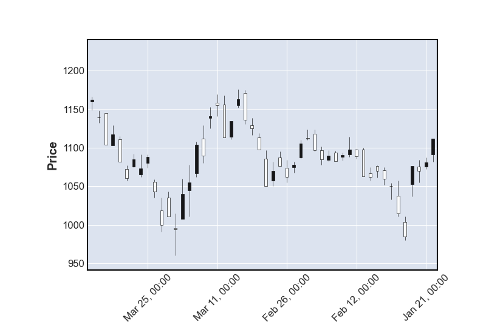
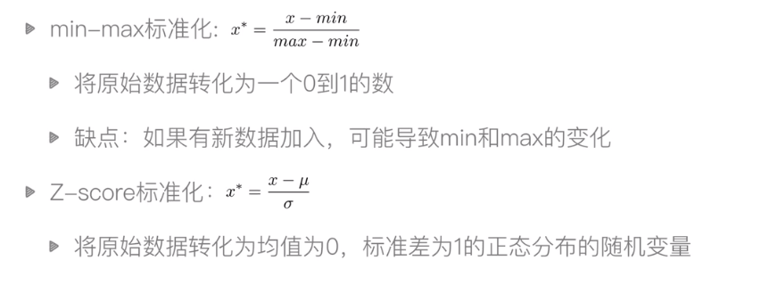

# 一、获取股票数据

## 1. Tushare 获取国内股票数据 

Tushare是一个免费、开源的python财经数据接口包。主要提供国内股票的数据。可以方便的转换成我们所需要的格式，一般是 CSV 格式。通过 Tushare 读取数据保存为 panda 的 DataFrame 格式，并存入csv文件

```
import pandas as pd
import tushare as ts 
from pandas import DataFrame
 
# 读取ts数据
df = ts.get_hist_data('000875')

# 写入csv
df.to_csv('sh600519.csv')
```


参数说明：

- **code**：股票代码，即6位数字代码，或者指数代码（sh=上证指数 sz=深圳成指 hs300=沪深300指数 sz50=上证50 zxb=中小板 cyb=创业板）
- **start**：开始日期，格式YYYY-MM-DD
- **end**：结束日期，格式YYYY-MM-DD
- **ktype**：数据类型，D=日k线 W=周 M=月 5=5分钟 15=15分钟 30=30分钟 60=60分钟，默认为D
- **retry_count**：当网络异常后重试次数，默认为3
- **pause**:重试时停顿秒数，默认为0


获取指定时间段股票数据

```
ts.get_hist_data('600848',start='2015-01-05',end='2015-01-09')
```


获取周K线图

```
ts.get_hist_data('600848', ktype='W') #获取周k线数据
```


**TUSHARE 新版 PRO 接口**

日线行情：

```python
pro = ts.pro_api()
df = pro.daily(ts_code='000001.SZ', start_date='20180701', end_date='20180718')

#多个股票
df = pro.daily(ts_code='000001.SZ,600000.SH', start_date='20180701', end_date='20180718')
```


周线行情：

```python
pro = ts.pro_api()
df = pro.weekly(ts_code='000001.SZ', start_date='20180101', end_date='20181101', fields='ts_code,trade_date,open,high,low,close,vol,amount')
```


**输入参数**

| 名称       | 类型 | 必选 | 描述                                       |
| :--------- | :--- | :--- | :----------------------------------------- |
| ts_code    | str  | N    | 股票代码（支持多个股票同时提取，逗号分隔） |
| trade_date | str  | N    | 交易日期（YYYYMMDD）                       |
| start_date | str  | N    | 开始日期(YYYYMMDD)                         |
| end_date   | str  | N    | 结束日期(YYYYMMDD)                         |


# 二、绘制K线图

需要引入 `matplotlib.finance` ，现在已经分离出来单独一个模块 `mpl_finance`，然而这个模块没多久又被弃用了，现在安装 `mplfinance`，更加的方便。


安装 mplfinance

```
pip install mplfinance
```


引入 mplfinance

```
import mplfinance
```


最基本绘图方法

```
 mpf.plot(data)
```


这个 data 是一个 Pandas DataFrame 数据对象，这个对象需要包含 OHLC 数据（ Open、High、Low、Close ）如：

| Open       | High    | Low     | Close   | Volume  |           |
| :--------- | :------ | :------ | :------ | :------ | :-------- |
| Date       |         |         |         |         |           |
| 2019-11-01 | 3050.72 | 3066.95 | 3050.72 | 3066.91 | 510301237 |
| 2019-11-04 | 3078.96 | 3085.20 | 3074.87 | 3078.27 | 524848878 |
| 2019-11-05 | 3080.80 | 3083.95 | 3072.15 | 3074.62 | 585634570 |

```
import mplfinance as mpf
import pandas as pd

# 读取股票csv文件、设置date列为时间对象、将date列作为索引、用花式索引提取指定列
df = pd.read_csv('600519.csv', parse_dates=['date'], index_col='date')[['open','close','high','low']]

# 绘制蜡烛图
mpf.plot(df, type='candle')
```




股票的绘制图形种类除了蜡烛图，也有很多其他种类的 type

| 参数   | 图形种类           |
| ------ | ------------------ |
| ohlc   | 条形图（默认图形） |
| candle | 蜡烛图             |
| line   | 折线图             |
| renko  | 砖型图             |
| pnf    | OX图               |


除了绘制普通的K线图，还可以添加均线参数 mav

```
mpf.plot(df, type='candle', mav=(5))
```

> mav 需要是一个整型数据，元组数据可以绘制多条均线，如 mav=(3,6,9)


还可以添加 volume 交易量

```
mpf.plot(daily,type='candle',mav=(3,6,9),volume=True)
```


默认图形只显示交易日图形，非交易日图形会被自动隐藏，如果需要打开，则需要把参数 show_nontrading 打开

```
mpf.plot(daily,type='candle',mav=(3,6,9),volume=True,show_nontrading=True)
```


# 三、量化交易策略

## 1. 基础策略

**查看跳高Gap**

读取每日上涨3%的日期，相当于收盘价要比开盘价的价格高3%

```
import pandas as pd

# 读取股票csv文件、设置date列为时间对象、将date列作为索引、用花式索引提取指定列
df = pd.read_csv('600519.csv', parse_dates=['date'], index_col='date')[['open','close','high','low','volume']]


# 定制策略
def is_over_target(df, percentage):
    target = (df['close'] - df['open'] / df['open']) >= percentage  # 获得一个布尔型df
    return df[target]  # 用布尔型df做索引，提取匹配为 True 的元素

print(is_over_target(df, 0.03))


# 也可以直接一行完成
# print(df[(df['close'] - df['open'] / df['open']) >= 0.03])
```


**查看跳空Gap**

读取当日开盘比前日收盘跌幅超过2%的日期

需要使用 shift 函数，shift 函数可以将整列数据下移n行或上移n行。只需要将收盘价下移一行就可以进行行内计算了。

```
print(df[(df['open'] - df['close'].shift(1) / df['close'].shift(1)) <= -0.02])
```


**初级量化交易 traceback**

2019年1月1日开始，每月第一个交易日买入1手股票，当年最后一个交易日卖出所有股票，到今天为止，计算收益。

```
import pandas as pd

# 读取股票csv文件、设置date列为时间对象、将date列作为索引、用花式索引提取指定列
df = pd.read_csv('600519.csv', parse_dates=['date'], index_col='date')[['open','close','high','low','volume']]

# 取出2019年数据
df = df['2019-12':'2019-01']

# 取2019年每月第一天的 value
df_monthly = df.resample('MS').first()

# 取2019年最后一天的 value
df_yearly = df.resample('A').last()

# 计算每月第一天买入一手的总成本
# 每月第一天的价格累积 * 股数
cost = df_monthly['open'].sum() * 100

# 计算总股数
share = len(df_monthly) * 100

# 总价值 - 总成本 = 盈利
print(df_yearly['open'][0]*share - cost)

```


## 2. 双均线策略

计算5日均线、30日均线，初始资金 100,000 元，当金叉出现（5日均线击穿30日均线）极限购买股票。死叉出现时，卖出所有股票。计算1年的收益。

```
import numpy as np
import pandas as pd
import mplfinance as mpf

df = pd.read_csv('600519.csv', parse_dates=['date'], index_col='date')[['open','close','high','low','volume']].sort_index(ascending='False')

# 创建空列
df['ma5'] = np.nan
df['ma30'] = np.nan

# 用循环来做5日均线，30日均线
# for i in range(4, len(df)):
#     # df.loc 按照标签取值，花式索引取时间为行，ma5为列的值。然后将第一天到第5天的平均值给它
#     df.loc[df.index[i],'ma5'] = df['close'][i-4:i+1].mean()
# for i in range(29, len(df)):
#     df.loc[df.index[i], 'ma30'] = df['close'][i - 29:i + 1].mean()


# 用 rolling 做均线（一次选取5个元素，然后+1迭代再次选择5个元素）
df['ma5'] = df['close'].rolling(5).mean()
df['ma30'] = df['close'].rolling(30).mean()

# 将含有缺省值NaN行删除
df = df.dropna()

# 提取日期验证策略
df = df['2019-01-01':'2019-12-31']

# 用循环判断金叉、死叉
# 因为要和前一个数据比，如果起始值是0的话，i[0] 和 i[-1] 比就变成了最后一行数据了，所以起始值要从1开始
# golden_cross = []
# death_cross = []
# for i in range(1,len(df)):
#     if df['ma5'][i] >= df['ma30'][i] and df['ma5'][i-1] <= df['ma30'][i-1]:
#         golden_cross.append(df.index[i])
#     if df['ma5'][i] <= df['ma30'][i] and df['ma5'][i-1] >= df['ma30'][i-1]:
#         death_cross.append(df.index[i])


# 用 shift 算法
# 当 Shift 一位后同是F的就是金叉，同是T的就是死叉
# TTTTFFFFTTTTFFFF
#  FFFFTTTTFFFFTTT
golden_cross = []
death_cross = []
sr1 = df['ma5'] < df['ma30']
sr2 = df['ma5'] > df['ma30']

death_cross = df[sr1 & sr2.shift(1)].index
golden_cross = df[~(sr1 | sr2.shift(1))].index

# print(death_cross)
# print(golden_cross)


# 自动交易
initial_money = 100000
money = initial_money
hold = 0

sr1 = pd.Series(1, index=golden_cross)
sr2 = pd.Series(0, index=death_cross)
sr = sr1.append(sr2).sort_index()

for i in range(0, len(sr)):
    p = df['open'][sr.index[i]]
    if sr.iloc[i] == 1:
        buy = money // (100 * p)
        hold += buy * 100
        money -= money - buy * 100 * p
    else:
        money += hold * p
        hold = 0

# 最后一天清仓
p = df['open'][-1]
now = hold * p + money
print(now - initial_money)


# 用 mav 函数画均线
# mpf.plot(df,type='candle',mav=(5,30))
```


## 3. 黎明之星

```
import numpy as np
import pandas as pd
import mplfinance as mpf

df = pd.read_csv('600519.csv', parse_dates=['date'], index_col='date')[['open','close','high','low','volume']].sort_index(ascending='False')
close = df.close
open = df.open

# 收盘价 - 开盘价
clop = close - open

shape = [0,0,0]
lag1clop = clop.shift(1)
lag2clop = clop.shift(2)

for i in range(3, len(clop), 1):
    print('lag1 is {}'.format(str(lag1clop[i])))
    print('lag2 is {}'.format(str(lag2clop[i])))
    if all([lag2clop[i]<-11, abs(lag1clop[i])<2, clop[i]>6, abs(clop[i])> abs(lag2clop[i]*0.5)]):
        shape.append(1)
    else:
        shape.append(0)

```


# 四、聚宽

JoinQuant（聚宽）量化交易平台是为量化爱好者、宽客量身打造的云平台，我们免费为您提供高质量数据、强大的研究平台、顶级回测体验、顶尖模拟交易、量化交流社区，便于您快速实现自己的交易思想。


API手册：https://www.joinquant.com/help/api/help?name=api


## 1. 平台API使用

在聚宽平台中，可以制定自己的策略，当新用户注册后，策略仓库会自带一些策略，并且每行都有注释。


**量化交易的基本框架**

制定自己的策略只需要定义两个函数。初始化函数和执行函数。


- 写法一（老版本）

  ```
    def initialize(context):
        这里是用来写初始化代码的地方
  
    def handle_data(context,data):
        这里是用来写周期循环代码的地方
  ```

- 写法二（推荐使用新版本）

  ```
    def initialize(context):
        run_daily(period,time='every_bar')
        这里是用来写初始化代码的地方
  
    def period(context):
        这里是用来写周期循环代码的地方
  ```


### 1.1 初始化函数

初始化函数中一般用来定义一些股票的基本信息，比如说需要设定需要操作的股票、定义交易税、基准值等等。定义初始化函数的名字和参数都是固定的。

#### 1.1.1 **定义初始化函数**

```
def initialize(context):
	# 初始化代码
```

> 初始化方法，在整个回测、模拟实盘中最开始执行一次，用于初始一些全局变量

> **参数**: [Context](https://www.joinquant.com/help/api/help?name=api#Context) 对象, 存放有当前的账户/股票持仓信息


#### **1.1.2 股票信息变量**

g.security 可以看做是一个全局变量，用来存储股票信息。

- 单只股票直接用股票代码赋值
- 多只股票用列表存储


```
# 选定交易的股票为平安银行
g.security = '000001.XSHE'
```


```
# 选定交易的股票为平安银行和茅台
g.security = ['000001.XSHE','600519.XSHG']
```


#### **1.1.3 获取指数成份股**

get_index_stocks() 函数可以快速的创建自己的股票池

```
g.security = get_index_stocks('000300.XSHG')
```


#### 1.1.4 前复权与真实价格

- **传统前复权回测模式：**当股票发生拆分，合并或者分红时，股票价格会受到影响，为了保证价格的连续性, 我们使用前复权来处理之前的股票价格，给您的所有股票价格已经是前复权的价格。
- **真实价格（动态复权）回测模式：**当股票发生拆分，合并或者分红时，会按照历史情况，对账户进行处理，会在账户账户中增加现金或持股数量发生变化，并会有日志提示。


因为股票的拆分、合并、分红等等一系列动作，对股价产生了影响。而用这样的数据进行回测会不准确，所以一般会在初始化中开启真实价格回测功能。

```
 set_option('use_real_price', True)
```


#### 1.1.5 设置基准收益

基准收益是与自定义策略的一个比较参考。默认选定了沪深300指数的每日价格作为判断策略好坏和一系列风险值计算的基准，也可以使用set_benchmark指定其他股票/指数/ETF/自定义组合的价格作为基准。

```
set_benchmark(security)
```

> 如果在期货策略中不希望看到基准，可以这样设置：set_benchmark({"000001.XSHG":0})，策略可以正常运行 （但无法计算alpha等收益）。


**参数**

- security:股票/指数/ETF代码，或者一个dict，key为股票/指数/ETF代码，value为小于1的浮点数，代表对应标的的权重，权重之和必须小于等于1（小于1代表基准中部分资金闲置）。


示例：

```
set_benchmark('600000.XSHG')
```


#### 1.1.6 设置佣金/印花税

指定每笔交易要收取的手续费, 系统会根据用户指定的费率计算每笔交易的手续费

```
set_order_cost(cost, type, ref=None)
```


**参数**

- cost: OrderCost 对象
- open_tax，买入时印花税 (只股票类标的收取，基金与期货不收)
- close_tax，卖出时印花税 (只股票类标的收取，基金与期货不收)
- open_commission，买入时佣金，申购场外基金的手续费
- close_commission, 卖出时佣金，赎回场外基金的手续费
- close_today_commission, 平今仓佣金
- min_commission, 最低佣金，不包含印花税
- type: 股票、场内基金、场内交易的货币基金、分级A基金、分级B基金、分级母基金、金融期货、期货、债券基金、股票基金、QDII 基金、场外交易的货币基金、混合基金、场外基金，'stock'/ 'fund' / 'mmf' /'fja'/'fjb'/ 'fjm'/ 'index_futures' / 'futures' / 'bond_fund' / 'stock_fund' / 'QDII_fund' / 'money_market_fund' / ‘mixture_fund' / 'open_fund'


```
# 股票类每笔交易时的手续费是：买入时佣金万分之三，卖出时佣金万分之三加千分之一印花税, 每笔交易佣金最低扣5块钱
set_order_cost(OrderCost(open_tax=0, close_tax=0.001, open_commission=0.0003, close_commission=0.0003, close_today_commission=0, min_commission=5), type='stock')
```


#### **1.1.7 定时运行策略**

指定每月, 每周或者每天要运行的函数, 可以在具体每月/周的第几个交易日(或者倒数第几天)的某一分钟执行。

```python
run_daily(func1, time='every_bar')      
# 11:00定时运行        
run_daily(func2, time='11:00')     
# 14:00定时运行        
run_daily(func3, time='14:00')  
```


| 参数               | 解释                                                         |
| :----------------- | :----------------------------------------------------------- |
| func               | 一个自定义的函数, 此函数必须接受context参数;例如自定义函数名market_open(context) |
| force              | run_weekly和run_monthly中使用，**run_daily不可使用**；表示若注册回调函数的时间晚于第一次回调的执行时间是否就近执行；默认为True，**建议使用False** |
| monthday           | 每月的第几个交易日, 可以是负数, 表示倒数第几个交易日。force=True开始策略的那个月会运行的，开始这个月第几个交易日不是从当月第一天开始算的，而是从开始运行当天开始算的（举例说明：假设您策略是3月20号开始运行的，3月1号和3月20都是交易日，系统会认为3月20是3月的第一个交易日，4月不会受影响的）。如果超出每月总交易日个数，则取临近的交易日执行。force=False,若注册回调函数的时间晚于第一次回调的执行时间不会就近执行。（具体见下方注意中的示例） |
| weekday            | 每周的第几个交易日, 可以是负数, 表示倒数第几个交易日。force=True如果超出每周总交易日个数，则取临近的交易日执行；force=False,若注册回调函数的时间晚于第一次回调的执行时间不会就近执行。（具体见下方注意中的示例） |
| time               | 具体执行时间,一个字符串格式的时间,有两种方式：(1) 24小时内的任意时间，例如"10:00", "01:00"；在tick频率的策略中，可以精确到秒(2)time="every_bar",只能在 run_daily 中调用,运行时间和您设置的频率一致，按天会在交易日的开盘时调用一次，按分钟会在交易时间每分钟运行。 |
| reference_security | 时间的参照标的代码，字符串类型，默认为‘000001.XSHG’。 如参照 '000001.XSHG'，交易时间为 9:30-15:00；如参照'IF9999.CCFX'，2016-01-01之后的交易时间为 9:30-15:00，在此之前为 9:15-15:15；如参照'A9999.XDCE'，因为有夜盘，因此开始时间为21:00，结束时间为15:00。期货策略一定要修改参考标的，建议修改为对应的主力合约。 |


#### 1.1.8 简单的一个初始化函数

```
def initialize(context):
    # 设定单只股票
    # g.securtiy = '601318.XSHG'

    # 使用真实价格
    set_option('use_real_price', True)

    # 设置基准收益
    set_bechmark('000300.XSHG')

    # 设置手续费（佣金）
    # 股票类每笔交易时的手续费是：买入时佣金万分之三，卖出时佣金万分之三加千分之一印花税, 每笔交易佣金最低扣5块钱
    set_order_cost(OrderCost(open_tax=0, close_tax=0.001, open_commission=0.0003, close_commission=0.0003, close_today_commission=0, min_commission=5), type='stock')
```


### 1.2 策略API函数

执行函数就是在定时策略中需要调用的那个函数。执行函数中包含了交易的策略。


#### 1.2.1 获取股票数据信息

| 名称                          | 描述                                                         |
| ----------------------------- | ------------------------------------------------------------ |
| **get_price**                 | 获取历史数据，可查询多个标的多个数据字段，返回数据格式为 DataFrame |
| history                       | 获取历史数据，可查询多个标的单个数据字段，返回数据格式为 DataFrame 或 Dict(字典) |
| **attribute_history**         | 获取历史数据，可查询单个标的多个数据字段，返回数据格式为 DataFrame 或 Dict(字典) |
| **get_bars**                  | 获取历史数据(包含快照数据)，可查询单个或多个标的多个数据字段，返回数据格式为 numpy.ndarray或DataFrame |
| get_current_tick              | 获取最新的 tick 数据                                         |
| get_ticks                     | 获取股票、期货、50ETF期权、股票指数及场内基金的实时及历史 tick 数据 |
| get_current_data              | 获取当前时间数据                                             |
| get_extras                    | 获取基金单位/累计净值，期货结算价/持仓量等                   |
| get_all_factors               | 获取聚宽因子库中所有因子的信息                               |
| get_factor_values             | 质量、基础、情绪、成长、风险、每股等数百个因子数据           |
| get_factor_kanban_values      | 获取因子看板列表数据                                         |
| get_fundamentals              | 查询财务数据                                                 |
| get_fundamentals_continuously | 查询多日的财务数据                                           |
| finance.run_query             | 深沪港通股东信息等数据                                       |
| jy.run_query                  | 更多财务及宏观数据                                           |
| macro.run_query               | 获取聚宽宏观经济数据                                         |
| get_billboard_list            | 获取龙虎榜数据                                               |
| get_locked_shares             | 获取限售解禁数据                                             |
| get_index_stocks              | 获取指数成份股                                               |
| get_index_weights             | 获取指数成分股权重                                           |
| get_industry_stocks           | 获取行业成份股                                               |
| get_concept_stocks            | 获取概念成份股                                               |
| get_industries                | 获取行业列表                                                 |
| get_concepts                  | 获取概念列表                                                 |
| get_all_securities            | 获取所有标的信息                                             |
| get_security_info             | 获取单个标的信息                                             |
| get_industry                  | 查询股票所属行业                                             |
| get_all_trade_days            | 获取所有交易日                                               |
| get_trade_days                | 获取指定范围交易日                                           |
| get_money_flow                | 获取资金流信息                                               |
| get_concept                   | 获取股票所属概念板块                                         |
| get_call_auction              | 获取指定时间区间内集合竞价时的 tick 数据                     |
| get_trade_day                 | 根据标的获取指定时刻标的对应的交易日                         |
| get_history_fundamentals      | 获取多个季度/年度的历史财务数据                              |
| get_valuation                 | 获取多个标的在指定交易日范围内的市值表数据                   |


##### **get_price 函数**

get_price 获取一支或者多只股票的行情数据（开盘价、收盘价、最高价、最低价），按天或者按分钟

```
get_price(security, start_date=None, end_date=None, frequency='daily', fields=None, skip_paused=False, fq='pre', count=None, panel=True, fill_paused=True)
```


**参数**

- security: 一支股票代码或者一个股票代码的list
- count: **与 start_date 二选一，不可同时使用**. 数量, 返回的结果集的行数, 即表示获取 end_date 之前几个 frequency 的数据
- start_date: **与 count 二选一，不可同时使用**. 字符串或者 datetime.datetime/datetime.date 对象, 开始时间.
  - 如果 count 和 start_date 参数都没有, 则 start_date 生效, 值是 '2015-01-01'. 注意:
  - 当取分钟数据时, 时间可以精确到分钟, 比如: 传入`datetime.datetime(2015, 1, 1, 10, 0, 0)`或者`'2015-01-01 10:00:00'`.
  - 当取分钟数据时, 如果只传入日期, 则日内时间是当日的 00:00:00.
  - 当取天数据时, 传入的日内时间会被忽略
- end_date: 格式同上, 结束时间, 默认是'2015-12-31', 包含此日期. **注意: 当取分钟数据时, 如果 end_date 只有日期, 则日内时间等同于 00:00:00, 所以返回的数据是不包括 end_date 这一天的**.
- frequency: 单位时间长度, 几天或者几分钟, 现在支持'Xd','Xm', 'daily'(等同于'1d'), 'minute'(等同于'1m'), X是一个正整数, 分别表示X天和X分钟(不论是按天还是按分钟回测都能拿到这两种单位的数据), 注意, 当X > 1时, fields只支持['open', 'close', 'high', 'low', 'volume', 'money']这几个标准字段,**合成数据的逻辑见下文**. 默认值是daily
- fields: 字符串list, 选择要获取的行情数据字段, 默认是None(表示['open', 'close', 'high', 'low', 'volume', 'money']这几个标准字段), 支持[SecurityUnitData](https://www.joinquant.com/help/api/help?name=api#SecurityUnitData)里面的所有基本属性,，包含：['open', 'close', 'low', 'high', 'volume', 'money', 'factor', 'high_limit','low_limit', 'avg', 'pre_close', 'paused'],其中paused为1表示停牌。
- skip_paused: 是否跳过不交易日期(包括停牌, 未上市或者退市后的日期). 
- fq: 复权选项:
  - `'pre'`, 前复权(根据'use_real_price'选项不同含义会有所不同, 参见[set_option]), 默认是前复权
  - `None`,不复权, 返回实际价格
  - `'post'`,后复权


示例：

```
# 获取000001.XSHE的2015年的按天数据
df = get_price('000001.XSHE') 

# 获得000001.XSHG的2015年01月的分钟数据, 只获取open+close字段
df = get_price('000001.XSHE', start_date='2015-01-01', end_date='2015-01-31 23:00:00', frequency='1m', fields=['open', 'close']) 

# 获取获得000001.XSHG在2015年01月31日前2个交易日的数据
df = get_price('000001.XSHE', count = 2, end_date='2015-01-31', frequency='daily', fields=['open', 'close']) 

# 获得000001.XSHG的2015年12月1号14:00-2015年12月2日12:00的分钟数据
df = get_price('000001.XSHE', start_date='2015-12-01 14:00:00', end_date='2015-12-02 12:00:00', frequency='1m') 
```


返回结果

```
 - INFO  -  open   close    high     low     volume        money
2015-12-25  210.81  210.34  211.43  208.82  1232011.0  258870006.0
2015-12-28  211.26  205.30  211.74  205.19  2731773.0  569404122.0
2015-12-29  204.83  205.96  206.53  204.73  1683637.0  345982477.0
2015-12-30  206.29  205.05  206.74  203.80  2150415.0  440489185.0
2015-12-31  204.45  204.43  205.65  204.08  2099846.0  429872169.0
```


##### **attribute_history** 函数

attribute_history **回测环境/模拟专用API** ，查看某一支股票的历史数据, 可以选这只股票的多个属性

```
attribute_history(security, count, unit='1d', fields=['open', 'close', 'high', 'low', 'volume', 'money'],skip_paused=True, df=True, fq='pre')
```


**参数**

- security: 股票代码

- count: 数量, 返回的结果集的行数

- unit: 单位时间长度, 几天或者几分钟, 现在支持 'Xd', 'Xm', X是一个正整数, 分别表示X天和X分钟(不论是按天还是按分钟回测都能拿到这两种单位的数据), 注意, 当 X > 1 时, field 只支持 ['open', 'close', 'high', 'low', 'volume', 'money'] 这几个标准字段.

- fields: 股票属性的list, 支持[SecurityUnitData](https://www.joinquant.com/help/api/help?name=api#SecurityUnitData)里面的所有基本属性，包含：['open', ' close', 'low', 'high', 'volume', 'money', 'factor', 'high_limit',' low_limit', 'avg', ' pre_close', 'paused']

- skip_paused: 是否跳过不交易日期(包括停牌, 未上市或者退市后的日期).

  

> **当取天数据时, 不包括当天的, 即使是在收盘后；分钟数据包括当前分钟的数据；**


示例：

```
# 取得000001(平安银行)过去5天的每天的开盘价, 收盘价, 交易量, 复权因子
stock = '000001.XSHE'
h = attribute_history(stock, 5, '1d', ('open','close', 'volume', 'factor')) 
```


获取数据返回结果

```
INFO  -     open    close     volume  		factor
2020-04-27  1257.00  1276.00  2590391.0     1.0
2020-04-28  1285.31  1279.13  3466190.0     1.0
2020-04-29  1277.80  1274.90  2344406.0     1.0
2020-04-30  1271.00  1265.70  2466087.0     1.0
2020-05-06  1251.00  1300.00  3583481.0     1.0
```


##### **get_bars** 函数

获取各种时间周期的 bar 数据， bar 的分割方式与主流股票软件相同， 而且支持返回当前时刻所在 bar 的数据

```
get_bars(security, count, unit='1d',fields=['date', 'open','high','low','close'], include_now=False, end_dt=None, fq_ref_date=None, df=False)
```


**参数**

- security: 标的代码或包含交易代码的列表,支持一个或多个标的，多个标的用list或tuple。
- count: 大于0的整数，表示获取bar的个数。如果行情数据的bar不足count个，返回的长度则小于count个数。
- unit: bar的时间单位, 支持标准bar和非标准bar
  当unit为'1m', '5m', '15m', '30m', '60m', '120m', '1d', '1w'(一周), '1M'（一月）标准bar时，bar的分割方式与主流股票软件类似，期货的bar各平台也许稍微有差异，我们与文华接近；
  当unit为非上述标准bar时('xm', 例如'3m')，x需要小于240，以每天的开盘为起始点，每x分钟为一条bar；
- fields: 获取数据的字段， 支持如下值：'date', 'open', 'close', 'high', 'low', 'volume', 'money', 'open_interest'(持仓量，是期货和期权特有的字段), 'factor'(后复权因子)
- **include_now**: 取值True 或者False。 表示是否包含当前bar, 比如策略时间是9:33，unit参数为5m， 如果 include_now=True,则返回9:30-9:33这个分钟 bar。
- end_dt：查询的截止时间，支持的类型为datetime.datetime或None或str。默认值为None


返回结果：

```
sr = get_bars(g.security, 5, '1d', ['close'])
[(1250.56,) (1276.0,) (1279.13,) (1274.9,) (1265.7,)]
```


##### get_current_data

**回测环境/模拟专用API** ，获取当前单位时间（当天/当前分钟）的涨跌停价, 是否停牌，当天的开盘价等。

```
get_current_data()
```

**返回值** 一个dict, 其中 key 是股票代码, value 是拥有如下属性的对象

- last_price : 最新价
- high_limit: 涨停价
- low_limit: 跌停价
- paused: 是否停止或者暂停了交易, 当停牌、未上市或者退市后返回 True
- is_st: 是否是 ST(包括ST, *ST)，是则返回 True，否则返回 False
- day_open: 当天开盘价
- name: 股票现在的名称, 可以用这个来判断股票当天是否是 ST, *ST, 是否快要退市
- industry_code: 股票现在所属行业代码, 参见 [行业概念数据](https://www.joinquant.com/help/api/help?name=plateData)


示例：

```
def handle_data(context, data):
    current_data = get_current_data() 
    print(current_data) 
    print(current_data['000001.XSHE'].last_price)
    print(current_data['000001.XSHE'].paused)
    print(current_data['000001.XSHE'].day_open)
```


##### **history / attribute_history / get_price / get_bars 的区别**

- history 与 attribute _history 都是回测专用API，不能在研究中使用。只能取得相对当前时间前n个单位时间的数据。
- history **可以同时获得多个股票的数据，但只能获得相同的一个数据字段。**
- attribute_history **只能获取单独一个股票的数据，但可以同时获得多个字段的数据。**
- get_price 只能获取分钟、天为单位的数据， get_bars 可以获取多种频率（5分钟、10分钟、一周、一月等等）


#### 1.2.2 交易函数

**order() 按股数下单**

最基本的下单方法，简单来说就是买多少股。注意国内股票一般都是按手来交易，也就是100的倍数

```
order(security, amount, style=None, side='long', pindex=0, close_today=False)
```

> - security: 标的代码
> - amount: 交易数量, 正数表示买入, 负数表示卖出
> - style: 参见[OrderStyle](https://www.joinquant.com/help/api/help?name=api#OrderStyle), None代表MarketOrder


```
#买入平安银行股票100股
order('000001.XSHE', 100) # 下一个市价单
order('000001.XSHE', 100, LimitOrderStyle(10.0)) # 以10块价格下一个限价单
```


**order_target() 按目标数下单**

买卖标的, 使最终标的的数量达到指定的amount，也就是说要买（卖）到多少股，常用来清仓。

```
order_target(security, amount, style=None, side='long', pindex=0, close_today=False)
```

>- security: 标的代码
>- amount: 期望的最终数量
>- style: 参见[OrderStyle](https://www.joinquant.com/help/api/help?name=api#OrderStyle), None代表MarketOrder


```
# 卖出平安银行所有股票
order_target('000001.XSHE', 0)
# 买入平安银行所有股票到100股
order_target('000001.XSHE', 100)
```


**order_value() 按价值下单**

买卖价值为value的标的。也就是说用多少 value 的钱（股票）来交易

```
order_value(security, value, style=None, side='long', pindex=0, close_today=False)
```

>- security: 股票名字
>- value: 股票价值，value = 最新价 * 手数 * 保证金率（股票为1） * 乘数（股票为100）
>- style: 参见[OrderStyle](https://www.joinquant.com/help/api/help?name=api#OrderStyle), None代表MarketOrder


```
#卖出价值为10000元的平安银行股票
order_value('000001.XSHE', -10000)
#买入价值为10000元的平安银行股票
order_value('000001.XSHE', 10000)
```


**order_target_value() 目标价值下单**

调整标的仓位到value价值

```
order_target_value(security, value, style=None, side='long', pindex=0, close_today=False)
```

>- security: 标的名字
>- value: 期望的标的最终价值，value = 最新价 * 手数 * 保证金率（股票为1） * 乘数（股票为100）
>- style: 参见[OrderStyle](https://www.joinquant.com/help/api/help?name=api#OrderStyle), None代表MarketOrder


```
#卖出平安银行所有股票
order_target_value('000001.XSHE', 0)
#调整平安银行股票仓位到10000元价值
order_target_value('000001.XSHE', 10000)
```


### 1.3 对象

| 名称             | 描述                                       |
| ---------------- | ------------------------------------------ |
| g                | 全局变量对象                               |
| Context          | 策略信息总览，包含账户、时间等信息         |
| SubPortfolio     | 子账户信息                                 |
| Portfolio        | 总账户信息                                 |
| Position         | 持仓标的信息                               |
| SecurityUnitData | data对象                                   |
| tick             | tick 对象                                  |
| Trade            | 订单的一次交易记录,一个订单可能分多次交易. |
| Order            | 买卖订单信息                               |
| OrderStatus      | 订单状态                                   |
| OrderStyle       | 下单方式                                   |
| Event            | 事件对象                                   |


### 1.4 其他函数

send_message 可以用来和微信互动发送自定义消息

```
send_message(message, channel='weixin')
```

> - 要使用模拟交易发送微信功能, 必须[绑定及开启微信通知](https://www.joinquant.com/help/api/help?name=faq#如何开启微信通知？)；
> - 此功能只能在 **聚宽官网的实时运行模拟交易** 中使用, 回测中使用会直接忽略, 无任何提示；有关[实时和延时运行](https://www.joinquant.com/help/api/help?name=faq#延时运行)


示例：

```
send_message("测试消息")
```


下边代码是一个简单的策略，在沪深300成分股中，搜索股价小于10元的股票（当前没有持仓），则买入；如果股价比买入价格上涨了25%，则止盈。如果下跌10%，则清仓。

```
# 导入函数库
import jqdata

# 初始化函数，设定基准
def initialize(context):
    # 设定单只股票
    # g.securtiy = '601318.XSHG'

    # 设定多只股票
    # g.security = ['601318.XSHG', '601319.XSHG']

    # 获取指数成分股（以列表存储）
    g.security = get_index_stocks('000300.XSHG')

    # 使用真实价格
    set_option('use_real_price', True)

    # 设置基准收益
    set_bechmark('000300.XSHG')

    # 设置手续费（佣金）
    # 股票类每笔交易时的手续费是：买入时佣金万分之三，卖出时佣金万分之三加千分之一印花税, 每笔交易佣金最低扣5块钱
    set_order_cost(OrderCost(open_tax=0, close_tax=0.001, open_commission=0.0003, close_commission=0.0003, close_today_commission=0, min_commission=5), type='stock')


# 每日执行策略
def handle_data(context, data):
    # 获取每天开盘价
    # get_current_data()['601318.XSHX'].day_open

    # 获取历史数据，以当天为基础的前5天数据
    # attribute_history('601318.XSHG', 5)

    # 下单（每天n股，必须以100的倍数）
    # order('601318.XSHG', 100)

    # 下单（买入多少钱的股）
    # order_value('601318.XSHG', 10000)

    tobuy = []

    for i in g.security:
        p = get_current_data()[stock].day_open
        amount = context.portfolio.positions[stock].total_amount
        cost = context.portfolio.positions[stock].avg_cost
        if amount > 0 and p >= cost * 1.25:
            order_target(stock, 0)
        if amount > 0 and p <= cost * 09:
            order_target(stock, 0)
        if p <= 10.0 and amount == 0:
            order(stock, 1000)

    cash_per_stock = context.portfolio.available_cash / len(tobuy)
    for stock in tobuy:
        order_value(stock, cash_per_stock)


```


## 2. 双均线策略

### 2.1 聚宽双均线模板

```
# 导入函数库
from jqdata import *

# 初始化函数，设定基准等等
def initialize(context):
    # 设定沪深300作为基准
    set_benchmark('000300.XSHG')
    # 开启动态复权模式(真实价格)
    set_option('use_real_price', True)
    # 输出内容到日志 log.info()
    log.info('初始函数开始运行且全局只运行一次')
    # 过滤掉order系列API产生的比error级别低的log
    # log.set_level('order', 'error')

    ### 股票相关设定 ###
    # 股票类每笔交易时的手续费是：买入时佣金万分之三，卖出时佣金万分之三加千分之一印花税, 每笔交易佣金最低扣5块钱
    set_order_cost(OrderCost(close_tax=0.001, open_commission=0.0003, close_commission=0.0003, min_commission=5), type='stock')

    ## 运行函数（reference_security为运行时间的参考标的；传入的标的只做种类区分，因此传入'000300.XSHG'或'510300.XSHG'是一样的）
      # 开盘前运行
    run_daily(before_market_open, time='before_open', reference_security='000300.XSHG')
      # 开盘时运行
    run_daily(market_open, time='open', reference_security='000300.XSHG')
      # 收盘后运行
    run_daily(after_market_close, time='after_close', reference_security='000300.XSHG')

## 开盘前运行函数
def before_market_open(context):
    # 输出运行时间
    log.info('函数运行时间(before_market_open)：'+str(context.current_dt.time()))

    # 给微信发送消息（添加模拟交易，并绑定微信生效）
    # send_message('美好的一天~')

    # 要操作的股票：平安银行（g.为全局变量）
    g.security = '000001.XSHE'

## 开盘时运行函数
def market_open(context):
    log.info('函数运行时间(market_open):'+str(context.current_dt.time()))
    security = g.security
    # 获取股票的收盘价
    close_data_ma5 = get_bars(security, count=5, unit='1d', fields=['close'])
    close_data_ma10 = get_bars(security, count=10, unit='1d', fields=['close'])
    # 取得过去五天的平均价格
    MA5 = close_data_ma5['close'].mean()
    # 获取过去10日均线
    MA10 = close_data_ma10['close'].mean()
    # 取得上一时间点价格
    current_price = close_data_ma5['close'][-1]
    # 取得当前的现金
    cash = context.portfolio.available_cash

    # 如果上一时间点价格高出五天平均价1%, 则全仓买入
    if (MA5 > MA10) and (cash > 0):
        # 记录这次买入
        log.info("价格高于均价 1%%, 买入 %s" % (security))
        print("当前可用资金为{0}, position_value为{0}".format(cash, context.portfolio.positions_value))
        # 用所有 cash 买入股票
        order_value(security, cash)
    # 如果上一时间点价格低于五天平均价, 则空仓卖出
    elif MA10 < MA5 and context.portfolio.positions[security].closeable_amount > 0:
        # 记录这次卖出
        log.info("价格低于均价, 卖出 %s" % (security))
        # 卖出所有股票,使这只股票的最终持有量为0
        order_target(security, 0)

## 收盘后运行函数
def after_market_close(context):
    log.info(str('函数运行时间(after_market_close):'+str(context.current_dt.time())))
    #得到当天所有成交记录
    trades = get_trades()
    for _trade in trades.values():
        log.info('成交记录：'+str(_trade))
    log.info('一天结束')
    log.info('##############################################################')
```


### 2.2 简化版双均线策略

```
# 导入函数库
from jqdata import *

def initialize(context):

    set_benchmark('000300.XSHG')
    set_option('use_real_price', True)
    set_order_cost(OrderCost(close_tax=0.001, open_commission=0.0003, close_commission=0.0003, min_commission=5), type='stock')
    run_daily(market_open, time='open', reference_security='000300.XSHG')
    g.security = '600519.XSHG'


## 开盘时运行函数
def market_open(context):
    log.info('函数运行时间(market_open):'+str(context.current_dt.time()))
    security = g.security
    # 获取股票的收盘价
    df = attribute_history(security, count=10, unit='1d', fields=['close'])
    MA10 = df['close'].mean()
    MA5 = df['close'][-5:].mean()
    # 取得上一时间点价格
    current_price = df['close'][-1]
    # 取得当前的现金
    cash = context.portfolio.available_cash

    if (MA10 < MA5) and context.portfolio.positions[security].closeable_amount == 0 :
        order_value(security, cash)
    elif (MA10 > MA5) and context.portfolio.positions[security].closeable_amount > 0:
        order_target(security, 0)


```


### 2.3 单因子选股策略

选出市值最小的20只股票，每个月调一次仓，重新选出最小市值的20支股票。

```
from jqdata import *

def initialize(context):

    set_benchmark('000300.XSHG')
    set_option('use_real_price', True)
    set_order_cost(OrderCost(close_tax=0.001, open_commission=0.0003, close_commission=0.0003, min_commission=5), type='stock')
    run_monthly(market_open, time='open', reference_security='000300.XSHG')
    g.security = get_index_stocks('000300.XSHG')
    g.q = query(valuation).filter(valuation.code.in_(g.security))
    g.N = 20

def market_open(context):
	# 查询市值
    df = get_fundamentals(g.q)[['code', ' market_cap']]
    
    # 排序
    df = df.sort('market_cap').iloc[:g.N,:]
    
    to_hold = df['code'].values
    
    for stock in context.portfolio.positions:
        if stock not in to_hold:
            order_target(stock, 0)
    
    
    to_buy = [stock for stock in to_hold if stock not in context.portfolio.positions]
    
    if len(to_buy)>0:
        cash_per_stock = context.portfolio.available_cash / len(to_buy)
        for stock in to_buy:
            order_value(stock, cash_per_stock)
            

```


### 2.4 多因子选股策略

多因子选股就是考虑多个影响因子，然后对符合要求的股票提取出来放入到股票池中。


例：考虑 ROE 与市值，ROE越高越好、市值越低越好。每月选出20支股票，然后每月初重新选股调仓。

**循环提取**

可以考虑先对 ROE 排序，然后再 ROE 中再选出市值最低的20只股票。


**标准化提取**

将两个因子合并综合考虑，进行提取。


**补充知识： 标准化**




```
# 导入函数库
from jqdata import *

def initialize(context):

    set_benchmark('000300.XSHG')
    set_option('use_real_price', True)
    set_order_cost(OrderCost(close_tax=0.001, open_commission=0.0003, close_commission=0.0003, min_commission=5), type='stock')
    run_monthly(market_open, time='open', reference_security='000300.XSHG')
    g.security = get_index_stocks('000300.XSHG')
    g.q = query(valuation, indicator).filter(valuation.code.in_(g.security))
    g.N = 20

## 开盘时运行函数
def market_open(context):
    df = get_fundamentals(g.q)[['code', ' market_cap', 'roe']]
    
    # 归一化
    df['market_cap'] = (df['market_cap'] - df['market_cap'].min()) / (df['market_cap'].max() - df['market_cap'].min())
    df['roe'] = (df['roe'] - df['roe'].min()) / (df['roe'].max() - df['roe'].min())
    df['score'] = df['roe'] - df['market_cap']
    
    # 排序选股
    df = df.sort('score').iloc[-g.N:,:]
    
    to_hold = df['code'].values
    
    for stock in context.portfolio.positions:
        if stock not in to_hold:
            order_target(stock, 0)
            
    to_buy = [stock for stock in tohold if stock not in context.portfolio.positions]
    
    if len(to_buy)>0:
        cash_per_stock = context.portfolio.available_cash / len(to_buy)
        for stock in to_buy:
            order_value(stock, cash_per_stock)
```


### 2.5 均值回归策略

均值回归理论基于以下观测：价格的波动一般会以它的均线为中心。也就是说，当标的价格由于波动而偏离移动均线时，它将调整并重新归于均线。用白话说，跌下去后迟早会涨回来。


定义偏离程度： (MA - P) / MA


```
# 导入函数库
from jqdata import *

def initialize(context):

    set_benchmark('000300.XSHG')
    set_option('use_real_price', True)
    set_order_cost(OrderCost(close_tax=0.001, open_commission=0.0003, close_commission=0.0003, min_commission=5), type='stock')
    
    g.security = get_index_stocks('000300.XSHG')
    
    g.ma_days = 30
    g.stock_num = 10
    
    run_monthly(market_open, time='open', reference_security='000300.XSHG')

def market_open(context):
    sr = pd.Series(index=g.security)
    
    for stock in sr.index:
        ma = attribute_history(stock, g.ma_days)['close'].mean()
        p = get_current_data()[stock].day_open
        ratio = (ma-p)/ma
        sr[stock] = ratio
    
    # 选出偏移量最大的20支股票
    to_hold = sr.nlargest(g.stock_num).index.values
    
    
    for stock in context.portfolio.positions:
        if stock not in to_hold:
            order_target(stock, 0)
            
    to_buy = [stock for stock in tohold if stock not in context.portfolio.positions]
    
    if len(to_buy)>0:
        cash_per_stock = context.portfolio.available_cash / len(to_buy)
        for stock in to_buy:
            order_value(stock, cash_per_stock)
            

```


关于均线偏移

> 可以单独分析一只股票的股价与均线的偏离值的历史偏移量，这样可以估算出该股的平均偏移数据


### 2.6 布林带策略

布林带计算公式：

中轨：20日均线

上轨：20日均线 + N * 标准差（20日收盘价）

下轨：20日均线 - N * 标准差（20日收盘价）


```
# 导入函数库
from jqdata import *

def initialize(context):

    set_benchmark('000300.XSHG')
    set_option('use_real_price', True)
    set_order_cost(OrderCost(close_tax=0.001, open_commission=0.0003, close_commission=0.0003, min_commission=5), type='stock')
    
    g.security = '600519.XSHG'
    
    g.ma_days = 20
    g.k = 2
    
    # run_monthly(market_open, time='open', reference_security='000300.XSHG')

## 开盘时运行函数
def handle_data(context, data):
    sr = attribute_history(g.security, 5)['close']
    ma = sr.mean()
    # 布林线上轨均线+标准差*倍数
    up = ma + g.k * sr.std()
    # 布林线下轨均线-标准差*倍数
    down = ma - g.k * sr.std()
    # 当前现金
    cash = context.portfolio.available_cash
    # 当前股票价格
    p = get_current_data()[g.security].day_open
    # 如果价格跌破下轨并且没有持仓则全仓买入
    if p < down and g.security not in context.portfolio.positions:
        order_value(g.security, cash)
    # 否则如果价格超出上轨则清仓
    elif p > up and g.security in context.portfolio.positions:
        order_target(g.security, 0)
```


> - 另外也可以用布林线宽度来判断股票震荡行情，比如说布林带扩张则代表出现上涨或下跌行情
> - 或者将上轨或下轨的倍数减小，减少风险


### 2.7 PEG 策略

彼得林奇：任何一家公司股票如果定价合理，市盈率就会与收益增长率相等。

PE：Price/Earnings 市盈率
市盈率反映市场对企业盈利的看法。市盈率越高暗示市场越看好企业盈利的前境。对於投资者来说，市盈率过低的股票会较为吸引。不过，在讯息发达的金融市场，市盈率过低的股票是十分少见。单凭市盈率来拣股是不可能的。投资者可以利用每股盈利增长率（Rate of EPS Growth），与市盈率作比较。对於一间增长企业，如果其股价是合理的话，每股盈利增长率将会与市盈率相约。


市盈率(PE) = 股价(P) / 每股收益(EPS)

EPS：每股盈余=盈余 / 流通在外股数 or 每股收益=期末净利润 / 期末总股本

收益增长率 = (EPS<sub>i</sub> - EPS<sub>i-1</sub>) / EPS<sub>i-1</sub>

PEG = PE / (G*100)


例：有一家包子铺，每年净利润为50万元，市值为100万元；有一家家具店，每年净利润为100万，收购价格为1000万。

> 显然买包子铺比较合适，2年就回本了，而家具店得10年才能回本。


- PEG 越低，代表股价被低估的可能性越大，股价会涨的可能性越大。
- PEG是一个综合指标，既考察价值，又兼顾成长性。PEG估值适合应用于成长性公司。


**PE:市盈率=每股股价/每股收益**

直观的解释就是你投资需要多少年能收回成本，所以一般情况下值越小公司的盈利能力就越强。蓝筹股十五倍市盈率以下可以持续关注。


**PB:市净率=每股股价/每股净值**

感觉和市盈率很像对不对，但是一个是**盈利，**一个是**净值**。净值（公司解散清算的价值）=总资产－无形资产－负债－优先股。所以从公式看一般情况值越小越好，公司如果经营越好，资产净值增值就越快。


**PEG:市盈率/（收益增长率\*100）**

最牛的基金经理彼得林奇建议我们投资时选择PEG小于1的公司。市盈率相对净利润增长率的比率，显然如果公司业绩稳定，此比率小些更值得投资，而且一家公司的增长率是对长期投资太重要了，想想复利的奇迹就知道了。


**ROE:净资产收益率=净利润/净资产**

可以看出这个指标是用来衡量公司的获利能力的，一般情况值越大说明公司的资金利用效率越高。


**EPS:每股收益=期末净利润/期末总股本**

表示每单位的资本获利能力，同样也表示了公司获利能力，当然我们希望我们买入的每股股票能有更好的收益啊！


PEG 策略注意事项：

- 计算股票池中所有股票的PEG指标
- 选择PEG最小的N只股票调仓
- 过滤掉市盈率或收益增长率为负的股票


```
# 导入函数库
from jqdata import *
import pandas as pd

def initialize(context):

    set_benchmark('000300.XSHG')
    set_option('use_real_price', True)
    set_order_cost(OrderCost(close_tax=0.001, open_commission=0.0003, close_commission=0.0003, min_commission=5), type='stock')
    
    g.security = get_index_stocks('000300.XSHG')
    
    g.N = 20
    g.q = query(valuation.code, valuation.pe_ratio, indicator.inc_net_profit_year_on_year)
    run_monthly(handle, 1)
    
def handle(context):
    df = get_fundamentals(g.q)
    df = df[(df['pe_ratio']>0) & (df['inc_net_profit_year_on_year']>0)]
    df['peg'] = df['pe_ratio'] / df['inc_net_profit_year_on_year'] / 100

    df = df.sort_values(by='peg')
    tohold = df['code'][:g.N].values
    
    for stock in context.portfolio.positions:
        if stock not in tohold:
            order_target(stock, 0)
            
    to_buy = [stock for stock in tohold if stock not in context.portfolio.positions]
    
    if len(to_buy)>0:
        cash_per_stock = context.portfolio.available_cash / len(to_buy)
        for stock in to_buy:
            order_value(stock, cash_per_stock)
```


## 本地使用聚宽库

### 1. 如何安装使用JQData

网站 - 本地数据 - 申请使用


开通权限后，您可以在本地安装和使用JQData。**Python用户请按以下教程安装使用，其他编程语言用户请查看[JQData HTTP接口文档](https://dataapi.joinquant.com/docs)。**如在使用中遇到问题，还可以添加JQData管理员微信咨询，微信号：jqdata02，添加时请留言"JQData"。

- **安装JQData**： 如您本地已有python环境，打开本地cmd终端或Mac终端

  ```
  pip install jqdatasdk
  ```

- **升级JQData**：JQData预计每2周会发布一次迭代版本，增加更多维度的基础数据以及因子类数据，已有python环境的用户可以使用如下语句完成升级：

  ```python
  pip install -U jqdatasdk
  ```

- **登录JQData**：安装完成后，导入JQData，并认证用户身份。认证完毕显示“auth success”后即可使用，认证步骤如下：

  ```python
  from jqdatasdk import *
  auth('账号','密码') #账号是申请时所填写的手机号；密码为聚宽官网登录密码，新申请用户默认为手机号后6位
  ```


> PyCharm 环境可以直接在 IDE 中下载 jqdatasdk


# 五、Quantopian

## 1. 平台 API

### 1.1 初始化函数

打开 Quantopian 平台，可以看到给出的 Sample 代码中包含以下几个函数：

```
# 初始化函数
def initialize(context):
	pass

# 创建股票池
def make_pipeline():
	pass

# 开市前执行函数
def before_trading_start(context, data):
	pass

# 通过 schedule_function() 函数周期性变动仓位
def rebalance(context, data):
	pass

# 绘制变量
def record_vars(context, data):
	pass
	
# 周期执行函数（可自定义周期）
def handle_data(context, data):
	pass
```

其中必须要求写入的是 initialize, handle_data 这两个函数


#### 1.1.1 获取证券信息

平台提供了sid()函数，这个函数会根据输入返回一只股票在平台中的唯一ID，且是始终不变的。
 比如你想获取到苹果公司的股票，只需要在代码区域调用sid函数，并在入参里输入股票简称AAPL，编辑器就会智能地给出相应提示。

```
sid(AAPL)
```

> 会自动转换为 sid(24)


获取之后一般都会存放到context对象中，供之后的逻辑使用

```
def initialize(context):
    context.aapl = sid(24)
def handle_data(context, data):
    print context.aapl
```


#### 1.1.2 设置佣金

可以根据真实经纪商的情况设置佣金费率及最小费用。

```
set_commission(commission.PerShare(cost=0.0075, min_trade_cost=1))
```


### 1.2 下单

**order_target_percent 按比例下单**

函数需要两个参数，sid(证券ID)与target_percent（投资比例）

```
# 用资金的50%购买苹果股票
order_target_percent(sid(24), 0.50)

# 用资金的50%做空苹果股票
order_target_percent(sid(24), -0.50)
```


### 1.3 获取股票数据

在下单前，策略可能需要根据历史及当前该证券的信息进行分析，data对象提供了几个快捷的函数供使用。

1. data.current() 获取当前信息
    需要两个参数，第一个参数为证券sid或一个证券sid列表，第二个参数为你需要的信息字段，目前支持的有价格(price)、开盘价(open)、收盘价(close)、最高价(high)、最低价(low)与交易量(volume)。

```
data.current(sid(24), 'price') #获取苹果的当前价格
data.current([sid(24), sid(46631)], 'price') 获取苹果与谷歌的当前股价
data.current([sid(24), sid(46631)], ['low', 'high'])获取苹果与谷歌截止当前的最高最低价
```


2. data.can_trade() 该证券能否交易
    需要传入证券sid或证券sid列表


3. data.history() 获取历史信息
    在current参数的基础上增加了回看窗口大小(lookback window length)及回看频率(lookback frequency)的参数


```
hist = data.history(sid(24), 'price', 10, '1d')#获取苹果过去十天的价格，频率为每天
mean_price = hist.mean()
#注：获取历史价格的时候，会先返回当前的价格，及前9天的日中收盘价，所以如果你希望获取前十天的均价，先取11天，然后丢弃掉最新的一条。
data.history(sid(8554), 'price', 11, '1d')[:-1].mean()
```

> **注: data.current()与data.history()返回的均为pandas的DataFrame结构


### 1.4 自定义调度

可以根据自己需要的周期，灵活地定义自己需要的定时处理逻辑函数，参数中包含自定义函数名、日期规则与实践规则，

```
#在每周第一天开盘后一小时，已目前可用的10%买入苹果股票。
def initialize(context):
    context.aapl = sid(24)
    schedule_function(func=open_positions, 
    data_rules=date_rules.week_start(), 
    time_rules=time_rules.market_open(hours=1)

def open_positions(context, data):
    order_target_percent(context.aapl, 0.10)
```


### 1.5 查询当前持仓

Quantopian在context中内置了portfolio对象，持仓存储在context.portfolio.positions中，positions可以看做sid为键，Postion对象为值的一个字典。我们可以使用for...in语法进行循环处理：

```
#清盘所有持仓
for security in context.portfolio.positions:
  order_target_percent(security, 0)
```


## 2. 策略

```
def initialize(context):
    #初始化证券池
    context.security_list = [sid(5061), sid(7792), sid(1941), sid(24556), sid(1746)]

    # 自定义调度：每周第一交易日开盘时重新计算并执行组合重新配置
    schedule_function(rebalance,
                      date_rules.week_start(days_offset=0),
                      time_rules.market_open())

def compute_weights(context, data):
    #计算10日与30日均值
    hist = data.history(context.security_list, 'price', 30, '1d')
    prices_10 = hist[-10:]
    prices_30 = hist
    sma_10 = prices_10.mean()
    sma_30 = prices_30.mean()
    # 加权计算
    raw_weights = (sma_30 - sma_10) / sma_30
    normalized_weights = raw_weights / raw_weights.abs().sum()
    return normalized_weights

def rebalance(context, data):
    # 重置权重
    weights = compute_weights(context, data)
    # 组合重新分配
    for security in context.security_list:
        if data.can_trade(security):
            order_target_percent(security, weights[security])
```

