# 软件测试学习路线

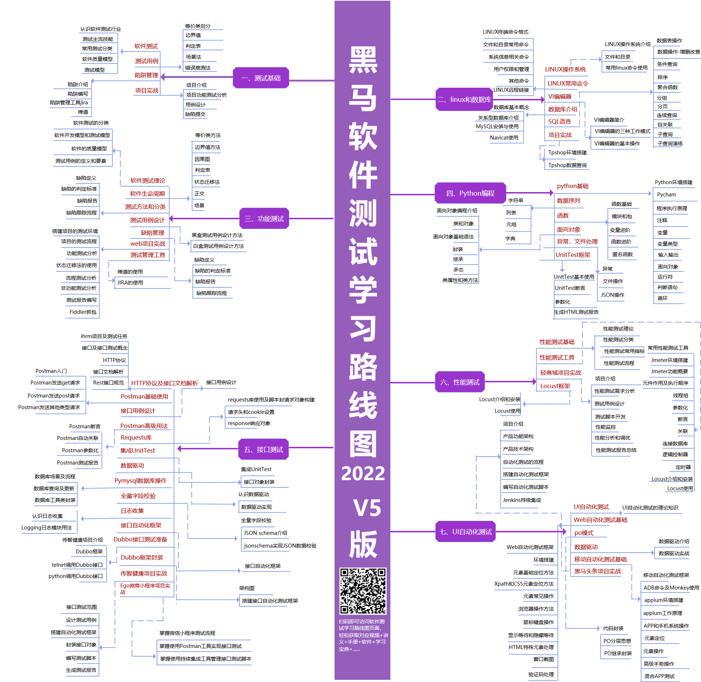

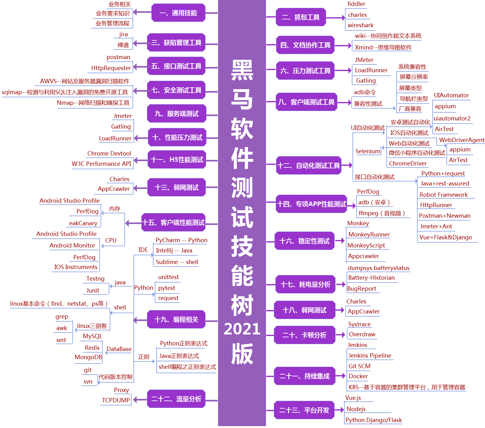

# 计算机的组成

## 1. 计算机

计算机( personal computer)俗称电脑(pc),是现代一种用于高速计算的电子机器，可以进行数值计算，又可以进行逻辑判断，还具有存储记忆功能，且能够按照程序的运行，自动、高速处理数据。计算机是20世纪最先进的科学技术发明之一。

一个完整的计算机系统，是由下边两部分组成：

- 硬件系统
- 软件系统

## 2. 硬件系统

计算机的硬件主要分为主机和外设两部分，都是指那些构成计算机系统的物理实体，它们主要由各种各样的电子器件和机电装置组成。从 ENIAC（世界上第一台计算机）到当前最先进的计算机，硬件系统的设计采用的都是冯诺依曼体系结构。

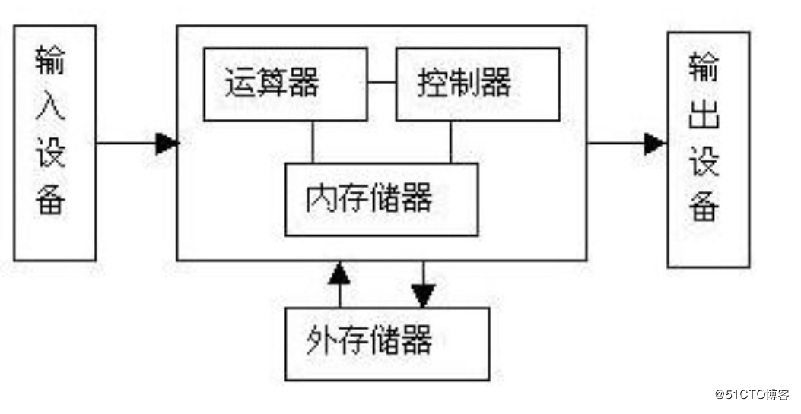

- 运算器、控制器统称中央处理器(cpu):负责数据的算术运算和逻辑运算，即数据的加工处理。是整个计算机的中枢神经，分析程序规定的控制信息，并根据程序要求进行控制，协调计算机各部分组件工作及内存与外设的访问等。

- 存储器：实现记忆功能的部件，用来存储程序、数据和各种信号、命令等信息，并在需要时提供这些信息。
  - 内存(rom只读存储器；ram随机存储器；断电数据会消失)；
  - 外存（硬盘、软盘ab、光盘）
- 输入设备：实现将程序、原始数据、文字、字符、控制命令或现炀采集的数据等信息輸入到计算机。
- 输出设备：实现将计算机处理后生成的中间结果或最后结果（各种数据符号及文字或各种控制信号等信息）输出出来。

## 3. 软件系统

### 3.1 操作系统软件

操作系统的主要作用是管理好硬件设备

桌面操作系统

- Windows系列：用户群体大
- MacOS：适合于开发人员
- Linux：应用软件少

服务器操作系统

- Linux：安全、稳定、免费、占有率高
- Windows Server：付费、占有率低

### 3.2 嵌入式操作系统

Linux：运行稳定、对网络的良好支持性、低成本，且可以根据需要进行软件裁剪，内核最小可以达到几百KB等特点，使其近些年来在嵌入式领域的应用得到非常大的提高

主要应用：机顶盒、数字电视、网络电话、程控交换机、手机、PDA、等都是其应用领域，得到了 Google、三星、摩托罗拉、NEC等公司的大カ推广

### 3.3 移动设备操作系统

- iOS
- Android (基于 Linux)

### 3.4 应用软件

基于操作系统上开发的各种应用程序，如：QQ、迅雷、Office、WPS等等

## 4. B/S 架构与 C/S 架构

BS架构：
Browser- Server,浏刘览器和服务器架构。包含客户端浏览器、Web应用服务器、数据库服务器的软件系统。用户只需要个浏览器就可以访问服务。系统更新时候，只需要更新服务端，不需要更新浏览器(比如百度、淘宝、徹博等网站)。

C/S架构：
Client- Server,客户机和服务器结构。这种结枃与B/S最显著的区別是需要安装客户端，通过客户端程序来访问应用系统。所以更新时，既要更新服务端，也要更新客户端（比如微信。王者荣雄手游、QQ音乐等软件）

区别：

1、硬件环境不同

- C/S建立在专用网络上，小范围的网络环境，局域网之间再通过专门服务器提供连接和数据交换服务
- B/S建立在广域网上，不需要专门的网络硬件环境

2、安全要求不同：

- C/S一般面向相对固定的用户群，对信息安全控制能力强，一般高度机密的信息系統采用
- B/S建立在广域网上，对安全的掌控能力弱，面向不可知的用户的用户群。

3、系统维护不同

- C/S程序由于整体性，必须整体考察，升级困难，多建立在 Windows上，表现方法有限，对程序员要求较高。
- B/S系统无缝升级，维护开销小，有更加丰富的表现形式，开发难度较低

4、处理问题不同：

- C/S处理用户固定，安全需求高，要求相同操作系统
- B/S面向所有用户，分散广，对系统要求小

## 5. 二进制

人类世界描述数据用十进制，计算机世界描述数据使用二进制。二进制是计算技术中广泛采用的一种数制，是用0和1两个数码来表示的数。它的基数为2，进位规则是“逄二进一。

计算机内信息的表示形式是二进制数字编码，各种类型的信息（数值、文字、声音、图像，基至是键盘按键、鼠标点击等等）必须转换成一进制数字编码的形式，才能在计算机中进行处理。

常见进制：

- 十进制：有10个基数：0、1、2、3、4、5、6、7、8、9 (逢10进1)
- 二进制：有2个基数：0、1 (逢2进1)
- 八进制：有8个基数：0、1、2、3、4、5、6、7 (逄8进1)
- 十六进制：有16个基数：0、1、2、3、4、5、6、7、8、9、A、B、C、D、E、F (逄16进1)

## 6. 常见存储单位

- 位：计算机中表示信息的最小单位，用来表示一个二进制(0或1)信息，用bt表示；
- 字节：八位二进制信息为一个字节，字节是计算机处理信息的最小单位，B表示

换算：

- 1B=8b
- 1k=1024B
- 1MB=1024kb
- 1GB=1024MB
- 1TB=1024GB
- 1PB=1024TB

## 7. 计算机指令系统

计算机指令系统是一种指令集的体系，也是计算机硬件的语言系统。这种指令集通常称为机器码（ machine code)，也叫机器语言( machine language)，是电脑的CPU可直接解读的数据。

简单来说：计算机程序就是一组需要CPU处理的二进制数。

## 8. 计算机编程语言

计算机语言的种类非常的多，总的来说可以分成机器语言、汇编语言、高级语言三大类

- 机器语言：由'0"和"1"组成的二进制数
- 汇编语言：为了减轻使用机器语言编程的痛苦，人们进行了一种有益的改进：用一些简洁的英文字母、符号韦来替代一个特定的指令的二进制串（比如如，用"ADD"代表加法，MOV代表数据传递等等），更容易识別和记忆，运行效率最高。
- 高级语言：主要是相对于汇编语言而言，它并不是特指某一种具体的语言，而是包括了很多编程语言，比如C、C++、Jaa、 Python、PHP等等。大大简化了程序中的指令。高级语言是绝大多数编程者的选择，也是目前主流的编程语言的选择方向。

## 9. 计算机网络 OSI 七层模型

OSI 七层模型描述了网络活动的特点
1、应用层：所有应用程序的网络在此展开
2、表示层：表示数据形式，完成对传输数据的转化（数据的加密解密）
3、会话层：负责建立、维护、拆除会话( session:存)
4、传输层：负责建立个可靠的端到端的链接
5、网络层：负责路由寻址和广播
6、数据链路层：负责将上层数据封装成帧
7、物理层：只负责传输01二进制比特(bit)流，不解释

## 10. TCP/IP 协议

定义中网络通讯协议
1、应用层：应用程序之间相互沟通的层
2、传输层：提供了数据传送，应用程序之间的通信服务
3、网络互联层：负责提供基本的数据封包传送功能，让每一块数据包都能够到达目的主机
4、网络接口层：接收数据，并进行传输

## 11. IP 地址

IP 地址是指互联网协议地址( Internet Protocol Address,又译为网际协议地址)，是IP Address的宿写。P地址是p协议提供的一种究一的地址格式，它为互联网上的每一个网各和每一台主机分配一个逻辑地址，以此来屏蔽物理地址的差异。好比是门睥号。

- lpv4地址：4段数字组成（地址已经使用枯竭）
- lpv6地址：6段数字组成（地球上每一粒沙子都可以被分配地址）
- 地址分类：
  - A类第一组数组是1到126
  - B类第一组数组是128到191
  - C类第一组数组是192到223

保留 IP 地址（只能用在局域网中）

~~~
10.*.*.*
127.*.*.*
172.16.0.0 - 172.31.255.255
192.168.*.*
~~~

## 12. DOS 命令查看 IP 地址

~~~shell
ipconfig /all 	# 查看 IP 地址和 MAC 地址
arp -a 			# 查看 IP 地址和 MAC 地址对应关系
ping 			# 查看当前计算机与目标计算机之间的通信情况
C: 				# 切换盘符
cls 			# 清屏
cd				# 进入文件夹
cd..			# 退回上级文件夹
md				# 创建目录
rd				# 删除目录（目录为空）
dir				# 显示路径结构
copy			# 复制文件
move			# 移动文件
del				# 删除文件
format			# 格式化硬盘
~~~

> 其中以太网的物理地址(mac地址)就是每台计算机唯一的地址（公司的网管需要把你电脑的唯一地址绑定在路由器上，你的电脑才能允许上网）

## 13. 网址、域名

域名就是我们常见的网址，好比家里的]牌号，通过域名（门牌号）オ能找到你的网站代码（家）

中国著名域名提供商：

- 万网：www.net.cn
- 新网：www.xinnet.com
- 西部数码：www.west263.com

常见的域名后缀

| 域名后缀 | 说明       |
| -------- | ---------- |
| .com     | 国际域名   |
| .net     | 网络公司   |
| .cn      | 中国公司   |
| .com.cn  | 中国公司   |
| .org     | 非盈利组织 |
| .edu     | 教育机构   |
| .gov     | 政府机构   |
|          |            |

> 在中国大陆网站需要备案，域名和身份证一样是唯的，不能主册相同域名

## 14. 空间、服务器、云存储

- 虚拟空间
  - 网络服务器上分出一定的磁盘空间，用户可以租用此部分空间，以供用户放置站点及应用组件；http://www.7e.hk/
- VPS 主机
  - 
- 独立服务器
  - 一般都是在DC服务商租用或者托管服务器，也可以自己托管机房。整个主机都是自己的，不与他人共享

云存储：
理解为新一代的共享主机。主机公司将它的硬件和网络线路，做成一朵"云",然后提供一些通向这朵云“的网络接口API,供客户使用。每个客户共享的不再是某一台特定的服务器，而是云里的所有服务

比如你将文件传到一台共享主机里和云主机里，效果是不一样的；前者是上传到某一台特定主机，后者则是传到云里。共享主机用户直接面对特定的服务器，而云主机用户直接面对网络接口，看不到服务器内部。

# 软件测试

软件测试是互联网技术中一门重要学科，是软件生命周期中不可或缺的环节，担负着把控、监督软件的质量的重任。

就业岗位：

- 测试工程师
- 自动化测试工程师
- 测试开发工程师
- 游戏测试工程师
- 移动端测试工程师
- Web端测试工程师
- 接口测试工程师
- 性能测试工程师
- 安全测试工程师

## 1. 测试软件的发展过程

- 1956年调试时期（测试即调试）
- 1957年-1978年论证时期（软件测试是验证软件是正确的）和1979年-1982年破坏性测试时期（为了发现错误而执行程序的过程）
- 1983年起，软件测试已有了行业标准(EE829),它需要运用专门的方法和手段，需要专门人才和专家来承担
- 1990年起软件迅谏发展，测试行业也更着发生了巨大变化，开始引入专业测试工具

## 2. 软件测试定义

软件测试的定义：

在规定的条件下对程序进行操作，从而发现错误，对软件质量进行评估的一个过程。

测试的目的：
是想以最少的人カ,物力和时间找出软件中潜在的各种错误与缺陷，通过修正各种错误和缺陷提高软件质量，回避软件发布后由于潜在的软件缺陷和错误造成的隐患以及带来的商业风险。（注意这个问题的答案，经常会与软件测试的定义混淆）

测试的定义：

使用人工和自动手段来运行或测试某个系练的过程，其目的在于检验它是否满足规定的需求或是弄清预期结果与实际结果之间的差别。

软件测试的原则：

1. 所有的测试都应追溯到用户需求(视频网站，点击后最大化)
2. 应当把“尽早和不断地测试”作为座右铭
3. 测试工作应该由独立的专业的软件测试机构来完成
4. Pareto原则，测试发现的错误中80%很可能起源于20%的模块中
5. 设计测试用例时，应该考虑各种情况。
6. 对测试出的错误结果一定要有一个确认的过程（描述缺陷报告）
7. 制定严格的测试计划
8. 完全测试是不可能的，测试需要终止
9. 注意回归测试（见下一页）的关联性。
10. 妥善保存一切测測试过程文档。

回归测试：

指修改了旧代码后，重新进行测试以确认修改没有引入新的错误或导致其他代码产生错误。

## 3. 软件产品质量模型

软件产品质量模型对产品设计时需要考虑的地方进行了高度概括。

六大特性：

1. 功能性：是指软件产品在指定条件下使用时，提供满足明确和隐含要求的功能的能力
2. 可靠性：是指在特定条件下使用时，软件产品维持规定的性能级別能力。
   1. 第一层：设备最好不要出故障；
   2. 第二层：设备出现故障了不要影响主要的功能和业务；
   3. 第三层：如果影响了主要功能和业务，系统可以尽快定位并恢复。
3. 易用性：是指用户在指定条件下使用软件产品时，产品被用户理解、学习、使用和吸引用户的能力。简单10个字：易懂、易学、易用、漂亮好看（用户体验好）
4. 效率：是指在规定条件下，相对于所用资源的数量，软件产品可提供适当的性能的能力。通常，效率就是我们常说的产品性能(单选、多选例子)
5. 可维持性：是指产品可被修唿的能力。这里的修改是指纠正、改进软件产品和软件产品对环境、功能规格变化的适应性
6. 可移植性：是指软件产品从一种环境迁移到另外一种环境的能力。这里的环境，可以理解为硬件、软件或组织等不同的环境。(win7、Wwin10、安卓、ios。。。)

## 4. 软件质量保证

软件质量保证(SQA- Software Quality Assurance)是建立一套有计划，有系统的方法，来向管理层保证拟定出的标准、步骤、实践和方法能够正确地被所有项目所采用。软件质量保证的目的是使软件过程对于管理人员来说是可见的。它通过对软件产品和活动进行评审和审计来验证软件是合乎标准的。软件质量保证组在项目开始时就一起参与建立计划、标准和过程。这些将使软件项目满足机构方针的要求。

基本目标
1:软件质量保证工作是有计划进行的
2:客观地验证软件项目产品和工作是否道循恰当的标准、步骤和需求。
3:将软件质量保证工作及结果通知给相关组别和个人
4:高级管理层接触到在项目内部不能解决的不符合类问题。
5:软件质量需要全面的则试工作来保证

QC:检验产品的质量，保证产品符合客户的需求；是产品质量检查者；
QA:审计过程的质量亓保证过程被正确执行；是过程质量审计者；

注意区别检查和审计的不同
检查：就是我们常说的找茬，是扰毛病的；
审计：来确认项目按照要求进行的证据；审计的内容主要是过程；

QC进行质量控制，向管理层反溃质量信息；QA刚确保Q按照过程进行质量控制活动，按照过程将检查结果向管理层汇报。这就是QA和QC工作的关系。

## 5. 软件测试基本流程

1. 需求分析
2. 编写测试用例
3. 评审测试用例
4. 搭建试环境
5. 等待开发提交测试包
6. 部测试包
7. 冒烟试（对软件主体基本功能进行基本测试）
8. 执行测试用例
9. BUG跟踪处理(提交及回归BUG)
10. N轮之后符合需求
11. 测试结束

# 软件测试分类

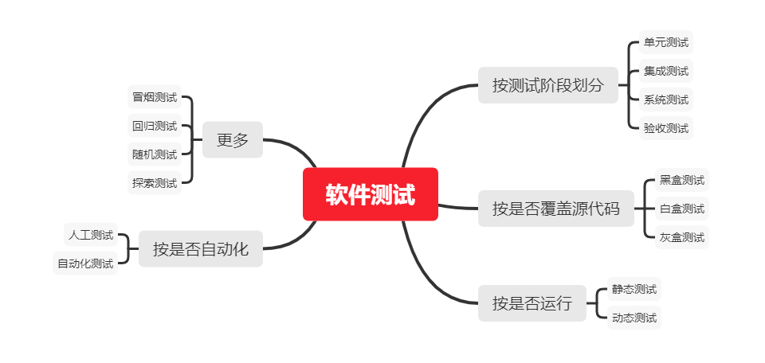

## 1. 按测试阶段划分

**单元测试**

单元测试又称模块测试，针对件设计中的最小单位-程序模块，进行正确性检査的测试工作。单元测试需要从程序内部结构出发设计测试用例。多个模块可以平行地独立进行单元测试。

单元定义：C中指一个函数，Java中指一个类，在图形化的软件中，单元一般指一个窗口，1个菜单。

**集成测试**

又叫组装测试，通常在单元测试的基础上，将所有程序模块进行有序的、递增的测试。重点测试不同模块的接口部分。

**系统测试**

指的是将整个软件系统看为一个整体进行测试，测试的依据是软件需求说明书

> 到了系统测试，软件基本是完成了

**验收测试**

检验是否符合用户需求的测试

- α 测试
  - Alpha 内测版本
  - 通常只在软件开发者内部交流
  - 一般而言，该版本软件的 Bug 较多，普通用户最好不要安装
- β 测试
  - Beta是公測版本，是对所有用户开放的测试版本。
  - 这一版本通常由软件公司免费发布，用户可从相关的站点下载
  - 通过一些专业爱好者的测试，将结果反馈给开发者，开发者们再进行有针对性的修改。
- γ 测试
  - Gamma版本，指的是软件版本正式发行的候选版。该版本已经相当成熟了，与即将发行的正式版相差无几，成为正式发布的候选版本

## 2. 按是否查看源代码

**黑盒测试**

只测试功能，不关注功能的具体实现方式

**白盒测试**

不但关注功能，还要关注代码是如何实现的

**灰盒测试**

介于黑盒和白盒之间的一种测试

## 3. 按是否运行

**静态测试**

不运行软件，静态的观察软件是否符合预期（UI,外观）

**动态测试**

运行软件，在运行过程中测试

## 4. 按是否自动化

**手工测试**

通过测试工程师手工对软件进行测试

**自动化测试**

通过编写代码，通过程序自动测试软件是否有 Bug

## 5. 其他测试

**冒烟测试**

对软件最基本的流程和工作做一个粗略的测试，看最基本的功能是否能够正常运行

- 测试拿到研发的第一个版本

**回归测试**

当修复一个BUG后，把之前的测试用例在新的代码下进行再次测试

**随机测试**

随机测试主要是对被测软件的一些重要功能进行复测，也包括测试那些当前的测试用例没有覆盖到的部分

**探索性测试**

探索性测试意味着同时设计测试和执行测试。测试人员通过测试来不断学习被测系统。

# 软件质量模型

软件质量，就是软件与明确地和隐含地定义得需求相一致得程度。ISO9126 软件质量模型是评价软件质量的国际标准，这个模型是软件质量标准的核心，对于大部分的软件，都可以考虑从这这6个特性和27个子特性去测试、评价一个软件。

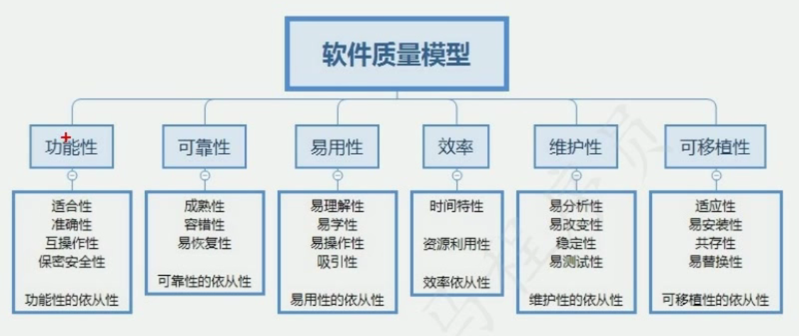

# 软件开发过程模型

- 瀑布模型（常见）
- 快速原型模型
- 螺旋模型

## 1. 瀑布模型

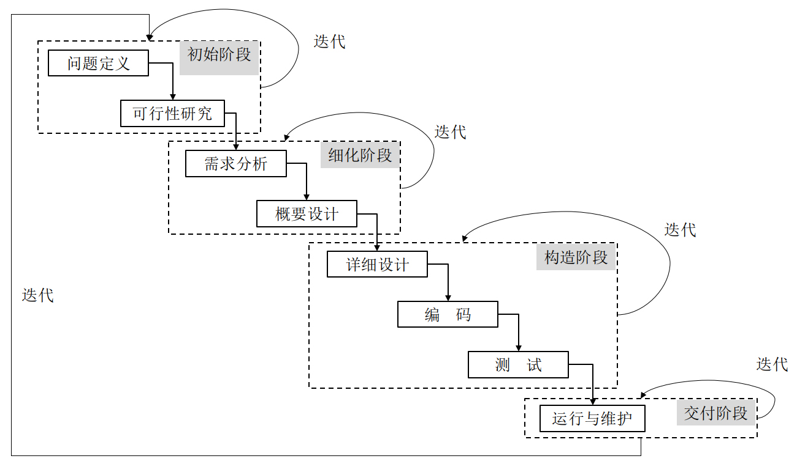

需求分析

- 研发分析需求说明书
- 判断需求的可实现性

概要设计

- 用到的具体技术点
- 大致划分

详细设计

- 详细到可以为编码做支持
- 类和类关系，类的设计
- 函数设计
- 各个接口细节
- 数据库表的关系，字段关系

瀑布模型特点

- 是线性模型的一种，在所有模型中占有重要地位，是所有其他模型的一个基础
- 每一个阶段执行一次，文档驱动（记录文档），按线性顺序进行软件开发。

瀑布模型优缺点

优点：

- 开发的各个阶段比较清晰。
- 当前一阶段完成后，只需关注后续阶段。

缺点：

- 依赖于早期的需求调查，不适应需求的变化。
- 风险往往延至后期才显露，失去及早纠正的机会。

## 2. 快速原型模型

在开发真实系统之前，构造一个原型，在该原型的基础上，逐渐完成整个系统的开发工作。即一边确定需求，一边实现。

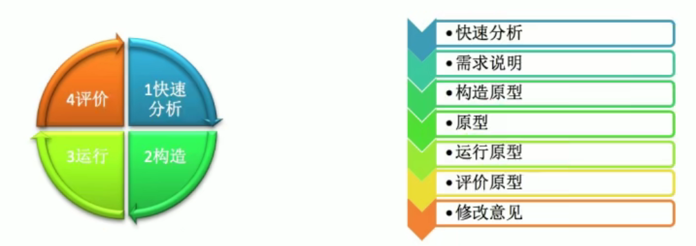

快速原型模型特点：

- 快速的构建软件的原型
- 支持用户参与

快速原型模型的优缺点：

优点：

- 克服瀑布模型的缺点，更好地满足用户的需求并减少由于软件需求不明确带来的项目开发风险。

缺点：

- 不适合大型系统的开发(适合开发小型的、灵活性高的系统)。

## 3. 螺旋模型

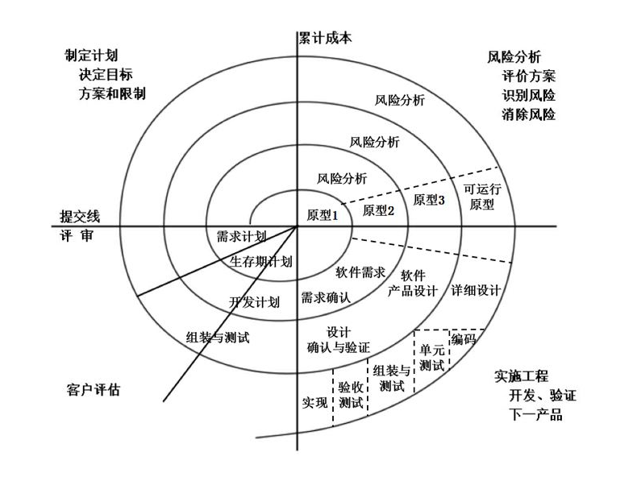

螺旋模型的特点：

- 引进了风险分析

螺旋模型的优缺点：

优点：

- 螺旋模型很大程度上是一种风险驱动的方法体系

缺点：

- 采用螺旋模型需要具有相当丰富的风险评估经验和专门知识。

# 测试过程模型

## 1. V模型

- V模型是最具有代表意义的测试模型，最早是由 Paul Rook在20世纪80年代后期提出，由英国国家计算机中心文献中发布，旨在改进软件开发的效率和效果

- V模型本身是软件开发中瀑布模型的变种，它反映了测试活动与分析和设计的关系。

- V模型标明了测试过程中本身存在的不同阶段，从左到右，描述了开发过程和测试过程间的阶段对应关系。

V模型示意图：

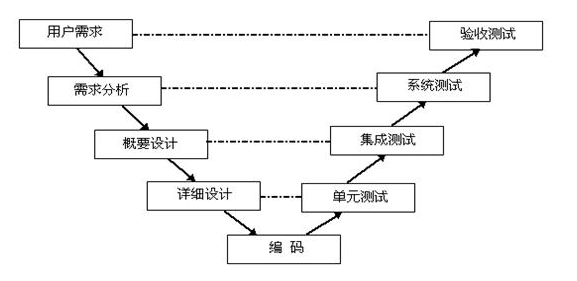

优点：

- 测试V模型即包含了底层测试又包含了高层测试：

缺点：

- 当需求变更时将会导致阶段反复，返工量非常太，模型灵活性比较低。

## 2. W 模型

测试伴随着整个软件开发周期，并且测试的对象不仅仅是程序，需求和设计同样要测试。

W 模型示意图：

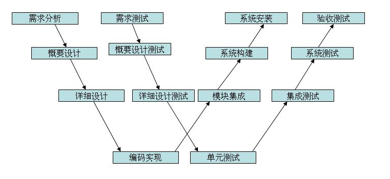

W 模型优缺点

优点：

- 强调測试件随着整个软件开发周期，而且测试的对象不仅仅是程序，需求和概要设计同样要测试：
- 更早地介入测试，可以发现开发初期的缺陷，邦么可以用更加低的成本进行缺陷修复。

缺点：

- 使用起来技术复杂度高，对于需求和设计的測试要求高，实践起来困难。

# 测试用例

## 1. 什么是测试用例

测试用例：为了特定的目的（证明软件存在某问题）而设计的一组由测试输入、执行条件、预期结果构成的文档

1、测试用例简单来说就是指导如何做测试的文档，该文档主要记录需要验证被测软件的是否满足需求

2、测试用例表现形式常见的有两种，可以以模板形式展示

​       1）一种是通过Excel直接编写

​           ——大多数项目中都需要按照这种方式设计编写

​       2）一种是通过xmind直接整理测试点

​            ——时间紧迫，项目没有强制要求时，可以设计测试点的形式编写
​            ——对于业务流程类的测试，也可以整理为测试点进行测试

3、设计及执行人员：测试工程师

4、用例的模板：描述编写用例核心内容，一般项目都有自己的设计用例的模板，常见测试用例模板可参照如下：

## 2. 为什么要写测试用例 

- 技术上将需求转化为具体可验证的指标
- 以文档的形式记录软件可能存在的问题
- 防止测试过程的活动出现遗漏，提高工作效率
- 测试工作量的展示

## 3. 如何编写测试用例

既然写测试用例如此重要，那么如何更好的编写测试用例呢？个人认为需要满足如下几点：

- 常规思考，设身处地的从用户角度出发（比如：实际用户是这么使用的么，会不会遇到异常情况呢？）
- 测试理论方法的支撑（比如：根据需求设计测试用例时，能用到哪些常见的测试用例设计方法？）
- 产品的熟悉和经验的积累（比如：已经有过类型项目经验，曾经在某个方面有过问题，当时是如何处理的呢？）

上述的设计用例过程，有个前提，就是对于测试有耐心和毅力，加上日常有意识的思维训练，才会写出全面的用例。

**1、常规思考**

回归到开篇的问题，对于一个基本的登录页面，按照常规思路能否会想到如下截图的测试点呢？实际，这些测试点都是源于从用户角度出发，结合需求进行细化设计的过程。实际测试中是不是只有这些测试点呢？

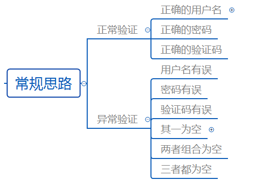

**2、学习积累**

相信大多数测试工程师都能够想到上述基本的测试点，然在实际工作中面对的项目不同，设计测试用例的颗粒度也有不同的要求，如果针对上述登录的模块，更深入一层考虑呢？此时需要对产品的熟悉程度及测试经验的加持，而且这些点的设计是不断学习、熟悉项目、测试积累中得到的。

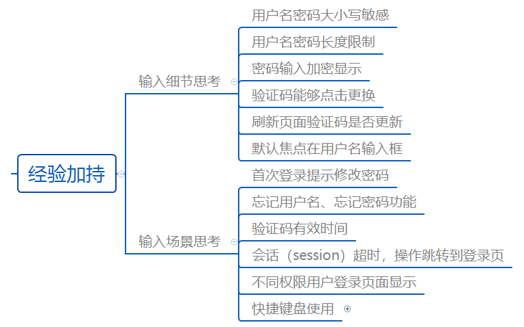![im

**3、理论支撑**

有了常规的思考，有了经验的积累，还需要理论的支撑。测试用例毕竟是通过人去思考设计，这个过程不可避免有疏漏。如何规避？实际就需要测试理论的支撑，个人认为深入思考设计用例不外乎以下两方面：

​     **1）测试用例的设计方法**

> 测试理论中很关键一块就是将需求拆分为具体的测试点，然后根据用例设计方法进行具体的设计，其中拆分需求的关键是熟悉需求，将文档中已有的描述内容，按照用户使用场景、个人测试经验的积累（如果有的话）、把大段的内容拆分成能够直接用用例设计方法的测试点，这样就直接可以通过简明扼要的文字描述转化为Excel的测试用例，在这个过程通俗理解就是拆分细化的过程，直到可以直接写用例验证一个具体的功能点即可。

​    **其中熟知的设计用例方法有：**

​     \- 观察法

​    \- 等价类、边界值

​    \- 判定表、因果图

​    \- 流程图、场景法

​    \- 错误推测法等

​      **2）测试设计的思路开拓**

> 倘若按照需求将已有的描述信息都已经拆分完毕了，是不是就可以确保测试没有问题了呢？
> 其实不然，在上述基础上如果还需要再拓展全面测试，还需要借助于软件质量模型的特性，从这些特性出发，给予测试用例设计者更多的思考空间。这样的设计就更加的全面可靠。

​     **常见软件质量模型特性说明：**

​      \- 功能性：功能有没有，好不好用

​      \- 性能效率：对应系统的资源耗费程度及响应时间

​      \- 易用性：容易理解、学习、使用

​      \- 兼容性：能够兼容不同的软硬件平台

​      \- 可靠性：不易出问题，万一出问题容易恢复

​      \- 安全性：对于用户的安全保障（外在的人生安全、内在的信息安全等）

​      \- 可移植性：能否在不同环境条件下无故障运行

​      \- 可维护性：对于后期的修复维护是否方便快捷

**因此，对于上述登录功能，按照上述质量模型的思路指导，就得到如下的测试点：**

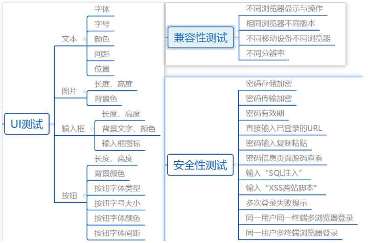

## 4. 测试用例模板

软件测试用例的基本要素包括用例编号、用例标题、测试项目、用例级别、预置条件、测试输入、执行步骤、预期结果

| 用例编号 | 用例标题         | 测试项目   | 用例级别 | 预置条件   | 测试输入            | 执行步骤                                  | 预期结果         |
| -------- | ---------------- | ---------- | -------- | ---------- | ------------------- | ----------------------------------------- | ---------------- |
| test001  | 用户查看课程介绍 | 黑马程序员 | p01      | 用户已登录 | 课程名称 '软件测试' | 1. 输入名称 “软件测试” 2. 点击搜索按钮 | 显示课程相关介绍 |

## 5. 面试实战

面试官问:给你一个物件（花瓶、笔、桌子）你怎么测试？

(1) 问题分析：
无论是哪个物件,都从以下几个维度出发设计:
    1、功能
    2、UI
    3、易用性
    4、性能
    5、安全
    6、接口
    7、兼容性
    8、可移植
    ....也可以适当缩减和增加

（2）参考回答:
 给你一个杯子你怎么测，至少写出20条测试用例

1.功能测试：
主要关注水杯基本功能
1.1 水杯是否可以正常装水
1.2 水杯是否可以正常喝水
1.3 水杯是否有盖子，盖子是否可以正常盖住
1.4 水杯是否有保温功能，保温功能是否正常保温
1.5 水杯是否会漏水，盖住盖子拧紧后是否会漏水

2.ui测试：
主要关注水杯外观、颜色、设计等方面
2.1 外观是否完整
2.2 外观是否舒适
2.3 颜色搭配及使用是否让人感到舒适
2.2 杯子外观大小是否适中
2.3 杯子是否有图案，图案是否易磨损

3.易用性测试：
主要关注水杯使用是否方便
3.1 水杯喝水时否方便
3.2 水杯拿起放下是否方便，这里会衍生到水杯形状的测试
3.3 水杯装水是否方便
3.4 水杯携带是否方方便
3.5 水杯是否有防滑功能
3.6 水杯装有低温或者高温水时，是否会让手感到不适

4.性能测试：
4.1 水杯装满水时，是否会漏出来
4.2 水杯最大使用次数
4.3 水杯的保温性是否达到要求
4.4 水杯的耐寒性是否达到要求
4.5 水杯的耐热性是否达到要求
4.6 水杯掉落时，是否可以正常使用
4.7 水杯长时间放置时，是否会发生泄露

5.安全性测试：
主要关注水杯外观和各种异常条件下是否释放有毒物质等
5.1 当水杯装满热水时，水杯是否会烫手
5.2 当水杯装上水后，是否会产生有毒物质
5.3 把水杯放在零下环境时，是否会产生有毒物质
5.4 把水杯放在高温环境时，是否会产生有毒物质

6.接口（杯子没有想到怎么和接口关联起来）

7.兼容性测试：
主要关注水杯是否可以装其他液体，如果汁、汽油、酒精等

8.可移植性测试：
主要关注水杯放置环境等
6.1 将水杯放在常温环境中，使用是否正常
6.2 将水杯放在零下的环境中，使用是否正常
6.3 将水杯放在高于正常温度的环境中，使用是否正常

# 测试用例设计方法

## 1. 等价类划分法

等价类概：在所有测试的数据中，具有某种共同特征的数据子集。

等价类分为：

- 有效等价类：满足需求的
- 无效等价类：不满足需求的

等价类操作步骤：

1. 明确需求
2. 确定有效类和无效类
3. 为每一条有效类和无效类编写测试用例

### 案例：QQ 账号用例编写

需求：QQ 账号 5 到 11位

| 有效等价类 | 无效等价类   |
| ---------- | ------------ |
| 456877     | 123          |
|            | 878652321566 |
|            | 中文汉字     |
|            | words        |
|            | 空           |
|            | 83_21        |

| 用例编号 | 用例标题     | 测试项目 | 用例级别 | 预置条件 | 测试输入     | 执行步骤 | 预期结果 |
| -------- | ------------ | -------- | -------- | -------- | ------------ | -------- | -------- |
| qq001    | 6位纯数字    | QQ账号   | p03      | N/A      | 456877       |          | 无报错   |
| qq002    | 小于最低长度 | QQ账号   | p03      | N/A      | 123          |          | 显示错误 |
| qq003    | 大于最高长度 | QQ账号   | p03      | N/A      | 878652321566 |          | 显示错误 |
| qq004    | 中文字符     | QQ账号   | p03      | N/A      | 中文汉字     |          | 显示错误 |
| qq005    | 英文字符     | QQ账号   | p03      | N/A      | words        |          | 显示错误 |
| qq006    | 空数据       | QQ账号   | p03      | N/A      |              |          | 显示错误 |
| qq007    | 带符号数据   | QQ账号   | p03      | N/A      | 83_21        |          | 显示错误 |

### 案例：电话号码用例编写

需求：某城市电话号码由三部分组成，分别是（地区码，空白或是3位数字）

- 地区码：空白或是3位数字
- 前缀：非 0 且 非 1 开头的3位数字
- 后缀：4位数字

| 位置   | 有效类 | 无效类 |
| ------ | ------ | ------ |
| 地区码 | 空白   | 23     |
|        | 010    | 2345   |
|        |        | _066   |
|        |        | abc    |
|        |        | 大家好 |

| 位置 | 有效类 | 无效类 |
| ---- | ------ | ------ |
| 前缀 | 456    | 010    |
|      |        | 119    |
|      |        | 23     |
|      |        | 1234   |
|      |        | 66+    |
|      |        | 呵呵   |
|      |        | dew    |
|      |        | 空     |

| 位置 | 有效类 | 无效类 |
| ---- | ------ | ------ |
| 后缀 | 7789   | 123    |
|      |        | 456789 |
|      |        | tr54   |
|      |        | 66+    |
|      |        | 呵呵   |
|      |        | dew    |
|      |        | 空     |

测试用例：

| 用例编号 | 用例标题 | 测试项目 | 用例级别 | 预置条件         | 测试输入                                 | 执行步骤         | 预期结果 |
| -------- | -------- | -------- | -------- | ---------------- | ---------------------------------------- | ---------------- | -------- |
| phone001 | 前缀无效 | 电话号码 | p03      | 地区码和后缀有效 | 地区码：010 前缀：010 后缀：7789   | 输入：0100107789 | 显示错误 |
| phone002 | 后缀无效 | 电话号码 | p03      | 地区码和前缀有效 | 地区码：010 前缀：010 后缀：tr54 | 输入：010010tr54 | 显示错误 |

## 2. 边界值分析法

边界范围：

- 确定边界情况（输入或输出等价类的边界）
- 选取正好等于、刚刚好大于或刚刚好小于边界的值作为测试数据
- 上点：边界上的点（正好等于）
- 离点：距离上点最近的点
- 内点：范围内的点

例：

| 边界    | 上点  | 离点  | 内点          |
| ------- | ----- | ----- | ------------- |
| [20,30] | 20,30 | 19,31 | 20,21,22...30 |
| (10,20) | 10,20 | 11,19 | 11,12,13...19 |

> 对于闭区间，上点是有效数据，离点是无效数据
>
> 对于开区间，上点是无效数据，离点是有效数据

使用边界值分析法：

1. 明确需求
2. 确定有效类和无效类
3. 确定边界值
4. 编写测试用例

### 案例：添加标题的测试用例

需求：0 < 标题长度 <= 30

| 边界   | 上点 | 离点 | 内点       |
| ------ | ---- | ---- | ---------- |
| (0,30] | 0,30 | 1,31 | 1,2,3...30 |

测试用例：

| 用例编号 | 用例标题     | 测试项目 | 用例级别 | 预置条件 | 测试输入 | 执行步骤           | 预期结果 |
| -------- | ------------ | -------- | -------- | -------- | -------- | ------------------ | -------- |
| title001 | 10个字符标题 | 添加标题 | p03      |          | abcdefg  |                    | 通过     |
| title002 | 空标题测试   | 添加标题 | p03      |          | 标题为空 |                    | 报错     |
| title003 | 30个字符标题 | 添加标题 | p03      |          | ......   | 输入30个字符标题   | 通过     |
| title004 | 1个字符标题  | 添加标题 | p03      |          | 1        |                    | 通过     |
| title005 | 31个字符标题 | 添加标题 | p03      |          | ......   | 输入31个字符的标题 | 报错     |

### 案例：纯数字账号

需求：6 到 10 位自然数

| 边界   | 上点 | 离点 | 内点       |
| ------ | ---- | ---- | ---------- |
| [6,10] | 6,10 | 5,11 | 6,7,8,9,10 |

| 有效类                 | 无效类                  |
| ---------------------- | ----------------------- |
| 1234567（内点长度）    | 12345（离点长度）       |
| 123456（上点长度）     | 12345678901（离点长度） |
| 1234567890（上点长度） | a34566（带字母）        |
|                        | a34.(5)（带符号）       |
|                        | 884呵呵（带中文）       |

## 3. 判定表

等价类划分法和边界值分析法都是着重考虑单个输入的输入条件，但是没有考虑输入条件的各种组合、输入条件与输出条件之间的相互制约关系。所以要使用判定表法才能解决上述案例编写测试用例的过程

判定表法表示的是有多个输入，和多个输出，而且输入与输入之间有相互的组合关系、输入和输出之间有相互的依赖关系。

判定表通常由四个部分组成：

1. 条件粧：列出了系统的所有输入，列出的输入次序无关紧要
2. 动作桩：列出了系统可能采取的操作，这些操作的排列顺序没有约束
3. 条件项：列出针对它左列输入的取值，在所有可能情况下的真假值
4. 动作项：列出在输入项的各种取值情况下应该采取的动作

> 注：判定表中贯穿条件项和动作项的一列就是一条规则

判定表的设计步骤：

1. 明确需求
2. 画出判定表
   1. 明确条件桩，动作桩
   2. 填写条件项，对条件进行全组合
   3. 明确每个条件组合对应的动作项
3. 生成测试用例，判定表每条规则对应一条测试用例

### 案例：欠费通话案例

需求：若用户欠费或关机，则不允许主被叫

| 欠费 | 关机 | 主叫 | 被叫 |
| ---- | ---- | ---- | ---- |
| Y    | Y    | N    | N    |
| N    | N    | Y    | Y    |
| Y    | N    | N    | N    |
| N    | Y    | N    | N    |

条件桩：欠费、关机

动作桩：主叫、被叫

条件项：欠费和关机的各种组合

动作项：主叫和被叫的各种组合

| 用例编号 | 用例标题               | 测试项目 | 用例级别 | 预置条件       | 测试输入 | 执行步骤 | 预期结果   |
| -------- | ---------------------- | -------- | -------- | -------------- | -------- | -------- | ---------- |
| call001  | 欠费、关机不能主被叫   | 电话项目 | p03      | 欠费、关机     |          |          | 不能主被叫 |
| call002  | 未欠费未关机可以主被叫 | 电话项目 | p03      | 未欠费、未关机 |          |          | 可以主被叫 |
| call003  | 欠费，未关机不能主被叫 | 电话项目 | p03      | 欠费、未关机   |          |          | 不能主被叫 |
| call004  | 未欠费，关机不能主被叫 | 电话项目 | p03      | 未欠费、关机   |          |          | 不能主被叫 |

### 案例：订单案例

需求：

- 订购单的检查，如果金额大于500元，又未过期，则发出批准单和提货单
- 如果金额大于500元，但过期了，则不发批准单与提货单：
- 如果金额小于等于500元，则不论是否过期都发出批准单和提货单。
- 在过期的情况下不论金额大小还需要发出通知单。

| 金额>500 | 过期 | 批准单 | 提货单 | 通知单 |
| -------- | ---- | ------ | ------ | ------ |
| Y        | Y    | N      | N      | Y      |
| N        | N    | Y      | Y      | N      |
| Y        | N    | Y      | Y      | N      |
| N        | Y    | Y      | Y      | Y      |

## 4. 因果图

用图解的方法表示输入的各种组合关系，写出判定表，从而设计相应的测试用例。

适用范围：适用于分析程序输入条件的各种组合情况，以及输入与输出之间的依赖关系

因果图：

> 通常在因果图中用C表示原因，用E表示结果。

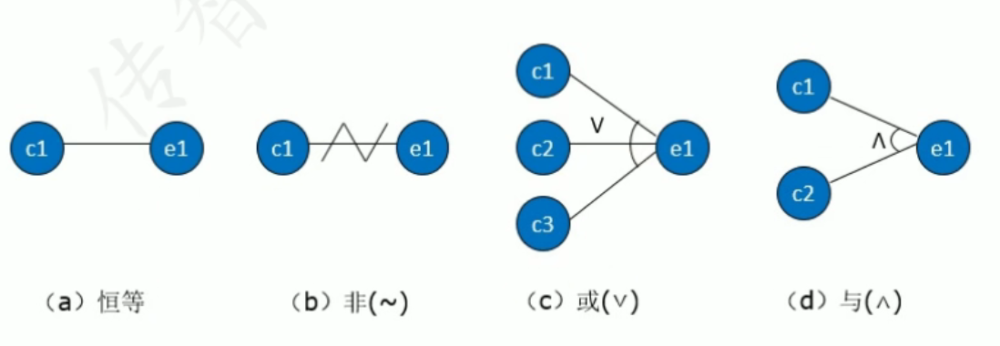

步骤：

1. 明确需求
2. 画出因果图
3. 将因果图转换为判定表

## 5. 正交法

在测试中，如果组合量太大，不可能为每一种组合都创建测试用例。采用正交排列法，实现最少的测试用例集合获得最大的测试覆盖率。

适用范围：

当可能的输入数据或者输入数据的组合数量很大时，由于不可能为每个输入组合都创建测试用例，可以采用这种方法

特点：

均匀分散，齐整可比

正交表书写方法：

一般的正交表标记为：$L_n(m^k)$
n 表示行数
k 是表的列数
m 是列的取值个数

如：$L_9(3^4)$

代表 9行4列，每行有3种取值个数

> 4因素，3水平

### 案例：窗口控件

测试各个选项显示正确的样式

- 窗体中有多个控件(字体、字符样式、颜色、字号)，每个控件有多个取值
- 字体：仿宋、楷体、华文彩云
- 字符样式：粗体、斜体、下划线
- 颜色：红色、绿色、蓝色
- 字号：20号、30号、40号

| 编号 | 字体 | 样式   | 颜色 | 字号 |
| ---- | ---- | ------ | ---- | ---- |
| 1    | 仿宋 | 粗体   | 红色 | 20   |
| 2    | 仿宋 | 斜体   | 绿色 | 30   |
| 3    | 仿宋 | 下划线 | 蓝色 | 40   |
| 4    | 楷体 | 粗体   | 红色 | 20   |
| 5    | 楷体 | 斜体   | 绿色 | 30   |
| 6    | 楷体 | 下划线 | 蓝色 | 40   |
| 7    | 彩云 | 粗体   | 红色 | 20   |
| 8    | 彩云 | 斜体   | 绿色 | 30   |
| 9    | 彩云 | 下划线 | 蓝色 | 40   |

如果项目数目不等，以最多的值为第一列，如添加一个黑体，减少一个颜色

| 编号 | 字体 | 样式   | 颜色 | 字号 |
| ---- | ---- | ------ | ---- | ---- |
| 1    | 仿宋 | 粗体   | 红色 | 20   |
| 2    | 仿宋 | 斜体   | 绿色 | 30   |
| 3    | 仿宋 | 下划线 | 红色 | 40   |
| 4    | 仿宋 | 粗体   | 绿色 | 20   |
| 5    | 楷体 | 斜体   | 红色 | 30   |
| 6    | 楷体 | 下划线 | 绿色 | 40   |
| 7    | 楷体 | 粗体   | 红色 | 20   |
| 8    | 楷体 | 斜体   | 绿色 | 30   |
| 9    | 彩云 | 下划线 | 红色 | 40   |
| 10   | 彩云 | 粗体   | 绿色 | 20   |
| 11   | 彩云 | 斜体   | 红色 | 30   |
| 12   | 彩云 | 下划线 | 绿色 | 40   |
| 13   | 黑体 | 粗体   | 红色 | 20   |
| 14   | 黑体 | 斜体   | 绿色 | 30   |
| 15   | 黑体 | 下划线 | 红色 | 40   |
| 16   | 黑体 | 粗体   | 绿色 | 20   |

## 6. 场景法

场景法是用流程图描述用户的使用场景，然后通过覆盖流程路径来设计测试用例

场景法的意义

- 用户角度：用户平时使用的不是单个功能，而是多个功能组合起来进行使用
- 测试人员角度：平时测试的都是单个功能点进行测试，容易忽略多个功能的组合测试

例：地铁进站流程

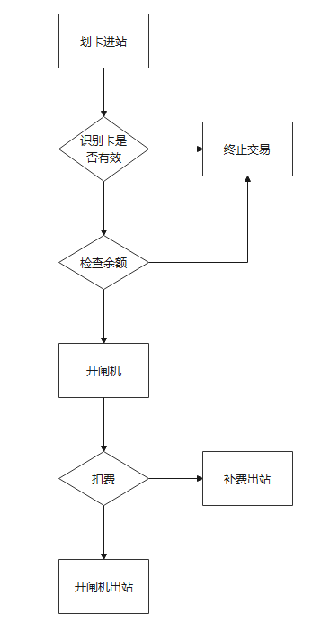

有几条路径就有几条测试用例：

1. 划卡进站 - 识别卡为无效 - 终止交易
2. 划卡进站 - 识别卡为有效 - 检查余额不足 - 终止交易
3. 划卡进站 - 识别卡为有效 - 检查充足 - 开闸机 - 无法扣费 - 补费出站
4. 划卡进站 - 识别卡为有效 - 检查充足 - 开闸机 - 扣费正常 - 开闸机出站

| 用例编号 | 用例标题                     | 测试项目 | 用例级别 | 预置条件     | 测试输入 | 执行步骤 | 预期结果 |
| -------- | ---------------------------- | -------- | -------- | ------------ | -------- | -------- | -------- |
| tro001   | 卡无效终止交易               | 地铁收费 | p01      | 卡无效       |          |          | 终止交易 |
| metro002 | 余额不足，终止交易           | 地铁收费 | p01      | 余额不足     |          |          | 终止交易 |
| metro003 | 出站余额不足，补费出站       | 地铁收费 | p01      | 出站余额不足 |          |          | 提示补费 |
| metro004 | 出站余额正确，正常开闸机出站 | 地铁收费 | p01      | 余额正确     |          |          | 正常出站 |

## 7. 错误推测法

错误推测法是指利用直觉和经验猜测出出错的可能类型，有针对性列举出程序中所有可能的错误和容易发生错误的情况，它是测试经验丰富的测试人员喜欢使用的一种测试用例设计方法。

基本思想：
基本思想是列举出可能犯的错误或错误易发生的清单，然后根据清单编写测试用例，这种方法很大程度上是凭经验进行的，即凭人们对过去所作测试结果的分析，对所揭示缺陷的规律性作直觉的推测来发现缺陷。

使用场景：

- 项目紧任务急、时间不够，这时就不要按部就班的测试了，根据之前项目的经验，找到之前出错过的类似模块进行重点测试
- 所有正常测试结束后，通过错误推断法再测试一些之前出过问题的模块。

# 软件缺陷

**软件缺陷定义**

软件或程序中存在的各种问题及错误

> 软件缺陷的存在会导致软件产品在某种程度上不能满足用户的需求

**软件缺陷的判定标准**
1、软件未达到需求规格说明书标明的功能
2、软件出现了需求规格说明书指明不会出现错误的地方
3、软件的功能超出了需求规格说明书指明的范围
4、软件出现了需求规格说明书虽未指明，而应该达到的日标
5、软件测试人员认为软件难以理解，不易使用，运行速度慢，或者最终用户体验不好。

**软件缺陷产生的原因**

软件缺陷产生是不可避免的，造成软件缺陷产生的原因主要归纳如下：

1、需求解释、记录或者定义错误
2、设计文档明在在错误或者拼写错误
3、编码说明、程序代码有误
4、硬件或者软件系统上存在错误

**软件缺陷产生的根源**

1. 需求的变更
2. 交流不充分
3. 软件的复杂性
4. 进度压力

## 1. 缺陷报告

缺陷报告基本内容：

缺陷标题，缺陷的预置条件，缺陷的重现步骤，缺陷的实际结果，缺陷的期望结果

| 编号 | 属性名称           | 描述                                                 |
| ---- | ------------------ | ---------------------------------------------------- |
| 1    | 缺陷ID             | 唯一的缺陷ID，可以根据该ID追踪缺陷                   |
| 2    | **缺陷状态**       | 缺陷状态指缺陷通过一个跟踪修复过程的进展情况         |
| 3    | **缺陷标题**       | 描述缺陷的标题                                       |
| 4    | **缺陷的严重程度** | 对软件产品的影响成都，分致命、较严重、严重、一般、低 |
| 5    | **缺陷的优先级**   | 缺陷修复的先后顺序，即哪些缺陷优先修正、哪些稍后修正 |
| 6    | **缺陷所属模块**   | 缺陷所属的项目和模板，要能较精确的定位至模块         |
| 7    | 缺陷记录者         | 提交缺陷的人员姓名                                   |
| 8    | 缺陷提交事件       | 缺陷提交的事件                                       |
| 9    | 缺陷处理人         | 处理缺陷的处理人                                     |
| 10   | 处理结果描述       | 对处理结果的描述，描述处理情况和代码修改说明         |
| 11   | 缺陷处理时间       | 缺陷处理的事件                                       |
| 12   | 缺陷验证人         | 对被处理缺陷验证的验证人（回测者）                   |
| 13   | 验证结果描述       | 对验证结果的描述（通过、不通过）                     |
| 14   | **缺陷详细描述**   | 缺陷的重现步骤                                       |
| 15   | 缺陷环境说明       | 对测试环境的描述                                     |
| 16   | 必要的附件         | 如设计到附件或错误现象的图片等                       |

### 1.1 缺陷状态

| 状态     | 说明         |
| -------- | ------------ |
| new      | 新建状态     |
| open     | 打开状态     |
| reopen   | 重新打开状态 |
| fixed    | 修复状态     |
| closed   | 关闭状态     |
| rejected | 拒绝状态     |
| postpone | 拖延状态     |

### 1.2 严重程度

| 状态          | 说明                                                         |
| ------------- | ------------------------------------------------------------ |
| 5 - Critical  | 系统瘫痪、异常退出、死循环、严重的计算错误等                 |
| 4 - Very High | 频繁的死机，系统大部分功能不可用                             |
| 3 - High      | - 功能点没有实现或不符合用户需求 - 数据丢失              |
| 2 - Medium    | - 影响一个相对独立的功能 - 仅仅在特定条件上发生 - 与产品需求定义不一致 - 断断续续的出现问题 |
| 1 - Low       | 表面性错误（如错别字）                                       |

### 1.3 缺陷的优先级

| 优先级别   | 描述                                                         |
| ---------- | ------------------------------------------------------------ |
| 5-Urgent   | 最高优先级。在这个错误影响下，系统几乎不可用。               |
| 4-veryhigh | 高优先级。错误对这套系统的能力产生严重的影响。               |
| 3-high     | 中优先级。如果这个错误存在与系統中，会制约开发和测试的活动的进行，如果先前没有修复它，那么需要在发布前修复它。 |
| 2-medium   | 低优先级。不会延迟发布，但是会在以后修正这个错误。           |
| 1-low      | 最低优先级。时间和资源允许时修正。                           |

## 2. 缺陷报告模板

| ID   | 功能模块 | 严重程度 | 优先级 | Bug类型  | 测试环境 | 状态 | 缺陷描述             | 预置条件   | 重现步骤                                          | 期望结果                     | 实际结果         |
| ---- | -------- | -------- | ------ | -------- | -------- | ---- | -------------------- | ---------- | ------------------------------------------------- | ---------------------------- | ---------------- |
| 267  | 登录     | S1       | P0     | 功能错误 | Win10    | new  | QQ账号登录提示不存在 | QQ账号正确 | 1. 打开QQ 2. 输入账号密码 3. 点击登录按钮 | QQ账号登录成功，进入QQ主界面 | 提示QQ账号不存在 |

| 附件图片/日志 | 测试人员 | 开发人员 | 解决方案 | 创建日期 | 解决日期 |
| ------------- | -------- | -------- | -------- | -------- | -------- |
|               |          |          |          |          |          |

**缺陷说明**：

ID: 缺陷编号

问题描述：对问题简要描述

严重程度：

- 严重(S1): 主功能不可用、 crash问题、闪退、不能启动
- 一般(S2): 次要功能不可用，边界、异常未进行处理等
- 微小(S3): 易用性问题、界面展示，小的性能问题等
- 建议(S4): 建议性问题

缺陷优先级：

- Priority0:必须在24小时之内被解决
- Priority1:产品发布前必须修复
- Priority2:可以在下ー个版本中修复

缺陷状态：

- New: 新建
- Open: 打开
- Fixed: 修复
- Closed: 关闭
- Rejected: 拒绝
- Postponed: 延期
- Reopen: 再次打开

例：

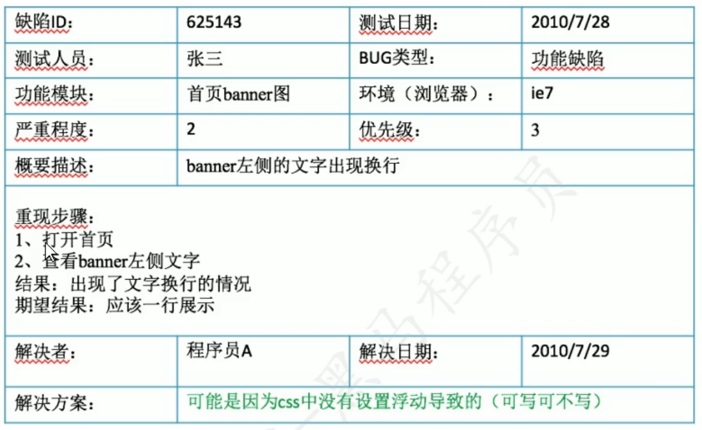

## 3. 缺陷报告的重要性

- 错误的缺陷报告会误导开发人员，影响开发人员的效率
- 错误的缺陷报告会影响测试人员自身的声誉。

## 4. 缺陷报告的注意事项

- 尽量确保缺陷可以重现
- 简洁、准确、完整
- 一个缺陷一个报告

## 5. 缺陷书写规范

- 标题：应保持简短、准确，提供缺陷的本质信息

> 尽量按缺陷发生的原因与结果的方式书写：
>
> 避免使用模制不清的词语，例如：“功能中断，功能不正确，行为不起作用”等。应该使用具体文字说明缺陷的症状

- 复现步骤：应包含如何使别人能够很容易的复现该缺陷的完整步骤

> 简单地一步步引导复现该缺陷，一个步骤包含的操作不要多
> 每个步骤前使用数字对步骤编号
> 尽量使用短语或短句，避免复杂句型句式
> 根据实际需要，提供测试的环境信息
>
> 避免包含多余的步骤，避免丢失必要的步骤。

- 实际结果：是执行复现步骤后软件的现象和产生的行为。

> 实际结果的描述应向标题信息那样，要列出具体的缺陷症状，而不是简单地指出“不正确”或不起作用”。

- 期望结果：描述应与实际结果的描述方求相同。通常需要列出期望的结果是什么。
- 附件：对缺陷描述的补充说明，可以是以下类型：

> 缺陷症状的截图
> 测试使用的数据文件

- 其他常见错误

>避免使用我、你等人称代词，可以直接使用动词或必要时使用“用户”代替
>避免使用情躇化的语言和强调符号：
>避免使用诸如“似乎”、“看上去可能”等含义模糊的词汇，而需要报告确定的缺陷结果
>避免提交不确定的測试问题，自己至少需要重现一次再提交。

## 6. 缺陷处理流程

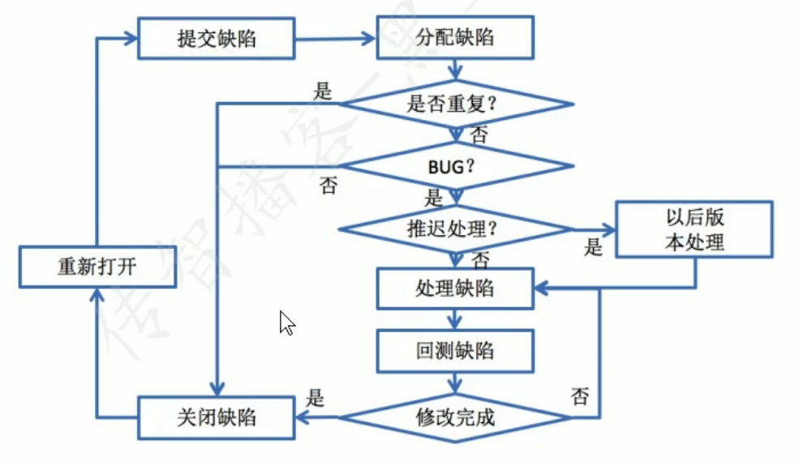

缺陷跟踪

- 新提交的缺陷为新建状态，确认有效后为打开状态，经开发人员修改后，缺陷变为已修复（待验证）状态。此时就需要测试人员对缺陷进行回归测试，验证问题是否修复。
- 如果问题已经修复，则测试人员将该缺陷的状态置为关闭状态（验证通过），同时添加回测说明如¨该缺陷己解决”。
- 如果已经关闭的问题再次出现，则测试人员将该缺陷的状态修改为重新打开

- new 新建状态
  - 需要提交一个缺陷，首先就是新建状态
- open 打开状态
  - 确认缺陷有效后，为打开状态
- fixed 修复状态
  - 由缺陷的处理人把缺陷处理完成之后设置为修复状态
- closed 关闭状态
  - 验证缺陷确实修复成功后，一般由缺陷的发起人设置状态为关闭状态
- reopen 重新打开状态
  - 一个已经关闭的缺陷再次出现就要设置为重新打开状态

## 7. 缺陷统计

- 按严重程度分类

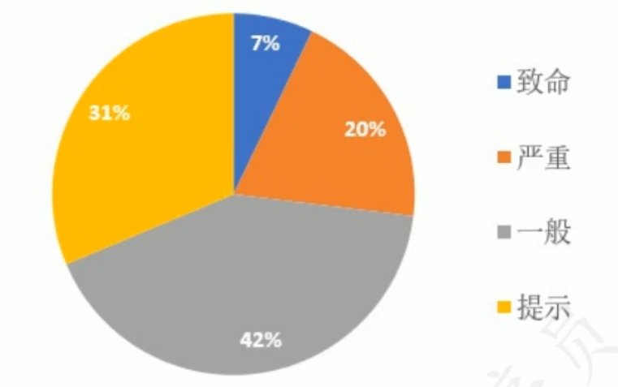

- 按缺陷提交人分类

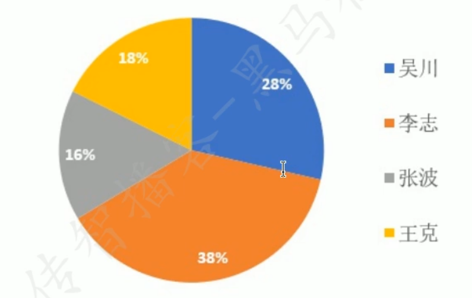

- 按缺陷类型分类

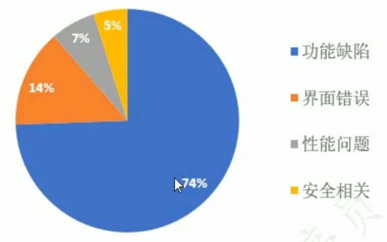

缺陷数据分析关注的问题

- 正在测试的软件哪个模块的问题最多
- 测试人员中谁报告的软件缺陷最多
- 各类缺陷所占的数量百分比分别是多少
- 开发人员能及时修复软件缺陷吗
- 开发人员一次正确修复缺陷的百分比是多少
- 正在开发的软件能否在计划的时间内正常发布

# 测试报告.doc

报告历史：

| 项目版本 | 报告时间   | 报告人 | 项目名称 |
| -------- | ---------- | ------ | -------- |
| v1.0     | 2022.07.22 | xxxx   | xxx      |

License：

文档中的全部内容属 xxx 所有，未经允许，不可全部或部分发表、复制、使用于任何目的。

一、项目概述：

本文档用于记录测试过程，总结各轮次的测试情況，分析测试数据，归纳测试工作进行过程中暴露的问题与遗留的风险，给出相应的测试建议以供后续项目参考。

1、系统概述&项目背景：

1.1 系统概述：

- 系统名称： XXXXCCHR
- 版本：V1.0.0.1
- 开发者：XX集团

1.2 项目背景
XXX人事管理平台简称 XXXXCCHR,它主要针对业务繁琐，流程设置，统计分析等方面的问题而研发的产品，以解决各个方面的问题。

2、术语及缩略语：

2.1 问题的四种级别定位：

- 致命：引起系统死机或系统崩溃的问题
- 严重：引起系统某一功能失效且对后续功能造成影响的；
- 一般：引起系统某一功能失效但可简单恢复或较难重现的问题；
- 轻度：从操作或维护的角度发现的问题或建议工

2.2 参考与引用文档：
《软件需求规格说明书》

3、测试情况：

| 项目版本 | 报告时间   | 负责人 | 项目名称 | 测试类型   | 测试进展 |
| -------- | ---------- | ------ | -------- | ---------- | -------- |
| v1.0     | 2019-07-16 | xxx    | xxx      | 功能测试   | 60%      |
| v1.0     | 2019-07-16 | xxx    | xxx      | 自动化测试 | 30%      |

二、测试概要

XXXXCCHR项目起始于2017年9月27日（数据来源于需求文档编写时间）整个项目经历了v1.0.0.1（当前版本）一个版本，共经历了2轮集成测试、2轮冒烟测试、1轮系统测试，发现缺陷212个，当前已解决209个，遗留3个。

1、测试人员分配

| 项目版本 | 测试人员 | 项目组 | 测试类型   |
| -------- | -------- | ------ | ---------- |
| v1.0     | xxx      | xxx    | 功能测试   |
| v1.0     | xxx      | xxx    | 自动化测试 |

2、测试情况

2.1 测试环境（等级分类：A 良好、B 一般、C 差）

| 浏览器  | 版本            | 兼容性程度 |
| ------- | --------------- | ---------- |
| IE      | 7~11 兼容性视图 | A          |
| Chrome  | 70~75           | B          |
| Firefox | 35~65           | C          |

2.2 当前测试情况（6.25 提测版本）

已完成：

- 二级市场【入职、人事变动(晋升、降职、调薪)、离职、转正（无流程）、人员异动、合同续签】审批流程测试
- 三级市场【入职、离职、转正、人员异动、离职、三级市场开关组、层级调整】审批流程测试
- 非营及其他【入职、离职（无流程）、转正、转岗、晋升、降职、调薪、合同续签】审批流程测试

未完成：

- 二级市场转岗、晋升降职/调薪相关功能
- 发起的角色权限区分二、三级市场相关功能
- 二级市场职位中显示流程类型相关功能
- 永不录入管理相关功能
- 储备员工资料库相关功能
- 日入职从默认试用员工改为正式员工相关功能
- 兼职申请相关功能
- 移植深圳跨部门（秘书）管理三级市场部分流程发起相关功能
- 导入职员信息增加【是否转正】字段功能
- 提交离职申请时，离职人如果拥有审批权限的相关功能

预期成时间：8.20

注：无其他紧急任务，预期完成时间，如有紧急任务延后

2.3 测试工具和方法

2.4 测试范围

- 功能测试：围绕系统的功能，检测毎个功能模块的功能是否实现，逻辑流程
- 是否合理，UI界面的设计是否合理等。
- 兼容性测试：检测常用浏览器兼容性。
- 回归测试：要求系统的测试点覆盖率达到100%,待bug验证通过后，进行了多次回归测试，测试点覆盖全面。

3、 测试统计

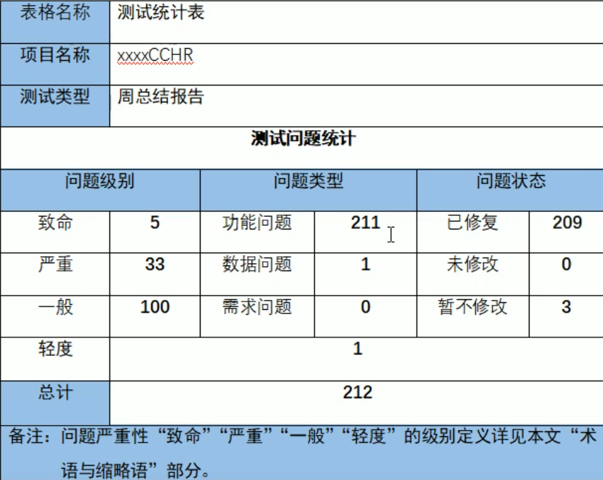

4、测试统计图

据测试统计表中测试问题级别、问题类型等形成以下统计饼图，详见如下。

三、测试总结及测试阻碍归纳

1、测试总结

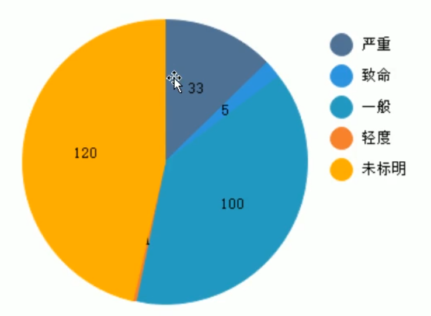

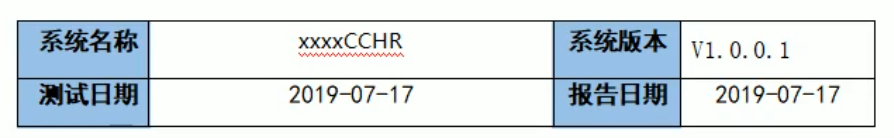

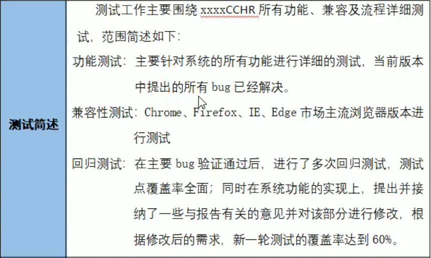

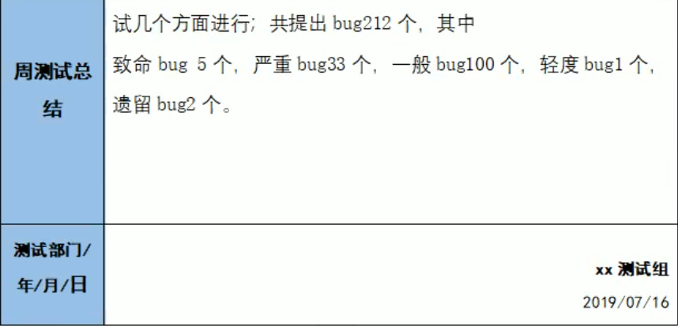

2、测试阻碍

- 测试环境不稳定
- 浏览器兼容性较差
- 测试环境垃契数据较多，导致功能缺陷
- 公共页面修改功能发生变化导致的报错
- 需求变更过快，导致需求堆积，系统测试时间延缓

四、测试风险说明

1. 需求风险

   - 令需求变更：需求变更导致开发、测试部分工作失效，维护成本增加

2. 缺陷风险

   - 偶现缺陷，较难重现，容易被遗漏；

   - 缺陷跟踪不够积极主动，没有做好缺陷记录和跟踪，导致上线遗漏

3. 代码质量风险

   - 人员经验不够丰富
   - 人员对业务埋解不够
   - 系统架构设计不足，导致扩展性不足，兼容差等问题

4. 测试环境风险

   - 测试环境同线上环境配置并别较大

5. 测试技术风险

   - 令人员不足问题

# 测试 OA 系统

## 1. 禅道

https://www.zentao.net/

基本流程如下

1. 产品经理创建产品
2. 产品经理创建需求
3. 项目经理创建项目
4. 项目经理确定项目要做的需求
5. 目经理分解任务，指派到人
6. 试人员测试，提交bug

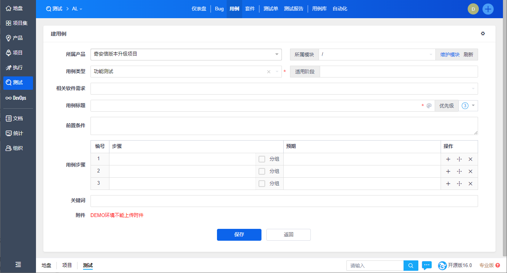

## 2. Jira

- Jira是由澳大利亚 Atlassian公司开发的一款优秀的软件问题跟踪管理软件工具。它可以对各种问题进行管理和跟踪。它正被广泛的开源软件组织，以及全球著名的公司使用

- jira产品非常的完善，且功能强大。
- 特点是支持多语言，干净和强大的用户界面，企业级的权限和控制，可以在几乎所有硬件和操作系统和数据库平台运行。

JIRA系统中所涉及到的角色：

- 企业管理人员
- 项目管理者
- 开发人员
- 测试人员
- 其他人员

# 项目测试流程

## 1. 搭建环境

- LNMP
- WAMP

## 2. 部署项目

## 3. 了解项目

对项目有了充分的认识之后，测试工作才能更顺利的开展。

熟悉项目的步骤：

1.了解项目的业务特性：项目是用来做什么的？
2.了解项目的角色与用户：项目是给谁用的？
3.了解项目的组织架构图：项目包括哪些功能模块？
4.了解项目的技术栈：项目是使用哪些技术实现的？

熟悉项目的信息来源

- 项目中已经存在的文档：需求说明书，用户使用手册，测试用例等
- 使用项目的现有环境：开发环境，测试环境，线上环境等
- 询问项目中的其他成员：测试组员/组长，开发人员，产品经理等

### 3.1 项目的业务特性

Tpshop是一个开源的电商系统。通过互联网来实现商品的销售与业务流程的电子化。

### 3.2 项目的角色与用户

| 角色名称   | 前台/后台 | 角色描述                 |
| ---------- | --------- | ------------------------ |
| 游客       | 前台      | 未注册用户               |
| 注册会员   | 前台      | 注册用户                 |
| 超级管理员 | 后台      | 拥有网站管理所有操作权限 |
| 仓管员     | 后台      | 仓库管理                 |
| 客服       | 后台      | 处理订单，发货           |

### 3.3 项目组织架构图

项目组织架构图反映的是一个项目组织系统中各子系统之间和各元素之间的组织关系，反映的是各个模块以及各个模块下面的子模块，子模块下面的子模块之间的组织关系。

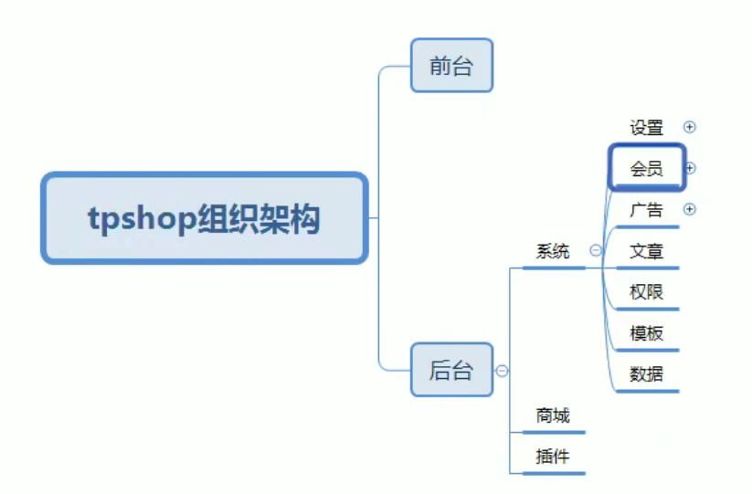

### 3.3 项目技术栈

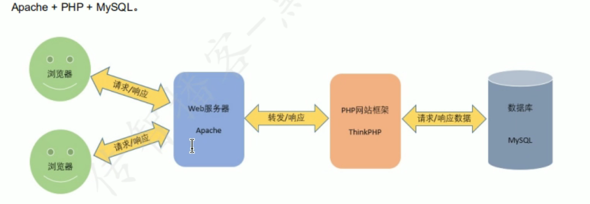

## 4. 项目测试流程

1. 需求评审
2. 编写测试计划与测试方案
3. 测试用例设计与评审
4. 测试执厅与BUG跟踪
5. 编写测试报告

### 4.1 需求评审

什么是软件需求

- 软件需求是指为用户解决某一问题或达到某一目标所需的软件功能

什么是需求评审

- 项目相关人员就软件需求进行确认和评估的相关活动

需求评审的目的

- 保证需求说明书的完整，准确
- 保证项目团队对需求的理解达成一致

需求评审的形式

- 需求评审会议

需求评审的参与人员

- 产品人员
- 开发人员
- 测试人员
- 界面设计人员

测试人员在需求评审的职责

- 确认自己对需求要有清晰的理解，没有疑惑
- 确认需求文档完整，准确，能够指导后期工作
- 对需求中不合理的地方提出自己的修改建议

// 需求说明书.doc

## 4.2 测试计划与测试方案

测试计划是指描述了要进行的测试活动的范围、方法、资源和进度的文档。

测试计划的核心内容

- 明确的测试目标与测试范围
- 执行计划的角色与职责
- 任务的进度安排与资源分配
- 风险估计和应急计划
- 测试的准入/准出标准

// 测试计划.doc

测试方案是从测试的技术角度去分析需求，在方向上明确要怎么测，分析结果重点在于测试策略与技术实现。

测试方案的核心内容

- 测试策略
- 测试环境的规划
- 测试工具的设计和选择

// 测试方案.doc

## 4.3 了解数据库表结构

// 项目表结构.doc

# Tpshop 测试案例

## 1. 编写测试用例基本要求

测试用例需求来源

- 需求说明书，产品原型图，设计图；
- 站在用户角度，测试件的可用性

测试用例设计步骤

- 需求分析；
- 整理测试点
  - 测试点是测试中需要关注的具体功能点；
  - 测试点的作用是用来拆分需求，辅助编写测试用例；
- 编写测试用例

编写测试用例的原则

- 能看懂一一确保每个用例通俗易懂
- 能执行一一测试用例清晰准确，用例中每个步骤都是可执行的；

测试结果的几种状态说明

- pass--通过
- fail--失败
- block---阻塞；
- N/A--忽略；

执行测试用例原则

- 严格按照测试用例书写的步骤执行；
- 失败的用例，及时提交缺陷报告；

## 2. 轮播图功能测试

轮播图 (Banner) 功能需求

- 显示1-5张 banner图片，自动轮播，3秒切換一张，如果只有1张 banner图片，则不轮播。
- 鼠标悬停在图片上时，停止轮播。
- 导航选择实心为当前图，可以点击跳转
- 左右箭头可点击左右切换，每次切换一张图。

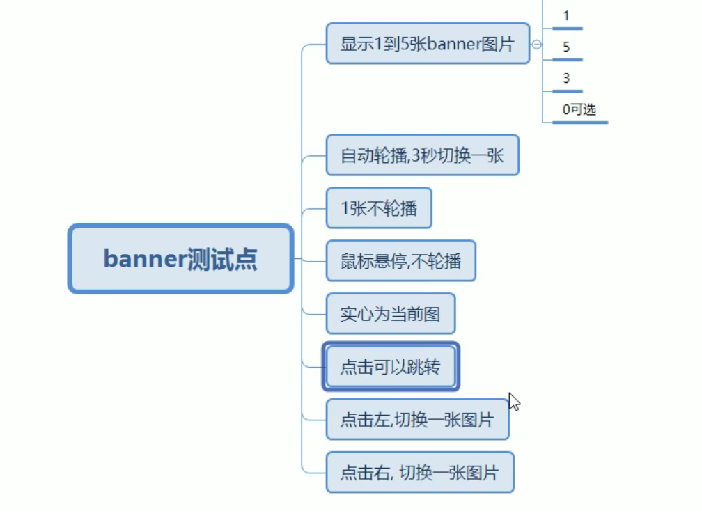

## 3. 编写测试用例

| ID        | 功能模块         | 优先级 | 用例标题                 | 预置条件 | 测试数据   | 执行步骤       | 预期结果             | 测试结果 | 测试版本号 |
| --------- | ---------------- | ------ | ------------------------ | -------- | ---------- | -------------- | -------------------- | -------- | ---------- |
| banner001 | 前台-首页-轮播图 | p2     | 轮播图显示1到5张图片     | /        | 6张轮播图  | 设置6张轮播图  | 轮播5张图片          | pass     |            |
| banner002 | 前台-首页-轮播图 | p2     | 轮播图显示1到5张图片     | /        | 1张轮播图  | 设置6张轮播图  | 轮播1张图片          | fail     |            |
| banner003 | 前台-首页-轮播图 | p2     | 轮播图显示1到5张图片     | /        | 5张轮播图  | 设置5张轮播图  | 轮播5张图片          | pass     |            |
| banner004 | 前台-首页-轮播图 | p2     | 轮播图显示1到5张图片     | /        | 3张轮播图  | 设置3张轮播图  | 轮播3张图片          | pass     |            |
| banner005 | 前台-首页-轮播图 | p2     | 轮播图显示1到5张图片     | /        | 没有轮播图 | 删除所有轮播图 | 不显示轮播图         | pass     |            |
| banner006 | 前台-首页-轮播图 | p2     | 自动轮播                 | /        | 5张轮播图  | 设置5张轮播图  | 自动轮播，3秒切换    | pass     |            |
| banner007 | 前台-首页-轮播图 | p2     | 鼠标悬停不轮播           | /        | 5张轮播图  | 设置5张轮播图  | 鼠标悬停不轮播       | pass     |            |
| banner008 | 前台-首页-轮播图 | p2     | 导航圆圈按钮实心为当前图 | /        | 5张轮播图  | 设置5张轮播图  | 实心为当前图         | pass     |            |
| banner009 | 前台-首页-轮播图 | p2     | 点击圆圈按钮可跳转轮播图 | /        | 5张轮播图  | 点击第三个点   | 跳转到第三张轮播图   | pass     |            |
| banner010 | 前台-首页-轮播图 | p2     | 点击左，切换上一张图     | /        | 5张轮播图  | 点击左箭头     | 点击左，切换上一张图 | pass     |            |
| banner011 | 前台-首页-轮播图 | p2     | 点击右，切换下一张图     | /        | 5张轮播图  | 点击右箭头     | 点击右，切换下一张图 | pass     |            |

# PostMan

安装与使用

集合测试

接口关联

断言

参数化

数据驱动

前置操作

后置操作

## newman 自动生成测试报告

# APIPost

# Fiddler

安装与使用

配置代理

抓包与过滤

断点抓包

Mock 自动转发

弱网测试

# 移动端网络测试

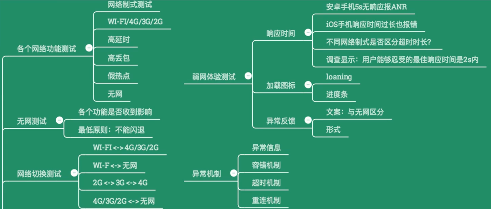

# Jenkins

环境部署

常用 Jenkins 插件

命令执行机制

邮件发送机制

构建任务应用

定时运行

批量运行

CI / CD 流水线流程

生成测试报告

# RobotFraword

环境搭建

基础语法

关键字下的资源文件

web 自动化

接口自动化

扩展库

RF 集成 Jenkins

# Jmeter

测试片段

线程组

自定义变量

数据驱动（多数据测试）

断言

前置处理器

后置处理器

性能测试

插件管理及 JVM 监控

集群压力测试及结果分析

查询数据库 JDBC

Debug 调试

# 微信小程序测试

minitest

# Mysql 安全测试

正常查询

- 用户名：`admin`
- 密码：`123`

~~~mysql
SELECT * FROM user_info
WHERE user_name = 'admin' and user_pwd = '123'
~~~

注入查询

- 用户名：`1' or ('1' = '1`
- 密码：`1') or '1' = '1`

~~~mysql
SELECT * FROM user_info
WHERE user_name = '1' or ('1' = '1' and user_pwd = '1') or '1' = '1'
~~~

