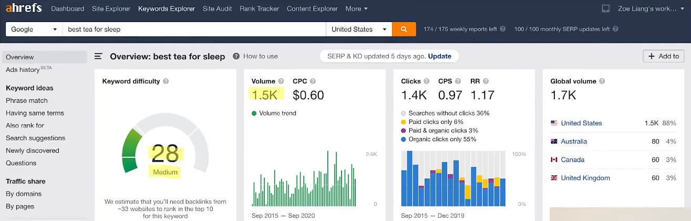
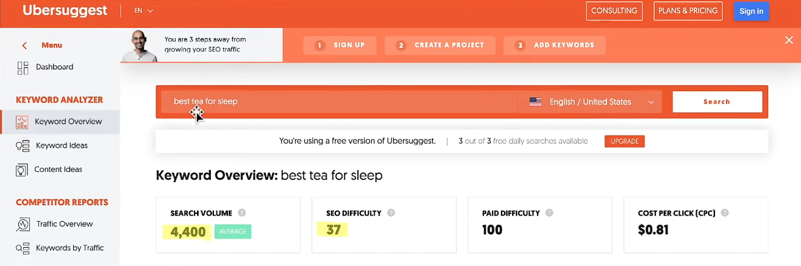
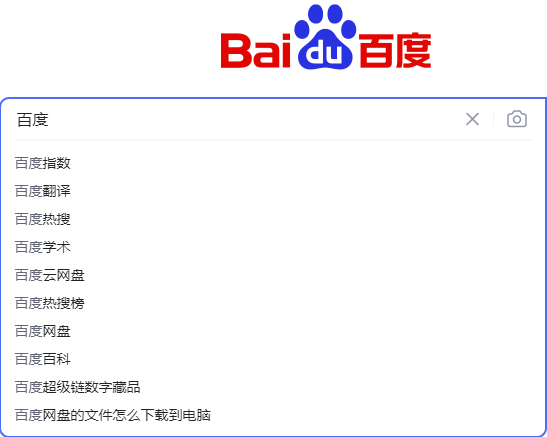
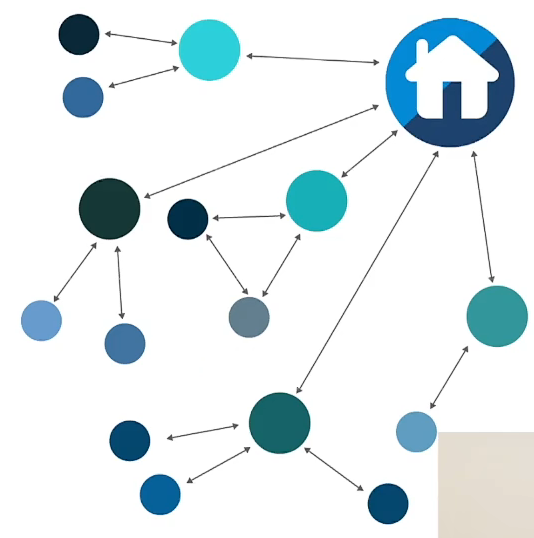

# 前言

如果想要做好 SEO，那么就需要看一下在搜索引擎中排名靠前的网站是如何做到的，通过模仿可以很大程度帮我们提示该关键词的片名。

- 标题
- 关键词
- 描述
- 内容
- 格式

# 标题优化

标题中一定要带有关键词，关键词 2-3 个

比如列表式标题：

- 10 Best Tea That Helps You Sleep
- The 6 Best Bedtime Teas That Helps You Sleep

注意避免：

- 关键词堆砌

# 关键词优化

每个页面都有对应的关键词，针对选取关键词尤为重要，主要来说关键词代表着这个页面的精炼。选取优化关键词应当避免上来就选择大而空泛的关键词，这样难度很大，比如：网购、商城等这样的关键词。

## 1. 关键词标准

相关性（Relevant） + 难度（Difficulty） + 流量（Traffic Volume）

- 相关性（与页面和网站的主要内容相关）
- 难度（主要是指由于该关键词竞争力度大，想要上搜索引擎排名第一页的难度）
- 流量（指普通用户对于该关键词的搜索量）

> 新站由于网站整体权重过低，应当选择难度适中的关键词，每月流量应当大于 100

## 2. 工具

可以通过相关工具来选择需要优化关键词：

- AHREFS
- Ubersuggest

### 1. AHREFS（付费）

- 可以查看关键词的难度
- 每日大众搜索流量
- 各个国家搜索的指数

​	

### 2. Ubersuggest

### 3. 搜索引擎

可以通过搜索引擎查看热门关键词指数

# 描述优化

- 字数 40-60
- 文章概要
- 包含 2-3 个 keywords

# 内容优化

- 研究排名靠前的内容
- 原创内容
- 字数不要太少 800 字以上就算高品质文章了

- 该话题涉及到哪些主要的论点，我可以添加哪个独特观点，读者还对哪些问题感兴趣
- 图文结合
  - 添加，比如视频、图片、信息图表等
- 有哪些第三方的研究可以引用的，增加内容的可信度
- 尽量使用自然语言让关键词散落在文章各个部分，不要集中！不要重复！
- 文章更新频率稳定

# 链接

## 1. 内部链接

内部链接的目的就是让网站内容丰富，让用户尽量长时间停留在你的网站上，停留时间越长代表该文章的价值越高

内部链接作用：

- 增加网站的点击率
- 增加用户停留时长
- 增加蜘蛛的爬行（留存）

高质量内部链接书写标准

- 文字与链接内容匹配
- 链接文本需要存在于 keywords 中
- 链接不要过多（1%，即1000个词中，不要超过10个链接），一般一篇文章4-5个内链即可
- 不要多个链接指向同一篇文章造成大量回链
- 站在用户需求设置内部链接（最重要）

### 1. 自身内链

内部链接指页面中需要有本站其他相关页面的链接，让网站尽量形成一个链式结构

### 2. 外部内链

网页内部出现其他网站的链接，该链接一定要是与网站或网页有相关性的链接。如：

- 权威性文章链接
- 解释性链接
- 可以帮助到用户的链接

## 2. 外部链接

简单来说就是别的网站放置自己的链接，如果文章写的十分优秀，则会被其他网站引用，这也会大大增加页面的权重

如：

- 友情链接
- 文章链接

> 这些都属于外链

- 可以试着在其他知名论坛、网站发一些文章的链接。
  - 知乎
  - bilibili
- 与高质量网站交换友情链接
  - 不要超过 20个
  - 相关行业
  - 权重高

## 3. nofollow 标签

禁止蜘蛛通过内链追踪到相关网站，这样做的后果就是不会分散权重，但是友情链接最好不要这样做！

一般加 nofollow 的链接可以是

- 不需要排名的页面（关于我们、联系我们）
- reference 引用
- 客服链接
- 广告链接

# 网站结构

## 1. H1, H2, H3, H4 标签

权重依次降低，搜索引擎会根据权重来判断网页内容的重要性

- H1 标签一般应用于网站名称（一般一个页面只有一个）
- H2 标签应用于文章标题
- H3 标签应用于文章内副标题或栏目

首页

- H1 网站名称
- H2 文章标题
- H3 栏目

内容页

- H1 文章标题
- H2 文章副栏目
- H3 栏目

## 2. 图片属性

图片 Alt 和 Title 属性

- 给图片做说明
- 属性文本需要有关键词
- 属性文本尽量详细

# 技术优化

## 1. 网站打开速度

- 大于3秒扣分
- 2-3秒正常
- 小于2秒加分

优化方式：

- css 与 js 不要过多
- gzip 压缩
- 缓存优化
- 图片懒加载
- 图片剪裁、压缩
- 服务器选择

# 其他 SEO

其实 SEO 主要的目的就是为了获取流量，因此像 FB、Quara、邮件、Tiktok 之类获取的流量也算作 SEO 范畴之内

# 后期优化

Google Console 或 Ahrefs 之类的工具做流量分析，查看来访你各个页面的用户的行为，如：

- 是通过什么关键词进入的网站
- Landing Page 是哪些

针对访问量大的页面先做关键词及内容的优化，然后再慢慢做其他小流量的页面。

- 查看页面的 Landing Page
- 找到该页面的关键词入口
- 查看搜索引擎对这个关键词的排名靠前的网站
  - 对比，然后在自己网站中加入自己没有的关键词、标题、内容

如果排名很靠前，但是如果 CTR （点击率）比较低的话，那么可能是文章标题不够吸引人造成的，这就需要进行标题优化

# SEO 错误

- 不要在 Url 中包含日期
- 不要使用空泛的关键词，而是站在用户的角度想想他们一般搜索的关键词是什么
- 堆砌关键词（一定要使用自然语言让关键词散落在文章中）
- 最好是网站基本结构搭建完成再上传，不要在上线后改来改去

