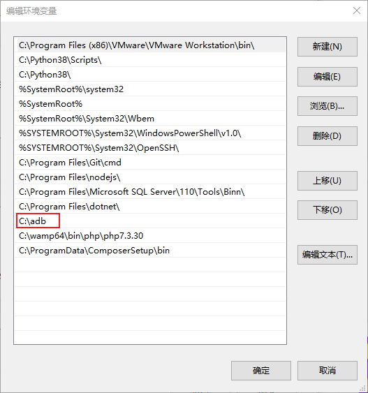
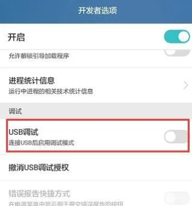
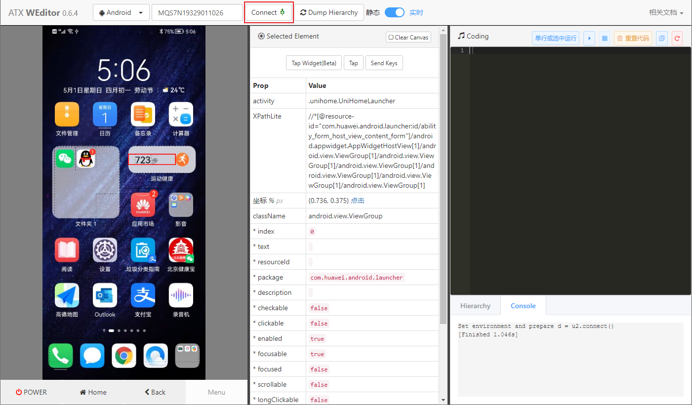

# 环境配置

安装 uiautomator2

~~~
pip install uiautomator2
~~~

安装 adb

https://adb.clockworkmod.com/

https://developer.android.com/studio/releases/platform-tools

配置环境变量

打开手机开发者模式中 USB 调试

测试代码

~~~python
import uiautomator2 as u2

# 连接手机
device = u2.connect()

# 打开测试 APP
device(text="阅读").click()

~~~

# 手机连接与管理

## 1. 通过 USB 连接

默认连接使用 USB 连接

~~~python
device = u2.connect()
~~~

多台设备的话，可以传入 device 名称

~~~python
device = u2.connect('MQS7N19329011026')
~~~

> 设备名称使用 `adb devices` 查看

## 2. 通过 wifi 连接

~~~python
device = u2.connect('http://192.168.1.10')
device = u2.connect('http://192.168.1.10:7912')
~~~

> 默认端口为 7912，可以使用 `adb forward --list` 查看

也可以通过 u2.connect_wifi 这种方式进行无线连接

~~~python
device = u2.connect_wifi('192.168.1.10')
device = u2.connect_wifi('192.168.1.10:7912')
~~~

查看设备信息

~~~python
print(device.device_info)
~~~

# APP 操作

## 1. 安装 APP

~~~python
# 安装 APP
url = 'https://url.apk'
device.app_install(url)
~~~

## 2. 启动 APP

- 通过点击方式启动 APP

~~~python
device(text="阅读").click()
~~~

- 通过包名启动 APP

~~~python
device.app_start('com.huawei.hwireader')
~~~

区别：点击形式启动 APP ，手机当前界面上必须显示该 APP，而包名不论在哪个页面都可以直接启动 APP

## 3. 获取正在运行 APP 信息

~~~python
print(device.app_current())
~~~

> 可以获得 package 及  activity

通过包名，使用 app_info 还可以查看该 APP 更详细的信息

~~~python
print(device.app_info('com.huawei.hwireader'))
~~~

## 4. 关闭 APP

通过包名关闭 APP

~~~python
device.app_stop('com.huawei.hwireader')
~~~

## 5. 卸载 APP

卸载需要 APP 的包名，运行需要卸载的 APP

~~~python
device.app_uninstall('com.huawei.hwireader')
~~~

## 6. 其他 API

~~~python
# 列举正在运行的 app
print(device.app_list_running())

# 清除 app 数据
device.app_clear(pkg_name)
~~~

# 获取 app 包名的几种方法

## 1. 通过代码获取 APP 包名

~~~python
# 需要先手动运行APP
print(device.app_current())

# 列出所有 APP 包名（不易查找）
print(device.app_list_running())
~~~

## 2. 通过 adb 指令

以下两条命令都是通过 adb 指令查找当前运行app的包名

~~~python
adb shell dumpsys activity | find "mFocusedActivity"
adb shell dumpsys activity top | findstr ACTIVITY
~~~

## 3. aapt

通过 app 安装包 apk 文件来查找包名

~~~python
aapt dump badging file.apk
~~~

> 需要配置环境变量

# 设备操作

~~~python
# 查看设备信息
print(device.info)

# 查看屏幕大小
print(device.window_size())

# 截屏操作，可以代路径
device.screenshot(r'd:/test.png')
~~~

# 文件操作

~~~python
# 推送文件
d.push(r'd:/cases.xlsx', r'sdcard/download')
# 推送并重命名到文件夹下
d.push('1.txt','sdcard/downloacd/2.txt')

# 提取文件
d.pull(r'/data/demo.txt', r'd:/data/demo.txt')
~~~

# 屏幕操作

亮屏、息屏操作

~~~python
# 亮屏
d.screen_on()							

# 息屏
d.screen_off()							

# 解锁
d.unlock()
~~~

设置旋转方向

~~~python
# 设定orientation(方向) 和 冻结旋转.
d.set_orientation("n") # 或"natural"
d.set_orientation("l") # 或"left"
d.set_orientation("r") # 或"right"
d.set_orientation("n") # or "natural"

# 冻结旋转
d.freeze_rotation()
# 取消冻结旋转
d.freeze_rotation(False)
~~~

Toast 信息

~~~python
d.toast.show("Hello world")
d.toast.show("Hello world", 1.0) # show for 1.0s, default 1.0s
~~~

# 按键操作

~~~python
d.press('home')
d.press('back')
d.press('left')
d.press('right')
d.press('up')
d.press('down')
d.press('center')
d.press('menu')
d.press('search')
d.press('enter')
d.press('delete')
d.press('recent()')						# 最近运行过的 APP (清APP内存界面)
d.press('camera')
d.press('volume_up')
d.press('volume_down')
d.press('volume_mute')
d.press('power')
~~~

也可以直接使用 keycode，如 volume_down 的 keycode 是 25

~~~python
d.press(25)
~~~

> keycode 参考：https://blog.csdn.net/u012014531/article/details/112990547

# 坐标操作（点击、滑动、拖拽）

~~~python
# 点击操作
d.click(x, y)

# 长按操作
d.long_click(x, y)
d.long_click(x, y, 0.5) # long click 0.5s (default)

# 滑动操作
d.swipe(sx, sy, ex, ey)
d.swipe(sx, sy, ex, ey, 0.5) # swipe for 0.5s(default)

# 扩展滑动操作（设置屏幕百分比）
d.swipe('left', scale=0.5)

# 拖拽操作
d.drag(sx, sy, ex, ey)
d.drag(sx, sy, ex, ey, 0.5) # swipe for 0.5s(default)
~~~

注意: click, swipe, drag 支撑百分比位置。例:

~~~python
d.long_click(0.5, 0.5) #长按屏幕中心
~~~

# Weditor 可视化元素定位

安装

~~~
pip install weditor
~~~

直接在 termial 运行 weditor

- Connect 连接设备
- Dump Hiearchy 加载当前界面
- 实时 / 静态

## 1. 文本定位

精确文本

~~~python
e = d(text='分类')
~~~

包含文本

~~~python
e = d(textContains='直播')
~~~

正则匹配

~~~python
e = d(textMatches='.*指南.*')
~~~

起始文本

~~~python
e = d(textStartsWith='假期')
~~~

## 2. 属性组合定位

~~~python
e = d(resourceId='com.huawei.appmarket:id/icon', text='安装')
~~~

选择器支持以下参数：

- text, textContains, textMatches, textStartsWith
- className, classNameMatches
- description, descriptionContains, descriptionMatches, descriptionStartsWith
- checkable, checked, clickable, longClickable
- scrollable, enabled,focusable, focused, selected
- packageName, packageNameMatches
- resourceId, resourceIdMatches
- index, instance

## 3. xpath 定位

~~~python
d.xpath('//*[@text="应用市场"]').click()
~~~

## 4. 列表元素定位

有时屏幕上有包含相同特点（例如文本）的多个对象，

~~~python
# index 属性或 instance 选定列表中元素的位置（从0开始）
e = d(resourceId='com.huawei.appmarket:id/icon',index=1)
e = d(resourceId='com.huawei.appmarket:id/icon',instance=1)
~~~

~~~python
# 获取当前屏幕上带有文本“Add new”的元素的总数
d(text="Add new").count

# len函数与count属性功能相同
len(d(text="Add new"))

# 通过index获取元素实例
d(text="Add new")[0]
d(text="Add new")[1]
~~~

遍历列表元素：

~~~python
arr = d(resourceId="cn.xuexi.android:id/general_card_title_id")
for i in arr:
    print(i.info)
~~~

## 5. 层级关系定位

上下层级关系

~~~python
# 获取 child 或 grandchild（递归获取）
d(className="android.widget.ListView").child(text="Bluetooth")
~~~

兄弟层级关系

~~~python
# 只有一个兄弟元素
d(text="Google").sibling()

# 指定兄弟元素
d(text="Google").sibling(className="android.widget.ImageView")
~~~

位置关系（速度较慢）

我们可以用相对位置的方法来获取当前视图中的对象: left, right, top, bottom.

~~~python
d(A).left(B)	# 表示选择A左侧的B.
d(A).right(B)	# 表示选择A右侧的B.
d(A).up(B)		# 表示选择A上方的B.
d(A).down(B)	# 表示选择在A下面的B.
~~~

# 元素常用方法

## 1. 点击操作

~~~python
# 点击UI对象的中心
d(text="Settings").click()

# 最长等待（元素显示）10秒，并单击（默认值），超时没有显示会报错
d(text="Settings").click(timeout=10)

# click别名，键盘操作的短名
d(text="Settings").tap()

# 不等element show
d(text="Settings").tap_nowait()
~~~

点击操作也有全局设置

~~~python
# 设置每次单击UI后再次单击之间延迟1.5秒
d.click_post_delay = 1.5  # 默认无延迟
~~~

## 2. 长按操作

~~~python
# 长按指定ui object
d(text="Settings").long_click()
~~~

## 3. 拖动

注意：在Android 4.3之前无法设置拖动.

~~~python
# 拖动ui object到point (x, y)
d(text="Settings").drag_to(x, y, duration=0.5)

# 拖动ui object 到另一个ui object(中心)
d(text="Settings").drag_to(text="Clock", duration=0.25)
~~~

## 4. 滑动

~~~python
# 元素滑动，steps 为滑动距离切段总数
d(text='Setting').swipe('down', steps=10)
~~~

## 5. 两点手势

~~~python
d(text="Settings").gesture((sx1, sy1), (sx2, sy2), (ex1, ey1), (ex2, ey2))  # s起点，e终点
~~~

~~~python
# 注意：在Android 4.3之前无法设置缩放.
# 从边缘到中心。
d(text="Settings").pinch_in(percent=100, steps=10)
# 从中心到边缘
d(text="Settings").pinch_out()
~~~

## 6. 判断元素是否存在

~~~python
# 返回布尔值，如果存在则为True，否则为False
d(text="Settings").exists()

# 另一种写法
d.exists(text="Settings") 

# 设置等待时间
d(text="Settings").exists(timeout=3) 

~~~

## 7. 文本操作

~~~python
# 获取文本
d(text="Settings").get_text() 

# 设置文本
d(text="Settings").set_text("My text...") 

# 清除文本
d(text="Settings").clear_text() 

~~~

## 8. 获取元素属性

~~~python
# 获取特定UI对象的信息
d(text="Settings").info

# 获取元素中心点
d(text="Settings").center()
~~~

## 9. 等待方法

~~~python
# 默认等待
time.sleep(10)
~~~

封装好的等待方法 wait，首先需要设置一个默认等待时间（默认20s）

~~~python
# 属性方式设置等待时间
d.wait_timeout = 30

# 函数方法设置等待时间
d.implicitly_wait(30)
~~~

> 效果一样

在对元素进行操作时，如果超时则返回 False

~~~python
# 等待 app 启动
d.app_start("com.huawei.hwireader", wait=True)

# 等待ui对象出现
d(text="Settings").wait(timeout=3.0) # return bool

# 等待ui object消失
d(text="Settings").wait_gone(timeout=1.0)
~~~

## 滚动方法

对(可滚动)ui对象执行fling

~~~python
# fling默认垂直向前 
d(scrollable=True).fling()
# fling水平向前
d(scrollable=True).fling.horiz.forward()
# fling垂直向后
d(scrollable=True).fling.vert.backward()
# 垂直fling到开始
d(scrollable=True).fling.h或iz.toBeginning(max_swipes=1000)
# 垂直fling到末尾
d(scrollable=True).fling.toEnd()
~~~

对(可滚动)ui对象执行scroll

~~~python
# scroll 默认垂直向前
d(scrollable=True).scroll(steps=10)
# scroll水平向前
d(scrollable=True).scroll.h或iz.forward(steps=100)
# scroll垂直向后
d(scrollable=True).scroll.vert.backward()
# 水平scroll到开始
d(scrollable=True).scroll.h或iz.toBeginning(steps=100, max_swipes=1000)
# 垂直scroll到末尾
d(scrollable=True).scroll.toEnd()
# scroll 向前垂直，直到出现指定ui object 
d(scrollable=True).scroll.to(text="Security")
~~~

# Watcher

watcher是一个观察者，它可以检测到设备页面中的变化，比如某个文本/描述/类名等的**出现**或者**改变**，然后进行下一步的点击/按钮操作

## 1. 注册 watcher

注册一个名字为 “WATCHER_NAME” 的 watcher，当存在 UiSelector 满足 “text='确认'” 的时候，执行点击操作

~~~python
d.watcher("WATCHER_NAME").when(text="确认").click(text="确认")

# Same as
d.watcher("ALERT").when(text="OK").click()
~~~

满足多个条件

~~~python
d.watcher("WATCHER_NAME2").when(text="OK").when(text="Wait").press("back", "home")
~~~

## 2. 开启 Watcher

watcher注册了，并不代表已经生效，需要手动开启它

~~~python
d.watchers.watched = True
~~~

使用这种方法，则会启动所有的观察者，并一直运行在手机后台，在你不想使用它的时候，需要使用 `d.watchers.watched = False` 手动关闭；当然，你也可以使用下方的 remove 方法移除某个 watcher，如此它便不会再生效

~~~python
d.watchers.run()
~~~

> 使用 *d.watchers.run()*，则与方法（1）不同，它是在这条命令执行的**瞬时**启动一次，结束后便不会再触发

## 3. 其他功能

查看当前 watcher

~~~python
d.watchers
~~~

移除 watcher， 从已注册的 watchers 移除某个/全部 watcher

~~~python
# remove the named watcher
d.watcher("watcher_name").remove()
 
# or this way
d.watchers.remove("watcher_name")
 
# remove all registered watchers
d.watchers.remove()
~~~

判断 某个/所有观察者中的某个 是否已经被触发过

~~~python
d.watcher("watcher_name").triggered
# true in case of the specified watcher triggered, else false
 
d.watchers.triggered
#  true in case of any watcher triggered
~~~

如果一个watcher被触发过，这个信息经过我本地测试 应当也是被存储在手机后台的，你需要使用 d.watchers.reset() 来重置

~~~python
# reset all triggered watchers, after that, d.watchers.triggered will be false.
d.watchers.reset()
~~~

## 4. 使用案例

watcher的设计思路主要是为了解决一些 弹窗 或者 确认框 问题，比如需要点击“确定”、“下一步”、“允许”等，这里我以 手机自动挂断功能 为例来展示watcher的简单使用：

~~~python
import uiautomator2 as u2
 
 
# 连接被叫设备
d = u2.connect('******')
 
# 注册一个名字为"DECLINE"的watcher，当存在UiSelector的description="拒绝"时，点击
d.watcher("DECLINE").when(description="拒绝").click()
 
# 查看DECLINE是否已经 注册 且 触发过
print("Triggered 1:", d.watcher("DECLINE").triggered)
 
# 启动方法1：后台启动，持续监控
d.watchers.watched = True
# d.watchers.watched = False
 
# 启动方法2：瞬时启动
# d.watchers.run()
 
# 查看DECLINE是否已经 注册 且 触发过
print("Triggered 2:", d.watcher("DECLINE").triggered)
 
# 重置watchers的triggered状态
d.watchers.reset()
 
# 重置后，查看DECLINE是否已经 注册 且 触发过
print("Triggered 3:", d.watcher("DECLINE").triggered)
 
# 查看当前已经注册的watchers
print("Watchers 1:", d.watchers)
 
# 移除DECLINE这个watcher
# d.watcher("DECLINE").remove()
 
# 移除后，查看当前已经注册的watchers
# print("Watchers 2:", d.watchers)
~~~

