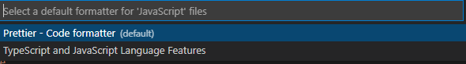

# 快捷键

| 快捷键                   | 作用                           |
| ------------------------ | ------------------------------ |
| CTRL + G                 | 跳转指定行数                   |
| CTRL + \                 | 分屏                           |
| CTRL + ]                 | 相当于 TAB                     |
| SHIFT + TAB 或 CTRL + [  | TAB 反向操作                   |
| Ctrl+C 、 Ctrl+X、Ctrl+V | 复制或剪切当前行/当前选中内容: |
| Shift+Alt+F              | 代码格式化                     |
| Alt+Up 或 Alt+Down       | 向上或向下移动一行             |
| Alt+Shift+Down           | 快速复制当前行到下一行         |
| Ctrl+Shift + K           | 删除当前行                     |

选中多个标签内容

CTRL + ALT + 左右 切换标签

CTRL + ALT + 上下 选中多个标签

SHIFT + 左右 选中一个字符

CTRL + SHIFT + 右 选中单词（不论长度）

CTRL + D 选中单词，多按一次就多选中一个相同单词

ALT + 上下  移动换行

| 快捷键           | 作用         |
| ---------------- | ------------ |
| CTRL + SHIFT + P | 打开设置菜单 |

折叠注释快

解决代码被注释后就无法折叠的问题

~~~html
// #region 
// 注释代码
// #endregion
~~~

# EMMET 语法

快速创建 class

~~~
.classname
a.classname
nav.navbar.navbar-expand-lg.bg-dark.navbar-dark		// 创建多个 class 标签
~~~

快速创建 id

~~~
#idname
a#idname
~~~

快速生成嵌套结构

~~~
ul>li{这是第 $ 个 li}*6>a
~~~

生成 fake message

~~~
lorem
lorem*3
lorem3
~~~

# VScode 插件

## 1. ESLint

ESLint是一个用来识别 ECMAScript 并且按照规则给出报告的代码检测工具，使用它可以避免低级错误和统一代码的风格。

ESLint 规则网址：

https://eslint.bootcss.com/

### 1.1. 更改缩进

Tab 缩进默认为 4 个空格，ESLint 统一风格中，Tab 缩进为2个空格

点击齿轮 -> Setting -> Tab 缩进

搜索 Tabsize ，在其他插件中把 Tabsize 也更改为2个空格

### 1.2. 保存后自动格式化

同样在 Setting 中搜索 Format，然后找到 Format on Save

### 1.3 插件配置

Setting.json

~~~json
    // ESLint 配置
    "editor.codeActionsOnSave": {
        "source.fixAll": true,
    },
    "eslint.alwaysShowStatus":true,
~~~

## 2. Prettier

~~~json
// Prettier 配置
"prettier.configPath": "C:\\Users\\Forece\\.prettierrc,",
"prettier.trailingComma": "none",
"prettier.semi": false,
"prettier.printWidth":300,
"prettier.singleQuote": true,
"prettier.arrowParens": "avoid",

// Vetur 插件 HTML 代码格式化
"vetur.format.defaultFormatter.html": "js-beautify-html",
"vetur.ignoreProjectWarning": true,
"vetur.format.defaultFormatterOptions": {
    "js-beautify-html": {
        "wrap_attributes": false
    },
    "prettier": {
        "trailingComma": "none",
        "semi": false,
        "singleQuote":true,
        "arrowParens": "avoid",
        "printWidth": 300,
    }
},
~~~

配置 Vue 和 Js 文件的默认格式化工具为 Prettier

