笔记来源：

黑马程序员刘龙斌 Vue 教程：

https://www.bilibili.com/video/BV1zq4y1p7ga?p=207&spm_id_from=pageDriver


尚硅谷天禹 Vue 教程

https://www.bilibili.com/video/BV1Zy4y1K7SH?spm_id_from=333.999.0.0


# Vue 介绍

## 1. Vue 概要

Vue 是一套用于 **构建用户界面** 的 **渐进式**  Javascript 框架

- 构建用户界面：将数据转换为界面
- 渐进式： Vue 可以自底向上逐层应用（从底层 100kb 基本框架到支持各种 Vue 插件）


作者：尤雨溪

- 2013年， 受到 Angular 框架的启发，尤雨溪开发出了一款轻量框架 - Seed，同年12月，Seed 更名为 Vue，版本号 0.6.0
- 2014年，Vue 正式对外公布，版本号 0.8.0，Taylor otwell 在 Twitter 上发表动态，说自己正在学习 Vue.js
- 2015年， 10月27日，正式发布 Vue 1.0.0 Evangelion（新世纪福音战士）
- 2016年，10月1日，正式发布 Vue 2.0.0 Ghost in the Shell （攻壳机动队）
- 2020年，9月18日，正式发布 Vue 3.0.0 One Piece （海贼王）


官网：

1. 英文官网: https://vuejs.org/
2. 中文官网: https://cn.vuejs.org/


学习 Vue 之前需要掌握的前置知识

- ES6 语法规范
- ES6 模块化
- 包管理器
- 原型、原型链
- 数组常用方法
- axios
- promise


##  2. Vue 特性

Vue 不支持 IE8 及以下版本，因为 Vue 使用了 IE8 无法模拟的 ECMAScript 5 特性。但它支持所有兼容 ECMAScript 5 的浏览器。


### 2.1 数据驱动视图

在使用了 Vue 的页面中， Vue 会监听数据的变化，从而自动重新渲染页面的结构，示意图如下：


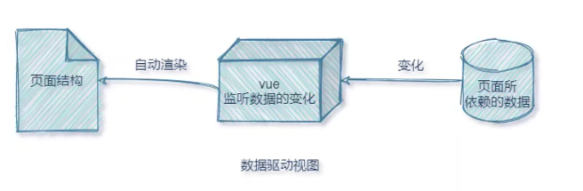


- 当页面数据发生变化时，页面会自动重新渲染


### 2.2 组件化模式

采用组件化模式，提高代码复用率、且让代码更好维护

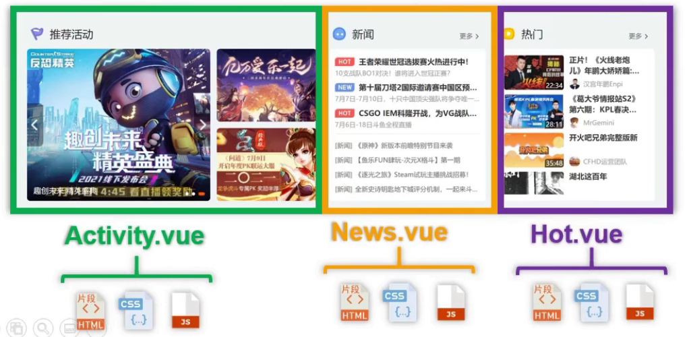


### 2.3 声明式编码

声明式编码，让编码人员无需直接操作 DOM，提高开发效率。

命令式编码：原生 Js 开发，是直接操作 DOM

~~~js
persons == [
    {id:'001',name:'张三',age:18},
    {id:'002',name:'李四',age:19},
    {id:'003',name:'王五',age:20}
]
let htmlStr = ''
persons.forEach(p=>{
    htmlStr += `<li>${p.id} - ${p.name} - ${p.age}</li>`
})

let list = document.getElementById('list')
list.innerHTML = htmlStr
~~~


声明式编码：

类似于模板引擎，通过模板语法将数据显示到对应位置

~~~vue
<ul id="list">
    <li v-for="p in persons">
        {{p.id}} - {{p.name}} - {{p.age}}
    </li>
</ul>
~~~


### 2.4 虚拟 DOM

- 使用虚拟 DOM + 优秀的 Diff 算法，尽量复用 DOM 节点

1. 原生 Js 实现是将 DOM 数据重新组合成 HTML 代码，然后加载到页面

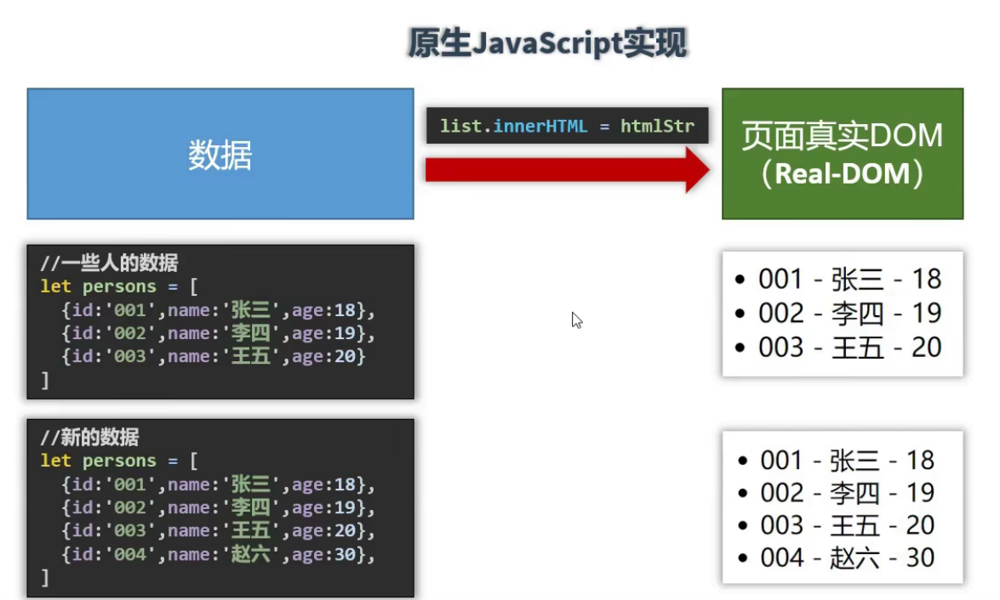


2. Vue 中的虚拟 DOM 是对新数据进行对比，原数据可以复用。然后只针对改动数据进行处理。

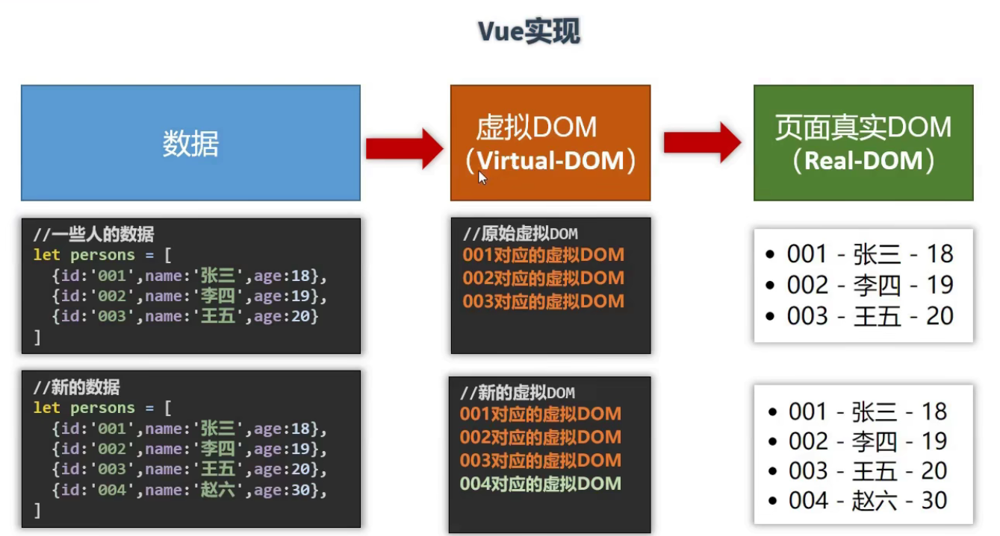


## 3. Hello World

### 3.1 准备工作

#### 下载 Vue

可以通过引入官网下载的本地 Vue.js 来进行开发，也可以通过直接引用网络上 CDN 提供的 Vue.js 进行开发，Vue 的版本：

- 生产版本
- 开发版本


生产环境文件，删除了警告，适用于项目

~~~html
<!-- 生产环境版本，优化了尺寸和速度 -->
<script src="https://cdn.jsdelivr.net/npm/vue@2.6.14"></script>
~~~


开发环境，包含完整的警告和调试模式，适用于学习使用

~~~html
<!-- 开发环境版本，包含了有帮助的命令行警告 -->
<script src="https://cdn.jsdelivr.net/npm/vue@2.6.14/dist/vue.js"></script>
~~~


国内CDN

~~~html
<script src="https://cdn.bootcdn.net/ajax/libs/vue/2.6.9/vue.js"></script>
<script src="https://cdn.bootcdn.net/ajax/libs/vue/2.6.9/vue.min.js"></script>
~~~


#### 下载 Vue 开发者工具

在使用 Vue 时，我们推荐在你的浏览器上安装 [Vue Devtools](https://github.com/vuejs/vue-devtools#vue-devtools)。它允许你在一个更友好的界面中审查和调试 Vue 应用。


出现 vue.js not detected 错误的解决办法：下载后需要修改插件配置

- 允许访问文件网址


如果出现 Devtools inspection is not available because it's in production mode or explicitly disabled 错误，这是因为引包的是 min.js 生产版本，应当使用 vue.js 开发者版本的 js 文件。


#### 关闭开发者模式提示

~~~html
<script>
    // 阻止 Vue 在启动时产生的开发版本提示
    Vue.config.productionTip = false        
</script>
~~~

> Vue 是引入 Vue.js 后的自动创建的一个对象，就像 JQuery 中的 jquery 和 $ 一样。通过 Vue 对象我们可以完成各种操作，其中 Vue.config 是 Vue 的属性，存放一些 Vue 配置。


### 3.2 基本使用

- 引包
- 创建 vue 对象，传入一个配置对象，设置 el 和 data 属性
- 使用模板语法将数据渲染

~~~html
<!DOCTYPE html>
<html lang="en">
  <head>
    <meta charset="UTF-8" />
    <meta http-equiv="X-UA-Compatible" content="IE=edge" />
    <meta name="viewport" content="width=device-width, initial-scale=1.0" />
    <title>Document</title>
  </head>

  <body>
    <!-- 导包 -->
    <script src="https://cdn.jsdelivr.net/npm/vue@2.6.14/dist/vue.js"></script>

    <!-- 创建一个容器 -->
    <!-- 使用模板语法将数据渲染 -->
    <div id="app">{{ message }}</div>

    <script>
      // 创建 vue 对象，设置 el 和 data 属性
      var app = new Vue({
        el: "#app",
        data: {
          message: "hello world",
        },
      });
    </script>
  </body>
</html>
~~~


#### 容器

- 容器代码依然符合 html 规范，只不过混入一些特殊的 Vue 语法（模板语法）

~~~html
<div id="app">{{ message }}</div>
~~~


#### Vue 实例

- 想让 Vue 工作，必须创建一个 Vue 实例，并且需要传入一个配置对象，对象中包括 el（容器），以及 data（数据）

~~~html
<script>
    var app = new Vue({
        el: "#app",
        data: {
            message: "hello world",
        },
    });
</script>
~~~


el：用于指定当前 Vue 实例为哪个容器服务，值通常为 css 选择器字符串

- 只针对双标签如：`<div> </div>`
- 可重复使用模板调用，在相同 el 指定的 id 下，可重复使用 {{ message }} 进行调用
- 可直接使用标签，如： `el: div` ，建议使用 id 标签
- 不能使用 html 和 body 标签


data: 用于存储数据，数据提供 el 所指定的容器去使用，值一般为一个对象

- 可以导入普通对象，数组，对象

~~~json
data: {
  msg: "hello",
  school: {
    name: "黑马",
    phone: "800-1234-5678"
  },
  campus: [0,1,2,3,4,5]
}
~~~


- data 如果只有一个属性，直接使用属性名调用 `{{ msg }}` 

- data 属性是对象： `{{ school.name }}`
- data 属性是数组： `{{ campus[0] }}`


#### Vue 实例与容器关系

Vue 实例与容器是一一对应的关系，一个实例只能对应一个容器

~~~html
<div class="app">容器1：{{ message }}</div>
<div class="app">容器2：{{ message }}</div>

<script>
    var app = new Vue({
        el: ".app",
        data: {
            message: "hello world",
        },
    });
</script>
~~~

> 虽然容器 el 选择的是 class 同为 app 的容器，但是 Vue 实例只会寻找第一个容器


一个容器只对应一个实例，下方例子中，一个容器对应了两个实例，只有第一个实例有效

~~~html
<div id="root">
        <h1>hello,{{name}},{{address}}</h1>
</div>

<script>
    new Vue({
        el: '#root',
        data: { 
            name:'Jack'
        },
    })
    
    new Vue({
        el: '#root',
        data: { 
            address:'山东'
        },
    });
</script>
~~~


## 4. MVVM 模型

MVVM: Model-View-ViewModel 是一种软件架构模式，是 Vue 实现数据驱动视图和双向数据绑定的核心原理。MVVM 指的是 Model、View 和 ViewModel，它把每个 HTML 页面都拆分成了这三个部分：

- M：Model 表示当前页面渲染时所依赖的数据源，对应data中的数据
- V： 视图 (View) 模板，表示当前页面所渲染的 DOM 结构
- VM：视图模式 (ViewModel) Vue 的实例对象


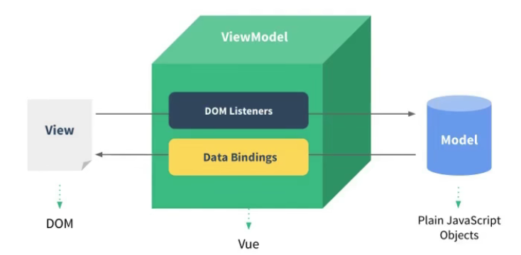


基本代码与 MVVM 的对应关系

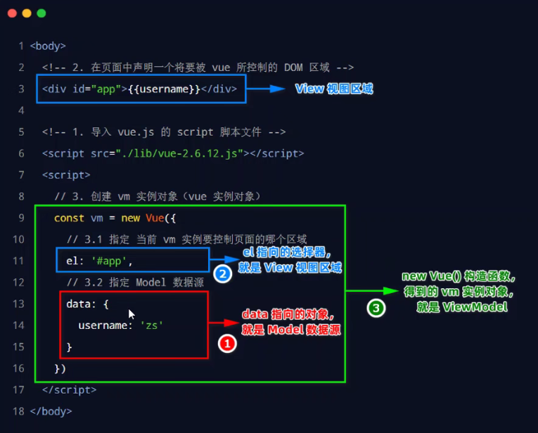


- VM 通过读取 Model 中的数据展示在 DOM（页面） 上
- VM 通过监听 DOM 数据的改变（v-model）对 Model 数据进行改变


所以，vm 一般用于接受我们所创建的 Vue 实例，如：

~~~html
const vm = new Vue({})
~~~


vm 这个实例可以调用 Vue 实例中的所有属性和方法，而 data 实际上最后也是 vm 中的一个属性，因此在容器中我们可以直接调用 vm 的所有属性和方法，如：

~~~html
<div id="root">
    {{name}}
    {{$options}}
    {{$emit}}
</div>
~~~


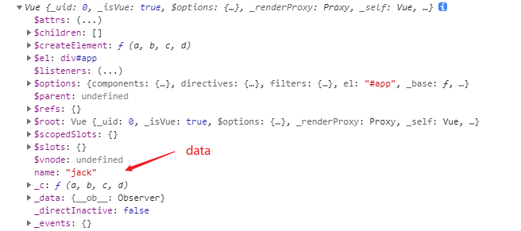


同时也包括实例原型中的属性和方法：

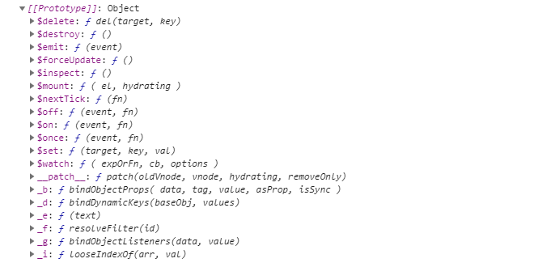


## 5. VS Code 插件

- Vue snippet
- Vetur
- pathautocomplete

~~~
// 导入文件时是否携带文件的扩展名
"path-autocomplete.extensionOnimport":true,
// 配置 @ 的路径提示
"path-autocomplete.pathMappings":{
"@":"${folder}/src"
},
~~~


创建 vue 组件时，直接使用快捷指令 `<vue` 即可快速创建模板，和 HTML 的 `!` 类似


# Vue 指令

指令（Directives）是 Vue 为开发者提供的模板语法，用于辅助开发者渲染页面的基本结构。


Vue 中的指令按照不同的用途可以分为如下6大类：

- 内容渲染指令
- 属性绑定指令
- 事件绑定指令
- 双向绑定指令
- 条件渲染指令
- 列表渲染指令


## 1. 内容渲染指令

内容渲染指令用来辅助开发者渲染 DOM 元素中的文本内容，常用内容渲染指令有如下3个：

- {{}}
- v-text
- v-html


### 1.1 插值语法

插值语法用于解析标签体中的内容，如：

~~~html
<div id="app">{{ message }}</div>
~~~


容器中的差值语法 {{ }} ，除了可以调用 Vue 实例中的 data 对象的所有属性，还可以填写 js 表达式，如：

~~~js
{{ 1 + 1 }}
~~~


- JS 表达式：

~~~js
a
a + b
demo(1)
x == y ? 'a' : 'b'
Date.now()
url.toUpperCase()
~~~

> 表达式可以产生一个值


- JS 语句

~~~js
if(){}
while(){}
for(){}
~~~

> 这些都是控制语句，不能代表一个值


### 1.2 v-text

使用 v-text 标签显示 data 内容，将 data 内容渲染到标签内部

~~~html
<h2 id="app" v-text="message"></h2>
~~~


注意：如果标签内部已经有值的情况，使用 v-text 会覆盖掉原有值，如：

~~~html
<p id="app" v-text="message">文本</p>
~~~

> 文本会被 data 中的 message 值替换


如果需要添加指定文字可以利用插值语法或字符串拼接的方式：

~~~html
<h2 id="app" v-text="message + 'abc'"></h2>
<h2 id="app">{{ message + 'abc' }}</h2>
<h2 id="app">{{ message }}abc</h2>
~~~


### 1.3 v-html

v-text 和插值表达式只能渲染纯文本内容，如果要把包含 HTML 标签的字符串渲染为页面的 HTML 元素，则需要用到 v-html 指令，v-html 可以将 html 代码进行解析显示。

~~~html
<h2 id="app" v-html="msg"></h2>
    <script>
        var app = new Vue({
            el: "#app",
            data: {
                msg: "<hr/><hr/>"
            }
        })
    </script>
~~~


## 2. el 与 data 的写法

### 2.1 el 指定容器

在实例中指定容器，可以直接指定容器，如：

~~~js
new Vue ({
    el:'#app',
	data:{msg:'Hello'}        
})
~~~


还可以通过 Vue 实例中的原型方法 $mount 来绑定容器

~~~js
const v = new Vue ({
	data:{msg:'Hello'}        
})

setTimeout(() => {
    v.$mount('#app');
}, 1000);
~~~

> 可以根据需要进行容器的绑定


注意：$mount 不是实例中的方法，而是 Vue 这个类中的方法，是 Vue.prototype 中定义的方法。


### 2.2 data 指定数据

data 的普通写法是对象式写法，就是在 data 属性中传入一个对象，如：

~~~js
data:{msg:'Hello'}
~~~


第二种写法是函数式写法，返回值必须是一个对象：

~~~js
data: function(){
    return {
        msg:'hello'
    }
}
~~~

> 组件中必须使用函数式定义 data


在 data 函数中如果使用 this ，那么这个 this 指向的是 Vue 这个实例对象

~~~js
data: function(){
	console.log(this)
    return {
        msg:'hello'
    }
}
~~~

> 由Vue管理的函数，一定不要写箭头函数，一旦写箭头函数，this就不再是Vue实例了


简写

~~~js
data(){
	console.log(this)
    return {
        msg:'hello'
    }
}
~~~

> 相当于在对象中定义了一个函数，然后通过函数拿到返回值（又是一个对象）


## 3. 属性绑定指令

指令语法用于解析标签（包括：标签属性、标签体内容、绑定事件…………）


### 3.1 数据绑定 v-bind

内容节点是被标签包裹的内容，而属性节点是标签的属性值，如：


- 内容节点

~~~html
<h2>内容节点</h2>
~~~

- 属性节点

~~~html
<input type="text" placeholder="属性节点">
~~~


当我们需要让一个元素的属性作为动态数据改变时，我们无法直接使用插值语法实现，如：

~~~html
<div id="app">
    hello {{ name }}<br/>
    <a href="{{url}}">跳转链接</a>
</div>


<script>
    // 创建 vue 对象，设置 el 和 data 属性
    var app = new Vue({
        el: "#app",
        data: {
            name: "jack",
            url:"https://www.forece.net",
        },
    });
</script>
~~~

> 此时 a 链接中的地址实际上是 `<a href="{{url}}">跳转链接</a>`


需要使用 v-bind 来绑定数据，如：

~~~html
<a v-bind:href="url">跳转链接</a>
~~~


简写方式：

~~~html
<a :href="url">跳转链接</a>
~~~


使用案例：

设置元素属性，如：src, title, alt, href, class 等等

~~~html
<!-- 直接绑定属性 -->

<!-- 属性中拼接字符串 -->

<!-- 三元表达式判断属性 -->

<!-- 对象方式判断属性 -->

~~~


### 3.2 双向绑定 v-model

v-bind 的数据绑定是单向数据绑定，即：

当 Vue 实例中数据变化时，容器中的数据也随之改变，但是如果容器中的数据发生改变时，Vue 实例数据不会随之改变。也就是说只有 Vue 实例中的 data 会影响容器，而容器不会影响 data。简单来说，数据只能从 data 流向页面。


v-model 则是双向绑定，数据不仅能从 data 流向页面，也可以从页面流向 data，容器或实例，只要有一方数据发生改变，另一方也做出同样改变，如：

~~~html
<div id="app">
    <input type="text" v-bind:value="name">
    <input type="text" v-model:value="name">
</div>


<script>
    // 创建 vue 对象，设置 el 和 data 属性
    var app = new Vue({
        el: "#app",
        data: {
            name: "jack",
        },
    });
</script>
~~~


- 当 v-bind 输入框数据变动时，data 值没有改变
- 当 v-model 输入框数据变动时，data 值改变，同时造成联动使 v-bind 输入框也发生改变（因为 v-bind 是依赖 data 数据的）


v-model 的简写方式：

~~~html
<input type="text" v-model="name">
~~~


注意：不是任何地方都可以使用 v-model 实现双向绑定的，如：

~~~html
<h2 v-model:x="name">Hello</h2>
~~~

> 造成 x 属性丢失，并且控制台报错


原因是因为双向绑定是用于数据交互的，如果只是读取数据那么使用插值语法或 v-bind 足够了，因为这里 h2 标签中的属性不能与用户交互产生值的变化，所以双向绑定也就没了意义。


所以一般 v-model 用于 input、textaera、select  等这类表单标签中，当应用于其他表单属性时，如 radio, checkbox, select 等表单时，v-model 会自动判断表单类型，并且修改对应属性值，如：

~~~html
<input type="checkbox" class="custom-control-input" id="customSwitch1" v-model="item.state" />
~~~

> 此时 v-model 绑定的属性就不是 value 而是 checked 属性


### 3.3 v-model 修饰符

为了方便对用户输入的内容进行处理， vue 为 v-model 提供了3个修饰符，分别是：

- number
- trim
- lazy


**number 示例**：

自动将用户输入的数据转为数值类型 

~~~html
<div id="app">
    <input v-model="n1" type="text" /> + <input v-model="n2" type="text" /> =
    {{n1 + n2}}
</div>
</body>
<script>
    const vm = new Vue({
        el: "#app",
        data: {
            n1: "",
            n2: "",
        },
    });
</script>
~~~

> {{ n1 + n2}} 的结果并不是计算结果，而是字符串拼接，我们如果想要实现计算的功能，则需要将 n1 和 n2 转换成数字型。如 `{{Number(n1) + Number(n2)}} `


同样使用 number 修饰符也可以解决这个问题

~~~html
<input v-model.number="n1" type="text" /> + <input v-model.number="n2" type="text" /> = {{n1 + n2}}
~~~


**trim 实例**

自动过滤用户输入的首尾空白字符

~~~html
<div id="app">
    <input v-model="username" type="text" />
    <button @click="showInfo">获取用户名</button>

</div>
</body>
<script>
    const vm = new Vue({
        el: "#app",
        data: {
            username: "zhangsan",
        },
        methods:{
            showInfo(){
                console.log(`"${this.username}"`);
            }
        }
    });
</script>
~~~

> 当用户在表单中添加空格时，获取的数据有可能不正确


需要将左右空格消除，可以在方法中用 js 消除，也可以使用 v-model 修饰符

~~~html
<input v-model.trim="username" type="text" />
~~~


**lazy 实例**

v-model 只要 input 框更新数据，就会对 vm 中的 data 数据进行同步。有时候我们并不想那么快的获取数据，比如用户搜索时，我们只需要最终数据，即用户完整输入的数据。我们只需要在表单用户失去焦点时获得数据即可。这时候可以使用 lazy 修饰符，在 "change" 时更新数据，而非 "input" 时更新，

~~~html
<input v-model.lazy="username" type="text" />
~~~


##  4. 事件绑定指令

Vue 提供了 v-on 事件绑定指令，用来辅助程序员为 DOM 元素绑定事件监听


### 4.1 事件绑定 v-on

~~~html
<div id="root">
    <h2>Hello {{name}} </h2>
    <!-- 通过 v-on:click 绑定鼠标点击事件，调用 showInfo 方法 -->
    <button v-on:click="showInfo">点我提示信息</button>
</div>
<script>
    vm = new Vue({
        el:"#root",
        data:{
            name:"World"
        },
        // showInfo 方法必须写在实例的配置对象 methods 属性中
        methods:{
                alert('同学你好')
            }
        }
    })
</script>
~~~


v-on 的简写方式：

~~~html
 <button @click="showInfo">点我提示信息</button>
~~~


注意：在方法中的 this，指向也是 vue 对象，如果使用了箭头函数，则指向 window


### 案例：简单购物车计数器

~~~html
<!DOCTYPE html>
<html lang="en">

<head>
    <meta charset="UTF-8">
    <meta http-equiv="X-UA-Compatible" content="IE=edge">
    <meta name="viewport" content="width=device-width, initial-scale=1.0">
    <title>Document</title>
</head>

<body>
    <!-- 导包 -->
    <!-- 生产环境版本，优化了尺寸和速度 -->
    <script src="https://cdn.jsdelivr.net/npm/vue"></script>

    <!-- 使用模板语法将数据渲染 -->
    <div id="app">
        <button @click="sub">-</button>
        <span> {{ num }} </span>
        <button @click="add">+</button>
    </div>
    <script>
        var app = new Vue({
            el: "#app",
            data: {
                num: 1
            },
            methods: {
                sub: function() {
                    if (this.num > 0) {
                        this.num--
                    } else {
                        alert('数值不能小于0')
                    }
                },
                add: function() {
                    if (this.num < 10) {
                        this.num++
                    } else {
                        alert('库存不足')
                    }
                }
            }
        })
    </script>

</body>

</html>
~~~


### 4.2 绑定事件传参

方法中定义函数

~~~js
methods:{
    showInfo(num){ 
        console.log(num)
        alert('同学你好')
    }
~~~


调用中传递参数：

~~~html
<button v-on:click="showInfo(66)">点我提示信息</button>
~~~


### 4.3 $event 事件对象

当视图中没有传递参数时，定义方法中的形参是事件对象

~~~html
<button v-on:click="showInfo()">点我提示信息</button>
~~~


~~~js
methods: {
    showInfo(e) {
        console.log(e);
    },
~~~


当视图中传递了参数，方法中的形参则会被实参代替，如同上边普通事件参数的传值，如果想要 event 与 实参同时生效，可以通过调用时把 event 关键字传入（默认也可以直接调用 event）

~~~html
<button v-on:click="showInfo($event,66)">点我提示信息</button>
~~~


~~~js
methods: {
    showInfo(event, num) {
        console.log(num);
        console.log(event);
        alert("同学你好");
    },
},
~~~

> 事件对象参数的顺序按照 $event 在实参中传递的顺序，不是必须在首位


事件的基本使用：

- 使用 v-on:xxx 或 @xxx 绑定事件，其中 xxx 是事件名
- 事件的回调需要配置在 methods 对象中，最终会在 vm 上
- methods 中配置的函数，不要用箭头函数！否则 this 就不是 vm 了
- methods 中配置的函数，都是被 Vue 所管理的函数， this 的指向是 vm 或组件实例对象
- @click="demo" 和 @click="demo($event)" 效果一致，但后者可以传参


### 4.4 Vue 实例中的 this

通过事件绑定，实现点击按钮增加数值的功能

~~~html
<div id="app">
    <p>{{count}}</p>
    <button v-on:click="add">+1</button>
</div>
</body>
<script>
    const vm = new Vue({
        el: "#app",
        data: {
            count: 1,
        },
        methods: {
            add() {
                vm.count += 1;
            },
        },
    });
</script>
~~~

> data 中的属性可以通过 vm 实例来访问，如 vm.count，所以绑定事件中更改 vm.count 就是更改 data.count 的值


add() 方法是通过 vm 实例调用的，所以 add() 方法中的 this 是指向 vm 实例的，所以代码可以改写为：

~~~js
methods: {
    add() {
        this.count += 1;
    },
},
~~~


### 4.5 事件修饰符

Vue 中的事件修饰符

- prevent 阻止默认事件（常用）
- stop 阻止事件冒泡（常用）
- once 事件只触发一次（常用）
- capture 使用事件的捕获模式
- self 只有 event.target 是当前操作元素时才触发
- passive 事件的默认行为立即执行，无需等待事件回调执行完毕


#### 阻止默认事件

a 标签的默认行为是点击后进行链接跳转，可以通过在方法中取消默认行为，如： e.preventDefault()

~~~html
<div id="root">
    <a v-on:click="showInfo" href="https://www.forece.net">点我提示信息</a>
</div>
<script>
    vm = new Vue({
        el: "#root",
        methods: {
            showInfo(e) {
                e.preventDefault();
                alert("同学你好");
            },
        },
    });
</script>
~~~


在 Vue 中，可以通过给事件添加修饰符来阻止默认行为，如：

~~~html
<a v-on:click.prevent="showInfo" href="https://www.forece.net">点我提示信息</a>
~~~


#### 阻止事件冒泡

点击子元素，会冒泡到父元素，通过给子元素添加 stop 事件修饰符，可以阻止继续冒泡

~~~html
<style>
    .father {
        width: 200px;
        height: 200px;
        background-color: pink;
    }

    .son {
        width: 100px;
        height: 100px;
        background-color: grey;
    }
</style>

<div id="root">
    <div @click="showInfo" class="father">
        <div @click.stop="showInfo" class="son">
        </div>
    </div>
</div>
<script>
    vm = new Vue({
        el: "#root",
        methods: {
            showInfo(e) {
                alert("同学你好");
            },
        },
    });
</script>
~~~


#### 事件只触发一次

只弹出一次窗口

~~~html
<div id="root">
    <button @click.once="showInfo">触发事件</button>
</div>
<script>
    vm = new Vue({
        el: "#root",
        methods: {
            showInfo(e) {
                alert("同学你好");
            },
        },
    });
</script>
~~~


#### 事件捕获模式

同冒泡事件相反，捕获阶段触发事件，即先触发父元素事件，然后再进入子元素事件。

~~~html
<style>
    .father {
        width: 200px;
        height: 200px;
        background-color: pink;
    }

    .son {
        width: 100px;
        height: 100px;
        background-color: grey;
    }
</style>

<div id="root">
    <div @click.capture="showInfo('father')" class="father">
        <div @click="showInfo('son')" class="son">
        </div>
    </div>
</div>
<script>
    vm = new Vue({
        el: "#root",
        methods: {
            showInfo(target) {
                console.log(target);
                alert("同学你好");
            },
        },
    });
</script>
~~~

> 可以看到 console 中先输出的是 father，然后是 son，即捕获顺序


#### 立即执行默认行为

默认行为即为 HTML 元素中的原本自带的行为，如：

- 点击 a 标签自动跳转
- 滑动鼠标滚轮，滚动条会移动
- 鼠标右键会弹出菜单
- 点击提交按钮会产生提交行为并自动刷新网页


当事件处理时间较长时，使用 passive，则会立即执行默认行为

~~~html
<div id="root">
    <form action="">
        <input type="text" name="name" />
        <input @click.passive="showInfo" type="submit" value="提交" />
    </form>
</div>
<script>
    vm = new Vue({
        el: "#root",
        methods: {
            showInfo() {
                for (var i = 0; i < 10000; i++) {
                    console.log("#");
                }
                console.log("累坏了");
            },
        },
    });
</script>
~~~


#### 多个事件

即要阻止冒泡，又要阻止默认行为

~~~html
<a @click.stop.prevent href="https://www.forece.net">点击</a>
~~~


### 4.6 键盘事件

- keyup
- keydown


通过按下回车在控制台中显示内容，需要给 keyup 做下判断，如果是回车则会显示

~~~html
<div id="root">
    <input type="text" placeholder="按下回车提示输出" @keyup="showInfo" />
</div>
<script>
    vm = new Vue({
        el: "#root",
        methods: {
            showInfo(e) {
                if(e.keyCode==13){
                    console.log(e.target.value);
                }
            },
        },
    });
</script>
~~~


而 Vue 给键盘事件都添加了别名，所以可以直接这样写 `@keyup.enter="showInfo"`

~~~html
<div id="root">
    <input type="text" placeholder="按下回车提示输出" @keyup.enter="showInfo" />
</div>
<script>
    vm = new Vue({
        el: "#root",
        methods: {
            showInfo(e) {
                console.log(e.target.value);
            }
        },       
    });
</script>
~~~


Vue 中常用的按键别名：

- 回车 enter
- 删除 delete（捕获 “删除” 和 “退格” 键）
- 退出 esc
- 空格 space
- 换行 tab
- 上 up
- 下 down
- 左 left
- 右 right


Vue 未提供别名的案件，可以按原始的 key 值去绑定，key 值可以通过 e.key 获取：

~~~js
console.log(e.key);
~~~


但注意要转为 kebab-case（短横线命名），如 CapsLock，在绑定键盘事件的时候，需要用短横线命名，如：

~~~html
<input type="text" placeholder="按下回车提示输出" @keyup.caps-lock="showInfo" />
~~~


特殊按键 Tab，需要使用 @keydown 事件进行绑定，因为 Tab 键本身具有移除焦点的功能，所以当使用 keyup 的事件进行绑定，按下 Tab 键后抬起，焦点已经不在元素上，所以事件失去效果。

~~~html
<input type="text" placeholder="按下回车提示输出" @keydown.tab="showInfo" />
~~~


系统修饰键：ctrl, alt, shift, meta

- 配合 keyup 使用：按下修饰键的同时，再按下其他键，随后释放其他键，事件才被触发（只有组合键，修饰键+任意键 才可以触发）
- 配合 keydown 使用：正常触发事件（单独按修饰键就可以触发）


配合 keyup 如果加了第二个按键参数，则只有指定组合才可以触发事件

~~~html
<input type="text" placeholder="按下回车提示输出" @keyup.ctrl.y="showInfo" />
~~~


也可以使用 keyCode 去指定具体案件（不推荐），通过 e.keyCode 获取 keyCode 值

~~~html
<div id="app">
    <input type="text" @keyup="showKeyInfo" value="" />
</div>
<script>
    const vm = new Vue({
        el: "#app",
        methods: {
            showKeyInfo(e) {
                console.log(e.keyCode);
            },
        },
    });
</script>
~~~


Vue.config.keyCodes.自定义键名 = 键码，可以自定义按键别名（不推荐）

~~~html
Vue.config.keyCodes.huiche = 13
~~~


## 案例：v-model 绑定表单数据

## 1. 创建表单

~~~html
<!DOCTYPE html>
<html lang="en">
    <head>
        <meta charset="UTF-8" />
        <meta http-equiv="X-UA-Compatible" content="IE=edge" />
        <meta name="viewport" content="width=device-width, initial-scale=1.0" />
        <script src="https://cdn.bootcdn.net/ajax/libs/vue/2.6.9/vue.js"></script>
        <title>v-model 表单收集数据</title>
    </head>
    <body>
        <div id="app">
            <form action="">
                账号：<input type="text"/> <br /><br />
                密码：<input type="password"/><br /><br />
                性别：男 <input type="radio" name="sex" /> 
                女 <input type="radio" name="sex" /><br /><br />
                爱好：抽烟 <input type="checkbox" name="hobby" id="" /> 
                喝酒 <input type="checkbox" name="hobby" id="" /> 
                烫头 <input type="checkbox" name="hobby" id="" /><br /><br />
                所属城市：<select name="city" id="">
                <option value="beijing">北京</option>
                <option value="shanghai">上海</option>
                <option value="guangzhou">广州</option>
                <option value="shenzhen">深圳</option>
                <option value="chongqing">重庆</option></select><br /><br />
                其他信息：<textarea name="" id="" cols="30" rows="10"></textarea><br /><br />
                <input type="checkbox" name="" id="" /> 阅读并接受<a href="#" target="_blank">用户协议</a><br /><br />
                <button>提交</button>
            </form>
        </div>
    </body>
</html>

~~~


## 2. text 表单收集数据

text 和 password 都是通过 value 值来绑定数据，用户输入的数据就是 value 值

~~~html
账号：<input type="text" v-model="account" /> <br /><br />
密码：<input type="password" v-model="password" /><br /><br />
~~~


~~~js
const vm = new Vue({
    el: '#app',
    data: {
        account: '',
        password: '',
    },
})
~~~


## 3. radio 单选框

radio 单选框需要 name 属性才可以让表单成为一组数据，如：

~~~html
男 <input type="radio" name="sex" />
女 <input type="radio" name="sex" />
~~~


如果单纯的绑定 v-model ，会出现数据为 null 的情况，这是因为 v-model 实际上是 `v-model:value = "xxx" ` 但是目前 raido 表单上没有 value 值，当用户点击单选框时，改变的只是 checked 属性，

~~~html
性别：男 <input type="radio" name="sex" v-model="sex" /> 
	 女 <input type="radio" name="sex" v-model="sex" />
~~~


如果想获取数据，我们需要给表单配置 value 值，如：

~~~html
性别：
男 <input type="radio" name="sex" v-model="sex" value="male" /> 
女 <input type="radio" name="sex" v-model="sex" value="female" /><br /><br />
~~~


vue 实例中可以配置默认值（默认勾选）

~~~js
const vm = new Vue({
    el: '#app',
    data: {
        account: '',
        password: '',
        sex: 'female',
    },
})
~~~


## 4. checkbox 复选框

同样 checkbox 复选框默认也是没有 value 值的，当被 v-model 绑定时，用户点击复选框，获取的是复选框的勾选状态值（true, false）

~~~html
爱好：
抽烟 <input type="checkbox" name="hobby" id="" v-model="hobby" /> 
喝酒 <input type="checkbox" name="hobby" id="" v-model="hobby" /> 
烫头 <input type="checkbox" name="hobby" id="" v-model="hobby" /><br /><br />
~~~


~~~js
const vm = new Vue({
    el: '#app',
    data: {
        account: '',
        password: '',
        sex: 'female',
        hobby: '',
    },
})
~~~

> 此时，如果点击复选框，三个复选框会同时勾选，或取消勾选（因为目前 v-model 绑定的是勾选状态）


当配置了 value 值后，还需要注意在 data 中的初始值，如果初始值是字符串，那么获得的依然是 checked 的勾选状态（布尔值），只有当初始值是数组时，哪个 checkbox 被勾选，其 value 值就会被添加到这个数组中。

~~~html
爱好：
抽烟 <input type="checkbox" name="hobby" id="" value="smoke" v-model="hobby" /> 
喝酒 <input type="checkbox" name="hobby" id="" value="drink" v-model="hobby" /> 
烫头 <input type="checkbox" name="hobby" id="" value="haircut" v-model="hobby" /><br /><br />
~~~


初始值配置为数组

~~~js
const vm = new Vue({
    el: '#app',
    data: {
        account: '',
        password: '',
        sex: 'female',
        hobby: [],
        agree: 'false',
    },
})
~~~


如果是确定勾选状态，那么这么绑定没什么问题，如最后一个阅读协议：

~~~html
<input type="checkbox" name="" id="" v-model="agree"/> 阅读并接受 <a href="#" target="_blank">用户协议</a><br /><br />
~~~


~~~js
const vm = new Vue({
    el: '#app',
    data: {
        account: '',
        password: '',
        sex: 'female',
        hobby: '',
        agree:'false'
    },
})
~~~


## 5. select 下拉框

和 text 属性一样，通过 v-model 绑定拿到 value 值

~~~html
所属城市：<select name="city" id="" v-model="city">
        <option value="beijing">北京</option>
        <option value="shanghai">上海</option>
        <option value="guangzhou">广州</option>
        <option value="shenzhen">深圳</option>
        <option value="chongqing">重庆</option></select
      ><br /><br />
~~~


~~~js
const vm = new Vue({
    el: '#app',
    data: {
        account: '',
        password: '',
        sex: 'female',
        hobby: [],
        agree: 'false',
        city: 'beijing',
    },
})
~~~


## 6. textarea 文本框

虽然 textarea 标签文本标签是直接写在标签内部的，但是 v-model 绑定后可以通过 value 值获取数据

~~~html
其他信息：<textarea name="" id="" cols="30" rows="10" v-model="otherInfo"></textarea><br /><br />
~~~


~~~js
const vm = new Vue({
    el: '#app',
    data: {
        account: '',
        password: '',
        sex: 'female',
        hobby: [],
        agree: 'false',
        city: 'beijing',
        otherInfo: '',
    },
})
~~~


## 7. 修饰符处理

如果有了 `<form> ` 标签，那么点击 button 会触发按钮默认跳转事件，可以使用 prevent 修饰符来阻止默认事件

~~~html
<button @click.prevent="submit">提交</button>
~~~


~~~js
const vm = new Vue({
    el: '#app',
    data: {
        account: '',
        password: '',
        sex: 'female',
        hobby: [],
        agree: 'false',
        city: 'beijing',
        otherInfo: '',
    },
    methods: {
        submit() {
            console.log('提交信息')
        },
    },
})
~~~


textarea 可以用 .lazy 修饰符，当失去焦点再获取数据

~~~html
其他信息：<textarea name="" id="" cols="30" rows="10" v-model.lazy="otherInfo"></textarea><br /><br />
~~~


account 账号区域可以使用 .trim 去除空格

~~~html
账号：<input type="text" v-model.trim="account" /> <br /><br />
~~~


age 区域可以使用 number 限定

~~~html
年龄：<input type="number" v-model.number="age" /><br /><br />
~~~


## 案例：绑定 class 样式

### 1. 字符串写法

字符串写法适用于样式的类名不确定，需要动态指定


基本代码如下，需求是点击 div 后，给 div 添加 class

~~~html
<!DOCTYPE html>
<html lang="en">
    <head>
        <meta charset="UTF-8">
        <meta http-equiv="X-UA-Compatible" content="IE=edge">
        <meta name="viewport" content="width=device-width, initial-scale=1.0">
        <style>
            .basic {
                width: 200px;
                height: 100px;
                border: 1px solid;
            }

            .sky {
                background-color: skyblue;
            }

            .pink {
                background-color: pink;

            }
        </style>
        <script src="./vue.js"></script>
        <title>Document</title>
    </head>
    <body>
        <div id="root">
            <div class="basic">文本内容</div>
        </div>
    </body>
</html>
~~~


其实用之前学的绑定属性和绑定事件就可以完成，如：

~~~html
<div id="root">
    <div class="basic" :class="style" @click="changeStyle">{{name}}</div>
</div>

<script>
    let vm = new Vue({
        el: "#root",
        data: {
            name: "文本文档",
            style: "sky",
        },
        methods: {
            changeStyle() {
                this.style = "pink";
            },
        },
    });
</script>
~~~

> 这里的 :class 绑定会重新解析 class，并将绑定值绑定到原有 class 上，而不会覆盖原有 class


再添加一个样式，要求可以在三个样式中随机切换

~~~html
<script>
    let vm = new Vue({
        el: "#root",
        data: {
            name: "文本文档",
            style: "sky",
        },
        methods: {
            changeStyle() {
                const arr = ["sky", "pink", "green"];
                const index = Math.floor(Math.random()*3)
                this.style = arr[index];
            },
        },
    });
</script>
~~~


### 2. 数组写法

要绑定样式个数不确定，名字也不确定

~~~html
<div id="root">
    <div class="basic" :class="arr">{{name}}</div>
</div>

<script>
    let vm = new Vue({
        el: "#root",
        data: {
            name: "文本文档",
            style: "sky",
            arr: ["fontStyle1", "fontStyle2", "fontStyle3"],
        },       
    });
</script>
~~~


### 3. 对象写法

样绑定的样式个数确定，名字也确定，但要动态决定用不用

~~~html
<div id="root">
    <div class="basic" :class="obj" @click="changeStyle">{{name}}</div>
</div>

<script>
    let vm = new Vue({
        el: "#root",
        data: {
            name: "文本文档",
            obj:{
                fontStyle1:false,
                fontStyle2:true,
                fontStyle3:true,
            }
        },
    });
</script>
~~~


### 4. 绑定内联样式

内联样式 HTML 写法

~~~html
<div class="basic" style="font-size: 40px">{{name}}</div>
~~~


方式一：

直接把 style 中的值用 v-bind 绑定

~~~html
<div id="root">    
    <div class="basic" :style="style">{{name}}</div>
</div>

<script>
    let vm = new Vue({
        el: "#root",
        data: {
            name: "文本文档",
            style: 'font-size:40px'
        },
    });
</script>
~~~


方式二：

`style="font-size: 40px"` 中 style 的值是一个键值对形式，那么可以将 style 当成一个对象

~~~html
<div id="root">
    <!-- <div class="basic" style="font-size: 40px">{{name}}</div> -->
    <div class="basic" :style="{fontSize:fsize+'px'}">{{name}}</div>
</div>

<script>
    let vm = new Vue({
        el: "#root",
        data: {
            name: "文本文档",
            fsize: '40'
        },
    });
</script>
~~~

> 注意对象中不能使用 - 符号，需要转换成小驼峰模式，如 font-size 转换为 fontSize。 background-color 转换为 backgroundColor


为了书写方便，可以将对象写在 vm 中，便于多个 style 的管理

~~~html
<div id="root">
    <!-- <div class="basic" style="font-size: 40px">{{name}}</div> -->
    <div class="basic" :style="styleObj">{{name}}</div>
</div>

<script>
    let vm = new Vue({
        el: "#root",
        data: {
            name: "文本文档",
            styleObj: {
                fontSize:'40px',
            }
        },
    });
</script>
~~~


另外还可以写成数组形式，数字里的元素是对象

~~~html
<div id="root">
    <!-- <div class="basic" style="font-size: 40px">{{name}}</div> -->
    <div class="basic" :style="[styleObj1,styleObj2]">{{name}}</div>
</div>

<script>
    let vm = new Vue({
        el: "#root",
        data: {
            name: "文本文档",
            styleObj1: {
                fontSize: "40px",
            },
            styleObj2: {
                color: "blue",
                backgroundColor: "orange",
            },
        },
    });
</script>
~~~


同样，为了简单，直接把数组写在 vm 中

~~~html
<div id="root">
    <!-- <div class="basic" style="font-size: 40px">{{name}}</div> -->
    <div class="basic" :style="styleArr">{{name}}</div>
</div>

<script>
    let vm = new Vue({
        el: "#root",
        data: {
            name: "文本文档",
            styleArr: [
                {
                    fontSize: "40px",
                },
                {
                    color: "blue",
                    backgroundColor: "orange",
                },
            ],
        },
    });
</script>
~~~


## 5. 条件渲染

### 5.1 v-show

如果不使用 vue ，想让元素达到显示和隐藏效果，可以使用原生 js 让 style 变成 `display:none`, `visibility:hideen`, `opacity:0`，在 Vue 中可以使用 v-show 切换元素的显示和隐藏，一般常见网页效果是广告、遮罩层等等。操作CSS样式，修改 display 属性


v-show 的底层原理，是调整元素样式中的 display 来达到隐藏或显示该元素

~~~html
<div id="root">
    <!-- v-show 为 true 显示元素，false 不显示元素 -->
    <h2 v-show="false">Hello {{name}}</h2>
</div>

<script>
    let vm = new Vue({
        el: "#root",
        data: {
            name: "World",
        },
    });
</script>
~~~


v-show 内容还可以写为一个表达式，只要表达式能返回一个布尔型数据即可控制元素的显示与隐藏

~~~html
<h2 v-show="1==3">Hello {{name}}</h2>
=18">
~~~


在 data 中定义一个 flag ，如 isShow 来控制是否显示，如：

~~~html
<div id="root">
    <h2 v-show="isShow">Hello {{name}}</h2>
    <button @click="toggle">开关</button>
</div>

<script>
    let vm = new Vue({
        el: "#root",
        data: {
            name: "World",
            isShow: "true",
        },
        methods: {
            toggle() {
                this.isShow = !this.isShow;
            },
        },
    });
</script>
~~~


### 5.2 v-if

v-if 的用法和 v-show 类似，同样可以根据表达式的真假，切换元素的显示和隐藏，和 v-show 不同的是，v-if 是直接操纵DOM元素，直接删除页面元素

~~~html
<div id="app">
  
  
  
</div>
~~~

> 频繁切换使用 v-show，反之使用 v-if。 v-show 消耗资源较少。	


当需要对同一个元素进行判断的时候，每当元素变化，v-if 都要去判断 n 的值，如：

~~~html
<div id="root">
    <h2>现在的 n 值为 {{n}} </h2>
    <div v-if="n==1">Angular</div>
    <div v-if="n==2">React</div>
    <div v-if="n==3">Vue</div>
    <button @click="n++">点我 n+1</button>
</div>

<script>
    let vm = new Vue({
        el: "#root",
        data: {
            n: 0,
        },
    });
</script>
~~~

> n == 1 时，判断 3 次 if


可以使用 v-else-if，同原生 js 中的 else if 一样，当 if 条件成立时，就不再继续判断

~~~html
<div id="root">
    <h2>现在的 n 值为 {{n}} </h2>
    <div v-if="n==1">Angular</div>
    <div v-else-if="n==2">React</div>
    <div v-else-if="n==3">Vue</div>
    <button @click="n++">点我 n+1</button>
</div>

<script>
    let vm = new Vue({
        el: "#root",
        data: {
            n: 0,
        },
    });
</script>
~~~


当所有 v-if、v-else-if 条件都不成立，可以使用 v-else

~~~html
<div id="root">
    <h2>现在的 n 值为 {{n}} </h2>
    <div v-if="n==1">Angular</div>
    <div v-else-if="n==2">React</div>
    <div v-else-if="n==3">Vue</div>
    <div v-else>啥也不是</div>
    <button @click="n++">点我 n+1</button>
</div>

<script>
    let vm = new Vue({
        el: "#root",
        data: {
            n: 0,
        },
    });
</script>
~~~

> 注意 v-else 不用加条件，因为之前用 if， else if 都把条件筛选完了，只有不符合的才轮到 else，同原生条件判断一样。


条件判断过程中，不能有其他块元素打乱结构

~~~html
<div v-if="n==1">Angular</div>
<div v-else-if="n==2">React</div>
<h2>
闲的没事插个H2干什么？
</h2>  
<div v-else-if="n==3">Vue</div>
<div v-else>啥也不是</div>
~~~


template 标签，不会破坏 html 结构，当有多个标签需要对同一个值进行条件判断时，我们可以成这样，但是缺点就是如果有太多元素，每个元素都要加上条件，显得代码繁琐。

~~~html
<div id="root">
    <h2>现在的 n 值为 {{n}} </h2>
    <div v-if="n==1">Angular</div>
    <div v-if="n==1">React</div>
    <div v-if="n==1">Vue</div>
    <button @click="n++">点我 n+1</button>
</div>

<script>
    let vm = new Vue({
        el: "#root",
        data: {
            n: 0,
        },
    });
</script>
~~~


可以给父元素加上判断，如：

~~~html
<div v-if="n==1">
    <div>Angular</div>
    <div>React</div>
    <div>Vue</div>
</div>    
~~~


但是这样就破坏了页面结构，比如有些 js 需要寻找层级元素，可能就被破坏掉了，这时候我们可以使用 tempalte 标签，它只是一个虚拟标签，不会破坏 html 结构。

~~~html
<template v-if="n==1">
    <div>Angular</div>
    <div>React</div>
    <div>Vue</div>
</template> 
~~~

> tempalte 只能配合 v-if，不能配合 v-show


### 5.3 v-show 与 v-if 的区别

- v-show 是通过控制 css 样式， display:none 来达到隐藏、显示的效果
  - 如果要频繁切换元素的显示状态，用 v-show 性能会比较好
- v-if 是通过在虚拟 DOM 中渲染或不渲染来达到显示效果
  - 如果刚进入页面的时候，某些元素默认不需要被显示，而且后期这个元素很可能也不需要被展示，此时 v-if 性能会更高

> 一般来说，性能差不多，直接使用 v-if 就可以了


## 6. 列表渲染

### 6.1 v-for

v-for 用于展示列表数据，可以遍历：

- 数组
- 对象
- 字符串
- 指定次数


使用 v-for 做循环，将 data 数据里的列表遍历

~~~html
<div id="root">
    <ul>
        <li v-for="p in persons">
            {{p.name}} - {{p.age}}
        </li>
    </ul>
</div>

<script>
    new Vue({
        el: "#root",
        data: {
            persons: [
                { id: "001", name: "张三", age: 18 },
                { id: "002", name: "李四", age: 19 },
                { id: "003", name: "王五", age: 20 },
            ],
        },
    });
</script>
~~~


v-for 指令支持一个可选的第二参数，即当前的遍历项的索引值，语法格式为 `(item, index) in items`，如：

~~~html
<div id="root">
    <ul>
        <li v-for="(p, index) in persons">
            {{index}} - {{p.name}} - {{p.age}}
        </li>
    </ul>
</div>

<script>
    new Vue({
        el: "#root",
        data: {
            persons: [
                { id: "001", name: "张三", age: 18 },
                { id: "002", name: "李四", age: 19 },
                { id: "003", name: "王五", age: 20 },
            ],
        },
    });
</script>
~~~


官方建议使用 key 属性绑定索引值，使用 key 属性让遍历对象获得一个身份标识，也就是索引，如：

~~~html
<li v-for="(p,index) in persons" :key="index">
    {{index}} - {{p.name}} - {{p.age}}
</li>
~~~

> 因为 key 算是 li 的属性值，所以需要使用 v-bind


key属性值除了可以用 index 之外，也可以指定 data 中的 id 索引（建议使用id绑定），如：

~~~html
<li v-for="p in persons" :key="p.id">
    {{index}} - {{p.name}} - {{p.age}}
</li>
~~~

> 注意：这里的 key 属性是 Vue 独占的，如果想让 li 拥有诸如 data-index 这样的属性，则可以使用 :data-index="p.id" 这样的写法


v-for 除了可以遍历数组，还可以遍历对象，其中 v 是 value，k 是 key 值

~~~html
<div id="root">
    <ul>
        <li v-for="(v, k) of car" :key="k">
            {{k}} - {{v}}
        </li>
    </ul>
</div>

<script>
    new Vue({
        el: "#root",
        data: {
            car: {
                name: "Audi",
                model: "A4",
                price: "70W",
            },
        },
    });
</script>
~~~

> 遍历关键字使用 in 或 of 都可以


最后遍历字符串（不太常用）

~~~html
<div id="root">
    <ul>
        <li v-for="(char, index) in str" :key="index">
            {{index}} - {{char}}
        </li>
    </ul>
</div>

<script>
    new Vue({
        el: "#root",
        data: {
            str: "hello",
        },
    });
</script>
~~~


遍历指定次数

不涉及 data 中的数据，只遍历次数，类似于 `for (i=1, i<5, i++)`

~~~html
<div id="root">
    <ul>
        <li v-for="(number, index) of 5">
            {{number}} - {{index}}
        </li>
    </ul>
</div>
~~~

> number 从 1 开始遍历，index 依旧从 0 开始计数


### 6.2 遍历中的 key 值

- key 的值只能是字符串或数字类型
- key 的值必须具有唯一性（即：key 的值不能重复）
  - 建议把数据项 id 属性的值作为 key 的值（因为 id 属性具有唯一性）
- 使用 index 的值当做 key 的值没有任何意义（因为 index 的值不具有唯一性）
- 建议使用 v-for 指令时一定要指定 key 的值（既能提升性能、又防止列表状态紊乱）


从数据结构来说，不建议使用 index，如果数据被插入或修改，则会改变 index 值，而 data 中的 id 是从数据库中读取的，具有唯一性


遍历中给 li 绑定的 key 值，就是给节点一个表示，类似身份 id，不建议使用 index，而是使用 data 数据中的 id，这里我们向列表中插入一条新的数据

~~~html
<div id="root">
    <ul>
        <li v-for="(p, index) in persons" :key="index">{{p.name}} - {{p.age}}</li>
    </ul>
    <button @click.once="add">添加老刘</button>
</div>

<script>
    new Vue({
        el: "#root",
        data: {
            persons: [
                { id: "001", name: "张三", age: 18 },
                { id: "002", name: "李四", age: 19 },
                { id: "003", name: "王五", age: 20 },
            ],
        },
        methods: {
            add() {
                const p = { id: "004", name: "老刘", age: 60 };
                this.persons.unshift(p);
            },
        },
    });
</script>
~~~


表面上看没什么问题，如果我们给列表元素后加上 input 框，并且在 input 框中输入内容后，再点击添加新元素的按钮

~~~html
<li v-for="(p, index) in persons" :key="index">{{p.name}} - {{p.age}} <input type="text"></li>
~~~


可以看到，新添加的元素与 input 里边的数据错位了

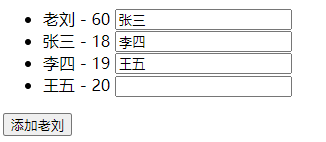


原理看流程图：

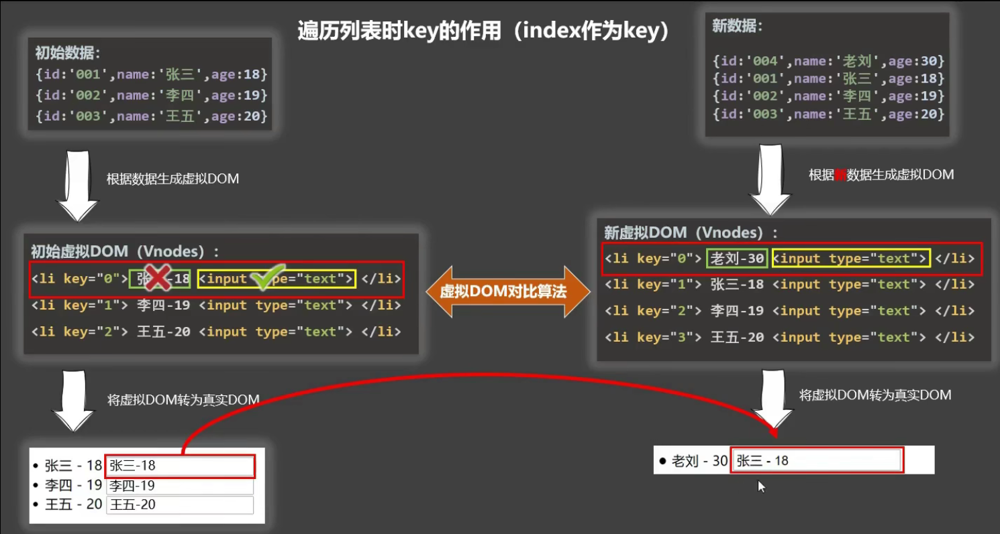


- 首先初始数据 Vue 生成成虚拟 DOM 
- 将虚拟 DOM 转为 真实 DOM 显示在页面上
- 当点击按钮插入数据时，data 中的数据发生改变
- 根据 DIFF 算法生成新的虚拟 DOM
  - 通过 key 值分析，k值一样， input 一样，只有内容不一样（数据被替换为新的数据：老刘）
  - input 里边并没有 value，我们输入的 value 是在真实 DOM 上，所以在虚拟 DOM 中不做更新
  - 转换为新的真实 DOM，原来的 张三- 18 （张三-18），变为了老刘 - 30（张三-18）
  - 最后一个元素没有在旧虚拟 DOM 中找到对应的 key 值，所以被认为是新数据，input 也是新生成的，所以是空的文本框


> 当然，如果使用 push 将元素插入到最末则没有这些问题
>
> 如果 v-for 遍历时不添加 :key 绑定 index 属性，Vue 会默认执行这个动作
>
> 只要有破坏元素顺序的操作，最好都不要用 index 作为 key 值


当遍历中的 key 值为 data 数据中的 id 时：

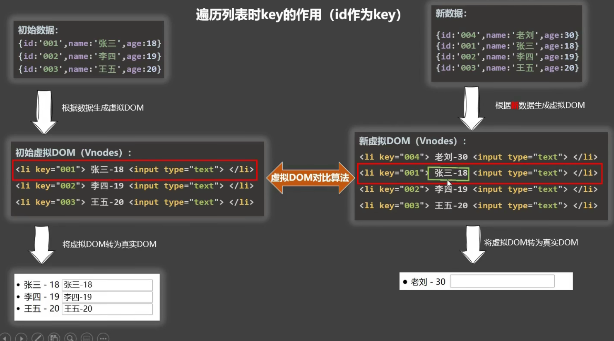

> 可以看到，由于 data 中的数据与 id 是绑定的，而不会随着数据插入而改变，所以新的虚拟 DOM 可以复用旧的 DOM，只添加新的 DOM 即可。


### 6.3 vue 中 key 的作用（面试题）

- 虚拟 DOM 中 key 的作用

key 是虚拟 DOM 对象的表示，当数据发生变化时，Vue 会根据新数据生成新的虚拟DOM，随后 Vue 进行新虚拟DOM与旧虚拟DOM的差异比较，比较规则如下：

1. 旧虚拟 DOM 中找到了与新虚拟 DOM 相同的 key

- 若虚拟 DOM 中内容没变，直接使用之前的真实 DOM
- 若虚拟 DOM 中内容变了，则生成新的真实DOM，随后替换掉页面中之前的真实DOM


2. 旧虚拟 DOM 中未找到与新虚拟DOM相同的key

- 创建新的真实 DOM，随后渲染到页面


3. 用 index 作为 key 可能会引发的问题

- 若对数据进行添加、逆序删除等破坏顺序操作，则会产生没有必要的真实 DOM 更新，虽然界面显示没有问题，但效率低
- 如果结构中还包含输入类 DOM，则会产生错误的 DOM 更新，界面出现问题


4. 开发中如何选择 key

- 最好使用每条数据的唯一表示作为 key，比如 id、手机号、身份证号、学号等唯一标识
- 如果不存在对数据的逆序添加、逆序删除等破坏顺序操作，仅永不渲染列表作为展示，使用 index 作为 key 是没有问题的


## 表单案例

### 1. 显示数据

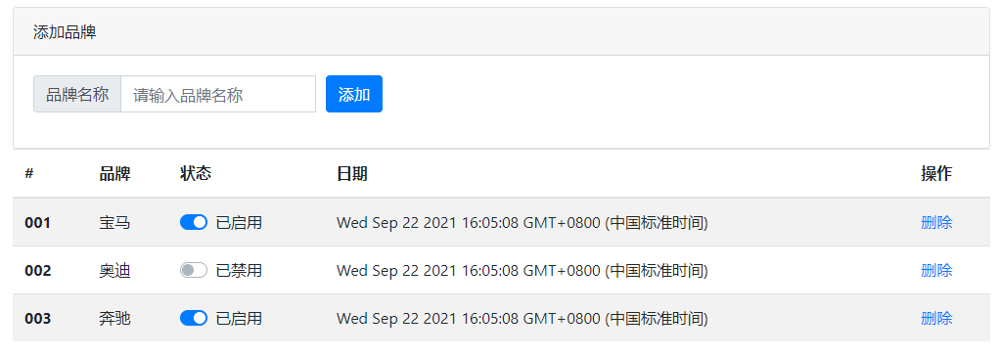


~~~html
<!DOCTYPE html>
<html lang="en">
  <head>
    <meta charset="UTF-8" />
    <meta http-equiv="X-UA-Compatible" content="IE=edge" />
    <meta name="viewport" content="width=device-width, initial-scale=1.0" />
    <script src="https://cdn.bootcdn.net/ajax/libs/jquery/3.6.0/jquery.min.js"></script>
    <script src="https://cdn.bootcdn.net/ajax/libs/vue/2.6.9/vue.js"></script>
    <link href="https://cdn.bootcdn.net/ajax/libs/twitter-bootstrap/4.5.3/css/bootstrap.css" rel="stylesheet" />
    <script src="https://cdn.bootcdn.net/ajax/libs/twitter-bootstrap/4.5.3/js/bootstrap.min.js"></script>
    <title>Document</title>
  </head>
  <body>
    <div id="app" style="padding: 20px">
      <div class="card">
        <div class="card-header">添加品牌</div>
        <div class="card-body">
          <div class="input-group mb-3">
            <div class="input-group-prepend">
              <span class="input-group-text" id="basic-addon1">品牌名称</span>
            </div>
            <input type="text" class="form-control" placeholder="请输入品牌名称" aria-label="Username" aria-describedby="basic-addon1" />
            <button type="submit" class="btn btn-primary">添加</button>
          </div>
        </div>
      </div>
      <table class="table table-striped">
        <thead>
          <tr>
            <th scope="col">#</th>
            <th scope="col">品牌</th>
            <th scope="col">状态</th>
            <th scope="col">日期</th>
            <th scope="col">操作</th>
          </tr>
        </thead>
        <tbody>
          <tr v-for="item in items" :key="item.id">
            <th scope="row">{{item.id}}</th>
            <td>{{item.name}}</td>
            <td>
              <div class="custom-control custom-switch">
                <input type="checkbox" class="custom-control-input" v-bind:id="'customSwitch'+item.id" v-model="item.state" />
                <label v-if="item.state" class="custom-control-label" v-bind:for="'customSwitch'+item.id">已启用</label>
                <label v-else class="custom-control-label" v-bind:for="'customSwitch'+item.id">已禁用</label>
              </div>
            </td>
            <td>{{item.time}}</td>
            <td><a href="javascript:;">删除</a></td>
          </tr>
        </tbody>
      </table>
    </div>

    <script>
      new Vue({
        el: "#app",
        data: {
          items: [
            { id: "1", name: "宝马", state: true, time: new Date() },
            { id: "2", name: "奥迪", state: false, time: new Date() },
            { id: "3", name: "奔驰", state: true, time: new Date() },
          ],
        },
      });
    </script>
  </body>
</html>

~~~


- v-for 循环数据
- v-model 绑定 state 属性，自动解析为 checked 属性
- v-if、v-else 根据 state 属性判断是否显示已启用
- v-bind 绑定 label 属性（字符串+遍历索引）


### 2. 删除功能

绑定删除方法

~~~html
<td><a @click="del(item.id)" href="javascript:;">删除</a></td>
~~~


过滤 data 中数组返回新的数组

~~~js
methods:{
    del(id){
        // 遍历 list 列表，返回 item.id 不等于 id 的数组，即实现删除 id 项
        this.items = this.items.filter(item=>item.id != id)
    }
}
~~~


### 3. 添加数据

绑定事件，并阻止表单提交的默认事件

~~~html
<form @submit.prevent="add" action="">
~~~


也可以直接绑定在 button 上

~~~html
<button @click="add" type="button" class="btn btn-primary">添加</button>
~~~

> 注意这里的 type 不能是 submit 了，否则还是会跳转


v-model 绑定表单中数据

~~~html
<input v-model.trim="brand" type="text" class="form-control" placeholder="请输入品牌名称" aria-label="Username" aria-describedby="basic-addon1" />
~~~

> 在 data 中定义对应 brand 属性


添加键盘事件，按回车执行指定方法

~~~html
@keyup.enter="add"
~~~


业务处理

~~~js
add() {
    // 如果输入框不为空，将新数据压入 data
    if (this.brand != "") {
        this.items.push({
            id: this.items.length + 1,
            name: this.brand,
            state: false,
            time: new Date(),
        });
        // 清空输入框
        this.brand = "";
    }
},
~~~

> 教程上是定义一个 data 的新属性 nextID: 4，然后每次执行完方法后，自增 ID


## 过滤器 filter（Vue3 废弃）

Vue3 中已经不再支持过滤器，官方建议使用计算属性或方法代替过滤器的使用


### 1. 私有过滤器

过滤器（filter）是 vue 为开发者提供的功能，常用于文本格式化，过滤器可以用在两个地方：插值表达式 和 v-bind 属性绑定。

过滤器一般添加在 Javascript 表达式的尾部，由 “管道符” 进行调用，如：

~~~html
<!-- 通过 capitalize 过滤器，对 msg 的值进行格式化 -->
<p>{{ msg | capitalize }}</p>
<!-- 通过 formatID 过滤器，对 rawID 的值进行格式化 -->
<div v-bind:id="rawID | formatID"></div>
~~~

> 将要渲染的变量当做参数传递给过滤器函数，然后显示经过函数处理后的返回值


同时，在 vm 中需要定义对应的 filter 方法

~~~js
filters: {
    capitalize(val) {
        const first = val.substr(0, 1).toUpperCase();
        const others = val.slice(1);
        return first + others;
    },
},
~~~

> 过滤器必须要有返回值


### 2. 公有过滤器

在 filters 节点下定义的过滤器，称为私有过滤器，因为它只能处理当前 Vue 实例所控制的 el 区域内的数据，如果希望在多个 vue 实例之间共享过滤器，则可以定义全局过滤器。


全局过滤器，独立于每个 vm 实例之外（实际上定义在了父类上）

~~~js
Vue.filter("capitalize",  (val)=> {
    return val.substr(0, 1).toUpperCase() + val.slice(1);
});
~~~

- 第一个参数：全局过滤器函数名
- 第二个参数：过滤器处理函数


定义公有过滤器需要在所有 vm 实例上方定义

~~~js
Vue.filter("capitalize", function (val) {
    const first = val.substr(0, 1).toUpperCase();
    const others = val.slice(1);
    return first + others;
});
~~~

> 如果公有过滤器与私有过滤器名字重复，根据就近原则使用私有过滤器


使用 dayjs.js 完成日期格式化

~~~html
<!DOCTYPE html>
<html lang="en">
    <head>
        <meta charset="UTF-8" />
        <meta http-equiv="X-UA-Compatible" content="IE=edge" />
        <meta name="viewport" content="width=device-width, initial-scale=1.0" />
        <script src="https://cdn.bootcdn.net/ajax/libs/vue/2.6.9/vue.js"></script>
        <script src="https://cdn.bootcdn.net/ajax/libs/dayjs/1.10.6/dayjs.min.js"></script>
        <title>Document</title>
    </head>
    <body>
        <div id="app">
            <p>{{ date | dateFormat }}</p>
        </div>
        <script>
            Vue.filter("dateFormat", (date) => {
                return dayjs(date).format("YYYY-MM-DD HH:mm:ss")
            });

            vm = new Vue({
                el: "#app",
                data: {
                    date: new Date(),
                },
            });
        </script>
    </body>
</html>

~~~


### 3. 过滤器的连续调用

类似于 Linux 中的通道，过滤器也可以进行串联的调用，即将前一个过滤器的返回值再次传递给下一个过滤器进行处理，如：

~~~html
<p>{{ msg | trim | capitalize }}</p>
~~~


### 4. 过滤器的参数

过滤器中第一个形参永远是 “管道符” 前边传递过来的值（也就是 data 中的属性值），其次可以传递自定义实参

~~~html
{{ message | filterA(arg1, arg2) }}
~~~


定义公有过滤器，第二个参数是处理函数，处理函数中的第一个形参即 message 传递过来的值，arg1 与 arg2 是本身函数传递过来的参数。

~~~JS
Vue.filter('filterA'(msg, arg1, arg2)=>{
    ...
})
~~~


## 7. 计算属性 computed

计算属性是指通过一系列运算之后，最终得到一个属性值，这个动态计算出来的属性值可以被模板结构或 methods 方法使用。


实现一个可以联动的表单效果，当改动表单中的 value 值，文本需要值同步

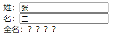


简单表单：

~~~html
<div id="root">
    姓：<input type="text" value="张"><br/>
    名：<input type="text" value="三"><br/>
    全名：？？？？
</div>
~~~


实现效果也很容易，因为需要同步数据，所以需要用到 v-model 指令

~~~html
<div id="root">
    姓：<input type="text" v-model:value="lastName"><br/>
    名：<input type="text" V-model:value="firstName"><br/>
    全名：{{lastName}} - {{firstName}}
</div>
<script>
    vm = new Vue({
        el: "#root",
        data: {
            lastName:'张',
            firstName:'三',
        },
    });
</script>
~~~


### 7.1 插值语法处理数据

但是假设 lastName 是英文，我们想让 lastName 变成大写，并且只显示前三个字符的话，在插值语法中可以使用表达式，所以我们可以直接插入 js 代码，如：

~~~html
<div id="root">
    姓：<input type="text" v-model:value="lastName"><br/>
    名：<input type="text" V-model:value="firstName"><br/>
    全名：{{lastName.toUpperCase().substr(0,3)}} - {{firstName}}
</div>
<script>
    vm = new Vue({
        el: "#root",
        data: {
            lastName:'Jason',
            firstName:'三',
        },
    });
</script>
~~~

> 但是在 Vue 编写风格中不推荐在插值语法中做过多的处理，对于后期维护也不太方便


### 7.2 methods 方法处理数据

如果不在插值语法中修改的话，那么我们来试一下使用 methods 定义一个方法来显示

~~~html
<div id="root">
    姓：<input type="text" v-model:value="lastName"><br/>
    名：<input type="text" V-model:value="firstName"><br/>
    全名：{{showName()}} - {{firstName}}
</div>
<script>
    vm = new Vue({
        el: "#root",
        data: {
            lastName:'Jason',
            firstName:'三',
        },
        methods:{
            showName(){
                return this.lastName.toUpperCase().substr(0,3);
            }
        }
    });
</script>
~~~

> 在插值语法中使用 v-model 会绑定数据到 data 中的属性，当 value 值发生变化时，data 数据也会发生变化，并且重新渲染页面。同时 showName 方法也会被重新调用，重新调用后就会用新的数据渲染页面，达到数据和页面同步的效果


### 7.3 computed 计算属性

在 vue 实例中，_data 属性的值会被 setter 到 vm 实例中形成实例的属性。同理计算属性也会被放在 vm 实例中，但是它并不存在于 _data 中，因为该属性是通过已有的属性计算得来的，并不是我们直接定义在 data 的属性。


它的原理是底层借助 Object.defineProperty 方法提供的 getter 和 setter


~~~html
<div id="root">
        姓：<input type="text" v-model:value="lastName"><br/>
        名：<input type="text" V-model:value="firstName"><br/>
        全名：{{showName}} - {{firstName}}
    </div>
    <script>
      vm = new Vue({
        el: "#root",
        data: {
          lastName:'Jason',
          firstName:'三',
        },
        computed:{
          showName:{
            // 当 showName 属性被调用时，get() 就会被调用，且返回值就是 showName 的属性值
            get(){
              return this.lastName.toUpperCase().substr(0,3);
            }
          }
        }
      });
    </script>
~~~


### 7.4 methods 和 computed 区别

computed 中，get() 初次读取 showName，渲染页面并将 showName 值放入缓存，如果多次调用该计算属性，那么 get() 不会再次调用，而是从缓存中读取数据。而 showName 所依赖的属性发生变化时，showName 值也需要做出改变，这时会重新调用 get() 更新属性值


什么时候 get() 被调用：

- 有人读取计算属性时
- 当依赖属性值发生变化时


~~~html
<div id="root">
        姓：<input type="text" v-model:value="lastName"><br/>
        名：<input type="text" V-model:value="firstName"><br/>
        全名：{{showName}}<br/>
        全名：{{showName}}<br/>
        全名：{{showName}}<br/>
    </div>
    <script>
      vm = new Vue({
        el: "#root",
        data: {
          lastName:'Jason',
          firstName:'三',
        },
        computed:{
          showName:{
            get(){
              console.log('get 被调用了');
              return this.lastName.toUpperCase().substr(0,3) + '-' + this.firstName;
            }
          }
        }
      });
    </script>
~~~


可以看到 console 中只显示了一次 "get 被调用了"，而 methods 中，只要视图中出现 {{ showName() }} 就会调用该方法渲染一次页面。

> 相对于 methods，计算属性内部有缓存机制，效率更高，调试方便


### 7.5 computed 计算属性中的 set()

如果说计算属性只是用来显示的话，那么只设置 get() 方法即可，但是如果计算属性需与用户交互的话，那么页面上的 showName 值也需要进行同步，并且依赖属性也需要进行更新，这时候就需要用到计算属性中的 set() 方法


~~~html
<div id="root">
    姓：<input type="text" v-model:value="lastName"><br/>
    名：<input type="text" V-model:value="firstName"><br/>
    全名：{{showName}}<br/>
    全名：{{showName}}<br/>
    全名：{{showName}}<br/>
</div>
<script>
    vm = new Vue({
        el: "#root",
        data: {
            lastName:'Jason',
            firstName:'三',
        },
        computed:{
            showName:{
                get(){
                    return this.lastName.toUpperCase().substr(0,3) + '-' + this.firstName;
                },
                // value 值为 showName 被修改的值
                set(value){
                    const arr = value.split('-');
                    this.lastName = arr[0];
                    this.firstName = arr[1];
                }
            }
        }
    });
</script>
~~~

> 在 console 中输入 vm.showName = "BB-AA"，可以看到所有值都会同步更新


执行过程：

- 改动 showName 的值
- 调用 set()
- 改动 lastName, firstName 属性
- 由于 v-model 同步，data 数据发生改变，页面数据也发生改变
- data 数据改变，get() 中的依赖属性也发生改变，重新调用 get()，改动 showName 值


### 7.6 计算属性简写方式

当计算属性只负责读取，并没有改写操作时，才可以使用简写方式，如：

~~~html
<div id="root">
    姓：<input type="text" v-model:value="lastName"><br/>
    名：<input type="text" V-model:value="firstName"><br/>
    全名：{{showName}}<br/>
    全名：{{showName}}<br/>
    全名：{{showName}}<br/>
</div>
<script>
    vm = new Vue({
        el: "#root",
        data: {
            lastName:'Jason',
            firstName:'三',
        },
        computed:{
            // 在计算属性的匿名函数会被当成 get() 函数执行
            // showName:function(){
            //   return this.lastName.toUpperCase().substr(0,3) + '-' + this.firstName;
            // }
            showName(){
                return this.lastName.toUpperCase().substr(0,3) + '-' + this.firstName;
            }
        }
    });
</script>
~~~


## 8. 监视属性 watch

实现一个点击按钮切换文本的效果，代码如下：

~~~html
<div id="root">
    <h2>今天天气很{{isHot?'炎热':'寒冷'}}</h2>
    <button>切换天气</button>
</div>

<script>
    vm = new Vue({
        el:'#root',
        data:{
            isHot:true
        },
    })
</script>
~~~


虽然表达式很简单，但是我们还是建议使用单个标签，使用计算属性将这里重写一下：

~~~html
<div id="root">
    <h2>今天天气很{{info}}</h2>
    <button>切换天气</button>
</div>

<script>
    vm = new Vue({
        el: "#root",
        data: {
            isHot: true,
        },
        computed: {
            info() {
                return this.isHot ? "炎热" : "寒冷";
            },
        },
    });
</script>
~~~


添加按钮点击事件

~~~html
<div id="root">
    <h2>今天天气很{{info}}</h2>
    <button @click="changeWeather">切换天气</button>
</div>

<script>
    vm = new Vue({
        el: "#root",
        data: {
            isHot: true,
        },
        methods:{
            changeWeather(){
                this.isHot = !this.isHot;
            }
        },
        computed: {
            info() {
                return this.isHot ? "炎热" : "寒冷";
            },
        },
    });
</script>
~~~

> 如果把页面不显示 info 的话，那么虽然 vm 中的属性会改变，但是 Vue Devtools 并不会更新数据


如果语句简单的话，那么也可以直接在 @click 后边添加表达式

~~~html
<button @click="isHot = !isHot">切换天气</button>
~~~


但是如果需要改变多个值的话，就又把模板变复杂了，而 Vue 的建议是将所有业务逻辑写在 vm 对象中处理。

~~~html
<h2>今天天气很{{info}},{{x}}</h2>
<button @click="isHot = !isHot; x++">切换天气</button>
~~~


### 8.1 监测属性 watch

通过vm 中的 watch 属性，可以监测 data 属性的变化，获取变化前与变化后的值，只要监听的属性被改变，就会触监听属性中绑定的方法，如：

~~~html
<div id="root">
    <h2>今天天气很{{info}}</h2>
    <button @click="changeWeather">切换天气</button>
</div>

<script>
    vm = new Vue({
        el: "#root",
        data: {
            isHot: true,
        },
        methods: {
            changeWeather() {
                this.isHot = !this.isHot;
            },
        },
        computed: {
            info() {
                return this.isHot ? "炎热" : "寒冷";
            },
        },
        // 监测属性        
        watch: {
            // 监测值
            isHot: {
                // handler 处理函数，当 isHot 值发生改变时调用
                handler(newValue, oldValue) {
                    console.log("isHot 被修改了", newValue, oldValue);
                },
            },
        },
    });
</script>
~~~

> 当 isHot 值发生改变时，handler 就会发生改变
>
> 如果添加了监视，即使页面中没有 info ，Vue Devtool 也会显示数据的变化


监测属性不仅仅可以监测 data 中的属性，也可以监测 computed 计算属性

~~~html
<script>
    vm = new Vue({
        el: "#root",
        data: {
            isHot: true,
        },
        methods: {
            changeWeather() {
                this.isHot = !this.isHot;
            },
        },
        computed: {
            info() {
                return this.isHot ? "炎热" : "寒冷";
            },
        },            
        watch: {
            info: {                
                handler(newValue, oldValue) {
                    console.log("info 被修改了", newValue, oldValue);
                },
            },
        },
    });
</script>
~~~


### 8.2 immediate 属性

当检测属性中的 immediate 属性值为 true 时，渲染页面时，会立即执行一次 handler 函数，有点类似 do...while() 函数

~~~js
watch: {
    immediate: true,
        isHot: {
            handler(newValue, oldValue) {
                console.log("isHot 被修改了", newValue, oldValue);
            },
        },
},
~~~


### 8.3 监测方法 $watch()

如果需要给已经创建的 Vue 实例中的属性附加监视，可以使用 $watch 方法

~~~js
vm.$watch("isHot", {
    immediate: true,
    isHot: {
        handler(newValue, oldValue) {
            console.log("isHot 被修改了", newValue, oldValue);
        },
    },
});
~~~


### 8.4 深度监视

监视多级结构中属性的变化，需要开启 deep: true 选项


简单在 data 中写一个多层结构的数据 numbers，里边包含 a，b 两个变量，当点击按钮时，a 的值自增 1

~~~html
<div id="root">
    <h2>a的值是{{numbers.a}}</h2>
    <button @click="numbers.a++">点我让 a + 1</button>
</div>

<script>
    vm = new Vue({
        el: "#root",
        data: {
            numbers:{
                a:1,
                b:2
            }
        },
    });      
</script>
~~~


如果只需要监测 a 的值，写成如下代码

~~~html
<div id="root">
    <h2>a的值是{{numbers.a}}</h2>
    <button @click="numbers.a++">点我让 a + 1</button>
</div>

<script>
    vm = new Vue({
        el: "#root",
        data: {
            numbers:{
                a:1,
                b:2
            }
        },
        watch: {
            // 需要包含单引号
            'numbers.a': {
                handler(newValue, oldValue) {
                    console.log("a 被修改了", newValue, oldValue);
                },
            },
        },
    });      
</script>
~~~

> 注意对象中的 key 应该是字符串，我们一般都是简写去掉了引号，如果是调用对象中的属性，则需要补全


如果需要同时监测 b ，则再补一个监测对象即可，如：

~~~js
<div id="root">
    <h2>a的值是{{numbers.a}}</h2>
<button @click="numbers.a++">点我让 a + 1</button>
<hr />
    <h2>b的值是{{numbers.b}}</h2>
<button @click="numbers.b++">点我让 b + 1</button>
</div>

<script>
    vm = new Vue({
    el: "#root",
    data: {
        numbers: {
            a: 1,
            b: 2,
        },
    },
    watch: {
        "numbers.a": {
            handler(newValue, oldValue) {
                console.log("a 被修改了", newValue, oldValue);
            },
        },
        "numbers.b": {
            handler(newValue, oldValue) {
                console.log("b 被修改了", newValue, oldValue);
            },
        },
    },
});
</script>
~~~


但是如果 numbers 中有 N 个属性，则不可能挨个去监视，如果我们的需求是监视 numbers 中所有属性，只要发生改变则触发 handler 则需要开启 deep 选项为 true

~~~html
<div id="root">
    <h2>a的值是{{numbers.a}}</h2>
    <button @click="numbers.a++">点我让 a + 1</button>
    <hr />
    <h2>b的值是{{numbers.b}}</h2>
    <button @click="numbers.b++">点我让 b + 1</button>
</div>

<script>
    vm = new Vue({
        el: "#root",
        data: {
            numbers: {
                a: 1,
                b: 2,
            },
        },
        watch: {            
            numbers: {
                deep:true,
                handler(newValue, oldValue) {
                    console.log("numbers 中的属性被修改了", newValue, oldValue);
                },
            },
        },
    });
</script>
~~~

> 这里参考下对象的深度拷贝，如果不加 deep: true 的话，相当于浅监视，numbers 里边的值是 a, b ，实际上 a, b 这两个 key 没有发生改变，改变的是 a, b 里边的值，所以 numbers 没有任何变化。监视也就起不到作用了。


如果还不懂，那么看下这个代码，浅拷贝就会被监视到

~~~html
<button @click="numbers = {a:666, b:300}">
    彻底替换掉 numbers 
</button>
~~~

> 整个对象的指针指向了另一个对象，那么 numbers 肯定发生了改变，则会被监视到。


- Vue 中的 watch 默认不监测对象内部值的改变（一层）
- 配置 deep: true 可以监测对象内部值的改变（多层）
- Vue 自身可以监测数据对象内部值的改变，但 Vue 提供的 watch 默认不可以
- 使用 watch 时根据数据的具体结构，决定是否采用深度监视


### 8.5 监视的简写形式

当配置项只有 handler 时，可以使用简写方式：

~~~html
<div id="root">
    <h2>number的值是{{number}}</h2>
    <button @click="number++">点我让 number + 1</button>
</div>

<script>
    vm = new Vue({
        el: "#root",
        data: {
            number: 1,
        },
        watch: {
            number(newValue, oldValue) {
                console.log("number的属性被修改了", newValue, oldValue);
            },
        },
    });
</script>
~~~

> 和计算属性的简写方式类似，直接写成函数模式


使用 $watch 也可以使用简写方式：

~~~html
<div id="root">
    <h2>number的值是{{number}}</h2>
    <button @click="number++">点我让 number + 1</button>
</div>

<script>
    vm = new Vue({
        el: "#root",
        data: {
            number: 1,
        },        
    });

    vm.$watch('number',function(newValue, oldValue){
        console.log("number的属性被修改了", newValue, oldValue);
    })
</script>
~~~


### 8.6 监视属性 vs 计算属性

用监视属性重写计算属性案例，如：

~~~html
<div id="root">
    姓：<input type="text" v-model:value="lastName" /><br />
    名：<input type="text" V-model:value="firstName" /><br />
    全名：{{fullName}}<br />
</div>
<script>
    vm = new Vue({
        el: "#root",
        data: {
            lastName: "Jason",
            firstName: "三",
            fullName: "Jason-三",
        },
        watch: {
            firstName(val) {
                this.fullName = this.lastName + "-" + val;
            },
            lastName(val) {
                this.fullName = val + "-" + this.firstName;
            },
        },
    });
</script>
~~~


- 计算属性能完成的事情，监视属性也可以完成
- watch 能完成的，computed 不一定能完成（如：watch 可以进行异步操作）
- 计算属性实现起来比较简单，值是通过原有属性计算得来的
- 监视属性是命令式方法，需要自己定义初始属性，然后通过监听来改变属性值


现在提出一个奇葩需求，就是当输入框输入完成一秒后再显示，这时候就只能用侦听属性来做了

~~~html
<div id="root">
    姓：<input type="text" v-model:value="lastName" /><br />
    名：<input type="text" V-model:value="firstName" /><br />
    全名：{{fullName}}<br />
</div>
<script>
    vm = new Vue({
        el: "#root",
        data: {
            lastName: "Jason",
            firstName: "三",
            fullName: "Jason-三",
        },
        watch: {
            firstName(val) {
                // 延迟一秒，执行
                setTimeout(() => {
                    this.fullName = this.lastName + "-" + val;
                }, 1000);
            },
            lastName(val) {
                this.fullName = val + "-" + this.firstName;
            },
        },
    });
</script>
~~~

> 此时是必须使用箭头函数的，箭头函数没有自己的 this, 它的 this是继承而来; 默认指向在定义它时所处的对象(宿主对象)，箭头函数中的 this 就是 firstName 函数中的 this，也就指向 Vue


> 如果不写成箭头函数，而是普通函数的话，如 setTimeout(function(){ ... }) 的话，此时 setTimeout 是 window 的一个方法，而函数里边的 this 也就指向了 window。


关于 this：

- 所有被 Vue 管理的函数，最好写成普通函数，这样 this 就直接指向 Vue 实例了
- 所有不被 Vue 管理的函数，如：setTimeout， ajax 等，最好写成箭头函数，这样 this 才可以指向 Vue


而计算属性中无法这样写

~~~js
computed:{
    showName(){
        setTimeout(() => {
            return this.lastName.toUpperCase().substr(0,3) + '-' + this.firstName;              
        }, 1000);
    }
}
~~~

> 因为计算属性是靠返回值得到新属性的值，这里使用 setTimeout ，返回值返回给了匿名函数，而不是 showName，所以 showName 获取不到值，也就无法在页面中显示。


## 案例：用户名是否被占用

~~~html
<!DOCTYPE html>
<html lang="en">
  <head>
    <meta charset="UTF-8" />
    <meta http-equiv="X-UA-Compatible" content="IE=edge" />
    <meta name="viewport" content="width=device-width, initial-scale=1.0" />
    <script src="https://cdn.bootcdn.net/ajax/libs/jquery/3.6.0/jquery.min.js"></script>
    <script src="https://cdn.bootcdn.net/ajax/libs/vue/2.6.9/vue.js"></script>
    <title>Document</title>
  </head>
  <body>
    <div id="app">Username: <input type="text" v-model.lazy="username" /></div>
  </body>
  <script>
    const vm = new Vue({
      el: "#app",
      data: {
        username: "",
      },
      watch: {
        username(newVal, oldVal) {
          if (newVal != "") {
            // 使用 ajax 发送请求给接口进行查询
            $.get("https://www.escook.cn/api/finduser/" + newVal, function (result) {
              console.log(result);
            });
          }
        },
      },
    });
  </script>
</html>

~~~


## 9. 列表过滤（模糊搜索）

通过在表单中输入关键词，过滤掉 data 中的数据，并显示在页面中。

- 收集用户输入关键词，v-model 双向绑定
- 通过关键词，过滤原有数据


### 9.1 watch 过滤

通过 v-model 绑定关键字 keyword

~~~html
<div id="root">
    <h2>人员过滤</h2>
    <input type="text" placeholder="请输入搜索关键词" v-model="keyword">
    <ul>
        <li v-for="(p, index) in persons" :key="p.id">
            {{p.name}} - {{p.age}}
        </li>
    </ul>
    <button @click.once="add">添加老刘</button>
</div>

<script>
    new Vue({
        el: "#root",
        data: {
            keyword:'',
            persons: [
                { id: "001", name: "马冬梅", age: 18, sex:'女'},
                { id: "002", name: "周冬雨", age: 19, sex:'女'},
                { id: "003", name: "周杰伦", age: 20, sex:'男'},
                { id: "004", name: "温兆伦", age: 21, sex:'男'},

            ],
        },
    });
</script>
~~~


通过 watch 监听 keyword 变化，过滤数据

~~~html
<script>
    new Vue({
        el: "#root",
        data: {
            keyword: "",
            persons: [
                { id: "001", name: "马冬梅", age: 18, sex: "女" },
                { id: "002", name: "周冬雨", age: 19, sex: "女" },
                { id: "003", name: "周杰伦", age: 20, sex: "男" },
                { id: "004", name: "温兆伦", age: 21, sex: "男" },
            ],
        },
        watch: {
            keyword(val){
                // 通过 filter 函数，拿到返回值为 true 的数据
                this.persons = this.persons.filter((p)=>{
                    return p.name.indexOf(val) != -1
                })
            }
        },
    });
</script>
~~~

> 注意！：每次过滤，data 中的数据则会被重写，这样做的结果就是越过滤，data 中的数据越少，造成数据丢失


建立一个新的数组 filpersons，然后将过滤的数据存储在新的数组中

- 在页面输出的时候也遍历 filpersons，会造成初始化页面 filpersons 没有数据
- watch 监听模式启用立即执行模式，会遍历 '' 空字符串，而每个字符串中都包含空字符串，这样第一次遍历就会把所有数据都遍历出来了

~~~html
<div id="root">
    <h2>人员过滤</h2>
    <input type="text" placeholder="请输入搜索关键词" v-model="keyword" />
    <ul>
        <!-- 遍历 filpersons -->
        <li v-for="(p, index) in filpersons" :key="p.id">
            {{p.name}} - {{p.age}}
        </li>
    </ul>
    <button @click.once="add">添加老刘</button>
</div>

<script>
    new Vue({
        el: "#root",
        data: {
            keyword: "",
            persons: [
                { id: "001", name: "马冬梅", age: 18, sex: "女" },
                { id: "002", name: "周冬雨", age: 19, sex: "女" },
                { id: "003", name: "周杰伦", age: 20, sex: "男" },
                { id: "004", name: "温兆伦", age: 21, sex: "男" },
            ],
            // 添加遍历结果数组
            filpersons: [],
        },
        watch: {
            keyword: {
                // 开启立即模式
                immediate:true,
                handler(val) {
                    // 将遍历结果存储在新数组中，不会改变原数据
                    this.filpersons = this.persons.filter((p) => {
                        return p.name.indexOf(val) != -1;
                    });
                },
            },
        },
    });
</script>
~~~


### 9.2 computed 过滤

通过 computed 计算属性，依赖 keyword，只要 keyword 发生改变，那么 computed 就会重新计算拿到新的数据，并且渲染到页面

~~~html
<script>
    new Vue({
        el: "#root",
        data: {
            keyword: "",
            persons: [
                { id: "001", name: "马冬梅", age: 18, sex: "女" },
                { id: "002", name: "周冬雨", age: 19, sex: "女" },
                { id: "003", name: "周杰伦", age: 20, sex: "男" },
                { id: "004", name: "温兆伦", age: 21, sex: "男" },
            ],          
        },
        computed: {
            filpersons() {
                return this.persons.filter((p) => {
                    return p.name.indexOf(this.keyword) != -1;
                });
            },
        },
    });
</script>
~~~


## 10. 列表排序

将列表中数据按照年龄升序或降序排列显示在页面上，基础代码如下：

~~~html
<div id="root">
      <h2>人员排序</h2>
      <button>年龄升序</button>
      <button>年龄降序</button>
      <button>原始顺序</button>
      <ul>
        <li v-for="(p, index) in persons" :key="p.id">
          {{p.name}} - {{p.age}}
        </li>
      </ul>
    </div>

    <script>
      new Vue({
        el: "#root",
        data: {
          persons: [
            { id: "001", name: "马冬梅", age: 18, sex: "女" },
            { id: "002", name: "周冬雨", age: 19, sex: "女" },
            { id: "003", name: "周杰伦", age: 20, sex: "男" },
            { id: "004", name: "温兆伦", age: 21, sex: "男" },
          ],          
        },
      });
    </script>
~~~


在 data 中定义一个 sortType 属性：

- 0 原顺序
- 1 降序
- 2 升序


通过事件绑定，更改 sortType 的值（为什么点击后没有改变？）

~~~html
<button @click="sortType = 2">年龄升序</button>
<button @click="sortType = 1">年龄降序</button>
<button @click="sortType = 0">原始顺序</button>
~~~


在过滤数据处，不再直接返回给计算属性，而是赋值给一个 arr，因为我们还要对 arr 进行排序操作

~~~js
computed: {
    filpersons() {
        // 将过滤后的数组赋值给 arr
        const arr = this.persons.filter((p) => {
            return p.name.indexOf(this.keyword) != -1;
        });
        // 通过判断 sortType 值来给 arr 进行排序
        if (this.sortType != 0) {
            arr.sort((p1, p2) => {
                return this.sortType === 1 ? p2.age - p1.age : p1.age - p2.age;
            });
        }
        // 返回过滤排序后的 arr 给计算属性
        return arr;
    },
},
~~~


过滤排序

~~~html
<div id="root">
    <h2>人员排序</h2>
    <input type="text" v-model="keyword">
    <button @click="sortType = 2">年龄升序</button>
    <button @click="sortType = 1">年龄降序</button>
    <button @click="sortType = 0">原始顺序</button>
    <ul>
        <li v-for="(p, index) in filpersons" :key="p.id">
            {{p.name}} - {{p.age}}
        </li>
    </ul>
</div>

<script>
    new Vue({
        el: "#root",
        data: {
            keyword: "",
            sortType: 0,
            persons: [
                { id: "001", name: "马冬梅", age: 26, sex: "女" },
                { id: "002", name: "周冬雨", age: 20, sex: "女" },
                { id: "003", name: "周杰伦", age: 40, sex: "男" },
                { id: "004", name: "温兆伦", age: 46, sex: "男" },
            ],
        },
        computed: {
            filpersons() {
                // 将过滤后的数组赋值给 arr
                const arr = this.persons.filter((p) => {
                    return p.name.indexOf(this.keyword) != -1;
                });
                // 通过判断 sortType 值来给 arr 进行排序
                if (this.sortType != 0) {
                    arr.sort((p1, p2) => {
                        return this.sortType === 1 ? p2.age - p1.age : p1.age - p2.age;
                    });
                }
				// 返回过滤排序后的 arr 给计算属性
                return arr;
            },
        },
    });
</script>
~~~


为什么这么写会改变 persons 中的数据？

~~~html
<div id="root">
      <h2>人员排序</h2>
      <button @click="sortType = 2">年龄升序</button>
      <button @click="sortType = 1">年龄降序</button>
      <button @click="sortType = 0">原始顺序</button>
      <ul>
        <li v-for="(p, index) in filpersons" :key="p.id">
          {{p.name}} - {{p.age}}
        </li>
      </ul>
    </div>

    <script>
      new Vue({
        el: "#root",
        data: {
          keyword: "",
          sortType: 0,
          persons: [
            { id: "001", name: "马冬梅", age: 26, sex: "女" },
            { id: "002", name: "周冬雨", age: 20, sex: "女" },
            { id: "003", name: "周杰伦", age: 40, sex: "男" },
            { id: "004", name: "温兆伦", age: 46, sex: "男" },
          ],
        },
        computed: {
          filpersons() {
            var arr = this.persons;
            if (this.sortType != 0) {
              arr.sort((p1, p2) => {
                return this.sortType === 1 ? p2.age - p1.age : p1.age - p2.age;
              });
            }
            return arr;
          },
        },
      });
    </script>
~~~


# Axios

jQuery 库中包含的方法很多，既能操作 DOM，又可以发送 AJax 请求，而 Axios 是一个专注于网络请求，基于 promise 的 HTTP 库,可以用在浏览器和 Node.js 中。


中文官网地址：http://www.axios-js.com/

英文官网地址：https://www.npmjs.com/package/axios


## 1. 安装

~~~
npm install axios
~~~


CDN

~~~html
// jsdelivr CDN
<script src="https://cdn.jsdelivr.net/npm/axios/dist/axios.min.js"></script>

// unpkg CDN
<script src="https://unpkg.com/axios/dist/axios.min.js"></script>
~~~


或者使用国内的 CDN 服务

~~~
<script src="https://cdn.bootcdn.net/ajax/libs/axios/0.21.1/axios.js"></script>
<script src="https://cdn.bootcdn.net/ajax/libs/axios/0.21.1/axios.min.js"></script>
~~~


## 2. 基础语法

~~~js
axios({
    methods:'请求的类型',
    url:'请求的 URL 地址'
}).then(response=>{
    console.log(response);
})
~~~


### 2.1 GET 请求

~~~html
<!DOCTYPE html>
<html lang="en">
<head>
    <meta charset="UTF-8">
    <meta http-equiv="X-UA-Compatible" content="IE=edge">
    <meta name="viewport" content="width=device-width, initial-scale=1.0">
    <script src="https://cdn.bootcdn.net/ajax/libs/axios/0.21.1/axios.min.js"></script>
    <title>Document</title>
</head>
<body>
    <script>
const result = axios({
    methods:'GET',
    url:'http://www.liulongbin.top:3006/api/getbooks'
})

result.then(function(result){
    console.log(result);
})
    </script>
</body>
</html>
~~~


可以直接用 .then 连接

~~~js
axios({
    methods:'GET',
    url:'http://www.liulongbin.top:3006/api/getbooks'
}).then(function(result){
    console.log(result);
})
~~~


当获取数据成功时，返回获取的 result 数据如下：

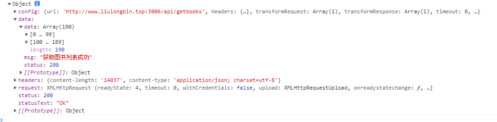


直接利用 POSTMAN 提交的请求，API 接口响应数据为

~~~
data
msg
status
~~~

> 也就是说，Axios 将返回的数据进行了封装，添加了更多的信息，而 API 返回的数据则是 result 中 data 的数据


使用 Axios 发送请求时，可以携带 URL 查询参数

~~~js
axios({
    methods:'GET',
    url:'http://www.liulongbin.top:3006/api/getbooks',
    params:{
        id:1,
    }
}).then(function(result){
    console.log(result);
})
~~~


### 2.2 POST 请求

POST 请求需要携带请求体参数

~~~js
axios({
    methods: 'POST',
    url: "http://127.0.0.1:3000/posts/2",
    data:{
        title: "Hello World",
        author:"Me"
    }
}).then((response) => {
    console.log(response);
});

~~~

> 除了 GET, POST 请求，还可以发送 PUT, DELETE 这些请求


## 3. 发送指定请求

GET 请求

~~~js
// 为给定 ID 的 user 创建请求
axios.get('/user?ID=12345')
  .then(function (response) {
    console.log(response);
  })
  .catch(function (error) {
    console.log(error);
  });

// 上面的请求也可以这样做
axios.get('/user', {
    params: {
      ID: 12345
    }
  })
  .then(function (response) {
    console.log(response);
  })
  .catch(function (error) {
    console.log(error);
  });
~~~


POST 请求：

~~~js
axios.post(url, {key=value&key2=value2}).then(function(response){
	console.log(response)  
}, function(err){
  if (err) {
    console.log("出现错误")
  }
})

// 也可以通过对象方式传参
axios.post('/user', {
    firstName: 'Fred',
    lastName: 'Flintstone'
  })
  .then(function (response) {
    console.log(response);
  })
  .catch(function (error) {
    console.log(error);
  });
~~~


## 3. await & async

- 如果调用某个方法的返回值是 Promise 实例，则前面可以添加 await

- await 方法只能用在被 async 修饰的方法中


可以省略 .then 也可以拿到 result 的返回值

~~~html
<button id="btnPost">发送请求</button>
<script>
    document.querySelector("#btnPost").addEventListener("click", async function () {
        const result = await axios({
            methods: "GET",
            url: "http://www.liulongbin.top:3006/api/getbooks",
            params: {
                id: 1,
            },
        });
    });

    console.log(result);
</script>
~~~


## 4. 解构获取数据

因为 result 是 axios 封装的数据，我们只需要拿到 data ，则可以使用解构语句， 如：

~~~js
let {data} = result;
console.log(data);
~~~


重命名

~~~js
let {data:res} = result;
~~~


# Vue-cli 脚手架

## 1. Vue-cli 介绍

vue-cli 是 Vue.js 开发的标准工具，它简化了程序员基于 webpack 创建工程化的 Vue 项目的过程。


引自 vue-cli 官网上的一句话：

程序员可以专注在撰写应用上，而不必花好几天去纠结 webpack 配置的问题。


官网：https://cli.vuejs.org/zh/


## 2. 安装

vue-cli 是 npm 上的一个全局包，使用 npm install 命令，即可方便的安装。

~~~
npm install -g @vue/cli
~~~


## 3. 创建项目

在 cmd 窗口中敲命令

~~~shell
vue create 项目名称
~~~

> 不要在 VS Code 终端中使用该命令


弹出对话框，可以根据项目要求选择创建的项目

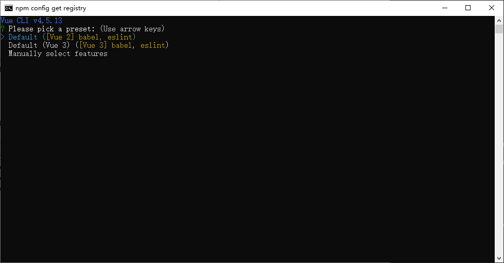


手动选择，按空格选中

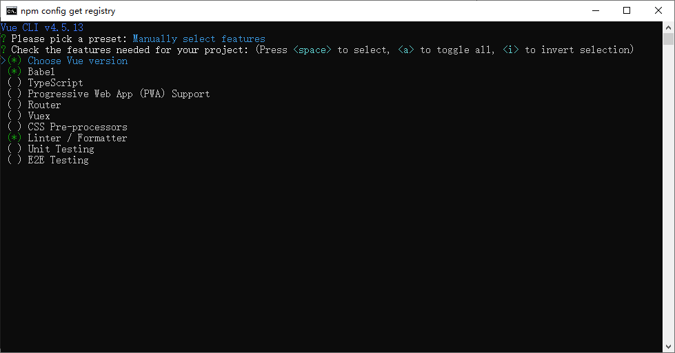


选择 Vue 版本

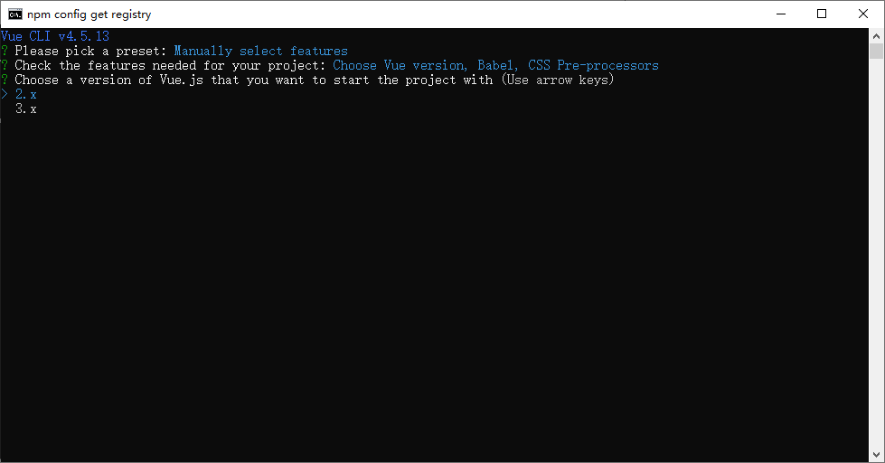


选择 CSS 处理器，一般 Less 即可

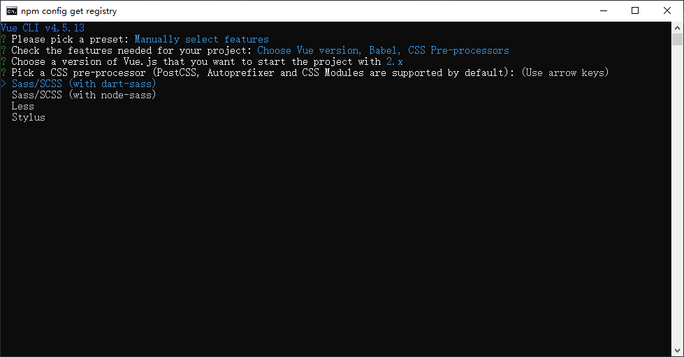


选择配置文件存储位置

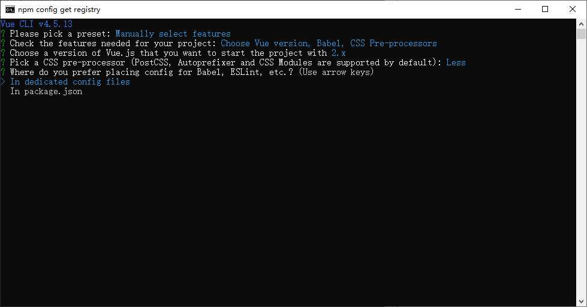


是否保存预设

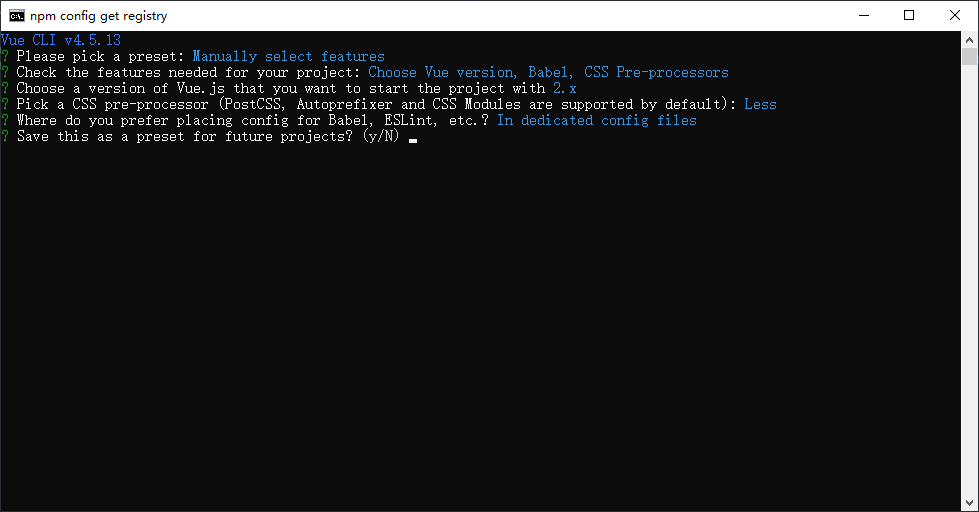


创建完成

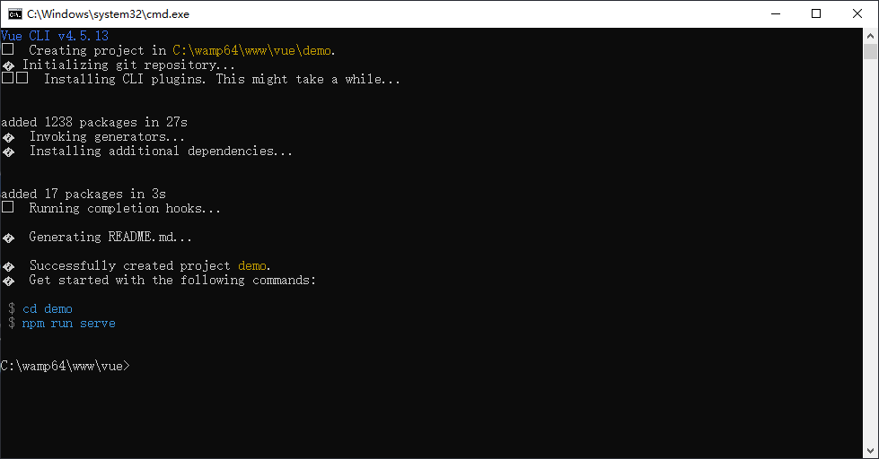


根据提示，输入代码即可运行项目

~~~shell
cd demo
npm run serve
~~~


## 4. 项目结构

~~~
demo
│  .browserslistrc
│  .gitignore						// git 忽略文件
│  babel.config.js					// babel 配置文件
│  package-lock.json				// 项目包小版本配置文件
│  package.json						// 项目包配置文件
│  README.md
│                 
├─public							
│      favicon.ico					// 图标
│      index.html					// 单页文件
│      
└─src								// 源码
    │  App.vue						// 根组件
    │  main.js						// 入口文件
    │  
    ├─assets						// 第三方资源（css、图片）
    │      logo.png
    │      
    └─components					// 组件
            HelloWorld.vue
~~~


## 5. 项目的工作流程

在工程化项目中，vue 要做的事情很简单，通过 main.js 把 app.vue 渲染到 index.html 的指定区域中


main.js

~~~js
// 导入 vue 包，得到 Vue 构造函数
import Vue from 'vue'

// 导入 app.vue 根组件
import App from './App.vue'

Vue.config.productionTip = false

// 创建 Vue 实例
new Vue({
  // 把 render 函数指定的组件，在渲染到 HTML 页面指定位置(#app)
  render: h => h(App),
}).$mount('#app')

~~~


其中 `$mount('#app')` 的作用和 `el: '#app'` 作用是一样的，都是将 vm 实例绑定在 #app 容器上，等价于：

~~~js
import Vue from 'vue'
import App from './App.vue'

Vue.config.productionTip = false

new Vue({
    el:'#app',
    render: h => h(App),
})

~~~


渲染后，index.html 中的 `<div id="app"></div>` 则被 app.vue 中的代码替换掉。


## 6. 创建一个自己的 Vue 文件

在 src 目录中创建 Test.vue

~~~vue
<template>
    <div>
        <p>Hello Vue</p>    
    </div>
</template>
~~~


main.js 导入自己创建的 vue 文件

~~~js
import Vue from 'vue'
import App from './App.vue'
// 导入 Test Vue 文件
import Test from './Test.vue'

Vue.config.productionTip = false

new Vue({
    // 更改加载的 Vue 文件
  render: h => h(Test),
}).$mount('#app')

~~~


## 7. 生成项目

在 package.json 中已经定义好了 npm 命令

~~~js
  "scripts": {
    "serve": "vue-cli-service serve",
    "build": "vue-cli-service build"
  },
~~~


运行下方代码即可生成项目文件

~~~
npm run build
~~~


# Vue 组件

组件化开发指的是：根据封装思想，把页面上可重用的 UI 结构封装为组件，从而方便项目的开发和维护


## 1. Vue 中的组件

vue 是一个支持组件化开发的前端框架，vue 中规定：组件的后缀名是 .vue。之前接触到的 App.vue 文件本质上就是一个 vue 的组件


vue 组件的三个组成部分：

- template 组件的模板结构（DOM 结构）
- script 组件的 javascript 行为
- style 组件的样式


Test.vue

~~~vue
// 模板
<template>
    <div class="test-box">
        <p>Hello Vue</p>
        <p>{{ username }}</p>  
    </div>
</template>

// 脚本
<script>
export default {
    // 组件中的 data 必须是一个函数
    // data 数据不能以对象方式，而是需要写成函数形式，返回值即是 data 值
    data(){
    return { username:'zs'}    
    }    
}
</script>

// 样式
<style>
.test-box{
    background-color: pink;
    }
</style>
~~~


除了 data 需要使用返回值的形式，其他属性大致和之前的写法相同，如添加点击事件：

~~~vue
<template>
	<div class="test-box">
   	 	<p>Hello Vue</p>        
    	<p @click="changeName">{{ username }}</p>  
    </div>
</template>

<script>
    export default {
        data(){
            return { username:'zs'}    
        },
        // 添加方法
        methods:{
            changeName(){            
                console.log(this)
                this.username = 'ls'
            }
        },
        computed: {},
        watch: {},
        filters: {},

    }
</script>

<style>
    .test-box{
        background-color: pink;
    }
</style>
~~~

> this 指向当前组件的实例


## 2. 根节点

根节点就是在 main.js 中 render 渲染的那个节点，由于是组件化，所以一个组件中只允许出现一个根节点，不可以出现两个平级的顶级元素，如：

~~~vue
<template>
	<div class="test-box">
    	<p>Hello Vue</p>        
    	<p @click="changeName">{{ username }}</p>  
    </div>

// 这里第二个 div 与第一个 div 平级，报错
	<div>
    	<p>Hello World</p>
    </div>
</template>
~~~

> 不符合组件化原则


## 3. less 语法

使用 less 语法可以给 style 做上语言标记

~~~vue
<style lang="less">
.test-box {
  background-color: pink;
  p {
      font-size:30px;
  }
}
</style>
~~~

> less 语法可以对元素统一进行配置，如上方代码中的 p 正常写法应该是 `.test-box p {}`


## 4. 组件之间的父子关系

组件被封装后，彼此之间是独立的，没有任何关系，在项目中使用组件时，往往需要根据彼此之间的嵌套关系，形成父子关系或兄弟关系。


### 4.1 使用组件的三个步骤

- 在 components 中创建组件
- 在父组件中（App.vue）中使用 import 语法导入需要的组件
- 使用 components 节点注册组件
- 以标签形式使用注册的组件


~~~js
// 导入组件
import Left from '@/components/Left.vue'
~~~

> @ 为正向导入，@在 webpack.config.js 中定义为 ./src 目录，使用 vue-cli 创建时已经在内部给 @ 做好了 alias 别名


~~~js
// 注册组件
export default {
    components:{
        Left
    }
}
~~~


~~~vue
// 标签形式使用组件
<div class="box">
    <Left></Left>
</div>	
~~~


如：

~~~vue
<template>
<div class="app-container">
    <h1>APP 根组件</h1>
    <hr />
    <div class="box">
        <!-- 渲染 Left 与 Right 组件 -->
        <Left></Left>
        <Right></Right>
    </div>
    </div>
</template>

<script>
    // 导入组件
    import Left from "@/components/Left.vue";
    import Right from "@/components/Right.vue";

    export default {
        components: {
            Left,
            Right
        },
    };
</script>

<style lang="less">
</style>

~~~


### 4.2 私有子组件

使用 components 注册的组件是私有子组件，私有子组件只能应用于其父组件中，而不能应用于其他组件中

例：在 App 组件中注册了 Left，Right 组件，则 Left 与 Right 组件只能在 App 组件中使用，而不能应用于其他诸如 App2 组件中

> 如果其他组件中使用子组件，还需要用 components 在该组件中重新注册


### 4.3 全局组件

全局组件注册后，在任意组件中可以随意调用该子组件

在 vue 项目的 main.js 入口文件中，通过 Vue.component() 方法，可以注册全局组件。实例代码如下：


main.js

~~~js
// 导入全局组件
import Hello from '@/components/HelloWorld.vue'

// 使用 Vue.component 注册全局组件
// 参数1：组件的注册名
// 参数2：导入的组件
Vue.component('Hello',Hello)
~~~


父组件调用全局组件：

~~~
<Hello></Hello>
~~~

> 和私有组件调用方式一样，只不过不用在该组件中导入和注册组件，可以直接使用标签调用


## 5. 组件的 Props

props 是组件的自定义属性，在封装通用组件的时候，合理地使用 props 可以极大的提高组件的复用型


定义一个 Count 组件：

~~~vue
<template>
<div>
    <p>{{count}}</p>
    <button @click="count+=1">+1</button>
    </div>
</template>

<script>
    export default {
        data(){
            return {
                count:0
            }
        }

    }
</script>

<style>

</style>
~~~


在 main.js 中注册为全局组件

~~~js
import Vue from 'vue'
import App from './App.vue'
import Count from '@/components/Count.vue'

Vue.component('Count',Count)
Vue.config.productionTip = false


new Vue({
  render: h => h(App),
}).$mount('#app')

~~~


在 Left 和 Right 中都调用 Count 组件

~~~vue
<template>
  <div class="left">
    <h2>Left</h2>
    <Count></Count>
  </div>
</template>

<script>
export default {

};
</script>

<style lang="less">

</style>
~~~


此时的需求是，Left 中的 Count 初始值不同于 Right 中 Count 的初始值，则需要引入 Props，可以让用户自定义 data 中数据的初始值（类似于函数参数中默认值）

~~~vue
<template>
  <div>
      <p>{{count}}</p>
      <button @click="count+=1">+1</button>
  </div>
</template>

<script>
export default {
    // props 是自定义属性，允许使用者通过自定义属性，为当前的组件指定初始值
    props:['init'],
    data(){
        return {
            count:0
        }
    }

}
</script>

<style>

</style>
~~~


在 Left 或 Right 组件中调用 Count 组件时，使用标签语法，加入 init 值即可给 count 赋值

~~~vue
<Count :init="9"></Count>
~~~

> 这里使用 v-bind 是将引号中的数据转化为 JS 表达式，此时 9 是数字类型，如果不使用 v-bind，init 是属性，引号里边的是字符串


此时 Count 组件中调用的数据就不应该是 data 中的 count 了，而是 props 里边的 init

~~~vue
<template>
  <div>
      <p>{{init}}</p>
      <button @click="init+=1">+1</button>
  </div>
</template>
~~~


### 5.1 props 只读属性

props 类似 data 中的数据，可以直接在模板结构中使用，但是 props 数据是只读数据，最好不要更改，如之前的代码，我们使用 v-on 方法绑定了 click 事件，改变了 init 的值，在 console 中可以看到报错内容

~~~
[Vue warn]: Avoid mutating a prop directly since the value will be overwritten whenever the parent component re-renders. Instead, use a data or computed property based on the prop's value. Prop being mutated: "init"
~~~


想要修改 props 的值，可以把 props 的值转存到 data 中，data 中的数据是可读可写的。props 中的属性也会同 data 一样被数据代理到组件的实例中，所以使用 this.init 就可以调用 init 的值，我们只需要把 init 值交给 count 即可

~~~html
<template>
  <div>
      <p>{{count}}</p>
      <button @click="count+=1">+1</button>
  </div>
</template>

<script>
export default {
    // props 是自定义属性，允许使用者通过自定义属性，为当前的组件指定初始值
    props:['init'],
    data(){
        return {
            count:this.init
        }
    }

}
</script>

<style>

</style>
~~~


### 	5.2 props 默认值

数组格式定义的 props 无法给内部元素进行复制，如果想给 props 赋初始值，需要将 props 定义为对象

~~~json
props: {
	init:{
        // 用 default 属性定义初始值
        default:0,
    }
}
~~~


此时在模板中调用标签，如果不指定 init 的值，则按默认传值

~~~
<Count></Count>
~~~


### 5.3 props type 属性

在声明自定义属性时，可以通过 type 来定义属性的数据类型。如：

~~~json
props: {
	init:{
        default:0,
        // 定义属性数据类型
        // 如果传递过来的值不符合该类型，则会在终端报错	
        type: Number,
    }
}
~~~


### 5.4 props required 属性

required 属性为必填项，当父组件调用该组件时，必须对该属性进行传值，否则控制台报错

~~~json
props: {
	init:{
        default:0,
        type: Number,
        // init 属性必须传值，否则报错
        required: true,
            
    }
}
~~~

> 即使有默认值，如果不传值也会报错


### 5.5 props 应用场景

props 的出现就是为了提高组件的复用性，当一个页面有多个结构相同但内容不同的区域，我们就可以使用 props 来给这些内容赋值，保持结构不变。


## 6. 组件样式

### 6.1 scoped

默认情况下，写在 .vue 组件中的样式会全局生效，因此很容易造成多个组件之间的样式冲突问题。


导致组件之间样式冲突的根本原因是：

- 单页面应用程序中，所有组件的 DOM 结构，都是基于唯一的 index.html 页面进行呈现的
- 每个组件的样式，都会影响 index.html 中的 DOM 元素


解决方法：在组件定义样式中加入 scoped 属性，如：

~~~vue
<style lang="less" scoped>
h2 {
  color:red;
}
</style>
~~~


原理：

加入 scoped 属性后，vue 会自动为该组件中的所有标签添加 data-v-xxxx 属性值，通过属性选择器，对拥有该属性的样式赋值，如：

~~~html
<div data-v-3c83f0b7="" class="left">
    <h2 data-v-3c83f0b7="">Left</h2>
    <div data-v-3c83f0b7="">
        <p>9</p>
        <button>+1</button>
    </div>
</div>

<!-- 属性选择器 -->
<style lang="less">
h2[data-v-3c83f0b7] {
  color:red;
}
</style>
~~~

> 每个组件的 data-v-xxx 的值不同，所以样式就不会造成混乱了


### 6.2 deep

有时候需要通过父组件改变子组件中的样式，如果直接用 css 改变的话，是不能生效的，因为子组件的 scoped 并不和父组件的 scoped 一致，导致属性选择器无法正确选择出正确的标签。


如：在 Left 组件中更改 Count 组件中的 H5 标签样式

~~~html
<style lang="less" scoped>
    h2 {
        color:red;
    }

    h5 {
        color:pink;
    }
</style>
~~~


当样式加载时，父组件的 data-v 属性值与子组件的 data-v 属性值不一致，导致样式无法生效

~~~html
<div class="box">
	<div data-v-3c83f0b7="" class="left">
		<h2 data-v-3c83f0b7="">
			Left
		</h2>
		<div data-v-3f581d8f="" data-v-3c83f0b7="">
			<h5 data-v-3f581d8f="">
				9
			</h5>
			<button data-v-3f581d8f="">
				+1
			</button>
		</div>
	</div>
</div>
~~~


解决方法是在父组件中使用 /deep/：

~~~css
/deep/ h5 {
    color:pink;
}
~~~


样式则变成了

~~~css
[data-v-3f581d8f] h5
~~~

> 后代选择器


应用场景：在使用第三方组件时，需要修改第三方组件样式的时候用到 /deep/ 


# 声明周期

生命周期：是指一个组件从创建 -> 运行 -> 销毁的整个阶段，强调的是一个时间段。

声明周期函数：是由 vue 框架提供的内置函数，会伴随着组件的生命周期，自动按次序执行（如创建前执行、创建后执行，销毁前执行等等）


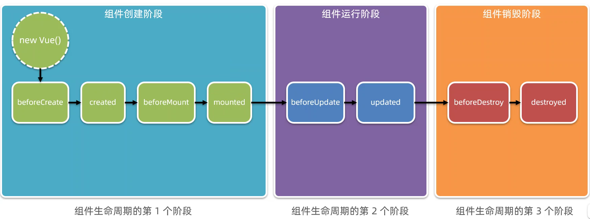


声明周期示意图


## 1. 创建组件前 beforeCreate

当以标签使用组件的时候，如：`<Count></Count>`，实际上我们就创建了该组件的实例，实例声明后，Vue 会先执行 beforeCreate 函数，这时实例的 prop, data, methods 都还没有创建。


我们创建 Test.vue 组件，声明 props, data, methods 

Test.vue

~~~html
<template>
  <div class="test-container">
    <h3>Test.vue 组件</h3>
  </div>
</template>

<script>
export default {
  props: {
    init: {
      default: "default",
    },
  },
  data() {
    return {
      message: "Hello Vue",
    };
  },
  methods: {
    show() {
      console.log("调用了 Test 组件中show方法");
    },
  },
  beforeCreate() {
    console.log(this.init);
    console.log(this.message);
    this.show();
  },
};
</script>

<style lang="less">
.test-container {
  padding: 20px;
  height: 200px;
  background-color: pink;
}
</style>
~~~


并让 App.vue 根组件调用 Test.vue 组件

~~~html
<template>
<div class="app-container">
    <h1>APP 根组件</h1>
    <Test></Test>
    <hr />
    <div class="box">
        <!-- 渲染 Left 与 Right 组件 -->
        <Left></Left>
        <Right></Right>
    </div>
    </div>
</template>

<script>
    // 导入组件
    import Left from "@/components/Left.vue";
    import Right from "@/components/Right.vue";
    import Test from "@/components/Test.vue";


    export default {
        components: {
            Left,
            Right,
            Test
        },
    };
</script>

<style lang="less">
.box {
    display:flex
}
</style>

~~~


在控制台发现报错，可以证明组件在实例化后，执行 beforeCreate 阶段，实例中的所有属性与方法并没有创建，所以无法调用或读取

~~~
vue.runtime.esm.js?2b0e:619 [Vue warn]: Error in beforeCreate hook: "TypeError: Cannot read properties of undefined (reading 'init')"

found in

---> <Test> at src/components/Test.vue
<App> at src/App.vue
<Root>
vue.runtime.esm.js?2b0e:1897 TypeError: Cannot read properties of undefined (reading 'init')
~~~


## 2. 创建组件后 Created

当组件被创建后，会立刻执行 Created 函数，此时 props, data, methods 都已经被创建好了，我们再次读取或调用方法，已经可以显示数据了。

~~~js
Created() {
    console.log(this.init);
    console.log(this.message);
    this.show();
},
~~~


此时虽然数据可用，但是模板结构尚未生成，我们一般在此时发起 Ajax 异步请求，获取数据，如：

~~~html
<template>
  <div class="test-container">
    <h3>Test.vue 组件</h3>
  </div>
</template>

<script>
export default {
  props: {
    init: {
      default: "default",
    },
  },
  data() {
    return {
      message: "Hello Vue",
      // 定义空数组
      books:[],
    };
  },
  methods: {
    show() {
      console.log("调用了 Test 组件中show方法");
    },
    // 定义发送请求获取数据方法
    initBooks(){
        const xhr = new XMLHttpRequest()
        // 因为要使用 Vue 实例中的 this
        // 使用 function 的话，this 指向 xhr
        // 所以改成箭头函数
        xhr.addEventListener('load',()=>{
            const result = JSON.parse(xhr.responseText)
            // 将数据放入实例中的 data.books
            this.books = result.data
        })
        xhr.open('GET','http://www.liulongbin.top:3006/api/getbooks')
        xhr.send()
    },
  },
  created() {
      // 创建组件后获取数据
      this.initBooks()
  },
};
</script>

<style lang="less">
.test-container {
  padding: 20px;
  height: 200px;
  background-color: pink;
}
</style>
~~~


## 3. beforeMount

创建完组件后，实例会根据 el 属性或 $mount 方法加载模板到内存中，然后执行 beforeMount 函数。注意：此时浏览器中还有当前组件的 DOM 结构。所有结构是在内存中，也就是虚拟 DOM。

~~~html
<template>
    <div class="test-container">
        <!-- 加上ID -->
        <h3 id="h3">Test.vue 组件</h3>
    </div>
</template>

<script>
    export default {
        props: {
            init: {
                default: "default",
            },
        },
        data() {
            return {
                message: "Hello Vue",
                books: [],
            };
        },
        methods: {
            show() {
                console.log("调用了 Test 组件中show方法");
            },
            initBooks() {
                const xhr = new XMLHttpRequest();
                xhr.addEventListener("load", () => {
                    const result = JSON.parse(xhr.responseText);
                    this.books = result.data;
                });
                xhr.open("GET", "http://www.liulongbin.top:3006/api/getbooks");
                xhr.send();
            },
        },
        created() {
            this.initBooks();
        },
        // 测试是否能够获取DOM元素
        beforeCreate() {
            console.log("beforeMount");
            const dom = document.querySelector('#h3')
            console.log(dom);
        },
    };
</script>

<style lang="less">
    .test-container {
        padding: 20px;
        height: 200px;
        background-color: pink;
    }
</style>
~~~

> 结果是 undefined


## 4. mounted

在内存创建完 HTML 虚拟 DOM 后，Vue 会把内存中编译好的 HTML 结构渲染到浏览器中，用虚拟 DOM 替换实例中 el 掉指定的 DOM 元素，也就是我们定义的 #app 元素，此时浏览器已经可以包含了当前组件的 DOM 元素。


~~~js
mounted(){
    const dom = document.querySelector('#h3')
    console.log(dom);
},
~~~


## 5. beforeUpdate

当实例中 data 数据发生改变时，会触发 beforeUpdate 函数 。此时的 data 是最新数据，但是还未渲染到页面中


创建一个按钮，改变 data 中的 message 内容

~~~html
<button @click="message += '~'">改变数据</button>
~~~


在 beforeUpdate 中输出 message 值，对比真实页面元素中的 p 标签中的内容

~~~js
beforeUpdate(){
    console.log(this.message);
    const dom = document.querySelector('#pppp')
    console.log(dom.innerHTML);
}
~~~


可以看到 this.message 已经是改变后的内容，但是 p 标签中的内容还是改变前的内容

结论：我们可以断言，在数据发生改变时，会触发 beforeUpdate 函数，并且 data 数据尚未渲染到 HTML 页面中


## 6. updated

数据渲染到 HTML 完毕后，会触发 updated 函数，此时已经完成了 DOM 结构和数据的重新渲染。


再次调用 data 中数据和 DOM 中数据，此时数据是一致的

~~~js
updated(){
    console.log(this.message);
    const dom = document.querySelector('#pppp')
    console.log(dom.innerHTML);
}
~~~


结论：当数据变化后，为了能够操作最新的 DOM 结构，需要将代码写在 updated 声明周期函数中


## 7. beforeDestroy

当组件被调用 $destroy() 函数后，会立即执行 beforeDestroy() 周期函数，此时组件尚未销毁，组件还处于正常工作的状态。


## 8. destroyed

组件已经销毁，此组件在浏览器中对应的 DOM 元素已经被完全移除


# 组件之间的数据共享

项目开发中，最常见的关系分为以下两种：

- 父子关系
- 兄弟关系


父子组件之间的数据共享又分为：

- 父->子共享数据
- 子->父共享数据


## 1. 父 -> 子传值

父组件向子组件共享数据需要使用自定义属性，示例代码如下：


父组件

~~~html
<template>
    <div class="app-container">
        <h1>APP 根组件</h1>
        <Son :msg="message" :user="userinfo"></Son>
        <hr />
    </div>
</template>

<script>
    import Son from "@/components/Son"
    export default {
        data(){
            return {
                message:'hello Vue',
                userinfo:{
                    name:'zs',
                    age:20,
                }
            }
        },
        components: {
            Son,
        },
    };
</script>

<style lang="less">
</style>
~~~


子组件

~~~html
<template>
  <div class="son-container">
      <h3>Son 组件</h3>
      <p>父组件传递过来的 msg 值是：{{ msg }}</p>
      <p>父组件传递过来的 user 值是：{{ user }}</p>
  </div>
</template>

<script>
export default {
    props:['msg','user']
}
</script>

<style>

</style>
~~~


## 2. 修改子组件中的值

父组件传递的数据与子组件接受的数据是独立的（复杂类型除外），如果需要修改数据，子组件中的值改变，但是父组件的值是不变的，因为引用的地址不同，需要将 props 值传入 data ，然后用 data 进行渲染或数据的修改


~~~html
    <template>
    <div class="son-container">
        <h3>Son 组件</h3>
        <p>父组件传递过来的 msg 值是：{{ msg }}</p>
        <p>父组件传递过来的 user 值是：{{ user }}</p>
        <button @click="msg=1">改动</button>
        <button @click="user={ name:'ls'}">改动</button>
    </div>
    </template>
~~~

> msg 与 user 的值在子组件和模板上都被更新为新数据，但是在父组件中数据没有改变


```html
<template>
<div class="son-container">
    <h3>Son 组件</h3>
    <p>父组件传递过来的 msg 值是：{{ msg }}</p>
    <p>父组件传递过来的 user 值是：{{ user }}</p>
    <button @click="user.name='ls'">改动</button>
</div>
</template>
```

> 因为 user 是对象的引用，引用的是地址，所以此时父组件和子组件的值都变化了


## 3. 子 -> 父传值

子组件定义一个 data 值：count

~~~html
    <template>
    <div class="son-container">
        <h3>Son 组件</h3>
        <p>{{count}}</p>
        <button @click="add">按钮</button>
    </div>
    </template>

    <script>
    export default {
        data(){
            return {
                count:1
            }
        }
    }
    </script>

    <style>

    </style>
~~~


父组件定义一个 data 属性用来接受子组件传递的值，并用插值显示在 DOM 中

~~~vue
<template>
	<div class="app-container">
        <h1>APP 根组件</h1>
        <p>子组件传递过来的值为 {{ countFromSon }} </p>
        <Son></Son>
    <hr />
    </div>
</template>

<script>
    import Son from "@/components/Son"

    export default {
        data(){
            return {
                countFromSon:0,
            }
        },
        components: {
            Son,
        },
    };
</script>

<style lang="less">
.box {
    display:flex
}
</style>

~~~


子组件向父组件传值需要使用自定义事件

- 子组件中使用 $emit 触发自定义事件
- 父组件绑定一个自定义事件
- 事件指向父组件对应方法


当子组件中的 $emit 绑定的事件被触发时，父组件通过事件绑定的方法获得子组件传递过来的值


子组件

~~~html
    <template>
  <div class="son-container">
    <h3>Son 组件</h3>
    <p>{{ count }}</p>
    <button @click="add">按钮</button>
  </div>
</template>

    <script>
export default {
  data() {
    return {
      count: 1,
    };
  },
  methods: {
    add() {
      this.count += 1;
        // 修改数据时，通过 $emit() 触发父组件中自定义事件
        // 哪个组件调用这个自定义事件，那么 this.count 就传给那个组件
      this.$emit("numChange", this.count);
    },
  },
};
</script>

    <style>
</style>
~~~


父组件

~~~html
<template>
<div class="app-container">
    <h1>APP 根组件</h1>
    <p>子组件传递过来的值为 {{ countFromSon }} </p>
    <Son @numChange="getNewCount"></Son>
    <hr />
    </div>
</template>

<script>
    import Son from "@/components/Son"


    export default {
        data(){
            return {
                countFromSon:0,
            }
        },
        methods:{
            // val 为从子组件中传递的值
            getNewCount(val){
                this.countFromSon = val
            }
        },
        components: {
            Son,
        },
    };
</script>

<style lang="less">
.box {
    display:flex
}
</style>
~~~


## 4. 兄弟组件之间的传值

在 vue 2.x 中，兄弟组件之间的数据共享的方案是 EventBus


- 创建 eventBus.js 模块，并向外共享一个 Vue 的实例对象
- 在数据发送方，调用 `bus.$emit('事件名称', 要发送的数据)` 方法触发自定义事件
- 在数据接受放，调用 `bus.$on('事件名称', 要发送的数据)` 方法注册一个自定义事件


eventBus.js

~~~js
import Vue from 'vue'

export default new Vue()
~~~


数据发送方，兄弟组件 A

~~~html
<template>
  <div class="left">
    <h2>Left</h2>
    <hr>
    <p>{{ msg }}</p>
      <!-- 点击按钮触发方法 -->
    <button @click="sendMsg">发送数据</button>
  </div>
</template>

<script>
    // 导入 eventBus
import bus from './eventBus.js'

export default {
  data(){
    return {
      msg: 'hello vue'
    }
  },
  methods:{
    sendMsg(){
        // 调用 bus.$emit 触发事件，将 msg 值传递给 bus
      bus.$emit('share',this.msg)
    }
  }

};
</script>

<style lang="less" scoped>

</style>


~~~


数据接受方，兄弟组件B

~~~html
<template>
  <div class="right">
    <h2>Right</h2>
    <hr />
    <p>{{ msgFromLeft }}</p>
  </div>
</template>

<script>
    // 导入 event Bus
import bus from "./eventBus.js";

export default {
  data() {
    return {
        // 定义属性接受传值
      msgFromLeft: "",
    };
  },
    // 当组件被创建时运行
  created() {
      // 通过 eventBus 中绑定的方法进行传值
    bus.$on("share", (val) => {
      this.msgFromLeft = val;
    });
  },
};
</script>

<style lang="less">
</style>


~~~


相当于借助一个中间实例，进行方法与值的传递


# Ref 引用

## 1. 引用 DOM 元素

ref 用来辅助开发者在不依赖于 jQuery 的情况下，获取 DOM 元素或组件的引用。

在每个 vue 的组件实例上，都包含一个 $ref 对象，里边存储着对应的  DOM 元素或组件的引用，默认情况下，组件的 $ref 指向一个空对象。


在 Vue 项目中，可以使用 console.log() 进行查看，在 Vue Dev Tools 中查看实例名称，然后输出

~~~js
console.log($vm0)
console.log($vm0.$refs)
~~~

> 目前 $vm0 这个实例中的 $ref 属性是一个空对象


当对组件中的 DOM 元素附加 ref 属性时，可以看到该组件中的 DOM 元素被加入到了 $ref 属性中，我们可以通过操作 $ref 来操作 DOM 元素

~~~html
 <h1 ref='myH1'>APP 根组件</h1>
~~~


此时再次查看 $ref 属性可以看到，该属性变成了

~~~
{myH1:h1}
~~~


改变 DOM 元素

~~~html
<template>
	<div class="app-container">
        <h1 ref='myH1'>APP 根组件</h1>
        <button @click="changeStyle">改变 DOM 样式</button>
    </div>
</template>

<script>
    export default {
        methods:{
            changeStyle(){
                // 利用 refs 属性操作 DOM 元素
                this.$refs.myH1.style.color = 'red'
            }
        },
    };
</script>

<style lang="less">
</style>

~~~


## 2. 引用组件

如果想要使用 ref 引用页面上的组件实例，可以给子组件添加 ref 属性：

~~~html
<Left ref="comLeft"></Left>
~~~


此时父组件中的 $refs 中就包含了子组件的实例，通过子组件的实例，我们可以对其的 data 值进行数据读写或调用子组件实例的方法。

~~~js
methods:{
    LeftReset(){
        // 利用 refs 属性操作实例
        this.$refs.comLeft.reset()
    }
},
~~~


例：子组件定义一个值，自增按钮和重置按钮

~~~html
<template>
  <div class="left">
    <h2>Left</h2>
    <hr />
    <p>count 值为：{{count}}</p>
    <button @click="add">自增</button>
    <button @click ="reset">重置</button>
  </div>
</template>

<script>
export default {
  data() {
    return {
      count: 0,
    };
  },
  methods: {
    add() {
      this.count +=1
    },
    reset(){
      this.count = 0
    }
  },
};
</script>

<style lang="less" scoped>

</style>


~~~


父组件中把 Left 子组件的实例赋值给 $refs，并通过 $refs 操作子组件

~~~html
<template>
<div class="app-container">
    <h1>APP 根组件</h1>
        <!-- 调用父组件内方法 -->
    <button @click="leftReset">重置Left组件中Count值</button>
    <hr />
    <div class="box">
        <!-- 将子组件实例添加到父组件实例的 $refs中 -->
        <Left ref="comLeft"></Left>
    </div>
    </div>
</template>

<script>

    import Left from "@/components/Left.vue";

    export default {
        methods:{
            leftReset(){
                // 执行子组件中的 reset 方法
                this.$refs.comLeft.reset()
            },
        },
        components: {
            Left,
        },
    };
</script>

<style lang="less">
.box {
    display:flex
}
</style>

~~~


## 3. $nextTick(cb)

组件的 $nextTick(cb) 方法，会把 cb 回调推迟到下一个 DOM 更新周期之后执行。通俗的理解是：等组件 DOM 更新完成之后，再执行 cb 回调函数。从而能保证 cb 回调函数可以操作到最新的 DOM 元素


定义一个输入框和一个按钮

- 当点击按钮时，显示输入框
- 当输入框失去焦点时，显示按钮

~~~html
<template>
  <div class="app-container">
    <h1>APP 根组件</h1>
    <hr />
    <input v-if="inputVisiable" @blur="showBtn" type="text" placeholder="失去焦点显示按钮" />
    <button v-else @click="showInput">显示输入框</button>
  </div>
</template>

<script>
export default {
  data() {
    return {
      inputVisiable: false,
    };
  },
  methods: {
    showInput() {
        this.inputVisiable = true
    },
    showBtn(){
        this.inputVisiable = false
    }
  },
};
</script>

<style lang="less">

</style>

~~~


页面有一个小 BUG，就是当点击按钮时， input 输入框没有自动获取焦点，为了给 input 加上交钱，我们需要使用 ref 来操作 DOM 元素

~~~html
<input v-if="inputVisiable" @blur="showBtn" type="text" placeholder="失去焦点显示按钮" ref="inputRef"/>
~~~


然后在显示输入框方法中，操作输入框 DOM 获取焦点

~~~js
showInput() {
    this.inputVisiable = true
    this.$refs.inputRef.focus()
},
~~~


我们发现，输入框没有自动获取焦点，并且 console 报错

~~~
Error in v-on handler: "TypeError: Cannot read properties of undefined (reading 'focus')"
~~~


这是因为页面中虽然数据改变了，但是结构还没有进行重新渲染，此时是无法找到 inputRef 的，我们需要让代码延迟到 DOM 加载完毕后再运行

~~~js
$this.$nextTick(()=>{
     this.$refs.inputRef.focus()
})
~~~


- nextTick() 解决方案

~~~HTML
<template>
  <div class="app-container">
    <h1>APP 根组件</h1>
    <hr />
    <input
      v-if="inputVisiable"
      @blur="showBtn"
      type="text"
      placeholder="失去焦点显示按钮"
      ref="inputRef"
    />
    <button v-else @click="showInput">显示输入框</button>
  </div>
</template>

<script>
export default {
  data() {
    return {
      inputVisiable: false,
    };
  },
  methods: {
    showInput() {
      this.inputVisiable = true;
      this.$nextTick(() => {
        this.$refs.inputRef.focus();
      });
    },
    showBtn() {
      this.inputVisiable = false;
    },
  },
};
</script>

<style lang="less">
.box {
  display: flex;
}
</style>

~~~


- updated 解决方案

因为同样是需要在数据改变后，DOM 元素加载完毕执行的代码，我们把代码放到声明周期函数中，

~~~js
updated() {
    this.$refs.inputRef.focus();
},
~~~

当第一次运行时，input 框获取了焦点，但是当 input 框失去焦点时，此时 inputVisibale 数据又发生了改变，此时代码会先根据 v-if, else 判断，把 input 框从页面结构中删除，然后重新渲染页面，之后才会执行 updated 中的代码，由于 input 框没有被渲染到页面上，也就无法找到 inputRef 了，所以 Console 会报错。当然如果用 v-show 来就没有这个问题，因为这个元素是一直在页面上的，只是用了 display:none 来隐藏而已。


# 购物车案例

## 1. 项目初始化

App.vue 根组件

~~~html
<template>
  <div class="app-container">
    <h1>APP 根组件</h1>
    <hr />
  </div>
</template>

<script>

}
</script>

<style lang="less">

</style>

~~~


## 2. 导入组件

创建 Header 组件

~~~html
<template>
  <div class="header-container">
      <h3>购物车案例</h3>
  </div>
</template>

<script>
export default {

}
</script>

<style>
.header-container{
    font-size:12px;
    height: 45px;
    width: 100%;
    background-color: rgb(28, 138, 241);
    text-align: center;
    line-height: 45px;
    color:white;
}
</style>
~~~


- 根组件导入 Header 组件
- 注册组件
- 使用标签渲染模板

~~~html
<template>
  <div class="app-container">
    <Header></Header>
    <h1>APP 根组件</h1>
    <hr />
  </div>
</template>

<script>
import Header from '@/components/Header/Header'

export default {
  components:{
    Header
  }
  
}
</script>

<style lang="less">

</style>

~~~


## 3. 父组件把 Title 值传给子组件

App.vue

~~~html
<template>
  <div class="app-container">
    <Header title="购物车标题"></Header>
    <h1>APP 根组件</h1>
    <hr />
  </div>
</template>
~~~


Header.vue

~~~html
<template>
  <div class="header-container">
      <h3>{{ title }}</h3>
  </div>
</template>

<script>
export default {
    props:['title']
}
</script>
~~~


## 4. 获取数据

在 App.vue 使用 axios 获取数据

- 导入 axios 包
- 在 methods 方法定义 initCartList 函数
- 在 created 声明周期函数调用 initCartList 函数


App.vue

~~~html
<template>
  <div class="app-container">
    <Header title="购物车标题"></Header>
    <h1>APP 根组件</h1>
    <hr />
  </div>
</template>

<script>
    // 导入 axios 包
import axios from "axios";
import Header from "@/components/Header/Header";

export default {
    // 声明周期函数中调用 initCartList() 方法
  created() {
    this.initCartList();
  },
  methods: {            
    async initCartList() {
        // 使用 axios 获取数据
      const { data: res } = await axios.get("https://www.escook.cn/api/cart");
      console.log(res);
    },
  },
  components: {
    Header,
  },
};
</script>

<style lang="less">
</style>

~~~


接口数据格式：

~~~js
list: (10) [
    {id: 1, goods_name: '班俏BANQIAO超火ins潮卫衣女士2020秋季新款韩版宽松慵懒风薄款外套带帽上衣', goods_img: 'https://www.escook.cn/vuebase/pics/1.png', goods_price: 108, goods_count: 1, …},
    {id: 2, goods_name: '嘉叶希连帽卫衣女春秋薄款2020新款宽松bf韩版字母印花中长款外套ins潮', goods_img: 'https://www.escook.cn/vuebase/pics/2.png', goods_price: 129, goods_count: 1, …},
    {id: 3, goods_name: '思蜜怡2020休闲运动套装女春秋季新款时尚大码宽松长袖卫衣两件套', goods_img: 'https://www.escook.cn/vuebase/pics/3.png', goods_price: 198, goods_count: 1, …},
    {…}, {…}, {…}, {…}, {…}, {…}, {…}]
message: "获取购物车列表数据成功！"
status: 200
~~~


将数据存放到 data 中

~~~html
<script>
    import axios from "axios";
    import Header from "@/components/Header/Header";

    export default {
        data(){
            return {
                list:[]
            }
        },
        created() {
            this.initCartList();
        },
        methods: {
            async initCartList() {
                const { data: res } = await axios.get("https://www.escook.cn/api/cart");
                if (res.status === 200){
                    this.list = res.list
                }
            },
        },
        components: {
            Header,
        },
    };
</script>
~~~


## 5. 遍历渲染商品列表

商品模块 Goods.vue

~~~html
<template>
  <div class="goods-container">
    <div class="thumb">
      <div class="custom-control custom-checkbox">
        <input
          type="checkbox"
          class="custom-control-input"
          id="cb1"
          :check="true"
        />
        <label class="custom-control-label" for="cb1">
          
        </label>
      </div>
    </div>
    <div class="goods-info">
      <h6>商品名称</h6>
      <div class="goods-info-bottom">
        <span class="goods-price">￥0</span>
      </div>
    </div>
  </div>
</template>

<script>
export default {};
</script>

<style lang="less" scoped>
.goods-container {
  + .goods-container {
    border-top: 1px solid #efefef;
  }
  padding: 10px;
  display: flex;
  .thumb {
    display: flex;
    align-items: center;
    img {
      width: 100px;
      height: 100px;
      margin: 0 10px;
    }
  }

  .goods-info {
    display: flex;
    flex-direction: column;
    justify-content: space-between;
    flex: 1;
    .goods-title {
      font-weight: bold;
      font-size: 12px;
    }
    .goods-info-bottom {
      display: flex;
      justify-content: space-between;
      .goods-price {
        font-weight: bold;
        color: red;
        font-size: 13px;
      }
    }
  }
}
</style>
~~~


App.vue 导入父组件，遍历

~~~html
<template>
  <div class="app-container">
    <Header title="购物车标题"></Header>
    <h1>APP 根组件</h1>
    <Goods
      v-for="item in list"
      :key="item.id"
      :title="item.goods_name"
      :pic="item.goods_img"
      :price="item.goods_price"
      :status="item.goods_state"
    ></Goods>
  </div>
</template>

<script>
import axios from "axios";
import Header from "@/components/Header/Header";
import Goods from "@/components/Goods/Goods";

export default {
  data() {
    return {
      list: [],
    };
  },
  created() {
    this.initCartList();
  },
  methods: {
    async initCartList() {
      const { data: res } = await axios.get("https://www.escook.cn/api/cart");
      if (res.status === 200) {
        this.list = res.list;
      }
    },
  },
  components: {
    Header,
    Goods,
  },
};
</script>

<style lang="less">
</style>

~~~


父组件接受数据

~~~html
<template>
  <div class="goods-container">
    <div class="thumb">
      <div class="custom-control custom-checkbox">
        <input
          type="checkbox"
          class="custom-control-input"
          id="cb1"
          :checked="status"
        />
        <label class="custom-control-label" for="cb1">
          
        </label>
      </div>
    </div>
    <div class="goods-info">
      <h6>{{ title }}</h6>
      <div class="goods-info-bottom">
        <span class="goods-price">￥{{ price }}</span>
      </div>
    </div>
  </div>
</template>

<script>
export default {
  props: {
    title: {
      default: "",
      type: String,
    },
    pic: {
      default: "",
      type: String,
    },
    price: {
      default: 0,
      type: Number,
    },
    status:{
        default:true,
        type: Boolean,
    },
  },
};
</script>
~~~


## 6. Object 传值

这样一个个将数据拆分，然后独立传值，为什么不用 Object 传值一次性把所有值都传到子组件，如：


App.vue

~~~html
<template>
  <div class="app-container">
    <Header title="购物车标题"></Header>
    <h1>APP 根组件</h1>
    <Goods v-for="item in list" :key="item.id" :obj="item"></Goods>
  </div>
</template>
~~~


Goods.vue

~~~html
<script>
    export default {
        props: {
            obj:{
                default:{},
                type:Object
            }
        },
    };
</script>
~~~


这样渲染模板的时候，不就可以直接使用 item 对象来进行传值了吗？

~~~html

<h6>{{ obj.goods_name }}</h6>
<span class="goods-price">￥{{ obj.goods_price }}</span>
~~~


那么思考一下，现在如果是另外一个模块如 Promotion.vue 调用 Goods.vue 子组件，其中数据格式变成了

~~~json
{"promotion_count":1,
"promotion_img":"https://www.escook.cn/vuebase/pics/1.png",
"promotion_name":"班俏BANQIAO超",
"promotion_price":108,
"promotion_state":true,
"id":1}
~~~

> 那么 Goods.vue 这个组件还能复用吗？


## 7. 复选框状态

目前复选框状态是用的 v-bind 绑定，当页面复选框状态值发生改变，并不会同步到 vue 的数据源中。并且我们不能使用 v-model 来绑定 props 的数据。那么解决方案是子组件向父组件传值。


当子组件页面复选框状态发生改变时，改变父组件中获取的 data 数据

- 子组件中，监听复选框状态变化事件，拿到最新的勾选状态
  - `<input type="checkbox" @change="stateChange" />`
- 当监听到复选框状态改变时，把改变的状态通过自定义事件形式，发送给父组件
- 父组件传递 id 属性值（为了定位是哪个商品复选框）
- 子组件使用 `$emit('state-chagne',{id, value})` 事件将值传递给父组件
  - id 为当前商品的 id，vlaue 为改变后的复选框的状态


子组件绑定 @change 事件

~~~html
<input
       type="checkbox"
       class="custom-control-input"
       id="cb1"
       :checked="status"
       @change="stateChange"
       />
~~~


子组件 @change 绑定方法中，传值

~~~js
  methods:{
    stateChange(e){
        // 获取当前复选框状态
      const newState = e.target.checked
      // 定义自定义方法
      this.$emit('state-change',{id:this.id, value:newState})
    }
  }
~~~


父组件绑定自定义方法

~~~html
<Goods
       v-for="item in list"
       :key="item.id"
       :id="item.id"
       :title="item.goods_name"
       :pic="item.goods_img"
       :price="item.goods_price"
       :status="item.goods_state"
       @state-change="getNewState"
       ></Goods>
~~~


当 stateChange 自定义方法被触发时，触发父组件中的 getNewState 方法

~~~js
    getNewState(e) {
        // 遍历列表，找到 id 与 触发项相同的对象
      this.list.some((item)=>{
        if(item.id === e.id){
            // 改变 state 值
          item.goods_state = e.value
          return true
        }
      })
    },
~~~


## 8. Label 标签绑定

最后还有一个小问题要修复，就是 Label 标签的绑定目前是写死的，我们需要给每个遍历项不同的 label

~~~html
<input
       type="checkbox"
       class="custom-control-input"
       :id="'cb'+id"
       :checked="status"
       @change="stateChange"
       />
<label class="custom-control-label" :for="'cb' + id">
    
</label>
~~~


## 8. Footer 区域

Footer.vue

~~~html
<template>
  <div class="footer-container">
    <!-- 左侧的全选 -->
    <div class="custom-control custom-checkbox">
      <input
        type="checkbox"
        class="custom-control-input"
        id="cbFull"
        :checked="true"
      />
      <label class="custom-control-label" for="cbFull">全选</label>
    </div>

    <!-- 中间的合计 -->
    <div>
      <span>合计：</span>
      <span class="total-price">￥{{ 0 }}</span>
    </div>

    <!-- 结算按钮 -->
    <button type="button" class="btn btn-primary btn-settle">
      结算（{{ 0 }}）
    </button>
  </div>
</template>

<script>
export default {};
</script>

<style lang="less" scoped>
.footer-container {
  font-size: 12px;
  height: 50px;
  width: 100%;
  border-top: 1px solid #efefef;
  position: fixed;
  bottom: 0;
  background-color: #fff;
  display: flex;
  justify-content: space-around;
  align-items: center;
  padding: 0 10px;
}

.custom-checkbox {
  display: flex;
  align-items: center;
}

#cbFull {
  margin-right: 5px;
}

.btn-settle {
  height: 80%;
  min-width: 110px;
  border: 0;
  border-radius: 25px;
  font-size: 12px;
  background-color: rgb(38, 156, 235);
  color: white;
}

.total-price {
  font-weight: bold;
  font-size: 14px;
  color: red;
}
</style>

~~~


父组件引入

~~~html
// 引入组件
import Footer from "@/components//Footer/Footer"
~~~


~~~
// 注册组件
  components: {
    Header,
    Goods,
    Footer
  },
~~~


~~~
// 使用标签
<Footer></Footer>
~~~


~~~html
<template>
  <div class="app-container">
    <Header title="购物车标题"></Header>
    <h1>APP 根组件</h1>
    <Goods
      v-for="item in list"
      :key="item.id"
      :id="item.id"
      :title="item.goods_name"
      :pic="item.goods_img"
      :price="item.goods_price"
      :status="item.goods_state"
      @stateChange="getNewState"
    ></Goods>
    <Footer></Footer>
  </div>
</template>

<script>
import axios from "axios";
import Header from "@/components/Header/Header";
import Goods from "@/components/Goods/Goods";
import Footer from "@/components//Footer/Footer"

export default {
  data() {
    return {
      list: [],
    };
  },
  created() {
    this.initCartList();
  },
  methods: {
    async initCartList() {
      const { data: res } = await axios.get("https://www.escook.cn/api/cart");
      if (res.status === 200) {
        this.list = res.list;
      }
    },
    getNewState(e) {
      this.list.some((item)=>{
        if(item.id === e.id){
          item.goods_state = e.value
          return true
        }
      })
    },
  },
  components: {
    Header,
    Goods,
    Footer
  },
};
</script>

<style lang="less">
</style>

~~~


## 9. 计算属性显示全选框

当所有 checkbox 选框被选中时，全选框才会被选中，可以在 App.vue 中使用计算属性来监听所有的复选框

~~~html
  computed:{
    fullState(){
      return this.list.every((item=>item.goods_state))
    }
  },
~~~

> 返回i个布尔值


将计算属性传递给子组件，让子组件的状态框发生改变，子组件使用 props 属性接受计算属性

~~~html
<script>
export default {
    props:{
        isfull:{
            default:false,
            type:Boolean
        }
    }
};
</script>
~~~


父组件传值

~~~html
<Footer :isfull="fullState"></Footer>
~~~


## 10. 点击复选框实现全选或全消

子组件将值传递给父组件，一样在子组件中定义自定义方法

~~~js
    methods:{
        fullChange(e){
            const state = e.target.checked
            this.$emit('full-change',state)
        }
    }
~~~


将该方法绑定在全选框上

~~~html
<input
       type="checkbox"
       class="custom-control-input"
       id="cbFull"
       :checked="isfull"
       @change="fullChange"
       />
~~~


当全选框状态发生改变时，$emit 触发父组件中的 full-change 事件，父组件通过该事件触发绑定在父组件上的方法

~~~html
<Footer :isfull="fullState" @full-change="fullSelect"></Footer>
~~~


父组件通过该方法改变 list 中的值

~~~js
    fullSelect(e){
      this.list.forEach(item => {
        item.goods_state = e
      });
    }
~~~


## 11. 计算商品总价

- 通过计算属性动态获取数据
- filter 过滤勾选商品拿到新数组 
- reduce 计算新数组中的总价格 
- props 传值到子组件中
- toFixed(2) 保留两位小数


~~~js
// 计算属性获取所有勾选商品的总价格
    totalPrice(){
      return this.list.filter((item=>item.goods_state)).reduce((amt,item)=>{
        return amt += item.goods_price * item.goods_count
      },0)
    }
~~~


~~~html
<!-- 父组件通过自定义属性传值给子组件 -->
    <Footer :isfull="fullState" :total="totalPrice" @full-change="fullSelect"></Footer>
~~~


~~~js
// 子组件定义 props 接受父组件传值
    props:{
        isfull:{
            default:false,
            type:Boolean
        },
        total:{
          default:0,
          type:Number
        },
    },
~~~


~~~html
<!-- 子组件将 props 属性值渲染在页面 -->
      <span class="total-price">￥{{ total.toFixed(2) }}</span>
~~~


## 12. Counter 组件

Count 是控制商品数量的组件，所以应该是 Goods 的子组件，而不是 App 的子组件


Counter.vue

~~~html
<template>
  <div class="number-container d-flex justify-content-center align-items-center">
    <!-- 减 1 的按钮 -->
    <button type="button" class="btn btn-light btn-sm">-</button>
    <!-- 购买的数量 -->
    <span class="number-box">1</span>
    <!-- 加 1 的按钮 -->
    <button type="button" class="btn btn-light btn-sm">+</button>
  </div>
</template>

<script>
export default {}
</script>

<style lang="less" scoped>
.number-box {
  min-width: 30px;
  text-align: center;
  margin: 0 5px;
  font-size: 12px;
}

.btn-sm {
  width: 30px;
}
</style>

~~~


- 导入子组件
- 注册组件
- 标签显示


~~~js
// 在 Goods 组件中导入 Counter 组件
import Counter from "@/components/Counter/Counter"
~~~


~~~js
// 使用 Components 注册 Counter 组件
  components:{
    Counter
  }
~~~


~~~html
<!-- 使用标签将 Counter 组件渲染到页面 -->
      <div class="goods-info-bottom">
        <span class="goods-price">￥{{ price }}</span>
        <Counter></Counter>
      </div>
~~~


## 13. App 组件传值给 Counter

- App 组件把 goods_count 值传给 Goods，然后 Goods 再把值传递给 Count 组件


App.vue 在 Goods 标签中传值给 Goods.vue

~~~html
:count="item.goods_count"
~~~


设定 Goods 组件接受数据的 props 属性 count

~~~json
count:{
    default:1,
    type:Number,      
}
~~~


再将 Goods.vue 中的 props 属性 count 传值给 Counter

~~~html
<Counter :num="count"></Counter>
~~~


Counter 中定义 props 属性 num （不建议重复使用同一变量名）

~~~js
export default {
  props:{
    num:{
      default:1,
      type:Number,
    }
  }
}
~~~


Counter 模板渲染 num

~~~html
<span class="number-box">{{num}}</span>
~~~


## 14. Counter 数据同步给 App

- 修改 Counter 组件中的值，需要同步该数据到 App 中的 data 数据，传值关系是 孙 -> 爷 传值。在 Vue 中可以看做是兄弟组件传值，需要利用到中间件 eventBus.js


在 Counter 中定义 props 属性 id，以便用来定位 list 中的第几条数据

~~~json
id:{
    require:true,
    type:Number,
},
~~~


从 Goods.vue 传入 id 值

~~~html
<Counter :num="count" :id="id"></Counter>
~~~


创建 eventBus.js

~~~html
import Vue from 'vue'

export default new Vue()
~~~


在 Counter.vue 中导入 eventBus.js

~~~HTML
import bus from "@/components/eventBus"
~~~


在 Counter 中定义点击 “+”  增加数量的方法，click 事件绑定 + 按钮

~~~js
<button type="button" class="btn btn-light btn-sm" @click="add">+</button>
~~~


在 methods 中添加 add 方法

~~~js

methods:{
    add(){
        // 发送给 App 的格式为 {id, value}
        // 创建 obj 对象
        const obj = {
            id:this.id,
            value: this.num + 1
        }
        // 通过 eventBus 组件发送对象给 App.vue
        bus.$emit('share',obj);  
    }
}
~~~


在 App.vue 中导入 bus

~~~js
import bus from "@/components/eventBus";
~~~


在组件创建生命周期函数中接受数据

~~~js
created() {
    this.initCartList();
    bus.$on('share',val=>{
        this.list.some(item=>{
            if(item.id === val.id){
                item.goods_count = val.value
                return true
            }
        })
    });
},
~~~


sub 方法同理，Counter.vue 绑定点击事件

~~~html
<!-- 减 1 的按钮 -->
<button type="button" class="btn btn-light btn-sm" @click="sub">-</button>
~~~


methods 中的 sub 方法

~~~js
sub() {
    // 判断商品数量不能为负数
    if(this.num -1 == 0){
        return
    }
    const obj = {
        id: this.id,
        value: this.num - 1,
    };
    bus.$emit("share", obj);
},
~~~


## 15. 商品总数

结算时，需要统计商品总数量。使用 computed 计算属性在 App.vue 中统计 data 中的商品总件数，

~~~js
totalItems(){
    return this.list.filter((item)=>item.goods_state).reduce((t, item)=>t+= item.goods_count,0)      
}
~~~


将值传递给 Footer.vue

~~~html
<Footer
:isfull="fullState"
:total="totalPrice"
:allCount="totalItems"
@full-change="fullSelect"
></Footer>
~~~


Footer 使用 props 接受

~~~json
allCount:{
    type:Number,
    default:0
}
~~~


渲染到页面

~~~html
<!-- 结算按钮 -->
<button type="button" class="btn btn-primary btn-settle">
    结算（{{ allCount }}）
</button>
~~~


# 动态组件 Component

vue 提供一个内置组件 component，专门用来实现动态组件的渲染


## 1. 引入动态组件

之前引入组件的方法是在父组件中用 import 方法引入组件，然后在 components 中注册组件，之后使用标签方法渲染组件，代码如下：

~~~vue
<template>
  <div class="app-container">
    <h1>App 根组件</h1>
    <hr />
    <div class="box">
      <Left></Left>
      <Right></Right>
    </div>
  </div>
</template>

<script>
import Left from '@/components/Left.vue'
import Right from '@/components/Right.vue'

export default {
  components:{
    Left,
    Right
  }
}
</script>

<style lang="less">
.app-container {
  padding: 1px 20px 20px;
  background-color: #efefef;
}
.box {
  display: flex;
}
</style>

~~~


我们可以通过 component 标签来渲染组件

~~~html
<component is="Left"></component>
<component is="Right"></component>
~~~


通过 component 标签，可以动态绑定组件，首先需要在 data 中定义一个组件名

~~~js
data(){
    return {
        comName:'Left'
    }
},
~~~


然后在 component 标签中用 v-bind 绑定这个属性

~~~js
<component :is="comName"></component>
~~~


## 2. 动态切换组件

通过改变 component 组件绑定的属性值，就可以动态切换组件了，如：

~~~html
<button @click="comName='Left'">显示 Left 组件</button>
<button @click="comName='Right'">显示 Right 组件</button>
~~~


## 3. keep-alive

当组件切换时，原来显示的组件就会被销毁，同时组件中 data 的值也会被清空，例：在 Left 组件中建立一个 count 数据，点击按钮自增 count 值

~~~vue
<template>
  <div class="left-container">
    <h3>Left 组件 ---- {{ count }} </h3>
    <hr />
    <button @click="count+=1">+1</button>
  </div>
</template>

<script>
export default {
  data(){
    return {
      count:0,
    }
  }
}
</script>

<style lang="less">
.left-container {
  padding: 0 20px 20px;
  background-color: orange;
  min-height: 250px;
  flex: 1;
}
</style>

~~~

> 当切换到 Right 组件时，count 值被清空，可以通过 created, destroyed 周期函数来查看 Left 组件是否被销毁与重新创建


使用 keep-alive 标签可以把内部的组件进行缓存，从而保存组件中的数据。

~~~html
      <keep-alive>
        <component :is="comName"></component>
      </keep-alive>
~~~

> 此时切换标签，则不会销毁原组件


## 4. keep-alive 对应生命周期函数

- 当组件被缓存时，会自动触发组件的 deactivated 生命周期函数
- 当组件被激活时，会自动触发组件的 activated 生命周期函数


~~~js
  created(){
    console.log('Left 组件被创建');
  },
  activated(){
    console.log('Left 组件被激活');
  },
  deactivated(){
    console.log('Left 组件被缓存');
  },
  destroyed(){
    console.log('Left 组件被销毁');
  }
~~~


## 5. keep-alive include 属性

并不是所有组件都需要被缓存，使用 include 属性可以指定那些需要被缓存的组件，如：

~~~html
      <keep-alive include="Left">
        <component :is="comName"></component>
      </keep-alive>
~~~


多个组件用逗号分隔

~~~html
      <keep-alive include="Left,Right">
        <component :is="comName"></component>
      </keep-alive>
~~~


## 6. keep-alive exclude 属性

exclude 属性指定那些不需要被缓存的组件，注意：include 与 exclude 不能同时使用

~~~html
      <keep-alive exclude="Right">
        <component :is="comName"></component>
      </keep-alive>
~~~


## 7. 组件 name 属性

当组件没有 name 属性时，父组件注册组件时的名称即是组件名

~~~html
  components: {
    Left,
    Right,
  },
~~~


当组件有 name 属性时，在 Vue dev-tool 中显示的则是组件名，并且在 keep-alive 标签 include 或 exclude 组件时，需要使用对应的组件名

~~~html
export default {
	name:myRight,
}
~~~


~~~html
<keep-alive include="myRight">
    <component :is="comName"></component>
</keep-alive>
~~~

> 在 data 中 comName 还是使用 components 里的注册名


- 组件的 ”注册名称“ 的主要应用场景是：以标签的形式，把注册号的组件，渲染和使用到页面结构之中
- 组件声明的时候 “name” 名称的主要应用场景：结合 `<keep-alive>` 标签实现组件缓存功能；以及在调试工具中看到组件的 name 名称


# 插槽

插槽 （slot） 是 vue 为组件的封装者提供的呢你。允许开发者在封装组件时，把不确定的、希望由用户指定的部分定义为插槽。如图：


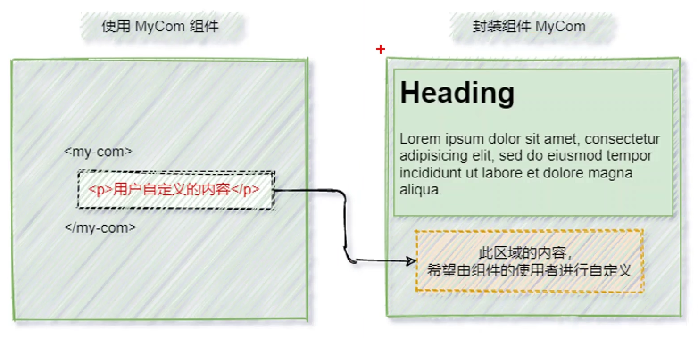


简单来说就是一个组件已经被别人写好，用户可以直接通过标签+内容的方式将组件方便的插入。


## 1. slot

在父组件调用子组件时，使用子组件标签渲染到页面，将自定义内容放在子组件标签内，如：

~~~html
<Left>
    <p>这是一个自定义内容</p>
</Left>
~~~

 

在子组件中使用 slot 标签做定位

~~~html
<slot></slot>
~~~

> 使组件标签中的内容显示在 slot 插槽占位中


## 2. v-slot

官方建议，每一个 slot 插槽，都要有一个 name 属性，如果省略，则默认为 default

~~~html
<slot name="default"></slot>
~~~


组件标签中的内容，默认会填充到 default 标签的插槽中，如：

~~~
<Left>
    <p>这是一个自定义内容</p>
</Left>
~~~


如果想将标签中内容放入指定插槽中，则需要使用 v-slot 指令，v-slot 只能在 template 标签或 component 标签中使用

~~~html
<Left>
    <template v-slot:default>
        <p>这是一个插槽</p>
    </template>
</Left>
~~~

> tempalte 是一个虚拟标签，起到占位作用，但是不会渲染为实际的 HTML 元素，即页面中不会出现 template 标签


v-slot 简写形式是 #

~~~html
<Left>
    <template #default>
        <p>这是一个插槽</p>
    </template>
</Left>
~~~


## 3. slot 默认内容

当标签没有传递内容时，slot 可以填充默认内容，官方称为后备内容，如：


Left 标签没有传递任何内容

~~~html
<Left></Left>
~~~


默认插槽会显示默认内容

~~~html
<slot name="default">
	<p>
    	这是默认内容
    </p>
</slot>
~~~


如果 Left 标签传递了内容，则默认内容会被替换

~~~html
<Left>
    <template #default>
        <p>这是一个插槽</p>
    </template>
</Left>
~~~


## 案例：封装插槽

制作一个 Article.vue 封装插槽，可以让用户将指定内容传递到指定插槽中

~~~vue
<template>
  <div class="article-container">
      <div class="header-box">
          <slot name="header"></slot>
      </div>
      <div class="content-box">
          <slot name="content"></slot>
      </div>
      <div class="footer-box">
          <slot name="footer"></slot>

      </div>
  </div>
</template>

<script>
export default {
    name:"Article"
}
</script>

<style lang="less" scoped>
.article-container {
    >div {
        min-height: 200px;
    }
    .header-box {
        background-color: pink;
    }
    .content-box {
        background-color: lightblue;
    }
    .footer-box {
        background-color: lightgreen;
    }
}

</style>
~~~


App.vue 引入组件，注册组件，并且对指定插槽传递对应内容

~~~vue
<template>
  <div class="app-container">
    <h1>App 根组件</h1>
    <hr />
    <Article>
      <template #header>
        <p>文章标题</p>
      </template>
      <template #content>
        <p>文章内容</p>
      </template>
      <template #footer>
        <p>文章尾部</p>
      </template>
    </Article>
  </div>
</template>

<script>
import Article from "@/components/Article";

export default {
  components: {
    Article,
  },
};
</script>

<style lang="less">
.app-container {
  padding: 1px 20px 20px;
  background-color: #efefef;
}
.box {
  display: flex;
}
</style>

~~~


## 4. 作用域插槽

在封装组件时，为预留的 slot 提供属性对应的值，这种用法叫做作用域插槽，即子组件插槽中自定义属性，在父组件中填充插槽内容时可以读取插槽中的自定义属性。


Article

~~~html
<slot name="content" msg="hello world"></slot>
~~~


App.vue

~~~html
<template #content="msg">
    <p>文章内容</p>
    <p>{{msg}}</p>
</template>
~~~

> 接受值相当于一个形参，可以是任何字符，一般用 scope


msg 内容则是一个键值对象

~~~json
{ "msg": "hello world" }
~~~


## 5. 作用域插槽的动态属性

通过给插槽绑定属性值可以传递给父组件，除了固定值外，也可以将插槽组件中的 data 属性绑定在插槽上，如：

~~~html
<slot name="content" msg="hello world" :userinfo="user"></slot>
~~~


在 data 中定义属性

~~~html
<script>
export default {
  name: "Article",
  data() {
    return {
      user: {
        name: "张三",
        age: 18,
      },
    };
  },
};
</script>
~~~


父组件接受传值

~~~html
<template #content="scope">
    <p>文章内容</p>
    <p>{{scope}}</p>
</template>
~~~


此时父组件接受的值为

~~~html
{ "msg": "hello world", "userinfo": { "name": "张三", "age": 18 } }
~~~


通过对象解构，我们可以直接获取指定值

~~~html
<template #content="{msg, userinfo}">
    <p>文章内容</p>
    <p>{{msg}}</p>
    <p>{{userinfo}}</p>
    <p>{{userinfo.name}}</p>
</template>
~~~


显示数据为

~~~
hello world

{ "name": "张三", "age": 18 }

张三
~~~


## 案例：Counter 组件重构


# 自定义指令

vue 官方提供了很多指令，如 v-if, v-text, v-for, v-bind, v-model 等等，除此之外 vue 还允许开发者自定义指令。


自定义指令分为两种：

- 私有自定义指令
- 全局自定义指令


## 1. 私有自定义指令

在每个 vue 组件中，可以在 directives 节点下声明私有自定义指令。示例代码如下：

~~~js
// 私有自定义指令的节点
directives：{
    // 定义名为 color 的指令，指向一个配置对象
    color:{
        // 当指令第一次被绑定到元素上的时候，会立即触发 bind 函数
        // 形参中的 el 是绑定了此指令的、原生的 DOM 对象
        bind(el) {
            // 为绑定到的 HTML 元素设置红色的文字
            el.style.color = 'red'
        }
    }
}
~~~


使用自定义指令

~~~html
<h1 v-color>App 根组件</h1>
~~~


## 2. 指令传值

当需要给指令传参时，可以给指令赋值

~~~html
<h1 v-color="color">App 根组件</h1>
~~~


在 data 属性定义 color 的值

~~~js
  data() {
    return {
      color:'blue',
    };
  },
~~~


通过 bind 函数中的形参 binding 来拿到值，binding 是一个对象

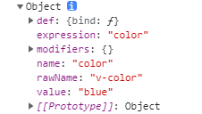


通过 binding 的 value 值获取传递过来的参数

~~~js
  directives: {
    color: {
        // binding 则是传过来的对象
      bind(el,binding) {
        el.style.color = binding.value;
      },
    },
  },
~~~


如果想在自定义指令中直接赋值，则需要使用单引号

~~~html
<h1 v-color="'red'">App 根组件</h1>
~~~

> 相当于 binding.value = 'red'


## 3. update

bind 函数只在被绑定的元素上生效一次，如果用户期间改变了自定义指令传值，如改变 color 值，bind 不会再次触发，如添加一个 Button

~~~html
<button @click="color='green'">改变 Color 的颜色</button>
~~~

> 虽然 data 中的 color 值变了，但是 v-color 指令并没有再次被触发


update 函数会在每次 DOM 更新时被调用，如：

~~~js
directives: {
    color: {
      bind(el,binding) {
        el.style.color = binding.value;
      },
          // 只在 DOM 更新时，会触发 update 函数
      update(el,binding){
        el.style.color = binding.value;
      }
    },
  },
~~~


## 4. 函数简写

如果 bind 和 update 函数中的逻辑完全相同，则对象格式的自定义指令可以简写成函数格式

~~~js
directives: {
    // 在 bind 和 update 时会触发相同逻辑
    color(el,binding) {
        el.style.color = binding.value;
    },
},

~~~


## 5. 全局自定义指令

全局共享的自定义指令在 main.js 定义，可以在任意组件中使用，需要通过 Vue.directive() 进行声明，示例代码如下：

~~~js
// 参数1：字符串，表示全局自定义指令的名字
// 参数2：对象，用来接受指令参数值
Vue.directive('color', function(el, binding){
    el.style.color = binding.value
})
~~~


# ESLint Vue 项目

## 0. 准备工作

在 VSCode 设置中

- 调整 Tab 缩进为2个空格
- 调整 Format on Save


## 1. 创建项目

使用 vue create 创建新的项目

~~~
vue create demo-3
~~~


选择手动创建

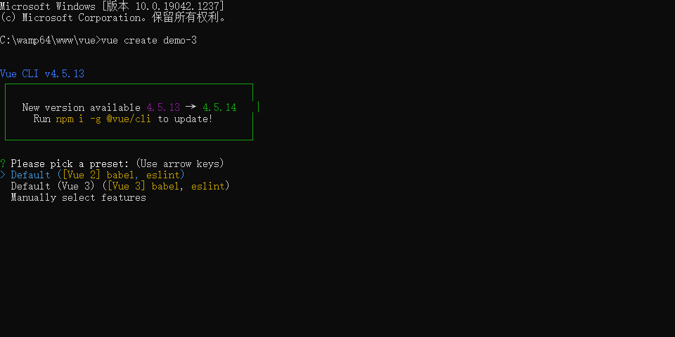


勾选 CSS 预处理

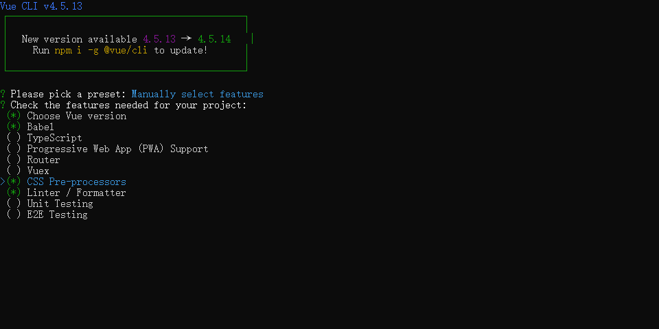


选择 2.x 版本

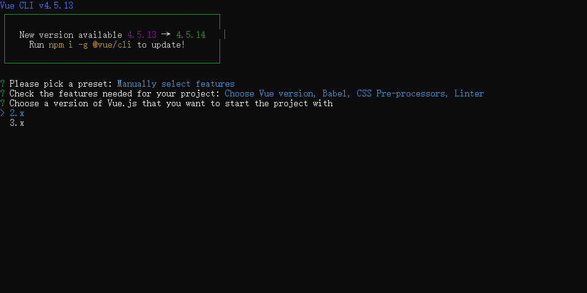


选择 Less 处理 CSS

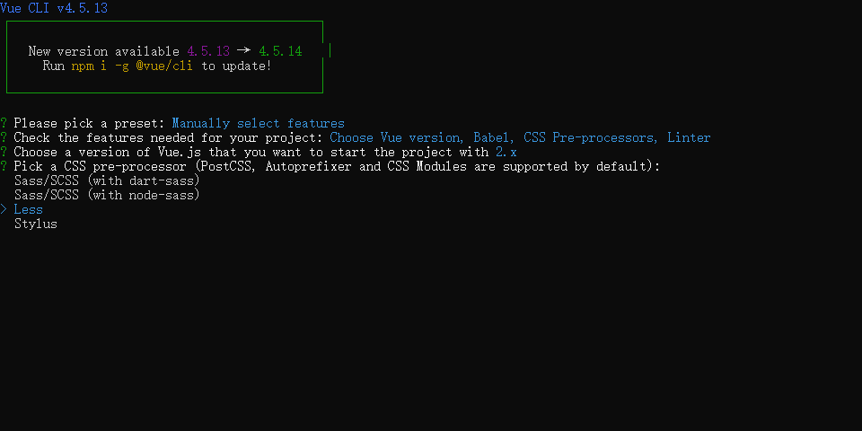


选择 ESLint 代码风格

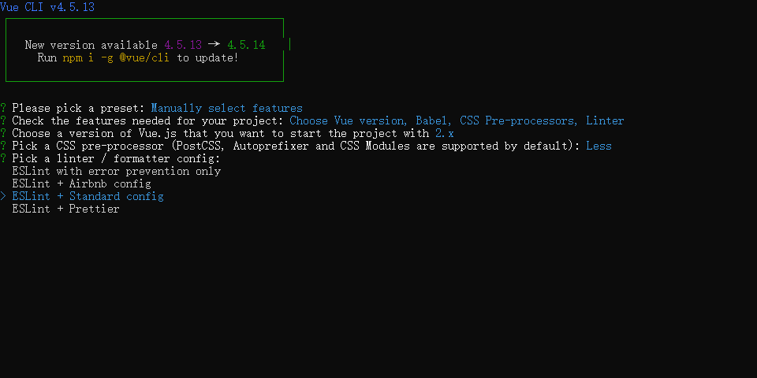


选择保存时检查代码

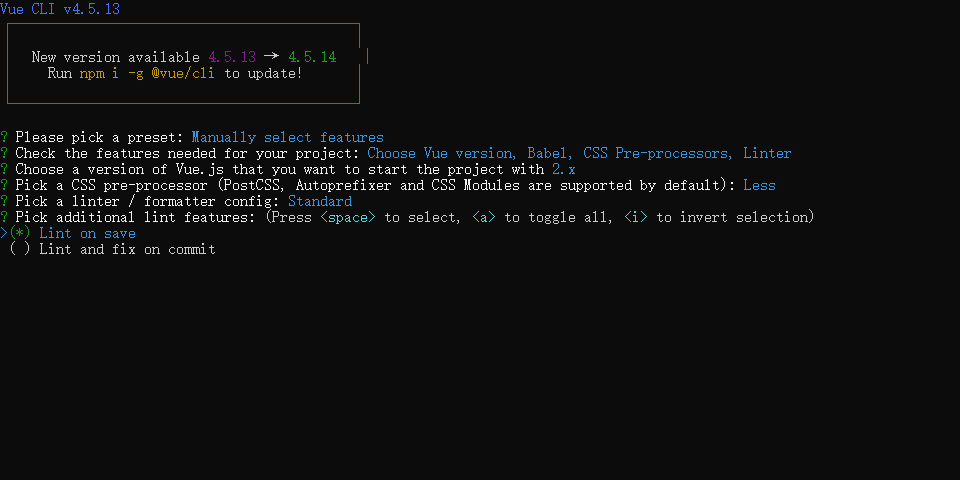


配置文件分离存放

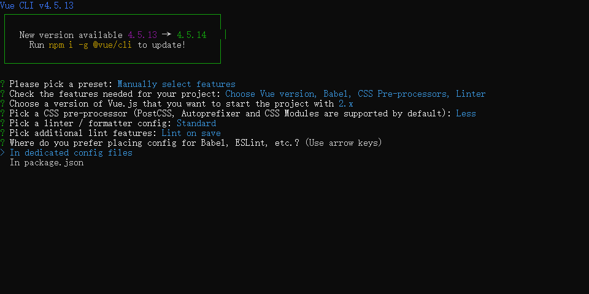


不保存预设

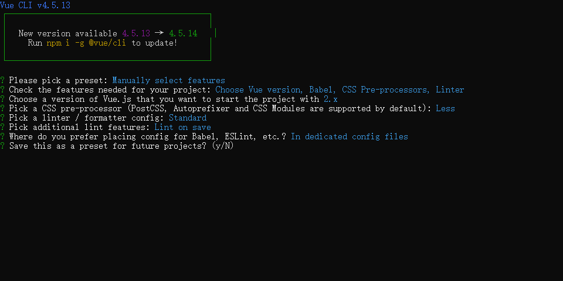


## 2. eslintrc.js

eslintrc.js 是 ESLint 的配置文件，默认为

~~~js
module.exports = {
  root: true,
  env: {
    node: true
  },
  extends: [
    'plugin:vue/essential',
    '@vue/standard'
  ],
  parserOptions: {
    parser: 'babel-eslint'
  },
  rules: {
    'no-console': process.env.NODE_ENV === 'production' ? 'warn' : 'off',
    'no-debugger': process.env.NODE_ENV === 'production' ? 'warn' : 'off'
  }
}

~~~

> 其中 rules 是 eslint 的一些规则，可以从在 https://eslint.bootcss.com/docs/rules/ 查看


~~~js
// 当生产模式时，如果代码中出现 console 会有警告提示
'no-console': process.env.NODE_ENV === 'production' ? 'warn' : 'off',
// 当生产模式时，不允许代码中出现 debugger 下断点
'no-debugger': process.env.NODE_ENV === 'production' ? 'warn' : 'off'
~~~


添加规则，如：

~~~js
'space-before-function-paren':['error', 'never']
~~~


## 3. ESLint 自动检查

当代码不符合 ESLint 规范时，终端会自动报错，需要修正代码风格规范，重新保存才可以，如：

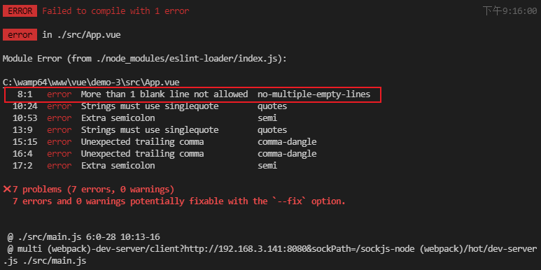


常见错误：

- no-multiple-empty-lines 不允许有多余空行
- no-trailing-spaces 禁用行尾空格
- eol-last 要求或禁止文件末尾存在空行
- quotes 字符串需要使用单引号包裹
- key-spacing 对象的属性和值之间，需要有一个空格分割
- comma-dangle 对象或数组的末尾，不允许出现多余的逗号
- spaced-comment 在注释中的 // 或 /* 后强制使用一致的间距
- indent 强制一致的缩进
- import/first 使用 import 导入模块的语句必须声明在文件的顶部
- space-before-function-paren 方法的形参之前是否需要保留一个空格


## 4. 配置规则

如果不需要某些规则，则可以通过  https://eslint.bootcss.com/docs/rules/  查看改规则的写法，然后写在 eslintrc.js 中，如：

~~~js
"space-before-function-paren": ["error", "never"],
~~~

> 禁止在参数的 `(` 前面有空格。


修改配置文件后，需要重启项目才可以使配置生效


## 5. ESLint 插件

安装 ESLint 插件，作者：Dirk Baeumer


~~~json
// ESLint 配置
"editor.codeActionsOnSave": {
    "source.fixAll": true,
},
"eslint.alwaysShowStatus":true,
~~~


## 6. Prettier

~~~json
// Prettier 配置
"prettier.configPath": "C:\\Users\\Forece\\.prettierrc,",
"prettier.trailingComma": "none",
"prettier.semi": false,
"prettier.printWidth":300,
"prettier.singleQuote": true,
"prettier.arrowParens": "avoid",

// Vetur 插件 HTML 代码格式化
"vetur.format.defaultFormatter.html": "js-beautify-html",
"vetur.ignoreProjectWarning": true,
"vetur.format.defaultFormatterOptions": {
    "js-beautify-html": {
        "wrap_attributes": false
    },
    "prettier": {
        "trailingComma": "none",
        "semi": false,
        "singleQuote":true,
        "arrowParens": "avoid",
        "printWidth": 300,
    }
},
~~~


配置 Vue 和 Js 文件的默认格式化工具为 Prettier

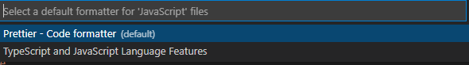


# Vue 中发起 Axios 请求

## 1. 在组件中发送 Axios 请求

## 2. 将 Axios 挂载到 Prototype

## 3. 配置根路径


# 路由

## 1. SAP 路由原理

其实是利用锚点 # 来进行页面跳转，如：

~~~html
  <style>
    #box1, #box2, #box3 {
      min-height: 1000px;
    }
    #box1 {
      background-color: pink;
    }
    #box2 {
      background-color: skyblue;
    }
    #box3 {
      background-color: lightgreen;
    }
  </style>
  <div id="index">
    <a href="#box1">BOX1</a>
    <a href="#box2">BOX2</a>
    <a href="#box3">BOX3</a>
  </div>
  <div id="box1">BOX1</div>
  <div id="box2">BOX2</div>
  <div id="box3">BOX3</div>
~~~


通过 URL：

~~~html
/index.html#box3
~~~

> location.hash 的形式进行页面跳转


## 2. 前端路由的工作方式

前端路由就是 Hash 地址与组件之间的对应关系。通过锚链接，隐藏其他组件元素，并显示对应组件的这么一个过程。


- 用户点击页面上的路由链接
- 导致 URL 地址栏中 Hash 值的变化
- 前端路由侦听到了 Hash 地址的变化
- 前端路由把当前 Hash 地址对应的组件渲染到浏览器中


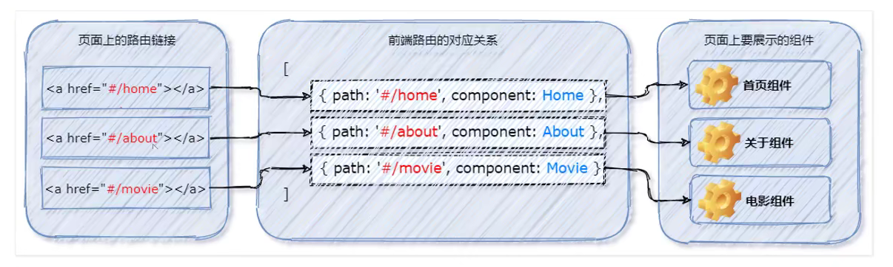


## 3. 简易前端路由

创建 APP 组件

~~~vue
<template>
  <div id="app">
    <h1>根组件</h1>
    <a href="#/home">首页</a>
    <a href="#/movie">电影</a>
    <a href="#/about">关于</a>
    <hr>

    <Home></Home>
    <Movie></Movie>
    <About></About>

  </div>
</template>

<script>
import Home from '@/components/Home.vue'
import Movie from '@/components/Movie.vue'
import About from '@/components/About.vue'

export default {
  name: 'App',
  components: {
    Home,
    Movie,
    About
  }
}
</script>

<style lang="less">
a{
  margin-right:10px;
}
</style>

~~~


以及三个子组件

~~~vue
<template>
  <div class="home-container">
    <h2>Home 组件</h2>
  </div>
</template>

<script>
export default {

}
</script>

<style lang="less" scoped>
.home-container {
  height: 200px;
  background-color: pink;
}
</style>

~~~


~~~vue
<template>
  <div class="movie-container">
    <h2>Movie 组件</h2>
  </div>
</template>

<script>
export default {

}
</script>

<style lang="less" scoped>
.movie-container {
  height: 200px;
  background-color: skyblue;
}
</style>

~~~


~~~vue
<template>
  <div class="about-container">
   <h2>About 组件</h2>
  </div>
</template>

<script>
export default {

}
</script>

<style lang="less" scoped>
.about-container {
  height: 200px;
  background-color: lightgreen;
}
</style>

~~~


要实现动态组件的切换，需要使用 component 标签的 is 属性来展示对应组件

~~~vue
<component :is="comName"></component>
~~~


并在 data 中穿件 comName 属性

~~~vue
  data () {
    return {
      comName: 'Home'
    }
  },
~~~

> 此时 App.vue 就会只会显示 Home 组件了


监听地址栏 hash 值的变化，只要 hash 值变化，就可以通过 location.hash 获取新的 hash 值，然后将 hash 值赋值给 data 中的 comName 达到切换组件的效果

~~~js
created () {
    // 只要当前的 App 组件被创建，就立即监听 window 对象的 onhashchange 事件
    window.onhashchange = () => {
        // 通过 location.hash 获取 Hash 值
        switch (location.hash) {
            case '#/home':
                this.comName = 'Home'
                break
            case '#/movie':
                this.comName = 'Movie'
                break
            case '#/about':
                this.comName = 'About'
                break
        }
    }
}
~~~


## 4. vue-router

vue-router 是 vue.js 官方给出的路由解决方案。它只能结合 vue 项目进行使用，能够轻松管理 SPA 项目中组件的切换。

vue-router 的官方文档地址：https://router.vuejs.org/zh/


安装和配置 vue-router 步骤

- 安装 vue-router 包
- 创建路由模块
- 导入并挂载路由模块
- 声明路由链接和占位符


### 4.1 安装 vue-router

在 vue2 的项目中，安装 vue-router 的命令如下：

~~~
npm i vue-router@3.5.2 -S
~~~


### 4.2 创建路由模块

在 src 源代码目录下，新建 router/index.js 路由模块，并初始化如下的代码：

~~~js
// 1. 导入 Vue 和 Vue Router 的包
import Vue from 'vue'
import VueRouter from 'vue-router'

// 2. 调用 Vue.use() 函数，把 VueRouter 安装为 Vue 的插件
Vue.use(VueRouter)

// 3. 创建路由的实例对象
const router = new VueRouter()

// 4. 向外共享路由的实例对象
export default router

~~~


### 4.3 挂载到 main.js

路由模块创建完毕后，并没有与 main.js 也就是我们的项目文件产生任何交互，需要将路由模块挂载到 Vue 实例中

~~~js
import Vue from 'vue'
import App from './App.vue'
// 导入路由模块，拿到路由的实例对象
import router from '@/router/index.js'

Vue.config.productionTip = false

new Vue({
  render: h => h(App),
  // 挂载路由实例对象
  router: router
  // 路由属性与值相同，可以直接简写
  // router
}).$mount('#app')

~~~


在模块化导入的时候，如果给定的是文件夹，则默认导入文件夹下的 index.js 文件，所以导入模块可以写成

~~~js
import router from '@/router'
~~~


如果是指定文件，可以省略扩展名

~~~js
import router from '@/router/index'
~~~


## 5. 路由的基本用法

只要在项目中安装和配置了 vue-router，就可以使用 router-view 这个组件了，在组件中起到占位作用，用来包裹需要切换的组件。如：

~~~vue
<template>
  <div id="app">
    <h1>根组件</h1>
    <a href="#/home">首页</a>
    <a href="#/movie">电影</a>
    <a href="#/about">关于</a>
    <hr>

    <router-view></router-view>

  </div>
</template>
~~~


之后需要让路由与hash产生对应关系，我们要在 router/index.js 中配置路由，首先导入模块

~~~js
// 导入组件
import Home from '@/components/Home'
import Movie from '@/components/Movie'
import About from '@/components/About'
~~~


配置路由实例对象中的路由规则

~~~js
const router = new VueRouter(
    {
        // routes 是一个数组，作用是定义 hash 地址与组件之间的对应关系
        routes: [
            { path: '/home', component: Home },
            { path: '/movie', component: Movie },
            { path: '/about', component: About }
        ]
    }
)

~~~


## 6. router-link

当安装和配置了 vue-router 后，就可以使用 router-link 来代替普通的 a 链接了，写法如下：

~~~vue
<router-link to="/home">首页</router-link>
~~~


## 7. 路由重定向 redirect

路由重定向指的是：用户在访问地址 A 的时候，强制用户跳转到地址 C，从而展示特定的组件页面。

通过路由规则的 redirect 属性，指定一个新的路由地址，可以很方便地设置路由的重定向：

~~~js
{ path: '/', redirect: '/home' }
~~~


## 8. 嵌套路由

通过路由实现组件的嵌套展示，叫做嵌套路由。当子组件中也需要切换展示不同组件的时候，形成了路由嵌套。如图所示：


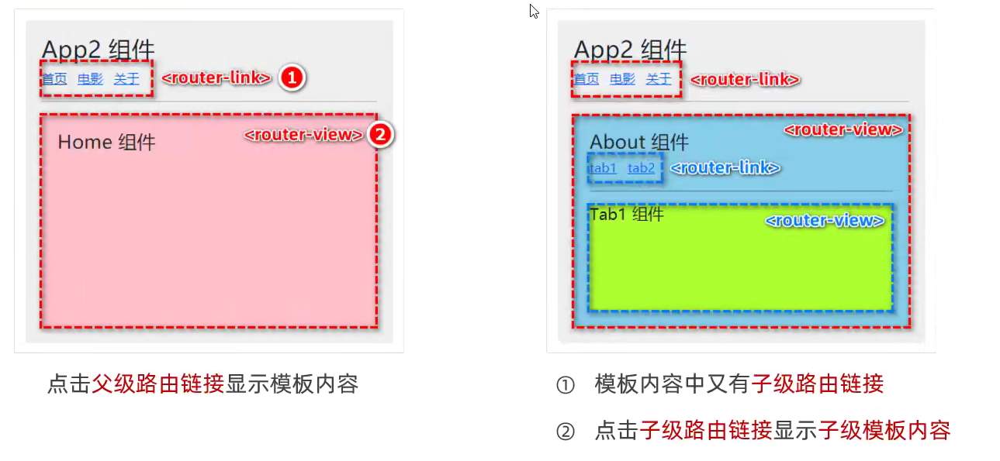


在子组件中添加 router-link 和 router-view

~~~vue
<template>
  <div class="about-container">
   <h2>About 组件</h2>
   <router-link to="/about/tab1">Tab1</router-link>
   <router-link to="/about/tab2">Tab2</router-link>
   <router-view></router-view>
  </div>
</template>
~~~


在路由规则中通过 children 属性声明子路由规则

在 src/router/index.js 中，导入所需要的模块，并使用 children 属性声明子路由规则

~~~json
{
    path: '/about',
    component: About,
    children: [
        { path: 'tab1', component: Tab1 },
        { path: 'tab2', component: Tab2 }
    ]
}
~~~

> 子路由规则中路径不需要使用斜线


子路由的重定向

~~~json
{
    path: '/about',
    component: About,
    // 添加 redirect 属性实现子路由的重定向
    redirect: '/about/tab1',
    children: [
        { path: 'tab1', component: Tab1 },
        { path: 'tab2', component: Tab2 }
    ]
}
~~~


## 9. 默认路由

如果路由规则中的 path 为空字符串，则这条路由规则为默认路由，同样可以实现 redirect 的功能，如：

~~~json
{
    path: '/about',
    component: About,
    children: [
          { path: '', component: Tab1 },
          { path: 'tab1', component: Tab1 },
          { path: 'tab2', component: Tab2 }
    ]
}
~~~


## 10. 动态路由

少量地址我们可以手写，当出现批量路由时，我们则需要使用动态路由，如：

~~~vue
<router-link to="/movie/1">电影1</router-link>
<router-link to="/movie/2">电影2</router-link>
<router-link to="/movie/3">电影3</router-link>
....
<router-link to="/movie/99">电影99</router-link>
~~~


动态路由是指，把 hash 地址中可变的部分定义为参数项，从而提高路由规则的复用性。

在 vue-router 中使用英文的冒号（：）来定义路由的参数项。示例代码如下：

~~~josn
{ path: '/movie/:id', component: Movie }
~~~


在组件中可以通过组件实例拿到传递过来的参数

~~~vue
console.log(this.$route.params.id)
~~~

> 之后通过 id 进行发送请求获取数据，然后渲染页面什么的都可以了，就可以显示不同 id 对应的不同页面


同时也可以通过给路由开启 props 属性来获取传递的参数

~~~
{ path: '/movie/:id', component: Movie, props: true }
~~~


然后再组件中可以利用定义 props 定义 id 属性获得参数值

~~~
<script>
export default {
  props: ['id']
}
</script>
~~~


## 11. $route 其他参数

| 参数     | 说明                    |
| -------- | ----------------------- |
| 路径参数 | /movie/1                |
| 查询参数 | /movie/1?name=zs&age=18 |


- 路径参数可以通过 `this.$route.params` 获取
- 查询参数可以通过 `this.$route.query` 获取
- 完整路径  this.$route.fullpath
- 相对路径 this.$route.path


## 12. 声明式导航

在浏览器中，点击链接实现导航的方式，叫做声明式导航。例如：

- 普通网页中点击 `<a> 链接`、vue 项目中点击 `<router-link>` 都属于声明式导航


## 13. 编程式导航

在浏览器中，调用 API 方法实现导航的方式，叫做编程式导航。例如：

- 普通网页中调用 location.href 跳转到新页面的方式，属于编程式导航


vue-router 提供了许多编程式导航的 API， 其中最常见的导航 API 分别是：

- this.$router.push('hash 地址')
  - 跳转到指定页面，并增加一条历史记录
- this.$router.replace('hash 地址')
  - 跳转到指定的 hash 地址，并替换掉当前的历史记录
- this.$router.go(数值 n)
  - 在历史记录中前进或后退几层


this.$rouer.go 的简化用法：

- this.$router.back()
  - 在历史记录中，后退到上一个页面
- this.$router.forward()
  - 在历史记录中，前进到下一个页面


在行内可以直接使用编程式导航，需要省略 this，如：

~~~html
<button @click="$router.back()">后退</button>
~~~


## 14. 导航守卫

导航守卫可以控制路由的访问权限，示意图如下：

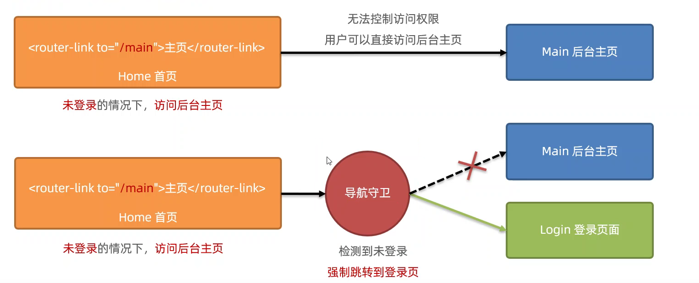


### 14.1 全局前置守卫

在跳转之前，做一个检测，来判断用户是否有权限进行跳转

每次发生路由的导航跳转时，都会触发全局前置守卫，因此，在全局前置守卫中，程序员可以对每个路由进行访问权限的控制


在 router/index.js 中调用 router.beforeEach(fn)

~~~js
const router = new VueRouter({...});
// 调用路由实例对象的 beforeEach 方法，即可声明 “全局前置守卫”
// 每次发生路由导航跳转的时候，都会自动触发 fn 这个 “回调函数”
router.beforeEach(fn);
~~~


### 14.2 全局前置守卫的3个形参

只要发生路由跳转，必然会触发 beforeEach 指定的 function 回调函数，回调函数接受3个形参，格式为：

~~~js
router.beforeEach((to, from, next)=>{
// to 是将要访问的路由的信息对象
// from 是将要离开的路由信息对象
// next 是一个函数，调用 next() 表示放行，允许这次路由导航
});
~~~


### 14.3 next 函数的3种调用方式

- 当前用户拥有后台主页的访问权限，直接放行： next()

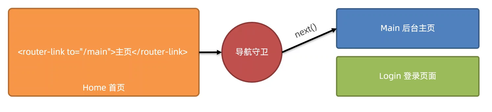


- 当前用户没有后台主页的访问权限，强制其跳转到登录页面：next('/login')

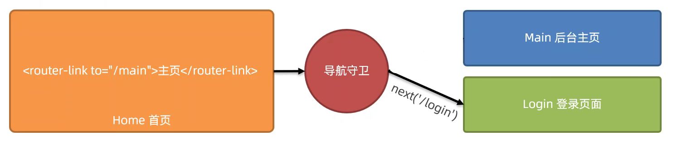


- 当前用户没有后台主页的访问权限，不允许跳转到后台主页：next(false)

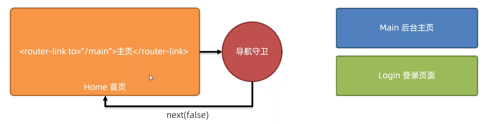

### 案例：简单登录案例

App.vue

~~~html
<template>
    <div id="app">
        <h1>根组件</h1>
        <router-link to="/home">首页</router-link>
        <hr>
        <router-view></router-view>
    </div>
</template>

<script>
    export default {
        name: 'App'
    }
</script>

<style lang="less">
    a{
        margin-right:10px;
    }
</style>

~~~


Home.vue

~~~vue
<template>
  <div class="home-container">
    <h2>Home 组件</h2>
    <hr>
    <button @click="$router.push('/main')">跳转到后台 Main 组件</button>
  </div>
</template>

<script>
export default {

}
</script>

<style lang="less" scoped>
.home-container {
  height: 200px;
  background-color: pink;
}
</style>

~~~


Main.vue

~~~html
<template>
  <div class="main-container">
    <h2>后台主页</h2>
    <hr>
  </div>
</template>

<script>
export default {

}
</script>

<style>

</style>

~~~


Login.vue

~~~html
<template>
  <div class="login-container">
    <h2>登录页面</h2>
  </div>
</template>

<script>
export default {

}
</script>

<style>

</style>

~~~


在 router/index.js 中导入模块，并设置路由

~~~js
import Vue from 'vue'
import VueRouter from 'vue-router'

// 导入组件
import Main from '@/components/Main.vue'
import Login from '@/components/Login.vue'

Vue.use(VueRouter)


const router = new VueRouter(
  {
    routes: [
      { path: '/', redirect: '/home' },
      { path: '/home', component: Home },
      { path: '/main', component: Main },
      { path: '/login', component: Login }

    ]
  }
)
router.beforeEach((to, from, next) => {
  next()
})

export default router

~~~


通过 beforeEach 进行验证

~~~js
router.beforeEach((to, from, next) => {
  // 判断 url 中的 hash 值是否为 /main
  if (to.path === '/main') {
    // 如果为 /main 获取 localStorage 中的 token 值
    const token = localStorage.getItem('token')
    if (token) {
      // 如果有 token 值，则跳转到后台
      next()
    } else {
      // 否则跳转到登录页面
      next('/login')
    }
  } else {
    // 如果 url 中的 hash 值不是 /main 则无需验证
    next()
  }
})
~~~

> 通过创建 localStorage 中的 token 值验证守卫是否工作


# 简单后台案例

## 1. 初始化项目

- 创建项目

~~~html
vue create demo-4
~~~


- 安装插件

~~~
npm install bootstrap@4 -S
npm install vue-router@3.5.2 -S
~~~


- 配置路由

src/router/index.js

~~~js
import Vue from 'vue'
import VueRouter from 'vue-router'

Vue.use(VueRouter)

const router = new VueRouter()

export default router

~~~


main.js

~~~js
import Vue from 'vue'
import App from './App.vue'
import router from '@/router/index'

Vue.config.productionTip = false

new Vue({
  render: h => h(App),
  router
}).$mount('#app')

~~~


- 导入 bootstrap 样式

main.js

~~~js
import '../node_modules/bootstrap/dist/css/bootstrap.min.css'
~~~


## 2. Login 组件

~~~vue
<template>
  <div class="login-container text-center">
    <form class="form-signin">
      
      <h1 class="h3 mb-3 font-weight-normal">Please sign in</h1>
      <label for="username" class="sr-only">Email address</label>
      <input type="text" id="username" class="form-control" placeholder="Username" required="" autofocus="">
      <label for="password" class="sr-only">Password</label>
      <input type="password" id="password" class="form-control" placeholder="Password" required="">
      <button class="btn btn-lg btn-primary btn-block mt-4" type="submit">Sign in</button>
      <button class="btn btn-lg btn-primary btn-block" type="submit">Reset</button>
   </form>
  </div>
</template>

<script>
export default {

}
</script>

<style>
.form-signin {
  width: 100%;
  max-width: 330px;
  padding: 15px;
  margin: auto;
}
</style>

~~~


登录组件路由

~~~js
import Vue from 'vue'
import VueRouter from 'vue-router'
import Login from '@/components/Login.vue'

Vue.use(VueRouter)

const router = new VueRouter({
  routes: [
    { path: '/', redirect: '/login' },
    { path: '/login', component: Login }
  ]
})

export default router

~~~


App.vue 路由占位

~~~vue
<template>
  <div id="app">
    <router-view></router-view>
  </div>
</template>

<script>
export default {

}
</script>

<style>
</style>

~~~


## 3. 模拟登录功能

- 在 data 中定义两个变量，username，password，并且用 v-model 绑定在输入框中

~~~js
  data () {
    return {
      username: '',
      password: ''
    }
  }
}
~~~


~~~vue
<input type="text" id="username" class="form-control" placeholder="Username" required="" autofocus="" v-model.trim="username">
<input type="password" id="password" class="form-control" placeholder="Password" required="" v-model.trim="password">
~~~


- 实现 reset 功能

~~~html
<button class="btn btn-lg btn-primary btn-block" type="submit" @click="reset">Reset</button>
~~~


~~~js
methods: {
    reset () {
      this.username = ''
      this.password = ''
    }
  }
}
~~~


- 实现 login 功能

~~~html
<button class="btn btn-lg btn-primary btn-block mt-4" type="submit" @click="login">Sign in</button>
~~~


~~~js
login () {
    // 如果用户名密码匹配
    if (this.username === 'admin' && this.password === '666666') {
        // 存储 token，并跳转到后台
        localStorage.setItem('token', 'Bearer tokenxxxxxx')
        this.$router.push('/home')
    } else {
        // 登录失败，清除 token
        localStorage.removeItem('token')
    }
}
~~~


## 4.  后台主页

- 在路由配置文件中，导入后台组件，并添加路由规则

~~~js
import Vue from 'vue'
import VueRouter from 'vue-router'
import Login from '@/components/Login.vue'
import Home from '@/components/Home.vue'

Vue.use(VueRouter)

const router = new VueRouter({
  routes: [
    { path: '/', redirect: '/login' },
    { path: '/login', component: Login },
    { path: '/home', component: Home }

  ]
})

export default router

~~~


- 后台布局

后台首页分为上、下两部分，下部分又包括左右两部分，如图：

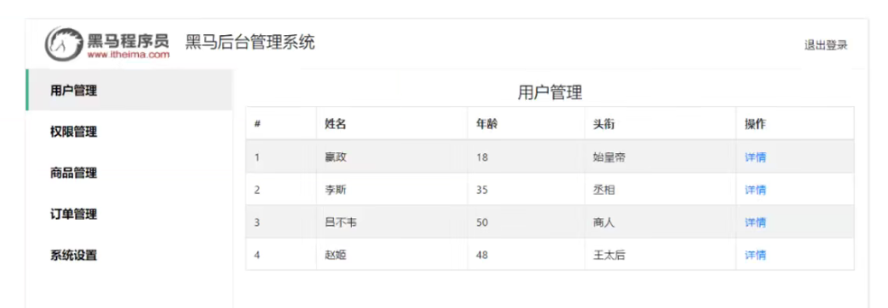


头部和左侧边栏是固定的，可以直接引入组件，右侧则是可变的，通过路由展示不同组件

~~~vue
<template>
  <div class="home-container">
    <Header></Header>
    <div class="row">
      <div class="col-4">
        <Aside></Aside>
      </div>
      <div class="col-8">
        <router-view></router-view>
      </div>
    </div>
  </div>
</template>

<script>
import Header from '@/components/Header.vue'
import Aside from '@/components/Aside.vue'

export default {
  components: {
    Header,
    Aside
  }
}
</script>

<style>

</style>

~~~


Header.vue

~~~vue
<template>
  <div class="header-container row p-5">

      <div class="col mr-auto">后台管理系统</div>
      <button class="btn btn-primary">退出登录</button>

  </div>
</template>

<script>
export default {

}
</script>

<style>
.header-container {
  background-color:#ccc;
}
</style>

~~~


Aside.vue

~~~vue
<template>
<div class="aside-container">
  <ul class="list-unstyled">
    <li><router-link to="/home/users">用户管理</router-link></li>
    <li><router-link to="/home/rights">权限管理</router-link></li>
    <li><router-link to="/home/goods">商品管理</router-link></li>
    <li><router-link to="/home/order">订单管理</router-link></li>
    <li><router-link to="/home/setting">系统设置</router-link></li>
  </ul>
</div>
</template>

<script>
export default {

}
</script>

<style lang="less" scoped>
ul>li {
  padding-left:40px;
  height: 40px;
  line-height:40px;
}

ul>li:hover{
  border-left:4px solid #48b18e;
  background-color:#efefef;
}

ul>li a{
  font-size:20px;
  font-weight: 800;
}
</style>

~~~


嵌套路由配置

~~~js
import Vue from 'vue'
import VueRouter from 'vue-router'
import Login from '@/components/Login.vue'
import Home from '@/components/Home.vue'
import Users from '@/components/menus/Users.vue'
import Rights from '@/components/menus/Rights.vue'
import Goods from '@/components/menus/Goods.vue'
import Order from '@/components/menus/Order.vue'
import Setting from '@/components/menus/Setting.vue'

Vue.use(VueRouter)

const router = new VueRouter({
  routes: [
    { path: '/', redirect: '/login' },
    { path: '/login', component: Login },
    {
      path: '/home',
      component: Home,
      children: [
        { path: 'users', component: Users },
        { path: 'rights', component: Rights },
        { path: 'goods', component: Goods },
        { path: 'order', component: Order },
        { path: 'setting', component: Setting }

      ]
    }
  ]
})

export default router

~~~


## 5. 退出登录

清空 localstorage 中的 token，并且跳转到 login 页面

~~~html
<button class="btn btn-primary" @click="logout">退出登录</button>
~~~


~~~js
  methods: {
    logout () {
      localStorage.removeItem('token')
      this.$router.push('/login')
    }
  }
}
~~~


## 6. 控制权限

在路由 index.js 中控制登录权限

~~~js
router.beforeEach(function (to, from, next) {
  if (to.path !== '/login') {
    if (localStorage.getItem('token')) {
      next()
    } else {
      next('/login')
    }
  } else {
    next()
  }
})
~~~


## 7. 用户详情页

Users.vue

通过 data 中的数据将数据渲染到表格上

~~~vue
<template>
  <div class="users-container">
    <table class="table mt-4">
  <thead>
    <tr>
      <th scope="col">#</th>
      <th scope="col">姓名</th>
      <th scope="col">年龄</th>
      <th scope="col">操作</th>
    </tr>
  </thead>
  <tbody>
    <tr v-for="item in userlist" :key="item.id">
      <th scope="row">{{item.id}}</th>
      <td>{{item.name}}</td>
      <td>{{item.age}}</td>
      <td>
        <a href="#" @click.prevent="gotoDetail(item.id)">操作</a>
      </td>
    </tr>
  </tbody>
</table>
  </div>
</template>

<script>
export default {
  data () {
    return {
      userlist: [
        { id: 1, name: '富贵', age: 18 },
        { id: 2, name: '张三', age: 19 },
        { id: 3, name: '李四', age: 20 },
        { id: 4, name: '王五', age: 21 }

      ]
    }
  },
  methods: {
    gotoDetail (id) {
      this.$router.push('/home/userinfo/' + id)
    }
  }
}
</script>

<style>

</style>

~~~


因为详情页还是在 Home 框架中显示，所以详情页看似是 Users.vue 的子路由，但是其实是 Home 页面的子路由

~~~js
{ path: 'userinfo/:id', component: UserInfo }
~~~


UserInfo.vue 获取 id，并添加后退按钮

~~~vue
<template>
<div class="userinfo-container">
    <button class="btn btn-primary mt-4" @click="$router.back()">后退</button>
    <p>userinfo  -- {{$route.params.id}}</p>

    </div>
</template>

<script>
    export default {

    }
</script>

<style>

</style>

~~~


# 黑马头条案例 - Vant 组件库

http://doc.toutiao.liulongbin.top/


## 1. 初始化项目

~~~
vue create demo-toutiao
~~~


在配置项目中，选择安装 Router，项目生成后，src 目录下会多出一个文件夹 views，这个 views 也是用来放组件的，和 components 的区别是，如果组件是通过路由来展示在页面的话，那么这个组件应该放在 views 文件夹中


## 2. Vant 组件库

https://vant-contrib.gitee.io/vant/#/zh-CN/


### 2.1 安装 Vant

~~~
npm i install vant -S
~~~


### 2.2 引入组件

官方提供三种方法，推荐自动按需引入组件，但是配置繁琐，目前学习使用 Vant ，导入所有组件，在 main.js 中配置 Vant

~~~js
import Vue from 'vue';
import Vant from 'vant';
import 'vant/lib/index.css';

Vue.use(Vant);
~~~

> 之后可以通过打包方案优化 Vant


### 2.3 使用组件

在组件中，使用 Vant 组件库中的代码即可，如：

~~~vue
<template>
  <div id="app">
    <van-button type="primary">主要按钮</van-button>
    <van-button type="info">信息按钮</van-button>
    <van-button type="default">默认按钮</van-button>
    <van-button type="warning">警告按钮</van-button>
    <van-button type="danger">危险按钮</van-button>
  </div>
</template>

<script>
export default {

}
</script>

<style>

</style>

~~~


## 3. Home.vue

views/Home/Home.vue


## 4. User.vue

views/User/User.vue	


## 5. Vant Tabbar

- 更改图标
- 添加路由


## 6. 路由规则 index.js

- / 规则
- /user 规则


## 7. Navbar

- 头部 Header
- 固定顶部
- 简写形式
- 内容被 Header 和 Footer 覆盖，加 Padding 解决
- Header 背景颜色和 Title 颜色（/deep/）


## 8. 请求数据

- API 接口格式
- 安装 axios
- utils 目录封装 request.js 将 axios ，可以定义不同的 baseURL
- 组件中导入 request.js 发送请求


## 9. 封装请求 API

- 封装 getArticleAPI.js
- 返回一个 Promise 对象
- 通过 axios 拿到数据
- 保存在 data 中的 artlist 数组中


## 10. ArticleItem.vue

Components/Article/ArticleItem.vue


## 11. Home.vue 遍历渲染组件

- v-for 遍历数据
- 传递数据到 ArticleItem.vue 的 props 
- 官方建议 props 中的属性如果是小驼峰，传值时应该用横线连接
- props 中对象的默认值
- 渲染图片


## 12. List 列表上拉加载更多

- 合并数据


## 13. 下拉刷新


## 14. 定制主题

- 引入 Less 样式源文件
- vue.config.js


## 15. loash 记忆切换页面位置


## 16. 项目打包

- 默认只能在服务器协议下打开

- 本地打开需要修改 vue.config.js 中的 publicPath 属性为 './

  


# Vue 底层逻辑

## 1. 数据代理

从底层上讲解 data 的取值与赋值


### 1.1 Object.defineProperty

利用 Object.defineProperty 给对象添加属性，首先定义一个对象，如：

~~~js
let person ={
    name:'张三',
    sex:'男',
}
~~~


如果想给这个对象添加一个属性 age 的话，那么可以直接在里边添加值

~~~js
let person ={
    name:'张三',
    sex:'男',
    age:'18'
}
~~~

> 或者使用 person.age = 18 添加属性


除此之外，我们可以使用对象原型中的 defineProperty 方法来添加属性

~~~js
Object.defineProperty(person,'age',{
    value:18,
    enumerable=true,    // 控制属性是否可以被枚举
    writable=true,      // 控制属性是否可以被修改
    configurable=true   // 控制属性是否可以被删除
})
~~~


如果有一个变量 number，我们需要根据 number 的值来确定 age 的数值

~~~js
let number = 19;
let person ={
    name:'张三',
    sex:'男',
    age:number
}
~~~

> 只有第一次渲染页面的时候，number 值会传入对象中，但是如果 number 在渲染页面结束后发生改变，age 不会与 number 进行同步


通过 Object.defineProperty 方法，可以定义 getter 和 setter，来动态获取值的改动与更新

~~~js
// 有人读取 person 的 age 属性时，就会触发 getter （get 函数被调用），且返回值就是 age 的属性值
get:function(){
    console.log('有人读取了 age, 值是', number);
    return number
},

// 有人修改 person 的 age 属性时，就会触发 setter （set 函数被调用），value 为收到的修改值
set:function(value){
    console.log('有人修改了 age，值是', value);
    number = value  // 修改属性值
}
~~~


同理，在对象中使用函数，可以直接用函数表示

~~~js
get(){
    return number
},
set(value){
    number = value
}
~~~


### 1.2 数据代理

通过一个对象代理对另外一个对象中属性的操作（读/写）

~~~js
let obj1 = { x:100 }
let obj2 = { y:200 }

Object.defineProperties(obj2,'x',{
    get(){
        return obj1.x
    },
    set(value){
        obj1.x = value
    }
})
~~~


- 给 obj2 赋值属性 x
- 当读取 obj2 对象中的 x 属性时，调用 obj1 中的 x 属性值
- 当修改 obj2 对象中的属性值，让 obj1 的 x 值变为新的值


### 1.3 Vue 中的数据代理

通过 Vue 实例 vm 读取 data 数据的时候，即使用 getter 从 data 对象中获取数据，同理修改 data 中数据则调用的 setter 方法


Vue 创建一个实例 vm

~~~js
const vm = new Vue({
    el:'#root',
    data:{
        name:'Jack',
        address:'BJ'
    }
})
~~~


vm 实例

~~~json
vm 
{
    $attrs:xxx,
    $children:xxx,
    ...
    ...
    ...
    _data:{
        name:'Jack',
        address:'BJ'
    }
}
~~~


此时 vm 实例上没有 name 属性，也没有 address 属性，即不能通过 vm.name, vm.address 调用 data 中的属性

但是 vm 中有 _data 属性，所以在容器中也可以使用 _data.name, _data.address 来调用 data 中的值，如：

~~~html
<div id="root">
    {{_data.name}}, {{_data.address}}
</div>
~~~


为了使代码简洁易用， Vue 通过 getter 和 setter，将 _data 对象中的属性添加到了vm这个对象身上，此时，我们的 vm 实例应该是：

~~~json
vm 
{
    $attrs:xxx,
    $children:xxx,
    ...
    ...
    name:'Jack',
    address:'BJ',
    _data:{
        name:'Jack',
        address:'BJ'
    }
}
~~~


通过 vm 对象来代理 data 对象中属性的操作，基本原理：

- 通过 Object.defineProperty() 把 data 对象中所有属性添加到 vm 上
- 为每一个添加到 vm 上的属性，都指定一个 getter 和 setter
- 在 getter / setter 内部去操作 data 中对应的属性


## 2. Vue 监测属性变化的原理

在了解 Vue 是如何监测属性变化之前，先看一个例子


当点击更新数据时，会调用 updateMa 方法更新 data 数组中的第一个元素

~~~html
<div id="root">
    <h2>Vue 对数据的监测</h2>
    <button @click="updateMa">更新数据</button>
    <ul>
        <li v-for="(p, index) in persons" :key="p.id">
            {{p.name}} - {{p.age}}
        </li>
    </ul>
</div>

<script>
    new Vue({
        el: "#root",
        data: {
            persons: [
                { id: "001", name: "马冬梅", age: 26, sex: "女" },
                { id: "002", name: "周冬雨", age: 20, sex: "女" },
                { id: "003", name: "周杰伦", age: 40, sex: "男" },
                { id: "004", name: "温兆伦", age: 46, sex: "男" },
            ],
        },
        methods: {
            updateMa() {
                this.persons[0].name = "马老师";
                this.persons[0].age = 56;
                this.persons[0].sex = "男";
            },
        },
    });
</script>
~~~


但是如果我们更改对象时，会发现在 console 中调用数据发现数据已经改变，但是 Vue Dev Tools 却没有检测到

~~~html
methods: {
            updateMa() {
                this.persons[0] = { id: "001", name: "马老师", age: 56, sex: "男" }
            },
        },
~~~

> 如果先开 Vue Dev Tool，再点按钮，Vue 监测不到数据变化，但是 Conosle 中可以使用 this.person[0].name 查看数据已经发生改变
>
> 如果点击按钮再打开 Vue Dev Tools 可以发现数据已经改变，console 中也改变了，但是页面没有变化


### 2.1 监测对象数据改变原理

Vue 通过 setter 实现监视，且要在 new Vue 时就传入要监测的数据

- 对象中后追加的属性，Vue 默认不做响应式处理
- 如需给后添加的属性做响应式，需要使用 Vue.set() 或 vm.$set()


_data 转换成 data 的过程，经过 Vue 加工，如 data 数据如下：

~~~json
data:{
    name: "尚硅谷",
    address:"北京"
}
~~~


被传入的 _data 经过 Vue 加工成为

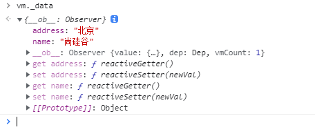


### 2.2 检测数组数据改变原理

Vue 通过包裹数组更新元素的方法实现，本质上就是做了两件事：

- 调用原生对应的方法对数组进行更新
- 重新解析模板，进而更新页面


在 Vue 修改数组中的某个元素一定要用如下方法：

- 使用这些 API: push(), pop(), shift(), unshift(), splice(), sort(), reverse()
- Vue.set() 或 vm.$set()


特别注意：Vue.set() 和 vm.$set() 不能给 vm 或 vm 的根数据对象添加属性。


### 2.3 Vue.set(), vm.$set()


# API 创建

基于 MySQL 数据库 + express 对外提供用户列表的 API 接口服务，用到的技术点如下：

- express、mysql2 包
- ES6 模块化
- Promise
- async/await


## 1. 创建项目

~~~
npm init -y
~~~


修改 package.json 更改 ES6 模块化

~~~
{
  "type": "module",
  "name": "vue",
  "version": "1.0.0",
  "main": "index.js",
  "scripts": {
    "test": "echo \"Error: no test specified\" && exit 1"
  },
  "keywords": [],
  "author": "",
  "license": "ISC",
  "description": ""
}

~~~


安装包

~~~
npm i express@4.17.1 mysql2@2.2.5 -S
~~~


## 2. 创建 express 服务器

创建 app.js

~~~js
import express form 'express'
const app = express()

app.listen(80,()=>{
  console.log('server is running...');
})
~~~


使用 nodemon 运行服务器

~~~
nodemon app.js
~~~


## 3. 创建 db 数据库操作模块

