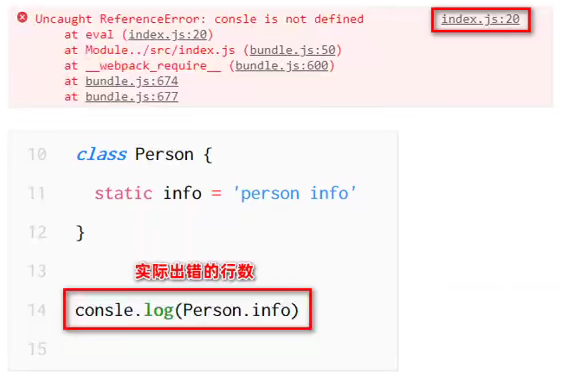
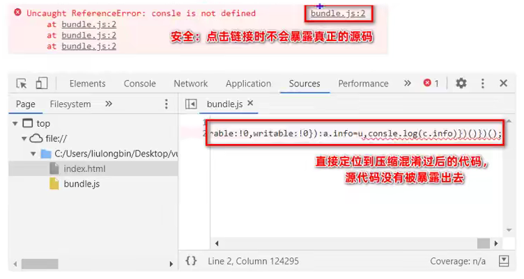

# 前端工程化

## 1. 什么是前端工程化

- 模块化（js 的模块化、css 的模块化、资源的模块化）
- 组件化（复用现有的 UI 结构、样式、行为）
- 规范化（目录结构的划分、编码规范划分、接口规范化、文档规范化、Git 分支管理）
- 自动化（自动化构建、自动部署、自动化测试）

前端工程化指的是：在企业级的前端项目开发中，把前端开发所需要的工具、技术、流程、经验等进行规范化、标准化。

企业中的 Vue 项目和 React 项目，都是基于工程化的方式进行开发的。

好处：前端开发自成体系，有一套标准的开发方案和流程

## 2. 前端工程化的解决方案

早期前端工程化解决方案：

- grunt
- gulp

目前主流的前端工程化解决方案：

- webpack
- parcel

# Webpack

## 1. 概念

webpack 是前端工程化的具体解决方案。

主要功能：它提供了友好的前端模块化开发支持，以及代码压缩混淆、处理浏览器端 JavaScript 的兼容性、性能优化等强大的功能

好处：让程序员把工作的中心放到具体功能实现上，提高了前端开发效率和项目的可维护性。

目前：Vue、React 等前端项目、基本上都是基于 Webpack 进行工程化开发的。

## 2. 创建 Webpack 项目

- 新建项目空白目录，并运行 npm init -y 命令，初始化包管理配置文件 package.json

- 创建 src 文件夹
  - index.html
  - index.js
- 运行 npm install jquery -S 命令，安装 jQuery

npm -S 的参数是 --save 的简写，将包的版本号写入 package.json 中，方便它人直接安装：

~~~json
{
  "name": "webpack",
  "version": "1.0.0",
  "description": "",
  "main": "index.js",
  "scripts": {
    "test": "echo \"Error: no test specified\" && exit 1"
  },
  "keywords": [],
  "author": "",
  "license": "ISC",
  "dependencies": {
    "jquery": "^3.6.0"
  }
}
~~~

> 如果他人拿到项目，直接使用 npm install 即可把所有项目中的包自动下载安装

## 3. 项目初始化

使用 jQuery 创建一个隔行变色的页面

index.html

~~~html
<!DOCTYPE html>
<html lang="en">
<head>
    <meta charset="UTF-8">
    <meta http-equiv="X-UA-Compatible" content="IE=edge">
    <meta name="viewport" content="width=device-width, initial-scale=1.0">
    
    
    <title>Document</title>
</head>
<body>
    <ul>
        <ul>
            <li>这是第 1 个 li</li>
            <li>这是第 2 个 li</li>
            <li>这是第 3 个 li</li>
            <li>这是第 4 个 li</li>
            <li>这是第 5 个 li</li>
            <li>这是第 6 个 li</li>
        </ul>
    </ul>
</body>
</html>
~~~

index.js

~~~js
$(function(){
    $('li:odd').css('background-color','grey');
    $('li:even').css('background-color','pink');
});
~~~

## 4. import 引入 jQuery

由于 ES6 新特性，可以在 js 文件中加载其他 js 文件，并且 jQuery 已经做了 exports ，我们可以将 jQuery 加载到我们的 index.js 文件中

~~~js
import $ from 'jquery'
~~~

此时 index.html 就可以直接引入一个 index.js 文件了

~~~html

~~~

但是，我们发现，浏览器并没有生效，并且 Console 提示错误：

~~~
Uncaught SyntaxError: Cannot use import statement outside a module
~~~

这是因为浏览器不支持我们的这种语法，我们需要使用 webpack 对该语句进行处理。

# 安装 webpack

## 1. 安装 webpack

在 cmd 终端中使用 npm 安装 webpack

~~~
npm install webpack webpack-cli --save-dev
~~~

有时候并不是版本越新越好用，使用 @版本号，可以保证包的稳定性（避免新语法造成代码无法使用）

~~~
npm install webpack@5.42.1 webpack-cli@4.7.2 -D
~~~

缩写：

-S 是 --save 的缩写

-D 是 --save-dev 的缩写

其中 --save 之前讲过了，在 package.json 中添加版本记录，而 -dev 是 Develpment 的缩写，也就是说在 package.json 中说明，该包不是生产模式中使用的包，而是在开发中所需要使用的包，package.json 中可以看到新添加了字段：

~~~json
{
  "name": "webpack",
  "version": "1.0.0",
  "description": "",
  "main": "index.js",
  "scripts": {
    "test": "echo \"Error: no test specified\" && exit 1"
  },
  "keywords": [],
  "author": "",
  "license": "ISC",
  "dependencies": {
    "jquery": "^3.6.0"
  },
  "devDependencies": {
    "webpack": "^5.53.0"
  }
}
~~~

## 2. 配置 webpack

在项目根目录中，创建名为 webpack.config.js 的 webpack 配置文件，并初始化如下的基本配置：

~~~json
modele.exports = {
    mode:'development',     // mode 是用来指定构建模式，可选值有 development 和 production
}
~~~

mode 参数：

- development
  - 开发环境
  - 不会对打包生成的文件进行代码压缩和性能优化
  - 打包速度快，适合在开发阶段使用
- production
  - 生产环境
  - 会对打包生成的文件进行代码压缩和性能优化
  - 打包速度慢，仅适合在项目发布阶段使用

## 3. 执行

### 3.1 npm 运行 webpack

npm 允许在`package.json`文件里面，使用`scripts`字段自定义脚本命令。

`scripts`字段是一个对象。它的每一个属性，对应一段脚本。

在 package.json 中，新增 scripts 脚本

~~~json
"scripts": {
    "dev":"webpack"   // script 节点下的脚本，可以通过 npm run 执行，如：npm run dev
},
~~~

- dev 只是命令名，可以随便起
- webpack 则是 webpack 的打包命令

通过该脚本，我们可以用 npm run dev 来执行 webpack 打包命令。

所以：

~~~
npm run dev
# 等同于
webpack
~~~

但是在 cmd 环境下，我们直接运行 webpack 却无法生效这是为什么呢？

`npm run`新建的这个 Shell，会将当前目录的`node_modules/.bin`子目录加入`PATH`变量，执行结束后，再将`PATH`变量恢复原样。

所以其实我们运行的 webpack ，实际上是 node_modules/.bin 下的 webpack，所以如果不用 npm run 的话，那我们需要加上路径才可以使用 webpack

~~~
node_modules\.bin\webpack
~~~

更多 npm run 命令可以参考：

https://blog.csdn.net/weixin_41697143/article/details/104029573

### 3.2 npx 运行 webpack

npm 从5.2版开始，增加了 npx 命令，npx 想要解决的主要问题，就是调用项目内部安装的模块。

如果不使用 npx，执行包中的命令则需要

~~~
node_modules\.bin\webpack
~~~

而 npx 的作用就是运行的时候，会到`node_modules/.bin`路径和环境变量`$PATH`里面，检查命令是否存在。

所以我们可以使用 npx 命令执行 webpack，如：

~~~
npx webpack
~~~

> 使用 npx 则不用在 scripts 中添加自定义脚本

更多 npx 命令相关可以参考

http://www.ruanyifeng.com/blog/2019/02/npx.html

## 4. 定义入口、输出配置

webpack.config.js 是 webpack 的配置文件，webpack 在真正开始打包构建之前，会读取这个配置文件，从而基于给定的配置，对项目进行打包。

webpack 默认的打包入口文件为： src/index.js

webpack 默认的输出文件路径为：dist/main.js

> 如果修改入口文件，则 webpack 会因为找不到入口文件报错

我们可以通过修改 webpack 的配置文件，webpack.config.js 来修改打包的默认配置：

~~~json
const path = require('path')

module.exports = {
    mode:'development',
    entry:path.join(__dirname, './src/index.js'),		// 入口文件
    output:{					// 输出文件
        path:path.resolve(__dirname, 'dist'),
        filename:'bundle.js'
    }
}
~~~

> 注意，输出文件的路径必须是绝对路径

# Webpack 插件

通过安装和配置第三方插件，可以拓展 webpack 的能力，从而让 webpack 用起来更加的方便。

## 1. webpack-dev-server

webpack-dev-server 类似于 node.js 中的 nodemon 工具，每当修改了源代码，webpack 会自动进行项目的打包和构建。

### 1.1 安装

安装 webpack-dev-server

~~~
npm install webpack-dev-server@4.2.1 -D
~~~

### 1.2 配置

配置 webpack-dev-server，需要在 webpack.config.js 中添加 devServer 属性：

- static 路径
- compress 是否压缩
- port 端口
- open 是否自动打开浏览器
- host 主机地址

~~~js
const path = require('path')

module.exports = {
    mode:'development',
    entry:'./src/index.js',		
    output:{					                        
        path:path.resolve(__dirname, 'dist'),
        filename:'bundle.js'
    },
    // 配置属性
    devServer: {
        open:true,
        static: {
            directory: path.join(__dirname, '/'),
        },
        compress: true,
        host:'127.0.0.1',
        port: 9000,
    },
}
~~~

### 1.3 运行

直接运行

~~~
node_modules\.bin\webpack serve
~~~

使用 npx 命令：

~~~
npx webpack serve
~~~

或者在 package.json 中定义 scripts 属性：

~~~
  "scripts": {
    "dev": "webpack",
    "server":"webpack serve"
  },
~~~

> 使用 npm run server 即可运行

此时，修改 js 文件的同时，webpack-dev-server 会自动监听，并重新渲染 js 文件

### 1.4 原理

webpack-dev-server 根据配置文件中的配置，以 static 属性当做网页项目的根路径，在内存中生成 bundle.js （无法在真实路径中查看）

~~~
127.0.0.1:9000/bundle.js
~~~

> 在真实路径中却无法查找到这个文件

所以我们还需要将 src/index.html 中的 script 更改路径，即：

~~~html

~~~

## 2. html-webpack-plugin

webpack 中的 HTML 插件，可以通过此插件自定制 index.html 页面的内容。

目前我们的根路径是 / ，需要点击 src 目录才可以访问到 index.html ，虽然我们可以点击 src 进入到根目录，但是未免有些麻烦，我们可以通过 html-webpack-plugin 来让 webpack-dev-server 将 html 文件也缓存到内存当中。

### 2.1 安装

~~~
npm install html-webpack-plugin@5.3.2 -D 
~~~

### 2.2 配置

修改 webpack.config.js

~~~json
const path = require('path')

// 导入 html-webpack-plugin 插件
const HtmlPlugin = require('html-webpack-plugin')

// 创建实例
const htmlPlugin = new HtmlPlugin({
    // 指定源文件存放路径
    template:'./src/index.html',
    // 指定生成文件
    filename:'./index.html'
})

module.exports = {
    mode:'development',
    entry:'./src/index.js',		
    output:{					                       
        path:path.resolve(__dirname, 'dist'),
        filename:'bundle.js'
    },
    devServer: {
        static: {
          directory: path.join(__dirname, '/'),
        },
        compress: true,
        port: 9000,
      },
    // 通过 plugin 节点，使插件生效
      plugins:[htmlPlugin],
}

~~~

### 2.3 运行

还是通过 webpack serve 运行

~~~
npx webpack serve
~~~

这是再次访问 localhost:9000 ，就可以直接访问 index.html

> 注意：此时的 index.html 和 bundle.js 都是内存中的数据，和 src/index.html, dist/bundle.js 没有任何关系

### 2.4 特性

此时我们打开 index.html 的源码，可以发现源码中自动加载了一条

~~~html

~~~

html-webpack-plugin 插件在生成的 index.html 页面，会自动注入打包了的 bundle.js

所以在源代码中，我们可以将之前引入的 bundle.js 注释掉

# Webpack Loader

在实际开发过程中，webpack 默认只能打包处理  .js 后缀名结尾的模块，其他非 .js 后缀名结尾的模块，默认处理不了，需要调用 loader 加载器才可以正常打包，否则会报错

loader 加载器的作用：协助 webpack 打包处理特定的文件模块，比如：

- css-loader 可以打包处理 css 相关的文件
- less-loader 可以打包处理 less 相关的文件
- babel-loader 可以打包处理 webpack 无法处理的高级 JS 语法

## 1. css-loader

因为 webpack 处理的是 js 文件，所以当 html 页面需要引入 css 文件时，我们也需要通过 index.js 来进行引入，如：

~~~js
import "./css/index.css"
~~~

但是这样 webpack 会进行报错，提示需要用相关 loader 进行处理

### 1.1 安装

~~~
npm i style-loader@3.2.1 css-loader@6.3.0 -D
~~~

### 1.2 配置

在 webpack.config.js 中的 module-> rules 数组中，添加 loader 规则如下：

~~~js
module:{
    rules:[
        { test:/\.css$/, use:['style-loader','css-loader']}
    ],
}
~~~

其中，test 表示匹配的文件类型，use 表示对应要调用的 loader

注意：

- use 数组中指定的 loader 顺序是固定的
- 多个 loader 调用顺序是：从后往前调用

### 1.3 运行

~~~
npx webpack serve
~~~

## 2. less-loader

Less 文件也需要通过 index.js 中引入

~~~
import "./css/index.less"
~~~

### 1.1 安装

~~~shell
npm i less-loader@10.0.1 less@4.1.1 -D
~~~

### 1.2 配置

~~~js
module:{
    rules:[
        { test:/\.css$/, use:['style-loader','css-loader']},
        { test:/\.less$/, use:['style-loader','css-loader', 'less-loader']},
    ],
}
~~~

### 1.3 运行

~~~
npx webpack serve
~~~

## 3. url-loader

打包处理样式表中与 url 路径相关的文件，一般只用于精灵图和图标，大图片尽量避免使用 base64 格式

- 安装

~~~
npm i url-loader@4.1.1 file-loader@6.2.0 -D
~~~

- 配置

~~~json
module:{
    rules:[
        { test:/\.jpg|png|gif$/, use:'url-loader?limit=22229'},

    ],
}
~~~

> 如果需要调用的 loader 只有一个，则只传递一个字符串就可以了，多个 loader 则必须使用数组

其中 ? 之后的是 loader 的参数项：

- limit 用来指定图片的大小，单位是字节（byte）
- 只有 <= limit 大小的图片，会被转换为 base64 格式的图片加载在 index.html 中

html 中放入 img 标签

~~~

~~~

同样 index.js 中需要引入图片文件

~~~js
import logo from "./images/logo.png"
~~~

> 文件大小 11981

给 img 标签的 src 赋值

~~~js
$('img').attr('src',logo);
~~~

通过 F12 查看，可以看出当前 img 标签引入的是 base64 格式的图片，如：

~~~html

~~~

## 4. babel loader

webpack 只能打包处理一部分高级 Javascript 语法，对于哪些 webpack 无法处理的高级 js 语法，需要借助于 babel-loader 进行处理，例如 webpack 无法处理下边的 javascript 代码：

~~~js
// 定义装饰器
function info(target){
    target.info = 'Person info'
}

// 为 Person 类应用 info 装饰器
@info
class Person{}

// 打印 Person 的静态属性 info
console.log(Person.info);
~~~

- 安装 babel-loader 相关的包

~~~
npm i babel-loader@8.2.2 @babel/core@7.15.5 @babel/plugin-proposal-decorators@7.15.4 -D
~~~

- webpack.json.js 添加规则

~~~js
{ test:/\.js$/, use:'babel-loader', exclude: '/node_modules/'},
~~~

- 在项目根目录下，创建 babel.config.js 的配置文件，定义 Babel 的配置：

~~~js
module.exports = {
    plugins:[['@babel/plugin-proposal-decorators', {legacy:true}]]
}
~~~

# 打包发布

打包命令，将 webpack.config.js 中的 mode 调整为 production 模式，或者直接使用 webpack 带参数命令，如：

- 方法1：修改 webpack.config.js

~~~js
mode:'production',
~~~

- 方法2：修改 Package.json 中脚本

~~~js
  "scripts": {
    "dev": "webpack",
    "server": "webpack serve",
    "build": "webpack --mode production",
  },
~~~

> 然后使用 npm run build 命令执行

- 方法3：使用 npx 命令

~~~shell
npx webpack --mode production
~~~

## 1. 更改 js, css, images 文件存放路径

- js 存放路径

可以直接更改 webpack.config.js 中的 output 属性

~~~js
output:{					                        
    path:path.resolve(__dirname, 'dist'),
        filename:'js/bundle.js'
},
~~~

- images 存放路径

更改 module 中的 rules 属性

~~~json
{ 
    test:/\.jpg|png|gif$/, 
    use: {
        loader: 'url-loader',
        options: {
            limit:'100', 
            outputPath:'images'
        }
    }
},
~~~

也可以使用 get 参数形式，如：

~~~
{ test:/\.jpg|png|gif$/, use:'url-loader?limit=100&outputPath=images'},

~~~

## 2. clean-webpack-plugin

为了每次打包发布时，自动清理掉 dist 目录中的旧文件，可以配置 clean-webpack-plugin 插件

- 安装

~~~
npm install clean-webpack-plugin@4.0.0 -D
~~~

- 配置 webpack.config.js

~~~js
// 导入插件
const { CleanWebpackPlugin } = require('clean-webpack-plugin')

// 创建实例对象
const cleanPlugin = new CleanWebpackPlugin()

// 配置 plugin 节点
plugins:[htmlPlugin, cleanPlugin],
~~~

#  Source Map

SourceMap是一种映射关系。当项目运行后，如果出现错误，错误信息只能定位到打包后文件中错误的位置。如果想查看在源文件中错误的位置，则需要使用映射关系，找到对应的位置。

**开发环境**下默认生成的 Source Map，记录的是生成后的代码的位置，会导致运行时报错的行数与源代码的函数不一致的问题

配置 webpack.config.js 添加 source map 设置

~~~
devtool:'eval-source-map',
~~~

在生产环境下，如果省略了 devtool 选项，则最终生成文件中不包含 Source Map，这能够防止原始代码通过 Source Map 的形式暴露。

只定位行数，不暴露源码

在生产环境下，如果只想定位报错的具体行数，且不想暴露源码，此时可以将 devtool 的值设置为 nosources-source-map，如：

~~~
devtool:'nosources-source-map',
~~~

定位行数且暴露源码

在生产环境下，如果想在定位报错行数的同时，展示具体报错的源码，此时可以将 devtool 的值修改为 source-map。

会生成map格式的文件，里面包含映射关系的代码

~~~
devtool: 'source-map',
~~~

在开发环境下：

- 建议把 devtool 的值设置为 eval-source-map
- 好处：可以精确定位到具体的错误行数

在生产环境下：

- 建议关闭 Source Map 或将 devtool 的值设置为 nosource-source-map
- 好处：防止源码泄露，提高网站的安全性

更多 devltool 相关配置，参考：

https://www.jianshu.com/p/f20d4ceb8827

# 实际开发

一般会使用命令行工具 CLI ，一键生成带有 webpack 的项目

# 关于 import

## 1. @ 符正向查找

路径如下：

~~~
src
|- js
	|- test
		|- test.js
	|- msg.js
|- index.js
~~~

index.js

~~~
import './js/test/test.js'
~~~

js/msg.js

~~~
msg = 'Hello msg'
~~~

js/test/test.js

~~~
import msg from '../msg.js'
console.log(msg);
~~~

通过 ../ 这种相对路径查找是以文件自身为定位来进行查找的，JS 中可以通过 @ 符来进行正向查找，如：

js/test/test.js

~~~
import msg from '@/msg.js'
console.log(msg);
~~~

> 其中 @ 符表示 / 根路径，也就是 index.js 所在路径

我们可以通过 webpack.config.js 中创建别名

~~~js
resolve: {
    alias: {
        '@': path.join(__dirname, '.')
    }
}
~~~

