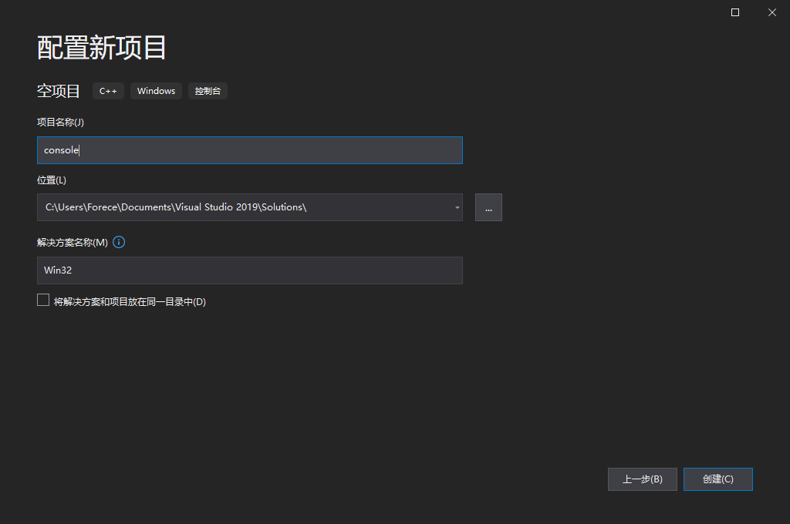

# 应用程序分类

- 控制台程序
  - Dos 程序，本身没有窗口，通过 Windows Dos 窗口执行
- 窗口程序
  - 拥有自己的窗口，可以与用户交互
- 库程序
  - 存放代码、数据的程序，执行文件可以从中取出代码执行和获取数据
  - 静态库程序：扩展名 Lib，在编译链程序时，将代码放入到执行文件中
  - 动态库程序：扩展名 Dll，在执行文件时从中获取代码

## 1. 创建 Console 项目

### 1.1 创建空项目应用

打开 Visual Studio，选择创建空项目

配置项目名、路径以及解决方案名称

### 1.2. 添加 CPP 文件

创建好空项目后，右侧是解决方案管理器

在项目名 console 上点击右键，选择添加 - 新建项

在弹出窗口中选择创建 cpp 文件，文件名一般与项目同名，如：console.cpp

文件添加完毕后，默认打开该文件，并且在资源文件中可以看到该文件已经被添加到项目的源文件中

### 1.3. 运行文件

写一个简单的 CPP 代码

~~~cpp
#include <stdio.h>

int main() {
	printf("hello world\n");
	return 0;
}
~~~

点击绿色运行按钮，就会自动完成编译、链接、以及运行的操作

### 1.4. 解决 DOS 窗口闪退情况

运行完毕后，有一个 Dos 窗口闪退了，这是因为我们创建的 Console 应用程序是借用 Windows Dos 窗口来运行的，当程序运行完毕后，系统会回收该窗口，造成了窗口一闪而退的情况。

那么解决方法也很简单，只要让我们程序的进程不结束，那么窗口就会一直存在，解决方法很多

- getchar() 
  - 等待回车输入，暂停进程
- system("pause")
  - 让进程暂停，但 system 命令依赖于 windows.h 头文件，需要用 include 引入

### 1.5. 项目文件结构

在 Win32 这个解决方案文件夹中，路径是这样的

~~~
Win32
│  Win32.sln							// 解决方案入口文件
│
├─console								// 项目路径，包含项目的一些组织文件
│  │  console.cpp
│  │  console.vcxproj
│  │  console.vcxproj.filters
│  │  console.vcxproj.user
│  │
│  └─Debug								// 调试文件的中间文件
│      │  console.exe.recipe
│      │  console.ilk
│      │  console.log
│      │  console.obj
│      │  vc142.idb
│      │  vc142.pdb
│      │
│      └─console.tlog
│              CL.command.1.tlog
│              CL.read.1.tlog
│              CL.write.1.tlog
│              console.lastbuildstate
│              link.command.1.tlog
│              link.read.1.tlog
│              link.write.1.tlog
│
└─Debug									// 生成调试文件目录
        console.exe
        console.pdb
~~~

> 一个解决方案可能会有很多项目，但是所有项目的最终文件，最后都会生成在解决方案目录下的 Debug 文件夹中

## 2. 创建窗口程序

在当前解决方案中添加一个 Windows 桌面应用项目，可以在解决方案资源管理器中，右键点击解决方案，选择添加 - 新建项目

配置新项目，填写项目名称，位置为我们之前创建的 Win32 解决方案目录

项目添加完毕，可以看到在解决方案资源管理器中又多了一个项目 WinWindow，其中最重要的就是源文件 WinWindow.cpp

### 1.1. 设置启动项目

点击运行后，发现执行的还是之前的 Console 项目，这是因为在解决方案中只有一个启动项目，如果想让其他项目成为启动项目，那么需要在解决方案资源管理器中右键点击项目名称，设置启动项目

### 1.2. 更改项目字符集

进入项目属性

- 从菜单栏进入项目 - 属性
- 解决方案管理器中右键单击项目名称 - 属性

在高级菜单中，选择使用多字节字符集

### 1.3. 入口文件的变更

Windows 窗口程序和我们学 C 时的入口文件不同，C 的入口文件一般都是 main，而这里的入口文件是 wWinMain

~~~cpp
int APIENTRY wWinMain(_In_ HINSTANCE hInstance,
                     _In_opt_ HINSTANCE hPrevInstance,
                     _In_ LPWSTR    lpCmdLine,
                     _In_ int       nCmdShow)
{
    
}
~~~

可以使用 F12 或右键单击关键词 wWinMain 来查看来源和定义

## 3. 创建库文件

不论是静态库还是动态库程序，其本质是一样的，都是存放一些代码和一些数据（封装代码、函数），以供其他可执行文件使用

- 静态库
  - 当程序调用静态库里边的函数，那么静态库中的函数会嵌入到可执行文件中，变成可执行文件的一部分代码
- 动态库
  - 当程序调用动态库里边的函数，动态库中的代码不会嵌入到可执行文件中，程序中记录的仅仅是动态库的一个地址而已

### 3.1 静态库

静态库和动态库的区别来自链接阶段如何处理库，链接成可执行文件

静态库：是因为在链接阶段，会将汇编生成的目标文件 .o 与引用到的库一起链接打包到可执行文件中。因此对应的链接方式称为静态链接。其实一个静态库可以简单看成是**一组目标文件（.o/.obj文件）的集合**，即很多目标文件经过压缩打包后形成的一个文件。

- 静态库对函数库的链接是放在编译时期完成的。
- 程序在运行时与函数库再无瓜葛，移植方便。
- 浪费空间和资源，因为所有相关的目标文件与牵涉到的函数库被链接合成一个可执行文件。

### 3.2 动态库

动态库：动态库在程序编译时并不会被连接到目标代码中，而是在程序运行是才被载入。**不同的应用程序如果调用相同的库，那么在内存里只需要有一份该共享库的实例**，规避了空间浪费问题。动态库在程序运行时才被载入，也解决了静态库对程序的更新、部署和发布页会带来麻烦。用户只需要更新动态库即可，**增量更新**。

- 动态库把对一些库函数的链接载入推迟到程序运行的时期。　
- 可以实现进程之间的资源共享。（因此动态库也称为共享库）
- 将一些程序升级变得简单。
- 甚至可以真正做到链接载入完全由程序员在程序代码中控制（**显示调用**）。

### 3.3 创建静态库

配置项目

生成完毕，源代码很简单，只包含了头文件和一个简单示例

静态库文件，没有入口文件，当我们点击运行的时候，会出现错误

> 这意味着静态库文件没办法独立执行

虽然没有办法独立执行，但是却生成了 WinStatic.lib 文件，这个文件相当于一个函数库，其他可执行文件可以调用该文件中的函数或数据，当链接成 EXE 文件时，LIB 所有代码都将被编译进 EXE 文件中。

### 3.4 创建动态库

同样创建动态链接库（DLL）项目

配置项目

创建完成

可以看到，动态链接库有入口函数，Dllmain，也就是说动态链接库可以执行，但是我们点击运行按钮，发现还是报错

虽然 Dll 可以执行，但是 Dll 文件不能独立运行，必须依附于其他程序才可以执行，由于 Dll 可以执行，所以 Dll 文件在执行过程中是可以进入内存的。

## 4. 应用程序对比

### 4.1. 入口函数

- 控制台程序 - main
- 窗口程序 - WinMain
- 动态库程序 - DllMain
- 静态库程序 - 无入口函数

### 4.2. 文件存在方式

- 控制台程序、窗口程序 - EXE 文件
- 动态库程序 - DLL 文件
- 静态库程序 - LIB 文件

# 开发工具和头文件

## 1. 编译工具

- 编译器 CL.EXE，将源码编译成目标代码 .obj
- 链接器 LINK.EXE，将目标代码、库链接成最终文件
- 资源编辑器 RC.EXE，将资源编译，最终通过链接器存入最终文件

路径：

~~~
C:\Program Files (x86)\Microsoft Visual Studio\2019\Community\VC\Tools\MSVC\14.29.30037\bin\Hostx86\x86
C:\Program Files (x86)\Microsoft Visual Studio\2019\Community\VC\Tools\MSVC\14.29.30037\bin\Hostx86\x64
C:\Program Files (x86)\Microsoft Visual Studio\2019\Community\VC\Tools\MSVC\14.29.30037\bin\Hostx64\x86
C:\Program Files (x86)\Microsoft Visual Studio\2019\Community\VC\Tools\MSVC\14.29.30037\bin\Hostx64\x64
~~~

## 2. 库和头文件

- Windows 库
  - kernel32.dll - 提供了核心的 API, 例如：进程、线程、内存管理等
  - user32.dll - 提供了窗口，消息等 API
  - gdi32.dll - 提供绘图相关 API

路径：

~~~
C:\Windows\System32
~~~

- 头文件
  - windows.h  所有 windows 头文件的集合
  - windef.h  windows 数据类型
  - winbase.h kernel32 的 API
  - wingdi.h gdi32 的 API
  - winuser.h user32 的 API
  - winnt.h UNICODE 字符集支持

> 其中 windows.h 包含了以上列举的所有头文件，所以一般只引用 windows.h 即可

路径：

~~~
C:\Program Files (x86)\Windows Kits\10\Include\10.0.19041.0\um
~~~

## 3. Windows 中的数据类型

例：Windows 中的数据类型头文件 windef.h

Windows 中的数据类型很多，但是基本都是通过 C 中的基本数据类型起别名实现的，如：

~~~
typedef unsigned long       DWORD;
typedef int                 BOOL;
typedef unsigned char       BYTE;
typedef unsigned short      WORD;
typedef float               FLOAT;
typedef FLOAT               *PFLOAT;
typedef BOOL near           *PBOOL;
typedef BOOL far            *LPBOOL;
typedef BYTE near           *PBYTE;
typedef BYTE far            *LPBYTE;
typedef int near            *PINT;
typedef int far             *LPINT;
typedef WORD near           *PWORD;
typedef WORD far            *LPWORD;
typedef long far            *LPLONG;
typedef DWORD near          *PDWORD;
typedef DWORD far           *LPDWORD;
typedef void far            *LPVOID;
typedef CONST void far      *LPCVOID;

typedef int                 INT;
typedef unsigned int        UINT;
typedef unsigned int        *PUINT;
~~~

> 起别名的目的是为了 Windows 以后升级更改数据类型，而别名相当于一个中间件进行转义

## 4. 字符编码

### 4.1 编码历史

- ASC
- ASCII
- DBCS
- UNICODE

- ASC 是最初计算机编码方式，因为计算机在美国诞生，最初设计的编码集只有 7 位（2^7）可以显示 128 个字符，除了普通字母和一些特殊符号，足够英语国家使用。

- ASCII 是 8位（256个字符），前 128 位保持不变，新增了 128 个字符，当计算机被推广到欧洲，很多国家有各种各样的特殊字符，每个国家可以根据自己语言特征来定义这新增的 128 个字符。
- DBCS （ Double Byte Character Set），实际上是单双字节混合编码，英文字符还是单字节，而像汉字、韩文、日文这些字符是双字节编码
- Unicode 将世界上所有字符全都收录，只用一个字符集即可

DBCS 与 UNICODE

DBCS 由于在设计上的缺陷（单双字节混编）在编码的时候经常会出现乱码，由于解析器的不同，可能会把单字节与双字节的字符搞混，造成如下情况：

~~~
A  我    是    程   序    员
01 0203 0405 0607 0809 0A0B
~~~

由于解析器的不同，可能解析出来成为：

~~~
0102 0304 0506 0708 090A 0B
~~~

> 这样就造成了乱码情况

UNICODE 编码，在 Windows 系统一般是 UTF-16，也就是两个字节表示一个字符，而在 Linux 一般是 UTF-8，1个字节表示一个字符，当然还有 UTF-32 等字符集。

~~~
# UTF-8
0000 0001

# UTF-16
0000 0000 0000 0000

# UTF-32
0000 0000 0000 0000 0000 0000 0000 0000
~~~

> 注：一个字节 8 位

### 4.2 宽字节字符

在 C 语言中我们定义字符串时，一般都使用的是 char 数据类型，其实还有一个叫做 wchar_t 数据类型，每个字符占两个字节。 wchar_t 不是基本数据类型，实际上是 unsigned short 类型，定义时，需要增加 "L"，通知编译器按照双字节编译字符串，采用 UNICODE 编码

wchar_t 定义宽字节字符串，如：

~~~cpp
wchar_t* str = L"Hello wchar";
wprintf(L"%s\n",str);
wcout << str << endl;
~~~

注意：在 Visual Studio 2017， 2019 需要做处理才可以正常执行

- 方法1，不改代码，修改项目属性。项目>>属性>>C/C++>>语言>>符合模式，将符合模式由是改为否（优点是不需要修改代码，缺点是每写新的项目就要修改一次设置）

- 方法2，修改代码，先用另外的字符数组存储`Hello world`，再对字符型指针进行初始化

~~~cpp
char ch1[] = "Hello world";
char* text = ch1;
~~~

- 方法3，修改代码，将`char`类型强转为`char*`

~~~cpp
char* text = (char*)"Hello world";
~~~

>事实上，在我看来，使用c++时可以利用STL标准库`#include<string>`来满足你的需求，相比于传统c风格的`#include<cstring>`更灵活，不会出现莫名其妙的错误。强制类型转换也可以使用`static_cast<>()`，这里就不尝试了。

另外一个注意事项是 wchar_t 不显示中文的问题，需要更改本地支持中文，默认为英文：

~~~cpp
std::wcout.imbue(std::locale("chs"));
// 或
setlocale(LC_CTYPE, "chs");
~~~

或者使用 WriteConsole() 来说输出 wchar_t() 定义的字符串

~~~cpp
WriteConsole(标准输出句柄, pszText, wcslen(pszText), NULL, NULL);
~~~

~~~CPP
HANDLE hOut = GetStdHandle(STD_OUTPUT_HANDLE);  // 获取标准输出句柄
WriteConsole(hOut, str, wcslen(str), NULL, NULL);  // 通过 WriteConsole 输出 wchar_t 定义的字符串
~~~

> WriteConsole 除了可以打印 wchar_t 定义的 Unicode 字符串，也可以打印 char 定义的字符串

Win32 编程中的字符类型一般是两种，即常规的 ANSI 编码 和 Unicode 编码

~~~
"字符串"		// ANSI 字符串
L"字符串"		// Unicode 字符串
~~~

字符串的数据类型也被 Windows API 重新起了别名，如：

~~~
typedef char CHAR;			// 普通字符串类型
typedef wchar_t WCHAR;		// 宽字符串类型（Unicode），输出使用 %ls
~~~

定义与输出

~~~cpp
// 普通字符串
CHAR str[] = "abc";
printf("%s\n", str);		// C 输出
cout << str << endl;		// C++ 输出，需要引入 <iostream> 并且使用命名空间 using namespace std;

// 宽字符串
WCHAR str[] = L"ABC";		
printf("%ls\n", str);
wcout << str << endl;
~~~

还有一个类型是 TCHAR，这个类型是为了兼容性而设计的，使用 TCHAR 类型前，需要引入 tchar.h 头文件

~~~cpp
TCHAR str[] = _T("ABC");
TCHAR str[] = __T("ABC");
TCHAR str[] = TEXT("ABC");
~~~

当项目字符集设定为多字节字符集时，TCHAR 类型就是普通字符，而项目字符集设置为 Unicode 字符集时，TCHAR 就是 Unicode 字符，而实现这种兼容性是通过头文件 winnt.h 定义宏实现的

~~~cpp
#ifdef  UNICODE                   
typedef WCHAR TCHAR, *PTCHAR;
	#define __TEXT(quote) L##quote
#else
	typedef char TCHAR, *PTCHAR;
	#define TEXT(quote) __TEXT(quote)
#endif
~~~

所以当字符集被设置为 Unicode 时

~~~cpp
TCHAR* str = _T("ABC");
wprintf(L"%s", str);
~~~

否则 TCHAR 按照 CHAR 来处理字符

~~~cpp
TCHAR* str = _T("ABC");
printf("%s", str);
~~~

由于字符串类型不一样，所对应函数也不同，如计算字符串长度（字符长度，不是所占字节长度）函数：

~~~
printf("%d\n", strlen(str));
printf("%d\n", wcslen(str));
printf("%d\n", _tcslen(str));
~~~

> 由于字符长度不一样，结束符也不一样，CHAR 类型是以 \0 结尾，WCHAR 是以 \0\0 结尾

字符串转数字

~~~
atoi, strtol
_wtoi, wcstol
_ttoi, _tcstol
~~~

数字转字符串

~~~
_itoa_s				// A 版本
_itow_s				// W 版本
_itot_s				// T 版本
~~~

可以看到这里所有普通字符串都是 A 版本，Unicode 字符串都是用 W 版本，而 Windows 中的很多函数也分为两种，如：MessageBoxA， MessageBoxW，代表了该函数使用普通字符集或宽字符集。而 MessageBox 这种什么都没写的即是 T 版本，会根据字符集调用A或W版本的函数（使用宏定义）

关于项目字符集可以通过进入项目属性来修改

- 从菜单栏进入项目 - 属性
- 解决方案管理器中右键单击项目名称 - 属性

在高级菜单中，选择使用多字节字符集

最后说明一下 char* str = "hello" 与 char str[] = "hello" 的区别：

如果只是在同一个函数中使用则没有任何区别，如果要把这个 str 当做返回值时则会出现区别，如，例1：

~~~cpp
char* foo(){
    char* str = "hello";
    return str;        
}

int main(){
    printf(foo());
}
~~~

> 返回的则是 hello 这个常量的地址，在 main 函数中可以正常输出

~~~cpp
char* foo1() {
	char str[] = "hello";
	return str;
}

int main() {
	printf(foo1());
}
~~~

> "hello" 这个常量拷贝到 str 数组中，当 str 被返回时，返回的是 str 数组的起始位置，但是函数执行完毕后，数组被系统回收，该地址就没有了意义，在其他函数中就无法正常使用。

# 编写 Win32 程序

编写第一个 Win32 程序，介绍两个 Win32 程序的相关函数，WinMain 和 MessageBox

WinMain， 窗口应用程序的入口函数

~~~cpp
int WINAPI WinMain(
    HINSTANCE hInstance,  		// 当前程序的实例句柄
    HINSTANCE hPrevInstance, 	// 当前程序前一个实例句柄
    LPSTR lpCmdLine, 			// 命令行参数字符串
    int nCmdShow				// 窗口的显示方式
);
~~~

MessageBox，消息框函数

~~~cpp
int MessageBox(
  HWND    hWnd,			// 父窗口句柄
  LPCTSTR lpText,		// 显示在消息框中的文字
  LPCTSTR lpCaption,	// 显示在标题栏中的文字
  UINT    uType			// 消息框中的按钮、图标显示类型
);
~~~

> 返回点击按钮的 ID

## 1. 句柄

句柄这个概念在 Windows 中非常重要

官方解释：句柄是WONDOWS用来标识被应用程序所建立或使用的对象的唯一整数，WINDOWS使用各种各样的句柄标识诸如应用程序实例，窗口，控制，位图，GDI对象等等。WINDOWS句柄有点象C语言中的文件句柄。

句柄是一个标识符，是拿来标识对象或者项目的。它就像我们的车牌号一样，每一辆注册过的车都会有一个确定的号码，不同的车号码各不相同，但是也可能会在不同的时期出现两辆号码相同的车，只不过它们不会同时处于使用之中罢了。如果把对象比作人，那么对象句柄就是人的名字。

目前如果还不能理解句柄，可以把句柄先理解成一个用来找到内存的东西，但是绝不是指针。

https://blog.csdn.net/weixin_30629653/article/details/99563471

https://blog.csdn.net/ceoicac/article/details/80744529?utm_medium=distribute.pc_relevant.none-task-blog-2%7Edefault%7ECTRLIST%7Edefault-1.no_search_link&depth_1-utm_source=distribute.pc_relevant.none-task-blog-2%7Edefault%7ECTRLIST%7Edefault-1.no_search_link

https://www.cnblogs.com/wxl309729255/articles/2671469.html?ivk_sa=1024320u

## 2. WinMain

API： https://docs.microsoft.com/en-us/windows/win32/api/winbase/nf-winbase-winmain

~~~cpp
int WINAPI WinMain(
    HINSTANCE hInstance,  		// 当前程序的实例句柄
    HINSTANCE hPrevInstance, 	// 当前程序前一个实例句柄
    LPSTR lpCmdLine, 			// 命令行参数字符串
    int nCmdShow				// 窗口的显示方式
);
~~~

参数：

- HINSTANCE hInstance 当前程序的实例句柄
  - 表示本进程占据的内存
- HINSTANCE hPrevInstance 当前程序前一个实例句柄
  - 自从进入32位操作系统就已经废弃不用了，只存在于 16位 操作系统中，现在一直设置为 0 
- PWSTR pCmdLine 命令行参数字符串
  - PWSTR 为 Unicode 字符串数据类型
- nCmdShow 窗口的显示方式
  -  是一个标志，指示主应用程序窗口是最小化、最大化还是正常显示。

## 3. MessageBox

API：https://docs.microsoft.com/zh-cn/windows/win32/api/Winuser/nf-winuser-messagebox

MessageBox，消息框函数

~~~cpp
int MessageBox(
  HWND    hWnd,			// 父窗口句柄
  LPCTSTR lpText,		// 显示在消息框中的文字
  LPCTSTR lpCaption,	// 显示在标题栏中的文字
  UINT    uType			// 消息框中的按钮、图标显示类型
);
~~~

> 返回点击按钮的 ID

参数：

- HWND hWnd
  - 消息框的父窗口句柄，比如说在记事本弹出的消息框，那么消息框的父窗口句柄就是记事本的句柄
  - 如果为 NULL，则该提示框没有父窗口
- LPCTSTR lpText
  - 消息框中的内容文本
- LPCTSTR lpCaption
  - 显示在标题栏中的文字
- UINT uType
  - 消息框中的按钮、图标显示类型，比如（确定 + 取消），（是 + 否）等

## 4. MSDN 手册

## 5. Hello World 程序

~~~cpp
#include <Windows.h>

int WINAPI WinMain(
    HINSTANCE hInstance,  		// 当前程序的实例句柄
    HINSTANCE hPrevInstance, 	// 当前程序前一个实例句柄
    LPSTR lpCmdLine, 			// 命令行参数字符串
    int nCmdShow				// 窗口的显示方式
) 
{
    // 当消息框弹出后，程序阻塞，直到点击按钮
    int ret = MessageBox(NULL, L"Hello World", L"标题", MB_OK);
    // 根据程序返回值做分支操作
    if (ret == IDYES) {

    } else if(ret == IDNO) {

    }
    else {

    }

    return 0;
}
~~~

注意：如果使用空项目创建，系统会默认该项目为 Console 控制台项目，不会编译成功，需要修改项目配置为窗口项目

## 6. 编译过程

### 6.1 编译链接

- 手动使用 CL.EXE 编译

~~~
CL.EXE hello.c -c
~~~

> 将脚本语言编译成机器语言，生成 hello.obj 目标文件

- 使用链接 LINK.EXE 链接 obj 文件与库文件

~~~
LINK.EXE hello.obj user32.lib
~~~

> 链接完程序后，就会在当前文件夹生成 hello.exe 文件

### 6.2 编译资源

使用 RC.EXE 编译资源文件（添加 ICO 图标）

编写 hello.rc 脚本语言

~~~
100 ICON small.ico
~~~

编译文件

~~~
CL.EXE hello.c -c
~~~

资源编译

~~~
RC.EXE hello.rc
~~~

> 将 rc 脚本语言翻译成机器语言，编译完成后生成 res 后缀文件

链接文件

~~~
LINK.EXE hello.obj hello.res user32.lib
~~~

> 生成 EXE 文件

# 创建 Windows 窗口

之前使用 Windows 自带模板创建了一个窗口程序，里边有很多预设代码，这里我们从0开始手写一个窗口程序

窗口创建过程：

- 定义 WinMain 函数
- 定义窗口处理函数（自定义，处理消息）
- 注册窗口类（向的操作系统写入一些数据）
- 创建窗口（内存中创建窗口）
- 显示窗口（绘制窗口的图像）
- 消息循环（获取/翻译/派发消息）
- 消息处理

首先创建空项目 WinBase，并且在源文件中添加 WinBase.cpp，调整字符集为多字节，调整项目为窗口程序

~~~cpp
#include <Windows.h>

// 窗口处理函数（自定义，处理消息）
LRESULT CALLBACK WndProc(HWND hWnd, UINT msgID, WPARAM wParam, LPARAM lParam) {
	return DefWindowProc(hWnd, msgID, wParam, lParam);
}

// 入口函数
int WINAPI WinMain(
	HINSTANCE hIns,
	HINSTANCE hPreIns,
	LPSTR lpCmdLine,
	int nCmdShow) 
{
	// 注册窗口类
	WNDCLASS wc = { 0 };
	wc.cbClsExtra = 0;
	wc.cbWndExtra = 0;
	wc.hbrBackground = (HBRUSH)(COLOR_WINDOW + 1);
	wc.hCursor = NULL;
	wc.hIcon = NULL;
	wc.hInstance = hIns;
	wc.lpfnWndProc = WndProc;		// 必填
	wc.lpszClassName = "Main";		// 必填
	wc.lpszMenuName = NULL;
	wc.style = CS_HREDRAW | CS_VREDRAW;
	// 写入操作系统
	RegisterClass(&wc);

	// 在内存中创建窗口
	HWND hWnd = CreateWindow("Main", "window", WS_OVERLAPPEDWINDOW, 100, 100, 500, 500, NULL, NULL, hIns, NULL);

	// 显示窗口
	ShowWindow(hWnd, SW_SHOW);
	UpdateWindow(hWnd);

	// 消息循环
	MSG nMsg = { 0 };
	while (GetMessage(&nMsg, NULL, 0, 0)) {
		TranslateMessage(&nMsg);
		DispatchMessage(&nMsg);  // 将消息交给处理函数处理
	}
	return 0;
}
~~~

> 目前还有 Bug，当窗口关闭时，进程并没有被关闭

