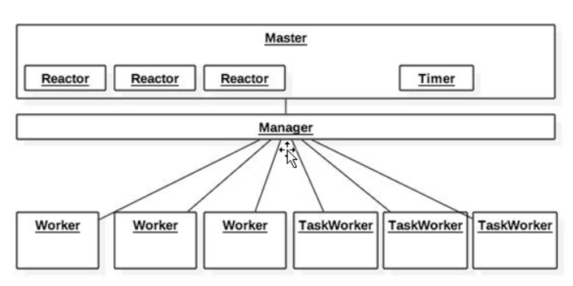
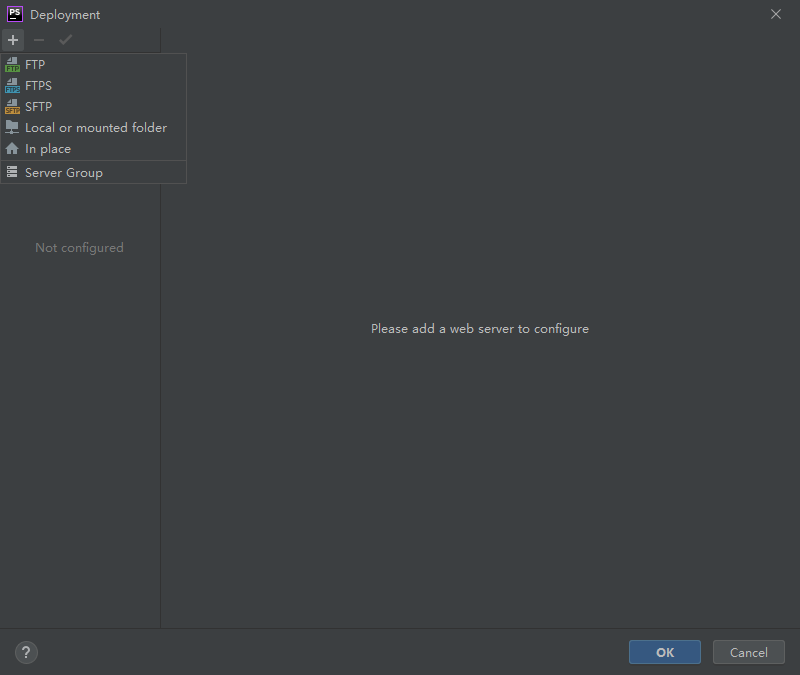
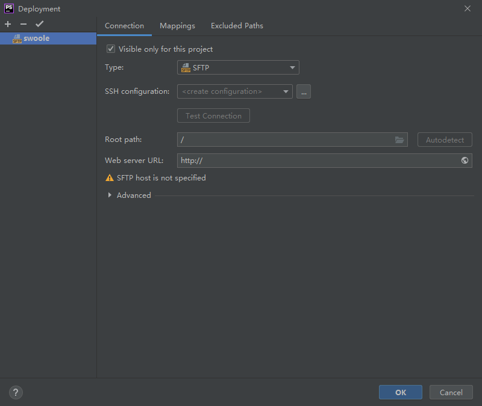
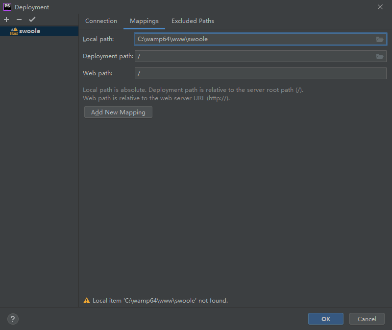
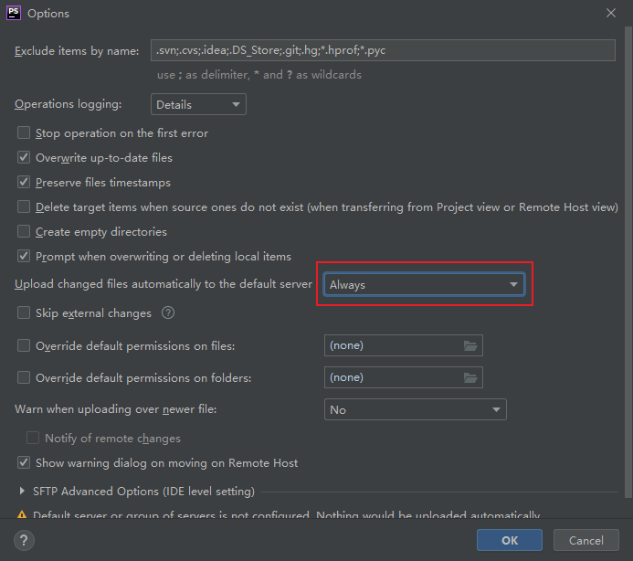

# Swoole 简介

## 1. 简介

swoole是PHP的异步、并行、高性能网络通信引擎，使用纯C语言编写，提供了PHP语言的异步多线程服务器，异步TCP/UDP网络客户端，异步MySQL，异步Redis，数据库连接池，AsyncTask，消息队列，毫秒定时器，异步文件读写，异步DNS查询。 swoole内置了Http/WebSocket服务器端/客户端、Http2.0服务器端。

swoole虽然是标准的PHP扩展，实际上与普通的扩展不同。普通的扩展只是提供一个库函数。而swoole扩展在运行后会接管PHP的控制权，进入事件循环。当IO事件发生后，swoole会自动回调指定的PHP函数。

也就是说，swoole就是个披了php外衣的nginx，大量的功能都是用c来实现。一些功能的调用其实并没php什么事，它只是个纯粹的胶水，有什么功能全用c在实现，然后执行完成再回调给php。

Swoole 可以做什么：

Swoole可以广泛应用于互联网、移动通信、企业软件、云计算、网络游戏、物联网（IOT）、车联网、智能家居等领域。 使用PHP+Swoole作为网络通信框架，可以使企业IT研发团队的效率大大提升，更加专注于开发创新产品。

用户案例：

- 虎牙直播
- 战旗直播
- YY语音
- 学而思
- 集运宝
- 阅文
- bilibili

## 2. 下载安装

官网：

https://www.swoole.com/

下载地址：

https://github.com/swoole/swoole-src/tags

http://pecl.php.net/package/swoole

https://gitee.com/swoole/swoole/tags

安装环境要求：

- 仅支持 Linux 、 MacOS 操作系统
- Linux 内核 2.3.32， 如 CentOS 6.6 以上 
  - `uname -r`  查看版本号
- PHP 7.2 版本或以上
  - `php -v`
- GCC 4.8 版本或以上 
  - `gcc -version`
- `make`
  - `cmake --version`
- `autoconf`
- phpize
  - `which git`
  - `yum install -y php-devel`

Linux 环境安装：

创建 src 目录，保存安装包

~~~shell
mkdir /src
cd /src
~~~

下载安装包：

~~~shell
wget http://pecl.php.net/get/swoole-4.7.1.tgz
~~~

解压缩

~~~shell
tar -zcvf swoole-4.7.1.tgz
~~~

进入解压后路径

~~~shell
cd /swoole-4.7.1
~~~

安装：

~~~shell
phpize && \
./configure && \
make && sudo make install
~~~

在 ./configure 中使用参数，可以将扩展文件自动复制到 PHP 扩展路径中

~~~
./configure --with-php-config=/usr/bin/php-config
~~~

> 如不知道路径可以使用`which php-config`查看

否则需要在当前目录手动将 swoole.so 复制到 /user/lib64/php/modules 中

开启扩展：

- 编译安装到系统成功后，需要在 php.ini 中加入一行 extension=swoole.so 来启用 Swoole 扩展
- 或者 /etc/php.d/ 中添加 swoole.ini，然后添加 extension=swoole.so

检查是否安装成功

~~~
php -m|grep swoole
~~~

# 进程管理

swoole 是一个多进程，多线程的服务

- master 主进程负责创建多个线程来接受和处理用户请求，同时生成一个 manager 进程
- manager 进程负责生成和管理 N 多个 worker 和 task 进程

# 配置 phpstrom

可以实现保存文件同时直接同步到服务器

服务器创建文件夹

~~~
mkdir /wwwdata
~~~

- Tools - Development - Configuration

填写服务器信息

Mappings 映射

设置保存上传，否则每次都要右键点击项目区域，选择 Development - Upload

安装插件 swoole-ide-helper

可以提示代码，自动补全函数名、类名

https://github.com/EagleWu/swoole-ide-helper

> 下载后解压将文件夹放在项目中即可

# 创建 TCP 服务器

ssh、http、mysql 其实都是 TCP 服务器

## 1. 创建 TCP 服务器

~~~php
//创建Server对象，监听 127.0.0.1:9501 端口
// 参数1： 监听网卡地址
// 参数2： 监听端口号
// 参数3： 是否开启多进程，默认多进程
// 参数4： 协议 TCP, UDP，默认 tcp 服务
$server = new Swoole\Server('127.0.0.1', 9501);

//监听连接进入事件
// $server： Server 对象
// $fd： 客户端 ID 号
$server->on('Connect', function ($server, $fd) {
    echo "Client: Connect.\n";
});

//监听数据接收事件
// $reactor_id： 接受处理的线程 ID 号
// $data： 接受到的数据
$server->on('Receive', function ($server, $fd, $reactor_id, $data) {
    $server->send($fd, "Server: {$data}");
});

//监听连接关闭事件
$server->on('Close', function ($server, $fd) {
    echo "Client: Close.\n";
});

//启动服务器
$server->start(); 
~~~

这样就创建了一个 `TCP` 服务器，监听本机 `9501` 端口。它的逻辑很简单，当客户端 `Socket` 通过网络发送一个 `hello` 字符串时，服务器会回复一个 `Server: hello` 字符串。

`Server` 是异步服务器，所以是通过监听事件的方式来编写程序的。当对应的事件发生时底层会主动回调指定的函数。如当有新的 `TCP` 连接进入时会执行 [onConnect](https://wiki.swoole.com/#/server/events?id=onconnect) 事件回调，当某个连接向服务器发送数据时会回调 [onReceive](https://wiki.swoole.com/#/server/events?id=onreceive) 函数。

- 服务器可以同时被成千上万个客户端连接，`$fd` 就是客户端连接的唯一标识符
- 调用 `$server->send()` 方法向客户端连接发送数据，参数就是 `$fd` 客户端标识符
- 调用 `$server->close()` 方法可以强制关闭某个客户端连接
- 客户端可能会主动断开连接，此时会触发 [onClose](https://wiki.swoole.com/#/server/events?id=onclose) 事件回调

## 2. 运行 TCP 服务器

执行程序

~~~php
php server.php
~~~

> 在命令行下运行 `server.php` 程序，启动成功后可以使用 `netstat` 工具看到已经在监听 `9501` 端口。

~~~shell
netstat -tunpl
ps auxf|grep php
~~~

## 3. 配置

~~~php
$server->set(array('worker_num' => 4));
~~~

## 4. telnet 连接

~~~php
telnet 127.0.0.1 9501
~~~

> 如果没有安装则需要 yum insatll -y telnet 进行安装

设置中断符号

~~~
CTRL + ]
~~~

此时输出字符，服务器就可以收到了

退出

~~~
quit
~~~

# TCP 客户端

~~~php
use Swoole\Coroutine\Client;
use function Swoole\Coroutine\run;

run(function () {
    $client = new Client(SWOOLE_SOCK_TCP);
    if (!$client->connect('127.0.0.1', 9501, 0.5))
    {
        echo "connect failed. Error: {$client->errCode}\n";
    }
    $client->send("hello world\n");
    echo $client->recv();
    $client->close();
});
~~~

~~~php
// socket 当成一个网络中的文件
$socket = stream_socket_client('tcp://140.143.30.117:6060', $errno, $errstr, 10);

// 发送数据
fwrite($socket,"我是一个请求");

// 接受数据
$buffer = fread($socket, 9000);

fclose($socket);

echo $buffer;
~~~

# RPC

RPC 是指 Remote Procedure Call Protocol，通过 RPC 我们可有像调用本地方法一样调用别的机器上的方法，用户将无感服务器与服务器之间的通讯。RPC在微服务当中起到相当大的作用，当然 RPC 不是微服务必须的一种方式，有别的方式也可以实现这种远程调用，例： RESTful API 就可以实现远程调用。如果有用过 SOAP 那么你使用 RPC 将会觉得很类似，都是可以直接调用别的机器上的方法。

## 1. RPC

## 2. RPC 实现首页显示

## 3. TP 实现 RPC 调用

# 构建 Web 服务器

## 1. 静态服务器

## 2. 动态服务器