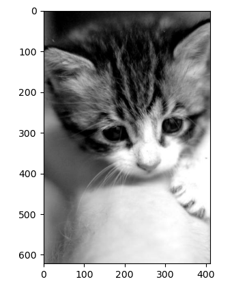

# Numpy

Numpy 是 Python 语言中做科学计算的基础库。重在于数值计算，也是大部分 Python 科学计算的基础，多用于在大型、多维数组上执行的数值运算。


**导入 numpy**

```
import numpy as np
```


## 1. 创建 numpy 数组

### 1.1 np.array() 创建

```
numpy.array(object, dtype = None, copy = True, order = None, subok = False, ndmin = 0)
```


参数说明：

| 名称   | 描述                                                      |
| :----- | :-------------------------------------------------------- |
| object | 数组或嵌套的数列                                          |
| dtype  | 数组元素的数据类型，可选                                  |
| copy   | 对象是否需要复制，可选                                    |
| order  | 创建数组的样式，C为行方向，F为列方向，A为任意方向（默认） |
| subok  | 默认返回一个与基类类型一致的数组                          |
| ndmin  | 指定生成数组的最小维度                                    |


例：

```
arr = np.array([1,2,3,4,5])  # 一维数组
arr2d = np.array(([1,2,3],[4,5,6]))  # 二维数组
```


**数组列表的区别**：

- 数组中存储的数据元素类型必须是统一类型
- 优先级：字符串 - 浮点型 - 整数


np.asarray() 也可以创建数组，类似 array() 方法，比 array 方法少了两个参数

```
numpy.asarray(a, dtype = None, order = None)
```

| 参数  | 描述                                                         |
| :---- | :----------------------------------------------------------- |
| a     | 任意形式的输入参数，可以是，列表, 列表的元组, 元组, 元组的元组, 元组的列表，多维数组 |
| dtype | 数据类型，可选                                               |
| order | 可选，有"C"和"F"两个选项,分别代表，行优先和列优先，在计算机内存中的存储元素的顺序。 |


### 1.2 plt 创建

```
import matplotlib.pyplot as plt
img_arr = plt.imread('1.jpg')  # 将图片数据进行读取，返回的是一个三维数组
print(img_arr)

# 输出结果：
[[[ 84  84  84]
  [ 83  83  83]
  [ 80  80  80]
  ...
  [119 119 119]
  [117 117 117]
  [115 115 115]]

 [[ 84  84  84]
  [ 83  83  83]
  [ 80  80  80]
  ...
  [118 118 118]
  [116 116 116]
  [115 115 115]]

 [[ 84  84  84]
  [ 83  83  83]
  [ 80  80  80]
  ...
  [117 117 117]
  [115 115 115]
  [114 114 114]]

 ...

 [[137 137 137]
  [135 135 135]
  [132 132 132]
  ...
  [201 201 201]
  [199 199 199]
  [198 198 198]]

 [[136 136 136]
  [134 134 134]
  [132 132 132]
  ...
  [198 198 198]
  [196 196 196]
  [194 194 194]]

 [[136 136 136]
  [133 133 133]
  [131 131 131]
  ...
  [196 196 196]
  [193 193 193]
  [190 190 190]]]
```


将三维数组以图片方式显示

```
plt.imshow(img_arr)
plt.show()
```

> plt.imshow()函数负责对图像进行处理，并显示其格式，而plt.show()则是将plt.imshow()处理后的函数显示出来。


### 1.3 np 的 routines 函数创建

**np.ones**()

```
np.ones(shape, dtype=None, order='C')
```

> shape 指定形状，也就是数据的维度


例：

```
arr = np.ones(shape=(4,5))  # 四行五列的数组
print(arr)

# 输出结果：
[[1. 1. 1. 1. 1.]
 [1. 1. 1. 1. 1.]
 [1. 1. 1. 1. 1.]
 [1. 1. 1. 1. 1.]]
```


类似的还有 np.empty(), np.zero() ，只不过是一个创建空数组，另一个填充值为0（默认元素浮点型）


**np.empty()**

numpy.empty 方法用来创建一个指定形状（shape）、数据类型（dtype）且未初始化的数组：

```
numpy.empty(shape, dtype = float, order = 'C')
```

```
import numpy as np 
x = np.empty([3,2], dtype = int) 
print (x)

# 输出结果：
[[ 6917529027641081856  5764616291768666155]
 [ 6917529027641081859 -5764598754299804209]
 [          4497473538      844429428932120]]

```

> 元素内容为随机值，因为未初始化


**numpy.zeros**

创建指定大小的数组，数组元素以 0 来填充：

```
numpy.zeros(shape, dtype = float, order = 'C')
```

```
import numpy as np
 
# 默认为浮点数
x = np.zeros(5) 
print(x)
 
# 设置类型为整数
y = np.zeros((5,), dtype = np.int) 
print(y)
 
# 自定义类型
z = np.zeros((2,2), dtype = [('x', 'i4'), ('y', 'i4')])  
print(z)
```


输出结果：

```
[0. 0. 0. 0. 0.]
[0 0 0 0 0]
[[(0, 0) (0, 0)]
 [(0, 0) (0, 0)]]
```


**np.linspace()**

numpy.linspace 函数用于创建一个一维数组，数组是一个等差数列构成的，格式如下：

```
np.linspace(start, stop, num=50, endpoint=True, retstep=False, dtype=None)
```

| 参数       | 描述                                                         |
| :--------- | :----------------------------------------------------------- |
| `start`    | 序列的起始值                                                 |
| `stop`     | 序列的终止值，如果`endpoint`为`true`，该值包含于数列中       |
| `num`      | 要生成的等步长的样本数量，默认为`50`                         |
| `endpoint` | 该值为 `true` 时，数列中包含`stop`值，反之不包含，默认是True。 |
| `retstep`  | 如果为 True 时，生成的数组中会显示元素之间的等差间距，反之不显示。 |
| `dtype`    | `ndarray` 的数据类型                                         |


例：

```
arr = np.linspace(0,100,num=20)
print(arr)

# Result:
[  0.           5.26315789  10.52631579  15.78947368  21.05263158
  26.31578947  31.57894737  36.84210526  42.10526316  47.36842105
  52.63157895  57.89473684  63.15789474  68.42105263  73.68421053
  78.94736842  84.21052632  89.47368421  94.73684211 100.        ]
```

> 创建20个元素的数组，从0开始到100的等差数列，默认元素类型为浮点型


**np.arrange()**

numpy 包中的使用 arange 函数创建数值范围并返回 ndarray 对象，函数格式如下：

```
arrange([start,] stop[, step,], dtype=None)
```

| 参数    | 描述                                                         |
| :------ | :----------------------------------------------------------- |
| `start` | 起始值，默认为`0`                                            |
| `stop`  | 终止值（不包含）                                             |
| `step`  | 步长，默认为`1`                                              |
| `dtype` | 返回`ndarray`的数据类型，如果没有提供，则会使用输入数据的类型。 |


例：

```
arr = np.arange(0, 100, step=2)
print(arr)

# Result:
[ 0  2  4  6  8 10 12 14 16 18 20 22 24 26 28 30 32 34 36 38 40 42 44 46
 48 50 52 54 56 58 60 62 64 66 68 70 72 74 76 78 80 82 84 86 88 90 92 94
 96 98]
```


**np.random.randint()**

```
np.random.randint(low, high=None, size=None, dtype='1')
```


例：

```
arr = np.random.randint(0,100,size=(3,4))
print(arr)

# result:
[[27 30 90 50]
 [59 94 25  9]
 [ 6 30 68 76]]
```


如果想固定随机数组，在声明数组前边一行加上 np.random.seed()

```
np.random.seed(1)
arr = np.random.randint(0,100,size=(3,4))
print(arr)
```


## 2. numpy 数组属性

numpy 数组常用属性：shape、ndim、size、dtype

| 属性             | 说明                                                         |
| :--------------- | :----------------------------------------------------------- |
| ndarray.ndim     | 秩，即轴的数量或维度的数量                                   |
| ndarray.shape    | 数组的维度，对于矩阵，n 行 m 列                              |
| ndarray.size     | 数组元素的总个数，相当于 .shape 中 n*m 的值                  |
| ndarray.dtype    | ndarray 对象的元素类型                                       |
| ndarray.itemsize | ndarray 对象中每个元素的大小，以字节为单位                   |
| ndarray.flags    | ndarray 对象的内存信息                                       |
| ndarray.real     | ndarray元素的实部                                            |
| ndarray.imag     | ndarray 元素的虚部                                           |
| ndarray.data     | 包含实际数组元素的缓冲区，由于一般通过数组的索引获取元素，所以通常不需要使用这个属性。 |


### 2.1 ndim - 显示数组维度

ndarray.ndim 用于返回数组的维数，等于秩。

```
arr = np.ones(shape=(4,5))
print(arr.ndim)

# 输出结果:
2
```

> arr 是一个二维数组


### 2.2 shape - 返回数组形状

ndarray.shape 表示数组的维度，返回一个元组，这个元组的长度就是维度的数目，即 ndim 属性(秩)。比如，一个二维数组，其维度表示"行数"和"列数"。

```
arr = np.ones(shape=(4,5))
print(arr.shape)

# 输出结果:
(4,5)
```

> 回显 shape ，四行五列


### 2.3 size - 显示数组元素个数

```
arr = np.ones(shape=(4,5))
print(arr.size)

# 输出结果:
20
```


### 2.4 dtype - 显示数组元素类型

```
arr = np.ones(shape=(4,5))
print(arr.dtype)

# 输出结果:
float64
```


numpy 数据类型

在创建数组的时候，可以用 dtype 参数来设定数据类型

```
array(dtype=?)
```


例：

```
import numpy as np
arr = np.array([1,2,3,4,5])
arr1 = np.array([1,2,3,4,5], dtype='float64')
print(arr.dtype)
print(arr1.dtype)

# 输出结果
int32
float64
```


对已有数组进行数据类型的修改

```
arr.dtpe = '?'
```


例：

```
import numpy as np
arr = np.array([1,2,3,4,5])
print(arr.dtype)
arr.dtype('int8')
print(arr.dtype)

# 输出结果
int32
int8
```


| 名称       | 描述                                                         |
| :--------- | :----------------------------------------------------------- |
| bool_      | 布尔型数据类型（True 或者 False）                            |
| int_       | 默认的整数类型（类似于 C 语言中的 long，int32 或 int64）     |
| intc       | 与 C 的 int 类型一样，一般是 int32 或 int 64                 |
| intp       | 用于索引的整数类型（类似于 C 的 ssize_t，一般情况下仍然是 int32 或 int64） |
| int8       | 字节（-128 to 127）                                          |
| int16      | 整数（-32768 to 32767）                                      |
| int32      | 整数（-2147483648 to 2147483647）                            |
| int64      | 整数（-9223372036854775808 to 9223372036854775807）          |
| uint8      | 无符号整数（0 to 255）                                       |
| uint16     | 无符号整数（0 to 65535）                                     |
| uint32     | 无符号整数（0 to 4294967295）                                |
| uint64     | 无符号整数（0 to 18446744073709551615）                      |
| float_     | float64 类型的简写                                           |
| float16    | 半精度浮点数，包括：1 个符号位，5 个指数位，10 个尾数位      |
| float32    | 单精度浮点数，包括：1 个符号位，8 个指数位，23 个尾数位      |
| float64    | 双精度浮点数，包括：1 个符号位，11 个指数位，52 个尾数位     |
| complex_   | complex128 类型的简写，即 128 位复数                         |
| complex64  | 复数，表示双 32 位浮点数（实数部分和虚数部分）               |
| complex128 | 复数，表示双 64 位浮点数（实数部分和虚数部分）               |


## 3. numpy 数据索引及切片

### 3.1 数组索引

索引操作和列表使用的是同样的方法

```
import numpy as np
arr = np.array([1,2,3,4,5])
print(arr[2])

# 输出结果
3
```


### 3.2 数组切片

ndarray 数组可以基于 0 - n 的下标进行索引，切片对象可以通过内置的 slice 函数，并设置 start, stop 及 step 参数进行，从原数组中切割出一个新数组。

```
import numpy as np
 
a = np.arange(10)
s = slice(2,7,2)   # 从索引 2 开始到索引 7 停止，间隔为2
print (a[s])

# 输出结果
[2  4  6]
```


我们也可以通过冒号分隔切片参数 **start:stop:step** 来进行切片操作：

```
import numpy as np
 
a = np.arange(10)  
b = a[2:7:2]   # 从索引 2 开始到索引 7 停止，间隔为 2
print(b)
```


> 冒号 **:** 的解释：如果只放置一个参数，如 **[2]**，将返回与该索引相对应的单个元素。如果为 **[2:]**，表示从该索引开始以后的所有项都将被提取。如果使用了两个参数，如 **[2:7]**，那么则提取两个索引(不包括停止索引)之间的项。


**取出前两行**

```
import numpy as np
arr = np.random.randint(0, 100, size=(5,7))
print(arr)
print('*'*30)
print(arr[0:2])  # 切片操作，从0元素开始到第三个元素结束（不包括第三个）

# 输出结果
[[39 32 93 36 53 85 76]
 [58 97 27 35 96 31 20]
 [ 7 67 50  7 93 64 18]
 [94 59 31 70 44 84 60]
 [85 83 68 27 54 87 39]]
******************************
[[39 32 93 36 53 85 76]
 [58 97 27 35 96 31 20]]
```


**取出前两列**

以逗号为分割，`arr[行, 列]`

```
print(arr[:,0:2]) 
```


**取出前两行的前两列**

```
print(arr[0:2,0:2]) 
```


**数组数据反转**

```
import numpy as np

arr = np.array(([1, 2, 3], [4, 5, 6], [7, 8, 9]))

# 行反转
print(arr[::-1, :])

# 列反转
print(arr[:, ::-1])

# 行列都反转
print(arr[::-1, ::-1])
```


通过行列反转，可以对图片转化的数组进行图片变化，比如水平反转就是列反转，垂直反转就是行反转

```
import matplotlib.pyplot as plt
img_arr = plt.imread('1.jpg')

print(img_arr.shape)  # (622, 412, 3) 表示 622行，412列， 3为颜色

# 垂直反转
plt.imshow(img_arr[::-1,:,:])

# 水平反转
plt.imshow(img_arr[:,::-1,:])

# 全部反转包括颜色
plt.imshow(img_arr[::-1, ::-1, ::-1])

```


裁剪指定区域




```
import matplotlib.pyplot as plt

img_arr = plt.imread('./cat/1.jpg')

# 从0到420行进行切片取出
plt.imshow(img_arr[0:420,:,:])
plt.show()
```


## 4. 数组变形

将二维数组变为一维数组

```
import numpy as np

arr = np.array(([1, 2, 3], [4, 5, 6]))
arr1 = arr.reshape((6,))  # 参数必须是一个元组，并且变形的元素数量必须和原数组一致
print(arr1)
```


将一维数组变为二维数组

```
import numpy as np

arr = np.array(([1, 2, 3, 4, 5, 6]))
arr1 = arr.reshape((2,3))  
print(arr1)
```


其实 shape 属性也可以调整数组

```
import numpy as np 
 
a = np.array([[1,2,3],[4,5,6]]) 
a.shape =  (3,2)  
print (a)

# 输出结果
[[1 2]
 [3 4]
 [5 6]]
```


## 5. 级联操作

在 NumPy中，每一个线性的数组称为是一个轴（axis），也就是维度（dimensions）。比如说，二维数组相当于是两个一维数组，其中第一个一维数组中每个元素又是一个一维数组。所以一维数组就是 NumPy 中的轴（axis），第一个轴相当于是底层数组，第二个轴是底层数组里的数组。而轴的数量——秩，就是数组的维数。


很多时候可以声明 axis。axis=0，表示沿着第 0 轴进行操作，即对每一列进行操作；axis=1，表示沿着第1轴进行操作，即对每一行进行操作。

```
np.concatenate((arr, arr), axis=0)
```

>axis = 0 垂直方向
>
>axis = 1 水平方向


例：

```
import numpy as np

arr = np.array(([1, 2, 3], [4, 5, 6]))
arr1 = np.concatenate((arr,arr), axis=1)
print(arr1)

# 输出结果
[[1 2 3 1 2 3]
 [4 5 6 4 5 6]]
```


## 6. 常用统计函数

常用的聚合操作包括：sum、max、min、mean


sum() 求和

```
import numpy as np

arr = np.array(([1, 2, 3], [4, 5, 6]))
print(arr.sum())
print(arr.sum(axis=0))  # 按列求和
print(arr.sum(axis=1))  # 按行求和

# 输出结果：
21
[5 7 9]
[ 6 15]
```


sin(), cos(), tan() 数学函数

```
import numpy as np

arr = np.array(([1, 2, 3]))
print(np.sin(arr))
print(np.cos(arr))
print(np.tan(arr))
```


np.aound() 函数返回指定数字的四舍五入值

```
import numpy as np

arr = np.array(([1.666, 2.2222, 3.1]))
print(np.around(arr, decimals=2))

# 输出结果
[1.67 2.22 3.1 ]
```

> decimals 参数负数为小数点左侧、正数为小数点右侧


## 

numpy.amin() 和 numpy.amax()

用于计算数组中的元素沿指定轴的最小、最大值


numpy.ptp()

计算数组中元素最大值与最小值的差（最大值-最小值）


numpy.median() 

用于计算数组中的中位数


std()

标准差：计算组平均值分散程度的一种方法


var()

方差：每个样本值与全体样本值平均数只差的平方值的平均数。标准差是方差的平方根。


# Pandas

Pandas 是基于 Numpy 的一种工具，该工具是为了解决数据分析任务而创建的。pandas 提供了大量能使我们快速便捷地处理数据的函数和方法。numpy 主要处理数值型数据，而 pandas 主要处理非数值型数据


Pandas 的两个常用类

- Series
- DataFrame


## 1. Series

Series 是一种类似于**一维数组**的对象，由下边两个部分组成：

- values：一组数据（ndarray类型）
- index：相关的数据索引标签


Series 创建：

- 由列表或 numpy 数组创建
- 由字典创建


### 1.1 创建 Series 数组

```
import pandas as pd
from pandas import Series, DataFrame

ser = Series(data=[1,2,3])
print(ser)

# 输出结果
0    1
1    2
2    3
dtype: int64
```

> 左列是索引、右列是值


可以用 index 改变索引名称

```
import pandas as pd
from pandas import Series, DataFrame

ser = Series(data=[1,2,3], index=['a','b','c'])
print(ser)

# 输出结果：
a    1
b    2
c    3
dtype: int64
```

> 设定 index 后并不会覆盖原先的序号索引


取值得几种方法

```
ser[0]
ser['a']
ser.a
```


### 1.2 Series 属性值

```
# 数组的维度
ser.shape

# 数组的个数
ser.size

# 数组显性索引
ser.index

# 数组元素值
ser.values
```


### 1.3 Series 常用方法

```
# 显示前 n 个元素
ser.head(n)

# 显示后 n 个元素
ser.tail(n)
```


去重

```
s = Series(data=[1,1,1,1,3,3,4,5,2,5])
s.unique()

# 返回去重之后元素的个数
s.nunique()
```


检查元素是否为空

```
s.isnull
s.notnull()
```


### 1.4 Series 运算

```
import pandas as pd
from pandas import Series, DataFrame

ser1 = Series(data=[1,2,3], index=['a','b','c'])
ser2 = Series(data=[4,5,6], index=['a','d','c'])
print(ser1+ser2)

# 输出结果
a    5.0
b    NaN
c    9.0
d    NaN
dtype: float64
```

> 索引一致的元素进行运算，否则补空


## 2. DataFrame

DataFrame 是一个【表格型】的数据结构。DataFrame由按照一定顺序排列的多列数据组成。DataFrame 是由 Series 组成。

- 行索引：index
- 列索引：columns
- 值：values


### 2.1 创建DataFrame

由数组创建

```
import pandas as pd
from pandas import Series, DataFrame

df = DataFrame(data=[[1,2,3],[4,5,6]])
print(df)

# 输出结果
   0  1  2
0  1  2  3
1  4  5  6
```


由字典创建

```
import pandas as pd
from pandas import Series, DataFrame

dict = {'name':['tom','jay','salary'],
        'salary':[10000,2000,15000]}
df = DataFrame(data=dict)
print(df)

# 输出结果
     name  salary
0     tom   10000
1     jay    2000
2  salary   15000
```


### 2.2 DataFrame 属性

```
# 返回数组元素
df.values

# 返回列索引
df.columns

# 返回行索引
df.index

# 返回数组维度
df.shape
```


### 2.3 DataFarame 索引和切片

```
import numpy as np
import pandas as pd
from pandas import Series, DataFrame

df = DataFrame(data=np.random.randint(0, 100, size=(5, 4)), columns=['a', 'b', 'c', 'd'],
               index=['A', 'B', 'C', 'D', 'E'])
print(df)

# 输出结果
    a   b   c   d
A  41  47  17  71
B  87  28  63  30
C  52  44  96  16
D  68  78  18  86
E   9  79  94  11
```


取列操作

```
print(df.a)
print(df['a'])
print(df.iloc[:, 0])
```


取行操作

```
print(df.iloc[0])
print(df.loc['A'])
```


取元素

```
print(df.loc['B','b'])
print(df.iloc[1,1])
```


取多行

```
print(df.iloc[[0,1],2])  # 取0、1行，第2列元素
```


切行

```
print(df[0:2])  # 取前两行
```


切列

```
print(df.iloc[:,0:2])  # 取前两列
```


### 2.4 DataFrame 数据存储与读取

DataFrame 提供了多种数据转换方法，只需要用 to_xxx 方法即可。


常用的几个数据存储结构写入

```
df.to_csv()
df.to_excel()
df.to_sql()
df.to_json()
```


从文件中将数据读取为 DataFrame 格式数据

```
df = pd.read_csv('./df.csv')
```


### 2.5 DataFrame 方法

删除数据

```
df.drop(labels='列名', axis=1, inplace=True)
```

> drop 方法中的 axis 0 为行，1为列
>
> inplace=True 对原数组也进行改变，否则原数组不变，需要对方法的返回值进行赋值生成一个新的数组。


查看数据类型

```
df.info()
```


转换数据类型

```
df['date'] = pd.to_datetime(df['date'])
```


设置某列为索引

```
df.set_index(df['date'], inplace=True)
```

