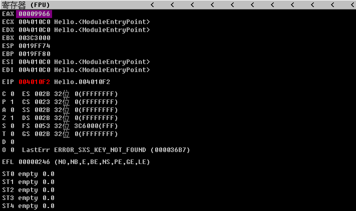

# 汇编语言简介

CPU 是计算机的核心，由于 CPU 只能读懂二进制，也就是俗称的机器语言，所以 CPU 执行的指令是二进制的。我们想要让 CPU 工作，就得给它提供它认识的指令，这一系列的指令的集合，称之为指令集。

代码调试工具中的代码：

~~~
00D224B1 68 00 AC D2 00       push        offset string "hello world" (0D2AC00h)  
00D224B6 E8 62 EC FF FF       call        _printf (0D2111Dh)
~~~

可以看到，这里的代码段，就是机器语言的 16 进制

~~~
68 00 AC D2 00
E8 62 EC FF FF
~~~

将它转换为二进制

~~~
0110100000000000101011001101001000000000
1110100001100010111011001111111111111111
~~~

尽管机器语言对计算机来说很好懂也很好用，但是对于编程人员来说，记住0和1组成的指令简直就是煎熬。为了解决这个问题，汇编语言诞生了。汇编语言用英文字母或符号串来替代机器语言，把不易理解和记忆的机器语言按照对应关系转换成汇编指令。这样一来，汇编语言就比机器语言更加便于阅读和理解。

比如刚才对应机器码的汇编语言就是

~~~
push        offset string "hello world" (0D2AC00h) 
call        _printf (0D2111Dh)
~~~

汇编语言是机器语言的助记符，同机器指令一一对应。每一个CPU都有自己的汇编指令集，不同体系的 CPU 使用的是不同的指令集，我们常见的有 Intel， AMD 的 x86 架构，CPU 使用的是 x86/x64 指令集，ARM 架构 CPU 使用的是 ARM 指令集。

程序员通过汇编语言来编写最初的计算机程序，但是计算机并不懂汇编语言，只明白二进制，所以需要一个翻译，将汇编语言翻译成机器语言，这个翻译我们称之为编译器。

# 寄存器

CPU 本身只负责运算，不负责储存数据。数据一般都储存在内存之中，CPU 要用的时候就去内存读写数据。但是，CPU 的运算速度远高于内存的读写速度，为了避免被拖慢，CPU 都自带一级缓存和二级缓存。基本上，CPU 缓存可以看作是读写速度较快的内存。

但是，CPU 缓存还是不够快，另外数据在缓存里面的地址是不固定的，CPU 每次读写都要寻址也会拖慢速度。因此，除了缓存之外，CPU 还自带了寄存器（register），用来储存最常用的数据。也就是说，那些最频繁读写的数据（比如循环变量），都会放在寄存器里面，CPU 优先读写寄存器，再由寄存器跟内存交换数据。

8086 CPU 有14个寄存器 他们的名称为：

~~~
AX, BX, CX, DX, SI, DI, SP, BP , IP, CS, SS, DS, ES, PSW
~~~

> 8086 所有的寄存器都是16位的，可以存放2个字节

我们常常看到 32位 CPU、64位 CPU 这样的名称，其实指的就是寄存器的大小。32 位 CPU 的寄存器大小就是4个字节。目前计算器都是32位 / 64位的，一般用 OD, IDA 等逆向工具查看，可以看到各种寄存器的名称为

~~~
EAX, EBX, ECX, EDX, ESI, EDI, ESP, EBP ...
~~~

- 指针寄存器（EAX, EBX, ECX, EDX）
- 变址和指针寄存器（ESI, EDI）
- 指针寄存器（ESP, EBP）

16位寄存器 AX/BX/CX/DX 是通用寄存器 ，可以存放 2个字节的数据，即 16 位二进制数据

以AX为例：

可以存储的最大数据的值为 65535 

> 原理：因为有16个格，每个格可以存放0或1，一共有 2^16 ，可以存放 65536 个排列组合，因为计算机是从0开始计数，0也占1位的所以要 -1。最后得出 65536-1 = 65535 的结论。

每个寄存器又可以分为两个独立的8位寄存器

- AX 可以分为 AH 和 AL （High and Low）
- BX 可以分为 BH 和 BL
- CX 可以分为 CH 和 CL
- DX 可以分为 DH 和 DL

同理 32 位寄存器在占有32位，其中低16位，就使我们所讲的16位寄存器，如：

~~~
EAX
0000 0000 0000 0000 0000 0000 0000 0000
---------------- EAX -----------------
					 ------- AX ------
					 -- AH --|-- AL --|
~~~

计算机中最小的信息单位是位

- 8个位相当于一个字节
- 2个字节相当于一个字（word）
- 4个字节相当于双字（dword）

> 32位寄存器中存储了4个字节，也就是保存了双字节长度的数据

# 汇编指令

汇编指令语法：

~~~
指令助记符 操作数，操作数
~~~

- 指令助记符即汇编命令：如：mov, add, sub...
- 操作数是指令执行的参与者，分为三种：
  - 寄存器 `eax`
  - 内存地址 `dword ptr ds:[0x427C6C]`
  - 立即数  `0xFF`

如：

~~~
mov eax, 0xFF
mov eax, dword ptr ds:[0x427C6C]
mov eax, ecx
~~~

操作数简写：

| 操作数 | 说明           |
| ------ | -------------- |
| r8     | 8位寄存器      |
| r16    | 16位寄存器     |
| r32    | 32位寄存器     |
| reg    | 任意寄存器     |
| seg    | 段寄存器       |
| m8     | 8位内存空间    |
| m16    | 16位内存空间   |
| m32    | 32位内存空间   |
| mem    | m 任意         |
| i8     | 8位立即数      |
| i16    | 16位立即数     |
| i32    | 32位立即数     |
| imm    | 任意大小立即数 |

## 1. MOV

mov 指令，MOV指令是数据传送指令，也是最基本的编程指令，用于将一个数据从源地址传送到目标地址（寄存器间的数据传送本质上也是一样的）。其特点是不破坏源地址单元的内容。

相当于赋值语句，将后边的值赋值给前方的寄存器

~~~assembly
mov eax,18
~~~

> 相当于 eax = 18，第一个操作数永远是接收者

将 ecx 的数据传送给 eax

~~~
mov eax, ecx
~~~

将 0x19FF88 这个内存地址所保存的值传递给 eax

~~~
mov eax,dword ptr ds:[0x19FF88]
~~~

> 从 0x19FF88 传递双字节长度的数据给 eax

将寄存器中的值传递给内存中指定位置

~~~
mov dword ptr ds:[0x19FF74],eax
~~~

> 将 eax 中的值，传递给 0x19FF74 中

将立即数传递给内存中指定位置

~~~
mov dword ptr ds:[0x19FF74],0x11111111
~~~

## 2. 通过 OD 执行汇编指令

工具：

- 吾爱破解 OllyDbg
- 看雪 OllyICE
- 原版 OllyDbg

> 几种都可以，只不过修改版的功能更加强大些，并且已经包含了很多插件

### 2.1 打开进程

使用 OD 打开或者附加一个 EXE 文件

### 2.2 OD 界面

- 代码窗口（反汇编窗口）

- 寄存器窗口

- 堆栈窗口
  - 左侧为内存地址
  - 右侧为内存地址中保存的值（数据值为 Big-Endian 排序）

- 数据窗口
  - CTRL+G 可以查看指定内存地址
  - 也可以在 command 窗口中打命令 dd, db + 内存地址
  - 数据值为 Little-Endian 排序（高位在高序，低位在低序）

**多字节存储顺序**

正序（Big-Endian），也称作大端

高位字节存入低地址，低位字节存入高地址，依次排列。

逆序（Little-Endian），也称作小端

低位字节存入低地址，高位字节存入高地址，反序排列。

举个例子：

将 0x12345678 写入内存 0x40000000，在内存中 Big - Endian 的存放的状态

| 数据 | 地址       |
| ---- | ---------- |
| 12   | 0x40000000 |
| 34   | 0x40000001 |
| 56   | 0x40000002 |
| 78   | 0x40000003 |

> 高位存入低地址，低位存入高地址，12 是这个数据的高位（如果把它当做十进制的话，可以看做是千万位和百万位）

反之 Little- Endian 存储方式

| 数据 | 地址       |
| ---- | ---------- |
| 78   | 0x40000000 |
| 56   | 0x40000001 |
| 34   | 0x40000002 |
| 12   | 0x40000003 |

> 低位存入低地址，高位存入高地址

虽然看着有些别扭，但是小端序存储方式才是符合我们日常使用数字的习惯，当读取数据时，我们从高位读起，低位结束，而在堆栈区，直接帮我们做了 Big-Endian排序，更容易读取。

### 2.3 编写汇编指令

在代码窗口区域，双击汇编指令，或者按空格，可以修改汇编指令

输入 MOV 指令

~~~
mov eax 0x123
~~~

### 2.4 运行汇编指令

按下 F8（单步步过），可以看到寄存器中的值已经改变

### 2.5 填充空数据

填充空数据，选中需要填充的代码段，然后右键选择二进制，选择用 NOP 填充数据

## 3. MOV 传递数据长度

- 超出寄存器存储长度

EAX的长度是4字节，当往 EAX 中存储超过4个字节的数据，则会被舍弃高位数据，只保留低位数据，如：

~~~
MOV EAX, 0x123456789
~~~

> 最终 EAX 值为 23456789

- 传递指定长度数据给寄存器

可以往32位寄存器中传送16位数据（ax），甚至传送8位的数据（ah，al），如：

~~~assembly
mov eax, 0x66666666
mov ax, 0x7890
~~~

>  传递数据后的 eax 为 0x66667890

~~~assembly
mov eax, 0x66666666
mov ah, 0x99
mov al, 0x11
~~~

> 传递数据后的 eax 为 0x66669911

从其他寄存器也可以读取指定长度，但是寄存器长度大小需一致，如：

~~~assembly
mov ax, cx				;读取 ecx 寄存器中的后16位数据
mov ah, ch				;读取 ecx 寄存器中 cx 的高8位数据
mov al, cl				;读取 ecx 寄存器中 cx 的低8位数据
mov ah, dl				;只要长度相同就可以，没必要对应位置
~~~

> 不可以用 32 位寄存器存储 16 位寄存器的数据，如： `mov eax, cx`

- 从内存中读取指定长度

从内存中读取指定长度（内存地址和内存地址中的数据可以参考堆栈区的数据）

~~~assembly
mov eax, dword ptr ds:[0019FF74]	;从0019FF74中读取4个字节长度
~~~

- dword 为数据长度
- ptr 为指针类型
- ds 为段寄存器（通常用来存放访问数据的段地址，真正内存地址为 ds + 0019FF74 ，目前先不用了解）
- [0019FF74] 数据用中括号代表括号内该值是一个内存地址，整体为内存地址中的值

从内存中读取数据长度也需要一致，如：

~~~assembly
mov eax, dword ptr ds:[0019FF74]	;从0019FF74中读取4个字节长度，传递给 eax 寄存器
mov ax, word ptr ds:[0019FF74]	;从0019FF74中读取2个字节长度，传递给 eax 寄存器中的低16位
mov al, byte ptr ds:[0019FF74]	;从0019FF74中读取1个字节长度，传递给 eax 寄存器中 ax 段低6位
~~~

- 传递给内存数据

从寄存器中读取长度传递给内存也需要数据长度一致

~~~assembly
mov dword ptr ds:[0x19FF74], eax		
mov word ptr ds:[0x19FF74], ax
mov byte ptr ds:[0x19FF74], ah
~~~

如果是立即数，可以比指定长度小，但是不能比指定长度大

~~~assembly
mov dword ptr ds:[0x19FF74], 0x12345678		
mov word ptr ds:[0x19FF74], 0x11			;可以传递一个字节，不足位补0，即 0x0011
mov byte ptr ds:[0x19FF74], 0x11
~~~

> 注意不要随意往内存中写入数据，有些内存地址是进程开辟的空间，有些内存地址是系统开辟的空间，有可能造成系统崩溃，练习的时候用堆栈空间的内存地址即可。

mov 不能传递的方式：

- 立即数传递给立即数，即不能写成 `mov 0x02, 0x03` 的形式
- 内存传递给内存，如：`mov dword ptr ds:[0x19FF74], dword ptr ds:[0x19FF78]`

## 4. MOV 寻址方式

常见的 MOV 传递方式

| 操作数              | 寻址方式                              | 例                                 |
| ------------------- | ------------------------------------- | ---------------------------------- |
| 立即数              | 立即数寻址                            | mov eax, 0x12345678                |
| 寄存器              | 寄存器寻址                            | mov eax, ecx                       |
| 内存                | 直接寻址                              | mov eax, dword ptr ds:[0x12345678] |
| [reg]               | 寄存器间接寻址                        | mov eax, [ecx]                     |
| [reg+imm]           | 寄存器相对寻址                        | mov eax, [eax+0x04]                |
| [reg+reg+imm]       | 相对基址变址寻址                      | mov eax, [ecx+ebx+0x04]            |
| [reg+reg * 1,2,4,8] | 带比例存储器寻址（比例只能是1,2,4,8） | mov eax, [ecx+ebx*2]               |

## 4. ADD

加法指令，使两个操作数相加，如：

~~~assembly
add eax, 0x01
~~~

> 相当于 eax = eax + 1

加法指令同样会丢弃超出数据长度的立即数，如：

~~~assembly
add eax, 0x123456789
~~~

> 会被转换为 `add eax, 0x23456789`

同样需要匹配数据长度，如：

~~~assembly
add ax, 0x1111
add ax, cx
add dword ptr ds:[0x19FF74],0x1111		;加法数据不可以大于，但是可小于dword长度
~~~

## 5. SUB

减法指令

~~~assembly
sub eax, 0x15
~~~

> eax = eax - 0x15

## 6. 逻辑运算指令

- AND 与运算
- OR 或运算
- NOT 非运算
- XOR 异或运算

### 6.1  AND

AND 指令在两个操作数的对应位之间进行（按位）逻辑与（AND）操作，并将结果存放在目标操作数中：

下列是被允许的操作数组合，但是立即操作数不能超过 32 位：

~~~assembly
AND reg, reg
AND reg, mem
AND reg, imm
AND mem, reg
AND mem, imm
~~~

如：

~~~assembly
mov eax, 0x00000019
mov ecx, 0x00000030
and eax, ecx
~~~

> 结果为 eax = eax&ecx

相同位必须二者都为1，结果才为1

~~~
011001		// 19（16进制）转换为二进制
110000		// 30（16进制）转换为二进制
&
010000		// 10
~~~

> eax 最终为 10

### 6.2 OR

按位或运算，相同位只要有一个位等于1，则结果为1

~~~assembly
mov eax, 0x00000019
mov ecx, 0x00000030
or eax, ecx
~~~

> 结果为 eax = eax|ecx

~~~
011001		// 19（16进制）转换为二进制
110000		// 30（16进制）转换为二进制
&
111001		// 39
~~~

> eax 最终为 39

### 6.3 NOT

非运算，将所有位取反，即0变1，1变0

~~~assembly
mov eax, 0x00000019
not eax
~~~

> 结果为 eax = ~eax

注意这里，eax 其实是一个32位寄存器，所以它的取反需要所有位取反

~~~
0000 0000 0000 0000 0000 0000 0001 1001		// 19（16进制）转换为二进制
~
1111 1111 1111 1111 1111 1111 1110 0110		// FFFFFFE6
~~~

> eax 最终为 FFFFFFE6

### 6.4 XOR

按位异或运算，相同位不同则为1，相同则为0，如：

~~~assembly
mov eax, 0x00000019
mov ecx, 0x00000030
or eax, ecx
~~~

~~~
011001		// 19（16进制）转换为二进制
110000		// 30（16进制）转换为二进制
^
101001		// 29
~~~

> eax 最终为 29

XOR 异或操作经常被用来归零，如：

~~~assembly
xor eax, eax
~~~

原因很简单，用 19 的二进制来看

~~~
011001
011001
^
000000
~~~

> 异或后所有位都归0，所以结果也是0

另外异或也会经常用来被加密或解密，如：

~~~assembly
xor eax, 0x51515151		;加密eax数据
xor eax, 0x51515151		;解密eax数据
~~~

带入值看一下，假设 eax 是 12345678

~~~
0001 0010 0011 0100 0101 0110 0111 1000		// 12345678（16位） 的二进制
0101 0001 0101 0001 0101 0001 0101 0001		// 51515151（16位） 的二进制
^
0100 0011 0110 0101 0000 0111 0010 1001 	// 43650729
~~~

> 异或结果为 43650729

将结果的值再次异或，就可以还原数据

~~~
0100 0011 0110 0101 0000 0111 0010 1001 	// 43650729
0101 0001 0101 0001 0101 0001 0101 0001		// 51515151（16位） 的二进制
^
0001 0010 0011 0100 0101 0110 0111 1000		// 12345678（16位） 的二进制
~~~

## 7. LEA

将有效地址传送到指定的寄存器

~~~
lea eax,dword ptr ds:[0x19FF74]
~~~

> 将内存地址 0x19FF74 传递给 eax

~~~
lea eax,dword ptr ds:[ecx]
~~~

> 将 ecx 中的值传递给 eax，因为 ecx 是被中括号包括，传递的是取出中括号的内容，即 ecx

# 堆栈

堆栈是一种数据结构，栈空间的特点：

- 是一块内存空间
- 不需要主动申请，系统自动分配
- 不需要主动释放，系统自动释放
- 存放局部变量，函数参数

栈在数据结构上的特点：

- 先进后出
- 从高地址往低地址存储

## 1. 数据入栈 push

- 将栈顶指针向低位移动4个字节
- 将数据存放到栈中

在汇编中

- ESP 寄存器存储栈顶的内存地址
- EBP 寄存器存储栈底的内存地址

汇编语言表示

~~~assembly
sub esp, 0x04
mov dword ptr ds:[esp], 0x22222222
~~~

> 当然也可以将其他寄存器的值压入栈中，如： `mov esp, eax`

在汇编中可以使用 push 指令直接完成这个步骤，即：

~~~assembly
push 0x22222222						;将立即数压入栈中
push eax							;将寄存器中的值压入栈中
push dword ptr ds:[0x0012FFF76]		;将内存地址中的值压入栈中
~~~

- push 如果是立即数，则按4个字节数处理
- push 不支持一个字节压入栈中，如 push al
- push 可以将双字节数据压入栈中，如 push ax

## 2. 数据出栈 pop

数据出栈的过程是与入栈相反的：

- 将数据取出
- 将栈顶的指针向上移动4个字节

汇编语言表示

~~~assembly
mov eas, dword ptr ds:[esp]
sub esp, 0x04
~~~

> 当然也可以将其他寄存器的值压入栈中，如： `mov esp, eax`

在汇编中可以使用 pop 指令直接完成这个步骤，即：

~~~assembly
pop eax								;将栈中数据存入寄存器
pop dword ptr ds:[0x0012FF76]		;将栈中数据存入内存
~~~

## 3. pushad / popad

pushad 将所有通用寄存器的值压入栈中，即 EAX, ECX, EDX, EBX, ESP, EBP, ESI, EDI

~~~assembly
pushad
~~~

popad 相反，将所有存入的寄存器值提取出来并重新传递给对应寄存器

~~~assembly
popad
~~~

> 一般用来保存寄存器的状态，执行插入进程后，恢复寄存器状态

## 4. EIP

EIP 寄存器存储的值是个指针数据，指向当前即将要运行指令的内存地址

# EFLAG 寄存器

EFLAG 是指令寄存器，用于反应指令执行结果或者控制指令执行形式，标志寄存器一共16位，一共只有0，2，4，6，7，8，9，10，11位有意义

| 15   | 14   | 13   | 12   | 11   | 10   | 09   | 08   | 07   | 06   | 05   | 04   | 03   | 02   | 01   | 00   |
| ---- | ---- | ---- | ---- | ---- | ---- | ---- | ---- | ---- | ---- | ---- | ---- | ---- | ---- | ---- | ---- |
|      |      |      |      | OF   | DF   | IF   | TF   | SF   | ZF   |      | AF   |      | PF   |      | CF   |
|      |      |      |      | 溢出 | 方向 | 中断 | 陷阱 | 符号 | 零   |      | 辅助 |      | 奇偶 |      | 进位 |

记英文容易记一些：

- 溢出标志 OF (Over flow flag) 
- 方向标志 DF (Direction flag) 
- 中断标志 IF (Interrupt flag) 
- 符号标志 SF (Sign flag) 
- 零标志 ZF (Zero flag)  
- 辅助标志 AF (Auxiliary carry flag)  
- 奇偶标志 PF (Parity flag)   
- 进位标志 CF (Carry flag) 

- CF, ZF, SF, PF, OF, AF 用来记录指令运行结果的状态信息，部分指令的执行都将会改变这些标志位的值。

- DF, IF, TF 是控制标志，用于控制处理器执行指令的方式

> 注意：只有参与运算才会对这些标志位产生结果，像 MOV 指令不属于运算，所以不影响标志位

## 1. CF 进位标志位

进位（借位）标志位，记录相关指令执行以后，其结果（无符号数）是否进位

- CF = 0：结果没有进位（借位）
- CF = 1：结果存在进位（借位）

> 注意：CF寄存器针对于的是无符号数的进位

进位不是指由 0x0F 进位到 0x10，而是指在当前数据范围内的进位，比如说一个字节能存储数据的最大值为 255，16进制为 FF，如果 FF + 1 的话，那么该值就进位了，如：

~~~assembly
mov eax, 0x000000FF		;初始化 eax 数据
add al, 0x01			;al只存储1个字节（标志位看该字节能存储的数据范围）
~~~

> 执行完毕后，可以看到 CF 标志位变成 1 了

减法运算也是一样，借位也会造成 CF 标志位变成1

~~~assembly
mov eax, 0x00000000		;初始化 eax 数据
sub al, 0x01
~~~

注意：这里的运算是根据 al 这个一个字节的存储单元进行的运算，如果改成 `add eax, 0x01`, 则不会受影响，因为 eax 的可存储数据范围要比 al 大的多的多

## 2. OF 溢出标志位

溢出符号位，记录相关指令执行以后，其结果（有符号数）是否溢出

- OF = 0：没有发生溢出
- OF = 1：发生了溢出

> 注意：OF溢出是指的**有符号数**的溢出，而CF指的是**无符号数**的进位，两者之间相互独立， 没有关系

一个字节的数字，无符号表示最大值是 255，16进制表示为 FF，二进制为：

~~~
1111 1111
~~~

> 即所有位数都是最大值1

有符号则将二进制最高位设置成为符号位，为0时，是正数。为1时，是负数，所以一个有符号的数据最大值的二进制应该是

~~~
0111 1111
~~~

> 转换成为十进制为 127， 16进制 7F

负数是将正数的最大值取反（即符号位为负数，其他位都取最小值）

~~~
1000 0000
~~~

> 转换为十进制为 -128，16进制 80

有符号数的进位，需要考虑该字节可以表达的数据范围，如一个字节的有符号数据范围是 -128~127 ，那么当数据超出 127 后，代表该值溢出，如：

~~~assembly
mov eax, 0x0000007F
add al, 0x01
~~~

> al 值溢出，变为 80，但是 80 却不代表 128， 而是 -128

同理，当 al 值为 80 时，也不能再往下减了，因为 80 已经是该字节能表达的最小值了，如：

~~~assembly
mov eax, 0x00000080
sub al, 0x01
~~~

> al 值溢出，变为 7F，但是 7F 却不代表 -128， 而是 127

而 FF ，在有符号的数据中表示， -1 而已，不管是加一还是减一，都不会产生溢出

## 3. ZF 零标志位

零标志位，记录上一次运算相关指令执行结束后，其结果是否为0

- ZF = 0：上一次运算指令执行结果不为0
- ZF = 1：上一次运算指令执行结果位0

如：

~~~assembly
sub eax, eax
xor eax, eax
~~~

> 都会触发 ZF 标志位变为 1

## 4. SF 符号标志位

符号标识位，记录相关指令执行以后，其结果是否为负数

- SF = 0：结果为非负数
- SF = 1：结果为负数

> 注意：SF寄存器只在有符号数计算中有意义，若CPU进行的是无符号计算，则虽然SF的值也会受到影响，但是其值并没有意义

~~~assembly
mov eax, 0x00
sub al, 0x01
~~~

> 由 0 减 1，符号位变为负数，SF 标志位变为 1，eax 值会变为 FF
>
> 注：这里使用 eax 也可以，因为 eax 的 0 减 1，也是会变为负数，只不过值会变为 FFFFFFFF

正数也是一样

~~~assembly
mov eax, 0x0000007F
add al, 0x01
~~~

> 虽然会溢出，但是该值却是负数，FF，为 -1，符号位依旧改变

## 5. PF 奇偶标志位

奇偶标志位，记录相关指令执行后其结果的所有bit位中，1的个数为奇数还是偶数

- PF = 0：1的个数为奇数
- PF = 1：1的个数为偶数

如：

- 1 的二进制为 01
- 2 的二进制为 10
- 3 的二进制为 11

~~~assembly
mov eax, 0x00000001
add al, 0x02
~~~

> 1 + 2 的二进制为 11，有两个1，所以 PF 标志位变为1

## 6. AF 辅助进位标志位

在字节操作时，发生低字节向高字节进位或借位时，辅助进位标志AF的值被置为1，否则其值为0：

注意：是同一个字节中的高位与低位，即参与运算的寄存器：

- 如参与运算的是 ax 寄存器，当 al 向 ah 进位或借位时，AF 发生变化
- 如参与运算的是 al 寄存器，则将 al 平分两部分，低位向高位进位或借位

如：

~~~assembly
mov eax, 0x0000000F
add al, 0x01
~~~

> al 只占一个字节，即 0F ，那么把 0F 分为两部分则是 0 和 F，F 已经是该位的最大值，加1后向高字节进位，所以 AF 值发生了变化

~~~assembly
MOV EAX,0x55EEFFFF
ADD EAX,1
~~~

> 加 1 后，后四位 FFFF已经是最大值，进位后 55EF 0000，向高字节进位，AF 标志位变为 1

# 段寄存器

| 段寄存器 | 说明         |
| -------- | ------------ |
| CS       | 代码段       |
| DS       | 数据段       |
| SS       | 堆栈段       |
| ES       | 辅助段寄存器 |
| FS       | 辅助段寄存器 |
| GS       | 辅助段寄存器 |

# 基础指令

## 1. 数据传输指令

| 操作码 | 操作数1       | 操作数2                    | 说明                               |
| ------ | ------------- | -------------------------- | ---------------------------------- |
| mov    | reg mem   | reg, mem, imm reg, imm | 将源操作数移动到目标操作数         |
| xchg   | reg mem   | reg, mem reg           | 将源操作数和目标操作数交换         |
| lea    | reg           | mem, reg                   | 将源操作数的地址移动到目标操作数中 |
| push   | reg, mem, imm |                            | 压栈                               |
| pop    | reg, mem      |                            | 出栈                               |
| pushad |               |                            | 将通用寄存器压入栈区               |
| popad  |               |                            | 将通用寄存器弹出栈区               |
| pushf  |               |                            | 将 EFLAG 寄存器压入栈区            |
| popf   |               |                            | 弹出 EFLAG                         |

## 2. 算数运算指令

| 操作码 | 操作数1                  | 操作数2                                         | 说明                                                         |
| ------ | ------------------------ | ----------------------------------------------- | ------------------------------------------------------------ |
| add    | reg mem              | reg, mem, imm reg, imm                      | 加法指令                                                     |
| adc    | reg mem              | reg, mem, imm reg, imm                      | 将操作数1与操作数2相加并和 CF 位的值一起加到操作数1中        |
| sub    | reg                      | mem, reg, imm reg, imm                      | 减法指令                                                     |
| sbb    | reg mem              | reg, mem, imm reg, imm                      | 带借位减法指令，将操作数1与2相减的值再减去 CF 标志位，保存到操作数1中 |
| inc    | reg, mem                 |                                                 | 将操作数自加1，同时 CF 标志位不变                            |
| dec    | reg, mem                 |                                                 | 将操作数自减1，同时 CF 标志位不变                            |
| mul    | reg, mem                 |                                                 | 无符号乘法指令                                               |
| lmul   | reg, mem reg reg |  reg, mem, imm reg, mem, (操作数3：imm) | 有符号乘法指令                                               |
| div    | reg, mem                 |                                                 | 无符号除法指令                                               |
| idiv   | reg, mem                 |                                                 | 有符号除法指令                                               |

### 2.1 mul

无符号乘法指令，将 AL, AX 或 EAX 与源操作数相乘。如果源操作数是 8 位的，则与 AL 相乘，积存储在 AX 中，如果源操作数是16位的，则与 AX 相乘，积存储在 DX:AX 中，如果源操作数是 32 位的，则与 EAX 线程，积存储在 EDX:EAX 中。

其中乘数可以是寄存器或内存值，被乘数已经被固定，根据乘数的数据长度来决定是 AL, AX, EAX ，如果计算结果数据长度超出寄存器可存储的范围，将超出范围的值存放在对应的 AX, DX, EDX 中，如：

~~~assembly
mov eax, 0x88888888
mov ecx, 0x02
mul ecx						;让 ecx 与 eax 相乘
~~~

其中 eax 值为 0x88888888，乘以2后，值会溢出，其结果为 1 1111 1110，则：

- EAX: 0x11111110
- EDX: 0x01

> EAX 无法存放时会发生借用 EDX 存储进位的情况

使用 16 位寄存器计算时，如乘数为 cx，出现溢出进位时，进位会存储在 dx 中，如：

~~~assembly
mov eax, 0x00008888
mov cx, 0x02
mul cx;
~~~

> ax 结果为 0x1110，dx 结果为 0x0001

使用 8 位寄存器计算时，如乘数为 al，出现溢出进位时，进位会存储在 ah 中，如：

~~~assembly
mov eax, 0x00000090
mov cl, 0x02
mul cl
~~~

> eax 结果为 0x00000120，进位直接存放在 ah 中，而不是 dl

mul 计算时，只会使用与乘数对应长度的数值大小进行计算，如 cl 对应 al

~~~assembly
mov eax, 0x00000101
mov ecx, 0x02
mul cl
~~~

> 参与运算的乘数是 cl, 即 0x02，相对应的被乘数应该是 al，即 0x01，计算后的 eax 值为 1

### 2.2 imul

imul 分为单操作数格式、双操作数格式及三操作数格式，同样溢出数据会存放在 EDX, DX, DH 中

单操作数和 mul 一样，没有区别，但是数据值是看做有符号的，如：

~~~assembly
mov eax, 0x90000000
mov ecx, 0x02
imul ecx							; 让 ecx 与 eax 相乘，结果保存在 eax 中
~~~

> EAX 结果为 20000000，EDX 为 FFFFFFFF （-1）

双操作数

将操作数1与操作数2相乘，将结果保存在操作数1中

~~~assembly
mov eax, 0x00
mov ecx, 0x02
imul ecx, 0x03						;让 ecx 与 0x03 相乘，结果保存在 ecx 中
~~~

> EAX 保持不变为 0 ，因为没有参与运算，相当于做了一个 ecx = ecx * 0x03 的操作

三操作数

将操作数2与操作数3相乘，结果保存在操作数1中

~~~assembly
mov eax, 0x00
mov ecx, 0x06
imul eax, ecx, 0x08						;让 ecx 与 0x08 相乘，将结果保存在 eax 中
~~~

> EAX 结果为 0x30，十进制 48

### 2.3 div

无符号除法指令，AL, AX, EAX 为除数，寄存器为被除数，商和余数的保存位置参考下表：

| 被除数  | 除数      | 商   | 余数 |
| ------- | --------- | ---- | ---- |
| AX      | reg/mem8  | AL   | AH   |
| DX:AX   | reg/mem16 | AX   | DX   |
| EDX:EAX | reg/mem32 | EAX  | EDX  |

32 位寄存器参与运算

~~~assembly
mov eax, 0x00000007
mov ecx, 0x00000002
div ecx							;让 eax / ecx
~~~

> EAX 为商，结果是3，EDX 则是余数 1

16 位寄存器参与运算

~~~assembly
mov eax, 0x00000007
mov ecx, 0x00000002
div cx							;让 ax / cx
~~~

> 商为3，存储在 ax 中，余数为1，存储在 dx 中，eax 为 0x00000003，edx 为 0x000000001

8位 寄存器参与运算

~~~assembly
mov eax, 0x00000007
mov ecx, 0x00000002
div cl							;让 al / cl
~~~

> 商为3，存储在 al 中。 余数为1，存储在 ah 中。 整体 eax 为 0x00000103

### 2.4 idiv

idiv 与 div 操作几乎相同，主要区别就是 idiv 是有符号的除法运算，而 div 是无符号的除法运算，如：

~~~assembly
mov eax, 0xFFFFFFF9				; EAX 值为 -7
mov ecx, 0x00000002
idiv ecx						; EAX / ECX
~~~

> EAX 值为 7FFFFFFC（注意这里是16进制的除法），EAX * 2 = FFFFFFF8 （-8）， EDX 值为 1，-8 + 1，正好等于我们的 eax 的值 -7

## 3. 位运算指令

| 指令 | 操作数1     | 操作数2                    | 说明                                                         |
| ---- | ----------- | -------------------------- | ------------------------------------------------------------ |
| and  | reg mem | reg, mem, imm reg, imm | 按位与运算                                                   |
| or   | reg mem | reg, mem, imm reg, imm | 按位或运算                                                   |
| xor  | reg mem | reg, mem, imm reg, imm | 按位异或运算                                                 |
| not  | reg, mem    |                            | 按位取反，操作结果保存在操作数1中                            |
| shl  | reg reg | imm CL                 | 将操作数1左移 imm / CL 次，每次移动时，最高位移入标志位 CF 中，最低位补零 |
| shr  | reg reg | imm CL                 | 将操作数1右移 imm / CL 次，每次移动时，最低位移入标志位 CF 中，最高位补零 |

### 3.1 shl

左移指令，按二进制移位，如：

~~~assembly
mov eax, 0x00000002
shl eax, 0x01					;将 eax 的二进制左移1位
~~~

二级制左移

~~~
0010			2 的二进制
<<
0100			左移后变为4
~~~

左移指令根据寄存器的数据长度移动数据，如果是 al ，那么只移动最后一个字节

~~~assembly
mov eax, 0x00000101
shl al, 0x01
~~~

> eax 结果为 0x00000102

其过程为：

~~~
01
<<
10				左移后变为2
~~~

最高位移入标志位 CF 中，如：

~~~assembly
mov eax, 0xFF
shl al, 0x01
~~~

~~~
1111 1111
<<				左移1位
1111 1110
~~~

> 移出的 1，占据 CF 位

### 3.2 shr

右移指令同左移指令，只不过二进制向右做位移

~~~assembly
mov eax, 0x00000003
shr eax, 0x01					;将 eax 的二进制右移1位
~~~

> EAX 结果为 1

过程

~~~~
0000 0011
>>
0000 0001
~~~~

> 移出位放入 CF 标志位

## 4. 逻辑运算指令

| 指令 | 操作数1 | 操作数2       | 说明                                                         |
| ---- | ------- | ------------- | ------------------------------------------------------------ |
| cmp  | reg     | reg, mem, imm | 比较指令，操作数1 - 操作数2，根据运算结果设置 EFLAG，结果不保留，用于比较大小 |
| test | reg     | reg, mem, imm | 操作数1 与 操作数2 做按位与运算，并设置 SF, ZF, PF 标志位，结果丢弃，用于判断某寄存器是否为0，或测试寄存器某一位是否为1 |

### 4.1 cmp

比较指令，操作数1 - 操作数2，根据运算结果设置 EFLAG，结果不保留，用于比较大小，如：

两个操作数值相等

~~~assembly
mov eax, 0x02
mov ecx, 0x02
cmp eax, ecx
~~~

- PF = 1  结果为偶数 
- ZF = 1  结果为零

操作数1 > 操作数2

~~~assembly
mov eax, 0x02
mov ecx, 0x01
cmp eax, ecx
~~~

> 没有任何变化，没有进位、没有溢出、结果不为零、结果为非负数、不是奇数、没有辅助进位

操作数1 < 操作数2

~~~assembly
mov eax, 0x01
mov ecx, 0x02
cmp eax, ecx
~~~

- CF = 1  产生借位
- PF = 1  结果为奇数 (-1)
- AF = 1  辅助位借位
- SF = 1  符号位改变（负数）

### 4.2 test

操作数1 与 操作数2 做按位与运算，并设置 SF, ZF, PF 标志位，结果丢弃，用于判断某寄存器是否为0，或测试寄存器某一位是否为1

~~~assembly
mov eax, 0x03
mov ecx, 0x07
test eax, ecx
~~~

- PF = 1 奇数

~~~
0000 0011
&
0000 0111
0000 0111
~~~

> 结果为还是 7，PF 标志位变为 1

判断寄存器是否为0

~~~assembly
mov eax, 0
eest eax, eax
~~~

> 0 和 0 做按位与运算，结果肯定为 0，所以 ZF 位一定变为 0

## 5. JCC 跳转指令

| 指令        | 说明                                 | 参考标志位         |
| ----------- | ------------------------------------ | ------------------ |
| je/jz       | 运算结果为 0 跳转，相等跳转          | ZF = 1             |
| jne/jnz     | 运算结果不为 0 跳转，不相等跳转      | ZF = 0             |
| js          | 运算结果为负跳转                     | SF = 1             |
| jns         | 运算结果为正跳转                     | SF = 0             |
| jp/jpe      | 运算结果 1 的个数为偶数跳转          | PF = 1             |
| jnp/jpo     | 运算结果 1 的个数为奇数跳转          | PF = 0             |
| jo          | 运算结果若产生溢出则跳转             | OF = 1             |
| jno         | 运算结果若无溢出则跳转               | OF = 0             |
| jb/jnae/jc  | 无符号数比较，小于则跳转             | CF = 1             |
| jnb/jae/jnc | 无符号数比较，大于等于跳转           | CF = 0             |
| jbe/jna     | 有符号数比较，小于等于跳转（无符号） | ZF = 1 或 CF = 1   |
| jnbe/ja     | 大于跳转（无符号）                   | ZF = 0 或 CF = 0   |
| jl/jnge     | 若小于则跳转（有符号）               | SF != OF           |
| jnl/jge     | 大于等于跳转（有符号）               | SF = OF            |
| jle/jng     | 小于等于跳转（有符号）               | SF != OF 或 ZF = 1 |
| jnle/jg     | 大于跳转（有符号）                   | SF = OF 且 ZF = 0  |

| 指令 | 操作数        | 参考标志位                                    |
| ---- | ------------- | --------------------------------------------- |
| JMP  | reg, mem, imm | 将 EIP 设置成指定值，效果为跳转到指定地址执行 |

## 6. call / retn

call 指令类似 jmp 指令，也是用来修改 EIP 值的（指向当前即将执行命令的内存地址），call 指令后边跟一个操作数，操作数可以是寄存器，内存地址，立即数。如：

~~~assembly
call 00788990
~~~

call 一般是代表执行一段函数，当函数执行完，需要跳回到原先代码处继续向下执行，那么在跳转之前，就需要先保存我们下一条命令的内存地址，待函数执行完毕根据该地址的指向，进行跳转，所以 call 的执行过程为：

- push 进入 call 之前的下一条指令的 EIP
- jmp 本条指令的 EIP

retn 是返回命令，也是一个跳转命令，代表从 call 中返回跳转之前的位置（call 执行完毕，进入 call 之前的下一条指令），retn 指令原理

- jmp 当前栈保存的 EIP 地址（也就是说进入 call 压入的地址）
- pop EIP

有的 retn 带参数，如：

~~~
retn 10
~~~

相当于，给 esp 做了一个 add 方法

~~~
jmp eip
add esp, 10
pop eip
~~~

> 内平栈，属于堆栈平衡，之后会讲到

## 7. movs, stos

movs 指令

| 指令 | 操作数1   | 操作数2   | 说明                                     |
| ---- | --------- | --------- | ---------------------------------------- |
| movs | 内存[EDI] | 内存[ESI] | 将 ESI 地址中的值移动到 EDI 指向的地址中 |

> 命令执行完毕后， EDI, ESI 自增 X 字节 （根据数据长度, byte, word, dword）

movsb 指令

~~~assembly
movs byte ptr es:[edi], byte ptr es:[esi]
~~~

> 指令执行完毕后 edi + 1 ， esi + 1

movsw 指令

~~~assembly
movs word ptr es:[edi], byte ptr es:[esi]
~~~

movsd 指令

~~~assembly
movs dword ptr es:[edi], byte ptr es:[esi]
~~~

stos 指令

| 指令 | 操作数1   | 说明                                   |
| ---- | --------- | -------------------------------------- |
| stos | 内存[EDI] | 将 al, ax, eax 的值存储到 [EDI] 内存中 |

> 指令执行完毕， edi 增加对应宽度（根据 byte, word, dword）

stosb 指令

~~~assembly
stos byte ptr es:[edi]
~~~

> 指令执行完毕后 edi + 1

stosw 指令

~~~assembly
stos word ptr es:[edi]
~~~

stosd 指令

~~~assembly
stos dwrod ptr es:[edi]
~~~

## 8. rep

重复操作前缀，通常会加到 movs，stos 等指令的前面，表示重复执行后边的指令，重复次数由 ecx 寄存器决定。如：

~~~assembly
mov ecx, 0x03
rep movs
~~~

- 每次执行，ecx - 1（减少循环次数）
- rep movs 重复 3 次

## 9. EFLAG DF 标志位

DF 方向标志位，当 DF = 1 时，movsd， stosd, 等寄存器自增方向相反，如：

当 DF = 1 时，movsd 指令执行完后

~~~assembly
movs dword ptr es:[edi], byte ptr es:[esi]
~~~

> 指令执行完， edi - 4， esi - 4

# 分析 C++ 函数调用

## 1. Visual Stuido 设置

## 2. 函数分析

- 调试 Ollydbg 设置 WinMain 入口

- 追踪函数字符串值，找到函数入口

## 3. 堆栈平衡

## 4. 条件分支分析

## 5. switch 分析

## 6. movzx, movsx

## 

# 附录：

笔记：http://c.biancheng.net/asm/10/
