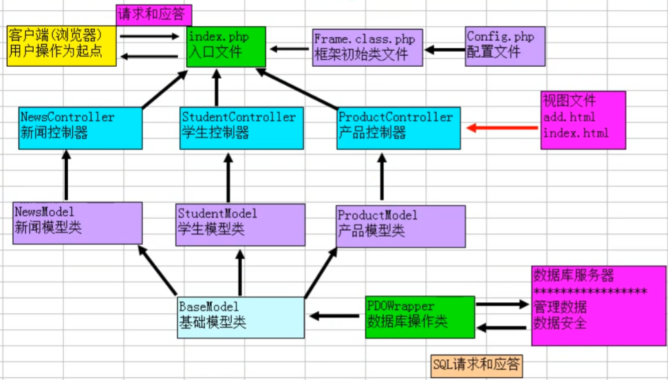
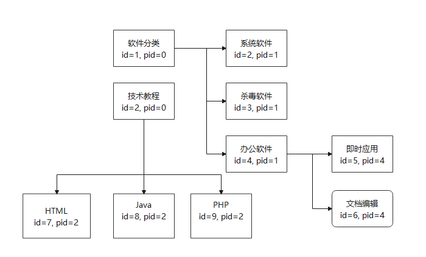
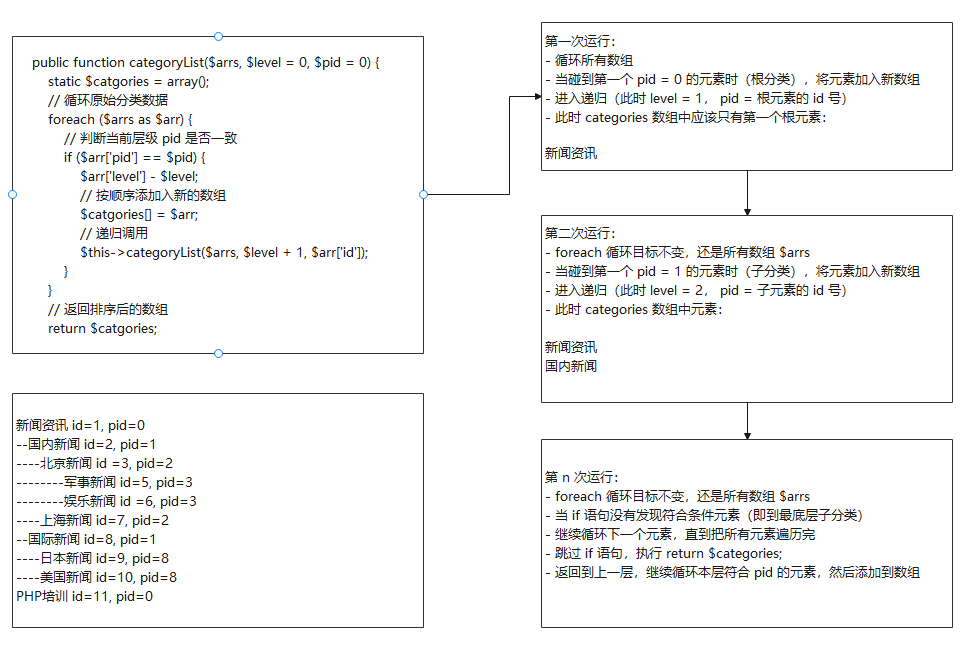

# 项目说明

- 原生程序
  - MVC 自定义框架
  - 自定义 GD 库验证码
  - 自定义 mysqli 数据库类
  - 自定义 pdo 数据库类
  - smarty 模板引擎


面向对象编程，通过框架实现自动寻找类文件，实现前后端分离。


# MVC 开发流程

- 配置文件 Config.php
- 入口文件 index.php / admin.php
- 框架初始类 Frame.class.php
  - 网页字符集设置
  - 初始化配置文件
  - 初始化路由参数：p、c、a
  - 常用目录常量设置
  - 类的自动加载
  - 请求分发：创建哪个控制器类的对象？调用控制器对象的方法？
    - 在控制器方法中，创建模型对象
    - 在控制器方法中，载入视图文件
- 一个项目由若干功能构成：学生管理、新闻管理、产品管理、用户管理等
- 每个功能都由 M、V、C 三个模块构成
- 每个功能，对应一个控制器类，例如：StudentController, NewsController, UserController
- 每个控制器类，对应一个模型类，例如：StudentModel, NewsModel, UserModel
- 每个模型类，对应一个数据表的各种操作，例如：student, news, user
- 每个控制器类，对应若干视图。例如： Student/index.html, Student/add.html, Student/edit.html


# 初始化配置

## 1. 导入数据库表

创建 blog 数据库

~~~mysql
CREATE DATABSE `blog` IF NOT EXISTS CHARACTER SET 'utf8mb4' 
~~~


创建表

~~~
~~~


## 2. 创建目录结构

~~~
| - CMS  项目目录
| ----  Admin 网站后台目录
|		| ---- View  		后台视图
|		| ---- Model  		后台模型
|		| ---- Controller	后台控制器
|		| ---- Conf			后台配置文件  
| ----  Home  网站前台目录
|		| ---- View  		前台视图
|		| ---- Model  		前台模型
|		| ---- Controller	前台控制器
|		| ---- Conf			前台配置文件  
| ---- Frame  框架核心目录
|		| ---- Libs			核心类文件目录
|		| ---- Vendor		第三方类文件目录  
| ---- Public  公共资源目录
|		| ---- Home			前台资源文件（Images/Js/css）
|		| ---- Admin		后台资源文件
| ---- Uploads 上传文件目录
| ---- index.php			前台入口文件
| ---- admin.php			后台入口文件
~~~


# 前台初始化

## 1. 配置文件

创建数据库配置文件，return 一个数组，当其他文件 require 时，可以直接将数组赋值给其他变量

home/conf/config.php

~~~php
<?php

return array(
    // 数据库配置
    'db_type' => 'mysql',
    'db_host' => 'localhost',
    'db_port' => '3306',
    'db_user' => 'root',
    'db_pass' => '',
    'db_name' => 'blog',
    'charset' => 'utf8mb4',

    // 前端默认配置
    'default_platform' => 'Home',       // 默认APP应用名称
    'default_controller' => 'Index',    // 默认控制器名称
    'default_action' => 'index',        // 默认方法名称
);

~~~


## 2. 入口文件

定义 Home 模块入口文件 index.php

- 定义目录常量
- 包含框架初始化类文件
- 初始化框架


~~~php
<?php

// 定义常量
define("DS", DIRECTORY_SEPARATOR);  // 目录分隔符
define('ROOT_PATH', getcwd() . DS);  // 网站根目录
define("APP_PATH", ROOT_PATH .  "Home" . DS);  // APP目录

// 包含框架初始类文件
require_once(ROOT_PATH . "Frame" . DS . "Frame.class.php");

// 框架初始化
\Frame\Frame::run();
~~~


## 3. 框架初始类文件

Home/conf/config.php

~~~php
<?php
// 声明命名空间
namespace Frame;

// 定义最终框架初始类
final class Frame {
    public static function run() {
        self::initCharset();    // 初始化字符集设置
        self::initConfig();     // 初始化配置文件
        self::initRoute();      // 初始化路由参数
        self::initConst();      // 初始化常量目录设置
        self::initAutoLoad();   // 初始化类的自动加载
        self::initDispatch();   // 初始化请求分发
    }

    // 初始化态字符集
    private static function initCharset() {
        header("content-type:text/html;charset=utf-8");
    }

    // 初始化配置文件
    private static function initConfig() {
        // 配置文件路径： ./Home/Conf/Config.php
        $GLOBALS['config'] = require_once(APP_PATH . 'Conf' . DS . 'config.php');
    }

    // 路由初始化
    private static function initRoute() {
        // 不用判断，自动从 config.php 文件判断APP模块
        $p = $GLOBALS['config']['default_platform'];
        $c = $_GET['c'] ?? $GLOBALS['config']['default_controller'];
        // 相当于
        // $c = isset($_GET['c']) ? $_GET['c'] : $GLOBALS['config']['default_controller'];
        $a = $_GET['a'] ?? $GLOBALS['config']['default_action'];

        // 将平台、控制器、方法定义常量
        define('PLAT', $p);
        define('CONTROLLER', $c);
        define('ACTION', $a);
    }

    // 目录常量设置
    private static function initConst() {
        // ./Home/View/Student/add.html
        define("VIEW_PATH", APP_PATH . "View" . DS . CONTROLLER . DS);
    }

    // 静态类的自动加载
    private static function initAutoLoad() {
        // 当初始化类不存在时，自动加载类文件
        spl_autoload_register(function ($classname) {
            // 创建实例的方式 new \Home\Controller\User()
            // 需要引入类文件 require(./Home/Controller/User.class.php)
            // 通过类名转换成为路径

            // 普通创建类方法，因为类的实例化和定义都在同一个文件，不用加命名空间
            // $u = new User();

            // 通过命名空间加载类，需要引入对应文件，同时实例化时需要加上命名空间
            // require('./Home/Controller/User.class.php');
            // $u = new \Home\Controller\User();

            // $classname 就是传过来的类名：\Home\Controller\User
            // 转换成 ./Home/Controller/User.class.php
            $filename = ROOT_PATH . DS . str_replace('\\', DS, $classname) . '.class.php';
            if (file_exists($filename)) {
                require_once($filename);
            }
        });
    }

    // 初始化请求分发
    private static function initDispatch() {
        // http://www.example.com/index?p=Home&c=user&a=index
        // \Home\Controller\UserControoler
        $className = "\\" . PLAT . "\\" . "Controller" . "\\" . CONTROLLER . "Controller";

        // 实例化类，并调用路径中传过来的方法
        $controllerObj = new $className();
        $actionName = ACTION;
        $controllerObj->$actionName();
    }
}

~~~


### 3.1 类文件自动加载

关于类的自动加载，稍作说明：

1. 普通类加载，类定义在当前文件

~~~php
class User{}
$u = new User;
~~~


2. 类定义在其他文件中，需要引入才可以加载

~~~php
<?php
require('./Home/Controller/User.class.php');
$u = new User;
~~~


3. 类文件中定义了命名空间，加载时需要携带命名空间

/Home/Controller/User.class.php

~~~php
<?php

namespace Home\Controller;

class User {
}

~~~


使用类文件

~~~php
<?php
require('./Home/Controller/User.class.php');
$u = new \Home\Controller\User;
~~~


**spl_autoload_register()**

当实例化类时，如果没有在当前文件找到类定义，会自动触发 `spl_autoload_register(function($classname){ // })`，其中 $classname 参数为类名

- new User()，$classname 即为 User
- new \Home\Controller\User，$classname 即为 \Home\Controller\User


~~~php
spl_autoload_register(function ($classname) {
    // 将命名空间类转换成文件地址
    // \Home\Controller\User	->	./Home/Controller/User.class.php
    $filename = ROOT_PATH . DS . str_replace('\\', DS, $classname) . '.class.php';
    // 判断如果文件存在，那么就加载
    if (file_exists($filename)) {
        require_once($filename);
    }
}
~~~


### 3.2 请求分发

通过访问请求路径来判断调用哪个控制器，执行控制器中的哪个方法


如：

~~~
http://www.example.com/index.php?p=Home&c=user&a=index
~~~


那么就需要调用 \Home\Controller\UserController 类，通过拼接字符串拿到命名空间

~~~php
$className = "\\" . PLAT . "\\" . "Controller" . "\\" . CONTROLLER . "Controller";
~~~


然后进行类实例化并调用类中的方法 index

~~~php
// 实例化类时，会根据命名空间自动调用类加载 initAutoLoad() 引入类文件
$controllerObj = new $className();
$actionName = ACTION;
$controllerObj->$actionName();
~~~

> 常量不能当做函数使用如 ACTION(); ，需要将值赋给变量再进行调用


## 4. 测试 IndexController

Home/Controller/IndexController.class.php

~~~php
<?php

namespace Home\Controller;

final class IndexController {
    public function index() {
        echo 'OK';
    }
}
~~~


访问主页：

~~~
http://www.example.com/index.php
// 相当于访问
http://www.example.com/index.php?p=Home&c=Index&a=index
~~~


执行过程：

- 通过 index.php 入口文件初始化
- 通过框架文件拿到 config，得到 p、c、a 的默认值
- 通过框架文件调用 IndexController 控制器中的 index 方法
- 输出 OK


## 5. 数据库输出数据

### 1. 创建 Db 单例封装类

~~~php
<?php
// 需要引入命名空间
namespace Frame\Libs;

class Db {

    private $db_host;
    private $db_user;
    private $db_pass;
    private $db_name;
    private $db_port;
    private $charset;
    private $link;

    private static $instance;
    private function __construct($params) {
        // 调用初始化函数
        $this->initParam($params);
        // 调用数据库连接函数
        $this->connectDB();
    }
    private function __clone() {
    }

    // 初始化传入参数
    public static function getInstance($params = array()) {
        if (!self::$instance instanceof self) {
            self::$instance = new self($params);
        }
        return self::$instance;
    }

    // 初始化数据库参数
    private function initParam($params) {
        $this->db_host = $params['db_host'] ?? 'localhost';
        $this->db_user = $params['db_user'] ?? 'root';
        $this->db_pass = $params['db_pass'] ?? 'root';
        $this->db_name = $params['db_name'] ?? 'data';
        $this->db_port = $params['db_port'] ?? '3306';
        $this->charset = $params['charset'] ?? 'utf8mb4';
    }

    // 连接数据库函数
    private function connectDB() {
        $this->link = mysqli_connect($this->db_host, $this->db_user, $this->db_pass, $this->db_name, $this->db_port);
        if (mysqli_connect_error()) {
            echo "数据库连接错误<br/>";
            echo "数据库错误编号：" . mysqli_connect_errno() . "<br/>";
            echo "数据库错误信息：" . mysqli_connect_error() . "<br/>";
            exit();
        }
        mysqli_set_charset($this->link, $this->charset);
    }

    // 执行 SQL 语句
    private function execute($sql) {
        if (!$res = mysqli_query($this->link, $sql)) {
            echo 'SQL语句执行失败<br>';
            echo '错误信息：' . mysqli_error($this->link), '<br>';
            echo '错误码：' . mysqli_errno($this->link), '<br>';
            echo '错误的SQL语句：' . $sql, '<br>';
            exit;
        }
        return $res;
    }

    // 执行增删改语句（验证SQL+调用执行方法）
    public function exec($sql) {
        $keywords = strstr($sql, ' ', 1);
        if (in_array(strtolower($keywords), ['update', 'insert', 'delete'])) {
            return $this->execute($sql);
        } else {
            echo "非法访问";
            exit();
        }
    }

    // 获取最新id编号
    public function getLastInsertId() {
        return mysqli_insert_id($this->link);
    }

    // 执行查询语句（验证SQL语句 + 调用执行方法）
    private function query($sql) {
        $keywords = strstr($sql, ' ', 1);
        if (in_array(strtolower($keywords), ['select', 'show', 'desc'])) {
            return $this->execute($sql);  // 返回的是结果对象（不能显示给用户）
        } else {
            echo "非法访问";
            exit();
        }
    }

    // 对查询语句返回值进行处理，只返回数组信息
    public function fetchAll($sql, $type = 'assoc') {
        $res = $this->query($sql);
        $type = $this->getType($type);
        return mysqli_fetch_all($res, $type);
    }

    //匹配一维数组
    public function fetchRow($sql, $type = 'assoc') {
        $list = $this->fetchAll($sql, $type);
        if (!empty($list))
            return $list[0];
        return array();
    }

    //匹配一行一列
    public function fetchColumn($sql) {
        $list = $this->fetchRow($sql, 'num');
        if (!empty($list))
            return $list[0];
        return null;
    }

    // fetch_all 返回数组种类参数判定
    private function getType($type) {
        switch ($type) {
            case 'num':
                return MYSQLI_NUM;
            case 'both':
                return MYSQLI_BOTH;
            default:
                return MYSQLI_ASSOC;
        }
    }
    // 返回影响记录数
    public function rowCount($sql) {
        $result = $this->query($sql);
        return mysqli_num_rows($result);
    }
}

~~~


### 2. 模型文件

Home\Model\IndexModel.class.php

~~~php
<?php
// 声明命名空间
namespace Home\Model;

// 引入Db类
use \Frame\Libs\Db;

// 定义首页模型
final class IndexModel {
    private $db = null;

    public function __construct() {
        // 将 config.php 中的数据库参数传入创建单例
        $this->db = Db::getInstance($GLOBALS['config']);
    }
    // 获取多行数据
    public function fetchAll() {
        // 构建查询 SQL 语句
        $sql = "SELECT * FROM users ORDER BY id DESC";
        // 执行 SQL 语句，并返回结果
        return $this->db->fetchAll($sql);
    }
}
~~~


### 3. 控制器文件

Home\Controller\IndexController.class.php

~~~php
<?php

namespace Home\Controller;

use \Home\Model\IndexModel;

final class IndexController {
    public function index() {
        $modelObj = new IndexModel();
        $arr = $modelObj->fetchAll();
        // var_dump($arr); 测试数据库是否正常连接，正确返回数据
        // 返回视图文件，默认为方法名.html，或者写死 index.html
        include VIEW_PATH . ACTION . '.html';
    }
}

~~~


### 4. 视图文件

Home\View\Index\index.html

~~~php+HTML
<!DOCTYPE html>
<html lang="en">
  <head>
    <meta charset="UTF-8" />
    <meta http-equiv="X-UA-Compatible" content="IE=edge" />
    <meta name="viewport" content="width=device-width, initial-scale=1.0" />
    <title>Document</title>
  </head>
  <body>
    <?php var_dump($arr);
    foreach ($arr as $key=>$val){
        echo $val['username']."<br/>";
        echo $val['password']."<br/>";
        echo $val['email']."<br/>";
    }
    ?>
  </body>
</html>
~~~


# 后台初始化

## 1. 配置文件

\Adimn\Conf\config.php 

和前台文件一样，只是默认APP名改为 Admin

~~~php
<?php

return array(
    // 数据库配置
    'db_type' => 'mysql',
    'db_host' => 'localhost',
    'db_port' => '3306',
    'db_user' => 'root',
    'db_pass' => '',
    'db_name' => 'blog',
    'charset' => 'utf8mb4',

    // 后端默认配置
    'default_platform' => 'Admin',      // 默认APP应用名称
    'default_controller' => 'Index',    // 默认控制器名称
    'default_action' => 'index',        // 默认方法名称

);
~~~


## 2. 入口文件

\admin.php 后前台文件一样，改下 APP 路径

~~~php
<?php

// 定义常量
define("DS", DIRECTORY_SEPARATOR);  // 目录分隔符
define('ROOT_PATH', getcwd() . DS);  // 网站根目录
define("APP_PATH", ROOT_PATH .  "Admin" . DS);  // APP目录

// 包含框架初始类文件
require_once(ROOT_PATH . "Frame" . DS . "Frame.class.php");

// 框架初始化
\Frame\Frame::run();

~~~


## 3. 后端模型

Admin\Model\IndexModel.class.php

修改命名空间

~~~php
<?php
// 声明命名空间
namespace Admin\Model;

// 引入Db类
use \Frame\Libs\Db;

// 定义首页模型
final class IndexModel {
    private $db = null;

    public function __construct() {
        // 将 config.php 中的数据库参数传入创建单例
        $this->db = Db::getInstance($GLOBALS['config']);
    }
    // 获取多行数据
    public function fetchAll() {
        // 构建查询 SQL 语句
        $sql = "SELECT * FROM users ORDER BY id DESC";
        // 执行 SQL 语句，并返回结果
        return $this->db->fetchAll($sql);
    }
}

~~~


## 4. 后端控制器

Admin\Controller\IndexController.class.php

修改命名空间和模型引用地址

~~~php
<?php

namespace Admin\Controller;

use \Admin\Model\IndexModel;

final class IndexController {
    public function index() {
        $modelObj = new IndexModel();
        $arr = $modelObj->fetchAll();
        // var_dump($arr); 测试数据
        // 返回视图文件
        include VIEW_PATH . ACTION . '.html';
    }
}

~~~


## 5. 后端视图

~~~php+HTML
<!DOCTYPE html>
<html lang="en">
  <head>
    <meta charset="UTF-8" />
    <meta http-equiv="X-UA-Compatible" content="IE=edge" />
    <meta name="viewport" content="width=device-width, initial-scale=1.0" />
    <title>Document</title>
  </head>
  <body>
    <?php var_dump($arr);
    foreach ($arr as $key=>$val){
        echo $val['username']."<br/>";
        echo $val['password']."<br/>";
        echo $val['email']."<br/>";
    }
    ?>
  </body>
</html>

~~~


# 封装 PDO 类

~~~php
<?php

namespace Frame\Vendor;

// 引入 PDO 类
use \PDO;
use \PDOException;

class PDOWrapper {
    private $db_type;   //数据库类别
    private $db_host;   //主机地址
    private $db_port;   //端口号
    private $db_name;   //数据库名
    private $charset;   //字符集
    private $db_user;   //用户名
    private $db_pass;   //密码
    private $pdo;       //保存PDO对象
    private static $instance;

    // 构造函数
    private function __construct($param) {
        $this->initParam($param);
        $this->initPDO();
        $this->initException();
    }

    private function __clone() {
    }

    // 创建单例
    public static function getInstance($param = array()) {
        if (!self::$instance instanceof self)
            self::$instance = new self($param);
        return self::$instance;
    }

    //初始化参数
    private function initParam($param) {
        $this->db_type = $param['db_type'] ?? 'mysql';
        $this->db_host = $param['db_host'] ?? '127.0.0.1';
        $this->db_port = $param['db_port'] ?? '3306';
        $this->db_name = $param['db_name'] ?? 'data';
        $this->charset = $param['charset'] ?? 'utf8mb4';
        $this->db_user = $param['db_user'] ?? 'root';
        $this->db_pass = $param['db_pass'] ?? 'root';
    }

    //初始化PDO
    private function initPDO() {
        try {
            $dsn = "{$this->db_type}:host={$this->db_host};port={$this->db_port};dbname={$this->db_name};charset={$this->charset}";
            $this->pdo = new PDO($dsn, $this->db_user, $this->db_pass);
        } catch (PDOException $ex) {
            $this->showException($ex);
        }
    }

    //显示异常
    private function showException($ex, $sql = '') {
        if ($sql != '') {
            echo 'SQL语句执行失败<br>';
            echo '错误的SQL语句是：' . $sql, '<br>';
        }
        echo '错误编号：' . $ex->getCode(), '<br>';
        echo '错误行号：' . $ex->getLine(), '<br>';
        echo '错误文件：' . $ex->getFile(), '<br>';
        echo '错误信息：' . $ex->getMessage(), '<br>';
        exit;
    }

    //设置异常模式
    private function initException() {
        $this->pdo->setAttribute(PDO::ATTR_ERRMODE, PDO::ERRMODE_EXCEPTION);
    }

    //执行增、删、改操作
    public function exec($sql) {
        try {
            return $this->pdo->exec($sql);
        } catch (PDOException $ex) {
            $this->showException($ex, $sql);
        }
    }

    //获取自动增长的编号
    public function lastInsertId() {
        return $this->pdo->lastInsertId();
    }

    //判断匹配的类型
    private function fetchType($type) {
        switch ($type) {
            case 'num':
                return PDO::FETCH_NUM;
            case 'both':
                return PDO::FETCH_BOTH;
            case 'obj':
                return PDO::FETCH_OBJ;
            default:
                return PDO::FETCH_ASSOC;
        }
    }

    //获取所有数据 ，返回二维数组
    public function fetchAll($sql, $type = 'assoc') {
        try {
            $stmt = $this->pdo->query($sql);  //获取PDOStatement对象
            $type = $this->fetchType($type); //获取匹配方法
            return $stmt->fetchAll($type);
        } catch (PDOException $ex) {
            $this->showException($ex, $sql);
        }
    }

    //获取一维数组
    public function fetchRow($sql, $type = 'assoc') {
        try {
            $stmt = $this->pdo->query($sql);  //获取PDOStatement对象
            $type = $this->fetchType($type); //获取匹配方法
            return $stmt->fetch($type);
        } catch (PDOException $ex) {
            $this->showException($ex, $sql);
        }
    }

    //返回一行一列
    public function fetchColumn($sql) {
        try {
            $stmt = $this->pdo->query($sql);
            return $stmt->fetchColumn();
        } catch (PDOException $ex) {
            $this->showException($ex, $sql);
        }
    }

    // 返回受影响记录数
    public function rowCount($sql) {
        try {
            $stmt = $this->pdo->query($sql);
            return $stmt->rowCount();
        } catch (PDOException $ex) {
            $this->showException($ex, $sql);
        }
    }
}

~~~


## 1. 测试封装类

控制器调用 PDO 类，输出数据库数据

~~~php
<?php

namespace Admin\Controller;

use \Admin\Model\IndexModel;

final class IndexController {
    public function index() {
        $pdo = \Frame\Vendor\PDOWrapper::getInstance($GLOBALS['config']);
        $arr = $pdo->fetchAll("SELECT * FROM users ");
        var_dump($arr);
        // 返回视图文件
        include VIEW_PATH . ACTION . '.html';
    }
}

~~~


视图文件依旧使用 Home 版的

~~~php
<!DOCTYPE html>
<html lang="en">
  <head>
    <meta charset="UTF-8" />
    <meta http-equiv="X-UA-Compatible" content="IE=edge" />
    <meta name="viewport" content="width=device-width, initial-scale=1.0" />
    <title>Document</title>
  </head>
  <body>
    <?php var_dump($arr);
    foreach ($arr as $key=>$val){
        echo $val['username']."<br/>";
        echo $val['password']."<br/>";
        echo $val['email']."<br/>";
    }
    ?>
  </body>
</html>

~~~


测试正常输出，进入下一步


# 基础模型类

因为 PDO 支持更多的数据库，比 mysqli 连接的 DB 类功能强大一些，所以建议使用 PDO 类来作为基础模型类用来操作数据库


## 1. 基础模型类

\Frame\Libs\BaseModel.class.php

~~~php
<?php

namespace Frame\Libs;

use Frame\Vendor\PDOWrapper;

// 基础抽象类
abstract class BaseModel {
    // 静态对象
    protected $pdo;

    public function __construct() {
        $this->pdo = PDOWrapper::getInstance($GLOBALS['config']);
    }
}
~~~

> 个人感觉拿 PDO 类直接做基础模型类就可以


## 2. 模型文件继承

\Admin\Model\IndexModel.class.php

~~~php
<?php
// 声明命名空间
namespace Admin\Model;

// 引入基础类
use \Frame\Libs\BaseModel;

// 定义首页模型
final class IndexModel extends BaseModel {

    // // 获取多行数据
    public function fetchAll() {
        // 构建查询 SQL 语句
        $sql = "SELECT * FROM users ORDER BY id DESC";
        // 执行 SQL 语句，并返回结果
        return $this->pdo->fetchAll($sql);
    }
}
~~~


## 3. 控制器调用

\Admin\Controller\IndexController.class.php

~~~php
<?php

namespace Admin\Controller;

use \Admin\Model\IndexModel;

final class IndexController {
    public function index() {
        $obj = new IndexModel();
        $arr = $obj->fetchAll();
        var_dump($arr);

        // 返回视图文件
        include VIEW_PATH . ACTION . '.html';
    }
}

~~~


## 4. 修改 Home 模块中的模型

~~~php
<?php
// 声明命名空间
namespace Home\Model;

// 引入基础类
use Frame\Libs\BaseModel;

// 定义首页模型
final class IndexModel extends BaseModel {

    // 获取多行数据
    public function fetchAll() {
        // 构建查询 SQL 语句
        $sql = "SELECT * FROM users ORDER BY id DESC";
        // 执行 SQL 语句，并返回结果
        return $this->pdo->fetchAll($sql);
    }
}

~~~


## 5. 基础模型单例修改

~~~php
<?php

namespace Frame\Libs;

use Frame\Vendor\PDOWrapper;

// 基础抽象类
abstract class BaseModel {
    // 子类可能会调用，所以需要继承权限
    protected $pdo;

    // 静态对象存放数组
    private static $arrModelObj = array();

    // 禁止外部或子类调用
    private function __construct() {
        $this->pdo = PDOWrapper::getInstance($GLOBALS['config']);
    }

    public static function getInstance() {
        $modelClassName = get_called_class();
        if (!isset(self::$arrModelObj[$modelClassName])) {
            // 在控制器中，之前创建模型对象使用的是 new IndexModel();
            // 通过 get_called_class() 获得类名
            // new $modelClassName 相当于调用子类中的创建方法 -> 回到 BaseModel 的构造函数 -> 创建存储在静态数组中
            // 如果用 new IndexModel() 来创建类的话，还是相当于两个 obj 
            self::$arrModelObj[$modelClassName] = new $modelClassName();
        }
        return self::$arrModelObj[$modelClassName];
    }
}
~~~


生成单例对象，修改 admin.php 和 index.php 中创建模型类的方法

~~~php
$obj = IndelModel::getInstance();
~~~


# MVC 拓扑




# 封装 Smarty 类

## 1. 封装 Smarty

\Frame\Vendor\Smarty.class.php

~~~php
<?php

namespace Frame\Vendor;

// 包含原始的 Smarty 类
require_once('./Frame/Vendor/Smarty-3.1.39/libs/Smarty.class.php');

// 继承原始类
final class Smarty extends \Smarty {
}

~~~


调用 Smarty 类

~~~php
$smarty = new \Frame\Vendor\Smarty();
~~~


## 2. 加载 Smarty 到基础控制器

\Frame\Libs\BaseController.php

设置基础控制器，将 Smarty 对象放到基础控制器中

~~~php
<?php

namespace Frame\Libs;

abstract class BaseController {
    // 需要在子类使用
    protected $smarty = null;

    public function __construct() {
        $this->initSmarty();
    }

    // Smarty 初始化
    private function initSmarty() {
        $smarty = new \Frame\Vendor\Smarty();
        // $smarty->left_delimiter = '{{';                              // 更改左界定，默认 {
        // $smarty->right_delimiter = '}}';                             // 更改右界定，默认 }     
        $smarty->setTemplateDir(VIEW_PATH);                             // 设置视图文件目录
        // $smarty->setCompileDir(sys_get_temp_dir() . DS . "view" . DS);  // 设置编译目录（系统临时目录）
        $smarty->setCompileDir("./Public/view_c");
        $this->smarty = $smarty;                                        // 将对象赋值给属性
    }
}
~~~


## 3. 子控制器继承父类控制器

\Home\Controller\IndexController.class.php

\Admin\Controller\IndexController.class.php

~~~php
<?php

namespace Home\Controller;

// 引入基类控制器
use Frame\Libs\BaseController;
use \Home\Model\IndexModel;

// 继承
final class IndexController extends BaseController {
    public function index() {
        $modelObj = IndexModel::getInstance();
        $arr = $modelObj->fetchAll();
        include VIEW_PATH . ACTION . '.html';
    }
}

~~~


## 4. 测试 Smarty

\Home\Controller\IndexController.class.php

~~~php
<?php

namespace Home\Controller;

// 引入基类控制器
use Frame\Libs\BaseController;
use \Home\Model\IndexModel;

// 继承
final class IndexController extends BaseController {
    public function index() {
        $modelObj = IndexModel::getInstance();
        $arr = $modelObj->fetchAll();
        // 给视图赋值
        $this->smarty->assign("arr", $arr);
        // 显示视图
        $this->smarty->display("index.html");
    }
}

~~~


对应视图文件需要用 smarty 语法输出数据

\Home\View\Index\index.html

~~~php+HTML
<!DOCTYPE html>
<html lang="en">
  <head>
    <meta charset="UTF-8" />
    <meta http-equiv="X-UA-Compatible" content="IE=edge" />
    <meta name="viewport" content="width=device-width, initial-scale=1.0" />
    <title>Document</title>
  </head>
  <body>

    <{foreach $arr as $key=>$val}>
        <{$val['username']}><br/>
        <{$val['password']}><br/>
        <{$val['email']}><br/>
    <{/foreach}>

  </body>
</html>

~~~


# 完善功能

## 1. 修改 View

修改视图文件，增加修改、删除功能

~~~html
<!DOCTYPE html>
<html lang="en">
  <head>
    <meta charset="UTF-8" />
    <meta http-equiv="X-UA-Compatible" content="IE=edge" />
    <meta name="viewport" content="width=device-width, initial-scale=1.0" />
    <title>Document</title>
  </head>
  <body>
    <script>
      function confirmDel(id){
        if(window.confirm('确定删除')){
          location.href="?c=Index&a=delete&id="+id;
        }
      }
    </script>
    <div style="text-align: center;">
    <table width="600" border="1" align="center">
      <tr>
        <th>id</th>
        <th>用户名</th>
        <th>密码</th>
        <th>邮箱</th>
        <th></th>
        <th></th>
      </tr>

      <{foreach $arr as $key=>$val}>
      <tr>
        <td><{$val['id']}></td>
        <td><{$val['username']}></td>
        <td><{$val['password']}></td>
        <td><{$val['email']}></td>
        <td><a href="javascript:void(0)">修改</a> </td>
        <td><a href="javascript:void(0)" onclick="confirmDel(<{$val['id']}>)">删除</a> </td>
      </tr>
      <{/foreach}>
    </table>
  </div>
  </body>
</html>

~~~


## 2. 控制器添加删除方法

~~~php
public function delete() {
    $id = $_GET['id'];
    $modelObj = IndexModel::getInstance();
    if ($modelObj->delete($id)) {
        // $this 是控制器的实例
        $this->jump("id = {$id} 的记录删除成功", "?c=Index");
    } else {
        $this->jump("id = {$id} 的记录删除失败", "?c=Index");
    }
}
~~~


## 3. 模型添加删除方法

因为控制器中的 delete 和 jump 方法都没有在模型中定义，所以需要在模型中添加对应方法

~~~php
public function delete($id) {
    $sql = "DELETE FROM users WhERE id = {$id}";
    return $this->pdo->exec($sql);
}
~~~


## 4. 添加跳转方法

$this 属于控制器的实例，因为会经常用到，所以定义到基础类控制器中 BaseController.class.php

~~~php
protected function jump($message, $url = '?', $time = 3) {
    echo "<h2>{$message}</h2>";
    header("refresh:{$time};url={$url}");
    die();
}
~~~


# ------------正式开始--------------

# 后台管理

## 1. 后台模板视图文件

- 将后台主页文件放入 Admin/View/Index/index.html
- css, js, images, font 等文件夹放入到 Public 目录中对应后台 Admin 下
- 将 css, js 等路径修复为

```
 ./Public/Admin/css
 ./Public/Admin/js
```


## 2. 布局方式

frame 模式已经不再推荐使用，frame 标签在 HTML5 中已经被放弃


### 2.1 首尾分离模式

header, footer, content 分离模式，header 和 footer 是固定文件，每个内容文件都需要加载 header, footer 

~~~html
<{include file='./header.html'}>
<{include file='./left.html'}>
<div class="layui-body">
        <!-- 内容主体区域 -->
        <div style="padding: 15px">
          内容主体区域。记得修改 layui.css 和 js 的路径
        </div>
      </div>
<{include file='./footer.html'}>
~~~


其中 include 还有可以 assign 赋值，将{include}模板的内容赋值到变量，而并非输出。 与 {assign}操作相似。

```
{include file='./head.html' assign=b}
```


### 2.2 Layout 模式

以 layout 当做模板，将 header, footer 写在 layout 中，通过 layout 加载不同的 main.html


layout.html

~~~
header
{block name=body}{/block}
footer
~~~


main.html

```
{extends file='layout.html'}
{block name=body}
	主体内容
{/block}
```


### 2.3 Frame 模式（不建议使用）

需要使用控制器调用对应方法显示 frame 调用文件，否则会出现路径问题

~~~html
<!DOCTYPE html>
<html lang="en">
<head>
    <meta charset="UTF-8">
    <meta http-equiv="X-UA-Compatible" content="IE=edge">
    <meta name="viewport" content="width=device-width, initial-scale=1.0">
    <title>Document</title>
</head>

<frameset rows="64,*" framespacing="0" frameborder="1" border="false" scrolling="yes" id="frametop">
    <frame src="?c=Index&a=top" name="top", scrolling="No" noresize="noresizie" />
    <frameset framespacing="0" border="false" cols="182,10,*" framborder="0" id="frameb" scrolling="yes">
        <frame src="?c=Index&a=left" name="left" scrolling="auto" noresize="noresize"/>
        <frame src="?c=Index&a=center" name="center" scrolling="auto" noresize="noresize"/>
        <frame src="?c=Index&a=main" name="main"/>
    </frameset>
</frameset>

<noframes>
    <body>
    你的浏览器版本过低！IE5及以上版本才能使用！
    </body>
</noframes>


</html>
~~~


- Frame 标签被H5弃用
- Frame 对每个页面都发送请求，影响性能


## 3. 控制器调用模板

~~~php
<?php

namespace Admin\Controller;

use \Admin\Model\IndexModel;
use Frame\Libs\BaseController;

final class IndexController extends BaseController {
    public function index() {
        $this->smarty->display('main.html');
    }
}

~~~


## 4. 创建 User 表

| 字段            | 类型        | 空       | 默认值 | 说明                         |
| --------------- | ----------- | -------- | ------ | ---------------------------- |
| id              | int         |          | 无     | 主键、自增                   |
| username        | varchar(20) |          |        | 用户名                       |
| password        | char(32)    |          |        | 32位MD5加密                  |
| nickname        | varchar(16) |          |        | 昵称                         |
| tel             | varchar(16) |          |        |                              |
| last_login_ip   | char(15)    | 允许为空 | NULL   |                              |
| last_login_time | int(10)     | 允许为空 | NULL   |                              |
| login_times     | int(11)     |          | 0      |                              |
| status          | smallint(1) |          | 1      | 账号状态，1禁止，0正常       |
| role            | tinyint(1)  |          | 0      | 用户权限，1管理员，0普通用户 |
| addate          | int(10)     |          |        | 注册事件                     |


SQL 语句

~~~mysql
CREATE TABLE IF NOT EXISTS `users` (
`id` int(10) NOT NULL AUTO_INCREMENT PRIMARY KEY,
`username` VARCHAR(30) NOT NULL,
`password` CHAR(32) NOT NULL,
`nickname` VARCHAR(16) NOT NULL,
`tel` VARCHAR(16) NOT NULL,
`email` VARCHAR(30) NOT NULL,
`last_login_ip` CHAR(15) DEFAULT NULL,
`last_login_time` INT(10) DEFAULT NULL,
`login_times` INT(11) NOT NULL DEFAULT 0,
`status` SMALLINT(1) NOT NULL DEFAULT 1,
`role` TINYINT(1) NOT NULL DEFAULT 0,
`addate` INT(10) NOT NULL
) ENGINE=InnoDB Default Charset=UTF8MB4;
~~~


## 5. 创建 User 视图模板

添加 add.html, edit.html, index.html


add.html

~~~html
<{include file='../Index/header.html'}>
    <{include file='../Index/left.html'}>
        <div class="layui-body">
            <!-- 内容主体区域 -->
            <div style="padding: 15px">
                <blockquote class="layui-elem-quote layui-text">
                    鉴于小伙伴的普遍反馈，先温馨提醒两个常见“问题”：1. <a href="/doc/base/faq.html#form" target="_blank">为什么select/checkbox/radio没显示？</a> 2. <a href="/doc/modules/form.html#render" target="_blank">动态添加的表单元素如何更新？</a>
                </blockquote>            
                <fieldset class="layui-elem-field layui-field-title" style="margin-top: 50px;">
                    <legend>赋值和取值</legend>
                </fieldset>

                <form class="layui-form" action="">
                    <div class="layui-form-item">
                        <label class="layui-form-label">用户名</label>
                        <div class="layui-input-block">
                            <input type="text" name="username" lay-verify="title" autocomplete="off" placeholder="请输入用户名" class="layui-input">
                        </div>
                    </div>
                    <div class="layui-form-item">
                        <label class="layui-form-label">密码框</label>
                        <div class="layui-input-block">
                            <input type="password" name="password" placeholder="请输入密码" autocomplete="off" class="layui-input">
                        </div>
                    </div>
                    <div class="layui-form-item">
                        <label class="layui-form-label">确认密码</label>
                        <div class="layui-input-block">
                            <input type="password" name="confirm_password" placeholder="请确认密码" autocomplete="off" class="layui-input">
                        </div>
                    </div>
                    <div class="layui-form-item">
                        <label class="layui-form-label">昵称</label>
                        <div class="layui-input-block">
                            <input type="text" name="nickname" placeholder="请输入昵称" autocomplete="off" class="layui-input">
                        </div>
                    </div>
                    <div class="layui-form-item">
                        <label class="layui-form-label">电话</label>
                        <div class="layui-input-block">
                            <input type="text" name="tel" placeholder="请输入电话" autocomplete="off" class="layui-input">
                        </div>
                    </div>
                    <div class="layui-form-item">
                        <label class="layui-form-label">邮箱</label>
                        <div class="layui-input-block">
                            <input type="text" name="email" placeholder="请输入邮箱" autocomplete="off" class="layui-input">
                        </div>
                    </div>

                    <div class="layui-form-item">
                        <label class="layui-form-label">用户权限</label>
                        <div class="layui-input-block">
                            <select name="role" lay-filter="aihao">
                                <option value=""></option>
                                <option value="0" selected>普通用户</option>
                                <option value="1">管理员</option>
                            </select>
                        </div>
                    </div>            

                    <div class="layui-form-item">
                        <label class="layui-form-label">是否禁用</label>
                        <div class="layui-input-block">
                            <input type="checkbox" name="status" lay-skin="switch" lay-text="ON|OFF">
                        </div>
                    </div>

                    <div class="layui-form-item">
                        <div class="layui-input-block">
                            <button type="submit" class="layui-btn">立即提交</button>
                        </div>
                    </div>
                </form>                   
            </div>
        </div>       
        <{include file='../Index/footer.html'}>
~~~


edit.html 和 add.html 类似，更改标题即可

index.html 显示用户数据

~~~html
<{include file='../Index/header.html'}> 
<{include file='../Index/left.html'}>
<div class="layui-body">
  <!-- 内容主体区域 -->
  <div style="padding: 15px">
  <table class="layui-table">
    <thead>
      <tr>
        <th>id</th>
        <th>username</th>
        <th>password</th>
        <th>nickname</th>
        <th>tel</th>
        <th>email</th>
        <th>禁用</th>
        <th>权限</th>
        <th>ip</th>
        <th>加入时间</th>
        <th>登录次数</th>
        <th>操作</th>
      </tr>
    </thead>
    <tbody>
      <tr>
        <td>1</td>
        <td>张三</td>
        <td>123456</td>
        <td>法外狂徒</td>
        <td>15855888888</td>
        <td>zs@gmail.com</td>
        <td>已禁用</td>
        <td>普通用户</td>
        <td>127.0.0.1</td>
        <td>2019年12月22日</td>
        <td>123次</td>
        <td>
          <a class="layui-btn layui-btn-xs">编辑</a> <a class="layui-btn layui-btn-danger layui-btn-xs">删除</a>
        </td>
      </tr>
    </tbody>
  </table>
  </div>
<{include file='../Index/footer.html'}>

~~~


## 6. 处理 left.html 中的超链

~~~html
<li class="layui-nav-item layui-nav-itemed">
    <a class="" href="javascript:;">用户管理</a>
    <dl class="layui-nav-child">
        <dd><a href="?c=User&a=index">用户管理</a></dd>
        <dd><a href="?c=User&a=add">添加用户</a></dd>
        
    </dl>
</li>
~~~


## 7. User 控制器

添加 add, edit 显示对应视图文件

~~~php
<?php

namespace Admin\Controller;

use Frame\Libs\BaseController;

final class UserController extends BaseController {
    public function index() {
        $this->smarty->display('index.html');
    }

    public function add() {
        $this->smarty->display('add.html');
    }

    public function edit() {
        $this->smarty->display('edit.html');
    }
}
~~~


## 8. 创建模型对象

Admin\Model\UserModel.class.php

~~~PHP
<?php

namespace Admin\Model;

use \Frame\Libs\BaseModel;

final class UserModel extends BaseModel {

    public function fetchAll() {
        $sql = "SELECT * FROM users ORDER BY id DESC";
        return $this->pdo->fetchAll($sql);
    }
}
~~~


## 9. 在控制器中调用模型

~~~php
<?php

namespace Admin\Controller;

use Frame\Libs\BaseController;
// 调用模型文件
use Admin\Model\UserModel;

final class UserController extends BaseController {
    public function index() {
        // 读取用户数据
        $modelObj = UserModel::getinstance();
        $users = $modelObj->fetchAll();
        // 给 Smarty 模板赋值并展示
        $this->smarty->assign('users', $users);
        $this->smarty->display('index.html');
    }

    public function add() {
        $this->smarty->display('add.html');
    }

    public function edit() {
        $this->smarty->display('edit.html');
    }
}
~~~


## 10. 模板循环

~~~html
<{include file='../Index/header.html'}> 
<{include file='../Index/left.html'}>
<div class="layui-body">
  <!-- 内容主体区域 -->
  <div style="padding: 15px">
  <table class="layui-table">
    <thead>
      <tr>
        <th>id</th>
        <th>username</th>
        <th>password</th>
        <th>nickname</th>
        <th>tel</th>
        <th>email</th>
        <th>禁用</th>
        <th>权限</th>
        <th>ip</th>
        <th>上次登录时间</th>
        <th>登录次数</th>
        <th>注册时间</th>
        <th>操作</th>
      </tr>
    </thead>
    <tbody>
      <{foreach $users as $key=>$val}>
      <tr>
        <td> <{$val['id']}></td>
        <td> <{$val['username']}></td>
        <td> <{$val['password']}></td>
        <td> <{$val['nickname']}></td>
        <td> <{$val['tel']}></td>
        <td> <{$val['email']}></td>
        <td> <{if $val['status']}>禁用<{else}>正常<{/if}></td>
        <td> <{if $val['role']}>管理员<{else}>普通用户<{/if}></td>
        <td> <{$val['last_login_ip']}></td>
        <td> <{$val['last_login_time']|date_format:'%Y-%m-%d %H-%M:%S'}></td>
        <td> <{$val['login_times']}></td>    
        <td> <{$val['addate']|date_format:'%Y-%m-%d %H-%M:%S'}></td>
        <td>
          <a href="?c=User&a=edit&id=<{$val.id}>" class="layui-btn layui-btn-xs">编辑</a> 
          <a href="javascript:void(0);" onclick="confirmDel(<{$val.id}>)" class="layui-btn layui-btn-danger layui-btn-xs">删除</a>
        </td>
      </tr>
      <{/foreach}>
    </tbody>
  </table>
  </div>

  <script>
    function confirmDel(id){
      if(window.confirm('确定删除')){
          location.href="?c=Index&a=delete&id="+id;
        }
      }
  </script>
<{include file='../Index/footer.html'}>

~~~


## 11. 删除用户

所有接口已经做好，只需要添加模型删除方法，并在控制器中调用即可


用户模型 Admin\Model\UserModel.class.php

~~~php
    public function delete($id) {
        $sql = "DELETE FROM {$this->table} WHERE id = {$id}";
        return $this->pdo->exec($sql);
    }
~~~


控制器 Admin\Controller\UserController.class.php 添加 delete 方法

~~~php
public function delete() {
    $id = $_GET['id'];
    $modelObj = UserModel::getInstance();
    if ($modelObj->delete($id)) {
        $this->jump("id = {$id} 的记录删除成功", "?c=User");
    } else {
        $this->jump("id = {$id} 的记录删除失败", "?c=User");
    }
}
~~~


## 12. 添加用户

add.html 添加提交方式，并且指定提交地址

~~~html
<form class="layui-form" action="?c=User&a=insert" method="POST">
~~~


控制器添加插入方法

~~~php
    public function insert() {
        $data['username'] = $_POST['username'];
        $data['password'] = md5($_POST['password']);
        $data['nickname'] = $_POST['nickname'];
        $data['tel'] = $_POST['tel'];
        $data['email'] = $_POST['email'];
        $data['role'] = $_POST['role'];
        $data['status'] = !empty($_POST['status']) ? 1 : 0;
        $data['addate'] = time();

        // 判断两次输入密码是否一致
        if ($data['password'] != md5($_POST['confirm_password'])) {
            $this->jump('两次输入账号密码不一致', '?c=User&a=add', 3);
        }

        $modelObj = UserModel::getInstance();

        // 判断用户名的唯一性
        if ($modelObj->rowCount("username='{$data['username']}'")) {
            $this->jump("用户名已经存在", '?c=User&a=add');
        }

        // 写入数据(要保证数据的绝对安全)
        if ($modelObj->insert($data)) {
            $this->jump("记录添加成功", "?c=User");
        } else {
            $this->jump("记录添加失败", "?c=User");
        }
    }
~~~


除了验证密码，用户唯一性，还需要注意对数据的二次验证（前台 js 验证 + 后台 php 验证）如：

- 是否有非法字符（转换实体）
- 是否为空（空字符串）
- 是否超出字符限制
- 是否格式正确


模型添加 rowCount 方法和 insert 方法

~~~php
public function rowCount($where = '1=1') {
    $sql = "SELECT * FROM {$this->table} WHERE {$where}";
    return $this->pdo->rowCount($sql);

}

public function insert($data) {
    // 构建字段名和值的字符串
    $fields = "";
    $values = "";
    foreach ($data as $key => $vals) {
        // 字段名加反引号，逗号分隔
        $fields .= "`$key`,";
        // 值加引号，逗号分隔
        $values .= "'$vals',";
    }

    // 去除末尾的逗号
    $fields = rtrim($fields, ",");
    $values = rtrim($values, ",");

    // 插入 SQL 语句
    $sql = "INSERT INTO {$this->table}($fields) VALUES($values)";
    return $this->pdo->exec($sql);
}
~~~


## 13. 编辑用户

User 控制器根据获取链接传递过来的 id，获取数据库内用户信息，将值传递给视图，并展示视图

~~~php
    public function edit() {
        $id = $_GET['id'];
        $modelObj = UserModel::getInstance();
        $user = $modelObj->fetchRow("id='$id'");
        $this->smarty->assign("user", $user);
        $this->smarty->display('edit.html');
    }
~~~


fetchRow 获取一条数据模型方法 

~~~php
    public function fetchRow($where = '1=1') {
        $sql = "SELECT * FROM {$this->table} WHERE {$where} LIMIT 1";
        return $this->pdo->fetchRow($sql);
    }
~~~


视图 Smarty 展示数据

~~~html
<{include file='../Index/header.html'}>
<{include file='../Index/left.html'}>
<div class="layui-body">
    <!-- 内容主体区域 -->
    <div style="padding: 15px">
        <blockquote class="layui-elem-quote layui-text">
            鉴于小伙伴的普遍反馈，先温馨提醒两个常见“问题”：1. <a href="/doc/base/faq.html#form" target="_blank">为什么select/checkbox/radio没显示？</a> 2. <a href="/doc/modules/form.html#render" target="_blank">动态添加的表单元素如何更新？</a>
          </blockquote>            
          <fieldset class="layui-elem-field layui-field-title" style="margin-top: 50px;">
            <legend>赋值和取值</legend>
          </fieldset>
           
          <form class="layui-form" action="?c=User&a=insert" method="POST">
            <div class="layui-form-item">
              <label class="layui-form-label">用户名</label>
              <div class="layui-input-block">
                <input type="text" name="username" lay-verify="title" autocomplete="off" placeholder="请输入用户名" class="layui-input" value="<{$user['username']}>"  >
              </div>
            </div>
            <div class="layui-form-item">
              <label class="layui-form-label">原始密码</label>
              <div class="layui-input-block">
                <input type="password" name="password" placeholder="请输入原始密码" autocomplete="off" class="layui-input" value="<{$user['password']}>" >
              </div>
            </div>
            <div class="layui-form-item">
              <label class="layui-form-label">确认密码</label>
              <div class="layui-input-block">
                <input type="password" name="confirm_password" placeholder="请确认密码" autocomplete="off" class="layui-input">
              </div>
            </div>
            <div class="layui-form-item">
                <label class="layui-form-label">昵称</label>
                <div class="layui-input-block">
                  <input type="text" name="nickname" placeholder="请输入昵称" autocomplete="off" class="layui-input" value="<{$user['nickname']}>">
                </div>
            </div>
            <div class="layui-form-item">
              <label class="layui-form-label">电话</label>
              <div class="layui-input-block">
                <input type="text" name="tel" placeholder="请输入电话" autocomplete="off" class="layui-input" value="<{$user['tel']}>">
              </div>
          </div>
            <div class="layui-form-item">
                <label class="layui-form-label">邮箱</label>
                <div class="layui-input-block">
                  <input type="text" name="email" placeholder="请输入邮箱" autocomplete="off" class="layui-input" value="<{$user['email']}>">
                </div>
            </div>
            
            <div class="layui-form-item">
              <label class="layui-form-label">用户权限</label>
              <div class="layui-input-block">
                <select name="role" lay-filter="aihao">
                  <option value=""></option>
                  <{if $user['role'] == 0}>
                  <option value="0" selected>普通用户</option>
                  <option value="1">管理员</option>
                  <{else}>
                  <option value="0">普通用户</option>
                  <option value="1" selected >管理员</option>
                  <{/if}>
                </select>
              </div>
            </div>            
            
            <div class="layui-form-item">
              <label class="layui-form-label">是否禁用</label>
              <div class="layui-input-block">
                <input type="checkbox" name="status" <{if $user['status']}> checked <{/if}> lay-skin="switch" lay-text="ON|OFF" >
              </div>
            </div>
            <div class="layui-form-item">
              <div class="layui-input-block">
                <button type="submit" class="layui-btn">立即提交</button>
              </div>
            </div>
          </form>                   
    </div>
  </div>       
<{include file='../Index/footer.html'}>
~~~


User 控制器添加更新方法

~~~php
    public function update() {
        $id = $_POST['id'];
        $data['username'] = $_POST['username'];
        $data['nickname'] = $_POST['nickname'];
        $data['tel'] = $_POST['tel'];
        $data['email'] = $_POST['email'];
        $data['role'] = $_POST['role'];
        $data['status'] = !empty($_POST['status']) ? 1 : 0;


        // 判断密码是否为空
        if (!empty($_POST['password']) && !empty($_POST['confirm_password'])) {
            // 判断两次密码是否一致
            if ($_POST['password'] == md5($_POST['confirm_password'])) {
                $data['password'] = md5($_POST['confirm_password']);
            } else {
                $this->jump('数据更新出错', '?c=User');
            }
        } else {
            $this->jump('数据更新出错', '?c=User');
        }

        // 更新数据
        $modelObj = UserModel::getInstance();
        if ($modelObj->update($data, $id)) {
            $this->jump('数据更新成功', '?c=User');
        } else {
            $this->jump('数据更新出错', '?c=User');
        }
    }
~~~


将表单提交地址改为 update 提交方法

~~~html
<form class="layui-form" action="?c=User&a=update" method="POST">
~~~


添加隐藏 id 字段

~~~html
<input type="hidden" name="id" value="<{$user['id']}>">
~~~


模型添加 update 方法

~~~php
public function update($data, $id) {
    $set = "";
    foreach ($data as $key => $vals) {
        $set .= "`$key` = '$vals',";
    }

    $set = rtrim($set, ',');
    $sql = "UPDATE {$this->table} SET {$set} WHERE id = '$id'";
    return $this->pdo->exec($sql);
}
~~~


# 完善 jump 方法

## 1. jump 页面

~~~html
<!DOCTYPE html>
<html lang="en">
  <head>
    <meta charset="UTF-8" />
    <meta http-equiv="X-UA-Compatible" content="IE=edge" />
    <meta name="viewport" content="width=device-width, initial-scale=1.0" />
    <title>Document</title>
    <style>
      * {
        margin: 0px;
        padding: 0px;
      }
      .box{
          width: 450px;
          border: 1px solid #f0f0f0;
          background: #FFFFCC;
          margin:100px auto;
          padding:20px;
          font-size:14px;
          line-height:180%;
          color:#444;
      }

      h2{ margin-bottom:10px;}
      #time{color:#ff0000;}
      a:link, a:visited {
          color: #0099ff;
          text-decoration: none;
      }
      a:hover{
          color:#ff0000;
          text-decoration: underline;
      }
    </style>
  </head>
  <body>
    <div class="box">
      <h2 align="center">操作提示</h2>
      <p><em>提示：<{$message}></em></p>
      <p>
        系统将在
        <span id="time"><{$time}></span> 秒钟后自动跳转，如不想等待，请点击<a href="<{$url}>">这里</a>跳转。
      </p>
    </div>
  </body>
</html>
<script>
  function playSec(num) {
    time.innerHTML = num;
    if (--num > 0) {
      setTimeout("playSec(" + num + ")", 1000);
    } else {
      location.href = "<{$url}>";
    }
  }
  playSec(<{$time}>);
</script>

~~~


## 2. 公共视图

- 将 jump 页面放到 View/Public ，作为公共视图文件，以后的 404,500,301 等页面都可以放在此文件夹
- 修改 jump 页面的路径引用
- 修改 jump 页面中的 message、url、time 三个变量为 smarty 模板语法


## 3. 修改视图路径常量

Frame.class.php

~~~php
define("VIEW_PATH", APP_PATH . "View" . DS);
~~~


## 4. 修改跳转方法

BaseController.class.php

~~~php
protected function jump($message, $url = '?', $time = 3) {
    $this->smarty->assign("message", $message);
    $this->smarty->assign("url", $url);
    $this->smarty->assign("time", $time);
    $this->smarty->display("Public/jump.html");
    die();
}
~~~


## 5. 最后发现，特么直接改路径最省事

~~~php
protected function jump($message, $url = '?', $time = 3) {
    $this->smarty->assign("message", $message);
    $this->smarty->assign("url", $url);
    $this->smarty->assign("time", $time);
    // 改上调用一级目录即可
    $this->smarty->display("../Public/jump.html");
    die();
}
~~~


# 后台用户登录

## 1. login.html

将 login.html 放到 View\User\ 路径中，并且修改资源路径

~~~html
<!DOCTYPE html>
<html lang="en">
    <head>
        <meta charset="UTF-8">
        <meta name="viewport" content="width=device-width, initial-scale=1, maximum-scale=1">
        <title>login</title>
        <link rel="stylesheet" href="./Public/Admin/css/layui.css">
        <style>
            body{
                background-image: url("./Public/Admin/img/bg.jpg");
                background-position: center center;
                background-size: cover;
                background-repeat: no-repeat;
                background-attachment: fixed;
            }
            .loginForm{
                width: 350px;
                height: 300px;
                background-color: white;
                padding: 30px 20px;
                margin-top: 50%;
                border-radius: 5px;
                box-shadow: 0 0 5px black;
                box-sizing: border-box;
            }
        </style>
    </head>
    <body>
        <div class="layui-container">
            <div class="layui-row">
                <div class="layui-col-md4 layui-col-md-offset4">
                    <div class="loginForm">
                        <h2 align="center">管理后台</h2>
                        <form id="form" class="layui-form">
                            <div class="layui-form-item">
                                <label>用户名:</label>
                                <div class="layui-form-block">
                                    <input type="text" id="username" name="username" required lay-verify="required"
                                           placeholder="请输入用户名" class="layui-input">
                                </div>
                            </div>

                            <div class="layui-form-item">
                                <label>密码:</label>
                                <div class="layui-form-block">
                                    <input type="password" id="password" name="password" required lay-verify="required"
                                           placeholder="请输入密码" class="layui-input">
                                </div>
                            </div>

                            <div class="layui-form-item">
                                <div class="layui-form-block">
                                    <button class="layui-btn" lay-submit lay-filter="loginForm">登录</button>
                                </div>
                            </div>
                        </form>
                    </div>
                </div>
            </div>
        </div>
        <script>
            var username = document.querySelector('#username');
            var password = document.querySelector('#password');
            window.onload = function(){
                if(username.value == ""){
                    username.focus();
                } else {
                    username.select();
                }
            }
        </script>
    </body>
</html>
~~~


## 2. 控制器显示模板

~~~php
public function login() {
    $this->smarty->display('login.html');
}
~~~


通过下方地址进行登录

~~~
http://localhost/admin.php?c=User&a=login
~~~


## 3. 登录流程

1. 前端 JS 验证
2. 判断表单来源是否合法
3. 获取表单提交值，验证是否是合法内容
4. 判断验证码是否一致
5. 判断用户名是否正确
6. 判断用户名密码是否匹配
7. 更新资料
   1. 最后登录时间
   2. 最后登录IP
   3. 登录次数累加
8. 将用户的状态存入 SESSION（不需要密码）
9. 跳转到后台首页


### 3.1 js 验证

表单添加监听

~~~html
<form id="form" class="layui-form" onsubmit="return checkFrom()">
~~~


添加方法

~~~js
function checkFrom(){
    var pattern = /^[a-zA-Z0-9]{5,15}$/;
    if(!(pattern.test(username.value) && pattern.test(password.value))){
        window.alert('用户名或密码不合法');
        username.focus();
        return false;
    }
}
~~~


### 3.2 loginCheck()

视图页面 POST 提交表单到 loginCheck 方法

~~~html
<form id="form" class="layui-form" action="?c=User&a=loginCheck" method="POST" onsubmit="return checkFrom()">
~~~


User 控制器添加 loginCheck 方法

~~~php

    public function loginCheck() {
        // 获取表单提交值
        $username = $_POST['username'];
        $password = $_POST['password'];
        $captcha = $_POST['captcha'];

        // 判断用户账号密码是否符合规则
        $pattern = '/^[a-zA-Z0-9]{5,15}$/';
        if (!(preg_match($pattern, $username) && preg_match($pattern, $password))) {
            $this->jump('用户名或密码不合法', '?c=User&a=login');
        }

        // 对比数据库是否存在用户
        $password = md5($password);
        $userModel = UserModel::getInstance();
        $user = $userModel->fetchRow("username='$username' and password='$password'");
        if (empty($user)) {
            $this->jump('用户名或密码不正确', '?c=User&a=login');
        }

        // 更新用户资料，登录IP,登录时间，登录总次数
        $data['last_login_ip'] = $_SERVER['REMOTE_ADDR'];
        $data['last_login_time'] = time();
        $data['login_times'] = $user['login_times'] + 1;
        if (!$userModel->update($data, $user['id'])) {
            $this->jump('登陆失败', 'c=User&a=login');
        }

        // 用户信息存入 SESSION
        session_start();
        $_SESSION['uid'] = $user['id'];
        $_SESSION['username'] = $username;
        
        // 跳转到后台
        $this->jump('用户登录成功', "?c=Index&a=index");
    }
~~~


考虑添加验证管理员账户


因为登录状态，几乎每个页面都需要用到 SESSION，所以在框架初始化时，建议自动打开

~~~php
public static function run() {
    self::initCharset();    // 初始化字符集设置
    self::initSession();    // 初始化 SESSION（需要放在分发前边）
    self::initConfig();     // 初始化配置文件
    self::initRoute();      // 初始化路由参数
    self::initConst();      // 初始化常量目录设置
    self::initAutoLoad();   // 初始化类的自动加载
    self::initDispatch();   // 初始化请求分发
}

private static function initSession() {
    session_start();
}
~~~

> 之后控制器就可以把 session_start(); 删了就可以了


# 验证码类

## 1. 字体文件

准备 TTF 字体文件，放入到 Public/Admin/font 中，字体可以直接在 windows/fonts 中找到


## 2. 创建图像验证码类

Frame/Vendor/Captcha.class.php


~~~php
<?php

namespace Frame\Vendor;

final class Captcha {
    private $code;          // 验证码字符串
    private $codeLen;       // 验证码长度
    private $width;
    private $height;
    private $img;           // 图像资源
    private $fontSize;      // 图像大小
    private $fontFile;      // 图像字体文件

    public function __construct($codeLen = 4, $width = 85, $height = 32, $fontSize = 20) {
        $this->codeLen = $codeLen;
        $this->width = $width;
        $this->height = $height;
        $this->fontSize = $fontSize;
        $this->fontFile = realpath('./Public/Admin/font/msyh.ttf');
        $this->code = $this->generateCode();
        $this->img = $this->createImg();
        $this->createBg();
        $this->createText();
        $this->outPut();
    }


    private function generateCode() {
        // 创建字符库
        $all_array = array_merge(range('a', 'z'), range('A', 'Z'), range(0, 9));
        // 移除混淆字符
        $div_array = ['1', 'l', '0', 'o', 'O', 'I'];
        $array = array_diff($all_array, $div_array);
        unset($all_array, $div_array);
        // 随机取4个字符
        $index = array_rand($array, $this->codeLen);
        // 打乱顺序
        shuffle($index);
        // 遍历数组组成字符串
        $code = '';
        foreach ($index as $i) {
            $code .= $array[$i];
        }
        // 将验证码文字保存在 session 中
        $_SESSION['captcha'] = $code;
        return $code;
    }

    private function createImg() {
        return imagecreatetruecolor($this->width, $this->height);
    }

    private function createBg() {
        // 分配背景色
        $color = imagecolorallocate($this->img, mt_rand(0, 255), mt_rand(0, 255), mt_rand(0, 255));
        imagefilledrectangle($this->img, 0, 0, $this->width, $this->height, $color);
    }

    private function createText() {
        $color = imagecolorallocate($this->img, mt_rand(100, 255), mt_rand(100, 255), mt_rand(100, 255));
        imagettftext($this->img, $this->fontSize, 0, 5, 25, $color, $this->fontFile, $this->code);
    }

    private function outPut() {
        // header('content-type:image/gif');
        imagegif($this->img);
        imagedestroy($this->img);
    }

    public function verify($code) {
        return strtoupper($code) == strtoupper($_SESSION['captcha']);
    }
}
~~~


## 3. 用户登录加入验证码

在 login.html 视图文件中添加验证码路径

~~~html
<div class="layui-form-mid layui-word-aux"></div>
~~~


User 控制器添加获取验证码方法

~~~php
public function captcha() {
    $capObj = new \Frame\Vendor\Captcha();
}
~~~


添加 javascript 点击事件，刷新验证码，数据缓存本地，需要添加随机值

~~~html
<div class="layui-form-mid layui-word-aux"></div>
~~~


## 4. 验证码判断

### 4.1 js 前端判断

~~~js
var username = document.querySelector('#username');
var password = document.querySelector('#password');
var captcha = document.querySelector('#captcha');
window.onload = function(){
    if(username.value == ""){
        username.focus();
    } else {
        username.select();
    }
}

正则验证
function checkFrom(){
    var pattern = /^[a-zA-Z0-9]{5,15}$/;
    if(!(pattern.test(username.value) && pattern.test(password.value))){
        window.alert('用户名或密码不合法');
        username.focus();
        return false;
    } else if(captcha.value.length !=4) {
        window.alert('验证码必须4位');
        return false;
    }
}
~~~


### 4.2 后端验证 loginCheck()

验证码不区分大小写

~~~php
// 获取验证码值
$captcha = $_POST['captcha'];

// 判断验证码是否正确
if (strtolower($captcha) != strtolower($_SESSION['captcha'])) {
    $this->jump('验证码不正确', '?c=User&a=login');
}
~~~


# 用户权限

后台所有页面，需要登录才可以访问，需要做后台登陆状态判断，在基础控制器中添加方法

~~~php
protected function denyAccess() {
    if (!isset($_SESSION['username'])) {
        $this->jump('用户必须先登录才能访问', '?c=User&a=login');
    }
}
~~~


针对页面显示，方法，进行 SESSION 的判断

~~~php
public function index() {
    $this->denyAccess();
    $this->smarty->display('index.html');
}
~~~

> 主页控制器 Index，还有 User 控制器中的所有方法，除了 login 页面显示和 loginCheck，几乎所有相关页面展示和操作都需要添加验证


# 用户登出

退出链接

~~~html
<a href="?c=User&a=logout">Sign out</a>
~~~


User 用户控制器添加 logout 方法，清空 SESSION 即可，并将用户的 cookie 清空

~~~php
    public function logout() {
        // 删除 SESSION 数据
        unset($_SESSION['username']);
        unset($_SESSION['uid']);
        session_destroy();

        // 删除 COOKIE 数据
        setcookie(session_name(), false);

        $this->jump('用户退出成功', '?c=User&a=login');
    }
~~~


# 后端首页完善信息

用户名显示：

~~~html
<{$smarty.session.username}>
~~~


用户面板显示：

~~~html
<ul>
    <li>用户名：<{$smarty.session.username}> </li>
    <li>身份过期：<{ini_get("session.gc_maxlifetime")}> </li>
    <li>服务器域名：<{$smarty.server.SERVER_NAME}> </li>
    <li>IP地址：<{$smarty.server.REMOTE_ADDR}> </li>
    <li>登录时间：<{$smarty.now|date_format:'%Y-%m-%d'}> </li>
    <li>PHP环境：<{$smarty.server.SERVER_SOFTWARE}> </li>
</ul>
~~~


# 友情链接模块

## 1. 初始化

- 视图文件 Admin\View\Links\
  - index.html
  - add.html
  - edit.html


index.html

~~~html
<{include file='../Index/header.html'}> 
<{include file='../Index/left.html'}>
<div class="layui-body">
  <!-- 内容主体区域 -->
  <div style="padding: 15px">
  <table class="layui-table">
    <thead>
      <tr>
        <th>序号</th>
        <th>网站名称</th>
        <th>网站链接</th>
        <th>是否隐藏</th>
        <th>添加时间</th>
        <th>操作</th>
      </tr>
    </thead>
    <tbody>
      <tr>
        <td>1</td>
        <td>搜狐</td>
        <td>https://www.sohu.com</td>
        <td>否</td>
        <td>2020年7月11日 20:16:00 </td>
        <td>
          <a href="?c=User&a=edit&id=1" class="layui-btn layui-btn-xs">编辑</a> 
          <a href="javascript:void(0);" onclick="confirmDel(1)" class="layui-btn layui-btn-danger layui-btn-xs">删除</a>
        </td>
      </tr>
    </tbody>
  </table>
  </div>

  <script>
    function confirmDel(id){
      if(window.confirm('确定删除')){
          location.href="?c=User&a=delete&id="+id;
        }
      }
  </script>
<{include file='../Index/footer.html'}>

~~~


add.html / edit.html

~~~html
<{include file='../Index/header.html'}> <{include file='../Index/left.html'}>
<div class="layui-body">
  <!-- 内容主体区域 -->
  <div style="padding: 15px">
    <fieldset class="layui-elem-field layui-field-title" style="margin-top: 50px;">
      <legend>友情链接管理</legend></fieldset>

    <form class="layui-form" action="?c=Links&a=insert" method="POST">
      <div class="layui-form-item">
        <label class="layui-form-label">网站名称</label>
        <div class="layui-input-block">
          <input
            type="text"
            name="siteName"
            lay-verify="title"
            autocomplete="off"
            placeholder="请输入网站名称"
            class="layui-input"
          />
        </div>
      </div>
      <div class="layui-form-item">
        <label class="layui-form-label">网站链接</label>
        <div class="layui-input-block">
          <input
            type="text"
            name="siteUrl"
            placeholder="请输入网站连接"
            autocomplete="off"
            class="layui-input"
          />
        </div>
      </div>
      <div class="layui-form-item">
        <label class="layui-form-label">排序</label>
        <div class="layui-input-block">
          <input
            type="text"
            name="siteOrder"
            placeholder="请确认序号"
            autocomplete="off"
            class="layui-input"
          />
        </div>
      </div>
      <div class="layui-form-item">
        <label class="layui-form-label">是否隐藏</label>
        <div class="layui-input-block">
          <input
            type="checkbox"
            name="ishidden"
            lay-skin="switch"
            lay-text="ON|OFF"
          />
        </div>
      </div>

      <div class="layui-form-item">
        <div class="layui-input-block">
          <button type="submit" class="layui-btn">立即提交</button>
        </div>
      </div>
    </form>
  </div>
</div>
<{include file='../Index/footer.html'}>

~~~


- 控制器 Admin\Controller\LinksController.class.php

~~~php
<?php

namespace Admin\Controller;

use Frame\Libs\BaseController;

final class LinksController extends BaseController {
    public function index() {
        $this->denyAccess();
        $this->smarty->display('index.html');
    }

    public function add() {
        $this->denyAccess();
        $this->smarty->display('add.html');
    }

    public function edit() {
        $this->denyAccess();
        $this->smarty->display('edit.html');
    }
}
~~~


- 模型 Admin\Model\LinksModel.class.php

~~~php
<?php

namespace Admin\Model;

use Frame\Libs\BaseModel;

final class LinksModel extends BaseModel {
}

~~~


- 左侧边连链接

~~~html
<li class="layui-nav-item">
    <a href="javascript:;">友情链接</a>
    <dl class="layui-nav-child">
        <dd><a href="?c=Links&a=index">链接管理</a></dd>
        <dd><a href="?c=Links&a=add">添加链接</a></dd>
    </dl>
</li>
~~~


## 2. 创建 Links 表

~~~mysql
CREATE TABLE IF NOT EXISTS links` ( 
    `id` INT NOT NULL AUTO_INCREMENT PRIM,
    `sitename` VARCHAR(20) NOT NULL , 
    `siteurl` VARCHAR(50) NOT NULL , 
    `orderby` TINYINT(4) NOT NULL DEFAULT 0, 
    `ishidden` TINYINT(4) NOT NULL DEFAULT 0) ENGINE = InnoDB;
~~~


## 3. 创建模型

~~~php
<?php

namespace Admin\Model;

use Frame\Libs\BaseModel;

final class LinksModel extends BaseModel {

    private $table = 'links';

    public function fetchAll() {
        $sql = "SELECT * FROM {$this->table}";
        return $this->pdo->fetchAll($sql);
    }
}

~~~


## 4. index.html 显示数据

控制器获取数据

~~~php
public function index() {
    $this->denyAccess();
    $linksObj = LinksModel::getInstance();
    $links = $linksObj->fetchAll();
    $this->smarty->assign("links", $links);
    $this->smarty->display('index.html');
}
~~~


index.html 视图文件

~~~html
<{include file='../Index/header.html'}> 
<{include file='../Index/left.html'}>
<div class="layui-body">
  <!-- 内容主体区域 -->
  <div style="padding: 15px">
  <table class="layui-table">
    <thead>
      <tr>
        <th>序号</th>
        <th>网站名称</th>
        <th>网站链接</th>
        <th>是否隐藏</th>
        <th>添加时间</th>
        <th>排序</th>
        <th>操作</th>
      </tr>
    </thead>
    <tbody>
      <{foreach $links as $key=>$val}>
      <tr>
        <td><{$val['id']}></td>
        <td><{$val['sitename']}></td>
        <td><{$val['siteurl']}></td>
        <td><{$val['ishidden']}></td>
        <td><{$val['createtime']|date_format:"%Y-%m-%d %H:%M:%S"}></td>
        <td><{$val['orderby']}></td>
        <td>
          <a href="?c=Links&a=edit&id=1<{$val['id']}>" class="layui-btn layui-btn-xs">编辑</a> 
          <a href="javascript:void(0);" onclick="confirmDel(<{$val.id}>)" class="layui-btn layui-btn-danger layui-btn-xs">删除</a>
        </td>
      </tr>
      <{/foreach}>
    </tbody>
  </table>
  </div>

  <script>
    function confirmDel(id){
      if(window.confirm('确定删除')){
          location.href="?c=Links&a=delete&id="+id;
        }
      }
  </script>
<{include file='../Index/footer.html'}>

~~~


## 5. 添加链接

控制器获取数据，调用数据模型插入数据，成功进行跳转，失败给出提示

~~~php
    public function insert() {
        $this->denyAccess();
        $data['sitename'] = $_POST['siteName'];
        $data['siteurl'] = $_POST['siteUrl'];
        $data['orderby'] = $_POST['siteOrder'];
        $data['ishidden'] = empty($_POST['ishidden']) ? 1 : 0;
        $data['createtime'] = time();
        $linksObj = LinksModel::getInstance();
        if ($linksObj->insert($data)) {
            $this->jump('链接添加成功', '?c=Links');
        } else {
            $this->jump('链接添加失败', '?c=Links');
        }
    }
~~~


模型添加 insert 方法

~~~php
public function insert($data) {
    $fields = '';
    $values = '';
    foreach ($data as $key => $val) {
        $fields .= "`$key`,";
        $values .= "'$val',";
    }
    $fields = rtrim($fields, ",");
    $values = rtrim($values, ",");
    $sql = "INSERT INTO {$this->table} ({$fields}) VALUES ({$values})";
    return $this->pdo->exec($sql);
}
~~~


## 6. 删除链接

控制器添加删除方法

~~~php
public function delete() {
    $this->denyAccess();
    $id = $_GET['id'];
    $linksObj = LinksModel::getInstance();
    if ($linksObj->delete($id)) {
        $this->jump('链接删除成功', '?c=Links');
    } else {
        $this->jump('链接删除失败', '?c=Links');
    }
}
~~~


模型方法

~~~php
public function delete($id) {
    $sql = "DELETE FROM {$this->table} WHERE id={$id}";
    return $this->pdo->exec($sql);
}
~~~


## 7. 编辑链接

### 7.1 显示页面

控制器添加 edit 方法

~~~php
public function edit() {
    $this->denyAccess();
    $id = $_GET['id'];
    $linksObj = LinksModel::getInstance();
    $link = $linksObj->fetchRow($id);
    $this->smarty->assign('link', $link);
    $this->smarty->display('edit.html');
}
~~~


模型添加 fetchRow

~~~php
public function fetchRow($id) {
    $sql = "SELECT * FROM {$this->table} WHERE id={$id} LIMIT 1";
    return $this->pdo->fetchRow($sql);
}
~~~


模板文件

~~~html
<{include file='../Index/header.html'}> <{include file='../Index/left.html'}>
<div class="layui-body">
  <!-- 内容主体区域 -->
  <div style="padding: 15px">
    <fieldset class="layui-elem-field layui-field-title" style="margin-top: 50px;">
      <legend>友情链接管理</legend></fieldset>

    <form class="layui-form" action="?c=Links&a=update" method="POST">
      <div class="layui-form-item">
        <label class="layui-form-label">网站名称</label>
        <div class="layui-input-block">
          <input
            type="text"
            name="siteName"
            value = "<{$link.sitename}>"
            lay-verify="title"
            autocomplete="off"
            placeholder="请输入网站名称"
            class="layui-input"
          />
        </div>
      </div>
      <div class="layui-form-item">
        <label class="layui-form-label">网站链接</label>
        <div class="layui-input-block">
          <input
            type="text"
            name="siteUrl"
            value = "<{$link.siteurl}>"
            placeholder="请输入网站连接"
            autocomplete="off"
            class="layui-input"
          />
        </div>
      </div>
      <div class="layui-form-item">
        <label class="layui-form-label">排序</label>
        <div class="layui-input-block">
          <input
            type="text"
            name="siteOrder"
            value = "<{$link.orderby}>"
            placeholder="请确认序号"
            autocomplete="off"
            class="layui-input"
          />
        </div>
      </div>
      <div class="layui-form-item">
        <label class="layui-form-label">是否隐藏</label>
        <div class="layui-input-block">
          <input
            type="checkbox"
            name="ishidden"
            lay-skin="switch"
            lay-text="ON|OFF"
          />
        </div>
      </div>

      <input type="hidden" name="id" value=<{$link.id}>>

      <div class="layui-form-item">
        <div class="layui-input-block">
          <button type="submit" class="layui-btn">立即提交</button>
        </div>
      </div>
    </form>
  </div>
</div>
<{include file='../Index/footer.html'}>

~~~


### 7.2 更新操作

视图添加 input hidden 标签，将 id 通过 post 传递

~~~html
<input type="hidden" name="id" value=<{$link.id}>>
~~~


并且更改 action 提交页面到 update 方法

~~~html
 <form class="layui-form" action="?c=Links&a=update" method="POST">
~~~


控制器 update 方法

~~~php
    public function update() {
        $this->denyAccess();
        $id = $_POST['id'];
        $data['sitename'] = $_POST['siteName'];
        $data['siteurl'] = $_POST['siteUrl'];
        $data['orderby'] = $_POST['siteOrder'];
        $data['ishidden'] = empty($_POST['ishidden']) ? 1 : 0;
        $linksObj = LinksModel::getInstance();
        if ($linksObj->update($data, $id)) {
            $this->jump('链接更新成功', '?c=Links');
        } else {
            $this->jump('链接更新失败', '?c=Links');
        }
    }
~~~


模型 update 方法

~~~php
    public function update($data, $id) {
        $set = '';
        foreach ($data as $key => $val) {
            $set .= "`$key`='$val',";
        }
        $set = rtrim($set, ',');
        $sql = "UPDATE {$this->table} SET {$set} WHERE id = {$id}";
        return $this->pdo->exec($sql);
    }
~~~


# 将模型公共方法放到基础类

- insert()
- update()
- delete()
- fetchRow()
- fetchAll()
- rowCount()


## 1. 基础模型类

BaseModel.class.php

~~~php
<?php

namespace Frame\Libs;

use Frame\Vendor\PDOWrapper;

// 基础抽象类
abstract class BaseModel {
    // 子类可能会调用，所以需要继承权限
    protected $pdo;

    // 静态对象存放数组
    private static $arrModelObj = array();

    // 禁止外部或子类调用
    private function __construct() {
        $this->pdo = PDOWrapper::getInstance($GLOBALS['config']);
    }

    public static function getInstance() {
        $modelClassName = get_called_class();
        if (!isset(self::$arrModelObj[$modelClassName])) {
            // 在控制器中，之前创建模型对象使用的是 new IndexModel();
            // 通过 get_called_class() 获得类名
            // new $modelClassName 相当于调用子类中的创建方法 -> 回到 BaseModel 的构造函数 -> 创建存储在静态数组中
            // 如果用 new IndexModel() 来创建类的话，还是相当于两个 obj 
            self::$arrModelObj[$modelClassName] = new $modelClassName();
        }
        return self::$arrModelObj[$modelClassName];
    }

    public function fetchAll() {
        $sql = "SELECT * FROM {$this->table} ORDER BY id DESC";
        return $this->pdo->fetchAll($sql);
    }

    public function fetchRow($where = '1=1') {
        $sql = "SELECT * FROM {$this->table} WHERE {$where} LIMIT 1";
        return $this->pdo->fetchRow($sql);
    }

    public function update($data, $id) {
        $set = "";
        foreach ($data as $key => $vals) {
            $set .= "`$key` = '$vals',";
        }

        $set = rtrim($set, ',');
        $sql = "UPDATE {$this->table} SET {$set} WHERE id = '$id'";
        return $this->pdo->exec($sql);
    }

    public function delete($id) {
        $sql = "DELETE FROM {$this->table} WHERE id = {$id}";
        return $this->pdo->exec($sql);
    }

    public function rowCount($where = '1=1') {
        $sql = "SELECT * FROM {$this->table} WHERE {$where}";
        return $this->pdo->rowCount($sql);
    }


    public function insert($data) {
        // 构建字段名和值的字符串
        $fields = "";
        $values = "";
        foreach ($data as $key => $vals) {
            // 字段名加反引号，逗号分隔
            $fields .= "`$key`,";
            // 值加引号，逗号分隔
            $values .= "'$vals',";
        }

        // 去除末尾的逗号
        $fields = rtrim($fields, ",");
        $values = rtrim($values, ",");

        // 插入 SQL 语句
        $sql = "INSERT INTO {$this->table}($fields) VALUES($values)";
        return $this->pdo->exec($sql);
    }
}

~~~


## 2. 子类

由于各个模型都继承自基础模型类，所以也有了这些公共方法，不过需要将 $table 名的权限改为 protected，否则该属性不能在继承中使用。


- 修改 UserModel
- 修改 LinksModel


~~~php
<?php

namespace Admin\Model;

use \Frame\Libs\BaseModel;

final class UserModel extends BaseModel {

    protected $table = 'users';

}
~~~


# 文章分类管理

## 1. 初始化

- 视图文件 Admin\View\Category\
  - index.html
  - add.html
  - edit.html


index.html

~~~html
<{include file='../Index/header.html'}> 
<{include file='../Index/left.html'}>
<div class="layui-body">
  <!-- 内容主体区域 -->
  <div style="padding: 15px">
  <table class="layui-table">
    <thead>
      <tr>
        <th>序号</th>
        <th>分类名称</th>
        <th>排序</th>
        <th>文章数量</th>
        <th>操作</th>
      </tr>
    </thead>
    <tbody>
      <tr>
        <td>1</td>
        <td>科技分类</td>
        <td>0</td>
        <td>200</td>
        <td>
          <a href="?c=Links&a=edit&id=" class="layui-btn layui-btn-xs">编辑</a> 
          <a href="javascript:void(0);" onclick="confirmDel()" class="layui-btn layui-btn-danger layui-btn-xs">删除</a>
        </td>
      </tr>
    </tbody>
  </table>
  </div>

  <script>
    function confirmDel(id){
      if(window.confirm('确定删除')){
          location.href="?c=Links&a=delete&id="+id;
        }
      }
  </script>
<{include file='../Index/footer.html'}>

~~~


add.html / edit.html

~~~html
<{include file='../Index/header.html'}> <{include file='../Index/left.html'}>
<div class="layui-body">
  <!-- 内容主体区域 -->
  <div style="padding: 15px">
    <fieldset class="layui-elem-field layui-field-title" style="margin-top: 50px;">
      <legend>文章分类管理</legend></fieldset>

    <form class="layui-form" action="?c=Category&a=insert" method="POST">
      <div class="layui-form-item">
        <label class="layui-form-label">分类名称</label>
        <div class="layui-input-block">
          <input
            type="text"
            name="catname"
            lay-verify="title"
            autocomplete="off"
            placeholder="请输入网站名称"
            class="layui-input"
          />
        </div>
      </div>
      <div class="layui-form-item">
        <label class="layui-form-label">排序</label>
        <div class="layui-input-block">
          <input
            type="text"
            name="orderby"
            placeholder="请输入网站连接"
            autocomplete="off"
            class="layui-input"
          />
        </div>
      </div>
        <div class="layui-form-item">
          <label class="layui-form-label">行内选择框</label>
          <div class="layui-input-inline">
            <select name="p_cat">
              <option value="">请选择父分类</option>
              <option value="浙江" selected="">科技类</option>
              <option value="你的工号">娱乐类</option>
              <option value="你最喜欢的老师">教育类</option>
            </select>
          </div>
        </div>

      <div class="layui-form-item">
        <div class="layui-input-block">
          <button type="submit" class="layui-btn">立即提交</button>
        </div>
      </div>
    </form>
  </div>
</div>
<{include file='../Index/footer.html'}>

~~~


- 侧边栏链接

~~~html
<li class="layui-nav-item layui-nav-itemed">
    <a class="" href="javascript:;">分类管理</a>
    <dl class="layui-nav-child">
        <dd><a href="?c=Category&a=index">分类管理</a></dd>
        <dd><a href="?c=Category&a=add">添加分类</a></dd>
    </dl>
</li>
~~~


- 控制器

CategoryController.class.php

~~~php
<?php

namespace Admin\Controller;

use Frame\Libs\BaseController;
use Admin\Model\CategoryModel;

final class CategoryController extends BaseController {
    public function index() {
        $this->denyAccess();
        $this->smarty->display("index.html");
    }
}

~~~


- 模型

CategoryModel.class.php

~~~php
<?php

namespace Admin\Model;

use Frame\Libs\BaseModel;

final class CategoryModel extends BaseModel {
    protected $table = 'category';
}

~~~


## 2. 创建表

~~~mysql
CREATE TABLE IF NOT EXISTS `blog`.`category` ( 
    `id` INT(12) NOT NULL AUTO_INCREMENT PRIMARY KEY, 
    `catname` VARCHAR(30) NOT NULL , 
    `orderby` TINYINT(4) NOT NULL DEFAULT '0' , 
    `pid` SMALLINT(6) NOT NULL DEFAULT '0') 
    ENGINE = InnoDB;
~~~


- pid：指定父级id
  - pid为0时，则为根分类
  - pid为1时，则为id为1分类的子分类


无限极分类原理

分类 pid 指向父类 id，则该分类就是指定 id 分类的子分类



## 3. 展示分类

控制器

~~~php
public function index() {
    $this->denyAccess();
    // 获取分类原始数据
    $catgories = CategoryModel::getInstance()->fetchAll();
    $catgories = CategoryModel::getInstance()->categoryList($catgories);
    die;
    $this->smarty->display("index.html");
}
~~~


模型

递归调用方法，将数组按分类顺序排序

~~~php
<?php

namespace Admin\Model;

use Frame\Libs\BaseModel;

final class CategoryModel extends BaseModel {
    protected $table = 'category';

    public function categoryList($arrs, $level = 0, $pid = 0) {
        static $catgories = array();
        // 循环原始分类数据
        foreach ($arrs as $arr) {
            // 判断当前层级 pid 是否一致
            if ($arr['pid'] == $pid) {
                $arr['level'] = $level;
                // 按顺序添加入新的数组
                $catgories[] = $arr;
                // 递归调用
                $this->categoryList($arrs, $level + 1, $arr['id']);
            }
        }
        // 返回排序后的数组
        return $catgories;
    }
}

~~~


递归原理



> return categories; 返回到调用者，而这里是直接递归调用，没有用任何元素接受，所以在递归中的返回是没有任何存储的，直到最后返回给控制器中的调用函数 `$catgories = CategoryModel::getInstance()->categoryList($catgories);` 获得重新排序的数组。


获得最新数据后，在控制器中将数据传递给模板

~~~php
$this->smarty->assign("categories", $catgories);
~~~


模板显示数据

- 循环 categories 数组
- 修改编辑与删除的链接
- 文章数量（需要做联表查询）

~~~html
<{include file='../Index/header.html'}> 
<{include file='../Index/left.html'}>
<div class="layui-body">
  <!-- 内容主体区域 -->
  <div style="padding: 15px">
  <table class="layui-table">
    <thead>
      <tr>
        <th>序号</th>
        <th>分类名称</th>
        <th>排序</th>
        <th>文章数量</th>
        <th>操作</th>
      </tr>
    </thead>
    <tbody>
      <tr>
        <{foreach $categories as $val}>
        <td><{$val.id}></td>
        <td><{$val.catname}></td>
        <td><{$val.orderby}></td>
        <td>350</td>
        <td>
          <a href="?c=Category&a=edit&id=<{$val.id}>" class="layui-btn layui-btn-xs">编辑</a> 
          <a href="javascript:void(0);" onclick="confirmDel(<{$val.id}>)" class="layui-btn layui-btn-danger layui-btn-xs">删除</a>
        </td>
      </tr>
      <{/foreach}>
    </tbody>
  </table>
  </div>

  <script>
    function confirmDel(id){
      if(window.confirm('确定删除')){
          location.href="?c=Category&a=delete&id="+id;
        }
      }
  </script>
<{include file='../Index/footer.html'}>

~~~


添加层级显示

~~~
<td><{str_repeat("----",$val.level*2)}><{$val.catname}></td>
~~~

> 通过 level 等级，添加 ---- 字符串


## 4. 添加文章分类

控制器显示添加分类页面，同时需要获取分类数据，传递给视图

~~~php
public function add() {
    $this->denyAccess();
    // 获取分类数据
    $catgories = CategoryModel::getInstance()->fetchAll();
    $catgories = CategoryModel::getInstance()->categoryList($catgories);
    $this->smarty->assign("categories", $catgories);
    var_dump($catgories);
    $this->smarty->display("add.html");
}
~~~


视图页面

~~~html
<{include file='../Index/header.html'}> <{include file='../Index/left.html'}>
<div class="layui-body">
  <!-- 内容主体区域 -->
  <div style="padding: 15px">
    <fieldset class="layui-elem-field layui-field-title" style="margin-top: 50px;">
      <legend>文章分类管理</legend></fieldset>

    <form class="layui-form" action="?c=Category&a=insert" method="POST">
      <div class="layui-form-item">
        <label class="layui-form-label">分类名称</label>
        <div class="layui-input-block">
          <input
            type="text"
            name="catname"
            lay-verify="title"
            autocomplete="off"
            placeholder="请输入网站名称"
            class="layui-input"
          />
        </div>
      </div>
      <div class="layui-form-item">
        <label class="layui-form-label">排序</label>
        <div class="layui-input-block">
          <input
            type="text"
            name="orderby"
            placeholder="请输入网站连接"
            autocomplete="off"
            class="layui-input"
          />
        </div>
      </div>
        <div class="layui-form-item">
          <label class="layui-form-label">行内选择框</label>
          <div class="layui-input-inline">
            <select name="pid">
              <option value="">请选择父分类</option>
              <option value="0" selected="">无</option>
              <{foreach $categories as $val}>
              <option value="<{$val.id}>">
                <{str_repeat("--",$val.level * 2)}>
                <{$val.catname}></option>
              <{/foreach}>
            </select>
          </div>
        </div>

      <div class="layui-form-item">
        <div class="layui-input-block">
          <button type="submit" class="layui-btn">立即提交</button>
        </div>
      </div>
    </form>
  </div>
</div>
<{include file='../Index/footer.html'}>

~~~


控制器添加 insert 方法插入数据到数据库

~~~php
public function insert() {
    $data['catname'] = $_POST['catname'];
    $data['orderby'] = $_POST['orderby'];
    $data['pid'] = $_POST['pid'];

    $linksObj = CategoryModel::getInstance();
    if ($linksObj->insert($data)) {
        $this->jump('分类数据插入成功', '?c=Category');
    } else {
        $this->jump('分类数据插入失败', '?c=Category');
    }
}
~~~


## 5. 删除分类

考虑分类删除后，关联文章也需要同步删除（关联查询），目前暂时不需要


视图创建连接，js 跳转到删除链接

~~~html
<a href="javascript:void(0);" onclick="confirmDel(<{$val.id}>)" class="layui-btn layui-btn-danger layui-btn-xs">删除</a>

<script>
    function confirmDel(id){
        if(window.confirm('确定删除')){
            location.href="?c=Category&a=delete&id="+id;
        }
    }
</script>
~~~


控制器删除方法

~~~php
// 删除数据
public function delete() {
    $id = $_GET['id'];
    if (CategoryModel::getInstance()->delete($id)) {
        $this->jump('分类数据删除成功', '?c=Category');
    } else {
        $this->jump('分类数据删除失败', '?c=Category');
    }
}
~~~


## 6. 修改分类

### 6.1 显示编辑分类页面

Index.html 视图文件添加入口

~~~html
<a href="?c=Category&a=edit&id=<{$val.id}>" class="layui-btn layui-btn-xs">编辑</a> 
~~~


控制器添加 edit 方法

~~~php
public function edit() {
    $this->denyAccess();
    $id = $_GET['id'];
    $catgory = CategoryModel::getInstance()->fetchRow("id={$id}");
    $this->smarty->assign("category", $catgory);
    $this->smarty->display("edit.html");
}
~~~


edit.html 视图

- 修改提交方法名
- 添加隐藏表单传递 id
- 加载指定 id 的分类信息
- 加载所有分类信息

~~~html
<{include file='../Index/header.html'}> <{include file='../Index/left.html'}>
<div class="layui-body">
  <!-- 内容主体区域 -->
  <div style="padding: 15px">
    <fieldset
      class="layui-elem-field layui-field-title"
      style="margin-top: 50px"
    >
      <legend>文章分类管理</legend>
    </fieldset>

    <form class="layui-form" action="?c=Category&a=update" method="POST">
      <div class="layui-form-item">
        <label class="layui-form-label">分类名称</label>
        <div class="layui-input-block">
          <input
            type="text"
            name="catname"
            lay-verify="title"
            autocomplete="off"
            placeholder="请输入网站名称"
            class="layui-input"
            value="<{$category.catname}>"
          />
        </div>
      </div>
      <div class="layui-form-item">
        <label class="layui-form-label">排序</label>
        <div class="layui-input-block">
          <input
            type="text"
            name="orderby"
            placeholder="请输入网站连接"
            autocomplete="off"
            class="layui-input"
            value="<{$category.orderby}>"
          />
        </div>
      </div>
      <div class="layui-form-item">
        <label class="layui-form-label">行内选择框</label>
        <div class="layui-input-inline">
          <select name="pid">
            <option value="">请选择父分类</option>
            <option value="0" selected="">无</option>
            <{foreach $categories as $val}>
            <option value="<{$val.id}>" <{if $val.id eq $category.pid}> selected<{/if}>>
              <{str_repeat("--",$val.level * 2)}> <{$val.catname}>
            </option>
            <{/foreach}>
          </select>
        </div>
      </div>

      <div class="layui-form-item">
        <div class="layui-input-block">
          <input type="hidden" name="id" value="<{$category.id}>" />
          <button type="submit" class="layui-btn">立即提交</button>
        </div>
      </div>
    </form>
  </div>
</div>
<{include file='../Index/footer.html'}>

~~~


### 6.2 更新数据

控制器 update 方法

~~~php
public function update() {
    $id = $_POST['id'];
    $data['catname'] = $_POST['catname'];
    $data['orderby'] = $_POST['orderby'];
    $data['pid'] = $_POST['pid'];
    if (CategoryModel::getInstance()->update($data, $id)) {
        $this->jump('分类数据更新成功', '?c=Category');
    } else {
        $this->jump('分类数据更新失败', '?c=Category');
    }
}
~~~


# 文章管理

## 1. 初始化

创建 article 表

~~~mysql
CREATE TABLE `blog`.`article` ( 
    `id` INT(11) NOT NULL AUTO_INCREMENT , 
    `category_id` SMALLINT NOT NULL , 
    `user_id` SMALLINT NOT NULL , 
    `title` VARCHAR(50) NOT NULL , 
    `content` TEXT NOT NULL , 
    `orderby` TINYINT NOT NULL DEFAULT 0, 
    `comment_count` INT NOT NULL DEFAULT 0, 
    `top` TINYINT NOT NULL DEFAULT 0, 
    `views` INT NOT NULL DEFAULT 0, 
    `likes` INT NOT NULL DEFAULT 0 , 
    `create_time` INT(10) NOT NULL , PRIMARY KEY (`id`)) ENGINE = InnoDB;
~~~


- 创建视图

  - View/Article/index.html
  - View/Article/add.html
  - View/Article/edit.html

- 创建控制器

  - Controller/ArticleController.classs.php

- 创建模型

  - Model/ArticleModel.class.php

  

侧边连模板添加链接

~~~html
<li class="layui-nav-item layui-nav-itemed">
    <a class="" href="javascript:;">文章管理</a>
    <dl class="layui-nav-child">
        <dd><a href="?c=Article&a=index">文章管理</a></dd>
        <dd><a href="?c=Article&a=add">添加文章</a></dd>
    </dl>
</li>
~~~


## 2. 显示文章列表数据

模板文件

index.html

~~~html
<{include file='../Index/header.html'}> 
<{include file='../Index/left.html'}>
<div class="layui-body">
  <!-- 内容主体区域 -->
  <div style="padding: 15px">
    <div style="text-align: center">
      <form action="?c=Article&a=search" class="layui-form" method="POST">
        <div class="layui-inline">
          <label class="layui-form-label">标题</label>
          <div class="layui-input-inline">
            <input type="text" name="title" lay-verify="required|phone" autocomplete="off" class="layui-input" />
          </div>
        </div>
        <div class="layui-inline">
          <div class="layui-input-inline">
            <select name="modules" lay-verify="required" lay-search="">
              <option value="">选择分类</option>
              <option value="1">layer</option>
              <option value="2">form</option>
              <option value="3">layim</option>
            </select>
          </div>
        </div>
      </form>
    </div>

    <table class="layui-table">
      <thead>
        <tr>
          <th>序号</th>
          <th>分类</th>
          <th>标题</th>
          <th>作者</th>
          <th>发布时间</th>
          <th>操作</th>
        </tr>
      </thead>
      <tbody>
        <tr>
          <td>1</td>
          <td>软件教程</td>
          <td>Windows 安装过程</td>
          <td>Admin</td>
          <td>2021年3月8日</td>
          <td>
            <a href="?c=Category&a=edit&id=>" class="layui-btn layui-btn-xs">编辑</a>
            <a href="javascript:void(0);" onclick="confirmDel(1)" class="layui-btn layui-btn-danger layui-btn-xs">删除</a>
          </td>
        </tr>
      </tbody>
    </table>
  </div>

  <script>
    function confirmDel(id) {
      if (window.confirm("确定删除")) {
        location.href = "?c=Category&a=delete&id=" + id;
      }
    }
  </script>
  <{include file='../Index/footer.html'}>
</div>

~~~


控制器

~~~php
<?php

namespace Admin\Controller;

use Frame\Libs\BaseController;
use Admin\Model\ArticleModel;
use Admin\Model\CategoryModel;

final class ArticleController extends BaseController {

    public function index() {
        $this->denyAccess();
        $categories = CategoryModel::getInstance()->categoryList(CategoryModel::getInstance()->fetchAll());

        // 获取联表查询文章数据
        $this->smarty->assign("categories", $categories);
        $this->smarty->display("index.html");
    }
}
~~~


模型

需要通过 article 表中的字段对文章所属分类、用户名进行联表查询，创建新的方法

~~~php
<?php

namespace Admin\Model;

use Frame\Libs\BaseModel;

final class ArticleModel extends BaseModel {
    protected $table = "article";

    // 联表查询方法
    public function fetchAllWithJoin() {
        $sql = "SELECT article.*, category.catname, users.username FROM {$this->table} ";
        $sql .= "LEFT JOIN category ON article.category_id = category.id ";
        $sql .= "LEFT JOIN users ON article.user_id = users.id ";
        $sql .= "ORDER BY article.id DESC";
        return $this->pdo->fetchAll($sql);
    }
}

~~~


视图文件加载变量

~~~php
<{include file='../Index/header.html'}> 
<{include file='../Index/left.html'}>
<div class="layui-body">
  <!-- 内容主体区域 -->
  <div style="padding: 15px">
    <div style="text-align: center">
      <form action="?c=Article&a=search" class="layui-form" method="POST">
        <div class="layui-inline">
          <label class="layui-form-label">文章标题</label>
          <div class="layui-input-inline">
            <input type="text" name="title" lay-verify="required|phone" autocomplete="off" class="layui-input" />
          </div>
        </div>
        <div class="layui-inline">
          <div class="layui-input-inline">
            <select name="category_id" lay-verify="required" lay-search="">              
              <option value="0">无</option>
              <{foreach $categories as $val}>              
              <option value="<{$val.id}>"><{str_repeat('--', $val.level*2)}><{$val.catname}></option>
              <{/foreach}>
            </select>
          </div>
        </div>
      </form>
    </div>

    <table class="layui-table">
      <thead>
        <tr>
          <th>序号</th>
          <th>分类</th>
          <th>标题</th>
          <th>作者</th>
          <th>发布时间</th>
          <th>操作</th>
        </tr>
      </thead>
      <tbody>
        <{foreach $articles as $val}>
        <tr>
          <td><{$val.id}></td>
          <td><{$val.catname}></td>
          <td><a target="_blank" href="#"><{$val.title}></a>          
            <{if $val.top}>[<font color="red">顶</font>]<{/if}>
          </td>
          <td><{$val.username}></td>
          <td><{$val.create_time|date_format:'%Y-%m-%d %H:%M:%S'}></td>
          <td>        
            <a href="?c=Article&a=edit&id=<{$val.id}>" class="layui-btn layui-btn-xs">编辑</a>
            <a href="javascript:void(0);" onclick="confirmDel(<{$val.id}>)" class="layui-btn layui-btn-danger layui-btn-xs">删除</a>
          </td>
        </tr>
        <{/foreach}>
      </tbody>
    </table>
  </div>

  <script>
    function confirmDel(id) {
      if (window.confirm("确定删除")) {
        location.href = "?c=Article&a=delete&id=" + id;
      }
    }
  </script>
  <{include file='../Index/footer.html'}>
</div>

~~~


## 3. 添加文章

添加富文本编辑器

- npm 下载 ckeditor
- 引入 js 文件


~~~html
<{include file='../Index/header.html'}> <{include file='../Index/left.html'}>

<div class="layui-body">
  <!-- 内容主体区域 -->
  <div style="padding: 15px">
    <fieldset class="layui-elem-field layui-field-title" style="margin-top: 50px">
      <legend>添加文章</legend>
    </fieldset>

    <form class="layui-form" action="?c=Article&a=insert" method="POST">
      <div class="layui-form-item">
        <label class="layui-form-label">标题</label>
        <div class="layui-input-block">
          <input type="text" name="title" placeholder="请输入网站名称" class="layui-input" />
        </div>
      </div>
      <div class="layui-form-item">
        <label class="layui-form-label">排序</label>
        <div class="layui-input-block">
          <input type="text" name="orderby" placeholder="请输入网站连接" value="0" class="layui-input" />
        </div>
      </div>
      <div class="layui-form-item">
        <label class="layui-form-label">分类</label>
        <div class="layui-input-inline">
          <select name="category_id">
            <option value="">请选择分类</option>
            <option value="0" selected="">无</option>
            <{foreach $categories as $val}>
            <option value="<{$val.id}>"><{str_repeat("--",$val.level * 2)}> <{$val.catname}></option>
            <{/foreach}>
          </select>
        </div>
        <div class="layui-input-inline">
            <input type="checkbox" name="top" title="置顶" lay-skin="primary" checked>
        </div>
      </div>

      <div class="layui-form-item layui-form-text">
        <label class="layui-form-label">内容</label>
        <div class="layui-input-block">
          <textarea placeholder="请输入内容" id="editor" name="content" class="layui-textarea"></textarea>
        </div>
      </div>
      <div class="layui-form-item">
        <div class="layui-input-block">
          <button type="submit" class="layui-btn">立即提交</button>
        </div>
      </div>
    </form>
  </div>
</div>
<script src="./Public/Admin/js/ckeditor/ckeditor.js"></script>
<script>
  CKEDITOR.replace("editor");
</script>
<{include file='../Index/footer.html'}>

~~~


控制器添加 add, insert 方法

~~~php
    public function add() {
        $this->denyAccess();
        $categories = CategoryModel::getInstance()->categoryList(CategoryModel::getInstance()->fetchAll());
        $this->smarty->assign('categories', $categories);
        $this->smarty->display("add.html");
    }

    public function insert() {
        $this->denyAccess();
        $data['category_id'] = $_POST['category_id'];
        $data['user_id'] = $_SESSION['uid'];
        $data['title'] = $_POST['title'];
        $data['content'] = $_POST['content'];
        $data['orderby'] = $_POST['orderby'] ?: '0';
        $data['top'] = empty($_POST['top']) ? '0' : '1';
        $data['create_time'] = time();
        if (ArticleModel::getInstance()->insert($data)) {
            $this->jump('文章添加成功', '?c=Article');
        } else {
            $this->jump('文章添加失败', '?c=Article');
        }
    }
~~~


## 4. 创建分页

创建处理分页功能的类文件 ./Frame/Vendor/Pager.class.php

~~~php
<?php

namespace Frame\Vendor;

final class Pager {
    // 分页属性
    private $records;       // 总记录数
    private $pages;         // 总页数
    private $pagesize;      // 每页显示记录数
    private $page;          // 当前页码
    private $url;           // 链接地址 ?c=Article&a=index&page=5
    private $first;         // 首页
    private $last;          // 尾页
    private $prev;          // 上一页
    private $next;          // 下一页

    // 构造方法
    public function __construct($record, $pagesize, $page, $params = array()) {
        $this->records   = $record;
        $this->pagesize  = $pagesize;
        $this->pages     = $this->getPages();
        $this->page      = $page;
        $this->url       = $this->getUrl($params);
        $this->first     = $this->getFirst();
        $this->last = $this->getLast();
        $this->prev = $this->getPrev();
        $this->next = $this->getNext();
    }

    // 通过控制器和方法名确定 url
    private function getUrl($params = array()) {
        foreach ($params as $key => $value) {
            $arr[] = "$key=$value";
        }
        return "?" . implode("&", $arr) . "&page=";  // ?c=Article&a=index&page=
    }

    // 获取总页数
    private function getPages() {
        return ceil($this->records / $this->pagesize);
    }

    // 获取首页
    private function getFirst() {
        if ($this->page == 1) {
            return "[首页]";
        } else {
            return "[<a href='{$this->url}1'>首页</a>]";
        }
    }

    // 获取尾页
    private function getLast() {
        if ($this->page == $this->pages) {
            return "[尾页]";
        } else {
            return "[<a href='{$this->url}{$this->pages}'>尾页</a>]";
        }
    }

    // 获取上一页
    private function getPrev() {
        if ($this->page == 1) {
            return "[上一页]";
        } else {
            return "[<a href='{$this->url}" . ($this->page - 1) . "'>上一页</a>]";
        }
    }

    // 获取下一页
    private function getNext() {
        if ($this->page == $this->pages) {
            return "[下一页]";
        } else {
            return "[<a href='{$this->url}" . ($this->page + 1) . "'>下一页</a>]";
        }
    }

    // 显示分页
    public function showPage() {
        if ($this->pages > 1) {
            $str = "共有{$this->records}条记录，每页显示{$this->pagesize}条记录，";
            $str .= "当前{$this->page}/{$this->pages} ";
            $str .= "{$this->first} {$this->prev} {$this->next} {$this->last}";
            return $str;
        } else {
            return "共有{$this->records}条记录";
        }
    }
}

~~~


修改控制器

~~~php
    public function index() {
        $this->denyAccess();
        $categories = CategoryModel::getInstance()->categoryList(CategoryModel::getInstance()->fetchAll());

        // 获取分页属性
        $pageSize = 5;
        $page = $_GET['page'] ?? '1';
        $startRow = ($page - 1) * $pageSize;
        $records = ArticleModel::getInstance()->rowCount();
        $params = array(
            'c' => CONTROLLER,
            'a' => ACTION
        );

        // 获取联表查询文章数据
        $articles = ArticleModel::getInstance()->fetchAllWithJoin($startRow, $pageSize);

        // 创建分页对象
        $pageObj = new \Frame\Vendor\Pager($records, $pageSize, $page, $params);
        $pageStr = $pageObj->showPage();
        $this->smarty->assign("pageStr", $pageStr);
        $this->smarty->assign(array(
            'categories' => $categories,
            'articles' => $articles,
        ));
        $this->smarty->display("index.html");
    }
~~~


修改模型

~~~php
    public function fetchAllWithJoin($startRow = 0, $pageSize = 5) {
        $sql = "SELECT article.*, category.catname, users.username FROM {$this->table} ";
        $sql .= "LEFT JOIN category ON article.category_id = category.id ";
        $sql .= "LEFT JOIN users ON article.user_id = users.id ";
        $sql .= "ORDER BY article.id DESC ";
        $sql .= "LIMIT {$startRow},{$pageSize}";
        return $this->pdo->fetchAll($sql);
    }
~~~


## 5. 搜索

控制器

~~~php
    public function index() {
        $this->denyAccess();
        $categories = CategoryModel::getInstance()->categoryList(CategoryModel::getInstance()->fetchAll());

        // 构建查询条件
        $where = "2>1";
        if (!empty($_REQUEST['category_id'])) $where .= " AND category_id=" . $_REQUEST['category_id'];
        if (!empty($_REQUEST['keyword'])) $where .= " AND title like '%" . $_REQUEST['keyword'] . "%'";


        // 获取分页属性
        $pageSize = 5;
        $page = $_GET['page'] ?? '1';
        $startRow = ($page - 1) * $pageSize;
        $records = ArticleModel::getInstance()->rowCount($where);
        $params = array(
            'c' => CONTROLLER,
            'a' => ACTION
        );

        // 如果条件存在，添加 url params 参数
        if (!empty($_REQUEST['category_id'])) $params['category_id'] = $_REQUEST['category_id'];
        if (!empty($_REQUEST['keyword'])) $params['keyword'] = $_REQUEST['keyword'];


        // 获取联表查询文章数据
        $articles = ArticleModel::getInstance()->fetchAllWithJoin($where, $startRow, $pageSize);

        // 创建分页对象
        $pageObj = new \Frame\Vendor\Pager($records, $pageSize, $page, $params);
        $pageStr = $pageObj->showPage();
        $this->smarty->assign("pageStr", $pageStr);
        $this->smarty->assign(array(
            'categories' => $categories,
            'articles' => $articles,
        ));
        $this->smarty->display("index.html");
    }
~~~


模型

~~~php
    public function fetchAllWithJoin($where = "2>1", $startRow = 0, $pageSize = 5) {
        $sql = "SELECT article.*, category.catname, users.username FROM {$this->table} ";
        $sql .= "LEFT JOIN category ON article.category_id = category.id ";
        $sql .= "LEFT JOIN users ON article.user_id = users.id ";
        $sql .= "WHERE $where ";
        $sql .= "ORDER BY article.id DESC ";
        $sql .= "LIMIT {$startRow},{$pageSize}";
        return $this->pdo->fetchAll($sql);
    }
~~~


index.html 视图

~~~html
<{include file='../Index/header.html'}> 
<{include file='../Index/left.html'}>
<div class="layui-body">
  <!-- 内容主体区域 -->
  <div style="padding: 15px">
    <div style="text-align: center">
      <form action="?c=Article&a=index" class="layui-form" method="POST">
        <div class="layui-inline">
          <label class="layui-form-label">文章标题</label>
          <div class="layui-input-inline">
            <input type="text" name="keyword" lay-verify="required|phone" autocomplete="off" class="layui-input" />
          </div>
        </div>
        <div class="layui-inline">
          <div class="layui-input-inline">
            <select name="category_id" lay-verify="required" lay-search="">              
              <option value="0">无</option>
              <{foreach $categories as $val}>              
              <option value="<{$val.id}>"><{str_repeat('--', $val.level*2)}><{$val.catname}></option>
              <{/foreach}>
            </select>
          </div>
        </div>
        <div class="layui-inline">
          <div class="layui-input-inline">
            <button type="submit" class="layui-btn">提交</button>
          </div>
        </div>
      </form>
    </div>
    <table class="layui-table">
      <thead>
        <tr>
          <th>序号</th>
          <th>分类</th>
          <th>标题</th>
          <th>作者</th>
          <th>发布时间</th>
          <th>操作</th>
        </tr>
      </thead>
      <tbody>
        <{foreach $articles as $val}>
        <tr>
          <td><{$val.id}></td>
          <td><{$val.catname}></td>
          <td><a target="_blank" href="#"><{$val.title}></a>          
            <{if $val.top}>[<font color="red">顶</font>]<{/if}>
          </td>
          <td><{$val.username}></td>
          <td><{$val.create_time|date_format:'%Y-%m-%d %H:%M:%S'}></td>
          <td>        
            <a href="?c=Article&a=edit&id=<{$val.id}>" class="layui-btn layui-btn-xs">编辑</a>
            <a href="javascript:void(0);" onclick="confirmDel(<{$val.id}>)" class="layui-btn layui-btn-danger layui-btn-xs">删除</a>
          </td>
        </tr>
        <{/foreach}>
      </tbody>
    </table>
    <div style="text-align: center;"><{$pageStr}></div>
  </div>


  <script>
    function confirmDel(id) {
      if (window.confirm("确定删除")) {
        location.href = "?c=Article&a=delete&id=" + id;
      }
    }
  </script>
  <{include file='../Index/footer.html'}>
</div>

~~~


## 6. 文章删除

控制器

~~~php
public function delete() {
    $this->denyAccess();
    $id = $_GET['id'];
    if (ArticleModel::getInstance()->delete($id)) {
        $this->jump('文章删除成功', '?c=Article');
    } else {
        $this->jump('文章删除失败', '?c=Article');
    }
}
~~~


视图

~~~html
<a href="javascript:void(0);" onclick="confirmDel(<{$val.id}>)" class="layui-btn layui-btn-danger layui-btn-xs">删除</a>

  <script>
    function confirmDel(id) {
      if (window.confirm("确定删除")) {
        location.href = "?c=Article&a=delete&id=" + id;
      }
    }
  </script>
~~~


## 7. 修改文章

控制器

~~~php
// 显示编辑页面    
	public function edit() {
        $this->denyAccess();
        $id = $_GET['id'];
        $categories = CategoryModel::getInstance()->categoryList(CategoryModel::getInstance()->fetchAll());
        $article = ArticleModel::getInstance()->fetchRow("id = {$id}");
        $this->smarty->assign("article", $article);
        $this->smarty->assign("categories", $categories);
        $this->smarty->display("edit.html");
    }

// 更新动作
    public function update() {
        $this->denyAccess();
        $id = $_POST['id'];
        $data['title'] = $_POST['title'];
        $data['orderby'] = $_POST['orderby'];
        $data['category_id'] = $_POST['category_id'];
        $data['content'] = $_POST['content'];
        $data['top'] = empty($_POST['top']) ? '0' : '1';
        if (ArticleModel::getInstance()->update($data, $id)) {
            $this->jump('文章修改成功', '?c=Article');
        } else {
            $this->jump('文章修改失败', '?c=Article');
        }
    }
~~~


视图 edit.html

~~~html
<{include file='../Index/header.html'}> <{include file='../Index/left.html'}>

<div class="layui-body">
  <!-- 内容主体区域 -->
  <div style="padding: 15px">
    <fieldset class="layui-elem-field layui-field-title" style="margin-top: 50px">
      <legend>编辑文章</legend>
    </fieldset>

    <form class="layui-form" action="?c=Article&a=update" method="POST">
      <div class="layui-form-item">
        <label class="layui-form-label">标题</label>
        <div class="layui-input-block">
          <input type="text" name="title" placeholder="请输入网站名称" value="<{$article.title}>" class="layui-input" />
        </div>
      </div>
      <div class="layui-form-item">
        <label class="layui-form-label">排序</label>
        <div class="layui-input-block">
          <input type="text" name="orderby" placeholder="请输入网站连接" value="<{$article.orderby}>" class="layui-input" />
        </div>
      </div>
      <div class="layui-form-item">
        <label class="layui-form-label">分类</label>
        <div class="layui-input-inline">
          <select name="category_id">
            <option value="">请选择分类</option>
            <option value="0">无</option>
            <{foreach $categories as $val}>
            <option value="<{$val.id}>" <{if $val.id == $article.category_id}> selected <{/if}>><{str_repeat("--",$val.level * 2)}> <{$val.catname}></option>
            <{/foreach}>
          </select>
        </div>
        <div class="layui-input-inline">
            <input type="checkbox" name="top" title="置顶" lay-skin="primary" <{if $article.top == 1}> checked <{/if}> >
        </div>
      </div>

      <div class="layui-form-item layui-form-text">
        <label class="layui-form-label">内容</label>
        <div class="layui-input-block">
          <textarea placeholder="请输入内容" id="editor" name="content" class="layui-textarea">
            <{$article.content}>
          </textarea>
        </div>
      </div>

      <input type="hidden" name="id" value="<{$article.id}>">

      <div class="layui-form-item">
        <div class="layui-input-block">
          <button type="submit" class="layui-btn">立即提交</button>
        </div>
      </div>
    </form>
  </div>
</div>
<script src="./Public/Admin/js/ckeditor/ckeditor.js"></script>
<script>
  CKEDITOR.replace("editor");
</script>
<{include file='../Index/footer.html'}>

~~~


# 前台首页

## 1. 初始化

- 创建 Home 模块
  - ./Home
- 视图文件
  - ./Home/View/Index
  - ./Public/Home/img
  - ./Public/Home/css
  - ./Public/Home/js
- 创建控制器
  - ./Home/Controller/IndexController.class.php


注意：index 没有模型控制器，因为模型控制器对应表，index 没有对应表，所以无法创建模型


## 2. 前台配置文件

./Home/conf/Config.php

~~~php
<?php

return array(
    // 数据库配置
    'db_type' => 'mysql',
    'db_host' => 'localhost',
    'db_port' => '3306',
    'db_user' => 'root',
    'db_pass' => '',
    'db_name' => 'blog',
    'charset' => 'utf8mb4',

    // 前端默认配置
    'default_platform' => 'Home',       // 默认APP应用名称
    'default_controller' => 'Index',    // 默认控制器名称
    'default_action' => 'index',        // 默认方法名称

);
~~~


## 3. 显示友情链接

创建模型

~~~php
<?php

namespace Home\Model;

use Frame\Libs\BaseModel;

final class LinksModel extends BaseModel {
    protected $table = 'links';
}

~~~


在 index 控制器中获取数据

~~~php
<?php

namespace Home\Controller;

use Home\Model\LinksModel;
use Frame\Libs\BaseController;

final class IndexController extends BaseController {
    public function index() {

        // 获取友情链接数据
        $links = LinksModel::getInstance()->fetchAll();
        $this->smarty->assign(array(
            'links' => $links,
        ));
        $this->smarty->display('index.html');
    }
}

~~~


视图文件输出

~~~html
        <!-- Links -->
        <div class="widget">
          <div class="widget-title">
            <h3 class="title">Links</h3>
          </div>
          <ul class="links">
              <{foreach $links as $val}>
            <li>
              <a href="<{$val.siteurl}>"><{$val.sitename}></a>
            </li>
            <{/foreach}>
          </ul>
        </div>
~~~


## 4. 文章分类

需要统计每个分类有多少文章


控制器

~~~php
<?php

namespace Home\Controller;

use Home\Model\LinksModel;
use Frame\Libs\BaseController;
use Home\Model\CategoryModel;

final class IndexController extends BaseController {
    public function index() {

        // 获取友情链接数据
        $links = LinksModel::getInstance()->fetchAll();

        // 获取分类数据
        $categories = CategoryModel::getInstance()->categoryList(CategoryModel::getInstance()->fetchAllwithCount());

        $this->smarty->assign(array(
            'links' => $links,
            'categories' => $categories,
        ));
        $this->smarty->display('index.html');
    }
}

~~~


模型

~~~php
<?php

namespace Home\Model;

use Frame\Libs\BaseModel;

final class CategoryModel extends BaseModel {
    protected $table = 'category';

    // 无限极分类数据
    public function categoryList($arrs, $level = 0, $pid = 0) {
        static $catgories = array();
        // 循环原始分类数据
        foreach ($arrs as $arr) {
            // 判断当前层级 pid 是否一致
            if ($arr['pid'] == $pid) {
                $arr['level'] = $level;
                // 按顺序添加入新的数组
                $catgories[] = $arr;
                // 递归调用
                $this->categoryList($arrs, $level + 1, $arr['id']);
            }
        }
        // 返回排序后的数组
        return $catgories;
    }


    // 获取带文章数的的分类数据
    public function fetchAllwithCount() {
        $sql = "SELECT category.*, count(article.id) as records FROM {$this->table} ";
        $sql .= "LEFT JOIN article ON category.id = article.category_id ";
        $sql .= "GROUP BY category.id";
        return $this->pdo->fetchAll($sql);
    }
}

~~~


SQL 语句解析：

~~~mysql
select category.*, article.* from category left join article on category.id = article.category_id
~~~

> 将 category 表和 article 表合并，条件是 category 表中的 id 与 article 中的 category_id 字段值一致


~~~mysql
select category.*, article.id from category left join article on category.id = article.category_id
~~~

> 用不了那么多字段，只需要知道 id 即可


~~~
+----+----------+---------+-----+------+
| id | catname  | orderby | pid | id   |
+----+----------+---------+-----+------+
|  6 | Java     |       0 |   2 |    1 |
|  5 | 杀毒软件 |       0 |   3 |    2 |
|  9 | 即时通讯 |       1 |   3 |    3 |
|  8 | Python   |       0 |   2 |    4 |
|  7 | PHP      |       0 |   2 |    5 |
|  7 | PHP      |       0 |   2 |    7 |
|  1 | 未定义   |       0 |   0 | NULL |
|  2 | 教程分类 |       0 |   0 | NULL |
|  3 | 软件分类 |       0 |   0 | NULL |
+----+----------+---------+-----+------+
~~~


然后只需要对 id 进行统计，并且按照分类名进行分组即可

~~~mysql
select category.*, count(article.id) as records from category left join article on category.id = article.category_id group by category.id;
~~~


~~~
+----+----------+---------+-----+---------+
| id | catname  | orderby | pid | records |
+----+----------+---------+-----+---------+
|  1 | 未定义   |       0 |   0 |       0 |
|  2 | 教程分类 |       0 |   0 |       0 |
|  3 | 软件分类 |       0 |   0 |       0 |
|  5 | 杀毒软件 |       0 |   3 |       1 |
|  6 | Java     |       0 |   2 |       1 |
|  7 | PHP      |       0 |   2 |       2 |
|  8 | Python   |       0 |   2 |       1 |
|  9 | 即时通讯 |       1 |   3 |       1 |
+----+----------+---------+-----+---------+
~~~


视图

~~~html
<{foreach $categories as $val}>
    <a href="?c=Index&a=index&category_id=<{$val.id}>" class="list-group-item"><{str_repeat("--", $val.level*2)}> <{$val.catname}> (<{$val.records}>)</a>
        <{/foreach}>
~~~


## 5. 按时间归档数据

控制器

~~~php
<?php

namespace Home\Controller;

use Home\Model\ArticleModel;
use Home\Model\LinksModel;
use Frame\Libs\BaseController;
use Home\Model\CategoryModel;

final class IndexController extends BaseController {
    public function index() {

        // 获取友情链接数据
        $links = LinksModel::getInstance()->fetchAll();

        // 获取分类数据
        $categories = CategoryModel::getInstance()->categoryList(CategoryModel::getInstance()->fetchAllwithCount());

        // 获取文章按月份归档数据
        $archive = ArticleModel::getInstance()->fetchAllwithMonth();

        $this->smarty->assign(array(
            'links' => $links,
            'categories' => $categories,
            'archive' => $archive,
        ));
        $this->smarty->display('index.html');
    }
}

~~~


创建模型

~~~php
<?php

namespace Home\Model;

use Frame\Libs\BaseModel;

final class ArticleModel extends BaseModel {
    protected $table = 'article';
    public function fetchAllwithMonth() {
        $sql = "SELECT date_format(from_unixtime(create_time), '%Y年%m月') AS months, count(id) as records ";
        $sql = "FROM {$this->table} ";
        $sql = "GROUP BY months ";
        $sql = "ORDER BY months DESC";
        return $this->pdo->fetchAll($sql);
    }
}
~~~


使用 mysql 函数对时间戳进行处理

- date_format() - 将时间类型数据格式化输出
- from_unixtime() - 将时间戳转换为时间数据类型


视图

~~~html
<{foreach $archives as $val}>
    <a href="?c=Index&a=index&month=<{$val.months}>" class="list-group-item"><{$val.months}> (<{$val.records}>)</a>
<{/foreach}>
~~~


## 6. 显示文章

控制器

~~~php
<?php

namespace Home\Controller;

use Home\Model\ArticleModel;
use Home\Model\LinksModel;
use Frame\Libs\BaseController;
use Home\Model\CategoryModel;

final class IndexController extends BaseController {
    public function index() {

        // 获取友情链接数据
        $links = LinksModel::getInstance()->fetchAll();

        // 获取分类数据
        $categories = CategoryModel::getInstance()->categoryList(CategoryModel::getInstance()->fetchAllwithCount());

        // 获取文章按月份归档数据
        $archives = ArticleModel::getInstance()->fetchAllwithMonth();

        // 获取文章联表查询数据
        $articles = ArticleModel::getInstance()->fetchAllwithJoin();

        $this->smarty->assign(array(
            'links' => $links,
            'categories' => $categories,
            'archives' => $archives,
            'articles' => $articles,
        ));
        $this->smarty->display('index.html');
    }
}

~~~


模型

~~~php
<?php

namespace Home\Model;

use Frame\Libs\BaseModel;

final class ArticleModel extends BaseModel {
    protected $table = 'article';
    public function fetchAllwithMonth() {
        $sql = "SELECT date_format(from_unixtime(create_time), '%Y年%m月') AS months, count(id) AS records ";
        $sql .= "FROM {$this->table} ";
        $sql .= "GROUP BY months ";
        $sql .= "ORDER BY months DESC";
        return $this->pdo->fetchAll($sql);
    }

    public function fetchAllwithJoin() {
        $sql = "SELECT article.* ,users.username, category.catname FROM {$this->table} ";
        $sql .= "LEFT JOIN users ON article.user_id = users.id ";
        $sql .= "LEFT JOIN category ON article.category_id = category.id ";
        $sql .= "ORDER BY article.id DESC";
        return $this->pdo->fetchAll($sql);
    }
}

~~~


视图

~~~html
          <{foreach $articles as $val}>
          <div class="col-sm-12 col-md-12">
            <div class="post-item">
              <h4 class="events post-title">
                <a href="?c=Index&a=content&id=<{$val.id}>"><{$val.title}></a>
              </h4>
              <div class="post-content"><{$val.content|truncate:'500':''}></div>
              <div><a href="?c=Index&a=content&id=<{$val.id}>" target="_blank" rel="noopener noreferrer">>> 阅读更多</a></div>
              <div class="post-meta">
                <!-- Author  -->
                <span class="author"> <i class="fa fa-user"></i> <{$val.username}></span>
                <!-- Meta Date -->
                <span class="time"> <i class="fa fa-calendar"></i> <{$val.create_time|date_format:"%Y.%m.%d"}></span>
                <!-- Category -->
                <span class="category pull-right"> <i class="fa fa-heart"></i> <{$val.catname}></span>
              </div>
            </div>
          </div>
          <{/foreach}>
~~~


## 7. 文章分页

控制器

~~~php
<?php

namespace Home\Controller;

use Home\Model\ArticleModel;
use Home\Model\LinksModel;
use Frame\Libs\BaseController;
use Frame\Vendor\Pager;
use Home\Model\CategoryModel;

final class IndexController extends BaseController {
    public function index() {

        // 获取友情链接数据
        $links = LinksModel::getInstance()->fetchAll();

        // 获取分类数据
        $categories = CategoryModel::getInstance()->categoryList(CategoryModel::getInstance()->fetchAllwithCount());

        // 获取文章按月份归档数据
        $archives = ArticleModel::getInstance()->fetchAllwithMonth();

        // 构建分页系统
        $pageSize = 5;
        $page = isset($_GET['page']) ? $_GET['page'] : '1';
        $startRow = ($page - 1) * $pageSize;
        $records = ArticleModel::getInstance()->rowCount();
        $params = array(
            'c' => CONTROLLER,
            'a' => ACTION,
        );
        $pageObj = new Pager($records, $pageSize, $page, $params);
        $pageStr = $pageObj->showPage();

        // 获取文章联表查询数据
        $articles = ArticleModel::getInstance()->fetchAllwithJoin($startRow, $pageSize);

        $this->smarty->assign(array(
            'links' => $links,
            'categories' => $categories,
            'archives' => $archives,
            'articles' => $articles,
            'pageStr' => $pageStr,
        ));
        $this->smarty->display('index.html');
    }
}

~~~


模型

~~~php
<?php

namespace Home\Model;

use Frame\Libs\BaseModel;

final class ArticleModel extends BaseModel {
    protected $table = 'article';
    public function fetchAllwithMonth() {
        $sql = "SELECT date_format(from_unixtime(create_time), '%Y年%m月') AS months, count(id) AS records ";
        $sql .= "FROM {$this->table} ";
        $sql .= "GROUP BY months ";
        $sql .= "ORDER BY months DESC";
        return $this->pdo->fetchAll($sql);
    }

    public function fetchAllwithJoin($startRow = 0, $pageSize = 10) {
        $sql = "SELECT article.* ,users.username, category.catname FROM {$this->table} ";
        $sql .= "LEFT JOIN users ON article.user_id = users.id ";
        $sql .= "LEFT JOIN category ON article.category_id = category.id ";
        $sql .= "ORDER BY article.id DESC ";
        $sql .= "LIMIT {$startRow},{$pageSize}";
        return $this->pdo->fetchAll($sql);
    }
}

~~~


添加字符串

~~~php
<div style="text-align: center;"><{$pageStr}></div>
~~~


## 8. 首页数据搜索


自定义搜索

~~~html
<div class="widget">
    <form action="?c=Index&a=index&search=" method="POST">
        <input class="input-name form-control search" type="text" name="search">
        <input class="btn" type="submit" value="搜索">
    </form>
</div>
~~~


按分类搜索

~~~html
                <{foreach $categories as $val}>
                <a href="?c=Index&a=index&category_id=<{$val.id}>" class="list-group-item"><{str_repeat("--", $val.level*2)}> <{$val.catname}> (<{$val.records}>)</a>
                <{/foreach}>
~~~


按归档搜索

~~~html
            <{foreach $archives as $val}>
            <li class="bottom-pad-10">
              <a href="?c=Index&a=index&month=<{$val.months}>" class="list-group-item"><{$val.months}> (<{$val.records}>)</a>
            </li>
            <{/foreach}>
~~~


控制器

~~~php
<?php

namespace Home\Controller;

use Home\Model\ArticleModel;
use Home\Model\LinksModel;
use Frame\Libs\BaseController;
use Frame\Vendor\Pager;
use Home\Model\CategoryModel;

final class IndexController extends BaseController {
    public function index() {

        // 获取友情链接数据
        $links = LinksModel::getInstance()->fetchAll();

        // 获取分类数据
        $categories = CategoryModel::getInstance()->categoryList(CategoryModel::getInstance()->fetchAllwithCount());

        // 获取文章按月份归档数据
        $archives = ArticleModel::getInstance()->fetchAllwithMonth();

        // 构建搜索条件
        $where = "2>1";
        if (!empty($_REQUEST['search'])) $where .= " AND title like '%" . $_REQUEST['search'] . "%'";
        if (!empty($_GET['category_id'])) $where .= " AND category_id=" . $_GET['category_id'];

        // 构建分页系统
        $pageSize = 5;
        $page = isset($_GET['page']) ? $_GET['page'] : '1';
        $startRow = ($page - 1) * $pageSize;
        $records = ArticleModel::getInstance()->rowCount($where);
        $params = array(
            'c' => CONTROLLER,
            'a' => ACTION,
        );

        if (!empty($_REQUEST['search'])) $params['search'] = $_REQUEST['search'];
        if (!empty($_GET['category_id'])) $params['category_id'] = $_REQUEST['category_id'];

        $pageObj = new Pager($records, $pageSize, $page, $params);
        $pageStr = $pageObj->showPage();

        // 获取文章联表查询数据
        $articles = ArticleModel::getInstance()->fetchAllwithJoin($where, $startRow, $pageSize);

        $this->smarty->assign(array(
            'links' => $links,
            'categories' => $categories,
            'archives' => $archives,
            'articles' => $articles,
            'pageStr' => $pageStr,
        ));
        $this->smarty->display('index.html');
    }
}

~~~


模型

~~~php
<?php

namespace Home\Model;

use Frame\Libs\BaseModel;

final class ArticleModel extends BaseModel {
    protected $table = 'article';
    public function fetchAllwithMonth() {
        $sql = "SELECT date_format(from_unixtime(create_time), '%Y年%m月') AS months, count(id) AS records ";
        $sql .= "FROM {$this->table} ";
        $sql .= "GROUP BY months ";
        $sql .= "ORDER BY months DESC";
        return $this->pdo->fetchAll($sql);
    }

    public function fetchAllwithJoin($where = "2>1", $startRow = 0, $pageSize = 10) {
        $sql = "SELECT article.* ,users.username, category.catname FROM {$this->table} ";
        $sql .= "LEFT JOIN users ON article.user_id = users.id ";
        $sql .= "LEFT JOIN category ON article.category_id = category.id ";
        $sql .= "WHERE {$where} ";
        $sql .= "ORDER BY article.id DESC ";
        $sql .= "LIMIT {$startRow},{$pageSize}";
        return $this->pdo->fetchAll($sql);
    }
}

~~~


## 9. 显示列表页

创建新的方法 list() ，复制 index() 内容


视图

~~~html
          <ul>
            <{foreach $articles as $val}>
            <li>
              <a href="?c=Index&a=content&id=<{$val.id}>"><{$val.title}></a><span class="span1">(5/100)</span><span class="span2"> <{$val.create_time|date_format:"%Y.%m.%d"}> </span>
            </li>
            <{/foreach}>
          </ul>
~~~


## 10. 文章内容页

控制器创建新的方法 content

~~~php
    public function content() {
        $id = $_GET['id'];
        $article = ArticleModel::getInstance()->fetchRowwithJoin($id);
        $this->smarty->assign(array(
            'article' => $article,
        ));
        $this->smarty->display('single.html');
    }
~~~


模型联表查询

~~~php
    public function fetchRowwithJoin($id) {
        $sql = "SELECT article.*, users.username, category.catname FROM {$this->table} ";
        $sql .= "LEFT JOIN users ON article.user_id = users.id ";
        $sql .= "LEFT JOIN category ON article.category_id = category.id ";
        $sql .= "WHERE article.id={$id}";
        return $this->pdo->fetchRow($sql);
    }
~~~


视图

~~~html
                                <div class="col-sm-12">
                                    <div class="post-image opacity"></div>
                                    <div class="post-content">
                                        <h4 class="post-title">
									        <a href="#"><{$article.title}></a>
								        </h4>
                                        <{$article.content}>
                                    </div>
                                    <div class="post-meta">
                                        <!-- Author  -->
                                        <span class="author"><i class="fa fa-user"></i> <{$article.username}></span>
                                        <!-- Meta Date -->
                                        <span class="time"><i class="fa fa-calendar"></i> <{$article.create_time|date_format:"%Y.%m.%d"}></span>
                                        <!-- Comments -->
                                        <span class="category "><i class="fa fa-heart"></i> <{$article.catname}></span>
                                        <!-- Category -->
                                        <span class="comments pull-right"><i class="fa fa-comments"></i> Comments 112</span>
                                    </div>
                                </div>
~~~


## 11. 更新文章阅读数

控制器

~~~php
    public function content() {
        $id = $_GET['id'];

        // 访问页面自动更新数据库阅读数 + 1
        ArticleModel::getInstance()->updateViews();

        $article = ArticleModel::getInstance()->fetchRowwithJoin($id);
        $this->smarty->assign(array(
            'article' => $article,
            'views' => $views,
        ));
        $this->smarty->display('single.html');
    }
~~~


模型

~~~php
    public function updateViews($id) {
        $sql = "UPDATE {$this->table} SET views = views + 1 WHERE id = $id";
        return $this->pdo->exec($sql);
    }
~~~


视图

~~~html
<{$article.views}>
~~~


## 12. 上一篇/下一篇

控制器

~~~php
    public function content() {
        $id = $_GET['id'];
        ArticleModel::getInstance()->updateViews($id);       
        $article = ArticleModel::getInstance()->fetchRowwithJoin("article.id=$id");
		// 添加 ORDER BY 条件
        $prev = ArticleModel::getInstance()->fetchRowwithJoin("article.id<$id", "article.id DESC");
        $next = ArticleModel::getInstance()->fetchRowwithJoin("article.id>$id", "article.id ASC");

        $this->smarty->assign(array(
            'article' => $article,
            'prev' => $prev,
            'next' => $next,
        ));
        $this->smarty->display('single.html');
    }
~~~


模型

~~~php
    public function fetchRowwithJoin($where = "1=1", $orderby = "article.id ASC") {
        $sql = "SELECT article.*, users.username, category.catname FROM {$this->table} ";
        $sql .= "LEFT JOIN users ON article.user_id = users.id ";
        $sql .= "LEFT JOIN category ON article.category_id = category.id ";
        $sql .= "WHERE $where ";
        $sql .= "ORDER BY $orderby ";
        $sql .= "LIMIT 1";
        return $this->pdo->fetchRow($sql);
    }
~~~


视图

~~~html
                            <div class="row">
                                <{if !empty($prev.title)}>
                                <div><a href="?c=Index&a=content&id=<{$prev.id}>">上一篇：<{$prev.title}></a></div>
                                <{/if}>
                                <{if !empty($next.title)}>
                                <div><a href="?c=Index&a=content&id=<{$next.id}>">下一篇：<{$next.title}></a></div>
                                <{/if}>
                            </div>
~~~


## 13. 点赞数

控制器

~~~php
    public function likes() {
        $id = $_GET['id'];

        // 登录用户才可以点赞
        if (isset($_SESSION['username'])) {
            // 判断用户是否点赞过
            if (!isset($_SESSION['likes'][$id])) {
                // 更新点赞数
                ArticleModel::getInstance()->updateLikes($id);
                // 记录用户对当前文章点赞状态
                $_SESSION['likes'][$id] = 1;
                $this->jump("感谢点赞", "?c=Index&a=content&id={$id}");
            } else {
                $this->jump('该文章已经点赞过', "?c=Index&a=content&id={$id}");
            }
        } else {
            $this->jump('请先登录', 'admin.php?c=User&a=login');
        }
    }
~~~


模型

~~~php
    public function updateLikes($id) {
        $sql = "UPDATE {$this->table} SET likes = likes +1 WHERE id = $id";
        return $this->pdo->exec($sql);
    }
~~~


视图

~~~html
<span class="likes"><i class="fa fa-heart"></i> 点赞：<{$article.likes}></span>
~~~


# PHP安全

- 前端、后端验证数据合法性（字符长度，字符范围）
- 数据库入库特殊字符转换 htmlentities(), addslashed()


## 1. SQL 注入问题

正常用户登录，提交正常表单

~~~php
$username = "obama";
$password = "123456";
~~~


后台 sql 执行语句是

~~~mysql
$sql = "SELECT * FROM user WHERE username ='$username' AND password='$password'";
$sql = "SELECT * FROM user WHERE username ='obama' AND password='123456'";
~~~


恶意攻击，提交特殊构造表单

~~~php
$username = "obama";
$password = "' OR '2>1";
~~~


sql 执行语句则变成了

~~~php
$sql = "SELECT * FROM user WHERE username ='obama' AND password='' OR '2>1'";
~~~

> 此时，无论怎么查询，都会返回正确结果


# 未解决问题

- 页面跳转后，左侧导航栏 click 样式消失
- 基础模型 update、insert、delete、进行封装
- 数据库操作事务流
- 文章分类时，可以直接用 select 框定义 level
- page 可以输入自定义页面，需要对 page 变量进行验证
- 更新数据时，如果没有改动数据，提交会返回失败
- 首页显示摘要，对 article.content 进行去 html 处理，然后按字符数截取
- 点击归档显示列表
- 点击父分类不显示


