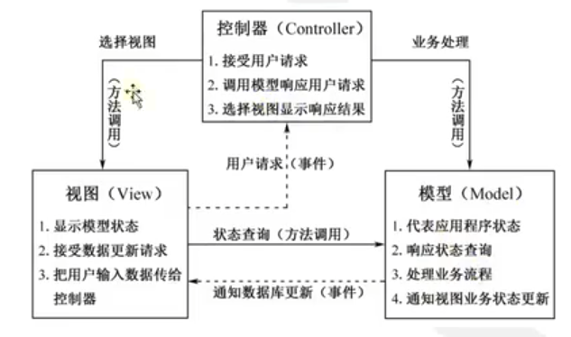

# 项目说明


# 准备工作

- 开发流程
  - Web软件开发的标准流程.docx
- 需求分析
  - EWShop电商系统需求说明书 .docx
- 数据库
  - EWShop电商系统数据库设计说明书 .docx

- 程序说明
  - EWShop电商系统程序设计说明书 .docx
    - 目录结构

```
|-- EWShop目录                          #项目根目录
	|-- index.php                         #主入口路由文件
	|-- config.inc.php                      #项目的主配置文件
	|-- .htaccess                           #项目根下的Apache配置文件
	|-- vendor                             	#Composer组件程序目录
	|-- app                             	#项目的应用程序目录
           |--controllers                    #MVC模式控制器目录
                  |--admin                 #后台控制目录
                  |--home                  #前台控制器目录
                  |--BaseControllers.php     #控制器的基类
           |--models                        #MVC模式Model目录
                  |--BaseDao.php            #数据库操作对象的基类
           |--views                         #MVC模式的视图目录
                  |--admin                 #后台模板文件目录
                  |--home                  #前台第一套模板目录 
                  |--home2                  #前台第一套模板目录
                  |--public                  #前后台公共资源（CSS,JS,images）目录 
           |--helpers.php                    #项目的自定义函数库文件
	|-- class                             	#项目自己定义类库文件
	|-- uploads                             #资源上传保存的目录
```


- 配置虚拟主机 ewshop.com

- 配置 .htacess 文件
  - 使任何无路由定义的 url 自动转向主页

```
# 开启重写引擎
RewriteEngine On

# 从根目录开始
RewriteBase /

# 重写条件(File + Directory)
RewriteCond %{REQUEST_FILENAE}% !-f
RewriteCond %{REQUEST_FILENAE}% !-d

# 重写规则
# 任意字符起始或结尾，转换为 index.php?(.*) 如：
# ewshop.com/user/add
# ewshop.com/index?user/add
RewriteRule ^(.*)$ index.php?$1 [QSA,L]
```

> 相当于实现了一个隐藏 index.php 的功能


# 构建框架

MVC 框架





使用 Composer 搭建框架

- 路由 noahbuscher/macaw
- 控制器
- 视图 twig/twig
- 模型 catfan/medoo
- 应用库 jasongrimes/paginator
- 单个文件自动加载 helpers.php


查看 composer 配置

```
composer config -gl
```


更改 composer 源

```
# 官网下载源
composer config -g repo.packagist composer https://packagist.phpcomposer.com

# 阿里云下载源
composer config -g repo.packagist composer https://mirrors.aliyun.com/composer/
```


## 1. noahbuscher/macaw


在项目目录中安装

```
composer require noahbuscher/macaw:dev-master
```


需要定义重写规则：

**Appache .htacess**

```
RewriteEngine On
RewriteBase /

# Allow any files or directories that exist to be displayed directly
RewriteCond %{REQUEST_FILENAME} !-f
RewriteCond %{REQUEST_FILENAME} !-d

RewriteRule ^(.*)$ index.php?$1 [QSA,L]
```


**Ngix**

```
rewrite ^/(.*)/$ /$1 redirect;

if (!-e $request_filename){
	rewrite ^(.*)$ /index.php break;
}
```


Examples

~~~php
<?php
// 自动调用 Composer 的组件包
require('vendor/autoload.php');

// 引入包
use NoahBuscher\Macaw\Macaw;

// 响应方式
Macaw::get('/hello/world', function(){
    echo 'hello world';
});
Macaw::post('/contact', function(){});
Macaw::any('/form', function(){})
    
// 路由传入参数
Macaw::get('/post(:num)', function($num){
    echo $num;
})
    
// 加载路由
Macaw::dispatch();
~~~


路由直接调用方法

```php
// 需要引入类文件
require "app/controllers/admin/demo.php";

// 定义路由对应方法（命名空间\类名@方法名）
Macaw::get('/', 'admin\Demo@index');
Macaw::get('page', 'admin\Demo@page');
Macaw::get('view/(:num)', 'admin\Demo@view');
```


demo.php

~~~php
<?php

namespace admin;

final class Demo {
    public function index(){
        echo '666';
    }

    public function page(){
        echo 'page';
    }
}
~~~


每次载入模块都需要引入文件，可以在 composer.json 中设置

~~~json
{
    "require": {
        "noahbuscher/macaw": "dev-master"
    },
    "autoload": {
        "psr-4": {
            "admin\\" : "app/controllers/admin/"
        }
    }
}
~~~


然后执行 composer 命名，让 autoload 自动配置

~~~
composer dump-autoload
~~~

> vendor/composer/autoload_psr4.php 会自动增加 autoload 配置

此时，在 index.php 就不用加载 app/controllers/admin/demo.php 了，不过每次增加模块文件都需要执行一次 composer 命令


## 2. twig/twig


