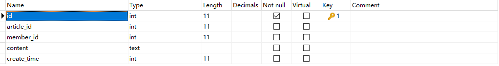

# 运行环境
- PHP7.3
- MySQL 5.7

# 环境配置

安装 TP6

~~~
composer create-project topthink/think tp 6.0.*
~~~

如果需要更新框架使用

~~~
composer update topthink/framework
~~~

安装插件

~~~
composer require topthink/think-multi-app
composer require topthink/think-view
~~~

服务器指向路径

- /public

打开 Debug 模式

- .env

删除里边的数据库连接信息，我们在别的地方配置

~~~
APP_DEBUG = true

[APP]
DEFAULT_TIMEZONE = Asia/Shanghai

[LANG]
default_lang = zh-cn
~~~

配置数据库

- config\database.php

> .env 的优先级要比 database.php 要高，为了避免暴露数据，最好将 .env 中的数据库配置删除，然后再 config/database.php 中进行配置

主要修改信息：
- 自动写入时间戳
- 数据库地址
- 数据库名
- 数据库用户名
- 数据库密码
- 数据库端口
- 数据库编码
- 数据库前缀

测试后台首页

- app\cyadmin\controller\Index.php
~~~php
<?php
namespace app\cyadmin\controller;

use app\BaseController;

class Index extends BaseController
{
    public function index()
    {
        echo '后台首页控制器';
    }
}

~~~

入口文件解析：
http://www.cycms.com/index.php/cyadmin/index/index

> 访问后台：`http://www.cycms.com/cyadmin/`
> 默认 index 可以省略

~~~
index.php 项目入口文件
cyadmin 控制器命名空间
index 类
index 方法
~~~

# 后台登陆页

## 1. 创建控制器
- app\cyadmin\controller\Login.php
~~~php
<?php
namespace app\cyadmin\controller;

use app\BaseController;

class Login extends BaseController
{
    public function index()
    {
        return view();
    }
}

~~~

## 2. 视图
视图文件
- app\cyadmin\view\login\index.html

静态资源文件
- public\static\admin\css
- public\static\admin\fonts
- public\static\admin\images
- public\static\admin\js
- public\static\admin\lib

## 3. 路径常量

页面可以显示，但是缺失 css 与 js 等文件的加载，是由于路径不正确造成的

- **解决方法1：** 直接使用绝对路径，如：

~~~html
<link rel="stylesheet" href="/static/admin/lib/layui/css/layui.css" media="all" />
~~~

将 public 文件夹内 index.php 等文件，放到根目录

~~~
.htaccess
favicon.ico
index.php
robots.txt
router.php
~~~
> static 静态资源文件夹不需要移动

需要修改 index.php 中的环境变量

~~~
require __DIR__ . './vendor/autoload.php';
~~~

- **解决方法2：** 添加静态路径替换变量

config\view.php

~~~
// 模板输出字符串替换
'tpl_replace_string' => [
    '__STATIC__' => 'http://www.cycms.com' . '/static',
],
~~~

然后视图中使用

~~~html
<link rel="stylesheet" href="__STATIC__/admin/css/xadmin.css">
~~~

修改视图内所有静态资源路径

- css
- js
- 图片

删除根路径下 runtime 文件夹，清空所有缓存，刷新

## 4. 创建数据库管理员表

数据表结构

插入一条数据，需要拿到加密的 password 和 时间戳，在控制器中暂时生成一个临时数据

~~~php
public function index()
{
    $admin_pw_salt = 'cycms_$';
    $password = md5($admin_pw_salt.'123456');
    halt(time(), $password);

    return view();
}
~~~

插入数据

~~~sql
INSERT INTO `cy_admin` (`id`, `name`, `password`, `login_time`, `status`) VALUES (NULL, 'admin', '3313897f1154765f40f77e267fa68d4e', '1646973308', '1');
~~~

## 5. 前端提交数据

前端利用 Ajax 提交数据

~~~html

~~~

也可以简化直接用 $.post 提交数据

~~~html
    
~~~

## 6. 后端登录接口

~~~php
<?php

namespace app\cyadmin\controller;

use app\BaseController;
use think\facade\Db;

class Login extends BaseController {
    public function index() {
        $admin_pw_salt = 'cycms_$';
        $password = md5($admin_pw_salt . '123456');
        if (request()->isPost()) {
            $data = input('post.');
            $adminData = Db::name('admin')->where('username', $data['username'])->find();
            if (!$adminData) {
                return json(['message' => '用户名或密码不正确', 'code' => 0]);
            }
            if ($adminData['password'] != md5($admin_pw_salt . $data['password'])) {
                return json(['message' => '用户名或密码不正确', 'code' => 0]);
            }
            return json(['message' => '登录成功', 'code' => 1]);
        }
        return view();
    }
}

~~~

## 7. 添加验证码

安装插件

~~~shell
composer require topthink/think-captcha
~~~

验证码配置文件

~~~
config/captcha.php
~~~

插入模板文件

~~~
 {:captcha_img()}
~~~

对验证码进行验证需要开启 session 功能

app\middleware.php

~~~php
<?php
// 全局中间件定义文件
return [
    // 全局请求缓存
    // \think\middleware\CheckRequestCache::class,
    // 多语言加载
    // \think\middleware\LoadLangPack::class,
    // Session初始化
    \think\middleware\SessionInit::class
];

~~~

视图中插入代码

~~~html
<input name="captcha" lay-verify="required" placeholder="验证码" type="text" class="layui-input" />

{:captcha_img()}

~~~

控制器中对验证码进行校验

~~~php
if (!captcha_check($data['captcha'])) {
    return json(['message' => '验证码不正确', 'code' => 0]);
}
~~~

## 8. 更新登录时间

~~~php
Db::name('admin')->where('id', $adminData['id'])->update(['last_login_time' => time()]);
~~~

## 9. 缓存管理员数据

没必要把所有数据都放入 session，尤其是密码，只提取需要的即可。

~~~php
session(
    'adminSessionData',
    [
        'admin_id' => $adminData['id'],
        'admin_username' => $adminData['username'],
        'admin_status' => $adminData['status'],
    ]
);
~~~

## 10. 安全验证

### 1. 后端验证

对用户提交的数据进行过滤

- strip_tags 去除 HTML 标签
- htmlspecialchars 将特殊字符转换实体
- trim 过滤掉首尾空格

~~~php
// 过滤掉空格
$data = input('post.', '', 'trim');
~~~

创建验证器

app\common\validate\Admin.php

~~~php
<?php

namespace app\common\validate;

use think\Validate;

class Admin extends Validate
{
    protected $rule = [
        'username|用户名' => 'require|length:4,16|chsDash',
        'password|' => 'require|length:6,16|alphaDash',
        'captcha' => 'require|max:4|alphaNum'
    ];
    protected $message = [
        'username.require' => '用户名不能为空',
        'username.length' => '用户名长度为 4-16 个字符',
        'username.chsDash' => '用户名中只可以使用汉字、字母、数字、下划线、破折号',
        'password.require' => '密码不能为空',
        'password.length' => '密码长度为 6-16 个位',
        'password.alphaDash' => '密码中只可以使用字母、数字、下划线、破折号',
        'captcha.require' => '验证码不能为空',
        'captcha.max' => '验证码最多不能超过4个字符',
        'captcha.alphaNum' => '验证码中只可以使用字母、数字',
    ];

    protected $scene = [
        'login' => ['username', 'password', 'captcha'],
    ];

}
~~~

控制器中进行验证

~~~php
// 验证器进行验证            
try {
    validate(\app\common\validate\Admin::class)->scene('admin')->check($data);
} catch (ValidateException $e) {
    return json(['message' => $e->getError(), 'code' => 0]);
}
~~~

### 2. 前端进行

根据后端设置的规则，前端同样做相同验证，创建 verify.js，由于在很多地方都需要做验证，所以把该 js 文件放到静态资源中

public\static\admin\js\verify.js

~~~js
//用户名正则，4到16位（汉字，字母，数字，下划线，减号）
var usernamePattern = /^[a-zA-Z0-9_-\u4E00-\u9FA5]{4,16}$/

//密码正则，4到16位（字母，数字，下划线，减号）
var passwordPattern = /^[a-zA-Z0-9_-\u4E00-\u9FA5]{4,16}$/

//验证码正则，2-4位，字母和数字
var captchaPattern = /^[a-zA-Z0-9]{2,4}$/

//密码强度正则，最少6位，包括至少1个大写字母，1个小写字母，1个数字，1个特殊字符
var pStrengthPattern = /^.*(?=.{6,})(?=.*\d)(?=.*[A-Z])(?=.*[a-z])(?=.*[!@#$%^&*? ]).*$/

//正整数正则
var posPattern = /^\d+$/

//负整数正则
var negPattern = /^-\d+$/

//整数正则
var intPattern = /^-?\d+$/

//Email正则
var ePattern = /^([A-Za-z0-9_\-\.])+\@([A-Za-z0-9_\-\.])+\.([A-Za-z]{2,4})$/

//手机号正则
var mPattern = /^1[34578]\d{9}$/

//包含中文正则
var cnPattern = /[\u4E00-\u9FA5]/

function verify($pattern, $value) {
  if ($pattern.test($value)) {
    return true
  }
}

~~~

前端引入

~~~html

~~~

在拿到表单数据后，对表单数据进行验证

~~~html

~~~

### 3. Token 令牌

防止 CSRF 和 CSS，攻击流程

- 当用户浏览其他网站时，该网站被恶意攻击，网站上会自动运行一个我们自己网站的 API，比如说转账，此时构造的 API 不管是 POST 还是 GET 都会携带参数，如：

~~~
http://www.cycms.com/admin/transfer/?money=10000&toUser=John
~~~

- 这个链接只有管理员可以运行，当管理员的 Session 还没失效的情况下，就会自动转账给别人

通过给网页加入 token，那么每次提交数据都会携带本网站上生成的一个随机值（token），如：

~~~
username: admin
password: 123456
captcha: ab
__token__: ed2540bf6495faaaeb51a469b2901ea3
~~~

前端放入 Token

验证规则支持对表单的令牌验证，首先需要在你的表单里面增加下面隐藏域：

~~~
<input type="hidden" name="__token__" value="{:token()}" />
~~~

也可以直接使用

~~~
{:token_field()}
~~~

如果是 Ajax 提交数据，可以把 Token 放在 meta 中

~~~
<meta name="csrf-token" content="{:token()}">
~~~

或者直接使用

~~~
{:token_meta()}
~~~

然后在全局Ajax中使用这种方式设置X-CSRF-Token 请求头并提交：

~~~js
$.ajaxSetup({
    headers: {
        'X-CSRF-TOKEN': $('meta[name="csrf-token"]').attr('content')
    }
});
~~~

后端进行 Token 验证

- 控制器中验证

~~~php
namespace app\controller;
use think\exception\ValidateException;
use think\Request;
class Index
{
    public function index(Request $request)
    {
        $check = $request->checkToken('__token__');
        if(false === $check) {
            throw new ValidateException('invalid token');
        }
        // ...
    }
}
~~~

- 验证器中验证

~~~php
protected $rule = [
    'name' => 'require|max:25|token',
    'email' => 'email',
];
~~~

> 随便加一个地方就可以

# 后台首页

## 1. 创建控制器

app\cyadmin\controller\Index.php

~~~php
<?php
namespace app\cyadmin\controller;

use app\BaseController;

class Index extends BaseController
{
    public function index()
    {
        return view();
    }
}

~~~

## 2. 视图

app\cyadmin\view\index\index.html

修改 js, css 静态资源路径

~~~html
<link rel="stylesheet" href="__STATIC__/admin/css/font.css">
<link rel="stylesheet" href="__STATIC__/admin/css/xadmin.css">
<!-- <link rel="stylesheet" href="./css/theme5.css"> -->

~~~

分离模板

将头部、侧边栏、底部分离，放入 view\public 路径中

- app\cyadmin\view\public\header.html
- app\cyadmin\view\public\left.html
- app\cyadmin\view\public\footer.html

中部区域

app\cyadmin\view\index\welcome.html

- 注意一下 X-admin 中的 left.html 打开的中部区域页面 url 是 welcome1.html ，需要改一下
- 修改中部区域的 js, css 静态资源路径

改造一下侧边栏，把后台首页单独提取出来

~~~html
<li>
    <a onclick="xadmin.add_tab('后台首页','{:url(\"index/welcome\")}')">
        <i class="iconfont left-nav-li" lay-tips="后台首页">&#xe6b8;</i>
        <cite>后台首页</cite>
        <i class="iconfont nav_right"></i></a
        >
</li>
~~~

## 3. 创建父级控制器

很多地方可能需要公共的方法及变量，所以我们创建一个父级控制器

- app\cyadmin\controller\Base.php

~~~php
<?php
namespace app\cyadmin\controller;

use app\BaseController;

class Base extends BaseController
{
    public function initialize()
    {
        
    }
}

~~~

让其他控制器继承父类控制器，如：

~~~php
<?php
namespace app\cyadmin\controller;

class Index extends Base
{
    public function index()
    {
        return view();
    }

    public function welcome(){
        return view();
    }
}

~~~

### 关于 initialize 和 __construct 的区别

- initialize 是初始化，__construct 是构造函数
- __initialize 是在构造函数中调用的一个方法

通过查看 BaseController 的构造函数，我们可以看到

~~~php
public function __construct(App $app)
{
    $this->app     = $app;
    $this->request = $this->app->request;

    // 控制器初始化
    $this->initialize();
}

// 初始化
protected function initialize()
{}
~~~

所以如果需要创建自己定义的父类控制器，可以使用 __construct 也可以使用 initialize，但是如果使用 `__construct` 的话，那么在父类控制器中还需要调用基础控制器中的构造函数，如：

~~~php

~~~

## 4. 传递 session

我们可以将 session 放在父类控制器中的初始化方法，用于读取 session 中的数据

~~~php
<?php
namespace app\cyadmin\controller;

use app\BaseController;

class Base extends BaseController
{
    public function initialize()
    {
        $adminSessionData = session('adminSessionData');
    }
}

~~~

两种方法传递 session 到视图

- 方法1：父类控制器 View 静态类方法传入

~~~php
View::assign('adminSessionData',$adminSessionData);
~~~

> 需要引入类 use think\facade\View;
>
> **提示：**不要使用 View::fetch() 直接传递数组，因为需要定义模板，会造成报错（父类不能指定模板）

header 视图中调用即可

~~~php
// 传入字符串
View::assign('admin_username',$adminSessionData['admin_username']); 
~~~

视图中调用

~~~html
<a href="javascript:;">{$admin_username}</a>
~~~

- 方法2：直接在子类控制器传入 Session

~~~php
<?php
namespace app\cyadmin\controller;

class Index extends Base
{
    public function index()
    {
        $adminSessionData = session('adminSessionData');
        return view('',[
            'adminSessionData'=>$adminSessionData
        ]);
    }

    public function welcome(){
        return view();
    }
}

~~~

- 方法3：模板中直接使用 session 方法

~~~php
<a href="javascript:;">{:session('adminSessionData.admin_username')}</a>
~~~

## 5. 侧边栏 url 问题

使用 url 函数，避免相对路径造成混乱，如：

`<a onclick="xadmin.add_tab('统计页面','welcome.html')">`

- http://www.cycms.com/cyadmin/Index
- http://www.cycms.com/cyadmin/Index/index.html

> 二者所产生的效果不同，前者会找当前路径下的 cyadmin 下的 welcome 控制器，而后者会找 cyadmin\Index 下的 welcome 方法

~~~html
<a onclick="xadmin.add_tab('统计页面','{:url(\"index/welcome\")}')">
~~~

> 双引号中的双引号需要转义

## 6. 注销

控制器中 logout 方法

~~~php
public function logout() {
    session('adminSessionData',null);
    return redirect('/cyadmin/login/index');
}
~~~

注销

~~~html
<a href="{:url('index/logout')">退出</a>
~~~

# 登录权限控制

## 1. 创建中间件

app/middleware 目录下面创建 Check.php 前置中间件，模板如下：

~~~php
<?php

namespace app\middleware;

class Check {
  public function handle($request, \Closure $next) {
    if ($request->param('name') == 'think') {
      return redirect('index/think');
    }
    return $next($request);
  }
}

~~~

让该中间件是全局中间件，如果只想让这个中间件对 cyadmin 应用生效，需要复制中间件到指定 app 应用中

- cyadmin\middleware
- cyadmin\middleware.php

在 middleware.php 中打开刚刚定义的中间件（注意不要删除全局中间件文件）

~~~php
<?php
// 全局中间件定义文件
return [
    // 全局请求缓存
    // \think\middleware\CheckRequestCache::class,
    // 多语言加载
    // \think\middleware\LoadLangPack::class,
    // Session初始化
     \think\middleware\SessionInit::class,
     \app\cyadmin\middleware\Check::class
];

~~~

## 2. 前置中间件登录认证

中间件中判断逻辑

~~~php
public function handle($request, \Closure $next) {
    if (empty(session('adminSessionData'))) {
        return redirect((string)url('login/index'));
    }
    return $next($request);
}
~~~

登录界面不需要用中间件来判断，判断 $request->pathinfo() 中的当前路径

~~~php
<?php

namespace app\cyadmin\middleware;

class Check {
  public function handle($request, \Closure $next) {
    if (empty(session('adminSessionData')) && !preg_match('/login/', $request->pathinfo())) {
        return redirect((string)url('login/index'));
    }
    return $next($request);
}
}

~~~

>不用正则的话也可以使用 `$request->pathinfo() != 'login'` 但是必须要是在定义路由的情况下，否则我们用 /admin/Login/index 也同样会造成死循环

## 3. 阻止登录用户再次访问登录页面

如果已经登录的话，再访问登录界面应该需要直接跳转到后台，在 Login 控制器中进行判断

~~~php
if (session('adminSessionData')) {
    return redirect('/cyadmin/index');
}
~~~

# 清空缓存

创建系统设置控制器 Config.php

app\cyadmin\controller\Config.php

~~~php
<?php

namespace app\cyadmin\controller;

class Config extends Base {
  public function index() {
    return view();
  }

  public function del_cache() {
  }
}

~~~

使用 path_runtime() 获取缓存路径

~~~
\runtime\cyadmin\
~~~

在 app\common.php 添加公共方法

~~~php
<?php
// 应用公共文件

// 删除目录
function delFileByDir($dir) {
  $dh = opendir($dir);
  while ($file = readdir($dh)) {
    if ($file != "." && $file != "..") {

      $fullpath = $dir . "/" . $file;
      if (is_dir($fullpath)) {
        delFileByDir($fullpath);
      } else {
        unlink($fullpath);
      }
    }
  }
  closedir($dh);
}
~~~

添加删除逻辑

~~~php
public function del_cache() {
    $path = runtime_path();
    delFileByDir($path);
}
~~~

> 删除当前应用下的缓存，即 admin 下的缓存

如果想清空整个 runtime 缓存

~~~php
public function del_cache() {
    $path = root_path().'runtime';
    delFileByDir($path);
}
~~~

添加跳转

~~~php
public function del_cache() {
    $path = root_path() . 'runtime';
    delFileByDir($path);
    return alert('清空缓存成功', '/qingadmin/index/welcome', 6);
}
~~~

# 网站设置

## 1. 数据库建表

创建 cy_config 表

插入默认数据

## 2. 控制器

目前只有一个从数据库读取操作，以及更新操作

~~~php
<?php

namespace app\cyadmin\controller;

use think\facade\Db;

class Config extends Base {
    public function index() {
        // 读取数据
        $siteConfigData = Db::name('config')->order('order')->select();
        return view('',[
            'siteConfigData' => $siteConfigData
        ]
                   );
    }

    public function update(){
        if(request()->isPost()){
            $data = input('post.');
            foreach($data as $k=>$v){
                Db::name('config')->where('name', $k)->update(['value'=>$v]);
            }
            return json(['message' => '操作成功', 'code' => 1]);
        }
    }

    public function del_cache() {
        $path = runtime_path();
        delFileByDir($path);
        return alert('清空缓存成功', '/cyadmin/index/welcome', 6);
    }
}

~~~

## 3. 视图

- 修改静态资源路径
- 前端设置好入口

~~~html
<a onclick="xadmin.add_tab('网站设置','{:url(\"config/index\")}')">
~~~

利用 volist 循环展示数据，通过 if condition 判断类型展示不同类别：

~~~html

    <form class="layui-form">
        {volist name="$siteConfigData" id="vo"}
        {if condition="$vo.type eq 'text'"}
        

            <label for="{$vo.name}" class="layui-form-label"> *{$vo.title}</label>
            

                <input type="text" id="{$vo.name}" name="{$vo.name}" value="{$vo.value}" required="" lay-verify="required" autocomplete="off" class="layui-input" />
            

        

        {/if}
        {if condition="$vo.type eq 'textarea'"}
        

            <label for="{$vo.name}" class="layui-form-label"> *{$vo.title}</label>
            

                <textarea placeholder="请输入内容" id="{$vo.name}" name="{$vo.name}" class="layui-textarea">{$vo.value}</textarea>
            

        

        {/if}
        {/volist}
        

            <label for="L_repass" class="layui-form-label"></label>
            <button class="layui-btn" lay-filter="add" lay-submit="">保存</button>
        

    </form>

~~~

## 4. Logo 上传

## 5. 安全验证

# 管理员列表

数据库，给管理员增加一些字段

补充数据

## 1. 显示管理员列表

控制器

~~~php
<?php

namespace app\cyadmin\controller;

use think\facade\Db;

class Admin extends Base {
  public function index() {
    $adminData = Db::name('admin')->select();
    return view('',[
      'adminData'=>$adminData
    ]);
  }

  public function add() {
    return view();
  }

  public function edit() {
    return view();
  }

  public function update() {
  }

  public function del() {
  }
}

~~~

 视图

- 修改静态资源
- 左侧边栏菜单 URL

~~~html
<li>
    <a onclick="xadmin.add_tab('管理员列表','{:url(\"admin/index\")}')">
        <i class="iconfont">&#xe6a7;</i>
        <cite>管理员列表</cite></a
        >
</li>
~~~

循环显示列表

~~~html
{volist name="$adminData" id="vo"}
<tr>
    <td>
        <input type="checkbox" name=""  lay-skin="primary">
    </td>
    <td>{$vo.id}</td>
    <td>{$vo.username}</td>
    <td>{$vo.phone}</td>
    <td>{$vo.email}</td>                                  
    <td>{$vo.last_login_time|date="Y-m-d H:i:s"}</td>
    <td class="td-status">
        {if condition="$vo.status"}
        已启用
        {else}
        已停用
        {/if}
    </td>
    <td class="td-manage">
        <a onclick="member_stop(this,'10001')" href="javascript:;"  title="启用">
            <i class="layui-icon">&#xe601;</i>
        </a>
        <a title="编辑"  onclick="xadmin.open('编辑','edit.html')" href="javascript:;">
            <i class="layui-icon">&#xe642;</i>
        </a>
        <a title="删除" onclick="member_del(this,'要删除的id')" href="javascript:;">
            <i class="layui-icon">&#xe640;</i>
        </a>
    </td>
</tr>
{/volist}
~~~

## 2. 添加管理员

视图

- 添加模板 add.html
- 修改静态资源路径

- 修改弹出框为最大化窗口

~~~html
<button class="layui-btn" onclick="xadmin.open('添加用户','add.html','','',true)"><i class="layui-icon"></i>添加</button>
~~~

- 修改 input 表单名，匹配数据库字段名

~~~js
//监听提交
form.on('submit(add)', function (data) {
    //发异步，把数据提交给php
    $.ajax({
        type: 'post',
        url: "{:url('admin/add')}",
        data: data.field,
        success: function (res) {
            layer.alert(res.message, { time: 1500 }, function () {
                if (res.code == 1) {
                    //关闭当前frame
                    xadmin.close()
                    // 可以对父窗口进行刷新
                    xadmin.father_reload()
                }
            })
        },
    })
    return false
})
~~~

控制器

~~~php
  public function add() {
    if (request()->isPost()) {
      $data = input('post.');
      // 检测是否有重名
      $res = Db::name('admin')->where('username', $data['username'])->find();
      if ($res) {
        return json(['message' => '用户名重复', 'code' => 0]);
      }

      // 验证密码是否相同
      if ($data['password'] !== $data['repass']) {
        return json(['message' => '密码不一致', 'code' => 0]);
      }
      // 删除 repass 字段
      unset($data['repass']);

      // 密码加密
      $admin_pw_salt = 'cycms_$';
      $data['password'] = md5($admin_pw_salt . $data['password']);

      // 添加登录时间
      $data['last_login_time'] = time();

      // 默认设置状态为启用
      $data['status'] = 1;

      // 插入数据
      $res = Db::name('admin')->insert($data);
      if ($res) {
        return json(['message' => '操作成功', 'code' => 1]);
      } else {
        return json(['message' => '操作失败', 'code' => 0]);
      }
    }
    return view();
  }
~~~

## 3. 编辑管理员

视图

- 添加模板 edit.html
- 修改静态资源路径
- 修改弹出框为最大化窗口

index.html 页面传入 id

~~~html
<a title="编辑" onclick="xadmin.open('编辑','edit.html?id={$vo.id}')" href="javascript:;">
    <i class="layui-icon">&#xe642;</i>
</a>
~~~

控制器获取数据

~~~php
public function edit() {
    $id = input('get.id');
    $adminData = Db::name('admin')->where('id', $id)->find();
    halt($adminData);
    return view('', [
        'adminData' => $adminData
    ]);
}
~~~

edit.html 遍历展示数据

~~~html
<input type="text" id="phone" name="phone" value="{$adminData.phone}" lay-verify="phone" autocomplete="off" class="layui-input" />
~~~

禁止修改用户名，使用 disabled 属性

~~~html
<input type="text" id="username" name="username" disabled="" value="{$adminData.username}" class="layui-input" />
~~~

控制器也需要做验证，控制器删除 username 表单数据

~~~php
unset($data['username']);
~~~

加入隐藏表单 id

~~~html
<input type="hidden" name="id" value="{$adminData.id}"/>
~~~

Ajax 提交数据

~~~js
form.on('submit(add)', function (data) {
    console.log(data)
    //发异步，把数据提交给php
    $.ajax({
        type: 'post',
        url: "{:url('admin/update')}",
        data: data.field,
        success: function (res) {
            if (res.code == 1) {
                layer.alert(res.message, { icon: 6 }, function () {
                    //关闭当前frame
                    xadmin.close()

                    // 可以对父窗口进行刷新
                    xadmin.father_reload()
                })
            } else {
                layer.alert(res.message, { icon: 5 })
            }
        },
    })
    return false
})
~~~

控制器验证

~~~php
public function update() {
    if (request()->isPost()) {
        $data = input('post.');
        unset($data['username']);
        $adminData = Db::name('admin')->where('id', $data['id'])->find();
        // 验证原密码是否正确
        $admin_pw_salt = 'cycms_$';
        $data['oldpass'] = md5($admin_pw_salt . $data['oldpass']);
        if ($data['oldpass'] !== $adminData['password']) {
            return json(['message' => '密码不正确', 'code' => 0]);
        }
        // 验证是否更改密码
        if ($data['password'] === '') {
            unset($data['oldpass'], $data['repass'], $data['password']);
        }
        // 验证新密码是否相同
        else if ($data['password'] !== $data['repass']) {
            return json(['message' => '输入密码不一致', 'code' => 0]);
        } else {
            $data['password'] = md5($admin_pw_salt . $data['password']);
            unset($data['oldpass'], $data['repass']);
        }
        // 转换状态值为 1 或 0
        $data['status'] = isset($data['status']) ? '1':'0';

        // 更新数据
        $res = Db::name('admin')->where('id', $data['id'])->update($data);
        if ($res) {
            return json(['message' => '操作成功', 'code' => 1]);
        } else {
            return json(['message' => '操作失败', 'code' => 0]);
        }
    }
}
~~~

## 4. 删除管理员

视图，传递 id 给 member_del 函数

~~~html
<a title="删除" onclick="member_del(this,'{$vo.id}')" href="javascript:;">
    <i class="layui-icon">&#xe640;</i>
</a>
~~~

member_del 函数发送异步请求

~~~js
/*用户-删除*/
function member_del(obj, id) {
    layer.confirm('确认要删除吗？', function (index) {
        //发异步删除数据
        $.ajax({
            type: 'post',
            url: "{:url('admin/del')}",
            data: { 'id': id },
            success: function (res) {
                if (res.code) {
                    $(obj).parents('tr').remove()
                    layer.msg('已删除!', { icon: 1, time: 1000 })
                }
            },
        })
    })
}
~~~

控制器

~~~php
public function del() {
    if (request()->isPost()) {
        $id = input('post.id');
        $res = Db::name('admin')->where('id', $id)->delete();
        if ($res) {
            return json(['message' => '操作成功', 'code' => 1]);
        } else {
            return json(['message' => '操作失败', 'code' => 0]);
        }
    }
}
~~~

## 5. 删除所有

添加 lay-filter

~~~html
<input type="checkbox" name="" lay-filter="checkall" lay-skin="primary" />
~~~

给遍历项 checkbox 加上id序号

~~~html
<input type="checkbox" name="id" value="{$vo.id}" lay-skin="primary" />
~~~

ajax 发送请求

~~~js
function delAll(argument) {
    var ids = []

    // 获取选中的id
    $('tbody input').each(function (index, el) {
        if ($(this).prop('checked')) {
            ids.push($(this).val())
        }
    })
    layer.confirm('确认要删除吗？' + 'ID编号' + ids.toString(), function (index) {
        //捉到所有被选中的，发异步进行删除
        $.ajax({
            type: 'post',
            url: "{:url('admin/delall')}",
            data: { ids: ids },
            success: function (res) {
                layer.msg('删除成功', { icon: 1 })
                $('.layui-form-checked').not('.header').parents('tr').remove()
            },
        })
    })
}
~~~

控制器

~~~php
public function delAll() {
    if (request()->isPost()) {
        $ids = input('post.ids');
        foreach($ids as $id){
            Db::name('admin')->where('id', $id)->delete();
        }
    }
}
~~~

## 6. 更改管理员状态

视图显示管理员状态

~~~html
{if condition="$vo.status"}
已启用
{else}
已停用
{/if}
</td>
<td class="td-manage">
    {if $vo.status}
    <a onclick="member_stop(this,'{$vo.id}')" href="javascript:;" title="停用">
        <i class="layui-icon">&#xe601;</i>
    </a>
    {else}
    <a onclick="member_stop(this,'{$vo.id}')" href="javascript:;" title="启用">
        <i class="layui-icon">&#xe62f;</i>
    </a>
    {/if}
~~~

Ajax 发送请求

~~~js
/*用户-停用*/
function member_stop(obj, id) {
    layer.confirm('确认操作？', function (index) {
        // 发异步把用户状态进行更改
        $.ajax({
            type: 'post',
            url: "{:url('admin/changestatus')}",
            data: { 'id': id },
            success: function (res) {
                if (res.status == 0) {
                    $(obj).attr('title', '启用')
                    $(obj).find('i').html('&#xe62f;')
                    $(obj).parents('tr').find('.td-status').find('span').addClass('layui-btn-disabled').html('已停用')
                    layer.msg('已停用!', { icon: 5, time: 1000 })
                } else {
                    $(obj).attr('title', '停用')
                    $(obj).find('i').html('&#xe601;')
                    $(obj).parents('tr').find('.td-status').find('span').removeClass('layui-btn-disabled').html('已启用')
                    layer.msg('已启用!', { icon: 6, time: 1000 })
                }
            },
        })
    })
}
~~~

控制器改变状态

~~~php
public function changeStatus() {
    $id = input('post.id');
    $res = Db::name('admin')->find($id);
    if ($res['status']) {
        Db::name('admin')->where('id', $id)->update(['status' => 0]);
        return json(['message' => '已停用', 'code' => '1', 'status' => 0]);
    } else {
        Db::name('admin')->where('id', $id)->update(['status' => 1]);
        return json(['message' => '已启用', 'code' => '1', 'status' => 1]);
    }
}
~~~

## 7. 搜索管理员

视图

~~~html
<form class="layui-form layui-col-space5" method="get" action="{:url('admin/search')}">
    

        <input type="text" name="username" placeholder="请输入用户名" autocomplete="off" class="layui-input" />
    

    

        <button class="layui-btn" lay-submit="" lay-filter="sreach"><i class="layui-icon">&#xe615;</i></button>
    

</form>
~~~

控制器

~~~php
public function search() {
    $username = input('get.username');
    $adminData = Db::name('admin')->where('username', 'like', '%' . $username . '%')->select();
    return view('admin/index', [
        'adminData' => $adminData
    ]);
~~~

## 8. 分页处理

控制器获取分页数量

~~~php
$adminData = Db::name('admin')->paginate(10);
~~~

视图

~~~html

    

        
                  
            {$adminData|raw}
        

    

~~~

## 9. 提取 $salt 到父类控制器

Base.php 中创建 getMd5 方法

~~~php
public function getMd5($pw){
    $admin_pw_salt = 'cycms_$';
    return md5($admin_pw_salt . $pw);
}
~~~

子类中调用

~~~php
$data['password'] = $this->getMd5($data['password']);
~~~

## 10. 安全验证

# 会员管理

会员管理与管理员管理类似，直接复制一份管理员数据库表出来改个名就OK了，可以增加一个创建时间的字段

创建控制器框架

~~~php
<?php

namespace app\cyadmin\controller;

use think\facade\Db;

class Member extends Base {
  public function index() {
    return view();
  }

  public function add() {
    return view();
  }

  public function edit() {
    return view();
  }

  public function update() {
    return view();
  }

  public function del() {
    return view();
  }

  public function delAll() {
    return view();
  }

  public function changeStatus() {
    return view();
  }

  public function search() {
    return view();
  }
}

~~~

左侧菜单栏导航链接

~~~html
<li>
    <a onclick="xadmin.add_tab('会员列表','{:url(\"member/index\")}')">
        <i class="iconfont">&#xe6a7;</i>
        <cite>会员列表</cite></a
        >
</li>
~~~

## 1. 会员列表

控制器获取数据库数据，按创建时间先后排序，提取10组数据为一个分页

~~~php
class Member extends Base {
  public function index() {
    $memberData = Db::name('member')->order('id desc')->paginate(10);
    return view('',[
      'memberData'=>$memberData
    ]);
  }
~~~

视图

- 修改静态资源
- 修改导航栏
- 删除百度统计代码

传入数据

- 增加加入时间
- 利用 if 模板语法判断状态改变
  - 启用文字
  - 图标
  - CSS

~~~html
<table class="layui-table layui-form">
    <thead>
        <tr>
            <th>
                <input type="checkbox" name=""  lay-skin="primary">
            </th>
            <th>ID</th>
            <th>登录名</th>
            <th>手机</th>
            <th>邮箱</th>
            <th>加入时间</th>
            <th>上次登录时间</th>
            <th>状态</th>
            <th>操作</th>
    </thead>
    <tbody>
        {volist name="$memberData" id="vo"}
        <tr>
            <td>
                <input type="checkbox" name=""  lay-skin="primary">
            </td>
            <td>{$vo.id}</td>
            <td>{$vo.username}</td>
            <td>{$vo.phone}</td>
            <td>{$vo.email}</td> 
            <td>{$vo.create_time|date="Y-m-d H:i:s"}</td>
            <td>{$vo.last_login_time|date="Y-m-d H:i:s"}</td>
            {if $vo.status}
            <td class="td-status">
                已启用</td>
            <td class="td-manage">
                <a onclick="member_stop(this,'10001')" href="javascript:;"  title="停用">
                    <i class="layui-icon">&#xe601;</i>
                </a>
                {else}
            <td class="td-status">
                已停用</td>
            <td class="td-manage">
                <a onclick="member_stop(this,'10001')" href="javascript:;"  title="启用">
                    <i class="layui-icon">&#xe62f;</i>
                </a>
                {/if}
                <a title="编辑"  onclick="xadmin.open('编辑','admin-edit.html')" href="javascript:;">
                    <i class="layui-icon">&#xe642;</i>
                </a>
                <a title="删除" onclick="member_del(this,'要删除的id')" href="javascript:;">
                    <i class="layui-icon">&#xe640;</i>
                </a>
            </td>
        </tr>
        {/volist}
    </tbody>
</table>
~~~

## 2. 分页处理

由于已经使用 paginate 获取数据

~~~php
$memberData = Db::name('member')->order('id desc')->paginate(10);
~~~

视图中只需要调用即可

~~~html

    
                  
        {$memberData|raw}
    

~~~

## 3. 状态改变

通过状态改变按钮，调用  member_stop() 函数，传入 dom 和 id

~~~html
<a onclick="member_stop(this,'{$vo.id}')" href="javascript:;"  title="停用">
~~~

> 由于使用 if 判断，记得需要修改两次

ajax 传值

~~~js
/*用户-停用*/
function member_stop(obj, id) {
    layer.confirm('确认操作？', function (index) {
        // 发异步把用户状态进行更改
        $.ajax({
            type: 'post',
            url: "{:url('member/changestatus')}",
            data: { id: id },
            success: function (res) {
                if (res.status == 0) {
                    $(obj).attr('title', '启用')
                    $(obj).find('i').html('&#xe62f;')
                    $(obj).parents('tr').find('.td-status').find('span').addClass('layui-btn-disabled').html('已停用')
                    layer.msg('已停用!', { icon: 5, time: 1000 })
                } else {
                    $(obj).attr('title', '停用')
                    $(obj).find('i').html('&#xe601;')
                    $(obj).parents('tr').find('.td-status').find('span').removeClass('layui-btn-disabled').html('已启用')
                    layer.msg('已启用!', { icon: 6, time: 1000 })
                }
            },
        })
    })
}
~~~

控制器接受 id 传值，改变 status

~~~php
public function changeStatus() {
    $id = input('post.id');
    $res = Db::name('member')->find($id);
    if ($res['status']) {
        Db::name('member')->where('id', $id)->update(['status' => 0]);
        return json(['message' => '已停用', 'code' => '1', 'status' => 0]);
    } else {
        Db::name('member')->where('id', $id)->update(['status' => 1]);
        return json(['message' => '已启用', 'code' => '1', 'status' => 1]);
    }
}
~~~

## 4. 删除会员

点击删除按钮，通过 member_del() 函数传入 id

~~~html
<a title="删除" onclick="member_del(this,'{$vo.id}')" href="javascript:;">
~~~

ajax 传值

~~~js
/*用户-删除*/
function member_del(obj, id) {
    layer.confirm('确认要删除吗？', function (index) {
        //发异步删除数据
        $.ajax({
            type: 'post',
            url: "{:url('member/del')}",
            data: { 'id': id },
            success: function (res) {
                if (res.code) {
                    $(obj).parents('tr').remove()
                    layer.msg('已删除!', { icon: 1, time: 1000 })
                }
            },
        })
    })
}
~~~

控制器

~~~php
public function del() {
    if (request()->isPost()) {
        $id = input('post.id');
        $res = Db::name('member')->where('id', $id)->delete();
        if ($res) {
            return json(['message' => '操作成功', 'code' => 1]);
        } else {
            return json(['message' => '操作失败', 'code' => 0]);
        }
    }
}
~~~

## 5. 批量删除

需要给所有 checkbox 绑定会员 id

~~~html
<input type="checkbox" name="id" value="{$vo.id}" lay-skin="primary" />
~~~

通过 lay-filter 触发 checkall 事件

~~~html
<input type="checkbox" name="" lay-filter="checkall" lay-skin="primary" />
~~~

~~~js
// 监听全选
form.on('checkbox(checkall)', function (data) {
    if (data.elem.checked) {
        $('input').prop('checked', true)
    } else {
        $('input').prop('checked', false)
    }
    form.render('checkbox')
})
~~~

ajax 发送请求

~~~js
function delAll(argument) {
    var ids = []

    // 获取选中的id
    $('tbody input').each(function (index, el) {
        if ($(this).prop('checked')) {
            ids.push($(this).val())
        }
    })
    layer.confirm('确认要删除吗？' + 'ID编号' + ids.toString(), function (index) {
        //捉到所有被选中的，发异步进行删除
        $.ajax({
            type: 'post',
            url: "{:url('member/delall')}",
            data: { 'ids': ids },
            success: function (res) {
                layer.msg('删除成功', { icon: 1 })
                $('.layui-form-checked').not('.header').parents('tr').remove()
            },
        })
    })
}
~~~

控制器

~~~php
public function delAll() {
    if (request()->isPost()) {
        $ids = input('post.ids');
        foreach ($ids as $id) {
            Db::name('member')->where('id', $id)->delete();
        }
    }
}
~~~

## 6. 搜索会员

点击搜索按钮，会发送 GET 请求，如：

~~~
http://www.cycms.com/cyadmin/member/index.html?start=2022-03-01&end=2022-03-02&username=test
~~~

发送请求的控制器不对，修改一下

~~~html
<form class="layui-form layui-col-space5" action="{:url('member/search')}">
~~~

控制器接受 GET 参数，然后返回数据显示在视图上即可

~~~php
public function search() {
    $searchKey = input('get.');
    $startTime = $searchKey['start'];
    // 如果结束时间为空则设置为当前时间
    $endTime = $searchKey['end'] ?: time();
    $memberData = Db::name('member')->where('username', 'like', '%' . $searchKey['username'] . '%')->where('create_time', 'between time', [$startTime, $endTime])->paginate(10);
    return view('member/index', [
        'memberData' => $memberData
    ]);
}
~~~

## 7. 添加会员

- 修改静态资源
- 删除百度统计代码
- 删除角色字段
- 删除确认密码字段

修改密码字段匹配数据库字段

~~~html

    <label for="L_password" class="layui-form-label"> *密码 </label>
    

        <input type="password" id="L_password" name="password" required="" lay-verify="password" autocomplete="off" class="layui-input" />
    

    
6到16个字符

~~~

index.html 入口链接

~~~html
<button class="layui-btn" onclick="xadmin.open('添加用户','./add.html',800,600)"><i class="layui-icon"></i>添加</button>
~~~

ajax 提交数据

~~~js
//监听提交
form.on('submit(add)', function (data) {
    //发异步，把数据提交给php
    $.ajax({
        type: 'post',
        url: "{:url('member/add')}",
        data: data.field,
        success: function (res) {
            layer.msg(res.message, { time: 1500 }, function () {
                if (res.code == 1) {
                    //关闭当前frame
                    xadmin.close()
                    // 可以对父窗口进行刷新
                    xadmin.father_reload()
                }
            })
        },
    })
    return false
})
~~~

控制器验证并插入数据

~~~php
  public function add() {
    if (request()->isPost()) {
      $data = input('post.');
      // 检测用户名是否重复
      $res = Db::name('member')->where('username', $data['username'])->find();
      if ($res) {
        return json(['message' => '用户名重复', 'code' => '0']);
      }
      // 密码加密
      $data['password'] = $this->getMd5($data['password']);

      // 添加创建时间
      $data['create_time'] = time();

      // 添加登录时间
      $data['last_login_time'] = 0;

      // 默认状态为启动 1
      $data['status'] = 1;

      // 插入数据
      $res = Db::name('member')->insert($data);
      if ($res) {
        return json(['message' => '操作成功', 'code' => '1']);
      } else {
        return json(['message' => '操作失败', 'code' => '0']);
      }
    }
    return view();
  }
~~~

## 8. 编辑会员

- 修改静态资源
- 删除百度统计代码
- 删除角色字段
- 删除确认密码字段
- 修改密码字段 name 属性匹配数据库字段

添加状态字段

~~~html

    <label class="layui-form-label">状态</label>
    

        <input type="checkbox" checked="" name="status" lay-skin="switch" lay-text="ON|OFF" />
        
<em>ON</em><i></i>

    

~~~

index.html 入口链接

~~~html
<a title="编辑" onclick="xadmin.open('编辑','edit.html?id={$vo.id}')" href="javascript:;">
~~~

控制器获取数据

~~~php
public function edit() {
    $id = input('get.id');
    $memberData = Db::name('member')->find($id);
    return view('',[
        'memberData'=>$memberData
    ]);
}
~~~

视图渲染

~~~html
<input type="text" id="L_email" name="email" value="{$memberData.email}" lay-verify="email" autocomplete="off" class="layui-input">
~~~

使用 if 判断状态

~~~html
{if $memberData.status}
<input type="checkbox" checked="" name="status" lay-skin="switch" lay-text="ON|OFF" />

<em>ON</em><i></i>

{else}
<input type="checkbox" name="status" lay-skin="switch" lay-text="ON|OFF" />

<em>OFF</em><i></i>

{/if}  
~~~

添加隐藏 id 表单

~~~html
<input type="hidden" name="id" value="{$memberData.id}" />
~~~

ajax 传递数据

~~~js
//监听提交
form.on('submit(add)', function (data) {
    console.log(data)
    //发异步，把数据提交给php
    $.ajax({
        type: 'post',
        url: "{:url('member/update')}",
        data: data.field,
        success: function (res) {
            if (res.code == 1) {
                layer.alert(res.message, { icon: 6 }, function () {
                    //关闭当前frame
                    xadmin.close()

                    // 可以对父窗口进行刷新
                    xadmin.father_reload()
                })
            } else {
                layer.alert(res.message, { icon: 5 })
            }
        },
    })
    return false
})
~~~

控制器

~~~php
public function update() {
    $data = input('post.');
    // 判断是否更改密码
    if($data['password'] == ""){
        unset($data['password']);
    } else {
        $data['password'] = $this->getMd5($data['password']);
    }
    // 转换状态值为 1 或 0
    $data['status'] = isset($data['status']) ? '1' : '0';
    $res = Db::name('member')->where('id', $data['id'])->update($data);
    if ($res) {
        return json(['message' => '操作成功', 'code' => '1']);
    } else {
        return json(['message' => '操作失败', 'code' => '0']);
    }
}
~~~

# 页面管理

创建数据库

插入几条数据

侧边栏入口

~~~html
<li>
    <a href="javascript:;">
        <i class="iconfont left-nav-li" lay-tips="页面管理">&#xe726;</i>
        <cite>页面管理</cite>
        <i class="iconfont nav_right">&#xe697;</i></a
        >
    <ul class="sub-menu">
        <li>
            <a onclick="xadmin.add_tab('页面列表','{:url(\"page/index\")}')">
                <i class="iconfont">&#xe6a7;</i>
                <cite>页面列表</cite></a
                >
        </li>
        <li>
            <a onclick="xadmin.add_tab('添加页面','{:url(\"page/add\")}')">
                <i class="iconfont">&#xe6a7;</i>
                <cite>添加页面</cite></a
                >
        </li>
    </ul>
</li>
~~~

控制器框架

~~~php
<?php

namespace app\cyadmin\controller;

use think\facade\Db;

class Page extends Base {
  public function index() {
    return view();
  }

  public function add() {
    return view();
  }

  public function edit() {
    return view();
  }

  public function update() {
    return view();
  }

  public function del() {
    return view();
  }

  public function delAll() {
    return view();
  }

  public function changeStatus() {
    return view();
  }

  public function search() {
    return view();
  }
}

~~~

## 1. 页面列表

控制器获取数据

~~~php
public function index() {
    $pageListData = Db::name('page')->order('id desc')->paginate(10);    
    return view('',[
        'pageListData'=>$pageListData
    ]);
}
~~~

视图

- 修改静态资源
- 修改导航栏
- 删除百度统计代码
- 删除 ID 表单字段
- 修改其他表单字段，对应数据库

~~~html
<table class="layui-table layui-form">
    <thead>
        <tr>
            <th style="width:80px">
                <input type="checkbox" name=""  lay-skin="primary">
            </th>
            <th>标题</th>
            <th>发布时间</th>
            <th>状态</th>
            <th>操作</th>
    </thead>
    <tbody>
        {volist name="$pageListData" id="vo"}
        <tr>
            <td>
                <input type="checkbox" name=""  lay-skin="primary">
            </td>
            <td>{$vo.title}</td>
            <td>{$vo.create_time|date="Y-m-d"}</td>
            <td class="td-status">
                显示</td>
            <td class="td-manage">
                <a onclick="page_stop(this,'10001')" href="javascript:;"  title="隐藏">
                    <i class="layui-icon">&#xe601;</i>
                </a>
                <a title="编辑"  onclick="xadmin.open('编辑','admin-edit.html')" href="javascript:;">
                    <i class="layui-icon">&#xe642;</i>
                </a>
                <a title="删除" onclick="page_del(this,'要删除的id')" href="javascript:;">
                    <i class="layui-icon">&#xe640;</i>
                </a>
            </td>
        </tr>
        {/volist}
    </tbody>
</table>
~~~

## 2. 分页处理

控制器使用 paginate

~~~php
$pageListData = Db::name('page')->order('id desc')->paginate(10);    
~~~

视图

~~~php

    

{$pageListData|raw}

    

~~~

## 3. 状态改变

状态分为显示和隐藏

通过状态改变按钮，调用  page_stop() 函数，传入 dom 和 id

~~~html
<a onclick="page_stop(this,'{$vo.id}')" href="javascript:;"  title="停用">
~~~

> 由于使用 if 判断，记得需要修改两次

ajax 传值

~~~js
/*页面-停用*/
function page_stop(obj, id) {
    layer.confirm('确认操作？', function (index) {
        // 发异步把用户状态进行更改
        $.ajax({
            type: 'post',
            url: "{:url('page/changestatus')}",
            data: { id: id },
            success: function (res) {
                if (res.status == 0) {
                    $(obj).attr('title', '显示')
                    $(obj).find('i').html('&#xe62f;')
                    $(obj).parents('tr').find('.td-status').find('span').addClass('layui-btn-disabled').html('未发布')
                    layer.msg('已隐藏!', { icon: 5, time: 1000 })
                } else {
                    $(obj).attr('title', '显示')
                    $(obj).find('i').html('&#xe601;')
                    $(obj).parents('tr').find('.td-status').find('span').removeClass('layui-btn-disabled').html('已发布')
                    layer.msg('已显示!', { icon: 6, time: 1000 })
                }
            },
        })
    })
}
~~~

控制器接受 id 传值，改变 status

~~~php
public function changeStatus() {
    $id = input('post.id');
    $res = Db::name('page')->find($id);
    if ($res['status']) {
        Db::name('page')->where('id', $id)->update(['status' => 0]);
        return json(['message' => '已隐藏', 'code' => '1', 'status' => 0]);
    } else {
        Db::name('page')->where('id', $id)->update(['status' => 1]);
        return json(['message' => '已显示', 'code' => '1', 'status' => 1]);
    }
}
~~~

## 4. 删除页面

点击删除按钮，通过 member_del() 函数传入 id

~~~html
<a title="删除" onclick="page_del(this,'{$vo.id}')" href="javascript:;">
~~~

ajax 传值

~~~js
/*页面-删除*/
function page_del(obj, id) {
    layer.confirm('确认要删除吗？', function (index) {
        //发异步删除数据
        $.ajax({
            type: 'post',
            url: "{:url('page/del')}",
            data: { 'id': id },
            success: function (res) {
                if (res.code) {
                    $(obj).parents('tr').remove()
                    layer.msg('已删除!', { icon: 1, time: 1000 })
                }
            },
        })
    })
}
~~~

控制器

~~~php
public function del() {
    if (request()->isPost()) {
        $id = input('post.id');
        $res = Db::name('page')->where('id', $id)->delete();
        if ($res) {
            return json(['message' => '操作成功', 'code' => 1]);
        } else {
            return json(['message' => '操作失败', 'code' => 0]);
        }
    }
}
~~~

## 5. 批量删除

需要给所有 checkbox 绑定会员 id

~~~html
<input type="checkbox" name="id" value="{$vo.id}" lay-skin="primary" />
~~~

通过 lay-filter 触发 checkall 事件

~~~html
<input type="checkbox" name="" lay-filter="checkall" lay-skin="primary" />
~~~

~~~js
// 监听全选
form.on('checkbox(checkall)', function (data) {
    if (data.elem.checked) {
        $('input').prop('checked', true)
    } else {
        $('input').prop('checked', false)
    }
    form.render('checkbox')
})
~~~

ajax 发送请求

~~~js
function delAll(argument) {
    var ids = []

    // 获取选中的id
    $('tbody input').each(function (index, el) {
        if ($(this).prop('checked')) {
            ids.push($(this).val())
        }
    })
    layer.confirm('确认要删除吗？' + 'ID编号' + ids.toString(), function (index) {
        //捉到所有被选中的，发异步进行删除
        $.ajax({
            type: 'post',
            url: "{:url('page/delall')}",
            data: { ids: ids },
            success: function (res) {
                layer.msg('删除成功', { icon: 1 })
                $('.layui-form-checked').not('.header').parents('tr').remove()
            },
        })
    })
}
~~~

控制器

~~~php
public function delAll() {
    if (request()->isPost()) {
        $ids = input('post.ids');
        foreach ($ids as $id) {
            Db::name('page')->where('id', $id)->delete();
        }
    }
}
~~~

## 6. 搜索页面

添加一个下拉框表单

~~~html

    <select name="status">
        <option value="99">所有页面</option>
        <option value="1">已发布</option>
        <option value="0">未发布</option>
    </select>

~~~

搜索框 name 属性更改为 title

~~~html

    <input type="text" name="title" placeholder="请输入标题名" autocomplete="off" class="layui-input" />

~~~

点击搜索按钮，会发送 GET 请求，如：

~~~
http://www.cycms.com/cyadmin/page/index.html?status=1&title=
~~~

发送请求的控制器不对，修改一下

~~~html
<form class="layui-form layui-col-space5" action="{:url('page/search')}">
~~~

控制器接受 GET 参数，然后返回数据显示在视图上即可

~~~php
public function search() {
    $searchKey = input('get.');
    $status = $searchKey['status'];
    if ($status == 99) {
        $pageListData = Db::name('page')->where('title', 'like', '%' . $searchKey['title'] . '%')->paginate(10);
    } else {
        $pageListData = Db::name('page')->where('title', 'like', '%' . $searchKey['title'] . '%')->where('status', $status)->paginate(10);
    }
    return view('page/index', [
        'pageListData' => $pageListData
    ]);
}
~~~

## 7. 添加页面

由于添加页面表单比较复杂，我们就不用弹出窗口了，直接跳转到添加页面

~~~html
<button class="layui-btn" onclick="window.location.href='add.html';"><i class="layui-icon"></i>添加</button>
~~~

- 修改静态资源
- 删除百度统计代码
- 整理表单

## 编辑器：WangEditor

https://www.cnblogs.com/lyd447113735/p/11987225.html

添加 WangEditor

- 引入 CDN

~~~html

~~~

- 创建实例

~~~html

~~~

- 创建 div 加载

~~~html

    <label for="" class="layui-form-label">页面内容*</label>
    

~~~

提交数据给控制器

~~~html

~~~

控制器插入数据

~~~php
public function add() {
    if (request()->isPost()) {
        $data = input('post.');
        $data['status'] = 1;
        $data['create_time'] = $data['update_time'] = time();
        $res = Db::name('page')->insert($data);
        if ($res) {
            return json(['message' => '操作成功', 'code' => 1]);
        } else {
            return json(['message' => '操作失败', 'code' => 0]);
        }
    }
    return view();
}
~~~

## 8. 上传图片

配置上传图片

~~~js
const E = window.wangEditor
const editor = new E('#wangEditor')
// 配置 server 接口地址
editor.config.uploadImgServer = "{:url('uploads/upload')}"
// 配置上传图片字段
editor.config.uploadFileName = 'file'
editor.create()
~~~

返回数据需要是 json 格式

~~~json
{
    // errno 即错误代码，0 表示没有错误。
    // 如果有错误，errno != 0，可通过下文中的监听函数 fail 拿到该错误码进行自定义处理
    "errno": 0,

    // data 是一个数组，返回图片Object，Object中包含需要包含url、alt和href三个属性,它们分别代表图片地址、图片文字说明和跳转链接,alt和href属性是可选的，可以不设置或设置为空字符串,需要注意的是url是一定要填的。
    "data": [
        {
            url: "图片地址",
            alt: "图片文字说明",
            href: "跳转链接"
        },
        {
            url: "图片地址1",
            alt: "图片文字说明1",
            href: "跳转链接1"
        },
        "……"
    ]
}
~~~

控制器接口 Uploads.php

~~~php
<?php

namespace app\cyadmin\controller;

use app\BaseController;

class Uploads extends Base {
    public function upload() {
        $file = request()->file('file');
        $savename = \think\facade\Filesystem::putFile( 'logo', $file);
        halt($file);
    }
}

~~~

> putFile 第一个参数会创建一个独立的文件夹，如果设置为空，则不会创建文件夹

文件默认上传到 runtime/storage，在 TP 的默认配置文件中更改默认保存路径

config\filesystem.php

~~~php
<?php

return [
    // 默认磁盘
    'default' => env('filesystem.driver', 'public'),
    // 磁盘列表
    'disks'   => [
        'local'  => [
            'type' => 'local',
            'root' => app()->getRuntimePath() . 'storage',
        ],
        'public' => [
            // 磁盘类型
            'type'       => 'local',
            // 磁盘路径
            'root'       => app()->getRootPath() . 'public/uploads',
            // 磁盘路径对应的外部URL路径
            'url'        => '/storage',
            // 可见性
            'visibility' => 'public',
        ],
        // 更多的磁盘配置信息
    ],
];

~~~

> 更改上传配置项为 public，并且更改磁盘路径

$savefile 返回的路径是 

~~~
"page/20220318\23efac7eb611db6b4362e32f9017b95b.jpg"
~~~

更改路径字符

~~~php
$savename = str_replace('\\','/',$savename);
~~~

返回给前端编辑器

~~~php
{
    "errno": 0,
    "data": [
        {
            url: "图片地址",
            alt: "图片文字说明",
            href: "跳转链接"
        },
    ]
}
~~~

> alt 和 href 其实没必要，可以去掉

控制器返回路径

~~~php
<?php

namespace app\cyadmin\controller;

use app\BaseController;

class Uploads extends Base {
  public function upload() {
    $file = request()->file('file');     
    $savename = \think\facade\Filesystem::putFile('logo', $file);
      // 补全地址并修改路径符
    $savename = '/uploads/' . str_replace('\\', '/', $savename);
    return json(['errno' => '0', 'data' => [
      'url' => $savename,
    ]]);
  }
}

~~~

## 9. 编辑页面

前端入口传入id

~~~html
<a title="编辑" onclick="xadmin.add_tab_f('编辑','../page/edit?id={$vo.id}')" href="javascript:;">
~~~

或

~~~html
 <a title="编辑" onclick="xadmin.open('编辑','edit.html?id={$vo.id}')" href="javascript:;">
~~~

后端 edit 方法根据 id 读取数据库

~~~php
  public function edit() {
    $id = input('get.id');
    $pageData = Db::name('page')->where('id', $id)->find();
    return view('',[
      'pageData'=>$pageData,
    ]);
  }
~~~

视图页面传入数据，注意 Input 使用 value，而 textaera则直接放入标签中间

- input

~~~html
<input type="text" name="title" required="" value="{$pageData.title}" lay-verify="required" autocomplete="off" class="layui-input" />

~~~

- textaera

~~~html
<textarea placeholder="请输入内容" name="abstract" class="layui-textarea">{$pageData.abstract}</textarea>
~~~

至于编辑器则需要使用 js 来将页面内容导入

~~~js
editor.txt.html('{$pageData.content|raw}')
~~~

> 注意，需要使用 raw 参数将文本原本展示出来，否则 tp 会使用 htmlentitle 将特殊字符实体化再输出。

## 10. 更新页面

和添加页面类似，发送数据到 update 方法

~~~js
//监听提交
form.on('submit(update)', function (data) {
    // 获取编辑器内容
    editor.txt.html(content)
    var content = editor.txt.html()
    data.field.content = content
    // 异步提交数据
    $.post("{:url('page/update')}", data.field, function (res) {
        layer.msg(res.message, { time: 1500 }, function () {
            xadmin.close()
            xadmin.father_reload()
        })
    })
    return false
})
~~~

需要指定 id

~~~html
<input type="hidden" name="id" value="{$pageData.id}">
~~~

update 更新方法

~~~php
public function update() {
    if(request()->isPost()){
        $data = input('post.');
    }
    $data['update_time'] = time();  
    // 如果 Data 中包含 id 其实可以不用写 where 的
    $res = Db::name('page')->where('id',$data['id'])->update($data);
    if ($res) {
        return json(['message' => '操作成功', 'code' => 1]);
    } else {
        return json(['message' => '操作失败', 'code' => 0]);
    }
}
~~~

# 文章分类

文章分类表

- id - 分类 ID
- name - 分类名称
- pid - 父级 ID （当 pid = 0 ） 时，为顶级 ID

插入数据

## 1. 显示分类列表

创建 Category 控制器

~~~php
<?php

namespace app\cyadmin\controller;

use think\facade\Db;

class Category extends Base {
  public function index() {
    return view();
  }
}
~~~

左侧入口

~~~html
<a onclick="xadmin.add_tab('分类管理','{:url(\"category/index\")}')">
~~~

- 视图替换静态资源 
- 修改导航栏
- 去除分页

## 2. 无限极分类

### 1. 排序

通过 pid 与 id 的关联，按顺序放入新数组，做出层级关系

~~~php
<?php

namespace app\cyadmin\controller;

use think\facade\Db;

class Category extends Base {
  public function index() {
    $rawCateData = Db::name('category')->select();
    
    // 无限级分类    
    function sort($cateData, $pid = 0, $level = 0) {
      static $arr = [];
      foreach ($cateData as $k => $v) {
        if ($v['pid'] == $pid) {
          $v['level'] = $level;
          $arr[] = $v;
          sort($cateData, $v['id'], $level + 1);
        }
      }
      return $arr;
    }

    $cateData = sort($rawCateData);
    
    return view('',[
      '$cateData'=>$cateData,
    ]);
  }
}

~~~

### 2. 获得子分类

通过遍历子分类的 pid 是否等于遍历项的 id，获取该分类的所有子 ID

~~~php
    function getChildrenCate($cateData, $cateId) {
      static $arr = [];
      foreach ($cateData as $k => $v) {
          // 如果遍历项的 pid 是目标分类的 ID，那么加入该数组
        if ($v['pid'] == $cateId) {
          $arr[] = $v['id'];
            // 递归返回该分类下所有子分类的子分类
          // getChildrenCate($cateData, $v['id']);
        }
      }
      return $arr;
    }
~~~

> 如果只需要拿到一层子分类ID，那么就不需要递归循环

因为静态变量不会自动销毁的原因，如果多次调用的话，那么结果会一直存储在 static 静态变量中，造成了下一次查询会保存上一次的查询结果，如：

~~~
编程语言
	- 前端
	- 后端
结果：4,5

前端
	- Vue
结果：4,5,8
~~~

所以当第一次调用方法的时候，我们需要清空一下静态变量，加上一个 flag

~~~php
// 获取分类子ID
function getChildrenCate($cateData, $cateId, $flag = False) {
    static $arr = [];
    if($flag){
        $arr = [];         
    }
    foreach ($cateData as $k => $v) {
        if ($v['pid'] == $cateId) {
            $arr[] = $v['id'];
        }
    }
    return $arr;
}
~~~

### 3. 获取分类数组

通过两个递归方法，拿到一个整理排序后的数组

~~~php
// 无限级分类    
function sort($cateData, $pid = 0, $level = 0) {
    static $arr = [];
    foreach ($cateData as $k => $v) {
        if ($v['pid'] == $pid) {
            $v['level'] = $level;
            // 每次查询清空 static 变量
            $v['children'] = getChildrenCate($cateData,$v['id'],True);
            $arr[] = $v;
            sort($cateData, $v['id'], $level + 1);
        }
    }
    return $arr;
}
~~~

结构：

### 3. 视图传入

~~~html
<tbody class="x-cate">
    {volist name="$cateData" id="vo"}
    <tr cate-id="{$vo.id}" fid="{$vo.pid}">
        <td>
            <input type="checkbox" name="" value="{$vo.id}" lay-skin="primary" />
        </td>
        <td>{$vo.id}</td>
        <td>                      
            <?php echo str_repeat('&nbsp;', $vo['level']*6);?>
            {if $vo.children}
            <i class="layui-icon x-show" status="true">&#xe623;</i>
            {$vo.name}
            {else}
            | ---- {$vo.name}
            {/if}
        </td>
        <td><input type="text" class="layui-input x-sort" name="order" value="1" /></td>
        <td class="td-manage">
            <button class="layui-btn layui-btn layui-btn-xs" onclick="xadmin.open('编辑','admin-edit.html')">
                <i class="layui-icon">&#xe642;</i>编辑
            </button>
            <button class="layui-btn layui-btn-warm layui-btn-xs" onclick="xadmin.open('添加子栏目','add_sub.html')">
                <i class="layui-icon">&#xe642;</i>添加子栏目
            </button>
            <button class="layui-btn-danger layui-btn layui-btn-xs" onclick="cate_del(this,{$vo.id})" href="javascript:;">
                <i class="layui-icon">&#xe640;</i>删除
            </button>
        </td>
    </tr>
    {/volist}
</tbody>
~~~

不使用模板自带缩进，展开所有分类

- 删除缩进 js

~~~html
<td>
    {if $vo.level != 0}
    <?php echo str_repeat('&nbsp;', $vo['level']*6);?>
    | ---- {$vo.name} {else}
    <i class="layui-icon x-show" status="true">&#xe623;</i>
    {$vo.name} {/if}
</td>
~~~

## 3. 添加分类

前端提交 Get 表单 url 地址

~~~html
<form class="layui-form layui-col-space5">
    

        <input class="layui-input" placeholder="分类名" name="cate_name" />
    

    

        <button class="layui-btn" lay-submit="" lay-filter="search"><i class="layui-icon"></i>增加</button>
    

</form>
~~~

Ajax 提交方式：

~~~js
layui.use(['form'], function () {
    form = layui.form
    $ = layui.jquery
    //监听提交
    form.on('submit(search)', function (data) {
        // 异步提交数据
        $.post("{:url('category/add')}", data.field, function (res) {
            layer.msg(res.message, { time: 1500 }, function () {
                location.reload();
            })
        })
        return false
    })
})
~~~

控制器

~~~php
  public function add() {
    if (request()->isPost()) {
      $data = [];
      $data['pid'] = 0;
      $data['name'] = input('post.cate_name');
      $res = Db::name('category')->insert($data);
      if ($res) {
        return json(['message' => '操作成功', 'code' => '1']);
      } else {
        return json(['message' => '操作失败', 'code' => '0']);
      }
    }
  }
~~~

## 4. 删除分类

前端 Button 监听 cate_del 事件

~~~js
<button class="layui-btn-danger layui-btn layui-btn-xs" onclick="cate_del(this,{$vo.id})" href="javascript:;">
~~~

Ajax 提交数据

~~~js
/*用户-删除*/
function cate_del(obj, id) {
    layer.confirm('确认要删除吗？', function (index) {
        //发异步删除数据
        $.ajax({
            type: 'post',
            url: "{:url('category/del')}",
            data: { id: id },
            success: function (res) {
                if (res.code) {
                    $(obj).parents('tr').remove()
                    layer.msg(res.message, { icon: 1, time: 1000 })
                } else {
                    layer.msg(res.message, { icon: 2, time: 1000 })                
                }
            },
        })
    })
}
~~~

控制器

~~~php
  public function del() {
    if (request()->isPost()) {
      $id = input('post.id');
        // 判断是否有子级分类
      $cateData = Db::name('category')->select();             
      foreach($cateData as $k=>$v){
        if($v['pid'] == $id){
          return json(['message' => '有子级分类', 'code' => 0]);
        }
      }
        // 如果没有则进行删除操作
      $res = Db::name('category')->where('id', $id)->delete();
      if ($res) {
        return json(['message' => '操作成功', 'code' => 1]);
      } else {
        return json(['message' => '操作失败', 'code' => 0]);
      }
    }
  }
~~~

## 5. 批量删除

前端提交数据

~~~js
function delAll(argument) {
    var ids = []

    // 获取选中的id
    $('tbody input').each(function (index, el) {
        if ($(this).prop('checked')) {
            ids.push($(this).val())
        }
    })
    layer.confirm('确认要删除吗？' + 'ID编号' + ids.toString(), function (index) {
        //捉到所有被选中的，发异步进行删除
        $.ajax({
            type: 'post',
            url: "{:url('category/delall')}",
            data: { ids: ids },
            success: function (res) {
                if (res.code == 0) {
                    layer.msg(res.message, { icon: 2 })
                } else {
                    layer.msg('删除成功', { icon: 1 })
                    $('.layui-form-checked').not('.header').parents('tr').remove()
                }
            },
        })
    })
}
~~~

控制器

~~~php
public function delAll() {
    if (request()->isPost()) {
        $ids = input('post.ids');
        $cateData = Db::name('category')->select();
        // 通过两个循环判断传递过来的 $id 是否为其他 id 的父级分类
        foreach ($ids as $id) {
            foreach($cateData as $k=>$v){
                if($v['pid'] == $id){
                    return json(['message' => '有子级分类', 'code' => 0]);
                }
            }
            Db::name('category')->where('id', $id)->delete();
        }
    }
}
~~~

## 6. 添加子分类

入口利用 get 传参

~~~html
<button class="layui-btn layui-btn-warm layui-btn-xs" onclick="xadmin.open('添加子栏目','add_sub.html?pid={$vo.id}',500,200)">
    <i class="layui-icon">&#xe642;</i>添加子栏目
</button>
~~~

控制器把 pid 渲染到页面中的 input 表单

~~~php
public function add_sub() {
    $pid = input('get.pid');
    return view('',[
        'pid'=>$pid
    ]);
}
~~~

创建表单

~~~html
<form class="layui-form">
    <input type="hidden" name="pid" value="{$pid}">
    

        <label for="cate_name" class="layui-form-label"> *子分类名称 </label>
        

            <input type="text" id="cate_name" name="cate_name" required="" lay-verify="required" autocomplete="off" class="layui-input" />
        

    

    

        <label for="L_repass" class="layui-form-label"> </label>
        <button class="layui-btn" lay-filter="add" lay-submit="">增加</button>
    

</form>
~~~

add_sub.html 监听提交按钮

~~~js
layui.use(['form', 'layer'], function () {
    $ = layui.jquery
    var form = layui.form,
        layer = layui.layer

    //监听提交
    form.on('submit(add)', function (data) {
        //发异步，把数据提交给php
        $.ajax({
            type: 'post',
            url: "{:url('member/add')}",
            data: data.field,
            success: function (res) {
                layer.msg(res.message, { time: 1500 }, function () {
                    if (res.code == 1) {
                        //关闭当前frame
                        xadmin.close()
                        // 可以对父窗口进行刷新
                        xadmin.father_reload()
                    }
                })
            },
        })
        return false
    })
})
~~~

控制器验证并提交

~~~php
public function add_sub() {
    $pid = input('get.pid');
    if (request()->isPost()) {
        $data = [];
        $data['pid'] = input('post.pid');
        $data['name'] = input('post.cate_name');
        $res = Db::name('category')->insert($data);
        if ($res) {
            return json(['message' => '操作成功', 'code' => '1']);
        } else {
            return json(['message' => '操作失败', 'code' => '0']);
        }
    }
    return view('',[
        'pid'=>$pid
    ]);
}
~~~

## 7. 编辑分类

入口传入当前 id

~~~html
<button class="layui-btn layui-btn layui-btn-xs" onclick="xadmin.open('编辑','edit.html?id={$vo.id}')">
    <i class="layui-icon">&#xe642;</i>编辑
</button>
~~~

控制器通过 id 拿到 cate 信息

~~~php
public function edit(){
    $id = input('get.id');
    function getCatebyId($rawCateData, $id){
        foreach($rawCateData as $k=>$v){
            if($v['id']==$id){
                return $v;
            }
        }
    }
    $cate = getCatebyId($rawCateData,$id);
    return view('',[
        'cate' => $cate,
    ]);
}
~~~

页面创建表单

~~~html
<form class="layui-form">
    <input type="hidden" name="id" value="{$cate.id}">
    

        <label for="cate_name" class="layui-form-label"> *子分类名称 </label>
        

            <input type="text" id="cate_name" name="cate_name" value="{$cate.name}" required="" lay-verify="required" autocomplete="off" class="layui-input" />
        

    

    

        <label for="pid" class="layui-form-label">
            *所属分类</label>
        

            <select id="pid" name="pid" class="valid">
                <option value="0">顶级分类</option>
                {volist name="$cateData" id="vo"}
                <option value="{$vo.id}" {if $vo.id eq $cate.pid}selected{/if}><?php echo str_repeat('&nbsp;', $vo['level']*4); ?>| -- {$vo.name}</option>
                {/volist}
            </select>
        

    

    

        <label for="L_repass" class="layui-form-label"> </label>
        <button class="layui-btn" lay-filter="update" lay-submit="">更新</button>
    

</form>
~~~

Ajax 提交数据

~~~js
layui.use(['form', 'layer'], function () {
    $ = layui.jquery
    var form = layui.form,
        layer = layui.layer

    //监听提交
    form.on('submit(update)', function (data) {
        //发异步，把数据提交给php
        $.ajax({
            type: 'post',
            url: "{:url('category/update')}",
            data: data.field,
            success: function (res) {
                layer.msg(res.message, { time: 1500 }, function () {
                    if (res.code == 1) {
                        //关闭当前frame
                        xadmin.close()
                        // 可以对父窗口进行刷新
                        xadmin.father_reload()
                    }
                })
            },
        })
        return false
    })
})
~~~

update 控制器更新

~~~php
public function update() {
    if (request()->isPost()) {
        $data = [];
        $data['id'] = input('post.id');
        $data['pid'] = input('post.pid');
        $data['name'] = input('post.cate_name');
        $res = Db::name('category')->where('id', $data['id'])->update($data);
        if ($res) {
            return json(['message' => '操作成功', 'code' => '1']);
        } else {
            return json(['message' => '操作失败', 'code' => '0']);
        }
    }
}
~~~

# 文章管理

和页面管理有些类似，可以直接拿模板和控制器来修改

## 1. 文章列表

入口链接

~~~html
<li>
    <a onclick="xadmin.add_tab('文章列表','{:url(\"article/index\")}')">
        <i class="iconfont">&#xe6a7;</i>
        <cite>文章列表</cite></a
        >
</li>
~~~

获取文章

~~~php
public function index() {
    $articleListData = Db::name('article')->order('id desc')->paginate(10);
    return view('', [
        'articleListData' => $articleListData
    ]);
}
~~~

### 1. 联表查询

因为要显示分类名称，所以需要联表查询

~~~php
$articleListData = Db::name('article')->alais('a')->join('category c','a.cid=c.id')->order('a.id desc')->paginate(10);

~~~

不使用别名的话，就需要加上表全称，包括前缀

~~~php
$articleListData = Db::name('article')->join('category','cy_article.cid=category.id')->order('cy_article.id desc')->paginate(10);
~~~

只取相关字段

~~~php
$articleListData = Db::name('article')->alias('a')->join('category c','a.cid=c.id')->field('a.*,c.name cate_name')->order('a.id desc')->paginate(10);
~~~

### 2. 使用 PHP 遍历

- 需要拿到分类信息
- 需要拿到文章列表信息

文章列表数据

~~~php
$articleListData = Db::name('article')->order('id desc')->paginate(10);
~~~

分类数据（排序后）

~~~php
// 获取所有分类
    $rawCateData = Db::name('category')->select();
    function sort($cateData, $pid = 0, $level = 0) {
      static $arr = [];
      foreach ($cateData as $k => $v) {
        if ($v['pid'] == $pid) {
          $v['level'] = $level;
          $arr[] = $v;
          sort($cateData, $v['id'], $level + 1);
        }
      }
      return $arr;
    }

    $cateData = sort($rawCateData);
~~~

创建一个通过文章 cid 获取分类名称的方法

~~~php
function getCateNamebyId($cateData, $cid){
    foreach ($cateData as $k=>$v){
        if($v['id']==$cid){
            return $v['name'];
        }
    }
}
~~~

最后直接遍历文章列表数据中的 cid，将 cate_name 字段放入新数组中

~~~php
static $tmpArr = [];
foreach($articleListData as $k=>$v){      
    $v['cate_name'] = getCateNamebyId($cateData, $v['cid']);
    $tmpArr[] = $v;      
}
~~~

视图输出

~~~html
<table class="layui-table layui-form">
    <thead>
        <tr>
            <th style="width: 80px">
                <input type="checkbox" name="" lay-filter="checkall" lay-skin="primary" />
            </th>
            <th width="450">标题</th>
            <th>文章分类</th>
            <th>发布时间</th>
            <th>更新时间</th>
            <th>浏览量</th>
            <th>状态</th>
            <th>操作</th>
        </tr>
    </thead>

    <tbody>
        {volist name="$articleListData" id="vo"}
        <tr>
            <td>
                <input type="checkbox" name="id" value="{$vo.id}" lay-skin="primary" />
            </td>
            <td>{$vo.title}</td>
            <td>{$vo.cate_name}</td>
            <td>{$vo.create_time|date="Y-m-d"}</td>
            <td>{$vo.update_time|date="Y-m-d"}</td>
            <td>{$vo.views}</td>
            {if($vo.status)}
            <td class="td-status">
                已发布
            </td>
            <td class="td-manage">
                <a onclick="article_stop(this,'{$vo.id}')" href="javascript:;" title="隐藏">
                    <i class="layui-icon">&#xe601;</i>
                </a>
                {else}
            </td>                   
            <td class="td-status">
                未发布
            </td>                    
            <td class="td-manage">
                <a onclick="article_stop(this,'{$vo.id}')" href="javascript:;" title="显示">
                    <i class="layui-icon">&#xe62f;</i>
                </a>
                {/if}
                <a title="编辑" onclick="xadmin.open('编辑','edit.html?id={$vo.id}')" href="javascript:;">
                    <i class="layui-icon">&#xe642;</i>
                </a>
                <a title="删除" onclick="article_del(this,'{$vo.id}')" href="javascript:;">
                    <i class="layui-icon">&#xe640;</i>
                </a>
            </td>
        </tr>
        {/volist}
    </tbody>
</table>
~~~

## 2. 添加文章

入口文件

~~~html
<button class="layui-btn" onclick="xadmin.add_tab_f('添加页面','{:url(\"article/add\")}')"><i class="layui-icon"></i>添加</button>

~~~

控制器

~~~php
public function add() {
    // 获取前端数据写入数据库
    if (request()->isPost()) {
        $data = input('post.');
        $data['status'] = 1;
        $data['create_time'] = $data['update_time'] = time();
        $res = Db::name('article')->insert($data);
        if ($res) {
            return json(['message' => '操作成功', 'code' => 1]);
        } else {
            return json(['message' => '操作失败', 'code' => 0]);
        }
    }

    // 获取所有分类
    $rawCateData = Db::name('category')->select();
    function sort($cateData, $pid = 0, $level = 0) {
        static $arr = [];
        foreach ($cateData as $k => $v) {
            if ($v['pid'] == $pid) {
                $v['level'] = $level;
                $arr[] = $v;
                sort($cateData, $v['id'], $level + 1);
            }
        }
        return $arr;
    }

    $cateData = sort($rawCateData);

    return view('',[
        'cateData'=>$cateData
    ]);
}
~~~

视图添加分类字段

~~~html

    <label for="cid" class="layui-form-label"> *所属分类</label>
    

        <select id="cid" name="cid" class="valid">
            {volist name="$cateData" id="vo"}
            <option value="{$vo.id}"><?php echo str_repeat('&nbsp;', $vo['level']*4); ?>| -- {$vo.name}</option>
            {/volist}
        </select>
    

~~~

## 3. 其他功能

- 像删除、批量删除、更改状态，基本上都是复刻 Page，修改个传入变量名就可以直接使用

- 编辑页面添加个分类字段

## 4. 搜索分类

控制器拿到排序好的分类数据

~~~php
public function index() {
    $articleListData = Db::name('article')->order('id desc')->paginate(10);
    // 获取所有分类
    $rawCateData = Db::name('category')->select();
    function sort($cateData, $pid = 0, $level = 0) {
        static $arr = [];
        foreach ($cateData as $k => $v) {
            if ($v['pid'] == $pid) {
                $v['level'] = $level;
                $arr[] = $v;
                sort($cateData, $v['id'], $level + 1);
            }
        }
        return $arr;
    }

    $cateData = sort($rawCateData);

    return view('', [
        'articleListData' => $articleListData,
        'cateData' => $cateData,
    ]);
}
~~~

视图输出

~~~html
<select name="status">
    <option value="99">所有分类</option>
    {volist name="$cateData" id="vo"}                    
    <option value="{$vo.id}"><?php echo str_repeat('&nbsp;', $vo['level']*6);?>| -- {$vo.name}</option>
    {/volist}
</select>
~~~

前台递交请求

~~~html
<form class="layui-form layui-col-space5" action="{:url('article/search')}">
    

        <select name="status">
            <option value="99">所有分类</option>
            {volist name="$cateData" id="vo"}                    
            <option value="{$vo.id}"><?php echo str_repeat('&nbsp;', $vo['level']*6);?>| -- {$vo.name}</option>
            {/volist}
        </select>
    

    

        <input type="text" name="title" placeholder="请输入标题名" autocomplete="off" class="layui-input" />
    

    

        <button class="layui-btn" lay-submit="" lay-filter="search"><i class="layui-icon">&#xe615;</i></button>
    

</form>
~~~

控制器返回数据

~~~php
public function search() {
    $searchKey = input('get.');
    $status = $searchKey['status'];
    if ($status == 99) {
        $articleListData = Db::name('article')
            ->where('title', 'like', '%' . $searchKey['title'] . '%')
            ->order('id desc')->alias('a')->join('category c', 'a.cid=c.id')
            ->field('a.*,c.name cate_name')
            ->paginate(10);
    } else {
        $articleListData = Db::name('article')
            ->where('title', 'like', '%' . $searchKey['title'] . '%')
            ->where('status', $status)->order('id desc')->alias('a')
            ->join('category c', 'a.cid=c.id')
            ->field('a.*,c.name cate_name')
            ->paginate(10);
    }

    // 获取所有分类
    $rawCateData = Db::name('category')->select();
    function sort($cateData, $pid = 0, $level = 0) {
        static $arr = [];
        foreach ($cateData as $k => $v) {
            if ($v['pid'] == $pid) {
                $v['level'] = $level;
                $arr[] = $v;
                sort($cateData, $v['id'], $level + 1);
            }
        }
        return $arr;
    }

    $cateData = sort($rawCateData);

    return view('Article/index', [
        'articleListData' => $articleListData,
        'cateData' => $cateData,
    ]);
}
~~~

# 评论管理

入口文件

~~~html
<li>
    <a href="javascript:;">
        <i class="iconfont left-nav-li" lay-tips="评论管理">&#xe726;</i>
        <cite>评论管理</cite>
        <i class="iconfont nav_right">&#xe697;</i></a
        >
    <ul class="sub-menu">
        <li>
            <a onclick="xadmin.add_tab('评论列表','{:url(\"comment/index\")}')">
                <i class="iconfont">&#xe6a7;</i>
                <cite>评论列表</cite></a
                >
        </li>
    </ul>
</li>
~~~

基本控制器

~~~php
<?php

    namespace app\cyadmin\controller;

use think\facade\Db;

class Comment extends Base {
    public function index() {
        return view();
    }
~~~

创建数据库表单

插入数据

## 1. 显示评论列表

需要三表联查

~~~php
public function index() {
    $commentListData = Db::name('comment')
        ->alias('c')
        ->join('article a', 'c.article_id=a.id')
        ->join('member m', 'c.member_id=m.id')
        ->field('c.id,c.content,c.create_time,a.title,m.username')
        ->order('c.id desc')
        ->paginate(10);
    return view('', [
        'commentListData' => $commentListData,
    ]);
}
~~~

视图

~~~html
<table class="layui-table layui-form">
    <thead>
        <tr>
            <th width="20">
                <input type="checkbox" lay-filter="checkall" name="" lay-skin="primary" />
            </th>
            <th width="50">用户名</th>
            <th>评论内容</th>
            <th>评论文章</th>
            <th width="50">评论时间</th>
            <th width="20">操作</th>
        </tr>
    </thead>
    <tbody>
        {volist name="$commentListData" id="vo"}
        <tr>
            <td>
                <input type="checkbox" name="id" value="{$vo.id}" lay-skin="primary" />
            </td>
            <td>{$vo.username}</td>
            <td>{$vo.content}</td>
            <td>{$vo.title}</td>
            <td>{$vo.create_time|date="Y-m-d"}</td>
            <td class="td-manage">
                <a title="删除" onclick="comment_del(this,'{$vo.id}')" href="javascript:;">
                    <i class="layui-icon">&#xe640;</i>
                </a>
            </td>
        </tr>
        {/volist}
    </tbody>
</table>
~~~

## 2. 删除操作

前端提交 Ajax 请求

~~~js
/*评论删除*/
function comment_del(obj, id) {
    layer.confirm('确认要删除吗？', function (index) {
        //发异步删除数据
        $.ajax({
            type: 'post',
            url: "{:url('comment/del')}",
            data: { id: id },
            success: function (res) {
                if (res.code) {
                    $(obj).parents('tr').remove()
                    layer.msg('已删除!', { icon: 1, time: 1000 })
                }
            },
        })
    })
}
~~~

控制器处理

~~~php
public function del() {
    if (request()->isPost()) {
        $id = input('post.id');
        $res = Db::name('comment')->where('id', $id)->delete();
        if ($res) {
            return json(['message' => '操作成功', 'code' => 1]);
        } else {
            return json(['message' => '操作失败', 'code' => 0]);
        }
    }
}
~~~

## 3. 搜索

前端提交表单

~~~html
<form class="layui-form layui-col-space5" action="{:url('comment/search')}">
    

        <input type="text" name="search" placeholder="搜索评论" autocomplete="off" class="layui-input" />
    

    

        <button class="layui-btn" lay-submit="" lay-filter="search"><i class="layui-icon">&#xe615;</i></button>
    

</form>
~~~

控制器返回数据

~~~php
public function search() {
    $searchKey = input('get.search');
    $commentListData = Db::name('comment')
        ->alias('c')
        ->where('c.content', 'like', '%' . $searchKey . '%')
        ->join('article a', 'c.article_id=a.id')
        ->join('member m', 'c.member_id=m.id')
        ->field('c.id,c.content,c.create_time,a.title,m.username')
        ->order('c.id desc')
        ->paginate(10);
    return view(
        'comment/index',
        ['commentListData'=>$commentListData]
    );
}
~~~

# 前台配置

首先创建 APP 路径

- app\home

创建 Base 控制器

- app\home\controller\Base.php

~~~php
<?php

namespace app\home\controller;

use app\BaseController;
use think\facade\View;

class Base extends BaseController {

  public function initialize() {
  }

}

~~~

设置默认应用

- config\app.php

~~~php
// 默认应用
'default_app'      => 'home',
~~~

> 这样可以打开域名就直接进入 home 应用，而不用 xxx.com/home 进入该应用

# 前台首页

创建 Index 控制器

- app\home\controller\Index.php

~~~php
<?php

namespace app\home\controller;

use app\BaseController;

class Index extends Base {
    public function index() {
        return view();
    }
}

~~~

创建 Index 视图

- app\home\view\index\index.html

前台静态资源配置

- public\static\home\css\style.css
- 

# 1. 路由

在 config\route.php 开启强制路由

~~~
// 是否强制使用路由(如果强制路由则所有没有路由的会访问错误)
'url_route_must' => false,
// 路由是否完全匹配
'route_complete_match' => true,
~~~

定义路由

- 删除全局路由 route\app.php
- 在每个应用中创建 route\app.php

设置前台页面路由

app\home\route\app.php

~~~php
<?php

use think\facade\Route;

// 主页
Route::get('index','Index/index');
~~~

# 其他问题

- session 保存位置，容易暴露信息

runtime\session\sess_73744411ecd2a6d3896f9eff23ca5b90

- input 只接受指定字段
- adminListData 变量名
- 图片删除问题
  - 上传图片后，文章没有引用，自动删除
  - 删除文章，自动删除附件
- 不存在页面返回 404

## 1. 内页打开选项卡问题

解决在内页使用 xadmin.add_tab() 需要刷新才能显示新的选项卡

~~~js
//在xadmin.js中添加
Xadmin.prototype.add_tab_f = function (title,url,is_refresh) {
    var element=parent.layui.element;
    var id = md5(url);//md5每个url
    //防止重复打开
    for (var i = 0; i < parent.$('.x-iframe').length; i++) {
        if(parent.$('.x-iframe').eq(i).attr('tab-id')==id){
            element.tabChange('xbs_tab', id);
            if(is_refresh)
                parent.$('.x-iframe').eq(i).attr("src",parent.$('.x-iframe').eq(i).attr('src'));
            return;
        }
    };
    element.tabAdd('xbs_tab', {
        title: title
        ,content: '<iframe tab-id="'+id+'" frameborder="0" src="'+url+'" scrolling="yes" class="x-iframe"></iframe>'
        ,id: id
    });
    element.tabChange('xbs_tab', id);
}
~~~

调用的时候使用 xadmin_add_tab_f 即可

~~~html

~~~

# 跨域控制

入口文件 index.php 处理跨域请求

~~~php
if ($_SERVER['REQUEST_METHOD'] == 'OPTIONS'){
    // 允许的域名
    header("Access-Control-Allow-Origin:*");
    // 允许的请求头信息
    header("Access-Control-Allow-Headers: Origin, X-Requested-With, Content-Type, Accept, Authorization");
    // 允许的请求类型
    header("Access-Control-Allow-Methods: GET, POST, PUT, DELETE, OPTIONS, PATCH");    
}
~~~

