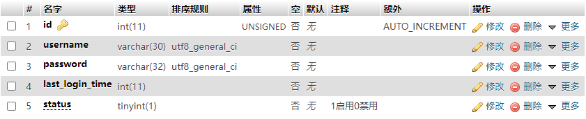
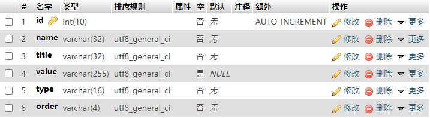
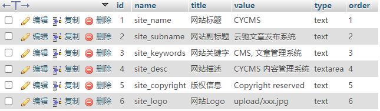
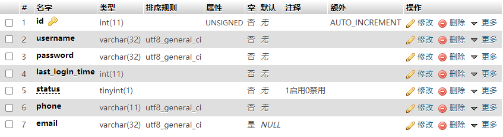
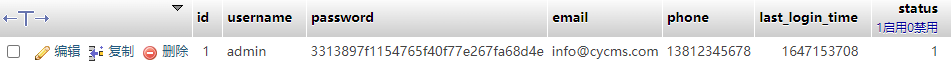

# 运行环境

- PHP7.3
- MySQL 5.7


# 环境配置

安装 TP6

~~~
composer create-project topthink/think tp 6.0.*
~~~


安装插件

~~~
composer require topthink/think-multi-app
composer require topthink/think-view
~~~


服务器指向路径

- /public


打开 Debug 模式

- .env


删除里边的数据库连接信息，我们在别的地方配置

~~~
APP_DEBUG = true

[APP]
DEFAULT_TIMEZONE = Asia/Shanghai

[LANG]
default_lang = zh-cn
~~~


配置数据库

- config\database.php

> .env 的优先级要比 database.php 要高，为了避免暴露数据，最好将 .env 中的数据库配置删除，然后再 config/database.php 中进行配置

主要修改信息：

- 自动写入时间戳
- 数据库地址
- 数据库名
- 数据库用户名
- 数据库密码
- 数据库端口
- 数据库编码
- 数据库前缀


测试后台首页

- app\ysadmin\controller\Index.php

~~~php
<?php
namespace app\ysadmin\controller;

use app\BaseController;

class Index extends BaseController
{
    public function index()
    {
        echo '后台首页控制器';
    }
}

~~~


入口文件解析：
http://www.ysreview.com/index.php/ysadmin/index/index

> 访问后台：`http://www.ysreview.com/ysadmin/`
> 默认 index 可以省略

~~~
index.php 项目入口文件
ysadmin 控制器命名空间
index 类
index 方法
~~~


# 后台登陆页

## 1. 创建控制器

- app\ysadmin\controller\Login.php

~~~php
<?php
namespace app\cyadmin\controller;

use app\BaseController;

class Login extends BaseController
{
    public function index()
    {
        return view();
    }
}

~~~

## 2. 视图

视图文件

- app\cyadmin\view\login\index.html

  ~~~html
  <!DOCTYPE html>
  <html lang="en">
    <head>
      <meta charset="UTF-8" />
      <meta http-equiv="X-UA-Compatible" content="IE=edge" />
      <meta name="viewport" content="width=device-width, initial-scale=1.0" />
      <link rel="stylesheet" href="/public/admin/css/login.css" />
      <script src="/static/admin/js/jquery.min.js"></script>
      <title>YSReview 后台登陆</title>
    </head>
    <body>
      <div class="login">
        <h2>用户登录</h2>
        <form id="">
          <input type="text" placeholder="请输入用户名" />
          <input type="password" placeholder="请输入密码" />
          <div class="captcha">
            <input type="text" placeholder="请输入验证码" />
            
          </div>
          <button class="submit">登录</button>
        </form>
      </div>
    </body>
  </html>
  ~~~

  

静态资源文件

- public\static\admin\css

  ~~~css
  * {
    margin: 0;
    padding: 0;
    box-sizing: border-box;
  }
  
  body {
    background: linear-gradient(100deg, #eef6fd, #62b1fb);
    height: 100vh;
  }
  
  .login {
    position: absolute;
    width: 400px;
    height: 400px;
    right: 15%;
    top: 25%;
    background-color: #fff;
    box-shadow: 0 0 15px rgba(0, 0, 0, 0.4);
    display: flex;
    flex-direction: column;
    align-items: center;
  }
  
  .login h2 {
    margin-top: 45px;
    color: #4386b8;
  }
  
  .login form {
    display: flex;
    flex-direction: column;
    margin-top: 25px;
  }
  
  .login input {
    outline: none;
    margin-top: 10px;
    height: 35px;
    padding: 0 25px;
  }
  
  .login input:focus {
    border: #62b1fb;
    box-shadow: 0 0 5px #3d9bed;
  }
  
  .captcha input {
    width: 200px;
  }
  
  .captcha img {
    width: 100px;
    height: 35px;
    vertical-align: bottom;
  }
  
  .submit {
    border: none;
    background-color: #3d9bed;
    font-size: 16px;
    text-align: center;
    letter-spacing: 35px;
    text-indent: 35px;
    color: white;
    margin-top: 40px;
    height: 35px;
  }
  
  ~~~

  

- public\static\admin\images
- public\static\admin\js
  
  - jquery.min.js
- public\static\admin\lib
  
  - layui


## 3. 路径常量

页面可以显示，但是缺失 css 与 js 等文件的加载，是由于路径不正确造成的

- **解决方法1：** 直接使用绝对路径，如：

~~~html
<link rel="stylesheet" href="/static/admin/lib/layui/css/layui.css" media="all" />
~~~


将 public 文件夹内 index.php 等文件，放到根目录

~~~
.htaccess
favicon.ico
index.php
robots.txt
router.php
~~~

> static 静态资源文件夹不需要移动


需要修改 index.php 中的环境变量

~~~
require __DIR__ . './vendor/autoload.php';
~~~


- **解决方法2：** 添加静态路径替换变量

config\view.php

~~~
// 模板输出字符串替换
'tpl_replace_string' => [
    '__STATIC__' => 'http://www.cycms.com' . '/static',
],
~~~


然后视图中使用

~~~html
<link rel="stylesheet" href="__STATIC__/admin/css/xadmin.css">
~~~


修改视图内所有静态资源路径

- css
- js
- 图片

删除根路径下 runtime 文件夹，清空所有缓存，刷新


## 4. 创建数据库管理员表

数据表结构




插入一条数据，需要拿到加密的 password 和 时间戳，在控制器中暂时生成一个临时数据

~~~php
public function index()
{
    $admin_pw_salt = 'cycms_$';
    $password = md5($admin_pw_salt.'123456');
    halt(time(), $password);

    return view();
}
~~~

>1653632416
>
>3313897f1154765f40f77e267fa68d4e


插入数据

~~~sql
INSERT INTO `cy_admin` (`id`, `name`, `password`, `login_time`, `status`) VALUES (NULL, 'admin', '3313897f1154765f40f77e267fa68d4e', '1646973308', '1');
~~~


## 5. 前端提交数据

前端利用 Ajax 提交数据

~~~js
// 监听提交事件
$('#form').submit(function(e){
    // 阻止默认 submit 提交事件
    e.preventDefault();
    // Ajax 提交数据
    $.ajax({
        url:"{:url('login/index')}",
        type:'post',
        data: $("#form").serialize(),
        success:(res)=>{
            layer.msg('登录成功', { time: 1500 })
        }
    })        
})
~~~


由于需要使用到弹出框，所以还需要加载 layui 的 css 和 js，另外表单提交也需要 name 属性，所以改造后的登录页面如下

~~~html
<!DOCTYPE html>
<html lang="en">
  <head>
    <meta charset="UTF-8" />
    <meta http-equiv="X-UA-Compatible" content="IE=edge" />
    <meta name="viewport" content="width=device-width, initial-scale=1.0" />
    <link rel="stylesheet" href="__STATIC__/admin/css/login.css" />
    <link rel="stylesheet" href="__STATIC__/admin/lib/layui/css/layui.css" />
    <script src="__STATIC__/admin/js/jquery.min.js"></script>
    <script src="__STATIC__/admin/lib/layui/layui.js"></script>

    <title>YSReview 后台登陆</title>
  </head>
  <body>
    <div class="login">
      <h2>用户登录</h2>
      <form id="form">
        <input type="text" name="username" placeholder="请输入用户名" />
        <input type="password" name="password" placeholder="请输入密码" />
        <div class="captcha">
          <input type="text" name="captcha" placeholder="请输入验证码" />
          
        </div>
        <button class="submit">登录</button>
      </form>
    </div>
    <script>
      // 监听提交事件
      $('#form').submit(function(e){
        // 阻止默认 submit 提交事件
        e.preventDefault();
        // Ajax 提交数据
        $.ajax({
          url:"{:url('login/index')}",
          type:'post',
          data:  $("#form").serialize(),
          success:(res)=>{
            layer.msg('登录成功', { time: 1500 })
          }
        })
      })
    </script>
  </body>
</html>

~~~


## 6. 后端登录接口

~~~php
<?php

namespace app\ysadmin\controller;

use app\BaseController;
use think\facade\Db;

class Login extends BaseController {
  public function index() {
    // Salt
    $admin_pw_salt = 'cycms_$';
    // 判断是否有 POST 数据
    if (request()->isPost()) {
      // 获取 Ajax 传递过来的表单数据
      $data = input('post.');
      // 通过用户名拿到数据库中的数据
      $adminData = Db::name('admin')->where('username', $data['username'])->find();
      // 判断用户名是否存在
      if (!$adminData) {
        return json(['message' => '用户名或密码不正确', 'code' => 0]);
      }
      // 判断密码是否正确
      if ($adminData['password'] != md5($admin_pw_salt . $data['password'])) {
        return json(['message' => '用户名或密码不正确', 'code' => 0]);
      }
      return json(['message' => '登录成功', 'code' => 1]);
    }
    return view();
  }
}

~~~


Ajax 直接返回接口中的 message，并且判断 code，如果成功登录，那么我们进行跳转到后台首页

~~~js
$.ajax({
    url: "{:url('Login/index')}",
    type: 'post',
    data: $('#form').serialize(),
    success: (res) => {
        // 弹框成功后进行跳转
        layer.msg(res.message, { time: 1500 }, function () {
            if (res.code === 1) {
                location.href = "{:url('Index/index')}"
            }
        })
    },
})
~~~


## 7. 添加验证码

安装插件

~~~shell
composer require topthink/think-captcha
~~~


验证码配置文件

~~~
config/captcha.php
~~~


插入模板文件

~~~
 {:captcha_img()}
~~~


对验证码进行验证需要开启 session 功能

app\middleware.php

~~~php
<?php
// 全局中间件定义文件
return [
    // 全局请求缓存
    // \think\middleware\CheckRequestCache::class,
    // 多语言加载
    // \think\middleware\LoadLangPack::class,
    // Session初始化
    \think\middleware\SessionInit::class
];

~~~


视图中插入代码

~~~html
<div class="captcha">
    <input type="text" name="captcha" placeholder="请输入验证码" />
    {:captcha_img()}
</div>
~~~


控制器中对验证码进行校验

~~~php
if (!captcha_check($data['captcha'])) {
    return json(['message' => '验证码不正确', 'code' => 0]);
}
~~~


我们可以将验证码放在最上边，如果验证码不正确，我们就不用浪费资源去数据库中查找数据。

~~~php
public function index() {
    $admin_pw_salt = 'cycms_$';
    if (request()->isPost()) {
        $data = input('post.');
        // 判断验证码是否正确
        if (!captcha_check($data['captcha'])) {
            return json(['message' => '验证码不正确', 'code' => 0]);
        // 省略其他代码
        }
    }
}
~~~


## 8. 更新登录时间

当登录成功后，我们插入登录时间，及登录IP

~~~php
// 插入登录时间
Db::name('admin')->where('id', $adminData['id'])->update(['last_login_time' => time()]);
// 获取客户端 IP
$ip = $_SERVER['REMOTE_ADDR'];
Db::name('admin')->where('id', $adminData['id'])->update(['login_ip' => $ip]);
~~~


## 9. 缓存管理员数据

将需要用到的管理员数据存入到 Session 中

~~~php
session(
    'adminSessionData',
    [
        'admin_id' => $adminData['id'],
        'admin_username' => $adminData['username'],
        'admin_status' => $adminData['status'],
    ]
);
~~~

> 没必要把所有数据都放入 session，尤其是密码，只提取需要的即可。


## 10. 安全验证

### 1. 后端验证

对用户提交的数据进行过滤

- strip_tags 去除 HTML 标签
- htmlspecialchars 将特殊字符转换实体
- trim 过滤掉首尾空格
- addslashes 在每个双引号前加反斜杠（转义字符）

~~~php
// 过滤掉空格
$data = input('post.', '', 'trim');

// 多个验证规则
$data = input('post.', '', 'htmlspecialchars,trim');
~~~

> 第二个参数是默认返回值，即如没 post 数据则返回空


也可以在全局中开启所有表单验证

app\Request

~~~php
<?php
    namespace app;

// 应用请求对象类
class Request extends \think\Request
{
    protected $filter = ['trim','strip_tags','htmlspecialchars'];
}
~~~


创建验证器

app\common\validate\Admin.php

~~~php
<?php

namespace app\common\validate;

use think\exception\ValidateException;

use think\Validate;

class Admin extends Validate {
  protected $rule = [
    'username|用户名' => 'require|length:4,16|chsDash',
    'password|' => 'require|length:6,16|alphaDash',
    'captcha' => 'require|max:4|alphaNum'
  ];
  protected $message = [
    'username.require' => '用户名不能为空',
    'username.length' => '用户名长度为 4-16 个字符',
    'username.chsDash' => '用户名中只可以使用汉字、字母、数字、下划线、破折号',
    'password.require' => '密码不能为空',
    'password.length' => '密码长度为 6-16 个位',
    'password.alphaDash' => '密码中只可以使用字母、数字、下划线、破折号',
    'captcha.require' => '验证码不能为空',
    'captcha.max' => '验证码最多不能超过4个字符',
    'captcha.alphaNum' => '验证码中只可以使用字母、数字',
  ];

  protected $scene = [
    'login' => ['username', 'password', 'captcha'],
  ];
}

~~~


控制器中进行验证

~~~php
// 验证器进行验证            
try {
    validate(\app\common\validate\Admin::class)->scene('admin')->check($data);
} catch (ValidateException $e) {
    return json(['message' => $e->getError(), 'code' => 0]);
}
~~~


由于使用到了 ValidateException 类，所以需要引入

~~~php
use think\exception\ValidateException;
~~~


### 2. 前端进行

前端验证挡君子不挡小人，如果用户不是通过浏览器提交数据，而是直接使用类似 postman 这样的工具向接口发送数据的话，那么这些验证就不起作用了。不过依然要写。


根据后端设置的规则，前端同样做相同验证，创建 verify.js，由于在很多地方都需要做验证，所以把该 js 文件放到静态资源中

public\static\admin\js\verify.js

~~~js
//用户名正则，4到16位（汉字，字母，数字，下划线，减号）
var usernamePattern = /^[a-zA-Z0-9_-\u4E00-\u9FA5]{4,16}$/

//密码正则，4到16位（字母，数字，下划线，减号）
var passwordPattern = /^[a-zA-Z0-9_-\u4E00-\u9FA5]{4,16}$/

//验证码正则，2-4位，字母和数字
var captchaPattern = /^[a-zA-Z0-9]{2,4}$/

//密码强度正则，最少6位，包括至少1个大写字母，1个小写字母，1个数字，1个特殊字符
var pStrengthPattern = /^.*(?=.{6,})(?=.*\d)(?=.*[A-Z])(?=.*[a-z])(?=.*[!@#$%^&*? ]).*$/

//正整数正则
var posPattern = /^\d+$/

//负整数正则
var negPattern = /^-\d+$/

//整数正则
var intPattern = /^-?\d+$/

//Email正则
var ePattern = /^([A-Za-z0-9_\-\.])+\@([A-Za-z0-9_\-\.])+\.([A-Za-z]{2,4})$/

//手机号正则
var mPattern = /^1[34578]\d{9}$/

//包含中文正则
var cnPattern = /[\u4E00-\u9FA5]/

function verify($pattern, $value) {
  if ($pattern.test($value)) {
    return true
  }
}
~~~


前端引入

~~~html
<script src="__STATIC__/admin/js/verify.js"></script>
~~~


这里我们对 ajax 提交的 data 进行挨个验证，方法：

- 可以对 `$("#form").serialize()` 进行切割，提取各个表单值
  - 有可能会被用户提交恶意数据
- 可以直接使用 Ajax 拿到各个 input 的表单值，重新构造 data 成为一个对象
  - 优势就是不怕用户自己提交自定义表单。


- 给表单加上 ID

~~~html
<form id="form">
    <input type="text" name="username" id="username" placeholder="请输入用户名" />
    <input type="password" name="password" id="password" placeholder="请输入密码" />
    <div class="captcha">
        <input type="text" name="captcha" id="captcha" placeholder="请输入验证码" />
        {:captcha_img()}
    </div>
    <button class="submit">登录</button>
</form>
~~~

> 其实光用 class 也可以


- Ajax 获取表单数据

~~~js
var data = {
    username: $('#username').val(),
    password: $('#password').val(),
    captcha: $('#captcha').val(),
}
~~~


在拿到表单数据后，对表单数据进行验证

~~~js
// 监听提交事件
$('#form').submit(function (e) {
    e.preventDefault()
    var data = {
        username: $('#username').val(),
        password: $('#password').val(),
        captcha: $('#captcha').val(),
    }
    // 用户名数据规则验证
    if (!verify(usernamePattern, data.username)) {
        layer.msg('用户名规则：4到16位汉字，字母，数字，下划线，减号', { time: 1500 })
        return false
    }
    // 密码数据规则验证
    if (!verify(passwordPattern, data.password)) {
        layer.msg('密码规则：4到16位字母，数字，下划线，减号', { time: 1500 })
        return false
    }
    // 验证码数据规则验证
    if (!verify(captchaPattern, data.captcha)) {
        layer.msg('验证码不符合规则', { time: 1500 })
        return false
    }
    $.ajax({
        url: "{:url('Login/index')}",
        type: 'post',
        data: data,
        success: (res) => {
            layer.msg(res.message, { time: 1500 }, function () {
                if (res.code === 1) {
                    location.href = "{:url('Index/index')}"
                }
            })
        },
    })
})
~~~


### 3. 加入 Token 防止 CSRF

防止 CSRF 和 CSS，攻击流程

- 当用户浏览其他网站时，该网站被恶意攻击，网站上会自动运行一个我们自己网站的 API，比如说转账，此时构造的 API 不管是 POST 还是 GET 都会携带参数，如：

~~~
http://www.ysreview.com/admin/transfer/?money=10000&toUser=John
~~~

- 这个链接只有管理员可以运行，当管理员的 Session 还没失效的情况下，就会自动转账给别人


通过给网页加入 token，那么每次提交数据都会携带本网站上生成的一个随机值（token），如：

~~~
username: admin
password: 123456
captcha: ab
__token__: ed2540bf6495faaaeb51a469b2901ea3
~~~


前端放入 Token

验证规则支持对表单的令牌验证，首先需要在你的表单里面增加下面隐藏域：

~~~html
<input type="hidden" name="__token__" value="{:token()}" />
~~~


也可以直接使用

~~~
{:token_field()}
~~~


如果是 Ajax 提交数据，可以把 Token 放在 meta 中

~~~html
<meta name="csrf-token" content="{:token()}">
~~~


或者直接使用

~~~html
{:token_meta()}
~~~


然后在全局Ajax中使用这种方式设置X-CSRF-Token 请求头并提交：

~~~js
$.ajaxSetup({
    headers: {
        'X-CSRF-TOKEN': $('meta[name="csrf-token"]').attr('content')
    }
});
~~~


当然不要忘记把表单数据加入到 data 当中

~~~js
var data = {
    username: $('#username').val(),
    password: $('#password').val(),
    captcha: $('#captcha').val(),
    __token__: $('[name="__token__"]').val()
}
~~~


后端进行 Token 验证

- 控制器中验证

~~~php
namespace app\ysadmin\controller;
use think\exception\ValidateException;
use think\Request;
class Index
{
    public function index(Request $request)
    {
        $check = $request->checkToken('__token__');
        if(false === $check) {
            throw new ValidateException('invalid token');
        }
        // ...
    }
}
~~~


- 验证器中验证

~~~php
protected $rule = [
    'name' => 'require|max:25|token',
    'email' => 'email',
];
~~~

> 随便在一个字段中加入 token 即可


如果是 Ajax 表单提交的时候数据验证没有通过，这时候如果再次提交的话 就会提示令牌已经失效或者失败。这是因为 Thinkphp 中的 token 只是一次性验证，验证后 token 会自动销毁。只有重新刷新页面，才会有新的 Token 值。解决办法：


在控制器里面添加一个 获取token的方法，设置 getToken 方法

~~~php
public function getToken() {
    return token();
}
~~~


前端 Ajax 验证没有通过的时候，更改页面隐藏表单的 token 值

~~~js
$.ajax({
    url: "{:url('Login/index')}",
    type: 'POST',
    data: data,
    success: (res) => {
        layer.msg(res.message, { time: 1500 }, function () {
            if (res.code === 1) {
                location.href = "{:url('Index/index')}"
                // 如果没有登录成功的话，重新获取 token
            } else {
                $.ajax({
                    url: "{:url('Login/getToken')}",
                    success: (res) => {
                        console.log(res)
                        $('[name="__token__"]').val(res)
                    },
                })
            }
        })
    },
})
~~~

> 只做了两次回调，还没形成回调地狱，有时间可以再封装成 Promise ，然后使用 async, await


### 4. 限制表单字段

之前在后端接受数据的时候，我们使用的是 post. 接受数据，这样就会把所有请求过来的表单数据接受过来，为了防止别人对我们 post 没必要的字段，在 Login 控制器中最好把所需字段重新提取一下。

~~~php
// 获取 Ajax 传递过来的表单数据
$data = array(
    'username' => input('post.username'),
    'password' => input('post.password'),
    'captcha' => input('post.captcha'),
    '__token__' => input('post.__token__'),
);
~~~


### 5. JWT 登录

Session 登录与 Token 登录的区别：

- Session
  - 每个用户经过我们的应用认证之后，我们的应用都要在服务端做一次记录，以方便用户下次请求的鉴别
  - 通常而言session都是保存在服务器中
  - 而随着认证用户的增多，服务端的开销会明显增大。
  - 如果认证的记录被保存在内存中的话，这意味着用户下次请求还必须要请求在这台服务器上,这样才能拿到授权的资源，这样在分布式的应用上，相应的限制了负载均衡器的能力。这也意味着限制了应用的扩展能力。
  - 因为是基于cookie来进行用户识别的, cookie如果被截获，用户就会很容易受到跨站请求伪造的攻击。
- Token
  - token 保存在客户端中
  - token认证机制的应用不需要去考虑用户在哪一台服务器登录


JWT 验证和表单加入 token 有些不同，JWT 验证是为了分布式登录，流程如下：

- 用户使用用户名密码来请求服务器
- 服务器进行验证用户的信息
- 服务器通过验证发送给用户一个token
- 客户端存储token，并在每次请求时附送上这个token值
- 服务端验证token值，并返回数据
  这个token必须要在每次请求时传递给服务端，它应该保存在请求头里， 另外，服务端要支持`CORS(跨来源资源共享)`策略，一般我们在服务端这么做就可以了`Access-Control-Allow-Origin: *`。

https://www.php.cn/blog/detail/35353.html


安装 JWT 插件

~~~shell
composer require firebase/php-jwt
~~~


tp6重新封装JWT

- 在`app`文件夹下新建一个`services`文件夹

- 在`services`文件夹下新建`JwtService.php`内容如下

  ~~~php
  <?php
  namespace app\services;
   use Firebase\JWT\JWT;
   use Firebase\JWT\Key;
  use Symfony\Component\VarDumper\VarDumper;
  class JwtService{
      public function getToken($uid){
          $key="xuanransoftware";//自定义key值
          $payload=array(
              "iss"=>'http://api.xuanransoftware.com',//签发者
              "aud"=>"http://api.xuanransoftware.com",//接收者
              "iat"=>time(),//初始时间
              "nbf"=>time()+60*60*24*7,//过期时间为7天
              "uid"=>$uid,//前端页面传uid
          );
          $jwt=JWT::encode($payload,$key,'HS256');
          return $jwt;
      }
      public function checkToken($token){
          $key="xuanransoftware";//自定义key值
          $decoded=JWT::decode($token,new Key($key,'HS256'));
          return $decoded;
      }
  ~~~

- Login 控制器

  ~~~php
  <?php
  declare (strict_types = 1);
  namespace app\controller\admins;
  use think\Request;
  use app\BaseController;
  // 引入admin模型
  use app\model\Admin;
  //引入JWT进行token验证
  use app\services\JwtService;
  class Login extends BaseController
  {
      /**
       * 显示资源列表
       *
       * @return \think\Response
       */
      public function login(Request $request)
      {
          //判断是否为post请求
          if($request->isPost()){
              //获取post参数
              $params = $request->param() ;
              $userName =trim($params['username']);
              $password =trim(sha1($params['password']));
              //使用Admin模型查找用户名和密码
              $db = new Admin();
              $index = $db->find('username',$userName);
              //判断用户是否存在
              if (isset($index)){
                  //判断密码是否正确
                  if($password==$index['password']){
                      //更新登录时间
                      $index->lastlogin = time();
                      $index->save();
                      //根据用户id生成token
                      $jwt = new JwtService();
                      $token = $jwt->getToken($index['id']);
                      return $this->msg(1,'登录成功',$token);
                  }
                  else{
                      return $this->msg(0,'密码错误');
                  }
              }else{
                  return $this->msg(0,'用户名不存在，请注册后重新登录');
              }
          }else{
              return $this->msg(0,'请求类型码错误');
          }
      }
      //返回状态码
      private function msg($code,$msg,$token='')
      {
          return json(['code'=>$code,'msg'=>$msg,'token'=>$token]);
      }
  }
  ~~~

- 新建 CheckToken 中间件

  ~~~php
  <?php
  declare (strict_types = 1);
  namespace app\middleware;
  use app\services\JwtService;
  class CheckToken
  {
      /**
       * 处理请求
       *
       * @param \think\Request $request
       * @param \Closure       $next
       * @return Response
       */
      public function handle($request, \Closure $next)
      {
          $token=$request->param('token');
          //没有token
          if (!$token){
              return response("token是空的");
          }
          //没有找到jwt类
          $jwt=new JwtService();
          try {
              $decode=$jwt->checkToken($token);
          }catch (\Exception $e){
              echo $e;
              return response("位置错误");
          }
          //解析token
          $decode=json_decode(json_encode($decode),true);
          var_dump($decode);
          if (!$decode){
              return response("token 不合法");
          }
          if (time() > $decode['nbf']){
              return response("token 已过期");
          }
          return $next($request);
      }
  }
  ~~~

  


## 11. 模型

一般来说，我们控制器拿到数据后，会交给模型来数据数据，并与数据库交互，而控制器只是处理逻辑业务的。现在我们所有的代码都在控制器上，因此我们要抽离数据处理业务。


目前 Login Controller 

~~~php
<?php

namespace app\ysadmin\controller;

use app\BaseController;
use think\facade\Db;
use think\exception\ValidateException;

class Login extends BaseController {
  public function index() {
    // Salt
    $admin_pw_salt = 'cycms_$';
    // 判断是否有 POST 数据
    if (request()->isPost()) {
      // 获取 Ajax 传递过来的表单数据
      $data = input('post.', '', 'trim');
      // 使用验证器验证表单       
      try {
        validate(\app\common\validate\Admin::class)->scene('admin')->check($data);
      } catch (ValidateException $e) {
        return json(['message' => $e->getError(), 'code' => 0]);
      }
      // 判断验证码是否正确
      if (!captcha_check($data['captcha'])) {
        return json(['message' => '验证码不正确', 'code' => 0]);
      }
      // 通过用户名拿到数据库中的数据
      $adminData = Db::name('admin')->where('username', $data['username'])->find();
      // 判断用户名是否存在
      if (!$adminData) {
        return json(['message' => '用户名或密码不正确', 'code' => 0]);
      }
      // 判断密码是否正确
      if ($adminData['password'] != md5($admin_pw_salt . $data['password'])) {
        return json(['message' => '用户名或密码不正确', 'code' => 0]);
      }
      // 向数据库写入登录时间
      Db::name('admin')->where('id', $adminData['id'])->update(['last_login_time' => time()]);
      // 向数据库写入登录IP
      $ip = $_SERVER['REMOTE_ADDR'];
      Db::name('admin')->where('id', $adminData['id'])->update(['login_ip' => $ip]);
      // 保存 Session
      session(
        'adminSessionData',
        [
          'admin_id' => $adminData['id'],
          'admin_username' => $adminData['username'],
          'admin_status' => $adminData['status'],
        ]
      );
      return json(['message' => '登录成功', 'code' => 1]);
    }
    return view();
  }

  public function getToken() {
    return token();
  }
}

~~~


### 1. 创建模型

app\ysreview\model\Admin.php

~~~php
<?php

namespace app\ysadmin\model;

use think\Model;

class Admin extends Model {
  // 数据库去前缀名
  protected $name = 'admin';
    
}
~~~


### 2. 模型调用方法

由于 model 可以直接与数据库交互，所以我们就不用 Db 方法，直接使用 $this 调用模型与数据库交互，如：

~~~php
$adminData = $this->where('username', $data['username'])->find();
~~~


### 3. 控制器中调用模型方法

控制器调用模型方法

- 引入模型

  ~~~php
  use app\ysadmin\model\Admin as AdminModel;
  ~~~

  

- 创建实例

  ~~~php
  $admin = new AdminModel();
  ~~~

  

- 调用实例中的方法

  ~~~php
  $adminData = $admin->where('username', $data['username'])->find();
  ~~~

  

由于我们在控制器中都只使用了模型的基类方法（如 find, where, select），所以可以直接调用模型的静态方法，如：

~~~php
$adminData = AdminModel::where('username', $data['username'])->find();
~~~

> 注：在模型中自定方法不能使用静态方法调用


另外，控制器中就不需要引入 Db 了

~~~php
<?php

namespace app\ysadmin\controller;

use app\BaseController;
use app\ysadmin\model\Admin as AdminModel;
use think\exception\ValidateException;

class Login extends BaseController {
  public function index() {
    // 判断是否登录
    if (session('adminSessionData')) {
      return redirect('/ysadmin');
    }
    // 判断是否有 POST 数据
    if (request()->isPost()) {
      // 获取 Ajax 传递过来的表单数据
      $data = array(
        'username' => input('post.username'),
        'password' => input('post.password'),
        'captcha' => input('post.captcha'),
        '__token__' => input('post.__token__'),
      );

      // 使用验证器验证表单       
      try {
        validate(\app\common\validate\Admin::class)->scene('admin')->check($data);
      } catch (ValidateException $e) {
        return json(['message' => $e->getError(), 'code' => 0]);
      }

      // 判断验证码是否正确
      if (!captcha_check($data['captcha'])) {
        return json(['message' => '验证码不正确', 'code' => 0]);
      }

      // 通过用户名拿到数据库中的数据
      $adminData = AdminModel::where('username', $data['username'])->find();

      // 判断用户名是否存在
      if (!$adminData) {
        return json(['message' => '用户名或密码不正确', 'code' => 0]);
      }

      // 判断密码是否正确
      $admin_pw_salt = 'cycms_$';
      if ($adminData['password'] != md5($admin_pw_salt . $data['password'])) {
        return json(['message' => '用户名或密码不正确', 'code' => 0]);
      }

      // 向数据库写入登录时间
      AdminModel::where('id', $adminData['id'])->update(['last_login_time' => time()]);

      // 向数据库写入登录IP
      $ip = $_SERVER['REMOTE_ADDR'];
      AdminModel::where('id', $adminData['id'])->update(['login_ip' => $ip]);

      // 保存 Session
      session(
        'adminSessionData',
        [
          'admin_id' => $adminData['id'],
          'admin_username' => $adminData['username'],
          'admin_status' => $adminData['status'],
        ]
      );
      return json(['message' => '登录成功', 'code' => 1]);
    }
    return view();
  }

  public function getToken() {
    return token();
  }
}

~~~


## 12. 路由

为了让URL更规范以及优雅，以及各种安全方面的原因（不想让人乱入），我们需要定义路由


### 1. 配置路由

在 config\route.php 开启强制路由

~~~php
// 是否强制使用路由(如果强制路由则所有没有路由的会访问错误)
'url_route_must' => true,
// 路由是否完全匹配
'route_complete_match' => true,
~~~


### 2. 定义路由

```
├─app           应用目录
│  ├─app_name           应用目录
│  │  ├─common.php      函数文件
│  │  ├─controller      控制器目录
│  │  ├─model           模型目录
│  │  ├─view            视图目录
│  │  ├─config          配置目录
│  │  ├─route           路由目录
│  │  │  ├─route.php    路由定义
│  │  │  ├─api.php      路由定义
│  │  │  └─...          更多路由定义
```


app\ysreview\route\route.php

~~~php
<?php
use think\facade\Route;

Route::get('/', 'Index/index');
Route::get('login', 'Login/index');
Route::post('login', 'Login/index');
Route::get('login/getToken', 'Login/getToken');
~~~


# 后台首页

## 1. 创建控制器

app\cyadmin\controller\Index.php

~~~php
<?php
namespace app\ysadmin\controller;

use app\BaseController;

class Index extends BaseController
{
    public function index()
    {
        return view();
    }
}

~~~


## 2. 视图

app\cyadmin\view\index\index.html

修改 js, css 静态资源路径

~~~html
<!DOCTYPE html>
<html>
  <head>
    <meta charset="utf-8" />
    <meta name="viewport" content="width=device-width, initial-scale=1, maximum-scale=1" />
    <title>后台管理面板</title>
    <link rel="stylesheet" href="__STATIC__/admin/lib/layui/css/layui.css" />
  </head>
  <body>
    <div class="layui-layout layui-layout-admin">
      <div class="layui-header">
        <div class="layui-logo layui-hide-xs layui-bg-black">后台管理面板</div>
        <!-- 头部区域（可配合layui 已有的水平导航） -->
        <ul class="layui-nav layui-layout-left">
          <!-- 移动端显示 -->
          <li class="layui-nav-item layui-show-xs-inline-block layui-hide-sm" lay-header-event="menuLeft">
            <i class="layui-icon layui-icon-spread-left"></i>
          </li>

          <li class="layui-nav-item layui-hide-xs"><a href="">nav 1</a></li>
          <li class="layui-nav-item layui-hide-xs"><a href="">nav 2</a></li>
          <li class="layui-nav-item layui-hide-xs"><a href="">nav 3</a></li>
          <li class="layui-nav-item">
            <a href="javascript:;">nav groups</a>
            <dl class="layui-nav-child">
              <dd><a href="">menu 11</a></dd>
              <dd><a href="">menu 22</a></dd>
              <dd><a href="">menu 33</a></dd>
            </dl>
          </li>
        </ul>
        <ul class="layui-nav layui-layout-right">
          <li class="layui-nav-item layui-hide layui-show-md-inline-block">
            <a href="javascript:;">
              <!--  -->
              tester
            </a>
            <dl class="layui-nav-child">
              <dd><a href="">Your Profile</a></dd>
              <dd><a href="">Settings</a></dd>
              <dd><a href="">Sign out</a></dd>
            </dl>
          </li>
          <li class="layui-nav-item" lay-header-event="menuRight" lay-unselect>
            <a href="javascript:;">
              <i class="layui-icon layui-icon-more-vertical"></i>
            </a>
          </li>
        </ul>
      </div>

      <div class="layui-side layui-bg-black">
        <div class="layui-side-scroll">
          <!-- 左侧导航区域（可配合layui已有的垂直导航） -->
          <ul class="layui-nav layui-nav-tree" lay-filter="test">
            <li class="layui-nav-item layui-nav-itemed">
              <a class="" href="javascript:;">menu group 1</a>
              <dl class="layui-nav-child">
                <dd><a class="layui-bg-green" href="index.html">面板表单</a></dd>
                <dd><a href="">全屏面板</a></dd>
                <dd><a href="">全屏表格</a></dd>
                <dd><a href="">the links</a></dd>
              </dl>
            </li>
            <li class="layui-nav-item">
              <a href="javascript:;">menu group 2</a>
              <dl class="layui-nav-child">
                <dd><a href="javascript:;">list 1</a></dd>
                <dd><a href="javascript:;">list 2</a></dd>
                <dd><a href="">超链接</a></dd>
              </dl>
            </li>
            <li class="layui-nav-item"><a href="javascript:;">click menu item</a></li>
            <li class="layui-nav-item"><a href="">the links</a></li>
          </ul>
        </div>
      </div>

      <div class="layui-body">
        <!-- 内容主体区域 -->
        <div style="padding: 15px">
          <span class="layui-breadcrumb">
            <a href="../index.htm" tppabs="https://www.layui.site/">首页</a>
            <a href="index.htm" tppabs="https://www.layui.site/demo/">演示</a>
            <a><cite>导航元素</cite></a>
          </span>
        </div>
        <iframe src="demo.html" frameborder="0" id="demoAdmin" style="width: 100%; height:100%; border-radius: 2px;"></iframe>
      </div>

      <div class="layui-footer">
        <!-- 底部固定区域 -->
        底部固定区域
      </div>
    </div>
    <script src="__STATIC__/admin/lib/layui/layui.js"></script>
    <script>
      //JS
      layui.use(['element', 'layer', 'util'], function () {
        var element = layui.element,
          layer = layui.layer,
          util = layui.util,
          $ = layui.$

        //头部事件
        util.event('lay-header-event', {
          //左侧菜单事件
          menuLeft: function (othis) {
            layer.msg('展开左侧菜单的操作', { icon: 0 })
          },
          menuRight: function () {
            layer.open({
              type: 1,
              content: '<div style="padding: 15px;">处理右侧面板的操作</div>',
              area: ['260px', '100%'],
              offset: 'rt', //右上角
              anim: 5,
              shadeClose: true,
            })
          },
        })
      })
    </script>
  </body>
</html>

~~~


### 1. 分离模板

将头部、侧边栏、底部分离，放入 view\public 路径中

- app\cyadmin\view\public\header.html

  ~~~html
  <!DOCTYPE html>
  <html>
    <head>
      <meta charset="utf-8" />
      <meta name="viewport" content="width=device-width, initial-scale=1, maximum-scale=1" />
      <title>后台管理面板</title>
      <link rel="stylesheet" href="__STATIC__/admin/lib/layui/css/layui.css" />
    </head>
    <body>
      <div class="layui-layout layui-layout-admin">
        <div class="layui-header">
          <div class="layui-logo layui-hide-xs layui-bg-black">后台管理面板</div>
          <!-- 头部区域（可配合layui 已有的水平导航） -->
          <ul class="layui-nav layui-layout-left">
            <!-- 移动端显示 -->
            <li class="layui-nav-item layui-show-xs-inline-block layui-hide-sm" lay-header-event="menuLeft">
              <i class="layui-icon layui-icon-spread-left"></i>
            </li>
  
            <li class="layui-nav-item layui-hide-xs"><a href="">nav 1</a></li>
            <li class="layui-nav-item layui-hide-xs"><a href="">nav 2</a></li>
            <li class="layui-nav-item layui-hide-xs"><a href="">nav 3</a></li>
            <li class="layui-nav-item">
              <a href="javascript:;">nav groups</a>
              <dl class="layui-nav-child">
                <dd><a href="">menu 11</a></dd>
                <dd><a href="">menu 22</a></dd>
                <dd><a href="">menu 33</a></dd>
              </dl>
            </li>
          </ul>
          <ul class="layui-nav layui-layout-right">
            <li class="layui-nav-item layui-hide layui-show-md-inline-block">
              <a href="javascript:;">
                <!--  -->
                tester
              </a>
              <dl class="layui-nav-child">
                <dd><a href="">Your Profile</a></dd>
                <dd><a href="">Settings</a></dd>
                <dd><a href="">Sign out</a></dd>
              </dl>
            </li>
            <li class="layui-nav-item" lay-header-event="menuRight" lay-unselect>
              <a href="javascript:;">
                <i class="layui-icon layui-icon-more-vertical"></i>
              </a>
            </li>
          </ul>
        </div>
  
  ~~~

  

- app\cyadmin\view\public\left.html

  ~~~html
  <div class="layui-side layui-bg-black">
    <div class="layui-side-scroll">
      <!-- 左侧导航区域（可配合layui已有的垂直导航） -->
      <ul class="layui-nav layui-nav-tree" lay-filter="test">
        <li class="layui-nav-item layui-nav-itemed">
          <a class="" href="javascript:;">menu group 1</a>
          <dl class="layui-nav-child">
            <dd><a class="layui-bg-green" href="index.html">面板表单</a></dd>
            <dd><a href="index2.html">全屏面板</a></dd>
            <dd><a href="index3.html">全屏表格</a></dd>
            <dd><a href="">the links</a></dd>
          </dl>
        </li>
        <li class="layui-nav-item">
          <a href="javascript:;">menu group 2</a>
          <dl class="layui-nav-child">
            <dd><a href="javascript:;">list 1</a></dd>
            <dd><a href="javascript:;">list 2</a></dd>
            <dd><a href="">超链接</a></dd>
          </dl>
        </li>
        <li class="layui-nav-item"><a href="javascript:;">click menu item</a></li>
        <li class="layui-nav-item"><a href="">the links</a></li>
      </ul>
    </div>
  </div>
  ~~~

  

- app\cyadmin\view\public\footer.html

  ~~~html
  <div class="layui-footer">
    <!-- 底部固定区域 -->
    底部固定区域
  </div>
  </div>
  <script src="__STATIC__/admin/lib/layui/layui.js"></script>
  <script>
  //JS
  layui.use(['element', 'layer', 'util'], function () {
    var element = layui.element,
      layer = layui.layer,
      util = layui.util,
      $ = layui.$
  
    //头部事件
    util.event('lay-header-event', {
      //左侧菜单事件
      menuLeft: function (othis) {
        layer.msg('展开左侧菜单的操作', { icon: 0 })
      },
      menuRight: function () {
        layer.open({
          type: 1,
          content: '<div style="padding: 15px;">处理右侧面板的操作</div>',
          area: ['260px', '100%'],
          offset: 'rt', //右上角
          anim: 5,
          shadeClose: true,
        })
      },
    })
  })
  </script>
  </body>
  </html>
  ~~~


### 2. 引入分离模板

最后 view\Index\index.html 代码

~~~html
<div class="layui-body">
  <!-- 内容主体区域 -->
  <div style="padding: 15px">
    <span class="layui-breadcrumb">
      <a href="../index.htm" tppabs="https://www.layui.site/">首页</a>
      <a href="index.htm" tppabs="https://www.layui.site/demo/">演示</a>
      <a><cite>导航元素</cite></a>
    </span>
  </div>
  <iframe src="demo.html" frameborder="0" id="demoAdmin" style="width: 100%; height: 100%; border-radius: 2px"></iframe>
</div>
~~~


### 3. 主体区域

iframe 页面 demo.html

~~~html
<!DOCTYPE html>
<html lang="en">
  <head>
    <meta charset="UTF-8" />
    <meta http-equiv="X-UA-Compatible" content="IE=edge" />
    <meta name="viewport" content="width=device-width, initial-scale=1.0" />

    <title>Document</title>
  </head>
  <style>
    .main {
      margin: 10% auto;
      text-align: center;
    }
  </style>
  <body>
    <div class="main">
      Welcome Page
    </div>
  </body>
</html>

~~~


### 4. 主体区域路由

~~~php
// 后台首页
Route::get('/', 'Index/index');
Route::get('index/demo', 'Index/demo');
~~~


### 5. 控制器添加方法

~~~php
<?php

namespace app\ysadmin\controller;

use app\BaseController;

class Index extends BaseController {
  public function index() {
    return view();
  }

    // 添加显示 demo 页面的方法
  public function demo() {
    return view();
  }
}

~~~


## 3. 显示登录用户信息

我们可以通过登录后拿到的 session 中的数据显示登录用户信息


### 1. 创建父级控制器

很多地方可能需要公共的方法及变量，所以我们创建一个父级控制器

- app\cyadmin\controller\Base.php

~~~php
<?php
namespace app\cyadmin\controller;

use app\BaseController;

class Base extends BaseController
{
    public function initialize()
    {
        
    }
}

~~~


让其他控制器继承父类控制器，如：

~~~php
<?php
namespace app\ysadmin\controller;

class Index extends Base
{
    public function index()
    {
        return view();
    }

    public function welcome(){
        return view();
    }
}

~~~


### 2. 传递 session

我们可以将 session 放在父类控制器中的初始化方法，用于读取 session 中的数据

~~~php
<?php
namespace app\ysadmin\controller;

use app\BaseController;

class Base extends BaseController
{
    public function initialize()
    {
        $adminSessionData = session('adminSessionData');
    }
}

~~~


两种方法传递 session 到视图

- 方法1：父类控制器 View 静态类方法传入

~~~php
View::assign('adminSessionData',$adminSessionData);
~~~

> 需要引入类 use think\facade\View;
>
> **提示：**不要使用 View::fetch() 直接传递数组，因为需要定义模板，会造成报错（父类不能指定模板）


header 视图中调用即可

~~~php
// 传入字符串
View::assign('admin_username',$adminSessionData['admin_username']); 
~~~


视图中调用

~~~html
<a href="javascript:;">{$admin_username}</a>
~~~


- 方法2：直接在子类控制器传入 Session

~~~php
<?php
namespace app\cyadmin\controller;

class Index extends Base
{
    public function index()
    {
        $adminSessionData = session('adminSessionData');
        return view('',[
            'admin_username'=>$adminSessionData['admin_username']
        ]);
    }

    public function welcome(){
        return view();
    }
}

~~~


视图中调用：

~~~html
<a href="javascript:;">{$admin_username}</a>
~~~


- 方法3：模板中直接使用 session 方法

~~~php
<a href="javascript:;">{:session('adminSessionData.admin_username')}</a>
~~~


## 4. 注销

控制器中 logout 方法

~~~php
public function logout() {
    session('adminSessionData', null);
    return redirect('/ysadmin/login');
}
~~~


视图中注销链接

~~~html
<a href="{:url('index/logout')}">退出</a>
~~~


路由

~~~php
Route::get('index/logout', 'Index/logout');
~~~


## 5. 侧边栏菜单

ysadmin/view/public/left.html

~~~html
<div class="layui-side layui-bg-black">
  <div class="layui-side-scroll">
    <!-- 左侧导航区域（可配合layui已有的垂直导航） -->
    <ul class="layui-nav layui-nav-tree" lay-filter="test">
      <li class="layui-nav-item layui-bg-green"><a href="{:url('Index/index')}">后台首页</a></li>
      
      <li class="layui-nav-item layui-nav-itemed">
        <a class="" href="javascript:;">用户管理</a>
        <dl class="layui-nav-child">
          <dd><a href="">添加用户</a></dd>
          <dd><a href="">会员列表</a></dd>
        </dl>
      </li>
      <li class="layui-nav-item">
        <a href="javascript:;">文章管理</a>
        <dl class="layui-nav-child">
          <dd><a href="">分类管理</a></dd>
          <dd><a href="">添加文章</a></dd>
          <dd><a href="">文章列表</a></dd>
        </dl>
      </li>
      <li class="layui-nav-item">
        <a href="javascript:;">页面管理</a>
        <dl class="layui-nav-child">
          <dd><a href="">添加页面</a></dd>
          <dd><a href="">页面列表</a></dd>
        </dl>
      </li>
      <li class="layui-nav-item">
        <a href="javascript:;">评论管理</a>
        <dl class="layui-nav-child">
          <dd><a href="">评论列表</a></dd>
        </dl>
      </li>
      <li class="layui-nav-item">
        <a href="javascript:;">附件管理</a>
        <dl class="layui-nav-child">
          <dd><a href="">附件列表</a></dd>
        </dl>
      </li>
      <li class="layui-nav-item">
        <a href="javascript:;">管理员管理</a>
        <dl class="layui-nav-child">
          <dd><a href="">添加管理员</a></dd>
          <dd><a href="">管理员列表</a></dd>
        </dl>
      </li>
      <li class="layui-nav-item">
        <a href="javascript:;">系统设置</a>
        <dl class="layui-nav-child">
          <dd><a href="javascript:;">清空缓存</a></dd>
          <dd><a href="">网站设置</a></dd>
        </dl>
      </li>
    </ul>
  </div>
</div>
~~~


## 6. 失去 Session，登录页面嵌入 iFrame

在 Login 视图中加入 js 代码

~~~js
var _topWin = window		// 定义 _topWin 为当前 window
while (_topWin != _topWin.parent.window) {		// 如果当前 window 不是顶级 window
    _topWin = _topWin.parent.window				// 给 _topWin 指向顶级 window
}
if (window != _topWin) {						// 如果当前 window 不是顶级 window
    _topWin.document.location.href = '/ysadmin/login'	// 跳转到指定页面
}
~~~


判断流程

- 当我们点击侧边栏链接时，在 iframe 页面中打开子页面
- 子页面会通过 middleware 判断，没有 session，自动跳转到 login 页面
- js 代码会将 _topWin 指向 index 中的 window
- 判断 login 中的 window 不等于 index 中的 window
- 让 index 中的 window 进行跳转


如果我们单独访问 Login 页面

- _topWin 即当前 window，不会进入到 while 循环，也不会进入到 if 判断


# 登录权限控制

## 1. 创建中间件

app/middleware 目录下面创建 Check.php 前置中间件，模板如下：

~~~php
<?php

namespace app\middleware;

class Check {
  public function handle($request, \Closure $next) {
    if ($request->param('name') == 'think') {
      return redirect('index/think');
    }
    return $next($request);
  }
}

~~~


让该中间件是全局中间件，如果只想让这个中间件对 cyadmin 应用生效，需要复制中间件到指定 app 应用中

- ysadmin\middleware
- ysadmin\middleware.php


在 middleware.php 中打开刚刚定义的中间件（注意不要删除全局中间件文件）

~~~php
<?php
// 全局中间件定义文件
return [
    // 全局请求缓存
    // \think\middleware\CheckRequestCache::class,
    // 多语言加载
    // \think\middleware\LoadLangPack::class,
    // Session初始化
     \think\middleware\SessionInit::class,
     \app\cyadmin\middleware\Check::class
];

~~~


## 2. 前置中间件登录认证

中间件中判断逻辑

~~~php
public function handle($request, \Closure $next) {
    if (empty(session('adminSessionData'))) {
        return redirect('/ysadmin/login');
    }
    return $next($request);
}
~~~


此时，如果用户在访问登录页面时，会造成死循环。因为会不断的判断用户是否有 Session，然后做转向。所以登录界面不需要用中间件来判断，

- 利用正则判断 $request->pathinfo() 中的当前路径是否包含 login 字符串

~~~php
<?php

namespace app\ysadmin\middleware;

class Check {
  public function handle($request, \Closure $next) {
    if (empty(session('adminSessionData')) && !preg_match('/login/', $request->pathinfo())) {
      return redirect('/ysadmin/login');
    }
    return $next($request);
  }
}

~~~

>不用正则的话也可以使用 `$request->pathinfo() != 'login'` 但是必须要是在定义路由的情况下，否则我们用 /admin/Login/index 也同样会造成死循环


## 3. 阻止登录用户再次访问登录页面

如果已经登录的话，再访问登录界面应该需要直接跳转到后台，在 Login 控制器中进行判断

~~~php
// 判断是否登录
if (session('adminSessionData')) {
    return redirect('/ysadmin');
}
~~~


# 清空缓存

## 1. 初始化 Config 控制器

创建系统设置控制器 Config.php

app\ysadmin\controller\Config.php

~~~php
<?php

namespace app\ysadmin\controller;

class Config extends Base {
  public function index() {
    return view();
  }

  public function del_cache() {
  }
}

~~~


## 2. 公共方法

在 app\common.php 添加公共方法

~~~php
<?php
// 应用公共文件

// 删除目录
function delFileByDir($dir) {
  $dh = opendir($dir);
  while ($file = readdir($dh)) {
    if ($file != "." && $file != "..") {

      $fullpath = $dir . "/" . $file;
      if (is_dir($fullpath)) {
        delFileByDir($fullpath);
      } else {
        unlink($fullpath);
      }
    }
  }
  closedir($dh);
}
~~~


## 3. 控制器调用公共方法

使用 path_runtime() 获取缓存路径

~~~
\runtime\ysadmin\
~~~


添加删除逻辑

~~~php
public function del_cache() {
    $path = runtime_path();
    delFileByDir($path);
}
~~~

> 删除当前应用下的缓存，即 admin 下的缓存


如果想清空整个 runtime 缓存

~~~php
public function del_cache() {
    $path = root_path().'runtime';
    delFileByDir($path);
}
~~~


返回接口数据

~~~php
public function del_cache() {
    $path = root_path() . 'runtime';
    delFileByDir($path);
    return json(['message' => '清除缓存成功', 'code' => 1]);
}
~~~


## 4. 前端请求

在侧边栏定义链接，加上 ID

~~~html
<dd><a href="javascript:;" id="del_cache">清空缓存</a></dd>
~~~


在 Footer 中，发送 ajax 请求

~~~js
// 清空缓存
$('#del_cache').on('click',function(){
    $.ajax({
        url: "{:url('config/del_cache')}",
        type:'get',
        success:(res)=>{
            if(res.code === 1) { 
                layer.msg(res.message, { time: 1500 })
            } else {
                layer.msg('清除缓存失败', { time: 1500 })
            }
        }
    })
})
~~~


# 网站设置

## 1. 数据库建表

创建 ys_config 表




插入默认数据




## 1. 控制器

刚才在做系统设置的时候，已经配置了默认控制器

~~~php
<?php

namespace app\ysadmin\controller;

class Config extends Base {
  public function index() {
    return view();
  }

  public function del_cache() {
    $path = root_path() . 'runtime';
    delFileByDir($path);
    return json(['message' => '清除缓存成功', 'code' => 1]);
  }
}

~~~


## 2. 路由

~~~php
// 网站设置
Route::get('config/index', 'Config/index');
~~~


## 3. 视图

view\config\index.html


修改静态资源文件

~~~html
<link rel="stylesheet" href="__STATIC__/admin/lib/layui/css/layui.css" />
<script src="__STATIC__/admin/lib//layui/layui.js"></script>
~~~


~~~html
<!DOCTYPE html>
<html lang="en">
  <head>
    <meta charset="UTF-8" />
    <meta http-equiv="X-UA-Compatible" content="IE=edge" />
    <meta name="viewport" content="width=device-width, initial-scale=1.0" />
    <link rel="stylesheet" href="__STATIC__/admin/lib/layui/css/layui.css" />
    <script src="__STATIC__/admin/lib//layui/layui.js"></script>

    <title>Document</title>
  </head>
  <body>
    <div class="layui-bg-gray" style="padding: 30px">
      <div class="layui-row layui-col-space15">
        <div class="layui-col">
          <div class="layui-panel">
            <div style="padding: 50px 30px">
              <form class="layui-form" action="">
                <div class="layui-form-item">
                  <label class="layui-form-label">网站标题</label>
                  <div class="layui-input-block">
                    <input type="text" name="site_name" required lay-verify="required" autocomplete="off" class="layui-input" />
                  </div>
                </div>
                <div class="layui-form-item">
                  <label class="layui-form-label">网站副标题</label>
                  <div class="layui-input-block">
                    <input type="text" name="site_subname" required lay-verify="required" autocomplete="off" class="layui-input" />
                  </div>
                </div>
                <div class="layui-form-item">
                  <label class="layui-form-label">网站关键字</label>
                  <div class="layui-input-block">
                    <input type="text" name="site_keywords" required lay-verify="required" autocomplete="off" class="layui-input" />
                  </div>
                </div>
                <div class="layui-form-item">
                  <label class="layui-form-label">版权信息</label>
                  <div class="layui-input-block">
                    <input type="text" name="site_copyright" required lay-verify="required" autocomplete="off" class="layui-input" />
                  </div>
                </div>
                <div class="layui-form-item layui-form-text">
                  <label class="layui-form-label">网站描述</label>
                  <div class="layui-input-block">
                    <textarea name="site_desc" placeholder="请输入内容" class="layui-textarea"></textarea>
                  </div>
                </div>
                <div class="layui-form-item">
                  <div class="layui-input-block">
                    <button class="layui-btn" lay-submit lay-filter="form">立即提交</button>
                    <button type="reset" class="layui-btn layui-btn-primary">重置</button>
                  </div>
                </div>
              </form>
            </div>
          </div>
        </div>
      </div>
    </div>

    <script>
      //Demo
      layui.use('form', function () {
        var form = layui.form

        //监听提交
        form.on('submit(form)', function (data) {
          layer.msg(JSON.stringify(data.field))
          return false
        })
      })
    </script>
  </body>
</html>

~~~


## 3. 左侧边栏入口

当我们点击左侧边栏链接的时候，目的是让 iframe 中页面产生变化，而头部、底部、侧边栏不变。


当我们直接设置侧边导航菜单的链接时，整个页面直接进行跳转到子页面

~~~html
<dd><a href="{:url('config/index')}">网站设置</a></dd>
~~~


### 1. js 跳转

我们只需要定义一个 JS 函数，通过 菜单栏中 a 标签的 click 事件，然后传入 url 地址，来改变 iframe 中 src 的值，


函数如下：

~~~js
function navTo(url){
    $('iframe').attr('src',url);
}
~~~


通过给 a 标签添加 onclick 事件，改变 iframe 中的 src 

~~~js
<dd><a onclick="navTo('{:url(\'config/index\')}')" href="javascript:;">网站设置</a></dd>
~~~

> 由于需要使用多个引号嵌套，所以需要使用转义符


在 js 中定义方法，由于使用的是 layui 中自带的 jquery，所以我们需要在 layui.use 中定义方法

- 定义的函数需要放在 layui.use 中（否则会出现 $ 未定义的情况）
- 并且把函数挂载在 window 上（否则会出现 navTo 未定义的情况）

~~~js
layui.use(['element', 'layer', 'util','jquery'], function () {
    var element = layui.element,
        layer = layui.layer,
        util = layui.util,
        $ = layui.$
        
    // 省略代码

    // iframe 跳转方法
    window.navTo = function (url){
        $('iframe').attr('src',url);
    }
    
    // 或者使用 on 监听的方法
    $("dd>a").on('click',function(){
        $('iframe').attr('src',url);        
    })

})
~~~


优化改造 on 监听方法，可以直接将 iframe 跳转到 href 链接，而不需要改动 html 代码。

- 入口链接只要给 href 赋值

~~~html
<dd><a href="{:url('config/index')}">网站设置</a></dd>
~~~


JS 中监听

~~~js
// 导航跳转改变 iFrame
$("dd>a").on('click',function(e){
    e.preventDefault();    
    $("iframe").attr("src",$(this).attr("href"));
})
~~~


### 2. target 跳转

在 iframe 标签上添加 name 属性

~~~html
<iframe src="{:url('index/demo')}" name="main" frameborder="0" id="main" style="width: 100%; height: 100%; border-radius: 2px"></iframe>
~~~


~~~html
<dd><a href="{:url('config/index')}" target="main">网站设置</a></dd>
~~~


## 4. 读取数据库

在控制器 Config.php 读取数据库中的数据


引入 Db 类

~~~php
use think\facade\Db;
~~~


~~~php
public function index() {
    // 读取数据
    $siteConfigData = Db::name('config')->order('order')->select();
    return view(
        '',
        [
            'siteConfigData' => $siteConfigData
        ]
    );
}
~~~


创建 Model 

ysadmin\model\Config.php

~~~php
<?php

namespace app\ysadmin\model;

use think\Model;

class Config extends Model {
  // 数据库去前缀名
  protected $name = 'config';
}

~~~


控制器

由于只有一行数据，就不在 Model 里边单独列一个方法了，我们在控制器中直接调用 Model 方法

~~~php
<?php

namespace app\ysadmin\controller;

// 引入 Model
use app\ysadmin\model\Config as ModelConfig;

class Config extends Base {
  public function index() {
    // 创建 Model 实例
    $config = new ModelConfig();
    $siteConfigData = $config->order('order')->select();
    return view(
      '',
      [
        'siteConfigData' => $siteConfigData
      ]
    );
  }
}

~~~


也可以直接使用 Model 的静态方法

~~~php
$siteConfigData = ModelConfig::order('order')->select();
~~~


## 5. 渲染到页面

在控制器中 `halt($siteConfigData)` ，看一下数据结构

~~~
^ think\model\Collection {#95 ▼
  #items: array:6 [▼
    0 => app\ysadmin\model\Config {#87 ▶}
    1 => app\ysadmin\model\Config {#86 ▶}
    2 => app\ysadmin\model\Config {#91 ▶}
    3 => app\ysadmin\model\Config {#92 ▶}
    4 => app\ysadmin\model\Config {#93 ▶}
    5 => app\ysadmin\model\Config {#94 ▶}
  ]
}
~~~


发现是一个数据集，所以我们还需要将数据集转化成数组

~~~php
$siteConfigData = ModelConfig::order('order')->select()->toArray();
~~~


~~~
^ array:6 [▼
  0 => array:6 [▼
    "id" => 1
    "name" => "site_name"
    "title" => "网站标题"
    "value" => "CYCMS"
    "type" => "text"
    "order" => "1"
  ]
  1 => array:6 [▶]
  2 => array:6 [▶]
  3 => array:6 [▶]
  4 => array:6 [▶]
  5 => array:6 [▶]
]
~~~


页面渲染

- 使用 volist 遍历控制器向视图中传入的变量 $siteConfigData
- 通过判断 type ，渲染不同的表单结构

~~~html
<form class="layui-form" action="">
    {volist name="$siteConfigData" id="vo"}
    {if condition="$vo.type eq 'text'"}
    <div class="layui-form-item">
        <label class="layui-form-label">{$vo.title}</label>
        <div class="layui-input-block">
            <input type="text" name="{$vo.name}" value="{$vo.value}"required lay-verify="required" autocomplete="off" class="layui-input" />
        </div>
    </div>
    {/if}
    {if condition="$vo.type eq 'textarea'"}
    <div class="layui-form-item layui-form-text">
        <label class="layui-form-label">{$vo.title}</label>
        <div class="layui-input-block">
            <textarea name="{$vo.name}" class="layui-textarea">{$vo.value}</textarea>
        </div>
    </div>
    {/if}
    {/volist}
    <div class="layui-form-item">
        <div class="layui-input-block">
            <button class="layui-btn" lay-submit lay-filter="form">立即提交</button>
            <button type="reset" class="layui-btn layui-btn-primary">重置</button>
        </div>
    </div>
</form>
~~~


## 6. 更新表单

通过 layui 中的表单监视，把表单数据发送到接口

~~~js
//监听提交
form.on('submit(form)', function (data) {
    $.ajax({
        type: 'POST',
        url: "{:url('config/update')}",
        data: data.field,
        success: (res) => {
            if (res.code === 1) {
                layer.msg(res.message, { time: 1000 })
            } else {
                layer.msg('保存失败', { time: 1000 })
            }
        },
    })
    return false
})
~~~


定义路由

~~~php
Route::post('config/update', 'Config/update');
~~~


后端控制器接口

根据前端发送的 payload，遍历更新数据

~~~
site_name: CYCMS
site_subname: 云驰文章发布系统
site_keywords: CMS, 文章管理系统
site_desc: CYCMS 内容管理系统
site_copyright: Copyright reserved
site_logo: /uploads/logo/logo.jpg
~~~


~~~php
public function update() {
    // 判断是否有 post
    if (request()->isPost()) {
        // 提取表单数据
        $data = array(
            'site_name' => input('post.site_name'),
            'site_subname' => input('post.site_subname'),
            'site_keywords' => input('post.site_keywords'),
            'site_desc' => input('post.site_desc'),
            'site_copyright' => input('post.site_copyright'),
            'site_logo' => input('post.site_logo'),
        ); 
        foreach ($data as $k => $v) {
            // 根据 key 值，更新 value
            Db::name('config')->where('name', $k)->update(['value' => $v]);
        }
        return json(['message' => '操作成功', 'code' => 1]);
    }
}
~~~


改为模型方法

~~~php
public function update() {
    if (request()->isPost()) {
        $data = array(
            'site_name' => input('post.site_name'),
            'site_subname' => input('post.site_subname'),
            'site_keywords' => input('post.site_keywords'),
            'site_desc' => input('post.site_desc'),
            'site_copyright' => input('post.site_copyright'),
            'site_logo' => input('post.site_logo'),
        ); 
        foreach ($data as $k => $v) {
            // 改为模型方法
            ModelConfig::where('name', $k)->update(['value' => $v]);
        }
        return json(['message' => '操作成功', 'code' => 1]);
    }
}
~~~


这里我们只返回了操作成功，但是万一出现了某个字段没有更新成功的情况，并不会报错，并且返回的还是操作成功，有两种方法可以解决：

- 将数据库执行结果放在一个数组中，通过 some 遍历查找是否有不成功的 update 出现
- 使用事务


使用数组方法判断

~~~php
public function update() {
    if (request()->isPost()) {
        $data = array(
            'site_name' => input('post.site_name'),
            'site_subname' => input('post.site_subname'),
            'site_keywords' => input('post.site_keywords'),
            'site_desc' => input('post.site_desc'),
            'site_copyright' => input('post.site_copyright'),
            'site_logo' => input('post.site_logo'),
        ); 
        foreach ($data as $k => $v) {
            $res[] = ModelConfig::where('name', $k)->update(['value' => $v]);
        }
        $result = in_array(true, $res);
        if ($result) {
            return json(['message' => '操作成功', 'code' => 1]);
        } else {
            return json(['message' => '操作失败', 'code' => 0]);
        }
    }
}
~~~


修改前端失败消息

~~~js
//监听提交
form.on('submit(form)', function (data) {
    delete data.field.file
    $.ajax({
        type: 'POST',
        url: "{:url('config/update')}",
        data: data.field,
        success: (res) => {
            if (res.code === 1) {
                layer.msg(res.message, { time: 1000 })
            } else {
                layer.msg(res.message, { time: 1000 })
            }
        },
    })
    return false
})
~~~


事务操作，在模型中开启事务

~~~php
<?php

namespace app\ysadmin\model;

use think\Model;

class Config extends Model {

  protected $name = 'config';

  public function configUpdate($data) {
    try {        
      $this->startTrans();	// 开启事务
      foreach ($data as $k => $v) {
        $this->where('name', $k)->save(['value' => $v]);
      }
      $this->commit();	// 提交事务
      return true;
    } catch (\Exception $e) {
      $this->rollback();	// 回滚事务
      return false;
    }
  }
}

~~~


控制器

~~~php
public function update() {
    if (request()->isPost()) {
        $data = array(
            'site_name' => input('post.site_name'),
            'site_subname' => input('post.site_subname'),
            'site_keywords' => input('post.site_keywords'),
            'site_desc' => input('post.site_desc'),
            'site_copyright' => input('post.site_copyright'),
            'site_logo' => input('post.site_logo'),
        ); 
        // 创建模型实例
        $config = new ModelConfig();
        // 拿到事务处理结果
        $result = $config->configUpdate($data);
        if ($result) {
            return json(['message' => '操作成功', 'code' => 1]);
        } else {
            return json(['message' => '操作失败', 'code' => 0]);
        }
    }
}
~~~


## 7. 上传 Logo

### 1. 引入 Layui 模块

使用 Layui 自带的模块

~~~html
<div class="layui-form-item">
    <label class="layui-form-label">网站LOGO</label>
    <div class="layui-input-block">
        <div class="layui-upload">
            <button type="button" class="layui-btn" id="logo">上传图片</button>
            <div class="layui-upload-list">
                
                <p id="demoText"></p>
            </div>
            <div style="width: 95px">
                <div class="layui-progress layui-progress-big" lay-showpercent="yes" lay-filter="demo">
                    <div class="layui-progress-bar" lay-percent=""></div>
                </div>
            </div>
        </div>
        <a name="list-progress"> </a>
        <div style="margin-top: 10px"></div>
    </div>
</div>
~~~


Js 引入 upload, element 模块

~~~js
layui.use(['form', 'upload','element', 'layer'], function () {
    var form = layui.form,
        $ = layui.jquery,
        upload = layui.upload,
        element = layui.element,
        layer = layui.layer
~~~


~~~js
//Demo
layui.use(['form', 'upload','element', 'layer'], function () {
    var form = layui.form,
        $ = layui.jquery,
        upload = layui.upload,
        element = layui.element,
        layer = layui.layer

    //监听提交
    form.on('submit(form)', function (data) {
        delete data.field.file
        $.ajax({
            type: 'POST',
            url: "{:url('config/update')}",
            data: data.field,
            success: (res) => {
                if (res.code === 1) {
                    layer.msg(res.message, { time: 1000 })
                } else {
                    layer.msg('保存失败', { time: 1000 })
                }
            },
        })
        return false
    })

    // 图片上传
    //常规使用 - 普通图片上传
    var uploadInst = upload.render({
        elem: '#test1',
        url: 'https://httpbin.org/post', //此处用的是第三方的 http 请求演示，实际使用时改成您自己的上传接口即可。
        before: function (obj) {
            //预读本地文件示例，不支持ie8
            obj.preview(function (index, file, result) {
                $('#demo1').attr('src', result) //图片链接（base64）
            })

            element.progress('demo', '0%') //进度条复位
            layer.msg('上传中', { icon: 16, time: 0 })
        },
        done: function (res) {
            //如果上传失败
            if (res.code > 0) {
                return layer.msg('上传失败')
            }
            //上传成功的一些操作
            //……
            $('#demoText').html('') //置空上传失败的状态
        },
        error: function () {
            //演示失败状态，并实现重传
            var demoText = $('#demoText')
            demoText.html('<span style="color: #FF5722;">上传失败</span> <a class="layui-btn layui-btn-xs demo-reload">重试</a>')
            demoText.find('.demo-reload').on('click', function () {
                uploadInst.upload()
            })
        },
        //进度条
        progress: function (n, elem, e) {
            element.progress('demo', n + '%') //可配合 layui 进度条元素使用
            if (n == 100) {
                layer.msg('上传完毕', { icon: 1 })
            }
        },
    })
    })
~~~


图片稍微有点大，给图片加个宽度

~~~html

~~~


### 2. 配置上传接口

创建一个新的控制器 Uploads.php

控制器接口 Uploads.php

~~~php
<?php

namespace app\ysadmin\controller;

use app\BaseController;


class Uploads extends Base {
    public function upload() {
        // 获取上传文件信息
        $file = request()->file('file');
        $savename = \think\facade\Filesystem::putFile( 'logo', $file);
        halt($file);
    }
}

~~~


更改前端上传接口地址

~~~js

var uploadInst = upload.render({
    elem: '#test1',
    url: "{:url('uploads/upload')}", // 上传接口
    before: function (obj) {
        obj.preview(function (index, file, result) {
            $('#demo1').attr('src', result)
        })
~~~


配置路由

~~~php
Route::post('uploads/upload', 'Uploads/upload');
~~~


返回的 $file 信息

~~~
^ think\file\UploadedFile {#80
  -test: false
  -originalName: "logo.jpg"
  -mimeType: "image/jpeg"
  -error: 0
  #hash: []
  #hashName: "20220530\3513af48dcab8436ebd90a9992d0aea2"
  path: "C:\wamp64\tmp"
  filename: "phpAFB2.tmp"
  basename: "phpAFB2.tmp"
  pathname: "C:\wamp64\tmp\phpAFB2.tmp"
  extension: "tmp"
  realPath: "C:\wamp64\tmp\phpAFB2.tmp"
  aTime: 2022-05-30 13:25:07
  mTime: 2022-05-30 13:25:07
  cTime: 2022-05-30 13:25:07
  inode: 0
  size: 10517
  perms: 0100666
  owner: 0
  group: 0
  type: "file"
  writable: true
  readable: true
  executable: false
  file: true
  dir: false
  link: false
  linkTarget: "C:\wamp64\tmp\phpAFB2.tmp"
}
~~~


### 3. 上传文件保存路径

之前调用内置 API putFile，保存文件到服务器

~~~php
$savename = \think\facade\Filesystem::putFile( 'logo', $file);
~~~

> 其中文件会存放在 logo 这个子目录中，如果不传第一个参数，则不会创建文件夹，保存在文件上传配置路径的根路径下


默认情况下是上传到本地服务器，会在`runtime/storage`目录下面生成控制器参数传入的指定目录，并以当前日期为子目录，以微秒时间的`md5`编码为文件名的文件，例如上面生成的文件名可能是： 

```
runtime/storage/logo/20160510/42a79759f284b767dfcb2a0197904287.jpg
```


可以在`config/filesystem.php`配置文件中配置上传根目录及上传规则，例如：

~~~php
<?php

return [
    // 更改默认配置项为 public
    'default' => env('filesystem.driver', 'public'),
    'disks'   => [
        'local'  => [
            'type' => 'local',
            'root' => app()->getRuntimePath() . 'storage',
        ],
        'public' => [
            'type'       => 'local',
            // 更改磁盘保存路径
            'root'       => app()->getRootPath() . 'public/uploads',
            // 磁盘路径对应的外部URL路径
            'url'        => '/uploads',
            'visibility' => 'public',
        ],
    ],
];

~~~


$savefile 返回的路径是 

~~~
"logo/20220318\23efac7eb611db6b4362e32f9017b95b.jpg"
~~~


更改路径字符

~~~php
$savename = str_replace('\\','/',$savename);
~~~


如果不想每次上传都起随机名的话，可以使用 putFileAs 方法

~~~php
$savename = \think\facade\Filesystem::putFileAs('logo', $file, 'logo.jpg');
~~~


现在每次上传的 Logo 都会保存在

~~~
\public\uploads\logo\logo.jpg
~~~


### 4. 控制器返回数据

~~~php
<?php

    namespace app\cyadmin\controller;

use app\BaseController;


class Uploads extends Base {
    public function upload() {
        // 获取上传文件信息
        $file = request()->file('file');     
        $savename = \think\facade\Filesystem::putFile('page', $file);
        // 补全地址并修改路径符
        $savename = '/uploads/' . str_replace('\\', '/', $savename);
        return json(['code' => '1', 'url' => $savename]);
    }
}
~~~


返回数据应该是

~~~
code: "1"
url: "/uploads/logo/logo.jpg"
~~~


### 5. 前端将文件地址放入表单

提交按钮发送的时候，我们可以看到多出来一个 file 字段，通过 delete 删除该字段

~~~js
delete data.field.file
~~~


前端发送请求后，对返回数据处理

~~~js
done: function (res) {
    //如果上传失败
    if (res.code === 0) {
        return layer.msg('上传失败')
    }
    //上传成功的一些操作
    $('[name="site_logo"]').val(res.url)	// 将 site_logo 表单值设置为返回路径
    $('#demoText').html('') 				// 置空上传失败的状态
},
~~~


### 6. 渲染 Logo 到页面

加上对 Logo 表单结构判断

~~~html
{if condition="$vo.name eq 'site_logo'"}
<div class="layui-form-item">
    <label class="layui-form-label">网站LOGO</label>
    <div class="layui-input-block">
        <div class="layui-upload">
            <button type="button" class="layui-btn" id="test1">上传图片</button>
            <div class="layui-upload-list">
                
                <p id="demoText"></p>
            </div>
            <div style="width: 95px">
                <div class="layui-progress layui-progress-big" lay-showpercent="yes" lay-filter="demo">
                    <div class="layui-progress-bar" lay-percent=""></div>
                </div>
            </div>
        </div>
        <a name="list-progress"> </a>
        <div style="margin-top: 10px"></div>
    </div>
</div>
{/if}
~~~


### 7. 更改 demo

最后把 html，js 中的 demo 更改为对应名称

~~~html
<div class="layui-form-item">
    <label class="layui-form-label">网站LOGO</label>
    <div class="layui-input-block">
        <div class="layui-upload">
            <button type="button" class="layui-btn" id="upload-btn">上传图片</button>
            <div class="layui-upload-list">
                
                <p id="tipText"></p>
            </div>
            <div style="width: 95px">
                <div class="layui-progress layui-progress-big" lay-showpercent="yes" lay-filter="progress-bar">
                    <div class="layui-progress-bar" lay-percent=""></div>
                </div>
            </div>
        </div>
        <a name="list-progress"> </a>
        <div style="margin-top: 10px"></div>
    </div>
</div>
~~~


~~~js
layui.use(['form', 'upload', 'element', 'layer'], function () {
    var form = layui.form,
        $ = layui.jquery,
        upload = layui.upload,
        element = layui.element,
        layer = layui.layer

    //监听提交
    form.on('submit(form)', function (data) {
        delete data.field.file
        $.ajax({
            type: 'POST',
            url: "{:url('config/update')}",
            data: data.field,
            success: (res) => {
                if (res.code === 1) {
                    layer.msg(res.message, { time: 1000 })
                } else {
                    layer.msg('保存失败', { time: 1000 })
                }
            },
        })
        return false
    })

    // 图片上传
    //常规使用 - 普通图片上传
    var uploadInst = upload.render({
        elem: '#upload-btn',
        url: "{:url('uploads/upload')}", // 上传接口
        accept: 'images',
        exts: 'jpg|jpeg|png', //只允许上传文件后缀
        maxSize: '1024',
        before: function (obj) {
            //预读本地文件示例，不支持ie8
            obj.preview(function (index, file, result) {
                $('#upload-img').attr('src', result) //图片链接（base64）
            })

            element.progress('progress-bar', '0%') //进度条复位
            layer.msg('上传中', { icon: 16, time: 0 })
        },
        done: function (res) {
            //如果上传失败
            if (res.code === 0) {
                return layer.msg(res.message, { time: 1000 })
            }
            //上传成功的一些操作
            $('[name="site_logo"]').val(res.url)
            $('#tipText').html('') //置空上传失败的状态
        },
        error: function () {
            //演示失败状态，并实现重传
            var tipText = $('#tipText')
            tipText.html('<span style="color: #FF5722;">上传失败</span> <a class="layui-btn layui-btn-xs upload-reload">重试</a>')
            tipText.find('.upload-reload').on('click', function () {
                uploadInst.upload()
            })
        },
        //进度条
        progress: function (n, elem, e) {
            element.progress('progress-bar', n + '%') //可配合 layui 进度条元素使用
            if (n == 100) {
                layer.msg('上传完毕', { icon: 1 })
            }
        },
    })
    })
~~~


## 7. 安全验证

#### 1. 文件验证

前端限制文件类型，以及文件后缀

~~~js
var uploadInst = upload.render({
elem: '#test1',         
url: "{:url('uploads/upload')}", 
accept: 'images',				// 限制文件类型
exts: 'jpg|jpeg|png',   		// 限制文件扩展名
size: '1024',					// 显示文件大小
    // 省略代码
})
~~~


Uploads 进行验证

~~~php
<?php

namespace app\ysadmin\controller;

class Uploads extends Base {
  public function upload() {
    // 获取上传文件信息
    $file = request()->file('file');
    try {
      validate(
        [
          'file' =>
          [
            // 限制文件大小
            'fileSize' => 1024 * 1024,
            // 限制文件后缀
            'fileExt'  => 'jpg,jpeg,png',
            // 验证是不是图片文件
            'image',
            // 验证 mime 类型
            'fileMime' => 'image/jpeg,image/png',
          ]
        ]
      )
        ->check(['file' => $file]);
      $savename = \think\facade\Filesystem::putFileAs('logo', $file, 'logo.jpg');
      $savename = '/uploads/' . str_replace('\\', '/', $savename);
      return json(['code' => 1, 'url' => $savename]);
    } catch (\think\exception\ValidateException $e) {
      return json(['code' => 0, 'message' => $e->getError()]);
    }
  }
}

~~~


前端给出错误提示

~~~js
done: function (res) {
    //如果上传失败
    if (res.code === 0) {
        return layer.msg(res.message, { time: 1000 })
    }
    //上传成功的一些操作
    $('[name="site_logo"]').val(res.url)
    $('#demoText').html('') //置空上传失败的状态
},
~~~


#### 2. 验证器验证


#### 3. Token

- 前端加入 token 
- $data 加入 `__token__` 字段
- 验证器加入验证 token


## 8. 面包屑导航

把面包屑导航移动到 iframe 页面

~~~html
  <div style="padding: 15px 30px">
    <span class="layui-breadcrumb">
      <a href="../index.htm" tppabs="https://www.layui.site/">首页</a>
      <a href="index.htm" tppabs="https://www.layui.site/demo/">演示</a>
      <a><cite>导航元素</cite></a>
    </span>
  </div>
~~~


改动 url

~~~html
<div style="padding: 15px 30px">
    <span class="layui-breadcrumb">
        <a href="/ysadmin" target="_parent">首页</a>
        <a><cite>系统设置</cite></a>
        <a href="/ysadmin/config/index"><cite>网站设置</cite></a>
    </span>
</div>
~~~


# 管理员列表

数据库，给管理员增加一些字段




补充数据




## 1. 显示管理员列表

### 1. 初始化控制器

ysadmin\controller\Admin.php

~~~php
<?php

namespace app\ysadmin\controller;

class Admin extends Base {
  public function index() {
      return view();
  }

  public function add() {
    return view();
  }

  public function edit() {
    return view();
  }

  public function update() {
  }

  public function del() {
  }
}

~~~


### 2. 视图

~~~html
<!DOCTYPE html>
<html lang="en">
  <head>
    <meta charset="UTF-8" />
    <meta http-equiv="X-UA-Compatible" content="IE=edge" />
    <meta name="viewport" content="width=device-width, initial-scale=1.0" />
    <link rel="stylesheet" href="./layui/css/layui.css" />
    <script src="./layui/layui.js"></script>

    <title>Document</title>
  </head>
  <body>
    <div class="layui-bg-gray" style="padding: 30px">
      <div class="layui-row layui-col-space15">
        <div class="layui-col">
          <div class="layui-panel">
            <div style="padding: 50px 30px">
              <div class="layui-form">
                <form class="layui-form layui-col-space5">
                  <div class="layui-form-item">
                    <div class="layui-inline">
                      <input type="text" name="title" lay-verify="title" autocomplete="off" placeholder="请输入标题" class="layui-input" />
                    </div>
                    <div class="layui-inline">
                      <button type="button" class="layui-btn" layui-filter="search"><i class="layui-icon layui-icon-search"></i></button>
                    </div>
                  </div>
                  <div class="layui-form-item">
                    <div class="layui-inline">
                      <button type="button" class="layui-btn layui-btn-danger">全部删除</button>
                    </div>
                    <div class="layui-inline">
                      <button type="button" class="layui-btn">添加</button>
                    </div>
                  </div>
                </form>
                <table class="layui-table">
                  <colgroup>
                    <col />
                    <col width="150" />
                    <col width="150" />
                    <col width="200" />
                    <col />
                    <col />
                  </colgroup>
                  <thead>
                    <tr>
                      <th><input type="checkbox" lay-skin="primary" /></th>
                      <th>ID</th>
                      <th>用户名</th>
                      <th>手机</th>
                      <th>邮箱</th>
                      <th>上次登陆时间</th>
                      <th>状态</th>
                      <th>操作</th>
                      

                    </tr>
                  </thead>
                  <tbody>
                    <tr>
                      <td><input type="checkbox" lay-skin="primary" /></td>
                      <td>1</td>
                      <td>admin</td>
                      <td>1989-10-14</td>
                      <td>13812345678</td>
                      <td>info@cycms.com</td>
                      <td>2022-05-31 14:52:46</td>
                      <td>
                        <span class="layui-btn layui-btn-mini">已启用</span>
                      </td>            
                      <td>
                        <a class="layui-btn layui-btn-xs" lay-event="edit">编辑</a>
                        <a class="layui-btn layui-btn-danger layui-btn-xs" lay-event="del">删除</a>
                      </td>
                    </tr>
                  </tbody>
                </table>
                <div style="text-align: center">
                  <div class="layui-box layui-laypage layui-laypage-default">
                    <a href="javascript:;" class="layui-laypage-prev layui-disabled">上一页</a>
                    <span class="layui-laypage-curr"><em class="layui-laypage-em"></em><em>1</em></span>
                    <a href="javascript:;">2</a>
                    <a href="javascript:;">3</a>
                    <a href="javascript:;">4</a>
                    <a href="javascript:;">5</a>
                    <a href="javascript:;" class="layui-laypage-next">下一页</a>
                  </div>
                </div>
              </div>
            </div>
          </div>
        </div>
      </div>
    </div>

    <script>
      //Demo
      layui.use('form', function () {
        var form = layui.form

        //监听提交
        form.on('submit(search)', function (data) {
          layer.msg(JSON.stringify(data.field))
          return false
        })
      })
    </script>
  </body>
</html>

~~~


- 修改静态资源

  ~~~html
  <link rel="stylesheet" href="__STATIC__/admin/lib/layui/css/layui.css" />
  <script src="__STATIC__/admin/lib//layui/layui.js"></script>
  ~~~

  

- 左侧边栏菜单 URL

~~~html
<dd><a href="{:url('admin/index')}">管理员列表</a></dd>
~~~


### 3. 配置路由

~~~php
Route::get('admin/index', 'Admin/index');
~~~


### 4. 渲染页面

查询数据库

~~~php
public function index() {

    $adminData = ModelAdmin::select()->toArray();
    halt($adminData);
    return view('', [
        'adminData' => $adminData
    ]);
}
~~~


$adminData 数据

~~~
^ array:10 [▼
  0 => array:8 [▼
    "id" => 1
    "username" => "admin"
    "password" => "3313897f1154765f40f77e267fa68d4e"
    "email" => "info@cycms.com"
    "phone" => "13812345678"
    "last_login_time" => 1653980379
    "login_ip" => "127.0.0.1"
    "status" => 1
  ]
  1 => array:8 [▶]
  2 => array:8 [▶]
  3 => array:8 [▶]
  4 => array:8 [▶]
  5 => array:8 [▶]
  6 => array:8 [▶]
  7 => array:8 [▶]
  8 => array:8 [▶]
  9 => array:8 [▶]
]
~~~


循环显示列表

~~~html
{volist name="adminData" id="vo"}
<tr>
    <td><input type="checkbox" lay-skin="primary" /></td>
    <td>{$vo.id}</td>
    <td>{$vo.username}</td>
    <td>{$vo.phone}</td>
    <td>{$vo.email}</td>                                  
    <td>{$vo.last_login_time|date="Y-m-d H:i:s"}</td>
    <td>
        {if condition="$vo.status"}
        <span class="layui-btn layui-btn-normal layui-btn-xs">已启用</span>
        {else}
        <span class="layui-btn layui-btn-normal layui-btn-xs layui-btn-disabled">已停用</span>
        {/if}
    </td>            
    <td>
        <a class="layui-btn layui-btn-xs" lay-event="edit">编辑</a>
        <a class="layui-btn layui-btn-danger layui-btn-xs" lay-event="del">删除</a>
    </td>
</tr>
{/volist}
~~~


## 2. 添加管理员

### 1. 路由

~~~php
Route::get('admin/add', 'Admin/add');
~~~


### 2. 视图

- 添加模板 add.html

- 入口链接

  ~~~html
  <dd><a href="{:url('admin/add')}">添加管理员</a></dd>
  ~~~

  

- 修改静态资源路径

- 修改弹出框为最大化窗口

~~~html
<button class="layui-btn" onclick="xadmin.open('添加用户','add.html','','',true)"><i class="layui-icon"></i>添加</button>
~~~

- 修改 input 表单名，匹配数据库字段名


~~~js
//监听提交
form.on('submit(add)', function (data) {
    //发异步，把数据提交给php
    $.ajax({
        type: 'post',
        url: "{:url('admin/add')}",
        data: data.field,
        success: function (res) {
            layer.alert(res.message, { time: 1500 }, function () {
                if (res.code == 1) {
                    //关闭当前frame
                    xadmin.close()
                    // 可以对父窗口进行刷新
                    xadmin.father_reload()
                }
            })
        },
    })
    return false
})
~~~


控制器

~~~php
  public function add() {
    if (request()->isPost()) {
      $data = input('post.');
      // 检测是否有重名
      $res = Db::name('admin')->where('username', $data['username'])->find();
      if ($res) {
        return json(['message' => '用户名重复', 'code' => 0]);
      }

      // 验证密码是否相同
      if ($data['password'] !== $data['repass']) {
        return json(['message' => '密码不一致', 'code' => 0]);
      }
      // 删除 repass 字段
      unset($data['repass']);

      // 密码加密
      $admin_pw_salt = 'cycms_$';
      $data['password'] = md5($admin_pw_salt . $data['password']);

      // 添加登录时间
      $data['last_login_time'] = time();

      // 默认设置状态为启用
      $data['status'] = 1;

      // 插入数据
      $res = Db::name('admin')->insert($data);
      if ($res) {
        return json(['message' => '操作成功', 'code' => 1]);
      } else {
        return json(['message' => '操作失败', 'code' => 0]);
      }
    }
    return view();
  }
~~~


## 3. 编辑管理员

视图

- 添加模板 edit.html
- 修改静态资源路径
- 修改弹出框为最大化窗口


index.html 页面传入 id

~~~html
<a title="编辑" onclick="xadmin.open('编辑','edit.html?id={$vo.id}')" href="javascript:;">
    <i class="layui-icon">&#xe642;</i>
</a>
~~~


控制器获取数据

~~~php
public function edit() {
    $id = input('get.id');
    $adminData = Db::name('admin')->where('id', $id)->find();
    halt($adminData);
    return view('', [
        'adminData' => $adminData
    ]);
}
~~~


edit.html 遍历展示数据

~~~html
<input type="text" id="phone" name="phone" value="{$adminData.phone}" lay-verify="phone" autocomplete="off" class="layui-input" />
~~~


禁止修改用户名，使用 disabled 属性

~~~html
<input type="text" id="username" name="username" disabled="" value="{$adminData.username}" class="layui-input" />
~~~


控制器也需要做验证，控制器删除 username 表单数据

~~~php
unset($data['username']);
~~~


加入隐藏表单 id

~~~html
<input type="hidden" name="id" value="{$adminData.id}"/>
~~~


Ajax 提交数据

~~~js
form.on('submit(add)', function (data) {
    console.log(data)
    //发异步，把数据提交给php
    $.ajax({
        type: 'post',
        url: "{:url('admin/update')}",
        data: data.field,
        success: function (res) {
            if (res.code == 1) {
                layer.alert(res.message, { icon: 6 }, function () {
                    //关闭当前frame
                    xadmin.close()

                    // 可以对父窗口进行刷新
                    xadmin.father_reload()
                })
            } else {
                layer.alert(res.message, { icon: 5 })
            }
        },
    })
    return false
})
~~~


控制器验证

~~~php
public function update() {
    if (request()->isPost()) {
        $data = input('post.');
        unset($data['username']);
        $adminData = Db::name('admin')->where('id', $data['id'])->find();
        // 验证原密码是否正确
        $admin_pw_salt = 'cycms_$';
        $data['oldpass'] = md5($admin_pw_salt . $data['oldpass']);
        if ($data['oldpass'] !== $adminData['password']) {
            return json(['message' => '密码不正确', 'code' => 0]);
        }
        // 验证是否更改密码
        if ($data['password'] === '') {
            unset($data['oldpass'], $data['repass'], $data['password']);
        }
        // 验证新密码是否相同
        else if ($data['password'] !== $data['repass']) {
            return json(['message' => '输入密码不一致', 'code' => 0]);
        } else {
            $data['password'] = md5($admin_pw_salt . $data['password']);
            unset($data['oldpass'], $data['repass']);
        }
        // 转换状态值为 1 或 0
        $data['status'] = isset($data['status']) ? '1':'0';

        // 更新数据
        $res = Db::name('admin')->where('id', $data['id'])->update($data);
        if ($res) {
            return json(['message' => '操作成功', 'code' => 1]);
        } else {
            return json(['message' => '操作失败', 'code' => 0]);
        }
    }
}
~~~


## 4. 删除管理员

视图，传递 id 给 member_del 函数

~~~html
<a title="删除" onclick="member_del(this,'{$vo.id}')" href="javascript:;">
    <i class="layui-icon">&#xe640;</i>
</a>
~~~


member_del 函数发送异步请求

~~~js
/*用户-删除*/
function member_del(obj, id) {
    layer.confirm('确认要删除吗？', function (index) {
        //发异步删除数据
        $.ajax({
            type: 'post',
            url: "{:url('admin/del')}",
            data: { 'id': id },
            success: function (res) {
                if (res.code) {
                    $(obj).parents('tr').remove()
                    layer.msg('已删除!', { icon: 1, time: 1000 })
                }
            },
        })
    })
}
~~~


控制器

~~~php
public function del() {
    if (request()->isPost()) {
        $id = input('post.id');
        $res = Db::name('admin')->where('id', $id)->delete();
        if ($res) {
            return json(['message' => '操作成功', 'code' => 1]);
        } else {
            return json(['message' => '操作失败', 'code' => 0]);
        }
    }
}
~~~


## 5. 删除所有

添加 lay-filter

~~~html
<input type="checkbox" name="" lay-filter="checkall" lay-skin="primary" />
~~~


给遍历项 checkbox 加上id序号

~~~html
<input type="checkbox" name="id" value="{$vo.id}" lay-skin="primary" />
~~~


ajax 发送请求

~~~js
function delAll(argument) {
    var ids = []

    // 获取选中的id
    $('tbody input').each(function (index, el) {
        if ($(this).prop('checked')) {
            ids.push($(this).val())
        }
    })
    layer.confirm('确认要删除吗？' + 'ID编号' + ids.toString(), function (index) {
        //捉到所有被选中的，发异步进行删除
        $.ajax({
            type: 'post',
            url: "{:url('admin/delall')}",
            data: { ids: ids },
            success: function (res) {
                layer.msg('删除成功', { icon: 1 })
                $('.layui-form-checked').not('.header').parents('tr').remove()
            },
        })
    })
}
~~~


控制器

~~~php
public function delAll() {
    if (request()->isPost()) {
        $ids = input('post.ids');
        foreach($ids as $id){
            Db::name('admin')->where('id', $id)->delete();
        }
    }
}
~~~


## 6. 更改管理员状态

视图显示管理员状态

~~~html
{if condition="$vo.status"}
<span class="layui-btn layui-btn-normal layui-btn-mini">已启用</span>
{else}
<span class="layui-btn layui-btn-normal layui-btn-mini layui-btn-disabled">已停用</span>
{/if}
</td>
<td class="td-manage">
    {if $vo.status}
    <a onclick="member_stop(this,'{$vo.id}')" href="javascript:;" title="停用">
        <i class="layui-icon">&#xe601;</i>
    </a>
    {else}
    <a onclick="member_stop(this,'{$vo.id}')" href="javascript:;" title="启用">
        <i class="layui-icon">&#xe62f;</i>
    </a>
    {/if}
~~~


Ajax 发送请求

~~~js
/*用户-停用*/
function member_stop(obj, id) {
    layer.confirm('确认操作？', function (index) {
        // 发异步把用户状态进行更改
        $.ajax({
            type: 'post',
            url: "{:url('admin/changestatus')}",
            data: { 'id': id },
            success: function (res) {
                if (res.status == 0) {
                    $(obj).attr('title', '启用')
                    $(obj).find('i').html('&#xe62f;')
                    $(obj).parents('tr').find('.td-status').find('span').addClass('layui-btn-disabled').html('已停用')
                    layer.msg('已停用!', { icon: 5, time: 1000 })
                } else {
                    $(obj).attr('title', '停用')
                    $(obj).find('i').html('&#xe601;')
                    $(obj).parents('tr').find('.td-status').find('span').removeClass('layui-btn-disabled').html('已启用')
                    layer.msg('已启用!', { icon: 6, time: 1000 })
                }
            },
        })
    })
}
~~~


控制器改变状态

~~~php
public function changeStatus() {
    $id = input('post.id');
    $res = Db::name('admin')->find($id);
    if ($res['status']) {
        Db::name('admin')->where('id', $id)->update(['status' => 0]);
        return json(['message' => '已停用', 'code' => '1', 'status' => 0]);
    } else {
        Db::name('admin')->where('id', $id)->update(['status' => 1]);
        return json(['message' => '已启用', 'code' => '1', 'status' => 1]);
    }
}
~~~


## 7. 搜索管理员

视图

~~~html
<form class="layui-form layui-col-space5" method="get" action="{:url('admin/search')}">
    <div class="layui-inline layui-show-xs-block">
        <input type="text" name="username" placeholder="请输入用户名" autocomplete="off" class="layui-input" />
    </div>
    <div class="layui-inline layui-show-xs-block">
        <button class="layui-btn" lay-submit="" lay-filter="sreach"><i class="layui-icon">&#xe615;</i></button>
    </div>
</form>
~~~


控制器

~~~php
public function search() {
    $username = input('get.username');
    $adminData = Db::name('admin')->where('username', 'like', '%' . $username . '%')->select();
    return view('admin/index', [
        'adminData' => $adminData
    ]);
~~~


## 8. 分页处理

控制器获取分页数量

~~~php
$adminData = Db::name('admin')->paginate(10);
~~~


视图

~~~html
<div class="layui-card-body">
    <div class="page">
        <div>                  
            {$adminData|raw}
        </div>
    </div>
</div>
~~~


## 9. 提取 $salt 到父类控制器

Base.php 中创建 getMd5 方法

~~~php
public function getMd5($pw){
    $admin_pw_salt = 'cycms_$';
    return md5($admin_pw_salt . $pw);
}
~~~


子类中调用

~~~php
$data['password'] = $this->getMd5($data['password']);
~~~


# 补全：


# 附录、手册：

https://www.kancloud.cn/monday/thinkphp6/1855600

https://www.kancloud.cn/manual/thinkphp6_0/1037585