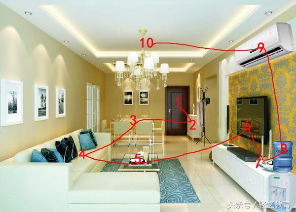
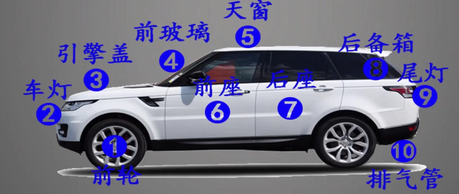
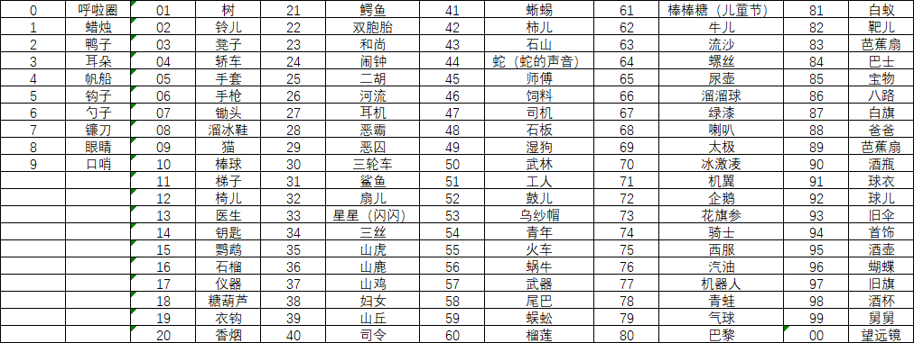
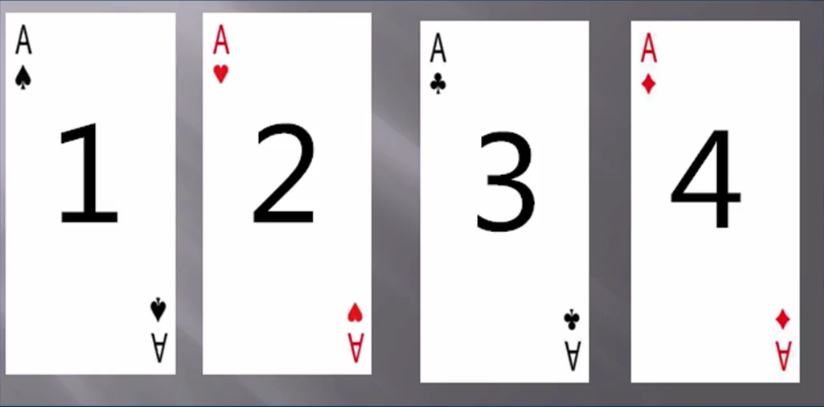
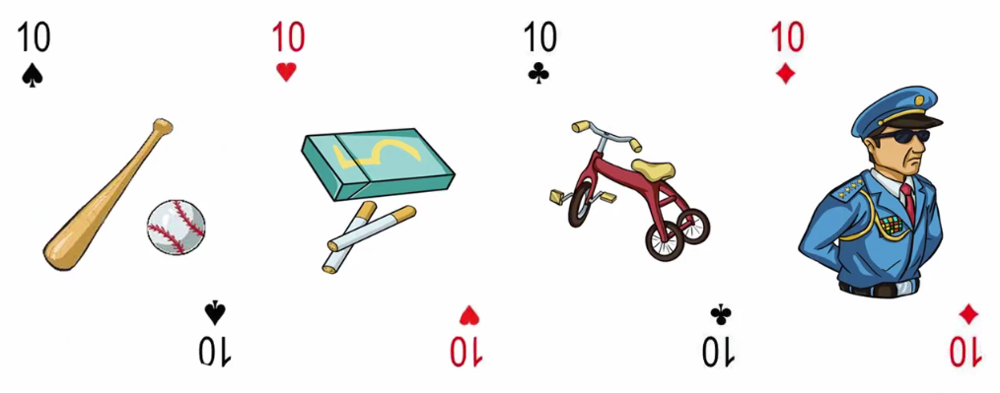
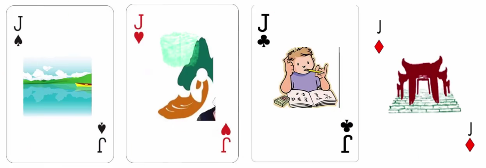
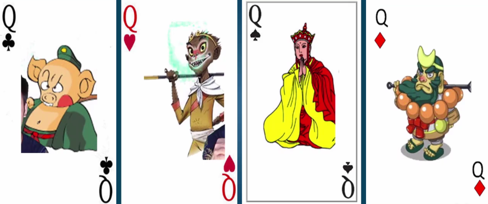
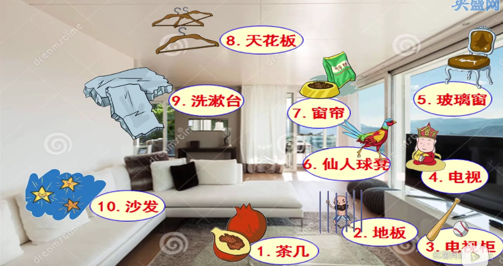

# 记忆宫殿

## 1. 什么是记忆宫殿

记忆宫殿是在头脑中建立一座宫殿，里边拜访各种物品，当我们需要记忆时，先将内容处理成图像，再跟物品联系起来，就可以用宫殿中的物品帮我们存储和管理内容。记忆宫殿这种技巧其实也不算什么稀罕事物。好多记忆方法的书都有涉及到，只是大家不叫“记忆宫殿”，而通常采用定桩法、地点法之类的称呼。

## 2. 记忆原理

通常人们对于没有规律的事物（如数字、字母、人名）都没有什么太好的方法，除了死记硬背，很难有什么有效的方法。而记忆宫殿的记忆方法通过联想的方法，可以进行快速记忆。

**1. 我们比较容易记住视觉图像**
相比其它信息而言，视觉图像是比较容易记忆的。因此，“记忆术的秘诀就在于形成一种联觉记忆方式：把大脑不容易记住的信息类型转化为擅长信息类型”。所以，所谓的“精细编码”就是把将要进入记忆的那些枯燥的信息转化为富有色彩和超级有趣的信息。

**2. 能联想起来的细节越多越好。**
尽可能是全方位的细节，视觉、味觉、听觉、触觉。通俗点讲，记忆就是在大脑中刻下印痕，这个联想的过程越具体、细节越多，印痕就越深。

**3. 想象的图片要生动、有趣、多彩、奇特**

脑袋里想象的图片越夸张，越奇特，则会更印象深刻，比如每天过一样的生活，你可能不会回忆出昨天做了什么，不过如果是去旅游，则会印象深刻，是一个道理。

## 3. 联想记忆

联想在记忆中是很重要的一点，所以需要有很好的想象力，通过几个练习来实践一下：

- 毛主席诞辰

1893 - 一把旧伞

- 同音字练习

中考、高考中，语文肯定会有下边词语中正确的一组是，如：

| 平心而论                                     | 凭心而论 |
| -------------------------------------------- | -------- |
| 正确（可以想象一下小平爷爷和我们谈话的画面） | 错误     |

| 长年累月                                 | 常年累月 |
| ---------------------------------------- | -------- |
| 正确（可以联想一下长城是长年累月造成的） | 错误     |

| 关怀备至                     | 关怀倍至 |
| ---------------------------- | -------- |
| 正确（可以想象关于关怀刘备） |          |

## 4. 记忆宫殿

想象一下，你回到家是不是要打开大门，而大门是固定不变的，所以大门作为一个桩记忆，进了大门要脱鞋放进鞋柜，鞋柜一般也是固定位置的，所以鞋柜可以作为一个桩，下一个经过的是餐桌，餐桌可以作为一个桩，以此类推，在客厅里面找到十个地点桩（注意寻找地点桩的时候要按照空间顺序来找，所有桩连起来能成一条曲线，而不是东一个西一个）下图所示为正确地点桩连接。

1. 大门
2. 鞋柜
3. 餐桌
4. 沙发
5. 茶几
6. 电视
7. 录像机
8. 饮水机
9. 空调
10. 天花板

“记忆宫殿”是一个暗喻，象征任何我们熟悉的、能够轻易地想起来的地方。而且“宫殿”并不一定仅仅指“地点”，**任何事物，只要你可以将其较为清晰地想象出来，比如汽车，家庭成员，身体部位，都可以当做宫殿。**

常见的有：

- 家里房间
  - 客厅
  - 卧室
  - 浴室
  - 厨房
  - 院子
- 学校
  - 小学
  - 初中
  - 高中
  - 大学
- 公司办公室
- 曾经旅游的地方

用事物当做宫殿

比如家里的汽车：

比如身体部位：

1. 头发
2. 耳朵
3. 眼睛
4. 鼻子
5. 嘴巴
6. 脖子
7. 肩膀
8. 胸部
9. 肚子
10. 屁股
11. 大腿
12. 小腿
13. 脚

## 5. 简单练习

记忆一组数字：26433832795028841971

- 大门 - 河流 - 26
- 鞋柜 - 石山 - 43
- 餐桌 - 妇女 - 38
- 沙发 - 扇儿 - 32
- 茶几 - 气球 - 79
- 电视 - 武林 - 50
- 录像机 - 恶霸 - 28
- 饮水机 - 巴士 - 84
- 空调 - 机翼 - 71

按回家的过程想象一下：

- 推开大门，门上画着河流
- 鞋柜上有个假山（石山）
- 餐桌旁站着一个女人
- 沙发上方着一把扇子
- 茶几上绑着气球
- 电视上正放着武林外传
- 录像机里有个恶霸的电影
- 饮水机上有个巴士的玩具车
- 抬头看了下空调，空调的出风口很像飞机的机翼

> 通过联想关联，即有了顺序又有了画面感，是不是记忆这20个数字一下容易了很多

# 故事记忆

2分钟内记忆以下词组：

篮球、飞机、墨水、阿姨、美国、蔬菜、小刀、美人、烧烤、电影院、小鸟、联合国、猪八戒、卫星、大海、兴奋、可口可乐、武汉、奥运会、跳舞、飞扬、乞丐、火星、汽车、英语、外星人、好笑、诚实、培训、脑力特训

通过编故事的方法：

- 你使劲扔了一下篮球
- 篮球飞到天上砸到了飞机
- 飞机内墨水倒了
- 墨水撒在了阿姨身上
- 阿姨正要飞去美国
- 在美国包了一片蔬菜园子
- 蔬菜园子门口有个小刀
- 小刀是美人用来做烧烤的
- 烧烤摊摆在电影院门口
- 电影院门口烟雾缭绕熏飞了小鸟
- 小鸟飞到联合国旗帜上
- 鸟屎掉在了猪八戒脸上
- 猪八戒一气之下把联合国的卫星打入了大海
- 它兴奋的喝了罐可口可乐，看了一下产地
- 可口可乐还是中国武汉厂家制造的
- 可口可乐每年都是奥运会的赞助商
- 奥运会开幕式跳舞、彩旗飞扬
- 一个乞丐上台上演讲，讲到要飞去火星开汽车，让外星人说英语
- 台下人都觉得很好笑，但是却很诚实
- 这段话是你在培训班上的脑力培特训课。

# 数字记忆编码 110 组

- 0~10

- 01~100

> 不需要一定按照表格，用自己可以快速生成图像的方法找对应数字，一般都是名词

# 百家姓记忆

01 - 赵本山拿蜡烛

02 - 卖了鸭子可以赚钱

03 - 孙悟空有顺风耳

04 - 泰坦尼克号帆船上有个小李子

05 - 用钩子吃粥（周）

06 - 用勺子吃蜈蚣

07 - 郑成功拿把镰刀

08 - 眼镜可以看到大小王

09 - 冯小刚吹口哨

10 - 陈冠希打棒球

11 - 许褚扛着梯子攻城（褚）

12 - 卫生间有把椅儿

13 - 蒋介石找医生看病

14 - 钥匙要慎重保管（沈）

15 - 鹦鹉含糖（韩）

16 - 杨贵妃吃石榴

17 - 仪器检查猪（朱）

18 - 秦始皇吃糖葫芦

19 - 衣架挂鱿鱼（尤）

20 - 许仙抽烟

21 - 河里有鳄鱼（何）

22 - 吕布有个双胞胎

23 - 和尚在雨天淋湿衣服（施）

24 - 闹钟一响，大嘴一张

25 - 孔子喜欢拉二胡

26 - 曹冲在河流里称象

27 - 耳机把耳朵捂得严实

28 - 恶霸只打劫华人

29 - 恶囚拥有黄金

30 - 三轮车胃口很大（魏）

# 三十六计

01 - 瞒天过海 - 在一片树的遮挡下，渡过海洋

02 - 围魏救赵 - 铃儿把赵本山扣起来，谁也打不着

03 - 借刀杀人 - 凳子下藏了一把刀，用来杀人

04 - 以逸待劳 - 汽车无人驾驶

05 - 趁火打劫 - 带着手套去趁人家着火去打劫

06 - 声东击西 - 东边开枪发出的声音吓死了西边的敌人

07 - 无中生有 - 明明没有东西，却拿锄头挖出了宝藏

08 - 暗度陈仓 - 趁着天黑穿着溜冰鞋把东西转移

09 - 隔岸观火 - 一只猫隔着河边看烟火

10 - 笑里藏刀 - 棒球打的球里边爆出个刀

11 - 李代桃僵 - 搭个梯子想摘李子没想到是个桃子

12 - 顺手牵羊 - 椅子上栓个羊，看没人来就顺走

13 - 打草惊蛇 - 医生去摘草药，蹦出来一条蛇

14 - 借尸还魂 - 一把神奇的钥匙可以让人复活

15 - 调虎离山 - 老虎想吃鹦鹉，鹦鹉飞走，老虎被引走

16 - 欲擒故纵 - 拿石榴给小孩让他放松警惕，然后抓住

17 - 抛砖引玉 - 拿仪器查看砖头，没想到是块玉

18 - 擒贼擒王 - 拿着糖葫芦当武器，把大王给抓住了

19 - 釜底抽薪 - 小孩拿着衣钩，从床底下翻出一堆私房钱（薪水）

20 - 浑水摸鱼 - 拿着香烟的烟丝把河水弄浑浊，趁着浑浊开始抓鱼

21 - 金蝉脱壳 - 鳄鱼吃蝉，没想到吃的是蝉壳

22 - 关门捉贼 - 双胞胎把门关上，对贼拳打脚踢

23 - 远交近攻 - 和尚住的远很友好，一串门走的进了就打架

24 - 假道伐虢 - 嫁到法国有时差，每天得看闹钟

25 - 偷梁换柱 - 把二胡的梁换掉，无法出声

26 - 指桑骂槐 - 河流旁边有桑树和槐树，泼妇指桑骂槐

27 - 假痴不癫 - 带着耳机，假装傻子，心里门清

28 - 上屋抽梯 - 恶霸上了房，抽掉梯子

29 - 树上开花 - 恶囚太饿了，连树上的花都不放过

30 - 反客为主 - 抢了三轮车，说自己是三轮车的主人

31 - 美人计 - 鲨鱼打扮成美人鱼

32 - 空城计 - 诸葛亮拿扇子

33 - 反间计 - 利用星星反间外星人

34 - 苦肉计 - 拿着三条丝巾拧成的绳抽打敌人

35 - 连环计 - 山虎一只接一只连在了一起

36 - 走为上 - 山鹿胆小，很容易逃跑

# 扑克记忆

通过给花色编号

- 黑桃A则是 11
- 红桃A则是 21
- 梅花A则是 31
- 方片A则是 41

A-9 都可以使用数字编码来记忆，10 则按照花色*10，如：

而J,Q,K 则可以另外编码

然后通过记忆宫殿进行排序

# 人物记忆

| 特点种类 |                                    |
| -------- | ---------------------------------- |
| 直观特点 | 漂亮、帅哥、胖、瘦                 |
| 性格特点 | 豪爽、搞笑                         |
| 风格习惯 | 学霸、学渣、洁癖、爱放屁、爱玩游戏 |

> 通过特点，进行联想、编故事等方法，然后链接

