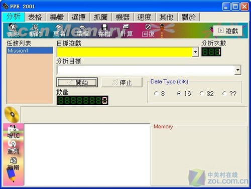
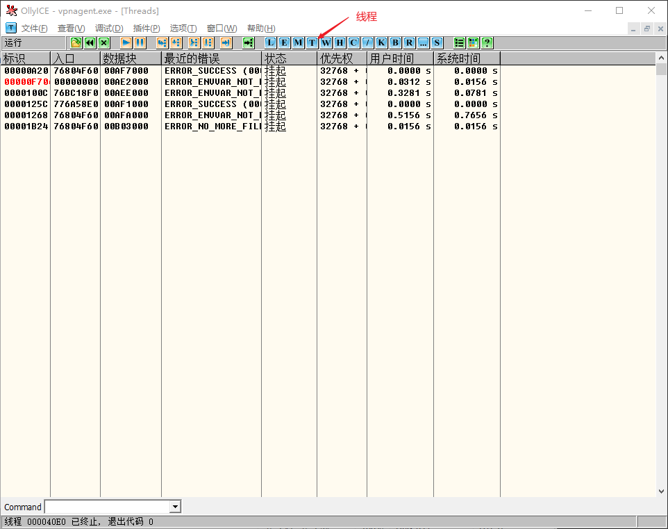
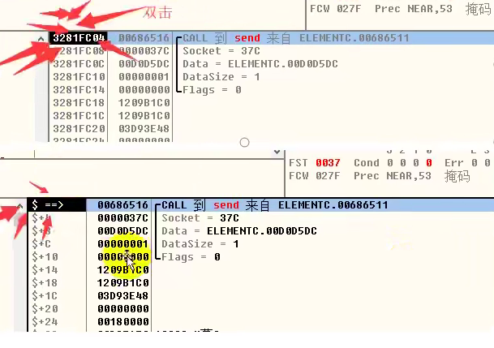
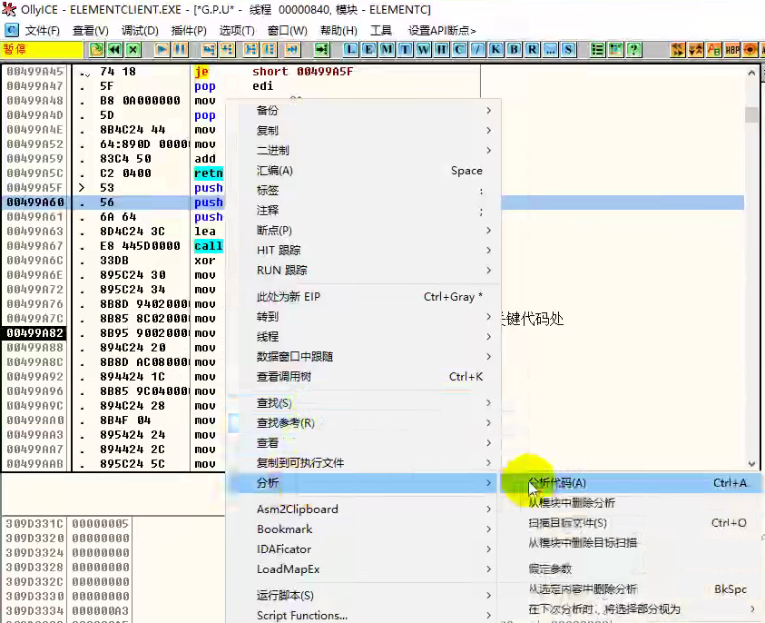
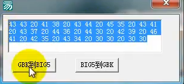

# 游戏逆向简述

网上资源虽然很多，但是很少看到有系统教学的视频或文章，之前学习逆向的时候，基本上都是由知识碎片进行拼凑，我在这里做了一个整理，让大家的学习之路更为顺畅。


教程分为四部分：

- 初识游戏逆向
- 简单游戏逆向
- 进阶游戏逆向
- 反逆向工程


前置知识：

- C 语言基础或者其他高级语言基础
- 汇编语言基础


逆向不是一个简单的知识体系，不适合想速成的人，需要不断的学习并加以练习，没有一步登天的捷径。不要天真的以为可以几个小时就可以掌握逆向的精髓。很多人把重点放在了结果上，而并不是过程上，这和我们学习的目的南辕北撤。


学习要求：

- 有天分
- 肯努力
- 有自学能力
- 会有大量时间和精力去学习和不断的练习

> 如果你不符合这些条件的话，请停止继续学习，你不可能成功的，不要浪费你自己的时间，或者我的


建议：

初学者不要试图刚开始就研究一些新游戏或者复杂游戏。应该从简到繁，比如可以从 Assault Cube 这种小游戏开始。当你掌握了技术，你就可以为所欲为了。而一款新游戏的逆向难度往往你比想象中更为困难。


学习时间表：

| 时间          | 掌握技能                                                     |
| ------------- | ------------------------------------------------------------ |
| 1 天          | 了解游戏逆向的概念，指针、基址概念                           |
| 1周           | 了解如何使用 CE，并且掌握所有功能                            |
| 2 months      | Learn C++/C# well enough to make a hello world and know the absolute basics of coding |
| 3 – 6 months  | Experienced enough to make very basic trainers in C++/C# based on stuff you find in Cheat Engine |
| 6 – 12 months | Experienced enough to make hacks without pasting, basic aimbot & ESP |
| 1 - 1.5 Years | Intermediate coding/reversing skills to hack any game you want without anticheat |
| 1.5 - 2 Years | Start reversing anticheat                                    |


最后，所有的学习资源及教程都是以学习和研究为目的，不是为了让你们做违法的事情，请谨记。


# 游戏逆向基础


## 游戏修改工具

- PC Tools
- FPE
- 金山游侠
- WPE
- Cheat Engine


https://www.jiemian.com/article/5345552.html


- PC Tools 修改游戏存档


- FPE




- 金山游侠


- WPE


- Cheat Engine


## 逆向工程工具

- Ollydbg
- IDA Pro


## 编程 IDE

- VS CODE Studio


# Cheat Engine


# Win32 入门

https://docs.microsoft.com/zh-cn/windows/win32/learnwin32/learn-to-program-for-windows


什么是句柄、Pid

句柄是WONDOWS用来标识被应用程序所建立或使用的对象的唯一整数，WINDOWS使用各种各样的句柄标识诸如应用程序实例，窗口，控制，位图，GDI对象等等。WINDOWS句柄有点象C语言中的文件句柄。


对象(object)是一件事、一个实体、一个名词，可以获得的东西，可以想象有自己的标识的任何东西。对象是类的实例化。一些对象是活的，一些对象不是。比如这辆汽车、这个人、这间房子、这张桌子、这株植物、这张支票、这件雨衣。 概括来说就是：万物皆对象。
句柄是一个标识符，是拿来标识对象或者项目的。它就像我们的车牌号一样，每一辆注册过的车都会有一个确定的号码，不同的车号码各不相同，但是也可能会在不同的时期出现两辆号码相同的车，只不过它们不会同时处于使用之中罢了


如果把对象比作人，那么对象句柄就是人的名字
这么说你明白对象句柄和对象的联系和区别了吧？


https://blog.csdn.net/weixin_30629653/article/details/99563471

https://blog.csdn.net/ceoicac/article/details/80744529?utm_medium=distribute.pc_relevant.none-task-blog-2%7Edefault%7ECTRLIST%7Edefault-1.no_search_link&depth_1-utm_source=distribute.pc_relevant.none-task-blog-2%7Edefault%7ECTRLIST%7Edefault-1.no_search_link

https://www.cnblogs.com/wxl309729255/articles/2671469.html?ivk_sa=1024320u


## 1. 使用 C++ 调用 WinAPI

- VS 创建 C++ 空项目
- 源文件中添加 main.cpp
- 引入基础 stdio.h 库 和 Windows.h 库
- 调用 Windows API 函数: DeleteFileA 删除文件
  - API 说明：https://docs.microsoft.com/en-us/windows/win32/api/fileapi/nf-fileapi-deletefilea
  - 错误说明：https://docs.microsoft.com/en-us/windows/win32/debug/system-error-codes
- getchar() 停止命令行窗口


~~~c++
#include <stdio.h>
#include <Windows.h>

int main() {
	char filePath[] = "D:\\a.txt";
	BOOL isDel = DeleteFileA(filePath);
	printf("返回值 %d 错误码 %x\n", isDel, GetLastError());

	getchar();
	return 1;
}

~~~


## 2. Windows API 中的字符集

https://www.huaweicloud.com/articles/39a1a7b50923161ed44785eba9967aaf.html

https://docs.microsoft.com/zh-cn/windows/win32/learnwin32/working-with-strings


# 创建 DLL

## 1. C++ 创建 DLL

- VS 创建 DLL 动态链接库
- 创建的 DLL 文件是定义 DLL 应用程序的导出函数

- dllmain.cpp 才是主要 dll 核心函数
  - dllmain 的函数声明
  - 函数参数（hModule、Reason）
  - 函数体中的 switch 语句（什么时候会调用 ）


~~~c++
// dllmain.cpp : 定义 DLL 应用程序的入口点。
#include "pch.h"


// 定义外部调用函数
void call() {

}

// 定义 dll 函数基本框架
BOOL APIENTRY DllMain( HMODULE hModule,
                      DWORD  ul_reason_for_call,
                      LPVOID lpReserved
                     )
{
    switch (ul_reason_for_call)
    {

            // 当进程被加载时执行 call() 函数
        case DLL_PROCESS_ATTACH:
            call();

            // 当线程被加载时执行
        case DLL_THREAD_ATTACH:

            // 当线程被结束时执行
        case DLL_THREAD_DETACH:

            // 当进程被结束时执行
        case DLL_PROCESS_DETACH:
            break;
    }
    return TRUE;
}


~~~


在导出函数中 call() 添加 MessageBox 函数

~~~C++
void call() {
    MessageBox(NULL, TEXT("弹出框内容"), TEXT("标题"), MB_OK);
}
~~~

> 给字符串添加数据类型，或者修改项目属性 - Unicode 字符集


## 2. 导出函数

DLL 导出函数实际上是给外部应用程序提供一个接口，方便外部程序调用 dll 中的具体函数


在 dllmain.cpp 中输入代码

~~~c++
extern "C" __declspec(dllexport) void call();
~~~

> 以 C 语言编译导出 dll，保证在编译过程中，编译器不会损坏函数名 call()


- `__declspec(dllexport)`，此修饰符告诉编译器和链接器被它修饰的函数或变量需要从DLL导出，以供其他应用程序使用；
- `__declspec(dllimport)`，此修饰符的作用是告诉编译器和链接器被它修饰的函数或变量需要从DLL导入，它在后面也会被用到。
- void call()，它就是需要被其他程序调用的函数


如果使用 c++ 形式导出 dll 的话，需要查看被重新编译的函数名，参考：

https://blog.csdn.net/freeking101/article/details/104632710/


严谨一点的话，需要做到代码分离：

- firstdll.h 头文件， 放在头文件集合中，声明需要导出的函数接口
- dllmain.cpp， 用来声明 dll 函数的调用事件
- firstdll.cpp，用来声明需要实现被声明的函数


firstdll.h 

~~~cpp
#pragma once
#include <iostream>

extern "C" __declspec(dllexport) void call();
~~~


firstdll.cpp

~~~cpp
#include "pch.h"
#include "firstdll.h"

void call() {
    MessageBox(NULL, TEXT("弹出框内容"), TEXT("标题"), MB_OK);
}
~~~


## 3. 静态库/动态库

静态库和动态库的区别来自链接阶段如何处理库，链接成可执行文件


静态库：是因为在链接阶段，会将汇编生成的目标文件 .o 与引用到的库一起链接打包到可执行文件中。因此对应的链接方式称为静态链接。其实一个静态库可以简单看成是**一组目标文件（.o/.obj文件）的集合**，即很多目标文件经过压缩打包后形成的一个文件。

- 静态库对函数库的链接是放在编译时期完成的。
- 程序在运行时与函数库再无瓜葛，移植方便。
- 浪费空间和资源，因为所有相关的目标文件与牵涉到的函数库被链接合成一个可执行文件。 


### 3.1. 静态调用

- 创建一个新的空项目：Console
- 添加 main.cpp
- 引入 stdio.h 库 和 windows.h 库


将 FirstDll.dll 链接到 Console 这个工程项目中；

~~~c++
#pragma comment(lib, "FirstDll")
~~~


告诉编译器和链接器被 `__declspec(dllimport)` 修饰的函数或变量需要从DLL导入

~~~c++
extern "C" __declspec(dllimport) void call();
~~~


然后在主函数中就可以调用 dll 中定义的函数了，如：

~~~cpp
#include <stdio.h>
#include <Windows.h>

// 链接 dll 文件
#pragma comment(lib, "FirstDll")

// 引入 dll 文件中函数
extern "C" __declspec(dllimport) void call();

int main() {	

    // 调用 dll 中的函数
	call();      
    
	getchar();
	return 1;
}

~~~


编译的时候需要将 FirstDll 项目中的 lib 静态库复制到 Console 项目中

运行的时候需要 FirstDll 项目中的 dll 动态库文件复制到 Console 的 Debug 目录中


### 3.2. 动态调用

动态调用不是在链接时完成，而是在运行时完成调用。


在 console.sln 中，定义一个函数指针

~~~c++
typedef void(*PMessage_Box)();
~~~


#### LoadLibrary()

Loads the specified module into the address space of the calling process. 

~~~cpp
HMODULE LoadLibraryA(
  LPCSTR lpLibFileName
);
~~~


**Parameters**

~~~
lpLibFileName 
~~~

lpLibFileName can be either a library module (a .dll file) or an executable module (an .exe file). 


**Return value**

If the function succeeds, the return value is a handle to the module. If the function fails, the return value is NULL. 


然后使用 LoadLibrary 函数调用 dll 模块，返回一个句柄

~~~cpp
HMODULE hModule = LoadLibrary(L"FirstDll.dll");
~~~


当返回值如果是 NULL 的话，表示没有获取句柄，做一下错误提示

~~~cpp
if (hModule == NULL)
{
    MessageBox(NULL, L"句柄出错", L"标题", MB_OK);
    return -1;
}
~~~


#### GetProcAddress()

Retrieves the address of an exported function or variable from the specified dynamic-link library (DLL).

~~~cpp
FARPROC GetProcAddress(
  HMODULE hModule,
  LPCSTR  lpProcName
);
~~~


**Parameters**

```
hModule
```

A handle to the DLL module that contains the function or variable. The [LoadLibrary](https://docs.microsoft.com/en-us/windows/desktop/api/libloaderapi/nf-libloaderapi-loadlibrarya), [LoadLibraryEx](https://docs.microsoft.com/en-us/windows/desktop/api/libloaderapi/nf-libloaderapi-loadlibraryexa), [LoadPackagedLibrary](https://docs.microsoft.com/en-us/windows/desktop/api/winbase/nf-winbase-loadpackagedlibrary), or [GetModuleHandle](https://docs.microsoft.com/en-us/windows/desktop/api/libloaderapi/nf-libloaderapi-getmodulehandlea) function returns this handle.


```
lpProcName
```

The function or variable name, or the function's ordinal value. If this parameter is an ordinal value, it must be in the low-order word; the high-order word must be zero.


**Return value**

If the function succeeds, the return value is the address of the exported function or variable.

If the function fails, the return value is NULL. 


通过 GetProcAddress 函数获取 dll 模块中函数在内存中的地址

~~~cpp
PMessage_Box pMsg = (PMessage_Box)GetProcAddress(hModule, "call");
~~~

> hModule 是 LoadLibrary 读取 dll 获取的句柄，而 call 是dll 中定义的函数

返回值是地址，所以需要用函数指针指向它，用  (PMessage_Box) 将地址转换为函数，并且将函数赋值给 pMsg


然后直接调用 pMsg 函数即可

~~~cpp
pMsg();
~~~


完整代码

~~~c++
#include <stdio.h>
#include <Windows.h>

// 定义一个指向函数的指针
typedef void(*PMessage_Box)();

int main() {	

	// 将指定的模块加载到调用进程的地址空间中
	HMODULE hModule = LoadLibrary(L"FirstDll.dll");

	// 判断句柄是否为空
	if (hModule == NULL)
	{
		MessageBox(NULL, L"句柄出错", L"标题", MB_OK);
		return -1;
	}

	// 从指定的动态链接库（DLL）中检索导出的函数 ccc 地址
	PMessage_Box pMsg = (PMessage_Box)GetProcAddress(hModule, "call");
	pMsg();
	return 0;
}

~~~


# 工具使用

## 1. 使用工具查看导出函数

EXEInfoPE, StudyPE+ x86, CFF Explorer, PEditor 1.7

52pojie.com 工具包


## 2. 使用工具注入

HideToolz3.0

C++ 生成需要修改 项目属性-运行库- 多线程/MT


# DLL 注入

所谓注入就是在第三方进程不知道或者不允许的情况下将模块或者代码写入对方进程空间，并设法执行的技术。已知注入方式：

- 远程线程注入
- APC 注入
- 消息钩子注入
- 注册表注入
- 导入表注入
- 输入法注入


## 1. 远程线程注入

### 1.1 远程线程注入概要

远线程注入技术：强制给目标程序的进程中创建一个线程，将 DLL 加载进去，这里需要使用几个函数

- CreateRemoteThread() 创建在另一个进程的虚拟地址空间中运行的线程
- OpenProcess() 获取目标程序进程句柄
- LoadLibrary() 获取 dll 句柄
- VirtualAllocEx() 给目标进程分配内存空间
- WriteProcessMemory() 在分配空间中写入数据


3个文件：

- dll 注入文件（包含需要运行的函数）
- 注入器（通过该注入器，将 dll 文件注入到目标进程中）
- 测试的目标程序


FirstDll.dll

在 switch 流程控制中的 `case DLL_PROCESS_ATTACH`，在加载时运行 dll 中的函数

~~~cpp
#include "pch.h"
#include <stdio.h>

void call() {
    // 在控制台中循环输出 Hello YP
    for (int i = 0; i < 1000; i++) {
        Sleep(1000);
        printf("Hello YP\n");
    }

}

// dll 函数基本框架
BOOL APIENTRY DllMain( HMODULE hModule,
                       DWORD  ul_reason_for_call,
                       LPVOID lpReserved
                     )
{
    switch (ul_reason_for_call)
    {    
    // 当进程被加载时执行 call() 函数	
    case DLL_PROCESS_ATTACH:
        call();        
    case DLL_THREAD_ATTACH:
    case DLL_THREAD_DETACH:
    case DLL_PROCESS_DETACH:
        break;
    }
    return TRUE;
}


~~~


Test.exe

一个循环输出 Hello World 控制台程序

~~~cpp
#include <stdio.h>
#include <Windows.h>

int main() {	

	for (int i = 0; i < 1000; i++) {
		Sleep(1000);
		printf("Hello World\n");
	}

	return 0;

}
~~~


### 1.2 注入器 Injector.exe

注入器注入流程：

- 通过 OpenProcess() 获取目标程序的进程句柄
- 通过 LoadLibrary() 获取 dll 句柄，这个 LoadLibrary 需要在目标进程中执行，所以需要使用 VirtualAllocEx() 将参数放在目标进程内存中，当执行 LoadLibrary 时，可以读取参数。
- GetProcAddress() 获取 LoadLibrary 函数在内存中的地址
- WriteProcessMemory 拷贝 DLL 路径名字到目标进程的内存
- CreateRemoteThread() 通过读取目标进程句柄，在目标进程中创建线程


#### 1.2.1 CreateRemoteThread()

所有的其他函数都是为了 CreateRemoteThread() 函数服务的，该函数作用就是在进程中读取函数中在内存中的地址，传递函数参数，并在进程中创建一个线程，然后执行该函数。

~~~cpp
HANDLE CreateRemoteThread(
  HANDLE                 hProcess,
  LPSECURITY_ATTRIBUTES  lpThreadAttributes,
  SIZE_T                 dwStackSize,
  LPTHREAD_START_ROUTINE lpStartAddress,
  LPVOID                 lpParameter,
  DWORD                  dwCreationFlags,
  LPDWORD                lpThreadId
);
~~~


- hProcess 目标程序的进程句柄
- lpThreadAttributes 安全描述符可以忽略，给默认 NULL 就可以了
- dwStackSize 堆栈的初始大小，如果此参数为0，则新线程使用可执行文件的默认大小，直接写 0 就可以了
- lpStartAddress 远程进程中线程的起始地址，该函数必须存在于远程进程中，类型必须为 LPTHREAD_START_ROUTINE
- lpParameter 指向要传递给线程函数的变量的指针
- dwCreationFlags 控制线程创建的标志，值为 0 时，线程在创建后立即运行
- lpThreadId 指向接收线程标识符的变量的指针。如果此参数为 NULL，则不返回线程标识符


返回值：

- 如果函数成功，则返回值是新线程的句柄
- 不成功，返回 NULL


所以需要我们提供的几个参数为

~~~cpp
CreateRemoteThread(目标进程句柄, NULL, 0, dll线程在目标进程中的起始地址, 指向要传递给线程函数的变量的指针, 0, NULL);
~~~

> 实际上我们需要提供的就是只有3个参数


#### 1.2.2 OpenProcess()

OpenProcess() 获取目标进程句柄

~~~
HANDLE OpenProcess(
  DWORD dwDesiredAccess,
  BOOL  bInheritHandle,
  DWORD dwProcessId
);
~~~


参数：

- dwDesiredAccess 访问权限，PROCESS_ALL_ACCESS （为获得所有权限）
- bInheritHandle 是否继承，选择 FALSE 不继承
- dwProcessId 进程id，即 Pid


~~~cpp
void injector(int pid) {
	HANDLE hProcess = OpenProcess(PROCESS_ALL_ACCESS, FALSE, pid);
}
~~~


#### 1.2.3 GetProcAddress()

获取 LoadLibrary 内存地址的方法：

- 通过 GetProcAddress() 获取内存地址
- 因为 LoadLibrary 这个函数是调用的 WinAPI，只要在 Windows 中，就会调用 KERNAL32.DLL 中的 LoadLibrary 函数，所以所有的 LoadLibrary 函数地址其实是相同的。可以通过 DTDebug 查看


DTDebug 查看 LoadLibrary 函数

- 拖拽 EXE 文件到 DTDebug
- E
- 双击 kernel32.dll
- CTRL + N
- 排序找 L ，就可以看到 LoadLibraryA 的地址


没有 LoadLibrary 函数，之前使用的 LoadLibrary 函数其实是 define 定义的宏（别名），可以查看 WINBASE.H 中有定义

~~~
#ifdef UNICODE
#define LoadLibrary LoadLibraryW
#else
#define LoadLibrary LoadLibraryW
#endif
~~~

> 如果项目是 UNICODE 就是 W，否则是 A

> 结论：在注入器获取到的 LoadLibraryA 函数的地址就是目标进程中 LoadLibraryA 中的地址


使用 GetProcAddress() 获取 LoadLibraryA 地址

~~~cpp
// 获取 Kernel32.dll 的句柄
hModule = GetModuleHandle("Kernel32.dll");

// 获取 LoadLibraryA 的函数地址
dwLoadAddr = (DWORD)GetProcAddress(hModule, "LoadLibraryA");

// 也可以转换成 CreateRemoteThread 中参数的指定类型
LPTHREAD_START_ROUTINE lpStartAddress = (LPTHREAD_START_ROUTINE)GetProcAddress(hModule, "LoadLibraryA");
~~~


至此代码：

~~~cpp
void injector(int pid) {
	// 获取目标进程句柄
	HANDLE hProcess = OpenProcess(PROCESS_ALL_ACCESS, FALSE, pid);
	// 获取 Kernel32.dll 句柄
	HMODULE hModule = GetModuleHandle(L"Kernel32.dll");
	// 通过 Kernel32.dll 句柄获取 LoadLibraryA 函数地址
	LPTHREAD_START_ROUTINE lpStartAddress = (LPTHREAD_START_ROUTINE)GetProcAddress(hModule, "LoadLibraryA");
}
~~~


LoadlibraryA 函数的地址已经拿到了，实际上已经可以调用该函数，但是我们之前使用 LoadLibrary() 函数的时候，需要指定 dll 文件，所以这里我们需要处理一下 CreateRemoteThread 中的 lpParameter 参数，这个参数实际上就是传递给 LoadLibrary 的参数。


LoadLibrary() 中的参数是一个路径，但是传递过来的变量需要是一个指针，也就是说这个路径必须是在写内存当中，我们需要把内存中存放这个路径的地址放到 lpParameter 参数当中。


#### 1.2.4 VirtualAllocEx()

VirtualAlloc 函数是在本程序中开辟内存，而 VirtualAllocEx 可以让我们的注射器在目标进程中开辟一块内存

~~~
LPVOID VirtualAllocEx(
  HANDLE hProcess,
  LPVOID lpAddress,
  SIZE_T dwSize,
  DWORD  flAllocationType,
  DWORD  flProtect
);
~~~


- hProcess ，目标进程的句柄，之前使用 OpenProcess 已经获取到了 hProcess
- lpAddress，为要分配的空间指定所需起始地址的指针，设置为 NULL，让函数寻找可分配空间
- dwSize， 分配空间的大小（也就是我们路径字符串的大小）
- flAllocationType， 类型， MEM_COMMIT
- flProtect， 保护参数，内存分配区域的权限，PAGE_READWRITE（可读写）


返回值：

- 成功，返回内存基址
- 失败，返回 NULL


路径长度：

~~~cpp
path = strlen(Path)+1
~~~


在目标进程中分配一块路径长度大小的内存空间

~~~cpp
LPVOID lpParameter = VirtualAllocEx(hProcess,NULL,strlen(path)+1, MEM_COMMIT, PAGE_READWRITE);
~~~

 

#### 1.2.5 WriteProcessMemory()

有了空间大小，需要使用 WriteProcessMemory() 将路径字符串写入到内存中

~~~
BOOL WriteProcessMemory(
  HANDLE  hProcess,
  LPVOID  lpBaseAddress,
  LPCVOID lpBuffer,
  SIZE_T  nSize,
  SIZE_T  *lpNumberOfBytesWritten
);
~~~


- hProcess, 目标进程句柄
- lpBaseAddress，指向指定进程中写入数据的基地址的指针（内存位置），也就是我们刚刚分配的内存空间地址
- lpBuffer， 指向包含要写入指定进程地址空间的数据的缓冲区的指针（写入的数据）
- nSize，要写入指定进程的字节数（写入的大小）
- *lpNumberOfBytesWritten 可选参数，一个指向接收传输到指定进程的字节数的变量的指针。NULL 忽略


返回值：

- 成功，非0
- 失败，0


~~~cpp
// 写入路径
WriteProcessMemory(hProcess, pMemAddress, path, strlen(path) + 1, NULL);
~~~


#### 1.2.6 注入器完整代码

~~~cpp
#include <stdio.h>
#include <Windows.h>

void injector(int pid, char* path) {
	// 获取目标进程句柄
	HANDLE hProcess = OpenProcess(PROCESS_ALL_ACCESS, FALSE, pid);
	// 获取 Kernel32.dll 句柄
	HMODULE hModule = GetModuleHandle(L"Kernel32.dll");
	// 通过 Kernel32.dll 句柄获取 LoadLibraryA 函数地址
	LPTHREAD_START_ROUTINE lpStartAddress = (LPTHREAD_START_ROUTINE)GetProcAddress(hModule, "LoadLibraryA");
	// 申请内存空间
	LPVOID pMemAddress = VirtualAllocEx(hProcess,NULL,strlen(path)+1, MEM_COMMIT, PAGE_READWRITE);
	// 写入路径
	WriteProcessMemory(hProcess, pMemAddress, path, strlen(path) + 1, NULL);
	// 远程线程注入
	CreateRemoteThread(hProcess, NULL, 0, lpStartAddress, pMemAddress, 0, NULL);
}


int main() {
	injector(7552, (char*)"D:\\FirstDll.dll");
	getchar();
	return 0;
}
~~~


### 1.2 防阻塞（感觉没什么卵用）

使用 WaitForSingleObject() 函数防止程序阻塞

~~~
DWORD WaitForSingleObject(
  HANDLE hHandle,
  DWORD  dwMilliseconds
);
~~~

- hHandle， 线程或进程的句柄
- dwMilliseconds 等待时间，INFINITE 为无限等待，直到线程执行完毕


返回值：

- 成功，新线程的句柄
- 失败，NULL


也就是说，如果我们的远程注入函数 CreateRemoteThread() 函数出现问题，会卡住程序，不会返回新的句柄（信号），这时候我们给我们的注入线程添加一个等待时间，比如2秒后，会自动返回该函数。也就解决了卡死的问题。


~~~cpp
// 防止阻塞
WaitForSingleObject(hThread, 2000);

// 关闭句柄
CloseHandle(hProcess);
CloseHandle(hThread);
~~~


### 1.3 卸载本地 DLL

当注入器把 DLL 文件注入到目标进程后，即使 dll 中的函数执行完毕，dll 还是存在于程序之中。而很多软件已经做了监测程序（扫描不属于自己的线程），如果 DLL 一直存在，则会被杀掉或进入黑名单。


使用 FreeLibrary() 卸载 dll

~~~cpp
FreeLibrary(dllThread);
~~~


卸载自己程序中的 DLL 

~~~cpp
#include <stdio.h>
#include <Windows.h>

typedef void(*PMessage_Box)();

int main() {	
	HMODULE hModule = LoadLibrary(L"FirstDll.dll");
	if (hModule == NULL)
	{
		MessageBox(NULL, L"句柄出错", L"标题", MB_OK);
		return -1;
	}
	
	PMessage_Box pMsg = (PMessage_Box)GetProcAddress(hModule, "call");
	pMsg();
    
    // 完成函数后卸载 LoadLibrary 加载的 DLL
    FreeLibrary(hModule);
	return 0;
}

~~~


### 1.4 卸载远程 DLL

使用 CE 加载目标进程

- 查看内存
- 计算 DLL's 和符号
  - 查看 FirstDLL.dll 的内存地址
  - 查看 KERNEL32.DLL 中的 FreeLibrary 函数地址


~~~cpp
void unInjector(int pid) {
	
	HANDLE hProcess = OpenProcess(PROCESS_ALL_ACCESS, FALSE, pid);

	// 获取 FirstDLL 内存地址
	LPVOID pMemAddress = (LPVOID)0xFF50000;;
	// 获取 FreeLibrary 函数地址
	LPTHREAD_START_ROUTINE lpStartAddress = (LPTHREAD_START_ROUTINE)0x76DA4970;
	// 通过远程线程，调用 Freelibrary(FirstDLL) 卸载 DLL
	HANDLE hThread = CreateRemoteThread(hProcess, NULL, 0, lpStartAddress, pMemAddress, 0, NULL);

	WaitForSingleObject(hThread, 2000);
	CloseHandle(hProcess);
	CloseHandle(hThread);

}

int main(){
    unInjector(9416);
}
~~~


卸载远程注入的 DLL

1、CreateRemoteThread将GetModuleHandle注入到远程线程中，参数为被注入的Dll名

2、GetExitCodeThread将线程退出的退出码作为Dll模块的句柄值

3、CreateRemoteThread将FreeLibraryA注入到远程进程中，参数为第二步获得的句柄值

4、WaitForSingleObject等待对象句柄返回

5、CloseHandle关闭线程及进程句柄


## 2. Hook 注入

Windows 操作系统是事件驱动的。事件被包装了消息发送给窗口，比如点击菜单，按钮，移动窗口等这些动作都是消息事件


键盘按键消息处理过程：

- 当按下键盘时，会产生一个键盘按下的消息，这个消息首先被加入到系统消息队列中
- 操作系统从消息队列中读取消息，添加到相应的程序的消息队列中
- 程序自身通过 GetMessage 获取消息，DispatchMessage 函数分发消息，通过消息回调函数处理消息


Hook 就是从系统消息队列到应用程序消息队列之前，对消息进行一个劫持，处理之后再扔给下一个消息钩子或者交给应用程序的消息回调函数处理消息


完成 hook 涉及到的 API

- SetWindowshookEx  设置消息钩子
- CallNextHookEx  将消息钩子传递给当前钩子链中的下一个子程序
- UnhookWindowsHookEx  卸载钩子


编写消息钩子需要将设置钩子的函数写在 dll 里边，当勾住一个线程后，产生消息时，加入系统发现包含钩子的 dll 不在本进程当中，系统会将 dll 强行加载进去，这是一种 dll 注入手段


## 3. IAT Hook


## 4. inline Hook


# OllyDbg 断点分析

- CE 查找人物属性
- 分析人物属性结构
- 分析动作断点


## 1. OllyDbg 界面

不管是用吾爱破解的 OllyDbg 还是 OllyICE，都是在 OD 的基础上做了增强功能，随便哪个版本都可以


- 代码窗口
- 寄存器窗口
- 数据窗口
- 堆栈窗口


## 2. 简单断点分析

### 2.1 附加进程

- 使用 OD 打开程序
- 或者使用 OD 文件 -> 附加 -> 指定进程


附加进程完成后，会自动暂停程序，进入调试模式，如果需要恢复程序运行，需要点击运行，或 F9

如图：


| 按钮 | 快捷键 | 说明         |
| ---- | ------ | ------------ |
| 运行 | F9     | 恢复进程运行 |
| 暂停 | F12    | 暂停进程     |


点击 E 按钮可以打开进程加载模块列表


| 按钮 | 快捷键  | 说明         |
| ---- | ------- | ------------ |
| E    | Alt + E | 打开模块窗口 |

> 就是附加进程所需要加载的所有模块（EXE 或 DLL）


按钮 T 则是打开线程，当无法恢复运行的时候，可以尝试恢复所有线程




退出附加进程，在 CPU 窗口右键选择->StrongOD->Detach


### 2.2 断点调试

找到喊话的 Call 函数，因为是网络通信，所以我们我们需要借助 Windows API 中的 send 函数，来进行断点调试。

> 当 send 函数无法找到时，可以试一下 WS2_32.send （send 函数存在于 WS2_32.DLL 模块中），有可能是开发者为了防止逆向


右键单击，在弹出菜单中选择转到表达式，或使用快捷键 CTRL + G ，作用是直接跳转到指定地址或 API 函数处


双击空白处，可以添加注释


在内存地址处右键弹出菜单中选择断点->切换，或快捷键 F2 即可下断点


> 下断点之后，只要程序运行 send 函数，则会被 OD 暂停进程


调试->执行到返回或使用快捷键 CTRL + F9，则会跳到上一层调用该函数的地方，类似于嵌套函数，比如：

~~~cpp
int main(){
    fun1(){
        fun2(){
            fun3(){
                send(){                    
                }
            }
        }
    }    
}
~~~

> CTRL+ F9 就是跳转到 fun3，fun2，fun1 一层一层网上找


我们找到大概 6 个执行该函数的地方，依次给6个跳转下断点


~~~
00686511 call <jmp.&WS2_32.#19>
0067ABDD call call 006863B0
0067D58A call call 0067ABA0
006055C6 call call 0067D4E0
0059D0FD call call 00685590
0059160B call call 00590BZ0
~~~

> 减号键 `-` 可以跳到上一层调用


这些 CALL 可以通过 按钮 B 来查看所有的断点，可以通过双击来跳入断点代码


然后通过按钮 C 可以返回主窗口


我们现在需要找到喊话的 call，那么当我们没有喊话时，断点被触发的 call 则会被排除。把这些 call 的断点取消，以此类推，我们可以简单的判断出哪些 call 是无效 call，最终我们找到 3个 call 是喊话时断下来的 call


通过观察，可以查看 call 的层级来推测函数被调用的过程

- 第6个call最先被触发（最外层函数）
- 第5个call第二个被触发（中间层）
- 第4个call第三个被触发（最里层）


快速找 call 方案：

- Ctrl + G，通过 send 函数下断点
- K 按钮显示调用堆栈
- 双击调用来自即可跳入 call 的内存地址


### 2.3 单步调试

单步步入和单步步过都是执行下一条指令，只有在执行 call 的时候才有区别：

- 单步步入
  - 执行下一条指令，如果执行指令是 call 时，则进入 call 指令，执行 call 中第一条代码
- 单步步过
  - 当执行指令是 call 时，直接运行 call 指令中包含的所有代码，而不进入 call 指令进行调试


### 2.4 心跳包

由于网游的特性，客户端会不间断的与服务器发送一些数据包，比如：

- 公告
- 检测玩家在线状态
- 获取人物坐标
- 判断与怪的距离


这些数据也是通过 send 函数发送给服务端的，但是这些数据属于干扰数据，最常见的干扰数据就是检测人物状态函数发送的数据包，我们管这类数据包叫做心跳包。


同样，在 send API 下断点，然后在下方双击




双击后，将地址转换为 OFFSET 模式显示：

`3281FC04 + C ` 就是 DataSize 的地址，地址中存放着 DataSize 的值为1

而在断点右侧，可以看到相关寄存器的数据，3281FC04  正是 ESP 寄存器存放的地址，所以 DataSize 的值可以用以下表达式来表示

~~~
[ESP + 0x0C]
~~~


查看 send API 函数

~~~
int send(
  SOCKET s,
  const char FAR* buf,
  int len,
  int flags
);
~~~

> 可以看到， send API 对应的几个参数都在这里显示，而 DataSize 就是 len 的参数值


当 send 被下断点时，发现 DataSize 值也不断变化，通过观察，看到当 DataSize 值小于 6 的时候，都会被断，而我们没有进行任何的游戏操作，可以判定，当 DataSize 值小于6的时候，这些 send 函数发送的包都是无效包，我们通过条件断点来下断点，如：


条件为：

~~~
[ESP+0x0C]>0x05
~~~

> 16进制，此时，所有 DataSize 小于6的值都会被过滤掉，不会触发断点，只有当 DataSize值大于6的时候才会触发断点。


也可以加逻辑判断，如：

~~~
[ESP+0x0C]>0x05 && [ESP+0x0C]<0x12
~~~


这时候，心跳包应该已经过滤的差不多了，此时再执行汉化或吃药动作，可以判断出函数发送包的大小

~~~
DataSize = B
~~~


再用条件断点验证一下

~~~
[ESP+0x0C] == 0x0B
~~~


### 2.5 直接执行函数

由于函数嵌套的关系，所以我们可以通过调用 call 的方式直接触发我们想要的效果，比如分解装备：


~~~cpp
装备萃取(){
    显示装备萃取进度条(){
        Sleep(5000);
        萃取();
    }
}
~~~

> 通过调用萃取函数，我们直接可以达到萃取目的而不用等待读取进度条


通过注入器，将 call 代码注入到进程中


# DLL 注入游戏修改窗口标题

通过注入，调用 Windows API 函数来修改目标进程的窗口标题，需要用到的 WinAPI

- SetWindowTextA 更改窗口标题
- FindWindowA 查找窗口并返回窗口句柄


FindWindowA 

- VS 2019 中可以使用 SPY++ 查看窗口标题或类名


# 汇编基础

## 1. 寄存器

| 寄存器   | 说明                                                         |
| -------- | ------------------------------------------------------------ |
| eax      | 存放 call 返回值                                             |
| ecx      | 对象，返回值                                                 |
| ebx, edx | 执行速度较快，数据                                           |
| eip      | 指令指针寄存器，代码寄存器（指向我们将要执行的代码的内存位置） |
| esp      | 栈顶指针                                                     |
| ebp      | 栈底指针                                                     |


## EAX

EAX 32 位寄存器，将 EAX 拆分可以分为 AX, AH, AL


- ax 低 16 位
- ah 高 8 位
- al 低 8 位


~~~
00 01 02 03 04 05 06 07 08 09 0A 0B 0C 0D 0E 0F
| ----      AX     ---- | --  AL -- |--  AH  --|
~~~


## 2. mov, lea

mov 指令将值放在寄存器中，如：

~~~assembly
mov eax, 1
~~~

> 将数据1储存在寄存器 eax 中


如果跟的是 [地址]

~~~assembly
mov eax, [0x40000000]
~~~

> 将地址中的值取出来，放入 eax 中


lea，取地址，如：

~~~assembly
lea eax, [0x00401000]
~~~

> 将 0x00401000 存放在 eax 中


## 3. add, sub

add 加法操作

~~~assembly
add eax, 1
~~~

> 将 eax 值加1，即 eax = eax + 1


sub 减法操作

~~~assembly
sub eax, 1
~~~

> 将 eax 值减一，即 eax = eax - 1


## 4. push, pop

push 将数据压入栈中

~~~assembly
push ebp
~~~


执行过程：

~~~assembly
sub esp, 4
mov [esp], ebp
~~~

- esp 寄存器存储值为当前栈顶端地址
- sub esp, 4 相当于将栈顶端地址减去4个字节，移动栈的顶端地址
- 然后将 ebp 的值，放到 esp 这个地址中


pop 将数据从栈中弹出

~~~assembly
pop ebx
~~~


执行过程：

~~~assembly
mov ebx, [esp]
add esp, 4
~~~

- esp 寄存器存储值为当前栈顶端地址
- 将栈顶端地址中的数据从栈中取出，并放入 ebx 寄存器中
- add esp, 4 将栈顶端地址向下移动4个字节，移动栈顶端位置


## 5. jmp retn

jmp 跳转到指定内存地址

~~~
jmp 0079FA34
~~~

> 跳转到 0079FA34


## 6. call

call 指令代表执行一段函数

~~~assembly
0079FA34    E8 578FFEFF     call    00788990
~~~

> 执行 00788990 处的代码


call 处断点


- EIP 指向 0079FA34 也就是我们下断点的位置，所以 EIP 存放的是即将要执行代码的内存起始地址


步入 call 处 eip 与 栈中的变化


- EIP 存放着的是指向 push -1 指令的内存地址
- 栈中被 push 了一条数据，指向 0079FA39，也就是第一张图没进入 call 之前的下一条指令的内存地址


call 指令原理：

~~~
push 进入 call 之前的下一条指令的 EIP
jmp 本条指令的 EIP
~~~


## 7. retn 返回

~~~
retn
~~~

> 从 call 中返回（call 执行完毕，进入 call 之前的下一条指令）


retn 指令原理

~~~
jmp 当前栈保存的 EIP 地址（也就是说进入 call 压入的地址）
pop EIP
~~~


有的 retn 带参数，如：

~~~
retn 10
~~~


相当于，给 esp 做了一个 add 方法

~~~
jmp eip
add esp, 10
pop eip
~~~


# CE

类似于金山游侠的内存工具，用于搜索进程中的数据变化


## 1. CE 界面


## 2. 附加进程

点击搜索按钮，选择附加进程


## 3. 扫描数据

数据类型：

- byte （一般为 0 或 1，表示人物的 BOOL 状态，如：在水中，飞行中）
- 4字节 32位程序 DWORD
- 8字节 64位程序
- 浮点型（小数类型，一般搜索血量、速度、坐标等需要精度比较高的数据）
- 双精度
- 字符串扫描（针对文字扫描）
  - 有些数值不可写入（需要取消掉可写搜索选项）
  - 字符是否是 Unicode 字符集
- 字符数组（特征码扫描）
- 分组（以对象形式搜索）
- ALL 全部扫描


扫描方式

- 精确扫描
- 模糊扫描（变大或变小）
- 未知扫描（针对异或加密数据，只搜索变化数据）


内存范围

可以在指定内存范围中，进行搜索


快速扫描

- 地址对齐（可被指定数字整除）
- 最后数字（地址末尾数值为指定数字）


## 4. 搜索基址

通过搜索血量，改变血量变化，找到血量内存地址，然后选择查看谁访问了此数据


查看谁访问了该地址


> 打开记事本或者，选择 CE 中的 Table Extra 打开附加表单，可以做些笔记


黑色数据：动态地址（内存每次分配的空间不一样，地址不同）

绿色数据：静态地址（内存每次分配空间一样，地址相同）


只有全局变量才是静态地址，所以如果不想每次都搜索数据的话，那么我们需要通过动态地址，往上一层一层寻找，直到找到静态地址，然后通过偏移量，指向动态地址。


随便从访问该数据的地址中拿出一条，如：

~~~
004911A0 - 8B 8D 98020000  - mov ecx,[ebp+00000298]
~~~

> 这条指令代表从 ebp + 00000298 地址中的值传递给 ecx


00000298 即为偏移量，是从哪偏移的呢？是从 ebp 这的地址开始偏移的，ebp 的值已经在 CE 中写出来了


这里我们记录一下：

~~~
[3FB50060 + 298]
~~~


通过 HEX 搜索该地址


> 左侧出现很多数据，我们按照第一部搜索步骤，继续找是否有其他进程访问该内存


注意：

- 不要找 mov 相同寄存器的，因为相同寄存器传值只会陷入死循环，如 mov eax, [eax + 24]
- 也不要寻找如下所示， mov [esp+24], ecx 的，因为这里的接受的地址是有偏移的，避免计算

> 解释一下：你自己搜索的地址就是寄存器的地址，而寄存器相同的话，那么相当于你又搜索了一遍你刚才搜索的内存地址，而 mov [esp+24], ecx 这种类型是将 ecx 地址给 [esp + 24]，这个 [esp + 24] 就是我们刚才搜索的地址


继续寻找


此时的偏移量应该是：

~~~
3FB50060 + 298 -> [06481C68 + 2C] + 298
~~~


直到找到静态地址（绿色）


找到静态地址并不是说已经完成了，而是我们接近了，继续循环步骤


此时的偏移量应该是：

~~~
3FB50060 + 298 -> [06481C68 + 2C] + 298 -> [[00E61B40 + 20] + 2C] + 298
~~~


有的时候会出现空白数据，也就是说没有任何访问，那么这条地址可以放弃掉，继续找其他数据分析


最终我们找到一条结果，它的寄存器传送的是静态地址，这个地址就是我们所要寻找的基址


所以最终的偏移量应该是

~~~
3FB50060 + 298 -> [06481C68 + 2C] + 298 -> [[[00E5DCF8] + 20] + 2C] + 298
~~~


通过 CE 手动添加内存地址，填写偏移量，就可以拿到我们从基址转换过来的血量地址


# OD 数据挖掘

## 1. OD 寻找基址

目前从 CE 搜索基址中我们可以看到 CE 还是有些缺陷的，比如搜索的数值结果太多，mov eax, [eax + 020] 这种无法分析这种问题，我们可以通过 OD 来进行辅助。通过 OD 中的 Command 命令


- dd dword
- db byte


首先我们需要利用 CE 找到人物血量的内存地址，这里我们重新找一下 `3F2C98A8`


输入 dd + 血量内存地址，可以在数据区中跳转到指定地址，可以进行数据的修改


在数据区也可以进行断点，是对数据进行断点，只要数据被访问就会触发断点（和代码断点不同）

- 内存访问（有游戏保护，不建议使用）
- 内存写入（有游戏保护，不建议使用）
- 硬件访问
- 硬件写入
- 硬件执行

> 硬件访问类似于 CE 中的基址搜索


下断点后，血量数据被访问后会触发断点，在代码区的上一条就是我们需要查看的偏移量


点 edi 就会把所有的 esi 关键词高亮显示（需要插件）

往上搜索，可以看到 esi 的值是通过 ecx + 0x2C 传递过来的，然后我们再找 ecx 是 eax 传递的，发现 eax 来自 eax + 1C 这个偏移量，然后再找 eax，找到基址


即：

~~~
[[[0xE5DCF8 + 0x20] + 0x2C] + 0x298]
~~~


取消硬件断点


dd 到我们的血量动态地址

~~~
[[[0E5DCF8 + 0x20] + 0x2C] + 0x298]
~~~

> 注意需要在地址前加 0 （插件 BUG）


## 2. ebp 和 esp

ebp 为栈底指针，esp 为栈顶指针，当搜索基址时，有时候会有 

~~~
ecx, [ebp, esp + 28C]
~~~


在这里需要看一下寄存器和栈区，通过 esp 获得栈顶地址，在栈区中查看底部有多少偏移，通过 esp + 偏移，如果不等于 ebp 的话，那么这里我们搜索的值则为偏移值。否则这条数据是迷惑数据。


## 3. retn

当碰到 retn 的时候，如果碰到 retn ，需要分析 retn 下的代码是否属于另外一个函数



> 如果分析代码后，还是属于同一函数，则可以继续向上查找


这里的 retn 就和下边代码属于同一个函数，je 代表跳转实现，在高级语言中可以看做 if 跳转


如果不属于同一个函数的话，经常出现的情况是寻找基址偏移寄存器的时候，在函数内部的寄存器无法找到，就需要 CTRL + F9 跳出 call ，然后继续向上寻找偏移寄存器


## 4. call

例如下边这条指令, `mov edi,eax`，需要继续向上寻找 eax，但是 CD5A94 却不是我们所要寻找的基址


原因是因为在 `mov edi, eax` 上边有一条 call 指令，而 eax 应该是在 call 中拿到的，所以我们需要步入 call （按回车）查找 eax 的值。


## 5. 其他技巧

右键查找 -> 所有常量

输入血量地址，即可搜索所有访问过该地址的内存


返回注释：

右键 -> 查找 -> 用户定义注释


注意搜索的时候，需要匹配进程分配的内存，如果超出则无法调试


## 6. 分析

通过分析蓝量，我们可以看到蓝的地址为

~~~
红 [[[0E5DCF8 + 0x20] + 0x2C] + 0x298]
蓝 [[[0E5DCF8 + 0x20] + 0x2C] + 0x29B]
~~~

> 只相差4个字节


基地址可以看做是人物结构的地址


用 dd 跳转到红的地址 `[[[0E5DCF8 + 0x20] + 0x2C] + 0x298]`，然后把地址转为偏移模式，将数据显示为10进制数据，可以发现，这些都是人物的数据


# 游戏文本编码

游戏中的文本，在程序运行时，这些文本也会被加载到内存当中


游戏中常见文本编码方式：

- ASCII
- UNICODE
- UTF-8
- BIG5


## 1. CE 搜索文本

通过 CE 搜索 ASCII 无结果（大部分现代游戏都已经采用了支持更多字符的 Unicode 字符集（UTF-8），除了字符集，还需要考虑文本是否可写


> 通过修改值，可以看到游戏中的文本已经被改变


## 2. 搜索 Hex 文本

有时候，使用 CE 无法搜索到文本，就需要使用 OD 中的 SrongOD 插件进行辅助


> 这个功能类似于 C++ 中的 VirtualAlloc，在进程中分配一块虚拟内存


之后会自动跳转到被分配的虚拟内存地址


使用 CE 手动添加地址，类型选择为 Text，并且设置为 Unicode 格式，字节数应该大于数据本身长度


然后双击添加的内存地址，将值改为需要搜索的值，并且将数据类型改为字符数组类型，此时可以看到字符串已经变为了 16进制 数据


拿到字符数组后，我们通过字符数组类型模式扫描，一般就会出现结果了


添加到记录，然后将数值类型再改回字符串类型，就会将字符数组转换为字符串了


## 3. BIG5 码

需要使用工具将简体的数组字符串值，转换为繁体数组字符串值




## 4. UTF-8

输入中文后，选择数组字符串，然后在值的后边加上 00 即是 UTF-8 


## 5. 追踪文本

移动到栈区，然后进入最外层 call（回车）


22222 是我们要寻找的文本，最后压入栈的数据为第一个参数


# 堆栈基础

堆栈：按照某种方式顺序排列的数据结构


## 1. Call 和堆栈平衡

任何程序中，任何 call 函数的调用，都遵循堆栈平衡的原则，在调试中，简单来说就是 ESP 不能发生变化

- 一个正常的程序，每个函数的 ESP 都不会发生变化
- 认为调用 call，使它堆栈的 ESP 不变化 -> 堆栈平衡，也叫作平栈


如：调用一个函数，其 ESP 为 0x20

~~~
sub esp, 0x10
mov eax, 1
~~~


此时的 ESP 发生了变化，就没有保持堆栈平衡，程序肯定会崩溃，为了保持平衡，需要添加代码

~~~
add esp, 0x10
~~~


## 2. 内平栈

~~~
// SEND 函数开始，push 都是传递参数
push 0
push 1
push 00d0d5dc
push ecx
call <jmp.&WS2_32.#19>
~~~


连续 push 了 4 个参数到栈中，也就是说栈的地址向上移动了 16 个字节，即 0x10，跳入 call 内部，可以看到最后 retn 10，而 retn 10，相当于

~~~
add esp, 10
~~~


这种在函数内部做堆栈平衡的行为，称之为内平栈


## 3. 外平栈

当使用注入器调用 call 函数的时候，就需要将 esp 做堆栈平衡，所以光调用参数和 call 还不够，还需要将 esp 也还原

~~~
push edx
call ebp
add esp,4
~~~


## 4. 堆栈区操作

- ESP 代表栈顶
- 双击转换为偏移模式
- 栈顶上方的数据 -4，-8，是已经被 pop 出的数据
- 栈底部结束的地址为 EBP，本层函数的栈底指针（有时候也只是一个普通寄存器）


## 5. EBP 寻址

63 集


# 过驱动保护

- 程序名改为 cssrss.exe
- 把 Pass-TP.exe 拖进 OD ，会暂停保护
- 此时进游戏就会过掉保护


# 内存代码编写


# 附录：

- 游戏经常崩溃建议上 StrongOD 插件
- OD 高亮插件


ref：https://www.cnblogs.com/iBinary/
